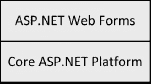
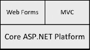

# 三、了解 ASP.NET 的背景

ASP.NET 是一个*框架*，或者工具包，用于创建*网络应用*。这些是在网络上运行的应用，主要(但不是唯一)是用户使用 web 浏览器通过内部网或互联网与服务器通信。在这一章，我会给你一个关于 ASP.NET 的高层次概述，并解释我是如何将关键元素映射到这本书的不同部分的。

### ASP.NET 概述

Web 应用有特殊的需求。浏览器的工作方式、HTTP(大多数 web 应用运行的协议)的性质以及服务器与客户端的分离都影响着 web 应用和 web 应用编程的性质。ASP.NET 提供了我们需要的功能来满足这些特殊的需求，并创建一个我们可以使用 web 技术交付的应用。

ASP.NET 并不是一项新技术。ASP.NET 1.0 是作为更广泛的。十多年前的. NET 框架。在 ASP.NET 1.0 推出时，Visual Basic 是编程世界的主导力量，微软创建了 ASP.NET，将 Visual Basic 编程模型引入 web 开发世界，包括拖放控件、事件和设计图面等概念。这些特性被包装在一个名为 Web Forms 的特性集中(我在本书的第三部分中介绍过)，基于这样一个想法，即开发人员不需要直接了解或控制底层的 HTML 和 HTTP。

这在今天看起来可能是一个奇怪的概念，因为几乎每个开发人员都至少掌握了 HTTP 和 HTML 的基本知识，但在当时这是非常有意义的。有大量的 Visual Basic 开发人员，微软希望通过向他们提供基于现有经验的 web 开发工具来保护这一细分市场。

 **注**我指的 Visual Basic 模型，不是指语言本身；相反，我指的是 Visual Basic 程序员使用的方法、工具和环境。自从引入. NET 以来，Visual Basic 语言一直在挣扎。许多程序员转向了 C#，为 Visual Basic 留下了细分市场。净减少很多。

《ASP.NET 1》引入了一些支撑所有版本《ASP.NET》的核心主题，包括最新版本《ASP.NET 4:

*   它与科学有着密切的联系。NET 框架:ASP.NET 与。NET 框架，这样 ASP.NET 应用就可以在。NET 运行库和。ASP.NET 程序员可以使用. NET 框架(LINQ、实体框架、自动垃圾收集等等)。
*   *ASP.NET 应用被编译*:我们混合使用带注释的 HTML 和 C# 类来构建 ASP.NET 应用。但是所有的东西，包括带标记的 HTML，都被编译成。NET 类来提高性能。
*   Visual Studio 为 ASP.NET 提供全面的支持:我们创建 ASP.NET 应用，就像我们创建任何其他类型的 Visual Studio 项目一样。它支持智能感知、调试、打包和部署，就像支持其他应用类型一样。您可以选择在 Visual Studio 之外构建一个 ASP.NET 应用，但是这样做要困难得多。
*   ASP.NET 支持所有人。NET 框架语言:尽管 C# 已经成为主流。NET 语言，我们可以使用. NET 支持的任何语言编写 ASP.NET 应用。NET 和 F#。微软曾短暂尝试在。NET，包括 Ruby 和 Python，不过那个好像最近死了。
*   *ASP.NET 与 IIS 紧密结合*:要部署和运行 ASP.NET 应用，你真的需要使用 IIS，这是微软的网络应用服务器。IIS 仅适用于 Windows，并且在 Windows Server 上效果最好。在拥抱 ASP.NET 的过程中，你采用了微软的一整套工具。它们是非常好的工具，但是没有任何多样性。

如果你做过任何其他类型的。NET 开发，这些主题将使你更容易学习 ASP.NET 编程。工具非常相似，创建和管理项目的方法是相同的，当然，在编写 web 应用的代码段时，C# 是一种熟悉的语言。

### ASP.NET 的结构

自从 ASP.NET 第一次发布以来，它已经发生了变化，WebForm编程模型的重要性已经降低。我们可以将 ASP.NET 分为两个部分:WebForm和核心平台，如图 3-1 所示。

***图 3-1。**将 ASP.NET 分离为核心平台和 WebForm*

虽然我在图中已经清楚地区分了，但是核心平台和 WebForm之间的分离实际上是很容易渗透的。核心平台最初是为了支持 WebForm而设计的，所以即使我们只使用核心平台的特性，我们也在采用一些 WebForm的特性。

这种分离是有用的——不管它可能定义得多么糟糕——是因为 ASP。NET:*MVC 框架*。MVC 框架(MVC 代表模型-视图-控制器)遵循一种与 WebForm非常不同的开发风格，因此我们与应用生成和使用的 HTML 和 HTTP 密切相关。这意味着我们必须重塑 ASP.NET 图，如图[图 3-2](#fig_3_2) 所示。

***图 3-2。【ASP.NET T2】增加 MVC***

随着 MVC 框架的加入，我们可以在两种完全不同的 web 应用开发方法中进行选择。这两种方法都可以利用底层核心平台的特性。

#### 核心 ASP.NET 平台

作为其发展的一部分，ASP.NET 已经拓宽了支撑 ASP.NET 应用的核心功能集。这些特性包括标准化的错误处理、为浏览器请求提供服务的页面隐喻、状态管理特性，以便我们可以在一系列无状态 HTTP 请求之间建立连续性，支持创建 XML 和 JSON web 服务，以及管理我们的 web 应用呈现给世界的 URL 的特性。

从 ASP.NET 版本 4 开始，Visual Studio 创建了内置 jQuery 支持的 ASP.NET 项目，jQuery 是一个流行的 JavaScript 库。我将 jQuery 作为核心平台特性之一，因为它可以被 WebForm和 MVC 框架应用使用。

您需要掌握核心的 ASP.NET 特性，以充分利用 WebForm和 MVC 框架。核心平台支持的特性非常广泛，正如我将在本书的第二部分向您展示的那样，它们可以用来创建自己的 web 应用。

#### 网络表单

WebForm是一组用户界面控件，构建于核心 ASP.NET 平台之上，用于创建应用开发的经典 Visual Basic 风格。尽管这种开发方式背后的思想已经过时，但是使用 WebForm和相关的 Visual Studio 支持来创建应用仍然有很多好处。

自从引入 MVC 框架以来，WebForm已经淡出了人们的视线。这是一个遗憾，没有反映 ASP.NET 开发的现实，即绝大多数 ASP.NET 应用是使用 WebForm创建的。

除了隐藏细节的 WebForm设计理念之外，还有一些额外的限制。首先，Web Forms 通过将隐藏数据嵌入到发送给浏览器的 HTML 表单中来创建有状态的应用。数据量会显著增长，这使得复杂的 WebForm应用不适合面向 Internet 的应用(尽管这在内部网中很少成为问题，因为内部网的带宽更充足、更便宜)。

第二个缺点是，在 WebForm应用上执行单元测试几乎是不可能的。单元测试是一个在 ASP.NET 发布后成为主流的概念，除了集成测试之外，几乎没有其他可用的支持。

第三个缺点，也是我认为最严重的，是 WebForm应用很难长期维护。WebForm将开发人员推向的应用模型意味着标记、应用状态和数据模型模糊在一起，这反过来又意味着大多数大型 WebForm应用逐渐变成一片混乱的代码，并且更改通常会产生意想不到的(和不希望的)效果。这并不是说不能做，但是如果长期维护对你很重要(而且在大多数情况下都应该如此)，那么你使用 MVC 框架可能会更好。

但是在 WebForm的世界里，这并不全是坏事。它们在世界各地被广泛使用，因为它们简单易学，允许快速开发，并且包含主流 web 开发中出现的每种常见场景的功能。在我看来，WebForm开发的最佳点是快速原型和短期(但迫切需要)的 Web 应用。不管出于什么原因，如果单元测试和维护不是优先考虑的事情，那么 WebForm会非常强大。我建议你阅读那些涉及 WebForm的章节，即使你购买这本书是为了了解 MVC 框架。WebForm对于试验不同的用户体验方法和一般的概念验证工作非常有用。

#### MVC 框架

MVC 框架是一种非常现代的方法，是由诸如 Ruby on Rails 等框架的广泛采用所驱动的。MVC 框架非常适合构建需要长期维护的大规模应用，但是它包含了许多新的概念。NET 开发人员等有一个相对较大的前期投资。

与 WebForm的关键区别在于，MVC 框架开发人员应该对 HTML 和 HTTP 有全面的了解。这里没有隐藏细节。这对于开发人员来说要求更高，但它导致应用更适合 HTTP 的性质，并允许对生成并发送到浏览器的 HTML 的完全灵活性。

MVC 框架是围绕一种叫做 MVC 的设计模式构建的，MVC 代表模型-视图-控制器。您将我们的应用分成这三个区域，称为*关注点*，通过这种分离，您创建了更易于测试和维护的应用。我将在[第 22 章](22.html#ch22)中解释更多关于 MVC 模式以及它是如何反映在 MVC 框架中的。您不需要全面了解 MVC 模式来编写 MVC 框架应用，但是它确实有助于理解为什么在 MVC 框架 web 应用中事情是这样操作的。

除了要求开发人员学习新概念之外，MVC 框架的主要缺点是在 web 应用成形之前还需要一段时间。前期投资更大。对于将会存在一段时间的应用来说，这是一种明智的投资，因为这种投资通过使应用更易于维护而在长期内产生回报。但是如果你想做一个简单的演示，那么 Web Forms 提供了一个更好的前景。

我很喜欢 MVC 框架，但我也喜欢 WebForm。成功的关键是了解各自的优势和劣势，并对两者都有足够的了解，以便能够随意在它们之间切换。这是本书的目的。

### 了解相关技术

我已经描述了 ASP.NET 的主要组件，但是在开始 web 应用开发时，您将会遇到许多相关的技术。在下面的章节中，我将描述一些最广为人知的故事，并解释它们与 ASP.NET 和本书的关系。

#### 动态数据

许多 web 应用的存在只是为了提供对数据库的访问。没有这样的应用逻辑，只有一组基于网格和基于表单的网页与一组数据库表之间合理的直接映射。

动态数据是添加到 ASP.NET 版本 4 中的一组特性，特别是允许这种应用的快速开发，但它并没有真正流行起来。我认为这是因为它介于 WebForm和 MVC 框架之间。如果您打算学习一种新的 web 应用开发方法，您可能会学习 MVC 框架。正是由于这种缺乏广泛采用的情况，我在本书中省略了动态数据应用，这样我就有更多的空间来关注 space 的其他部分。

#### 银光

Silverlight 是微软对 Adobe Flash 的回应，旨在提供丰富的浏览器体验，并与其他。NET 技术和语言。最近，微软宣布，它将专注于 HTML5 作为其丰富网页的首选方法，而将 Silverlight 作为 Windows Phone 产品的开发平台。我没有在本书中涉及 Silverlight，尤其是因为它有成为利基平台的危险。如果你对 Silverlight 开发感兴趣，我推荐 C# 的 *Pro Silverlight 4，由 Matthew MacDonald 编写，Apress 出版。*

#### HTML5

HTML5 是一个新兴的网页标准，它消除了 HTML 版本 4 中的一些重复和冗余，并加入了一些新的交互功能。微软已经开始在 space 增加对 HTML5 元素的基本支持，但这还处于早期阶段，HTML5 还需要一段时间才能成熟——微软在这个领域提供可靠的工具还需要更长的时间。我在本书中没有涉及 HTML5，但是如果你对进一步的细节感兴趣，我推荐我的另一本书，*html 5 的权威指南*，也是由 Apress 出版的。

#### jQuery 和 ASP.NET Ajax

jQuery 是一个流行的 JavaScript 库，它简化了 JavaScript 的使用，隐藏了浏览器之间的许多不一致，并拥有丰富的插件功能生态系统。从 ASP.NET 4 开始，微软已经接受了开源的 jQuery，它包含在所有的 ASP.NET 4 项目中。我在第 10 章和第 11 章[中讨论并演示了 jQuery。MVC 框架的第 3 版依靠 jQuery 来交付不引人注目的客户端验证和 Ajax，我将分别在第 29 章](11.html#ch11)和第 30 章的[中解释这一点。](29.html#ch29)

jQuery 取代了 ASP.NET Ajax 库。这是由微软开发的，但是很难正确使用，并且产生了一些非常混乱的网页。您仍然可以选择使用 ASP.NET AJAX，但是 jQuery 更容易使用，更灵活，生成的网页也更简洁。

#### IIS 和 Windows Server

ASP.NET 应用部署到 Internet 信息服务(IIS)中。IIS 包含在许多不同的 Windows 版本中，包括一些工作站产品，尽管 IIS 将在工作站上处理有限数量的并发请求。

对于严肃的应用，您需要使用 Windows Server。在第 32 章中，我将向您展示如何准备 Windows Server 2008 R2(我撰写本文时的最新版本)，在第 33 章中，我将向您展示如何使用 Visual Studio 将 ASP.NET 应用部署到 IIS。

### 总结

在这一章中，我列出了 ASP.NET 不同地区的一些背景以及它们是如何融合在一起的。我解释了 Web Forms 是如何被设计成将经典的 Visual Basic 开发方法应用到 Web 应用中的，以及 MVC 框架是如何抛弃这一点以遵循一种完全不同的方法。我还提到了一些通常与 ASP.NET 相关的技术，并解释了您可以在本书或其他地方找到更多细节的地方。

有了序言，我们就可以认真开始开发了。在下一章，我将向您介绍第*页*，这是 ASP.NET 平台的核心概念之一。