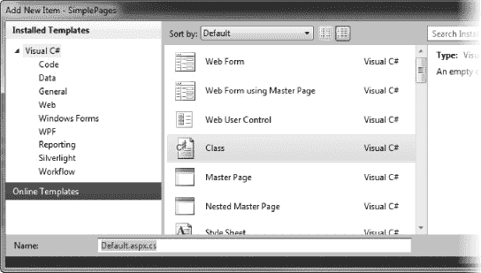

# 四、使用页面

大多数 ASP.NET web 应用的主要目标是生成将在 web 浏览器中显示的 HTML 内容(尽管您可以使用 ASP.NET 生成其他类型的数据，您将在后面的章节中了解到)。

在这一章中，我们将看看 ASP.NET 为生成 HTML 提供的核心机制:*ASP.NET 网页*。很好地把握这个话题是对 ASP.NET 整体理解的一大步，你会惊讶于这一切是多么简单而优雅。

我们将从一个简单的 HTML 文件开始，探索结合 C# 和 HTML 在浏览器中生成相同结果的不同方法。使用动态内容特性来复制静态 HTML 可能看起来很奇怪，但是它为逐步引入 C# 以编程方式生成内容提供了一个很好的基础。在后面的章节中，我们将基于这些技术产生真正动态的内容。在这里，我们将从基础开始。

### 【Pages 入门

在这一章中，我们将从一个空项目开始，手动向其中添加项目。要创建项目，请按照下列步骤操作:

1.  在 Visual Studio 中，选择文件新建项目。这将打开新项目对话框。
2.  Click the Visual C# templates in the Installed Templates section, select the Web category, and then click the ASP.NET Empty Web Application template.

     **注意**“新建项目”对话框中显示的模板集合将根据您安装的 Visual Studio 版本和您在安装过程中选择的选项而有所不同。注意选择正确的模板。还有一些名字相似的，很容易挑错。还要确保您已经从 Visual C# 类别中选择了模板。您将看到每个模板都有相同的名称。您已安装的. NET 语言。在我们学习下面的章节时，我们将使用大多数其他的 C # ASP.NET 模板，但是你现在可以忽略它们。

3.  Set the name of the project as `SimplePages`, as shown in [Figure 4-1](#fig_4_1). 

    ***图 4-1。**创建一个空的 ASP.NET 项目*

4.  单击“确定”按钮创建项目。
5.  Select View  Solution Explorer. In the Solution Explorer, you can see the items that have been added to the project, as shown in [Figure 4-2](#fig_4_2). As this is an empty project, Visual Studio creates only the bare essentials. 

    ***图 4-2。**空项目的内容*

如果你曾经使用 Visual Studio 创建过其他类型的。NET 项目。`Properties`项包含项目的设置——构建选项、部署配置等等。`Web.config`文件包含我们的 ASP.NET 应用的配置信息。这类似于`App.config`，如果你已经使用 Visual Studio 创建了其他类型的。NET 应用。`References`项包含对。我们的项目需要运行的. NET 程序集。

### 添加网页

ASP.NET 的一个基本概念是*以编程方式生成的网页*，通常被称为*动态网页*，或者简称为*动态页面*。动态页面将程序逻辑(在我们的例子中是 C# 代码)与 HTML 混合在一起，创建将在客户端浏览器中显示的内容。这种页面是动态的，因为会针对每个浏览器请求评估网页的代码部分，从而允许您生成不同的内容。这与静态内容形成对比，比如常规的 HTML 文件或图像文件，其中相同的内容总是被发送到用户的浏览器。

ASP.NET 支持两种不同但相关的结合程序逻辑和 HTML 的模型:使用代码块或使用代码隐藏文件。我们将在本章中探讨这两种技术。

奇怪的是，从动态网页开始最好的地方是一个普通的 HTML 文件。这有两个原因:

*   我们将一次探索一个特性，Visual Studio 为动态页面提供的模板对要使用的特性做了一些假设。
*   在静态页面中引入动态元素可以让您看到静态内容和动态内容之间的密切关系，并且正如您将发现的那样，强调了静态内容在动态页面中的重要作用。

#### 创建 HTML 文件

若要将 HTML 文件添加到 Visual Studio 项目中，请按照下列步骤操作:

1.  选择项目添加新项目。
2.  从“添加新项目”对话框的“Web”类别中选择 HTML 页面模板。
3.  Set the name of the page to `Default.html`, as shown in [Figure 4-3](#fig_4_3). As you will see throughout this book, ASP.NET has a number of naming conventions that most web application projects follow. These are optional, but following them can have some benefits. Not only will other developers recognize the purpose of files or directories with certain names, but Visual Studio will as well. Also, some convenience features work based on these conventions. The first such convention is that the starting point for your web application is a page called `Default`, which is why our HTML page is called `Default.html`. 

    ***图 4-3。**向项目添加一个 HTML 页面*

     **提示**您可能已经注意到，Visual Studio HTML 文件模板的默认文件扩展名是`.htm`。这是 Windows 只能处理三个字母的文件扩展名的历史遗留问题。我使用更传统的四字母扩展名`.html`，它不仅更具描述性，而且与用于其他 ASP.NET 文件类型的扩展名一致，比如`.aspx`。如果您遇到任何涉及 HTML 页面的问题，首先要检查的是文件扩展名。通常情况下，你会发现你引用了一个使用`.html`扩展名的页面，但是你创建了一个使用`.htm`扩展名的文件。

4.  单击“确定”关闭“添加新项目”对话框并创建 HTML 文件。
5.  Edit the contents of the file so that they match the HTML shown in [Listing 4-1](#list_4_1).

    ***清单 4-1。**一个简单的 HTML 文件*

    `<!DOCTYPE html PUBLIC "-//W3C//DTD XHTML 1.0 Transitional//EN"
     "http://www.w3.org/TR/xhtml1/DTD/xhtml1-transitional.dtd">
    <html >
    <head>
        <title>My Web Page</title>
    </head>
    <body>
        
` `        Here are some numbers I like:
            <ul>
                <li>0</li>
                <li>1</li>
                <li>2</li>
                <li>3</li>
            </ul>
        

        

            Here are some things I like to do:
            <ol>
                <li>Swim</li>
                <li>Cycle</li>
                <li>Run</li>
            </ol>
        

        

            Here is an image:
            
        

        

            <a href="SecondPage.html">This is a link to another page</a>
        

    </body>
    </html>`

这个 HTML 页面包含一个数字列表、一个活动列表、一个图像和一个到另一个页面的链接。在我们查看这个页面之前，我们需要将图像和第二个 HTML 页面添加到我们的项目中。

 **提示**我不打算在本书中深入讨论 HTML。如果你有 HTML 的基础知识，你就能很好地理解书中的例子。如果你是 HTML 新手，或者想巩固你的知识，我建议你阅读大卫·舒尔茨和克雷格·库克的《用 CSS 和 XHTML 开始 HTML with)。我还建议查看那些吸引你眼球的网站的 HTML 源代码。所有主流的网络浏览器都会让你检查网页上的 HTML，这是一个很好的方式来观察网站是如何构建的。

##### 添加第二个 HTML 页面

要向项目中添加新的 HTML 文件，请按照下列步骤操作:

1.  选择项目添加新项目。
2.  在“添加新项目”对话框中，从“Web”部分选择 HTML 页面模板。
3.  将新页面命名为`SecondPage.html`。
4.  单击添加创建文件。
5.  Edit the contents of the new file to match [Listing 4-2](#list_4_2).

    ***清单 4-2。**添加第二个 HTML 文件*

    `<!DOCTYPE html PUBLIC "-//W3C//DTD XHTML 1.0 Transitional//EN"
     "http://www.w3.org/TR/xhtml1/DTD/xhtml1-transitional.dtd">
    <html >
    <head>
        <title>My Second HTML File</title>
    </head>
    <body>
        

            Here are some colors I like:
            <ul>
                <li>Green</li>
                <li>Red</li>
                <li>Yellow</li>
                <li>Blue</li>
            </ul>
        

    </body>
    </html>`

这是一个包含颜色列表的简单文件。

##### 添加图像

按照惯例，图像存储在一个单独的目录中，通常称为`Images`。您可以在项目目录中创建此文件夹，并引用其中包含的图像，而无需将它们添加到 Visual Studio 项目中。然而，我更喜欢将我的 web 应用的所有文件(包括静态内容)作为我的项目的一部分。一个原因是它允许我对所有文件使用 Visual Studio 版本控制支持。

在向项目中添加外部内容时，Visual Studio 有点挑剔。如果您选择项目添加现有项目，您可以选择您的图像文件，但它们将被添加到您的项目中，与您的 HTML 文件处于同一级别。我发现这令人困惑，因为图像文件在磁盘上的位置没有改变，所以项目在磁盘上的布局与解决方案资源管理器窗口中显示的布局不匹配。

相反，我更喜欢先创建一个目录，方法是选择项目新文件夹，并给它命名为`Images`。这将在磁盘上创建一个目录，我可以在那里复制我的图像文件。然后，我在解决方案浏览器中选择`Images`文件夹，选择项目 Add Existing Item，并选择 my images。这提供了一个与文件在磁盘上的排列方式相匹配的项目视图，如图[图 4-4](#fig_4_4) 所示。

***图 4-4。**向项目添加图像*

**了解页面引用**

我建议您在项目中引用内容时不要使用绝对路径。例如，我的图像文件的绝对路径是`Context\repository\Source Code\04 - Working with Pages\SimplePages\Images\triathlon.png`中的`C:\Users\Adam\Documents\Books\ASP.NET`。我可以在 HTML 文件中使用这个路径来引用图像，但是如果我这样做了，当我将项目部署到服务器时就会出现问题，除非我使用完全相同的路径。许多项目部署到属于第三方托管公司的服务器上，您通常无法控制项目部署到的路径。

若要避免这个问题，请使用相对于项目或相对于文件的引用，如下所示:

*   一个*项目相对参考*以`/`字符开始，比img/triathlon.png`。如果您使用这种引用方式，ASP.NET 将从您项目的根文件夹开始，在名为`Images`的文件夹中寻找名为`triathlon.png`的文件。
*   一个*文件相关引用*省略了`/`字符，如在`img/triathlon.png`中。如果使用这种引用，ASP.NET 将在包含页面文件的文件夹中查找名为`Images`的文件夹和其中的`triathlon.png`文件。您可以使用文件相对路径来导航项目的目录结构。例如，`../img/triathlon.png407.90`将从页面文件向上两级寻找`Images`文件夹。

#### 查看 HTML 文件

要查看 HTML 文件，在解决方案浏览器中右键单击`Default.html`,并从弹出菜单中选择 View in Browser。这将在浏览器窗口中显示 HTML 页面—浏览器取决于您的系统配置。我的首选浏览器是 Google Chrome，因为它被设置为我的 Windows 默认浏览器，所以这是 Visual Studio 显示内容的地方。您可能会认出图 4-5 中的[窗口标题。](#fig_4_5)

***图 4-5。**显示 HTML 文件*

通过右击页面并选择“浏览方式”菜单项，可以更改 Visual Studio 使用的浏览器。你会看到一个对话框，列出你电脑上所有可用的浏览器，如图 4-6 所示。

***图 4-6。**选择在 Visual Studio 中使用的浏览器*

通过选择该窗口并单击“设为默认值”按钮，可以使用该窗口设置默认的 Visual Studio 浏览器。在[图 4-6](#fig_4_6) 中，我选择了作为 Visual Studio 一部分的内置浏览器。这是基于 Internet Explorer 的，也是我在本书中使用的浏览器。您也可以选择不同的浏览器只查看一个页面一次，这在您想要比较不同浏览器显示相同页面的方式时非常方便。

当您选择在浏览器中查看时，一个 ASP.NET 开发服务器图标会出现在您的 Windows 任务栏上，并带有一个气球，如图[图 4-7](#fig_4_7) 所示。

***图 4-7。ASP.NET 开发服务器***

Visual Studio 包括一个全功能的 ASP.NET 服务器，它在您查看项目中的页面时启动。所谓*全功能*，我的意思是开发服务器实现了所有的 ASP.NET 功能。然而，它没有实现生产 web 应用服务器所需的所有特性。为此你需要互联网信息服务(IIS)(这将在[第 32 章](32.html#ch32)和[第 33 章](33.html#ch33)中讨论)。尽管如此，能够直接从 Visual Studio 项目在开发机器上测试 web 应用还是非常有用的。

从[图 4-7](#fig_4_7) 中的气球可以看到，开发服务器正在我的机器上监控端口 1939。端口是随机选择的，所以您会看到使用了不同的端口号。如果你查看[图 4-5](#fig_4_5) 中的浏览器窗口，你可以看到加载我们的 HTML 页面的 URL 使用了那个端口。名称`localhost`指的是本地机器，所以测试我们的 HTML 页面的 URL 是`[http://localhost:1939/Default.html](http://localhost:1939/Default.html)`。如果点击页面底部的链接，ASP.NET 开发服务器将请求第二个静态的 HTML 文件并显示在浏览器中，如图[图 4-8](#fig_4_8) 所示。

***图 4-8。**显示第二个 HTML 文件*

如果您的 Visual Studio ASP.NET 项目中有许多页面和其他项，那么在解决方案资源管理器中搜索要查看的页面、右击它并选择适当的菜单项可能会很麻烦。另一种方法是选择页面，右键单击，然后选择设置为起始页。这似乎不是一个改进，但是一旦你设置了你的起始页，你可以选择 Debug 开始调试或者不调试就开始，你选择的页面将被渲染和显示。关于使用调试菜单调试 ASP.NET 网页渲染过程的详细信息，请参见第 7 章。

### 用代码块制作动态页面

我们在上一节中创建的页面是静态的，也就是说内容是固定的。无论您请求多少次与这些文件相关联的 URL，返回给浏览器的内容总是相同的。ASP.NET 服务器将静态内容视为*不透明*，这意味着它不会查看文件内部或处理它们，除非将它们的内容返回给客户端浏览器。

与静态网页相对应的是一个动态网页，它将 HTML 内容与程序逻辑混合在一起，ASP.NET 服务器执行程序逻辑来生成内容。对动态页面的请求所产生的 HTML 可以根据程序逻辑的输出而变化。在这一节中，我们将把 HTML 文件转换成动态页面，并看看 ASP.NET 支持的将程序逻辑与 HTML 混合的两种方法之一:使用代码块。稍后，我们将演示另一种方法，即使用代码隐藏文件。

ASP.NET 服务器使用文件扩展名区分静态和动态文件。有一组扩展，如`.aspx`和`.cshtml`，它们被视为动态的。随着本书的深入，您将看到动态文件的不同扩展名。

要开始将我们的 HTML 文件转换成动态页面，我们必须用文件扩展名`.aspx`重命名 file—ASP.NET 页面文件。`.aspx`文件扩展名是 ASP.NET 最重要的文件之一。它告诉服务器这是一个动态网页文件。

要重命名文件，在解决方案资源管理器中选择`Default.html`文件，右键单击，选择 rename，并将名称改为`Default.aspx`。你会看到一个对话框警告你改变文件扩展名，如图[图 4-9](#fig_4_9) 所示。单击“是”按钮关闭对话框并更改文件名。

***图 4-9。**更改文件扩展名*

#### 添加页面指令

文件扩展名`.aspx`告诉 ASP.NET 文件应该作为动态网页处理，但是它没有告诉服务器*应该如何处理*。为此，我们需要添加一个`Page`指令。

一个*指令*是一个 ASP.NET 指令，以字符序列`<%@`开始，以序列`%>`结束。在这些序列之间，它包含一系列属性值，每个属性值都告诉 ASP.NET 框架关于文件的一些信息。最常见的指令是`Page`指令，它告诉 ASP.NET 框架如何处理文件。我们将从一个基本的`Page`指令开始:

`<%@ Page Language="C#" %>`

这是一个简单的`Page`指令，告诉 ASP.NET 我们正在使用 C# 语言。如果我们不添加这个指令，ASP.NET 会认为我们使用的是 Visual Basic。`Page`指令放在我们的`.aspx`文件的顶部，就像这样:

`<%@ Page Language="C#" %>

<html >
<head>
    <title>My Web Page</title>
</head>
<body>
...`

#### 添加代码块

我们需要使用`Page`指令来指定 C#，因为我们在这一部分的真正目标是将*代码块*添加到我们的网页中。代码块，有时被称为*代码片段*，是一组 C# 语句，当浏览器请求页面时，ASP.NET 服务器将执行这些语句。在我们的静态 HTML 文件中，我们有以下内容:

`...

    Here are some numbers I like:
    <ul>
        <li>0</li>
        <li>1</li>
        <li>2</li>
        <li>3</li>
    </ul>

...`

我们可以使用代码块用 C# 语句创建数字列表，如[清单 4-3](#list_4_3) 所示，其中代码块用粗体突出显示。

***清单 4-3。**一个简单的代码块*

`...

    Here are some numbers I like:
    <ul>
**        <%**
**            for (int i = 0; i < 4; i++) {**
**                Response.Write(string.Format("<li>{0}</li>", i));**
**            }**
**        %>**
    </ul>

...`

代码块是如何工作的？为了解释这一点，我们将仔细看看我们添加到页面中的内容。

##### 定义一个代码块

一个代码块以`<%`开始，以`%>`结束。ASP.NET 服务器在这些分隔符之间找到的任何代码语句都将被编译和执行。代码块的格式相对灵活。我喜欢只有一组分隔符，但是您可以混合和匹配它们的位置，就像这样:

`<ul>
**    <% for (int i = 0; i < 4; i++) { %>**
**    <%    Response.Write(String.Format("<li>{0}</li>\n", i));**
**    } %>**
</ul>`

您可以分隔单个语句或多组语句。前面的示例展示了这两种技术。`for`循环的第一部分是单独定界的，接下来的两行代码组合在一起。ASP.NET 服务器足够聪明，能够判断出这些分隔的语句是相关的，并将它们视为单个代码块。

##### 分解代码块语句

我们的示例代码块有三个部分:

*   第一部分是一个标准的 C# `for`循环。循环初始化器创建一个名为`i`的`int`变量，初始值为`0`。循环迭代器递增变量，循环条件在执行了四次迭代后终止循环。
*   The second part of the code block is the call to the static `String.Format` method: `String.Format("<li>{0}</li>\n", i)`

    这条语句允许我们使用。NET 复合字符串格式功能为每个列表项生成 HTML。注意，我们负责生成格式良好的 HTML 列表项，而不仅仅是列表的数值。还要注意，我们将`\n`字符序列附加到我们创建的每个字符串的末尾。web 浏览器会忽略这一点，但它通过将列表项分隔成单独的行，使生成的 HTML 更容易阅读(尽管代价是向 web 浏览器传输额外的字符)。

*   代码块的最后一部分是对`Response.Write`方法的调用，它将`String.Format`调用的结果插入到将返回给浏览器的 HTML 中。当使用`Response.Write`方法时，作为参数传递的字符串被放在 HTML 中 ASP.NET 服务器遇到代码块的位置。这意味着我们对这个方法的调用导致单个列表项被放置在`ul`标记之间。

 **注**ASP.NET 提供了一系列简化编写代码块的类，其中最有用的是`Response.Write`。你可以在第 5 章的[中找到更多关于这些类的信息，包括`Response.Write`的使用。](05.html#ch5)

##### 添加和调用方法

[清单 4-3](#list_4_3) 中的代码块是自包含的，但是如果我们想在几个不同的代码块中执行同一个任务，我们可以定义一个公共的方法，从不同的代码块中引用它。[清单 4-4](#list_4_4) 演示了定义两个方法。

***清单 4-4。**在动态网页中定义方法*

`<%@ Page Language="C#"%>
****
<html >
<head>
...`

您可以在一个`script`标签中定义一个或多个方法。约定是在动态页面的顶部附近定义所有的方法，但是它们可以放在您喜欢的任何地方，只要它们是在您引用它们之前定义的。您必须定义您的`script`标签，并将`runat`属性设置为`server`。如果你不这样做，ASP.NET 不会把你的`script`标签识别为包含 C# 代码的标签。

[清单 4-4](#list_4_4) 定义了两个简单的方法:

*   `GetImageName`返回项目中唯一图像的名称。
*   `GetImageAlt`返回一个字符串，用作`img`标签的`alt`属性的值。

我们可以通过几种方式使用这些方法。第一种是在分隔符内使用等号(`=`)并调用方法名，如下所示:

`

" alt="<% =GetImageAlt() %>**" />

`

这是一种简单的方法，它将我们调用的方法的结果插入到响应的 HTML 中，而不需要使用`Response.Write`方法。这种方法非常适合在 HTML 元素中设置属性值，如示例所示。

我们也可以调用常规代码块中的方法，这更常用于创建整个 HTML 元素，如下所示:

`<%
   Response.Write(string.Format("",
      GetImageName(), GetImageAlt()));
%>`

#### 查看动态网页

一个动态页面可以包含多个指令、`script`标签和代码块。[清单 4-5](#list_4_5) 显示了`Default.aspx`文件的内容，更新后包括了前面章节中的`Page`指令、方法和代码块。

***清单 4-5。**一个完整的动态网页*

`<%@ Page Language="C#" %>

<html >
<head>
    <title>My Web Page</title>
</head>
<body>
    

        Here are some numbers I like:
        <ul>
            <%
                for (int i = 0; i < 4; i++) {
                    Response.Write(string.Format("<li>{0}</li>", i));
                }
            %>
        </ul>
    

    

        Here are some things I like to do:
        <ol>
            <li>Swim</li>
            <li>Cycle</li>
            <li>Run</li>
        </ol>
    

    

        Here is an image:
        " alt="<% =GetImageAlt() %>"
    

    

        <a href="SecondPage.html">This is a link to another page</a>
    

</body>
</html>`

要查看此页面，请在解决方案资源管理器窗口中右键单击`Default.aspx`项，并从弹出菜单中选择 View in Browser。

此时，非常酷的事情发生了:ASP.NET 从代码块和`script`区域中提取语句，并用它们创建一个临时 C# 类。在`script`区域中定义的方法作为方法添加到类中。HTML 和代码块中的语句在另一种方法中组合起来生成输出。[清单 4-6](#list_4_6) 显示了为我们的页面生成的临时类。

***清单 4-6。**自动生成动态网页的临时 C# 类*

`namespace ASP {

    public class default_aspx : System.Web.UI.Page,
        System.Web.SessionState.IRequiresSessionState, System.Web.IHttpHandler {

        protected string GetImageName() {
            return "img/triathlon.png";
        }

        protected string GetImageAlt() {
            return "Triathlon Symbols";
        }

        private void @__Render__control1(System.Web.UI.HtmlTextWriter @__w,
            System.Web.UI.Control parameterContainer) {

            @__w.Write("\r\n<html xmlns=\"http://www.w3.org/1999/xhtml\">\r\n<head>\r\n" +
                    "<title>My Web Page</title>\r\n</head>\r\n<body>\r\n
\r\n" +
                    "Here are some numbers I like:\r\n<ul>\r\n");

            for (int i = 0; i < 4; i++) {
                Response.Write(string.Format("<li>{0}</li>", i));
            }

            @__w.Write("</ul>\r\n
\r\n
\r\nHere are some things I like to " +
                    "do:\r\n<ol>\r\n<li>Swim</li>\r\n<li>Cycle</li>\r\n<li>Run</li>" +
                    "\r\n</ol>\r\n
\r\n
\r\nHere is an image:\r\n\r\n
\r\n<a href=\"SecondPage.html\">This is" +
                    "a link to another page</a>\r\n    
\r\n\r\n    ");

            @__w.Write("\r\n</body>\r\n</html>\r\n");
        }
    }
}`

这个类负责*呈现*它所代表的网页。这意味着它转换了`.aspx` web 页面文件的内容(包括代码块),并生成了一个 HTML 结果显示在浏览器中。

我移除了一些额外的方法，并清理了这个类的格式以适应页面，但你可以清楚地看到 ASP.NET 采取的应对代码和 HTML 混合的方法，你也可以看到它相当简单。我们的`script`区域中的方法已经被移到了类中。在编写内容的方法中，您可以看到一系列的`Write`语句将 HTML 部分和代码块的输出推送到浏览器。

**定位临时类文件**

您不需要检查临时类来使用 ASP.NET，但是观察特性如何被翻译成 C# 代码会很有趣。找到临时类可能有点棘手，需要一些耐心。

通过读取页面中的静态`System.Web.HttpRuntime.CodegenDir`属性，可以找到创建和编译类的目录。对我来说，所有临时 ASP.NET 文件都在`C:\Adam\AppData\Local\Temp\Temporary ASP.NET Files`目录中，但是如果你使用不同的操作系统或 ASP.NET 配置，你的文件可能会存储在其他地方。

在我的系统上，这个项目的文件在`root\1f7bc190\d0a76116`子目录中。您的子目录的名称会有所不同，需要进行一些调查。您将找到一个 C# 代码文件和一些动态链接库(DLL)文件。诀窍是寻找一个与您的动态页面文件名相似的文件—类似于`default.aspx.cdcab7d2.compiled`。你不能读这个文件，但是它告诉你你在正确的地方。打开一些`.cs`文件，你会发现那些临时类。

当 ASP.NET 服务器收到对我们的动态页面的请求时，它创建临时类，编译它，然后调用编译后的代码中的方法来创建将被发送回浏览器的 HTML 页面。这个输出将结合静态 HTML 区域和由我们的`.aspx`文件中的代码块创建的结果。所有这些都在 ASP.NET 服务器上完成，只有 HTML 返回给浏览器。浏览器不知道我们网页的动态特性，也看不到 C# 语句。图 4-10 显示了我们的动态页面在浏览器中的样子。

***图 4-10。**查看动态网页*

请注意，我们不需要显式编译项目中的任何内容。ASP.NET 负责为我们创建、编译和执行这个临时类。如果我们对`.aspx`文件做了任何更改，ASP.NET 服务器将为我们重新创建并重新编译这个临时类。例如，按如下方式更改生成数字序列的代码块并保存文件:

`<ul>
    <% for (int i = 0; i < 5; i++) {
        Response.Write(String.Format("<li>{0}</li>\n", i));
    }                    
    %>
</ul>`

现在在浏览器中选择重新加载或刷新，你会看到页面显示的数值减少了，如图[图 4-11](#fig_4_11) 所示。我们不需要做任何明确的事情来告诉 Visual Studio 或 ASP.NET 重新创建和编译这个临时类。ASP.NET 服务器检测到`.aspx`文件中的变化，并在处理浏览器请求时自动重新生成和编译临时类。

***图 4-11。**动态网页的变化*

只有当`.aspx`文件发生变化时，才会创建和编译动态网页的临时类。否则，一旦创建并编译了一个类，它将被同一页面的后续请求重用。

### 使用代码隐藏文件

代码块非常适合简单的任务，尤其适合为 HTML 元素属性设置值，就像我们在上一节中为`img`元素所做的那样。它们的主要缺点是比普通的 C# 文件更难阅读和维护，因为代码语句分散在整个页面中，并与 HTML 混杂在一起。

代码块的一个常见用途是将值插入到 JavaScript 文件中，这样我们就可以引用 ASP.NET 网页中的元素。在第 9 章中，你会看到这是如何做到的，并理解为什么需要这样做。对于更复杂的页面，更有用(也是常用)的方法是将 HTML 和指令放在一个文件中，将 C# 代码放在另一个文件中。当你这样做时，C# 文件被称为*代码隐藏文件*，它包含的类被称为*代码隐藏类*。

#### 准备页面文件

我们需要对网页文件进行一些更改，以便可以使用代码隐藏文件:

*   更新我们的`Page`指令，让 ASP.NET 知道我们想要使用代码隐藏文件，并且知道如何找到它。
*   向我们想要使用的 HTML 元素添加属性。

以下部分演示了这两种变化。

##### 设置页面指令

使用代码隐藏文件的第一步是准备页面文件。我们从更新`Page`指令开始，就像这样:

`<%@ Page CodeFile="Default.aspx.cs" Inherits=”SimplePages.Default” %>
<html >
<head>
...`

指令中的第一个新属性是`CodeFile`。这将告诉 ASP.NET 服务器包含该网页程序逻辑的 C# 文件的名称。代码隐藏文件的命名约定是使用 web 文件的名称(`Default.aspx`)并附加该类代码文件的普通文件扩展名。对于 C#，那就是`.cs`，给我们一个代码隐藏文件名`Default.aspx.cs`。

一个 C# 代码文件可以包含多个类。第二个新属性是`Inherits`。这告诉 ASP.NET 服务器应该使用代码文件中的哪个类；即哪个类是代码隐藏文件中的代码隐藏类。如果您使用`Namespace`指令将您的类分组在一起，那么您必须在`Inherits`属性的值中包含名称空间。我们将遵循使用项目名作为名称空间和页面名作为类名的惯例。这给了我们一个`SimplePages.Default`的`Inherits`值。

 **提示**在使用代码隐藏文件时，不需要在`Page`指令中包含`Language`属性，只有在处理代码块时才需要。但是如果您包含它，您可以混合代码块和代码隐藏技术来创建动态内容。

##### 分配元素 id

我们需要做的第二个改变是向 HMTL 元素添加一些我们想在代码中使用的属性。当我们使用代码块时，代码语句的位置决定了代码块的效果在 HTML 中的应用位置。我们的`for`循环在放置代码块的列表中创建了列表项——所有这些都非常好且直接。

当代码语句在一个单独的文件中时，事情会更复杂，我们通过给 HTML 中我们知道要处理的部分赋予标识符来解决这个问题。下面是一个应用于 HTML 列表元素的示例:

`...
<ul id="numberList" runat="server"/>
...`

分配一个 ID 给一个 HTML 元素一个名字，我们可以在以后的代码中引用它。这个例子给`id`分配了一个值`numberList`。

T5 注意对于`id`属性值的约定是使用*骆驼格*。这意味着第一个字母是小写的，任何后续连接单词的第一个字母都是大写的——例如，`numberList`或`secondPageLink`。这是因为通过`id`属性指定的名称将被转换成 C# 类字段，camel case 是字段名的标准形式。

我们想在 C# 代码中修改的每个 HTML 元素也必须有值为`server`的`runat`属性。这告诉 ASP.NET 服务器某个元素在代码隐藏文件的范围内。如果您省略了`runat`属性，或者使用了`server`以外的值，ASP.NET 服务器将忽略您的 HTML 元素，并且您将无法在代码隐藏类中引用它。

 **提示**你会看到在整个 ASP.NET 使用的`runat`属性。如果你想让 ASP.NET 看到一些东西，你通常需要在页面文件中的某个地方应用`runat="server"`。很容易忘记这样做。如果您遇到 ASP.NET 无法识别页面文件中的某些元素或组件的问题，首先要检查的是`runat`是否存在。

[清单 4-7](#list_4_7) 显示了`Default.aspx`文件的更新内容。前面示例中的代码块和`script`部分被删除，我们更新了`Page`指令以引用代码隐藏文件和类，并为我们将要使用的 HTML 元素添加了`id`和`runat`属性。

***清单 4-7。**准备代码隐藏文件*

`<%@ Page CodeFile="Default.aspx.cs" Inherits="SimplePages.Default" %>
<html >
<head>
    <title>My Web Page</title>
</head>
<body>
    

        Here are some numbers I like:
        <ul id="numberList" runat="server" />
    

    

    

        Here is an image:
        
    

    

        <a id="secondPageLink" runat="server" />
    

</body>
</html>`

清单 4-7 所示的文件包含四种不同条件下的 HTML 元素:

*   第一种情况是元素存在，但没有内容。这就是`ul`元素的情况。我们有一个列表，但是列表里什么都没有。
*   第二个条件是缺少属性的元素。这就是`img`元素的情况，它缺少`src`和`alt`属性。
*   第三个条件由`a`元素表示，它缺少一个`href`元素和描述链接的内容。
*   最后一个条件是元素还不存在。我已经删除了有序列表(`ol`)元素及其内容，以及前面例子中列表前面的文本。我们将使用这个元素来演示如何向页面添加新内容。

我们将使用代码文件来添加列表项、缺少的属性和链接描述。

#### 创建代码隐藏类

若要创建代码隐藏文件，请按照下列步骤操作:

1.  在 Visual Studio 中，选择项目添加类。这将打开熟悉的添加新项目对话框。
2.  选择班级模板，如图[图 4-12](#fig_4_12) 所示。
3.  将类名设置为`Default.aspx.cs`(这是我们在上一节的`Page`指令中指定的名称)。
4.  Click the OK button to create the new file. 

    ***图 4-12。**添加代码隐藏类文件*

新的代码文件被创建为`Default.aspx`的子项，如图[图 4-13](#fig_4_13) 所示。这是基于代码文件的名称完成的，而不是基于`Page`指令中的值。这就是遵循代码隐藏文件的命名约定如此普遍的原因之一:它通过将动态页面文件及其关联的代码隐藏文件分组在一起，有助于保持 web 应用项目的整洁。

***图 4-13。**与网页文件相关联的代码文件*

#### 编辑代码隐藏文件

您可以用几种方式打开代码文件进行编辑:

*   在解决方案资源管理器窗口中展开`Default.aspx`项，然后双击`Default.aspx.cs`文件。
*   右键单击`Default.aspx`并选择查看代码菜单项。
*   您可以通过右击`Default.aspx`并选择查看标记菜单项来编辑`.aspx`文件本身。(当我们在[第 14 章](14.html#ch14)中查看 WebForm时，您将使用弹出菜单中的第三个选项，视图设计器。)

以您喜欢的方式打开代码文件，并编辑它，使其与清单 4-8 中的[相匹配。](#list_4_8)

***清单 4-8。**一个代码隐藏文件*

`using System;
using System.Text;
using System.Web.UI;

namespace SimplePages {

    public partial class Default : Page {

        protected void Page_Load(object sender, EventArgs e) {

            // create a string builder so we can efficiently compose HTML
            StringBuilder builder = new StringBuilder();`  `////////////////////////////////
            // deal with the numbers list //
            ////////////////////////////////

            // create the HTML list items for the numeric list
            for (int i = 0; i < 4; i++) {
                builder.AppendFormat("<li>{0}</li>\n", i);
            }

            // set the content of the number list
            numberList.InnerHtml = builder.ToString();

            ///////////////////////////////
            // deal with the things list //
            ///////////////////////////////

            // clear the StringBuilder so we can use it again
            builder.Clear();
            // append the string
            builder.AppendLine("Here are some things I like to do:");
            // append the list and the list items
            builder.AppendLine("<ol>");
            foreach (string str in new string[] {"Swim", "Cycle", "Run"}) {
                builder.AppendFormat("<li>{0}</li>\n", str);
            }
            builder.AppendLine("</ol>");
            // set the contents of the div element
            thingsListDiv.InnerHtml = builder.ToString();

            /////////////////////////
            // deal with the image //
            /////////////////////////
            image.Src =img/triathlon.png";
            image.Alt = "Triathlon Symbols";

            ////////////////////////
            // deal with the link //
            ////////////////////////
            secondPageLink.HRef = "SecondPage.html";
            secondPageLink.InnerHtml = "This is a link to another page";

        }
    }
}`

#### 了解代码隐藏类

在清单 4-8 中显示的这个类是一个简单的类，但是有很多事情要做，并不是所有的事情都是显而易见的。让我们从命名空间和类定义语句开始:

`namespace SimplePages {
    public partial class Default : Page {
    ...`

名称空间和类名必须与我们在`.aspx`文件的`Page`指令中设置的值相匹配。在我们的例子中，这意味着名称空间叫做`SimplePages`，类叫做`Default`。

我们的`Default`类派生自`Page`类，后者包含在`System.Web.UI`名称空间中。如果你善于观察，你会注意到这和 ASP.NET 为使代码块工作而生成的临时类是同一个基础。正如您将看到的，对代码隐藏文件的支持和对代码块的支持有很多共同点。

用`partial`修饰符定义了`Default`类，使其成为*分部类*。分部类是在一个或多个代码文件中定义的类。在编译过程中，各个部分被组合起来生成一个类。分部类是 ASP.NET 用来连接`.aspx`网页文件和`.cs`代码隐藏文件的秘密粘合剂。当 ASP.NET 服务器收到对我们的动态页面的请求时，它会创建同一个分部类的另一部分，并使用它来为每个 HTML 元素定义一个受保护的字段，我们已经为该元素添加了一个`id`属性(并且我们已经将该元素的`runat`属性设置为`server`)。

#### 使用 HTML 控件

[清单 4-8](#list_4_8) 显示了`Default`的*其他*分部类。这个类是由 ASP.NET 自动生成的，并没有考虑易读性，所以我必须整理它，使其可读。结果在[列表 4-9](#list_4_9) 中。

***清单 4-9。**包含字段的分部类*

`using System.Web.UI.HtmlControls;
namespace SimplePages {

    public partial class Default : System.Web.SessionState.IRequiresSessionState {

        protected HtmlGenericControl numberList;
        protected HtmlGenericControl thingsListDiv;
        protected HtmlImage image;
        protected HtmlAnchor secondPageLink;

    }
}`

您可以看到，我们添加到`.aspx`文件中的每个`id`值都有一个字段。ASP.NET 包括一组用来表示 HTML 元素的类。例如，锚(`<a>`)元素由`HtmlAnchor`类表示，图像(``)元素由`HtmlImage`类表示。这些类被称为 *HTML 控件*，可以在`System.Web.UI.HtmlControls`名称空间中找到。

 **注意**如果您在 Visual Studio 中遵循这些示例，您会看到代码隐藏文件中对 HTML 控件的引用被标记为错误。这是因为 Visual Studio 不知道也无法访问 ASP.NET 将创建的另一个分部类。您可以忽略这些错误，因为编译将由 ASP.NET 处理，而不是由标准的 Visual Studio C# 编译器处理。或者，选择一个`.aspx`代码文件，右键单击，并选择 View in Browser，将生成一个对动态 web 页面的请求，并在需要时触发编译过程。

名称空间包含 34 个类。表 4-1 列出了最常用的 HTML 控件类，以及它们对应的 HTML 元素。

 **提示**还有 HTML 表单和输入元素的 HTML 控件类。当我们看 ASP.NET 对创建和处理表单的支持时，你会在第 6 章中看到这些。

##### 使用通用 HTML 控件

当一个给定的 HTML 元素没有 HTML 控件时，就使用`HtmlGenericControl`类，网页文件中的两个列表元素就是这种情况。

在生成的分部类中定义的 HTML 控件可在代码隐藏文件中使用，因此,`numberList`字段可用于处理具有该名称的`id`属性的 HTML 元素，如下所示:

`StringBuilder builder = new StringBuilder();

for (int i = 0; i < 4; i++) {
    builder.AppendFormat("<li>{0}</li>\n", i);
}

numberList.InnerHtml = builder.ToString();`

这个例子创建了一个`System.Text.StringBuilder`对象，并用它和一个`for`循环组成了应该在 HTML `ul`元素中显示的 HTML。

所有的 HTML 控件都有一对属性，可以用来设置 HTML 元素的内容:`InnerHtml`和`InnerText`。您可以看到，我已经将代码片段中的`InnerHtml`属性赋给了`StringBuilder`的内容。使用`InnerText`属性解析字符串，将`<`和`>`字符映射到 HTML 转义序列`&lt;`和`&gt;`。`InnerHtml`属性不执行这种转换。

当您想要定义一个 HTML 元素的内容时，可以使用`InnerText`和`InnerHtml`属性。这是我们在代码文件中提出的条件之一。下面是发送给浏览器的 HTML 的一部分，显示了对`numberList`元素进行操作的代码语句的效果:

`<ul id="numberList">
<li>0</li>
<li>1</li>
<li>2</li>
<li>3</li>
</ul>`

您可以看到使用`StringBuilder`编写并使用`InnerHtml`属性分配给元素的 HTML 已经形成了列表的内容。

下面是应用于有序列表的相同方法:

`builder.AppendLine("Here are some things I like to do:");
// append the list and the list items
builder.AppendLine("<ol>");
foreach (string str in new string[] {"Swim", "Cycle", "Run"}) {
    builder.AppendFormat("<li>{0}</li>\n", str);
}
builder.AppendLine("</ol>");
// set the contents of the div element
thingsListDiv.InnerHtml = builder.ToString();`

本例中的 HTML 元素是一个`div`，我们希望在元素中插入一些文本、列表和列表项。我们构建内容，包括文本和 HTML 元素(如`ol`和`li`)，然后使用`InnerHtml`属性设置我们想要包含列表的`div`元素的内容。这会产生以下 HTML:

`
Here are some things I like to do:
<ol>
<li>Swim</li>
<li>Cycle</li>
<li>Run</li>
</ol>

`

##### 使用特定于元素的 HTML 控件

每个特定于元素的 HTML 控件都定义了特定于受支持元素的属性。例如，`HtmlImage`类定义了`Src`属性来设置`src`属性的值，定义了`Alt`属性来设置`alt`属性的值，如下所示:

`image.Src = "img/triathlon.png";
image.Alt = "Triathlon Symbols";`

这些代码语句在对浏览器的响应中创建以下 HTML:

``

 **注意**每一个元素都可能潜在地拥有很多属性。您可以很容易地在。NET 框架类库。

HTML 控件类中的属性倾向于与元素属性相关，但是您仍然可以使用`InnerHtml`和`InnerText`属性。下面是在我们的代码文件中配置`a`元素的语句:

`secondPageLink.HRef = "SecondPage.html";
secondPageLink.InnerHtml = "This is a link to another page";`

第一条语句使用`HRef`属性设置元素属性，第二条语句使用`InnerHtml`属性设置元素将包含的内容。当请求我们的页面文件时，这些语句会产生以下 HTML:

`<a href="SecondPage.html" id="secondPageLink">This is a link to another page</a>`

#### 使用事件处理程序方法

清单 4-8 的最后一个方面是使用 HTML 控件类的代码语句的位置，这在`Page_Load`方法中，它有如下定义:

`protected void Page_Load(object sender, EventArgs e) {`

ASP.NET 系统有一组事件，调用这些事件表示 web 应用生命周期的不同部分正在发生。你将在第五章中了解更多关于这些事件的信息，但我们现在将快速浏览一个特定的事件，因为它是 ASP.NET 网页呈现方式的核心。这是`Page.Load`事件。

`Page`类有许多事件，其中一个叫做`Load`，所以我们有了`Page.Load`事件。这是浏览器请求页面时调用的事件之一，由`Page`类中的`Page_Load`方法表示。

我们不需要显式地将我们的方法注册为`Load`方法的处理程序。这是 ASP.NET 通过一个被称为*自动事件连接*的功能自动为我们完成的。因此，每次请求页面时，我们放在`Page_Load`方法中的任何代码语句都将被执行。

**使用手动事件连线**

自动事件连接查找名称与模式 *`Page_EventName`* 匹配的方法，并将这些方法注册为适当事件的处理程序。自动事件连接通常很有用，默认情况下是启用的，但是您不需要利用这个特性。您可以通过`Page`指令禁用该特性，如下所示:

`<%@ Page CodeFile="Dynamic2.aspx.cs" Inherits="SimplePages.Dynamic2"
AutoEventWireup="false" %>`

当禁用自动事件连接时，`Page_Load`方法不会被调用，除非您将该方法连接到`Load`事件。最简单的方法是在`Dynamic2`类的构造函数中，就像这样:

`public Dynamic2() {
    Load += Page_Load;
}`

如果您禁用了自动事件连接，那么您需要负责注册您感兴趣的所有 ASP.NET 事件的委托方法。如果您禁用了自动事件连接，而您的 web 应用的行为出乎意料，那么缺少事件注册是一个很好的着手点。

#### 使用代码隐藏类查看页面

剩下要做的就是查看页面，就像我们之前所做的一样——当我们在解决方案资源管理器窗口中右击页面时，从弹出菜单中选择 View in Browser。你可以在[图 4-14](#fig_4_14) 中看到结果。

***图 4-14。**查看带有代码隐藏文件的页面*

当然，这个页面看起来和我们用代码块构建的页面一样。这是一个 ASP 的签名。NET:你可以用许多不同的方法达到同样的结果。起初，这可能会令人抓狂。试图找出一个特定问题的最佳解决方案可能会令人沮丧。一般来说，最好的方法是您更喜欢使用的方法，因为 ASP.NET 最终以几乎相同的方式呈现页面。不同技术的存在只是为了让您尽可能优雅和恰当地表达 web 应用的需求。

如果我们考虑选择使用代码块还是代码隐藏文件，我们可以看到这是如何工作的。使用代码隐藏文件，作为按需编译过程的一部分，ASP.NET 解析我们的`.aspx`文件，并寻找具有`id`属性和值为`server`的`runat`属性的 HTML 元素。然后，ASP.NET 编译器生成一个与我们的代码隐藏类相对应的分部类，并为我们标记的每个 HTML 元素创建受保护的 HTML 控件字段。这些字段要么是特定于元素的 HTML 控件，比如`HtmlImage`，要么是`HtmlGenericControl`，如果元素没有特定的控件。代码隐藏文件中的代码语句引用这些 HTML 控件，并使用它们在`Page_Load`方法中设置 HTML 元素属性和内容，ASP.NET 自动将该方法绑定到`Page`类中的`Load`事件。所有这些都是在浏览器请求我们的`.aspx`页面时发生的，尽管所有的处理和编译都已经完成，后续的请求使用为初始请求编译的类来处理。

这与处理代码块时使用的方法相同。选择采用哪种方法取决于您的偏好。通常，尤其是对于代码块和代码隐藏类，您会在单个网页中混合和匹配多种技术。当我们在第 9 章中用到 JavaScript 时，我们会这么做。

### 总结

呈现动态 HTML 内容是 ASP.NET 的核心，在这一章中，我们探讨了这是如何实现的。您将看到在整个 ASP.NET 使用的网页文件和代码隐藏文件的组合。现在你已经看到了 ASP.NET 是如何做到这一点的，你会发现窥视更高层次特性的幕后，比如 WebForm和模型-视图-控制器(MVC)模式，会变得更容易和更有意义。

当我们在代码隐藏文件中使用`Page_Load`方法时，我们触及了 ASP.NET 事件系统，我们将在[第 5 章](05.html#ch5)中更深入地研究它。ASP.NET 实现了在 web 应用生命周期的关键阶段调用的事件。我们使用其中一个将 C# 代码与 HTML 输出挂钩。这些事件还有其他用途，您将在后面的章节中看到。目前，意识到这些事件的存在就足够了。

在下一章中，我们将把注意力转向 ASP.NET 应用发出的不同类型的事件，并看看我们如何从浏览器中获得有关请求的信息，并控制返回的响应。