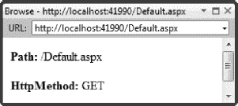

## T1】C H A P T E R 5

## 使用上下文和事件

ASP.NET 处理模型依赖一些幕后功能来呈现页面。这些是 ASP.NET*事件模型*和一组*上下文*。事件模型用于指示渲染过程经过不同阶段时的进度。当我们在前一章的代码隐藏类中使用`Page_Load`方法时，您已经看到了这一点。上下文对象为我们提供来自客户端浏览器的请求信息，并让我们配置将返回的响应。在前一章的代码块中使用`Response.Write`方法时，我们利用了其中一个上下文特性。

在本章中，我们将更深入地研究事件模型和上下文特性。大多数情况下，这些都是您不会在日常生活中使用的功能。您将把页面处理语句放在代码隐藏类的`Page_Load`方法中，或者在代码块中使用`Response.Write`方法，而不需要更深入。也就是说，阅读这一章有两个原因。首先，了解 ASP.NET 如何呈现事件和背景信息将有助于你理解接下来章节的主题。其次，总有一天，您需要在 ASP.NET web 应用程序中做一些不同的事情，并且您可能需要响应不同的事件或使用不同的上下文特性。当那一天到来的时候，你可以回头参考这一章来找到你需要的信息。

### 处理 ASP.NET 事件

ASP.NET 实现了一组指示 web 应用程序生命周期中不同阶段的事件。我们在上一章中提到了这样一个事件，当时我们将 C#语句添加到代码隐藏类的`Page_Load`方法中，并依靠自动事件连接功能将该方法与`Page.Load`事件关联起来。在这一节中，我们将深入挖掘这些事件，以了解它们代表什么以及如何使用它们。

#### 页面事件

我们要看的第一种 ASP.NET 事件是*页面事件*。这些事件在 ASP.NET 服务器处理页面请求时被调用。您可以在代码隐藏类中注册页面事件的处理程序，以响应生命周期的不同部分。

页面事件是在`System.Web.UI.Page`类中定义的，它是你在上一章看到的`.aspx`网页代码隐藏类的基类。很多时候，我们只关心`Load`事件。在调用该事件时，ASP.NET 服务器已经处理了来自 web 浏览器的请求的细节，并初始化了 HTML 控件来表示网页中的元素，因此它已经准备好开始呈现响应的过程。

也就是说，其他页面事件对于在 ASP.NET 服务器到达最佳点(即`Load`事件)之前或之后执行特定的操作是有用的。在这里，我们将看看一些潜在有用的页面事件。(有些事件最适合用于我们将在后面章节中讨论的特性，我将在接下来的事件讨论中向您介绍这些章节。)

让我们首先创建另一个 Visual Studio 项目并添加一个网页，如下所示:

1.  选择文件新建项目。
2.  单击“已安装的模板”部分中的“Visual C#模板”,选择“Web”类别，然后单击“ASP.NET 空 Web 应用程序”模板。
3.  Set the name of the project to `ContextAndEvents`, as shown in [Figure 5-1](#fig_5_1). 

    ***图 5-1。**在 Visual Studio 中创建 ContextAndEvents 项目*

4.  选择项目添加新项目。
5.  选择 WebForm模板。
6.  将新文件命名为`Default.aspx`。
7.  Edit the file so that its contents match [Listing 5-1](#list_5_1).

    ***清单 5-1。**向项目添加网页*

    `<%@ Page Language="C#" AutoEventWireup="true"
    CodeBehind="Default.aspx.cs" Inherits="ContextAndEvents.Default" %>

    <!DOCTYPE html PUBLIC "-//W3C//DTD XHTML 1.0 Transitional//EN"
     "http://www.w3.org/TR/xhtml1/DTD/xhtml1-transitional.dtd">

    <html >
    <head runat="server">
        <title></title>
    </head>
    <body>
        <h3 id="placeHolderH3" runat="server">This is a place holder</h3>
    </body>
    </html>`

这是一个非常简单的页面。主体包含一个`H3`元素，其`id`为`placeHolderH2`，其`runat`值为`server`，这样我们就可以引用并使用代码隐藏文件中的元素。

##### 了解页面事件序列

在`Page`类中有很多事件，但是其中大部分只有当你在开发控件时才会感兴趣，比如你在前一章看到的 HTML 控件。一些对 ASP.NET 应用开发者有帮助的事件在[表 5-1](#tab_5_1) 中按照它们在页面生命周期中发生的顺序进行了描述。

##### 初始化事件

`PreInit`、`Init`和`InitComplete`方法在页面处理生命周期的早期被调用，这对大多数开发人员来说太早了。也就是说，您可以执行一些有用的操作。

`PreInit`方法可用于以编程方式指定母版页，而不是在`Page`指令中。ASP.NET 母版页为 web 应用程序的页面提供了一致的视觉样式，如第 9 章中的[所述。](09.html#ch9)

`Init`事件是创建页面所需资源的好地方，比如数据库连接。与此事件相对应的是`Unload`，这将在本章稍后描述。ASP.NET 直到调用`InitComplete`方法之前才恢复视图状态数据。视图状态是一个持久性特性，如第 6 章中的[所述。如果需要读取或修改视图状态数据，必须至少等到事件序列中的此方法。](06.html#ch6)

##### 负载事件

`Page.Load`事件是最重要的页面事件。这是我们使用 HTML 控件填充网页内容的地方。许多程序员在创建 ASP.NET web 应用程序时只使用该事件。我们在第四章中使用代码隐藏类时使用了这种方法，你会在本书的其余部分看到它，因为它出现在几乎每个例子中。

清单 5-2 包含了一个在代码隐藏类中响应`Load`事件的简单演示。

***清单 5-2。**响应加载页面事件*

`using System;

namespace ContextAndEvents {

    public partial class Default : System.Web.UI.Page {

        protected void Page_Load(object sender, EventArgs e) {
            placeHolderH3.InnerText = "This message was changed in the Page_Load method";
        }
    }
}`

这个例子使用 ASP.NET 创建的`HtmlGenericControl`对象的`InnerText`属性来表示网页中的`H3`元素。在前一章中使用了这些相同的技术。使用该代码隐藏类查看`Default.aspx`网页的结果如图[图 5-2](#fig_5_2) 所示。

***图 5-2。**响应加载事件的效果*

将您的代码语句放在调用`Load`事件时调用的`Page_Load`方法中，这是 100 次中有 99 次正确的做法。

##### 先决条件事件

就在 ASP.NET 呈现页面的 HTML 之前，`PreRender`事件被调用。为了呈现页面，服务器将代码块或代码隐藏类的输出与静态 HTML 元素结合起来，以生成浏览器可以使用和显示的结果。上一章中动态生成的类([清单 4-6](04.html#list_4_6) )详细演示了如何做到这一点。

为响应`PreRender`方法而执行的最常见的操作是进行最后一分钟的更改，这依赖于页面上所有控件的最终状态。通常，您不需要这样做，并且您可以依赖于`Load`事件，但是当您想要从一个或多个控件中获得部分显示时，确实会出现这种情况。[清单 5-3](#list_5_3) 扩展了`Default.aspx`网页的代码隐藏类来响应`PreRender`事件。

***清单 5-3。**响应先决条件事件*

`using System;

namespace ContextAndEvents {

    public partial class Default : System.Web.UI.Page {

        protected void Page_Load(object sender, EventArgs e) {
            placeHolderH3.InnerText = "This message was changed in the Page_Load method";
        }

        protected void Page_PreRender(object sender, EventArgs e) {
            placeHolderH3.InnerText
                = "This message was changed in the Page_PreRender method";
            Response.Write("<h4>This message comes from the Page_PreRender method</h4>");
        }
    }
}`

自动事件连接系统自动将`Page_PreRender`方法注册为`Page.PreRender`事件的处理程序。在这个方法中，我们改变了网页中`H3`元素的`InnerText`属性的值，并调用了`Response.Write`方法。当我们在第 4 章中使用代码块时，你看到了`Response.Write`方法，它构成了 ASP.NET 上下文特性的一部分，我们将在本章后面的“使用上下文”部分中探讨。[图 5-3](#fig_5_3) 显示了在[清单 5-3](#list_5_3) 中显示的附加内容应用于代码隐藏类后查看的`Default.aspx`页面。

***图 5-3。**响应 PreRender 事件的效果*

您可以看到在`Page_PreRender`方法中对`H3`元素所做的更改覆盖了在`Page_Load`方法中所做的更改。这是因为`PreRender`事件是在`Load`事件之后调用的。使用`Response.Write`编写的文本出现在`H3`文本之前，因为控件的内容直到`PreRender`事件被调用后才写入响应。因此，我们对`Response.Write`的调用将我们的文本放在了控件内容的前面。如果使用这种方法，这种行为是需要注意的。

清单 5-4 显示了发送给浏览器的 HTML。您可以看到我们使用`Response.Write`编写的文本出现在 HTML 元素之外。

***清单 5-4。**default . aspx 页面的 HTML 源代码*

`<h4>This message comes from the Page_PreRender method</h4>

<!DOCTYPE html PUBLIC "-//W3C//DTD XHTML 1.0 Transitional//EN"
 "http://www.w3.org/TR/xhtml1/DTD/xhtml1-transitional.dtd">

<html >
<head><title>

</title></head>
<body>

    <h3 id="placeHolderH3">This message was changed in the Page_PreRender method</h3>

</body>
</html>`

大多数浏览器会显示出现在有效 HTML 元素之外的文本，但是您不应该总是依赖于这种情况。如果要在页面中插入内容，应该使用 HTML 控件。

##### 卸载事件

当页面已经呈现时，调用`Unload`事件。此事件提供了一个机会来释放您的页面可能仍然持有的任何外部资源，如数据库连接、打开的文件等。

我们在第 8 章中探索了数据在 ASP.NET 网络应用程序中的使用，但是我们是使用实体框架来实现的，它代表我们管理与数据库的连接。

#### 应用事件

*应用程序事件*代表整个 web 应用程序的注释变化。这与特定于特定页面请求的页面事件不同。

应用程序事件使用一个*全局应用程序类*处理。要创建这样的类，请按照下列步骤操作:

1.  在 Visual Studio 中，选择项目添加新项。
2.  Select the Global Application Class template from the Add New Item dialog, as shown in [Figure 5-4](#fig_5_4). 

    ***图 5-4。**添加全球应用程序类别*

3.  在 ASP.NET 中，应用程序事件处理程序由带有后缀`.asax`的文件来表示。约定是使用名称`Global.asax`，可以看到当选择全局应用类模板时，Visual Studio 建议使用这个名称。单击“添加”按钮创建新项目。

您将看到两个项目已经添加到解决方案资源管理器中的项目中:`Global.asax`和它的代码隐藏文件`Global.asax.cs`。正如你在[清单 5-5](#list_5_5) 中看到的，默认情况下`Global.asax`没有多少内容。

***清单 5-5。**global . asax 文件*

`<%@ Application Codebehind="Global.asax.cs" Inherits="ContextAndEvents.Global"
Language="C#" %>`

`Global.asax`文件包含一个`Application`指令，它类似于你在上一章看到的`Page`指令，但是被`.asax`文件独占使用。它告诉 ASP.NET 系统将指定的代码隐藏类视为应用程序事件的处理程序。代码隐藏类是用一些可用事件的处理程序创建的，如[清单 5-6](#list_5_6) 所示。

***清单 5-6。**global . asax . cs 文件*

`using System;
using System.Collections.Generic;
using System.Linq;
using System.Web;
using System.Web.Security;
using System.Web.SessionState;` `namespace ContextAndEvents {

    public class Global : System.Web.HttpApplication {

        protected void Application_Start(object sender, EventArgs e) {

        }

        protected void Application_End(object sender, EventArgs e) {

        }

        protected void Session_Start(object sender, EventArgs e) {

        }

        protected void Session_End(object sender, EventArgs e) {

        }

        protected void Application_AuthenticateRequest(object sender, EventArgs e) {

        }

        protected void Application_Error(object sender, EventArgs e) {

        }

        protected void Application_BeginRequest(object sender, EventArgs e) {

        }
    }
}`

##### 了解应用程序事件序列

应用程序事件的顺序不像页面事件那样简单。有些事件仅在应用程序启动时调用，有些事件在每次收到请求时调用，有些则介于两者之间。

应用程序事件被定义为`System.Web.HttpApplication`类的一部分，该类是用于`Global.asax`代码隐藏类的基类。自动事件连接确保方法与事件相关联，因此`Application_Start`和`Application_End`方法被注册为`Start`和`End`事件的处理程序。分别是。最有用的应用事件在[表 5-2](#tab_5_2) 中描述。

T2】

##### 事件的开始和结束

当 ASP.NET 创建应用程序来服务您的请求时，就会调用`Start`事件。这包括设置应用程序和会话状态特性(我们将在第 6 章的[中探讨),并且通常准备好处理第一个客户端请求。](06.html#ch6)

当 ASP.NET 关闭应用程序并释放它所拥有的资源时，就会调用`End`事件。这可能是因为您重新启动了服务器，部署了应用程序的更新，或者 ASP.NET 服务器已经有一段时间没有收到对您的页面的请求。

`Start`事件是创建将在整个应用程序中使用的资源的好地方，而`End`事件是确保它们被释放的好地方。您不能假设您的应用程序会启动然后永远运行，这意味着要注意平衡`Start`和`End`事件中的动作，以释放像数据连接和文件流这样的东西。

##### 会话事件

ASP.NET 会话功能支持关联页面请求(使用 cookies 或 URL 重写)以形成用户会话。创建和销毁会话时会调用`Session.Start`和`Session.End`事件。我们将在[第 6 章](06.html#ch6)中详细讨论会话特性。

##### 认证和错误事件

当 ASP.NET 确定了发出请求的用户的身份时，就会调用`AuthenticateRequest`事件。我们将在第 34 章中研究 ASP.NET 认证特性。

当处理页面请求时出现异常，并且页面本身无法处理该异常时，就会调用`Error`事件。ASP.NET 有非常丰富的处理错误的方法，这是第七章的主题。

##### 申请请求事件

当 ASP.NET 服务器开始处理和结束处理 web 应用程序中的页面请求时，分别调用`BeginRequest`和`EndRequest`事件。清单 5-7 显示了一个`Global.asax`代码隐藏类，它有这些事件的处理程序。

***清单 5-7。**处理 BeginRequest 和 EndRequest 事件*

`using System;

namespace ContextAndEvents {
    public class Global : System.Web.HttpApplication {

        protected void Application_BeginRequest(object sender, EventArgs e) {
            Response.Write(
                string.Format("
Request processing started at: {0}
",
                    GetTimeString()));
        }

        protected void Application_EndRequest(object sender, EventArgs e) {
            Response.Write(
                string.Format("
Request processing finished at: {0}
",
                    GetTimeString()));
        }

        private string GetTimeString() {
            return DateTime.Now.ToString("hh:mm:ss:ff");
        }
    }
}`

[清单 5-7](#list_5_7) 中的事件处理器方法使用`Response.Write`方法将字符串插入到发送给浏览器的响应中。你可以在[图 5-5](#fig_5_5) 中看到这些语句的效果。

***图 5-5。**处理申请请求事件*

清单 5-7 中的事件处理器方法将消息插入 HTML 响应中，以指示页面处理开始和结束的时间。这些消息出现在响应中的 HTML 元素之外。

 **提示**虽然[清单 5-7](#list_5_7) 展示了调用`BeginRequest`和`EndRequest`事件的方式，但是在 HTML 内容中添加消息并不是衡量 ASP.NET 页面处理性能的好方法。相反，使用第 7 章中描述的追踪功能。

### 使用上下文

对应用程序和页面事件的补充是由 ASP.NET 提供的*上下文*。可用的上下文允许您执行以下操作:

*   获取有关从客户端收到的请求的信息。
*   配置将返回的响应的各个方面。
*   在处理请求时，向 ASP.NET 服务器发出指令。

ASP.NET 上下文是请求、响应和服务器。让我们看看它们是如何被使用的。

#### 请求上下文

您可以通过`Page.Request`属性获得客户端请求的详细信息，该属性返回一个`System.Web.HttpRequest`类的实例。为了演示这个类，让我们对示例项目中的`Default.aspx`网页做一些修改，如[清单 5-8](#list_5_8) 所示。

***清单 5-8。**修改后的 Default.aspx 网页*

`<%@ Page Language="C#" AutoEventWireup="true" CodeBehind="Default.aspx.cs"
Inherits="ContextAndEvents.Default" %>

<!DOCTYPE html PUBLIC "-//W3C//DTD XHTML 1.0 Transitional//EN" "http://www.w3.org/TR/xhtml1/DTD/xhtml1-transitional.dtd">

<html >
<head runat="server">
    <title></title>
</head>
<body>

    

</body>
</html>`

这个页面包含一个`div`元素，它有`ID`和`runat`属性，这样我们就可以使用在[第 4 章](04.html#ch4)中描述的 ASP.NET HTML 控件特性来引用它。`HttpRequest`类定义了一系列给出请求信息的属性，其中两个由[清单 5-9](#list_5_9) 中所示的代码隐藏类读取。

***清单 5-9。**读取 HttpRequest 属性的代码隐藏类*

`using System;

namespace ContextAndEvents {

    public partial class Default : System.Web.UI.Page {

        protected void Page_Load(object sender, EventArgs e) {

**            WriteContextValue("Path", Request.Path);**
**            WriteContextValue("HttpMethod", Request.HttpMethod);**
        }

        private void WriteContextValue(string nameParam, string valParam) {
            contextDiv.InnerHtml += string.Format("<b>{0}:</b> {1}
",
                nameParam, valParam);
        }

    }
}`

只需调用`Request`就可以获得`HttpRequest`对象。这是因为`Page`类是代码隐藏类的基础，这意味着`Request`属性是继承的。清单 5-9 从`HttpRequest`对象中读取两个属性，并在页面中插入 HTML 来列出它们的属性。你可以在[图 5-6](#fig_5_6) 中看到这样做的效果。(我已经删除了我们之前添加到`Global.asax`的代码，以简化输出。)

***图 5-6。**从 HttpRequest 对象中读取属性*

##### HttpRequest 属性

[表 5-3](#tab_5_3) 描述了`HttpRequest`类的一些更广泛使用的属性。请记住，这些属性给出了客户端请求的详细信息。您使用响应上下文来设置将作为处理页面的结果而返回的值，您将在本章的后面看到。

T2】

##### 基于浏览器的不同内容

对于大多数 web 应用程序来说，没有必要太深入地参与请求的细节，但是有些时候这些信息是非常宝贵的。例如，Internet Explorer 没有完全实现特定的层叠样式表(CSS)功能，我们将在第 10 章中讨论。我们可以选择根据发出请求的浏览器类型来改变响应的内容，从而解决这种遗漏。[清单 5-10](#list_5_10) 展示了我们如何使用`Browser`属性来实现这一点，它提供了关于客户端浏览器的信息。

***清单 5-10。**基于客户端浏览器的不同内容*

`using System;

namespace ContextAndEvents {

    public partial class Default : System.Web.UI.Page {

        protected void Page_Load(object sender, EventArgs e) {

            switch (Request.Browser.Browser) {
                case "Chrome":
                    contextDiv.InnerText = "Request made using Google Chrome";
                    break;
                case "IE":
                    contextDiv.InnerText = "Request made using Internet Explorer";
                    break;
                default:
                    contextDiv.InnerText
                        = string.Format("Request made using other browser: {0}",
                            Request.Browser.Browser);
                    break;
            }
        }
    }
}`

`Browser`属性返回一个`System.Web.HttpBrowserCapabilities`对象，我们可以通过读取奇怪命名的`Browser.Browser`属性来获得浏览器家族的名称。这将返回一个名字，如`Chrome`或`IE`，没有附加的版本或平台信息。你可以在[图 5-7](#fig_5_7) 中看到用[清单 5-10](#list_5_10) 中的代码隐藏类请求`Default.aspx`页面的效果。如果浏览器系列名称不够详细，您可以通过读取`Browser.Version`属性来获取浏览器版本。

***图 5-7。**根据浏览器改变页面内容*

 **注意**`HttpBrowserCapabilities`类包含的属性揭示了许多关于浏览器能够支持什么的非常具体的信息，尽管一些信息是从这种能力的数据库中获得的，而不是直接来自客户端。在您的代码中，您不应该假设`HttpBrowserCapabilities`类能够识别所有浏览器或它们的功能。

#### 响应上下文

`Page.Response`属性是`Request`属性的补充。它返回一个`System.Web.HttpResponse`对象，该对象可用于配置将被发送回浏览器的响应的各个方面。

##### HttpResponse 属性和方法

在[表 5-4](#tab_5_4) 中描述了`HttpResponse`类的一些最常用的属性。您会注意到许多属性名与`HttpRequest`类的相同。不同之处在于，请求细节表示浏览器发送的信息，而响应细节影响浏览器将接收的内容。

除了在[表 5-4](#tab_5_4) 中显示的属性外，`HttpResponse`类还定义了许多方便的方法，这些方法设置响应属性的组合以达到特定的结果。这些方法中最有用的在[表 5-5](#tab_5_5) 中描述。

T2】

正如你在[第 4 章](04.html#ch4)中看到的，`Write`方法通常用在代码块中。其他方法用得都不多，除了下面要介绍的`Redirect`方法。

##### 重定向客户端

`Redirect`方法非常有用，尤其是在与请求内容结合使用时。例如，我们可以根据用户使用的浏览器类型选择将用户重定向到不同的页面，如清单 5-11 所示。

***清单 5-11。**根据浏览器类型重定向到另一个页面*

`using System;

namespace ContextAndEvents {

    public partial class Default : System.Web.UI.Page {

        protected void Page_Load(object sender, EventArgs e) {` `            switch (Request.Browser.Browser) {
                case "Chrome":
                    Response.Redirect("ChromePage.aspx", true);
                    break;
                case "IE":
                    Response.Redirect("IEPage.aspx", true);
                    break;
                default:
                    Response.Redirect("UnsupportedPage.aspx", true);
                    break;
            }
        }
    }
}`

查看`Default.aspx`页面将导致浏览器被重定向到三个页面之一:`ChromePage.aspx`、`IEPage.aspx`或`UnsupportedPage.aspx`。你可以在[图 5-8](#fig_5_8) 中看到重定向的效果。

***图 5-8。**根据浏览器类型重定向到页面*

#### 服务器上下文

服务器上下文根本不是真正的上下文。这是一个有用方法的集合，有助于处理请求。它被称为*服务器上下文*，因为一些方法依赖于其他上下文对象。

##### http servervity 方法

您通过返回一个`System.Web.HttpServerUtility`对象的`Page.Server`属性来访问服务器上下文。在`HttpServerUtility`类中最有用的方法在[表 5-6](#tab_5_6) 中描述。

T2】

`ClearError`和`GetLastError`方法是`HttpServerUtility`类中最重要的方法。它们对于在 ASP.NET 应用程序中实现错误处理策略是必不可少的。你可以在第 7 章的[中找到 ASP.NET 错误处理和这两种方法使用的全部细节。](07.html#ch7)

##### 传送请求

`Transfer`方法可用于将执行从一个页面转移到另一个页面。这不同于将浏览器重定向到另一个页面。

当你*重定向*时，一条消息被发送到浏览器，要求它请求另一个页面。浏览器可以选择不遵循重定向指令，但是如果遵循，将会有来自浏览器的两个请求:一个是对原始页面的请求，另一个是对浏览器重定向到的页面的请求。本质上，浏览器知道重定向。在[图 5-8](#fig_5_8) 中，对`Default.aspx`的请求导致了对`IEPage.aspx`的重定向，你可以在浏览器显示中看到第二个 URL。

当你*转移*控制权时，这个过程完全发生在 ASP.NET 服务器中，浏览器并不知道产生响应的页面与被请求的页面不同。[清单 5-12](#list_5_12) 提供了一个使用`Transfer`方法的演示。

***清单 5-12。**使用服务器。传送方式*

`using System;

namespace ContextAndEvents {

    public partial class Default : System.Web.UI.Page {

        protected void Page_Load(object sender, EventArgs e) {` `            switch (Request.Browser.Browser) {
                case "Chrome":
                    Response.Redirect("ChromePage.aspx", true);
                    break;
                case "IE":
                    Server.Transfer("IEPage.aspx", true);
                    break;
                default:
                    Response.Redirect("UnsupportedPage.aspx", true);
                    break;
            }
        }
    }
}`

这与重定向示例([清单 5-11](#list_5_11) )非常相似，除了对`Response.Redirect`的调用被替换为对`Server.Transfer`的调用。你可以在[图 5-9](#fig_5_9) 中看到这种变化的效果。

***图 5-9。**使用服务器。传送方式*

如果你仔细观察[图 5-9](#fig_5_9) ，你会看到两个浏览器窗口都显示了`Default.aspx`页面的 URL，但是内容来自`ChromePage.aspx`或者`IEPage.aspx`。从一个页面到另一个页面的转换在浏览器不知情的情况下发生。

#### 在页面之间传递信息

如果您要将请求重定向或转移到另一个页面，将一些信息从第一个页面传递到第二个页面会很有用。你不需要担心设置各种上下文对象，因为 ASP.NET 会自动处理这些，但是为第二个页面提供你想要它做什么的指导会很有帮助。

举个简单的例子，假设我们想在第二页可以显示的两条消息中进行选择。有几种方法可以做到这一点。一种是使用第 6 章中描述的会话状态功能。另一种方法是将信息添加到 URL 的查询字符串部分，这样我们重定向或传输到的 URL 看起来就像这样:

`SecondPage.aspx?messageToDisplay=first`

这个 URL 包含一个值为`first`的关键字`messageToDisplay`。这可以被我们转移到的页面读取，并用于确定其行为。[清单 5-13](#list_5_13) 包含一个名为`SecondPage.aspx`的页面，它将用于显示两条消息中的一条。

***清单 5-13。**second page . aspx 标记*

`<%@ Page Language="C#" AutoEventWireup="true" CodeBehind="SecondPage.aspx.cs"
Inherits="ContextAndEvents.SecondPage" %>

<!DOCTYPE html PUBLIC "-//W3C//DTD XHTML 1.0 Transitional//EN" "http://www.w3.org/TR/xhtml1/DTD/xhtml1-transitional.dtd">

<html >
<head runat="server">
    <title>Second Page</title>
</head>
<body>
    <h4 id="placeholderH4" runat="server"/>
</body>
</html>`

[清单 5-14](#list_5_14) 展示了`SecondPage.aspx`网页的代码隐藏类。这个类使用请求上下文对象的`QueryString`属性检索`messageToDisplay`键的值。

***清单 5-14。**second . aspx . cs 代码隐藏类*

`using System;

namespace ContextAndEvents {

    public partial class SecondPage : System.Web.UI.Page {

        protected void Page_Load(object sender, EventArgs e) {

            // get the instruction as to which message to display
            // from the query string
            string messageToDisplay = Request.QueryString["messageToDisplay"];
            if (messageToDisplay != null) {
                if (messageToDisplay == "first") {
                    placeholderH4.InnerText = "This is the first message";
                } else {
                    placeholderH4.InnerText = "This is the second message";
                }
            } else {
                // there was no message instruction
                placeholderH4.InnerText = "No message instruction specified";
            }
        }
    }
}`

这个例子的最后一部分如[清单 5-15](#list_5_15) 所示。这是`Default.aspx`网页的代码隐藏类。这个页面的标记无关紧要，因为它转移到了`SecondPage.aspx`。

***清单 5-15。**default . aspx . cs 代码隐藏类*

`using System;

namespace ContextAndEvents {

    public partial class Default : System.Web.UI.Page {

        protected void Page_Load(object sender, EventArgs e) {

            switch (Request.Browser.Browser) {
                case "Chrome":
                    Server.Transfer("SecondPage.aspx?messageToDisplay=first", true);
                    break;
                case "IE":
                    Server.Transfer("SecondPage.aspx?messageToDisplay=second", true);
                    break;
                default:
                    Server.Transfer("SecondPage.aspx", true);
                    break;
            }
        }
    }
}`

您可以看到我们如何将关于显示哪条消息的指令编码到我们要传输到的 URL 中，并且在重定向时可以采用相同的方法。如果你使用谷歌浏览器查看`Default.aspx`，你会看到第一条消息。如果您使用的是 Internet Explorer，您将会看到第二条消息。你可以在图 5-10 中看到两种浏览器的结果。

***图 5-10。**在页面传输过程中传递信息*

#### 使用 HttpContext 类传递上下文

我们要看的最后一个上下文特性是`HttpContext`类。这个类有两个主要特点:

*   它允许您从代码中的任何地方访问所有其他上下文对象。
*   它提供了在页面之间传递信息的另一种方法。

现在让我们来看看这些特性如何证明对 ASP.NET 开发人员有用。

##### 从页面类外部访问上下文

当您从该类派生时，通过`Page`类的属性访问各种上下文对象是完美的，而当您不是该类的派生时，这是令人讨厌的。如果您想从另一个类访问上下文信息，您有两种选择:

*   注意在每个后续的方法调用中将所需的信息作为参数传递。
*   访问`HttpContext`类的静态`Current`属性，并通过返回的`HttpContext`对象访问与当前页面请求相关的所有上下文对象。

[清单 5-16](#list_5_16) 展示了从`Page`类外部访问上下文信息。

***清单 5-16。**从页面类外部访问上下文信息*

`using System;
using System.Web;

namespace ContextAndEvents {

    public partial class Default : System.Web.UI.Page {

        protected void Page_Load(object sender, EventArgs e) {

            // create an instance of the other class
            MyOtherClass myObject = new MyOtherClass();

            // call a method that relies on context
            myObject.TransferBasedOnBrowser();
        }
    }

    class MyOtherClass {

        public void TransferBasedOnBrowser() {
            // get the HttpContext object
            HttpContext myContext = HttpContext.Current;

            // switch on the browser type
            switch (myContext.Request.Browser.Browser) {
                case "Chrome":
                    myContext.Server
                        .Transfer("SecondPage.aspx?messageToDisplay=first", true);
                    break;
                case "IE":
                    myContext.Server
                        .Transfer("SecondPage.aspx?messageToDisplay=second", true);
                    break;` `                default:
                    myContext.Server
                        .Transfer("SecondPage.aspx", true);
                    break;
            }
        }
    }
}`

清单 5-16 中的代码隐藏类创建了一个`MyOtherClass`的实例并调用了`TransferBasedOnBrowser`方法。这个方法依赖于请求和服务器上下文对象。为了得到这些，我们调用静态的`HttpContext.Current`属性并读取`Request`和`Server`属性。这些函数返回与当前页面请求相关的`HttpRequest`和`HttpServerUtility`类。然后，我们可以检测浏览器类型并执行传输，而不需要传递上下文对象和方法参数。

`HttpContext`类包含每个上下文对象的属性，每个属性都与`Page`类中的等价属性同名。因此，您可以通过`Request`属性访问`HttpRequest`对象，通过`Response`属性访问`HttpResponse`对象，以此类推。

不得存储和重复使用`HttpContext`对象。为每个页面请求创建一个新的，尝试使用旧的会导致异常。

##### 使用 Items 集合传递信息

`HttpContext`类的另一个特性是`Items`属性，它可以用来在页面处理过程中传递名称/值对。这种方法最常见的用途是在传输或重定向过程中作为向页面传递指令信息的替代方法。[清单 5-17](#list_5_17) 演示了在`Default.aspx`的代码隐藏类中使用`Items`集合。

***清单 5-17。**使用 HttpContext 项目功能*

`using System;
using System.Web;

namespace ContextAndEvents {

    public partial class Default : System.Web.UI.Page {

        protected void Page_Load(object sender, EventArgs e) {

            switch (Request.Browser.Browser) {
                case "Chrome":
                    Context.Items.Add("messageToDisplay", 1);
                    break;
                case "IE":
                    Context.Items.Add("messageToDisplay", 2);
                    break;
            }` `            Server.Transfer("SecondPage.aspx");

        }
    }
}`

请注意，当您在从`Page`派生的类中工作时，您可以使用`Context`属性访问`HttpContext`对象。这相当于调用静态的`Current`属性。

属性返回一个标准的 C#集合。通过将名称和值作为参数传递给`Add`方法来添加值。这种方法的一个优点是，您可以使用 C#类型在页面之间传递数据，而不是局限于使用`string`值。[清单 5-18](#list_5_18) 显示了`SecondPage.aspx`对应的代码隐藏类。

***清单 5-18。**从 HttpContext 项目集合中读取值*

`using System;

namespace ContextAndEvents {

    public partial class SecondPage : System.Web.UI.Page {

        protected void Page_Load(object sender, EventArgs e) {

            // get the instruction as to which message to display
            // from the HttpContext Items collection
            int messageToDisplay = Context.Items.Contains("messageToDisplay")
                ? (int)Context.Items["messageToDisplay"] : 0;

            if (messageToDisplay == 1) {
                    placeholderH4.InnerText = "This is the first message";
            } else if (messageToDisplay == 2) {
                placeholderH4.InnerText = "This is the second message";
            } else {
                // there was no message instruction
                placeholderH4.InnerText = "No message instruction specified";
            }
        }
    }
}`

我们通过使用索引器来访问`Items`集合中的数据，将我们在另一个类中指定的名称作为索引值传入。collection 类将存储的值作为`object`实例返回，因此我们需要将它们转换成所需的类型；在这种情况下，我们转换为一个`int`值。

### 总结

在本章中，您已经看到了有助于形成 ASP.NET 基础的两个特性。事件模型允许您在生命周期的不同状态下挂钩到 ASP.NET 页面呈现过程，各种上下文对象允许您获取有关浏览器请求的信息，并配置将被返回的响应。

这一章包含了许多对其他章节的引用。这表明事件和背景特征在 ASP.NET 是多么根深蒂固。从错误处理到表单处理，再到身份验证和会话管理，我们都涉及到了。在接下来的章节中，你会发现这些特性的全部细节，你会看到 ASP.NET 是如何构建一套丰富而复杂的特性来简化 web 应用程序的构建的。