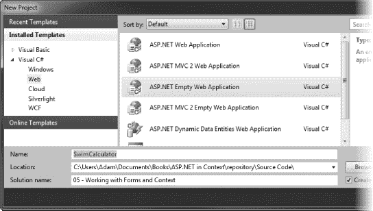
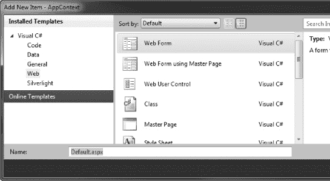
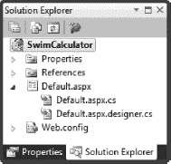
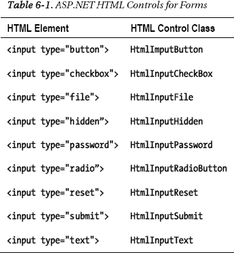
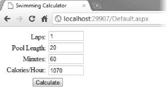
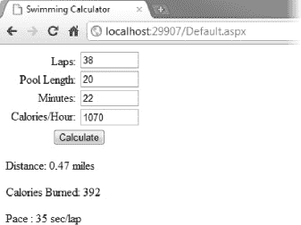
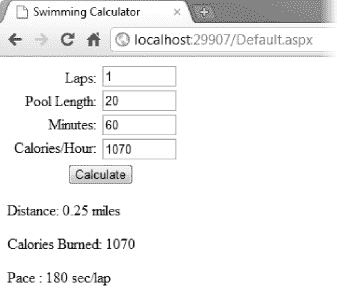
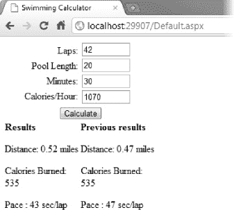
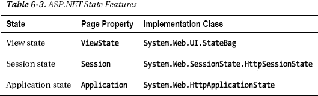

## C H A P T E R 6

## 使用表单和状态

web 应用程序中的两个关键特性是用户输入和状态。我们需要用户输入来创建有用的应用程序。用户选择一些功能或输入一些数据，我们的应用程序相应地做出响应。在传统的部署应用程序中，这种交互模型是软件固有的。在 web 应用程序中，我们依赖 HTML 表单。

我们依靠状态来代表用户存储数据，并在响应 web 请求时访问数据。Web 应用程序状态可能很复杂，因为底层技术基本上是无状态的。幸运的是，ASP.NET 提供了一系列不同的状态机制，您只需要选择最适合您的应用程序需求的一种。在这一章中，我们将看看四个最重要和最广泛使用的状态的特征:表单、视图、会话和应用程序。

为了探索这些特性，我们将通过制作一个简单的计算器来解决我的一个铁人三项训练问题。我是一个注重数字的人。我会记录我所有的训练过程。当我跑步和骑自行车时，我使用一个训练电脑手表，它有各种传感器，可以给我很多详细信息，包括距离、速度、心率等等。所有这些数据都被上传到我的训练日记中。

传感器与手表进行无线通信，但频率不会通过水传播很远。当我在游泳池训练时，我需要手动记录我游了多少圈，花了多长时间。由此，我可以估算出我燃烧的卡路里和我游泳的距离。在这个过程中，我需要将距离从米(这是我居住的地方表示泳池长度的方式)转换为英里(这是我记录其他训练的方式)。本章中的例子基于一个简单的转换计算器，它使用我的时间和以米为单位的距离来计算以英里为单位的距离、我燃烧的卡路里(估计值)和我游泳的速度。

### 使用表单

在本节中，我们将构建一个基于表单的 web 应用程序。HTML 表单(依赖于 HTML `<form>`元素)是 web 应用程序的基础。和前面的例子一样，我们将从 HTML 开始，然后添加 C#代码作为代码隐藏文件。当我们创建这个项目时，你将学习如何在第 4 章中看到的 HTML 控制模型的基础上定义一个 HTML 表单，并在表单提交到 ASP.NET 服务器时处理表单。

#### 创建表单

与前几章一样，我们需要创建一个 ASP.NET 项目，然后才能开始探索本章关注的特性。要创建项目，请按照下列步骤操作:

1.  在 Visual Studio 中，选择文件新建项目。
2.  Click the Visual C# templates in the Installed Templates section, select the Web category, and then click the ASP.NET Empty Web Application template, as shown in [Figure 6-1](#fig_6_1). 

    ***图 6-1。**选择空的 Web 应用模板*

3.  输入`SwimCalculator`作为新项目的名称，然后单击 OK 创建项目。
4.  We want to add a dynamic web page, so select Select Project  Add New Item and choose the Web Form item from the list of templates, as shown in [Figure 6-2](#fig_6_2). 

    ***图 6-2。**添加动态网页*

5.  将新页面的名称设置为`Default.aspx`，然后单击 OK 创建新文件。

不要被模板的名称所迷惑。Visual Studio 假设您希望将动态网页与 web 窗体框架一起使用，并且其基本构建块是一个 Web 窗体，我们将在第 6 章的[中讨论。如果您在解决方案资源管理器窗口中展开`Default.aspx`项，您将看到两项:`Default.aspx.cs`和`Default.aspx.designer.cs`，如图 6-3](#ch6) 中的[所示。第一个是代码隐藏文件，第二个是相应的分部类，它将包含表示 HTML 控件的字段。当您使用 web 窗体模板创建网页时，这些文件会添加到项目中，这样 Visual Studio 就不会在代码隐藏文件中报告错误。](#fig_6_3)

***图 6-3。**与动态网页相关的代码文件*

第一个是代码隐藏文件，第二个是相应的分部类，它将包含表示 HTML 控件的字段(当您使用 web 窗体模板创建网页时，这些字段被添加到项目中，以便 Visual Studio 不会报告代码隐藏文件中的错误)。

如果您使用过几乎所有的 web 应用程序，您将会对 HTML `form`元素很熟悉，这是用户向您的应用程序提供输入的方式。打开 web 文件(`Default.aspx`)，您会看到我们用来创建项目的模板给了我们一个`form`元素，如[清单 6-1](#list_6_1) 所示。

***清单 6-1。**包含表单的网页*

`<%@ Page Language="C#" AutoEventWireup="true" CodeBehind="Default.aspx.cs"
 Inherits="SwimCalculator.Default" %>

<!DOCTYPE html PUBLIC "-//W3C//DTD XHTML 1.0 Transitional//EN"
 "http://www.w3.org/TR/xhtml1/DTD/xhtml1-transitional.dtd">

<html >
<head runat="server">
    <title></title>
</head>
<body>
    <form id="form1" runat="server">
    

    

    </form>
</body>
</html>`

ASP.NET 在表格方面做了一些有趣的事情——一些非常酷的事情，但是需要使用至少一个上下文才能有意义。ASP.NET 使用相同的`Page`类生成*和*处理表单。也就是说，`Default.aspx` web 文件及其关联的`Default.aspx.cs`代码隐藏文件负责生成 HTML 页面，在提交表单时处理表单，并生成显示表单处理结果所需的任何页面。

让我们通过一个例子来帮助理解这一点，从`form`元素开始:

`<form id="form1" runat="server">
...
</form>`

当 ASP.NET 服务器处理 web 浏览器对包含具有值为`server`的`runat`属性的`form`元素的动态网页的请求时，它将`action`属性设置为引用当前页面。这是指定`form`将被回发到哪里的属性。在接下来的几节中，我们将在这个特性的基础上演示如何使用上下文来处理表单。

#### 填写表格

要完成该表单，我们需要添加以下内容:

*   一些允许用户输入数据和提交表单的`input`元素
*   一些 CSS 样式来布局显示元素
*   保存我们计算结果的元素

清单 6-2 显示了完整的`Default.aspx`文件。

***清单 6-2。**完成的网页表单*

`<%@ Page Language="C#" CodeBehind="Default.aspx.cs" Inherits="SwimCalculator.Default" %>

<!DOCTYPE html PUBLIC "-//W3C//DTD XHTML 1.0 Transitional//EN"
 "http://www.w3.org/TR/xhtml1/DTD/xhtml1-transitional.dtd">

<html >
<head id="Head1" runat="server">
    <title>Swimming Calculator</title>
    
</head>
<body>
    <form id="form1" runat="server">

    

        

            
Laps:

            
Pool Length:

            
Minutes:

            
Calories/Hour:

        

        

          
<input class="textinput" id="lapsInput" type="text" runat="server" />

          
<input class="textinput" id="lengthInput" type="text" runat="server" />

          
<input class="textinput" id="minsInput" type="text" runat="server" />

          
<input class="textinput" id="calsInput" type="text" runat="server" />

        

        

            <input id="button" value="Calculate" type="submit" />
        

        
`  `

    </form>
</body>
</html>`

我们通过在`head`元素中定义一个`style`来包含一些 CSS 样式，并通过为单个元素定义`style`属性来直接添加其他样式。这将是一个非常简单的应用程序，所以我们不打算使用母版页。

我们没有改变`form`元素。我们将依靠 ASP.NET 服务器在页面呈现时向该元素添加属性。

这个文件中有三组内容:`input`元素、一个提交按钮和一个用于添加结果的元素。

我们首先有一组`input`元素，如下所示:

`
<input class="textinput" id="lapsInput" type="text" runat="server" />
`

这些控件的`type`属性的值为`text`，这意味着它们将显示为单行文本输入框。请注意，我们已经将`runat`属性设置为`server`，这样我们就可以按照名称来处理每个`input`元素，就像我们在上一章所做的那样。这四个输入将用于从用户那里获取数据。在清单 6-2 中[前面的标签向用户表明了每个`input`元素的用途:](#list_6_2)

`
Laps:
`

提交按钮为用户提供了一种将表单回发到我们的 web 应用程序的方法。我们添加一个提交按钮如下:

`<input id="button" value="Calculate" type="submit" />`

这个元素创建了一个标签为 Calculate 的按钮。单击按钮时，用户的浏览器会将表单提交回 ASP.NET 服务器。

感兴趣的最后一个元素是我们将用作添加计算结果的钩子的元素:

`
`

该元素不会影响网页在浏览器中显示时的外观，但是`runat`元素将允许我们使用代码隐藏文件向该元素添加内容，这就是我们将如何显示结果。

#### 创建计算代码

一个广泛使用的惯例是将与呈现页面不直接相关的代码分成单独的类。这种方法是更大的设计哲学的一部分，通常被称为确保关注点的*分离，基本前提是类应该专注于一个功能或特性，并且尽可能少地重叠。这是 MVC 框架设计中的一个关键思想，我们将在[第 22 章](22.html#ch22)中探讨。*

将代码分成不同类的另一个原因是为了减少多个页面之间共享的功能或特性的重复。这通常是一件好事，因为您不需要在许多不同的地方维护和测试相同的代码。

根据该约定的第一部分，我们将创建一个包含执行游泳计算的逻辑的类，如下所示:

1.  我认为将应用程序逻辑类保存在与主 web 应用程序不同的名称空间中是一个好主意，所以首先，在解决方案资源管理器中选择项目，然后选择 Project  New Folder。
2.  与其他 C#项目一样，目录的名称对应于名称空间，因此将文件夹的名称改为`Calculations`。
3.  在解决方案资源管理器中选择新文件夹，并选择 Project  Add Class。
4.  选择类模板并将名称设置为`SwimCalculator.cs`。
5.  打开新的类文件并编辑内容以匹配清单 6-3 中的。

***清单 6-3。**游泳计算器的计算逻辑类*

`using System;

namespace SwimCalculator.Calculations {

    public struct SwimCalcResult {
        public float Distance;
        public float Calories;
        public float Pace;
    }

    public class SwimCalc {
        private const float metersToMiles = 0.00062137119223733f;
        private const float minsPerHour = 60f;

        public static SwimCalcResult PerformCalculation(int lapsParam, int lengthParam,
            int minsParam, int calsPerHourParam) {

            // validate the parameter values - we need all values to be greater than zero
            foreach (int paramValue in new[] {lapsParam, lengthParam,
                minsParam, calsPerHourParam}) {

                if (paramValue < 1) {
                    // this is not a value we can work with
                    throw new ArgumentOutOfRangeException();
                }
            }

            // create the result
            SwimCalcResult result = new SwimCalcResult();

            result.Distance = (lapsParam * lengthParam) * metersToMiles;
            result.Calories = (minsParam / minsPerHour) * calsPerHourParam;
            result.Pace = (minsParam * minsPerHour) / lapsParam;`  `// return the result
            return result;
        }
    }
}`

当遵循关注点分离原则时，您最终会得到两种类:自包含类和桥接类。

*独立的*类提供了一个独立的功能或特性。清单 6-3 中显示的类就是这种类的一个例子。即使我们正在构建一个 web 应用程序，在`SwimCalculator`类和 ASP.NET 之间也没有关系。

**编译应用逻辑类**

当应用程序逻辑类被修改时，ASP.NET 不会自动重新编译它们。这意味着当您做出更改时，您必须确保通过选择 BuildBuild<T1】project name>在 Visual Studio 中重新编译您的项目。或者，如果右击某个页面文件并选择“在浏览器中查看”，Visual Studio 将在显示预览之前重新编译任何已更改的类。

`SwimCalc`类包含一个名为`PerformCalculation`的静态方法，它采用一组`int`参数作为我们计算的基础。使用`SwimCalcResult`结构返回该方法的结果。没有对页面文件或 HTML `form`元素的引用，即使`PerformCalculation`方法的参数对应于`Default.aspx`页面文件中的`input`元素。

*桥*级连接一个关注的区域和另一个关注的区域。在我们的示例 web 应用程序中，这个桥梁角色由代码隐藏类来完成，它将 ASP.NET 的功能与`SwimCalc`类提供的计算功能连接起来。

#### 创建代码隐藏类

对于这个例子，我们需要依靠 ASP.NET 通过`Page.IsPostBack`属性提供的一段有用的上下文。当页面第一次被请求时，该属性返回`false`,当用户点击页面上的按钮提交表单时，返回`true`。这就是 ASP.NET 如何依靠单个页面文件和代码隐藏文件来生成和处理 HTML 表单。[清单 6-4](#list_6_4) 显示了游泳计算器示例的代码隐藏文件。

***清单 6-4。**游泳计算器的代码隐藏文件*

`using System;
using System.Text;
using SwimCalculator.Calculations;

namespace SwimCalculator {

    public partial class Default : System.Web.UI.Page {

        protected void Page_Load(object sender, EventArgs e) {`  `if (!IsPostBack) {

                // this is the initial request to view the page
                // - we want to use this opportunity to set some default values
                // for the input fields
                lapsInput.Value = "1";
                lengthInput.Value = "20";
                minsInput.Value = "60";
                calsInput.Value = "1070";

            } else {
                // define the int values that will hold the values from the input elements
                int laps, length, mins, cals;

                // try to get the values from the form elements as ints
                if (int.TryParse(lapsInput.Value, out laps)
                    && int.TryParse(lengthInput.Value, out length)
                    && int.TryParse(minsInput.Value, out mins)
                    && int.TryParse(calsInput.Value, out cals)) {

                    // all of the input values were successfully converted to int values
                    try {

                        // perform the calculation
                        SwimCalcResult calcResult
                            = SwimCalc.PerformCalculation(laps, length, mins, cals);

                        // compose the results
                        StringBuilder stringBuilder = new StringBuilder();
                        stringBuilder.AppendFormat("
Distance: {0:F2} miles
",
                            calcResult.Distance);
                        stringBuilder.AppendFormat("
Calories Burned: {0:F0}
",
                            calcResult.Calories);
                        stringBuilder.AppendFormat("
Pace : {0:F0} sec/lap
",
                            calcResult.Pace);

                        // set the results text
                        results.InnerHtml = stringBuilder.ToString();

                    } catch (ArgumentOutOfRangeException) {
                        results.InnerText = "Error: parameter out of range";
                    }

                } else {
                    // at least one of the input values could not be converted to an int
                    results.InnerText = "Error: could not process input values";
                }
            }
        }
    }
}`

清单 6-4 中的代码有两个分支。分支是根据`Page`类的`IsPostBack`属性的值选择的，当然，这是我们的代码隐藏类的基础。当`IsPostBack`属性为`false`时，页面呈现为初始查看；也就是说，用户希望看到包含`form`元素的页面。在这种情况下，我们使用`HtmlInputText`类的`Value`属性来设置`input`元素的初始值(`HtmlInputText`类是 HTML 控件，ASP.NET 用它来表示具有`text`的`type`属性值的`input`元素):

`if (!IsPostBack) {
    lapsInput.Value = "1";
    lengthInput.Value = "20";
    minsInput.Value = "60";
    calsInput.Value = "1070";
...`

我们可以在页面文件中使用 HTML 来实现这一点，但是我们需要一些东西来演示包含`form`的页面的两种请求模式。当用户单击表单上的 Calculate 按钮时，浏览器将数据提交给 ASP.NET 服务器，后者再次呈现我们的页面，这次将`IsPostBack`属性设置为`true`，表明已经使用了`form`。

在这种情况下，我们使用表示`input`元素的 HTML 控件来获取用户输入的数据(通过读取`Value`属性),并尝试解析用户输入的任何`int`值。ASP.NET 为`form`元素定义了 HTML 控件，如[表 6-1](#tab_6_1) 所述。

示例表单中的`input`元素都是`text`类型，并且使用代码隐藏类中的`HtmlInputText`类来表示。

如果我们可以解析`input`元素中的所有四个值，那么我们继续执行计算，并通过设置`result`元素的内容来显示结果，我们在`Default.aspx`文件中将其作为一个钩子。如果我们不能解析用户输入，或者在执行计算时出现错误，我们使用 results 钩子向用户显示错误。

您可以看到代码隐藏类在 ASP.NET 和`SwimCalc`类之间搭建桥梁的方式。这些值是从表单数据中提取并解析的。然后传递给`SwimCalc.PerformCalculation`方法。计算结果随后被映射回 ASP.NET，以便向用户显示。对于代码隐藏文件来说，这是一种非常常见的模式，在其他例子中，以及在本书后面讨论 web 应用程序框架时，您会看到它重复出现。

#### 使用表单

剩下的工作就是查看网页并使用表单。在解决方案浏览器中右键单击`Default.aspx`并选择在浏览器中查看。你会看到一个类似于图 6-4 所示的网页。

***图 6-4。**包含表单的网页*

您可以看到浏览器如何将`input`元素显示为文本框和按钮。如果您在文本框中输入一些值并点击计算按钮，您将看到结果，如图 6-5 中的[所示。](#fig_6_5)

***图 6-5。**显示表单处理结果*

如果您输入的值不是整数或者是小于 1 的整数，您将看到一条错误消息，而不是结果。

 **注意**您可能已经注意到了表单显示中一些意想不到的东西。在单击“计算”按钮之前输入的值将显示在显示结果的页面中，但代码隐藏文件中没有设置这些值的语句。这是怎么发生的？答案是 ASP.NET 会根据表单中提交的值自动设置`input`元素的内容。我们将在本章后面的“使用表单输入状态”一节中详细讨论这一点，以及如何更改默认值。

#### 将表单放在上下文中

游泳计算器是一个非常简单的 web 应用程序，但是它展示了 ASP 的一些重要特性和行为。网络:

*   HTML `form`元素是如何自动完成的，以引用回包含它的页面(本例中是`Default.aspx`页面文件)。这个例子演示了用户与 ASP.NET web 应用程序交互的主要方式之一:通过 HTML `form`机制。还有其他方法(我们将在第 11 章讨论 Ajax 时讨论)，但是表单被广泛使用。
*   ASP.NET 如何通过`Page.IsPostBack`属性使用上下文信息告诉我们这正在发生。这使我们能够区分首先设置页面所需执行的操作和处理用户提交的表单所需执行的操作。
*   如何根据用户提供的数据生成真正动态的页面。我们的代码隐藏文件将我们创建的 ASP.NET 页面的功能与提供应用程序逻辑的计算类连接起来。

尽管这是一个简单的应用程序，但是您可以看到当您基于关注点分离代码时出现的模式。这是一个重要的模式，你会看到在 ASP.NET 经常重复。

使用表单可以让我们产生真正动态的内容。为响应提交的表单而生成的页面取决于用户在输入字段中输入的数据。

### 使用状态

我们的计算器示例是动态的，但是*是无状态的*，这意味着没有信息从一个请求传递到下一个请求。这是 web 应用程序的默认条件。对于简单的处理，无状态不是问题。在我们的示例中，用户提供一些游泳数据，然后返回计算结果。不需要将数据从一个请求传递到另一个请求，因为每个请求都是完全独立的。

对于更复杂的应用程序，您通常需要访问跨多个请求的数据。这个数据被称为*状态*，依赖它的 web 应用被称为*有状态*。ASP.NET 提供了四种国家形式:

*   *表单输入状态*:在这种状态下，输入字段显示用户在点击提交按钮之前输入的值。
*   *视图状态*:该特性允许您将数据存储在网页中`form`元素的隐藏输入字段中。
*   *会话状态*:这类似于视图状态，除了在发送给客户端的响应中只包含会话标识符，使用会话状态存储的任何数据都保存在服务器上。
*   *应用程序状态*:该状态允许您存储在处理所有请求时可用的数据，而不管会话状态如何。

为什么我们需要状态特征？

您可能想知道为什么我们需要状态特性。毕竟在常规应用中，C#对象是用来维护和表示状态的。为什么我们不能在代码隐藏类中添加字段呢？

答案是创建一个代码隐藏类的新实例来处理每一个请求，然后销毁它。在任何时候，都可能有几个从我们的代码隐藏类创建的对象同时处理来自不同用户、一个用户或没有用户的请求。你就是看不出来。由于我们不能依赖保留的代码隐藏对象，我们需要采取替代措施在多个页面请求的生命周期中持久保存数据。

#### 使用表格输入状态

最基本的状态形式是你已经见过的，但可能不太明显。如果你回头看图 6-5 ，你可能会注意到一些奇怪的事情。输入字段显示了用户单击提交按钮之前输入的值，但是我们编写的唯一设置这些值的代码在页面第一次被请求时提供了默认值。

当提交表单时，ASP.NET 服务器在调用`Page_Load`方法之前使用表单数据来设置 HTML 控件对象的`Value`属性。如果不更改代码中的值，这些值将包含在结果中。这种行为通常是可取的。例如，在我们的游泳计算器应用程序中，这意味着结果和导致它们的值同时显示。

但是有时您会希望显示默认值而不是输入值。要覆盖默认的表单输入状态行为，您需要在请求和提交表单时设置输入值。清单 6-5 用粗体显示了对 swim 计算器代码隐藏文件的这些更改。

***清单 6-5。**覆盖表单输入状态*

`using System;
using System.Text;
using SwimCalculator.Calculations;

namespace SwimCalculator {

    public partial class Default : System.Web.UI.Page {

        protected void Page_Load(object sender, EventArgs e) {

            if (IsPostBack) {
                // define the int values that will hold the values from the input elements
                int laps, length, mins, cals;
                ...
            }

            // set the values for the input fields
**            lapsInput.Value = "1";**
**            lengthInput.Value = "20";**
**            minsInput.Value = "60";**
**            calsInput.Value = "1070";**
        }
    }
}`

每次处理页面时，HTML 控件的值被显式设置为默认值，而不是仅在最初请求页面时(当`IsPostBack`属性的值为`true`时)。我省略了处理表单提交的语句，因为这些语句与前面的清单没有变化。如果您应用这些更改，查看网页，并提交表单，您将看到结果页面显示默认值，如图[图 6-6](#fig_6_6) 所示。

***图 6-6。**覆盖表单输入状态*

#### 使用视图状态

使用视图状态特性，您可以将数据存储在一个`form`元素的隐藏输入字段中，然后当`form`被提交时，您可以读回数据并以任何对您的 web 应用程序有意义的方式使用它。视图状态功能只能在包含`form`元素的网页中使用。

Web 窗体框架广泛使用视图状态，这在第 13 章中有所介绍，但是可以有更广泛的用途。当我们扩展我们的游泳计算器示例以使用视图状态特性时，您将看到这一点。

##### 设置和获取视图状态数据

视图状态功能通过`Page`类的`ViewState`属性访问，该属性由代码隐藏类继承。您可以使用为数据指定一个键的`string`索引器来设置值，如下所示:

`ViewState["myString"] = "Hello World";`

该语句将`Hello World`分配给视图数据中的键`myString`。要读回数据，可以在索引器中使用相同的键，并将结果赋给一个变量，如下所示:

`string myString = (string)ViewState["myString"];`

`ViewState`索引器的 getter 返回一个`object`，它必须被转换为正确的数据类型。这意味着为了从视图状态中检索数据，您必须知道键和数据类型。

您可以存储任何可序列化的数据类型。这包括内置的 C#类型、数组和集合类。如果您想要存储自定义数据类型，您必须将`Serializable`属性应用于该类型。下面是如何将`Serializable`属性应用于`SwimCalcResult`结构的:

`[Serializable]
public struct SwimCalcResult {
    public float Distance;
    public float Calories;
    public float Pace;
}`

一旦应用了`Serializable`属性，我们就可以在视图状态中存储`SwimCalcResult`的实例，如下所示:

`ViewState["lastResults"] = calcResult;`

我们可以读回结果如下:

`SwimCalcResult oldResults = (SwimCalcResult)ViewState["lastResults"];`

[清单 6-6](#list_6_6) 显示了更新后使用视图状态的`Default.aspx.cs`代码隐藏类(变化以粗体显示)。

***清单 6-6。**使用视图状态*

`...
try {

    // perform the calculation
    SwimCalcResult calcResult
        = SwimCalc.PerformCalculation(laps, length, mins, cals);

    // compose the results
    StringBuilder stringBuilder = new StringBuilder();
**    stringBuilder.Append("<b>Results</b>");**
    stringBuilder.AppendFormat("
Distance: {0:F2} miles
",
        calcResult.Distance);
    stringBuilder.AppendFormat("
Calories Burned: {0:F0}
",
        calcResult.Calories);
    stringBuilder.AppendFormat("
Pace : {0:F0} sec/lap
",
        calcResult.Pace);

    // set the results text
    results.InnerHtml = stringBuilder.ToString();

**    // clear the stringbuilder so we can reuse it**
**    stringBuilder.Clear();**
**    stringBuilder.Append("<b>Previous results</b>");**

**    // get the previous results if they are in the view data**
**    if (ViewState["lastResults"] != null) {**
**        float[] oldDataArray = (float[])ViewState["lastResults"];**` `**        // we have some old results to work with**
**        stringBuilder.AppendFormat("
Distance: {0:F2} miles
",**
**            oldDataArray[0]);**
**        stringBuilder.AppendFormat("
Calories Burned: {0:F0}
",**
**            oldDataArray[1]);**
**        stringBuilder.AppendFormat("
Pace : {0:F0} sec/lap
",**
**            oldDataArray[2]);**
**    } else {**
**        stringBuilder.Append("
No previous results are available
");**
**    }**

**    // set the view state data**
**    ViewState["lastResults"] = new float[] { calcResult.Distance,**
**        calcResult.Calories, calcResult.Pace };**

**    oldresults.InnerHtml = stringBuilder.ToString();**

} catch (ArgumentOutOfRangeException) {
    results.InnerText = "Error: parameter out of range";
}
...`

注意，我们使用一组`float`值来存储视图数据。这是因为我们将在下一节中解码视图状态数据，当使用内置 C#类型时，这更容易。在实际项目中，将`Serializable`属性应用到您的定制类型是一种更方便的技术。

在设置了`results`控件的内容后，我们使用键`lastResults`检查是否有可用的视图数据。如果有，我们按如下方式检索数据:

`float[] oldDataArray = (float[])ViewState["lastResults"];`

我们使用这些数据来构建`StringBuilder`的内容，我们首先清除这些数据，以便可以重用它们。如果没有视图数据，我们将`StringBuilder`的内容设置为一条消息。完成旧数据后，我们使用相同的键将新结果分配给视图数据:

`ViewState["lastResults"] = new float[] { calcResult.Distance, calcResult.Calories, calcResult.Pace };`

最后，我们使用`StringBuilder`的内容来设置名为`oldresults`的 HTML 元素的`InnerHtml`属性，我们将它添加到`Default.aspx`文件中，如下所示:

`...

    

**    
**

...`

我们还向`results`元素添加了一个样式，这样当前结果和新结果将并排显示。而现在，当我们多次提交表单时(即加载页面，提交一次表单以获得一些初始结果，然后再次提交)，我们可以在当前结果旁边看到之前的结果，如图[图 6-7](#fig_6_7) 所示。

***图 6-7。**使用视图状态*

##### 解码视图状态

如果您在浏览器中查看 swim calculator web 应用程序的 HTML 源代码，您会看到一个类似这样的`input`元素:

`<input type="hidden" name="__VIEWSTATE" id="__VIEWSTATE"
value="/wEPDwUJNTcyMjA2OTI4DxYCHgtsYXN0UmVzdWx0cxQpWlN5c3RlbS5TaW5nbGUsIG1zY29ybGliLCBWZXJzaW9
uPTQuMC4wLjAsIEN1bHR1cmU9bmV1dHJhbCwgUHVibGljS2V5VG9rZW49Yjc3YTVjNTYxOTM0ZTA4OQMIop4FPwgAwAVEC
LdtK0IWAgIDD2QWBAIJDxYCHglpbm5lcmh0bWwFXDxiPlJlc3VsdHM8L2I+PHA+RGlzdGFuY2U6IDAuNTIgbWlsZXM8L3A
+PHA+Q2Fsb3JpZXMgQnVybmVkOiA1MzU8L3A+PHA+UGFjZSA6IDQzIHNlYy9sYXA8L3A+ZAILDxYCHwEFZTxiPlByZXZpb
3VzIHJlc3VsdHM8L2I+PHA+RGlzdGFuY2U6IDAuNDcgbWlsZXM8L3A+PHA+Q2Fsb3JpZXMgQnVybmVkOiA1MzU8L3A+PHA
+UGFjZSA6IDQ3IHNlYy9sYXA8L3A+ZGRKAgJ3DtyzoMWTNtevE26AtDRGW/+i43QiVYa4h/M8nw==" />`

这就是视图状态数据如何包含在发送回 web 浏览器的 web 页面中——作为包含 Base 64 编码字符串的名为`__VIEWSTATE`的`input`元素。`input`的类型是隐藏的，这意味着它不向用户显示。当 ASP.NET 服务器接收到包含该输入的表单 post 时，它会对内容进行解码，并使用它来填充`Page.ViewState`属性背后的数据。

 **注意**虽然视图数据字段不显示在网页中，但它是源 HTML 的一部分，用户可以看到并解码。用户也可以删除或篡改数据。对于任何关键的应用程序数据，包括任何与安全性有关的数据，都不应该依赖视图数据。

[清单 6-7](#list_6_7) 显示了解码后的视图数据，它以一个 XML 文档结束。(如果你想尝试解码，这是一项复杂的任务，网上有许多有用的工具可以让这个过程变得简单一些。)

***清单 6-7。**解码视图状态数据*

`<?xml version="1.0" encoding="utf-16"?>
<viewstate>
  <Pair>
    <Pair>
      <String>572206928</String>
      <Pair>
        <ArrayList>
**          <IndexedString>lastResults</IndexedString>**
**          <Array>**
**            <Single>0.5219518</Single>**
**            <Single>535</Single>**
**            <Single>42.85714</Single>**
**          </Array>**
        </ArrayList>
        <ArrayList>
          <Int32>3</Int32>
          <Pair>
            <ArrayList>
              <Int32>9</Int32>
              <Pair>
                <ArrayList>
                  <IndexedString>innerhtml</IndexedString>
                  <String>&lt;b&gt;Results&lt;/b&gt;&lt;p&gt;Distance: 0.52
 miles&lt;/p&gt;&lt;p&gt;Calories Burned: 535&lt;/p&gt;&lt;p&gt;Pace : 43
 sec/lap&lt;/p&gt;</String>
                </ArrayList>
              </Pair>
              <Int32>11</Int32>
              <Pair>
                <ArrayList>
                  <IndexedString>innerhtml</IndexedString>
                  <String>&lt;b&gt;Previous results&lt;/b&gt;&lt;p&gt;Distance: 0.47
 miles&lt;/p&gt;&lt;p&gt;Calories Burned: 535&lt;/p&gt;&lt;p&gt;Pace : 47
 sec/lap&lt;/p&gt;</String>
                </ArrayList>
              </Pair>
            </ArrayList>
          </Pair>
        </ArrayList>
      </Pair>
    </Pair>
  </Pair>
</viewstate>`

您可以看到以粗体显示的添加到视图状态的先前结果数据。单个值是`Single`元素。`Single`是底层。NET 类型映射到一个 C# `float`。

##### 禁用视图状态

[清单 6-7](#list_6_7) 中的大部分数据与分配给视图数据的结果数据无关。如果仔细观察，您会发现部分数据是分配给网页底部两个`div`控件的`InnerHTML`属性的值。

ASP.NET 使用视图状态来存储有关控件的信息。如果为无法用标准 HTML 表示的属性赋值，该属性的值可能会添加到视图状态中。有时，这只是增加了客户端浏览器发送和接收的数据量，而没有给 web 应用程序增加任何价值。例如，我们不依赖于能够读取游泳计算器 web 应用程序中的`div`控件的`InnerHTML`属性。

要完全禁用页面的视图状态，我们可以将`Page`指令的`EnableViewState`属性设置为`false`，如下所示:

`<%@ Page Language="C#" CodeBehind="Default.aspx.cs" Inherits="SwimCalculator.Default"
 EnableViewState="false" %>`

这将完全禁用页面的视图状态，意味着代码隐藏类中任何对`ViewData`属性的使用都将被忽略。您可以在代码中正常地获取和设置数据，但是数据将被悄悄地丢弃。

 **注意**`__VIEWSTATE`输入仍然包含在 HTML 中，即使视图数据特性已经被禁用。然而，XML 表单不包含数据，并且相对较小。

如果您想更有选择性，您可以对单个控件应用`enableviewstate`属性，如下所示:

`

`

这使得视图状态特性在页面上处于启用状态，这样您就可以存储您的数据，但是防止 ASP.NET 存储两个`div`控件的`InnerHTML`属性的值。您可以通过这种方式禁用单个控件。如果将`enableviewstate`属性应用于包含其他控件的控件，该设置也会应用于这些子控件。

`

    

    

`

所有三个`div`元素的视图状态特性都被禁用，即使它只应用了一次。这允许您在需要时禁用页面区域的视图状态，尽管您必须确保应用了`enableviewstate`属性的控件也具有值为`server`的`runat`属性。如果不是这样，视图状态将不会被禁用。

#### 使用会话状态

如果您做过任何类型的 web 编程，您几乎肯定会熟悉会话状态的概念。当服务器从 web 浏览器接收到初始请求时，会创建一个新的会话，并且在对客户端的响应中包含一个表示该会话的标识符。后续请求包括标识符，服务器用它将一组请求关联在一起。会话具有固定的生存期，每次服务器收到包含标识符的请求时，该生存期都会延长。

会话状态和视图状态的主要区别在于，发送到客户端的响应中仅包含会话标识符，而存储的数据保留在服务器上。这有助于减少浏览器和服务器之间发送的数据量，并防止用户查看和修改状态数据。然而，你必须保持谨慎。用户可以看到会话标识符，任何怀有恶意的人都可以通过编辑标识符来试图窃取他人的会话。

##### 设置和获取会话状态数据

使用会话状态功能类似于使用视图状态功能。`Page.Session`属性通过您的代码隐藏类提供对该特性的访问，并且您将数据与一个键相关联，如下所示:

`Session["lastResults"] = calcResult;`

您使用相同的键值来检索数据。数据作为对象返回，并且必须转换为正确的数据类型，如下所示:

`SwimCalcResult oldData = (SwimCalcResult)Session["lastResults"];`

您可以使用任何 C#类型作为会话数据。您不需要担心序列化，因为数据不包含在对客户端的响应中。出于同样的原因，您不需要担心数据的大小。

[清单 6-8](#list_6_8) 显示了代码隐藏文件`Default.aspx.cs`，它从上一个例子更新而来，使用会话状态而不是视图状态。

***清单 6-8。**使用会话状态*

`...
// set the results text
results.InnerHtml = stringBuilder.ToString();

// clear the stringbuilder so we can reuse it
stringBuilder.Clear();
stringBuilder.Append("<b>Previous results</b>");

// get the previous results if they are in the view data
if (Session["lastResults"] != null) {
    SwimCalcResult oldData = (SwimCalcResult)Session["lastResults"];` `    // we have some old results to work with    
    stringBuilder.AppendFormat("
Distance: {0:F2} miles
",
        oldData.Distance);
    stringBuilder.AppendFormat("
Calories Burned: {0:F0}
",
        oldData.Calories);
    stringBuilder.AppendFormat("
Pace : {0:F0} sec/lap
",
        oldData.Pace);
} else {
    stringBuilder.Append("
No previous results are available
");
}

// set the view state data
Session["lastResults"] = calcResult;

oldresults.InnerHtml = stringBuilder.ToString();
...`

[清单 6-8](#list_6_8) 将`SimCalcResult`存储为数据项，而不是使用单独的`float`值，但是在所有其他方面，唯一的代码差异是我们使用`Session`属性访问状态。由于数据的存储方式，这些变化的影响更加显著，但是从代码的角度来看，从视图状态转移到会话状态数据非常简单。

 **注意**ASP.NET 自动管理会话数据的并发性，因此一次只能处理一个具有给定会话标识符的请求。共享会话标识符的其他同时请求排队并按顺序处理。

ASP.NET 负责为代码隐藏类已被实例化为服务的页面请求关联正确的会话数据。例如，您不需要使用包含会话标识符的会话状态密钥。在清单 6-8 的[中，不同的用户可以同时执行游泳计算，ASP.NET 将确保与`lastResults`键相关的数据是该用户的正确数据。](#list_6_8)

##### 配置会话状态

默认情况下，会话状态是启用的，但是可以使用`Page`指令中的`EnableSessionState`属性进行显式控制，如下所示:

`<%@ Page Language="C#" CodeBehind="Default.aspx.cs" Inherits="SwimCalculator.Default"
 EnableSessionState="True" %>`

对于更高级的配置，您必须编辑`Web.config`文件，并做出影响应用程序中使用会话状态的所有页面的更改。为此，您必须向`Web.config`文件的`system.web`部分添加一个`sessionState`部分。[清单 6-9](#list_6_9) 显示了更新后禁用会话状态特性的`Web.config`(增加了粗体字)。

***清单 6-9。**使用 Web.config 文件禁用会话状态*

`<?xml version="1.0"?>
<configuration>
  <system.web>
    <compilation debug="true" targetFramework="4.0" />
**    <sessionState mode="Off"/>**
  </system.web>
</configuration>`

会话状态有许多配置选项，其中大多数是我们在本章中不感兴趣的——例如，在数据库中存储会话信息的选项。然而，有三个选项值得注意，每个选项都需要修改`Web.config`文件。

###### 使用无 Cookieless 会话标识符

默认情况下，会话标识符作为 cookie 传递给客户端。有些用户不喜欢使用 cookiess，考虑到这一点，您可以选择使用“无 cookie”会话状态。在这种情况下，ASP.NET 服务器会重写您的 web 应用程序的 URL，以便它们包含会话标识符。[清单 6-10](#list_6_10) 展示了如何在`Web.config`文件中启用无 cookieless 会话状态。

***清单 6-10。**使用无 cookieless 会话标识符*

`<?xml version="1.0"?>
<configuration>
  <system.web>
    <compilation debug="true" targetFramework="4.0" />
    <sessionState cookieless="true"/>
  </system.web>
</configuration>`

当您查看`Default.aspx`网页时，您会看到您的浏览器被重定向到一个包含会话标识符的 URL，如下所示:

`http://localhost:29907/(S(zieasch53qws15e4rzdan100))/Default.aspx`

通过重写 URL，ASP.NET 可以跟踪会话，而不需要依赖 cookies。一个很好的折衷方案是自动检测特性，它试图设置一个 cookie，但是如果 cookie 不被接受，就退回到 URL 重写。要使用这个特性，在`Web.Config`文件中将`cookieless`属性的值设置为`AutoDetect`，如下所示:

`<?xml version="1.0"?>
<configuration>
  <system.web>
    <compilation debug="true" targetFramework="4.0" />
    <sessionState cookieless="AutoDetect"/>
  </system.web>
</configuration>`

###### 管理会话到期

正如您所看到的，会话有两个部分:存储在服务器上的数据和客户端使用的标识符。ASP.NET 服务器使用标识符来识别请求是用户与 web 应用程序交互的一部分，检索与该会话相关联的存储数据，并使该数据可用于您的应用程序代码。在某个时刻，用户将停止发出请求，如果用户没有执行指示应用程序会话结束的操作，您将在服务器上留下与不会再次使用的会话标识符相关联的数据。

你不想永远保留这些数据。最终，它会耗尽你存储和管理它的能力。因此，您需要设置一个宽限期来定义会话生存期。如果服务器在此宽限期内没有收到带有给定会话标识符的请求，则该会话被认为已经*过期*，并且与该会话相关联的数据被销毁。相反，如果服务器*在宽限期内没有收到请求，那么倒计时重置，等待再次开始。*

如果服务器收到一个包含过期会话标识符的请求，它会自动创建一个新的会话，但是当然，旧会话中的数据已经被删除。因此，在决定应该在会话状态中存储什么，以及当会话过期时用户将看到什么和需要做什么时，需要谨慎一些。

 **警告**如果 web 应用程序停止或重启，即使会话尚未过期，使用会话状态功能存储的数据也会丢失。

为 web 应用程序中的会话确定合适的宽限期是很重要的，尤其是当您处理来自广泛用户群体的大量请求时。如果您将时间段设置得太短，会话将在用户仍在使用应用程序时过期。如果您将该时间段设置得太长，您将会被存储再也不需要的会话数据的需求淹没。

使用`sessionState`元素的`timeout`属性在`Web.config`文件中设置宽限期，如[清单 6-11](#list_6_11) 所示。

***清单 6-11。**设置会话超时值*

`<?xml version="1.0"?>
<configuration>
  <system.web>
    <compilation debug="true" targetFramework="4.0" />
    <sessionState timeout="60"/>
  </system.web>
</configuration>`

分配给`timeout`属性的值指定了 ASP.NET 服务器在没有收到给定会话请求的情况下，在认为该会话过期并删除相关数据之前等待的分钟数。在清单 6-11 中，如果在 60 分钟内没有收到请求，会话将终止。

 **提示**默认情况下，活动会话的详细信息及其相关数据存储在 ASP.NET 服务器进程中。ASP.NET 支持在 SQL Server 数据库中存储这些信息和数据，如果您有特殊的项目需求，您甚至可以实现自己的会话管理系统。有关详细信息，请参见 MSDN 文档。

#### 使用应用程序状态

使用应用程序状态，您可以存储数据，并在处理所有请求时使数据可用，而不管会话状态如何。与会话数据不同，应用程序数据不会过期，这意味着您不需要担心超时。但是，您负责管理整个数据集，包括删除不再需要的数据，以确保不会耗尽服务器资源。

 **注意**只要 web 应用程序在运行，使用应用程序状态功能存储的数据就可以使用。如果应用程序停止或重新启动，应用程序状态数据就会丢失。修改正在运行的 web 应用程序的文件时要小心。动态重新编译过程导致应用程序重新启动。

##### 设置和获取应用程序状态数据

通过`Page`类的`Application`属性访问应用状态，设置和获取应用状态数据的形式与其他类型的状态一致。[清单 6-12](#list_6_12) 显示了 swim calculator web 应用程序的代码隐藏类，它被更新为使用应用程序状态，而不是会话状态(变化用粗体标记)。

***清单 6-12。**使用应用状态*

`...
// clear the stringbuilder so we can reuse it
stringBuilder.Clear();
stringBuilder.Append("<b>Previous results</b>");

// get the previous results if they are in the view data
if (**Application**["lastResults"] != null) {
    SwimCalcResult oldData = (SwimCalcResult)**Application**["lastResults"];

    // we have some old results to work with    
    stringBuilder.AppendFormat("
Distance: {0:F2} miles
",
        oldData.Distance);
    stringBuilder.AppendFormat("
Calories Burned: {0:F0}
",
        oldData.Calories);` `    stringBuilder.AppendFormat("
Pace : {0:F0} sec/lap
",
        oldData.Pace);
} else {
    stringBuilder.Append("
No previous results are available
");
}

// set the view state data
**Application**["lastResults"] = calcResult;
oldresults.InnerHtml = stringBuilder.ToString();
...`

如您所见，我们简单地用对`Application`属性的引用替换了对`Session`属性的引用。因此，设置和获取值使用与其他类型的状态相同的键/索引器方法。

这些更改的效果是，我们的 web 应用程序现在使用任何请求执行的最后一次计算来显示以前的结果，而不仅仅是当前会话的结果。要尝试这一点，请使用一个浏览器执行计算，然后再使用另一个浏览器。您将看到第一个请求的结果显示在第二个请求响应的前一个结果部分。

##### 从应用程序状态中删除数据

ASP.NET 服务器不会自动从应用程序状态中移除数据。这是你必须自己做的事情。问题是，当您处理页面请求时，您会与应用程序状态发生交互，花时间管理状态数据会降低您对客户端的响应速度。由于这个原因，应用程序状态更适合存储不会改变的数据项，这些数据项将在 web 应用程序的整个生命周期中使用。数据库连接是一个典型的例子。

如果您确实需要从应用程序状态中删除一些东西，您可以通过调用在读取`Page`类中的`Application`属性时返回的`HttpApplicationState`对象上的`Remove`方法来完成，如下所示:

`Application.Remove("lastResults");`

该语句删除与键`lastResults`相关的数据。ey `lastResults`。

#### 将状态放在上下文中

ASP.NET 状态特性对于构建任何复杂性的 web 应用程序都是必不可少的。你不能依赖通常的 C#对象状态，因为创建新的对象来处理每个页面。如果您希望数据跨请求持久化，您需要使用状态特性之一。总结在[表 6-2](#tab_6_2) 中。

T3】

状态特性的选择取决于以下因素:

*   web 应用程序的大小和规模
*   所存储数据的安全含义
*   数据更改的寿命和频率
*   数据是由部分用户、所有用户还是仅由一个用户使用

视图、会话和应用程序状态特性通过`Page`类中的属性来访问。这些属性返回一个专门的集合对象，让您执行比简单地获取和设置数据更复杂的操作，正如我们在示例中所做的那样。[表 6-3](#tab_6_3) 总结了每个状态特性、它们相关的`Page`属性和实现类之间的关系。

 **提示**ASP.NET 状态数据默认存储在 ASP.NET 服务器的内存中。您可以选择不同的存储方法，如果您希望有大量的状态数据，或者您需要在交付相同应用程序的多个服务器之间共享相同的数据，这将非常有用。大型应用程序的一种流行方法是将数据存储在关系数据库中，比如 SQL Server。您可以在 MSDN 网站上找到设置数据库和配置 ASP.NET 框架的详细信息。

一方面，我鼓励你看看这些类，并探索你可以对状态数据执行的其他操作。另一方面，如果您发现自己需要做除了获取和设置状态数据之外的任何事情，我建议您要谨慎。状态管理功能最适合于存储少量相对简单的数据，然后用于提供网页请求之间的上下文和连续性。一般来说，任何更复杂的东西最好存储在数据库中(见第 8 章)。

### 总结

本章介绍了一些关键特性，这些特性使您能够构建 web 应用程序，这些应用程序生成的内容由用户提供的输入或状态信息驱动，或者通常由两者的组合驱动。

理解 ASP.NET 如何处理 HTML 表单是很重要的。它构成了 MVC 和 WebForm的基础，这是两个主要的 ASP.NET Web 应用程序框架。HTML 表单是用户改变应用程序状态的主要方式，但不是唯一的方式。当我们在第 11 章看 Ajax 时，你会看到另一个例子。

ASP.NET 状态特性简化了从一系列不相关的网页请求中创建一致的 web 应用程序的过程。任何一种状态的诀窍是少用它。有两种危险。首先是您消耗了太多的资源，要么是传输大量视图状态数据所需的网络流量，要么是存储服务器端数据所需的内存。第二个危险是将管理状态数据的代码与呈现页面响应的代码混合在一起，这违背了我们在上一章中提到的关注点分离方法。

当我们研究使用数据库时，你会看到其他的数据管理方法。