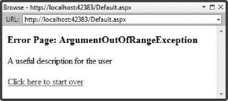
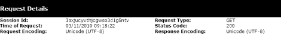

# 七、处理错误

您的 web 应用不会总是像您希望的那样运行。无论您如何仔细地计划和编写您的应用，总有一天您会面临一个 bug、一个错误或一些其他类型的意外行为。

处理错误有两个方面:

*   如何向用户显示错误。正如您将看到的，默认方法远非理想。幸运的是，有一些有用的特性可以改善这种情况，本章将逐一演示。
*   追查错误的原因。主要的技术是使用 ASP.NET 跟踪特性，该特性允许您对代码进行检测，以便了解其执行情况。在本章中，您将学习如何启用跟踪并对其进行定制，以便为您的代码提供额外的洞察力。我们还将谈到使用 Visual Studio 的调试特性，这些特性允许您在处理请求时跟踪请求。

### 处理错误

为了演示处理错误的不同技术，我们需要一个能够按需生成错误的 web 应用。为此，我们将创建一个 ASP.NET 应用，让我们在提交表单时从三个不同的 C# 异常中选择一个来抛出。

#### 创建处理错误示例

要创建示例项目，请按照下列步骤操作:

1.  使用 ASP.NET 空 Web 应用模板创建一个新的 Visual Studio 项目。
2.  Given the project the name `Handling Errors`, as shown in [Figure 7-1](#fig_7_1). 

    ***图 7-1。**创建处理错误项目*

3.  要添加网页，选择项目添加新项目。
4.  选择 WebForm模板，将名称设置为`Default.aspx`，然后单击 Add 按钮。
5.  打开`Default.aspx`文件并编辑内容，使其与清单 7-1 中的[相匹配。](#list_7_1)

***清单 7-1。**产生错误的网页*

`<%@ Page Language="C#" AutoEventWireup="true" CodeBehind="Default.aspx.cs"
 Inherits="Handling_Errors.Default" %>

<!DOCTYPE html PUBLIC "-//W3C//DTD XHTML 1.0 Transitional//EN"
 "http://www.w3.org/TR/xhtml1/DTD/xhtml1-transitional.dtd">

<html >
<head runat="server">
    <title></title>
    
</head>
<body>
    <form id="form1" runat="server">
    

        <b>Select Exception Type:</b>` `        <label for="ArgumentOutOfRangeException">
            <input type="radio" name="exceptionType" id="ArgumentOutOfRangeExceptionControl"
                 value="ArgumentOutOfRangeException" runat="server" checked="true"/>
            ArgumentOutOfRangeException
        </label>

        <label for="InvalidOperationException">
            <input type="radio" name="exceptionType" id="InvalidOperationExceptionControl"
                value="InvalidOperationException" runat="server" />
            InvalidOperationException
        </label>

        <label for="NotImplementedException">
            <input type="radio" name="exceptionType" id="NotImplementedExceptionControl"
                value="NotImplementedException" runat="server" />
            NotImplementedException
        </label>

        <input type="submit" id="button" value="Submit" />
    

    </form>
</body>
</html>`

该网页创建了一个表单，其中包含三个单选按钮和一个用于提交表单的常规按钮。在浏览器中选择文件视图，查看页面是如何呈现的。单选按钮在浏览器中的显示方式略有不同，但是您应该会看到类似于[图 7-2](#fig_7_2) 的内容。

***图 7-2。**显示产生错误的 HTML*

该页为三种 C# 异常类型分别提供了一个单选按钮。我们将通过选中相应的按钮并单击“提交”来选择我们想要查看的例外。处理这个的代码隐藏文件`Default.aspx.cs`，如清单 7-2 中的[所示。](#list_7_2)

***清单 7-2。**处理异常示例的代码隐藏类*

`using System;

namespace Handling_Errors {

    public partial class Default : System.Web.UI.Page {

        protected void Page_Load(object sender, EventArgs e) {

            if (IsPostBack) {
                if (this.ArgumentOutOfRangeExceptionControl.Checked) {
                    throw new ArgumentOutOfRangeException();
                } else if (this.InvalidOperationExceptionControl.Checked) {
                    throw new InvalidOperationException();
                } else if (this.NotImplementedExceptionControl.Checked) {
                    throw new NotImplementedException();
                }
            }
        }
    }
}`

在[清单 7-2](#list_7_2) 中显示的类非常简单。HTML `input`元素由`HtmlInputRadioButton`控件类表示，如果按钮被选中，其属性`Checked`将返回`true`。我们依次测试每个 HTML 控件，并抛出适当的异常。

#### 测试处理错误示例

一旦创建了项目并编辑了页面和类文件，在浏览器中选择文件视图。确保选择了最上面的单选按钮(用于`ArgumentOutOfRangeException`的按钮),然后单击提交按钮。表单将被提交到 ASP.NET 服务器，代码隐藏类将被调用，并抛出一个`ArgumentOutOfRangeException`。在浏览器中，你会看到类似于[图 7-3](#fig_7_3) 的东西。

***图 7-3。**标准 ASP.NET 错误页面*

[图 7-3](#fig_7_3) 显示了遇到异常时的标准 ASP.NET 响应，也就是广为人知的黄屏死机。当您开发 ASP.NET 时，黄色屏幕可以提供很多信息。您可以清楚地看到抛出异常的代码、堆栈跟踪的细节以及关于异常本身的信息。

尽管黄屏对开发人员很有用，但对最终用户来说几乎毫无用处:

*   它不会告诉用户哪里出错了。
*   它没有提供下一步该做什么的任何指示。
*   它公开了您的 web 应用的细节。

向用户显示黄屏被认为是不专业和无益的——以至于本章的很多内容都是关于如何用更有帮助的东西来代替它。

该示例引发的异常会导致*未处理的错误*，这意味着这些异常没有使用代码隐藏类中的`try` / `catch`块进行处理。

所以，ASP.NET 必须对异常做些什么，默认行为是显示黄屏。幸运的是，ASP.NET 支持一系列错误处理特性，这些特性让您可以向用户展示比堆栈跟踪更有用(也不那么暴露和危险)的东西。

#### 处理页面中的错误

处理错误的第一种方法是在代码隐藏类中进行。ASP.NET 通过在`Page`类中定义的`Error`事件提供了一种机制，该类通常是代码隐藏类的基础。当 ASP.NET 在呈现页面时遇到异常时，就会调用`Error`事件。[清单 7-3](#list_7_3) 展示了如何使用`Event`方法处理一个异常。

***清单 7-3。**通过页面处理异常。错误事件*

`using System;

namespace Handling_Errors {

    public partial class Default : System.Web.UI.Page {

        protected void Page_Load(object sender, EventArgs e) {

            if (IsPostBack) {
                if (this.ArgumentOutOfRangeExceptionControl.Checked) {
                    throw new ArgumentOutOfRangeException();
                } else if (this.InvalidOperationExceptionControl.Checked) {
                    throw new InvalidOperationException();
                } else if (this.NotImplementedExceptionControl.Checked) {
                    throw new NotImplementedException();
                }
            }
        }

        protected void Page_Error(object sender, EventArgs e) {

            // get the exception that has caused the Error event to be invoked
            Exception ex = Server.GetLastError();

            // check the type of the exception - we only want to deal with
            // the ArgumentOutOfRangeException in this class
            if (ex is ArgumentOutOfRangeException) {
                // write a message
                Response.Write("<h3>Error Page: ArgumentOutOfRangeException</h3>");
                Response.Write("
A useful description for the user
");
                Response.Write("<a href=\"/Default.aspx\">Click here to start over<a>");
                // clear the error
                Server.ClearError();
            }
        }
    }
}`

当处理页面请求出错时，调用`Page_Error`方法。在第 4 章的[中引入的自动事件连接确保了当`Page.Error`方法被调用时这个方法被调用。](04.html#ch4)

我们通过调用`Server.GetLastError`方法获得抛出的异常。在第 5 章中，当我们查看服务器状态对象时，您会看到这个方法:

`Exception ex = Server.GetLastError();`

我们只想处理这个类中的`ArgumentOutOfRangeException`，所以我们使用`is`关键字测试异常的类型。如果这是一种正确的异常，我们使用`Response.Write`方法编写将显示给用户的 HTML:

`Response.Write("<h3>Error Page: ArgumentOutOfRangeException</h3>");
Response.Write("
A useful description for the user
");
Response.Write("<a href=\"/Default.aspx\">Click here to start over<a>");`

本例中的错误消息只是一个占位符。在一个真正的 web 应用中，给用户的错误消息应该描述*什么*出错了，给*一些提示，为什么*出错了，并给出一些后续步骤。

处理错误的最后一步是调用`Server.ClearError`方法，就像这样:

`Server.ClearError();`

`ClearError`方法告诉 ASP.NET 服务器您已经处理了异常，不需要进一步的操作。如果不调用这个方法，异常就升级，显示死亡黄屏。如果您希望处理异常而不处理它，这可能很有用；例如，您可能想要创建一个日志条目。

运行 web 应用，确保选中了`ArgumentOutOfRangeException`选项，然后单击提交按钮。您将看到处理异常的结果，如图[图 7-4](#fig_7_4) 所示。

***图 7-4。**处理异常*

我们只处理了代码隐藏类中的一种异常类型，这意味着如果您选择了其他选项，您仍然会看到黄色屏幕。

##### 使用自定义错误页面

在前面的示例中，我们以编程方式为错误页面生成了 HTML。这种方法对于简单的应用来说很好，但是它的伸缩性不是很好。这并不理想，因为你想要一致地在许多不同的页面中处理相同类型的异常。相反，将错误处理代码与错误页分开是一种很好的做法。我们可以通过创建一个专门显示错误的网页来做到这一点。[清单 7-4](#list_7_4) 显示了对`Default.aspx.cs`文件中`Page_Error`方法的修改。

***清单 7-4。**参考自定义错误页面*

`protected void Page_Error(object sender, EventArgs e) {

    // get the exception that has caused the Error event to be invoked
    Exception ex = Server.GetLastError();

    // check the type of the exception - we only want to deal with
    // the ArgumentOutOfRangeException in this class
    if (ex is ArgumentOutOfRangeException) {
        // show the custom error page
        Server.Transfer("/CustomError.aspx");
    }
}`

我们仍然希望只处理代码隐藏类中的`ArgumentOutOfRangeException`，但是我们没有直接编写 HTML 来响应，而是使用`Server.Transfer`方法来呈现一个名为`CustomError.aspx`的页面，如[清单 7-5](#list_7_5) 所示。

***清单 7-5。**一个自定义错误网页*

`<%@ Page Language="C#" AutoEventWireup="true" CodeBehind="CustomError.aspx.cs"
 Inherits="Handling_Errors.CustomError" %>

<!DOCTYPE html PUBLIC "-//W3C//DTD XHTML 1.0 Transitional//EN"
 "http://www.w3.org/TR/xhtml1/DTD/xhtml1-transitional.dtd">

<html >
<head runat="server">
    <title>Web Application Error</title>
</head>
<body>

    

    

    <a href="/Default.aspx" runat="server">Click here to start over</a>

</body>
</html>`

清单 7-5 中的网页包含三个元素，用于显示异常的类型、给用户的消息以及到主应用页面的链接。[清单 7-6](#list_7_6) 显示了设置内容的`CustomErrorPage.aspx.cs`代码隐藏文件。

***清单 7-6。**错误页面的代码隐藏类*

`using System;

namespace Handling_Errors {
    public partial class CustomError : System.Web.UI.Page {

        protected void Page_Load(object sender, EventArgs e) {

            // get the exception that we are dealing with
            Exception ex = Server.GetLastError();

            // check that we have an exception - if we don't
            // then transfer the user to the main page
            if (ex != null) {

                // set the content of the HTML controls based on the exception
                exceptionType.InnerHtml = string.Format("<h3>Error page: {0}</h3>",
                    ex.GetType().ToString());
                message.InnerHtml = "
A useful description for the user
";

                // clear the error
                Server.ClearError();

            } else {
                Server.Transfer("/Default.aspx");
            }
        }
    }
}`

当您使用`Server.Transfer`方法调用另一个页面时，请求的状态保持不变，允许您调用`Server.GetLastError`方法来获得导致最初问题的相同异常。在[清单 7-6](#list_7_6) 中的`CustomError`类中，我们使用异常的细节来设置一些内容。

请注意，我们检查是否有异常要处理。如果用户直接从浏览器请求`CustomErrorPage.aspx`文件，这是一个有用的检查。在这种情况下，我们使用`Server.Transfer`来显示主页面。

现在，当您运行应用并选择第一个异常类型时，您会看到自定义页面，如图 7-5 所示。

***图 7-5。**通过自定义页面显示错误*

##### 使用页面控制器

通过使用自定义错误页面，我们将处理异常的代码与显示错误的页面分开。然而，我们最终仍然会有一些代码重复，因为我们需要在项目的每一页中放置错误处理代码。如果每个页面都有不同的错误处理需求，这没关系，但是大多数项目都有应该以相同方式处理的页面组。一个很好的解决方案是创建一个从`Page`派生的公共类。然后，您可以将它用作两个或更多代码隐藏类的基础。这有时被称为页面控制器类。

要添加页面控制器，选择项目添加类，并将名称改为`PageController.cs`。这将是我们的代码隐藏类的基类，所以我们只需要创建一个 C# 类，而不是 ASP.NET 网页。编辑`PageController.cs`文件的内容以匹配[清单 7-7](#list_7_7) 。

***清单 7-7。**处理公共基类中的错误*

`using System;
using System.Web.UI;

namespace Handling_Errors {

    public class PageController : Page {

        protected virtual void Page_Error(object sender, EventArgs e) {
            // get the exception that has caused the Error event to be invoked
            Exception ex = Server.GetLastError();

            // check the type of the exception - we only want to deal with
            // the ArgumentOutOfRangeException in this class
            if (ex is ArgumentOutOfRangeException) {
                // show the custom error page
                Server.Transfer("/CustomError.aspx");
            }
        }
    }
}`

页面控制器可以包含任何你想在你的`Page`类中共享的代码。在这个例子中，我们添加了一个将被派生类继承的`Page_Error`方法。我们用`virtual`关键字注释了这个类，所以这个方法可以根据需要被派生类覆盖。

`Page_Error`处理错误的方式与上一个例子相同:如果导致错误的异常是一个`ArgumentOutOfRangeException`，就会显示`CustomError.aspx`页面。

为了利用页面控制器，我们需要修改我们的代码隐藏类，使其从`PageController`派生，如下所示:

`using System;

namespace Handling_Errors {

    public partial class Default : **PageController** {

        protected void Page_Load(object sender, EventArgs e) {

            if (IsPostBack) {
                if (this.ArgumentOutOfRangeExceptionControl.Checked) {
                    throw new ArgumentOutOfRangeException();
                } else if (this.InvalidOperationExceptionControl.Checked) {
                    throw new InvalidOperationException();
                } else if (this.NotImplementedExceptionControl.Checked) {
                    throw new NotImplementedException();
                }
            }
        }
    }
}`

我们将基类从`Page`改为`PageController`，并移除了`Page_Error`方法，这样`PageController`类中的版本就不会被覆盖或隐藏。

我们的简单示例只包含一个 web 页面，但是在一个真实的项目中，您可以将这些更改应用到所有页面，这样就使用了常见错误处理代码。

#### 处理应用的错误

页面没有处理的任何错误都成为*应用错误*。这些类型的错误可以通过向全局应用类添加一个方法来处理，正如我们在第五章的[中看到的 ASP.NET 事件模型。要创建全局应用类，请按照下列步骤操作:](05.html#ch5)

1.  在 Visual Studio 中，选择项目添加新项。
2.  Select the Global Application Class item from the list of templates, as shown in [Figure 7-6](#fig_7_6). 

    ***图 7-6。**添加全球应用类别*

3.  默认情况下，新类的名称设置为`Global.asax`。单击“添加”按钮将该类添加到项目中。
4.  我们现在可以将错误处理代码添加到`Application_Error`方法中。我们将使用`Global.asax`类来处理三种异常类型中的第二种类型`InvalidOperationException`的实例，如[清单 7-8](#list_7_8) 所示。

***清单 7-8。**处理全局应用类中的异常*

`using System;
using System.Web;

namespace Handling_Errors {
    public class Global : System.Web.HttpApplication {

        protected void Application_Error(object sender, EventArgs e) {
            // get the exception that has caused the Error event to be invoked
            Exception ex = Server.GetLastError();

            // convert the exception so that we have an HttpUnhandledException
            HttpUnhandledException unhandledEx = ex as HttpUnhandledException;

            // check the type of the inner exception - we only want to deal with one type
            if (unhandledEx != null
                && unhandledEx.InnerException is InvalidOperationException) {` `                // show the custom error page
                Server.Transfer("/CustomError.aspx");
            }
        }
    }
}`

只有当有一个错误没有在`Page`类中处理时，才会调用`Global`类中的`Application_Error`方法；也就是说，没有`Page_Error`方法，或者存在的`Page_Error`方法不会导致`Server.ClearError`方法被调用。

导致错误的异常被打包在`System.Web.HttpUnhandledException`类的一个实例中，如果从`Application_Error`方法中调用`Server.GetLastError`方法，就会返回这个异常。可以通过`InnerException`属性获取原始异常。

在[清单 7-8](#list_7_8) 中，我们解开内部异常并检查它是否是`InvalidOperationException`的一个实例。如果是，我们调用`ServerTransfer`来显示我们的自定义错误页面。对于这个例子，我们使用了与页面级错误相同的错误页面，但是您可以很容易地使用不同的页面来处理应用级错误。

更新`CustomError.aspx.cs`文件来处理`HttpUnhandledException`类，如[清单 7-9](#list_7_9) 所示。

***清单 7-9。**使用 HttpUnhandledException 类*

`using System;
using System.Web;

namespace Handling_Errors {
    public partial class CustomError : System.Web.UI.Page {

        protected void Page_Load(object sender, EventArgs e) {

            // get the exception that we are dealing with
            Exception ex = Server.GetLastError();

            **// we need to unpack HttpUnhandledException instances so that**
            **// we get the inner exception to work with**
            **if (ex is HttpUnhandledException) {**
                **ex = ((HttpUnhandledException)ex).InnerException;**
            **}**

            // check that we have an exception - if we don't
            // then transfer the user to the main page
            if (ex != null) {

                // set the content of the HTML controls based on the exception
                exceptionType.InnerHtml = string.Format("<h3>Error page: {0}</h3>",
                    ex.GetType().ToString());
                message.InnerHtml = "
A useful description for the user
";` `                // clear the error
                Server.ClearError();

            } else {
                Server.Transfer("/Default.aspx");
            }
        }
    }
}`

如果由`Server.GetLastError`方法返回的`Exception`是`HttpUnhandledException`的一个实例，那么这些更改(以粗体显示)具有获取`InnerException`属性的值的效果。

#### 配置自定义错误

第三种也是最后一种处理错误的方法是使用`Web.config`文件。应用页面未处理的任何错误都将由配置文件中定义的策略来处理。清单 7-10 展示了这样一个策略。

***清单 7-10。**配置错误处理策略*

`<?xml version="1.0"?>

<configuration>
  <system.web>
    <compilation debug="true" targetFramework="4.0" />

      **<customErrors mode="On" defaultRedirect="/StaticError.html">**
        **<error statusCode="404" redirect="/Default.aspx"/>**
      **</customErrors>**

  </system.web>
</configuration>`

顾名思义，`customErrors`元素定义了使用定制页面处理错误的策略。第一个属性是`mode`，可以设置为以下值之一:

*   `Off`值禁用未处理错误的自定义页面。这意味着对于页面或`Global`类中没有处理的错误，将会显示黄色的死亡屏幕。
*   The `On` value enables custom error pages so that the page specified by the `defaultRedirect` attribute will be displayed when an error isn't handled by either the page or the `Global` class.

     **注意**`customErrors`设置不影响`Page`或`Global`类执行的错误处理。它只控制错误没有在其他地方处理时会发生什么。

*   在向与 web 应用运行在同一台计算机上的浏览器显示页面时，如果出现错误，则`RemoteOnly`值会显示黄色屏幕。它使用任何其他计算机的自定义错误页。

**警惕 REMOTEONLY 自定义错误**

显示自定义错误的`RemoteOnly`选项看起来似乎是一个方便的特性，但是我不认为它在专业程序员的工具箱中有任何位置。

有两种情况可以使用`RemoteOnly`功能:

*   在开发中，当您想要查看错误的详细信息时
*   在生产中，当您想要尝试重现用户报告的问题时

在开发中，您可以显式禁用`Web.config`文件中的定制错误。这是一个很好的实践，因为大多数情况下，你会希望通过查看用户将会看到的内容来开发你的 web 应用。

在生产中，您根本不应该试图重新创建错误。事实上，你试图获得关于一个错误的信息，这意味着你不知道是什么导致了这个错误，也不知道会有什么样的影响。至少，你有中断其他用户服务的风险。将您的测试留给您的开发/测试系统，将生产系统留给服务用户。

由`defaultRedirect`属性的值引用的页面必须是静态 HTML 页面。这是为了避免在处理本应显示错误的页面时出现错误的问题。必须有一个最终的“这一切都错了”的错误页面，这就是它。所以，我们仅限于 HTML。

[清单 7-10](#list_7_10) 中提到的静态页面称为`StaticError.html`，其内容如[清单 7-11](#list_7_11) 所示。使用 HTML 页面模板将`StaticError.html`添加到 Visual Studio 项目中。

***清单 7-11。**静态错误页面*

`<!DOCTYPE html PUBLIC "-//W3C//DTD XHTML 1.0 Transitional//EN"
"http://www.w3.org/TR/xhtml1/DTD/xhtml1-transitional.dtd">
<html >
<head>
    <title>Web Application Error</title>
</head>
<body>
    <h3>A serious error has occurred</h3>
    
A useful message to the user

    <a href="Default.aspx">Click here to start over</a
</body>
</html>`

我们的 web 应用抛出的第三类异常将触发在`Web.config`文件中定义的自定义错误处理。(第一种和第二种分别由`Page`和`Global`类处理。)运行 web 应用，选中`NotImplementedException`选项，然后单击提交按钮。你会看到静态错误页面，如图[图 7-7](#fig_7_7) 所示。

***图 7-7。**静态自定义错误页面*

在[清单 7-10](#list_7_10) 中，我们添加了下面一行:

`<error statusCode="404" redirect="/Default.aspx"/>`

`Web.config`文件中的`customErrors`元素支持对 HTTP 错误代码的自定义操作。当接收到对找不到的文件的请求时，出现代码 404。这一行中显示的配置元素告诉 ASP.NET 服务器在出现错误时将用户重定向到`Default.aspx`文件。您可以使用多个错误元素为不同的错误代码设置策略。如果没有为给定代码设置策略，将使用由`defaultRedirect`属性指定的页面。

#### 将错误处理放在上下文中

您不需要在您的 ASP.NET 应用中处理错误，但是如果您不处理它们，您将最终向您的用户显示黄屏。这不仅会让用户感到烦恼和困惑，而且还会提供关于您的应用的详细信息，而您可能不想传播这些信息。

ASP.NET 为处理异常提供了一个灵活的模型，您可以用任何对您的应用有意义的方式来使用它。未处理错误的基本流程如图[图 7-8](#fig_7_8) 所示。你可以选择进入这些阶段的一部分或全部。

***图 7-8。**错误处理顺序*

您已经看到了如何将`Page_Error`方法自动连接到`Page.Error`事件，并在出现标准`try/catch`代码块无法处理的异常时调用该方法。这种技术的一种变体是页面控制器模式。该模式将常见的错误处理代码合并到一个基类中，然后由各个代码隐藏类派生。这些派生类可以选择有选择地重写页面控制器错误逻辑，或者完全依赖于基实现。

页面代码隐藏类不能处理的错误可以在`Global`类中使用`Application_Error`方法处理，该方法连接到`Application.Error`事件。使用`HttpUnhandledException`类将异常间接地传递给这个方法，并且在使用它们之前必须将其解包。

没有在其他地方处理的错误的后备是在`Web.config`文件中设置的策略。否则，作为最后的手段，可以通过静态 HTML 页面向用户显示未处理的错误。您应该为您的 ASP.NET web 应用设置一个最低限度的`Web.config`错误策略，以确保您不会显示黄屏。

### 使用 ASP.NET 追踪

C# 异常和 ASP.NET 错误处理的结合处理了一种 web 应用编程问题:一种*硬故障*，在这种情况下，某个特定的东西出错了，并用异常来表示。硬故障会导致 ASP.NET 错误，调试过程就变成了找出导致异常的原因并纠正这种情况。诊断一个*软故障*可能会更加困难，这里没有异常，但是 web 应用没有正常运行。

一个帮助追踪软故障原因的工具是 ASP.NET*跟踪*，它提供了关于请求是如何被处理的详细信息。正如您将看到的，这些信息可以用来获得状态和会话数据的细节(关于使用状态特性的细节，请参见[第 6 章](06.html#ch6))，请求处理中每个状态的性能细节，以及您添加的帮助解决问题的任何附加信息。

对于本章的这一部分，我们需要一个遭受软故障的简单 web 应用。

#### 创建 TraceDemo 示例

为了专注于 ASP.NET 追踪功能，而不是构建一个复杂的例子，我们将创建一个简单的求和计算器。

使用 ASP.NET 空 web 应用模板创建一个名为`TraceDemo`的新 Visual Studio 项目，并使用 WebForm模板添加一个名为`Default.aspx`的网页。该文件的内容如[清单 7-12](#list_7_12) 所示。

***清单 7-12。**trace demo 示例的 Default.aspx 文件*

`<%@ Page Language="C#" AutoEventWireup="true" CodeBehind="Default.aspx.cs" Inherits="TraceDemo.Default"%>

<!DOCTYPE html PUBLIC "-//W3C//DTD XHTML 1.0 Transitional//EN" "http://www.w3.org/TR/xhtml1/DTD/xhtml1-transitional.dtd">

<html >
<head runat="server">
    <title>Trace Demo</title>
</head>
<body>
    <form id="form1" runat="server">` `    

        Number: <input type="text" id="numericValue" runat="server" />
        <input type="submit" value="Add" />

        

            Running total: 
        

    

    </form>
</body>
</html>`

该页面有一个简单的布局，允许用户输入一个值和一个 Add 按钮，单击该按钮会将输入的值添加到运行总数中。[图 7-9](#fig_7_9) 显示了这个 HTML 页面如何出现在浏览器中。

***图 7-9。**trace demo 应用*

代码隐藏文件包含清单 7-13 中所示的类。

***清单 7-13。**trace demo 示例的 Default.aspx.cs 文件*

`using System;

namespace TraceDemo {

    public partial class Default : System.Web.UI.Page {

        protected void Page_Load(object sender, EventArgs e) {

            // define a variable for the running total
            float total = 0;

            // get the running total from the session if possible
            if (Session["runningTotal"] != null) {
                total = (float)Session["runningTotal"];
            }` `            if (IsPostBack) {
                // this is a form post - get the value from the HTML control
                string data = numericValue.Value;
                // try to parse the data to a numeric value
                if (data != null) {
                    float incrementalValue = 0;
                    if (float.TryParse(data, out incrementalValue)) {
                        total += incrementalValue;
                    }
                }
            }

            // update the running total on the HTML control
            runningTotal.InnerText = string.Format("{0:F2}", total);

            // update the value stored in the session
            Session["**runningTotals**"] = total;
        }
    }
}`

该类从会话状态数据中检索运行总数，如果这是一个表单 post，则解析用户输入的值并将其添加到总数中。这个 bug(粗体显示)是一个简单的输入错误。其结果是使用不同的密钥来设置和获取会话状态数据。因此，累计总数将不会正确增加，而只会显示先前输入的值。

#### 启用跟踪

您可以通过将`Trace`属性添加到`Page`指令来启用对单个 ASP.NET 页面的跟踪，如下所示:

`<%@ Page Language="C#" AutoEventWireup="true" CodeBehind="Default.aspx.cs"
 Inherits="TraceDemo.Default" Trace="true" %>`

如果`Trace`值为`true`，那么每次请求页面时都会执行跟踪。

要对 web 应用中的所有页面启用跟踪，您可以向`Web.config`文件添加一个`trace`元素，如下所示:

`<?xml version="1.0"?>

<configuration>
   <system.web>
      <compilation debug="true" targetFramework="4.0" />
      <trace enabled="true" pageOutput="true" requestLimit="50" localOnly=”false”/>
   </system.web>
</configuration>`

`requestLimit`参数指定应该跟踪多少个页面请求。默认值为 10，超过该值后，应用将返回正常行为，并且不会执行跟踪。示例中的值指定应该跟踪前 50 个请求。

通常，跟踪信息仅在来自运行 ASP.NET 服务器的同一台计算机的请求上显示。要改变这一点，将`localOnly`属性设置为`false`，如下例所示。

我们将在本章后面的“启用跟踪查看器”一节中查看`pageOutput`属性的效果。

#### 执行追踪

一旦启用了跟踪，您只需请求感兴趣的页面。对于我们这个简单的例子，只有一个页面:`Default.aspx`。在解决方案资源管理器窗口中选择该文件，然后在浏览器中选择文件视图。

页面将被正常处理，但是关于它如何被处理的细节将被附加到浏览器响应的底部，如图 7-10 所示。

***图 7-10。**查看寻人信息*

单页跟踪包含大量信息。在这里，我们将详细查看最有用的部分:

*   请求详细信息
*   跟踪信息
*   控制树
*   会话状态
*   应用状态
*   请求 Cookies 集合
*   响应 Cookies 集合

剩余的跟踪部分提供表单`input`字段中值的详细信息、标题的完整列表、查询字符串值等等。所有这些部分都是有用的，但是您会发现大多数软问题都可以使用列表中的一个部分来诊断。

 **注意**网页上信息的组织方式不适合印刷页面。考虑下载该示例或重新创建它，并使用您自己的跟踪信息进行跟踪。

首先要注意的是，响应包括 web 应用。页面顶部是组成我们简单显示的 HTML 元素。在执行跟踪时，应用保持完全正常运行。

##### 请求详细信息部分

第一个跟踪部分称为请求详细信息，包含关于请求的摘要信息，如图 7-11 中的[所示。](#fig_7_11)

***图 7-11。**请求详情部分*

最有用的信息是会话 ID、请求类型(在本例中是一个`GET`)和对客户机响应的 HTTP 状态代码(在本例中是 200，这意味着 OK)。

##### 痕迹信息部分

跟踪信息部分显示了 ASP.NET 页面处理过程中发生的每个事件以及每个事件花费的时间，如图 7-12 中的[所示。](#fig_7_12)

***图 7-12。**痕迹信息部分*

这些事件代表很短的时间，但是它们对于帮助跟踪性能问题非常有用。时间相对于第一个事件(`PreInit`事件的开始)和前一个事件显示。从这个示例中，我们看到处理代码隐藏类中的代码所花费的时间是 0.000040 秒(这显示为从开始加载和结束加载条目开始的时间)。

当我们在本章稍后讨论使用自定义跟踪消息时，我们将再次回到跟踪输出的这一部分。

##### 控制树部分

控件树部分显示页面中每个 HTML 元素的大小信息，如图 7-13 所示。当浏览器响应的大小导致问题时，此信息非常有用。在[第 5 章](05.html#ch5)中，您看到了视图状态特性如何意外地增加服务器和客户端之间发送的数据量。部分跟踪信息可让您了解情况是否如此。

***图 7-13。**控制树部分*

这是一个 ASP。以. NET 为中心的 HTML 视图，所以所有的 HTML 元素都使用 HTML 控件类来表示。如果元素没有通过`runat`属性对 ASP.NET 可见，那么将使用`LiteralControl`类来表示该元素。对于每个元素，您可以看到它在对客户端的响应中占用的字节数、关联的视图状态字节数以及控件状态的详细信息。控件状态类似于视图状态，它被 WebForm框架广泛使用，我们将在[第 13 章](13.html#ch13)中讲到

在图 7-13 中，你可以看到`runningTotal`元素被分配了 28 字节的视图状态数据。这是少量的数据，但是应用并不使用它，并且在高容量 web 应用的更复杂的页面中可能很重要。关于如何禁用不想要的视图状态的详细信息，参见第 6 章。

##### 国家各部

接下来的四个部分显示不同状态的信息，如图[图 7-14](#fig_7_14) 所示。前两个是会话和应用状态，你可以在[第 6 章](06.html#ch6)中看到。

在[图 7-14](#fig_7_14) 中，我们的应用只有一个会话状态。这就是我们 bug 的原因，大家可以看到关键是`runningTotals`。您还可以看到数据的类型(在本例中是`System.Single`，它是。NET 对应物为 C# `float`类型)和数据的值(本例中为 0)。使用这些数据，我们可能会发现我们的错误，但它需要对细节有一个好的眼光。我们将介绍一种使用定制跟踪消息诊断问题的更简单的方法，如下一节所述。

***图 7-14。**会话、应用和 cookie 部分*

另外两个部分显示了与请求和响应相关联的 cookies。该跟踪中只有一个 cookie，它包含会话标识符。有关如何使用有或没有 cookies 的会话的详细信息，请参见第 6 章。

#### 添加自定义跟踪消息

跟踪功能最有用的部分是能够在页面被请求时添加自己的消息以包含在跟踪过程中。

`Page.Trace`属性返回一个`System.Web.TraceContext`对象，您可以使用它向代码中添加语句。这些语句的输出将包含在与代码关联的页面的跟踪信息中。来自`TraceContext`类的两个关键方法是`Write`和`Warn`，如[清单 7-14](#list_7_14) 所示。

***清单 7-14。**向代码隐藏类添加自定义跟踪语句*

`using System;

namespace TraceDemo {

    public partial class Default : System.Web.UI.Page {

        protected void Page_Load(object sender, EventArgs e) {
            **Trace.Write("---Started");**` `            // define a variable for the running total
            **Trace.Write("Initializing local variable");**
            float total = 0;

            // get the running total from the session if possible
           if (Session["runningTotal"] != null) {
                **Trace.Write("Session state data obtained");**
                total = (float)Session["runningTotal"];
            } else if (IsPostBack) {
                **Trace.Warn("No session state data found");**
            } else {
                **Trace.Write("No session data for initial request");**
            }

            if (IsPostBack) {
                // this is a form post - get the value from the HTML control
                string data = numericValue.Value;
                **Trace.Write(string.Format("User has entered data: {0}", data));**
                // try to parse the data to a numeric value
                if (data != null) {
                    float incrementalValue = 0;
                    if (float.TryParse(data, out incrementalValue)) {
                        total += incrementalValue;
                        **Trace.Write(string.Format("Numeric value: {0}, new total: {1}",**
                            **incrementalValue, total));**
                    } else {
                        **Trace.Warn("Cannot parse data to float value");**
                    }
                } else {
                    **Trace.Warn("No data has been provided by user");**
                }
            }

            // update the running total on the HTML control
            **Trace.Write("Setting display for total");**
            runningTotal.InnerText = string.Format("{0:F2}", total);

            // update the value stored in the session
            **Trace.Write("Setting new state data value");**
            Session["runningTotals"] = total;
            **Trace.Write("---Finished");**
        }
    }
}`

粗体显示的语句是调用`Trace.Write`或`Trace.Warn`的加法。`Write`方法用于检测页面中的预期操作——表示正常进度的东西。`Warn`方法用于标记潜在的问题。以下是两种说法的使用示例:

`if (Session["runningTotal"] != null) {
    Trace.Write("Session state data obtained");
    total = (float)Session["runningTotal"];
} else if (IsPostBack) {
    Trace.Warn("No session state data found");
} else {
    Trace.Write("No session data for initial request");
}`

代码中的预期是，当会话本身被创建时，除了初始请求之外，所有请求都有会话状态数据。当成功检索到会话数据时，对`Trace.Write`的调用会在跟踪日志中打印一条消息。

如果没有会话数据，我们可能会遇到问题，所以这个例子使用了`Trace.Warn`方法在跟踪日志中打印一条警告消息。如果查看页面，使用`Trace.Write`和`Trace.Warn`方法编写的消息包含在跟踪信息部分，如图[图 7-15](#fig_7_15) 所示。

***图 7-15。**显示自定义跟踪信息*

ASP.NET 服务器将处理页面时遇到的调用`Trace.Write`或`Trace.Warn`方法的任何语句的输出添加到跟踪数据中。使用这个输出，您可以在页面代码执行时跟踪它的流程。`Trace.Warn`方法产生红色输出来吸引注意力。在我们的示例中，一条语句用红色标记，它告诉我们没有找到会话状态数据。图 7-15 中[的轨迹是在输入元素中输入值 22 并点击几次添加按钮的结果。](#fig_7_15)

这是帮助您找到 bug 的线索。您可以从跟踪消息中看到状态数据正在更新。这告诉你，当你获取或设置数据时，有什么地方出错了。您可以添加更多的跟踪消息来帮助进一步确定问题。在这个简单的示例中，对代码的直观检查表明，用于获取和设置会话状态数据的键不匹配。

#### 使用跟踪查看器

将跟踪信息附加到页面并不总是很方便。跟踪查看器功能在单个页面上显示一组跟踪的请求，并允许您选择感兴趣的请求。当您试图理解一个跨越多个请求甚至多个页面的问题时，这尤其有用。

##### 启用跟踪查看器

要切换到跟踪查看器，将`pageOutput`属性的值设置为`false`，如[清单 7-15](#list_7_15) 所示。

***清单 7-15。**启用痕迹查看*

`<?xml version="1.0"?>

<configuration>
   <system.web>
      <compilation debug="true" targetFramework="4.0" />
      <trace enabled="true" **pageOutput="false"** requestLimit="50"/>
   </system.web>
</configuration>`

这一更改导致跟踪数据被存储，而不是显示在页面的末尾。以这种方式跟踪时,`requestLimit`属性尤其重要。您必须确保该限制足够高，以存储重新创建软故障所需的跟踪数量。

##### 在跟踪查看器中查看跟踪

第一步是重现问题。选择您想要开始的页面，然后在浏览器中选择文件视图。像用户一样使用您的 web 应用。例如，尝试将值 20、30 和 40 相加。

使用完网络应用后，导航至页面`Trace.axd`。如果您的应用在`[http://localhost:1234/Default.aspx](http://localhost:1234/Default.aspx)`可用，则导航至`[http://localhost:1234/Trace.axd](http://localhost:1234/Trace.axd)`。这是跟踪查看器的 URL，如图[图 7-16](#fig_7_16) 所示。

***图 7-16。**ASP.NET 痕迹查看器*

显示了对 ASP.NET 服务器的所有请求。即使在这个简单的例子中，也不是所有这些都有用。

您可以看到有两个对`favicon.ico`的请求，它们代表浏览器要求在 URL 旁边显示图标。我们的 web 应用项目中没有一个`favicon.ico`文件，因此这些请求的状态代码是 404，这意味着没有找到所请求的文件。

其余的请求都是针对`Default.aspx`的，并且都成功完成(状态码 200)。第一个请求是一个`GET`，但是其余的都是`POST`，这就是你对基于表单的 ASP.NET web 应用的期望。

注意图 7-16 中[黑框右侧的剩余标签。这表明在应用恢复正常行为之前还会跟踪多少请求。您可以通过单击页面顶部的“清除当前跟踪”链接来重新启动跟踪(并重置此计数器)。](#fig_7_16)

您可以通过单击相应的“查看详细信息”链接来查看任何单个请求的详细信息。这会将您带到一个摘要页面，其中包含您之前看到的相同跟踪信息。

跟踪查看器使查找某些类型的错误变得更加容易。我们的示例 web 应用中的问题就是一个很好的例子。如果您依次查看每个请求的详细信息，您会很快注意到警告没有会话状态数据的消息(用红色清楚地标出以引人注目)。

跟踪查看器的缺点是它捕捉到每个对 ASP.NET 服务器的请求，这使得很难弄清楚发生了什么，如图 7-17 所示。

***图 7-17。**重叠痕迹*

跟踪查看器的缺点是不能过滤数据。为了创建如图 7-17 所示的一组轨迹，我交错了两个浏览器窗口的请求。这仍然是一个简单的请求序列，但是结果是更多无意义的请求(`favicon.ico`文件尤其流行)。您将需要查看每个请求的详细信息，以确定哪些请求与两个会话相关联。

当您可以最大限度地减少与您的 bug 搜索不直接相关的请求数量时，跟踪查看器最有用。

 **提示**一些针对 ASP.NET 的商业追踪包具有详细的过滤和分析功能。我对这些软件包的体验是复杂的。分析工具可能很有用，但是您必须使用自定义跟踪类来检测您的 web 应用。很少有项目组织得足够好，能够在严重的问题出现之前就协商好高级诊断的许可，并执行测试。当您意识到您可以从这些工具中获益时，您已经没有时间或机会去获得它们并把它们放在适当的位置。

#### 将 ASP.NET 描摹置于语境中

当您试图跟踪 web 应用中的行为错误时，ASP.NET 跟踪功能会非常有用。这些错误不会导致错误，但这意味着应用不会按预期执行。

开始跟踪的最简单方法是查看附加到页面响应末尾的信息。为页面生命周期中发生的每个事件以及整个请求/响应提供了详细信息。

真正强大的功能来自定制的跟踪消息，它允许您检测页面代码流，以及标记潜在的错误情况。跟踪消息不会识别 bug，但是它们可以让您对导致问题的代码区域有一个坚实的理解。

我是 trace 特性的忠实粉丝。它让我了解页面的处理工作花在了哪里，并为详细的插装提供了基础。习惯上，我在调试过程的早期使用这个特性。

### 使用 Visual Studio 调试器

Visual Studio 包括一个强大而灵活的调试器。您可以使用它作为跟踪的替代方法来发现各种错误和 bug 的根本原因。使用调试器的优点是，您可以在代码执行时跟踪代码的执行，而不是依赖于请求处理后可用的跟踪摘要。

调试 ASP.NET 页面请求就像调试普通的 C# 程序一样。您设置断点，运行程序，然后等待调试器中断。一旦发生这种情况，您就可以逐句通过代码来跟踪它的执行。在这一节中，我将向您展示如何有选择地中断调试器以获得对调试过程的细粒度控制。

#### 设置断点

使用调试器的第一步是设置断点。这是调试器中断代码正常执行并将控制权交给您的地方。

断点的问题在于，默认情况下，它们相当粗糙。到达具有断点的语句，执行停止。当调试 ASP.NET 时，这可能是一个问题，因为相同的代码可以用于不同的任务，例如处理一个`GET`和一个`POST`。有两种技术可以用来使断点更加具体:设置条件断点或使用编程断点。

清单 7-16 显示了我们将在本节中使用的代码隐藏类(我已经删除了前一节中添加的`trace`语句)。

***清单 7-16。**调试器示例的代码隐藏类*

`using System;

namespace TraceDemo {

    public partial class Default : System.Web.UI.Page {

        protected void Page_Load(object sender, EventArgs e) {` `            // define a variable for the running total
            float total = 0;

            // get the running total from the session if possible
            if (Session["runningTotal"] != null) {
                total = (float)Session["runningTotal"];
            }

            if (IsPostBack) {
                // this is a form post - get the value from the HTML control
                string data = numericValue.Value;
                // try to parse the data to a numeric value
                if (data != null) {
                    float incrementalValue = 0;
                    if (float.TryParse(data, out incrementalValue)) {
                        total += incrementalValue;
                    }
                }
            }

            // update the running total on the HTML control
            runningTotal.InnerText = string.Format("{0:F2}", total);

            // update the value stored in the session
            Session["runningTotals"] = total;
        }
    }
}`

##### 设置条件断点

如果您使用的是 Visual Studio 2010 专业版或旗舰版，则可以设置条件断点。此功能在 Visual Web Developer 2010 Express 中不可用(高级调试功能是 Microsoft 区分 Visual Studio 高级版和 Express 版的方式之一)。有关适用于所有版本的替代方法，请参见下一节。

我们将设置一个断点，只有当我们处理一个`POST`请求并且没有可用的会话状态数据时，才会触发这个断点。第一步是在 Visual Studio 代码编辑器中右击以下语句:

`if (IsPostBack) {`

选择调试切换断点，将断点添加到所选语句。Visual Studio 通过将文本涂成红色并在语句旁边的空白处添加一个红圈来指示断点，如图 7-18 中的[所示。](#fig_7_18)

***图 7-18。**添加断点*

每当遇到此断点时，它将停止执行。要使断点更加具体，请右键单击空白处的红色圆圈，然后从弹出菜单中选择“条件”。这将打开断点条件窗口，如图[图 7-19](#fig_7_19) 所示。

***图 7-19。**设置断点条件*

条件以 C# 表达式的形式陈述。每次遇到断点时都会计算条件，如果条件计算结果为 true，执行将会中断。

程序员有责任确保表达式的计算符合预期。为了帮助减少打字错误，Visual Studio 将在您键入时提供自动完成帮助。

在可以处理的条件范围内有很大的灵活性。在我们的例子中，我们希望我们的断点在我们处理一个`POST`请求时工作，并且没有会话状态数据，所以条件如下:

`this.IsPostBack && Session["runningTotal"] == null`

您输入的条件将根据断点的位置而有所不同。例如，如果我们在我们选择的`if`语句之后的代码块中添加一个断点，我们将需要测试会话状态数据的可用性，因为只有当`IsPostBack`属性返回`true`时才会到达断点。

##### 设置编程断点

那个。NET Framework 类库支持以编程方式创建断点。与上一节中介绍的技术不同，这种方法适用于 Visual Studio 的所有版本。

我喜欢 Visual Studio 高级版附带的高级调试功能，但在使用 ASP.NET 时，我倾向于使用编程断点。在某种程度上，这是因为我喜欢在较轻的速成版和较重(有时较慢)的终极版之间切换，并且在两个版本中对编程断点的处理是一致的。

打破调试器的能力来自于`System.Diagnostics.Debugger`类，它包含了`Break`方法。将对`Break`方法的调用包装在一个`if`子句中，使断点具有选择性，如[清单 7-17](#list_7_17) 所示(增加的部分以粗体显示)。

***清单 7-17。**一个程序化断点*

`using System;
using System.Diagnostics;

namespace TraceDemo {

    public partial class Default : System.Web.UI.Page {

        protected void Page_Load(object sender, EventArgs e) {

            // define a variable for the running total
            float total = 0;

            // get the running total from the session if possible
            if (Session["runningTotal"] != null) {
                total = (float)Session["runningTotal"];
            }

            **if (IsPostBack && Session["runningTotal"] == null) {**
                **Debugger.Break();**
            **}**

            if (IsPostBack) {
                // this is a form post - get the value from the HTML control
                string data = numericValue.Value;
                // try to parse the data to a numeric value
                if (data != null) {
                    float incrementalValue = 0;
                    if (float.TryParse(data, out incrementalValue)) {
                        total += incrementalValue;
                    }
                }
            }

            // update the running total on the HTML control
            runningTotal.InnerText = string.Format("{0:F2}", total);` `            // update the value stored in the session
            Session["runningTotals"] = total;
        }
    }
}`

这不像使用 Visual Studio 条件断点那样优雅，因为代码和断点混合在一起，但它完成了工作，并且您可以很容易地看到断点将暂停代码执行的条件。

#### 选择起始页

在开始调试之前，我们需要确保调试器启动时显示正确的页面。对于只有一个页面的项目，例如我们的例子，您不需要这样做，但是很少有 web 应用只有一个页面。

选择项目 < *项目名称* >属性(其中< *项目名称* e >是您的 Visual Studio 项目的名称)。点击 Web 选项卡，查看项目可用的启动操作选项，如图[图 7-20](#fig_7_20) 所示。

***图 7-20。ASP.NET 项目的开始行动选项***

默认选项是“当前页”，这意味着在“解决方案资源管理器”窗口中选择的页将是最初加载的页。您还可以选择一个特定的页面，或者选择不打开某个页面—在这种情况下，在您使用 web 浏览器请求页面之前，什么都不会发生。

#### 运行调试器

一旦设置了断点并选择了起始页，就可以运行调试器了。选择调试开始调试。这个简单的应用将被加载到浏览器中。在我们进行表单提交之前，断点不会执行，所以在文本框中输入一个值，然后单击 Add 按钮。

当到达断点时(如果使用 Visual Studio 断点，则满足条件)，Visual Studio 将打开该页的代码文件并显示断点。web 应用的执行已停止，并已移交给您控制。您可以使用 Debug 菜单中的项目来单步调试代码，并使用 Locals 窗口来查看您的`Page`类的状态如何随着处理的执行而变化。

### 总结

任何应用都会出现 bug，web 应用也不例外。幸运的是，ASP.NET 包含一些成熟而有用的特性，让您可以在生产中出现问题时进行处理，并在测试过程中跟踪它们。

在这一章中，我们探讨了在 web 应用中处理错误的 ASP.NET 特性。这些提供了一个灵活的多级系统，在如何处理不同类型的错误方面有很大的选择余地。ASP.NET 错误等同于 C# 异常，被归类为硬故障，这意味着当问题出现时，容易检测到的故障是显而易见的，如果不使用错误处理功能之一，ASP.NET 就无法处理页面请求。

相比之下，软故障不会导致 C# 异常。页面请求被正确处理，但是 web 应用没有按照预期的方式运行。您看到了如何使用 ASP.NET 跟踪特性来检测您的代码，并深入了解它是如何运行的。我们还简要介绍了使用 Visual Studio 调试器作为跟踪的替代方法。