# 八、使用数据

大多数 web 应用程序依赖于某种数据库。那个。NET Framework 有一系列不同的数据访问技术，其中许多是 ADO 的一部分。NET——的家族。NET 技术提供了对关系数据库的统一和一致的访问。

所有的数据技术都可以用于 ASP.NET。本章演示了两个最重要和最广泛使用的功能:实体框架和语言集成查询(LINQ)功能。这种组合允许您使用常规的 C#类和对象来处理数据，使您不必在代码中包含 SQL 语句。但是，如果您喜欢其他技术组合，也不用担心。尽管本章的一些内容是针对 LINQ 和实体框架的，但是更广泛的设计和最佳实践原则适用于任何数据存储。

在本章中，我们将从本书的下载中包含的示例数据库中创建一个数据模型，并使用它来创建一个 web 应用程序，该应用程序将允许我们列出、创建、更新和删除铁人三项赛事。这被认为是一个 CRUD(创建、读取、更新、删除)应用程序。

### 创建数据模型

实体框架是一个*对象-关系映射* (ORM)系统，它允许我们使用 C#对象处理关系数据。使这成为可能的是一个*数据模型*，它使用 C#类来表示数据库中的表和列。

Visual Studio 包含一个向导，该向导简化了数据模型的创建并将其添加到项目中。我们将使用本书附带的下载中包含的示例数据库来构建一个模型。这个数据库叫做`TrainingData`，意在追踪铁人三项训练数据。

按照以下步骤创建数据模型:

1.  Create a new Visual Studio project using the ASP.NET Empty Web Application template, as shown in [Figure 8-1](#fig_8_1). Name this project `DataApp`. 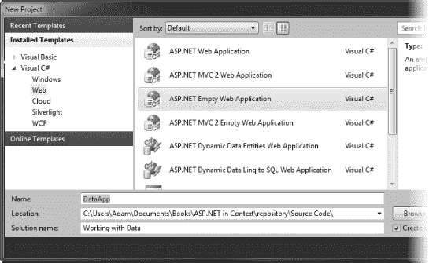

    ***图 8-1。**创建 DataApp 项目*

2.  从菜单中选择项目添加新项，然后从数据模板类别中选择 ADO.NET 实体数据模型模板。
3.  The convention is to give the entity data model a name that corresponds with the database we are modeling. Set the name to `TrainingModel.edmx`, as shown in [Figure 8-2](#fig_8_2), and then click the Add button. 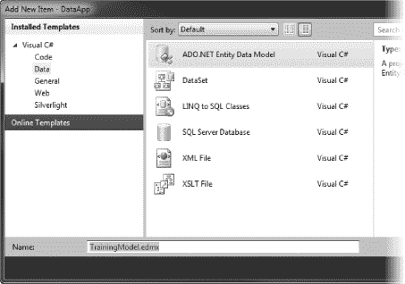

    ***图 8-2。**添加 ADO.NET 实体数据模型项*

4.  The Entity Data Model Wizard starts. We are going to create a data model from an existing database, so select the Generate from database option, as shown in [Figure 8-3](#fig_8_3). (The alternative is to create the model first and then use it to create the database.) Click Next to continue. 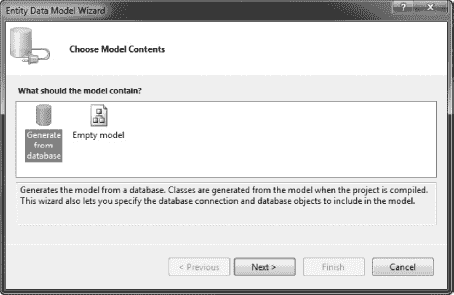

    ***图 8-3。**选择实体数据模型的来源*

5.  On the next screen, we define the connection to the data, as shown by [Figure 8-4](#fig_8_4). Click the New Connection button. 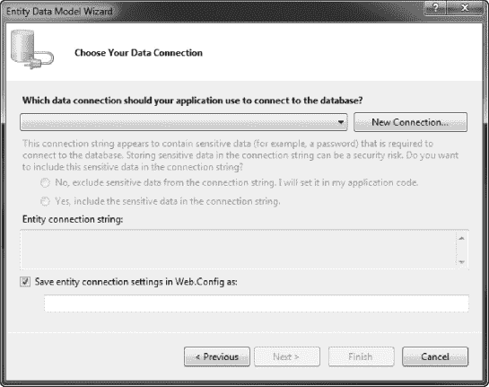

    ***图 8-4。**选择数据连接*

6.  The Connection Properties dialog appears. Visual Studio can make different kinds of database connections, including to existing databases running on database servers. We are going to use an approach that lets us specify a file containing the database, which Visual Studio will attach to the SQL Server instance we installed in [Chapter 2](02.html#ch2). Click the Change button, and select the Microsoft SQL Server Database File option from the set data source options, as shown in [Figure 8-5](#fig_8_5). Then click the OK button. 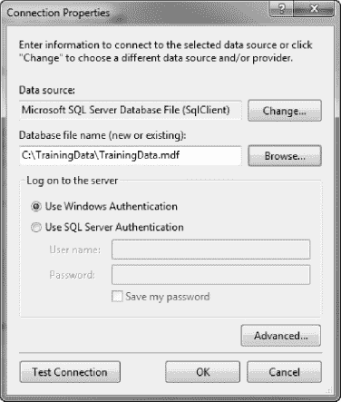

    ***图 8-5。**连接属性对话框*

7.  单击浏览按钮选择数据库文件。我们想使用本书附带的下载中包含的`TrainingData.mdf`文件。接下来章节中的许多项目都需要数据模型，所以您会希望文件放在容易找到的地方。我创建了一个名为`C:\TrainingData`的目录，并将`TrainingData.mdf`和`TrainingData_log.mdf`文件复制到那里。选择文件后，单击确定。
8.  Now the wizard's Choose Your Data Connection window has been populated with the details of our selected database connection, as shown in [Figure 8-6](#fig_8_6). The populated window includes the connection string that contains the information that ADO.NET needs to connect to the database. We don't want to need to include this string in our code when we use the entity data model, so ensure that the checkbox is checked so that the connection string is stored in the `Web.config` file, and then click the Next button. 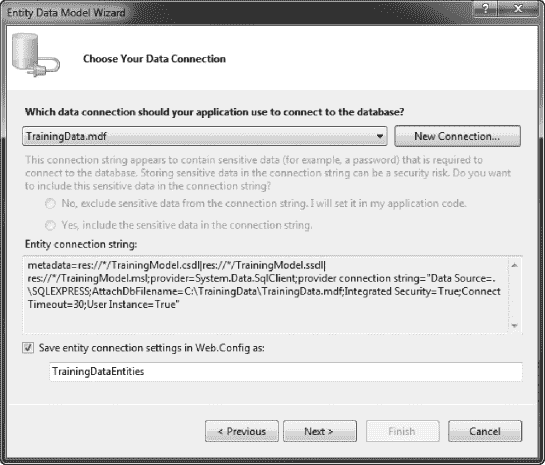

    ***图 8-6。**被填充的选择你的数据连接窗口*

9.  You will see the dialog shown in [Figure 8-7](#fig_8_7). At this point, you can choose to copy the database file into the project, so that the connection string will be updated automatically. I recommend leaving the database file outside the project, because this will make it easier to create the projects in the later chapters that rely on the same file. Click either the Yes or No button to dismiss the dialog. 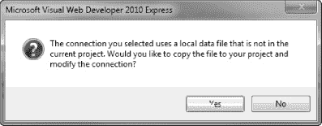

    ***图 8-7。**选择是否将数据文件复制到项目*

10.  You are prompted to specify which parts of the database to include in the data model, as shown in [Figure 8-8](#fig_8_8). The database we are using is pretty simple, but it contains additional tables and stored procedures that were created when I modeled the schema using the SQL Server Management Studio tool. These additions are harmless, but we don't need them included in the entity data model. Expand the Tables item and check the `Athletes`, `Events`, `EventTypes`, and `ReferenceTimes` tables. Then expand the Stored Procedures item and select the `GetPersonalRanking` and `GetReferenceRanking` stored procedures. 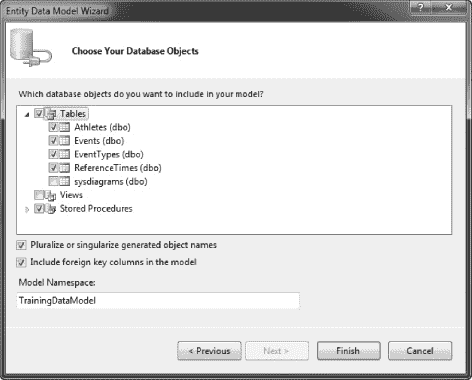

    ***图 8-8。**选择要包含在数据模型中的数据库对象*

11.  确保选中两个复选框。选中第一项意味着为模拟表中的行而创建的类是复数或单数的。例如，为表示表`Athletes`中的一行而创建的类将被称为`Athlete`。这是一个方便的特性，它使得在实体数据模型中使用对象变得更加自然。第二个复选框强制表之间的外键关系。在`TrainingData`数据库中有几个外键关系。
12.  用于包含组成实体数据模型的类的名称空间的名称是自动生成的。如果需要，您可以更改它，但是在本章中，我们将坚持使用默认值`TrainingDataModel`。一旦选择了表和过程，并选中了复选框，单击 Finish 按钮创建数据模型。

创建模型可能需要一段时间，但是一旦这个过程完成，您将会看到项目的一些变化。有一些支持实体框架所需的新引用，以及两个新的项目文件:

*   `TrainingModel.edmx`，这是数据模型
*   `TrainingModel.Designer.cs`，它包含已经被创建来对数据库的表和行建模的类

**为您的 Web 应用选择数据库服务器**

最适合您的 ASP.NET web 应用程序的数据库服务器是您已经了解的服务器。

一个数据库服务器相对于另一个数据库服务器的潜在优势充其量是微不足道的。当您的数据库管理员开始熟悉一个全新产品的内部工作时，一系列复杂而微妙的性能问题和意想不到的行为通常会超过任何优势。学习构建和调优数据库需要时间，所以如果您(或您的团队)有使用一个产品系列的经验，您应该坚持使用它，不管它是 SQL Server、Oracle、MySQL，还是其他无关的产品。

如果你真的是从零开始，并且没有以前的经验，我建议你考虑如何托管你的 web 应用程序。大多数主机提供商认为 ASP.NET web 应用程序将需要 SQL Server，并提供有吸引力的组合价格。SQL Server 不是最有活力的产品，但它是一个很好的全方位数据库服务器。当然，它经过了与. NET 互操作性的全面测试。

#### 查看实体数据模型

创建数据模型时，`TrainingModel.edmx`文件会自动打开。它显示了已经创建的每个类的可视化表示。这些被称为*实体类*。图 8-9 显示了我的项目的模型。您的可能看起来略有不同，这取决于 Visual Studio 如何布局显示。

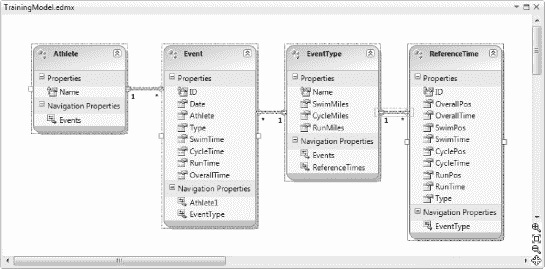

***图 8-9。**实体数据模型的可视化表示*

图 8-9 中的四个项目中的每一个都代表一个实体类，从这些类中创建的对象将被用来代表相关表中的行。`TrainingData`数据库包括四个表(不包括建模过程中添加的表):

*   `Athletes`表包含一个姓名列表。
*   `EventTypes`表格包含不同种类铁人三项的详细信息。
*   `Events`表包含了`Athletes`表中列出的人参加的铁人三项赛的详细信息。
*   为了便于比较，表中包含了我所在地区的比赛结果。它对应于`EventTypes`表中列出的每种事件类型。

从[图 8-9](#fig_8_9) 中可以看到，这些表导致了实体类`Athlete`、`Event`、`EventType`和`ReferenceTime`。

每个类都有一组属性，对应于它所代表的表的列。这些属性是 C#类型。SQL 类型之间的映射是自动完成的。例如，[表 8-1](#tab_8_1) 显示了`Event`类的列和类型，它代表了`Events`表中的一行。

T2】

当你创建一个新的`Event`对象或者修改一个现有的对象时(我们将在本章后面做)，你使用 C#类型，比如`string`和`TimeSpan`，而不需要担心与 SQL 类型的相互转换。

#### 导入存储过程

即使我们将存储过程从数据库导入到实体模型中，我们也必须采取额外的步骤才能在 web 应用程序中使用它们。我们需要采取这一步骤，以便实体框架知道如何表示存储过程的结果。`GetPersonalRanking`程序的目的是将铁人三项时间与之前的个人表现进行比较。结果是一个两列的表格，包含铁人三项活动的范围(游泳、跑步、骑自行车)和每个活动的排名。我们将创建一个新的实体类型来表示调用这个存储过程的结果。我们还将为`GetReferenceRanking`过程创建一个新的实体类型。

按照以下步骤导入存储过程:

1.  Open the `TrainingModel.edmx` file so that the entity model diagram shown in [Figure 8-9](#fig_8_9) is displayed. Open the Model Browser window using the View menu (this item may be under the Other Windows submenu, depending on the Visual Studio edition you are using). Expand the tree of items so that you can see that Stored Procedures list, as shown in [Figure 8-10](#fig_8_10). 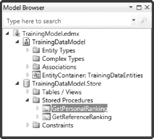

    ***图 8-10。**模型浏览器窗口*

2.  右键单击名为`GetPersonalRanking`的过程，并从弹出菜单中选择 Add Function Import。
3.  The Add Function Import dialog opens. Click Get Column Information. This will get the details of the stored procedure result and display them in the table at the bottom of the dialog box, as shown in [Figure 8-11](#fig_8_11). 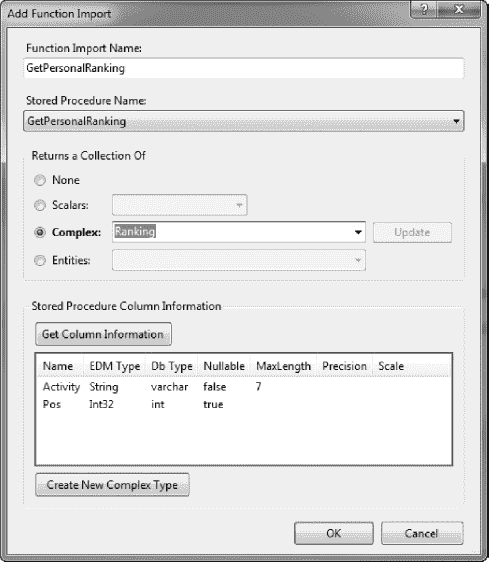

    ***图 8-11。**添加功能导入对话框*

4.  单击“新建复杂类型”按钮。这将创建一个新的实体类型，它将具有结果的`Activity`和`Pos`列的属性。
5.  将复杂文本框中类型的默认名称更改为 Ranking。然后单击 OK 导入存储过程并创建新的实体类型。
6.  在模型浏览器窗口中右键单击`GetReferenceRanking`过程，重复步骤 2 到 5，但这次不是单击创建新的复杂类型按钮，而是选择复杂单选按钮并从下拉列表中选择 Ranking。这样，我们使用相同的实体类型来表示两个存储过程的结果。

现在我们已经创建了数据模型，我们可以开始在我们的 web 应用程序中使用它了。

### 使用数据模型

使用实体数据模型的基本方法是创建一个*实体上下文*类的实例，然后使用它的属性来访问表的内容。在表格中，每一行都由*实体对象*表示，这些实体对象是在[图 8-9](#fig_8_9) 中建模的*实体类*的实例。我们可以使用这些对象和属性来查询和操作数据库中的数据，如下节所示。

#### 查询数据模型

清单 8-1 显示了使用名称`ListEvents.aspx`添加到我们项目中的网页内容。

***清单 8-1。**一个简单的网页*

`<%@ Page Language="C#" AutoEventWireup="true" CodeBehind="ListEvents.aspx.cs"
 Inherits="DataApp.ListEvents" %>

<!DOCTYPE html PUBLIC "-//W3C//DTD XHTML 1.0 Transitional//EN"
 "http://www.w3.org/TR/xhtml1/DTD/xhtml1-transitional.dtd">

<html >
<head runat="server">
    <title>Event List</title>
</head>
<body>
    <form id="form1" runat="server">

        <table id="resultsTable" runat="server" rules="cols">
            <tr>
                <th>Date</th>
                <th>Athlete</th>
                <th>Event Type</th>
                <th>Swim</th>
                <th>Cycle</th>
                <th>Run</th>
                <th>Overall</th>
            </tr>
        </table>

    </form>
</body>
</html>`

该页面包含一个简单的表格，表格中的列与`Event`实体类中的每个属性相匹配。相关的代码隐藏文件`ListEvents.aspx.cs`，如[清单 8-2](#list_8_2) 所示。

***清单 8-2。**list events . aspx . cs 文件*

`using System;
using System.Web.UI.HtmlControls;

namespace DataApp {

    public partial class ListEvents : System.Web.UI.Page {

        protected void Page_Load(object sender, EventArgs e) {

            // create the entity data model context object
            using (TrainingDataEntities context = new TrainingDataEntities()) {

                // enumerate the objects in the context.Events property - these
                // correspond to the rows in the Events table in the database
                foreach (Event ev in context.Events) {
                    // process the entity object
                    ProcessEvent(ev);
                }
            }
        }

        private void ProcessEvent(Event eventParam) {

            // create a new table row
            HtmlTableRow row = new HtmlTableRow();

            row.Cells.Add(CreateTableCell(eventParam.Date.ToString("MM/dd")));
            row.Cells.Add(CreateTableCell(eventParam.Athlete));
            row.Cells.Add(CreateTableCell(eventParam.Type));
            row.Cells.Add(CreateTableCell(eventParam.SwimTime.ToString()));
            row.Cells.Add(CreateTableCell(eventParam.CycleTime.ToString()));
            row.Cells.Add(CreateTableCell(eventParam.RunTime.ToString()));
            row.Cells.Add(CreateTableCell(eventParam.OverallTime.ToString()));

            // add the row to the table
            resultsTable.Rows.Add(row);
        }

        private HtmlTableCell CreateTableCell(string textParam) {
            return new HtmlTableCell() { InnerText = textParam };
        }
    }
}`

在`Page_Load`方法中，我们创建了一个实体上下文类的新实例。类的名称被设置为数据库的名称加上`Entities`。对于我们的例子，因为数据库被称为`TrainingData`，所以上下文类被称为`TrainingDataEntities`。我们使用默认的构造函数创建这个实例，如下所示:

`TrainingDataEntities context = new TrainingDataEntities();`

这个对象是我们进入实体数据模型和它所代表的数据库的入口点。几乎所有事情都会自动处理。我们不需要管理到数据库服务器的连接、转换数据类型，甚至不需要发出查询来加载数据。

**实体上下文对象的生命周期**

在[清单 8-2](#list_8_2) 中，我们在`using`代码块中创建了上下文对象。这意味着对象一旦超出范围就会被处理掉。上下文对象占用内存和数据库服务器中的资源。为了确保您的 web 应用程序能够正确伸缩，在使用完 context 对象后显式释放它是非常重要的。一个`using`块是最简单可靠的方法:

`using (TrainingDataEntities context = new TrainingDataEntities()) {
    ... use data model
}`

然而，不要试图创建一个上下文对象并在请求之间共享它。当对数据库的修改导致错误时，这会产生问题。

实体上下文具有表示数据库中每个表的属性。在`TrainingDataEntities`的情况下，这些属性被称为`Athletes`、`EventTypes`、`Events`和`ReferenceTimes`。这些属性中的每一个都返回表示适当表中的行的实体对象的集合。例如，`Events`属性返回一组`Event`对象，每个对象代表`Events`表中的一行。您不需要显式加载数据来访问行；您可以像使用任何其他集合一样使用该集合。在[清单 8-2](#list_8_2) 中，我们使用一个`foreach`循环枚举了所有的`Event`对象，如下所示:

`foreach (Event ev in context.Events) {
    ProcessEvent(ev);
}`

我将处理每个`Event`对象的代码分离出来，以强调通过上下文对象访问这些对象的方式。每个实体类都定义了与其所属的表中的列相对应的属性。我们在`ProcessEvent`方法中读取这些属性，以便在`ListingEvents.aspx`页面中定义的 HTML 表中添加一行:

`private void ProcessEvent(Event eventParam) {

    // create a new table row
    HtmlTableRow row = new HtmlTableRow();

    row.Cells.Add(CreateTableCell(eventParam.Date.ToString("MM/dd")));
    row.Cells.Add(CreateTableCell(eventParam.Athlete));
    row.Cells.Add(CreateTableCell(eventParam.Type));
    row.Cells.Add(CreateTableCell(eventParam.SwimTime.ToString()));
    row.Cells.Add(CreateTableCell(eventParam.CycleTime.ToString()));
    row.Cells.Add(CreateTableCell(eventParam.RunTime.ToString()));
    row.Cells.Add(CreateTableCell(eventParam.OverallTime.ToString()));` `    // add the row to the table
    resultsTable.Rows.Add(row);
}`

这些属性返回 C#类型，如[表 8-1](#tab_8_1) 所述。我们读取每个属性的值，并使用这些值来创建`HtmlTableCell`对象；`HtmlTableCell`是代表 HTML `td`元素的 ASP.NET HTML 控件。这些然后被添加到一个`HtmlTableRow`，它是代表`tr`元素的控件。查看`ListEvents.aspx`页面会产生一个包含`Events`表格中所有数据的简单表格，如图 8-12 所示。

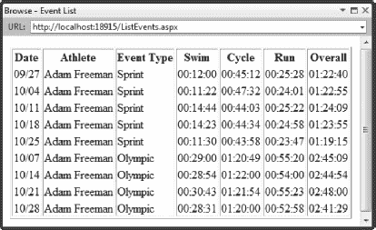

***图 8-12。**在页面中显示实体数据*

#### 使用 LINQ 查询数据模型

在前面的例子中，我们通过上下文对象的`Events`属性枚举所有可用的`Event`对象，显示了包含在`Events`表中的所有数据。为了过滤数据，我们可以检查每一个`Event`对象并丢弃不符合我们标准的对象。但是更好的解决方案是使用 LINQ。更具体地说，我们应该将 LINQ 用于实体，这是 LINQ 在实体数据模型上操作的方言。LINQ 到实体的查询被转换成 SQL 查询，该查询只检索与您指定的`where`子句相匹配的数据。这避免了在应用程序中检索数据却将其丢弃的情况，当处理包含许多行的表时，这种情况会变得特别麻烦。

[清单 8-3](#list_8_3) 展示了对`ListEvents.aspx`页面文件(粗体显示)的一些补充，提供了我们将用来过滤数据的用户输入。

***清单 8-3。**向页面添加选择控件*

`<%@ Page Language="C#" AutoEventWireup="true" CodeBehind="ListEvents.aspx.cs"
 Inherits="DataApp.ListEvents" %>` `<!DOCTYPE html PUBLIC "-//W3C//DTD XHTML 1.0 Transitional//EN"
 "http://www.w3.org/TR/xhtml1/DTD/xhtml1-transitional.dtd">

<html >
<head runat="server">
    <title>Event List</title>
    ****
</head>
<body>
    <form id="form1" runat="server">

        <table id="resultsTable" runat="server" rules="cols">
            <tr>
                <th>Date</th>
                <th>Athlete</th>
                <th>Event Type</th>
                <th>Swim</th>
                <th>Cycle</th>
                <th>Run</th>
                <th>Overall</th>
            </tr>
        </table>

        **
**
            **<label>Event Type:</label>**
            **<select id="eventSelector" runat="server">**
                **<option>All</option>**
            **</select>**
        **
**

        **
**
            **<input type="submit" value="Submit" />**
        **
**
    </form>
</body>
</html>`

我们添加了一个`select`控件(带有一个`All`选项)、一个标记为 Submit 的表单按钮以及一些结构元素和 CSS 来创建一个简单的布局。应用于`ListEvents.aspx.cs`文件的相应代码变更，如[清单 8-4](#list_8_4) 所示。

***清单 8-4。**使用 LINQ 过滤实体数据*

`using System;
using System.Collections.Generic;
using System.Linq;
using System.Web.UI.HtmlControls;

namespace DataApp {

    public partial class ListEvents : System.Web.UI.Page {

        protected void Page_Load(object sender, EventArgs e) {

            // create the entity data model context object
            using (TrainingDataEntities context = new TrainingDataEntities()) {

                // populate the select control if needed
                if (ViewState["setupComplete"] == null) {
                    foreach (string name in context.EventTypes.Select(item => item.Name)) {
                        eventSelector.Items.Add(name);
                    }
                    ViewState["setupComplete"] = true;
               }

                // define the collection of events that we will process
                IEnumerable<Event> eventsToProcess;

                if (IsPostBack && eventSelector.Value != "All") {

                    // perform a LINQ query to filter the data
                    eventsToProcess = from item in context.Events
                                      where item.Type == eventSelector.Value
                                      select item;
                } else {
                    // this is either the initial get request or the user has performed
                    // a POST with the ALL filter set - either way, we want to list all
                    // of the data items, with no filtering
                    eventsToProcess = context.Events;
                }

                // process the selected events
                foreach (Event ev in eventsToProcess) {
                    // process the entity object
                    ProcessEvent(ev);
                }
            }
        }` `        private void ProcessEvent(Event eventParam) {
            // create a new table row
            HtmlTableRow row = new HtmlTableRow();

            row.Cells.Add(CreateTableCell(eventParam.Date.ToString("MM/dd")));
            row.Cells.Add(CreateTableCell(eventParam.Athlete));
            row.Cells.Add(CreateTableCell(eventParam.Type));
            row.Cells.Add(CreateTableCell(eventParam.SwimTime.ToString()));
            row.Cells.Add(CreateTableCell(eventParam.CycleTime.ToString()));
            row.Cells.Add(CreateTableCell(eventParam.RunTime.ToString()));
            row.Cells.Add(CreateTableCell(eventParam.OverallTime.ToString()));

            // add the row to the table
            resultsTable.Rows.Add(row);
        }

        private HtmlTableCell CreateTableCell(string textParam) {
            return new HtmlTableCell() { InnerText = textParam };
        }
    }
}`

在这个修改后的代码隐藏类中有两个 LINQ 查询。这是第一个(以粗体显示):

`if (ViewState["setupComplete"] == null) {
    foreach (string name in **context.EventTypes.Select(item => item.Name)**) {
        eventSelector.Items.Add(name);
    }
    ViewState["setupComplete"] = true;
}`

这个查询只是选择由上下文对象的`EventTypes`属性返回的每个对象的`Name`属性的值。第一次加载页面时，我们使用 LINQ 查询的结果来填充页面中 HTML `select`元素的内容，并使用视图状态特性来确保仅在需要时才这样做(有关视图状态的详细信息，请参见第 6 章[)。这个 LINQ 查询使用*方法语法*来表达，其中直接调用 LINQ 扩展方法。](06.html#ch6)

当用户在下拉列表中选择了 All 以外的值时，第二个 LINQ 查询过滤`Event`对象，如下所示:

`eventsToProcess = from item in context.Events
    where item.Type == eventSelector.Value
    select item;`

第二个查询使用了*查询语法*，这意味着它依赖于支持 LINQ 查询的 C#关键字，例如`from`、`in`、`where`或`select`。

实体的 LINQ 完全支持方法和查询语法查询，您可以使用最适合自己的技术。在实际的项目中，我倾向于对简单的查询使用查询语法，当事情变得更复杂时，我会切换到方法语法。但是使用一种语法并没有什么优势。

现在查看页面，从下拉列表中选择 Sprint 或 Olympic，然后单击 Submit 按钮。可以看到过滤数据的效果，如图[图 8-13](#fig_8_13) 。

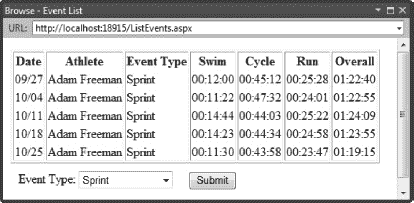

***图 8-13。**使用 LINQ 过滤实体数据*

#### 调用存储过程

我们添加到模型中然后显式导入的存储过程作为上下文对象的方法呈现。该方法的参数对应于存储过程的参数。作为一个例子，[清单 8-5](#list_8_5) 展示了`GetPersonalRanking`存储过程的 SQL 定义。

***清单 8-5。**GetPersonalRanking 存储过程*

`CREATE PROCEDURE [dbo].[GetPersonalRanking]
        @AthleteName varchar(50),
        @EventType varchar(50),
        @SwimTime time(0),
        @CycleTime time(0),
        @RunTime time(0),
        @OverallTime time(0)
AS
BEGIN

select 'Swim' as Activity, COUNT(*) as Pos from Events where type= @EventType AND athlete=
 @AthleteName AND SwimTime <= @SwimTime
UNION
select 'Cycle' as Activity, COUNT(*) as Pos from Events where type= @EventType AND athlete=
 @AthleteName AND CycleTime <= @CycleTime
UNION
select 'Run' as Activity, COUNT(*) as Pos from Events where type= @EventType AND athlete=
 @AthleteName AND RunTime <= @RunTime
UNION` `SELECT 'Overall' as Activity, COUNT(*) as Pos from Events where type = @EventType AND
 athlete = @AthleteName AND OverallTime <= @OverallTime
UNION
select 'Count' as Activity, COUNT(*) as Pos from Events where type= @EventType AND athlete=
 @AthleteName

END`

这个程序有六个参数，代表一个运动员完成的一个项目。这些参数指定了运动员的名字、事件的类型、执行铁人三项每个阶段所用的时间以及总时间。这些参数被用作一系列`SELECT`语句的基础，这些语句决定了事件性能与之前记录的事件相比如何。

使用`UNION`语句将结果组合起来，生成一个表，其中包含对阶段和总体时间进行排名的行，并报告记录的事件数量，如[表 8-2](#tab_8_2) 所示。

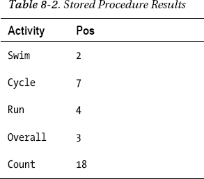

存储过程在实体数据模型中表示为一个名为`GetPersonalRanking`的方法。参数的类型从 SQL 类型转换成 C#类型。调用过程就像调用任何其他方法一样:

`IEnumerable<Ranking> ranks = context.GetPersonalRanking("Adam Freeman", "Sprint", SwimTime,
    CycleTime, RunTime, OverallTime);`

`GetPersonalRanking`方法的结果类型是`IEnumerable<Ranking>`。记住`Ranking`是我们在前面导入存储过程时定义的复杂类型。`IEnumerable<Ranking>`结果为结果表的每一行包含一个`Ranking`。由于存储过程中有五个`SELECT`查询，我们可以预期在`IEnumerable`中有五个`Ranking`实例。像您已经看到的其他实体类一样，`Ranking`具有表示表的列的属性，因此有`Activity`和`Pos`属性。

这个存储过程的结果有点难以处理，如[表 8-2](#tab_8_2) 所示。如果您正在处理一个新项目，您可以设计数据库，使其非常适合您的应用程序需求。你可以确保每个结果都非常适合你需要知道的东西，并且以一种容易处理的方式呈现。然而，随着项目的成熟和新版本的发布，您会发现数据库并不十分适合，但是更改数据库的成本和风险却令人望而却步。如果您有一个在项目之间共享的数据库，那么模式更改带来的风险和复杂性会高得多。如果你使用的数据库是公司的核心功能，比如账单或人力资源部门的记录，那么做出改变的障碍通常是不可逾越的。

因此，在您的 web 应用程序项目中，会出现这样一种情况:您想要进行的查询和可用的存储过程之间没有很好的匹配。你必须处理不是你想要的结果——很像[表 8-2](#tab_8_2) 中显示的结果。在下一节中，我们将扩展我们的示例 web 应用程序以包含排名信息，但是我们将只使用`Overall`结果。您将学习两种简单的技术来从数据库中的存储过程返回的结果中获取数据。

##### 使用 LINQ 过滤存储过程结果

第一种技术是使用 LINQ 来查找具有值为`Overall`的`Activity`的行，我们可以这样做:

`int personalRank = context.GetPersonalRanking(ev.Athlete, ev.Type, ev.SwimTime,
                       ev.CycleTime, ev.RunTime, ev.OverallTime)
        .Where(item => item.Activity == "Overall")
        .Select(item => item).First().Pos ?? -1;`

在该查询中，我们执行以下操作:

*   使用一个`Event`实体对象来设置调用存储过程的参数
*   过滤一组`Ranking`对象以找到`Overall`排名
*   调用`First`扩展方法(因为我们知道只有一个匹配结果)
*   读取`Pos`参数得到我们想要的排名。

`Pos`列被表示为可空的`int`值，这意味着如果存储过程中没有与`SELECT`语句匹配的值，该值将为空。因此，如果`Pos`参数为空，最后一步是使用空合并操作符获得默认值-1。

第二种方法是将结果对象转换成新的数据类型，该数据类型包含存储过程结果中每个不同元素的字段。[清单 8-6](#list_8_6) 提供了这种类型的一个例子，称为`RankingSet`，它枚举从存储过程返回的`Ranking`实体对象，并设置公共字段的值。

***清单 8-6。**RankingSet 类*

`using System.Collections.Generic;

namespace DataApp {

    public class RankingSet {
        public int SwimRank = -1;
        public int CycleRank = -1;
        public int RunRank= -1;
        public int OverallRank = -1;
        public int RankCount = -1;

        public RankingSet(IEnumerable<Ranking> sourceParam) {` `            foreach (Ranking rank in sourceParam) {
                switch (rank.Activity) {
                    case "Swim":
                        SwimRank = rank.Pos ?? -1;
                        break;
                    case "Cycle":
                        CycleRank = rank.Pos ?? -1;
                        break;
                    case "Run":
                        RunRank = rank.Pos ?? -1;
                        break;
                    case "Overall":
                        OverallRank = rank.Pos ?? -1;
                        break;
                    case "Count":
                        RankCount = rank.Pos ?? -1;
                        break;
                }
            }
        }
    }
}`

我倾向于这种方法，主要是因为我发现它创建了一组更容易理解的代码语句。

##### 在项目中使用存储过程

为了演示存储过程的使用，我们将在示例应用程序的页面中的表中添加两列，并使用它们来显示`Overall`个人和参考排名。[清单 8-7](#list_8_7) 显示了对`ListEvents.aspx`文件的补充。

***清单 8-7。**向 ListEvents 页面添加列*

`...
<table id="resultsTable" runat="server" rules="cols">
    <tr>
        <th>Date</th>
        <th>Athlete</th>
        <th>Event Type</th>
        <th>Swim</th>
        <th>Cycle</th>
        <th>Run</th>
        <th>Overall</th>
        **<th>Rank</th>**
        **<th>Ref Rank</th>**
    </tr>
</table>
...`

[清单 8-8](#list_8_8) 显示了对代码隐藏类的更改，以支持这两个新列，使用了[清单 8-6](#list_8_6) 中显示的`RankingSet`类(主要更改以粗体显示)。

***清单 8-8。**修改 ListEvents.aspx.cs 文件*

`using System;
using System.Collections.Generic;
using System.Linq;
using System.Web.UI.HtmlControls;

namespace DataApp {

    public partial class ListEvents : System.Web.UI.Page {

        protected void Page_Load(object sender, EventArgs e) {

            // create the entity data model context object
            using (TrainingDataEntities context = new TrainingDataEntities()) {

                // populate the select control if needed
                if (ViewState["setupComplete"] == null) {
                    foreach (string name in context.EventTypes.Select(item => item.Name)) {
                        eventSelector.Items.Add(name);
                    }
                    ViewState["setupComplete"] = true;
               }

                // define the collection of events that we will process
                IEnumerable<Event> eventsToProcess;

                if (IsPostBack && eventSelector.Value != "All") {

                    // perform a LINQ query to filter the data
                    eventsToProcess = from item in context.Events
                                      where item.Type == eventSelector.Value
                                      select item;
                } else {
                    // this is either the initial get request or the user has performed
                    // a POST with the ALL filter set - either way, we want to list all
                    // of the data items, with no filtering
                    eventsToProcess = context.Events;
                }

                // process the selected events
                foreach (Event ev in eventsToProcess) {` `                    **// get the personal ranking information**
                    **int personalRank = new RankingSet(**
                        **context.GetPersonalRanking(ev.Athlete,**
                        **ev.Type, ev.SwimTime, ev.CycleTime,**
                        **ev.RunTime, ev.OverallTime)).OverallRank;**

                    **// get the reference rank information**
                    **int referenceRank = new RankingSet(**
                        **context.GetReferenceRanking(ev.Type,**
                        **ev.SwimTime, ev.CycleTime, ev.RunTime,**
                        **ev.OverallTime)).OverallRank;**

                    // process the entity object
                    ProcessEvent(ev, **personalRank, referenceRank**);
                }
            }
        }

        **private void ProcessEvent(Event eventParam, int personalRankParam,**
            **int referenceRankParam) {**

            // create a new table row
            HtmlTableRow row = new HtmlTableRow();

            row.Cells.Add(CreateTableCell(eventParam.Date.ToString("MM/dd")));
            row.Cells.Add(CreateTableCell(eventParam.Athlete));
            row.Cells.Add(CreateTableCell(eventParam.Type));
            row.Cells.Add(CreateTableCell(eventParam.SwimTime.ToString()));
            row.Cells.Add(CreateTableCell(eventParam.CycleTime.ToString()));
            row.Cells.Add(CreateTableCell(eventParam.RunTime.ToString()));
            row.Cells.Add(CreateTableCell(eventParam.OverallTime.ToString()));

            // add the ranking information
            **row.Cells.Add(CreateTableCell(personalRankParam.ToString()));**
            **row.Cells.Add(CreateTableCell(referenceRankParam.ToString()));**

            // add the row to the table
            resultsTable.Rows.Add(row);
        }

        private HtmlTableCell CreateTableCell(string textParam) {
            return new HtmlTableCell() { InnerText = textParam };
        }
    }
}`

我们调用存储过程，就像我们调用任何其他 C#方法一样，并根据结果创建额外的表格单元格来显示排名信息。你可以在显示`ListEvent.aspx`页面时看到效果，如图[图 8-14](#fig_8_14) 。

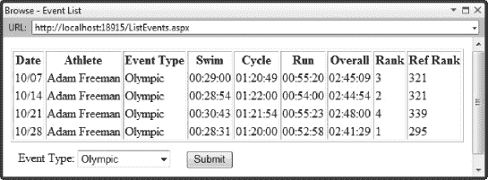

***图 8-14。**使用存储过程添加排名信息*

### 合并数据访问代码

大多数 ASP.NET 项目都有不止一个页面需要使用数据模型。避免重复相同代码的常见方法是将处理数据模型的代码合并到一个或多个公共类中，然后由所有页面类使用。在扩展示例 web 应用程序来创建、修改和删除数据之前，我们将遵循这种方法。[清单 8-9](#list_8_9) 展示了这个名为`DataAccess`的类，它包含了迄今为止执行示例功能的方法。

***清单 8-9。**数据访问类*

`using System.Collections.Generic;
using System.Linq;
using System;

namespace DataApp {

    public static class DataAccess {

        ///////////////////////////////
        // EventType related methods //
        //////////////////////////////

        public static string[] GetEventTypeNames(TrainingDataEntities contextParam) {
            return contextParam.EventTypes.Select(e => e.Name).ToArray();
        }

        /////////////////////////////
        // Athlete related methods //
        /////////////////////////////` `        public static string[] GetAthleteNames(TrainingDataEntities contextParam) {
            return contextParam.Athletes.Select(e => e.Name).ToArray();
        }

        /////////////////////////////
        // Ranking related methods //
        /////////////////////////////

        public static RankingSet GetReferenceRanking(TrainingDataEntities contextParam,
            Event eventParam) {

            return new RankingSet(contextParam.GetReferenceRanking(eventParam.Type,
                eventParam.SwimTime, eventParam.CycleTime,
                eventParam.RunTime, eventParam.OverallTime));
        }

        public static RankingSet GetPersonalRanking(TrainingDataEntities contextParam,
            Event eventParam) {

            return new RankingSet(contextParam.GetPersonalRanking(eventParam.Athlete,
                eventParam.Type, eventParam.SwimTime, eventParam.CycleTime,
                eventParam.RunTime, eventParam.OverallTime));
        }

        ///////////////////////////
        // Event related methods //
        ///////////////////////////

        public static IEnumerable<Event> GetAllEvents(TrainingDataEntities contextParam) {
            return contextParam.Events;
        }

        public static IEnumerable<Event> GetEventsByType(TrainingDataEntities contextParam,
            string typeParam) {

            return contextParam.Events.Where(e => e.Type == typeParam).Select(e => e);
        }
    }
}`

`DataAccess`类最重要的一点是每个方法的第一个参数是一个上下文对象——一个`TrainingDataEntities`类的实例。当整合对实体数据模型的访问时，尝试创建上下文对象的单个实例并在请求之间共享它是很有诱惑力的。

context 对象被设计为经常被实例化和处理，因此即使在创建上下文时没有显式控制连接，也可以使用连接池等功能。因此，合并数据访问代码的最佳方式是依赖由页面代码隐藏类创建的上下文对象，并确保在 page 方法退出之前释放该对象。[清单 8-10](#list_8_10) 显示了来自`ListEvents.aspx.cs`文件的`Page_Load`方法，该方法已经被更新以使用`DataAccess`类中的方法。

***清单 8-10。**更新 ListEvents.aspx.cs 代码隐藏类*

`...
protected void Page_Load(object sender, EventArgs e) {

    // create the entity data model context object
    using (TrainingDataEntities context = new TrainingDataEntities()) {

        // populate the select control if needed
        if (ViewState["setupComplete"] == null) {
            foreach (string name in DataAccess.GetEventTypeNames(context)) {
                eventSelector.Items.Add(name);
            }
            ViewState["setupComplete"] = true;
        }

        // define the collection of events that we will process
        IEnumerable<Event> eventsToProcess;

        if (IsPostBack && eventSelector.Value != "All") {

            // get the events filtered by event type
            eventsToProcess = DataAccess.GetEventsByType(context, eventSelector.Value);

        } else {
            // get all of the events
            eventsToProcess = DataAccess.GetAllEvents(context);
        }

        // process the selected events
        foreach (Event ev in eventsToProcess) {

            // get the personal ranking information
            int personalRank  = DataAccess.GetPersonalRanking(context, ev).OverallRank;

            // get the reference rank information
            int referenceRank = DataAccess.GetReferenceRanking(context, ev).OverallRank;

            // process the entity object
            ProcessEvent(ev, personalRank, referenceRank);
        }
    }
}
...`

清单 8-9 中的[功能没有变化。它只是切换到统一的数据访问代码。在接下来的部分中，我们将构建该类来添加其他数据操作。](#list_8_9)

### 执行其他数据操作

现在我们已经合并了访问数据模型的代码，我们可以向 web 应用程序添加页面来处理其他数据操作。在下面的小节中，您将学习如何使用实体框架创建、修改和删除数据库中的数据。

#### 添加数据

使用实体数据模型添加新数据是一个四步过程:

*   创建表示感兴趣的表的行的实体类的新实例。
*   为我们创建的实体对象的参数设置值。
*   将对象添加到由实体上下文维护的相似对象的集合中。
*   调用`SaveChanges`方法将更改写入数据库。

因为我们已经合并了我们的数据访问代码，这四个步骤将在页面代码隐藏类和我们合并的`DataAccess`类之间分开。[清单 8-11](#list_8_11) 显示了添加到`DataAccess`的方法。

***清单 8-11。**处理在 DataAccess 类中添加数据*

`...
public static void AddEvent(TrainingDataEntities contextParam,
    DateTime timeParam, string athleteParam, string typeParam,
    TimeSpan swimTimeParam, TimeSpan cycleTimeParam, TimeSpan runTimeParam) {

        // create the new entity object
        Event newEvent = new Event() {
            // set the date value in the event object
            Date = timeParam,
            // set the athlete and event type
            Athlete = athleteParam,
            Type = typeParam,
            // set the times
            SwimTime = swimTimeParam,
            CycleTime = cycleTimeParam,
            RunTime = runTimeParam,
            // calculate and set the overall time
            OverallTime = swimTimeParam + cycleTimeParam + runTimeParam
        };` `    // add the Event object to the Events collection
    contextParam.Events.AddObject(newEvent);
    // save the change to the database
    contextParam.SaveChanges();
}
...`

`AddEvent`方法演示了创建过程的所有四个步骤。在一个步骤中创建了`Event`对象并设置了参数值。这些值由方法参数设置。

使用上下文对象的`Events`属性的`AddObject`方法将`Event`对象添加到实体数据模型中。每个表示数据库表的上下文对象属性都有一个`AddObject`方法，该方法将适当的实体类的实例作为参数。

在调用上下文对象的`SaveChanges`方法之前，更改不会应用到数据库。对`SaveChanges`的一次调用就可以更新您对实体数据模型所做的任何未决更改，因此如果愿意，您可以批处理您的数据库操作。

 **提示**注意，我们没有为[清单 8-11](#list_8_11) 中的主键列`ID`提供值。我们将该列配置为标识键，这意味着当我们不提供值时，SQL Server 将自动生成该键。当同时处理多个请求时，很难生成唯一的主键。身份密钥特性消除了这一困难。

为了使用这种新方法，我们可以向示例项目添加另一个名为`AddEvent.aspx`的 web 页面。我不会浪费空间展示页面标记，因为布局非常简单(详情请查看本书附带的下载)，如图 8-15 所示。

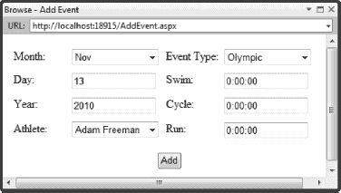

***图 8-15。**addevent . aspx 页面*

用户通过从 HTML `select`元素的下拉列表中选择并在`input`元素中输入值，提供他们想要添加到数据库中的事件的详细信息。一些默认值由代码隐藏类设置，如[清单 8-12](#list_8_12) 所示。

***清单 8-12。**addevent . aspx . cs 代码隐藏文件*

`using System;
using System.Globalization;

namespace DataApp {

    public partial class AddEvent : System.Web.UI.Page {

        protected void Page_Load(object sender, EventArgs e) {

            using (TrainingDataEntities context = new TrainingDataEntities()) {

                // do the setup - placed in a separate method for clarity
                if (ViewState["setupComplete"] == null) {
                    PerformPageSetup(context);
                    ViewState["setupComplete"] = true;
                }

                if (IsPostBack) {
                    try {

                        // get the elements of the date
                        int day = int.Parse(dayText.Value);
                        int month = monthSelect.SelectedIndex + 1;
                        int year = int.Parse(yearText.Value);

                        // add a new event to the database
                        DataAccess.AddEvent(context,
                            new DateTime(year, month, day),
                            athleteSelect.Value,
                            eventTypeSelect.Value,
                            TimeSpan.Parse(swimText.Value),
                            TimeSpan.Parse(cycleText.Value),
                            TimeSpan.Parse(runText.Value)
                            );

                        // transfer the user to the list page
                        Response.Redirect("ListEvents.aspx");

                    } catch (FormatException) {
                        // set the error text
                        errorDiv.InnerText = "Cannot parse inputs";
                    }
                }
            }
        }` `        private void PerformPageSetup(TrainingDataEntities context) {

            // get the current culture info
            DateTimeFormatInfo formatInfo = CultureInfo.CurrentCulture.DateTimeFormat;

            // populate the month select element
            monthSelect.Items.Clear();
            for (int i = 1; i < 13; i++) {
                monthSelect.Items.Add(formatInfo.GetAbbreviatedMonthName(i));
            }

            // get the current date and use it to select a month and set the day and year
            DateTime now = DateTime.Now;
            monthSelect.SelectedIndex = now.Month - 1;
            dayText.Value = now.Day.ToString();
            yearText.Value = now.Year.ToString();

            // populate the athlete names
            athleteSelect.Items.Clear();
            foreach (string name in DataAccess.GetAthleteNames(context)) {
                athleteSelect.Items.Add(name);
            }

            // populate the event types
            eventTypeSelect.Items.Clear();
            foreach (string name in DataAccess.GetEventTypeNames(context)) {
                eventTypeSelect.Items.Add(name);
            }
        }
    }
}`

清单 8-12 中的[方法提供了内容和`select`元素，以及页面中`input`元素的默认值。只有当页面的视图状态不包含特定的键时，才会调用这个方法(关于使用视图状态的更多信息，请参见第 6 章](#list_8_12))。

我们对`Page_Load`方法的其余部分更感兴趣，在这里我们解析用户提供的值，并调用在`DataAccess`类中定义的`AddEvent`方法。如果在解析输入时有任何问题，用户会看到一个简单的错误消息(更多有用的错误处理技术的细节见第 7 章)。如果没有错误，一旦`DataAccess.AddEvent`方法返回，`AddEvent`页面会将用户重定向到`ListEvents`页面，以便可以查看新添加的记录。

#### 更新和删除数据

要使用实体数据模型更新数据，您需要查询表示要更改的行的对象，为一个或多个属性分配一个新值，并调用`SaveChanges`方法。[清单 8-13](#list_8_13) 显示了添加到`DataAccess`类中处理更新的方法。

***清单 8-13。**处理更新操作*

`public static void UpdateEvent(TrainingDataEntities contextParam, int keyParam,
    DateTime dateParam, string athleteParam, string typeParam, TimeSpan swimTimeParam,
    TimeSpan cycleTimeParam, TimeSpan runTimeParam) {

    // query for the event with the specified key
    Event targetEvent = GetEventByID(contextParam, keyParam);

    // set the parameter values for the event
    if (targetEvent != null) {
        // update the event object properties
        targetEvent.Date = dateParam;
        targetEvent.Athlete = athleteParam;
        targetEvent.Type = typeParam;
        targetEvent.SwimTime = swimTimeParam;
        targetEvent.CycleTime = cycleTimeParam;
        targetEvent.RunTime = runTimeParam;
        targetEvent.OverallTime = swimTimeParam + cycleTimeParam + runTimeParam;
        // save the changes
        contextParam.SaveChanges();
    }
}

public static Event GetEventByID(TrainingDataEntities contextParam, int keyParam) {
    // query for the ID
    IEnumerable<Event> results = contextParam.Events
                                    .Where(e => e.ID == keyParam).Select(e => e);
    // as the ID is a primary key, there will be zero or one results
    return results.Count() == 1 ? results.First() : null;
}`

作为参数，`UpdateEvent`方法采用一个主键值(标识要更新的事件对象)和一组对应于由`Event`实体类定义的属性的值。调用`GetEventByID`方法查询目标事件对象，参数值用于更新事件属性，然后调用`SaveChanges`方法将更改写入数据库。应用更改的 SQL 语句由实体框架自动生成和执行。

要使用实体数据模型从数据库中删除数据，必须找到代表要删除的行的实体对象，然后在对应于适当表的上下文对象属性上调用`DeleteObject`方法。在这种情况下，我们将调用`Events.DeleteObject`并传递代表我们想要移除的数据的`Event`实例作为参数。`DeleteObject`方法是上一节介绍的`AddObject`方法的对应方法。[清单 8-14](#list_8_14) 显示了添加到`DataAccess`类以支持删除事件数据的方法。

***清单 8-14。**处理删除操作*

`public static void DeleteEventByID(TrainingDataEntities contextParam, int keyParam) {
    // query for the object that has the specified key
    Event targetEvent = GetEventByID(contextParam, keyParam);

    // if there is a result from the query, perform a delete
    if (targetEvent != null) {
        contextParam.Events.DeleteObject(targetEvent);
        contextParam.SaveChanges();
    }
}`

`DeleteEventByID`方法调用`GetEventByID`方法来查询将主键作为`keyParam`参数传递的`Event`对象，然后将主键传递给上下文对象的`Events.DeleteObject`方法。最后调用`SaveChanges`方法。在调用此方法之前，删除操作(如添加和更新)不会写入数据库。

#### 实现更新和删除数据的页面支持

既然我们在`DataAccess`类中有了处理更新和删除的方法，构建支持更新和删除 triathlon 事件的页面就相当简单了。我们可以用一个页面来处理这两个操作。

 **提示**在添加、更新和删除内容所需的页面功能之间有足够的相似性，以至于一个页面可以用于所有这些功能。关于一个页面应该包含多少功能的决定将受到每个项目的具体情况的影响。在这一章中，我想逐步介绍关键概念，但是在一个真实的项目中，我会使用一个单独的页面。

将处理这些操作的页面称为`UpdateOrDeleteEvent.aspx`。首先，我们将向`ListEvents.aspx`页面添加功能，以便用户可以选择编辑或删除列表中的事件，如图[图 8-16](#fig_8_16) 所示。

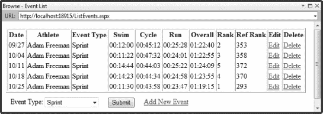

***图 8-16。**向 ListEvents.aspx 页面添加编辑和删除支持*

额外的列定义如清单 8-15 中的[所示。(注意，我们还向`AddEvent.aspx`页面添加了一个静态链接，只是为了完善我们的示例 web 应用程序的功能。)](#list_8_15)

***清单 8-15。**添加到 ListEvents.aspx 页面*

`...
   <th>Rank</th>
    <th>Ref Rank</th>
    **<th>Edit</th>**
    **<th>Delete</th>**
</tr>
...`

为了填充这些新列，我们在`ListEvents.aspx.cs`代码隐藏类中使用了一个名为`CreateLinkTableCell`的新方法。这个方法在一个`HtmlCellTable`控件中嵌入了一个`HtmlAnchor`控件。事件的主键和模式(编辑或删除)被设置为查询字符串参数。`CreateLinkTableCell`方法如[清单 8-16](#list_8_16) 所示。

***清单 8-16。**list events . aspx . cs CreateLinkTableCell 方法*

`private HtmlTableCell CreateLinkTableCell(string urlParam, string textParam, int idParam, string modeParam) {
    // create the anchor
    HtmlAnchor anchor = new HtmlAnchor() {
        HRef = string.Format("{0}?id={1}&mode={2}", urlParam, idParam, modeParam),
        InnerText = textParam};
    // add the anchor to a new cell
    HtmlTableCell cell = new HtmlTableCell();
    cell.Controls.Add(anchor);
    // return the cell
    return cell;
}`

从`ProcessEvent`方法中调用该方法，如下所示:

`row.Cells.Add(CreateLinkTableCell("/UpdateOrDeleteEvent.aspx", "Edit", eventParam.ID,
    "edit"));
row.Cells.Add(CreateLinkTableCell("/UpdateOrDeleteEvent.aspx", "Delete", eventParam.ID,
    "delete"));`

 **注意**对于相当简单的添加，我现在只显示变更片段。至此，您已经熟悉了页面文件和代码隐藏类的基本工作方式，因此这些更改应该是显而易见的。您可以在本章的代码下载中看到应用于整个示例的更改。

`UpdateOrDeleteEvent.aspx`页面的标记与`AddEvent.aspx`页面非常相似，但是增加了两个隐藏的输入元素，如[清单 8-17](#list_8_17) 所示。

***清单 8-17。**updateordelete . aspx 页面*

`...
<input type="hidden" id="keyInput" runat="server" />
<input type="hidden" id="modeInput" runat="server" />
...`

隐藏的`input`元素用于在用户发布表单时区分更新和删除操作。页面的代码隐藏类如清单 8-18 中的[所示。除了使用在`DataAccess`类中定义的方法来更新和删除数据之外，这个类没有什么新的东西。](#list_8_18)

***清单 8-18。**updateordeleteevent . aspx . cs 代码隐藏类*

`using System;
using System.Globalization;
using System.Web.UI.HtmlControls;

namespace DataApp {

    public partial class UpdateEvent : System.Web.UI.Page {

        protected void Page_Load(object sender, EventArgs e) {

            using (TrainingDataEntities context = new TrainingDataEntities()) {

                // do the setup - placed in a separate method for clarity
                if (ViewState["setupComplete"] == null) {
                    PerformPageSetup(context);
                    ViewState["setupComplete"] = true;
                }

                if (!IsPostBack) {` `// make sure we have query string values for the key and
                    // the mode and can obtain the corresponding Event object
                    // if not, then push the user back towards the list page
                    string mode;
                    int eventID;
                    Event targetEvent;

                    if ((mode = Request.QueryString["mode"]) != null
                        && int.TryParse(Request.QueryString["id"], out eventID)
                        && (targetEvent = DataAccess.GetEventByID(context,
                            eventID)) != null) {

                        // set the hidden fields in the form
                        this.modeInput.Value = mode;
                        this.keyInput.Value = eventID.ToString();

                        // use the property values of the event to populate page controls
                        monthSelect.SelectedIndex = targetEvent.Date.Month - 1;
                        dayText.Value = targetEvent.Date.Day.ToString();
                        yearText.Value = targetEvent.Date.Year.ToString();

                        // set the selected index for the the athlete and event controls
                        SetSelectIndex(athleteSelect, targetEvent.Athlete);
                        SetSelectIndex(eventTypeSelect, targetEvent.Type);

                        // set the times
                        swimText.Value = targetEvent.SwimTime.ToString();
                        cycleText.Value = targetEvent.CycleTime.ToString();
                        runText.Value = targetEvent.RunTime.ToString();

                        // if we are in delete mode, then disable the HTML controls
                        if (mode == "delete") {
                            monthSelect.Disabled = true;
                            dayText.Disabled = true;
                            yearText.Disabled = true;
                            athleteSelect.Disabled = true;
                            eventTypeSelect.Disabled = true;
                            swimText.Disabled = true;
                            cycleText.Disabled = true;
                            runText.Disabled = true;
                        }

                        // set the button text based on the mode
                        button.Value = mode == "edit" ? "Save" : "Delete";` `} else {
                        // we have a problem - just send the user back to the list
                        Response.Redirect("/ListEvents.aspx");
                    }

                } else {
                    if (modeInput.Value == "edit") {
                        // this is an edit request that requires an update
                        DataAccess.UpdateEvent(context, int.Parse(keyInput.Value),
                            new DateTime(
                                int.Parse(yearText.Value),
                                monthSelect.SelectedIndex + 1,
                                int.Parse(dayText.Value)),
                            athleteSelect.Value,
                            eventTypeSelect.Value,
                            TimeSpan.Parse(swimText.Value),
                            TimeSpan.Parse(cycleText.Value),
                            TimeSpan.Parse(runText.Value));

                    } else {
                        // this is a delete request
                        DataAccess.DeleteEventByID(context, int.Parse(keyInput.Value));
                    }

                    // return the user to the list
                    Response.Redirect("ListEvents.aspx");
                }
            }
        }

        private void SetSelectIndex(HtmlSelect selectParam, string targetValue) {
            for (int i = 0; i < selectParam.Items.Count; i++) {
                if (selectParam.Items[i].Text == targetValue) {
                    selectParam.SelectedIndex = i;
                    break;
                }
            }
        }

        private void PerformPageSetup(TrainingDataEntities context) {

            // get the current culture info
            DateTimeFormatInfo formatInfo = CultureInfo.CurrentCulture.DateTimeFormat;

            // populate the month select element
            monthSelect.Items.Clear();
            for (int i = 1; i < 13; i++) {
                monthSelect.Items.Add(formatInfo.GetAbbreviatedMonthName(i));
            }` `            // get the current date and use it to select a month and set the day and year
            DateTime now = DateTime.Now;
            monthSelect.SelectedIndex = now.Month - 1;
            dayText.Value = now.Day.ToString();
            yearText.Value = now.Year.ToString();

            // populate the athlete names
            athleteSelect.Items.Clear();
            foreach (string name in DataAccess.GetAthleteNames(context)) {
                athleteSelect.Items.Add(name);
            }

            // populate the event types
            eventTypeSelect.Items.Clear();
            foreach (string name in DataAccess.GetEventTypeNames(context)) {
                eventTypeSelect.Items.Add(name);
            }
        }
    }
}`

当页面在编辑模式下被调用时，事件的细节被显示并且可以被更改，如图 8-17 所示。点击保存按钮更新数据库中`Events`表的相应行。

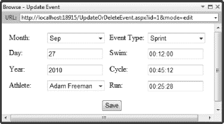

***图 8-17。**编辑事件*

在删除模式下调用`UpdateOrDeleteEvent.aspx`页面时，仍然显示事件的细节，但是 HTML `input`元素被禁用，用户不能更改这些值，如图[图 8-18](#fig_8_18) 所示。

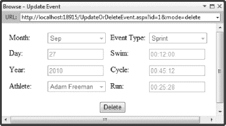

***图 8-18。**删除事件*

当操作完成时，用户被重定向到`ListEvents.aspx`页面，该页面将反映用户的更改。

### 管理并发

实体框架默认使用一个*乐观并发模型*。在这种情况下，*乐观*意味着我们交叉手指，希望我们不会得到导致冲突数据更改的重叠页面请求。一个请求导致数据的改变并更新数据库。片刻之后，第二个请求导致对*相同的*数据的不同改变，并执行更新。当应用第二次更新时，原始的更改会丢失，并且因为第一次请求已经完成，所以我们无法通知用户他们的修改已经被覆盖。

我们可以通过在数据模型中的单个字段上启用并发检查来部分解决这个问题。这仍然是乐观并发，因为没有数据被锁定在数据库中，但这意味着当其他人对您打算修改的数据进行更改时，您将会知道。

**为什么锁定会让事情变得更糟**

您可能想通过锁定数据库的区域来处理重叠的冲突数据更改。不要这样做！Web 应用程序非常不适合锁定，使用锁定最常见的结果是应用程序陷入停顿。

在页面请求期间锁定数据并不能解决问题。第一个或第二个请求都不会指出问题。锁的作用是序列化更新，仅此而已。如果您使用跨多个请求的锁，您会发现 web 请求的不连接、无状态的特性与数据库锁的持久、排他的特性背道而驰。

如果一个用户在完成你所期望的一系列请求之前离开了她的电脑，你将会得到一个孤立的锁，阻止其他用户更新数据库的这个区域。如果让锁过期来防止这种情况发生，就会迫使用户快速发送请求，这与他们习惯的 web 应用程序体验是背道而驰的。无论哪种方式，如果没有经过仔细的思考和测试，就不应该在 web 应用程序中使用数据库锁。

要启用并发检查，请按照下列步骤操作:

1.  打开数据模型文件，`TrainingDataModel.edmx`。
2.  右键单击要修改的属性，并从弹出菜单中选择属性。
3.  Change the value of the Concurrency Mode property to Fixed, as shown in [Figure 8-19](#fig_8_19). 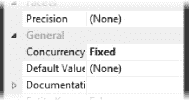

    ***图 8-19。**启用并发检查*

没有方便的方法来为多个属性启用并发检查。您必须逐个选择它们，并逐个应用更改。对于这个例子，启用对`Event`对象的所有属性的检查。

一旦您启用了并发检查，如果您试图修改的数据在您查询数据模型以获得实体对象之后已经被更改，那么上下文对象的`SaveChanges`方法将抛出一个`System.Data.OptimisticConcurrencyException`。对于大多数 web 应用程序来说，处理并发冲突的最佳方式是警告发起第二个请求的用户，他的更改不能被应用。这主要是因为，根据定义，第一个请求已经完成了。

### 总结

在本章中，您已经看到了如何使用实体框架和 LINQ 将数据引入 web 应用程序，而无需直接处理 SQL。我们创建了一个执行每个 CRUD 操作的示例应用程序，允许用户查看示例数据库中的事件列表、添加新事件、修改和删除现有事件。实体框架有替代方案，但我喜欢它允许我使用常规 C#对象的方式，并且不用在相同的代码文件中混合 SQL 和 C#。我也喜欢与 LINQ 的紧密集成，它提供了一种自然的数据查询方式。

实体框架并不是每个人的首选方法，但它是 Microsoft 的主要投资领域之一，它支持如此广泛的数据库，以至于在考虑 web 应用程序项目的数据访问技术时，它是一个很好的起点。

《实体框架》和《LINQ》本身都值得一书。如果你想要一本完整的 LINQ 指南，我推荐我和乔·拉茨一起写的书，C # 2010*Pro LINQ(2010 年出版)。对于实体框架，我推荐 Scott Klein 的 *Pro 实体框架 4.0*(a press，2010)。我也喜欢 Larry Tenny 和 Zeeshan Hirani (Apress，2010)的*实体框架 4.0 配方*。*