# 九、样式化内容

到目前为止，我们在本书中关注的是 ASP.NET 技术的关键组成部分。我们已经创建的示例允许我们依次探索每个基本功能，但它们都有一个共同点——它们看起来很糟糕。

近年来，用户对 web 应用的外观和丰富性的期望急剧增加，甚至最简单的 web 应用也被期望具有最低限度的光泽和亮点。在这一章中，我们将会看到 ASP.NET 为样式化内容提供的特性，从在应用的所有页面上应用一个固定的外观到提供丰富的用户交互。

人们很容易认为样式是不必要的铬合金，但这样做是危险的。一致的界面元素行为提示，清晰的过程进度标志，以及外观和功能的整体一致性将有助于用户浏览你的应用。

同样容易忘乎所以；大多数程序员内心深处都有一个被压抑的设计师。问自己一个好问题是，我的界面看起来像维加斯老虎机吗？如果答案是肯定的，那么你可能添加了比绝对必要的更多的额外功能；这样的界面会让用户感到疲劳和沮丧，尤其是当它成为他们日常工作流程的一部分时。

我们将在本章探索的一个领域是使用 JavaScript 来设计内容的样式。如果你在 20 世纪 90 年代末的浏览器大战期间是一名程序员，你可能对 JavaScript 印象不佳，因为它有着曲折的过去。不一致的实现、奇怪的符号形式和选择不当的名称都在玷污 JavaScript 的名声。幸运的是，这些问题中的大部分都已经解决了——一部分是通过更好的浏览器支持，另一部分是通过开发库来消除任何剩余的不一致，并简化编程模型中更难处理的部分。

有许多 JavaScript 库可用，但与 ASP.NET 最密切相关的是 jQuery。微软已经通过贡献功能、增加对在 Visual Studio 中编辑 jQuery 的支持以及在一些 ASP.NET 项目模板中包含 jQuery 库来接受 jQuery。在大多数情况下，jQuery *是 ASP.NET 项目的 JavaScript。在这一章中，我会给你一个使用 jQuery 的速成课程，但是我没有足够的篇幅来提供一个全面的教程。如果你想要更详细的信息，那么我推荐 Bear Bibeault 和 Yehuda Katz 的 *jQuery in Action* (由 Manning 出版)和 B.M. Harwani 的 *jQuery Recipes* (由 Apress 出版)。*

### 创建项目

对于这一章，我们将从一个从 Visual Studio ASP.NET Web 应用模板创建的项目开始，如图 9-1 所示。

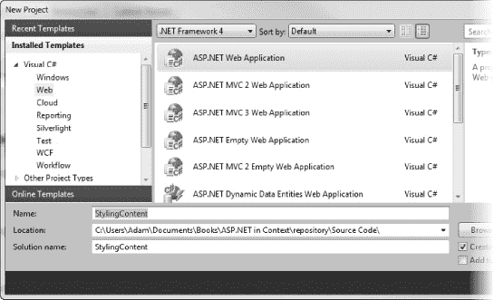

***图 9-1。**使用 ASP.NET Web 应用项目模板*

选择模板，将项目名称设置为样式化内容，然后单击 OK 按钮创建项目。我们将使用第 8 章的[中的数据模型和统一访问类`DataAccess`，因此按照步骤创建模型并从该项目中复制代码文件(不要忘记更改名称空间)。或者，您可以下载这个现成的项目，作为本书附带下载的一部分，可以从 Apress.com 获得。](08.html#ch8)

### 使用 ASP.NET 母版页

我们将探索的第一种样式化方法是 ASP.NET*母版页*特性，它让我们可以使用模板系统将通用设计应用于页面。母版页功能是我们创建 ASP.NET Web 应用项目的原因，而不是我们迄今为止所依赖的 ASP.NET 空 Web 应用；使用这种类型的项目时，Visual Studio 会创建一些使用母版页功能的默认页面。如果你打开`Default.aspx`文件并查看标记，你会发现它的结构与我们目前看到的网页不同，如[清单 9-1](#list_9_1) 所示。

***清单 9-1。**default . aspx 文件*

`<%@ Page Title="Home Page" Language="C#" MasterPageFile="~/Site.master" AutoEventWireup="true"
    CodeBehind="Default.aspx.cs" Inherits="StylingContent._Default" %>

<asp:Content ID="HeaderContent" runat="server" ContentPlaceHolderID="HeadContent">
</asp:Content>` `<asp:Content ID="BodyContent" runat="server" ContentPlaceHolderID="MainContent">
    <h2>
        Welcome to ASP.NET!
    </h2>
    

        To learn more about ASP.NET visit <a href="http://www.asp.net" title="ASP.NET
 Website">www.asp.net</a>.
    

    

        You can also find <a href="http://go.microsoft.com/fwlink/?LinkID=
152368&amp;clcid=0x409"
            title="MSDN ASP.NET Docs">documentation on ASP.NET at MSDN</a>.
    

</asp:Content>`

最明显的变化是使用了`asp:Content`元素，并且这个页面的标记不再是一个完整的 HTML 页面。第二个变化是在`Page`指令中添加了`MasterPageFile`属性。[清单 9-2](#list_9_2) 显示了该属性指定的`Site.Master`文件。

***清单 9-2。**网站。主文件*

`<%@ Master Language="C#" AutoEventWireup="true" CodeBehind="Site.master.cs"
Inherits="StylingContent.SiteMaster" %>

<!DOCTYPE html PUBLIC "-//W3C//DTD XHTML 1.0 Strict//EN"
 "http://www.w3.org/TR/xhtml1/DTD/xhtml1-strict.dtd">
<html xml:lang="en">
<head runat="server">
    <title></title>
    <link href="~/Styles/Site.css" rel="stylesheet" type="text/css" />
    **<asp:ContentPlaceHolder ID="HeadContent" runat="server">**
    **</asp:ContentPlaceHolder>**
</head>
<body>
    <form runat="server">
    

        

            

                <h1>
                    My ASP.NET Application
                </h1>
            

            

                <asp:LoginView ID="HeadLoginView" runat="server" EnableViewState="false">
                    <AnonymousTemplate>
                        [ <a href="~/Account/Login.aspx" ID="HeadLoginStatus"
                           runat="server">Log In</a> ]
                    </AnonymousTemplate>` `                    <LoggedInTemplate>
                        Welcome <asp:LoginName ID="HeadLoginName"
                        runat="server" />!
                        [ <asp:LoginStatus ID="HeadLoginStatus" runat="server"  
                         LogoutAction="Redirect" LogoutText="Log Out" LogoutPageUrl="~/"/> ]
                    </LoggedInTemplate>
                </asp:LoginView>
            

            

                <asp:Menu ID="NavigationMenu" runat="server" CssClass="menu"
                  EnableViewState="false" IncludeStyleBlock="false"
                  Orientation="Horizontal">
                    <Items>
                        <asp:MenuItem NavigateUrl="~/Default.aspx" Text="Home"/>
                        <asp:MenuItem NavigateUrl="~/About.aspx" Text="About"/>
                    </Items>
                </asp:Menu>
            

        

        

            **<asp:ContentPlaceHolder ID="MainContent" runat="server"/>**
        

        

        

    

    

    

    </form>
</body>
</html>`

我们关心的与母版页相关的项目是用粗体显示的`asp:ContentPlaceHolder`元素。

 **注意**[清单 9-2 中的其他新元素](#list_9_2) ( `asp:LoginView`、`AnonymousTemplate`、`LoggedInTemplate`、`asp:Menu`和`asp:MenuItem`)是 WebForm的一部分，我们在[第 13 章](13.html#ch13)中开始研究。

母版页是一种模板，其内容与页面内容相结合，为 ASP.NET web 应用中的部分或所有页面提供一致的样式。母版页包含许多`asp:ContentPlaceHolder`元素，如下所示:

`<asp:ContentPlaceHolder ID="MainContent" runat="server"/>`

`ID`属性对应于网页文件中的一个`asp:Content`元素，比如来自`Default.aspx`的这个:

`<asp:Content ID="BodyContent" runat="server" ContentPlaceHolderID="MainContent">`

注意页面中的`ContentPlaceHolderID`属性值对应于主页中`asp:ContentPlaceHolder`元素中`ID`元素的值。当您请求使用母版页的网页时，结果是两组内容的组合。ASP.NET 从处理母版页开始，每次遇到一个`asp:ContentPlaceHolder`元素，它都会在网页中寻找一个对应的`asp:Content`元素，并将元素的内容插入到输出中。如果您查看示例项目中的`Default.aspx`网页，您可以看到`asp:Content`元素的内容是如何与母版页组合在一起的，如图[图 9-2](#fig_9_2) 所示。

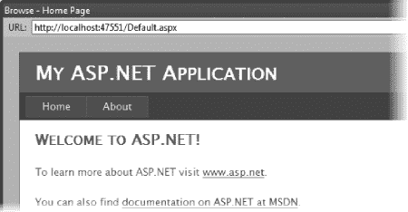

***图 9-2。**使用标准 ASP.NET 母版页的效果*

在[图 9-2](#fig_9_2) 中，你可以看到来自网页中`asp:Content`元素的 HTML 是如何与母版页相结合的。该效果将应用于使用同一母版页的任何网页。Visual Studio 为我们创建的项目包含一个额外的网页— `About.aspx`。如果你在 Visual Studio 中查看这个页面，或者点击[图 9-2](#fig_9_2) 标题中的“关于”链接，你可以看到一个母版页提供的一致的样式，如图 9-3 所示。

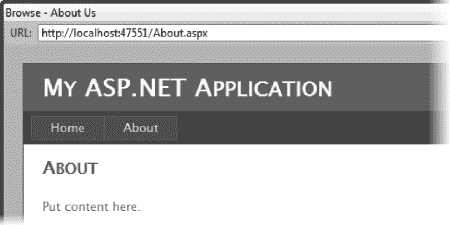

***图 9-3。**页面风格一致*

 **提示**一个项目中可以有多个母版页，这允许您在没有一个总体标准模板的情况下对相关页面组应用一致的样式。

#### 定制母版页

Visual Studio 为我们创建的默认母版页非常好用，但是大多数项目都是从头开始创建母版页的。我们将做同样的事情，但我们这样做的主要原因是为了更简单地探索母版页的功能。清单 9-3 显示了我简化的`Site.Master`文件。

***清单 9-3。**简化母版页*

`<%@ Master Language="C#" AutoEventWireup="true" CodeBehind="Site.master.cs"
 Inherits="StylingContent.SiteMaster" %>

<!DOCTYPE html PUBLIC "-//W3C//DTD XHTML 1.0 Strict//EN" "http://www.w3.org/TR/xhtml1/DTD
/xhtml1-strict.dtd">
<html xml:lang="en">
<head runat="server">
    <link href="/Styles/Site.css" rel="stylesheet" type="text/css" />
    <asp:ContentPlaceHolder ID="HeadContent" runat="server"/>
</head>
<body>
    <form runat="server">

    

        

            

                
                <h1>Triathlon Training Data</h1>
            

        

        

            <asp:ContentPlaceHolder ID="MainContent" runat="server"/>
        

        

        

            <h2>??? Events,
            ??? Miles,
            ???</h2>
        

    
` `    </form>
</body>
</html>`

就像 Visual Studio 为我们创建的默认设置一样，这个母版页有两个`asp:ContentPlaceHolder`元素，一个是页眉(`HeadContent`)，另一个是页面的主要部分(`MainContent`)。有一个到 CSS 文件`/Styles/Site.css`的链接，该文件包含在母版页上应用的样式。因为使用母版页的结果是组合了网页和母版页内容的 HTML 响应，所以您在母版页中定义或引用的 CSS 样式也可以应用于网页元素。

**使用 CSS**

也许样式化内容最明显的方式是使用级联样式表(CSS)。到目前为止，本书中的大多数例子都以某种方式依赖 CSS 来控制 HTML 元素的布局或外观。

CSS 是一种很好的样式化内容的方法，尤其是因为它将样式的定义与应用样式的内容分离开来。关于 ASP.NET 应用，定义 CSS 样式的方式多种多样，以至于很难确定应用的是哪一种。与常规网页一样，sheet 网页可以定义外部样式表，在页面的`head`元素中定义样式，并为单个元素定义内联样式。在本章中，我们将看到一些进一步的选项—在母版页中定义样式和样式表，在代码隐藏类中以编程方式设置样式，以及使用 JavaScript。这听起来可能是一个微不足道的问题，但是在您的 web 应用中有一个清晰定义和理解的 CSS 方法是非常重要的；否则，随着项目的增长，将会以不同的方式使用各种方法，并且您最终将花费时间通过找出哪些样式被覆盖以及覆盖来自哪里来调试样式问题。根据经验，你依赖的 CSS 资源越少，你的开发体验就越好。

母版页的末尾是一个包含页面页脚的`div`元素，如下所示:

`

    <h2>??? Events,
    ??? Miles,
    ???</h2>

`

母版页不仅仅是静态内容，它们也是 ASP.NET 页面，这意味着它们可以具有代码隐藏文件并包含动态内容。Visual Studio 自动为具有相同命名方案的母版页创建一个代码隐藏文件，因此`Site.Master`的代码隐藏文件是`Site.Master.cs`。[清单 9-4](#list_9_4) 显示了我创建的用于填充母版页页脚的代码隐藏文件。

***清单 9-4。**在母版页中生成动态代码*

`using System;

namespace StylingContent {

    public partial class SiteMaster : System.Web.UI.MasterPage {

        protected void Page_Load(object sender, EventArgs e) {

            using (TrainingDataEntities context = new TrainingDataEntities()) {
                // get the total data from the database
                DataTotals totals = DataAccess.GetDataTotals(context);
                // use the totals to update the span contents for the footer
                eventCountSpan.InnerText = totals.EventTotal.ToString();
                mileCountSpan.InnerText = string.Format("{0:F1}", totals.MileTotal);
                hourCountSpan.InnerText = string.Format("{0} Hours and {1} Minutes",
                    totals.TimeTotal.Hours, totals.TimeTotal.Minutes); ;

            }
        }
    }
}`

`Page_Load`方法中的语句依赖于`GetDataTotals`方法，我已经将它添加到了`DataAccess`类中。`GetDataTotals`方法返回的类型是一个名为`DataTotals`的简单结构，定义如下:

`public struct DataTotals {
    public int EventTotal;
    public float MileTotal;
    public TimeSpan TimeTotal;
}`

我使用 struct 字段来设置母版页页脚中的`span`元素的`InnerText`属性。[图 9-4](#fig_9_4) 显示了结果，没有任何页面内容——换句话说，只有母版页的元素(我通过删除`Default.aspx`文件的内容创建了这个页面)。

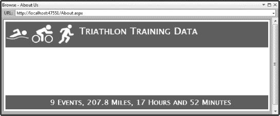

***图 9-4。**在母版页中动态生成页脚*

#### 在网页中使用母版页

一旦我们创建了合适的母版页，我们就可以创建具有与母版页的元素相匹配的元素的网页。首先，我用这种方法从第八章的[中重新创建了`ListEvents.aspx`页面。使用母版页最简单的方法是确保您选择了名为“使用母版页的 WebForm”的模板，如图 9-5](08.html#ch8) 所示。

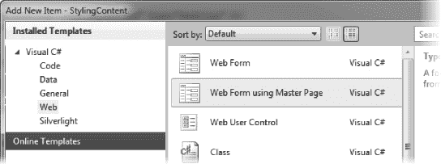

***图 9-5。**使用母版页添加新网页*

使用该模板时，Visual Studio 提示您选择要与新网页关联的母版页，如图[图 9-6](#fig_9_6) 所示；在我们的示例项目中只有一个母版页，但是大型项目可以针对 web 应用的不同功能区域有多个母版页。

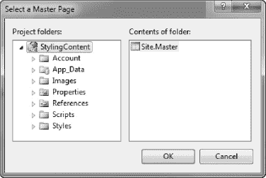

***图 9-6。**选择母版页*

当您选择一个母版页时，创建的网页带有与母版中的`asp:ContentPlaceHolder`元素相对应的`asp:Content`元素。[清单 9-5](#list_9_5) 展示了当我创建`ListEvents.aspx`页面时 Visual Studio 为我创建的网页。

***清单 9-5。**一个骷髅网页*

`<%@ Page Title="" Language="C#" MasterPageFile="~/Site.Master" AutoEventWireup="true"
CodeBehind="AddEvent.aspx.cs" Inherits="StylingContent.AddEvent" %>

<asp:Content ID="Content1" ContentPlaceHolderID="HeadContent" runat="server">
</asp:Content>

<asp:Content ID="Content2" ContentPlaceHolderID="MainContent" runat="server">
</asp:Content>`

从这一点来说，我只是将页面所需的标记添加到每个`asp:Content`元素中，记住一些页面结构将来自母版页。[清单 9-6](#list_9_6) 显示了前一章的`ListEvents.aspx`页面，修改后可以与来自[清单 9-3](#list_9_3) 的母版页一起使用。

***清单 9-6。**使用母版页的网页*

`<%@ Page Title="Triathlon Events" Language="C#" MasterPageFile="~/Site.master"
AutoEventWireup="true"
    CodeBehind="Default.aspx.cs" Inherits="StylingContent._Default" %>

<asp:Content ID="HeaderContent" runat="server" ContentPlaceHolderID="HeadContent">
    <link href="/Styles/Page.css" rel="stylesheet" type="text/css" />
</asp:Content>

<asp:Content ID="BodyContent" runat="server" ContentPlaceHolderID="MainContent">  
  <table id="resultsTable" runat="server" rules="cols">` `            <tr>
                <th>Date</th>
                <th>Athlete</th>
                <th>Event Type</th>
                <th>Swim</th>
                <th>Cycle</th>
                <th>Run</th>
                <th>Overall</th>
                <th>Rank</th>
                <th>Ref Rank</th>
                <th>Edit</th>
                <th>Delete</th>
            </tr>
        </table>

        

            <label>Event Type:</label>
            <select id="eventSelector" runat="server">
                <option>All</option>
            </select>
        

        

            <input type="submit" value="Submit" />
        

        

            <a href="AddEvent.aspx">Add New Event</a>
        

</asp:Content>`

在`HeadContent`部分，我已经导入了一个名为`Styles/Page.css`的 CSS 文件。这个文件将被插入到整体结果的`head`元素中，允许我指定本地 CSS 样式来补充或覆盖母版页中的样式。在`MainContent`部分，我添加了占页面显示大部分的表格。

 **提示**您可以通过在`Page.PreInit`事件的处理程序中设置`Page.MasterPageFile`属性的值来更改网页使用的母版页。有关页面事件的详细信息，请参见[第 5 章](05.html#ch5)。

[图 9-7](#fig_9_7) 显示了最终的结果。我复制了整个代码隐藏类，只修改了名称空间以匹配本章的新项目名称。

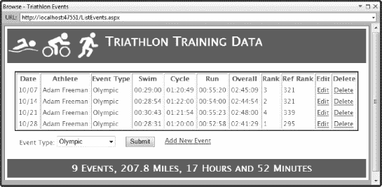

***图 9-7。**使用母版页的网页*

如果你在浏览器中查看这个页面的 HTML，你会看到 ASP.NET 已经改变了 HTML 元素的属性`id`的值。例如，`table`元素，它在`ListEvents.aspx`中是这样定义的:

`<table id="resultsTable" runat="server" rules="cols">`

出现在呈现页面的 HTML 中，如下所示:

`<table id="MainContent_resultsTable" rules="cols">`

内容区域的名称，在本例中为`MainContent`，被添加到`id`值的前面，用下划线分隔。这确保了在母版页和网页中使用相同的`id`定义的控件具有唯一的标识符。我不必修改原始的代码隐藏类；ASP.NET 服务器会重新映射`id`值，这样我们就不用担心修改了。这对于代码隐藏文件来说是一个有用的特性，但是——正如你将在本章后面看到的——这在使用 JavaScript 时会引起一个小问题。

当然，当母版页应用于一个项目中的多个网页时，母版页的好处就显现出来了，当我们创建使用母版页的其他网页时，我们会看到应用中的样式是一致的。我已经从第八章的[中重新创建了`AddEvent.aspx`页面来使用母版页。](08.html#ch8)[图 9-8](#fig_9_8) 显示了结果。

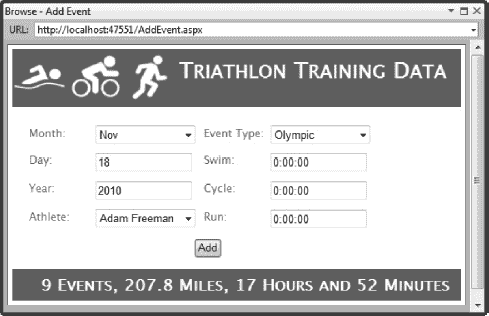

***图 9-8。**页面风格一致*

我们已经能够非常简单地使用母版页在这些页面上获得一致的样式。我不需要修改我们在第八章中创建的任何一行代码文件，重构标记以适应`asp:Content`元素非常简单。

##### 从网页管理母版页

通常，您的应用会要求样式在视觉上大体一致，但在某种程度上又与众不同，以指示特定类型的操作—例如，表明特定页面将删除而不是更新数据库记录。有许多方法可以实现这一点，但我喜欢的一种方法是在网页中配置母版页的 HTML 控件。

您可以通过使用`Master`属性从网页访问母版页，该属性返回一个`System.Web.UI.MasterPage`类的实例。然后你可以调用`MasterPage`上的`FindControl`方法来通过名字定位一个 HTML 控件，并像处理任何其他 HTML 控件一样处理它，如[清单 9-7](#list_9_7) 所示。

***清单 9-7。**配置主页面控件*

`if (mode == "delete") {
    monthSelect.Disabled = true;
    dayText.Disabled = true;
    yearText.Disabled = true;
    athleteSelect.Disabled = true;
    eventTypeSelect.Disabled = true;
    swimText.Disabled = true;
    cycleText.Disabled = true;
    runText.Disabled = true;` `    **foreach (string controlID in new string[] { "titleDiv", "footerDiv" }) {**
        **HtmlControl ctrl = Master.FindControl(controlID) as HtmlControl;**
        **if (ctrl != null) {**
            **ctrl.Style["background"] = "#980000";**
        **}**
    **}**
}`

我已经重新创建了来自[第 8 章](08.html#ch8)的`UpdateOrDeleteEvent.aspx`页面，更新它以与本章示例项目中的母版页一起工作。根据用户是打算更新还是删除铁人三项赛事，该页面的操作会有所不同。当我们被要求删除一个事件时，清单 9-7 中的片段禁用了 HTML 表单中的输入控件——我为这一章添加的内容以粗体显示。我找到代表母版页标题和页脚部分的`div`元素的 HTML 控件，将它们转换为`HTMLContol`对象，然后覆盖 CSS `background`值。

通过这种方式，页面保持了一致的整体样式，但是当用户将要执行删除操作时，主元素的颜色会发生变化。在[图 9-9](#fig_9_9) 中可以看到页面在更新和删除模式下的外观。

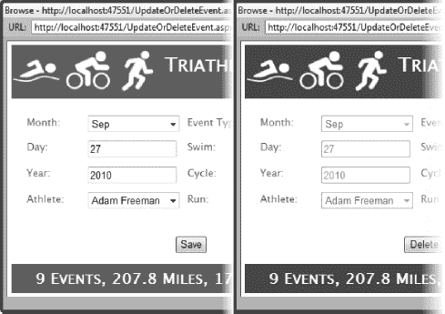

***图 9-9。**改变母版页中的样式元素*

母版页是一种简单而灵活的方法，可以在应用的页面之间强制实施一致的样式。有了它们，你可以不费吹灰之力增加页面的视觉吸引力，并为用户的一致交互建立基础。

### 使用 jQuery

当我们使用 ASP.NET Web 应用模板创建示例项目时，Visual Studio 自动添加了对 jQuery 的支持。你可以通过打开解决方案浏览器窗口中的`Scripts`文件夹来看到这一点，它将包含三个文件，如图 9-10 中的[所示。](#fig_9_10)

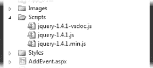

***图 9-10。ASP.NET 项目中的 jQuery 文件***

`jQuery-1.4.1–vsdoc.js`文件提供了对 Visual Studio IntelliSense for jQuery 表达式的支持，允许 Visual Studio 在您在代码编辑器中键入时提供完成 jQuery 语句的建议。`jQuery-1.4.1.js`文件包含 jQuery 库；这个文件的内容是未压缩的，这对于阅读源代码和调试遇到的任何问题非常有用。`jQuery-1.4.1.min.js`文件是库的压缩版本，旨在最小化传输到浏览器的数据量。这是您通常在生产中使用的文件。

**更新项目中的 jQuery**

从`Scripts`文件夹中的文件名可以看出，Visual Studio 已经为我们提供了 1.4.1 版本的 jQuery。Visual Studio 的版本比 jQuery 的版本更少出现，所以您会经常发现 jQuery 已经向前发展了。如果你想要最新版本的 jQuery，你可以从 jQuery.com 获得。

在我写这篇文章时，当前版本是 1.4.4，它提供了性能改进并修复了一些错误。当你读到这里的时候，更新的版本肯定已经出现了。`–vsdoc`文件并不总是立即生成，但是我发现您可以简单地重命名最新的可用文件，只要您不介意不支持任何已添加的新功能。

#### 使用 jQuery 对内容进行样式化

要开始使用 jQuery，我们必须将库添加到页面中。最简单的方法是将适当的文件从`Scripts`文件夹拖到页面或母版页的`head`元素中。我已经将 jQuery 库添加到示例项目的`Site.Master`文件中，这样它将在项目的所有页面中可用。[清单 9-8](#list_9_8) 展示了 Visual Studio 所做的添加。

***清单 9-8。**将 jQuery 库添加到母版页*

`...
<head runat="server">
    <link href="/Styles/Site.css" rel="stylesheet" type="text/css" />
    ****
    <asp:ContentPlaceHolder ID="HeadContent" runat="server"/>
</head>
...`

**通过 CDN 传递 jQuery**

如果您通过互联网交付 web 应用，您可以使用微软内容交付网络(CDN)来访问 jQuery 库。微软将从靠近每个用户的服务器传送相同的内容，而不是让你的 ASP.NET 服务器传送库文件。这是微软免费提供的一项服务。这种方法的好处是为您的用户提供响应更快的 web 应用，并降低服务器的带宽需求。你可以在`www.asp.net/ajaxlibrary/cdn.ashx`了解这项免费服务的具体操作。

CDN 方法不适合在内部网中交付给用户的应用，因为它导致所有浏览器都通过互联网来获取 jQuery 库，而不是访问 ASP.NET 服务器，后者通常更近、更快、带宽成本更低。

下一步是给网页添加一个`script`元素，它将对内容进行样式化，如[清单 9-9](#list_9_9) 所示。我已经将这个脚本语句添加到了`ListEvents.aspx`页面。

***清单 9-9。**用 jQuery 设计内容*

``

这个脚本包含了很多内容，但是它为我们理解如何使用 jQuery 对内容进行样式化提供了一个基础。我们将把剧本拆开，依次看每一部分。

##### 一个简单的 jQuery 例子

我们将从脚本中两个样式语句中较简单的一个开始，也就是这个:

`$('td a').addClass('tableLink').css('text-decoration', 'none');`

大多数 jQuery 操作的第一步是在 HTML 中选择想要处理的元素。我们通过在括号中指定一个 jQuery 选择器来实现这一点，并在前面加上一个美元符号(`$(<selector>)`)。jQuery 支持非常广泛的选择器，包括 CSS 选择器。[表 9-1](#tab_9_1) 描述了最常用的选择器。

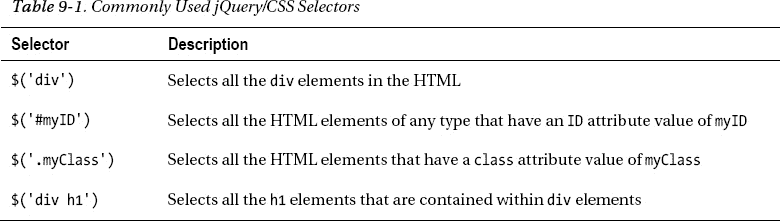

我们语句中的选择器`$('td a')`，选择包含在`td`元素中的所有`a`元素。在`ListEvents.aspx`页面中，这意味着所有的编辑和删除链接都将被选中。

 **注意** jQuery 用自己的一些选择器补充了 CSS 选择器；事实上，使用 jQuery 选择元素有很多不同的方式，最困难的是选择您喜欢的模型。我倾向于依赖元素类型和类，如[表 9-1](#tab_9_1) 所示，但是对于更复杂的选择，我会依靠其他一些选项。这里列出的选项太多了，但是我建议您查阅 jQuery.com 的文档。它很全面，每种方法都有一个有用的例子。

一旦我们选择了目标元素，我们就可以应用样式了。该语句对编辑和删除链接应用了两种样式——第一种使用 jQuery `addClass`函数，如粗体所示:

`$('td a').addClass('tableLink').css('text-decoration', 'none');`

`addClass`函数，顾名思义，给选中的元素添加一个类；在这种情况下，该类被称为`tableLink`，并在`Styles/Page.css`文件中定义如下:

`a.tableLink { color: Red;}`

然后我调用`css`函数，让我为一个特定的 CSS 属性指定一个值。我已经为`text-decoration`属性指定了一个值`none`。因此，总而言之，我的 jQuery 语句选择了包含在一个`td`元素中的所有`a`元素，应用了`tableLink` CSS 类，并将`text-decoration`属性值设置为`none`。jQuery 有许多函数使得使用 CSS 变得非常简单。[表 9-2](#tab_9_2) 描述了最常用的几种。

T2】

##### 一个更复杂的例子

脚本中的第二条语句稍微复杂一些，但是它展示了 jQuery 的灵活性。以下是声明:

`$('td').filter(function () {
    return $(this).text() == 1;
}).css({ 'color': 'green', 'font-weight': 'bold' });`

语句的第一部分是初始选择器`$('td')`，它选择 HTML 中的所有`td`元素。然后，我使用`filter`函数在选择中查找文本为`1`的元素。

函数的作用是:返回包含在 HTML 元素中的文本。我将一个匿名函数(使用`function()`创建)传递给`text`函数，该函数用于评估每个选中的元素。对于通过过滤器的每个元素，我使用`css`函数为`color`和`font-weight`属性设置新值，使元素中的文本为绿色和粗体。

##### jQuery 包装器

脚本的剩余部分是 jQuery 包装器，如下所示:

`$(document).ready(function () {
    // other jQuery statements
});`

默认情况下，浏览器会在遇到脚本时立即执行，这就带来了风险，即我们会在从服务器加载完所有 HTML 元素之前应用样式。包装器是一种常见的 jQuery 技术，它阻止我们的脚本执行，直到所有的 HTML 都可用。

选择器`$(document)`应用于整个文档，而`ready`函数是一个事件，当页面的 HTML 已经被加载时被调用。jQuery 对管理 JavaScript 事件有广泛的支持，你会在[第 10 章](10.html#ch10)中看到更多。我们创建了一个包含其他 jQuery 语句的匿名函数，通过这样做，我们知道在整个文档可用之前不会执行这些语句。

当添加到`ListEvents.aspx`页面时，jQuery 脚本具有格式化排名的效果，排名由 1 和到编辑和删除功能的链接组成——你可以在[图 9-11](#fig_9_11) 中看到这个效果。

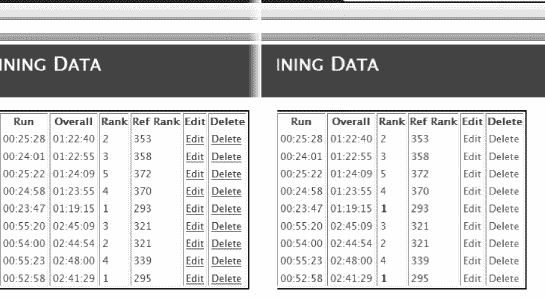

***图 9-11。**jQuery 样式化的效果*

#### 使用其他常见的 jQuery 样式技术

从前面的例子中可以看出，使用 jQuery 对内容进行样式化很简单。您只需选择一些元素，然后应用您想要的类或样式。在这一节中，我将演示三种常用的样式技术，它们依赖有用的 jQuery 特性来实现给定的样式。

##### 造型表

尽管 HTML `table`标签有局限性，但表格仍然是许多 web 应用的关键组件，尤其是公司应用。提高表格可读性的最常见方法之一是对替换行应用颜色，对表格标题行应用单独的颜色。清单 9-10 展示了如何使用 jQuery 实现这种风格。

***清单 9-10。**对表格的标题和选定行进行样式化*

`$(document).ready(function () {

    $('tr:has(th)').css({ 'background-color': '#007F7F', 'color': '#ffffff' });
    $('tr:has(td):even').css('background-color', "#11B1B1");

});`

本例中的选择器使用了`:has`选择修饰符，它选择指定类型的元素，这些元素包含一个或多个传递给`:has`修饰符的类型元素。因此，在这个例子中，`$('tr:has(th)')`选择了所有包含一个或多个`th`元素的`tr`元素。如果您研究一下`ListEvents.aspx`页面的组成，您可以看到这将选择表格的标题行。

第二个选择器以同样的方式工作，选择包含一个或多个`td`元素的`tr`元素。这包括所有不是标题的行。第二条语句通过使用`:even`修饰符进一步限制选择，该修饰符选择选择中的偶数项(jQuery 是从零开始的，因此`:even`的选择顺序是 0、2、4 等等)。这两条语句都使用`css`函数来设置它们选择的行的背景颜色。在[图 9-12](#fig_9_12) 中可以看到效果。

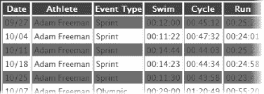

***图 9-12。**表格中标题和交替行的着色*

我前面提到过，您可以用不同的方式创建相同的选择，表格行是提供演示的理想基础。清单 9-11 显示了一种不同的方式来实现图 9-12 中[所示的效果。](#fig_9_12)

***清单 9-11。**给表格着色的另一种方法*

`$(document).ready(function () {
    $('tr').first().css({ 'background-color': '#007F7F', 'color': '#ffffff' });
    $('tr:odd').css('background-color', "#11B1B1");

});`

第一条语句选择所有的`tr`元素，然后使用`first`函数只选择第一个被选中的元素。在`ListEvents.aspx`页面中，这将是标题行。第二条语句也选择了所有的`tr`元素，但是使用了`:odd`修饰符将选择限制为奇数元素(同样，jQuery 使用基于零的计数，因此选择中的第一项实际上是偶数)。

##### 修改标题

jQuery 库包含一些有用的选择器和选择修饰符，使常见的选择变得简单和容易。一个这样的修饰符是`:headers`，它选择所有的标题元素，比如`h1`、`h2`、`h3`等等。当然，我们可以单独选择每种类型的标题，但这是一种将一致的样式应用于页面中所有标题的便捷方式。清单 9-12 包含了一个简单的演示，我已经将它添加到了`Site.master`页面中，这样它将影响到我们示例应用中的所有页面。

***清单 9-12。**对所有标题元素应用样式*

`$(document).ready(function () {
    $(':header').css('text-decoration', 'underline');
});`

选择修饰符在单独使用时适用于所有元素，如[清单 9-12](#list_9_12)；这意味着选择器`$(':header')`将首先选择文档中的所有元素，然后将选择限制在那些标题元素上。脚本中的语句给标题元素中的文本加下划线；你可以在[图 9-13](#fig_9_13) 中看到这样做的结果。

***图 9-13。**设计所有标题元素的样式*

重要的是要认识到 jQuery 语句是由浏览器执行的，它不能区分来自母版页的 HTML 元素和来自网页的 HTML 元素。因此，使用 jQuery 修饰符如`:header`会影响*所有呈现的 HTML 中的标题元素，即使我将脚本添加到了母版页。*

##### 改变元素的含量

当我们查看母版页时，我们看到了如何使用页面代码隐藏文件来修改母版页中包含的内容元素。这使我们能够保持 web 应用的整体视觉一致性，同时向用户表明他们将要执行的操作会产生不同的影响。

上一个例子的关键是检测页面何时被用于删除模式，而不是编辑模式。这由 HTML `form`中隐藏的 input 元素的值表示。根据模式，我们改变了页面的页眉和页脚的颜色。我们可以使用 jQuery 来达到同样的效果。[清单 9-13](#list_9_13) 显示了我添加到`UpdateOrDeleteEvent.aspx`页面的 jQuery 脚本。我们将更改页眉和页脚的文本，以便向用户显示警告，而不是重复相同的修改。

***清单 9-13。**根据隐藏表单字段的值更改页眉和页脚*

`$(document).ready(function () {
    if ($('#<%=modeInput.ClientID%>').val() == 'delete') {
        $('#titleDiv h1').text('Delete Event');
        $('#footerDiv').html("<h2>Caution: Events cannot be restored</h2>");
    }
});`

该脚本的第一部分选择表单中隐藏的`input`字段，并测试该值以确定该页面是否用于编辑或删除事件。

**处理客户端 id**

正如我在本章前面提到的，当使用母版页时(当一个元素的`runat`值为`server`)，ASP.NET 将重写`ID`属性的值，以确保呈现页面上的每个元素都可以被唯一地标识。这意味着来自`UpdateOrDeleteEvent.aspx`文件的这样一个元素:

`<input type="hidden" id="modeInput" runat="server" />`

将在发送到浏览器的呈现的 HTML 中产生如下元素:

`<input name="ctl00$MainContent$modeInput" type="hidden" id="MainContent_modeInput"
value="edit" />`

有两个值得注意的变化。ID 值已从`modeInput`更改为`MainContent_modeInput`，并添加了名称属性。当我们编写服务器端代码时，ASP.NET 向我们隐藏了这种重写，我们可以将控件称为`modeInput`。当我们编写客户端代码时，我们必须处理重写的值，以便识别元素。有两种方法可以做到这一点。第一种是显式指定重写的名称，如下所示:

`if ($('#MainContent_modeInput').val() == 'delete') {`

这种方法很简单，但是很脆弱——如果您在母版页和网页中更改了 content 元素的名称，那么您的 jQuery 脚本将不会像您预期的那样工作。更好的方法是使用一个代码块，你在第四章中第一次看到它，并读取 HTML 控件的`ClientID`属性的值，就像这样:

`if ($('#<%=modeInput.ClientID%>').val() == 'delete') {`

代码块以粗体显示。我必须承认，比起第二种方法，我更倾向于使用第一种方法，尽管我知道当有变化时这是有问题的。顺便说一下，我们可以使用相同的方法访问 name 属性的值，但是通过`UniqueID`属性；在下一章你会看到一个这样的例子。

`val`函数返回`input`元素的值。如果值是`delete`，那么执行`if`块中的语句。如果值不是`delete`，那么我们被要求编辑一个事件，我们的风格变化是不需要的。`if`块中的第一条语句如下:

`$('#titleDiv h1').text('Delete Event');`

选择器找到 ID 为`titleDiv`的元素，然后选择它们包含的`h1`元素。我们只有一个`titleDiv`元素，并且它只包含一个`h1`元素，所以我们的更改的效果将局限于单个元素。`text`函数为所选元素设置文本；在这种情况下，文本被设置为`Delete Event`。

`if`块中的第二条语句演示了实现相同效果的不同方法，不过这次应用于页脚:

`$('#footerDiv').html("<h2>Caution: Events cannot be restored</h2>");`

选择器匹配 ID 为`footerDiv`的元素，然后使用`html`函数设置元素的内容，包括`h2`元素。`html`函数类似于文本元素，只是它不转义 HTML 结构字符。jQuery 函数`text`和`html`之间的关系类似于你在第 4 章和第 5 章中看到的 HTML 控件类的`InnerHtml`和`InnerText`属性之间的关系。当然，我们可以像设置页眉一样设置页脚，就像这样:

`$('#footerDiv h2').text("Caution: Events cannot be restored");`

但是我想演示您可以使用 jQuery `html`函数设置或替换整个元素的内容。[图 9-14](#fig_9_14) 演示了脚本的效果。

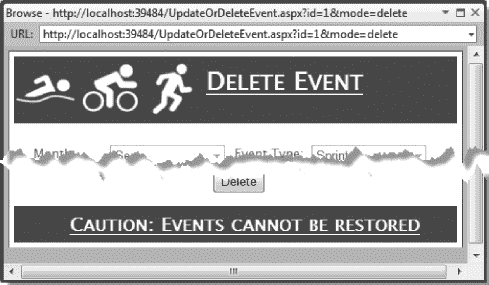

***图 9-14。**选择性地对页面的页眉和页脚应用样式*

请注意，页眉和页脚中的文本带有下划线。这是因为我在[清单 9-12](#list_9_12) 中应用到母版页的脚本还在。当呈现页面时，母版页中的脚本与在`.aspx`页面文件中定义的脚本一起包含在 HTML 中。下面是发送到浏览器的`head`元素:

`<head>
    <link href="/Styles/Site.css" rel="stylesheet" type="text/css" />
    

    <link href="/Styles/Page.css" rel="stylesheet" type="text/css" />

        ` `    
<title></title>
</head>`

当您在母版页和网页中定义了脚本时，保持谨慎是有好处的。您应该确保它们不会相互冲突，并且它们是按照您希望的执行顺序定义的。在这个例子中，您可以看到母版页中定义的脚本出现在`.aspx`网页中脚本的之后的*。如果我们看一下`Site.Master`页面的`head`元素，我们可以看到为什么会发生这种情况:*

`<head runat="server">
    <link href="/Styles/Site.css" rel="stylesheet" type="text/css" />
    
    **<asp:ContentPlaceHolder ID="HeadContent" runat="server"/>**
    
</head>`

粗体显示的`asp:ContentPlaceHolder`元素出现在 jQuery 库导入之后，本地脚本定义之前。这种方法没有任何问题，除非您依赖于按顺序执行的脚本。

### 总结

在这一章中，我们已经看到了内容样式的两个关键特性。第一个是母版页，它提供了一个简单而优雅的系统，用于在 web 应用的部分或所有页面上定义一致的样式。只有当我充实了核心功能后，我才倾向于切换到项目中的母版页，我总是被一致的主题元素给 web 应用带来的即时视觉冲击所震惊。我们可以在每个页面中实现相同的效果，但是母版页系统几乎毫不费力，并且避免了维护每个页面中重复的样式的问题。

我们探索的第二种技术是 jQuery 的使用。jQuery 库是 ASP.NET 程序员的必备工具。人们很容易相信 ASP.NET 应用的所有魔力都发生在服务器上，但这是错误的。您的应用范围包括浏览器，我们可以在浏览器中做很多事情来改善用户的体验。其中的关键是 JavaScript——尤其是 jQuery。

这是我们在本书中第一次遇到 jQuery，但是我们将在下一章讨论用户交互时再次看到它，并且在第 11 章探讨 Ajax 时再次看到它。由此得到的启示是，尽管不使用 jQuery 也可以构建 ASP.NET 应用，但这样做确实没有太大意义，认识到 ASP.NET 的范围包括浏览器将会打开开发特性的新前景。