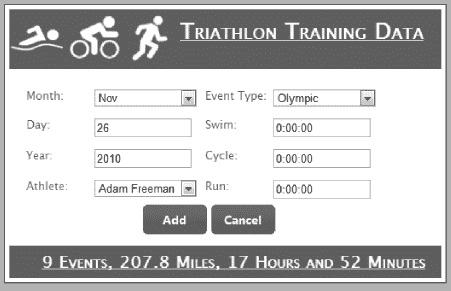

# 十、添加交互性

支撑 web 应用的技术并不是为有状态用户交互而设计的。事实上，我们能够构建可信的 web 应用，是因为像 ASP.NET 这样的框架内置了许多巧妙的技巧和技术。Web 应用就像一个魔术；我们从一系列无状态的网络请求中形成会话，我们在生成的 HTML 中隐藏重要信息，我们使用简单的标记来表达复杂的数据关系。

总的来说，一切都很好，足以维持这种错觉，我们可以尝试重新创建传统部署应用的体验。但是我们最薄弱的地方——威胁到我们的 web 应用的外观——是我们的网页的外观和感觉。标准的 HTML 看起来很糟糕，网页中的每个重大动作都会导致一个表单`POST`，可能会很慢。在一个已部署的应用中，用户可以体验丰富的控件，并且几乎可以立即看到对某个动作的响应。如果您将用户的输入发送到远程服务器进行处理，那么在 web 应用中很难与这种即时性竞争。

幸运的是，您可以采取措施使您的 web 应用更具反应性和响应性，并且您将在本章中看到最有用的应用。您将回到 jQuery，您第一次看到它是在第 9 章中，并使用 JavaScript 探索增强 web 应用的不同方法。

本章中没有一个例子要求在浏览器中禁用 JavaScript 的用户做出重大改变。我的意思是，您将使用 JavaScript 来增强启用它的用户的体验，但您将为不启用它的用户维护基本功能。大多数用户让 JavaScript 保持启用状态，但令人惊讶的是，少数人禁用了它，当您的目标用户是大中型企业中的用户时，对非 JavaScript 客户端的偏好会急剧增加。如果您的目标用户是保守市场中的企业用户—银行、保险、政府等—那么您必须降低期望值，并准备好处理禁用大多数功能和使用过时版本浏览器的客户端机器。因此，记住您的目标受众并为您期望支持的每一类用户保留功能是很重要的。

### 创建项目

在这一章中，我们将直接构建我们在第 9 章中构建的 web 应用，其中我们将母版页和 jQuery 样式应用于页面，让我们可以在示例数据库中查看、添加、编辑和删除 triathlon 事件。

### 改善客户端与 jQuery 的交互

在前一章中，您看到了如何使用 jQuery 将样式应用于从 ASP.NET 服务器生成的 HTML 中的元素。jQuery 还包括一个很好的事件系统，可以用来改善用户与应用的交互。

#### 应对事件

HTML `form`元素是大多数 web 应用的主干，它被设计用来从用户那里收集信息，然后用户点击提交按钮将数据发送到服务器。随着表单的概念被扩展到让用户控制越来越复杂的应用，通过点击一个按钮来移动事物的需求变得越来越奇怪和多余。你可以在`ListEvents.aspx`页面中看到一个很好的例子，它让用户能够根据事件类型过滤显示的事件，如图[图 10-1](#fig_10_1) 所示。

***图 10-1。**单独的选择和按钮元素*

用户必须从下拉列表(`All`、`Olympic`或`Sprint`)中选择他们希望看到的事件类型，然后单击提交按钮使选择生效。您可以通过使用 jQuery 事件系统来改进这一点，如清单 10-1 中的[所示。](#list_10_1)

***清单 10-1。**使用 jQuery 事件*

`$(document).ready(function() {

    // respond to selections to filter the content and submit the form
    $('#<%=eventSelector.ClientID %>').change(function () {
        $('form').submit();
    });
    // hide the submit button
    $('input:submit').hide();

});`

jQuery 事件系统基于底层的 JavaScript 事件，但是这些事件与 jQuery 选择器一起使用。在[清单 10-1](#list_10_1) 中，除了在[第 9 章](09.html#ch9)中讨论的包装器之外，脚本的第一部分如下:

`$('#<%=eventSelector.ClientID %>').change(function () {
    // other statement
});`

选择器查找 ID 分配给`eventSelector`元素的元素。正如您可以从我们正在寻找的 ID 值中看到的，我们正在处理一个与母版页相关联的`.aspx` web 页面(有关详细信息，请参见上一章)。

尽管 jQuery 选择器将匹配多个元素，但是只有一个这样的 HTML 元素具有您正在寻找的 ID，因为 ASP.NET 使得`ID`属性值是唯一的；向用户显示事件类型下拉列表的是`select`元素。对`.change`函数的调用允许我们注册一个函数，当用户改变选择的值时，这个函数将被调用。清单 10-1 中的第二个关键语句是我们希望当用户做出选择时发生的事情:

`$('form').submit();`

该语句选择 HTML `form`元素(同样，我们知道我们的页面中只有一个)并调用`submit`函数。当我们调用带有参数的 jQuery 事件函数时，我们注册了在事件被触发时要调用的语句，但是当我们调用不带参数的同一个函数时，我们调用了事件——在这种情况下，我们将表单提交给 ASP.NET 服务器进行处理。脚本的最后一部分是这样的语句:

`$('input:submit').hide();`

该语句的选择器选择所有的`input`元素，然后`:submit`修改器为那些`type`属性为`submit`的元素过滤选择。HTML 中有一个这样的元素，它是用户提交表单时必须点击的按钮。

`hide`函数顾名思义就是这样做的；它从显示中隐藏选定的元素。在这个例子中，我们想要隐藏 submit 按钮，因为它不再需要了。我们希望将它包含在页面中，以防用户禁用了 JavaScript，但是我们知道，如果我们的脚本已经执行，我们可以删除按钮以避免重复和混淆用户。您可以通过查看修改后的`ListEvents.aspx`页面看到这个脚本的视觉效果，同样如图[图 10-2](#fig_10_2) 所示。

***图 10-2。**删除多余的 HTML 元素*

现在，当用户从下拉菜单中进行选择时，表单会自动提交给服务器，过滤后的数据会返回并显示出来，而用户无需单击单独的按钮。

#### 在客户端过滤数据

我们可以通过使用 jQuery 过滤 events 表中的行来改进前面的例子。这意味着我们不必向服务器发出请求来获得一组经过过滤的数据。清单 10-2 显示了一个脚本，它过滤表格中的数据，而不把表格提交给服务器进行处理。

***清单 10-2。**过滤表格行*

`$(document).ready(function () {
    // hide the submit button
    $('input:submit').hide();

    // respond to selections to filter the content and filter the content
    $('#<%=eventSelector.ClientID%>').change(function () {

        var selectedOption =
        $('#<%=eventSelector.ClientID%>').find('option:selected').text();

        if (selectedOption == 'All') {
            // ensure all rows are visible
            $('tr:has(td)').show();
        } else {
            $('tr:has(td)').hide();
            $("td:nth-child(3):contains('" + selectedOption + "')").parent().show();
        }
    });
});`

我们从再次隐藏提交按钮开始。在这个例子中我们不需要它，尤其是因为我们根本不打算提交表单。然后我们添加一个当用户从下拉列表中选择一个选项时调用的函数:

`$('#<%=eventSelector.ClientID%>').change(function () {
    // statements
});`

这与我们在前面的例子中采用的方法相同。在函数内部，我们获取所选项目的文本值，如下所示:

`var selectedOption = $('#<%=eventSelector.ClientID%>').find('option:selected').text();`

该语句中的选择器通过 ID 匹配`select`控件。调用`find`函数来获取包含在`select`控件中的`option`元素，结合`:selected`修饰符，只匹配选中的元素。这样做的结果是用户选择的`option`元素——`text`函数返回所选`option`元素的标签。既然我们知道用户在过滤什么，我们就可以相应地做出响应:

`if (selectedOption == 'All') {
    $('tr:has(td)').show();
} else {
    $('tr:has(td)').hide();
    $("td:nth-child(3):contains('" + selectedOption + "')").parent().show();
}`

如果用户选择了`All`，我们将选择包含至少一个`td`元素的所有`tr`元素。这为我们提供了表中除标题行之外的所有行。我们调用`show`函数来确保所有的行都是可见的，这将撤销之前任何过滤的效果。如果用户选择了另一个选项，那么我们隐藏所有行，这样就看不到任何内容，然后选择我们希望再次显示的行:

`$("td:nth-child(3):contains('" + selectedOption + "')").parent().show();`

选择器`td:nth-child(3)`选择作为其父节点的第三个子节点的所有`td`元素。jQuery 在所有函数中使用从零开始的数组，除了这个从一开始的函数，这意味着表中的第三列包含的子元素是其父元素的第三个子元素。`:contains`修饰符将选择限制在那些也包含我们正在过滤的文本的元素上。

选择器的结果是包含目标事件类型的一组`td`元素。我们希望处理整行，这可以通过`parent`函数来实现，该函数将为每个选中的`td`返回`tr`。最后一步是在每一行上调用`show`，使其对用户可见。该脚本的结果是，用户可以按事件类型过滤内容，而无需返回服务器获取过滤后的数据。[图 10-3](#fig_10_3) 显示了结果页面。

***图 10-3。**过滤表格行*

这种方法只适用于小数据集和简单的过滤器。将大量数据传输到浏览器可能比请求筛选的数据子集需要更长的时间。此外，在重新加载页面之前，我们不会对数据库进行任何更改。如果我们是唯一的用户，这没问题，因为添加、编辑和删除操作随着再次加载`ListEvents.aspx`页面而结束。也就是说，在很多情况下都可以使用本节中显示的示例。不是所有的项目都处理大量的数据，看不到其他用户的最新更新也是可以接受的。

#### 用按钮替换链接

用户通常将按钮与动作而不是超链接联系在一起。在我们的`ListEvents.aspx`页面中，如果用户想要添加、编辑或删除某个事件，我们会向用户提供超链接供其点击。我们可以使用 jQuery 用常规按钮替换这些链接，如清单 10-3 所示。

***清单 10-3。**用按钮替换超链接*

`$(document).ready(function () {
    var counter = 0;
    // select all of the links in the page
    $('a').each(function () {
        var labelText = $(this).text();
        var targetURL = $(this).attr('href');
        var buttonID = 'newButton' + counter++;

        // create the button
        $(this).replaceWith("<button id='" + buttonID + "'>" + labelText + "</button>");

        // select the newly created button and bind to it
        $('#' + buttonID).click(function () {
            window.location = targetURL;
            return false;
        });
    });
});`

这个脚本首先定义一个名为`counter`的变量。我们一会儿将回到这一点。然后我们选择所有的`a`元素并调用`each`函数。这意味着我们创建的匿名函数中的语句将对每个选中的元素执行，这相当于一个 C# `foreach`循环。

每次循环执行时，我们都会创建三个变量。将来自`a`元素的文本分配给`labelText`变量(使用`text`函数)，并将`href`属性的值分配给`targetURL`(使用`attr`函数)。最后一个变量`buttonID`，增加计数器的值，并将其附加到`newButton`。这为我们选择和处理的每个元素创建了一个唯一的值。

这个脚本的核心是`replaceWith`函数，它用一个 HTML 元素替换另一个元素。这是一个有用的函数，因为它让我们选择所有的`a`元素，然后用`button`元素替换它们，就像这样:

`$(this).replaceWith("<button id='" + buttonID + "'>" + labelText + "</button>");`

这个函数没有发挥应有的作用，因为它没有返回我们已经创建的新元素。这意味着我们不能链接对`click`函数的调用来注册按钮被点击时的处理函数。

这意味着一旦创建了按钮，我们就必须选择它，这就是为什么我们给每个按钮分配了一个唯一的`id`值。下面是选择新创建的按钮并提供单击按钮时要执行的函数的语句:

`$('#' + buttonID).click(function () {
    window.location = targetURL;
    return false;
});`

对`window.location`的调用使用原始链接的`href`属性的值来加载目标页面。注意，我们从这个函数中返回了`false`。这将停止浏览器对正在执行的事件的默认处理(即提交包含按钮的表单),并停止将该事件沿 HTML 元素的层次结构向上传递以进行进一步处理。

[图 10-4](#fig_10_4) 显示了这个脚本的结果。你可以看到所有的链接都被按钮取代了。在这个例子中，我禁用了交替行着色；颜色和按钮的组合产生了一种视觉错觉，其中交替行中的按钮看起来大小不同。

***图 10-4。**用按钮替换超链接*

当我们的目标是创建一个外观和行为都像常规 Windows 应用的 web 应用时，像这样的简单更改会产生显著的有益效果。

#### 改善表格行的交互

表格很难阅读；一长串相似的信息很难处理。在本例中，我们将在`ListEvents.aspx`页面的表格中添加两个新的交互，以便于使用。第一个变化是当鼠标经过该行时高亮显示该行。这是一种常用的技术，可以帮助用户跟踪查看数据表的进度。第二个变化是允许用户通过单击表中的行来编辑事件。清单 10-4 展示了支持这两种改变的 jQuery 脚本。

***清单 10-4。**改善用户与表格行的交互*

`$(document).ready(function () {

    $('tr:has(td)').hover(
        function () {
            $(this).find('td').css({ 'background-color': '#007F7F', 'color': '#ffffff' });
        },
        function () {
            $(this).find('td').css({ 'background-color': '', 'color': '' });` `        }).click(function () {
            $(this).find('td button:contains("Edit")').click();
        });
    });`

突出显示行的关键是`hover`事件，它以两个函数作为参数。当鼠标第一次进入元素占据的屏幕空间时，执行第一个功能，当鼠标离开该区域时，执行第二个功能。

我们绑定到包含`td`元素的每一行(`tr`)的事件。同样，我们不想改变标题行。对于函数，我们找到受影响的行包含的一组`td`元素，并使用`css`函数来设置和取消设置 CSS `background-color`和`color`属性。我们需要定义一个 CSS 类，然后使用`addClass`和`removeClass`函数，但是我发现 Visual Studio 2010 中的内置浏览器没有响应这些函数来改变行样式——这就是为什么我们直接设置和取消设置值。

这个脚本的最后一部分为每个选中的`tr`元素链接了一个对`click`函数的调用，提供了一个当用户单击一行时调用的函数。被调用的函数包含一条语句:

`$(this).find('td button:contains("Edit")').click();`

该语句找到包含文本*编辑*的`button`元素，并且在触发点击事件的`tr`元素内有一个`td`元素。这是我们在前一个例子中为该行创建的编辑按钮。不带参数调用`click`函数会调用事件，就像用户点击了按钮一样。这个语句依赖于我们用按钮替换超链接时定义的事件处理程序。如果我们仍然使用超链接，我们可以用下面的语句达到同样的效果:

`document.location = $(this).find('td a:contains("Edit")').attr('href');`

该语句找到包含文本*编辑*的`a`元素，该元素包含在`td`元素中，然后使用 JavaScript `document.location`特性加载由`href`属性的值指定的页面。

#### 验证表单

改善用户与 web 应用交互方式的最有效方法之一是在提交表单进行处理之前验证表单的内容。即时反馈，尤其是当出现问题时，可以减轻挫折感，并使 web 应用感觉响应更快，更像部署的 Windows 程序。

我们可以通过使用 jQuery 将函数绑定到各种事件并解析`form`中输入元素的内容来自己处理验证，但是更简洁的方法是使用 jQuery 扩展库，它构建在核心 jQuery 特性的基础上，并为表单验证提供现成的灵活系统。压缩库只有 7KB，对项目的开销增加很少，而且，像基本的 jQuery 库一样，您可以使用 Microsoft CDN 服务向您的客户交付验证库。有关 CDN 的详细信息，请参见上一章。

##### 安装验证库

从`http://jquery.bassistance.de`下载验证库，之后你可以解压文件并将`jQuery.validate.min.js`文件复制到你的 ASP.NET 项目的`Scripts`文件夹中。在 Visual Studio 解决方案资源管理器窗口中右击`Scripts`文件夹，并从弹出菜单中选择添加现有项。然后选择`jQuery.validate.min.js`文件并点击添加按钮。

一旦库文件出现在解决方案资源管理器窗口中，您可以将它拖到您想要使用它的网页或母版页上，或者您可以手动添加一个`script`元素，如下所示:

``

##### 执行验证

导入验证库后，我们可以添加一个脚本来验证表单的内容。清单 10-5 展示了这样一个脚本，我已经将它添加到了`AddEvent.aspx`页面。

***清单 10-5。**一个表单验证脚本*

`$(document).ready(function () {

    $('form').validate({
        errorLabelContainer: '#<%=errorDiv.ClientID%>',
        wrapper: 'li',
        rules: {
            <%=yearText.UniqueID %>: {
                required: true,
                range: [2010, 2012]
            }
        },
        messages: {
            <%=yearText.UniqueID %>: "Please enter a year from 2010 to 2012"
        }
    });
});`

表单验证库构建在 jQuery 之上，所以您在前面的例子中看到的选择器和其他特性都可供我们使用。我们首先选择页面中的`form`元素，并调用`validate`函数，如下所示:

`$('form').validate({
    // other statements
});`

这个调用设置了对我们的`form`元素的验证。当用户提交表单时，表单的内容将被验证。`validate`函数的参数指定应该执行什么验证以及应该如何显示任何错误。像 jQuery 本身一样，验证库非常灵活，有许多不同的方法来达到相同的结果。我们将采用的方法不需要改变页面中的 HTML 元素。第一个参数指定我们希望错误消息显示在哪里:

`errorLabelContainer: '#<%=errorDiv.ClientID%>',`

`errorLabelContainer`参数指定了我们想要用来显示任何错误消息的元素。我们的`AddEvent.aspx`页面包含一个 ID 为`errorDiv`的`div`，用于显示[第 7 章](07.html#ch7)中的错误。考虑到使用母版页时 ASP.NET 重写 ID 值的方式，我指定了这个元素。下一个参数指定应该用于包装每个错误信息的元素:

`wrapper: 'li',`

使用`li`元素意味着每个错误都将显示为一个项目符号，如果有多个验证问题，将给出一些显示结构。`rules`参数指定将要执行的验证:

`rules: {
    <%=yearText.UniqueID %>: {
        required: true,
        range: [2010, 2012]
    }
},`

这个清单中只有一个规则，它适用于`yearText` `input`元素，用户在这里设置事件发生的年份。验证规则是基于输入元素的`name`属性应用的，这很不幸，因为 ASP.NET 会自动插入这些规则，以便跟踪表单数据。在`AddEvent.aspx`文件中有这样一个元素定义:

`<input class="inputText" type="text" id="yearText" runat="server" />`

在呈现的 HTML 中是这样结束的:

`<input name="ctl00$MainContent$yearText" type="text" id="MainContent_yearText"
class="inputText" value="2010" />`

`value`属性是由代码隐藏文件设置的，但是`name`属性是由 ASP.NET 服务器创建的，超出了我们的控制范围。要获得`name`属性的值，我们可以调用`yearText.UniqueID`属性，该属性将返回 ASP.NET 生成的名称，在本例中是`ctl00$MainContent$yearText`。规则的其余部分指定了应用于输入元素的约束。本例中有两个:

`required: true,
range: [2010, 2012]`

将所需规则设置为`true`确保用户在输入字段中提供一个值。`range`规则采用一个 JavaScript 数组来指定可接受的上限值和下限值。这些规则一起应用，这意味着我们要求用户提供 2010 年和 2012 年之间的年份值。

脚本的最后一部分告诉验证库，当用户没有提供值或者值超出我们设置的范围时，我们希望用户看到什么消息:

`messages: {
    <%=yearText.UniqueID %>: "Please enter a year from 2010 to 2012"
}`

我们指定消息应用到的元素的名称，使用一个代码块来处理 ASP.NET 为`name`属性生成值和显示给用户的文本字符串的方式。

如果你把这个脚本添加到`AddEvent.aspx`网页，然后在浏览器中查看，你可以看到验证的效果，如图[图 10-5](#fig_10_5) 所示。清除年份的文本框或输入一个超出范围的值，然后单击“添加”按钮。

***图 10-5。**验证表单*

在单击 Add 按钮之前什么也没有发生，但是一旦单击了 Add 按钮，就会执行验证，并向用户显示错误消息。验证器现在进入 *live* 模式，并在您每次点击一个键时验证内容，在您解决问题时立即给出反馈。一旦输入了符合验证规则中设置的标准的值，错误就会消失，您可以再次单击 Add 按钮提交表单并在数据库中创建事件。

 **注意**客户端表单验证是对服务器端验证的补充，而不是替代。您不能依赖用户使用启用了 JavaScript 的浏览器。在极端情况下，您可能会发现您的用户正在以编程方式提交表单数据(也就是说，根本不使用浏览器)，或者试图通过向服务器发送错误的值来故意破坏您的应用。客户端验证是一种改善用户体验的好方法，但是它并不能减轻您在数据到达服务器时再次检查数据的负担。

`required`和`range`规则内置于 jQuery 表单验证库中。[表 10-1](#tab_10_1) 解释了这些和其他内置规则。

T2】

##### 创建自定义验证规则

内置的表单验证规则在大多数情况下都很有用，但并不是所有的输入格式都受支持。我们可以通过定义自定义规则来解决这个问题，也称为*自定义方法*。为了演示这个特性，我们将创建一个方法来验证 triathlon 的每个阶段所用时间的输入，我们希望用户输入一个值，我们可以将这个值解析到 C# `System.TimeSpan`中，比如 2:34:12，代表两小时 34 分 12 秒。清单 10-6 显示了定义和应用这种方法的验证脚本的附加内容。

***清单 10-6。**添加一个简单的自定义验证规则*

`$(document).ready(function () {

    **$.validator.addMethod(**
        **'timespan',**
        **function (value, element) {**
            **return value != '0:00:00' && value.match(/[0-9]:[0-5][0-9]:[0-5][0-9]/);**
        **});**

    $('form').validate({
        errorLabelContainer: '#<%=errorDiv.ClientID%>',
        wrapper: 'li',
        rules: {
            <%=yearText.UniqueID %>: {
                required: true,
                range: [2010, 2012]
            },
            **<%=swimText.UniqueID %>: {**
                **timespan: true**
            **},**
            **<%=cycleText.UniqueID %>: {**
                **timespan: true**
            **},**
            **<%=runText.UniqueID %>: {**
                **timespan:true**
            **}**
        },
        messages: {
            <%=yearText.UniqueID %>: "Please enter a year from 2010 to 2012",
            **<%=swimText.UniqueID %>: "Please enter a swim time such as 1:34:52",**
            **<%=cycleText.UniqueID %>: "Please enter a cycle time such as 1:34:52",**
            **<%=runText.UniqueID %>: "Please enter a run time such as 1:34:52"**
        }
    });`

我已经用粗体标出了脚本中增加的内容。第一部分定义了一个新方法，我们将使用它来验证时间跨度，如下所示:

`$.validator.addMethod(
    'timespan',
    function (value, element) {
        return value != '0:00:00' && value.match(/[0-9]:[0-5][0-9]:[0-5][0-9]/);
    }
);`

我们通过调用带两个参数的`$.validator.addMethod`函数来添加新的验证方法。第一个是新方法的名称，第二个是用于评估用户输入到`input`元素中的内容的函数。如果用户输入可接受，该函数返回`true`，否则返回`false`。在这个例子中，我将新方法命名为`timespan`。该函数检查用户是否没有保留默认值(0:00:00 ),以及输入是否匹配正则表达式，该表达式强制执行一个模式，我可以将该模式解析到服务器上的`TimeSpan`。

下一步是将`rules`参数中的这个方法应用到`validate`函数中，就像这样:

`...
<%=yearText.UniqueID %>: {
    required: true,
    range: [2010, 2012]
},
**<%=swimText.UniqueID %>: {**
    **timespan: true**
},
...`

我们应用新方法的方式与应用内置方法的方式相同。在这个片段中，我将规则应用于`swimText`输入，使用一个代码块来获取 HTML 控件的`UniqueID`属性。正如你在[清单 10-6](#list_10_6) 中看到的，我已经将规则应用到表单中的三个时间输入中。这是一组相对冗长的语句。验证库确实提供了一种更优雅的方法，使用`class`属性将规则与`form`元素关联起来，但是我更喜欢这种方法，因为它不需要修改页面的 HTML 部分。(此外，我发现它在 Visual Studio 浏览器中更可靠——不是说任何人都在生产中使用该浏览器，而是我发现它便于测试。)

最后一个阶段是定义当输入不满足自定义规则时我们希望用户看到的消息，它遵循与脚本中现有消息相同的格式:

`...
<%=yearText.UniqueID %>: "Please enter a year from 2010 to 2012",
<%=swimText.UniqueID %>: "Please enter a swim time such as 1:34:52",
...`

验证库现在将检查三个与时间相关的`input`元素的内容，并应用我们的新规则，如果内容不是我们需要的，就警告用户。这是对我们之前定义的规则的补充，所以当有多个问题时，用户会以多个错误结束，如图 10-6 所示。

***图 10-6。**应用自定义验证规则*

从图 10-6 中可以看到，为游泳、循环和运行时间提供的值都不符合我们要求的格式，因此，显示了关于每个输入的错误信息。年份的输入超出了范围，您可以看到由不同规则和方法产生的误差无缝地显示在一起。

##### 验证相关输入

并非表单中的所有输入都是孤立存在的。例如，一个月中某一天的有效性取决于所选择的月份。例如，我们希望确保用户不会提交日期为 2 月 31 日的表单。清单 10-7 显示了对 jQuery 脚本的补充。

***清单 10-7。**添加关联两个 HTML 元素的验证规则*

``

我们通过定义一个函数来开始这些添加，该函数将返回当前在`monthSelect`元素中选择的一个月中的天数:

`var daysInMonth = new Array(31, 28, 31, 30, 31, 30, 31, 31, 30, 31, 30, 31);

maxDaysInMonth = function () {
    return daysInMonth[$('#<%=monthSelect.ClientID%> option:selected').index()];
}`

这是标准的东西。我定义了一个包含每个月天数的数组和一个名为`maxDaysInMonth`的函数，该函数从`select`元素中获取选择`option`元素，然后调用`index`函数获取它在可用选项集中的位置，然后用它从`daysInMonth`数组中返回值。

该函数用于应用于`dayText`元素的规则中，如下所示:

`...
<%=runText.UniqueID %>: {
    timespan:true
},
**<%=dayText.UniqueID %>: {**
    **required:true,**
    **range: function() { return [1, maxDaysInMonth()] }**
**}**
...`

这条规则有两个部分，用粗体显示。第一部分是标准的`require`规则，意思是我们希望给用户提供一个值。第二部分使用了`range`规则，但是范围是使用一个调用`maxDaysInMonth`函数的函数动态生成的。这意味着验证表单时，日值的可接受范围由当前选择的月份决定，防止用户输入不存在的日期。(我省略了对闰年的处理，因为我们可以举一个太远的例子，但是你已经明白了。)

接下来，我们定义如果新添加的规则在验证期间不满足，用户将看到的消息。我为该规则的消息使用了几个更高级的特性:

`...
<%=dayText.UniqueID %>:  {
    required: "Please enter a day",
    range: jQuery.format("Please enter a day between 1 and {1}")
}
...`

第一个特性是能够为应用于输入元素的每个规则定义不同的消息。对于`dayText`元素，我们定义了`required`和`range`规则，您可以从清单中看到，我已经为每个规则创建了不同的显示消息。

第二个特性是创建消息的能力，这些消息包含关于它们所响应的规则的上下文信息。如果您使用对`jQuery.format`的调用来指定您的消息，您可以将规则的参数称为`{0}`、`{1}`等等，就像您使用 C#复合格式特性时一样。这些参数的含义和数量因规则而异，但对于`range`规则，参数 0 是低范围界限，参数 1 是高范围界限。您可以在[表 10-1](#tab_10_1) 中看到内置函数的参数。

脚本的最后一个附加部分通过给验证一个更动态的感觉来帮助用户:

`$('#<%=monthSelect.ClientID %>').change(function() {
    $('#<%=dayText.ClientID %>').valid();
});`

我们为 month `select`元素的 change 函数创建一个处理程序，它调用`dayText`元素上的`valid`函数。`valid`函数对选中的元素进行表单验证。这允许用户通过选择不同的月份来解决日期问题。如果用户从月份列表中选择 Feb，在日输入中输入 30，然后单击 Add，他们将看到一个错误。他们可以通过输入一个较小的值来纠正这个错误，或者，由于前面的片段，选择另一个月份——此时，使用新选择的月份作为`range`规则的基础来重新验证日字段。[图 10-7](#fig_10_7) 显示了这条规则的效果。

***图 10-7。**关联要素以创建验证规则*

通过使用验证库和核心 jQuery 特性，我们已经能够创建一个验证规则，其中一个元素的可接受输入范围由另一个元素的当前选定值决定。

### 使用 jQuery UI

JavaScript 库的范围和特性在最近几年有了很大的发展，jQuery UI 就是一个很好的例子，它是由 jQuery 团队在核心 jQuery 库之上构建的一个用户界面工具包。一个好的 JavaScript UI 工具包，比如 jQuery UI，允许我们构建具有更多动态用户控件的 web 应用，并进一步扩展页面的视觉主题。

jQuery UI 库有很多特性，包括拖放；使元素和部件移动、脉动和闪烁的特效；当然，还有一组用于改善用户交互的丰富的小部件。

这一章将关注那些简单的、有很高影响力的、适用于我们的示例 web 应用的增强。我还挑选了一些引入核心 jQuery 库特性的例子。当您结合 jQuery 和 jQuery UI 时，您可以创建一些真正有用的增强功能。

关于 jQuery UI 能做什么的全部细节，我推荐关于 jQueryUI.com 的全面而清晰的文档。如果你想要更多的教程方法，那么我推荐丹·韦尔曼的书 *jQuery UI* ，由 Packt 出版社出版。

#### 安装 jQuery UI

你可以从 jQueryUI.com 下载 jQuery UI。下载的链接在主页上，您会得到一个包含您需要的所有内容的 zip 文件。jQuery UI 的优势之一是它对视觉主题的强大支持，jQueryUI.com 网站的一个很好的特点是能够创建一个自定义下载，其中只包含您想要使用的 UI 元素和一个根据您的规范创建的视觉主题，如图 10-8 所示。

***图 10-8。**选择标准或自定义 jQuery UI 下载*

如果您选择自定义下载选项，您将看到一系列选项，包括或排除个别部件和特殊效果。您还可以选择预配置的视觉主题或创建自定义主题。当我为这一章下载 jQuery UI 时，我指定了一个自定义主题来补充我们在第 9 章中创建的母版页的外观。主题是用 CSS 表达的，你可以在整个项目中使用 CSS 类。(然而，对于示例应用，我没有这样做，而是选择使用与母版页相同的颜色来选择主题。)

无论您选择标准构建还是定制构建，将 jQuery UI 添加到 web 应用项目都是相同的过程。您将得到一个包含库、CSS 样式和文档的 zip 文件。以下是解压 zip 存档文件后需要遵循的步骤:

1.  将 zip 文件的`js`目录中的`jquery-ui-1.8.6.custom.min.js`文件复制到项目中的`Scripts`文件夹中。
2.  将 zip 文件的`css`目录中的`jquery-ui-1.8.6.custom.css`文件和`images`目录复制到项目中的`Styles`文件夹中。
3.  通过在 Visual Studio 解决方案资源管理器窗口中右键单击`Scripts`文件夹，从弹出菜单中选择添加现有项，选择`jquery-ui-1.8.6.custom.min.js`文件，然后单击添加按钮，将 jQuery UI 库添加到您的项目中。
4.  通过在 Visual Studio 解决方案资源管理器窗口中右键单击`Styles`文件夹，从弹出菜单中选择添加现有项，选择`jquery-ui-1.8.6.custom.css`文件，然后单击添加按钮，将 CSS 主题添加到您的项目中。

您下载的文件的名称可能不同；随着新版本的发布，版本号会发生变化，并且 CSS 文件和图像目录的位置会根据您创建下载文件的方式而略有不同。

CSS 文件引用了`images`目录，这就是为什么我们把它复制到了`Styles`文件夹而不是`images`文件夹。如果您热衷于将不同类型的文件放在一起，您可以移动图像并将引用替换到它们在 CSS 文件中的位置，但是这样做意味着您必须在每次安装新版本的 jQuery UI 时都进行这些更改。我发现把它们放在 CSS 目录中更简单。

一旦将文件复制到位，就可以通过将 JavaScript 库和 CSS 文件拖放到页面上来将 jQuery UI 添加到页面中。或者，您可以手动添加所需的元素，如下所示:

`
<link href="Styles/jquery-ui-1.8.6.custom.css" rel="stylesheet" type="text/css" />`

#### 创造更好的按钮

对于 jQuery UI，我们要做的第一件事是创建更好的按钮。如果你查看`AddEvent.aspx`页面，你会看到我们正在使用默认的 HTML 输入按钮，如图 10-9 所示。

***图 10-9。**默认表单按钮*

我们可以使用 jQuery UI 创建一个按钮，这与我们的 web 应用的视觉主题是一致的。清单 10-8 提供了一个演示。

***清单 10-8。**使用 jQuery UI 按钮特性*

``

[清单 10-8](#list_10_8) 中的脚本主要是核心 jQuery。事实上，只有两个对 jQuery UI 特性的调用，我已经用粗体标记了——对`button`函数的调用。第一条语句选择 HTML 表单中的`input`按钮，并将其转换为 jQuery UI 按钮:

`$('input:submit').button().css({ 'width': 75, 'height': 35 });`

这就是全部了。对`button`的调用导致 jQuery UI 重写 HTML 文档，这样我们就能得到视觉上一致的东西。单击按钮的效果被保留下来，这在`AddEvent.aspx`页面的情况下意味着`input`值被验证，如果一切正常，表单被提交给 ASP.NET 服务器进行处理。

脚本的其余部分演示了如何以编程方式创建按钮。我们可以通过提供一个 cancel 按钮来改善用户与这个页面的交互，当点击这个按钮时，用户会返回到`ListEvents.aspx`页面。下面是创建这样一个按钮的 jQuery/jQuery UI 脚本:

`$('input:submit').parent().append('<button>Cancel</button>')
    .find('button').button().css({ 'width': 75, 'height': 35 })
    .click(function() {document.location = '/ListEvents.aspx'});`

该语句选择表单中的 submit 按钮，然后选择父按钮，并附加新的 HTML，该 HTML 用文本 *Cancel* 定义了一个按钮。这个按钮与 HTML 文档中的 submit 按钮是对等的，因为我们已经将它添加到了父按钮中。

创建了新的`button`元素后，我们必须再次选择它(因为`append`函数返回的是您添加内容的元素，而不是内容)，然后调用`button`函数让 jQuery UI 发挥它的魔力。

这两条语句都调整了 jQuery UI 按钮的 CSS，使它们具有相同的宽度和我喜欢的高度，并且我为 Cancel 按钮的`click`函数添加了一个处理程序，它将加载`ListEvents.aspx`页面。你可以在[图 10-10](#fig_10_10) 中看到这个脚本的结果。

***图 10-10。**使用 jQuery UI 按钮特性*

 **注意**本节截图取自谷歌 Chrome 而非 Visual Studio 内置浏览器，后者无法正确显示按钮的圆角边缘。Internet Explorer 直到版本 8 都没有实现这个 CSS 特性，而是退回到显示方形角。

jQuery UI `button`函数也可以用来从超链接创建主题按钮。[清单 10-9](#list_10_9) 包含了一个简单的演示，我已经将它应用到了`ListEvents.aspx`页面。

***清单 10-9。**向 ListEvents.aspx 页面添加 jQuery UI 按钮*

``

同样的基本模式也适用于这个例子——选择目标，调用按钮函数，然后调整 CSS 来微调外观。在[清单 10-9](#list_10_9) 中，我选择了所有的`a`元素，将它们制作成按钮，然后设置 CSS `color`属性来覆盖为`Site.css`文件中的`a`元素定义的样式，如下所示:

`$('a').button().css('color', '#ffffff');`

`ListEvents.aspx`文件中的`a`元素分为两组。在加载`AddEvent.aspx`页面的页面底部有添加事件链接，编辑和删除链接包含在 HTML 表中，允许用户修改或删除数据库中的事件。我们希望表中的按钮稍微小一点。为此，我们可以修改`a`元素，使它们具有更小的字体大小，如下所示:

`$('td a').css('font-size', 'smaller');`

jQuery UI 按钮的外观是由应用了`button`函数的元素决定的，因此改变`a`元素的字体大小会减小与其相关联的 jQuery UI 按钮的显示大小。你可以在[清单 10-9](#list_10_9) 和[图 10-11](#fig_10_11) 中看到这个脚本的效果。

***图 10-11。**应用于 ListEvents.aspx 页面的 jQuery UI 按钮*

我们仅仅触及了 jQuery UI 按钮特性的表面。您可以使用它来创建单选按钮、复选框、工具栏、带图标的按钮、带下拉列表的按钮等等。

**创建更好的选择元素**

jQuery UI 特性集中的一个遗漏是对`select`元素的替换。你可以从[图 10-11](#fig_10_11) 中看到，我们用来过滤事件的`select`与界面的其他部分不一致。

我们可以通过使用 jQuery UI 自动完成特性来解决这个问题。jQuery UI 网站上这个特性的一个例子演示了如何制作一个主题组合框，它非常适合作为一个`select`元素的替代品。

演示这个特性所需的代码对于本章来说太长了，但是我已经在本章这一部分的示例项目中包含了一个名为`combobox.js`的 jQuery 脚本。该脚本基于 web 站点示例，但是我添加了一些简单的特性，使它在示例项目中更加有用。例如，文本输入是`readonly`，我使用 ID 属性公开了`button`和`input`元素，这样就可以用 CSS 对它们进行样式化。你可以在图 10-12 的[中看到将此功能添加到`ListEvents.aspx`页面的效果。](#fig_10_12)

***图 10-12。**为选择元素添加替换*

下面是将组合框添加到`ListEvents.aspx`网页的语句:

`$(document).ready(function () {
    $("#<%=eventSelector.ClientID %>").combobox();
    $('#comboBoxInput').css('height', $('#comboBoxButton').height() - 2).width('100px');
});`

`combobox`函数将`select`元素转换成组合框。第二条语句调整 CSS，使控件比正常情况下更窄，并使输入和按钮具有相同的高度。

#### 让选择日期变得更容易

下一个 jQuery UI 示例关注于让用户更容易选择日期。示例 web 应用中的`AddEvent.aspx`页面为用户提供了三个输入:一个用于月份的`select`和用于年份和日期的文本框。我们将从这种方法切换到使用最广泛的 jQuery UI 控件之一——日期选择器。日期选择器为用户提供一个弹出日历，用户可以从中选择日期。这对用户来说更简单，也意味着我们可以确保日期的格式是正确的。[清单 10-10](#list_10_10) 显示了将日期选择器引入`AddEvent.aspx`网页的脚本。

***清单 10-10。**使用 jQuery UI 日期选择器*

``

脚本的第一部分是为日期选择器做准备，包括修改页面结构，以便有一个包含整个日期的输入。为此，我们插入一组新的元素，以便有一个新的输入作为现有三个元素的对等体:

`var parentDiv = $(dayField).parent().parent();
parentDiv.prepend('

Date:
' +
            '<input class="inputText" type="text" id="dateText"/>
');`

我们使用现有字段的值来设置这个新字段的值，在呈现页面时，ASP.NET 服务器会将其设置为今天的日期:

`$('#dateText').val(jQuery.format('{0}/{1}/{2}',
    $(monthField).find('option:selected').index(),
        dayField.val(), yearField.val()));`

如前所述，jQuery `format`函数的工作方式类似于 C#的复合格式特性，其中作为参数传递的值被插入到一个字符串中，以代替转义索引，如`{0}`和`{1}`。

下一步是隐藏最初的三个日期输入。我们不想将它们从文档中删除，因为它们是表单的重要部分，但是我们不想让用户再看到它们:

`dayField.parent().hide();
monthField.parent().hide();
yearField.parent().hide();`

这给我们留下了一个奇怪的布局。我们在左栏有两个输入，在右栏有四个输入。我们可以使用 jQuery 将右边的一个输入移到左边，就像这样:

`parentDiv.append($('#<%=eventTypeSelect.ClientID %>').parent().remove());`

该语句选择事件类型的`select`元素，调用`parent`函数选择包含元素，并将其从当前位置移除。`remove`函数返回被移除并传递给`append`函数的元素，后者将该元素作为最后一个内容项插入目标中。你可以在[图 10-13](#fig_10_13) 中看到这个页面重组的效果。

***图 10-13。**为 jQuery UI 日期选择器重新构建页面*

现在我们已经重新构建了页面，我们可以添加日期选择器控件，这是通过调用我们希望它控制的`input`上的`datepicker`函数来完成的，如下所示:

`$('#dateText').datepicker({
    changeMonth: true,
    changeYear: true,
    yearRange: '2010:2012',
    selectOtherMonths: true,
    selectOtherYears: true,
    onClose: function (dateText, instance) {
        // get the selected date and split it
        var dateElements = $(this).val().split('/');
        monthField.find('option[index=' + (dateElements[0] -1)
            + ']').attr('selected', 'selected');
        dayField.val(dateElements[1]);
        yearField.val(dateElements[2]);
    }
});`

像大多数 jQuery UI 控件一样，日期选择器有许多配置选项。我们选择的选项允许用户更改年份和月份，并将可选择的日期范围限制在 2010 年和 2012 年之间。您可能还记得，2010 年到 2012 年是我们在本章前面实现表单验证时检查的范围。设置这个约束可以确保用户不能用选择器选择一个日期，我们稍后会因为超出范围而拒绝它。

对于我们的目的来说，最重要的选项是`onClose`，它允许我们指定一个函数，当用户选择一个日期时，这个函数将被调用。前面的函数从组合日期`input`中获取值，对其进行分割，并使用结果来设置原来的、现在隐藏的表单元素的值。这样，我们就添加了日期选择器，而没有对底层 HTML 进行任何更改。当用户点击或聚焦日期输入时，会弹出日期选择器窗口，如图[图 10-14](#fig_10_14) 所示。

***图 10-14。**jQuery UI 日期选择器控件*

我非常喜欢 jQuery 和 jQuery UI 以及本章中的例子，但这一个是我最喜欢的。它展示了 jQuery 为您提供的灵活性，使您的页面更易于使用，而不会对没有 JavaScript 的用户造成不利影响。我们创建了新元素，隐藏了旧元素，在页面中移动了其他元素，并使用事件机制在统一的日期选择器和 ASP.NET 服务器期望的三个独立输入之间进行映射——我们做了所有这些，而没有更改任何页面 HTML。

#### 用标签添加上下文

我们要看的最后一个 jQuery UI 特性涉及到在页面中添加选项卡，这样用户就可以立即感觉到他们正在使用的 web 应用的区域，并且可以简单地在它们之间切换。

##### 使用基本的 jQuery UI 选项卡

我将首先展示一个简单的例子，使用通用的制表符行为。像所有的 jQuery UI 特性一样，选项卡也是可以无限配置的，但是对它们如何工作的基本演示是一个很好的起点。

首先，我在示例项目中创建了一个名为`Performance.aspx`的新网页，显示数据库中的最佳时间和排名。[清单 10-10](#list_10_10a) 显示了`Performance.aspx`的内容。

***清单 10-10。**performance . aspx 网页*

`<%@ Page Title="" Language="C#" MasterPageFile="~/Site.Master" AutoEventWireup="true" CodeBehind="Performance.aspx.cs" Inherits="StylingContent.Performance" %>

<asp:Content ID="Content1" ContentPlaceHolderID="HeadContent" runat="server">
    <link href="Styles/Page.css" rel="stylesheet" type="text/css" />
</asp:Content>

<asp:Content ID="Content2" ContentPlaceHolderID="MainContent" runat="server">` `

        <table class="centerTable">
            <colgroup>
                <col/>
                <col width="100px" />
            </colgroup>
            <tr><th colspan="4">Sprint Results</th></tr>
            <tr>
                <td>Best Swim Time:</td><td id="sprintSwimTime" runat="server"/>
                <td>Best Swim Rank:</td><td id="sprintSwimRank" runat="server"/>
             </tr>
             <tr>
                <td>Best Cycle Time:</td><td id="sprintCycleTime" runat="server"/>
                <td>Best Cycle Rank:</td><td id="sprintCycleRank" runat="server"/>
             </tr>
             <tr>
                <td>Best Run Time:</td><td id="sprintRunTime" runat="server"/>
                <td>Best Run Rank:</td><td id="sprintRunRank" runat="server"/>
            </tr>
             <tr>
                <td>Best Overall Time:</td><td id="sprintOverallTime" runat="server"/>
                <td>Best Overall Rank:</td><td id="sprintOverallRank" runat="server"/>
            </tr>
        </table>
    

    

    

        <table class="centerTable">
            <colgroup>
                <col />
                <col width="100px" />
            </colgroup>
            <tr><th colspan="4">Olympic Results</th></tr>
            <tr>
                <td>Best Swim Time:</td><td id="olympicSwimTime" runat="server"/>
                <td>Best Swim Rank:</td><td id="olympicSwimRank" runat="server"/>
             </tr>
             <tr>
                <td>Best Cycle Time:</td><td id="olympicCycleTime" runat="server"/>
                <td>Best Cycle Rank:</td><td id="olympicCycleRank" runat="server"/>
             </tr>
             <tr>
                <td>Best Run Time:</td><td id="olympicRunTime" runat="server"/>
                <td>Best Run Rank:</td><td id="olympicRunRank" runat="server"/>
            </tr>` `             <tr>
                <td>Best Overall Time:</td><td id="olympicOverallTime" runat="server"/>
                <td>Best Overall Rank:</td><td id="olympicOverallRank" runat="server"/>
            </tr>
        </table>
    

</asp:Content>`

这个页面有一个简单的布局。有两个表格，显示短跑和奥运会铁人三项距离的最佳时间和排名。代码隐藏类使用我添加到`DataAccess`类的方法填充表格的单元格。我没有列出类或者对`DataAccess`的修改，因为它们与这个例子没有密切关系，但是你可以在本书附带的代码下载中看到细节，可以从 Apress.com 免费获得。你可以在[图 10-15](#fig_10_15) 中看到`Performance.aspx`页面的样子。

***图 10-15。**不带选项卡的 Performance.aspx 页面*

要向此页面添加选项卡，我们需要向页面添加一个元素，为选项卡创建一个主目录:

`...
<asp:Content ID="Content2" ContentPlaceHolderID="MainContent" runat="server">

    <**div id="tabsDiv">
**

    

...`

附加元素以粗体显示——一个 ID 为`tabsDiv`的空`div`。一旦我们有了新元素，我们可以添加一个脚本到页面来创建标签，如[清单 10-11](#list_10_11) 所示。

***清单 10-11。**用脚本添加标签*

``

我们通过调用之前创建的`div`元素上的`tabs`函数来启用选项卡特性，并对结果使用`tabs`方法来添加每个选项卡。当创建单独的选项卡时，我们指定`add`函数、该选项卡应该显示的页面部分以及选项卡的标签，如下所示:

`.tabs("add", "#sprintData", "Sprint Triathlon")`

 **提示**jQuery UI 标签特性也可以使用 Ajax 从服务器加载标签的内容。关于如何创建和使用 Ajax 服务的细节，请参见第 11 章。

你可以在图 10-16 中看到标签的效果。当鼠标移动到未选中的选项卡上时，该选项卡会突出显示，单击该选项卡会切换内容，以便显示另一个表。

***图 10-16。**在 Performance.aspx 页面添加选项卡的效果*

##### 在母版页中使用标签

向 web 应用添加选项卡，以便不同的页面与不同的选项卡相关联，这需要更多的工作。问题出现是因为 ASP.NET 母版页和 jQuery UI 采用的方法非常不同；将它们融合在一起需要一点努力和耐心。

我们需要做的是在母版页中引入选项卡，并在应用的页面和它们应该关联的选项卡之间创建映射。当我们单击一个选项卡时，将会加载相应的页面，并且所做的更改将会反映在所选的选项卡中。与前面的选项卡示例一样，我们首先添加一个`div`来保存选项卡。但是，在这种情况下，我们必须将它应用于母版页文件，`Site.master`:

`...

    

        
        <h1>Triathlon Training Data</h1>
    

**
<ul></ul>
**

    <asp:ContentPlaceHolder ID="MainContent" runat="server"/>

...`

新元素以粗体显示，清单 10-12 显示了创建标签的脚本。这个脚本比前一个例子更复杂，因为我们本质上是要使用 jQuery UI 选项卡的 CSS 和布局特性，但是要覆盖选项卡的选择方式，以便控制选项卡到页面的映射。

***清单 10-12。**通过母版页添加标签*

``

为了更好地理解这个例子，它有助于看到最终的结果，如图[图 10-17](#fig_10_17) 所示。选项卡出现在页眉之下，但在页面主体之上。有两个选项卡(Events 和 Performance)，单击一个选项卡会将您带到相应的页面(分别是`Events.aspx`和`Performance.aspx`)。

***图 10-17。**使用母版页添加标签*

回到 jQuery 脚本，我们首先定义标签和使用它们显示的页面之间的映射，如下所示:

`var pages = [
    ['Events', "/ListEvents.aspx", "/AddEvent.aspx", "UpdateOrDeleteEvent.aspx"],
    ['Performance', "/Performance.aspx"]
];`

`pages`变量是数组的数组。每个内部数组中的第一项是选项卡标签，其余项表示该标签将用于的页面。我想要的是通过功能相关的所有页面使用同一个标签显示。例如，`ListEvents.aspx`、`AddEvents.aspx`和`UpdateOrDeleteEvent.aspx`页面都与事件相关，因此为了视觉一致性，我们希望在查看这些页面时选择 events 选项卡。

接下来，我们定义几个有用的变量。`myPage`包含当前页面的路径，这是我们使用代码块读取`Request.Path`属性获得的。`tabsDiv`是我们创建的用于保存选项卡的`div`元素，我们需要在脚本中多次引用它:

`var myPage = '<%=Request.Path %>';
var tabsDiv = $('#masterTabsDiv');`

我们使用第二个变量来调用`tabs`函数，该函数使用我们为此目的创建的`div`元素来创建选项卡。我们设置了一个选项，该选项定义了一个自定义处理程序，当用户单击一个选项卡时将调用该处理程序:

`tabsDiv.tabs({
    select: function (event, ui) {
        document.location = pages[ui.index][1];
        return false;
    }
});`

我们需要一些不规范的行为。当用户点击一个选项卡时，我们希望从适当的`pages`数组中加载第一页。例如，如果用户单击 Events 选项卡，我们希望加载`ListEvents.aspx`页面，单击 Performance 选项卡将加载`Performance.aspx`页面。我们使用标准的`document.location` JavaScript 属性加载页面，并从我们的自定义函数返回`false`,以防止默认的选项卡事件处理代码被使用。

剩下的代码从`page`数组中创建选项卡，并根据当前页面的路径计算出哪个选项卡应该高亮显示。这需要在数组中进行一些勤奋的搜索:

`var indexToSelect = 0;

for (var i = 0; i < pages.length; i++) {
    for (j = 0; j < pages[i].length; j++) {
        if (pages[i][j] == myPage) {
            indexToSelect = i;
            break;
        }
    }
    tabsDiv.tabs("add", '#main', pages[i][0]);
}

tabsDiv.find('li').removeClass('ui-tabs-selected ui-state-active');
tabsDiv.find('li').eq(indexToSelect).addClass('ui-tabs-selected ui-state-active');`

通过手动控制两个 CSS 类的使用来突出显示该选项卡。这并不美观，而且是希望标签特性具有外观，而不是事件处理的结果。

这种方法的优点是它没有为非 JavaScript 用户引入任何突破性的变化。可以在没有选项卡的情况下查看和使用页面。这种方法的缺点是选项卡和页面之间的映射必须手动维护。我们可以向每个页面添加一个隐藏元素，指示它应该与哪个选项卡相关联，但是我们仍然需要在单击选项卡时应该查看哪些页面的详细信息，所以我更喜欢让地图更全面。请注意，如果您创建了一个页面，如果您忘记更新母版页中的地图，它将与列表中的第一个选项卡相关联。

### 总结

在本章中，我们已经看到了如何使用 jQuery 和 jQuery UI 来改善用户与应用中页面的交互方式。我们的重点是改进反馈、响应或导航的实质性改进，或者建立在用户普遍熟悉的概念上的改进，比如日期选择器。web 应用中有纯粹装饰性的增强功能的空间——通常被称为*chrome*——但我认为这些应该保持在合理的最低限度，不应该妨碍提高可用性的增强功能。

虽然 JavaScript 的历史和声誉一直不好，但公平地说，jQuery 和 jQuery UI 等库在一致性和实用性方面提供了巨大的改进。然而，我承认，让 jQuery 很好地适应 ASP.NET 有些困难。我希望这一章已经向您展示了您的 ASP.NET 应用的范围包括客户端——这一概念通过微软对 jQuery 的采用得到了加强。