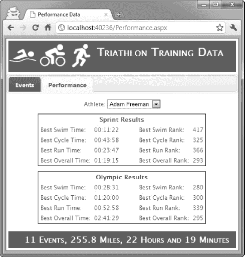
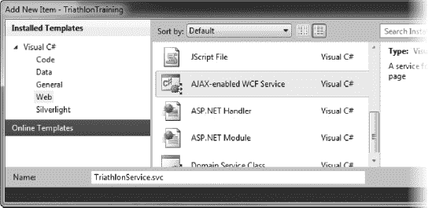
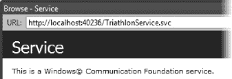
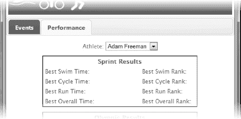
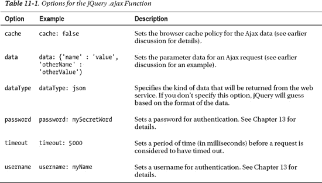
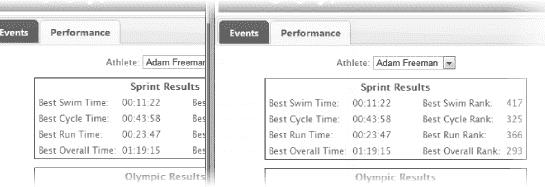
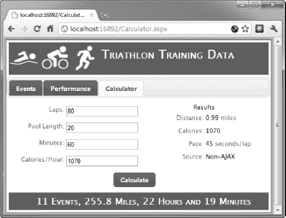
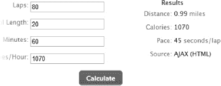
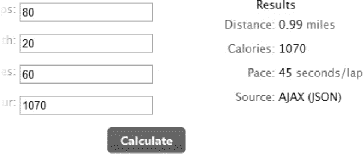
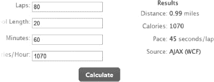

# 十一、使用 Ajax

异步 JavaScript 和 XML (Ajax)是创建专业 web 应用程序的关键工具。本质上，Ajax 允许您向服务器发送数据和从服务器接收数据，而无需重新加载 web 页面。有许多不同的方法可以将 Ajax 集成到 ASP.NET web 应用程序中，在本章中，您将继续使用 jQuery。

jQuery 库使得 Ajax 开发的客户端易于创建和管理。您还将使用一些 jQuery 插件来使更复杂的任务更容易实现。本章有三个主要的例子，通过它们你将看到如何在客户端执行不同种类的 Ajax 操作，以及如何在 ASP.NET 服务器上创建支持这些操作的服务。

### 【Ajax 入门

我们将通过修改`Performance.aspx`页面来开始对 Ajax 的探索，以便使用 Ajax 检索性能数据。为了使 Ajax 交互更加明显，我们将向页面添加一个`select`元素，这将让我们选择样本数据库中不同运动员的数据。在[图 11-1](#fig_11_1) 中可以看到成品。当用户从下拉菜单中选择一个名称时，就会从 ASP.NET 服务器异步加载相应的数据。

***图 11-1。**向 Performance.aspx 页面添加 Ajax*

我们将通过构建我们在第 10 章中使用的项目来探索 Ajax。对于这一章，我稍微整理了一下项目，删除了一些我们引入的 jQuery 脚本，并更改了项目名称和名称空间声明。否则，项目就像我们离开时一样，带有我们之前创建的数据模型、样式和交互改进。我已经在本书附带的代码下载中包含了这个项目；你可以从 Apress.com 下载代码。

#### 添加 Web 服务

使用 Ajax 的最佳起点是服务器端，通过创建一个 *web 服务*。这个词近年来被严重滥用，可以表示很多意思。出于本书的目的，web 服务用 JavaScript 可以轻松解析和处理的数据来响应请求。我们的目标是创造尽可能简单优雅的东西。如果您对 web 服务的体验让您想起了难以理解的 SOAP 信封、UDDI 注册表和 WSDL 文档，那么请放松 Ajax web 服务的世界更加自由放任。

将 web 服务添加到 ASP.NET web 应用程序的最佳方式是使用*Windows communication s Foundation*(WCF)。WCF 是一个. NET 框架库，用于创建广泛的网络服务，它简单快捷地满足了我们几乎所有的需求。WCF 是一个巨大的框架，有一些非常复杂的特征。在这一章中，我们将只使用 WCF 的一个方面。如果你想了解更多关于 WCF 更广泛的能力的信息，那么我推荐由 Apress 出版的 Nishith Pathak 的书*亲 WCF* 。

 **注意**ASP.NET 包括对其自己的各种 web 服务的支持，称为 ASMX 服务，可以通过扩展名为`.asmx`的文件来识别。这种 web 服务现在已经被我们将在本章中使用的 WCF web 服务所取代。

要添加 web 服务，在 Visual Studio 中选择项目添加新项，并选择支持 Ajax 的 WCF 服务模板，如图[图 11-2](#fig_11_2) 所示。

***图 11-2。**添加一个 Ajax WCF 服务*

将服务的名称设置为`TriathlonService.svc`，如图所示，点击【添加】按钮，创建该项。一些新的程序集引用将被添加到项目中，您将看到`TriathlonService.svc`也被添加了。右键单击此项目并从菜单中选择“查看标记”,打开此文件进行编辑。[清单 11-1](#list_11_1) 显示了`TriathlonService.svc`的内容。

***清单 11-1。**铁人三项服务. svc 文件*

`<%@ ServiceHost Language="C#" Debug="true" Service="TriathlonTraining.TriathlonService"
CodeBehind="TriathlonService.svc.cs" %>`

您可以看到，WCF web 服务遵循与网页和母版页相同的格式，具有指令和代码隐藏文件。web 服务的指令是`ServiceHost`，代码隐藏类是`TriathlonTraining.TriathlonService`。[清单 11-2](#list_11_2) 展示了代码隐藏类。

***清单 11-2。**triathlonservice . SVC . cs 代码隐藏类*

`using System.ServiceModel;
using System.ServiceModel.Activation;
using System.ServiceModel.Web;

namespace TriathlonTraining {

    [ServiceContract]
    [AspNetCompatibilityRequirements(RequirementsMode
        = AspNetCompatibilityRequirementsMode.Allowed)]
    public class TriathlonService {

        [OperationContract]
        [WebGet]
        public PerformanceReport GetPerformanceData(string athlete) {
            using (TrainingDataEntities context = new TrainingDataEntities()) {

                System.Threading.Thread.Sleep(2000);

                // get the times
                Event sprintTimes
                    = DataAccess.GetBestTimes(context, athlete, "Sprint");
                Event olympicTimes
                    = DataAccess.GetBestTimes(context, athlete, "Olympic");
                // get the rankings
                RankingSet sprintRanks
                    = DataAccess.GetReferenceRanking(context, sprintTimes);
                RankingSet olympicRanks
                    = DataAccess.GetReferenceRanking(context, olympicTimes);

                // create populate and return the result
                return new PerformanceReport() {

                    sprintSwimTime = sprintTimes.SwimTime.ToString(),
                    sprintCycleTime = sprintTimes.CycleTime.ToString(),
                    sprintRunTime = sprintTimes.RunTime.ToString(),
                    sprintOverallTime = sprintTimes.OverallTime.ToString(),
                    olympicSwimTime = olympicTimes.SwimTime.ToString(),
                    olympicCycleTime = olympicTimes.CycleTime.ToString(),
                    olympicRunTime = olympicTimes.RunTime.ToString(),
                    olympicOverallTime = olympicTimes.OverallTime.ToString(),`

`                    sprintSwimRank = sprintRanks.SwimRank,
                    sprintCycleRank = sprintRanks.CycleRank,
                    sprintRunRank = sprintRanks.RunRank,
                    sprintOverallRank = sprintRanks.OverallRank,
                    olympicSwimRank = olympicRanks.SwimRank,
                    olympicCycleRank = olympicRanks.CycleRank,
                    olympicRunRank = olympicRanks.RunRank,
                    olympicOverallRank = olympicRanks.OverallRank
                };
            }
        }
    }

    public class PerformanceReport {
        // times
        public string sprintSwimTime, olympicSwimTime;
        public string sprintCycleTime, olympicCycleTime;
        public string sprintRunTime, olympicRunTime;
        public string sprintOverallTime, olympicOverallTime;
        // ranks
        public int sprintSwimRank, olympicSwimRank;
        public int sprintCycleRank, olympicCycleRank;
        public int sprintRunRank, olympicRunRank;
        public int sprintOverallRank, olympicOverallRank;
    }
}`

清单 11-2 中的目标是创建一种机制，通过这种机制我们可以响应对运动员表现数据的请求。我将分解清单 11-2 中的代码，这样你就能理解发生了什么。让我们从`class`声明开始:

`[ServiceContract]
[AspNetCompatibilityRequirements(RequirementsMode
    = AspNetCompatibilityRequirementsMode.Allowed)]
public class TriathlonService {`

WCF web 服务是使用标准 C#类定义的，由属性进行注释。属性告诉 WCF 这个类包含一个 web 服务。`AspNetCompatibilityRequirements`属性告诉 WCF 我们想将这个服务作为 ASP.NET 的一部分运行。这两个属性都必须应用于 web 服务代码隐藏类，这样 WCF 才能按照我们想要的方式工作。

 **注意**`AspNetCompatibilityRequirements`属性支持在您的 web 服务代码中使用`HttpContext.Current`属性，这意味着您可以获得关于请求的信息并配置响应，如[第 5 章](05.html#ch5)所示。对于大多数 web 服务，您不需要这个特性，但是如果您需要请求的详细信息，它会很方便。

我们的代码隐藏类包含一个方法，声明如下:

`[OperationContract]
[WebGet]
public PerformanceReport GetPerformanceData(string athlete) {`

该方法名为`GetPerformanceData`，采用一个字符串参数，即要检索数据的运动员的姓名。属性`OperationContract`告诉 WCF 这个方法应该作为 web 服务的一部分包含进来；您希望 Ajax 客户端访问的任何方法都应该用`OperationContract`方法进行注释。

`WebGet`属性告诉 WCF，我们希望 Ajax 客户端能够通过发出 HTTP `GET`请求来访问服务。在本章后面的“使用 Ajax 发布 HTML 表单”一节中，你会看到如何处理其他 HTTP 方法。

`GetPerformanceData`方法的主体通过使用`DataAccess`类和实体框架数据模型(在[第 8 章](08.html#ch8)中讨论)从数据库中检索数据，并使用数据填充和返回`PerformanceReport`类的实例作为方法结果。`PerformanceReport`类如下:

`public class PerformanceReport {
    // times
    public string sprintSwimTime, olympicSwimTime;
    public string sprintCycleTime, olympicCycleTime;
    public string sprintRunTime, olympicRunTime;
    public string sprintOverallTime, olympicOverallTime;
    // ranks
    public int sprintSwimRank, olympicSwimRank;
    public int sprintCycleRank, olympicCycleRank;
    public int sprintRunRank, olympicRunRank;
    public int sprintOverallRank, olympicOverallRank;
}`

在决定 web 服务中的方法应该返回什么数据类型时，需要特别小心。在`PerformanceReport`类中，我为将返回给 Ajax 客户端的每个数据项创建了字段。请注意，我已经打破了字段名的 camel 大小写约定。你会在本章的“添加 Ajax 脚本”一节中看到原因。

在后面的例子中，您将看到其他方法，比如返回对象数组。大多数 C#对象可以被序列化并直接作为结果使用，但是这样做会使 Ajax 客户端中的数据处理变得笨拙而缓慢。花时间创建易于使用的其他数据类型通常是最好的方法。

 **注意**实体框架使用导航属性表示外键关系的方式意味着 WCF 不能序列化实体对象。如果您正在处理具有导航属性的实体对象(大多数都是这样)，那么您将需要创建一个中间数据类型，它可以被序列化并发送给 Ajax 客户端。

在`GetPerformanceData`方法中有一个语句需要特别注意:

`System.Threading.Thread.Sleep(2000);`

对`Thread.Sleep`方法的调用将 web 服务的执行停止两秒钟。我添加了这一点，以便您可以清楚地看到 Ajax 正在被使用。当浏览器和 ASP.NET 服务器在同一台计算机上时，Ajax 操作可能发生得太快，以至于人眼察觉不到。为此，我引入了一种人为的延迟。可以想象，您不应该将这样的语句添加到生产 web 服务中。

就这样，我们定义了我们的 web 服务。我们已经创建了一个非常标准的 C#类，它包含了一个非常标准的 C#方法。唯一不同寻常的方面是 WCF 属性，以及在决定 web 服务方法的结果类型时需要注意的问题。

#### 测试 Web 服务

此时，我喜欢使用浏览器来测试我的 web 服务。如果您的 web 服务支持`GET`方法，这很容易。第一步是在 Solution Explorer 窗口中选择服务文件(在本例中为`PerformanceService.svc`),右键单击并从弹出菜单中选择 View In Browser。

您将看到的是网页告诉您没有可用的元数据，并提供启用它的说明。这个可以忽略。我们选择在浏览器中查看，这样 ASP.NET 服务器将加载我们的 WCF web 服务。我们从元数据网页中需要的唯一信息是 URL。它将类似于图 11-3 中的[所示。](#fig_11_3)

***图 11-3。**从元数据说明页面获取 web 服务 URL*

你可以从[图 11-3](#fig_11_3) 中看到，我的服务的基础 URL 是`[http://localhost:40236/TriathlonService.svc](http://localhost:40236/TriathlonService.svc)`。为了测试`GetPerformance`方法，我们将方法名添加到基本 URL 中，并在查询字符串中提供方法参数，如下所示:

`http://localhost:40236/TriathlonService.svc/GetPerformanceData?athlete=Adam%20Freeman`

这个 URL 引用了`GetPerformanceData`方法，并将`athlete`参数设置为`Adam Freeman`。注意，我已经用`%20`替换了`Adam`和`Freeman`之间的空格，以创建一个合法的查询字符串。

 **注意**标准的 web 服务 URL 具有从服务文件名和方法名派生出来的优点，但是它们又长又丑，而且很难记住。您可以使用第 12 章中[描述的路由功能来更改它们。](12.html#ch12)

您可以在浏览器中键入此 URL 来测试 web 服务。我在前面一章提到过，我喜欢使用谷歌 Chrome 浏览器。原因之一是它将在主浏览器窗口中显示调用我们的 web 服务方法的结果，而 Internet Explorer 和 Firefox 要求将数据下载到一个文件中，然后使用文本编辑器查看。如果您正在测试和调整 web 服务，能够直接看到数据会非常有帮助。

**调试 WEB 服务**

一起调试 Ajax 和 WCF web 服务可能会很棘手。当我遇到问题时，我会使用三种不同的技巧。第一种方法是将以下属性应用于我的 web 服务类:

`[ServiceBehavior(IncludeExceptionDetailInFaults = true)]`

该属性告诉 WCF 在出现问题时在结果中包含异常的详细信息。这对于检测我的 web 服务方法中的代码语句中的问题非常有用，尤其是当您使用浏览器进行测试时。我采用的第二种方法是将以下内容添加到我的`Web.Config`文件中:

`<system.diagnostics>
    <sources>
        <source name="System.ServiceModel" switchValue="Information, ActivityTracing"   
            propagateActivity="true">
        <listeners>
            <add name="sdt" type="System.Diagnostics.XmlWriterTraceListener"  
                initializeData="Trace.debug"  />
        </listeners>
    </source>
  </sources>
</system.diagnostics>`

此配置启用 WCF 请求跟踪。将在您的项目目录中创建一个名为`Trace.debug`的文件，关于每个请求的详细信息将被附加到该文件中。当 WCF 对您试图返回的数据有异议时，或者当解析来自 Ajax 客户端的请求时，这是发现问题的方法。您可以使用`SvcTraceViewer.exe`工具查看跟踪信息，该工具可以在`C:\Program Files\Microsoft SDKs\Windows\v7.0A\Bin`(如果您使用的是 32 位版本的 Windows 7)或`C:\Program Files (x86)\Microsoft SDKs\Windows\v7.0A\Bin`(如果您使用的是 64 位版本的 Windows 7)中找到。如果您使用旧版本的 Windows，该位置会有所不同。在部署之前，请小心禁用该选项，并且记住，每次发出请求时，跟踪文件都会增长。在庞大的调试会话中，很容易生成巨大的文件。

我采用的最后一种调试方法，也是我认为最有用的方法，是嗅探在 Ajax 客户端和服务器之间传递的 HTTP 请求。有很多不同的方法可以做到这一点，但我喜欢使用 Fiddler，这是一个优秀的 Windows 程序，可以从`[www.fiddler2.com](http://www.fiddler2.com)`下载。

无论你选择哪种浏览器，你都会看到或下载类似于[清单 11-3](#list_11_3) 中所示的数据，其格式清晰易读。

***清单 11-3。**从 GetPerformance web 服务方法返回的数据*

`{"d":{"__type":"PerformanceReport:#TriathlonTraining",
    "olympicCycleRank":300, "olympicCycleTime":"01:20:00",
    "olympicOverallRank":295, "olympicOverallTime":"02:41:29",
    "olympicRunRank":339, "olympicRunTime":"00:52:58",
    "olympicSwimRank":280, "olympicSwimTime":"00:28:31",
    "sprintCycleRank":325, "sprintCycleTime":"00:43:58",
    "sprintOverallRank":293, "sprintOverallTime":"01:19:15",
    "sprintRunRank":366, "sprintRunTime":"00:23:47",
    "sprintSwimRank":417, "sprintSwimTime":"00:11:22"
}}`

清单 11-3 中显示的数据是 JavaScript 对象符号(JSON)格式，是 web 服务中 XML 的一种轻量级替代。尽管 JSON 起源于 JavaScript 世界，但它在其他语言中也得到广泛支持。它没有 XML 的正式结构和自描述特性，但是它更紧凑，在大多数情况下更容易使用。

[清单 11-3](#list_11_3) 中的数据是 JSON 的两种形式之一，即名称/值对的集合。您将在本章后面的“使用数据模板”一节中看到另一种类型——对象数组。`TriathlonService` WCF 服务将我们的结果序列化为 JSON 数据，使用`PerformanceReport`类中的字段名称作为名称/值对中的名称。

整个性能数据块封装在一个名为`d`的元素中。这是 WCF 应用的一种安全措施，用于防止 web 服务生成可被解释为 JavaScript 的内容。WCF 还包括被序列化以产生数据的 C#类型的细节，在本例中，是来自`TriathlonTraining`名称空间的`PerformanceReport`类。

#### 准备 ASP.NET 网页

我们流程的下一步是更新`Performance.aspx`网页和代码隐藏类。在网页中，我们将添加允许用户选择运动员的`select`元素，如[清单 11-4](#list_11_4) 所示。

***清单 11-4。**修改 Performance.aspx 页面*

`<%@ Page Title="Performance Data" Language="C#" MasterPageFile="~/Site.Master"
AutoEventWireup="true" CodeBehind="Performance.aspx.cs" Inherits="TriathlonTraining.Performance" %>

<asp:Content ID="Content1" ContentPlaceHolderID="HeadContent" runat="server">
    <link href="Styles/Page.css" rel="stylesheet" type="text/css" />
</asp:Content>

<asp:Content ID="Content2" ContentPlaceHolderID="MainContent" runat="server">`

`    <**div style="width:100%; text-align:center; padding-bottom:10px">**
        **<label for="athleteSelector">Athlete:</label>**
        **<select id="athleteSelector" runat="server">**
        **</select>**
    **
**

    

        <table class="centerTable">
            <colgroup>
                <col/>
                <col width="100px"/>
            </colgroup>
            <tr><th colspan="4">Sprint Results</th></tr>
            <tr>
                <td>Best Swim Time:</td><td id="sprintSwimTime" class="dataElement"/>
                <td>Best Swim Rank:</td><td id="sprintSwimRank" class="dataElement"/>
             </tr>
             <tr>
                <td>Best Cycle Time:</td><td id="sprintCycleTime" class="dataElement"/>
                <td>Best Cycle Rank:</td><td id="sprintCycleRank" class="dataElement"/>
             </tr>
             <tr>`
`                <td>Best Run Time:</td><td id="sprintRunTime" class="dataElement"/>
                <td>Best Run Rank:</td><td id="sprintRunRank" class="dataElement"/>
            </tr>
             <tr>
                <td>Best Overall Time:</td><td id="sprintOverallTime" class="dataElement"/>
                <td>Best Overall Rank:</td><td id="sprintOverallRank" class="dataElement"/>
            </tr>
        </table>
    

    

    
    
        <table class="centerTable">
            <colgroup>
                <col />
                <col width="100px" />
            </colgroup>
            <tr><th colspan="4">Olympic Results</th></tr>
            <tr>
                <td>Best Swim Time:</td><td id="olympicSwimTime" class="dataElement"/>
                <td>Best Swim Rank:</td><td id="olympicSwimRank" class="dataElement"/>
             </tr>
             <tr>
                <td>Best Cycle Time:</td><td id="olympicCycleTime" class="dataElement"/>
                <td>Best Cycle Rank:</td><td id="olympicCycleRank" class="dataElement"/>
             </tr>
             <tr>
                <td>Best Run Time:</td><td id="olympicRunTime" class="dataElement"/>
                <td>Best Run Rank:</td><td id="olympicRunRank" class="dataElement"/>
            </tr>
             <tr>
                <td>Best Overall Time:</td><td id="olympicOverallTime" class="dataElement"/>
                <td>Best Overall Rank:</td><td id="olympicOverallRank" class="dataElement"/>
            </tr>
        </table>
    

    

</asp:Content>`

对`select`元素的添加以粗体显示。如果您将[清单 11-4](#list_11_4) 中的 HTML 与原始 web 页面进行比较(如[第 10 章](10.html#list_10_10)的[清单 10-10](10.html#list_10_10) 所示)，您会发现我还从保存性能数据的`td`元素中移除了`runat`属性，并添加了`dataElement`类。移除`runat`属性使得使用 jQuery 选择元素变得更加容易，因为我们不必通过使用代码块和`ClientID`控件属性来处理 ID 重写。添加`dataElement`类允许我们使用单个 jQuery 语句选择所有保存数据的`td`元素，这在我们在本章下一节编写 Ajax 脚本时会很有用。对网页的更改需要对代码隐藏类进行相应的更改，如清单 11-5 所示。

***清单 11-5。**修改 Performance.aspx.cs 代码隐藏文件*

`using System;

namespace TriathlonTraining {

    public partial class Performance : System.Web.UI.Page {

        protected void Page_Load(object sender, EventArgs e) {

            using (TrainingDataEntities context = new TrainingDataEntities()) {
                athleteSelector.Items.Clear();
                foreach (string name in DataAccess.GetAthleteNames(context)) {
                    athleteSelector.Items.Add(name);
                }
            }
        }
    }
}`

代码隐藏类得到了极大的简化，因为性能数据将通过 Ajax 获得。代码隐藏类的唯一职责是为`select`元素创建包含运动员姓名的`option`项(我们也可以通过 Ajax 来完成这项工作，但我希望这个示例尽可能简单)。

#### 添加 Ajax 脚本

如果你在浏览器中查看`Performance.aspx`网页，你会看到类似于[图 11-4](#fig_11_4) 的东西。页面的结构和`select`元素是存在的，但是没有性能数据。

***图 11-4。**没有数据的 Performance.aspx 网页*

现在，我们可以添加 jQuery Ajax 脚本了。因为我们正在使用 jQuery，所以我们可以重用我们在前面章节中学到的使用选择器和事件的技术。清单 11-6 展示了`Performance.aspx`页面的 jQuery 脚本。

***清单 11-6。**一个 jQuery Ajax 脚本*

`  `

该脚本首先定义一个函数，该函数将从`select`元素中获取选定的值:

`var GetSelectedAthlete = function () {
    return $('#<%=athleteSelector.ClientID %> option:selected').text();
}`

`select`元素是页面中唯一具有`runat`属性的元素，因此我们必须使用代码块根据其`ID`属性正确选择它。脚本的下一部分在`select`元素中注册变更事件，并获取初始数据:

`$(document).ready(function () {

    $('#<%=athleteSelector.ClientID %>').change(function () {
        GetData();
    });

    GetData();
});`

`GetData`函数是我们的 Ajax 函数。我们调用它来获得要显示的初始数据，然后当用户从列表中选择一个新名字时，响应`select`元素上的`change`事件。

该脚本的核心是`GetData`函数，如下所示:

`var GetData = function () {

    $.ajax({
        url: '/TriathlonService.svc/GetPerformanceData',
        data: { 'athlete': GetSelectedAthlete()},
        cache: false,
        beforeSend: function () {
            $('td.dataElement').text("---");
        },`

`        success: function (data) {
            for (var key in data.d) {
                $('#' + key).text(data.d[key]);
            }
        }
    });
};`

GetData 是 jQuery `.ajax`函数的包装器，它执行 Ajax 操作。通过将 Ajax 请求放在函数中，我们可以从代码中的多个点调用它，而不必复制选项。

我们传递给`.ajax`函数的选项是设置和回调的混合。`url`选项设置请求将被发送到的 URL。

`data`选项设置将作为查询字符串添加到 URL 的参数名称和值。这些信息将被安全地编码，因此我们不必担心，例如，用`%20`替换空格，就像我们在使用浏览器测试 web 服务时所做的那样。在这种情况下，我们将`athlete`参数设置为从`GetSelectedAthlete`函数返回的值。

将`cache`选项设置为`false`可以防止 web 浏览器缓存 Ajax 请求返回的数据。一些浏览器，特别是 Internet Explorer，将重用以前返回的数据，而其他浏览器，包括 Chrome 和 Firefox，每次都会从服务器请求新的数据。使用 Ajax 开发时，防止缓存是最有用的。如果不这样做，web 服务生成的数据变化将不会显示在浏览器中，从而导致无尽的混乱(至少对我来说是这样)。我也倾向于在生产服务中禁用缓存，宁愿使用额外的服务器工作负载来避免管理陈旧数据，但是对于 Ajax 数据大部分是静态的项目，缓存可能是个好主意。表 11-1 显示了 jQuery `.ajax`函数支持的最重要的选项。

我们的脚本还包含两个回调函数。下面是第一个:

`beforeSend: function () {
    $('td.dataElement').text("---");
},`

在 jQuery 向 web 服务发出 Ajax 请求之前，调用指定的函数来响应`beforeSend`事件。我们可以利用这个机会选择`dataElement`类中的所有`td`元素，并将它们的内容更改为`---`，这样很明显一个 Ajax 请求即将开始。在实际项目中，您可能选择不这样做，但是我想强调 Ajax 过程，就像向 web 服务类添加`Thread.Sleep`调用一样。第二次回调如下:

`success: function (data) {
    for (var key in data.d) {
        $('#' + key).text(data.d[key]);
    }
}`

这个函数在响应`success`事件时被调用，表示已经成功地从 web 服务获得了数据。我称之为`data`的参数是 JSON 对象。对于我们的例子，这是在[清单 11-3](#list_11_3) 中显示的数据。

我们使用一个`for`循环来枚举来自名称/值对的名称集；请注意，我们在`data.d`上这样做是为了适应 WCF web 服务将所有数据作为名称/值对交付，其中名称是`d`。

当枚举每个名称时，我们选择具有匹配的`ID`属性的 HTML 元素，并使用`text`函数将其内容设置为与名称相关联的 JSON 数据。当我提到在设计 web 服务方法的结果类型时要考虑处理的简便性时，这就是我的意思。我们设置了`PerformanceReport`类的字段，以便它们匹配相应的 HTML 元素，允许我们在一个简单的`for`循环中处理数据。

**手动设置数据值**

像这样衔接 HTML 和 JSON 数据并不总是可能的。有时您将不得不使用遗留页面或遗留 web 服务。如果示例中是这种情况，我可以选择单个 HTML 元素并检索适当的 JSON 数据值，如下所示:

`…
$('#sprintSwimTime').text(data.d.sprintSwimTime);
$('#sprintCycleTime').text(data.d.sprintCycleTime);
…`

必须对每个数据元素重复这一过程，这可能会导致冗长的 jQuery 脚本。另一种方法是使用数据模板，我们将在本章后面看到。

表 11-2 详细描述了 jQuery 回调选项。

T2】

总会首先调用`beforeSend`回调，然后是`success`或`error`，最后是`complete`。

 **注意**所有的`.ajax`回调都有一个`XMLHttpRequest`参数。这是向 web 服务器发出 HTTP 请求的标准 JavaScript 对象。使用 jQuery Ajax 时，很少需要直接处理这个对象。

#### 测试 Ajax 功能

现在，我们已经准备好了第一次使用 Ajax 的所有部分:生成用 JSON 表示的性能数据的 WCF web 服务，有占位符显示数据的 ASP.NET web 页面，以及通过请求数据并将其放入页面来连接两者的 jQuery 脚本。如果您在 web 浏览器中查看`Performance.aspx`，您将看到 Ajax 功能的效果，我们通过在 web 服务类中添加对`Thread.Sleep`的调用以及通过`beforeSend`回调来清除数据，对其进行了夸大。当页面首次加载时，当您从下拉列表中选择一个新名称时，您会看到数据被清除，几秒钟后会被刷新，如图[图 11-5](#fig_11_5) 所示。

***图 11-5。**通过 Ajax 加载数据*

### 使用数据模板

通常从 web 服务返回的数据是一系列相似的项目。在处理表格时尤其如此。在这一节中，我们将创建一个 web 服务，它为`ListEvents.aspx`页面中的表生成内容，使用 Ajax 获取数据，然后使用微软创建的 jQuery 扩展将数据集成到页面中。

#### 创建网络服务

我们可以扩展现有的 web 服务来支持`ListEvents.aspx`页面，方法是向服务代码隐藏类添加另一个方法，并用我们在前面的示例中使用的相同属性来修饰它。清单 11-7 显示了这些增加；为了简洁起见，我已经从现有的方法和结果类型中删除了主体。

***清单 11-7。**向 web 服务添加方法*

`using System.Collections.Generic;
using System.ServiceModel;
using System.ServiceModel.Activation;
using System.ServiceModel.Web;

namespace TriathlonTraining {

    [ServiceContract]
    [AspNetCompatibilityRequirements(RequirementsMode
        = AspNetCompatibilityRequirementsMode.Allowed)]
    public class TriathlonService {

        **[OperationContract]**
        **[WebGet]**
        **public IEnumerable<EventItem> GetEventData(string type) {**`

`            **List<EventItem> results = new List<EventItem>();**

            **using (TrainingDataEntities context = new TrainingDataEntities()) {**

                **IEnumerable<Event> events = (type == null || type == "All")**
                    **? DataAccess.GetAllEvents(context)**
                        **: DataAccess.GetEventsByType(context, type);**

                **foreach (Event e in events) {**
                    **results.Add(new EventItem() {**
                        **Key = e.ID,**
                        **Date = e.Date.ToString("MM/dd"),**
                        **Athlete = e.Athlete,**
                        **EventType = e.Type,**
                        **SwimTime = e.SwimTime.ToString(),**
                        **CycleTime = e.CycleTime.ToString(),**
                        **RunTime = e.RunTime.ToString(),**
                        **OverallTime = e.OverallTime.ToString(),**
                        **Rank = DataAccess.GetPersonalRanking(context, e).OverallRank,**
                        **ReferenceRank = DataAccess**
                            **.GetReferenceRanking(context, e).OverallRank**
                    **});**
                **}**
            **}**
            **return results;**
        **}**

        [OperationContract]
        [WebGet]
        public PerformanceReport GetPerformanceData(string athlete) {
            // statements removed for brevity
        }
    }

    **public class EventItem {**
        **public int Key;**
        **public string Date;**
        **public string Athlete;**
        **public string EventType;**
        **public string SwimTime, CycleTime, RunTime, OverallTime;**
        **public int Rank, ReferenceRank;**
    **}**

    public class PerformanceReport {
        // fields removed for brevity
    }
}`

`GetEventData`方法接受一个`string`参数，指定所需的事件数据类型。我已经将`WebGet`和`OperationContract`属性应用于`GetEventData`方法，这样 WCF 将把该方法作为 web 服务的一部分发布，并允许使用 HTTP `GET`方法进行访问。

事件数据是从`DataAccess`类中获得的，方法的结果是一个`IEnumerable<EventItem>`，其中`EventItem`是为包含结果而创建的一个类。我再次添加了一个专门用于向 Ajax 客户端表示数据的类型，以避免序列化具有导航属性的实体对象的问题。

#### 测试 Web 服务

我们可以通过更改 URL 中的方法名并添加适当的参数来测试我们添加到 web 服务中的新方法，如下所示:

`http://localhost:40236/TriathlonService.svc/GetEventData?type=All`

从 web 服务方法返回一个强类型的`IEnumerable`会导致 WCF 将数据以 JSON 数组的形式返回给 Ajax 客户端，其中一部分如清单 11-8 中的[所示，为便于阅读进行了格式化。](#list_11_8)

***清单 11-8。**一个 JSON 阵*

`{"d":
    [{"__type":"EventItem:#TriathlonTraining",
        "Athlete":"Adam Freeman",
        "CycleTime":"00:45:12",
        "Date":"09\/27",
        "EventType":"Sprint",
        "Key":1,
        "OverallTime":"01:22:40",
        "Rank":2,
        "ReferenceRank":353,
        "RunTime":"00:25:28",
        "SwimTime":"00:12:00"},
    {"__type":"EventItem:#TriathlonTraining",
        "Athlete":"Adam Freeman",
        "CycleTime":"00:47:32",
        "Date":"10\/04",
        "EventType":"Sprint",
        "Key":2,
        "OverallTime":"01:22:55",
        "Rank":3,
        "ReferenceRank":358,
        "RunTime":"00:24:01",
        "SwimTime":"00:11:22"},
   …
]}`

您可以看到结果数据是一组名称/值对的数组，所有这些都封装在 WCF 添加的`d`元素中。

#### 准备 ASP.NET 网页

我们对`ListEvents.aspx`所做的关键更改是从 HTML 表格元素中移除了`runat`属性。移除`runat`属性意味着我们不必在 jQuery 脚本中使用代码块来引用`ID`属性值。我们还将现有的脚本移动到一个名为`Scripts/ ListEventsScripts.js`的外部文件中，这些脚本从超链接创建按钮，并在鼠标经过一行时高亮显示该行(我们稍后将回到这个文件)。清单 11-9 显示了修改后的`ListEvents.aspx`文件。

***清单 11-9。**修改后的 ListEvents.aspx 页面*

`<%@ Page Title="Triathlon Events" Language="C#" MasterPageFile="~/Site.Master" AutoEventWireup="true"
    CodeBehind="ListEvents.aspx.cs" Inherits="TriathlonTraining.ListEvents" %>

<asp:Content ID="HeaderContent" runat="server" ContentPlaceHolderID="HeadContent">
    <link href="/Styles/Page.css" rel="stylesheet" type="text/css" />
    
</asp:Content>

<asp:Content ID="BodyContent" runat="server" ContentPlaceHolderID="MainContent">  
  <table id="resultsTable" rules="cols">
            <tr>
                <th>Date</th>
                <th>Athlete</th>
                <th>Event Type</th>
                <th>Swim</th>
                <th>Cycle</th>
                <th>Run</th>
                <th>Overall</th>
                <th>Rank</th>
                <th>Ref Rank</th>
                <th>Edit</th>
                <th>Delete</th>
            </tr>
        </table>

        

            <label for="eventSelector">Event Type:</label>
            <select id="eventSelector" runat="server">
                <option>All</option>
            </select>
        

        

            <input type="submit" value="Submit" />
        
`

`        

            <a href="AddEvent.aspx">Add New Event</a>
        

</asp:Content>`

#### 添加 Ajax 脚本

为了使 JSON 数据更容易处理，我们将使用微软开发的 jQuery 插件，名为 *jQuery Templates* 。在撰写本文时，模板插件已经作为测试版发布，所以您可能会发现一些细节已经发生了变化，但是总体原则仍然有效。

首先，从`[https://github.com/jquery/jquery-tmpl](https://github.com/jquery/jquery-tmpl)`下载最新版本的 jQuery 模板插件，并将`jQuery.tmpl.min.js`文件复制到项目中的`Scripts`目录。通过在 Solution Explorer 窗口中右键单击`Scripts`文件夹，选择 Add Existing Item，选择`jQuery.tmpl.min.js`文件，然后单击 Add 按钮，将文件添加到项目中。将新添加的文件从解决方案资源管理器窗口拖动到`ListEvents.aspx`文件中的其他脚本元素，或者手动添加以下条目:

``

创建模板是一项简单的任务。在您的 web 页面中创建一个`script`元素，并为其分配一个 ID，以便您可以在以后使用 jQuery 引用它。将脚本类型设置为`text/x-query-tmpl`。这是模板引擎寻找的类型，它防止浏览器试图执行脚本，就好像它包含 JavaScript 语句一样。

在`script`元素中，我们定义了要为 JSON 数据结果中的每一项创建的 HTML。在本例中，我们想要创建一个包含多个`td`元素的`tr`项目。为了插入数据值，我们将对象属性的名称放在大括号(`{}`)和一个`$`前缀中。比如要包含`Athlete`属性的值，我们称之为`${Athlete}`，当模板插件遇到这个引用时，就会从 JSON 对象中插入相应的值。这将对 JSON 数据数组中的每个对象重复进行。

最后一步是创建一个 jQuery 脚本，该脚本使用 Ajax 从 web 服务中检索数据并应用模板。清单 11-11 包含了这个脚本。

***清单 11-11。**使用 jQuery 应用模板*

``

您会注意到这个脚本与前面的例子非常相似。我们已经更改了`url`属性来调用`GetEventData`方法，并更改了 data 属性来设置该方法的参数。此外，我们已经移除了`beforeSend`事件的处理程序，并更改了`success`事件的处理程序。success 函数中的第一行删除所有包含`td`元素的`tr`元素:

`$('tr:has(td)').remove();`

我们删除元素是因为当模板应用于数据时，新的行将被添加到表中。脚本中的关键行是这一行，它将模板应用于数据:

`$('#eventTemplate').tmpl(data.d).appendTo('#resultsTable');`

这个语句使用一个 jQuery 选择器来选择模板脚本并调用`tmpl`函数。这是模板插件的核心功能，并将模板应用于数据。`tmpl`函数的结果是脚本生成的 HTML，我们使用`appendTo`函数将它添加到表中。

`success`事件处理程序中的最后一行调用函数`prettyTable`。这是我在外部`ListEventsScripts.js`文件中定义的函数名，如清单 11-12 中的[所示。](#list_11_12)

***清单 11-12。**listeventsscripts . js 文件*

`(function ($) {
    prettyTable = function () {
        $('table a').button().css('color', '#ffffff');
        $('td a').css('font-size', 'smaller');

        $('tr:has(td)').hover(
            function () {
                $(this).find('td')
                    .css({ 'background-color': '#007F7F',
                        'color': '#ffffff'
                    });
            },
            function () {
                $(this).find('td')
                    .css({ 'background-color': '',
                        'color': ''
                    });
            }
        ).click(function () {
            document.location =  $(this).find('a:contains("Edit")').attr('href');
        });
    }
})(jQuery);`

当数据被代码隐藏类包含在 HTML 中时，我们可以通过绑定到`document.ready`事件将我们的样式和事件处理程序应用于表格行。现在，每次用户选择事件类型时，保存数据的 HTML 元素都会重新创建，我们必须将样式和事件语句放在一个函数中，然后在每次从 Ajax 调用中处理新数据时调用这个函数。[清单 11-12](#list_11_12) 中的函数被称为`prettyTable`，它是从`.ajax`函数的`success`事件处理程序中调用的。

#### 测试 Ajax 功能

本例剩下的工作就是在浏览器中查看`ListEvents.aspx`页面。我们没有添加任何故意的延迟或视觉提示来表明数据是通过 Ajax 加载的，所以如果您使用一台特定的快速计算机进行开发，您可能看不出与以前的方法有什么显著的不同。尽管如此，当页面第一次加载时，以及当您随后从下拉列表中选择一个值时，jQuery 脚本会向 web 服务查询数据，然后使用 jQuery 模板插件来创建表中的行。

 **注意**jQuery 模板插件具有广泛的特性，这个例子只是触及了可以创建的模板种类的皮毛。如果您正在处理数据数组，特别是如果这些数组是针对表的，那么我建议您探索一下这个有用的扩展的特性。您可以手动从 JSON 数据数组呈现 HTML，但是使用模板是一个更简单、更优雅的解决方案。

### 使用 Ajax 发布 HTML 表单

前面的例子使用了 HTTP `GET`方法，但是我们也可以用 Ajax 轻松地发送数据。这是提交表单数据时最常见的做法。用 Ajax 发布数据的主要好处是页面不需要重新加载，为用户提供了更流畅的体验。在这一节中，我们将首先构建一个常规的基于 ASP.NET 表单的 web 页面，然后以不同的方式扩展它以使用 Ajax。这个例子还将展示 Ajax 并不完全是关于 web 服务的(尽管，公平地说，它经常是这样，所以我将通过展示如何发布到 web 服务来结束这一节)。

#### 创建网页

我们将首先创建一个简单的基于表单的 ASP.NET 网页，名为`Calculator.aspx`。这个页面使用一个表单来重新创建我们在[第 6 章](06.html#ch6)中第一次使用的简单计算器，在那里我们将花费在游泳上的时间和游泳池的长度转换成对我的铁人三项训练日记有用的值。[清单 11-13](#list_11_13) 显示了`Calculator.aspx`的内容。

***清单 11-13。** The Calculator.aspx page*

`<%@ Page Title="" Language="C#" MasterPageFile="~/Site.Master" AutoEventWireup="true" CodeBehind="Calculator.aspx.cs" Inherits="TriathlonTraining.Calculator" %>

<asp:Content ID="Content1" ContentPlaceHolderID="HeadContent" runat="server">
    <link href="Styles/Page.css" rel="stylesheet" type="text/css" />
    

    

</asp:Content>

<asp:Content ID="Content2" ContentPlaceHolderID="MainContent" runat="server">

    

        

            

                
Laps:

                <input class="textinput" id="lapsInput"
                    type="text" runat="server" value="80"/>
            
`

`            

                
Pool Length:

                <input class="textinput" id="lengthInput"
                    type="text" runat="server" value="20"/>
            

            

                
Minutes:

                <input class="textinput" id="minsInput"
                    type="text" runat="server" value="60"/>
            

            

                
Calories/Hour:

                <input class="textinput" id="calsInput"
                    type="text" runat="server" value="1070" />
            
    
        

        

            
Results

            

                
Distance:

                ?? miles
            
     
            

                
Calories:

                ??
            
     
            

                
Pace:

                ?? seconds/lap
            
  
             

                
Source:

                ??
            
    
        

        

            <input type="submit" value="Calculate" />           
        
  
    

</asp:Content>`

该页面有三个主要区域。第一个是一系列输入元素，用户通过它们输入计算值。第二个区域显示计算结果。该区域最初是隐藏的，然后在计算完成后显示。最后一个区域包含表单的提交按钮，我已经用 jQuery UI 美化了它(关于如何工作的细节，请参见第 10 章)。[图 11-6](#fig_11_6) 显示了显示计算结果的完整页面。

***图 11-6。**calculator . aspx 页面*

请注意，结果区域包含如何获得数据的详细信息。代码隐藏类添加了`Non-AJAX`值，以表明数据是通过常规页面请求获得的。清单 11-14 展示了代码隐藏类。

***清单 11-14。**calculator . aspx . cs 代码隐藏文件*

`using System;
using System.Collections.Generic;

namespace TriathlonTraining {
    public partial class Calculator : System.Web.UI.Page {

        private const float metersToMiles = 0.00062137119223733f;
        private const float minsPerHour = 60f;

        protected void Page_Load(object sender, EventArgs e) {

            if (IsPostBack) {

                // set the visibilty of the results div
                resultsDiv.Style.Add("display", "block");`
`        
                // parse the input values
                int laps = int.Parse(lapsInput.Value);
                int length = int.Parse(lengthInput.Value);
                int minutes = int.Parse(minsInput.Value);
                int calories = int.Parse(calsInput.Value);

                // perform the calculation and set the result values
                string distanceResultString
                    = ((laps * length) * metersToMiles).ToString("F2");
                string caloriesResultString
                    = ((minutes/ minsPerHour) * calories).ToString("F0");
                string paceResultString
                    = ((minutes * minsPerHour) / laps).ToString("F0");

                distanceResult.InnerText = distanceResultString;
                caloriesResult.InnerText = caloriesResultString;
                paceResult.InnerText = paceResultString;
                sourceResult.InnerText = "Non-AJAX";
            }
        }
    }
}`

代码隐藏类显示隐藏的结果区域，解析输入值，执行计算，并将结果值放入适当的 HTML 控件中。

 **注意**为了让这个例子专注于 Ajax，我省略了任何形式的表单验证或错误处理。对于一个真实的项目，如果有问题，验证输入和对用户的响应是非常重要的。你可以在第 7 章的[中找到错误处理的细节，在第 6 章](07.html#ch7)的[中找到服务器端验证，在第 10 章](06.html#ch6)的[中找到客户端验证。](10.html#ch10)

我们要做的最后一件事是添加到`Site.Master`母版页，这样`Calculator.aspx`页面就包含在我们在[第 10 章](10.html#ch10)中添加的 jQuery UI 标签中。[清单 11-15](#list_11_15) 显示了需要添加的内容。

***清单 11-15。**向 Site.master 选项卡集合添加页面*

`var pages = [
    ['Events', "/ListEvents.aspx", "/AddEvent.aspx", "UpdateOrDeleteEvent.aspx"],
    ['Performance', "/Performance.aspx"],
    **['Calculator', "/Calculator.aspx"]**
];`

对`Calculator.aspx`页面的添加以粗体显示。请参见第 10 章中的[了解母版页标签脚本的提示。如果您加载`Calculator.aspx`页面并提交表单，您将看到结果，数据源列为`Non-AJAX`。这是我们开始的基础。](10.html#ch10)

#### 添加 Ajax 过账

使用 jQuery 发布表单的最简单的方法是使用插件，正如您现在所期望的那样。jQuery 表单插件完成了我们需要的所有工作，可以在`http://jquery. malsup.com/form`下载。对于这个例子，我们需要`jquery.form.js`文件，您可以从网站下载或者在本书附带的代码下载中找到它。将该文件放在项目的`Scripts`文件夹中，并将其作为现有项添加到 Visual Studio 解决方案资源管理器窗口中，就像我们对其他 jQuery 扩展所做的那样。将 JavaScript 文件拖到`Calculator.aspx`页面或者手动添加下面的`script`元素来添加表单插件:

``

要启用 Ajax 发布，我们所要做的就是选择我们的`form`元素并调用`ajaxForm`函数。您可以传递给`.jaxForm`函数的一个选项是，如果`POST`成功，这个函数将被调用，就像我们使用内置的 jQuery Ajax 支持`GET`请求一样。

请记住，我们将表单数据回发到`Calculator.aspx`页面，这意味着操作的结果将是 HTML。对 ASP.NET 来说，`POST`请求看起来没什么不同，所以我们收到一个呈现的`Calculator.aspx`网页，结果嵌入在 HTML 内容中。这作为参数传递给我们的`success`函数。该函数中的前三条语句选择服务器发送的 HTML 中结果元素的内容，并使用它们在现有页面中填充相同的项目。下面是这些语句中的第一条，为了使其目的更加清晰，对其进行了格式化:

`$('#<%=distanceResult.ClientID%>').text(`
`    $(data).find('#<%=distanceResult.ClientID%>').text()
);`

外部选择器在当前页面中查找元素，而内部选择器在`data`参数中查找相同的元素。对三个结果元素中的每一个重复这个过程。其余语句使结果面板可见，并将源指示器设置为`AJAX (HTML)`。一旦将这个脚本添加到`Calculator.aspx`页面，单击 Calculate 按钮就会使用 Ajax post 执行计算，从而避免了重新加载页面的需要。您可以在图 11-7 的[中看到更改后的源值。](#fig_11_7)

***图 11-7。**用 Ajax 获取 HTML 结果*

注意，我们不需要为表单提交按钮的`click`事件提供处理程序；这是在我们调用`ajaxForm`函数时自动完成的。

#### 切换到 JSON

前一个例子的好处是它是一个客户端专用的解决方案。问题是我们为了提取三个数值而传输整个网页，这是非常低效的。然而，我们可以修改我们的`Calculator.aspx`页面的代码隐藏类来返回一个只包含我们需要的数据的 JSON 结果。[清单 11-17](#list_11_17) 显示了对`Calculator.aspx.cs`的必要修改。

***清单 11-17。**给 ASP.NET 网页添加 JSON 支持*

`using System;
using System.Collections.Generic;

**using System.Runtime.Serialization.Json;**

namespace TriathlonTraining {
    public partial class Calculator : System.Web.UI.Page {`

`        private const float metersToMiles = 0.00062137119223733f;
        private const float minsPerHour = 60f;

        protected void Page_Load(object sender, EventArgs e) {

            if (IsPostBack) {

                // set the visibilty of the results div
                resultsDiv.Style.Add("display", "block");

                // parse the input values
                int laps = int.Parse(lapsInput.Value);
                int length = int.Parse(lengthInput.Value);
                int minutes = int.Parse(minsInput.Value);
                int calories = int.Parse(calsInput.Value);

                // perform the calculation and set the result values
                string distanceResultString
                    = ((laps * length) * metersToMiles).ToString("F2");
                string caloriesResultString
                    = ((minutes/ minsPerHour) * calories).ToString("F0");
                string paceResultString
                    = ((minutes * minsPerHour) / laps).ToString("F0");

                **if (Request.Form["resultFormat"] == "JSON") {**

                    **JSONCalculationResult calcResult = new JSONCalculationResult() {**
                        **distance = distanceResultString,**
                        **calories = caloriesResultString,**
                        **pace = paceResultString**
                    **};**

                    **DataContractJsonSerializer serializer**
                        **= new DataContractJsonSerializer(calcResult.GetType());**
                    **serializer.WriteObject(Response.OutputStream, calcResult);**

                    **Response.ContentType = "application/JSON";**
                    **Response.End();**
                } else {
                    distanceResult.InnerText = distanceResultString;
                    caloriesResult.InnerText = caloriesResultString;
                    paceResult.InnerText = paceResultString;
                    sourceResult.InnerText = "Non-AJAX";
                }
            }
        }
    }`

`    **[Serializable]**
    **public class JSONCalculationResult {**
        **public string distance;**
        **public string calories;**
        **public string pace;**
    **}**
}`

对代码隐藏类的更改以粗体显示。该类现在检查在`POST`请求中是否有一个名为`resultFormat`的表单元素，其值为`JSON`。如果有，就会创建一个`JSONCalculationResult`类的实例，并用三个结果值填充它。然后，这个对象被传递给`DataContractJsonSerializer`类的一个实例，该实例将`JSONCalculationResult`对象转换成 JSON 格式，并将其写入输出流，该输出流将数据返回给 Ajax 客户端。`Response` context 对象用于设置对客户端响应的内容类型头，而`End`方法用于终止页面呈现过程。这可以防止 HTML 元素和控件的内容包含在发送回客户端的数据中。

为了利用这个新的 JSON 页面功能，我们需要 Ajax 客户端脚本的配合。我们需要将`resultFormat`字段添加到表单数据中。清单 11-18 显示了需要的改变。

***清单 11-18。**与支持 JSON 的代码隐藏类合作*

``

清单 11-18 中的变化用粗体显示。`ajaxForm`函数的`data`选项允许我们提供额外的数据以包含在表单数据中，我已经用它创建了在代码隐藏类中触发 JSON 结果的`resultFormat`值。

我们必须告诉表单插件,`POST`的结果将是 JSON 数据，这是我们使用`dataType`选项完成的:

`dataType: 'json',`

从 HTML 结果中提取值的三个语句已经更新，以处理 JSON 数据，如下所示:

`$('#<%=distanceResult.ClientID%>').text(data['distance']);`

注意，我们不必处理在使用 WCF 服务时添加的`d`包装器。我们可以直接从 JSON 对象中获取每个属性。最后一个变化是源指示器的值，它被设置为`Ajax (JSON)`。当您将这些更改应用到项目中时，提交表单会以 JSON 的形式检索数据。不支持 JavaScript 的客户机仍然可以使用常规的表单机制，尽管在这个过程中会重新加载页面。在[图 11-8](#fig_11_8) 中可以看到变更后的源信息。

***图 11-8。**从 ASP.NET 网页获取 JSON 数据*

### 使用 Ajax 发布到 Web 服务

虽然您可以将数据`POST`到一个网页，但是少量的额外工作将让我们发布到一个 WCF web 服务方法。在本节中，我们将向我们的 web 服务添加一个方法，该方法将执行计算并修改我们的 jQuery 脚本。[清单 11-19](#list_11_19) 展示了对`TriathlonService.svc`代码隐藏类的添加。

***清单 11-19。**向 web 服务添加计算方法*

`[OperationContract]
[WebInvoke]
public JSONCalculationResult PerformCalculation(int laps, int length, int mins, int cals) {

    const float metersToMiles = 0.00062137119223733f;
    const float minsPerHour = 60f;`

`    return new JSONCalculationResult() {
        distance = ((laps * length) * metersToMiles).ToString("F2"),
        calories = ((mins / minsPerHour) * cals).ToString("F0"),
        pace = ((mins* minsPerHour) / laps).ToString("F0")
    };
}`

这个名为`PerformCalculation`的方法使用了我们在前一个例子中创建的`JSONCalculationResult`类。这个方法最重要的特性是使用了`WebInvoke`属性，它支持`POST`操作。这是`WebGet`属性的对应属性，它支持`GET`操作。在所有其他方面，这个方法就像我们的 web 服务中的其他方法一样。[清单 11-20](#list_11_20) 显示了我们的 jQuery 脚本使用新添加的`PerformCalculation`方法所需的更改。

***清单 11-20。**使用 jQuery 发布到 web 服务*

``

我们不打算使用表单插件来处理我们的`POST`操作。WCF web 服务不容易接收表单编码的数据，jQuery 表单插件不容易生成 JSON 数据；所以，最简单的方法是直接使用内置的 jQuery Ajax 特性。这并不像听起来那么糟糕。我们从获取用户输入到表单`input`元素中的值的函数开始:

`var GetFormData = function () {
    return {
        'laps': $('#<%=lapsInput.ClientID%>').val(),
        'length': $('#<%=lengthInput.ClientID%>').val(),
        'mins': $('#<%=minsInput.ClientID%>').val(),
        'cals': $('#<%=calsInput.ClientID%>').val()
    }
};`

这个函数唯一需要注意的一点是，我们需要使用代码块来获取`ClientID`值。我们可以从输入元素中删除`runat`属性，但是这样非 JavaScript 表单功能就会被破坏。

脚本的其余部分为单击提交按钮时注册一个处理程序。当使用表单插件时，我们不需要这样做，但是因为我们使用内置的 jQuery 函数来处理操作，所以我们需要向`click`事件注册。`click`处理程序调用`ajax`函数，该函数执行我们的 Ajax 操作:

`$.ajax({
    url: '/TriathlonService.svc/PerformCalculation',
    type: 'POST',
    contentType: 'application/json',
    data: JSON.stringify(GetFormData()),
    cache: false,
    success: function (data) {
        $('#<%=distanceResult.ClientID%>').text(data.d['distance']);
        $('#<%=caloriesResult.ClientID%>').text(data.d['calories']);
        $('#<%=paceResult.ClientID%>').text(data.d['pace']);

        $('#<%=resultsDiv.ClientID%>').show();
        $('#<%=sourceResult.ClientID%>').text('AJAX (WCF)');
    }
});`

`url`选项指定了我们的`POST`操作的目标，在本例中是我们现有 web 服务新添加的`PerformCalculation`方法。`type`选项指定要使用的 HTTP 方法——在本例中是`POST`。`data`选项指定了要包含在`POST`操作中的数据，我已经将其设置为`GetFormData`的结果，使用 JavaScript 函数`JSON.stringify`将其转换为 JSON 数据。

 **注意**此脚本的一个限制是，将对象转换为 JSON 字符串的`JSON.stringify`函数在包含 Visual Studio 内置浏览器的旧版本 Internet Explorer 上不受支持。一种更受广泛支持的方法是使用另一个 jQuery 插件来为您生成 JSON。推荐 Doug Crockford 的 JSON 插件，可以从`[https://github.com/douglascrockford/JSON-js](https://github.com/douglascrockford/JSON-js)`获得。

`cache`选项防止浏览器缓存调用 web 服务的结果，`success`事件的处理程序处理 JSON 结果以提取数据并显示结果。由于我们使用的是 WCF web 服务，我们不得不再次考虑`d`包装器。源信息被设置为`AJAX (WCF)`,表示我们从 WCF web 服务异步获取了数据。

注意，我们在`click`事件处理程序的末尾返回了`false`。这样就不会调用提交表单的默认处理程序。[图 11-9](#fig_11_9) 显示了这些变化导致的页面显示。

***图 11-9。**从 WCF web 服务异步获取数据*

### 总结

在这一章中，我们已经看到了使用 jQuery 和 ASP.NET 或 WCF 开发 Ajax 的三种不同方法。Ajax 是富 web 应用程序的关键构件之一，这种技术的广泛使用极大地影响了用户对加载时间和效率的期望。

当然，如果你的用户不能或者不愿意使用 JavaScript，那么 Ajax 就不那么吸引人了，但是正如本章中的计算器演示所展示的那样，可以构建 web 应用程序和页面，它们可以优雅地降级，并且在 JavaScript 不可用时仍然可以工作。