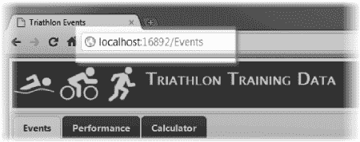
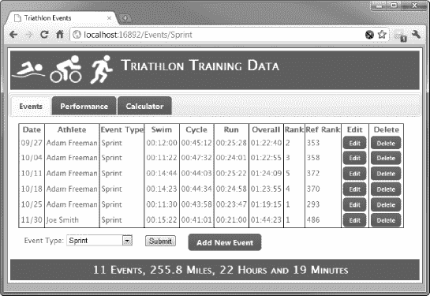
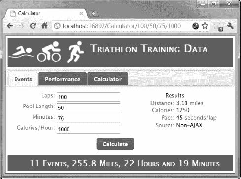
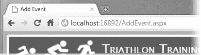
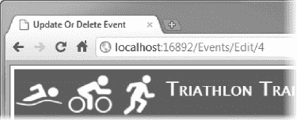
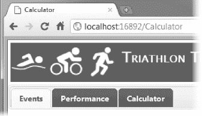
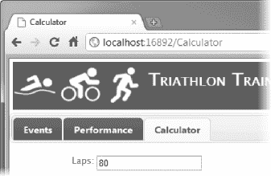
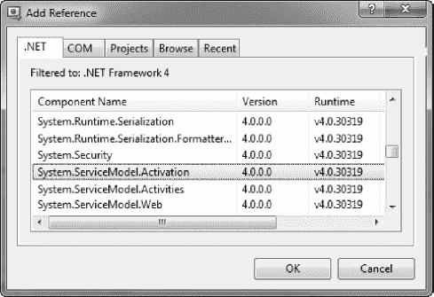

# 十二、使用路由

在我们到目前为止的例子中，在我们给一个页面起的名字和用来访问它的 URL 之间有一个直接的关联。例如，如果我们在 Visual Studio ASP.NET 项目的根目录中创建了一个名为`MyPage.aspx`的新网页，那么我们在开发机器上用来访问它的 URL 应该是这样的:

`http://localhost:1234/MyPage.aspx`

如果我们将网页移动到一个名为`Pages`的目录中，那么 URL 变成如下所示:

`http://localhost:1234/Pages/MyPage.aspx`

类似地，当我们将我们的 web 应用部署到我们的生产服务器时(部署是第 14 章的主题)，URL 仍然会直接与应用目录中页面文件的位置相关，换句话说，就像这样:

`http://myserver.mydomain.com/Pages/MyPage.aspx`

这种模式并不总是方便的。页面文件位置的更改需要更新指向该页面的任何 URL，并且会向用户公开应用的结构。ASP.NET*路由*功能允许您在访问页面的 URL 和页面本身之间创建抽象，这样，您就可以创建用户更容易直接访问的 URL。在这一章中，我们将探索路由是如何工作的，以及如何使用它们来增加 web 应用的灵活性。

 **注意**在 ASP.NET web 应用中，路由是严格可选的，除非你使用 MVC 或动态数据框架，在这种情况下，它们是应用结构的重要组成部分。

### 准备项目

路由通常在全局应用类中定义，你在第五章中第一次看到它。要向我们正在进行的示例中添加一个全局应用类，请在 Visual Studio 中选择 Project  add New Item，选择全局应用类模板，然后单击 Add 按钮。将在项目中创建一个新项目`Global.asax`。

管理路由的惯例是给`Global.asax`添加一个名为`RegisterRoutes`的方法，并从`Application_Start`方法中调用这个方法。[清单 12-1](#list_12_1) 显示了应用于`Global.asax`类的这些变化，为了简洁起见，去掉了其他方法(在本章中我们将不使用其他方法)。

***清单 12-1。**将 RegisterRoutes 方法添加到全局应用类*

`using System;
using System.Web.Routing;

namespace TriathlonTraining {
    public class Global : System.Web.HttpApplication {

        protected void Application_Start(object sender, EventArgs e) {

            RegisterRoutes(RouteTable.Routes);
        }

        public static void RegisterRoutes(RouteCollection routes) {

            // routes will go here        
        }
    }
}`

`RegisterRoutes`方法接受一个`System.Web.Routing.RouteCollection`类的实例作为参数。`Application_Start`方法通过`RouteTable.Routes`属性获得这样一个对象，该属性是`HttpApplication`类的一部分，该类是全局应用类的基础。

 **提示**我发现 ASP.NET 开发服务器不能可靠地检测到对`Global.asax`文件的更改并自动重新编译。我建议您在对路由进行更改时，使用 Visual Studio 的“生成”菜单使显式重新编译。

### 使用路由

ASP.NET 路由特性的核心是 URL 模式的概念。当请求 URL 时，路由功能会比较您提供的模式列表，并尝试将其中一个模式与所请求的模式进行匹配。以下是路由 URL 的示例:

`/App/{page}/Action/{name}`

URL 模式作用于 URL 的各个部分。段是由`/`字符分隔的 URL 的一部分。模式中的每一段都由一个文字值或变量表示。变量用大括号(`{`和`}`)表示。在前面的模式中，有四个段；其中两个段是文字段(`App`和`Action`)，两个是变量段(`page`和`name`)。

对于匹配 URL 模式的 URL，所请求的 URL 中必须有相同数量的段，并且 URL 模式*和*模式中的文字段必须匹配 URL 中相应的段。例如，下面将匹配示例模式:

`/App/Default/Action/Edit
/App/Products/Action/Buy`

如果模式中的段多于或少于模式中的段，或者 URL 中的段与模式中的文字段不匹配，则模式与 URL 不匹配。以下是一些与模式不匹配的 URL 示例:

`/App/Default/Action/Edit/Products
/WebApp/Products
/WebApp/Default/Action/Edit`

第一个 URL 不匹配，因为它的段太多，第二个太少。第三个 URL 将不匹配，因为 URL 中的第一个段(`WebApp`)不同于模式中第一个段中的文字值(`App`)。

相比之下，与模式中的变量段相对应的 URL 段中有什么并不重要。但是，我们可以限制可接受变量值的范围，以缩小模式的关注范围(我们将在本章后面的“对路由变量应用约束”一节中看到如何做到这一点)。在下面几节中，我们将看到如何使用 URL 模式来创建具有不同效果的 ASP.NET 路由。

#### 为 URL 创建别名

我们要做的第一件事是为我们的一个页面创建一个别名 URL，这样我们就可以使用 URL `/Events`请求`ListEvents.aspx`页面。[清单 12-2](#list_12_2) 显示了创建这个映射的语句。

***清单 12-2。**创建 URL 别名*

`using System;
using System.Web.Routing;

namespace TriathlonTraining {
    public class Global : System.Web.HttpApplication {

        protected void Application_Start(object sender, EventArgs e) {

            RegisterRoutes(RouteTable.Routes);
        }

        public static void RegisterRoutes(RouteCollection routes) {
            **routes.MapPageRoute("myRoute", "Events", "~/ListEvents.aspx");**
        }
    }
}`

清单 12-2 中[创建的路由以粗体显示。路由是通过调用`RouteCollection`类的`MapPageRoute`方法创建的(这是我们的`RegisterRoutes`方法接受的参数)。`MapPageRoute`方法有三个参数。](#list_12_2)

第一个参数是我们希望用来识别路由的名称。这纯粹是供我们使用，并不改变路由的行为。我选择了`myRoute`，但是任何字符串值都是可以接受的，并且指定一个空字符串(`""`)来不为路由指定名称是很常见的。

第二个参数是 URL 模式。我们从一个非常简单的例子开始。它有一个段，这是一个文字值。只有当请求的 URL 是`Events`时，它才会匹配。只能有一个段，不涉及变量。

第三个也是最后一个参数是当模式匹配 URL 时我们希望路由使用的物理页面。在这种情况下，我选择了`ListEvents.aspx`页面。

 **注意**注意[清单 12-2](#list_12_2) 中的真实页面名称带有前缀`~/`。波浪号(`~`)代表我们的 web 应用的根，而不是仅仅代表服务器根的`/`。当多个 web 应用被部署到同一个服务器时，这是一个重要的区别。使用路由时，必须相对于应用根指定实际页面。

为了测试路由，启动 Visual Studio ASP.NET 开发服务器并请求 URL `/Events`。最简单的方法是右键单击一个现有的`.aspx`网页，并从弹出菜单中选择在浏览器中查看。这将确保编译全局应用类并启动服务器。当页面显示时，在浏览器中将 URL 编辑为所需的 URL。例如，如果您查看了`Calculator.aspx`页面，浏览器中的 URL 将类似如下:

`http://localhost:16892/Calculator.aspx`

要测试新添加的路由，请将浏览器中的 URL 更改为以下内容:

`http://localhost:16892/Events`

路由 URL 不会导致浏览器被重定向。相反，浏览器请求`/Events` URL 并接收`ListEvents.aspx`页面的内容，而不知道该路由的存在。你可以通过检查浏览器显示的 URL 来看到这一点，如图[图 12-1](#fig_12_1) 所示。

***图 12-1。**浏览器显示的路由网址*

最接近的等效方法是你在[第 5 章](05.html#ch5)中看到的`Server.Transfer`方法，但是路由系统更方便，而且，正如我们将看到的，有一些额外的特性。

**通过 ASP.NET 路由使用相对 URLS】**

使用路由的 URL 时，对其他资源(如图像、外部脚本文件和 CSS)的引用必须是完全限定的。例如，如果您将一个 JavaScript 文件从`Scripts`文件夹拖到一个`.aspx`页面上，Visual Studio 将创建一个`script`元素，如下所示:

``

当使用路由 URL 请求页面时，将正确解析此引用；我们必须绝对指定位置，就像这样:

``

或者相对于 web 应用的根，如下所示:

``

如果您开始使用 routes 并发现图像没有显示或者您的脚本生成了意外错误，这可能是问题的原因。

添加路由不会阻止针对该页面的请求工作。即使在全局应用类中定义了与此页面相关的路由，您仍然可以请求`ListEvents.aspx`。有关如何阻止对`.aspx`文件的直接请求的详细信息，请参阅本章后面的“禁用未路由的 URL”一节。

#### 了解路由排序

路由按照添加的顺序进行评估。一旦匹配成功，就不再检查路由。作为示范，[清单 12-3](#list_12_3) 显示了我在前一个例子之前添加的一条路由。

***清单 12-3。**增加一条路由*

`public static void RegisterRoutes(RouteCollection routes) {

    **routes.MapPageRoute("myGeneralRoute", "{mode}", "~/Calculator.aspx");**

    routes.MapPageRoute("myRoute", "Events", "~/ListEvents.aspx");
}`

新路由以粗体显示。它有一个段，并且是一个变量，这意味着这个模式将匹配任何包含一个段的 URL，包括`/Events`。如果您使用 web 浏览器请求`/Events` URL，您将看到显示了`Calculator.aspx`页面。第二条路由永远不会被评估。这意味着您应该先定义更具体的路由，然后再定义更一般的路由。

 **注意**如果你很细心，你会注意到当一条路由通向正在显示的`Calculator.aspx`页面时，我们在[第 10 章](10.html#ch10)中添加到主页的标签不能正常工作。这是因为处理选项卡的 jQuery 脚本依赖于`Request.Path`属性来确定应该突出显示哪个选项卡，并且当路由导致页面被显示时，该属性返回请求的 URL。我将在本章后面的“修复母版页标签”一节中向您展示如何修复标签。

如果我们颠倒清单 12-3 中[两条路由的顺序，如下所示:](#list_12_3)

`routes.MapPageRoute("myRoute", "Events", "~/ListEvents.aspx");
routes.MapPageRoute("myGeneralRoute", "{mode}", "~/Calculator.aspx");`

然后`/Events`导致显示`ListEvents.aspx`页面，任何其他单段 URL 将导致显示`Calculator.aspx`页面。

 **注意**我们不会再使用[清单 12-3](#list_12_3) 中定义的`myGeneralRoute`，所以你应该把它从你的项目中移除；否则会干扰后面的例子。

#### 使用路由变量

您已经看到了如何使用文字和值来匹配 URL 模式。我们给变量起名字，比如`mode`、`page`和`name`的原因是，ASP.NET 使用我们给变量起的名字，在呈现我们的页面时使每个变量 URL 段的内容对我们可用。[清单 12-4](#list_12_4) 为`ListEvents.aspx`页面添加了一条到`Global.asax`的路由，该路由有一个可变段。

***清单 12-4。**一条可变航段路由*

`public static void RegisterRoutes(RouteCollection routes) {

    routes.MapPageRoute("calcRoute", "Calculator", "~/Calculator.aspx");
    routes.MapPageRoute("myRoute", "Events", "~/ListEvents.aspx");

    **routes.MapPageRoute("", "Events/{eventType}", "~/ListEvents.aspx");**
}`

这个新路由的模式将匹配任何两段 URL，其中第一段是`Events`。我们将使用模式变量来创建一个*可组合 URL* ，其中用户通过使用 URL 段来快捷导航 web 应用。到目前为止，如果我们想列出所有的`Sprint`铁人三项赛事，我们必须做到以下几点:

1.  请求`ListEvents.aspx`网页。
2.  等待 Ajax 脚本加载并显示所有事件。
3.  从`select`控件的下拉菜单中选择 Sprint。
4.  等待 Ajax 脚本加载并显示 sprint 事件。

这不是一个巨大的困难，但它提出了几个问题。首先，我们传送更多的数据，处理更多我们需要处理的请求。我们的 web 服务处理对所有数据的初始请求和对 sprint 数据的后续请求。第二，我们让用户经历重重困难。他们已经知道他们想看什么数据，但我们向他们展示一切，然后才允许他们应用过滤器。

我们的可组合 URL 将让用户只看到他们想要的事件，而不必使用网页导航。当用户请求 URL `/Events/Sprint`时，我们将只显示短跑比赛，当用户请求 URL `/Events/Olympic`时，我们将只显示奥运会数据。

用户希望看到的事件类型将包含在名为`eventType`的第二个段变量中。[清单 12-5](#list_12_5) 展示了我们如何从`ListEvent.aspx`代码隐藏类中访问这个变量。

***清单 12-5。**从代码隐藏类中访问路由值*

`using System;

namespace TriathlonTraining {
    public partial class ListEvents : System.Web.UI.Page {
        protected void Page_Load(object sender, EventArgs e) {

            // create the entity data model context object
            using (TrainingDataEntities context = new TrainingDataEntities()) {

                // populate the select control if needed
                if (ViewState["setupComplete"] == null) {
                    foreach (string name in DataAccess.GetEventTypeNames(context)) {
                        eventSelector.Items.Add(name);
                    }
                    ViewState["setupComplete"] = true;
                }

                **// get the value of the route data variable**
                **object specifiedSport = RouteData.Values["eventType"];**
                **if (specifiedSport != null) {**
                    **// get the list item that contains the selected event type**
                    **eventSelector.Items**
                        **.FindByText(specifiedSport.ToString()).Selected = true;**
                **}**
            }
        }
    }
}`

该类中特定于路由的新增内容以粗体显示。我们可以通过返回一个`System.Web.Routing.RouteData`对象的`Page.RouteData`属性来访问路由配置。`RouteData`对象包含导致该页面被调用的路由信息，我们可以使用`Values`属性访问 URL 模式变量，因此该语句:

`object specifiedSport = RouteData.Values["eventType"];`

返回对应于 URL 模式中的`eventType`变量的 URL 段的内容。

要启用我们的可组合 URL，我们所要做的就是确保在`select`元素中选择了适当的选项元素。我们在列表项集合上使用了`FindByText`方法，该集合由`HtmlSelect` HTML 控件类的`Items`属性返回。这就是我们所要做的，因为我们添加到`ListEvents.aspx`页面的 Ajax 脚本根据`select`元素中的选定项向服务器请求数据。通过预先选择`Sprint`项，比如说，在代码隐藏类中，我们确保客户端 jQuery 脚本将在其初始请求中只要求`Sprint`项。

 **提示**使用 URL 段变量时需要注意，因为用户也可以直接请求`ListEvents.aspx`页面，在这种情况下将没有`eventType`变量。这就是为什么清单 12-5 中的测试确保我们已经成功地从`RouteData.Values`集合中获取了一个值。注意，当我们设法获得一个值时，我们得到一个`object`，然后在我们可以用它来选择一个项目之前，它必须被转换成一个`string`。

为了测试这个路由的效果，启动 ASP.NET 开发 web 服务器并请求`/Events/Sprint` URL。您将只看到列表中显示的`Sprint`类事件，如图[图 12-2](#fig_12_2) 所示。

***图 12-2。**使用可组合的 URL*

注意，`select`元素正确地显示了事件类型。这是使用页面的 HTML 作为 ASP.NET 和 jQuery Ajax 之间的桥梁的好结果。如果您请求 URL `/Events/Olympic`，您将只看到奥运赛事，当然,`select`元素仍然像以前一样工作，因此您可以通过从下拉列表中选择一个新值来更改显示的赛事类型。

#### 为路由变量提供默认值

我们现在有两条与`ListEvents.aspx`页面相关的路由。第一个处理单段 URL `/Events`，第二个处理两段 URL`/Events/Sprint`(或其他事件类型)。当您请求第一个 URL 时，您会看到所有事件，而当您请求第二个 URL 时，您只会看到与您指定的类型相匹配的事件。

我们可以将这两条路由结合起来，并通过使用默认的变量值特性来保持相同的行为。[清单 12-6](#list_12_6) 显示了全局应用类中的组合路由。

***清单 12-6。**使用默认的 URL 参数值*

`public static void RegisterRoutes(RouteCollection routes) {

    routes.MapPageRoute("calcRoute", "Calculator", "~/Calculator.aspx");
    **routes.MapPageRoute("", "Events/{eventType}",**
        **"~/ListEvents.aspx",**`
`        **true,**
        **new RouteValueDictionary() {**
            **{"eventType", "All"}**
        **});**
}`

新航路以粗体显示；它有两个附加参数。第一个是`bool`值，它告诉路由系统是否应该检查用户是否被授权访问页面文件。我在[第 13 章](13.html#ch13)中介绍了认证和授权，但是通常将这个参数设置为`true`是一个明智的做法。

第二个参数是我们对本章感兴趣的参数。它是一个`System.Web.Routing.RouteValueDictionary`对象，包含我们想要应用于可变路由段的默认值。

清单 12-6 中的[只有一个默认值，因为在路由 URL 模式中只有一个变量段。您可以看到我已经指定了一个默认值`All`。指定默认值扩大了匹配模式的 URL 的范围。如果 URL 中省略了某个变量段，但指定了该变量的默认值，则该 URL 将匹配，并且路由系统会将默认值分配给该变量。对于清单 12-6](#list_12_6) 中的规则，这意味着当我们请求 URL `/Events`时，就好像我们真的请求了`/Events/All`，因为应用了默认值。

使用默认值不会影响页面或代码隐藏类；它只是扩大了 URL 模式匹配的范围，并简化了我们的路由集。

#### 对路由变量应用约束

前一个例子的一个问题是，我们没有检查模式变量以确保它与我们识别的事件类型相匹配。为了理解我的意思，将浏览器中的 URL 更改为`/Events/IronMan`，您将看到页面抛出一个异常。解决这个问题的一种方法是约束 URL 模式，使它只匹配某些变量值。清单 12-7 显示了修改后的路由。

***清单 12-7。**通过变量值约束限制 URL*

`public static void RegisterRoutes(RouteCollection routes) {

    routes.MapPageRoute("calcRoute", "Calculator", "~/Calculator.aspx");
    routes.MapPageRoute("", "Events/{eventType}",
        "~/ListEvents.aspx",
        true,
        new RouteValueDictionary() {{"eventType", "All"}},
        **new RouteValueDictionary() {{"eventType", "All|Sprint|Olympic"}}**
    **);**
}`

我给清单 12-7 中的[方法传递了一个额外的参数，这是另一个`RouteValueDictionary`对象。代替默认值，它提供了正则表达式，用于在提供可接受的变量值时限制它们的集合。我们只想支持三个值，它们可以用竖线字符(`|`)按字面意思表示和组合，但是可以指定任何有效的正则表达式。](#list_12_7)

[清单 12-7](#list_12_7) 指定了通过`DataAccess`类和实体框架数据模型从数据库中获得的更好的文字值。我逐字列出它们是为了让例子更清楚，但是更明智的是以编程方式构建约束字符串，如[清单 12-8](#list_12_8) 所示。

***清单 12-8。**以编程方式创建变量值约束*

`public static void RegisterRoutes(RouteCollection routes) {

    routes.MapPageRoute("calcRoute", "Calculator", "~/Calculator.aspx");

    using (TrainingDataEntities context = new TrainingDataEntities()) {
        string[] eventTypes = DataAccess.GetEventTypeNames(context);
        StringBuilder builder = new StringBuilder("All");
        for (int i = 0; i < eventTypes.Length; i++) {
            builder.Append('|').Append(eventTypes[i]);
        }

        routes.MapPageRoute("", "Events/{eventType}",
            "~/ListEvents.aspx",
            true,
            new RouteValueDictionary() {{"eventType", "All"}},
            new RouteValueDictionary() {{"eventType", builder.ToString()}}
        );
    }
}`

无论您是按字面意思列出约束还是以编程方式生成约束，当用户为变量段提供一个与相应的正则表达式不匹配的值时，都会抛出“not found”异常，表示为 HTTP 404 错误。参见第 7 章了解如何优雅地 ASP.NET 处理错误的细节，并且不会让用户感到困惑。

但是，如果您想要限制值的范围，并且在没有匹配时依赖默认值，那么我们可以添加第二个路由。请记住，路由是按照添加的顺序进行评估的，我们将不太具体的规则放在更具体的规则之后。清单 12-9 显示了一条备用路由的添加。

***清单 12-9。**使用第二条路由作为退路*

`public static void RegisterRoutes(RouteCollection routes) {

    routes.MapPageRoute("calcRoute", "Calculator", "~/Calculator.aspx");

    using (TrainingDataEntities context = new TrainingDataEntities()) {
        string[] eventTypes = DataAccess.GetEventTypeNames(context);
        StringBuilder builder = new StringBuilder("All");
        for (int i = 0; i < eventTypes.Length; i++) {
            builder.Append('|').Append(eventTypes[i]);
        }`

`        routes.MapPageRoute("", "Events/{eventType}",
            "~/ListEvents.aspx",
            true,
            new RouteValueDictionary() { { "eventType", "All" } },
            new RouteValueDictionary() { { "eventType", builder.ToString() } }
        );
    }

    **routes.MapPageRoute("", "Events/{placeholder}",**
        **"~/ListEvents.aspx",**
        **true,**
        **new RouteValueDictionary() { { "eventType", "All" } });**
}`

这是一个依赖于路由系统实现的花招。它可能不应该这样工作，它可能会在 ASP.NET 的未来版本中改变。然而，它可以在 ASP.NET 版本 4 中工作，而且非常方便。用粗体标记的新规则的 URL 模式将匹配两段 URL，其中第一段在`Events`中。这与前面的路由相同，但是因为路由是按顺序评估的，所以只有当请求的 URL 的第二段没有通过第一个`Events`路由的约束检查时，它才会匹配。诀窍是指定一个变量名，然后我们忽略它，并为我们关心的变量提供一个默认值。在这种情况下，我们匹配一个名为`placeholder`的变量，并为`eventType`提供一个值。即使`eventType`不是一个可变的 URL 段，路由系统也会将默认值传递给代码隐藏类。这样，我们为 URL 创建了一个行为，比如`/Events/IronMan`。它们变得等同于请求`/Events/All`。使用这种方法时必须小心，因为它可能不是用户所期望的，但是当它适合您的 web 应用的风格时，它可能比显示错误页面更可取。

#### 可变段的路由模式

我们可以通过用星号(`*`)标记最后一个可变航段来指定航段数量可变的路由。清单 12-10 提供了一个演示。

***清单 12-10。**路段数量可变的路由*

`public static void RegisterRoutes(RouteCollection routes) {

    routes.MapPageRoute("calcRoute", "Calculator", "~/Calculator.aspx");

    **routes.MapPageRoute("variableCalcRoute",**
        **"Calculator/{firstVal}/{secondVal}/{*otherVals}",**
        **"~/Calculator.aspx");**

    using (TrainingDataEntities context = new TrainingDataEntities()) {
        string[] eventTypes = DataAccess.GetEventTypeNames(context);
        StringBuilder builder = new StringBuilder("All");
        for (int i = 0; i < eventTypes.Length; i++) {
            builder.Append('|').Append(eventTypes[i]);
        }`
`        routes.MapPageRoute("", "Events/{eventType}",
            "~/ListEvents.aspx",
            true,
            new RouteValueDictionary() { { "eventType", "All" } },
            new RouteValueDictionary() { { "eventType", builder.ToString() } }
        );
    }

    routes.MapPageRoute("", "Events/{placeholder}",
        "~/ListEvents.aspx",
        true,
        new RouteValueDictionary() { { "eventType", "All" } });
}`

此路由的模式将匹配任何以`/Calculator`开头且至少有两个其他段的 URL。如果有两个以上的段，那么它们的值将作为一个字符串赋给变量`otherVals`，这样，如果我们请求 URL `/Calculator/1/2/3/4`，那么`firstVal`将是`1` , `secondVal`将是`2`，而`otherVals`将是`3/4`。我们可以使用这个特性来允许用户通过`Calculator.aspx`页面执行计算，提供可变数量的值来处理，并依赖于页面中的默认值，其中 URL 中没有指定值。[清单 12-11](#list_12_11) 展示了如何在`Calculator.aspx`代码隐藏类中做到这一点。

***清单 12-11。**通过路由 URL 执行计算*

`…
if (IsPostBack || RouteData.Values.Count > 0) {

    if (RouteData.Values.Count > 0) {
        // we know that we have at least two values to process
        lapsInput.Value = RouteData.Values["firstVal"].ToString();
        lengthInput.Value = RouteData.Values["secondVal"].ToString();
        // see if we have a variable length item
        if (RouteData.Values["otherVals"] != null) {
            string[] additionalValues = RouteData.Values["otherVals"].ToString().Split('/');
            minsInput.Value = additionalValues[0];
            if (additionalValues.Length > 1) {
                calsInput.Value = additionalValues[1];
            }
        }
    }
….`

虽然只有当对页面的请求是一个`POST`时才会执行计算，但是如果有可用的路由变量值，现在也会执行计算。在这种情况下，我设置适当的`input`元素的`Value`属性，以便它们反映路由的 URL 变量，并将在计算中使用。我知道如果有路由数据，至少会有两个变量(否则路由不会与 URL 匹配)，并且我通过检查`otherVals`来查看是否存在额外的段。当用户请求一个 URL 如`/Calculator/100/50`或`/Calculator/ 100/50/75/1000`时，URL 段被用于计算，如图[图 12-3](#fig_12_3) 所示。

***图 12-3。**使用分段数量可变的 URL*

#### 禁用未路由的 URL

默认情况下，路由 URL 与常规 URL 共存，这意味着我们可以通过请求`/Calculator.aspx`或`/Calculator`来访问`Calculator.aspx`页面。我们可以通过在全局应用类中添加两条语句来按名称禁用对`.aspx`页面的请求，如[清单 12-12](#list_12_12) 所示。

***清单 12-12。**禁用网页直接请求*

`…
public static void RegisterRoutes(RouteCollection routes) {

    **routes.RouteExistingFiles = true;**
    **routes.MapPageRoute("files", "{filename}.aspx/{*catchall}", "~/NoPage.aspx");**

    routes.MapPageRoute("calcRoute", "Calculator", "~/Calculator.aspx");
…`

这些语句以粗体显示。第一个在请求磁盘上的文件时启用路由:

`routes.RouteExistingFiles = true;`

这意味着如果请求的 URL 与 web 应用中文件的路由*和*相匹配，则该路由优先。默认情况下，在这种情况下使用标准的 URL 处理程序，即使有匹配的路由。第二条语句添加了一个路由，其模式与对`.aspx`文件的请求相匹配:

`routes.MapPageRoute("files", "{filename}.aspx/{*catchall}", "~/NoPage.aspx");`

URL 模式匹配任何对具有任意数量附加段的`.aspx`文件的请求。当发出这样的请求时，路由匹配，请求被传递到页面`NoPage.aspx`。

此时，我们有一个选择。我们可以创建一个名为`NoPage.aspx`的页面，并使用路由数据向用户显示一条有用的消息，解释我们不支持对网页文件的直接请求。或者我们可以创建一个页面，试图找出应该使用什么样的路由 URL，并尽可能无缝地传输请求，因此如果我们收到了对`/ListEvents.aspx`的请求，我们会将用户传输或重定向到`/Events`。第三种选择是*而不是*创建文件；当路由匹配一个 URL 时，会出现一个标准的“not found”异常，我们可以像处理任何不存在的页面请求一样处理它。参见第 7 章了解不同的方法。

 **注意**请务必从您的项目中删除[清单 12-12](#list_12_12) 中的语句，以获取以下章节中的示例。我们不准备禁用所有页面的直接请求。

#### 在网页中使用路由的 URL

为了完全接受路由的 URL，我们需要确保在我们的网页中包含 URL 的路由版本。我们可以通过多种方式实现这一点，并且可以使用代码块直接在网页中或在代码隐藏文件中实现这一点。在接下来的部分中，我将解释不同的选项。

##### 在网页中创建路由 URL

我们将从`ListEvents.aspx`页面开始，该页面包含一个`a`元素，其`href`属性指向`AddEvent.aspx`页面。即使当你使用一个路由的 URL 到达`ListEvents.aspx`页面，点击添加新事件链接(或按钮，感谢我们在[第 10 章](10.html#ch10)中添加的 jQuery UI)，我们也能在浏览器中看到页面的真实名称，如图[图 12-4](#fig_12_4) 所示。

***图 12-4。**显示 AddEvent.aspx 页面名称的浏览器*

我们在这一部分的目标是让浏览器显示一个路由的 URL，作为我们的可组合 URL 方案的一部分。我们首先为`AddEvents.aspx`页面定义一条路由，如[清单 12-13](#list_12_13) 所示。

***清单 12-13。**为 AddEvent.aspx 页面添加路径*

`public static void RegisterRoutes(RouteCollection routes) {

    routes.MapPageRoute("calcRoute", "Calculator", "~/Calculator.aspx");
    routes.MapPageRoute("variableCalcRoute",
        "Calculator/{firstVal}/{secondVal}/{*otherVals}",
        "~/Calculator.aspx");

    **routes.MapPageRoute("addRoute", "Events/Add", "~/AddEvent.aspx");**

    using (TrainingDataEntities context = new TrainingDataEntities()) {
        string[] eventTypes = DataAccess.GetEventTypeNames(context);
        StringBuilder builder = new StringBuilder("All");
        for (int i = 0; i < eventTypes.Length; i++) {
            builder.Append('|').Append(eventTypes[i]);
        }

        routes.MapPageRoute("", "Events/{eventType}",
            "~/ListEvents.aspx",
            true,
            new RouteValueDictionary() { { "eventType", "All" } },
            new RouteValueDictionary() { { "eventType", builder.ToString() } }
        );
    }

    routes.MapPageRoute("", "Events/{placeholder}",
        "~/ListEvents.aspx",
        true,
        new RouteValueDictionary() { { "eventType", "All" } });
}`

新路由有一个两段文字模式，将只匹配 URL `/Events/Add`。请注意，我已经在使用前缀`/Events`的其他路由之前添加了这条路由。这是一个比其他 URL 更具体的 URL，因此必须放在第一位。我使用了`/Events`前缀来进一步扩展我们的可组合 URL 主题。

我们的下一步是从`ListEvents.aspx`页面更新对`AddEvents.aspx`页面的引用；在页面的末尾，您会看到如下部分:

`…

    <a href="AddEvent.aspx">Add New Event</a>

…`

`a`元素有一个硬连接到`AddEvent.aspx`页面的`href`属性。要更改为路由的 URL，我们需要用一个`asp:HyperLink`元素替换`a`元素，如清单 12-14 中的[所示。](#list_12_14)

***清单 12-14。**在网页中嵌入路由 URL*

`…

    <asp:HyperLink id="addLink" runat="server"
    NavigateUrl="<%$RouteUrl:RouteName=addRoute %>">Add New Event</asp:HyperLink>

…`

`asp:HyperLink`元素指的是`System.Web.UI.WebControls.HyperLink`类，它是 HTML `a`元素的一个表示，但是具有在服务器上实现的便利特性，比如显示图像。我们对这些特性并不感兴趣，但是这个控件的使用让我们可以对`NavigateUrl`属性使用代码块表达式语法，如下所示:

`<%$RouteUrl:RouteName=addRoute %>`

注意`<%`后面的`$`字符。这表明我们正在使用一个表达式。表达式由一个关键字和一组属性名和值组成。在本例中，关键字是`RouteUrl`，我们为`RouteName`属性提供了一个值。我不喜欢`asp:HyperLink`类，并且我倾向于避免表达式代码块，但是如果我们想在我们的网页中包含一个路由 URL，这就是如何做的。

属性指定了我们想要用来生成路由 URL 的路由名称。`addRoute`值是我们给在[清单 12-13](#list_12_13) 中添加的路由起的名字。这条路由没有可变路段，所以我们不需要提供任何信息。如果您在浏览器中查看修改后的`ListEvents.aspx`页面，并查看呈现的 HTML 源代码，您会看到我们的表达式块已经被转换为路由 URL，如下所示:

`…

    <a id="MainContent_addLink" href="/Events/Add">Add New Event</a>

…`

`asp:HyperLink`已经被呈现为一个`a`元素，其中`NavigationUrl`属性被表示为`href`属性。我们的`RouteUrl`表达式已经被转换成路由的 URL `/Events/Add`。我们不能仅仅把表达式代码块放在我们的代码中，而没有更难看的元素序列。如果我们想继续使用 HTML `a`元素，并将路由 URL 的值直接写入`href`属性，我们必须使用`asp:Literal`元素，如下所示:

`<a href="<asp:Literal runat="server" Text="<%$RouteUrl:RouteName=addRoute%>" />">Add New
Event</a>`

##### 在代码隐藏类中创建路由 URL

我喜欢我们可以得到路由的 URL，但是我不喜欢这两种语法风格。我更喜欢从代码隐藏类中生成路由的 URL。结果是一样的，但是我觉得风格和语法更好。为了演示代码隐藏方法，我们必须首先将`ListEvents.aspx`页面中的链接改回一个`a`元素，尽管我们可以从代码隐藏类中引用它，如下所示:

`…

    **<a id="addEventAnchor" runat="server">Add New Event</a>**

…`

我们现在可以通过编程来设置`href`属性的值，如清单 12-15 中的[所示。](#list_12_15)

***清单 12-15。**以编程方式生成路由 URL*

`using System;
using System.Web.Routing;

namespace TriathlonTraining {
    public partial class ListEvents : System.Web.UI.Page {
        protected void Page_Load(object sender, EventArgs e) {

            **// set the href attribute of the anchor to be the routed URL**
            **addEventAnchor.HRef**
                **= RouteTable.Routes.GetVirtualPath(null, "addRoute", null).VirtualPath;**

           // other statements removed for brevity
        }
    }
}`

粗体显示的语句使用`RouteTable.Routes`属性获取一组已定义的路由，并调用`GetVirtualPath`方法。我们从来不需要为第一个参数提供值，第二个参数是我们想要为其生成 URL 的路由的名称。第三个参数是下一节的主题。`GetVirtualPath`方法返回一个`VirtualPathData`对象。除了`VirtualPath`属性返回我们正在寻找的 URL 之外，我们对这个对象不感兴趣。如果您在应用这些更改后显示`ListEvents.aspx`页面，您可以在发送到浏览器的 HTML 中看到以下内容:

`…

    <a href="/Events/Add" id="MainContent_addEventAnchor">Add New Event</a>

…`

同样，我们有一个与我们命名的路由匹配的 URL，在本例中是`/Events/Add`。

##### 使用参数值创建路由 URL

我们还可以创建包含变量段值的路由 URL。为了演示这一点，我们将创建一个处理`UpdateOrDeleteEvent.aspx`页面的路由，然后为该页面生成路由的 URL，这些 URL 将包含在`ListEvents.aspx`页面的编辑和删除链接/按钮中。[清单 12-16](#list_12_16) 显示了新的路由。

***清单 12-16。**为 UpdateOrDelete.aspx 页面添加路由*

`public static void RegisterRoutes(RouteCollection routes) {

    routes.MapPageRoute("calcRoute", "Calculator", "~/Calculator.aspx");

    routes.MapPageRoute("variableCalcRoute",
        "Calculator/{firstVal}/{secondVal}/{*otherVals}",
        "~/Calculator.aspx");

    routes.MapPageRoute("addRoute", "Events/Add", "~/AddEvent.aspx");

    **routes.MapPageRoute("editOrDelete",**
        **"Events/{mode}/{id}",**
        **"~/UpdateOrDeleteEvent.aspx",**
        **true,**
        **new RouteValueDictionary() {{"id", "1"}},,**
        **new RouteValueDictionary() { { "mode", "Edit|Delete"}});**

    using (TrainingDataEntities context = new TrainingDataEntities()) {
        string[] eventTypes = DataAccess.GetEventTypeNames(context);
        StringBuilder builder = new StringBuilder("All");
        for (int i = 0; i < eventTypes.Length; i++) {
            builder.Append('|').Append(eventTypes[i]);
        }

        routes.MapPageRoute("", "Events/{eventType}",
            "~/ListEvents.aspx",
            true,
            new RouteValueDictionary() { { "eventType", "All" } },
            new RouteValueDictionary() { { "eventType", builder.ToString() } }
        );
    }

    routes.MapPageRoute("", "Events/{placeholder}",
        "~/ListEvents.aspx",
        true,
        new RouteValueDictionary() { { "eventType", "All" } });
}`

以粗体显示的新路由的 URL 模式有三段，其中两段是可变的。为`id`变量提供默认值，为`mode`变量提供约束。必须编辑或删除`mode`变量。我没有为`id`变量提供约束。原因很快就会变得清楚。如果用户输入 URL `/Events/Edit/1`或`/Events/Delete/2`，他们将能够编辑或删除主键值分别为 1 和 2 的事件。

###### 在代码隐藏类中添加路由变量支持

定义了路由之后，我们需要在`UpdateOrDeleteEvent.aspx`代码隐藏类中添加对处理路由变量的支持。该页面已经接受了来自查询字符串的`mode`和`id`的值，我们希望保留这些值，这样除了通过路由 URL 之外，我们还可以继续直接引用该页面。[清单 12-17](#list_12_17) 显示了我添加到代码隐藏类中的一个方法。

***清单 12-17。**修改 UpdateOrDelete.aspx 类*

`private string GetQueryStringOrRouteValue(string key) {

    string result = Request.QueryString[key];
    if (result == null && RouteData.Values[key] != null) {
        result = RouteData.Values[key].ToString();
    }
    return result;
}`

该方法检查请求查询字符串中是否存在一个键，如果不存在，则尝试在路由变量集中定位它。我已经修改了该类，以便在确定如何调用它时使用该方法，如下所示:

`…
string mode;
int eventID;
Event targetEvent;

if ((mode = GetQueryStringOrRouteValue("mode").ToLower()) != null
    && int.TryParse(GetQueryStringOrRouteValue("id"), out eventID)
    && (targetEvent = DataAccess.GetEventByID(context,
        eventID)) != null) {

    // set the hidden fields in the form
    this.modeInput.Value = mode;
    this.keyInput.Value = eventID.ToString();
…`

 **注意**我只列出了这些片段，因为`UpdateOrDeleteEvent.aspx`页面的代码隐藏类很长，而且与我在这里展示的路由 URL 的使用无关。你可以下载本书附带的代码，在 Apress.com 免费获得，从而看到整个课程，包括这些修改。

这些小的变化增加了对从路由数据中获取`mode`和`eventID`代码隐藏类变量的值的支持，而不会破坏现有的对从查询字符串中执行相同操作的支持。

###### 将路由的 URL 添加到 ListEvents.aspx 页面

我们通过提供一组名称/值对来生成带有可变段的路由 URL。例如，要为代码隐藏类中的`UpdateOrDelete.aspx`页面生成一个路由 URL，我们可以使用清单 12-18 中的代码。

***清单 12-18。**用代码隐藏类中的参数生成路由 URL*

`string routedUrl = RouteTable.Routes.GetVirtualPath(null, "editOrDelete",
    new RouteValueDictionary() {
        {"mode", "edit"},
        {"id", "5"}}).VirtualPath;`

我们简单地将`RouteValueDictionary`类的一个实例传递给`GetVirtualPath`方法，其中字典包含段变量名和它们的值。前面的语句将把下面的 URL 分配给`routedURL`变量:

`/Events/edit/5`

类似的方法也适用于内联表达式，如清单 12-19 中所示。

 **注意**为段变量指定值时要小心。如果您提供的值与路由中的约束不匹配，您将得到一个空字符串(`""`)，并且您的链接或按钮将不起作用。

***清单 12-19。**生成带内嵌参数的路由 URL*

`<asp:HyperLink id="delLink" runat="server" NavigateUrl="<%$RouteUrl:RouteName=editOrDelete,
mode=Delete, id=4 %>Delete</asp:HyperLink>`

在本例中，我们在路由名称后以逗号分隔的`name=value`序列的形式提供值。此标记生成以下 HTML:

`<a id="MainContent_delLink" href="/Events/Delete/4">Delete</a>`

 **注意**您可以省略路由名称，只提供变量段的名称和值。路由系统将根据它所拥有的有限信息，试图找出应该使用哪条路由。当它工作时，这是一个优雅的特性，但是我发现它不可预测，我更喜欢给出我的路由名称，然后在生成路由 URL 时引用它们。

在`ListEvents.aspx`页面中获取这些路由的 URL 要稍微复杂一些，因为事件数据是使用 Ajax 和 jQuery 模板插件获得的。我们希望作为 URL 段的值之一被表示为数据模板项，如下所示:

`<a href="/UpdateOrDeleteEvent.aspx?id=${Key}&mode=Edit">Edit</a>`

这是我们可能开始生成 URL 的地方:

`<asp:HyperLink id="addLink" runat="server" NavigateUrl="<%$RouteUrl:RouteName=editOrDelete,
mode=Delete, id=${Key} %>">Edit</asp:HyperLink>`

这与我们之前使用的格式相同，但是我们将`id`变量的值设置为`${Key}`，这是数据模板项。我们希望这一内容如下:

`<a id="HeadContent_addLink" href="/Events/Delete/${Key}">Edit</a>`

不幸的是，路由系统试图提供帮助，并对我们的参数值进行编码，以便它们在 URL 中不包含任何非法字符。我们实际上得到的是:

`<a id="HeadContent_addLink" href="/Events/Delete/%**24%7BKey%7D**">Edit</a>`

我已经用粗体突出了这个问题。我们丢失了美元和大括号字符，这意味着 jQuery 模板插件不能识别要处理的模板项，我们得到了一个无用的 URL。可悲的是，这就是当我们将这样不同的技术结合在一起时所发生的事情。在很大程度上，jQuery 和 ASP.NET 只能在最细微的地方相处，但是有时一种技术的设计假设会与另一种技术的设计假设发生冲突。

我们可以通过多种方式解决这个问题。第一种是为路由系统编写我们自己的处理程序，它不会自动对 URL 参数进行编码。对我来说，这似乎有些矫枉过正，尤其是因为大多数时候对参数进行编码是一种可以节省时间并避免错误的行为。

第二种方法是修改 jQuery 模板插件，使其能够识别不同的语法。我不喜欢这个想法，因为这意味着我们创建了自己的 jQuery 代码分支，并且每次我们想要迁移到新版本时都必须应用相同的一组更改。

当我在一个真实的项目中遇到这种情况时，我决定采用的方法是折衷和修改元素语法，以获得我需要的 URL 格式。在这种情况下，我们也是这样做的:

`<a href="
    <asp:Literal runat="server"
        Text="<%$RouteUrl:RouteName=editOrDelete, mode=Edit%>"/>/${Key}">
    Edit
</a>`

`asp:Literal`元素让我们可以访问`RouteURL`表达式，并在呈现时留下文本。我使用这个元素创建了一个部分 URL，只为`mode`参数提供了一个值，所以我最终得到了如下结果:

`/Events/Edit`

然后我稍微作弊，逐字定义 URL 的其余部分，这允许我指定模板项，就像这个`/${Key}`。当这个文本与`asp:Literal`元素的结果相结合时，我们得到了我们需要的 URL 格式:

`/Events/Edit/${Key}`

这是 jQuery 模板插件可以识别的格式，当通过 Ajax 获得数据时，模板会被正确应用。本例中的折衷是，我在数据模板和路由 URL 模式之间创建了一个脆弱的依赖关系。我不能在不改变模板的情况下改变路由。这并不理想，但我发现它比其他选择更好。理想情况下，随着 jQuery 插件和 ASP.NET 的不断成熟，会出现一种更好的方法。[清单 12-20](#list_12_20) 显示了应用于`ListEvents.aspx`页面中数据模板的这些修改。

***清单 12-20。**在 jQuery 数据模板中使用路由的 URLs】*

``

这些变化意味着当你点击`ListEvents.aspx`页面表格中的编辑或删除按钮时，一个路由的 URL 被用来加载`UpdateOrDeleteEvent.aspx`页面，如图[图 12-5](#fig_12_5) 所示。

***图 12-5。**为 UpdateOrDeleteEvent.aspx 页面使用路由的 URLs】*

##### 使用路由的 URL 重定向

在任何我们可以通过名称引用页面的地方，我们都可以使用路由 URL 来做同样的事情。一个很好的例子是当我们想重定向浏览器到一个不同的网址。在`UpdateOrDelete.aspx`页面中，当我们有无法处理的参数时，我们这样做，我们这样做:

`Response.Redirect("ListEvents.aspx");`

由`Page.Response`属性返回的`HttpResponse`类的一个实例定义了`RedirectToRoute`方法，该方法通过生成一个路由 URL 来处理重定向。我们可以通过指定规则名来使用该方法，如下所示:

`Response.RedirectToRoute("default");`

如果我们需要为变量段提供值，那么我们可以通过传入一个实例`RouteValueDictionary`来实现，就像我们对前面的例子所做的那样:

`Response.RedirectToRoute("default", new RouteValueDictionary() {{"variable", "value"}} );`

### 固定母版页标签

在本章的前面，我们为`Calculator.aspx`类添加了一个路由，当我们使用路由的 URL 查看页面时，你可能已经注意到我们在[第 10 章](10.html#ch10)中添加到主页的标签不能正常工作，如图[图 12-6](#fig_12_6) 所示。

***图 12-6。**URL 和突出显示的选项卡不匹配。*

您可以看到 URL 是针对`Calculator`页面的，但是突出显示的是`Events`表。这是因为我们在 jQuery 脚本中使用了一个映射来将每个选项卡与它所代表的页面相关联，如下所示:

`var pages = [
    ['Events', "/ListEvents.aspx", "/AddEvent.aspx", "UpdateOrDeleteEvent.aspx"],
    ['Performance', "/Performance.aspx"],
    ['Calculator', "/Calculator.aspx"]
];

var myPage = '<%=Request.Path%>';

var tabsDiv = $('#masterTabsDiv');`

`tabsDiv.tabs({
    select: function (event, ui) {
        document.location = pages[ui.index][1];
        return false;
    }
});`

然后，我们使用`Request.Path`属性的值来判断显示的是哪个页面，并选择适当的选项卡。如果`Path`值与`pages`图中的值不对应，那么默认情况下第一个选项卡保持高亮显示。当我们使用路由的 URL 时，`Path`属性包含路由的 URL 而不是页面名称，因此没有匹配，Events 选项卡仍然突出显示。

解决这个问题并不简单。ASP.NET 没有为我们提供让我们在磁盘上获取物理页面的功能。我们可以尝试在路由和事件之间创建一个映射，但是当使用具有默认值的可组合 URL 时，这是很棘手的，而且路由系统并没有为我们提供对我们需要的信息的方便访问。我们可以将选项卡移出母版页，放入每个网页，这将使问题稍微容易解决，但这样做将需要大量的重复工作，并且需要在每个页面中维护选项卡到页面的映射。

为了解决这个问题，我最终依赖于路由特性的实现方式。这是另一个对当前版本的 ASP.NET 管用的小把戏，但在未来可能不会那么成功。当我们像这样在全局应用类中添加一个路由时:

`routes.MapPageRoute("calcRoute", "Calculator", "~/Calculator.aspx");`

我们正在调用`RouteCollection.MapPageRoute`方法，它创建一个`Route`对象并将其传递给`RouteCollection.Add`方法。`Route`对象的构造函数的参数之一是`IRouteHandler`接口的实现。当我们使用`MapPageRoute`时，这个实现就是`System.Web.Routing.PageRouteHandler`(正是这个类在前面帮助编码了我们的 jQuery 模板项)，这个类有一个`VirtualPath`属性，返回我们提供给`MapPageRoute`方法的页面，在本例中是`~/Calculator.aspx`。

将这些放在一起，我们可以创建一个方法来检索与路由相关的页面，如清单 12-21 所示。

***清单 12-21。**确定当前页面*

`protected string GetRealPageName() {
    RouteData routes = RouteTable.Routes.GetRouteData(new HttpContextWrapper(this.Context));
    if (routes != null && routes.RouteHandler is PageRouteHandler) {
        PageRouteHandler handler = (PageRouteHandler)routes.RouteHandler;
        int charIndex = handler.VirtualPath.IndexOf('/');
        return handler.VirtualPath.Substring(charIndex);
    } else {
        return Request.Path;
    }
}`

我们可以在`Site.Master`页面或代码隐藏类中的代码块中应用这个方法。我更喜欢代码隐藏类，但是它需要在`Page_Load`方法中添加一个额外的语句。你可以在[清单 12-22](#list_12_22) 中看到这个方法和附加语句。

***清单 12-22。**将 GetRealPageName 方法添加到站点。主控代码隐藏类*

`using System;

**using System.Web.Routing;**
**using System.Web;**

namespace TriathlonTraining {
    public partial class Site : System.Web.UI.MasterPage {

        protected void Page_Load(object sender, EventArgs e) {

            **DataBind();**

            using (TrainingDataEntities context = new TrainingDataEntities()) {
                // get the total data from the database
                DataTotals totals = DataAccess.GetDataTotals(context);
                // use the totals to update the span contents for the footer
                eventCountSpan.InnerText = totals.EventTotal.ToString();
                mileCountSpan.InnerText = string.Format("{0:F1}", totals.MileTotal);
                hourCountSpan.InnerText = string.Format("{0} Hours and {1} Minutes",
                    totals.TimeTotal.Hours, totals.TimeTotal.Minutes);
            }
        }

        **protected string GetRealPageName() {**
            **RouteData routes**
                **= RouteTable.Routes.GetRouteData(new HttpContextWrapper(this.Context));**
            **if (routes != null && routes.RouteHandler is PageRouteHandler) {**
                **PageRouteHandler handler = (PageRouteHandler)routes.RouteHandler;**
                **int charIndex = handler.VirtualPath.IndexOf('/');**
                **return handler.VirtualPath.Substring(charIndex);**
            **} else {**
                **return Request.Path;**
            **}**
        **}**
    }
}`

对代码隐藏类的更改以粗体显示。添加方法和`using`语句来导入方法的名称空间是显而易见的。重要的补充是对`DataBind`方法的调用。数据绑定允许页面引用代码隐藏类的成员。当我们开始研究 MVC 和 WebForm 时，我们会更深入地看到这个特性。在这个例子中，它允许我们从 jQuery 脚本的`Site.Master`文件中调用`GetRealPageName`方法，就像这样:

`…
var pages = [
    ['Events', "/ListEvents.aspx", "/AddEvent.aspx", "UpdateOrDeleteEvent.aspx"],
    ['Performance', "/Performance.aspx"],
    ['Calculator', "/Calculator.aspx"]
];

**var myPage = '<%=GetRealPageName()%>';**

var tabsDiv = $('#masterTabsDiv');
…`

现在，即使使用了路由的 URL，我们也可以获得正在呈现的页面的名称，这个值被放在`myPage` JavaScript 变量中，并修复了突出显示的问题。

我们必须解决的另一个问题是，当用户点击一个标签时，一个请求是使用一个非路由的 URL 发出的。解决这个问题最简单的方法是为每个页面创建对应于标签名称的路径，如清单 12-22 所示。

***清单 12-22。**添加路由支持母版页标签*

`public static void RegisterRoutes(RouteCollection routes) {

    routes.MapPageRoute("", "Events", "~/ListEvents.aspx");

    routes.MapPageRoute("", "Performance", "~/Performance.aspx");
    routes.MapPageRoute("", "Calculator", "~/Calculator.aspx");
…`

最后，我们必须更新 jQuery 脚本中为 jQuery UI tabs 函数处理`select`事件的部分。更改只是将第二维数组`pages`的索引设置为 0，以便选项卡的名称用于 URL，如下所示:

`…
tabsDiv.tabs({
    select: function (event, ui) {
        document.location = pages[ui.index][0];
        return false;
    }
});
…`

我们可以在脚本中添加代码块来获得`RouteURL`表达式，就像我们在前面的例子中所做的那样，但是我喜欢这种方法，它感觉更整洁和简单。随着这些改变应用到`Site.Master`和`Site.Master.cs`文件，我们的选项卡再次工作，如图 12-7 的[所示。您可以看到 Calculator 选项卡被突出显示，并且 URL 是一个路由的 URL。](#fig_12_7)

***图 12-7。**固定母版页标签*

### 将 URL 路由到 Web 服务

WCF web 服务的标准 URL 格式不是很优雅。下面是来自`ListEvents.aspx`页面中 Ajax 脚本的一个例子:

`url: '/TriathlonService.svc/GetEventData',`

我们可以使用路由特性来改进 web 服务的 URL。然而，我们能做的比网页要有限得多。本质上，我们可以用其他东西替换 web 服务文件的名称(`Triathlon.svc`)。我们不能使用路由来更改 web 服务方法的名称(在本例中是`GetEventData`)，也不能在路由的 URL 中使用变量段。

首先，我们必须添加一个对`System.ServiceModel.Activation`程序集的引用。在 Visual Studio 中，选择项目添加引用，单击。NET 选项卡，从列表中选择`System.ServiceModel.Activation`，如图[图 12-8](#fig_12_8) 所示。

***图 12-8。**向系统添加参考。ServiceModel.Activation 程序集*

单击“确定”按钮添加程序集引用并关闭对话框。我们为 web 服务添加路由的方式不同于前面的例子，如清单 12-23 所示。

***清单 12-23。**为网络服务添加路由*

`public static void RegisterRoutes(RouteCollection routes) {

    routes.Add(new ServiceRoute("WS", new WebServiceHostFactory(),
        typeof(TriathlonService)));

    routes.MapPageRoute("", "Events", "~/ListEvents.aspx");
    routes.MapPageRoute("", "Performance", "~/Performance.aspx");
    routes.MapPageRoute("", "Calculator", "~/Calculator.aspx");
…`

我们调用`RouteCollection`类的 Add 方法，传入一个`System.ServiceModel.Activation.ServiceRoute`类的实例。`ServiceRoute`的构造器参数是 URL 模式、`System.ServiceModel.Activation.WebServiceHostFactory`的新实例和 web 服务类的类型。(在我们的例子中，我们只有一个 web 服务，类叫做 Triathlon service 参见[第 11 章](11.html#ch11)了解在 ASP.NET 网络应用中创建和使用网络服务的细节。)

一旦有了这个规则，我们就可以在`ListEvents.aspx`页面中修改 Ajax 脚本来使用路由的 URL，如下所示:

`url: '/WS/GetEventData',`

您不能将可变段放入 web 服务路由的 URL 模式中。这意味着路由的 URL 是不可组合的。例如，如果我们想使用一个`GET`请求来调用 web 服务中的`GetEventData`方法，我们仍然必须使用一个查询字符串来编码方法参数，如下所示:

`http://localhost:16892/WS/GetEventData?type=Olympic`

### 总结

在这一章中，我们探索了 ASP.NET 路由特性，并了解了如何使用它为我们的 web 应用创建可组合的 URL。我们创建了充当`.aspx`网页别名的简单模式，了解了如何添加变量段并从代码隐藏类中访问它们的值，以及如何为这些变量提供默认值和约束。

我们还看到，获取路由的 URL 以使用 jQuery 需要一些小心。引用 URL 的 ASP.NET 语法既难看又冗长，而且实现路由策略的类所做的有用的事情与 jQuery 试图做的有用的事情相冲突。尽管如此，通过一点点工作，我们能够在 jQuery 数据模板中使用路由 URL，并修复我们添加到母版页的 jQuery UI 选项卡，以便在使用路由 URL 时它们能够正常工作。我们还看到了如何将路由应用到 WCF web 服务，尽管功能有限。为了完整起见，我包含了这个特性，但是我很少使用它，因为好处很少，而且我的 web 服务通常由 Ajax 客户端使用，这些客户端不会向用户显示 web 服务 URL。

ASP.NET web 应用不需要使用路由 URL，但是启用它们可以极大地改善用户体验，尤其是那些更有经验并且以前遇到过可组合 URL 的用户。路由 URL 是 MVC 框架的重要组成部分，我们将在第 22 章中讨论。