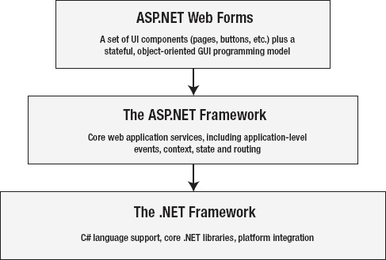
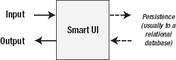
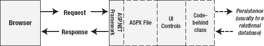

# 十三、将 WebForm 放在上下文中

ASP.NET WebForm 背后的核心思想是使 Web 应用开发尽可能类似于 Windows 应用开发。要理解这一点，我们需要回到过去。

当 ASP.NET 的第一个版本发布时，Visual Basic (VB)风靡一时。网络应用相对较新。在 web Forms 中，微软创建了一个 Web 应用工具包，旨在对程序员隐藏 Web 技术的复杂性(就像 VB 过去对传统应用程序员隐藏 Windows 的许多复杂性一样)。

ASP.NET 网络表单取得了成功——巨大的成功。世界上存在如此多的 WebForm 应用，以至于没有合理的方法来统计它们。就在最近，WebForm 变得不流行了，人们的注意力转向了 MVC 框架，我在这本书的第四部分描述了这个框架。

我是 MVC 框架的忠实粉丝，但是立即抛弃 WebForm 是一个错误。ASP.NET WebForm 有很多可爱之处，有时 WebForm 比 MVC 更好，你会在本章学到这一点。WebForm 确实有一些问题，你也会在本章中了解到。所以，你应该先通读这一章，然后再放弃 WebForm，转向 MVC 章节。

### 了解 WebForm

我必须承认:我对本书第二部分的 ASP.NET 核心特性和本部分的 Web Forms 特性的区分有些武断。ASP.NET 和 WebForm 是一起开发和交付的，它们非常紧密地集成在一起。图 13-1 显示了我是如何画出分界线的。

***图 13-1。**切 ASP.NET 网络表单蛋糕*

ASP.NET 框架建立在。NET 框架来提供 web 应用服务，而 WebForm 构建在 ASP.NET 框架之上，以使 Web 应用开发体验尽可能类似于 Windows 窗体。Windows 窗体是原始版本。NET 技术来构建 Windows 客户端应用，尽管它在最近几年已经被 Windows 演示基金会(WPF)、XAML 和其他新方法所取代(尽管像 WebForm 一样，Windows 窗体继续得到积极的开发和使用，尤其是在公司环境中)。

WebForm 本质上是一组用户界面控件，它们建立在核心 ASP.NET 框架状态和事件功能的基础上，模拟有状态和事件驱动的 Windows 窗体等效功能。(正如您将看到的，有些控件不向用户呈现用户界面元素，但总的来说，重点是在界面上。)如果你做过任何 Windows 窗体开发，当我们在第 14 章中查看 Visual Studio 对 WebForm 的支持时，你会认出关键主题。

#### 网页表单设计理念

Web Forms 试图抽象出支撑 Web 应用的两个关键技术:HTTP 和 HTML。在开发 WebForm 时，这在某种程度上是有意义的，因为这些技术没有被开发人员广泛理解或采用。

HTTP 的问题在于它是无状态的。为了对程序员隐藏这一点，WebForm 控件使用第 6 章中描述的视图状态特性，使用隐藏的 HTML `input`元素将它们的状态推送到网页中。HTML 的问题在于，它是一种标记语言，不太适合开发人员习惯使用的拖放式开发模型。为了解决这个问题，微软创造了设计工具，我们将在第 14 章的[中看到。](14.html#ch14)

这些想法现在看起来很奇怪，但那是因为在过去的几年里我们已经习惯了 HTTP 和 HTML。当时，这一策略似乎是合理的。微软很晚才意识到互联网是一个竞争机会。夺回失去的时间的一个关键策略是通过使编写 web 应用的过程尽可能类似于开发人员已经知道的东西来保护其开发人员的市场份额。NET era VB(一个如此成功的产品，以至于人们*仍然*用它来开发应用，尽管微软在 1998 年发布了最终版本，并在 2005 年停止支持开发工具)。

 **注**微软想要保留的不是旧的 VB *语言*，而是应用开发体验。VB 6 产品背后的力量在于创建 Windows 程序的速度和简单程度。在网络表单中，微软试图将这种体验加入到更现代的。NET 语言，比如 C#。

简而言之，WebForm 背后的设计理念是让可怕的互联网消失。如果你想象微软安抚紧张的开发人员，安慰地重复，“好了，好了，没什么好担心的。你已经具备了你所需要的技能”，那么你就掌握了 WebForm 的起源。

正如您将看到的，这导致了一些问题，但是让我重申这种方法有一些价值。你并不总是*需要*(或者想要)进入 HTTP 和 HTML 来构建 web 应用，对于那些情况，WebForm 很有意义。

#### WebForm 架构

ASP.NET Web Forms 遵循一种被称为*智能用户界面*(智能 UI)的架构模式。一般来说，为了构建智能 UI 应用，开发人员通常通过将一组*组件*或*控件*拖到设计图面或画布上来构建用户界面。控件通过发出按钮按压、击键、鼠标移动等事件来报告与用户的交互。开发人员在一系列*事件处理程序*中添加代码来响应这些事件，这些事件处理程序是在特定组件上的特定事件被发出时调用的小代码块。在这种方法中，我们最终得到了图 13-2 所示的那种模式。

***图 13-2。**智能 UI 架构*

这是许多开发方法使用的基本模式。您的应用接收某种类型的输入(例如，用户单击按钮)，在内部引发一个事件来反映输入，您通过更改应用的内部状态并产生某种输出(例如，更改另一个控件的显示)来做出响应。在这个过程中，您可能会从某种持久化机制(通常是数据库)中读取或写入数据。你可以在[图 13-3](#fig_13_3) 中看到智能用户界面是如何映射到 WebForm 的。

***图 13-3。**用智能 UI 架构模式表达 WebForm*

在这种情况下，输入是来自用户浏览器的请求。请求由 ASP.NET 框架接收，然后传递给一个`.aspx`文件进行处理。这与我们在本书第二部分中使用的`.aspx`文件类型相同，但是标记包含了对 WebForm 控件的引用。

代码隐藏类包含您的编程逻辑。您可以使用一组属性来读取和更改每个控件的状态，并可以响应控件引发的事件。

当我们查看 ASP.NET 框架的核心功能时，您已经看到了每个关键的构建模块。您已经看到了`.aspx`文件是如何工作的，并学习了如何创建代码隐藏类并使用它们来响应反映应用状态变化的事件。正如您将看到的，添加更复杂的控件是这些基本功能的扩展。

### 了解 WebForm 的优势

WebForm 有很多令人喜欢的地方。下面的每一节都描述了这项技术的优势之一。

#### 构建快速，使用简单

WebForm 是创建 web 应用的最快方法之一。只要有一点经验，就可以在几分钟内启动并运行一个简单的 web 应用。

Visual Studio 中的 WebForm 支持非常好(尽管并不完美，我将在第 14 章中解释)，你可以在非常短的时间内从一个概念草图变成一个看起来专业、功能齐全的应用。

#### 容易招到人才

WebForm 是一种应用非常广泛的技术。尽管焦点可能已经转向 MVC 框架，但是大多数 ASP.NET 开发工作都是使用 WebForm 完成的。

微软的一项非正式调查表明，大约 90%的 ASP.NET 开发项目都在使用 WebForm。开发人员的可用性可能是一个关键的技术优势，而且开发人员在 WebForm 方面的经验并不缺乏。此外，WebForm 的简单性意味着一点点天赋就能走很长的路。如果你正在管理一个开发团队，我们应该说，综合能力的开发团队，即使是最弱的开发人员也可以在 WebForm 上有相当的生产力。需要学习的新概念相对较少，与其他形式的拖放式开发的相似性让即使是最抗拒变化的开发人员也感到轻松。

#### 忽略了低级细节

Web Forms 抽象意味着您可以专注于应用开发，而无需过多担心 Web 应用开发的细节。

Web Forms 非常适合开发通过 Web 交付的应用，但是这些应用与底层的 Web 技术没有很深的联系。这包括大多数企业内部网应用，它们公开数据库的某个部分或工作流过程中的某些步骤，并且只是碰巧使用浏览器进行部署。在这些情况下，选择 web 应用是为了使部署更简单、更便宜，而不是因为 web 技术有任何内在优势。

公司，尤其是大公司，努力管理部署和更新的成本和及时性，他们重视 web 应用给他们带来的集中化。如果有一套替代技术以更低的成本提供同样的好处，我们会看到内部网 web 应用的死亡。

#### 积极发展，广泛支持

考虑到 MVC 框架吸引的所有注意力，您可能会得出 WebForm 已死的结论。微软仍在投资 WebForm 技术；它只是不太擅长告诉人们这些。

部分问题在于 Web Forms 是一个带内的。NET 技术，这意味着 WebForm 的发布与。NET 框架。的。NET 框架并不经常改变，这使得 Web Forms 与 MVC 框架相比看起来是一种移动缓慢的技术，MVC 框架是一种*带外*技术。MVC 框架版本是*而不是*绑定到。NET Framework，MVC 团队会更频繁地发布。

 **注意**你是否认为频繁的新发布是积极的，这是一个视角问题。我真的很喜欢 MVC 框架，但是我对漫无目的的发布感到沮丧。很难找到 MVC 框架的方向感，并且当您依赖于外部库时，很难为项目创建技术基线，而外部库会对快速发展的版本产生依赖性。

WebForm 也受到第三方的广泛支持，尤其是在控件领域。一些优秀的控件库是可用的，一个活跃的市场创造了大量的价格点(包括免费的)和许可模型。谷歌一下“网络表单控件”，你就明白我的意思了。

### 了解 WebForm 的弱点

当然，Web Forms 并不是一项完美的技术，当 Web Forms 被应用在不合适的场合时，可能会出现问题。以下部分描述了一些与 WebForm 相关的常见问题。

#### 可维护性差

虽然使用 WebForm 可以很快得到结果，但是如果应用有任何复杂性，也可能会给自己挖一个很深的坑。众所周知，智能 UI 应用很难长期维护，WebForm 应用也不例外。根据我的经验，大多数复杂的 WebForm 项目最终都是大量的代码，其中一个简单的更改就会导致一连串意想不到的行为和错误。

这个问题的根源是 Web Forms 架构鼓励开发人员将处理界面的代码、管理数据的代码和应用应用业务逻辑的代码混合在一起。最终，这些功能开始融合在一起，解开这些紧密编织的关系来影响变化可能会有问题。

这种功能的合并打破了一个被称为*关注点分离*的常见设计原则。关注点分离背后的思想是，通过将应用分成不同的功能区域，并限制它们之间的职责模糊，您可以构建更好的应用。这是 MVC 框架背后设计的关键思想之一，你将在本书的第四部分看到。

在很大程度上，WebForm 应用的关注点分离很差，其结果之一是大型或复杂的 WebForm 应用可能很难维护。当然，情况并不一定是这样，但是创建一个易于扩展和维护的复杂 WebForm 应用需要严肃的纪律和计划——这需要付出很多努力，我很少看到有人这样做。构建 WebForm 应用的冷静和深思熟虑的方法与支撑大多数大型开发项目的紧迫感和分散的责任感不一致。

#### 单元可测试性差

关注点分离不良引起的另一个问题是 WebForm 使得执行单元测试变得困难。单元测试的广泛实践发生在 WebForm 的初始设计之后，智能 UI 技术的紧密集成特性使得孤立地隔离和测试代码单元变得困难。如果单元测试是开发过程的重要部分，你会对 WebForm 感到失望。

#### 带宽-重视图状态

对 WebForm 的一个普遍批评是它需要大量的带宽。这是因为用户界面状态是使用隐藏的`input`元素存储在 HTML 中的。在 ASP.NET 4 中，微软开发团队做了大量工作来改善这种情况。视图状态的整体尺寸减小了，正如你在第 6 章中看到的，你可以禁用单个控件的视图状态。

但是，必须在浏览器和服务器之间传输的视图状态数据量可能很大。这在企业内部网应用中很少出现问题，但在公共互联网上可能会出现问题，在公共互联网上，带宽不是免费的，连接性也各不相同。

#### 不灵活

Web Forms 创建的抽象层非常好，直到你需要超越它或者以它最初不打算使用的方式使用它。如果您想更多地了解 web 应用的 HTTP 和 HTML 方面，Web Forms 不是合适的技术。并不是说您不能访问请求、响应或标记的细节——您可以。但是这很难，Web Forms 有一些非常严格的期望，特别是在从浏览器接收和处理表单数据的方式方面。

#### 开发人员认知度低

MVC 框架确实从 WebForm 上偷走了所有的注意力。这不仅是一种耻辱，而且还会引发一个问题。尽管有很多经验丰富的 WebForm 开发人员，但他们中的许多人都在尝试使用 MVC 框架。

回到令人兴奋的 20 世纪 90 年代末，我曾经靠拯救 skunk works Java 项目谋生。Java 是当时最热门的技术，大多数程序员担心如果他们没有掌握一些 Java 技能，就会被淘汰。非常有能力的 C 程序员，在从事非常适合用 C 语言编写的项目时，会开始使用 Java，通常不告诉任何人。显而易见，关键的应用组件是用 Java 编写的，没有写好，根本没有经过测试。

如果您正在着手一个新的 WebForm 项目，我强烈建议您花时间赢得开发人员和管理人员对该技术的承诺。如果不这样做，您就有可能开始一个 WebForm 项目，并以一种奇怪的混合方式结束。

### 决定何时使用网络表单

软件中没有绝对的对错，只有给定技术在多大程度上适合解决特定类型的问题。我所描述的 WebForm 的优点只有在正确的环境下才是优点，就像 WebForm 在错误的情况下使用才是问题一样。

有一个最佳点，它集合了 WebForm 提供的所有好处，并最小化了缺点。如果您的项目具有以下要求，WebForm 会非常有用:

*   发展速度
*   内部网部署
*   寿命短或对变化的期望低

如果您在这些情况下使用 WebForm，您将从该技术中获得最佳效果。WebForm 的便利性和简单性将被强调，而不灵活和关注点分离的问题将被最小化。

如果您在最佳位置之外使用 WebForm，情况可能会有所不同，很快就会出现一种替代方法，比如 MVC 框架，可能会更有用。(尽管，正如您将在本书后面了解到的，MVC 框架并不是没有自己的问题，也有自己的优点。)

### 总结

本章概述了 Web Forms 存在的背景——一个旨在复制经典 VB 开发人员体验的抽象层，尽管它与 C# 等现代语言有关联。

像任何工具一样，Web Forms 在一些事情上做得很好，而在另一些事情上做得不太好。如果您将 WebForm 用于其预期的项目类型，您可以获得很好的结果。但是如果你试图把它带到它不想去的地方，你会遇到一些严重的问题。

总之，不要轻易放弃 WebForm。它在适当的环境下可以提供很多东西，被广泛使用和支持，并得到微软的大量投资。