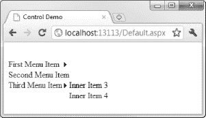
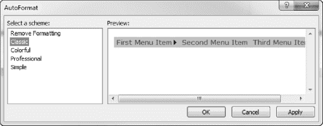
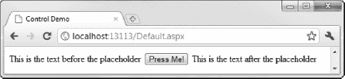

## 15

## 使用 Web 窗体控件

既然您已经看到了用于处理 Web 窗体控件的 Visual Studio 工具，我们将看看控件本身。在这一章中，我们将开始探索哪些控件是可用的，它们是如何工作的，以及它们是如何在浏览器中呈现为 HTML 的。

有很多 Web 窗体控件。事实上，太多了，我无法在一个章节中涵盖所有内容。我们将从最常用的基本控件开始。后面的章节将解释更高级的控制是如何工作的。例如，我们将在第 18 章和第 19 章中讨论数据控件，在第 34 章中讨论 WebForm对身份验证的支持。

当你通读这一章时，你会注意到我对一些 WebForm控件的重视程度比其他的要高。作为一般规则，我有更多的时间和尊重的基本控制(第一套，我描述)。更复杂的控件往往会生成大量的 HTML、JavaScript 和 CSS，并且生成难以阅读和调试的 HTML。公平地说，这些控件是在开发人员通常不希望 T1 读取或调试他们的 HTML 的时候创建的，但是时代已经变了，其中一些控件的输出有点过时了。我对最令人讨厌的控件提出了替代建议，通常涉及几行 jQuery。

### 了解基本的 WebForm控件

基本的 Web 窗体控件是直接对应于常规 HTML 元素的控件。我们在上一章中使用的控件是基本控件的例子。标签控件被呈现给一个`span`元素，文本框和按钮控件被呈现给`input`元素，它们的`type`值分别为`text`和`submit`。

您可以直接使用 HTML 元素，但是 Web 窗体控件的价值在于您可以受益于 Web 窗体属性和事件支持。有了这种支持，您可以使用属性表配置控件，并在用户与控件交互时响应事件。

表 15-1 显示了基本的 WebForm控件和 HTML 元素的列表。

T2】

正如我在前一章提到的，你不需要使用这些控件，但是这样做有一些好处。最明显的是与 Web 窗体设计工具的集成，允许您使用属性表轻松配置控件，并创建和注册事件处理方法。你可以在第 14 章中看到这两种活动的例子。另一个好处是，您可以以编程方式使用这些控件。

 **注意** Web Forms 包含一些用于执行 Ajax 操作的控件。自从这些控件首次被设计和编写以来，Web 编程一直在发展，它们使用起来既麻烦又麻烦。我没有在本章中涉及它们，因为我认为它们不应该再被使用了。鉴于微软已经采用了 jQuery，我推荐你使用在[第 11 章](11.html#ch11)中描述的技术。

#### 以编程方式使用控件

以编程方式使用 Web 窗体控件比直接使用相应的 HTML 元素更自然，即使是最简单的控件，如 Panel。如[表 15-1](#tab_15_1) 所示，面板控件呈现给`div`元素。

为了便于比较，我们将使用 WebForm控件和 HTML 元素来研究相同的编程任务。清单 15-1 包含了`Default.aspx`的内容，我已经将它添加到一个新的、空的 ASP.NET 项目中。

***清单 15-1。**一个简单的 ASPX 页面*

`<%@ Page Language="C#" AutoEventWireup="true" CodeBehind="Default.aspx.cs"
Inherits="WebApp.Default" %>

<!DOCTYPE html PUBLIC "-//W3C//DTD XHTML 1.0 Transitional//EN"
 "http://www.w3.org/TR/xhtml1/DTD/xhtml1-transitional.dtd">

<html >
<head runat="server">
<title>Control Demo</title>
</head>
<body>
<form id="form1" runat="server">

**

**

**<asp:Panel ID="myPanel" runat="server"></asp:Panel>**

</form>
</body>
</html>`

这个简单的页面包含一个名为`myDiv`的`div`元素和一个名为`myPanel`的面板控件。这些将是本例的重点。还有一个叫做`results`的额外的`div`元素，我们将使用它为用户提供一些反馈。清单 15-2 显示了代码隐藏文件`Default.aspx.cs`。

***清单 15-2。**示例网页的代码隐藏文件*

`using System;
using System.Drawing;
using System.Web.UI;
using System.Web.UI.WebControls;

namespace WebApp {
    public partial class Default : System.Web.UI.Page {

        protected void Page_Load(object sender, EventArgs e) {

            Button myDivButton = new Button();
            myDivButton.Text = "Press Me!";
            myDivButton.Click += new EventHandler(myDivButton_Click);

            **myDiv.Controls.Add(myDivButton);**
            **myDiv.Attributes.CssStyle.Add(HtmlTextWriterStyle.BackgroundColor, "Bisque");**

            Button myPanelButton = new Button();
            myPanelButton.Text = "Press Me!";
            myPanelButton.Click += new EventHandler(myPanelButton_Click);

            **myPanel.Controls.Add(myPanelButton);**
            **myPanel.BackColor = Color.Bisque;**
        }

        void myPanelButton_Click(object sender, EventArgs e) {
            results.InnerText = "The panel button was pressed";
        }

        void myDivButton_Click(object sender, EventArgs e) {
            results.InnerText = "The div button was pressed";
        }
    }
}`

我们已经在`div`元素和面板控件上执行了相同的两个任务。我们给它们每个都添加了一个按钮，并设置了背景颜色。您可以看到将按钮添加为子控件的过程是相同的。我们通过`Controls`属性获取子控件的集合，并调用`Add`方法，将按钮作为参数传入。

设置 CSS 属性的过程略有不同。`div`元素由`HtmlGenericControl`类表示，这迫使我们通过向`CssStyle`集合添加新值来设置背景，我们通过`Attributes`集合访问该集合:

`myDiv.Attributes.CssStyle.Add(HtmlTextWriterStyle.BackgroundColor, "Bisque");`

相比之下，Panel 控件有一个直接设置 CSS 属性的属性，如下所示:

`myPanel.BackColor = Color.Bisque;`

我们不需要以字符串的形式提供所需的颜色，也不需要浏览一组属性来设置值。

使用 Web 窗体控件时，当您使用设计图面时，您可以通过编程方式访问 Visual Studio 在“属性”窗口中显示的所有属性。无论你选择哪种技术，你最终都会得到相同的 HTML，如清单 15-3 所示。

***清单 15-3。**从 div 元素和 WebForm面板控件呈现的 HTML】*

`...

<input type="submit" name="ctl02" value="Press Me!" />

<input type="submit" name="ctl03"
 value="Press Me!" />

...`

差别很小，但是 Web 窗体控件以更简洁的方式封装了设置 CSS 属性的过程。这提供了多少价值是个人偏好的问题。

#### 使用基于列表的控件

一些基本控件与管理项目列表有关。一个很好的例子是 BulletedList，它可以用来产生`ul`和`ol`元素。

要演示 BulletedList 控件以及 Web 窗体如何处理列表，请使用空的 ASP.NET 应用程序模板创建一个新项目，添加一个名为`Default.aspx`的页面，并将 BulletedList 控件从工具箱拖到设计图面。由此生成的标记如清单 15-4 中的[所示。](#list_15_4)

***清单 15-4。**Web 窗体 BulletedList 控件的默认标记*

`...
<asp:BulletedList ID="BulletedList1" runat="server">
</asp:BulletedList>
...`

创建了控件之后，我们需要向列表中添加一些项目。我们可以使用设计工具，通过向标记中添加元素，或者以编程方式来实现这一点。

 **注意**bulleted list 控件也支持数据绑定，其中显示在列表中的项目是从数据源(如数据库)获得的。参见[第 18 章](18.html#ch18)和[第 19 章](19.html#ch19)了解在 WebForm控件中使用数据的详细信息。

若要使用设计工具，请单击设计图面中的控件。您将看到一个小箭头出现在控件的右边缘。点击箭头，选择编辑项目，如图[图 15-1](#fig_15_1) 所示。

***图 15-1。**准备向 BulletedList 控件添加项目*

将显示 ListItem 集合编辑器对话框。要添加一个项目到列表中，点击添加按钮，设置`Text`和`Value`属性的值，如图[图 15-2](#fig_15_2) 所示(这些属性可以有相同的值)。

***图 15-2。**向列表添加项目*

重复此过程，直到创建了几个项目，然后单击 OK 按钮关闭对话框。在这个演示中，我创建了四个项目，分别被形象地称为`First Item`、`Second Item`、`Third Item`和`Fourth Item`。[清单 15-5](#list_15_5) 显示了添加条目产生的标记。

***清单 15-5。**添加了项目的 BulletedList 控件的标记*

`<asp:BulletedList ID="BulletedList1" runat="server">
**<asp:ListItem>First Item</asp:ListItem>**
**<asp:ListItem>Second Item</asp:ListItem>**
**<asp:ListItem>Third Item</asp:ListItem>**
**<asp:ListItem>Fourth Item</asp:ListItem>**
</asp:BulletedList>`

作为使用设计工具的替代方法，您可以简单地在源窗口中创建项目。从清单中可以看出，项目是用`asp:ListItem`元素表示的。如果不想让`Text`和`Value`属性相同，可以使用`Value`属性，如下所示:

`<asp:ListItem Value="Second Item Value">Second Item</asp:ListItem>`

添加列表项的最后一个选项是通过编程来完成，如[清单 15-6](#list_15_6) 所示。我已经将这些语句放到了`Page_Load`方法中(在[第 5 章](05.html#ch5)中描述)。

***清单 15-6。**向列表添加项目*

`using System;
using System.Web.UI.WebControls;

namespace WebApp {
    public partial class Default : System.Web.UI.Page {

        protected void Page_Load(object sender, EventArgs e) {

            string[] textValues = {"First Item", "Second Item",
                                      "Third Item", "Fourth Item"};

            foreach (string str in textValues) {
                BulletedList1.Items.Add(new ListItem(str));
            }
        }
    }
}`

现在我们已经创建并填充了列表，您可以看到它是如何呈现的。清单 15-7 显示了由[清单 15-5](#list_15_5) 中的标记呈现的 HTML。

***清单 15-7。**从 BulletedList 控件呈现的 HTML 标记*

`...
<ul id="BulletedList1">
<li>First Item</li>
<li>Second Item</li>
<li>Third Item</li>
<li>Fourth Item</li>
</ul>...`

默认情况下，BulletedList 控件使用`ul`元素呈现为一个无序列表。使用`li`元素将列表中包含的项目呈现为列表项目。你可以使用`BulletStyle`属性改变列表的种类，如[清单 15-8](#list_15_8) 所示。

***清单 15-8。**使用 BulletStyle 属性呈现不同类型的列表*

`<asp:BulletedList ID="BulletedList1" runat="server" BulletStyle="Numbered">`

使用来自`BulletStyle`枚举的值之一来设置`BulletStyle`属性。在[清单 15-8](#list_15_8) 中使用的`Numbered`值使用`ol`元素使列表呈现为有序列表，如[清单 15-9](#list_15_9) 所示。

***清单 15-9。**渲染一个 BulletedList 到一个 HTML 有序列表*

`...
<ol id="BulletedList1" style="list-style-type:decimal;">
<li>First Item</li>
<li>Second Item</li>
<li>Third Item</li>
<li>Fourth Item</li>
</ol>
...`

`BulletStyle`枚举中的其他值允许您指定用于列表项的项目符号。[表 15-2](#tab_15_2) 描述了最常用的`BulletStyle`值，包括它们所呈现的 HTML 列表的类型。

BulletedList 是一个单独的控件，可用于呈现不同的 HTML 元素。这个主题的一个变体来自 ListBox 和 DropDownList 控件，它们是不同的控件，呈现给*同一个* HTML 元素，只有微小的配置更改。[清单 15-10](#list_15_10) 显示了使用这两个控件的标记。

***清单 15-10。**使用 WebForm ListBox 和 DropDownList 控件*

`...
<asp:ListBox ID="ListBox1" runat="server">
<asp:ListItem>First Item</asp:ListItem>
<asp:ListItem>Second Item</asp:ListItem>
<asp:ListItem>Third Item</asp:ListItem>
</asp:ListBox>` `<asp:DropDownList ID="DropDownList1" runat="server">
<asp:ListItem>First Item</asp:ListItem>
<asp:ListItem>Second Item</asp:ListItem>
<asp:ListItem>Third Item</asp:ListItem>
</asp:DropDownList>
...`

两个控件都使用`asp:ListItem`元素来定义它们包含的项目。正如您在 BulletedList 控件中看到的那样，这也是 Web 窗体控件一贯使用的模式。当我们渲染控件时，我们得到了清单 15-11 中的 HTML。

***清单 15-11。**由 ListBox 控件和 DropDownList 控件呈现的 HTML】*

`...
<select **size="4"** name="ListBox1" id="ListBox1"><option value="First Item">First Item</option>
<option value="Second Item">Second Item</option>
<option value="Third Item">Third Item</option>
</select>
<select name="DropDownList1" id="DropDownList1"><option value="First Item">First Item</option>
<option value="Second Item">Second Item</option><option value="Third Item">Third Item</option>
</select>
...`

HTML 中的差异很小——只有一个属性，我用粗体突出显示了它。视觉差异是惊人的，如图 15-3 所示。列表框在左边。

***图 15-3。**浏览器显示的列表框和下拉框*

让两个控件做本质上相同的事情似乎很奇怪。区别在于 HTML 元素和控件支持的属性之间的映射。DropDownList 控件允许程序员使用`SelectedIndex`方法确定选择了哪个列表项。ListBox 控件生成一个允许多重选择的`select`元素。要确定 ListBox 控件中的选择，您需要枚举通过`Items`属性可用的`ListItem`对象，并检查每个对象的`Selected`属性。

#### 使用产生 JavaScript 的控件

一些 Web 窗体控件在呈现时会向页面添加 JavaScript。一组基本控件中的一个很好的例子是 LinkButton，它在呈现时使用 anchor ( `a`)元素和一些 JavaScript 生成一个超链接。

JavaScript 是必需的，因为 LinkButton 控件产生一个链接，该链接导致 HTML `form`被发布，这是常规链接所不具备的。清单 15-12 显示了一个简单的 LinkButton 的标记。

***清单 15-12。**网页表单链接按钮的标记*

`<asp:LinkButton ID="LinkButton1" runat="server">Press Me</asp:LinkButton>`

清单 15-13 显示了当一个 LinkButton 被呈现时产生的脚本和 HTML 元素。

***清单 15-13。**由 LinkButton 控件呈现的 HTML 和 JavaScript】*

`...
...
<a id="LinkButton1" href="javascript:__doPostBack('LinkButton1','')">Press Me</a>
...`

锚元素的`href`属性被设置为当用户单击链接时调用脚本的`__doPostBack`函数。这个函数发布表单。LinkButton 控件支持的属性允许您配置窗体的发布位置。默认情况下，它会回发到该页面所在的 URL。

使用 JavaScript 时，有两个潜在的问题需要注意:

*   如果用户禁用了 JavaScript，这些控件将无法正常运行。例如，如果没有启用 JavaScript，LinkButton 就不会发送表单。超链接被呈现，用户可以单击它，但是表单永远不会被发布。
*   当在同一页面上使用额外的 JavaScript 时，必须注意确保添加的脚本不会与 Web 窗体控件生成的脚本冲突。当附加脚本与 Web 窗体控件脚本绑定到相同的事件时，通常会出现问题，这会导致重复的操作或不一致的结果。

当我们查看一些专门的 WebForm控件时，您将看到 JavaScript 的更多使用。

#### 了解何时触发控制事件

在上一章中，您看到了如何使用设计工具创建处理控件事件的方法，以及这些工具如何在标记中将方法与控件注册在一起。

如果您习惯于在使用 Windows 窗体或 WPF 编写的 Windows 应用程序中处理事件，Web 窗体事件可能会令人困惑。问题是事件何时被触发。[清单 15-14](#list_15_14) 显示了一个包含文本框控件的页面的标记。该控件定义了`TextChanged`事件，当文本框中的文本改变时，该事件被调用。

***清单 15-14。**一个包含 WebForm文本框控件的简单页面*

`<body>
<form id="form1" runat="server">

**<asp:TextBox ID="TextBox1" runat="server"**
        **ontextchanged="TextBox1_TextChanged">Original Text</asp:TextBox>**

<asp:Button ID="Button1" runat="server" Text="Submit" />

</form>
</body>`

在这里，我为`TextChanged`事件注册了一个事件处理方法，如[清单 15-15](#list_15_15) 所示。

***清单 15-15。**一个文本框的处理程序。文本更改事件*

`using System;

namespace WebApp {
    public partial class Default : System.Web.UI.Page {

        protected void TextBox1_TextChanged(object sender, EventArgs e) {
            result.InnerText = "Event was triggered - text has changed";
        }
    }
}`

当`TextChanged`事件被触发时，处理程序方法改变包含在具有`ID`结果的`div`元素中的文本。[图 15-4](#fig_15_4) 显示了浏览器如何显示应用程序。

***图 15-4。**浏览器显示的应用示例*

如果我使用 WebForm或 WPF，我希望每次文本框中的文本发生变化时都会触发`TextChanged`事件。但是，当然，这是一个 web 应用程序，事件处理代码是在 ASP.NET 服务器上执行的。这种模型与常规的 Windows 应用程序完全不同，这意味着在表单提交给服务器之前，不会触发事件。

 **注意**如果用户执行了触发多个事件的动作，而您已经为这些事件注册了处理程序，那么在下一次提交表单时，您的方法将被快速连续地调用。你不需要担心确保你的方法是线程安全的。ASP.NET 框架确保方法被顺序调用。您不能对调用方法的相对顺序做任何假设。

您可以使用`AutoPostBack`属性改变 WebForm控件的行为。当该属性为`true`时，控件向呈现的页面添加 JavaScript，当用户与控件交互时，该页面将表单发送回服务器。[清单 15-16](#list_15_16) 显示了标记的变化。

***清单 15-16。**对文本框控件使用 AutoPostBack 属性*

`<body>
<form id="form1" runat="server">

<asp:TextBox ID="TextBox1" runat="server"
        ontextchanged="TextBox1_TextChanged" **AutoPostBack="True**">Original Text</asp:TextBox>

<asp:Button ID="Button1" runat="server" Text="Submit" />

</form>
</body>`

下面是 TextBox 控件上的`AutoPostBack`属性设置为`true`时呈现的 HTML:

`...
<input name="TextBox1" type="text" value="Original Text2"
onchange="javascript:setTimeout('__doPostBack('TextBox1','')', 0)"
onkeypress="if (**WebForm_TextBoxKeyHandler(event)** == false) return false;"
id="TextBox1" />
...`

您可以看到已经为`change`和`keypress`事件添加了 JavaScript 处理程序。当用户按回车键或离开`input`元素时(通过使用 Tab 键或单击另一个元素)，表单将被发送到服务器。然后，服务器将调用处理程序方法。

我用粗体标记了对`WebForm_TextBoxKeyHandler`函数的调用。`AutoPostBack`属性不仅将 JavaScript 添加到 HTML 元素中，还定义了对一些支持函数的引用，如下所示:

``

`WebResource.axd`是一种机制，允许通过 ASP.NET 服务器请求包含在. NET 程序集中的资源。这与我们没有直接关系，只是注意到服务器返回了相当数量的 JavaScript 代码。

应该谨慎使用`AutoPostBack`属性。当控件的状态改变时，整个窗体被回发到服务器。如果您创建的页面包含多个依赖于`AutoPostBack`的元素，那么浏览器将会多次返回服务器。这不仅会增加服务器的负载，还会让用户非常沮丧。

在考虑使用`AutoPostBack`的时候，想想使用 jQuery 是否可以更优雅地解决问题。如果目标是验证用户输入的数据，那么 jQuery 验证库是值得考虑的。详情和例子见第 10 章。为了重现示例中使用`AutoPostBack`的效果，您可以使用一个简单的 jQuery 脚本，如[清单 15-17](#list_15_17) 中所示。

***清单 15-17。**用 jQuery 脚本替换 AutoPostBack】*

``

除了响应速度更快和减少服务器负载之外，使用这样的 jQuery 脚本将脚本与 HTML 分开，这使得页面更易于阅读和维护。

#### 了解泡沫事件

一种特殊的事件，称为*气泡事件*，通过页面中的控件层次结构向上传播，直到其中一个控件(或页面本身)处理该事件。

Bubble 事件最常见于 Button 控件及其近亲 ImageButton 和 LinkButton。这些实现了`IButtonCommand`接口，它允许父控件接收从子控件弹出的*命令事件*，而不需要向单独的控件实例注册事件。一个例子有助于说明这种行为。[清单 15-18](#list_15_18) 显示了名为`Bubble.aspx`的页面上的三个按钮。

***清单 15-18。**使用按钮命令功能来冒泡事件*

`<%@ Page Language="C#" AutoEventWireup="true" CodeBehind="Bubble.aspx.cs"
Inherits="WebApp.Bubble" %>

<!DOCTYPE html PUBLIC "-//W3C//DTD XHTML 1.0 Transitional//EN"
 "http://www.w3.org/TR/xhtml1/DTD/xhtml1-transitional.dtd">` `<html >
<head runat="server">
<title></title>
</head>
<body>
<form id="form1" runat="server">

<asp:Button ID="Button1" runat="server" Text="Button 1"
            CommandName="MyCommand" CommandArgument="MyCommandArg"/>
<asp:Button ID="Button2" runat="server" Text="Button 2"
            CommandName="MyCommand" CommandArgument="MyCommandArg"/>
<asp:Button ID="Button3" runat="server" Text="Button 3"
            CommandName="MyCommand" CommandArgument="MyOtherCommandArg"/>

<asp:Label ID="Label1" runat="server" Text=""></asp:Label>

</form>
</body>
</html>`

对于每个按钮，我们已经为`CommandName`和`CommandArgument`属性设置了值。当单击这些按钮时，它们会发出一个气泡事件，ASP.NET 将该事件传递给页面层次结构中的下一个最高控件。该控件可以处理该事件，但如果它没有处理，则该事件将被传递给下一个最高级别的控件，这将一直持续到该事件被处理或该事件冒泡到页面本身为止。

在这个例子中，我们没有创建一个控件层次结构，所以事件直接出现在页面上。您可以看到如何在代码隐藏类中处理事件，如清单 15-19 所示。

***清单 15-19。**处理泡沫事件*

`using System;
using System.Web.UI.WebControls;

namespace WebApp {
    public partial class Bubble : System.Web.UI.Page {
        protected void Page_Load(object sender, EventArgs e) {

        }

        protected override bool OnBubbleEvent(object source, EventArgs args) {
            if (args is CommandEventArgs) {
                CommandEventArgs ce = (CommandEventArgs)args;

                Label1.Text = String.Format("Command Name: {0}, Command Argument: {1}",
                    ce.CommandName, ce.CommandArgument);

                return true;
            }` `            return false;
        }
    }
}`

我们覆盖`OnBubbleEvent`方法来处理气泡事件，并测试该方法接收的`EventArgs`参数的类型，以检查`CommandEventArgs`对象。这提示我们，我们正在处理的气泡事件是来自其中一个按钮的命令事件。我们分配给`CommandName`和`CommandArgument`属性的值在`CommandEventArgs`类中作为同名属性提供。通过读取这些值，我们可以确定 web 应用程序应该执行哪个操作来响应按钮被按下。当实现`OnBubbleEvent`方法时，如果我们已经处理了该方法，并且它不应该再冒泡，我们就返回`true`；否则，我们返回`false`。

注意，我们接收这些事件不需要直接向按钮控件注册，并且多个按钮的`CommandName`和`CommandArgument`属性可以有相同的值。这很有用，因为它允许我们在用户界面的不同部分拥有执行相同操作的控件。

按钮命令和气泡事件最常与数据控件一起使用，这在第 19 章中有所描述。

### 使用导航控件

工具箱的一个部分叫做导航。它包含一组三个控件，可用于帮助用户在应用程序中导航。在本节中，我们将了解如何使用这些控件。

#### 使用菜单控制

Menu 控件用于创建 JavaScript 支持的菜单。清单 15-20 显示了如何在标记中使用这个控件。

***清单 15-20。**使用 Web 窗体菜单控件*

`...
<asp:Menu ID="Menu1" runat="server" onmenuitemclick="Menu1_MenuItemClick">
<Items>
<asp:MenuItem Text="First Menu Item">
<asp:MenuItem Text="Inner Item 1" />
<asp:MenuItem Text="Inner Item 2" />
</asp:MenuItem>

<asp:MenuItem Text="Second Menu Item"/>` `<asp:MenuItem Text="Third Menu Item">
<asp:MenuItem Text="Inner Item 3" Enabled="false"/>
<asp:MenuItem Text="Inner Item 4" />
</asp:MenuItem>
</Items>
</asp:Menu>
...`

菜单控件需要一个嵌套的`Items`元素，我们向其中添加一个或多个 MenuItem 控件。属性设置将用于菜单项的标签，每个 menu item 控件本身可以包含更多的 MenuItem 控件来创建嵌套菜单。可以启用或禁用单个菜单项。例如，在清单中，`Inner Item 3`的`Enabled`属性被设置为`false`。

菜单控件定义了`MenuItemClick`事件，当用户点击菜单项时触发该事件。为了触发事件，整个表单被回发到服务器。[清单 15-21](#list_15_21) 显示了一个`MenuItemClick`事件处理程序方法的简单实现。

***清单 15-21。**处理菜单。MenuItemClick 事件*

`using System;
using System.Web.UI.WebControls;

namespace WebApp {
    public partial class Default : System.Web.UI.Page {

        protected void Menu1_MenuItemClick(object sender, MenuEventArgs e) {
            results.InnerText = "Selected Menu Item: " + e.Item.Text;
        }
    }
}`

我们可以使用作为参数传递给我们的 handler 方法的`MenuEventArgs`对象的`Item`属性来确定用户选择了哪个`MenuItem`控件。在清单中，我们设置了一个`div`元素的内容来显示哪个项目被选中了。[图 15-5](#fig_15_5) 显示了菜单是如何在浏览器中呈现的。

***图 15-5。**菜单控件的默认渲染*

我们可以通过将`Orientation`属性设置为`Horizontal`来改变菜单项的显示方向。你可以在图 15-6 的[中看到它的效果。](#fig_15_6)

***图 15-6。**渲染一个横向菜单*

默认情况下，菜单控件的呈现方式非常原始，不适合大多数项目。幸运的是，有许多格式化选项可用，我们将在这里回顾格式化的基础。

应用样式最简单的方法是在设计图面上选择控件，单击右边出现的箭头，从弹出菜单中选择自动格式化，如图[图 15-7](#fig_15_7) 所示。

***图 15-7。**为菜单控件选择自动格式功能*

自动套用格式窗口将会打开，允许您从一组预定义的样式中进行选择，如图[图 15-8](#fig_15_8) 所示。选择每个项目时，会显示样式的预览。在图中，我选择了经典风格。单击“确定”应用样式并关闭窗口。

***图 15-8。**使用自动套用格式选择预定义的样式*

选择一个样式会导致菜单控件在发送到浏览器的 HTML 中呈现一些 CSS 样式。你可以在清单 15-22 中看到这些样式。这些样式的效果如图[图 15-9](#fig_15_9) 所示。

***清单 15-22。**自动套用菜单控件生成的 CSS 样式*

`` 

***图 15-9。**浏览器中显示的菜单控件的样式效果*

如果要创建自定义样式，可以使用菜单控件支持的大量属性来实现。您可以在属性表的布局部分看到这些。控制区分*静态*和*动态*菜单项，如下:

*   静态菜单项是那些总是显示的菜单项(通常是 MenuItem 控件的顶级。
*   动态项目是使用 JavaScript 弹出的项目。

如果你喜欢自己处理样式，你可以使用默认的渲染并定义清单 15-20 中显示的样式。或者您可以使用包含在菜单控件呈现的 HTML 中的方便的 CSS 类。

我没有向您展示生成的 HTML，因为它相当混乱，但一个很好的特性是，您可以使用类来定位菜单中的元素。每一级菜单被分配一个`level*X*`类，其中 *`X`* 是嵌套的级别。顶层菜单项被分配给`level1`，第一组嵌套项是`level2`，以此类推。你甚至可以改变每一个等级的等级。详情见 MSDN。

#### 使用树形视图控件

TreeView 控件使用 JavaScript 和 HTML `table`元素来重新创建 Windows 风格的树视图。清单 15-23 展示了如何使用这个控件。

***清单 15-23。**使用 Windows 窗体的树形视图控件*

`...
<asp:TreeView ID="TreeView1" runat="server"
ShowCheckBoxes="All"
    ShowLines="True">
<Nodes>
<asp:TreeNode Text="First Item" Value="First Item">
<asp:TreeNode Text="Child Node 1" Value="Child Node 1"></asp:TreeNode>
<asp:TreeNode Text="Child Node 2" Value="Child Node 2"></asp:TreeNode>
</asp:TreeNode>
<asp:TreeNode Checked="True" Text="Second Item" Value="Second Item" />
<asp:TreeNode Checked="True" Text="Third Item" Value="Third Item">
<asp:TreeNode Text="Child Node 1" Value="Child Node 3"></asp:TreeNode>` `<asp:TreeNode Text="Child Node 2" Value="Child Node 4"></asp:TreeNode>
</asp:TreeNode>
</Nodes>
</asp:TreeView>
...`

为了构建树的结构，我们添加了一个`Nodes`元素并用 TreeNode 控件填充它，这些控件可以嵌套以创建额外的深度。图 15-10 显示了这个控件是如何在浏览器中呈现的。

***图 15-10。**将树形视图控件渲染成 HTML*

TreeView 是另一个有很多配置选项的控件。最有用的选项在[表 15-3](#tab_15_3) 中描述。

`EnableClientScript`属性的名称具有误导性。TreeView 控件总是要求在客户端启用 JavaScript。不同的是，当`EnableClientScript`为`true`时，树中节点的打开和关闭都在客户端处理。当`EnableClientScript`为`false`时，同样的操作会将整个表单发送回服务器。通过将不同的 HTML 呈现回客户端来处理布局中的更改。由于无法在禁用 JavaScript 的浏览器上使用 TreeView 控件，我建议您将`EnableClientScript`设置为`true`，以减少浏览器必须向服务器发出的请求数量。

 **提示**负责我们在[第 10 章](10.html#ch10)中使用的优秀 jQuery 验证库的同一个开发人员已经开发了一个创建树形视图的 jQuery 插件。你可以在`[http://plugins.jquery.com/project/treeview](http://plugins.jquery.com/project/treeview)`获得进一步的细节。

树形视图控件定义了[表 15-4](#tab_15_4) 中描述的一组事件。

为这些事件创建处理程序会改变 TreeView 控件的操作方式。当没有注册处理程序方法并且`EnableClientScript`属性为`true`时，TreeView 控件试图在客户端处理它的一些操作。例如，打开和关闭节点是使用 JavaScript 完成的，不调用服务器。

处理事件时，每次用户与 TreeView 控件交互时，该控件都会回调服务器，并在回调时发送整个窗体。例外情况是当用户选中或取消选中一个节点时，这不会导致事件被触发，直到表单被其他事件或控件下一次回发。

老实说，有点乱。如果您不需要事件，TreeView 控件非常有用，但是如果事件很重要，我建议您使用 jQuery 替代品(可从`[http://plugins.jquery.com/project/treeview](http://plugins.jquery.com/project/treeview)`获得)。

#### 使用站点地图

站点地图是一种有用的方式，可以让用户了解他们在应用程序结构中的位置。要定义站点地图，您的项目需要一个表示页面结构的文件。您可以使用 Visual Studio 站点地图模板添加此文件。该文件的默认名称是`Web.sitemap`。[清单 15-24](#list_15_24) 显示了一个简单的`Web.sitemap`文件。

***清单 15-24。**一个简单的 Web.sitemap 文件*

`<?xml version="1.0" encoding="utf-8" ?>
<siteMap >
<siteMapNode url="~/Main.aspx" title="Triathlon">
<siteMapNode url="~/Data.aspx" title="Race Data">
<siteMapNode url="~/Default.aspx" title="Lastest Data"  description="" />
</siteMapNode>
<siteMapNode url="~/People.aspx" title="Athletes">
<siteMapNode url="~/Adam.aspx" title="Adam Freeman"  description="" />
<siteMapNode url="~/Joe.aspx" title="Joe Smith"  description="" />
</siteMapNode>
</siteMapNode>
</siteMap>`

我们使用`siteMap`元素创建一个`.aspx`页面的层次结构，这样`Default.aspx`页面就是`Data.aspx`的子页面，而`Data.aspx`又是`Main.aspx`的子页面。使用站点地图文件时，您所表达的页面之间的关系不同于页面在磁盘上的组织方式。这是你希望你的用户如何看待你的应用程序，而不是你的应用程序是如何构建的。

##### 使用 SiteMapPath 控件

为了给用户一个上下文的感觉，我们使用 Web Forms SiteMapPath 控件，如清单 15-25 所示。

***清单 15-25。**使用 SiteMapPath 控件*

`...
<body>
<form id="form1" runat="server">
<asp:SiteMapPath ID="SiteMapPath1" runat="server">
</asp:SiteMapPath>
</form>
</body>
...`

该控件呈现为一系列超链接，如图[图 15-11](#fig_15_11) 所示。

***图 15-11。**SiteMapPath 控件的默认外观*

每个链接都将用户带到在`Web.sitemap`文件中描述的层次结构中的上一级页面。这不仅能让用户知道应用程序中的位置，还能给他们一个简单的导航机制。

 **注意**站点地图会显示不存在的页面链接。例如，如果您下载本章附带的源代码，您会发现只有`Default.aspx`页面存在。对于一个简单的例子来说，这很好，但是对于一个实际的应用程序来说，确保站点地图中引用的所有页面都存在是非常重要的。否则，当用户点击导航链接时，会出现一个`404 – Not Found`错误。

与本节中介绍的其他控件一样，默认呈现并不特别吸引人，但是如果您希望使用 jQuery 应用样式，它会非常有用。如果没有，您可以使用自动套用格式功能(其工作方式类似于菜单控件的功能)来配置外观。如本章前面所述)或通过在属性表上设置属性的样式组的值。

##### 使用其他控件显示站点地图

您也可以使用其他导航控件来显示站点地图。这些依赖于 WebForm数据绑定特性，这将在第 18 章和第 19 章中讨论。清单 15-26 展示了如何使用一个菜单控件和一个树形视图控件，通过设置`DataSourceID`属性的值来显示站点地图。

***清单 15-26。**使用菜单和树形视图显示站点地图*

`<body>
<form id="form1" runat="server">

**<asp:SiteMapDataSource ID="SiteMapDataSource1" Runat="server" />**

<asp:TreeView ID="TreeView1" runat="server" **DataSourceID="SiteMapDataSource1"**/>

<asp:Menu ID="Menu1" runat="server" **DataSourceID="SiteMapDataSource1"**
        Orientation="Horizontal"/>

</form>
</body>
...`

为了使用这个特性，我们需要向页面添加一个`SiteMapDataSource`元素，如清单中粗体所示。目前不要担心这有什么用。我们将在第 18 章中回到数据来源的话题。目前，您可以简单地将这一行复制到标记中。

要让树形视图或菜单控件显示站点地图，可以将`SiteMapDataSource`元素的`DataSourceID`属性设置为`ID`值。在这个例子中，`ID`就是`SiteMapDataSource1`。你可以在[图 15-12](#fig_15_12) 中看到站点地图是如何显示的。

***图 15-12。**通过树形视图和菜单控件显示的网站地图*

这些控件的一个非常简洁的特性与身份验证有关。在第 34 章中，我将向你展示如何要求你的用户向你的应用程序表明自己的身份，以及如何根据身份限制对页面的访问。当在 TreeView 或 Menu 控件中显示站点地图时，需要考虑这些限制，这意味着用户只能看到他们有权访问的站点地图部分。这是一个小而巧妙的特性，突出了 WebForm和底层 ASP.NET 平台之间的集成。

### 使用其他 WebForm控件

除了基本控件和导航控件之外，Web 窗体还包括一些有趣但使用不太广泛的控件。以下各节简要概述了其中的每一项。

 **注意**你会很快意识到我不喜欢其中的一些控制。他们制作的 HTML 不够优雅，而且严重依赖内联脚本。如果您想在整个应用程序中使用 Web 窗体，那么这些控件会很有用。但是我相信，对于这些控件，有更简单、更优雅的方法可用，只要您愿意在 WebForm抽象中找出漏洞，并使用 jQuery 之类的工具。

#### 使用日历控件

Calendar 控件提供了一种允许用户选择日期的机制。您可以使用控件的属性来设置显示的初始日期，并将样式应用于呈现的 HTML 的各个方面。你可以在图 15-13 的[中看到一个日历控件的例子。](#fig_15_13)

***图 15-13。**浏览器中显示的日历控件*

我不喜欢这种控制。它生成的 HTML 和 JavaScript 非常可怕——大量的内联样式和事件处理程序使得读取和调试 HTML 变得不可能。我强烈建议您使用 jQuery UI 日历。它有更多的特性，更优雅，并且让你的 HTML 可读性更好。详情和示例见[第 10 章](10.html#ch10)。

#### 使用占位符控件

占位符控件很奇怪，因为它不呈现任何 HTML。该控件的存在使得您可以在页面中的特定位置实际添加其他控件。清单 15-27 显示了声明为标记的占位符控件。

***清单 15-27。**使用 WebForm占位符控件*

`...
<body>
<form id="form1" runat="server">
    This is the text before the placeholder
**<asp:PlaceHolder ID="PlaceHolder1" runat="server"></asp:PlaceHolder>**
    This is the text after the placeholder
</form>
</body>
</html>
...`

您会看到占位符控件被一些文字文本包围。清单 15-28 展示了我们如何在代码隐藏类的`Page_Load`方法中使用这个控件。

***清单 15-28。**使用占位符控件以编程方式添加控件*

`using System;
using System.Web.UI.WebControls;

namespace WebApp {
    public partial class Default : System.Web.UI.Page {

        public void Page_Load() {

            Button myButton = new Button();
            myButton.Text = "Press Me!";

            **PlaceHolder1.Controls.Add(myButton);**
        }
    }
}`

当页面呈现时，我们向占位符控件添加一个新的按钮控件，产生如图 15-14 所示的输出。

***图 15-14。**使用占位符控件*

我们可以使用常规的 HTML 元素比如`div`达到同样的效果，但是这是一个更整洁的方法，因为占位符控件本身并不生成任何 HTML。如果您选择不向占位符添加任何控件，则不会向页面添加任何内容。如果你使用了一个`div`元素，但没有添加任何控件，那么你会得到一个空的`div`元素。

你对这个特性的重视程度取决于你对 HTML 的控制程度。我喜欢大量的控制，你可能已经猜到了。

#### 使用向导控件

Wizard 控件用于创建 Windows 样式的向导，这些向导通过一系列步骤引导用户完成一个过程，例如，这种向导通常用于安装 Windows 应用程序。清单 15-29 显示了一个简单的三步向导的标记。

***清单 15-29。**使用 WebForm向导控件*

`...
<body>
<form id="form1" runat="server">

**<asp:Wizard ID="Wizard1" runat="server" ActiveStepIndex="0">**
**<WizardSteps>**
**<asp:WizardStep ID="WizardStep1" runat="server" Title="Step 1">**
**<asp:Label ID="Label1" runat="server" Text="First Name:"></asp:Label>**
**<asp:TextBox ID="TextBox1" runat="server"></asp:TextBox>**
**</asp:WizardStep>**
**<asp:WizardStep ID="WizardStep2" runat="server" Title="Step 2">**
**<asp:Label ID="Label2" runat="server" Text="Surname:"></asp:Label>**
**<asp:TextBox ID="TextBox2" runat="server"></asp:TextBox>**
**</asp:WizardStep>**
**<asp:WizardStep ID="WizardStep3" runat="server" Title="Step 3">**
**<asp:Label ID="Label3" runat="server" Text="Email Address:"></asp:Label>**
**<asp:TextBox ID="TextBox3" runat="server"></asp:TextBox>**
**</asp:WizardStep>**
**</WizardSteps>**
**</asp:Wizard>**

</form>
</body>
...`

使用`WizardStep`元素定义每个步骤。这些步骤包含您希望在流程的每个阶段显示的控件。在这个简单的例子中，我们向用户询问他们的名字、姓氏和电子邮件地址。你可以在[图 15-15](#fig_15_15) 中看到一步一步的进展。Wizard 控件对样式有广泛的支持，我已经对图中所示的控件应用了一些基本样式。

***图 15-15。**使用向导控制*

这是另一个我不喜欢使用的 Web 窗体控件。它生成了大量几乎不可读的 HTML、CSS 和脚本。我更喜欢使用 jQuery FormToWizard 插件，它有许多不错的特性，并且可以很好地与 jQuery 的其他部分集成。在`[http://www.jankoatwarpspeed.com/post/2009/09/28/webform-wizard-jquery.aspx](http://www.jankoatwarpspeed.com/post/2009/09/28/webform-wizard-jquery.aspx)`可以看到演示，拿到插件。

#### 使用多视图控件

MultiView 控件允许您使用`View`元素组装不同的控件集合，并向用户显示其中的任何一个。这通常是以编程方式完成的，以便根据用户的一些输入有选择地显示部分用户界面。清单 15-30 显示了一个简单的多视图控件的标记。

***清单 15-30。**使用 Windows 窗体多视图控件*

`...
<body>
<form id="form1" runat="server">

<asp:Button ID="Button1" runat="server" Text="Cycle" onclick="Button1_Click" />

**<asp:MultiView ID="MultiView1" runat="server">**
**<asp:View ID="View1" runat="server">**
**<asp:Label ID="Label1" runat="server" Text="First Name:"></asp:Label>**
**<asp:TextBox ID="TextBox1" runat="server"></asp:TextBox>**
**</asp:View>**
**<asp:View ID="View2" runat="server">**
**<asp:Label ID="Label2" runat="server" Text="Surname:"></asp:Label>**
**<asp:TextBox ID="TextBox2" runat="server"></asp:TextBox>**` `**</asp:View>**
**<asp:View ID="View3" runat="server">**
**<asp:Label ID="Label3" runat="server" Text="Email Address:"></asp:Label>**
**<asp:TextBox ID="TextBox3" runat="server"></asp:TextBox>**
**</asp:View>**
**</asp:MultiView>**

</form>
</body>
...`

多视图控件显示的视图是使用`ActiveViewIndex`属性控制的。默认值为`-` 1，意味着*不显示任何*视图。你会注意到清单 15-30 中的[包含了一个按钮控件。`Click`事件的处理程序在可用的视图中循环。你可以在清单 15-31](#list_15_30) 中看到这个方法的代码。

***清单 15-31。**为多视图控件设置活动视图*

`using System;
using System.Web.UI.WebControls;

namespace WebApp {
    public partial class Default : System.Web.UI.Page {

        protected void Button1_Click(object sender, EventArgs e) {
            **MultiView1.ActiveViewIndex = (MultiView1.ActiveViewIndex + 1) % 3;**
        }
    }
}`

这段代码只是在视图中循环，但是您可以根据任何标准选择视图。[图 15-16](#fig_15_16) 显示了例子中点击按钮的效果。

***图 15-16。**循环浏览多视图*

为了改变显示的视图，多视图控件需要将表单发送到服务器。这有时会很有用，这取决于您的视图包含的内容。对于一个简单的场景，比如我们的例子，我们可以用一点 jQuery 达到同样的效果，如清单 15-32 所示。

***清单 15-32。**使用 jQuery 替换多视图控件*

`<%@ Page Language="C#" AutoEventWireup="true" CodeBehind="jQueryView.aspx.cs" Inherits="WebApp.jQueryView" %>

<!DOCTYPE html PUBLIC "-//W3C//DTD XHTML 1.0 Transitional//EN" "http://www.w3.org/TR/xhtml1/DTD/xhtml1-transitional.dtd">

<html >
<head runat="server">
<title></title>

</head>
<body>
<form id="form1" runat="server">

<input id="cycleButton" type="submit" value="Cycle" />

<asp:Label ID="Label1" runat="server" Text="First Name:"></asp:Label>
<asp:TextBox ID="TextBox1" runat="server"></asp:TextBox>

<asp:Label ID="Label2" runat="server" Text="Surname:"></asp:Label>
<asp:TextBox ID="TextBox2" runat="server"></asp:TextBox>

<asp:Label ID="Label3" runat="server" Text="Email Address:"></asp:Label>
<asp:TextBox ID="TextBox3" runat="server"></asp:TextBox>

` `</form>
</body>
</html>`

清单中的脚本保留了最初不显示任何控件的行为。它通过创建一个不匹配页面中任何元素的选择器(`#View0`)来实现这一点。

### 总结

本章为您介绍了核心 Web 窗体控件。您已经看到了它们是如何工作的，以及它们是如何被转换成 HTML 的。

基本的 Web 窗体控件是我最常用的。它们提供了对设计工具和控件事件的支持，而不需要生成大量的 JavaScript 和内联样式。一些控制在这个范围的另一端；例如，我很少使用日历或向导控件。

在下一章中，我们将看看定制控件的选项，以获得你想要的行为。这提供了 Web 控件工具和事件*和*的所有好处，让您对生成的 HTML 有更多的控制。