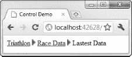
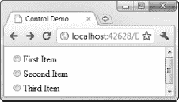

# 十六、自定义 WebForm控件

尽管 WebForm包含一组全面的内置控件，但有时它们并不是您想要的。有时，它们不会生成您正在寻找的 HTML，而其他时候根本不会有适合您需求的控件。本章介绍了四种不同的自定义 WebForm控件的技术。

### 创建用户控件

我们要看的第一种定制是*用户控件*，它就像可以在不同页面中重用的标记模板。相比之下，你在前一章看到的控件都是*服务器控件*。随着我们的深入，这些控制类型之间的差异将变得显而易见。在本章的后面，我将向你展示如何定制服务器控件和创建新的控件。

当您有一个要在整个 web 应用中使用的标记块时，用户控件会很有帮助，例如收集用户名和电子邮件地址的一组标签和文本框。您可以创建一个用户控件，而不是多次重新创建所需的标记。

为了演示用户控件是如何工作的，我们将创建一个包含现在熟悉的游泳转换计算器的控件。

首先，在 Visual Studio 中，选择项目添加新项，选择 Web 用户控件模板，如图[16-1](#fig_16_1)所示。我已经将我的用户控件命名为`SwimCals.ascx`。请注意，用户控件的文件扩展名不同于我们到目前为止一直在使用的`.aspx`文件。

***图 16-1。**创建用户控件*

当您选择创建新的用户控件时，Visual Studio 会打开源窗口，工具箱窗口会显示所有的 WebForm控件，就像您正在创建一个新页一样。您使用相同的控件和技术来创建用户控件，但只关注要在应用中重用的标记。清单 16-1 显示了添加到`SwimCalc.ascx`的标记。

***清单 16-1。**swim calc 用户控件的标记*

`<%@ Control Language="C#" AutoEventWireup="true" CodeBehind="SwimCalc.ascx.cs"
 Inherits="WebApp.SwimCalc" %>

<asp:Label CssClass="swimcalc" ID="Label1" runat="server" Text="Laps:"></asp:Label>
<asp:TextBox CssClass="swimcalcInput" ID="LapsText" runat="server">1</asp:TextBox>

<asp:Label CssClass="swimcalc" ID="Label2" runat="server" Text="Length:"></asp:Label>
<asp:TextBox CssClass="swimcalcInput" ID="LengthText" runat="server">20</asp:TextBox>

<asp:Label CssClass="swimcalc" ID="Label3" runat="server" Text="Minutes:"></asp:Label>` `<asp:TextBox CssClass="swimcalcInput" ID="MinText" runat="server">60</asp:TextBox>

<asp:Label CssClass="swimcalc" ID="Label4" runat="server" Text="Cals/Hr:"></asp:Label>
<asp:TextBox CssClass="swimcalcInput" ID="CalsText" runat="server">1070</asp:TextBox>

`

这个清单有几点需要注意。首先是没有定义`form`。这是因为 ASP.NET 允许我们每页只创建一个表单，而且因为我们要在常规的`.aspx`页面中使用用户控件，所以已经定义了一个表单。同样，我们也没有添加任何类型的提交按钮。期望嵌入用户控件的页面将提供向 ASP.NET 服务器提交表单的机制。

还要注意，我们已经定义了希望应用于内联元素的 CSS 样式。在用户控件中使用 CSS 可能会很棘手，因为在呈现 HTML 时，样式可能会溢出到其他元素上。我通常避免在用户控件中使用 CSS，而是依靠页面级样式来实现我需要的效果。但是，如果特定于控件的样式是必要的，请使 CSS 类名尽可能具体，以缩小它们的应用范围。

#### 向用户控件添加事件

如果用户控件只是标记的片段，那么它们就没有那么多用处了。幸运的是，您可以添加更多的功能。您可以做的最有用的事情之一是定义事件。在我们的 swimming calculator 控件中，一个有用的事件可能会指示何时执行了计算，每当用户更改文本框控件中输入的值时都会发生这种情况。

用户控件有代码隐藏类，就像你在上一章看到的页面和控件一样。[清单 16-2](#list_16_2) 显示了添加到`Swimcalc.ascx.cs`代码隐藏文件中定义和实现新事件的代码。

***清单 16-2。**在用户控件中定义新事件*

`using System;
using System.Linq;
using System.Web.UI;

namespace WebApp {

    public class SwimCalcEventArgs : EventArgs {
        private SwimCalcResult result;

        public SwimCalcEventArgs(SwimCalcResult res) {
            result = res;
        }

        public float Distance { get { return result.Distance; } }
        public float CalsBurned { get { return result.Calories; } }
        public float Pace { get { return result.Pace; } }
    }` `public partial class SwimCalc : System.Web.UI.UserControl {
        public event EventHandler<SwimCalcEventArgs> CalcPerformed;
        private float[] lastInputs;

        protected void Page_Load(object sender, EventArgs e) {

            // define the int values that will hold the values from the input elements
            int laps, length, mins, cals;

            // try to get the values from the form elements as ints
            if (int.TryParse(LapsText.Text, out laps)
                && int.TryParse(LengthText.Text, out length)
                && int.TryParse(MinText.Text, out mins)
                && int.TryParse(CalsText.Text, out cals)) {

                    float[] newinputs = new float[] { laps, length, mins, cals };

                    // perform the calculation only if one of the inputs has changed
                    if (lastInputs == null || !lastInputs.SequenceEqual(newinputs)) {

                        // perform the calculation
                        SwimCalcResult result
                            = SwimCalculator.PerformCalculation(laps, length, mins, cals);
                        // invoke the event
                        OnCalcPerformed(new SwimCalcEventArgs(result));
                        // update the set of inputs reflecting the last calculation
                        lastInputs = newinputs;
                    }
            }
        }

        protected virtual void OnCalcPerformed(SwimCalcEventArgs args) {
            EventHandler<SwimCalcEventArgs> handler = CalcPerformed;
            if (handler != null) {
                handler(this, args);
            }
        }

        protected override void OnInit(EventArgs e) {
            base.OnInit(e);
            Page.RegisterRequiresControlState(this);
        }

        protected override void LoadControlState(object savedState) {
            if (savedState != null) {
                lastInputs = (float[])savedState;
            }
        }` `        protected override object SaveControlState() {
            return lastInputs;
        }
    }
}`

清单中有相当多的代码仅仅是为了定义一个事件，但是大部分都是我们刚刚开始需要的管道。我将分部分浏览一下清单。

我们从定义`SwimCalcEventArgs`类开始，它是从`EventArgs`派生的，并且将是传递给处理我们的事件的方法的类型:

`public class SwimCalcEventArgs : EventArgs {
    private SwimCalcResult result;

    public SwimCalcEventArgs(SwimCalcResult res) {
        result = res;
    }

    public float Distance { get { return result.Distance; } }
    public float CalsBurned { get { return result.Calories; } }
    public float Pace { get { return result.Pace; } }
}`

我们重用了前面章节中处理实际计算的类。计算结果用`SwimCalcResult`结构表示。为了使计算结果的细节通过`EventArgs`类可用，我们为`SwimCalcEventArgs`定义了一个构造函数，它将`SwimCalcResult`的一个实例作为参数。结果中的单个值通过`Distance`、`CalsBurned`和`Pace`属性公开。

`SwimCalc`类是用户控件的代码隐藏类。我们使用标准的 C# 事件处理程序模式定义了名为`CalcPerformed`的事件，以及一个名为`lastInputs`的私有字段。私有字段是一个由`float`值组成的数组，表示用于计算最后结果的来自用户的数据:

`public partial class SwimCalc : System.Web.UI.UserControl {
    public event EventHandler<SwimCalcEventArgs> CalcPerformed;
    private float[] lastInputs;
...`

我们将使用最后一组数据输入来限制我们调用`CalcPerformed`事件的次数。我们不会在每次表单发送回服务器时都执行计算，而是只在用户更改其中一个数据值时才执行计算并调用事件。您将很快看到如何处理这个问题。

大多数动作发生在`Page_Load`方法中，当我们的用户控件被加载时，该方法将被调用。第一次加载页面时会出现这种情况，每次用户将表单发送回服务器时都会出现这种情况。有趣的部分发生在我们解析了文本框控件的值之后:

`float[] newinputs = new float[] { laps, length, mins, cals };

// perform the calculation only if one of the inputs has changed
if (lastInputs == null || !lastInputs.SequenceEqual(newinputs)) {` `    // perform the calculation
    SwimCalcResult result
        = SwimCalculator.PerformCalculation(laps, length, mins, cals);
    // invoke the event
    OnCalcPerformed(new SwimCalcEventArgs(result));
    // update the set of inputs reflecting the last calculation
    lastInputs = newinputs;
}`

我们创建一个包含从文本框控件中读取的值的数组`float`。如果没有先前的值可用，或者如果它们不同于我们刚刚读取的值，那么我们执行计算并调用`OnCalcPerformed`方法来调用事件，这遵循标准的事件处理程序模式。

我们在`Page_Load`方法中采取的一个关键动作是将包含最新数据值的数组分配给`lastInputs`字段。为了使我们的策略只在输入数据发生变化时才发送事件，我们需要某种方法来存储我们在请求之间处理的值。我们可以使用会话或视图状态特性，正如在[第 6 章](06.html#ch6)中所描述的，但是这些可以在每页的基础上被禁用，这使得它们作为存储对于控件操作来说必不可少的数据的手段是不可靠的。相反，我们使用了*控制状态*，它不能以同样的方式被禁用。

实现控件状态有两个阶段。第一种方法是在包含我们的控件的页面中注册该功能。我们通过覆盖`OnInit`方法并调用`Page.RegisterRequiresControlState`方法来实现这一点，就像这样:

`protected override void OnInit(EventArgs e) {
    base.OnInit(e);
    Page.RegisterRequiresControlState(this);
}`

然后我们需要覆盖`LoadControlState`和`SaveControlState`方法，以便保存和加载我们需要的数据。以下是示例中的实现:

`protected override void LoadControlState(object savedState) {
    if (savedState != null) {
        lastInputs = (float[])savedState;
    }
}

protected override object SaveControlState() {
    return lastInputs;
}`

`LoadControlState`方法将一个`object`作为参数传递。我们负责将它转换成我们需要的类型(在这个例子中是一个`float`值的数组)。该方法将在控件生命周期开始时被调用，以确保在调用`Page_Load`方法时数据可用。在这个例子中，我们将从控制状态读取的值分配给`lastInputs`字段，这就是我们在请求之间进行比较的方式。在`SaveControlState`中，我们返回一个`object`来表示我们想要存储的状态。这可以是任何数据，但是作为一个规则，您应该存储尽可能少的数据。

我们现在已经向用户控件添加了一个事件，每当生成新的计算结果时都会调用该事件。

#### 给用户控件添加属性

除了事件之外，您还可以定义用户控件的属性，然后使用标记或 WebForm设计工具来设置这些属性。作为演示，我们将在游泳计算器控件中添加一个名为`EnableTextBoxAutoPostBack`的`bool`属性。当该属性为`true`时，我们将在用户控件中包含的文本框控件上启用`AutoPostBack`功能，以便更改其中任何一个控件的内容都会导致表单回发(并导致执行新的计算)。[清单 16-3](#list_16_3) 展示了代码隐藏类中实现属性的附加内容。

***清单 16-3。**向用户控件添加属性*

`public partial class SwimCalc : System.Web.UI.UserControl {
    public event EventHandler<SwimCalcEventArgs> CalcPerformed;
    private float[] lastInputs;

    **[DefaultValue(false)]**
    **[Category("Behavior")]**
    **public bool EnableTextBoxAutoPostBack { get; set; }**

    protected void Page_Load(object sender, EventArgs e) {

        **// configure the TextBoxes based on the property value**
        **foreach (TextBox tb in new [] {LapsText, LengthText, MinText, CalsText}) {**
            **tb.AutoPostBack = EnableTextBoxAutoPostBack;**
        **}**

*        ...rest of class as shown in [Listing 16-2](#list_16_2)...*

    }
}`

我们以正常的方式定义了一个自动实现的属性，然后用`DefaultValue`和`Category`属性对其进行了注释。这些属性有助于支持源窗口中的属性和用户控件的属性表。默认值是属性表中默认显示的值，而`Category`属性允许我们指定属性在属性表中的显示位置。这里，我们选择了行为类别。

我们对`Page_Load`方法中的属性值进行操作，在每个 TextBox 控件上设置`AutoPostBack`属性的值以匹配属性值。属性值是在调用`Page_Load`方法之前设置的。

#### 在页面中使用用户控件

在`.aspx`页面中使用用户控件的过程相当简单。[清单 16-4](#list_16_4) 显示了`Default.aspx`页面，它使用了我们在前面几节中创建的`SwimCalc.ascx`控件。

***清单 16-4。**使用用户控件*

`<%@ Page Language="C#" AutoEventWireup="true" CodeBehind="Default.aspx.cs"
 Inherits="WebApp.Default" %>
**<%@ Register Src="~/SwimCalc.ascx" TagName="Calc" TagPrefix="Custom" %>**

<!DOCTYPE html PUBLIC "-//W3C//DTD XHTML 1.0 Transitional//EN"
 "http://www.w3.org/TR/xhtml1/DTD/xhtml1-transitional.dtd">

<html >
<head runat="server">
<title>Control Demo</title>
</head>
<body>
<form id="form1" runat="server">

**<Custom:Calc ID="calc" runat="server"**
            **OnCalcPerformed="HandleCalcPerformed"**
            **EnableTextBoxAutoPostBack="true"/>**

<asp:Button ID="Button1" runat="server" Text="Button"
            style="margin-left:110px"/>

<asp:TextBox ID="TextBox1" runat="server" TextMode="MultiLine"
        Rows="5" ReadOnly="True" BorderStyle="None"
        style="margin-left:60px; margin-top:20px"/>

</form>
</body>
</html>`

在我们可以使用控件之前，我们必须向页面添加一个`Register`指令，将我们的控件带入页面范围，如下所示:

`<%@ Register Src="~/SwimCalc.ascx" TagName="Calc" TagPrefix="Custom" %>`

属性指定了您想要使用的控件。`TagName`是您将用来引用标记中的控件的名称。`TagPrefix`属性指定了必须添加到`TagName`值前面的前缀。您可以看到`TagName`和`TagPrefix`属性是如何在控件的标记中使用的，如下所示:

`<Custom:Calc ID="calc" runat="server"
    OnCalcPerformed="HandleCalcPerformed"
    EnableTextBoxAutoPostBack="true"/>`

用户控件只能通过源窗口使用，并且不受设计图面的支持。你可以直接在标记中为`EnableTextBoxAutoPostBack`属性设置一个值，就像我们在[清单 16-4](#list_16_4) 中所做的那样，或者通过在属性表中设置一个值，如图[图 16-2](#fig_16_2) 所示。

***图 16-2。**使用属性表设置用户控件属性*

我们通过将`OnCalcPerformed`设置为页面的代码隐藏类中合适方法的名称，为`CalcPerformed`事件注册一个处理程序。在这种情况下，该方法被称为`HandleCalcPerformed`，如清单 16-5 中的[所示。](#list_16_5)

***清单 16-5。**处理用户控制事件*

`using System.Text;

namespace WebApp {
    public partial class Default : System.Web.UI.Page {

        protected void HandleCalcPerformed(object sender, SwimCalcEventArgs e) {

            // compose the results
            StringBuilder stringBuilder = new StringBuilder();
            stringBuilder.AppendFormat("Distance: {0:F2} miles\n", e.Distance);
            stringBuilder.AppendFormat("Calories Burned: {0:F0}\n", e.CalsBurned);
            stringBuilder.AppendFormat("Pace : {0:F0} sec/lap\n", e.Pace);

            // set the results text
            TextBox1.Text = stringBuilder.ToString();
        }
    }
}`

你可以在图 16-3 的[中看到包含用户控件的`Default.aspx`页面是如何呈现的。](#fig_16_3)

***图 16-3。**将用户控件呈现为页面的一部分*

### 使用控制模板

一些内置的 WebForm控件支持*模板*，您可以使用它来改变它们呈现为 HTML 的方式。为了演示模板功能，我们将查看 SiteMapPath 控件。

为了设置基线，[清单 16-6](#list_16_6) 显示了我们将使用的`Web.sitemap`文件，它与我们在[第 15 章](15.html#ch15)中使用的文件相同。

***清单 16-6。**一张简单的网站地图*

`<?xml version="1.0" encoding="utf-8" ?>
<siteMap >
<siteMapNode url="~/Main.aspx" title="Triathlon">
<siteMapNode url="~/Data.aspx" title="Race Data">
<siteMapNode url="~/Default.aspx" title="Lastest Data"  description="" />
</siteMapNode>
<siteMapNode url="~/People.aspx" title="Athletes">
<siteMapNode url="~/Adam.aspx" title="Adam Freeman"  description="" />
<siteMapNode url="~/Joe.aspx" title="Joe Smith"  description="" />
</siteMapNode>
</siteMapNode>
</siteMap>`

清单 16-7 显示了 SiteMapPath 控件的标记。要创建此标记，只需从工具箱中拖动控件，并在源窗口上释放它。

***清单 16-7。**使用 SiteMapPath 控件*

`...
<body>
<form id="form1" runat="server">

<asp:SiteMapPath ID="SiteMapPath1" runat="server">
</asp:SiteMapPath>

</form>
</body>
...`

当我们呈现标记时，控件使用站点地图来产生如清单 16-8 所示的 HTML。

***清单 16-8。**SiteMapPath 控件产生的默认 HTML】*

`

**<a href="/Main.aspx">Triathlon</a>&gt; **
**<a href="/Data.aspx">Race Data</a>&gt; **
**Lastest Data**
`

我整理了这个 HTML，让它更容易阅读。在 HTML 的开头和结尾，你会看到指向`SkipLink.`的链接，这些是给屏幕阅读器的提示，让网页更容易访问。

我已经标记了我们对模板感兴趣的部分:一组`span`元素。前两个`span`元素包含到其他页面的链接，最后一个是对当前页面的文字引用。您可能已经猜到了，我从`Default.aspx`页面呈现了 HTML。[图 16-4](#fig_16_4) 显示了浏览器如何显示 HTML。

***图 16-4。**SiteMapPath 控件的默认外观*

现在我们已经设置好了，您已经看到了默认的渲染，我们可以开始使用控件模板了。模板控制控件一部分的外观。每个启用模板的控件支持一组不同的模板。SiteMapPath 控件支持[表 16-1](#tab_16_1) 中所示的一组模板。

T2】

您可以使用设计工具或直接在标记中定义模板，最终结果是一样的。如果您是使用控件模板的新手，设计工具是最简单的入门方式。

我们将从 SiteMapPath 定义的最简单的模板开始:PathSeparator 模板。

##### 使用 PathSeparator 模板

要打开模板，选择设计图面上的控件，点击右边出现的箭头，选择编辑模板，如图[图 16-5](#fig_16_5) 所示。

***图 16-5。**开始设计工具模板编辑过程*

设计图面显示将更改为显示当前模板，该模板将是空白的，因为我们尚未定义任何模板。从显示下拉列表中选择路径分离模板，如图[图 16-6](#fig_16_6) 所示。

***图 16-6。**选择路径分隔符的模板*

现在，您可以拖动控件或在空白处输入标记来定义模板。对于这个例子，我们将使用一个图像，所以我创建了一个名为`Content`的项目文件夹，并添加了一个名为`path_separator.gif`的图像。要使用图像作为路径分隔符，只需将它从解决方案资源管理器拖到模板区域。系统会提示您提供该链接的详细信息，如图[图 16-7](#fig_16_7) 所示。点击确定，图像将被用作模板，如图[图 16-8](#fig_16_8) 所示。

***图 16-7。**为路径分隔符图像提供可访问性信息*

***图 16-8。**使用图像作为站点地图路径分隔符*

如您所见，我们使用了一个简单的箭头图像。在设计图面中使用模板时，可以拖动任何控件或输入任何文本，Visual Studio 将负责为模板创建标记。您可以在清单 16-9 的[中看到 SiteMapPath 控件修改后的标记。](#list_16_9)

***清单 16-9。**为 SiteMapPath 路径分隔符定义一个模板的效果*

`<asp:SiteMapPath ID="SiteMapPath1" runat="server">
**<PathSeparatorTemplate>**
****
**</PathSeparatorTemplate>**
</asp:SiteMapPath>`

和我们之前的例子一样，你不需要使用设计工具。您可以直接输入标记，为模板名称创建一个元素(在本例中为`PathSeparatorTemplate`，如[表 16-1](#tab_16_1) 中所列)。

[图 16-9](#fig_16_9) 显示了当 SiteMapPath 控件被渲染成 HTML 并显示在浏览器中时，这个模板的效果。

***图 16-9。**带有路径分隔符模板的 SiteMapPath 控件*

##### 使用其他控制模板

要使用其他模板，您需要使用数据绑定特性的一个方面，这是第 18 章和第 19 章[的主题。清单 16-10](19.html#ch19) 显示了`RootNodeTemplate`的标记，它包含了一种新的 ASP.NET 标签。

***清单 16-10。**使用数据绑定标签的 RootNodeTemplate 的标记*

`<RootNodeTemplate>

<a class="textStyle" href='**<%# Eval("Url") %>'><%# Eval("Title") %>**</a>

</RootNodeTemplate>`

当我们为路径分隔符创建模板时，我们可以只使用标记。但是在为站点地图路径中的节点创建模板时，我们需要某种方式将来自站点地图的信息包含到我们生成的 HTML 中。我们使用`<%# Eval("*term*")%>`标签来实现，其中 *`term`* 是`Url`、`Title`或`Description`中的一个。直到[第 18 章](18.html#ch18)和[第 19 章](19.html#ch19)我才打算解释这个表达式；目前，知道这个咒语将产生关于地图中一个节点的信息就足够了。

清单 16-11 显示了一个 SiteMapPath 控件，我已经为它定义了四个模板。请注意，我让`PathSeparatorTemplate`为空。这是因为路径中的节点之间不需要任何分隔符。

***清单 16-11。**使用 SiteMapPath 控件的所有模板*

`<%@ Page Language="C#" AutoEventWireup="true" CodeBehind="Default.aspx.cs"
 Inherits="WebApp.Default" %>

<!DOCTYPE html PUBLIC "-//W3C//DTD XHTML 1.0 Transitional//EN"
 "http://www.w3.org/TR/xhtml1/DTD/xhtml1-transitional.dtd">

<html >
<head runat="server">
<title>Control Demo</title>

</head>
<body>
<form id="form1" runat="server">
<asp:SiteMapPath ID="SiteMapPath1" runat="server">
<PathSeparatorTemplate>
<!-- left empty: path separator not required -->
</PathSeparatorTemplate>
<RootNodeTemplate>

<a class="textStyle" href='<%# Eval("Url") %>'><%# Eval("Title") %></a>

</RootNodeTemplate>
<NodeTemplate>

<a class="textStyle" href='<%# Eval("Url") %>'><%# Eval("Title") %></a>

</NodeTemplate>
<CurrentNodeTemplate>

<a class="textStyle" style="color:#801100"
                        href='<%# Eval("Url") %>'><%# Eval("Title") %></a>

` `</CurrentNodeTemplate>
</asp:SiteMapPath>
</form>
</body>
</html>`

对于每个不同的模板，我使用 HTML 元素来指定布局。我也可以轻松地使用 WebForm控件——使用哪种技术来创建模板内容并不重要。

这些模板的效果如图[图 16-10](#fig_16_10) 所示。正如您所看到的，对控件的模板做少量的工作就可以改变它的外观。

***图 16-10。**将模板应用到 SiteMapPath 控件*

 **注意**为了使这个例子简单，我接受了显示的站点地图路径中的一些限制。我创建的图像只适用于有三个节点的路径，并且正确显示的`Title`属性的长度有限制。

并非所有的 WebForm控件都支持模板，那些支持模板的往往是更复杂的模板。在您目前所看到的控件中，Menu、SiteMapPath 和 Wizard 控件支持模板。许多其他支持模板的控件，如 GridView 和 ListView，都是富数据控件，在第 20 章中有描述。

### 使用控制适配器

控件模板很有用，但并非所有控件都支持它们，它们只允许我们更改控件外观的某些方面。另一种方法是使用控制适配器。

#### 创建控制适配器

一个*控件适配器*是一个被设计用来处理浏览器间差异的机制，但是我们可以通过增选它来获得对控件更广泛的影响。为了演示如何创建和使用控件适配器，我们将使用 RadioButtonList 控件。[清单 16-12](#list_16_12) 显示了一些在页面中使用该控件的标记。

***清单 16-12。**使用单选按钮列表控件*

`<%@ Page Language="C#" AutoEventWireup="true" CodeBehind="Default.aspx.cs" Inherits="WebApp.Default" %>

<!DOCTYPE html PUBLIC "-//W3C//DTD XHTML 1.0 Transitional//EN"
 "http://www.w3.org/TR/xhtml1/DTD/xhtml1-transitional.dtd">

<html >
<head runat="server">
<title>Control Demo</title>
</head>
<body>
<form id="form1" runat="server">

**<asp:RadioButtonList ID="RadioButtonList1" runat="server">**
**<asp:ListItem>First Item</asp:ListItem>**
**<asp:ListItem>Second Item</asp:ListItem>**
**<asp:ListItem>Third Item</asp:ListItem>**
**</asp:RadioButtonList>**

</form>
</body>
</html>`

RadioButtonList 是一个简单的控件，它接受一组列表项并从中创建一系列单选按钮，如图 16-11 所示。

***图 16-11。**浏览器中显示的单选按钮列表*

默认情况下，RadioButtonListControl 使用 HTML `table`元素来处理复选框的布局。清单 16-13 显示了清单 16-12 中[控件生成的 HTML。](#list_16_12)

***清单 16-13。**由 RadioButtonListControl 生成的 HTML】*

`<table id="RadioButtonList1"><tr><td>
<input id="RadioButtonList1_0" type="radio" name="RadioButtonList1"
value="First Item" />
<label for="RadioButtonList1_0">First Item</label>
</td></tr>
<tr>` `<td>
<input id="RadioButtonList1_1" type="radio" name="RadioButtonList1"
value="Second Item" />
<label for="RadioButtonList1_1">Second Item</label>
</td></tr>
<tr><td>
<input id="RadioButtonList1_2" type="radio" name="RadioButtonList1"
value="Third Item" />
<label for="RadioButtonList1_2">Third Item</label>
</td>
</tr>
</table>`

我们将使用一个控件适配器来接管控件的呈现过程，并更改生成的 HTML。第一步是在一个从`WebControlAdapter`类派生的类中实现我们的呈现代码，这个类可以在`System.Web.UI.WebControls.Adapters`名称空间中找到。[清单 16-14](#list_16_14) 显示了适配器的实现。

***清单 16-14。**单选按钮列表控件的适配器*

`using System.Web.UI;
using System.Web.UI.WebControls;
using System.Web.UI.WebControls.Adapters;

namespace WebApp {
    public class RadioButtonListAdaptor : WebControlAdapter {

        protected override void RenderBeginTag(HtmlTextWriter writer) {
            writer.AddStyleAttribute(HtmlTextWriterStyle.BorderStyle, "solid");
            writer.AddStyleAttribute(HtmlTextWriterStyle.BorderColor, "black");
            writer.AddStyleAttribute(HtmlTextWriterStyle.BorderWidth, "thin");
            writer.AddStyleAttribute(HtmlTextWriterStyle.Width, "150px");
            writer.AddAttribute(HtmlTextWriterAttribute.Id, Control.ID);
            writer.AddAttribute(HtmlTextWriterAttribute.Name, Control.ID);
            writer.RenderBeginTag(HtmlTextWriterTag.Div);
        }

        protected override void RenderEndTag(HtmlTextWriter writer) {
            writer.RenderEndTag();
        }

        protected override void RenderContents(HtmlTextWriter writer) {

            RadioButtonList rblist = Control as RadioButtonList;
            if (rblist != null) {
                int counter = 0;
                foreach (ListItem item in rblist.Items) {

                    // open the div element
                    writer.RenderBeginTag(HtmlTextWriterTag.Div);` `                    // set the attributes for the input element
                    writer.AddAttribute(HtmlTextWriterAttribute.Id, Control.ID
                        + "_" + counter);
                    writer.AddAttribute(HtmlTextWriterAttribute.Name, Control.ID);
                    writer.AddAttribute(HtmlTextWriterAttribute.Type, "radio");
                    writer.AddAttribute(HtmlTextWriterAttribute.Value, item.Value);
                    if (item.Selected) {
                        writer.AddAttribute(HtmlTextWriterAttribute.Checked, "checked");
                    }
                    // write the input element
                    writer.RenderBeginTag(HtmlTextWriterTag.Input);
                    writer.RenderEndTag();

                    // write the label element
                    writer.RenderBeginTag(HtmlTextWriterTag.Label);
                    writer.Write(item.Text);
                    writer.RenderEndTag();

                    // close the div element
                    writer.RenderEndTag();

                    // register the value as an expected data item
                    Page.ClientScript.RegisterForEventValidation(Control.ID, item.Value);

                    // increment the counter
                    counter++;
                }
            }
        }
    }
}`

为了创建一个控制适配器，我们必须覆盖来自`WebControlAdapter`类的三个方法:`RenderBeginTag`、`RenderEndTag`和`RenderContents`。这些名字暗示了每种方法的用途。

调用`RenderBeginTag`方法是为了产生元素的开始标记。ASP.NET 和 Web Forms 都不关心你生成哪个元素——你可以做任何你想做的事情。我们的例子使用一组`div`元素来布局复选框。你可以在`RenderBeginTag`方法中看到如何打开标签:

`protected override void RenderBeginTag(HtmlTextWriter writer) {
    writer.AddStyleAttribute(HtmlTextWriterStyle.BorderStyle, "solid");
    writer.AddStyleAttribute(HtmlTextWriterStyle.BorderColor, "black");
    writer.AddStyleAttribute(HtmlTextWriterStyle.BorderWidth, "thin");
    writer.AddStyleAttribute(HtmlTextWriterStyle.Width, "150px");
    **writer.AddAttribute(HtmlTextWriterAttribute.Id, Control.ID);**
    **writer.AddAttribute(HtmlTextWriterAttribute.Name, Control.ID);**
    **writer.RenderBeginTag(HtmlTextWriterTag.Div);**
}`

为了呈现我们的 HTML，我们被传递了一个`HtmlTextWriter`对象。使用`HtmlTextWriter`类生成元素是一个两步过程:为控件本身呈现元素，然后呈现控件包含的每个`ListItems`。

首先，我们使用`AddAttribute`和`AddStyleAttribute`方法指定希望元素拥有的属性和样式。有一些枚举可以帮助您指定属性和样式的名称(分别是`HtmlTextWriterAttribute`和`HtmlTextWriterStyle`，或者您可以将名称指定为字符串。在`RenderBeginTag`方法中，我们设置了一些样式，只是为了帮助我们将调整后的控件与常规输出区分开来——毕竟，在`table`元素中放置的一组复选框看起来与使用`div`元素放置的一组复选框非常相似。

三个关键陈述以粗体显示。如果我们希望能够将请求发送回服务器，我们必须设置`ID`和`Name`属性。我们可以通过从`WebControlAdapter`类继承的`Control`属性获得关于我们正在修改的控件的细节。在本例中，我们使用了`Control.ID`属性来设置`ID`和`Name`属性的值。

粗体显示的第三条语句是呈现元素的 begin 标记和我们指定的属性的语句——对`HtmlTextWriter.RenderBeginTag`的调用。您可以通过从`HtmlTextWriterTag`枚举中选择一个值或将其指定为一个字符串来指定您想要创建的标签。

适配器中与`RenderBeginTag`方法相对应的是`RenderEndTag`，如下所示:

`protected override void RenderEndTag(HtmlTextWriter writer) {
    writer.RenderEndTag();
}`

`HtmlTextWriter`类跟踪哪些元素当前是打开的，当我们调用`RenderEndTag`方法时，它产生所需的标签。综合起来，控件适配器中的`RenderBeginTag`和`RenderEndTag`方法产生以下 HTML:

`

`

既然我们已经呈现了控件本身的元素，我们需要呈现控件包含的每个`ListItems`。我们通过覆盖`RenderContents`方法来做到这一点。再次向您传递了一个`HtmlTextWriter`对象作为参数，您可以选择使用它来生成您需要的任何 HTML。对于演示适配器，我们希望为每个列表项创建以下 HTML:

`
<input id="*<item_ID>*" name="*<item_Name>*" type="radio" value="First Item" />
<label>First Item</label>

`

如清单所示，我们将`Control`属性转换为`RadioButtonList`类型，然后使用一个`foreach`循环来处理包含在`Items`集合中的每个`ListItem`。为`div`、`input`和`label`元素创建标签非常简单，但是有几点需要注意。

第一点是我们添加到页面的每个元素的`ID`属性必须是唯一的。为此，我们创建了一个名为`counter`的变量，并将其值附加到每个`ListItem`的`Control.ID`属性中，如下所示:

`writer.AddAttribute(HtmlTextWriterAttribute.Id, Control.ID + "_" + counter);`

这意味着如果父控件的`ID`为`RadioButtonList1`，那么各个`input`元素的`ID`的顺序将是`RadioButtonList1_1`、`RadioButtonList1_2`、`RadioButtonList1_3`等等。

我们还需要为每个`input`控件分配一个名称，这个名称必须与我们创建顶级`div`元素时使用的名称相同，如下所示:

`writer.AddAttribute(HtmlTextWriterAttribute.Name, Control.ID);`

通过重用`name`，我们确保将表单回发到服务器会正确触发 WebForm控件事件。如果我们生成不同的`name`值，那么`input`元素将不会与 RadioButtonList 控件相关联。

使用控件适配器时，您独自负责实现控件属性。在示例适配器中，我们确保通过读取`ListItem.Selected`属性来检查`ListItem` s，如下所示:

`if (item.Selected) {
    writer.AddAttribute(HtmlTextWriterAttribute.Checked, "checked");
}`

最后要注意的一点是，当创建一个适配器时，我们需要注册所有可能回发到服务器的值，如下所示:

`Page.ClientScript.RegisterForEventValidation(Control.ID, item.Value);`

如果我们不这样做，那么 ASP.NET 框架会认为用户试图伪造一个请求，并报告一个错误。前面的语句将正在处理的`ListItem`的值添加到一组预期结果中。

控件适配器生成的 HTML 如清单 16-15 中的[所示。](#list_16_15)

***清单 16-15。**示例控件适配器生成的 HTML】*

`

<input id="RadioButtonList1_0" name="RadioButtonList1" type="radio"
            value="First Item" />
<label>First Item</label>

<input id="RadioButtonList1_1" name="RadioButtonList1" type="radio"
                value="Second Item" checked="checked" />
<label>Second Item</label>

<input id="RadioButtonList1_2" name="RadioButtonList1" type="radio"
            value="Third Item" />
<label>Third Item</label>

`

#### 创建浏览器文件

在生成前面的 HTML 之前，我们需要告诉 ASP.NET 框架，我们希望将适配器与控件相关联。我们通过创建一个*浏览器文件*来做到这一点。在 Visual Studio 中，选择项目添加新项，选择浏览器文件模板，如图[16-12](#fig_16_12)所示。

***图 16-12。**使用浏览器文件模板*

将新项目命名为`Default.browser`,然后单击 Add 按钮。Visual Studio 会提示您创建`App_Browsers`文件夹，并将新项目放在那里，如图[图 16-13](#fig_16_13) 所示。单击是按钮。

***图 16-13。**将浏览器文件放入 App_Browsers 文件夹*

浏览器文件用于识别和定义不同类型浏览器的功能。这个特性在构建 web 应用时非常重要，因为不同的浏览器支持不同的技术。如今，浏览器更加基于标准，JavaScript 库消除了脚本引擎中的微小差异。主要用途是区分桌面和移动浏览器，但随着移动浏览器功能的增加，这种情况也不太常见。

浏览器文件的一个特性是注册适配器。最初的想法是，您可以为给定的浏览器呈现一个控件，而不使用它没有正确实现的元素。我不推荐使用这个功能，但是你可以使用一个浏览器文件为*所有*浏览器注册一个适配器。[清单 16-16](#list_16_16) 展示了如何使用我们添加到项目中的`Default.browser`文件来做到这一点。

***清单 16-16。**为所有浏览器注册控制适配器*

`<browsers>
<browser refID="**Default**">
<controlAdapters>
<adapter
          **controlType="System.Web.UI.WebControls.RadioButtonList"**
          **adapterType="WebApp.RadioButtonListAdaptor"/>**
</controlAdapters>
</browser>
</browsers>`

在这个文件中，我为浏览器`Default`创建了一个浏览器定义，它是所有浏览器的标识符。然后我创建了一个适配器元素，它的`controlType`指定了我想要适配的控件，它的`adapterType`指定了我想要使用的适配器。这两个属性都需要完全限定的类名，您会发现大多数 WebForm控件都在`System.Web.UI.WebControls`名称空间中。

一旦我们注册了我们的控件适配器，每当使用控件时，它将被用来呈现 HTML。你可以在[图 16-14](#fig_16_14) 中看到浏览器是如何显示这个 HTML 的。

***图 16-14。**浏览器中显示的修改后的控件*

该控件现在看起来没有太大的不同，但您可以看到控件周围的新边框。当然，如果您查看浏览器显示的 HTML，您会看到单选按钮是使用`div`元素而不是`table`来布局的。

### 创建自定义控件

您已经看到了用户控件如何组合和扩展现有的 WebForm控件，以及如何使用适配器来负责控件呈现的 HTML。但是如果你想创建一种全新的元素，那么你需要创建一个定制的服务器控件。

大多数情况下，用户控件或控件适配器将允许您实现所需的效果，因此创建服务器控件是一件非常不寻常的事情。

为了演示构建自定义控件的过程，我们将创建一个自定义控件，它可以整齐地显示本章前面执行的游泳计算的结果。作为一个用户控件，这很容易做到，但是我们将把它作为一个服务器控件来做。

首先，选择项目添加新项目，选择 ASP.NET 服务器控件模板，如图[图 16-15](#fig_16_15) 所示。将新项目的名称设置为`ResultsControl.cs`,然后单击 Add 按钮。

***图 16-15。**创建自定义服务器控件*

Visual Studio 将创建该项并打开它进行编辑。请注意，这里没有设计图面，服务器控件只是 C# 类文件。Visual Studio 为自定义服务器控件创建了一个有用的模板，但是在这个例子中，我们将去掉所有不需要的东西，这样我们就可以从清单 16-17 中的类开始，然后重新构建它。

***清单 16-17。**空的自定义服务器控件类*

`using System.Web.UI;
using System.Web.UI.WebControls;

namespace WebApp {
    public class ResultsControl : WebControl {

        protected override void RenderContents(HtmlTextWriter output) {

        }
    }
}`

我们的自定义服务器控件类派生自`WebControl`，它是所有 WebForm UI 控件的基类。

#### 向自定义服务器控件添加属性

我们的第一个任务是向控件添加属性。这些是我们将使用“属性”窗口配置的属性，或者在以后使用该控件时以编程方式配置的属性。我们的自定义控件将有三个属性:距离、消耗的卡路里数和速度。清单 16-18 显示了如何定义这些属性。

***清单 16-18。**向自定义服务器控件添加属性*

`using System.Web.UI;
using System.Web.UI.WebControls;
using System.ComponentModel;

namespace WebApp {

    public class ResultsControl : WebControl {

        [Category("Appearance")]
        [DefaultValue("0")]
        public string Distance { get; set; }

        [Category("Appearance")]
        [DefaultValue("0")]
        public string Calories { get; set; }

        [Category("Appearance")]
        [DefaultValue("0")]
        public string Pace { get; set; }

        [Browsable(false)]
        public override Color BackColor { get; set; }
        [Browsable(false)]
        public override Color ForeColor { get; set; }

        protected override void RenderContents(HtmlTextWriter output) {

        }
    }
}`

你可以看到，我们采用了在本章前面向用户控件添加属性的相同方法。我们使用了`Category`属性来设置显示属性的组，使用`DefaultValue`属性来设置每个属性的默认值。

当您从`WebControl`派生时，您继承了一组基本属性。如果它们对你的自定义控件没有任何意义，你可以通过应用`Browsable`属性，传入`false`作为参数来隐藏它们。在清单中，我们隐藏了`BackColor`和`ForeColor`属性；这些不会出现在“属性”窗口中。

#### 呈现自定义服务器控件的输出

下一步是为我们的控件生成 HTML。这是使用`RenderContents`方法完成的，它的工作方式就像我们在创建控制适配器时使用的方法一样。[清单 16-19](#list_16_19) 显示了示例控件的`RenderContents`方法的实现。

***清单 16-19。**为自定义服务器控件实现 RenderContents 方法*

`protected override void RenderContents(HtmlTextWriter output) {

    **if (!string.IsNullOrEmpty(CssClass)) {**
        **output.AddAttribute(HtmlTextWriterAttribute.Class, CssClass);**
    **}**
    output.RenderBeginTag("div");

    output.RenderBeginTag("div");
    output.Write(string.Format("Distance: {0}", Distance));
    output.RenderEndTag();

    output.RenderBeginTag("div");
    output.Write(string.Format("Calories: {0}", Calories));
    output.RenderEndTag();

    output.RenderBeginTag("div");
    output.Write(string.Format("Pace: {0}", Pace));
    output.RenderEndTag();

    output.RenderEndTag();
}`

与控件适配器一样，在呈现输出时，您负责处理控件实现的任何属性。支持`CssClass`属性的语句用粗体标记。这是我们从基类`WebControl`继承的属性之一，它被转换成 HTML 中的`class`属性。我们已经忽略了我们继承的其他属性，但是在一个真实的项目中，您应该要么呈现合适的 HTML 来支持它们，要么使用`Browsable`属性对用户隐藏它们。我们在`RenderContents`方法中生成的 HTML 的其余部分很简单:一个包含每个数据值的嵌套`div`元素的整体`div`元素。

#### 向工具箱添加自定义控件

自定义服务器控件可以添加到 Visual Studio 工具箱窗口中，这对于用户控件来说是不正确的。`ToolboxData`属性指定当您将自定义控件从工具箱拖到设计图面或源窗口上时，将添加到页面中的标记。

在将示例控件添加到工具箱之前，我们需要定义将控件拖动到设计图面或源窗口上将会产生的标记的格式。我们使用应用于类的属性`ToolboxData`来做到这一点，如清单 16-20 中的[所示。](#list_16_20)

***清单 16-20。**定义自定义控件的标记*

`using System.ComponentModel;
using System.Drawing;
using System.Web.UI;
using System.Web.UI.WebControls;` `amespace WebApp {

    **[ToolboxData("<{0}:ResultsControl runat=server></{0}:ResultsControl>")]**
    public class ResultsControl : WebControl {

        [Category("Appearance")]
        [DefaultValue("0")]
        public string Distance { get; set; }

...`

属性的参数是我们想要的控件的标记。复合格式参数`{0}`将被替换为一个标记前缀，我们将很快对其进行定义。

若要将控件添加到工具箱中，请右击要显示控件的组，并从弹出菜单中选择“选择项”。将出现“选择工具箱项”对话框。选择。NET Framework 组件选项卡，然后单击浏览按钮。选择由当前项目生成的程序集。它通常会在项目的`bin`目录中。我的项目被称为`WebApp.dll`，因为我将我的 web 应用项目命名为`WebApp`。组件列表中会出现一个新条目，如图[图 16-16](#fig_16_16) 所示。单击【确定】退出对话框，控件将出现在您选择的工具箱部分，如图[16-17](#fig_16_17)所示。

***图 16-16。**向工具箱添加自定义控件*

 **提示**虽然在这个例子中，我们在我们打算使用它的项目中创建了自定义控件，但是我们也可以在一个单独的项目中创建控件，然后以同样的方式导入它的程序集。如果您从第三方获得控件，这通常是它们打包和分发的方式。

***图 16-17。**工具箱中显示的自定义控件*

一旦将控件添加到工具箱中，就可以像使用任何其他 WebForm控件一样使用它。清单 16-21 显示了当我们将自定义控件拖到之前用于用户控件的页面上时所创建的标记。

***清单 16-21。**在页面上使用自定义控件*

`<%@ Page Language="C#" AutoEventWireup="true" CodeBehind="Default.aspx.cs"
Inherits="WebApp.Default" %>

**<%@ Register Assembly="WebApp" Namespace="WebApp" TagPrefix="cc1" %>**
<%@ Register Src="~/SwimCalc.ascx" TagName="Calc" TagPrefix="Custom" %>

<!DOCTYPE html PUBLIC "-//W3C//DTD XHTML 1.0 Transitional//EN"
 "http://www.w3.org/TR/xhtml1/DTD/xhtml1-transitional.dtd">

<html >
<head runat="server">
<title>Control Demo</title>
</head>
<body>
<form id="form1" runat="server">

<Custom:Calc ID="calc" runat="server"
            OnCalcPerformed="HandleCalcPerformed"
            EnableTextBoxAutoPostBack="true"/>

<asp:Button ID="Button1" runat="server" Text="Button"
            style="margin-left:110px"/>

` `**<cc1:ResultsControl ID="ResultsControl1" runat="server" />**

</form>
</body>
</html>`

当您释放控件时，Visual Studio 会添加一个`Register`指令来指定一个标记前缀(在本例中为`cc1`，并告诉 ASP.NET 在哪里可以找到该控件(在名为`WebApp`的命名空间中，在一个也称为`WebApp`的程序集中)。如果要在没有工具箱的情况下使用控件，则需要将此指令添加到需要自定义控件的每个页面中。

剩下的就是以编程方式设置控件的属性，这是在页面的代码隐藏类中完成的，如清单 16-22 所示。

***清单 16-22。**设置自定义控件的属性*

`using System.Text;

namespace WebApp {
    public partial class Default : System.Web.UI.Page {

        protected void HandleCalcPerformed(object sender, SwimCalcEventArgs e) {
            ResultsControl1.Distance = e.Distance.ToString("F0");
            ResultsControl1.Calories = e.CalsBurned.ToString("F0");
            ResultsControl1.Pace = e.Pace.ToString("F0");
        }
    }
}`

显示的方法是我们在本章前面创建的用户控件发出的事件的处理程序。[图 16-18](#fig_16_18) 显示了浏览器显示的自定义控件。

***图 16-18。**一个简单的自定义控件*

### 总结

本章向您展示了自定义 WebForm控件系统的四种方法:用户控件、控件模板、控件适配器和自定义控件。每一种都有其优点和缺点，但是您可以使用这些特性来获得对发出的 HTML 和定义的属性和事件的细粒度控制，同时仍然可以获得 WebForm设计工具的好处。