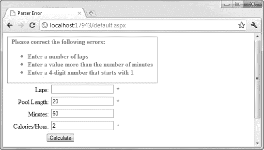

# 十七、验证表单数据

大多数 web 应用使用 HTML 表单从用户那里收集某种数据。这包括从简单数据(如姓名和密码)到对业务流程至关重要的复杂数据。作为 web 应用开发人员，我们负责获取用户提供的数据并理解这些数据。用户也是人，他们会犯错误或误读指令。检查我们接收到的输入的过程被称为*验证*。本章描述了一组支持验证的 WebForm 控件。

### 执行手动验证

我们将从演示验证解决的问题开始:防止用户在表单域中输入无意义的数据。为此，我们将再次使用游泳计算器示例。清单 17-1 包含了`Default.aspx`页面的标记，它被添加到一个使用空的 ASP.NET 应用模板创建的 Visual Studio 项目中。

***清单 17-1。【Default.aspx 的标记***

`<%@ Page Language="C#" AutoEventWireup="true" CodeBehind="Default.aspx.cs"
Inherits="WebFormsApp.Default" %>

<!DOCTYPE html PUBLIC "-//W3C//DTD XHTML 1.0 Transitional//EN"
 "http://www.w3.org/TR/xhtml1/DTD/xhtml1-transitional.dtd">

<html >
<head runat="server">
<title></title>
<link href="StyleSheet9781430234678.css" rel="stylesheet" type="text/css" />

</head>
<body>
<form id="form1" runat="server">

<asp:Label ID="Label1" runat="server" Text="Laps:" CssClass="label"/>
<asp:TextBox ID="TextBox1" runat="server"></asp:TextBox>

` `<asp:Label ID="Label2" runat="server" Text="Pool Length:" CssClass="label"/>
<asp:TextBox ID="TextBox2" runat="server"></asp:TextBox>

<asp:Label ID="Label3" runat="server" Text="Minutes:" CssClass="label"/>
<asp:TextBox ID="TextBox3" runat="server"></asp:TextBox>

<asp:Label ID="Label4" runat="server" Text="Calories/Hour:" CssClass="label"/>
<asp:TextBox ID="TextBox4" runat="server"></asp:TextBox>

<asp:Button ID="Button1" runat="server" Text="Calculate"
            style="margin-left:100px" onclick="Button1_Click"/>

<asp:TextBox ID="TextBox5" runat="server" BorderStyle="None" ReadOnly="True"
            TextMode="MultiLine" Rows="4" Columns="30"></asp:TextBox>

</form>
</body>
</html>`

我们回到了这个标记的一个更简单的版本。我们不需要上一章中描述的控件定制。图 17-1 显示了这个标记是如何在浏览器中显示的。

***图 17-1。**游泳计算器应用*

几乎每个需要用户数据的 web 应用都需要执行某种验证。用户几乎可以在表单中输入任何内容，这让我们负责两件事:

*   确保数据是我们期望的并且可以使用的数据类型
*   当数据无效时，帮助用户找出问题所在

清单 17-2 展示了如何对游泳计算器应用中收到的数据进行一些基本的验证。

***清单 17-2。**在游泳计算器应用中处理数据*

`using System;
using System.Text;

namespace WebFormsApp {

    public partial class Default : System.Web.UI.Page {

        protected void Page_Load(object sender, EventArgs e) {
            if (!IsPostBack) {
                TextBox1.Text = "1";
                TextBox2.Text = "20";
                TextBox3.Text = "60";
                TextBox4.Text = "1070";
            }
        }

        protected void Button1_Click(object sender, EventArgs e) {

            // define the int values that will hold the values from the input elements
            int laps, length, mins, cals;

            // try to get the values from the form elements as ints
            **if (int.TryParse(TextBox1.Text, out laps)**
                **&& int.TryParse(TextBox2.Text, out length)**
                **&& int.TryParse(TextBox3.Text, out mins)**
                **&& int.TryParse(TextBox4.Text, out cals)) {**

                // perform the calculation
                SwimCalcResult calcResult
                    = SwimCalc.PerformCalculation(laps, length, mins, cals);

                // compose the results
                StringBuilder stringBuilder = new StringBuilder();
                stringBuilder.AppendFormat("Distance: {0:F2} miles\n",
                    calcResult.Distance);` `                stringBuilder.AppendFormat("Calories Burned: {0:F0}\n",
                    calcResult.Calories);
                stringBuilder.AppendFormat("Pace : {0:F0} sec/lap\n",
                    calcResult.Pace);

                // set the results text
                TextBox5.Text = stringBuilder.ToString();
            }  else {
                TextBox5.Text = "";
            }
        }
    }
}`

这种方法被称为*手动验证*。我们从表单中的输入元素获取值，并执行显式检查或转换，以确保我们有可用的数据。

这履行了我们的一项责任。我们只需要来自用户的整数值，我们使用`int.TryParseInt`方法将文本框控件中的字符串值转换成`int`值。如果对`TryParseInt`的任何调用失败，那么我们假设用户没有提供有效数据，并且我们不执行计算。

不幸的是，这是一个非常愚蠢的方法，它没有考虑到用户可能不像我们这样思考的事实。如果用户不知道我们假设泳池长度以米为单位，并在文本框中输入 25 米，该怎么办？该值不是整数，因此我们丢弃数据，不执行计算。

更糟糕的是，当出现问题时，我们不会向用户提供任何反馈。请记住，你的用户必须花时间找出问题所在的时候，就是你失去客户的时候。

还有另一个问题:验证逻辑分散在应用中。执行计算的类叫做`SwimCalc`，包含清单 17-3 中的语句。

***清单 17-3。**分散验证报表*

`...
// validate the parameter values - we need all values to be greater than zero
foreach (int paramValue in new[] {lapsParam, lengthParam, minsParam, calsPerHourParam}) {

    if (paramValue < 1) {
        // this is not a value we can work with
        throw new ArgumentOutOfRangeException();
    }
}
...`

在代码隐藏类中通过测试的值(比如-50，它是一个有效的整数值)在`SwimCalc`类中被拒绝，因为我们希望只使用正值来执行计算。

如果我们需要更改应用中的验证逻辑，我们需要寻找所有应用了某种限制的代码，这对于即使是中等复杂程度的 web 应用来说也是一个维护问题。当然，用户在这里也得不到任何有用的反馈。如果你在一个文本框控件中输入-50，就会抛出一个异常，导致一个错误页面(参见第 7 章了解 ASP.NET 如何处理异常的细节)。

### 执行自动验证

ASP.NET 网络表单包含一组控件，您可以使用它们来执行自动数据验证。您可以使用这些控件来指定一个或多个定义有效数据的规则，如果违反了这些规则，将会向用户显示一条错误消息，解释出错的原因。这些控件还允许您将验证规则合并到一个地方，这使得维护它们变得更加简单。在工具箱窗口的验证部分可以看到控件，如图[图 17-2](#fig_17_2) 所示。

***图 17-2。**网络表单验证控件*

使用验证控件时，可以将它放在希望错误信息出现的位置。通常，这是靠近用户将输入数据的表单元素的地方，在我们的例子中是 TextBox 控件。

作为使用验证控件的快速演示，[清单 17-4](#list_17_4) 展示了如何将验证应用到`Default.aspx`标记中的一个文本框控件。

***清单 17-4。**使用验证控制*

`...
<form id="form1" runat="server">

<asp:Label ID="Label1" runat="server" Text="Laps:" CssClass="label"/>
<asp:TextBox ID="TextBox1" runat="server"></asp:TextBox>
**<asp:RangeValidator ID="RangeValidator1" runat="server"**
  **ControlToValidate="TextBox1"**
        **ErrorMessage="Enter a number of laps between 1 and 200"**
        **MaximumValue="200"**
        **MinimumValue="1"**
        **Type="Integer"**
        **CssClass="validation"**
        **Display="Dynamic"/>**` `**<asp:RequiredFieldValidator ID="RequiredFieldValidator1" runat="server"**
  **ControlToValidate="TextBox1"**
        **ErrorMessage="Enter a number of laps"**
        **CssClass="validation"**
        **Display="Dynamic"/>**

...`

这两个元素发生了很多，我们来一点一点的分解一下。首先，*是*两个元素的事实很重要。我们可以对同一个输入控件应用多个验证控件。这里使用的两个验证控件是 RangeValidator 和 RequiredFieldValidator，前者确保提交的值在指定的范围内，后者确保用户提供了一个值。只有当一个值通过了包含在*所有已经应用的*验证控件中的规则时，它才被认为是有效的。在这种情况下，用户需要提供一个值*和*，该值必须在定义的范围内。

验证控件有两个基本属性(我们稍后将回到其他属性):

*   `ControlToValidate`指定验证规则将应用于哪个控件。对于这两个验证控件，[清单 17-4](#list_17_4) 指定了`TextBox1`，这是用于收集已经游完的圈数的文本框控件。
*   `ErrorMessage`是当用户输入的数据不符合验证控件指定的规则时，将向用户显示的消息。

这些验证控件将 JavaScript 添加到页面中，这样，当表单将要发布时，或者当焦点从 TextBox 控件上移开时，验证规则就会应用到客户端。如果违反了任何验证规则，将向用户显示相应验证控件的错误消息，并且在问题得到解决之前，用户无法将表单发送到服务器。图 17-3 显示了[清单 17-4](#list_17_4) 中两个验证控件的错误信息。

***图 17-3。**显示错误信息的验证控件*

现在你已经看到了如何使用验证的快速演示，我们可以深入细节，看看不同的可用选项。

#### 了解验证控制

WebForm 包括四个核心验证控件，您可以组合这些控件来创建验证规则。我说*结合*是因为大多数验证规则倾向于需要不止一个验证控件来执行。

例如，考虑上一节中的简单示例。如果我们只使用了 RangeValidator 控件，用户可以通过输入 1 到 200 之间的值来通过验证，或者根本不输入任何值。RangeValidator 仅在用户输入一个值时才检查该值，因此我们也需要使用 RequiredFieldValidator。表 17-1 描述了四个核心验证控制。

其中三个控件定义了用于指定有效性规则的属性。在下面几节中，我将向您展示每个控件，并演示如何使用这些属性。

#### 需要一个值

最简单的验证控件是 RequiredFieldValidator。该控件没有任何配置属性。要通过验证，用户只需输入一个值。

RequiredFieldValidator 控件不考虑输入数据的适当性，只关心字段中是否有*内容*。你可以在[清单 17-4](#list_17_4) 中看到这个控件的一个例子。

#### 接受一系列的值

如[清单 17-4](#list_17_4) 所示，RangeValidator 控件确保用户输入的数据在指定的范围内。在本例中，我们需要一个介于 1 和 200 之间的值。`MinimumValue` 和`MaximumValue`属性设置范围的边界。下面是前面清单中的标记:

`<asp:RangeValidator ID="RangeValidator1" runat="server"
    ControlToValidate="TextBox1"
    ErrorMessage="Enter a number of laps between 1 and 200"
    MaximumValue="200"
    MinimumValue="1"
    **Type="Integer"**
    CssClass="validation"
    Display="Dynamic" />`

RangeValidator 控件的一个常见问题是省略了我用粗体标记的属性:`Type`。RangeValidator 控件不会从`MinimumValue`和`MaximumValue`属性推断出您正在处理的数据类型，因此您必须通过`Type`属性向控件提供提示。如果你省略了`Type`属性，那么 RangeValidator 控件会认为你正在处理字符串，这会导致一些奇怪的结果，如图 17-4 中的[所示。](#fig_17_4)

***图 17-4。**range validator 控件的常见错误*

您可以看到用户在文本框中输入了值 23，但是 RangeValidator 控件仍然显示错误消息。正如您可能已经猜到的那样，验证控件正在按字母顺序比较字符串值，并且字符串`23`在字母顺序上比字符串`200`大。

如果您发现自己总是看到这样的范围错误消息，很可能是您忘记了设置`Type`属性。(我说的是痛苦的经历——我*总是*忘记设置`Type`，而*总是*花了我一点时间才记住这一点。)

`Type`属性可以设置为下列值之一:

*   `Currency`
*   `Date`
*   `Double`
*   `Integer`
*   `String`

range validator 控件在检查数据是否属于该范围之前，尝试将数据转换为指定的类型。如果数据无法转换，则会显示错误。这可能会在检查`Date`范围时造成问题。众所周知，日期很难处理，因为世界上使用的格式和约定多种多样。当服务器使用的日期格式和用户使用的日期格式不同时，很容易出现问题。这个问题没有很好的解决方法，但是至少，你应该指定你期望的日期格式，比如( *mm* / *dd* / *yy* 或者*DD*/*mm*/*YY*)以便给用户一个提示。

 **注意**验证控件定义的规则是独立评估的，这意味着不能使用多个 RangeValidator 控件来指定不连续的范围。为了达到这种效果，您必须创建一个自定义验证控件。有关详细信息，请参阅本章后面的“创建自定义验证函数”一节。

#### 根据特定值进行验证

CompareValidator 控件允许您将用户输入的数据与您指定的值进行比较。清单 17-5 显示了这个应用于文本框控件的验证控件，在我们的例子中，它从用户那里收集池的长度。

***清单 17-5。**应用比较器控制*

`...

<asp:Label ID="Label2" runat="server" Text="Pool Length:" CssClass="label"/>
<asp:TextBox ID="TextBox2" runat="server"></asp:TextBox>
**<asp:CompareValidator ID="CompareValidator1" runat="server"**
        **ControlToValidate="TextBox2"**
        **ErrorMessage="Enter a value less than 50"**
        **ValueToCompare="50"**
        **Operator="LessThan"**
        **Type="Integer"**
        **CssClass="validation"/>**

...`

我们再次使用`ControlToValidate`和`ErrorMessage`属性来指定我们想要使用的 WebForm 控件，以及如果验证失败将向用户显示的消息。

`ValueToCompare`属性让我们提供一个值，我们希望与输入的数据进行比较，而`Operator`属性让我们指定应该如何进行比较。该属性可以是下列值之一:

*   `Equal`
*   `NotEqual`
*   `GreaterThan`
*   `GreaterThanEqual`
*   `LessThen`
*   `LessThanEqual`
*   `DataTypeCheck`

CompareValidator 控件尝试将数据值转换为由`Type`属性指定的数据类型，然后使用`Operator`与由`ValueToCompare`指定的值进行比较。当选择`DataTypeCheck`操作符时，仅执行到指定`Type`值的转换；`ValueToCompare`属性被忽略。如前一节所述，`Type`属性的有效值与 RangeValidator 控件的有效值相同。

 **警告**不要使用 CompareValidator 控件，除非您能够接受并处理将通过验证的全部数据值。例如，在清单 17-5 的[中，我们指定我们将接受任何小于 50 的池长度值，但是如果您输入-50，您将会看到一些奇怪的结果。这里我们真正需要的是 1-50 的范围，我们可以使用 RangeValidator 控件来实现。](#list_17_5)

CompareValidator 控件还可用于将用户输入的值与另一个控件中的值进行比较，从而有效地创建两个控件之间的关系。清单 17-6 提供了一个演示。

***清单 17-6。**使用 CompareValidator 在控件之间进行比较*

`...

<asp:Label ID="Label2" runat="server" Text="Pool Length:" CssClass="label"/>
<asp:TextBox ID="TextBox2" runat="server"></asp:TextBox>
<asp:CompareValidator ID="CompareValidator1" runat="server"
        ControlToValidate="TextBox2"
        ErrorMessage="Enter a value more than the number of minutes"
        **Operator="GreaterThan"**
        Type="Integer"
        **ControlToCompare="TextBox3"**
        CssClass="validation"/>

...`

属性指定了我们想要引用哪个控件。在这个清单中，我们改变了操作符，制定了验证规则，即`TextBox2`必须包含一个大于`TextBox3`中的值的整数值。你可以在图 17-5 的[中看到这条规则的效果。](#fig_17_5)

***图 17-5。**根据一个控件的内容验证另一个控件*

#### 使用正则表达式验证

最后一个验证控件 RegularExpressionValidator 允许您使用正则表达式来验证数据项。清单 17-7 提供了一个简单的演示。

***清单 17-7。**使用正则表达式验证器控件*

`...

<asp:Label ID="Label4" runat="server" Text="Calories/Hour:" CssClass="label"/>
<asp:TextBox ID="TextBox4" runat="server"></asp:TextBox>
<asp:RegularExpressionValidator ID="RegularExpressionValidator1" runat="server"
    ControlToValidate="TextBox4"
    ErrorMessage="Enter a 4-digit number that starts with 1"
    ValidationExpression="1\d\d\d"
    CssClass="validation"/>

...`

与其他验证控件一样，`ControlToValidate`属性指定将被验证的控件，而`ErrorMessage`属性指定验证失败时向用户显示的消息。RegularExpressionValidator 控件还定义了`ValidationExpression`属性，该属性指定要匹配的正则表达式。我们在示例中使用的表达式将匹配任何第一个数字为 1 的四位数。

### 样式和定位验证消息

默认情况下，验证控件生成的 HTML 非常简单，如清单 17-8 所示。

***清单 17-8。**验证控件生成的 HTML】*

`Enter a number of laps`

错误消息被表示为`span`元素，它们最初对用户是隐藏的。如果验证发生变化，那么验证控件添加到页面的 JavaScript 向用户显示`span`元素，显示错误消息。您可以通过设置`CssClass`属性的值或者通过在属性表中设置单独的样式属性来设置显示给用户的错误消息的样式。对于本章到目前为止的所有例子，我们已经应用了`validation` CSS 类。[清单 17-9](#list_17_9) 显示了这个类的定义。

***清单 17-9。**一个应用于验证控件的简单 CSS 类*

`.validation
{
    margin:5px;
    font-weight:bold;
    color:Red;
    float:left;
}`

CSS 属性确保文本与页面上的其他元素一起显示，并且清楚地显示错误(在本例中，显示为粗体红色文本)。

请记住，当您向页面添加验证控件时，您实际上是在选择错误信息将显示在哪里。验证控件不需要放在被验证的控件附近，尽管这是一个常见的约定。

#### 采用静态和动态布局

验证控件实现了一个名为`Display`的属性，该属性可以设置为以下三个值之一:`None`、`Static`或`Dynamic`。当页面呈现为 HTML 时，此属性影响验证控件的布局方式。

`None`值意味着控件不显示错误信息。我们将在稍后查看验证摘要时回到这个选项。`Static`值意味着验证错误会占用页面空间，即使没有向用户显示任何错误。[清单 17-10](#list_17_10) 显示了使用`Static`值的 RequiredFieldValidator 控件生成的 HTML。

***清单 17-10。**由验证控件使用显示属性的静态值呈现的 HTML】*

`Enter a number of laps`

`Dynamic`值使用一种不同的技术来隐藏错误消息，这样它在显示之前不会占用页面空间。你可以在清单 17-11 中看到这个设置的 HTML。

***清单 17-11。**由验证控件使用显示属性的动态值呈现的 HTML】*

`Enter a number of laps`

HTML 中的差异可能很小，但影响可能很大，正如你在图 17-6 中看到的。

***图 17-6。**静态显示值的效果*

在图中，有一个验证控件没有被触发，但仍然占用页面上的空间，因为它使用了`Static`值。我已经概述了它使用的空间。第二个验证控件*是*显示它的错误消息，但是该消息被第一个控件转移到右边。[图 17-7](#fig_17_7) 显示了同样的情况，但是第一个验证控件被配置为使用`Dynamic`值。

***图 17-7。**动态显示值的效果*

显然，`Dynamic`值对于示例应用的布局更有意义，但情况并非总是如此。对项目最有意义的值取决于您如何布置其他控件。

#### 使用验证摘要

如果用户提交一个有很多验证问题的表单，错误信息会铺天盖地而来，如图 17-8 所示。在四个数据控件中，有三个显示错误。在较长的表单中，很难找出是哪些字段导致了问题。

***图 17-8。**控件上的个别错误信息*

另一种方法是使用验证摘要，这是通过 validation summary 控件实现的，如[清单 17-12](#list_17_12) 所示。

***清单 17-12。**使用验证摘要控件*

`...
<body>
<form id="form1" runat="server">

**<asp:ValidationSummary ID="ValidationSummary1" runat="server"**
      **HeaderText="Please correct the following errors:"**
        **ShowMessageBox="False"**
        **DisplayMode="BulletList"**
        **ShowSummary="True"**
        **CssClass="validation" />**

<asp:Label ID="Label1" runat="server" Text="Laps:" CssClass="label"/>
<asp:TextBox ID="TextBox1" runat="server"></asp:TextBox>
<asp:RangeValidator ID="RangeValidator1" runat="server"
            ErrorMessage="Enter a number of laps between 1 and 200"
            ControlToValidate="TextBox1"
            MaximumValue="200"
            MinimumValue="1"
            Type="Integer"
            CssClass="validation"
            Display="Dynamic"/>
<asp:RequiredFieldValidator ID="RequiredFieldValidator1" runat="server"
            ErrorMessage="Enter a number of laps"
            ControlToValidate="TextBox1"
            CssClass="validation"
            Display="Dynamic"/>

...`

当有验证错误时，它们会显示在 ValidationSummary 控件中，我们把它放在页面的顶部，如图 17-9 所示。

***图 17-9。**使用验证摘要控件*

您不需要采取任何步骤来将 ValidationSummary 控件与各个验证控件相关联，因为 WebForm 会自动完成这项工作。

##### 协调验证控制和验证总结

尽管我们在页面的顶部有一个很好的总结，但是我们还没有解决错误太多的事实。我们可以通过将单个验证控件的`Text`属性设置为星号(`*`)或类似的字符来实现。`ErrorMessage`属性将显示在验证摘要中，`Text`属性的值将由控件本身显示。[清单 17-13](#list_17_13) 展示了如何将这个属性应用到一个控件中。

***清单 17-13。**在验证控件上同时使用错误消息和文本属性*

`<asp:RequiredFieldValidator ID="RequiredFieldValidator1" runat="server"
    ErrorMessage="Enter a number of laps"
    **Text="*"**
    ControlToValidate="TextBox1"
    CssClass="validation"
    Display="Dynamic"/>`

在图 17-10 的[中可以看到将此变更应用于所有验证控件的效果。现在，摘要详细说明了用户必须解决的问题，并且各个控件提供了关于这些问题发生在何处的指导。](#fig_17_10)

***图 17-10。**使用文本字符引起对错误的注意，而不重复信息*

##### 配置验证摘要控件

ValidationSummary 控件支持少量属性，您可以使用这些属性来改变向用户显示验证错误的方式。其中一个属性是`ShowMessageBox`。如果将该属性设置为`true`，错误信息将通过一个警告框显示给用户，如图[图 17-11](#fig_17_11) 所示。

***图 17-11。**在消息框中显示验证错误*

如果使用`ShowMessageBox`属性，可以将`ShowSummary`设置为`false`，以防止验证错误在网页上重复出现；默认情况下，用户将在这两个位置看到错误。

您可以通过使用`DisplayMode`属性来改变摘要在网页上的显示方式，该属性可以设置为`BulletList`、`List`或`SingleParagraph`。`BulletList`值的影响可以在[图 17-10](#fig_17_10) 中看到——每个验证错误都显示为一个项目符号列表项。`List`值的效果如图[图 17-12](#fig_17_12) 所示。`SingleParagraph`值显示验证错误，不使用列表，如图[图 17-13](#fig_17_13) 所示。

***图 17-12。**使用显示模式属性的列表值*

***图 17-13。**使用 DisplayMode 属性的 SingleParagraph 值*

### 使用服务器端验证

到目前为止，WebForm 验证支持与第 10 章中展示的 jQuery 验证支持非常相似。事实上，WebForm 验证系统有一个显著的优势，那就是当用户发布表单时，在客户端使用 JavaScript 执行的验证会在服务器上再次执行。

在第 10 章中，我警告过你仅仅依赖客户端验证是一件危险的事情。当浏览器中禁用 JavaScript 时，这不仅会妨碍验证，还会使他人很容易伪造请求并向您发送错误的数据值，从而导致您的应用出现问题。[图 17-14](#fig_17_14) 显示了浏览器禁用 JavaScript 时的验证，这意味着验证是由服务器执行的。它看起来与在客户端完成验证时一样。

***图 17-14。**在服务器上执行验证*

您不需要采取任何额外的步骤来启用服务器端验证。这是自动完成的，即使已经执行了客户端验证——这是一个非常有用的特性。

 **注意**您可以通过将验证控件上的`EnableClientScript`属性设置为`false`来禁用客户端验证。在表单回发到服务器之前，不会执行验证。这通常不是一个好主意，因为您失去了客户端验证提供给用户的即时反馈。

如果你看过验证控件添加到页面上的 JavaScript，你会发现它很乱，没有我们在第十章使用的 jQuery 方法优雅。您可能会倾向于依赖 WebForm 验证控件进行服务器端验证，并使用 jQuery 来处理客户端验证。您当然可以这样做，但是很难获得一致的结果，无论是在验证方面还是在显示给用户的错误消息的外观方面。这种方法还会产生维护开销，因此必须在两个地方对验证逻辑进行更改。尽管 WebForm 验证控件发出的 JavaScript 可能很难看，但它比其他选择要好。

在本书的第四部分中描述的 MVC 框架有一个更好的方法来解决这个问题。微软已经暗示，它将在未来版本的 WebForm 中遵循这一模式。

### 创建自定义验证功能

如果内置验证控件(如前面的[表 17-1](#tab_17_1) 所示)不符合您的验证需求，您可以使用 CustomValidator 控件创建自定义验证函数。[清单 17-14](#list_17_14) 显示了应用于从用户那里收集分钟数的文本框控件的 CustomValidator 控件。

***清单 17-14。**使用 CustomValidator 控件*

`...

<asp:Label ID="Label3" runat="server" Text="Minutes:" CssClass="label"/>
<asp:TextBox ID="TextBox3" runat="server"></asp:TextBox>
**<asp:CustomValidator ID="CustomValidator1" runat="server"**
        **ControlToValidate="TextBox3"**
        **ErrorMessage="Enter a whole number of minutes that is less than 50"**
        **Text="*"**
        **onservervalidate="CustomValidator1_ServerValidate"**
        **ClientValidationFunction="CustomValidation"**
        **CssClass="validation"**
        **/>**

...`

这种自定义验证确保用户提供的值是小于 50 的整数。这可以通过使用内置控件来实现，但是它提供了一个简单的例子来说明如何创建定制的验证逻辑。

对于自定义验证，您需要实现两次验证逻辑:一次用 C# 实现，以便可以在服务器端应用；另一次用 JavaScript 实现，以便可以在客户端应用。您通过处理`ServerValidate`事件来实现服务器端验证，该事件在表单回发到服务器时被调用。[清单 17-15](#list_17_15) 显示了在我们的例子中用于处理该事件的方法，该方法在包含 CustomValidator 控件的页面的代码隐藏类中定义。

***清单 17-15。**通过处理 ServerValidate 事件定义自定义验证逻辑*

`...
protected void CustomValidator1_ServerValidate(object src, ServerValidateEventArgs args){
    int convertedValue;
    **args.IsValid = int.TryParse(args.Value, out convertedValue) && convertedValue < 50;**
}
...`

我们的处理程序方法被传递了一个表示事件源的对象(即 CustomValidator 控件)和一个`ServerValidateEventArgs`对象。我们通过读取`ServerValidateEventArgs.Value`属性获得用户提供的值，并通过设置`ServerValidateEventArgs.IsValid`属性的值来指示该值是否通过验证。值为`true`意味着该值有效；`false`表示该值无效。在这个例子中，我们试图解析用户提供给一个`int`的值；如果成功了，那么我们还要检查这个值是否小于 50。我们以通常的方式将处理程序方法与事件相关联:使用“属性”窗口中的事件列表，或者手动将以下内容添加到 CustomValidator 控件的标记中:

`onservervalidate="CustomValidator1_ServerValidate"`

如果您想要支持客户端验证，那么您必须在 JavaScript 中复制您的逻辑。客户端验证的第一步是定义验证函数。清单 17-16 显示了这个例子的脚本。

***清单 17-16。**实现 JavaScript 验证功能*

`...

...`

JavaScript 函数尽可能地与 C# 函数相似。我们被传递了两个参数，它们代表事件的来源和事件参数。我们通过`args.Value`属性获取用户输入的值，并使用`args.IsValid`属性报告我们验证的成功。在 JavaScript 中检查整数值与在 C# 中检查略有不同，但是[清单 17-16](#list_17_16) 中的代码应该是不言自明的。

在哪里定义 JavaScript 函数并不重要，只要它在页面中可用。这意味着你可以通过创建一个脚本文件或者在一个母版页中定义函数来共享一组通用的验证函数(关于母版页的详细信息，参见[第 9 章](09.html#ch9))。对于这个例子，我们已经将`script`元素添加到了`Default.aspx`的`head`部分。

我们通过`ClientValidationFunction`属性将 JavaScript 函数与 CustomValidator 控件关联起来，如下所示:

`ClientValidationFunction="CustomValidation"`

就这样。我们创建了定制的验证逻辑，应用于服务器和客户端。你可以在[图 17-15](#fig_17_15) 中看到这样做的效果。

***图 17-15。**自定义验证控件产生的错误消息*

实现客户端支持是可选的，但是如果你不实现它，而*对其他验证控件使用客户端验证，你会让用户困惑。这是因为有些错误会被客户端捕获，而其他错误会在表单提交后被服务器标记。尽可能快地进行验证将会改善用户的体验和对 web 应用的感知。*

### 总结

本章讲述了一组支持验证的 WebForm 控件。我们首先概述了验证是如何工作的，以及内置控件提供的验证模型。然后，我们研究了如何设计向用户显示的错误消息的样式，以及如何使用验证摘要将消息分组在一起。最后，我们实现了一些可以在客户端和服务器端应用的定制验证逻辑。