## 18

## 使用 Web 窗体数据源

WebForm的主要优势之一是您可以轻松地在 Web 应用程序中显示和操作数据。在这一章中，我们将会看到 WebForm数据特性的一个关键因素:*数据源*。

您使用数据源作为应用程序中的数据。Web 窗体包括一些内置的数据源控件，使这一过程对于各种数据类型来说都很简单。您可以像处理 SQL 数据库中的对象一样轻松地处理在内存中创建的对象。我将介绍最有用的数据源控件，并演示如何在没有它们的情况下获得一些高级结果。

### 使用数据源控件的快速示例

使用 Web 窗体数据控件需要三项:一些数据、一个数据源控件和一个数据绑定 UI 控件。

首先，使用空的 ASP.NET 应用程序模板创建一个名为`WebApp`的新 Visual Studio 项目，并添加一个名为`Default.aspx`的新 WebForm。本章中的所有示例都将添加到本页。

#### 创建数据

您可以在 WebForm中使用一系列不同的数据类型，但是我们将从最简单的开始——包含在一个类中的一些对象。在代码隐藏文件`Default.aspx.cs`中，定义一个名为`Fruit`的新数据类型，并在`Default`代码隐藏类中创建一个`Fruit`对象数组，如[清单 18-1](#list_18_1) 所示。

***清单 18-1。**创建一些数据*

`using System;

namespace WebApp {

    public class Fruit {
        public string Name { get; set; }
        public string Color { get; set; }
    }` `    public partial class Default : System.Web.UI.Page {
        public Fruit[] FruitDataArray = new[] {
            new Fruit() {Name = "Apple", Color = "Green"},
            new Fruit() {Name = "Banana", Color = "Yellow"},
            new Fruit() {Name = "Cherry", Color = "Red"},
            new Fruit() {Name = "Plum", Color = "Red"}
        };

        protected void Page_Load(object sender, EventArgs e) {

        }
    }
}`

`Fruit`类定义了两个公共属性:`Name`和`Color`。`Default`类定义了一个名为`FruitDataArray`的`Fruit`对象数组，我们用一些示例水果的细节填充了这个数组。

#### 创建数据源

当我们使用术语*数据源控件*时，我们实际上指的是一种特殊的 WebForm控件，它充当特定类型数据和数据绑定 WebForm UI 控件之间的适配器。稍后您会看到，有不同种类的数据源可以用来处理不同种类的数据。对于这个例子，我们将使用`LinqDataSource`控件。该控件的一个功能是它可以处理对象数组，例如我们在代码隐藏类中创建的数组。

您可以通过将控件从 Visual Studio 工具箱拖动到设计图面或源窗口来创建该控件。数据源控件，包括 LinqDataSource **、**都可以在数据节中找到。放下控件，使其出现在`body`标签之间。您的标记看起来应该类似于清单 18-2 中的[。](#list_18_2)

***清单 18-2。**向页面添加 LinqDataSource 控件*

`<%@ Page Language="C#" AutoEventWireup="true" CodeBehind="Default.aspx.cs"
Inherits="WebApp.Default" %>

<!DOCTYPE html PUBLIC "-//W3C//DTD XHTML 1.0 Transitional//EN"
"http://www.w3.org/TR/xhtml1/DTD/xhtml1-transitional.dtd">

<html >
<head runat="server">
<title>Data Demo</title>
</head>
<body>
<form id="form1" runat="server">

</form>` `**<asp:LinqDataSource ID="LinqDataSource1" runat="server">**
**</asp:LinqDataSource>**
</body>
</html>`

你把控件放在哪里并不重要，但是我倾向于把我的放在页面的底部，这样我的数据源就和我的 UI 控件有点距离了。

创建数据源后，必须对其进行配置。您可以直接从标记中做到这一点，但是对于本例，我们将使用设计图面中的漂亮 UI。

在设计图面中选择数据源，点击出现的小箭头，然后从菜单中选择配置数据源，如图[图 18-1](#fig_18_1) 所示。

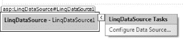

***图 18-1。**选择配置数据源*

配置数据源向导打开，如图[图 18-2](#fig_18_2) 所示。在第一个屏幕中，您选择数据的来源。在不同的情况下使用相同的向导，所以当处理一个类中定义的一组对象时，术语没有完全的意义。

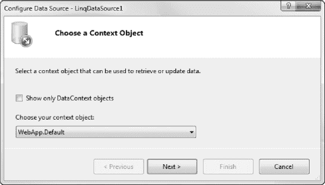

***图 18-2。**启动配置数据源向导*

 **注意**如果在下拉菜单中没有看到任何条目，请取消向导，重新构建项目，并重新开始配置数据源控件。

“选择您的上下文对象”菜单包含当前控件可以支持的数据源列表。在我们的例子中，我们可以从两个项目中选择，这两个项目代表了我们到目前为止在项目中定义的两个类:`WebApp.Default`和`WebApp.Fruit`。这些是类的完全限定名。我们在创建示例项目时将其命名为`WebApp`，因此 Visual Studio 自动将这些类分配给了`WebApp`名称空间。选择`WebApp.Default`(这是我们定义`Fruit`对象数组的地方)，然后点击 Next 按钮。

下一个屏幕，如图[图 18-3](#fig_18_3) 所示，让我们选择想要处理的数据和字段。LinqDataSource 控件将 LINQ 查询应用于 C#对象的枚举。表格下拉菜单显示了在`Default`类中找到的所有合适枚举的列表。选择`FruitDataArray`使用我们之前定义的数据。

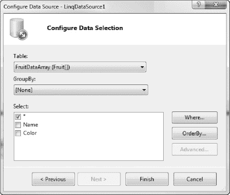

***图 18-3。**选择数据和数据字段*

选择区域显示所选数据中可用的字段。我们的示例对象只有`Name`和`Color`属性。勾选`*`选项，如图[图 18-3](#fig_18_3) 所示，将这两者都包含在数据源中。GroupBy 菜单以及 Where 和 OrderBy 按钮允许您过滤数据，我们将在本章后面讨论。目前，忽略这些选项。点击完成按钮完成数据源控件的设置。源窗口中的标记将被更新，如清单 18-3 中的[所示。](#list_18_3)

***清单 18-3。**在数据源控件上使用配置数据源向导的效果*

`...
<asp:LinqDataSource ID="LinqDataSource1" runat="server"
    **ContextTypeName="WebApp.Default"**
    **EntityTypeName=""**
    **TableName="FruitDataArray">**
</asp:LinqDataSource>
...`

我们现在有了数据和数据源。数据源控件可以充当在`Default`类中定义的数据和一个 WebForm数据绑定 UI 控件之间的桥梁。

#### 创建 UI 控件

WebForm的一个很好的特性是数据绑定控件的数量，包括在第 15 章中介绍的一些控件。这意味着您可以将一些非常基本的控件与数据源相关联，这样它们的内容就可以从您的数据中派生出来。

作为一个简单的例子，我们将使用 DropDownList 控件。将控件从工具箱窗口拖动到设计图面或源窗口，这样页面的标记看起来就像[清单 18-4](#list_18_4) 。

***清单 18-4。**向页面添加一个 DropDownList 控件*

`<%@ Page Language="C#" AutoEventWireup="true" CodeBehind="Default.aspx.cs"
Inherits="WebApp.Default" %>

<!DOCTYPE html PUBLIC "-//W3C//DTD XHTML 1.0 Transitional//EN"
"http://www.w3.org/TR/xhtml1/DTD/xhtml1-transitional.dtd">

<html >
<head runat="server">
<title>Data Demo</title>
</head>
<body>

<form id="form1" runat="server">

**<asp:DropDownList ID="DropDownList1" runat="server">**
**</asp:DropDownList>**

</form>` `<asp:LinqDataSource ID="LinqDataSource1" runat="server"
        ContextTypeName="WebApp.Default" EntityTypeName="" TableName="FruitDataArray">
</asp:LinqDataSource>
</body>
</html>`

在设计图面上选择 DropDownList 控件，单击出现的箭头，在弹出菜单中选择选择数据源，如图[图 18-4](#fig_18_4) 所示。这将打开数据源配置向导，允许您选择要在 UI 控件中使用的数据源控件和数据字段，如图[图 18-5](#fig_18_5) 所示。

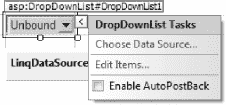

***图 18-4。**选择配置一个 UI 控件*

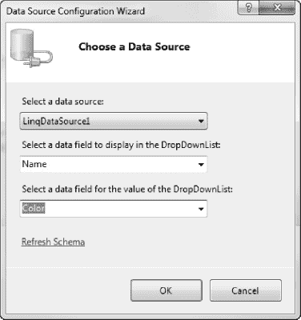

***图 18-5。**选择数据源和数据字段*

我们只添加了一个数据源控件到我们的页面，所以选择数据源选项的菜单只包含一个项目。它还包含一个创建新数据源的选项。我喜欢创建数据源，然后创建 UI 控件，但是如果您愿意，也可以反过来做。

对于 DropDownList 控件，您需要选择两个值:向用户显示的字段和将被选为值的字段。因为我们的`Fruit`类中只有两个字段，所以选择`Name`作为显示字段，选择`Color`作为值字段。(请注意，两个选项可以使用同一个字段。)单击“确定”按钮关闭向导。标记将被更新，如清单 18-5 中的[所示。](#list_18_5)

***清单 18-5。**数据绑定 DropDownList 控件的标记*

`<%@ Page Language="C#" AutoEventWireup="true" CodeBehind="Default.aspx.cs"
Inherits="WebApp.Default" %>

<!DOCTYPE html PUBLIC "-//W3C//DTD XHTML 1.0 Transitional//EN"
 "http://www.w3.org/TR/xhtml1/DTD/xhtml1-transitional.dtd">

<html >
<head runat="server">
<title>Data Demo</title>
</head>
<body>
<form id="form1" runat="server">

<asp:DropDownList ID="DropDownList1" runat="server"
            **DataSourceID="LinqDataSource1"**
            **DataTextField="Name"**
            **DataValueField="Color">**
</asp:DropDownList>

</form>
<asp:LinqDataSource ID="LinqDataSource1" runat="server"
        ContextTypeName="WebApp.Default" EntityTypeName="" TableName="FruitDataArray">
</asp:LinqDataSource>
</body>
</html>`

我们现在已经将 UI 控件绑定到数据源控件。如果您在浏览器中查看`Default.aspx`页面，您会看到一个下拉列表，其中填充了我们水果的名称，如图 18-6 中的[所示。](#fig_18_6)

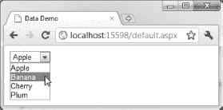

***图 18-6。**数据绑定下拉列表*

如果你查看浏览器显示的 HTML，你可以看到当控件被渲染时，WebForm是如何映射我们定义的数据的，如清单 18-6 所示。

***清单 18-6。**由数据绑定的 DropDownList 控件呈现的 HTML】*

`...
<select name="DropDownList1" id="DropDownList1">
<option value="Green">Apple</option>
<option value="Yellow">Banana</option>
<option value="Red">Cherry</option>
<option value="Red">Plum</option>
</select>...`

当我说向 Web 窗体应用程序添加数据是多么容易时，您会明白我的意思。诚然，本节中的示例非常简单，但是正如您将看到的，即使在处理更复杂的数据和控件时，基本模式也保持不变。

### 使用数据源

Web 窗体包括一组数据源控件，它们对一系列不同类型的数据进行操作。此范围从简单的。NET 对象传递到实体框架。整套在[表 18-1](#tab_18_1) 中描述。

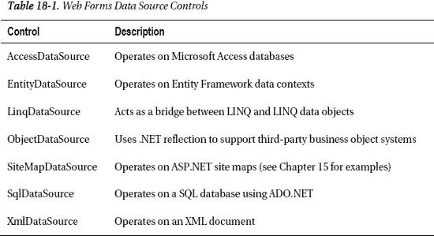

出于我们的目的，其中三个控件特别有趣:LinqDataSource **、** SqlDataSource 和 EntityDataSource。我们将从 EntityDataSource 开始，因为它提供了一种简单的机制来实现一个非常常见的目标:将数据库中的数据集成到 web 应用程序中。

其他数据源的功能非常好，但是我描述的数据源最有可能在项目中有用。我将在第 19 章中向您展示如何使用 XmlDataSource 控件，尽管我发现依靠 LINQ，使用本章描述的技术更容易处理 XML。SiteMapDataSource 控件在[第 15 章](15.html#ch15)中有所涉及。

#### 使用实体框架数据源

在第 8 章中，您看到了如何使用实体框架来访问 SQL Server 数据库。您可能还记得，实体框架让您无需编写 SQL 代码就可以使用数据库。相反，您使用。NET 对象，这是编写 C#应用程序时更自然的机制。

EntityDataSource 控件是用于处理实体框架的 Web 窗体数据源控件。为了演示如何使用这个控件，我们将使用第 8 章中的[数据库。在开始之前，我们需要创建实体框架上下文。为此，转到第 8 章](08.html#ch8)并遵循创建数据模型的说明。

一旦实体框架数据模型被添加到项目中，我们就可以使用 EntityDataSource 控件了。将控件拖动到源窗口，你会看到类似于[清单 18-7](#list_18_7) 中所示的标记。

***清单 18-7。**向页面添加 EntityDataSource 控件*

`<%@ Page Language="C#" AutoEventWireup="true" CodeBehind="Default.aspx.cs"
Inherits="WebApp.Default" %>

<!DOCTYPE html PUBLIC "-//W3C//DTD XHTML 1.0 Transitional//EN"
"http://www.w3.org/TR/xhtml1/DTD/xhtml1-transitional.dtd">

<html >
<head runat="server">
<title>Data Demo</title>
</head>
<body>

<form id="form1" runat="server">

</form>
**<asp:EntityDataSource ID="EntityDataSource1" runat="server">**
**</asp:EntityDataSource>**
</body>
</html>`

对于此示例，我们从页面中移除了 LinqDataSource 和 DropDownList 控件，以避免混淆。

接下来，在设计图面上选择新的数据源，单击出现的箭头，然后选择“配置数据源”。如果您遵循了第 8 章中的说明，当配置数据源向导启动时，您会在名称连接菜单下看到一个条目。这是添加到`Web.config`文件的数据库连接字符串。选择这个连接字符串，`DefaultContainerName`的值将被更新为`TrainingDataEntities`，这是我们创建的数据模型的名称。[图 18-7](#fig_18_7) 显示了条目。单击“下一步”继续。

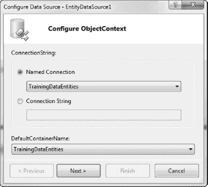

***图 18-7。**选择实体框架数据源*

向导将转到配置数据选择的屏幕。EntitySetName 下拉菜单列出了所有可用的实体类型，这些类型对应于我们在第 8 章[:`Athletes`、`Events`、`EventTypes`和`ReferenceTimes`中为表示数据库中的表而创建的对象。选择`Athletes`选项，显示屏的主要部分将填充实体框架为我们创建的`Athlete`类的属性，如图](08.html#ch8)[图 18-8](#fig_18_8) 所示。

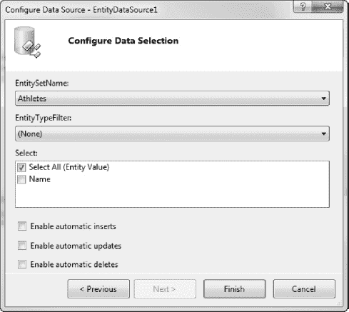

***图 18-8。**选择数据源中使用的实体和属性*

我们可以选择所有的属性，或者更有选择性地只检查那些我们想在页面上显示的项目。在`Athlete`类中只有一个属性，所以在这个例子中没有任何区别，但是一般来说，您应该只选择显示所需的属性，以最小化加载的数据量。

单击 Finish 关闭向导并更新数据源控件的标记，如清单 18-8 所示。

***清单 18-8。**已配置的 EntityDataSource 控件*

`...
<body>

<form id="form1" runat="server">

</form>` `**<asp:EntityDataSource ID="EntityDataSource1" runat="server"**
        **ConnectionString="name=TrainingDataEntities"**
        **DefaultContainerName="TrainingDataEntities" EnableFlattening="False"**
        **EntitySetName="Athletes">**
**</asp:EntityDataSource>**

</body>
...`

一旦创建并配置了 EntityDataSource 控件，就可以像前面一样使用它来填充数据绑定控件的内容。鉴于数据库的表格性质，EntityDataSource 控件通常用于在网格中显示数据(我将在本章后面的“使用 LINQ 数据源”一节中向您展示如何使用网格)。对于这个例子，我们将再次使用 DropDownList 控件，因为它适合简单的`Athlete`数据集。

 **提示**一些 WebForm数据控件支持仅当数据源中的数据被排序时才起作用的功能。要在 EntityDataSource 控件上启用排序，请将`AutoGenerateWhereClause`属性设置为`true`。

从工具箱中拖动一个 DropDownList 控件，单击箭头，并从弹出菜单中选择“配置数据源”。使用选择数据源菜单，选择我们刚刚创建的 EntityDataSource 控件，并为显示和值字段选择`Name`属性，如图 18-9 中的[所示。单击“确定”关闭向导。](#fig_18_9)

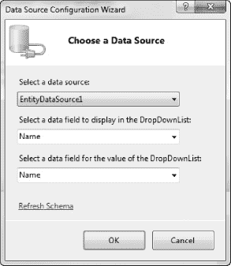

***图 18-9。**选择控件的数据属性*

如果你喜欢直接处理标记，那么你需要添加清单 18-9 中所示的元素。

***清单 18-9。**配置 DropDownList 控件以使用 EntityDataSource*

`<form id="form1" runat="server">

**<asp:DropDownList ID="DropDownList1" runat="server"**
**        DataSourceID="EntityDataSource1" DataTextField="Name" DataValueField="Name">**
**</asp:DropDownList>**

</form>`

当您查看包含这些控件的页面时，您会看到一个下拉列表，其中填充了来自数据库中的`Athletes`表的值。

#### 使用 SQL 数据源

`SqlDataSource`控件直接使用 SQL 从关系数据库中访问数据。我喜欢使用实体框架，但是如果您更喜欢 SQL，那么这是您的数据源。在这一节中，我将向您展示如何设置一个`SqlDataSource`控件来查询`TrainingData`数据库。

首先，将 SqlDataSource 控件从工具箱拖到设计图面，单击箭头按钮，然后从弹出菜单中选择“配置数据源”。你会看到如图[图 18-10](#fig_18_10) 所示的对话框。从下拉列表中选择一个连接，或使用“新建连接”对话框创建一个新连接。在图中，我选择了运行在我的数据库服务器`Titan`上的`TrainingData`数据库。选择或配置连接后，单击“下一步”按钮继续。

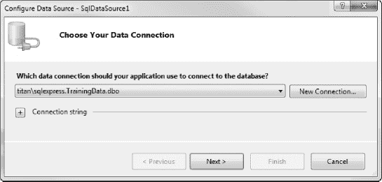

***图 18-10。**选择数据连接*

接下来，您可以选择将数据库的连接字符串保存在项目的`Web.config`文件中，或者作为页面中 SqlDataSource 控件的属性。我推荐选择`Web.config`选项，如图 18-11 中的[所示，因为它使得部署到生产服务器更容易。我们将在第 33 章](#fig_18_11)中更详细地介绍这一点。单击“下一页”按钮进入下一页。

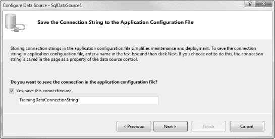

***图 18-11。**保存连接字符串*

现在，您可以选择将为数据源生成数据的表或存储过程。在本例中，选择`Athletes`表，如图[图 18-12](#fig_18_12) 所示。

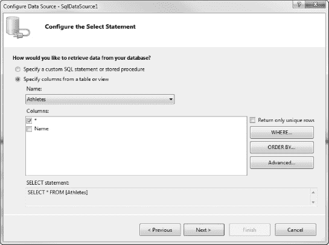

***图 18-12。**从数据库中选择表格*

第 19 章和第 20 章中介绍的一些数据控件支持仅当数据源中的数据被排序时才起作用的功能。要启用此功能，请单击“排序依据”按钮打开“添加排序依据子句”对话框。选择数据排序所依据的字段，如图[图 18-13](#fig_18_13) 所示，然后点击【确定】返回向导。

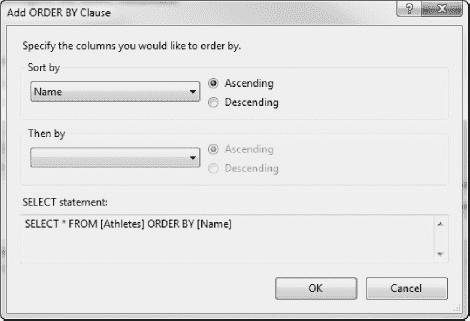

***图 18-13。**选择分类字段*

单击 WHERE 按钮将打开一个对话框，允许您过滤表中的数据。一些数据控件支持编辑数据。要实现此功能，您必须点击高级按钮，并选中创建`INSERT`、`UPDATE`和`DELETE`语句的选项，如图[图 18-14](#fig_18_14) 所示。单击“确定”按钮返回向导。

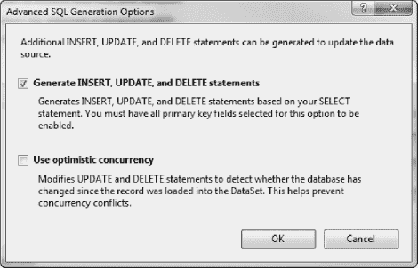

***图 18-14。**生成修改数据所需的 SQL 语句*

现在，点击下一步按钮进入下一个屏幕。此时，您可以测试将用于从数据库中检索数据的查询。

如果一切正常，单击 Finish 按钮关闭向导并更新数据源的标记。清单 18-10 显示了生成的标记。

***清单 18-10。**sqldata source 控件的标记*

`<asp:SqlDataSource ID="SqlDataSource1" runat="server"
    ConnectionString="<%$ ConnectionStrings:TrainingDataConnectionString %>"
    DeleteCommand="DELETE FROM [Athletes] WHERE [Name] = @Name"
    InsertCommand="INSERT INTO [Athletes] ([Name]) VALUES (@Name)"
    SelectCommand="SELECT * FROM [Athletes] ORDER BY [Name]">
<DeleteParameters>
<asp:Parameter Name="Name" Type="String" />
</DeleteParameters>
<InsertParameters>
<asp:Parameter Name="Name" Type="String" />
</InsertParameters>
</asp:SqlDataSource>`

配置完 SqlDataSource 控件后，您可以像前面使用 EntitySourceControl 控件一样使用它。例如，下面是用数据库中的数据填充 DropDownList 控件的标记:

`<asp:DropDownList ID="DropDownList2" runat="server"
    DataSourceID="SqlDataSource1" DataTextField="Name"
    DataValueField="Name" AutoPostBack="True">
</asp:DropDownList>`

您只需要更改`DataSourceID`属性的值。数据源系统抽象出了所有其他的差异。

#### 使用 LINQ 数据源

你已经在本章的开始看到了`LinqDataSource`控件的运行，但是这是一个非常灵活的控件，它能做的不仅仅是处理一组。NET 对象。在本节中，您将看到该控件的一些其他用途。

在我们开始之前，你应该知道我喜欢 LINQ。NET 语言集成查询功能。我认为这是最好的功能之一。这也是我用 C#编写的一个关键原因。如果你不熟悉 LINQ，那么我建议你看一下我和乔·拉茨一起写的书，*Pro LINQ:C #中的语言集成查询 2010* (Apress，2010)。

LinqDataSource 控件提供了一种将 LINQ 应用于任何与 LINQ 兼容的数据源的方法。LINQ 喜欢使用强类型的`IEnumerable`序列，因此任何这样的序列都是 LinqDataSource 控件的有效数据。

##### 用数据库表中的数据填充列表框

使用 LINQ 的方法之一是查询实体框架数据模型，就像我们之前使用`EntityDataSource`控件一样。为了演示这一点，我们将通过前面创建的数据模型，用来自`Events`数据库表的数据填充一个 UI 控件。

首先将 LinqDataSource 控件从工具箱拖到设计图面，单击箭头按钮，然后从弹出菜单中选择“配置数据源”。我们的项目现在包含一个实体框架数据模型，LinqDataSource 控件检测模型创建的类并将它们放在下拉菜单中，如图 18-15 所示。

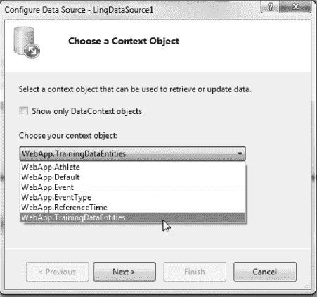

***图 18-15。**选择实体框架类*

我们不想使用单独的实体类。它们不包含 LinqDataSource 控件可以处理的任何数据，因为它们只是与每个基础数据库表中的列相对应的属性集的定义。相反，我们想要列表底部的`WebApp.TrainingDataEntities`项。该类包含表示数据库中数据的实体对象序列。选择此项后，单击下一步。

同样，您可以选择想要使用的类型和属性，在本例中，从表格下拉列表中选择`Events`，并将 GroupBy 菜单设置为 None。选择`Date`、`OverallTime`、`Type`属性，如图[图 18-16](#fig_18_16) 所示。

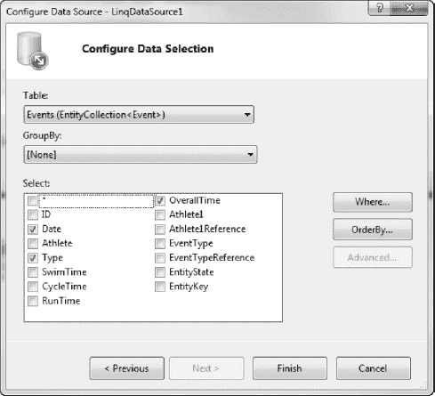

***图 18-16。**选择数据库表*

因为我们处理的是 LINQ，所以我们可以查询和过滤数据。对于本例，单击 Where 按钮。这将显示如图[图 18-17](#fig_18_17) 所示的对话框，您可以在其中选择与您定义的过滤器相匹配的数据记录。在图中，我创建了一个过滤器，只选择属性为`Adam Freeman`的`Event`对象。为此，从列菜单中选择`Athlete`，从运算符菜单中选择相等运算符(`==`，从源菜单中选择无(我们稍后将回到源菜单)。选择“无”时，会出现“值”文本框。输入`Adam Freeman`，点击添加按钮。这会将`where`子句添加到 LINQ 表达式中。单击“确定”按钮关闭对话框。

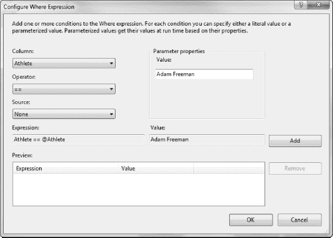

***图 18-17。**给 LINQ 表达式添加 where 子句*

点击 Finish 按钮关闭向导并更新控件标记，如清单 18-11 所示。

***清单 18-11。**使用 where 子句的 LinqDataSource 的标记*

`...
<body>

<form id="form1" runat="server">

<asp:DropDownList ID="DropDownList1" runat="server"
            DataSourceID="EntityDataSource1" DataTextField="Name" DataValueField="Name">
</asp:DropDownList>

</form>

<asp:EntityDataSource ID="EntityDataSource1" runat="server"
        ConnectionString="name=TrainingDataEntities"
        DefaultContainerName="TrainingDataEntities" EnableFlattening="False"
        EntitySetName="Athletes">
</asp:EntityDataSource>` `**<asp:LinqDataSource ID="LinqDataSource1" runat="server"**
        **ContextTypeName="WebApp.TrainingDataEntities" EntityTypeName="" TableName="Events"**
        **Where="Athlete == @Athlete"**
**Select="new (Date, Type, OverallTime)">**
**<WhereParameters>**
**<asp:Parameter DefaultValue="Adam Freeman" Name="Athlete" Type="String" />**
**</WhereParameters>**
**</asp:LinqDataSource>**
</body>
...`

这次我们将其他控件留在了页面上，因为我们稍后会再次使用它们。请注意，您可以让多个数据源控件愉快地共存于同一页面中。在这种情况下，两个控件使用相同的基础数据库，但这并不是必须的，您可以将各种数据源中的数据放入页面。

您可以看到我们在配置向导中的选择是如何反映在标记的 LINQ 式添加中的。我们从`Event`类中选择了特定的属性，它们出现在`Select`属性中，如下所示:

`Select="new (Date, Type, OverallTime)"`

我们定义的`where`子句出现在如下的`Where`属性中:

`Where="Athlete == @Athlete"`

`@Athlete`引用的是`WhereParameters`元素，它包含一个相应的`Parameter`元素，如下所示:

`<asp:Parameter DefaultValue="Adam Freeman" Name="Athlete" Type="String" />`

您可以在`LinqDataSource`元素的属性中看到 LINQ 查询。为了使用这个查询，我们需要添加一个 UI 控件。这一次，我们将使用 ListView 控件。从工具箱中拖动一个 ListView 到设计图面，单击箭头，从选择数据源下拉菜单中选择`LinqDataSource1`，如图[图 18-18](#fig_18_18) 所示。

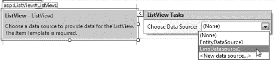

***图 18-18。**为 ListView 控件选择数据源*

一旦从列表中选择了`LinqDataSource1`，弹出菜单的内容就会变成图 18-19 中的[所示的内容。](#fig_18_19)

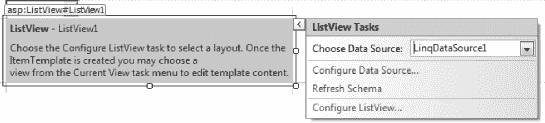

***图 18-19。**更新后的弹出菜单*

点击配置 ListView 项，打开配置 ListView 对话框，如图[图 18-20](#fig_18_20) 所示。ListView 控件只有在您告诉它如何显示数据时才会工作，这是通过此窗口完成的。“选择布局”列表显示了 ListView 控件显示数据的不同方式，“选择样式”列表显示了一些可应用于数据的内置样式。

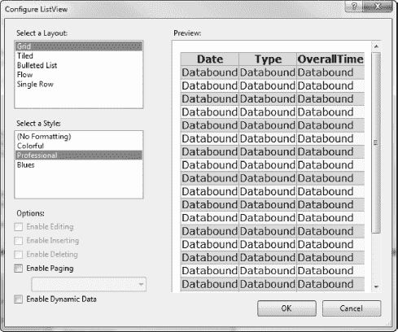

***图 18-20。**配置 ListView 控件*

我们将使用网格布局和专业格式选项。确保选中这些选项，然后单击“确定”按钮。忽略“启用分页”和“启用动态数据”选项；我们不会用这些。

在您关闭“配置 ListView”对话框后，ListView 控件的标记将被更新。加入了很多新元素。ListView 控件使用一组模板工作，它们需要许多元素来表达。

在浏览器中查看`Default.aspx`页面显示了我们配置的结果，这是来自`Events`数据库表的所有记录的列表，其中`Athlete`列/属性的值是`Adam Freeman`，如图[图 18-21](#fig_18_21) 所示。

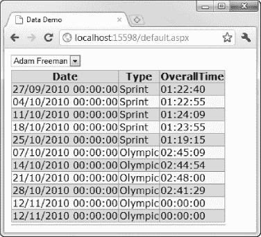

***图 18-21。**在 ListView 控件中显示从 LinqDataSource 获取的数据*

提示你可以使用 ListView 控件定义的模板来改变它的外观。关于控制模板系统的更多信息，参见[第 16 章](16.html#ch16)。

##### 从另一个控件获取 LINQ 查询参数

我们的页面现在包含一个显示一组`Athlete`名字的`DropDownList`控件，以及一个显示由指定运动员完成的活动细节的`ListView`。使用`LinqDataSource`控件的魔力，我们可以很容易地连接下拉菜单和列表，这样我们就可以选择显示谁的事件。

为此，请在设计图面上选择 LinqDataSource 控件，单击箭头，然后从弹出菜单中选择“配置数据源”。单击“下一步”按钮跳过数据源的选择，进入选择属性和定义子句的屏幕。单击“位置”按钮打开“配置位置表达式”对话框。

首先，我们需要删除现有的`where`子句。从页面底部的列表中选择`Athlete==@Athlete`表达式，然后单击移除按钮。我们现在有一个空的`where`条款。

要添加新的`where`子句，从列菜单中选择`Athlete`。这是我们想要使用的实体类属性。从运算符菜单中选择相等运算符(`==`)。这是我们需要的比较。从源代码菜单中选择控件。这就是我们偏离先前`where`条款的地方。我们不是定义一个静态值，而是告诉 LinqDataSource 控件，我们希望它从同一页上的另一个控件获取一个值。从控制 ID 菜单中选择`DropDownList1`，在默认值字段中输入`Adam Freeman`。这是当其他控件没有可用值时将使用的值。[图 18-22](#fig_18_22) 显示了完整的配置。

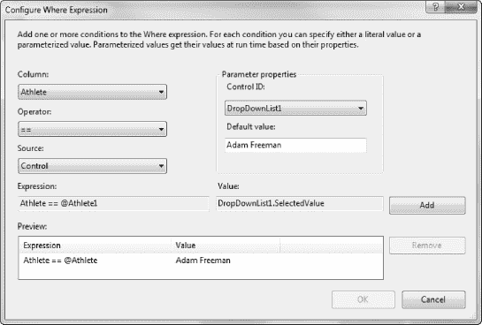

***图 18-22。**将控件派生的 where 子句添加到 LinqDataSource*

单击添加按钮创建`where`子句，单击确定按钮关闭配置 Where 表达式对话框，然后单击完成关闭配置数据源向导。LinqDataSource 控件的更新标记如清单 18-12 所示。

***清单 18-12。**从 LinqDataSource 中的另一个控件获取值*

`...
<asp:LinqDataSource ID="LinqDataSource1" runat="server"
    ContextTypeName="WebApp.TrainingDataEntities" EntityTypeName="" TableName="Events"
    Where="Athlete == @Athlete1"
    Select="new (Date, Type, OverallTime)">
<WhereParameters>` `**<asp:ControlParameter ControlID="DropDownList1" DefaultValue="Adam Freeman"**
            **Name="Athlete1" PropertyName="SelectedValue" Type="String" />**
</WhereParameters>
</asp:LinqDataSource>
...`

我们还需要做一件事来实现这一点，那就是启用 DropDownList 控件上的`AutoPostBack`特性，这样当我们选择一个新值时，页面将使用新数据进行更新和呈现。以下是对控件标记的补充:

`<asp:DropDownList ID="DropDownList1" runat="server"
    DataSourceID="EntityDataSource1" DataTextField="Name"
    DataValueField="Name" **AutoPostBack="True">**
</asp:DropDownList>`

这些更改完成后，您可以在下拉列表中选择一个姓名，该人参加过的活动将显示在列表中，如图[图 18-23](#fig_18_23) 所示。

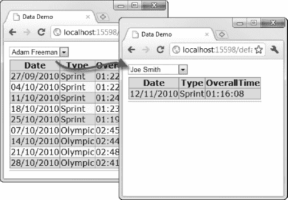

***图 18-23。**通过改变数据源中的属性来改变列表视图控件的内容*

作为题外话，我稍微作弊创建了图 18-23 中显示的 HTML。默认情况下，ListView 控件以完整格式显示日期，如 28/10/2010 00:00:00。为了得到短日期格式，我替换了这个标签的所有实例:

`<%# Eval("Date") %>`

有了这个:

`<%# Eval("Date", **"{0:d}")** %>`

在`ListView`控件的模板中。这将导致使用短日期模板格式化日期值。你将在第 [19](19.html#ch19) 和 [20](20.html#ch20) 章中了解更多关于数据控件及其外观的信息。

### 使用 LINQ 查询作为数据源

`LinqDataSource`控件只支持基本的 LINQ 子句，如`select`、`where`和`orderby`。正如我前面提到的，`LinqDataSource`控件将对任何强类型的`IEnumerable`序列进行操作。这样做的一个结果是能够使用代码中定义的 LINQ 查询的结果作为数据源。[清单 18-13](#list_18_13) 显示了在`Default.aspx.cs`代码隐藏文件中定义的 LINQ 查询。

***清单 18-13。**定义 LINQ 查询*

`using System;
using System.Collections.Generic;
using System.Linq;

namespace WebApp {

    public partial class Default : System.Web.UI.Page {
        **public IEnumerable<LinqWrapper> AthleteNames**
                **= new TrainingDataEntities().Events**
                    **.Select(ev => new LinqWrapper() { Name = ev.Athlete });**

        protected void Page_Load(object src, EventArgs e) {

        }
    }

    **public class LinqWrapper {**
        **public string Name { get; set; }**
    **}**
}`

`AthleteNames`字段包含对实体框架数据模型的 LINQ 查询的结果，该查询从`Event`实体对象中选择所有的`Athlete`属性。我们可以将该字段用作 LinqDataSource 控件的数据，该控件又可以填充 DropDownList 控件。目前，该查询没有做任何我们无法直接在数据模型上使用 LinqDataSource 控件实现的事情，但是请耐心等待一会儿。清单中有一些问题，我会在我们完成设置后指出。

向该页添加一个新的 LinqDataSource 控件，单击箭头，然后选择“配置数据源”。在向导的第一页选择`WebApp.Default`作为上下文对象，在第二页的表格菜单中选择`AthleteNames`。点击完成关闭向导并更新标记，应该如[清单 18-14](#list_18_14) 所示。

***清单 18-14。**创建由 LINQ 查询支持的 LinqDataSource】*

`...
<asp:LinqDataSource ID="LinqDataSource2" runat="server"
    ContextTypeName="WebApp.Default" EntityTypeName="" TableName="AthleteNames">
</asp:LinqDataSource>
...`

若要将新的 LinqDataSource 控件与列表相关联，请在设计图面上选择 DropDownList 控件，单击箭头，然后从弹出菜单中选择“选择数据源”。从下拉菜单中选择新的数据源控件，并确保两个数据字段都设置为`Name`(应该会自动填充)，如图[图 18-24](#fig_18_24) 所示。然后单击确定。这将更新标记，如清单 18-15 中的[所示。](#list_18_15)

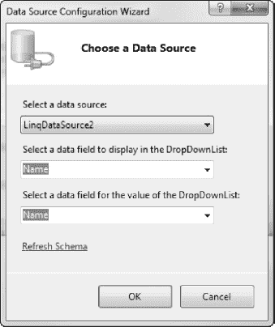

***图 18-24。**选择新的 LinqDataSource*

***清单 18-15。**更新后的 DropDownList 标记*

`...
<asp:DropDownList ID="DropDownList1" runat="server"
    DataSourceID="LinqDataSource2" DataTextField="Name"
    DataValueField="Name" AutoPostBack="True">
</asp:DropDownList>
...`

现在，当您查看页面时，数据下拉菜单是从 LINQ 查询的结果中获得的。我们可以从页面中移除 EntityDataSource 控件，因为它不再被使用。

#### 使用查询结果作为数据源

正如我前面提到的，这个例子有一些不太理想的地方。首先，我们需要像定义`AthleteName`字段一样定义 LINQ 查询。我们必须这样做，因为 WebForm数据源在任何页面事件被调用之前就被初始化了，而在`Page_PreInit`或`Page_Init`方法中给字段赋值已经太晚了，没有用了(参见[第 5 章](05.html#ch5)了解关于这些事件的信息)。

这不仅是一个丑陋的方法，而且这意味着我们不能改变 LINQ 查询的性质来响应页面的状态，而这正是我们在`Page_Load`方法中理想的做法。

第二个问题是我们需要创建一个名为`LinqWrapper`的助手类。我们使用的控件假定它们正在处理一组包含属性的结果对象，其中一个或多个将在页面显示中使用。假设我们编写了如下查询:

`public IEnumerable<string> AthleteNames
    = new TrainingDataEntities().Events
    .Select(ev => ev.Athlete);`

那么结果将是一系列的`string`值，数据控件允许我们只从`string`类中选择一个属性，而不是字符串本身。如果您想生成一个字符串长度的列表，这很好，但在其他情况下帮助不大。为了解决这个问题，我们将`Athlete`属性投影到一个简单的助手类中，该类具有一个名为`Name`的属性。这以数据控件可以使用的方式公开了`string`值。

我们可以通过使用 LINQ 查询的结果作为数据源，并使用一个内置的数据源控件来解决这两个问题。这种方法意味着我们失去了创建和配置数据源的设计界面支持，但是它给了我们很多自由。

第一步是更改 DropDownList 控件的标记，使其不再引用 LinqDataSource 控件，如[清单 18-16](#list_18_16) 所示。

***清单 18-16。**删除 DropDownList 控件中的数据源引用*

`...
<asp:DropDownList ID="DropDownList1" runat="server" AutoPostBack="True">
...`

现在我们可以改变代码隐藏类来使用新技术，如清单 18-17 所示。

***清单 18-17。**使用 LINQ 查询的结果作为数据源*

`using System;
using System.Collections.Generic;
using System.Linq;

namespace WebApp {

    public partial class Default : System.Web.UI.Page {

        protected void Page_Load(object src, EventArgs e) {` `if (!IsPostBack) {
**var results = new TrainingDataEntities().Events**
        **.Select(ev => ev.Athlete);**
**DropDownList1.DataSource = results;**
            **DropDownList1.DataBind();**
}
        }
    }
}`

我们定义查询并使用结果来设置 DropDownList 控件的`DataSource`属性。这告诉控件应该从查询生成的对象序列中获取数据。在这样做的时候，调用`DataBind`方法是很重要的——如果您忘记了，结果就不会显示出来。

最后要解决的问题是数据的重复。当我们使用 EntityDataSource 控件时，我们从`Athletes`表中读取名称，其中每个名称都是唯一的。现在我们正在从`Events`表中读取名字，我们在下拉列表中得到数据重复，如图[图 18-25](#fig_18_25) 所示。

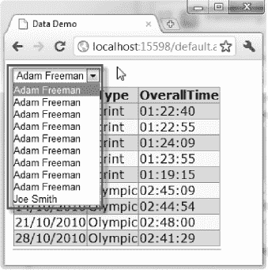

***图 18-25。**LINQ 结果中的数据重复*

这是一个很容易解决的问题，但它清楚地表明我们可以使用所有的 LINQ 功能，包括那些不容易通过 LinqDataSource 控件支持的功能。为了解决这个问题，我们简单地使用 LINQ `Distinct`方法，如[清单 18-18](#list_18_18) 所示。

***清单 18-18。**从 LINQ 结果中删除重复数据*

`using System;
using System.Collections.Generic;
using System.Linq;

namespace WebApp {

    public partial class Default : System.Web.UI.Page {

        protected void Page_Load(object src, EventArgs e) {

    if (!IsPostBack) {
            var results = new TrainingDataEntities().Events
                    .Select(ev => ev.Athlete)
                  .Distinct();
            DropDownList1.DataSource = results;
            DropDownList1.DataBind();
            }
        }
    }
}`

我们已经解决了所有的问题。我们可以通过编程来修改查询(因为我们在`Page_Load`方法中定义了它)，我们不需要使用助手类，并且我们可以使用所有的 LINQ 特性(因为我们不再使用数据源控件)。

#### 通过 XML 使用 LINQ

我们可以使用 LINQ 结果作为数据源，这使得使用 XML 数据变得非常容易。LINQ 对 XML 的支持非常好，我发现它比其他任何 XML 处理 API 都更灵活、更容易使用。清单 18-19 显示了如何使用 LINQ 处理 XML 数据来填充一个下拉列表。

***清单 18-19。**使用 LINQ 到 XML 来填充 WebForm控件*

`using System;
using System.Collections.Generic;
using System.Linq;
using System.Xml.Linq;

namespace WebApp {

    public partial class Default : System.Web.UI.Page {

        protected void Page_Load(object src, EventArgs e) {

            string xmlDataString = @"<Athletes>` `<Athlete>
<Name>Adam Freeman</Name>
<City>London</City>
</Athlete>
<Athlete>
<Name>Joe Smith</Name>
<City>New York</City>
</Athlete>
</Athletes>";

            if (!IsPostBack) {

                **var results = XDocument.Parse(xmlDataString)**
                    **.Descendants("Name")**
                    **.Select(elem => elem.Value);**

                DropDownList1.DataSource = results;
                DropDownList1.DataBind();
            }
        }
    }
}`

为了简单起见，我用一个字符串定义了 XML。数据是一个简单的结构，每个人的名字都包含在一个`Name`元素中。一个简单的 LINQ 查询将名称提取到一个结果序列中，然后该序列被用作 UI 控件的数据源。

### 总结

本章演示了如何使 Web 窗体 UI 控件可以访问数据。我们研究了两种主要方法。第一种是使用数据源控件，它提供了一种支持设计图面的方法来获取和准备数据。第二种方法是使用代码隐藏类来执行 LINQ 请求，并将查询结果直接用作数据源。这是最灵活的方法，但是它不太适合 Visual Studio 设计工具。

在下一章中，我们将仔细研究能够使用数据源的基本 WebForm控件，并为探索第 20 章中涉及的更复杂的控件奠定基础。