# 十九、使用 WebForm 数据绑定

*数据绑定*是用数据源中包含的数据填充 WebForm 控件内容的过程。可以以这种方式使用的 WebForm 控件被称为*数据绑定控件*，解释数据绑定控件如何工作的最有用的方法是将它们分为三类:基本、导航和富数据控件。

正如你将在本章学到的，用基本控件和导航控件执行数据绑定非常简单。使用富数据控件要复杂得多。因此，在我们下一章讨论它们之前，我们将花一些时间来看看幕后的情况，看看数据控件使用的技术。对富数据控件的工作原理了解得越多，在开发项目中使用它们时遇到的问题就越少。

### 与基本 WebForm 控件的数据绑定

在第 15 章中介绍的基本控件中，有五个常用于数据绑定:

*   项目符号
*   复选框
*   控件
*   列表框
*   单选按钮列表

在第 18 章中，你看到了如何用数据源填充 DropDownList 控件，其他控件的工作方式也差不多。所有这些控件的共同点是你可以用它们来*显示*数据元素；它们不提供编辑数据的能力。

您可以使用这些控件来丰富 web 应用的 UI。例如，当您可以从数据库加载值时，您不需要要求用户键入值。

[清单 19-1](#list_19_1) 显示了一个页面的标记，该页面包含所有五个数据绑定控件和一个`LinqDataSource`控件，该控件使用了从训练数据库派生的数据模型，正如我们在[第 18 章](18.html#ch18)中使用的一样(最初在[第 8 章](08.html#ch8)中创建)。这个例子使用了`EventType`实体对象，它有一个名为`Name`的属性。

***清单 19-1。**单个页面上的基本数据绑定控件*

`<%@ Page Language="C#" AutoEventWireup="true" CodeBehind="Default.aspx.cs"
Inherits="WebApp.Default" %>

<!DOCTYPE html PUBLIC "-//W3C//DTD XHTML 1.0 Transitional//EN"
"http://www.w3.org/TR/xhtml1/DTD/xhtml1-transitional.dtd">

<html >
<head runat="server">
<title></title>

</head>
<body>
<form id="form1" runat="server">

<code>BulletedList</code>
<asp:BulletedList ID="BulletedList1" runat="server"
                DataSourceID="LinqDataSource1" DataTextField="Name" DataValueField="Name"/>

<code>CheckBoxList</code>
<asp:CheckBoxList ID="CheckBoxList1" runat="server"
                DataSourceID="LinqDataSource1" DataTextField="Name" DataValueField="Name"/>

<code>DropDownList</code>
<asp:DropDownList ID="DropDownList1" runat="server"
                DataSourceID="LinqDataSource1" DataTextField="Name" DataValueField="Name"/>

<code>ListBox</code>
<asp:ListBox ID="ListBox1" runat="server" DataSourceID="LinqDataSource1"
                DataTextField="Name" DataValueField="Name"/>

<code>RadioButtonList</code>
<asp:RadioButtonList ID="RadioButtonList1" runat="server"
                DataSourceID="LinqDataSource1" DataTextField="Name" DataValueField="Name"/>

</form>
<asp:LinqDataSource ID="LinqDataSource1" runat="server"
        ContextTypeName="WebApp.TrainingDataEntities" EntityTypeName=""
        TableName="EventTypes">
</asp:LinqDataSource>` `</body>
</html>`

您可以看到每个控件的标记在数据绑定方面是相同的。`DataSourceID`、`DataTextField`和`DataValueField`属性决定了将要使用的数据源控件和数据类型属性。[图 19-1](#fig_19_1) 显示了在浏览器中显示的这个页面。

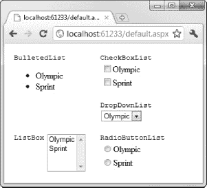

***图 19-1。**基本数据绑定控件*

这些控件都使用相同的向导屏幕来选择三个数据绑定属性的值(正如你在[第 18 章](18.html#ch18)中看到的)。正如在《T4》第 18 章中所讨论的，你可以依靠`DataSource`属性和`DataBind`方法，以编程方式使用 LINQ 查询的结果作为数据源。

### 使用导航控件

菜单和`TreeView`导航控件都支持数据绑定，但只支持分层数据。这意味着你可以将它们用于站点地图文件(如第十五章中所讨论的)或 XML 文档。

在这一节中，我将向您展示如何在 XML 中使用这些控件。这与上一章的方法略有不同，因为我们希望保留 XML 文档的层次结构，而不是使用 LINQ 来提取特定的值。

首先，使用 Visual Studio `Empty ASP.NET Application`模板创建一个新项目，并添加一个名为`Data.xml`的新 XML 文件。该文件的内容如清单 19-2 中的[所示。创建特殊的 ASP.NET 文件夹`App_Data`，并将 XML 文件放入其中。](#list_19_2)

***清单 19-2。**源 XML 数据*

`<?xml version="1.0" encoding="utf-8" ?>
<Athletes>
<Athlete Rank="Winner">
<name>Joe Smith</name>
<city>New York</city>
</Athlete>
<Athlete Rank="Runner-Up">
<name>Adam Freeman</name>
<city>London</city>
</Athlete>
</Athletes>`

这是一段简单的 XML，但是它具有层次性，我们将在导航控件中显示这一点。

向名为`Default.aspx`的页面添加一个新的 WebForm，并将一个`XmlDataSource`控件拖动到页面的设计图面。选择表面上的控件，单击箭头按钮，并从弹出菜单中选择`Configure Data Source`。

在配置数据源对话框中，`Data file`文本框允许您选择将要使用的 XML 文件，在本例中是`~/App_Data/Data.xml`。您还可以指定一个将应用于 XML 的转换(我们不会用到)和一个`XPath`表达式来只选择文件的一部分。在这种情况下，我们指定了`/Athletes/Athlete`，这样我们就得到一组顶级的`Athlete`节点，而没有封闭的`Athletes`元素。[图 19-2](#fig_19_2) 显示了完成的对话框。

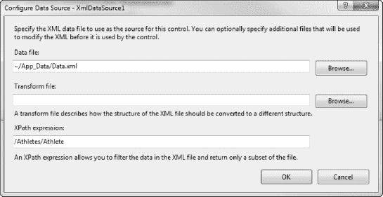

***图 19-2。**配置 XmlDataSource 控件*

被配置的`XmlDataSource`控件的标记显示在[清单 19-3](#list_19_3) 中。

***清单 19-3。**已配置的 XmlDataSource 控件的标记*

`...
<asp:XmlDataSource ID="XmlDataSource1" runat="server"
DataFile="~/App_Data/Data.xml" XPath="/Athletes/Athlete"></asp:XmlDataSource>
...`

我们现在可以添加一个`TreeView`控件。将一个拖到设计图面上，选择它，单击箭头按钮，并从“选择数据源”下拉菜单中选择 XmlDataSource。TreeView 控件的默认行为没有那么有用。正如你在图 19-3 中看到的，它显示了 XML 元素的名称。

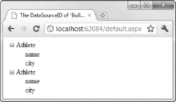

***图 19-3。**树形视图控件的默认行为*

要从这个控件中得到有用的东西，选择`Edit TreeNode Databindings`菜单项，如图[图 19-4](#fig_19_4) 所示。

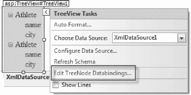

***图 19-4。**编辑树节点绑定*

[图 19-5](#fig_19_5) 显示了出现的树形视图数据绑定编辑器对话框。您需要告诉`TreeView`控件在`Available data bindings`文本框(在对话框的左上方)中为每个节点显示什么。对于`Athlete`、`name`和`city`中的每一个，选择节点，点击`Add`按钮，并如下更改`TextField`属性的值:

*   对于`Athlete`项，选择`Rank`作为`TextField`属性。这告诉 TreeView，每当它在 XML 数据中找到一个`Athlete`元素时，我们希望它显示`Rank`属性的值。
*   For the `name` and `city` items, set the `TextField` value to `#InnerText` (see [Figure 19-5](#fig_19_5)). This tells the control we want to display the text contained by the name and city items when it encounters them. 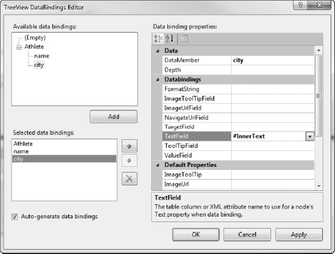

    ***图 19-5。**为数据层次结构中的每个节点配置绑定*

点击`OK`按钮关闭对话框并更新标记，这可以在[清单 19-4](#list_19_4) 中看到。

***清单 19-4。**已配置的树形视图控件的标记*

`...
<asp:TreeView ID="TreeView1" runat="server" DataSourceID="XmlDataSource1">
<DataBindings>
<asp:TreeNodeBinding DataMember="Athlete" TextField="Rank" />
<asp:TreeNodeBinding DataMember="name" TextField="#InnerText" />` `<asp:TreeNodeBinding DataMember="city" TextField="#InnerText" />
</DataBindings>
</asp:TreeView>
...`

现在当我们显示页面时，`TreeView`控件处理 XML 数据，找到我们使用标记中的`TreeNodeBinding`元素指定的 XML 元素，并显示适当的数据，如图[图 19-6](#fig_19_6) 所示。

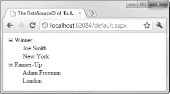

***图 19-6。**在浏览器中显示正确配置的树形视图控件*

对于`Menu`控件，您遵循相同的过程。我不会重复向导序列，但是[清单 19-5](#list_19_5) 显示了一个`Menu`控件的标记，它使用了与`TreeView`示例相同的`XmlDataSource`控件。

***清单 19-5。**用菜单控件将数据绑定到 XML*

`<asp:Menu ID="Menu1" runat="server" BackColor="#B5C7DE"
    DataSourceID="XmlDataSource1" DynamicHorizontalOffset="2" Font-Names="Verdana"
    Font-Size="0.8em" ForeColor="#284E98" Orientation="Horizontal"
    StaticSubMenuIndent="10px">
**<DataBindings>**
**<asp:MenuItemBinding DataMember="Athlete" TextField="Rank" />**
**<asp:MenuItemBinding DataMember="name" TextField="#InnerText" />**
**<asp:MenuItemBinding DataMember="city" TextField="#InnerText" />**
**</DataBindings>**
<DynamicHoverStyle BackColor="#284E98" ForeColor="White" />
<DynamicMenuItemStyle HorizontalPadding="5px" VerticalPadding="2px" />
<DynamicMenuStyle BackColor="#B5C7DE" />
<DynamicSelectedStyle BackColor="#507CD1" />
<StaticHoverStyle BackColor="#284E98" ForeColor="White" />
<StaticMenuItemStyle HorizontalPadding="5px" VerticalPadding="2px" />
<StaticSelectedStyle BackColor="#507CD1" />
</asp:Menu>`

我们也对这个菜单应用了一些样式，但是您可以清楚地看到`MenuItemBinding`元素对应于上一个示例中的`TreeNodeBinding`元素的方式。[图 19-7](#fig_19_7) 显示了在浏览器中显示的`Menu`控件(数据本身并不适合在菜单中使用，但是你可以理解)。

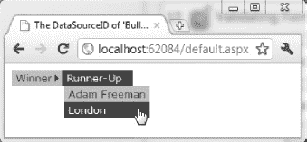

***图 19-7。**将菜单控件绑定到 XML 数据*

### 创建数据绑定模板

在我们看下一章的丰富数据控件之前，有必要研究一下这些控件使用的一些底层机制，特别是控件模板的工作方式。这些模板遵循与第 16 章中描述的方法相同的方法，但是它们被称为*数据绑定模板*，因为它们包含了您引入到项目中的数据的值。

掌握不同类型的模板有助于理解丰富的数据控件。在这个过程中，您将看到两个更简单的富数据控件，并使用它们来创建呈现包含数据值的 HTML 的模板。

首先，您需要创建一个数据源。使用 Visual Studio 空 ASP.NET 应用模板创建一个新项目，并创建一个名为`Default.aspx`的 WebForm。按照[第 8 章](08.html#ch8)中概述的步骤，为`TrainingData`数据库添加实体框架数据模型。创建 EntityDataSource 控件，配置时选择`Events`表作为数据源。清单 19-6 显示了本例中`Default.aspx`的标记。

***清单 19-6。**准备 Default.aspx 页面*

`<%@ Page Language="C#" AutoEventWireup="true" CodeBehind="Default.aspx.cs"
Inherits="WebApp.Default" %>

<!DOCTYPE html PUBLIC "-//W3C//DTD XHTML 1.0 Transitional//EN"
"http://www.w3.org/TR/xhtml1/DTD/xhtml1-transitional.dtd">

<html >
<head runat="server">
<title>Data Controls</title>
</head>
<body>
<form id="form1" runat="server">

` `

</form>
**<asp:EntityDataSource ID="EntityDataSource1" runat="server"**
        **ConnectionString="name=TrainingDataEntities"**
        **DefaultContainerName="TrainingDataEntities" EnableFlattening="False"**
        **EntitySetName="Events">**
**</asp:EntityDataSource>**
</body>
</html>`

这是我们的基线项目。我们现在可以向该页面添加控件并为它们定义模板。

#### 创建只读模板

我们将从向页面添加一个`Repeater`控件开始。`Repeater`控件使用模板为数据源中的每一项生成相同的 HTML。数据是只读的，`Repeater`控件不支持数据编辑。

从工具箱中拖动一个 Repeater 并放到页面上。选择设计图面上的控件，单击箭头按钮，并从`Choose Data Source`下拉菜单中选择我们刚刚创建的 EntityDataSource。我们需要在源窗口中定义中继器模板，因为设计工具不提供你在第 16 章中看到的中继器控件的图形支持。

最重要的 Repeater 模板是 ItemTemplate，它是您定义将为每个数据项显示的标记的方式。清单 19-7 展示了向`Default.aspx`页面添加 Repeater 控件和一个简单 ItemTemplate 的定义。

***清单 19-7。**添加和配置中继器控制*

`<%@ Page Language="C#" AutoEventWireup="true" CodeBehind="Default.aspx.cs"
Inherits="WebApp.Default" %>

<!DOCTYPE html PUBLIC "-//W3C//DTD XHTML 1.0 Transitional//EN"
"http://www.w3.org/TR/xhtml1/DTD/xhtml1-transitional.dtd">

<html >
<head runat="server">
<title>Data Controls</title>
</head>
<body>
<form id="form1" runat="server">

**<asp:Repeater ID="Repeater1" runat="server" DataSourceID="EntityDataSource1">**
**<ItemTemplate>**
**
**
**<asp:Label ID="Label1" runat="server" Text="Date:"/>**
**<asp:Label ID="Label2" runat="server"**` `**Text='<%# Eval("Date", "{0:d}") %>'/>**
**
**
**</ItemTemplate>**
**</asp:Repeater>**

</form>
<asp:EntityDataSource ID="EntityDataSource1" runat="server"
        ConnectionString="name=TrainingDataEntities"
        DefaultContainerName="TrainingDataEntities" EnableFlattening="False"
        EntitySetName="Events">
</asp:EntityDataSource>
</body>
</html>`

无论您在开始和结束`ItemTemplate`标签之间放置什么，都将为数据源提供的每个数据项呈现——在我们的例子中，为每个`Event`实体对象呈现。我们可以自由混合纯 HTML，HTML 控件，WebForm 控件。在这个例子中，我们在一个常规的`div`元素中放置了两个标签控件。

模板的关键部分是我们为第二个标签控件设置`Text`属性的方式，如下所示:

`Text='<%# Eval("Date", "{0:d}") %>'`

以`<%#`开头的标签被称为*单值数据绑定表达式*。这些标记从应用的某个部分检索数据值，并在呈现页面时将其插入 HTML。

 **注意**注意我们需要使用单引号(`'`)来打开和关闭`Text`属性的值。这是因为我们必须使用双引号(`"`)来描述`Eval`方法的参数。

这些标记可以检索页面或代码隐藏类中任何字段、属性或方法的值。例如，如果我们的代码隐藏类包含一个名为`Name`的属性和一个名为`GetTime`的方法，我们可以使用以下数据绑定表达式标记来访问每个属性的值:

`<%# Name %>
<%# GetTime() %>`

清单 19-7 中的绑定表达式调用`Page.Eval`方法，该方法检索您指定的属性名的值——在本例中为`Date`。`Eval`方法采用可选的第二个参数，这是一个将应用于数据值的复合格式字符串。我们已经指定了`{0:d}`，它将从`DateTime`值中提取日期部分。

当您在像 Repeater 这样的富数据控件中使用数据绑定表达式时，您不需要担心正在处理哪个数据项。控件会为您处理这些，您对`Eval`的调用将返回当前数据项的适当值。

当你在浏览器中显示页面时，模板被应用到每个数据项中，`Date`属性的值被添加到 HTML 中，如图[图 19-8](#fig_19_8) 所示。

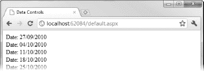

***图 19-8。**在中继器控制模板中使用数据绑定表达式*

模板可以包含任意数量的数据绑定表达式。我在这个例子中只展示了一个，但是为`Event`实体类中的其他属性添加标记是一件简单的事情，遵循我们为`Date`属性使用的相同格式。

Repeater 控件还支持许多其他模板，包括一个用于标题的模板。我可以用这个模板和一些 CSS 创建一个小网格。这个标记如清单 19-8 中的[所示。](#list_19_8)

***清单 19-8。**中继器控制模板中的多个数据绑定*

`<%@ Page Language="C#" AutoEventWireup="true" CodeBehind="Default.aspx.cs"
Inherits="WebApp.Default" %>

<!DOCTYPE html PUBLIC "-//W3C//DTD XHTML 1.0 Transitional//EN"
"http://www.w3.org/TR/xhtml1/DTD/xhtml1-transitional.dtd">

<html >
<head runat="server">
<title>Data Controls</title>

</head>
<body>
<form id="form1" runat="server">

**<asp:Repeater ID="Repeater1" runat="server" DataSourceID="EntityDataSource1">**
**<ItemTemplate>**
**
**
**<asp:Label ID="Label1" runat="server" Text='<%# Eval("Date", "{0:d}") %>'/>**
**<asp:Label ID="Label2" runat="server" Text='<%# Eval("Type") %>'/>**
**<asp:Label ID="Label3" runat="server" Text='<%# Eval("OverallTime") %>'/>**
**
**
**</ItemTemplate>**
**<HeaderTemplate>**
**
**` `**<asp:Label ID="Label4" runat="server" Text="Date"/>**
**<asp:Label ID="Label5" runat="server" Text="Type"/>**
**<asp:Label ID="Label6" runat="server" Text="Time"/>**
**
**
**</HeaderTemplate>**
**</asp:Repeater>**

</form>
<asp:EntityDataSource ID="EntityDataSource1" runat="server"
        ConnectionString="name=TrainingDataEntities"
        DefaultContainerName="TrainingDataEntities" EnableFlattening="False"
        EntitySetName="Events">
</asp:EntityDataSource>
</body>
</html>`

对于这个例子，在为`Type`和`OverallTime`属性调用`Eval`方法时，我不需要使用格式化参数，因为我很乐意“按原样”显示数据值[图 19-9](#fig_19_9) 显示了简单的网格效果。

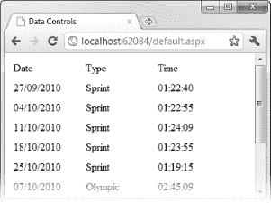

***图 19-9。**通过在控件模板中使用数据绑定来应用简单的网格效果*

#### 使用数据项容器

当数据绑定系统呈现您的模板时，您可以访问一个名为`Container`的属性。这是一个实现`IDataItemContainer`接口的类，由数据绑定控件用来表示数据项。`IDataItemContainer`接口定义了三个在模板中有用的属性，如[表 19-1](#tab_19_1) 所述。

T2】

当我们在本章后面查看分页模板时，我们将返回到`DisplayIndex`属性，但是我们可以在当前的例子中很好地利用其他属性。[清单 19-9](#list_19_9) 展示了应用在 Repeater 模板中的这些属性。

***清单 19-9。**使用 IDataItemContainer 属性*

`<%@ Page Language="C#" AutoEventWireup="true" CodeBehind="Default.aspx.cs"
Inherits="WebApp.Default" %>
**<%@ Import Namespace="WebApp" %>**

<!DOCTYPE html PUBLIC "-//W3C//DTD XHTML 1.0 Transitional//EN"
"http://www.w3.org/TR/xhtml1/DTD/xhtml1-transitional.dtd">

<html >
<head runat="server">
<title>Data Controls</title>

</head>
<body>
<form id="form1" runat="server">

<asp:Repeater ID="Repeater1" runat="server" DataSourceID="EntityDataSource1">
<ItemTemplate>

**<asp:Label ID="Label1" runat="server"**
                    **Text='<%# ((IDataItemContainer)Container).DataItemIndex + 1 %>'/>**
<asp:Label ID="Label2" runat="server"
                    Text='<%# Eval("Date", "{0:d}") %>'/>
**<asp:Label ID="Label3" runat="server"**
**                    Text='<%# ((Event)Container.DataItem).Type %>'/>**
**<asp:Label ID="Label4" runat="server"**
**                    Text='<%# DataBinder.Eval(Container.DataItem, "OverallTime") %>'/>**

</ItemTemplate>
<HeaderTemplate>` `

<asp:Label ID="Label5" runat="server" Text="#"/>
<asp:Label ID="Label6" runat="server" Text="Date"/>
<asp:Label ID="Label7" runat="server" Text="Type"/>
<asp:Label ID="Label8" runat="server" Text="Time"/>

</HeaderTemplate>
</asp:Repeater>

</form>
<asp:EntityDataSource ID="EntityDataSource1" runat="server"
        ConnectionString="name=TrainingDataEntities"
        DefaultContainerName="TrainingDataEntities" EnableFlattening="False"
        EntitySetName="Events" EnableDelete="True" EnableInsert="True"
        EnableUpdate="True">
</asp:EntityDataSource>
</body>
</html>`

`Container`属性返回一个实现`IDataItemContainer`接口的对象，这意味着我们可以在简单的网格中添加一列，显示每个数据项在数据序列中的索引，如下所示:

`<asp:Label ID="Label1" runat="server"
    Text='<%#((IDataItemContainer)Container).DataItemIndex + 1 %>'/>`

为了访问`DataItemIndex`属性，我们需要转换到`IDataItemContainer`。出于某种原因，Repeater 控件用作`IDataItemContainer`的类隐藏了`DataItemIndex`属性。然而，它实现了一个等价的`ItemIndex`属性，所以我们可以通过使用下面的表达式得到相同的结果:

`<asp:Label ID="Label1" runat="server" Text='<%# Container.ItemIndex + 1 %>'/>`

注意，在这两种情况下，我们都可以在表达式中添加一个整数值。索引是从零开始的，但是通过在表达式中执行计算，我们能够生成一个从 1 开始的数字序列。

清单 19-9 中的另外两个新绑定表达式展示了如何访问`DataItem`属性。我们可以忽略`Eval`方法，简单地将`DataItem`属性的值转换为一个对象，如下所示:

`<asp:Label ID="Label3" runat="server" Text='<%# ((Event)Container.DataItem).Type %>'/>`

为了让这个表达式起作用，我们向页面添加一个指令来导入包含`Event`类的名称空间:

`<%@ Import Namespace="WebApp" %>`

或者，我们可以将我们需要的属性的`DataItem`值和名称传递给静态的`DataBinder.Eval`方法，就像这样:

`<asp:Label ID="Label4" runat="server"
    Text='<%# DataBinder.Eval(Container.DataItem, "OverallTime") %>'/>`

你可以在[图 19-10](#fig_19_10) 中看到新模板生成的 HTML。正如您所料，除了新的数字列之外，数据看起来是一样的。

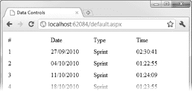

***图 19-10。**通过 IDataItemContainer 接口获取数据值*

关于这两种技术中哪一种性能最好，互联网上的讨论没完没了。这场辩论没有抓住要点。如果您在使用数据绑定时担心性能而不是方便，那么 Web Forms 可能不是您项目的最佳平台。我的建议是用你喜欢的任何一种方法。如果性能是一个问题，那么考虑切换到 MVC 框架，这给了你所有你想要的困扰和微调性能的机会(关于 MVC 框架的细节，请参见本书的第四部分)。

#### 创建编辑器模板

`Eval`方法创建了一个*单向绑定*，这意味着您可以读取数据值，但不能编辑它。在这一节中，我将向您展示如何使用*双向绑定*，通过它您可以读取*和*编辑值。但是在开始使用这种类型的绑定之前，我们需要修改数据源以支持修改数据值。

在设计图面上选择 EntityDataSource 控件，单击箭头按钮，然后从弹出菜单中选择“配置数据源”。点击下一步按钮进入向导，然后勾选启用自动插入、启用自动更新和启用自动删除选项，如图[图 19-11](#fig_19_11) 所示。单击“完成”关闭向导并更新数据源控件的标记。

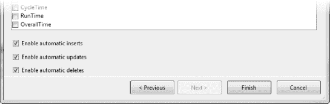

***图 19-11。**启用数据源控件选项修改数据*

Repeater 控件不支持编辑数据，所以我们要用另一个富数据控件:FormView。FormView 控件为单个数据项生成标记，而不是为序列中的每个项生成标记。

从页面中移除 Repeater 控件，并从工具箱中拖动一个 FormView 控件来替换它。选择控件，单击箭头按钮，然后从下拉列表中选择 EntityDataSource 控件。当您选择数据源时，Visual Studio 将为 FormView 控件生成一组模板。我们将删除这些并重新开始，这样我们可以逐步建立标记。从 FormView 控件中移除标记，直到它看起来像清单 19-10 中所示的那样。

***清单 19-10。**FormView 控件标记的起点*

`...
<asp:FormView ID="FormView1" runat="server"
**DataKeyNames="ID"**
    DataSourceID="EntityDataSource1">
</asp:FormView>
...`

添加到控件标记中的是`DataKeyNames`属性，它指定了数据键。我们需要进行这样的设置，以便 FormView 和 EntityDataSource 控件可以正确地协同工作，修改数据模型和数据库中的数据。对于`Events`表，主键是`ID`。我们现在可以向 FormView 控件添加一个`ItemTemplate`元素，它将呈现数据的只读视图。[清单 19-11](#list_19_11) 展示了这个模板。

***清单 19-11。**向 FormView 控件添加 item template*

`<asp:FormView ID="FormView1" runat="server"
    DataKeyNames="ID"
    DataSourceID="EntityDataSource1">
**<ItemTemplate>**
**<tr>**
**<td><asp:Label ID="Label1" runat="server" Text="Date:"/></td>**
**<td><asp:Label ID="Label2" runat="server"**
**                Text='<%# Eval("Date", "{0:d}") %>'/></td>**
**</tr>**
**<tr>**
**<td><asp:Label ID="Label3" runat="server" Text="Type:"/></td>**
**<td><asp:Label ID="Label4" runat="server"**
**                    Text='<%# Eval("Type") %>'/></td>**
**</tr>**
**<tr>**
**<td><asp:Label ID="Label5" runat="server" Text="Time:"/></td>**
**<td><asp:Label ID="Label6" runat="server"**
**                    Text='<%# Eval("OverallTime") %>'/></td>**
**</tr>**
**<tr>**
**<td colspan="2" class="button">**
**<asp:Button ID="Button1" runat="server"**
**                Text="Edit Record" CommandName="Edit" />**` `**</td>**
**</tr>**
**</ItemTemplate>**
</asp:FormView>`

默认情况下，FormView 控件生成一个外部 HTML `table`，我们使用模板创建包含`tr`和`td`元素的表格行。我们可以使用`RenderOuterTable`属性禁用这种行为，但是我们会让它保持启用状态，因为它符合我们对这个简单示例的需求。在 ItemTemplate 中，我们为每个`Date`、`Type`和`OverallTime`属性定义了一个`tr`元素，该行包含一个静态和一个数据绑定标签控件。每个标签都包含在自己的`td`元素中，数据绑定标签的内容使用前面示例中介绍的`Eval`方法进行设置。

在模板的最后，我们定义了一个包含一个单元格的表格行，该单元格又包含一个按钮控件。这就是我们如何从只读数据视图切换到可编辑数据视图。按钮控件是用`CommandName`属性指定的(在[第 15 章](15.html#ch15)中有描述)，这允许我们添加尽可能多的按钮到模板中，并且 FormView 控件能够响应它们而不需要发现和注册单独控件的事件。

在这种情况下，命令是`Edit`。这是 FormView 控件切换到在`EditItemTemplate`元素中定义的标记的提示。[清单 19-12](#list_19_12) 展示了如何将这个模板添加到 FormView 控件中。

***清单 19-12。**向 FormView 控件添加 edititem template*

`<asp:FormView ID="FormView1" runat="server"
    DataKeyNames="ID"
    DataSourceID="EntityDataSource1">

<ItemTemplate>
        <!-- elements removed for clarity -->
</ItemTemplate>
**<EditItemTemplate>**
**<tr>**
**<td><asp:Label ID="Label1" runat="server" Text="Date:"/></td>**
**<td>**
**<asp:TextBox ID="TextBox1" runat="server"**
**                Text='<%# Bind("Date", "{0:d}") %>'/>**
**</td>**
**</tr>**
**<tr>**
**<td><asp:Label ID="Label2" runat="server" Text="Type:"/></td>**
**<td><asp:TextBox ID="TextBox2" runat="server"**
**            Text='<%# Bind("Type") %>'/>**
**</td>**
**</tr>**
**<tr>**
**<td><asp:Label ID="Label3" runat="server" Text="Time:"/></td>**
**<td>**
**<asp:TextBox ID="TextBox3" runat="server"**
**                Text='<%# Bind("OverallTime") %>'/>**
**</td>**
**</tr>**` `**<tr>**
**<td class="button">**
**<asp:Button ID="Button1" runat="server"**
**                Text="Save Change" CommandName="Update" />**
**</td>**
**<td class="button">**
**<asp:Button ID="Button2" runat="server"**
**                Text="Cancel" CommandName="Cancel" />**
**</td>**
**</tr>**
**</EditItemTemplate>**
</asp:FormView>`

这是一个很长的设置，实际上是一个简单的变化。我们需要定义一个全新的模板来编辑数据项，但是我们关心的部分是数据绑定表达式，例如:

`<asp:TextBox ID="TextBox3" runat="server" Text='**<%# Bind("OverallTime") %>'/>**`

我们用对`Bind`的调用替换对`Eval`方法的调用。这创建了一个双向绑定，因此对数据值的更改将导致底层数据模型和数据库的更新。当然，我们需要将这种绑定用于允许用户编辑值的 WebForm 控件。这种情况下。我们使用了一个文本框控件。

我们需要创建一个机制来发布表单，并告诉 FormView 控件我们希望它对数据做什么。为此，我们再次使用了`CommandName`功能。`Update`的`CommandName`值告诉控件我们想要保存用户所做的任何更改，并将它们作为更新推送到数据库。`Cancel`值告诉控件放弃任何更改。单击任一按钮后，FormView 控件恢复显示 ItemTemplate 中定义的内容。

 **提示**FormView 控件支持其他`CommandName`值和模板。为 FormView 控件选择数据源时，可以在 Visual Studio 生成的模板中看到完整的模板集。

这些模板和命令的效果如图[图 19-12](#fig_19_12) 所示。当您单击“编辑”按钮时，将显示 EditItemTemplate，以便我们可以编辑数据值。单击 Save Changes 按钮，使用 ItemTemplate 更新并重新显示数据。

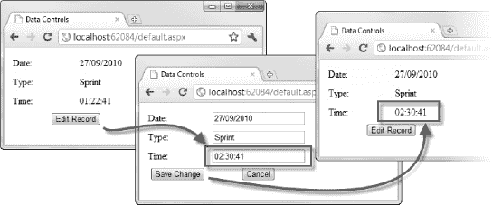

***图 19-12。**使用双向数据绑定编辑数据*

### 使用分页

您可以使用*分页*来允许用户在项目超过您可以合理显示的数量时浏览数据。这可能是因为您正在使用一个列出数据的控件(如`Repeater`)，并且您不希望列表永远继续下去，或者因为一个控件只能显示一条记录(如`FormView`)，并且您希望用户能够选择显示哪条记录。一些数据控件直接支持分页，而另一些则需要您走稍微长一点的路由才能达到同样的效果。

#### 使用支持分页的控件

内置支持分页的控件的一个很好的例子是`FormView`。该控件一次仅显示一个数据项或记录，但添加的分页功能允许用户决定哪条记录将成为哪条*。启用分页很简单:只需将`AllowPaging`属性设置为`True`，如[清单 19-13](#list_19_13) 所示。(为了便于阅读，我省略了清单中模板的内容。)*

***清单 19-13。**在 FormView 控件中启用分页*

`<asp:FormView ID="FormView1" runat="server"
    DataKeyNames="ID"
    DataSourceID="EntityDataSource1"
    **AllowPaging="True">**
**<PagerSettings Mode="Numeric" />**
<ItemTemplate>
*    ... elements removed for clarity ...*
</ItemTemplate>
<EditItemTemplate>
*        ... elements removed for clarity ...*
</EditItemTemplate>
</asp:FormView>`

我们添加了一个`PageSettings`元素，可以用来配置 FormView 控制的默认分页模板。通过`Mode`属性，您可以选择四种设置之一:`Numeric`、`NumericFirstLast`、`NextPrevious`或`NextPreviousFirstLast`。这些模式的不同之处在于呈现给用户用于记录间导航的 HTML 元素。[图 19-3](#fig_19_3) 显示了`Numeric`模式。

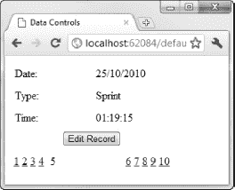

***图 19-13。**FormView 控件的数字分页模式*

FormView 控件生成一组链接，将用户带到指定索引处的数据记录。分页元素的外观非常简单，但是 FormView 控件定义了一组允许您应用样式的属性。

 **提示**数据项出现的顺序由数据源决定。对于 EntityDataSource 控件，这通常是记录在数据模型后面的数据库表中出现的顺序。然而，情况并非总是如此。如果数据项出现的顺序在您的项目中很重要，那么您应该使用 LinqDataSource 控件并应用一个`OrderBy`子句。

我们可以忽略内置的分页模板，使用`PagerTemplate`元素定义自己的模板，如[清单 19-14](#list_19_14) 所示。

***清单 19-14。**为 FormView 控件定义分页模板*

`...
<asp:FormView ID="FormView1" runat="server"
    DataKeyNames="ID"
    DataSourceID="EntityDataSource1"
    AllowPaging="True">
**<PagerTemplate>**
**<table>**
**<tr>**
**<td>**` `**<asp:Button ID="Button3" runat="server" Text="First"**
**CommandName="Page" CommandArgument="First" />**
**</td>**
**<td>**
**<asp:Button ID="Button4" runat="server" Text="Prev"**
**CommandName="Page" CommandArgument="Prev"/>**
**</td>**
**<td>**
**<%# Container.PageIndex + 1 %> of <%# Container.PageCount %>**
**</td>**
**<td>**
**<asp:Button ID="Button5" runat="server" Text="Next"**
**CommandName="Page" CommandArgument="Next"/>**
**</td>**
**<td>**
**<asp:Button ID="Button6" runat="server" Text="Last"**
**CommandName="Page" CommandArgument="Last"/>**
**</td>**
**</tr>**
**</table>**
**</PagerTemplate>**
<ItemTemplate>
*        ... elements removed for clarity ...*
</ItemTemplate>
<EditItemTemplate>
*        ... elements removed for clarity ...*
</EditItemTemplate>
</asp:FormView>
...`

与主模板不同，FormView 控件不呈现外部表格，所以如果您想要这种样式的布局，您必须自己动手。

当创建按钮时(使用按钮控件或其他类似的控件，如 LinkButton)，我们使用`CommandName`和`CommandArgument`属性告诉 FormView 控件当按钮被按下时要做什么。在寻呼模板中，`CommandName`必须是`Page`，支持的`CommandArgument`值为`First`、`Last`、`Prev`、`Next`。这些按钮使用户可以控制 FormView 控件显示哪些数据记录。

我们可以更进一步，使用数据绑定让用户了解数据的上下文，就像这样:

`<%# Container.PageIndex + 1 %> of <%# Container.PageCount %>`

与 Repeater 控件使用单独的类来实现`IDataItemContainer`接口不同，FormView 控件直接实现这个接口。这意味着我们可以引用由 FormView 类定义的`PageIndex`和`PageCount`属性来获得显示的页面的详细信息以及有多少页面。显然，当使用显示多条记录的控件时，情况会有所不同。

#### 使用 PagedDataSource 控件

您仍然可以通过使用`PagedDataSource`控件向不支持分页的控件添加分页。这种方法需要更多的努力，正如您将看到的，它有一个严重的缺点。以这种方式添加分页对于大多数项目来说并不合适，因为使用一个*支持分页的控件是很简单的事情。我在这里提供了一个关于如何使用 WebForm 数据绑定的更完整的视图。*

 **注意**paged data source 控件是`System.Web.UI.WebControls`名称空间的一部分(像其他数据源控件一样)，但是微软没有在任何地方记录。这意味着使用 PagedDataSource 控件需要一些反复试验。

为了演示手动添加分页，向名为`Pager.aspx`的项目中添加一个新页面，并给它一个 Repeater 控件。清单 19-15 显示了页面的标记。

***清单 19-15。**pager . aspx 页面标记*

`<%@ Page Language="C#" AutoEventWireup="true" CodeBehind="Pager.aspx.cs"
Inherits="WebApp.Pager" %>

<!DOCTYPE html PUBLIC "-//W3C//DTD XHTML 1.0 Transitional//EN"
"http://www.w3.org/TR/xhtml1/DTD/xhtml1-transitional.dtd">

<html >
<head runat="server">
<title></title>

</head>
<body>
<form id="form1" runat="server">

<asp:Repeater ID="Repeater1" runat="server">
<ItemTemplate>

<asp:Label ID="Label1" runat="server" Text='<%# Eval("Date", "{0:d}") %>'/>
<asp:Label ID="Label2" runat="server" Text='<%# Eval("Type") %>'/>
<asp:Label ID="Label3" runat="server" Text='<%# Eval("OverallTime") %>'/>

</ItemTemplate>
<HeaderTemplate>

<asp:Label ID="Label4" runat="server" Text="Date"/>
<asp:Label ID="Label5" runat="server" Text="Type"/>
<asp:Label ID="Label6" runat="server" Text="Time"/>

` `</HeaderTemplate>
</asp:Repeater>

<table>
<tr>
<td>
<asp:Button ID="Button1" runat="server" Text="Prev" CommandName="Prev"/>
</td>
<td style="text-align:center">
<asp:Label ID="PagerLabel" runat="server" Text="Label"></asp:Label>
</td>
<td>
<asp:Button ID="Button2" runat="server" Text="Next" CommandName="Next"/>
</td>
</tr>
</table>

</form>
</body>
</html>`

当使用 PagedDataSource 控件时，我们负责为用户创建界面元素来浏览数据。对于本例，我们定义了两个按钮控件，它们将移动到下一条和上一条记录，还定义了一个标签控件，它将为用户提供上下文。注意，我们没有在标记中定义数据源。我们必须在代码隐藏类中以编程方式做到这一点。[清单 19-16](#list_19_16) 展示了`Pager.aspx`页面的代码隐藏类。

***清单 19-16。**寻呼机代码隐藏类*

`using System;
using System.Linq;
using System.Web.UI.WebControls;

namespace WebApp {
    public partial class Pager : System.Web.UI.Page {
        private PagedDataSource DataSource;

        protected void Page_Load(object sender, EventArgs e) {

            DataSource = new PagedDataSource();
            DataSource.AllowPaging = true;
            DataSource.DataSource = new TrainingDataEntities().Events.ToArray();
            DataSource.PageSize = 1;

            Repeater1.DataSource = DataSource;` `            if (!IsPostBack) {
                DoCommonPrep();
                ViewState["page_index"] = 0;
            }
        }

        private void DoCommonPrep() {
            Button1.Enabled = !DataSource.IsFirstPage;
            Button2.Enabled = !DataSource.IsLastPage;
            Repeater1.DataBind();
            PagerLabel.Text = String.Format("{0} of {1}",
                DataSource.CurrentPageIndex + 1,
                DataSource.DataSourceCount);
        }

        protected override bool OnBubbleEvent(object source, EventArgs args) {

            if (args is CommandEventArgs) {

                int page_index = int.Parse(ViewState["page_index"].ToString());

                switch (((CommandEventArgs)args).CommandName) {
                    case "Prev":
                        DataSource.CurrentPageIndex = Math.Max(page_index - 1, 0);
                        break;
                    case "Next":
                        DataSource.CurrentPageIndex = Math.Min(page_index + 1,
                            DataSource.DataSourceCount -1);
                        break;
                }

                DoCommonPrep();
                ViewState["page_index"] = DataSource.CurrentPageIndex;
                return true;
            }
            return false;
        }
    }
}`

这是一种与你到目前为止所看到的方法完全不同的方法，所以我将分解这个类，分阶段地介绍一下正在发生的事情。我们从`Page_Load`方法开始:

`...
public partial class Pager : System.Web.UI.Page {
    private PagedDataSource DataSource;

    protected void Page_Load(object sender, EventArgs e) {

        DataSource = new PagedDataSource();
        DataSource.AllowPaging = true;` `        DataSource.DataSource = new TrainingDataEntities().Events.ToArray();
        DataSource.PageSize = 1;

        Repeater1.DataSource = DataSource;

        if (!IsPostBack) {
            DoCommonPrep();
            ViewState["page_index"] = 0;
        }
    }
...`

在此方法中，我们从创建和配置 PagedDataSource 控件开始。该控件充当我们的数据和中继器控件之间的中介。就 Repeater 控件而言，PagedDataSource 是一个只包含一个数据项的标准数据源控件。我们显式地更改了 PagedDataSource 控件向 Repeater 控件显示的项目，从而创建了数据分页的效果。

将`AllowPaging`属性设置为`true`会启用分页行为。`PageSize`属性允许我们设置 PagedDataSource 控件一次向 Repeater 控件显示多少数据项。在这种情况下，它是一个项目，因此我们可以创建一个类似于我们用 FormView 控件实现的效果。

`DataSource`属性允许我们告诉 PagedDataSource 控件在哪里获取它的数据项，这就是我们遇到这种方法的缺点的地方。PagedDataSource 控件只处理实现了`ICollection`接口的数据序列。这样它就可以确定有多少条记录，并计算出页数。这种方法不太适合实体框架，因为实体框架试图将对数据库的查询推迟到需要数据的时候。它没有实现`ICollection`接口，因为它无法预先知道一个查询将从数据库中返回多少记录。

为了解决这个问题，我们必须强制实体框架从数据库中检索数据，以便 PagedDataSource 控件可以使用它。最简单的方法是调用`ToArray`方法。问题是我们最终加载了数据库表`Events`中的所有行，尽管我们打算只向用户显示一行。这是一种难以置信的资源浪费，应该小心使用。

回到`Page_Load`方法，一旦我们创建并配置了 PagedDataSource 控件，我们就使用`DataSource`属性将其设置为 Repeater 控件的数据源。

如果我们正在处理的请求不是回发(由按下导航按钮引起)，那么我们需要执行一些进一步的配置。我们调用`DoCommonPrep`方法，并在视图状态中设置一个值来指示正在显示的数据记录的索引。`DoCommonPrep`方法包含一些我们需要执行的动作，不管页面是为初始视图设置的还是因为用户按下了其中一个按钮而更新的。方法如下:

`private void DoCommonPrep() {
    Button1.Enabled = !DataSource.IsFirstPage;
    Button2.Enabled = !DataSource.IsLastPage;
    Repeater1.DataBind();
    PagerLabel.Text = String.Format("{0} of {1}",
        DataSource.CurrentPageIndex + 1,
        DataSource.DataSourceCount);
}`

PagedDataSource 控件定义了`IsFirstPage`和`IsLastPage`方法，如果当前显示的页面是第一页或最后一页，这两个方法分别返回`true`。当按下按钮控件会使显示前进到超出数据序列界限的记录时，我们使用这些属性来禁用按钮控件。

需要调用`DataBind`方法来确保 Repeater 控件显示 PagedDataSource 控件显示的数据项；如果没有这个，就不会显示任何数据。然后，我们设置 Label 控件的内容，使用`CurrentPageIndex`向用户显示一个上下文字符串，并设置`DataSourceCount`属性来显示当前页面的索引和可用页面的总数。因为我们一次只显示一条记录，所以`DataSourceCount`属性有效地报告了从数据库中检索到的数据项的数量。

最后，我们覆盖`OnBubbleEvent`方法来处理按钮控件发出的气泡事件。在这个方法中，我们增加或减少`CurrentPageIndex`属性来告诉 PagedDataSource 控件应该显示哪个数据项，并设置视图数据值以准备进一步的更新。

你可以在[图 19-14](#fig_19_14) 中看到这样分页的效果。

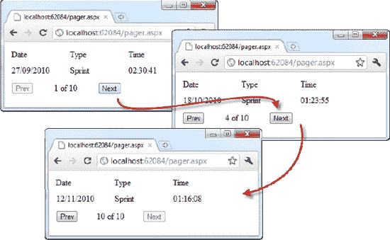

***图 19-14。**使用中继器控制寻呼*

#### 解决数据加载问题

我们真的不想加载所有的`Events`记录，然后丢弃其中的大部分。我们可以通过使用*自定义分页来改善这种情况。*这里您负责向 `PagedDataSource`控件提供它需要传递给`Repeater`控件的记录，并向它提供总共有多少记录的信息。清单 19-17 显示了定制分页是如何完成的。

***清单 19-17。**用 PagedDataSource 控件自定义分页*

`using System;
using System.Linq;
using System.Web.UI.WebControls;

namespace WebApp {
    public partial class Pager : System.Web.UI.Page {
        private PagedDataSource DataSource;
        private TrainingDataEntities Entities;

        protected void Page_Load(object sender, EventArgs e) {

            Entities = new TrainingDataEntities();

            DataSource = new PagedDataSource();
            DataSource.AllowPaging = true;
            DataSource.AllowCustomPaging = true;
            DataSource.PageSize = 1;
            DataSource.VirtualCount = Entities.Events.Count();

            Repeater1.DataSource = DataSource;

            if (!IsPostBack) {
                DoCommonPrep();
                ViewState["page_index"] = 0;
            }
        }

        private void DoCommonPrep() {

            DataSource.DataSource = Entities.Events
                .OrderBy(item => item.ID)
                .Skip(DataSource.CurrentPageIndex)
                .Take(1);

            Repeater1.DataBind();

            Button1.Enabled = !DataSource.IsFirstPage;
            Button2.Enabled = !DataSource.IsLastPage;

            PagerLabel.Text = String.Format("{0} of {1}",
                DataSource.CurrentPageIndex + 1,
                DataSource.DataSourceCount);
        }` `        protected override bool OnBubbleEvent(object source, EventArgs args) {

            if (args is CommandEventArgs) {

                int page_index = int.Parse(ViewState["page_index"].ToString());

                switch (((CommandEventArgs)args).CommandName) {
                    case "Prev":
                        DataSource.CurrentPageIndex = Math.Max(page_index - 1, 0);
                        break;
                    case "Next":
                        DataSource.CurrentPageIndex = Math.Min(page_index + 1,
                            DataSource.VirtualCount - 1);
                        break;
                }

                DoCommonPrep();
                ViewState["page_index"] = DataSource.CurrentPageIndex;
                return true;
            }
            return false;
        }
    }
}`

让我们再看一遍这个类，检查一下变化，从`Page_Load`方法开始:

`...
public partial class Pager : System.Web.UI.Page {
    private PagedDataSource DataSource;
**    private TrainingDataEntities Entities;**

    protected void Page_Load(object sender, EventArgs e) {

**        Entities = new TrainingDataEntities();**

        DataSource = new PagedDataSource();
        DataSource.AllowPaging = true;
**        DataSource.AllowCustomPaging = true;**
        DataSource.PageSize = 1;
**        DataSource.VirtualCount = Entities.Events.Count();**

        Repeater1.DataSource = DataSource;

        if (!IsPostBack) {
            DoCommonPrep();
            ViewState["page_index"] = 0;
        }
    }
...`

正如您将看到的，我们需要在类中的两个点上引用实体数据模型，所以我们将`TrainingDataEntities`对象移动为类字段。在配置 PagedDataSource 控件时，我们做了两处更改:

*   第一种方法是将`AllowCustomPaging`属性设置为`true`，这只是启用了定制分页特性。
*   第二个是设置`VirtualCount`属性的值。当使用自定义分页时，PagedDataSource 控件不知道有多少项，因此我们需要通过`VirtualCount`属性提供一个值。这允许控件计算其他属性的值，比如`IsFirstPage`和`CurrentPageCount`。

为了确定有多少条`Event`记录，我们在`TrainingDataEntities`对象的`Events`集合上调用`Count`方法。实体框架足够智能，可以使用 SQL `COUNT`函数，而不是加载所有数据，然后计算创建的对象。

让我们继续讨论`DoCommonPrep`方法:

`private void DoCommonPrep() {

    **DataSource.DataSource = Entities.Events**
**        .OrderBy(item => item.ID)**
**        .Skip(DataSource.CurrentPageIndex)**
**        .Take(1);**

    Repeater1.DataBind();

    Button1.Enabled = !DataSource.IsFirstPage;
    Button2.Enabled = !DataSource.IsLastPage;

    PagerLabel.Text = String.Format("{0} of {1}",
        DataSource.CurrentPageIndex + 1,
        DataSource.DataSourceCount);
}`

这里最大的不同是我们使用 LINQ 查询设置了 PagedDataSource 控件的`DataSource`属性。

为了从整个`Event`对象序列中选择一个单独的`Event`对象，我们使用了`Skip`和`Take`方法，它们是标准的 LINQ 扩展方法。这些方法只能与`OrderBy`方法一起用于实体框架数据模型，所以我们使用`ID`属性对对象进行排序，然后选择我们想要显示的对象。同样，当我们使用`Skip`和`Take`方法时，实体框架足够聪明，不会加载所有的数据。它创建一个 SQL 查询，只检索我们需要的记录。

我们不需要担心将`ToArray`调用添加到该查询的末尾，因为 PagedDataSource 控件不会尝试对项目进行计数。它知道自己被给定了一个子集，而是依赖于`VirtualCount`属性。

最后一个变化发生在`OnBubbleEvent`方法中，我们使用`VirtualCount`属性来确保我们不会超出数据项的界限:

`...
case "Next":
    DataSource.CurrentPageIndex = Math.Min(page_index + **1,DataSource.VirtualCount - 1**);
    break;
...`

我们这里的问题是，在调用`DataBind`方法之前，`DataSourceCount`属性返回`-1`，但是我们不能调用`DataBind`，直到我们计算出用户想要导航的位置。因此，我们读取已经在`Page_Load`方法中设置的`VirtualCount`属性(安全的做法是，当表单发送到服务器时，在`OnBubbleEvent`之前调用`Page_Load`)。

随着这些变化，我们大大减少了从数据库中检索的数据量，其中大部分都被我们丢弃了。然而，我们是通过在每次加载网页时向数据库发出两个单独的请求来做到这一点的。这是一种折衷，可能并不适合每个项目。

### 总结

在本章中，您已经看到了如何将数据绑定与基本控件一起使用，以及如何将导航控件与分层数据(如 XML)一起使用。本章还通过研究如何在模板中使用数据绑定来显示数据并允许用户浏览数据，为下一章奠定了基础。