## 二十

## 使用丰富的数据控件

上一章展示了如何在简单的 Web 窗体控件上使用数据绑定。现在，是时候看看更复杂、功能更丰富的控件了。程序员在使用这些控件时遇到的大多数问题都源于数据如何绑定到控件。我希望我们在前一章对这个过程的探索将有助于减少这些问题。

在这一章中，我将向您介绍每一个 WebForm富数据控件，并向您演示它的功能和用法。我们将用一个与其他控件略有不同的丰富数据控件来结束这一章:图表控件，它允许您生成专业外观的图表和图形。

### 将丰富的数据控件放在上下文中

Web 窗体提供了七个内置的丰富数据控件。当您处理数据并希望使用 Web 窗体数据绑定功能时，这些控件会很有用。

当我们浏览每个控件时，您会开始注意到一些重叠的功能。不同的控件可以以相似的方式显示数据，或者以您可以轻松创建相同效果的方式支持模板。很多时候，用哪个控件并不重要，挑一个自己最喜欢的就行了。但是它们的使用有一些不同，为了帮助将这些控件放在上下文中，我在[表 20-1](#tab_20_1) 中总结了它们，包括控件是否支持内置分页以及修改和显示数据的能力。

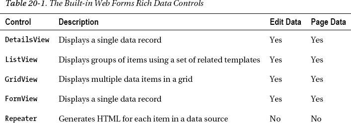

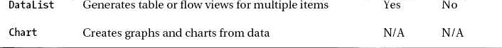

你可能会注意到，在本章的例子中，我没有列出添加和配置控件所生成的全部标记。这是因为加价的数量可能很大。例如，当 Visual Studio 向页面添加默认模板时，添加一个 ListView 控件并选择一些基本配置选项可以生成大约 300 行标记。相反，我将向您展示控件在页面上的显示方式，并告诉您可以更改外观的不同方法。如果您想要每个示例的完整标记，可以在本书附带的免费源代码下载中找到，可以从 Apress.com 获得。

这些控件共享显示和编辑数据以及响应用户操作的通用方法。我没有为每一项重复这些信息，而是将它包含在最能代表该技术的控件中。你会发现其他类似的控件也会使用同样的方法。

### 使用 DetailsView 控件

DetailsView 控件一次显示一条数据记录，并支持分页以允许用户选择哪条记录。DetailsView 控件在用途上与 FormView 控件相似，但正如您将看到的，它的灵活性稍差一些。

配置 DetailsView 控件最简单的方法是通过设计图面，如图 20-1 所示。

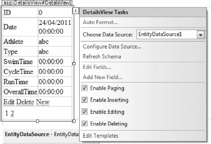

***图 20-1。**使用设计图面配置 DetailsView 控件*

使用设计图面，您可以启用控件之间的分页以及插入、删除和编辑单个数据项的能力。DetailsView 控件支持[表 20-2](#tab_20_2) 中描述的模板。

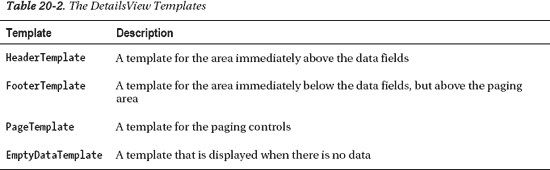

您可以使用这些模板为控件提供一些基本样式。DetailsView 控件呈现一个外部 HTML `table`元素，因此当您使用模板时，您只需要生成表行(`tr`)元素内的内容。[清单 20-1](#list_20_1) 展示了一个 DetailsView 控件示例的基本标记。

***清单 20-1。**DetailsView 控件的基本标记*

`...

<asp:DetailsView ID="DetailsView1" runat="server"
    AllowPaging="True" AutoGenerateRows="False" DataKeyNames="ID"
    DataSourceID="EntityDataSource1">

**<HeaderTemplate>**
**<tr><td colspan="2" class="hf">Header</td></tr>**
**</HeaderTemplate>**
**<FooterTemplate>**
**<tr><td colspan="2" class="hf">Footer</td></tr>**
**</FooterTemplate>**
**<PagerTemplate>**
**<tr><td colspan="2" style="text-align:center">**
**<asp:Button ID="Button1" runat="server" Text="Prev"
                CommandName="Page" CommandArgument="Prev" />**
**<%# Container.PageIndex + 1 %> of <%# Container.PageCount %>**
**<asp:Button ID="Button2" runat="server" Text="Next"
                CommandName="Page" CommandArgument="Next" />**
**</td></tr>**
**</PagerTemplate>**` `<Fields>
*        ... elements omitted...*
</Fields>
</asp:DetailsView>

...`

我们添加了一个简单的页眉和页脚，并用一对按钮和一些基本的数据绑定替换了内置的分页控件，以告诉用户他们正在查看哪条记录以及有多少条记录可用。导航按钮遵循您在上一章中看到的相同的命令事件模式。图 20-2 显示了这种控制。

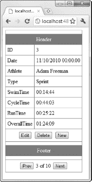

***图 20-2。**对 DetailsView 控件做了一些基本的模板修改*

DetailsView 控件不允许我们更改图中所示的数据布局的基本结构，这是一个从上到下的表，每行代表一个数据字段。但是，我们可以对每个字段的显示方式进行一些控制。我们通过配置控件标记包含的`BoundField`元素来做到这一点。一个好的起点是隐藏一个字段。在我们的例子中，我们不希望用户能够看到(或编辑)字段`ID`。这是`Event`数据库表的主键，值由数据库自动生成。为了隐藏这个字段，我们使用了`Visible`属性，如下所示:

`<asp:BoundField DataField="ID" HeaderText="ID" ReadOnly="True"
    SortExpression="ID" **Visible="True" />**`

`Visible`属性决定字段是否显示。如果您希望字段可见，但不允许用户编辑或创建新值，请使用`InsertVisible`属性。

我们可以使用`DataFormatString`属性来改变数据字段的呈现方式，如下所示:

`<asp:BoundField DataField="Date" HeaderText="Date" SortExpression="Date"
DataFormatString="{0:d}"/>`

属性应用了一个标准。NET 复合格式字符串设置为字段值。在这个元素的例子中，我们将短日期格式应用于`Date`字段。你可以在[图 20-3](#fig_20_3) 中看到`Visible`和`DataFormatString`属性的效果。

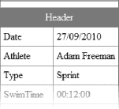

***图 20-3。**隐藏和格式化数据字段*

如果我们想更进一步，我们可以用一个`TemplateField`替换标记中的`BoundField`元素。该元素允许我们定义在显示字段时使用的模板，允许用户创建新项目或编辑现有项目。[清单 20-2](#list_20_2) 显示了一个应用于`Athlete`字段的`TemplateField`。

***清单 20-2。**使用模板字段功能*

`...
<asp:BoundField DataField="Date" HeaderText="Date" SortExpression="Date"
DataFormatString="{0:d}"/>
**<asp:TemplateField HeaderText="Athlete" SortExpression="Athlete">**
**<ItemTemplate>**
**<asp:Label ID="Label1" runat="server" Text='<%# Eval("Athlete") %>'></asp:Label>**
**</ItemTemplate>**
**<EditItemTemplate>**
**<asp:DropDownList ID="DropDownList1" runat="server" DataSourceID="LinqDataSource1"
            SelectedValue='<%# Bind("Athlete") %>' DataTextField="Name"/>**
**</EditItemTemplate>**
**<InsertItemTemplate>**
**<asp:DropDownList ID="DropDownList1" runat="server" DataSourceID="LinqDataSource1"
            SelectedValue='<%# Bind("Athlete") %>' DataTextField="Name"/>**
**</InsertItemTemplate>**
**</asp:TemplateField>**
<asp:BoundField DataField="Type" HeaderText="Type" SortExpression="Type" />
...`

在`TemplateField`元素中，我们定义了三个模板。当数据项显示在只读视图中时，使用 ItemTemplate。我们在这个模板中使用了一些标准的数据绑定来设置标签控件的内容。EditItemTemplate 和 InsertItemTemplate 分别在用户编辑现有项或开始创建新项时使用(用户通过单击“编辑”或“新建”按钮来启动这些操作)。

 **注意**item template 是必需的，但是不需要同时提供 EditItemTemplate 和 InsertItemTemplate 元素。如果省略 InsertItemTemplate，则用户创建新记录时将使用 EditItemTemplate。如果省略 EditItemTemplate，则当用户编辑记录时将使用 ItemTemplate(这通常意味着用户将无法更改该字段的值)。

在这些模板中，我们做了一些特别的事情。我们从添加一个新的数据源开始，该数据源从`Athletes`表中检索值，如下所示:

`<asp:LinqDataSource ID="LinqDataSource1" runat="server"
    ContextTypeName="WebApp.TrainingDataEntities" EntityTypeName="" OrderBy="Name"
    Select="new (Name)" TableName="Athletes">
</asp:LinqDataSource>`

我们使用了 LinqDataSource 控件，但是任何数据源都可以，只要我们可以从表中获得`Name`值。在`TemplateField`编辑和插入模板中，我们定义了一个数据绑定到新数据源的 DropDownList 控件，如下所示:

`<asp:DropDownList ID="DropDownList1" runat="server" DataSourceID="LinqDataSource1"
SelectedValue='<%# Bind("Athlete") %>' DataTextField="Name"/>`

这意味着下拉列表将允许用户从`Athletes`表中定义的名称中进行选择。巧妙的部分——这是一个 Web 窗体在简化数据使用方面表现出色的例子——是我们可以在`SelectedValue`属性中使用数据绑定将 DropDownList 控件绑定到 DetailsView 控件显示的`Event`项的`Athlete`字段。这允许我们灵活地约束用户可以为数据字段提供的值，如图[图 20-4](#fig_20_4) 所示。

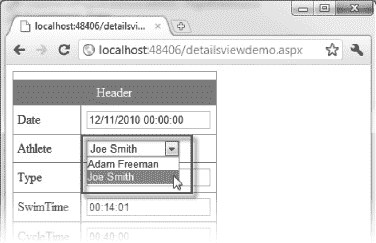

***图 20-4。**使用数据绑定来限制用户可以选择的值集*

### 使用 FormView 控件

FormView 控件在功能上与 DetailsView 大致相似，尽管支持的模板对整个数据项进行操作，而不仅仅是单个字段。这意味着您不受 DetailsView 强制实施的表格布局的约束，但也意味着您要对数据字段的布局和格式的每个方面负责。[表 20-3](#tab_20_3) 描述了 FormView 控件支持的模板。

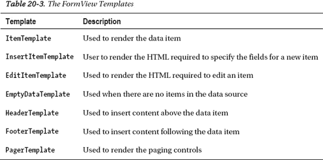

FormView 控件呈现一个外部 HTML `table`元素，这意味着您可以根据表格行(`tr`)元素定义模板。这往往会使您受限于 DetailsView 控件所使用的表格形式的某种近似变体，但是如果您想要做一些不同的事情，您可以通过将`RenderOuterTable`属性设置为`false`来禁用该表格。在[图 20-5](#fig_20_5) 中可以看到 FormView 控件的基本外观以及一些简单的模板和一点 CSS 就可以创建的效果。

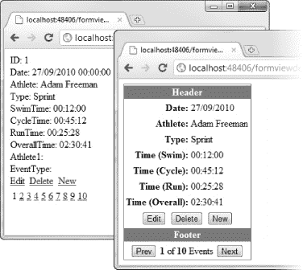

***图 20-5。**对 FormView 控件应用一些简单的样式和模板*

从图中可以明显看出，作为一名设计师，我并没有取得很大的进步，但是您可以看到，通过适度的努力来改变 FormView 控件的外观是可能的。我创建的模板包含在本书附带的源代码下载中(去 Apress.com 免费下载源代码)。

在为该图创建模板时，我用常规的按钮控件替换了默认的 LinkButton 控件。FormView 控件依靠气泡事件来响应按钮的按下以触发不同的操作。[表 20-4](#tab_20_4) 列出了这些模板支持的`CommandName`和`CommandArgument`值。

T2】

大多数富数据控件和模板都支持`CommandName`和`CommandArguments`。如果您不确定如何在模板中设置气泡事件，表中的值是一个很好的起点。

### 使用中继器控制

在第 19 章中，您看到了 Repeater 控件是如何使用的，以及它是如何与 PagedDataSource 控件结合来分页数据的，即使 Repeater 本身不支持分页。所以，关于这个控件没有太多要说的了。[表 20-5](#tab_20_5) 描述了中继器控件支持的模板。

T2】

### 使用 ListView 控件

ListView 控件显示多条记录，并包括内置的模板选项，以在网格中显示这些项，显示为一组平铺、项目符号列表、单行或常规列表。[图 20-6](#fig_20_6) 显示了一个列表视图，该视图使用内置图块模板方案显示来自`Events`数据库表的数据。

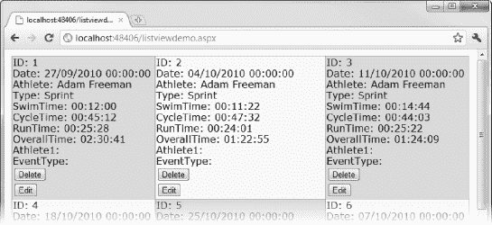

***图 20-6。**ListView 控件的平铺视图*

通过选择 ListView 控件，单击箭头按钮，并从弹出菜单中选择“配置 ListView ”,可以使用内置模板。然后你可以选择应用于控件的格式，如图 20-7 所示。

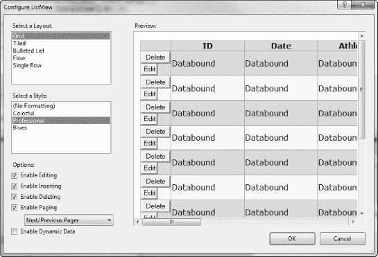

***图 20-7。**使用内置模板选项格式化列表视图控件*

当您从“选择布局”列表中选择一个布局时，Visual Studio 将生成支持该外观所需的模板。

 **注意**如果“配置 ListView”菜单项不可见，或者菜单中并非所有选项都可用，可能的原因是数据源未配置为对数据项进行排序。有关如何启用该功能的详细信息，请参见第 18 章。

表 20-6 列出了 ListView 控件支持的模板。

T2】

我不喜欢内置的模板，因为它们会产生大量的标记，而且我不觉得它们有用或有视觉吸引力。也就是说，如果我们放弃内置的模板并编写自己的模板，我们可以利用 ListView 控件的一个有用的特性，称为*分组*。这是将指定数量的数据项插入模板中指定位置的地方。

到目前为止，ListView 控件中可用的模板比其他控件多得多。理解它们如何组合在一起的最佳方式是创建一个强调它们之间关系的示例 Web 窗体页。对于数据项，我们将使用一系列容易识别的值。创建一个名为`ListViewStructure.aspx`的新 WebForm页面，并在代码隐藏文件中定义值，如清单 20-3 中的[所示。](#list_20_3)

***清单 20-3。**定义一些容易识别的数据项*

`using System;

namespace WebApp {
    public partial class ListViewStructure : System.Web.UI.Page {
        public StringAdapter[] DataItems = new[] {
            new StringAdapter {Name = "Item 01"}, new StringAdapter {Name = "Item 02"},
            new StringAdapter {Name = "Item 03"}, new StringAdapter {Name = "Item 04"},
            new StringAdapter {Name = "Item 05"}};` `        protected void Page_Load(object sender, EventArgs e) {

        }
    }

    public class StringAdapter {
        public string Name { get; set; }
    }
}`

然后我们可以使用这些数据作为 LinqDataSource 控件的基础，并向页面添加一个 ListView 控件，如[清单 20-4](#list_20_4) 所示。

***清单 20-4。**listview structure 页面的起点*

`<%@ Page Language="C#" AutoEventWireup="true" CodeBehind="ListViewStructure.aspx.cs"
Inherits="WebApp.ListViewStructure" %>

<!DOCTYPE html PUBLIC "-//W3C//DTD XHTML 1.0 Transitional//EN"
"http://www.w3.org/TR/xhtml1/DTD/xhtml1-transitional.dtd">

<html >
<head runat="server">
<title></title>

</head>
<body>
<form id="form1" runat="server">

<asp:ListView ID="ListView1" runat="server" DataSourceID="LinqDataSource1"
**GroupItemCount="3"**>

***... templates will go here...***

</asp:ListView>

</form>
<asp:LinqDataSource ID="LinqDataSource1" runat="server"
        ContextTypeName="WebApp.ListViewStructure" EntityTypeName="" OrderBy="Name"
        Select="new (Name)" TableName="DataItems">
</asp:LinqDataSource>
</body>
</html>`

在我们开始标记和模板之前，图 20-8 显示了我们的目标。我们将在一个简单的网格中布置物品，每组三个物品。

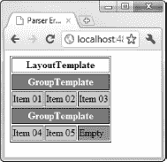

***图 20-8。**使用列表视图控件创建的简单分组网格*

我用粗体标出了清单的两个部分。第一个是`GroupItemCount`，它告诉 ListView 控件应该在每个组中放置多少个数据项。从图中可以看出，我们每行有三个项目。这就是`GroupItemCount`的工作方式，当我们创建组模板时，您将看到它的重要性。

第二个加粗的部分表示我们在创建模板时添加模板的位置。我们将从 LayoutTemplate 开始，它是 ListView 控件首先寻找的模板。

 **注意**你可以在没有组模板的情况下使用 ListView 控件，甚至不用定义 LayoutTemplate 元素。它真正需要的只是一个 ItemTemplate。但是 ListView 控件的真正价值在于它的模板如何协同工作。如果您只是想要一个简单的列表，还有其他更容易使用的控件，如 DataList 控件，将在本章的后面介绍。

清单 20-5 显示了这个例子的布局模板。

***清单 20-5。**布局模板示例*

`<LayoutTemplate>
<table border="1">
<tr><th colspan="3">LayoutTemplate</th></tr>
<tr **ID="groupPlaceholder"** runat="server"/>
</table>
</LayoutTemplate>`

你有完全的自由来创建任何你喜欢的布局。我选择了网格，因为它可以很容易地看到模板之间的关系。

为了创建网格，我们定义了一个带有标题的 HTML `table`元素。ListView 控件依靠带有特定`ID`值的占位符元素将模板关联在一起。你可以看到我们已经包含了一个`tr`元素，它的`ID`是`groupPlaceholder`。这是当您使用分组特性时 ListView 控件寻找的`ID`。您使用哪种元素并不重要，因为它将被 GroupTemplate 的内容替换，尽管您必须使用`runat="server"`属性以便 ASP.NET 可以找到元素并执行替换。

每当 ListView 控件呈现了由`GroupItemCount`属性指定数量的数据项时，就呈现 GroupTemplate 的内容。在我们的例子中，这意味着将为每三个数据项生成 GroupTemplate。[清单 20-6](#list_20_6) 显示了这个例子的组模板。

***清单 20-6。**group template 示例*

`<GroupTemplate>
<tr><th colspan="3" class="group">GroupTemplate</th></tr>
<tr><td **ID="itemPlaceholder"** runat="server"></td></tr>
</GroupTemplate>`

因为我们使用 HTML `table`元素，所以我们在每个组中生成两个表格行。第一个包含一个标题，只是为了让我们知道组出现在页面中的什么位置。第二个包含另一个占位符—这一次是针对单个数据项。ListView 控件查找一个具有值为`itemPlaceholder`的`ID`的元素，并用 ItemTemplate 内容的几个副本替换它——在我们的例子中是三个副本。清单 20-7 显示了示例项目模板。

***清单 20-7。**item template 示例*

`<ItemTemplate>
<td class="item"><%# Eval("Name") %></td>
</ItemTemplate>`

这个模板不需要任何占位符。ListView 控件只是将 HTML 呈现所需的次数，并使用结果来替换组模板中的占位符。在我们的示例中，ItemTemplate 将在每个组中呈现三次，创建三个`td`元素，它们被插入到组模板中定义的`tr`元素中。

我们目前唯一需要的另一个模板是 EmptyItemTemplate。数据源中的项数不会总是与组中的项数保持一致，因此每当出现短缺时，ListView 控件都会呈现 EmptyItemTemplate 的内容。本例的数据源中只有五个项目，因此 ListView 控件需要使用一次 EmptyItemTemplate 来充实第二个组。清单 20-8 显示了这个例子的 EmptyItemTemplate。

***清单 20-8。**empty item template 示例*

`<EmptyItemTemplate>
<td class="emptyitem">Empty</td>
</EmptyItemTemplate>`

当这些模板一起使用时，我们得到了之前在[图 20-8](#fig_20_8) 中显示的结果:一个有两组的简单网格，每组包含三个数据项。一旦您理解了这四个模板之间的关系，那么其他模板的作用就显而易见了。

#### 使用 ListView 控件分页

ListView 控件没有分页模板。如果要支持分页，必须在 LayoutTemplate 中自己定义控件。但是，与其他一些控件不同，ListView 依赖 DataPager 控件来处理分页，而不是气泡事件。清单 20-9 显示了更新后的 LayoutTemplate，其中包含了一个 DataPager 控件。

***清单 20-9。**向 ListView LayoutTemplate 添加 DataPager 控件*

`...
<asp:ListView ID="ListView1" runat="server" DataSourceID="LinqDataSource1"
    GroupItemCount="3">
<LayoutTemplate>
<table border="1">
<tr><th colspan="3">LayoutTemplate</th></tr>
<tr ID="groupPlaceholder" runat="server"/>
<tr><td colspan="3">
**<asp:DataPager ID="DataPager1" runat="server" PageSize="3">**
**<Fields>**
**<asp:NextPreviousPagerField**
**                                ButtonType="Button"**
**                                ShowFirstPageButton="True"**
**                                ShowLastPageButton="True" />**
**</Fields>**
**</asp:DataPager>**
</td></tr>
</table>
</LayoutTemplate>

<GroupTemplate>
<tr><th colspan="3" class="group">GroupTemplate</th></tr>
<tr><td ID="itemPlaceholder" runat="server"></td></tr>
</GroupTemplate>

<ItemTemplate>
<td class="item"><%# Eval("Name") %></td>
</ItemTemplate>

<EmptyItemTemplate>
<td class="emptyitem">Empty</td>
</EmptyItemTemplate>
</asp:ListView>
...`

`PageSize`属性指定每页包含多少项。当与 ListView 控件一起使用时，这是指项目的数量，而不是组的数量。不管页面上有多少项目，分组都适用于每个页面。[图 20-9](#fig_20_9) 显示了应用于该示例的分页控制的效果。

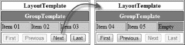

***图 20-9。**使用 ListView 和 DataPager 控件分页*

#### 用 ListView 控件排序数据

使用 LayoutTemplate 中的按钮和气泡事件，可以对 ListView 控件中显示的项目顺序进行排序。清单 20-10 提供了一个演示。

***清单 20-10。**使用气泡事件对列表视图控件中的数据进行排序*

`...
<LayoutTemplate>
<table border="1">
<tr><th colspan="3">LayoutTemplate</th></tr>
<tr ID="groupPlaceholder" runat="server"/>
<tr><td colspan="3" style="text-align:center">
**<asp:Button ID="Button1" runat="server" Text="Sort Asc"**
**CommandName="Sort" CommandArgument="Name" />**
**<asp:Button ID="Button2" runat="server" Text="Sort Desc"**
**CommandName="Sort" CommandArgument="Name DESC" />**
</td></tr>
</table>
</LayoutTemplate>
...`

这些按钮使用的`CommandName`是`Sort`，`CommandArgument`是数据排序所依据的数据字段的名称。默认情况下，数据按升序排序，但是您可以通过将`DESC`附加到`CommandArguement`值来执行降序排序，这样`Name`就变成了`Name DESC`。你可以在[图 20-10](#fig_20_10) 中看到物品排序的效果。

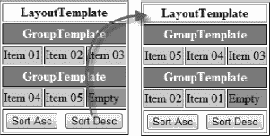

***图 20-10。**使用气泡事件对 ListView 控件中的数据进行排序*

### 使用数据列表控件

DataList 控件是另一个基于模板的控件，此外，您可以指定不同的方法来重复模板以显示所有的项。[表 20-7](#tab_20_7) 描述了 DataList 控件支持的模板。

T2】

清单 20-11 显示了一个定义了 ItemTemplate 和 AlternatingItem 模板的 DataList 控件。

***清单 20-11。**数据表控件示例*

`<%@ Page Language="C#" AutoEventWireup="true" CodeBehind="DataListDemo.aspx.cs"
Inherits="WebApp.DataListDemo" %>

<!DOCTYPE html PUBLIC "-//W3C//DTD XHTML 1.0 Transitional//EN"
"http://www.w3.org/TR/xhtml1/DTD/xhtml1-transitional.dtd">

<html >
<head runat="server">
<title>DataList</title>
</head>
<body>
<form id="form1" runat="server">

**<asp:DataList ID="DataList1" runat="server" DataKeyField="ID"**
**            DataSourceID="EntityDataSource1" RepeatColumns="3"**
**            RepeatDirection="Vertical" RepeatLayout="Table">**

**<ItemTemplate>**
**<table style="border:thin solid black">**
**<tr><td>Index:</td><td><%# Container.ItemIndex %></td></tr>**
**<tr><td>Date:</td><td><%# Eval("Date", "{0:d}") %></td></tr>**
**<tr><td>Time:</td><td><%# Eval("OverallTime") %></td></tr>**
**</table>**

**</ItemTemplate>**
**<AlternatingItemTemplate>**` `**<table style="border:thin solid black; background-color:Gray; color:White">**
**<tr><td>Index:</td><td><%# Container.ItemIndex %></td></tr>**
**<tr><td>Date:</td><td><%# Eval("Date", "{0:d}") %></td></tr>**
**<tr><td>Time:</td><td><%# Eval("OverallTime") %></td></tr>**
**</table>**
**</AlternatingItemTemplate>**
**</asp:DataList>**

</form>
<asp:EntityDataSource ID="EntityDataSource1" runat="server"
        ConnectionString="name=TrainingDataEntities"
        DefaultContainerName="TrainingDataEntities" EnableDelete="True"
        EnableFlattening="False" EnableInsert="True" EnableUpdate="True"
        EntitySetName="Events" AutoGenerateWhereClause="True">
</asp:EntityDataSource>
</body>
</html>`

我们在一个 HTML `table`中呈现每一项，其中的行包含标签和数据值的单元格。数据来自`TrainingData`数据库，为了简单起见，我们只显示几个数据字段。我在模板中包含了数据项索引，以突出显示数据项的显示顺序。DataList 控件支持两种布局:`Table`和`Flow`。对于每种布局样式，您可以指定布局方向(`Horizontal`或`Vertical`)和使用的列数。在本例中，我们将 DataList 控件配置为使用一个包含三列的垂直表:

`<asp:DataList ID="DataList1" runat="server" DataKeyField="ID"
    DataSourceID="EntityDataSource1" RepeatColumns="3"
    RepeatDirection="**Vertical**" RepeatLayout="**Table">**`

如您所料，当`RepeatDirection`属性被设置为`Vertical`时，数据项被排列成沿着列向下。你可以在[图 20-11](#fig_20_11) 的左侧看到这个。当`RepeatDirection`被设置为`Horizontal`时，项目被跨行排列。

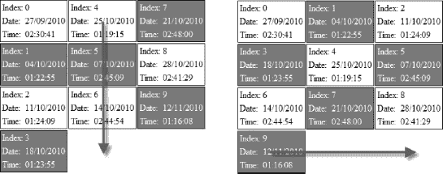

***图 20-11。**DataList 控件中的垂直和水平表格布局*

#### 使用流程布局

当使用`Table`布局选项时，DataList 控件创建一个外部 HTML `table`，并将每个 ItemTemplate 的内容放在一个表格单元格(`td`)元素中。每个表格行(`tr`)元素的`td`元素数量由`RepeatColumns`属性控制。

然而，当你使用`Flow`布局时，你会得到不同的效果。每个数据项都放在一个`span`元素中。`RepeatColumns`值用于将`span`元素分组在一起，尽管这样做有损流动项目的好处。在每一个`RepeatColumns`项被呈现后，DataList 控件插入一个`br`元素。这意味着，如果你对`span`元素应用 CSS 样式，使`span`元素`float`出现在页面上，你会得到如图[20-12](#fig_20_12)所示的奇怪效果。

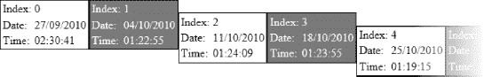

***图 20-12。**使用 CSS float 值时，br 元素在 DataList 流程布局中的效果*

生成[图 20-12](#fig_20_12) 的控件标记如下:

`...
<asp:DataList ID="DataList1" runat="server" DataKeyField="ID"
            DataSourceID="EntityDataSource1"  RepeatColumns="2"
            RepeatDirection="Horizontal" RepeatLayout="Flow">
...`

在每两项之后，DataList 控件插入一个`br`元素。一些浏览器呈现数据列表控件生成的 HTML 不同，如图 20-13 中的例子所示。

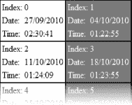

***图 20-13。**数据表 HTML 的另一种呈现方式*

这仍然不是一个流程布局。无论浏览器窗口有多宽，都只会显示两个项目。(题外话，[图 20-12](#fig_20_12) 来自 ie 浏览器，[图 20-13](#fig_20_13) 来自 Chrome。)

您不能禁止添加`br`元素，但是您可以将`RepeatColumns`的值设置得太高以至于没有效果，如下所示:

`...
<asp:DataList ID="DataList1" runat="server" DataKeyField="ID"
            DataSourceID="EntityDataSource1"  **RepeatColumns="<%# int.MaxValue %>"**
            RepeatDirection="Horizontal" RepeatLayout="Flow">
...`

通过将`RepeatColumns`属性的值设置为最大值`int`，可以防止 DataList 控件插入`br`元素，并获得真正的流布局，其中一行包含尽可能多的适合浏览器窗口的项目，如图 20-14 中的[所示。](#fig_20_14)

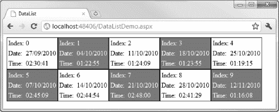

***图 20-14。**数据表控件的真实流程布局*

#### 选择数据项

DataList 是支持*选择*数据项的 WebForm数据控件之一。为了选择数据项，需要向 ItemTemplate 添加一个 Button 控件，并使用一个 bubble 事件，以便 DataList 控件接收命令。在这种情况下，`CommandName`值必须是`select`。[清单 20-12](#list_20_12) 显示了我们例子的标记。

***清单 20-12。**选择数据表项目*

`...
<asp:DataList ID="DataList1" runat="server" DataKeyField="ID"
    DataSourceID="EntityDataSource1"  RepeatColumns="2"
    RepeatDirection="Horizontal" RepeatLayout="Flow"
**onselectedindexchanged="DataList1_SelectedIndexChanged">**

<ItemTemplate>
<table style="border:thin solid black">
<tr><td>Index:</td><td><%# Container.ItemIndex %></td></tr>
<tr><td>Date:</td><td><%# Eval("Date", "{0:d}") %></td></tr>
<tr><td>Time:</td><td><%# Eval("OverallTime") %></td></tr>
<tr><td colspan="2" style="text-align:center">
<asp:Button ID="Button1" runat="server" Text="Select" CommandName="select" />` `</td></tr>
</table>
</ItemTemplate>

**<SelectedItemTemplate>**
**<table style="border:thin solid black; background-color:Red; color:White">**
**<tr><td>Index:</td><td><%# Container.ItemIndex %></td></tr>**
**<tr><td>Date:</td><td><%# Eval("Date", "{0:d}") %></td></tr>**
**<tr><td>Time:</td><td><%# Eval("OverallTime") %></td></tr>**
**<tr><td colspan="2" style="text-align:center">**
**<asp:Button ID="Button1" runat="server" Text="Select"/>**
**</td></tr>**
**</table>**
**</SelectedItemTemplate>**

</asp:DataList>
...`

我用粗体标出了清单的两个部分。第一个为`SelectedIndexChanged`方法注册了一个处理程序方法。DataList 控件需要帮助来处理被选中的项目，因此我们必须在事件被调用时调用`DataBind`方法，如下所示:

`using System;

namespace WebApp {
    public partial class DataListSelect : System.Web.UI.Page {
        protected void Page_Load(object sender, EventArgs e) {

        }

        protected void DataList1_SelectedIndexChanged(object sender, EventArgs e) {
            **DataList1.DataBind();**
        }
    }
}`

清单中第二个突出显示的部分是 SelectedItemTemplate。DataList 控件使用它来呈现选中的项。我们已经更改了所选项的样式，使其更易于查看，并且我们省略了`CommandName`属性，因为一旦选择了一个项目，就不需要重新选择它。您可以在图 20-15 的[中看到选择一个项目的效果。](#fig_20_15)

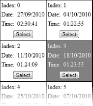

***图 20-15。**用数据列表控件选择一个项目*

允许用户选择一个项目是有用的，但前提是你要对选择做一些事情。您可以扩展处理程序方法中的代码，使`SelectedIndexChanged`方法以有意义的方式做出响应。选中项的索引可以通过`DataList.SelectedIndex`属性获取，没有选中项时返回-1。

### 使用 GridView 控件

顾名思义，GridView 控件在网格中显示数据。整体外观是一个表格，字段名构成列，单个数据项构成行。图 20-16 显示了 GridView 控件的基本外观。

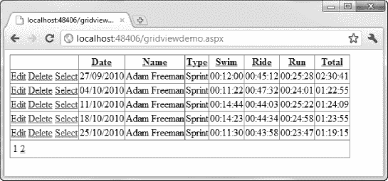

***图 20-16。**GridView 控件的基本外观*

GridView 控件使用了您在前面章节中看到的相同技术，所以没有太多新的信息要添加。GridView 控件使用你在 DetailsView 控件中看到的相同的`BoundField`元素，尽管它们包含在一个`Columns`元素中，如[清单 20-13](#list_20_13) 所示。

***清单 20-13。**GridView 控件中的 BoundField 元素*

`<asp:GridView ID="GridView1" runat="server" AllowPaging="True"
    AllowSorting="True" AutoGenerateColumns="False" DataKeyNames="ID"
    DataSourceID="EntityDataSource1" PageSize="5">
<Columns>
<asp:CommandField ShowDeleteButton="True" ShowEditButton="True" ShowSelectButton="True"/>
<asp:BoundField DataField="ID" HeaderText="ID" ReadOnly="True" SortExpression="ID"
        Visible="false"/>
<asp:BoundField DataField="Date" HeaderText="Date" SortExpression="Date"
        DataFormatString="{0:d}"/>
<asp:BoundField DataField="Athlete" HeaderText="Name" SortExpression="Athlete" />
<asp:BoundField DataField="Type" HeaderText="Type" SortExpression="Type" />
<asp:BoundField DataField="SwimTime" HeaderText="Swim" SortExpression="SwimTime" />
<asp:BoundField DataField="CycleTime" HeaderText="Ride" SortExpression="CycleTime" />
<asp:BoundField DataField="RunTime" HeaderText="Run" SortExpression="RunTime" />
<asp:BoundField DataField="OverallTime" HeaderText="Total"
SortExpression="OverallTime" />
</Columns>
</asp:GridView>`

从清单中可以看到，我应用了一些与我们使用 DetailsView 控件时相同的属性值。我用`Visible`属性对用户隐藏了`ID`字段，并用`DataFormatString`属性格式化了`Date`字段。

尽管 GridView 控件使用`BoundField`元素来呈现项目，但该控件仍有两个方面的模板支持。[表 20-8](#tab_20_8) 描述了可用的模板。

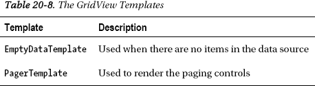

#### 控制数据排序

`BoundField`元素的一个特别有趣的属性是`SortExpression`。如果主`GridView`元素中的`AllowSorting`属性被设置为`true`，该控件将允许用户按任何显示的列对数据进行排序。在图 20-6 中，你可以看到每个列标签都是一个超链接。单击其中一个链接将根据该字段对数据进行排序。

对于由一个`BoundField`元素表示的每一列，`SortExpression`属性指定哪个数据字段将用于执行排序操作。这不必是与列相同的字段。例如，如果您希望当用户单击`Athlete`字段的列标题时，数据按`ID`元素排序，您可以使用以下标记:

`<asp:BoundField DataField="Athlete" HeaderText="Name" SortExpression="**ID**" />`

如果您不希望用户能够对列进行排序，那么只需完全省略`SortExpression`属性。

#### 配置命令按钮

像许多 Web 窗体数据控件一样，GridView 依赖于从按钮发送的气泡事件来执行操作。你没有用 GridView 定义自己的按钮控件的自由，因为它不支持自由格式的项模板。相反，您必须依赖于`CommandField`控件，其定义如下:

`<asp:CommandField ShowDeleteButton="True" ShowEditButton="True" ShowSelectButton="True"/>`

`ShowDeleteButton`、`ShowEditButton`、`ShowSelectButton`控制[图 20-16](#fig_20_16) 中最左栏的三个链接按钮的存在。您可以通过将`ButtonType`属性设置为`Button`来切换到常规按钮，如下所示:

`<asp:CommandField ShowDeleteButton="True" ShowEditButton="True"
ShowSelectButton="True" **ButtonType="Button"/>**`

在所有其他方面，GridView 控件响应前面在[表 20-4](#tab_20_4) 中描述的标准的`CommandName`和`CommandArgument`值。

### 创建图表

我们将讨论的最后一个富数据控件是 Chart。它生成数据的图形表示，而不是您在其他控件中看到的文本表示。图表控件支持无限的可配置性。有几十种不同的图表类型可供选择，有数不清的颜色和样式选项，它甚至支持三维图表。

事实上，有如此多的配置选项，我甚至不打算描述它们。在这一章中，我所能做的就是提供一个简单的例子，作为你探索图表控件能力的起点。

首先，我们需要一些数据来绘图。我们将创建一个包含两个数据系列的图表。第一个是总时间(以小时表示)，第二个是总距离。这不是最有用的绘图数据，但它非常适合作为示例。

要解决的第一个问题是图表控件对它将使用的数据类型有些挑剔。它仅限于。净内在类型:`Double`、`Decimal`、`Single`、`int`、`long`、`uint`、`ulong`、`String`、`DateTime`、`short`、`ushort`。具体来说，它不会绘制来自`OverallTime`字段的`TimeSpan`值。为了解决这个问题，我们可以创建一个 LINQ 查询并将我们想要的值投射到一个包装类中，如清单 20-14 所示。

***清单 20-14。**将事件数据值投射到包装类中*

`using System;
using System.Collections.Generic;
using System.Linq;` `namespace WebApp {
    public partial class ChartDemo : System.Web.UI.Page {
        public IEnumerable<EventWrapper> Results = new TrainingDataEntities().Events
            .Select(e => new {
                Date = e.Date,
                Time = e.OverallTime,
                Distance = e.EventType.SwimMiles
                   + e.EventType.CycleMiles + e.EventType.RunMiles
            })
            .ToArray()
            .Select(e => new EventWrapper() {
                Date = e.Date,
                Hours = e.Time.TotalHours,
                Distance = e.Distance
            });

        protected void Page_Load(object sender, EventArgs e) {
        }
    }

    public class EventWrapper {
        public DateTime Date { get; set; }
        public double Hours { get; set; }
        public float Distance { get; set; }
    }

}`

这是一个非常难看的 LINQ 查询，因为我们想要读取属性`TimeSpan.TotalHours`的值，这在对实体框架数据模型使用 LINQ 时很难做到。为了简单起见，我们创建了一个包含我们需要的数据字段的匿名类型对象序列，然后将该序列转换为一个数组，这样我们就可以将结果投射到一系列的`EventWrapper`对象中，同时读取`TotalHours`属性。

创建数据后，我们可以添加数据源，如清单 20-15 所示。

***清单 20-15。**linq data source 控件的标记*

`<%@ Page Language="C#" AutoEventWireup="true" CodeBehind="ChartDemo.aspx.cs"
Inherits="WebApp.ChartDemo" %>

<%@ Register Assembly="System.Web.DataVisualization, Version=4.0.0.0, Culture=neutral,
 PublicKeyToken=31bf3856ad364e35"
    Namespace="System.Web.UI.DataVisualization.Charting" TagPrefix="asp" %>

<!DOCTYPE html PUBLIC "-//W3C//DTD XHTML 1.0 Transitional//EN"
 "http://www.w3.org/TR/xhtml1/DTD/xhtml1-transitional.dtd">

<html >
<head runat="server">
<title>Chart</title>
</head>` `<body>
<form id="form1" runat="server">

</form>
**<asp:LinqDataSource ID="LinqDataSource1" runat="server"**
**        ContextTypeName="WebApp.ChartDemo" EntityTypeName="" OrderBy="Date"**
**        TableName="Results">**
**</asp:LinqDataSource>**
</body>
</html>`

现在是时候添加图表控件了。将控件添加到页面中，在设计图面上选中该控件，单击箭头按钮，从“选择数据源”菜单中选择“LinqDataSource”，如图[图 20-17](#fig_20_17) 所示。

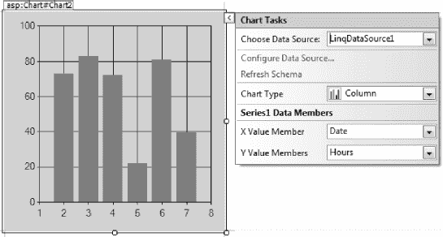

***图 20-17。**配置图表控件*

一旦选择了数据源，我们就可以选择哪些字段将用于 x 轴和 y 轴，当然，还可以从许多不同类型的可用图表中选择一个。此时，图表类型为列，x 轴选择日期，y 轴选择小时，如图[图 20-17](#fig_20_17) 所示。我们现在有了一个基本的图表，[图 20-18](#fig_20_18) 显示在浏览器中。

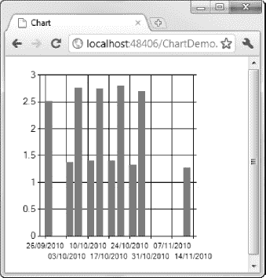

***图 20-18。**浏览器中显示的基本图表控件*

在这一点上，很多程序员看到结果后放弃了图表控件。可悲的是，其他人看着结果，称之为工作完成。我见过无数使用如此糟糕的图表的项目。然而，对于 Web 窗体图表控件，这仅仅是个开始。

清单 20-16 中的标记向图表添加了第二个数据系列(`Distance`字段的值)和一个辅助 y 轴，并应用了一些基本样式。

***清单 20-16。**格式化和样式化图表*

`<asp:Chart ID="Chart1" runat="server" DataSourceID="LinqDataSource1"
    BackColor="Gray" BackSecondaryColor="WhiteSmoke"
    BackGradientStyle="DiagonalRight" BorderlineDashStyle="Solid"
    BorderlineColor="Gray" BorderSkin-SkinStyle="Emboss" Width="644px"
    Height="247px">
<Series>
<asp:Series Name="Times" XValueMember="Date" YValueMembers="Hours">
</asp:Series>
<asp:Series Name = "Distance" XValueMember="Date" YValueMembers="Distance"
ChartType="Spline" BorderWidth="3" ShadowOffset="2" Color="PaleVioletRed"
YAxisType="Secondary">
</asp:Series>
</Series>
<ChartAreas>
<asp:ChartArea Name="ChartArea1" BackColor="Wheat">
<AxisX>
<LabelStyle Format="MM-dd"/>` `</AxisX>
<AxisY Title="Time" Interval="1"/>
<AxisY2 Title="Distance" Interval="10" Minimum="10" Maximum="40"/>
</asp:ChartArea>
</ChartAreas>
<Titles>
<asp:Title Text="Time & Distance" Font="Utopia, 16"/>
</Titles>
<BorderSkin SkinStyle="Emboss"></BorderSkin>
</asp:Chart>`

正如我提到的，图表控件提供了许多配置选项，可能需要一些实验来找到最适合您的应用程序的外观，但是这些时间是值得的。[图 20-19](#fig_20_19) 显示了浏览器中显示的列表中的图表控件。

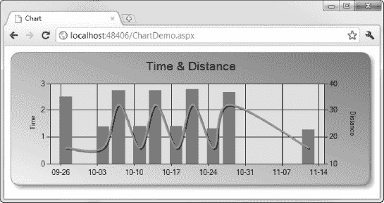

***图 20-19。**对图表应用格式*

我们仍然只是触及了这个控件的皮毛。一旦掌握了图表控件，就可以产生非常高质量的结果。您可以通过以下网址了解更多关于 MSDN 图表控件的功能:`[http://msdn.microsoft.com/en-us/library/dd456632.aspx](http://msdn.microsoft.com/en-us/library/dd456632.aspx)`。

### 总结

本章介绍了丰富的数据控件。这些控件可以无限地配置，并且经常与集合中其他控件的功能重叠。所有控件都可以绑定到各种各样的数据源，这使得在 Web 窗体应用程序中显示和管理数据变得很容易。

真正掌握这些控件的唯一方法是在实际项目中使用它们。这可能是一个令人沮丧且耗时的过程，但它的好处是在应用程序如何消费数据以及如何向用户显示数据方面为您提供了很大的灵活性。