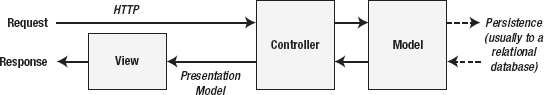

# 二十二、将 MVC 放在上下文中

MVC 框架是 ASP.NET 的一个相对较新的补充，它采用了一种非常不同的方法来构建 web 应用。您之前看到的 web Forms 系统提供了很多功能，但是如果您想要构建一个生命周期长并且体现当前 Web 开发趋势的大型 Web 应用，那么您应该考虑使用 MVC 框架。

在这一章，我会给你一点 MVC 框架的背景，并描述它的主要优点和缺点。

直到我们在接下来的章节中开始构建 MVC 框架应用时，才会清楚用 MVC 框架编程的*风格*与 WebForm有多大的不同。一旦掌握了基础知识，MVC 框架就提供了一种令人信服的开发方法，这种方法可以产生灵活且可维护的 web 应用。

 **注意**我能在这本书的这一部分包含的细节是有限的。为了有效地创建和部署 MVC 框架应用，我将向您展示您需要知道的一切，但是没有足够的空间来讲述所有血淋淋的细节。如果您对更深入的细节感兴趣，包括 MVC 框架支持的大量定制，我推荐我与来自微软 Web 平台和工具团队(负责 MVC 框架的人)的 Steve Sanderson 一起写的书。这本书叫做*Pro ASP.NET MVC 3 框架*，由 Apress 出版。

### 了解模型-视图-控制器

ASP.NET 取得了巨大的成功，但是近年来 web 应用开发的新趋势，尤其是 WebForm，使得这个平台看起来有点过时了。

开发人员不知道 HTTP 和 HTML 并且*也不想*知道的日子已经一去不复返了，像 Ruby on Rails 这样的竞争技术已经采用了这些技术的细节来创建一种完全不同的 web 应用开发方法，重新激活了一种叫做*模型-视图-控制器* (MVC)的旧架构模式。

MVC 模式从 20 世纪 70 年代末就已经存在，并且不时地重新流行起来。MVC 现在重新成为焦点的原因是它非常适合 HTTP 请求的无状态特性，并且通过正确的工具，可以用来构建可伸缩和可维护的应用。

区分 *MVC 架构模式*和 *MVC 框架*是很重要的。MVC 架构模式是开发应用的一种抽象方法。MVC 框架是微软开发的一套工具和技术，它采用了 MVC 模式，目的是为 web 应用创建更现代、更像 Ruby 的开发体验。

在本书中，我们将重点放在 MVC 框架上，而不是模式上，但是无论如何，这两者是紧密结合在一起的。顾名思义，使用 MVC 框架创建的应用有三个主要部分:

*   *模型*，包含或表示用户使用的数据。这些可以是简单的*视图模型*，它仅仅表示在视图和控制器之间传输的数据，或者是*域模型*，它表示业务域中的数据以及操作、转换和操纵数据的规则。
*   *视图，*用于将模型的某个部分渲染为用户界面。
*   *控制器*，处理传入的请求，对模型执行操作，并选择视图呈现给用户。

 **注意**即使你以前没有听说过 MVC，你也可能会发现其中一些概念很熟悉。有几个原因。首先，尽管 MVC 模式并不广为人知，但是它所包含的思想已经在其他地方被广泛采用和改编，比如在其他模式中，在最佳实践指南中，等等。另一个原因是，MVC 的大部分只是常识，许多开发人员凭直觉编写的代码包含了一些基本的 MVC 概念。

#### 了解模型

MVC 应用最重要的部分是*域模型*。领域是我们的应用工作的宇宙。例如，在一个银行应用中，域包括该应用操作的银行中的所有内容。这可能包括账户、总分类账以及客户的信用额度和余额。该域还包括可以对这些事物执行的所有过程，例如评估信用限额、在帐户之间转移资金以及创建新帐户的方式。

当我们使用 MVC 框架编写应用时，我们创建了领域的软件表示。这就是*域模型*。领域模型是一组。NET 类型(类、结构等等)，它们被称为*域类型*，这些类型的方法中的逻辑代表了模型中的过程。(当我们创建一个域类型的实例时，为了完成命名，我们创建一个新的*域对象*。)

模型类型中的逻辑负责维护域模型的完整性和整体状态，例如确保所有交易都被添加到分类帐中，或者确保客户提取的金额不会超过他们有权提取的金额，或者超过银行的金额。

在大多数 MVC 应用中，域模型是持久的和长期存在的，反映了被建模的域的本质。有许多不同的方法可以使领域模型持久化，但是最常用的方法仍然是关系数据库。

模型也是由它们*而不是*负责的事情来定义的；模型不处理 ui 的呈现或请求的处理。这些是*视图*和*控制器*的职责，我一会儿会描述一下。

 **注**还有一种模型，叫做*视图*(或*演示*)模型。这些模型用于在控制器和视图之间传递数据。[第 28 章](28.html#ch28)展示了一些视图模型。

#### 了解控制器

控制器负责处理传入的请求，在域模型上执行操作，并选择响应请求而呈现的视图。

在 MVC 框架中，控制器是一个从`System.Web.Mvc.Controller`派生的类，它有许多`public`方法，每个方法代表控制器将在域模型上执行的一个*动作*。这些被称为*行动方法*。控制器中的每个动作方法都与一个 URL 相关联，并且当控制器接收到对该 URL 的请求时，执行动作方法中的逻辑，并且由动作方法选择的视图被呈现并返回给浏览器。

#### 理解视图

在 MVC 框架中，*视图*是一个模板，用于生成对请求的响应，通常是发送到浏览器的 HTML，尽管我们也可以生成其他类型的数据，包括 JSON 和 XML。

视图是 MVC 三人组中最简单的部分，尽管我们确实需要学习一种新的标记语言，叫做 *Razor* ，以便从中获得最佳效果。我在[第 25 章](25.html#ch25)里给你介绍Razor。

#### 了解模型、控制器和视图的交互

MVC 应用的三个部分有非常明确的角色定义，MVC 背后的一个关键思想是我们不应该模糊这些角色之间的界限。这意味着我们不处理模型中的请求，我们只使用视图来呈现内容，它们之间的粘合剂是控制器。[图 22-1](#fig_22_1) 显示了关键组件之间的相互作用。

***图 22-1。**MVC 应用中的交互*

MVC 架构的每一部分都是定义良好且自包含的。这被称为*关注点分离*。在模型中操纵数据的逻辑是 *only* 包含在模型中，显示数据的逻辑是 *only* 在视图中，处理用户请求和输入的代码是 *only* 包含在控制器中。

### 了解 MVC 框架的优势

谈到 MVC 框架，有很多值得喜欢的地方。在接下来的部分中，我将描述这项技术的主要优势。

#### 关注点分离

将我们的应用分成三个独立的*关注点*的主要好处是，它使编程更容易，并简化了长期维护。

我说编程更容易是因为当编码时，我们只需要关注当前关注的责任，我们可以忽略其他一切。回到我们的银行应用，例如，如果我们正在为客户帐户实现域类型，我们只需关注准确地表示域并编写定义与帐户相关的流程的逻辑。我们不必担心帐户如何显示给用户，或者如何处理来自浏览器的与帐户相关的请求。

长期维护的好处在于，给定特性的功能应该只出现在一个关注点上，有效地将应用的其余部分与变更隔离开来(或者，至少最小化其他关注点的变更量)。

有些职责会影响到所有的关注点，例如安全性或日志记录。这些被称为*横切关注点*。这些问题会影响整个应用，并且不容易分离。在[第 34 章](34.html#ch34)中，我们将看到一些关于认证和授权的例子。

什么是一个关注点或交叉关注点通常是一个解释问题。在这本书里，我们更关注技术而不是理论，所以我将展示一些例子来自由地解释模式，以强调 MVC 框架的特性。

**关于模式的一句话**

开发软件时，模式非常有用。它们表达了处理不同类型问题的经过试验和测试的方法，允许程序员专注于实现。通过采用一种模式，尤其是一种广泛使用的模式，我们可以期望创建更健壮的代码，并且易于被熟悉该模式的其他程序员理解。

我们还可能会花费大量时间与其他程序员争论我们的代码对模式意图的忠实程度。尽管模式非常有用，但它也有难以置信的分裂性。模式通常用抽象的术语来表达，这意味着程序员必须解释模式的一些元素，以使它们适应特定的编程语言和项目。对于一些简单的模式，通常有可以下载和使用的实现，但是对于像 MVC 这样复杂和深远的东西，需要做出选择和价值判断。这就是麻烦的开始。

像任何可以被解读的话题(比如政治、宗教和税法)一样，不同的思想流派层出不穷。关于最初模式编写者意图的问题出现了，对实现的恶意批评被提出来了，人们把自己标榜为少数理解模式真正目的的人之一。

如果你认为我在夸大其词，那就等到你开始一个使用 MVC 模式的项目。至少你的一个同事会变成更喜欢讨论模式的重要性，而不是应用它的人。如果你不幸有两个这样的同事，那么你可以期待许多小时的电子邮件战。如果你想挑起实际的暴力，只需提出这样的观点:模式 *X* 实际上是模式 *Y* 的衍生，模式 *Z* 的某些方面被粗略地嫁接上去。打斗会接踵而至。

在我看来，模式只是一个起点。一些聪明人已经想出了一个很好的通用方法来解决一些软件开发问题。在 MVC 的例子中，模式是关于构造一个应用，以便它可以被容易地修改和维护。但是那些人有多聪明并不重要。他们没有面对你的项目的技术、产品、人际关系、进度和财务限制的独特组合。从模式中获益的最佳方式是利用基本方法，但要使其适合您的需求。

我的建议是尽量不要和模式狂热者讲道理。他们已经决定了他们的观点，你无法改变它。礼貌地微笑，慢慢后退，避免与那个人的所有未来对话。

顺便说一句，如果你对政治或宗教(或税法)有强烈的看法，并且不喜欢我把这些话题等同于软件模式，你不需要写信向出版社抱怨。没必要。我 100%同意*你的*世界观，我指的是那些*其他*人——那些不欣赏你独特的智慧、洞察力和魅力的人。你是一个很好的人，很可能是一个天才，我将代表你写一封尖刻的电子邮件给任何不这么认为的人。

#### 简单测试

自从 ASP.NET 首次开发以来，单元测试已经变得非常普遍，MVC 框架的设计者已经为单元测试 MVC 应用的各个方面提供了广泛的支持。MVC 框架可以用许多测试框架中的任何一个进行单元测试，包括 MSTest，它是 Visual Studio 付费版本的一部分。

#### 对 HTTP 和 HTML 的严格控制

MVC 框架让程序员能够非常严格地控制呈现给浏览器的 HTML 以及接收和处理 HTTP 请求的方式。这是一种与 WebForm完全不同的方法，WebForm试图对程序员隐藏细节并接管 HTML。由于我们不使用 web 控件，我们不必担心发送视图状态数据所需的带宽，并且我们不局限于每页一个 HTML `form`。

拥有绝对控制权的一个缺点是我们无法访问方便的 WebForm控件，但是我们可以通过使用 jQuery 和 jQuery UI 等库来弥补这一点，正如我们在本书第二部分中看到的那样。事实上，正如你将在第 29 章和第 30 章中看到的，微软已经在 MVC 框架中采用了 jQuery 来提供一些重要的功能。

#### 开源

MVC 框架是开源的。微软在`[http://aspnet.codeplex.com](http://aspnet.codeplex.com)`发布源代码。您可以用这些代码做些什么是有限制的，但是我发现它在调试 MVC 框架应用方面有无穷的帮助。能够在整个软件栈中跟踪请求是非常有用的。微软不向 ASP.NET 框架的其余部分开放源代码，但这是一个好的开始，我建议您花点时间下载源代码。

#### 高度可配置

MVC 框架的几乎每个方面都可以用定制的实现来替换或补充。我们不打算在本书中深入讨论高级配置的细节，但是如果 MVC 框架的任何方面不完全按照您想要的方式工作，那么您可以改变它。

#### 建在 ASP.NET 上

MVC 框架建立在核心的 ASP.NET 平台上，这意味着我们在本书第二部分看到的所有特性都可以很容易地应用到 MVC 应用中。

#### 舞会上最漂亮的女孩

MVC 框架吸引了大量的注意力，这使得寻找想从事 MVC 框架项目的程序员变得很容易。这也意味着在像 Stackoverflow.com 这样的网站上，MVC 框架程序员的社区正在蓬勃发展，他们能够并且愿意分享他们的经验、技巧和诀窍。

 **提示**当然，尽管很多程序员都想从事 MVC 框架的工作，但是还没有很多人有深入的经验。在为项目选择 MVC 框架之前，我建议确保您的团队拥有所需的技能。一个没有经验的团队可以很容易地触及 MVC 框架的所有缺点，而没有得到任何好处。

### 了解 MVC 框架的弱点

MVC 框架并不是所有工作的完美工具。在下面的部分中，我描述了一些主要的缺点。

#### 许多新概念要学

MVC 框架采用的方法与 WebForm非常不同，这意味着在编写有效的 MVC 框架应用之前，需要学习大量的新概念。概念不是特别复杂，但是又不一样，需要时间去掌握。

#### 项目需要更长的时间才能开始

MVC 框架项目比 WebForm项目需要更多的准备工作，这意味着我们无法获得 WebForm所提供的“web app in an instant”。我们可能需要一段时间才能在浏览器中看到网页，这意味着对于快速验证概念的应用来说，WebForm仍然是最佳选择。

然而，这种初始设置是有回报的。只是需要一段时间才能拿到。在接下来的章节中，当我们开始构建 MVC 框架应用时，你会更好地理解我的意思。

#### 要求遵守纪律

MVC 框架是一个健壮的、功能丰富的平台，但是采用 MVC 模式的一些长期好处需要在维护关注点分离方面的严格性和纪律性。如果你在一个缺乏纪律性的团队中工作，那么你将面临承担一些与 MVC 框架相关的开销的风险，但不会得到长期的好处。如果你打算用 MVC 框架来代替 WebForm，而不采用 MVC 模式，这并不重要，但是我不推荐这种方法。在使用框架时，遵循这个模式会有很多收获。

#### 快速变化的平台

MVC 框架不是 main 的一部分。NET 框架。它遵循*带外*发布时间表，比 ASP.NET 其他地方更新更频繁。这是一件喜忧参半的事情。一方面，错误修复和新特性会更快地出现，但另一方面，可能很难跟上变化，尤其是在大型项目中。

#### 团队架构紧张

我已经提到过这一点，但是 MVC 框架最大的问题之一是底层模式吸引了模式纯粹主义者。我真的不能为此责怪微软。毕竟，MVC 模式被广泛使用，并且包含了许多常识，但是以模式为中心的技术会让一些人变得书呆子气。我并不是建议你避开 MVC 框架，但是我确实认为让你自己为几个月的争论做好准备是值得的，这个争论是关于哪些特性属于不同的关注点，哪些关注点是横切关注点。

### 决定何时使用 MVC 框架

正如我在介绍 WebForm时所说的，软件中没有绝对的对错。只有解决方案适合特定类型问题的程度。当应用于正确的问题时，MVC 框架可以带来显著的好处。以下是我认为最适合 MVC 框架的关键需求:

*   互联网(相对于内部网)部署
*   长寿命或对变化的高期望
*   复杂或易变域

如果你正在考虑一个符合这一点的项目，那么 MVC 框架可能是一个不错的选择。如果没有，那么您最好使用 WebForm或其他 Web 应用技术。我不想多谈这一点，但我认为还有一点需要补充:

*   纪律严明的团队

从 MVC 框架中获得最佳效果意味着严格应用关注点分离的原则。如果你的团队缺乏纪律性，并且有走捷径的倾向，那就要小心了。

### 总结

本章概述了 MVC 框架存在的背景，它是 ASP.NET 的一个新成员，反映了当前 web 应用开发的思想、趋势和技术。MVC 框架包含了其他 web 开发工具集的许多最佳特性，尤其是 Ruby on Rails，并将它们与 ASP.NET 和。NET 框架。我们可以利用现有的 C# 和 ASP.NET 知识，以一种完全现代的方式创建 web 应用。

不要担心所有这些看起来太抽象。在下一章中，当我们应用这些工具来创建我们的第一个 MVC 框架应用时，这种相关性将变得显而易见。