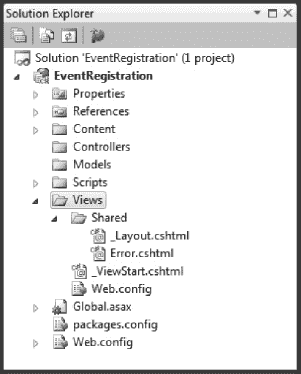
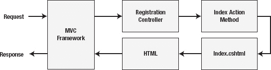

# 二十三、第一个 MVC 应用

使用 MVC 框架有很多新概念要学习，最好的入门方式是构建一个应用。在本章中，我们将创建一个简单的 web 应用，允许运动员注册铁人三项比赛。当我们深入研究 MVC 框架的细节时，我们将在后面的章节中以这个例子为基础。

这一章是 MVC 框架的快速入门，也是后续章节的指南。在本书的这一部分中，我引用了很多其他章节的内容，在这些章节中，个人概念得到了进一步的扩展和展示。如果本章一开始并不是所有内容都有意义，也不要担心。要理解的东西太多了，可能需要一段时间才会清晰起来。

 **注意**我们将在本书中使用 MVC 框架的第 3 版。确保你已经按照第 3 章中的描述安装了 MVC 工具更新包。如果不安装更新，Visual Studio 会显示不同的对话框选项，并且[第 24 章](24.html#ch24)中显示的代码优先功能将不可用。

### 创建项目

我们从创建一个新项目开始。我们将继续前面示例的主题，创建一个允许用户注册竞赛活动的应用。首先，使用 ASP.NET MVC 3 Web 应用模板创建一个新的 Visual Studio 项目，如图 23-1 所示。

***图 23-1。**创建新的 MVC 框架项目*

 **注意**如果你只看到 MVC 版本 2 的项目模板，那么你可能忘记了应用一些必需的 Visual Studio 更新。所需软件和安装说明详见[第 3 章](03.html#ch3)。使用 MVC 版本 2，你将无法理解 MVC 版本的例子。

我把这个项目叫做 EventRegistration。点击 OK 按钮会弹出一个新的对话框，允许我们选择不同种类的 MVC 项目，如图[图 23-2](#fig_23_2) 所示。

***图 23-2。**选择项目模板*

有三种项目模板可用:空、Internet 应用和 Intranet 应用。Internet 应用模板创建一些默认项目来启动项目。Intranet 应用模板非常相似，只是它假设您希望使用 Active Directory/域控制器对用户进行身份验证。我们将使用空模板。我将向您展示如何创建与其他模板中包含的项目等价的项目。

当你创建一个新的 MVC 框架应用时，你可以从不同的视图引擎中选择。我们将使用 MVC 框架版本 3 中引入的 Razor 引擎。我会在第 25 章的[中解释更多关于视图引擎和 Razor 的内容。目前，只要确保从菜单中选择Razor选项。](25.html#ch25)

我们可以忽略其他选项。MVC 框架的最新更新增加了对 HTML5 的一些初步支持，但是在本书中我们将坚持使用 HTML4(因为 HTML5 仍然在发展，它本身就是一个主题)。单击“确定”创建项目。Visual Studio 将忙于创建新项目。图 23-3 显示了项目的结构。

***图 23-3。**用空模板创建的 MVC 框架项目的结构*

MVC 框架使用一种叫做*约定优于配置*的技术。这意味着当我们想要向一个项目中添加一个新的组件时，我们只需将它放入适当的项目文件夹中。只要我们把组件放在 MVC 框架寻找该组件类型的地方，我们就不必依赖配置文件。当我们浏览章节时，我们将浏览项目中的每一个文件夹和项目，但是[表 23-1](#tab_23_1) 提供了一个摘要和一个章节的参考，其中每一个都有解释。

尽管我们为 MVC 框架项目添加了稍微不同的内容，但是`Global.asax`和`Web.config`文件在任何其他 ASP.NET 项目中扮演着相同的角色。

 **注意**注意有两个`Web.config`档:`~/Web.config`和`~/Views/Web.config`。第二个配置 Razor，我们很少需要对这个文件做任何修改。大多数时候，我们会修改主`Web.config`文件，就像我们对其他种类的 ASP.NET 应用所做的那样。

### 创建领域模型

正如我前面提到的，MVC 框架中有两种模型:领域模型和视图模型。通常的做法是为域模型创建一个单独的类库项目，并将其作为引用添加到 MVC 框架项目中。这个想法是，这有助于加强领域模型和应用其余部分之间的分离。我通常在实际项目中采用这种方法，但是为了使这些例子简单，我将使用另一种方法在 MVC 框架项目中定义模型。

 **提示**如果你使用 Visual Web Developer 2010 Express，将领域模型放入一个单独的项目可能会有点令人沮丧。这是因为您一次只能打开一个项目，这与 Visual Studio 的商业版本不同，商业版本允许在单个解决方案的上下文中打开多个项目。您可以通过打开 Visual Web Developer 的两个实例来部分解决这个问题，每个项目一个实例，但这仍然会导致一种尴尬的工作方式。

当在一个项目中包含两种类型的模型时，我喜欢添加一些额外的结构，这样就可以清楚地知道哪些类型是领域模型的一部分，哪些类型是视图模型。文件夹`Models`是 MVC 框架项目中模型类型的常规目录，所以使用 Visual Studio 创建两个新文件夹，`Models/Domain`和`Models/View`。您不必将您的模型类放在`Models`文件夹中。你可以把它们放在任何适合你的地方(包括，正如我所说的，在一个单独的项目中)，但是在本书中，我将坚持通常的约定。

 **注意**此刻不要担心查看车型。我会在第 25 章中解释它们。目前，知道有两种模型就足够了，我希望能够在示例项目中区分它们。

我们将从为我们的模型创建类型开始。我们将保持简单，只有两个域类，一个代表比赛，一个代表比赛的注册。这两个类都被添加到`Models/Domain`文件夹中。右键单击该文件夹，并从弹出菜单中选择 Add  Class。第一个类叫做`Competition`，内容如[清单 23-1](#list_23_1) 所示。

***清单 23-1。**竞赛类*

`using System;

namespace EventRegistration.Models.Domain {
    public class Competition {

        public string Name {get; set;}
        public string Location {get; set;}
        public DateTime Date {get; set;}
        public string EventType { get; set; }
    }
}`

这是一个非常简单的类。有四个属性，我们将使用这些属性的值来表示不同铁人三项比赛的细节。另一个域类叫做`Registration`，如清单 23-2 中的[所示。](#list_23_2)

***清单 23-2。**注册类*

`namespace EventRegistration.Models.Domain {
    public class Registration {

        public string Name { get; set; }
        public string HomeCity { get; set; }
        public int Age { get; set; }
        public Competition Competition {get; set;}
    }
}`

这是另一个简单的类。`Name`、`Home`和`Age`属性描述了一个竞赛的注册者，而`Competition`属性引用了他们已经注册的竞赛。

#### 创建存储库

大多数领域模型是持久的，大多使用关系数据库。我们希望允许我们的控制器能够访问我们的持久域模型，但是如果我们在控制器类中包含检索和修改数据的代码，我们将在控制器和域模型之间创建一个依赖关系。确保分离的最常见方法是使用一个*库*，它是一个抽象类或接口，提供了处理持久数据的方法，但并没有说明如何操作数据。我更喜欢使用 C#接口来定义存储库。[清单 23-3](#list_23_3) 显示了领域类型的存储库，我称之为`IRepository`。

***清单 23-3。**电子仓库界面*

`using System.Collections.Generic;
using System.Linq;

namespace EventRegistration.Models.Domain.Repository {
    public interface IRepository {

        IQueryable<Competition> Competitions { get; }

        void SaveCompetition(Competition comp);
    }
}`

我喜欢将项目中的结构添加到我的模型中，以保持各种元素的分离，所以我创建了一个新文件夹`Models/Domain/Repository`，并在那里添加了`IRepository`接口。目前接口中只定义了两个成员。第一个是`Competitions`属性，它检索一系列`Competition`对象，我们可以用它们作为 LINQ 查询的基础。另一个成员，`SaveCompetition`方法接受一个我们希望被持久化的`Competition`对象。这可能是一个新实例，也可能是对现有实例的修改。这是存储库支持域类型的基本模式:一个获取类型序列的属性和一个保存更改的方法。我们可以重复这个模式来添加对`Registration`模型类型的支持，如[清单 23-4](#list_23_4) 所示。

***清单 23-4。**增加对附加型号类型的支持*

`using System.Collections.Generic;
using System.Linq;

namespace EventRegistration.Models.Domain.Repository {
    public interface IRepository {

        IQueryable<Competition> Competitions { get; }

        void SaveCompetition(Competition comp);

        **IQueryable<Registration> Registrations { get; }**

        **void SaveRegistration(Registration reg);**
    }
}`

#### 创建虚拟存储库实现

在[第 24 章](24.html#ch24)中，我将向您展示我们如何实现存储库，以便我们的域模型对象被存储在 SQL Server 中并从 SQL Server 中检索。同时，我们需要一个替身，让我们模拟数据库。为此，我们将创建一个存储库的虚拟实现。我在`Models/Domain/Repository`文件夹中创建了一个名为`DummyRepository`的类，其内容如[清单 23-5](#list_23_5) 所示。

***清单 23-5。**存储库的虚拟实现*

`using System;
using System.Collections.Generic;
using System.Linq;

namespace EventRegistration.Models.Domain.Repository {
    public class DummyRepository : IRepository {
        private static List<Registration> registrations = new List<Registration>();
        private static List<Competition> competitions
            = new List<Competition>() {
                new Competition { Name= "London Lunge", EventType = "Sprint",
                    Location = "London", Date = new DateTime(2012, 4, 22)},
                new Competition { Name= "New York Nudge", EventType = "Olympic",
                    Location = "New York", Date =  new DateTime(2012, 5, 12), },
                new Competition { Name = "Paris Panic", EventType = "Sprint",
                    Location = "Paris", Date = new DateTime(2012, 5, 16)}
            };

        public IQueryable<Competition> Competitions {
            get {
                return competitions.AsQueryable();
            }
        }

        public void SaveCompetition(Competition competition) {
            competitions.Add(competition);
        }

        public IQueryable<Registration> Registrations {
            get {
                return registrations.AsQueryable();
            }
        }

        public void SaveRegistration(Registration registration) {
            registrations.Add(registration);
        }
    }
}`

我已经使用一些强类型的为我们的域模型类创建了一些有限的持久性。正如我们将在后面看到的，MVC 框架创建了它需要服务于请求的类的新实例(很像核心 ASP.NET 所做的)，因此只要应用在运行，静态集合将为我们提供一定程度的持久性。我还在虚拟存储库中包含了一些初始的`Competition`对象。这将让我们继续下去，直到我们在第 24 章中创建一个真正的存储库。

### 创建控制器

现在我们已经创建了一个简单的域模型，我们可以创建一个控制器了。要向项目添加控制器，右键单击`Controllers`项目文件夹，并从弹出菜单中选择 Add  Controller。你会看到添加控制器对话框，如图[图 23-4](#fig_23_4) 所示。

***图 23-4。**添加控制器对话框*

将控制器名称设置更改为 RegistrationController。惯例是给控制器起一个有意义的名字，我们将使用这个控制器来允许用户注册比赛。确保模板选项设置为空控制器。Visual Studio 可以使用不同的模板创建控制器。这些模板可能是一种有用的入门方式，但是我们将保持简单，并将我们需要的东西添加到一个空的控制器中。单击“添加”关闭对话框并创建控制器。

MVC 框架控制器是一个 C#类，通常是从`System.Web.Mvc.Controller`派生而来。更改 Visual Studio 刚刚创建的控制器的内容，使其与清单 23-6 中的[相匹配。](#list_23_6)

***清单 23-6。**注册控制器类*

`using System.Web.Mvc;
using EventRegistration.Models.Domain;

namespace EventRegistration.Controllers {

    public class RegistrationController : Controller {` `        public ActionResult Index() {
            return View();
        }
    }
}`

如果你正带着困惑的感觉看着列表，那么不要担心。MVC 框架的工作方式与 ASP.NET 的其他框架非常不同，第一次看到控制器可能会不舒服。

核心的 ASP.NET 平台和 Windows 窗体以页面为基础工作。我们创建一个表示网页的文件，当用户请求该页面时，ASP.NET 呈现内容以生成发送到浏览器的 HTML。在用户可以请求的页面和我们的应用结构之间有一个直接的映射。我们可以使用路由特性来改变 URL(如第 27 章中所述)，但是 web 应用的结构仍然是基于页面的。

MVC 框架没有页面；它只有模型、视图和控制器。控制器的作用是处理一个 HTTP 请求，更新域模型的状态以反映请求，然后选择一个视图呈现并显示给用户。用户不能直接请求视图，正如我们将要看到的，视图不等同于页面。

控制器有*动作方法*，每个方法执行应用支持的一些动作。在清单所示的`RegistrationController`类中有一个名为`Index`的动作方法。

 **提示**约定是`Index`方法导致控制器的初始显示。但是，这只是一个约定，你可以用任何名字调用你的动作方法，在一个叫做`Index`的动作方法中做任何你喜欢的事情。

用户通过请求指向控制器中相应动作方法的 URL 来请求应用执行其动作之一。以下是此类 URL 的一个示例:

`http://*<myserver>*/Registration/Index`

这个 URL 指向`Registration`控制器中的`Index`动作。这对应于`RegistrationController` *类*中的`Index` *方法*。注意，当我们想要定位`RegistrationController`时，我们省略了类名的`Controller`部分，指定了`Registration`。MVC 框架管理被请求的控制器和类本身之间的关联。

 **注意**URL 表单控制器/动作是新 MVC 框架应用的默认设置。我会在第 27 章的[中告诉你如何使用路由来改变这一点。](27.html#ch27)

动作方法返回一个`ActionResult`对象，它代表了 MVC 框架下一步应该做什么的指令。在清单中，我调用了`View`方法，这是告诉 MVC 框架呈现视图的一种便捷方式。我使用了`View`方法的无参数版本，它告诉 MVC 框架为 action 方法呈现默认视图(我们稍后将创建这个默认视图)。

因此，将这些放在一起，当 MVC 框架收到对 URL `/Registration/Index`的请求时，它创建我们的`RegistrationController`类的一个新实例，然后调用`Index`方法。`Index`方法返回一个通过调用`View`方法创建的`ActionResult`对象。MVC 框架将此作为呈现与`Index`方法相关联的默认视图并将结果返回给用户的指令。

### 创建视图

我们的示例应用缺少的部分是*视图*。要创建一个视图，右击`Index`动作方法，从弹出菜单中选择【添加视图】，如图[图 23-5](#fig_23_5) 所示。

***图 23-5。**为动作方法创建视图*

将出现添加视图对话框，如图[图 23-6](#fig_23_6) 所示。这是我们配置视图的机会。

***图 23-6。**添加视图对话框*

Visual Studio 将视图名称设置为`Index`，这将使它成为`Index`操作方法的默认视图。确保对话框中的选项与图示相符。未选中“创建强类型视图”选项，未选中“创建为分部视图”选项，并且选中了“使用布局或母版页”。

单击“添加”按钮创建视图。如果你查看解决方案资源管理器窗口，你会看到 Visual Studio 已经创建了一个名为`Registration`的文件夹，并添加了一个名为`Index.cshtml`的文件，如图[图 23-7](#fig_23_7) 所示。

***图 23-7。**解决方案资源管理器窗口中显示的新添加的视图*

多个控制器可以定义一个名为`Index`的动作，所以将`Index.cshtml`文件放在`Registration`文件夹中，形成视图和`RegistrationController`类之间的关联。`.cshtml`前缀表明这是一个使用 Razor 视图引擎和 C#语法的视图。我在第 25 章的[中向您介绍了 Razor，但是现在，更新视图的内容以匹配](25.html#ch25)[清单 23-7](#list_23_7) 。

***清单 23-7。**index . cshtml 视图*

`**@{**
    **ViewBag.Title = "Registration";**
**}**

<h4>Registration</h4>

**@using (Html.BeginForm()) {**

    <table>
        <tr><td>Name:</td><td>**@Html.Editor("Name")**</td></tr>
        <tr><td>Age:</td><td>**@Html.Editor("Age")**</td></tr>
        <tr><td>City:</td><td>**@Html.Editor("HomeCity")**</td></tr>
        <tr><td>Competition:</td><td>**@Html.Editor("CompetitionName")**</td></tr>

        <tr><td colspan="2"><input type="submit" value="Register" /></td></tr>
    </table>
}`

我们使用 Razor 标签在视图中包含指令。在许多方面，Razor 类似于我们在 ASP.NET 其他地方使用的`<%`标签`%>`标签。Razor标签以`@`符号开始，但是没有相应的结束标签。Razor 视图引擎是从 Razor 视图呈现 HTML 的 MVC 框架组件，它足够聪明，可以解决所有问题。(嗯，通常足够聪明。我会在[第 25 章](25.html#ch25)中告诉你如何助其一臂之力。)

 **提示**你可以在 MVC 框架中使用常规的 ASP.NET`<%`和`%>`标签。只需在[图 23-6](#fig_23_6) 所示的添加视图对话框中更改视图引擎选择。然而，我建议你使用Razor。学习新的语法并不需要太多的努力，而且它提供了一种创建视图的很好的表达方式。在本书中，我只对 MVC 框架例子使用 Razor。

注意，在 MVC 框架项目中没有设计工具。我们直接在视图中使用 HTML 和 Razor 标签，在控制器和域模型中使用 C#代码。这很有道理。MVC 框架希望我们控制应用生成的 HTML，而 Web Forms 风格的设计工具将开发人员与 HTML 隔离开来。

您可以在清单中看到`Index.cshtml`视图将呈现的 HTML 的结构。除了 Razor 标签，所有东西都是原始的 HTML。我使用了一个`table`元素来创建一个网格布局，并定义了几行，每行有两列。左栏是一系列文字标签。在右栏是一系列以`@Html.Editor()`形式出现的尖锐呼叫。这些是对一个 *HTML 助手方法*的调用。HTML 助手方法，也称为 *HTML 助手*，是我们可以在视图中用来帮助生成 HTML 的便利方法。在这种情况下，`Editor`方法创建一个适合从用户那里收集值的输入元素。`Editor`方法实际上相当复杂，你会在第 26 章中了解到更多。

包含对`Html.BeginForm` HTML 助手的调用的`@using`块创建了一个 HTML 表单元素，该元素回发到一个 URL，该 URL 指向导致视图被呈现的控制器和动作方法，在本例中是`Registration`控制器中的`Index`动作。此区块:

`@{
    ViewBag.Title = "Registration";
}`

是一个 Razor 块，可以包含多个 C#语句。这个模块设置发送给用户的 HTML 页面的标题，使用一个叫做`ViewBag`的特性，我将在[第 28 章](28.html#ch28)中适当介绍这个特性。一般来说，`ViewBag`允许我们将数据从控制器传递到视图，但是它有一些额外的特性，比如允许我们设置标题。

### 运行 MVC 框架应用

我们已经准备好测试我们的(非常简单的)应用。从 Visual Studio“调试”菜单中选择“启动而不调试”,编译应用并在浏览器中显示它。你首先看到的是一个`404 – Not Found`错误，如图 23-8 中的[所示。](#fig_23_8)

***图 23-8。**从 Visual Studio 启动 MVC 框架应用时显示错误*

我们的控制器和动作方法的组合意味着我们对`/Registration/Index`方法有一个目标，但是我们没有告诉 MVC 框架当默认 URL ( `/`)被请求时该做什么，所以我们得到一个错误。在[第 27 章](27.html#ch27)中，我会告诉你如何配置应用的 URL。

目前，在浏览器的地址栏中添加`/Registration/Index`来定位我们的操作方法。你会看到与图 23-9 非常相似的东西。

***图 23-9。**显示在浏览器中的 MVC 框架应用示例*

您可以看到清单 23-8 中的视图呈现的 HTML。

***清单 23-8。**index . cs HTML 视图生成的 HTML】*

`<!DOCTYPE html>
<html>
<head>
    <title>Registration</title>
    <link href="/Content/Site.css" rel="stylesheet" type="text/css" />
    
</head>
<body>

<h4>Registration</h4>

<form action="/Registration/Index" method="post">
<table>
<tr>
    <td>Name:</td>
    <td>
        <input class="text-box single-line" id="Name" name="Name" type="text" value=""/>
    </td>
</tr>
    <tr>
    <td>Age:</td>
    <td>
        <input class="text-box single-line" id="Age" name="Age" type="text" value="" />
    </td>
</tr>
<tr>
    <td>City:</td>
    <td>
        <input class="text-box single-line" id="HomeCity" name="HomeCity"
            type="text" value="" />
    </td>
</tr>
<tr>
    <td>Competition:</td>
    <td>
        <input class="text-box single-line" id="CompetitionName" name="CompetitionName"
            type="text" value="" />
    </td>
</tr>
<tr>
    <td colspan="2"><input type="submit" value="Register" /></td>
</tr>
</table>
</form>
</body>
</html>`

关于这个 HTML 有一些事情需要注意，特别是与使用 ASPX 文件生成的 HTML 相比，缺少了一些东西。没有视图状态数据 blob。这是因为 MVC 框架不在 HTML 中存储状态数据。并且没有损坏的`ID`值。因为没有控件，MVC 框架不需要在 HTML 元素中嵌入特殊含义。这意味着当我们像这样调用 HTML 助手时:

`<td>@Html.Editor("Name")</td>`

我们得到这样的 HTML:

`<td><input class="text-box single-line" id="Name" name="Name" type="text" value=""/></td>`

HTML 助手只是生成 HTML 的一种便捷方式。它们在生成的 HTML 中不包含任何特殊信息，如果需要，我们可以完全忽略它们，使用静态 HTML。

图 23-10 概括了导致 HTML 生成并显示在浏览器中的事件顺序。

***图 23-10。**请求处理路径*

MVC 框架收到了一个对 URL `/Registration/Index`的请求，它将其解释为针对`RegistrationController`类中的`Index`动作方法。创建了该类的一个新实例，并调用了`Index`方法。`Index`的方法很简单。它只是返回一个`ActionResult`对象，告诉 MVC 框架呈现与该方法相关联的默认视图。框架找到文件`/Views/Registration/Index.cshtml`并使用 Razor 视图引擎处理它。Razor 解释`@`标签，并用 HTML 替换它们，HTML 与模板中已经存在的静态 HTML 相结合。合并后的 HTML 返回到浏览器，并在那里显示。我不断重申组件之间的关系，因为理解处理请求的方式是理解 MVC 框架的关键。

### 整理基本特征

我们有一些非常基本的东西。我们可以请求一个 URL 并显示一些 HTML，但仅此而已。在接下来的几节中，我将向您展示如何向应用添加更多的功能，这样我们就可以看到一些有用的东西出现了。

#### 使用知识库

我们的第一个改进是开始使用存储库，这样我们就可以在控制器中使用域模型。清单 23-9 展示了对`RegistrationController`类的修改。

***清单 23-9。**使用 RegistrationController 类中的存储库*

`using System.Linq;
using System.Web.Mvc;
using EventRegistration.Models.Domain.Repository;

namespace EventRegistration.Controllers {

    public class RegistrationController : Controller {
        **private IRepository repository;**

        **public RegistrationController() {**
            **repository = new DummyRepository();**
        **}**

        public ActionResult Index() {
            **ViewBag.Competitions = repository.Competitions.Select(e => e.Name);**
            return View();
        }
    }
}`

我已经使用我们之前创建的界面为存储库定义了一个新的字段。然后，我创建了一个`DummyRepository`类的实例，并将其分配给字段，如下所示:

`public RegistrationController() {
    repository = new DummyRepository();
}`

如果你善于观察，你会意识到我在构造函数中做了一件非常非常愚蠢的事情。通过直接创建`DummyRepository`类的实例，我在控制器和存储库实现之间创建了一个依赖关系。在本章的后面，我将向你展示如何在不直接实例化实现的情况下解决创建接口实现的问题。控制器类的另一个增加是在`Index`动作方法中，我在那里添加了以下语句:

`ViewBag.Competitions = repository.Competitions.Select(e => e.Name);`

`ViewBag`是一个允许我们将数据从控制器传递到视图的特性。`ViewBag`属性返回一个*动态*对象。如果您不熟悉。NET 对动态类型的支持，这允许我们任意定义新的属性，而无需先定义它们。在清单中，没有`Competitions`属性，直到我给它赋值，属性才被创建。我分配给`ViewBag.Competitions`属性的值是来自`Competition`存储库的`Name`值序列。

我想将比赛的名称传递给视图，这样我就可以限制用户可以从中选择的比赛集合。按照现在的情况，用户可以输入任何旧的字符串，这会在以后引起问题。[清单 23-10](#list_23_10) 显示了我对`Index.cshtml`所做的更改，以使用这些数据。

***清单 23-10。**使用 ViewBag 检索从控制器传来的数据*

`@{
    ViewBag.Title = "Registration";
}

<h4>Registration</h4>

@using (Html.BeginForm()) {

    <table>
        <tr><td>Name:</td><td>@Html.Editor("Name")</td></tr>
        <tr><td>Age:</td><td>@Html.Editor("Age")</td></tr>
        <tr><td>City:</td><td>@Html.Editor("HomeCity")</td></tr>

        <tr>
            <td>Competition:</td>
            <td>
                **@Html.DropDownList("Competition", new SelectList(ViewBag.Competitions))**
            </td>
        </tr>
        <tr><td colspan="2"><input type="submit" value="Register" /></td></tr>
    </table>
}`

我已经将对`Html.Editor`助手的调用替换为对`Html.DropDownList`助手的调用。顾名思义，这个助手生成一个`select`元素。参数是将用于`select`元素的`ID`和`name`属性的值，以及包含将用于创建`option`元素的一组值的`SelectList`对象。为了创建`SelectList`，我使用了分配给`ViewBag.Competitions`属性的竞赛名称集。这一更改的结果是以下 URL:

`<select id="Competition" name="Competition">
    <option>London Lunge</option>
    <option>New York Nudge</option>
    <option>Paris Panic</option>
</select>`

我们回到[第 28 章](28.html#ch28)中的`ViewBag`(以及其他传递和保存数据的形式)。如果你重新编译应用并导航到`/Registration/Index` URL，你可以看到用户不能选择一个在存储库中定义的比赛，如图[图 23-11](#fig_23_11) 所示。

***图 23-11。**使用 Html 的效果。DropDownList HTML 帮助器来呈现视图包数据*

信息的流动是单向的。我们可以将数据从控制器传递到索引，但不能反过来。有一种技术叫做*子动作*，在这种技术中，一个视图可以调用一个动作方法。我会在[第 28 章](28.html#ch28)中告诉你怎么做。

#### 处理表单发布

单击浏览器中的注册按钮目前没有多大作用。用户输入的任何数据都会消失。通过查看视图生成的表单，您可以了解为什么会出现这种情况:

`<form action="/Registration/Index" method="post">
    ...
</form>`

当我们单击 Register 按钮时，浏览器将表单发送到在`form`元素的 action 属性中指定的 URL，在本例中是`/Registration/Index`。当然，这是指向我们的`Index`动作方法的 URL，该方法在`ViewBag`中设置一个值，并告诉 MVC 框架呈现`Index.cshtml`视图。

为了正确处理`form` post，我们需要给我们的控制器添加另一个方法，如清单 23-11 所示。

***清单 23-11。**在控制器中处理表单帖子*

`using System.Linq;
using System.Web.Mvc;
using EventRegistration.Models.Domain.Repository;
using EventRegistration.Models.Domain;

namespace EventRegistration.Controllers {

    public class RegistrationController : Controller {
        private IRepository repository;

        public RegistrationController() {
            repository = new DummyRepository();
        }` `        public ActionResult Index() {
            ViewBag.Competitions = repository.Competitions.Select(e => e.Name);
            return View();
        }

        **[HttpPost]**
        **public ActionResult Index(string name, string homecity, string age,**
            **string competition) {**

            **Registration registration = new Registration {**
                **Name = name, HomeCity = homecity, Age = int.Parse(age),**
                **Competition = repository.Competitions**
                                    **.Where(e => e.Name == competition)**
                                    **.FirstOrDefault()**
            **};**

            **repository.SaveRegistration(registration);**

            **return View("RegistrationComplete", registration);**
        **}**
    }
}`

现在我们有了两个`Index`方法，MVC 框架需要知道应该调用哪一个来响应请求。我们使用. NET 属性提供这些信息，如下所示:

`...
**[HttpPost]**
public ActionResult Index(string name, string homecity, string age, string competition) {
...`

`HttpPost`属性告诉 MVC 框架，我们只希望这个方法用于处理 HTTP `POST`请求。当一个请求进来时，MVC 框架会寻找它能找到的与 action 方法最匹配的方法。对于一个`POST`请求，这是我们的新方法，对于`GET`请求，这是我们的原始方法(因为没有方法具有更具体的`HttpGet`属性)。

新的`Index`方法的参数与我们从`Index.cshtml`视图生成的 HTML 中的输入字段相匹配。当 MVC 框架收到`POST`请求时，它从表单数据中获取值，并通过参数传递给我们。在方法体内部，我使用参数值创建一个新的`Registration`对象。我直接从参数中设置了`Name`、`HomeCity`和`Age`属性的值，并执行一个简单的 LINQ 查询来从存储库中获取`Competition`对象，该对象的`Name`属性与来自`select`控件的值相匹配(该值通过`competition`方法参数传递给我们)。然后，我通过调用由`IRepository`接口定义的`SaveRegistation`方法来保存新的`Registration`。

剩下的就是告诉 MVC 框架下一步应该做什么。我调用`View`方法来告诉 MVC 框架呈现一个视图，我指定的参数是我想要呈现的视图的名称(`RegistrationComplete`)和一个*视图模型对象*，这是我们根据请求创建的`Registration`对象。

视图模型是我们将数据从控制器传递到视图的主要方式。约定是视图模型对象传递视图负责显示的主数据项，并使用`ViewBag`传递支持数据。这只是一个约定，我们可以使用`ViewBag`做任何事情，但是如果我们这样做，我们就会错过*强类型视图*和它们提供的便利。

现在让我们创建一个强类型视图。右键单击新`Index`方法中的任意位置，并从弹出菜单中选择 Add View。将视图名称设置为注册完成，如图[图 23-12](#fig_23_12) 所示。这是我告诉 MVC 框架在新的`POST` -only `Index`方法中呈现的视图的名称。

***图 23-12。**创建强类型视图*

选中“创建强类型视图”选项，并为模型类选择注册。保持其他选项不变，单击 Add 按钮创建视图。Visual Studio 将在`~/Views/Registration`文件夹中创建一个名为`RegistrationComplete.cshtml`的新文件。编辑该文件的内容以匹配[清单 23-12](#list_23_12) 。

***清单 23-12。**强类型注册完整视图*

`@model EventRegistration.Models.Domain.Registration

@{
    ViewBag.Title = "Registration Completed";
}

<h3>Registration Completed</h3>

@Model.Name has registered for the @Model.Competition.Name which will be held in
@Model.Competition.Location on @Model.Competition.Date.ToShortDateString()

<table>
    <tr><th colspan="2">Summary</th></tr>
   <tr><td>Competitor:</td><td>@Html.DisplayFor(m => m.Name)</td></tr>
   <tr><td>Age:</td><td>@Html.DisplayFor(m => m.Age)</td></tr>
   <tr><td>Home City:</td><td>@Html.DisplayFor(m => m.HomeCity)</td></tr>
   <tr><td>Competition Name:</td><td>@Html.DisplayFor(m => m.Competition.Name)</td></tr>
   <tr><td>Competition City:</td><td>@Html.DisplayFor(m => m.Competition.Location)</td></tr>
   <tr><td>Competition Date:</td><td>@Model.Competition.Date.ToShortDateString()</td></tr>
</table>`

强类型视图有一个`@model`声明(带有小写的`m`)来告诉 MVC 框架视图模型类型是什么。在我们的例子中，这是一个`Registration`对象，因为这是我们在创建视图时选择的类型。我们可以使用 Razor `@Model`标签(大写的`M`)来访问模型对象。Visual Studio 使用类型信息来提供智能感知支持，以帮助在我们的代码中使用选择的模型成员。

在清单中，我以两种不同的方式使用了模型对象。第一个显式使用了`@Model`标签，如下所示:

`@Model.Name has registered...`

这导致 Razor 将模型对象的`Name`属性的值插入到将被发送到浏览器的 HTML 中。我使用模型的另一种方式是使用助手方法`Html.DisplayFor`,如下所示:

`<tr><td>Age:</td><td>**@Html.DisplayFor(m => m.Age)**</td></tr>`

这是一个强类型助手的例子。我们使用 lambda 表达式从模型对象中选择属性或其他成员，助手将呈现合适的 HTML。`Html.DisplayFor`助手生成只读 HTML。我将在第 26 章的[中向您展示为什么这是有用的(相比之下，我只是用`Name`属性来写值)。](26.html#ch26)

### 增强应用

我们已经到了拥有某种功能的地步。我们可以创建新的注册，并将它们存储在我们的虚拟存储库中。在这一过程中，我们使用了`ViewBag`和强类型视图将数据从控制器传递到视图，我们使用了助手方法来方便地生成在视图中使用的 HTML，并且我们从存储库中读取数据并向其中写入数据。在下面几节中，我们将添加一些额外的功能和特性。

#### 使用模型绑定

我最喜欢的 MVC 特性之一是*模型绑定*。这是一个让处理请求变得更容易的巧妙技巧。当我添加 action 方法来处理表单帖子时，我为我感兴趣的每个输入字段值定义了一个参数，并使用它们来填充新的`Registration`对象的属性，如下所示:

`...
[HttpPost]
public ActionResult Index(string name, string homecity, string age, string competition) {

    Registration registration = new Registration {
        Name = name, HomeCity = homecity, Age = int.Parse(age),
        Competition = repository.Competitions
            .Where(e => e.Name == competition)
            .FirstOrDefault()
        };
...`

作为这个过程的一部分，我必须将 age 参数解析为一个`int`，以确保用户输入的值适合用于`Registration.Age`属性(如果不适合，将抛出一个异常，并向用户报告一个错误)。我们可以通过改变方法签名巧妙地避开这项工作，如[清单 23-13](#list_23_13) 所示。

***清单 23-13。**在动作方法中使用模型绑定*

`using System.Linq;
using System.Web.Mvc;
using EventRegistration.Models.Domain.Repository;
using EventRegistration.Models.Domain;

namespace EventRegistration.Controllers {

    public class RegistrationController : Controller {
        private IRepository repository;

        public RegistrationController() {
            repository = new DummyRepository();
        }

        public ActionResult Index() {
            ViewBag.Competitions = repository.Competitions.Select(e => e.Name);
            return View();
        }` `        [HttpPost]
        public ActionResult Index**(Registration registration,** string competition) {

            registration.Competition = repository.Competitions
                .Where(e => e.Name == competition).FirstOrDefault();

            repository.SaveRegistration(registration);

            return View("RegistrationComplete", registration);
        }
    }
}`

我们所要做的就是定义一个我们想要接收的类型的参数，MVC 框架将尝试创建一个实例，并通过查找与我们指定的类型的属性名相匹配的元素名来填充请求中的属性。因此，就像魔术一样，我们的`Index`方法被传递一个`Registration`,其中包含用户输入的数据，嗯…差不多。MVC 框架不知道如何将竞争`select`元素的值转换成存储库中的`Competition`对象。为了处理这个问题，我仍然使用我的 LINQ 查询，但是在[第 29 章](29.html#ch29)中，我将向你展示如何创建一个定制的模型绑定器来使整个过程无缝。

 **提示**模型绑定系统还验证用户输入的数据，以确保它可以被转换成动作方法参数属性所需的类型。我会在第 29 章中告诉你如何利用这一点。

我喜欢模型绑定，因为它消除了 web 应用编程中最乏味和最容易出错的部分之一，即在请求数据中寻找用户提供的值，然后解析它们以确保我们可以使用它们。MVC 框架要求我们密切参与我们的应用处理的 HTTP 和 HTML，但它确实有一些非常方便的特性，使体验更加愉快和健壮。

#### 添加依赖注入

`RegistrationController`类需要一种方法来为存储库接口创建实现类的实例。我目前的做法在控制器和存储库实现之间创建了一个直接的依赖关系，就像这样:

`...
public RegistrationController() {
    repository = new DummyRepository();
}
...`

我已经创建了*紧密耦合的组件*。如果我想改变正在使用的存储库实现，我必须找到所有实例化了`DummyRepository`的地方并改变它们。我们想要的是*松散耦合的组件*，其中控制器依赖于存储库接口，并且不了解正在使用的实现。

幸运的是，我们可以通过使用一种叫做*依赖注入* (DI)的技术来做到这一点。MVC 框架对 DI 有广泛的支持，最有用的是通过`IDependencyResolver`接口，如[清单 23-14](#list_23_14) 所示。

***清单 23-14。**IDependencyResolver 接口*

`namespace System.Web.Mvc {
    using System.Collections.Generic;

    public interface IDependencyResolver {

        object GetService(Type serviceType);
        IEnumerable<object> GetServices(Type serviceType);
    }
}`

我们通过实现`IDependencyResolver`接口来创建一个*依赖解析器*，然后将其注册到 MVC 框架中。每当 MVC 框架需要创建一个新对象时，它都会调用我们的依赖解析器中的一个方法。这使我们有机会创建和配置所需的对象，并在这样做时，打破应用各部分之间的依赖关系。解释这一点的最佳方式是通过演示。首先，我们需要从控制器类中移除依赖，如清单 23-15 所示。

***清单 23-15。**从控制器类中移除依赖关系*

`using System.Linq;
using System.Web.Mvc;
using EventRegistration.Models.Domain.Repository;
using EventRegistration.Models.Domain;

namespace EventRegistration.Controllers {

    public class RegistrationController : Controller {
        private IRepository repository;

        public RegistrationController(**IRepository repo**) {
            repository = repo;
        }

        public ActionResult Index() {
            ViewBag.Competitions = repository.Competitions.Select(e => e.Name);
            return View();
        }

        [HttpPost]
        public ActionResult Index(Registration registration, string competition) {

            registration.Competition = repository.Competitions
                .Where(e => e.Name == competition).FirstOrDefault();` `            repository.SaveRegistration(registration);
            return View("RegistrationComplete", registration);
        }
    }
}`

我已经更改了控制器类的构造函数，因此它需要一个`IRepository`参数。控制器不再负责直接创建接口的实现，也不再依赖于`DummyRepository`类。我们可以开始使用不同的存储库实现，而无需更改控制器代码。

下一步是创建一个依赖解析器，它将在`RegistrationController`类创建时*将依赖注入*到该类中。这比听起来简单多了。在项目中创建一个名为`Infrastructure`的新文件夹。我们将在这里添加支持应用管道的类，这些类不适合其他地方。在这个文件夹中，创建一个名为`CustomDependencyResolver`的新类，并编辑该类以匹配清单 23-16 。

***清单 23-16。**CustomDependencyResolver 类*

`using System;
using System.Collections.Generic;
using System.Linq;
using System.Web.Mvc;
using EventRegistration.Controllers;
using EventRegistration.Models.Domain.Repository;

namespace EventRegistration.Infrastructure {
    public class CustomDependencyResolver : IDependencyResolver {

        public CustomDependencyResolver() {
        }

        public object GetService(Type serviceType) {

            if (serviceType == typeof(RegistrationController)) {
                DummyRepository dr = new DummyRepository();
                return new RegistrationController(dr);
            } else {
                return null;
            }
        }

        public IEnumerable<object> GetServices(Type serviceType) {
            return Enumerable.Empty<object>();
        }
    }
}`

MVC 框架区分了*单一注册服务*和*多重注册服务*。这只是意味着在 MVC 框架的某些部分，只有一个类负责执行一个动作，而在其他部分，可能有多个类，每个类都被要求依次执行相同的动作。控制器是单独注册服务的例子。这是因为只有一种类型可用于服务对`RegistrationController`本身的请求。当同一个接口或抽象类有多个实现时，通常会使用 Multiply 注册服务。

当 MVC 框架想要创建一个单独注册的服务的新实例时，它调用`GetService`方法，传入它想要实例化的类型。我们检查类型，如果请求是对一个`RegistrationController`的，我们创建一个新的实例，并传入一个`DummyRepository`类的实例，以满足对`IRepository`接口的构造函数依赖。

我们不想对其他类型采取任何特殊的步骤，所以如果从`GetService`方法请求的类型不是`RegistrationController`，我们返回`null`，当调用`GetServices`时返回一个空的枚举。这告诉 MVC 框架我们对请求不感兴趣，应该使用创建对象的默认机制。

现在我们需要向 MVC 框架注册我们的依赖解析器。我们在`Global.asax`的`Application_Start`方法中这样做，如[清单 23-17](#list_23_17) 所示。

***清单 23-17。**注册依赖解析器*

`...
protected void Application_Start() {
    AreaRegistration.RegisterAllAreas();

    **DependencyResolver.SetResolver(new CustomDependencyResolver());**

    RegisterGlobalFilters(GlobalFilters.Filters);
    RegisterRoutes(RouteTable.Routes);
}
...`

静态的`DependencyResolver.SetResolver`方法让我们向 MVC 框架注册一个`IDependencyResolver`接口的实现，在这个例子中，是我们的`CustomDependencyResolver`类的一个新实例。

如果您在 Visual Studio 中选择 DebugStart Without Debug 并导航到`/Registration/Index`，您将看到应用像以前一样工作，只是在幕后我们打破了控制器类和存储库实现之间的紧密耦合。

#### 使用依赖注入容器

我们的依赖解析器很有用，但是很难维护。对控制器类的构造函数的任何更改都要求我们更改在解析器中创建新实例的方式，并且我们需要维护解析器类，以便它知道如何实例化我们添加到项目中的所有其他类。我们已经解决了依赖注入问题，但是是以一种非常手工和脆弱的方式。

我们需要一个*依赖注入控制器*来制定一个更加灵活和通用的解决方案。我最喜欢的 DI 容器是 Ninject，我在[第三章](03.html#ch3)中让你下载的。有许多可用的 DI 容器，包括微软的 Unity，但是我使用 Ninject，因为它简单可靠。

第一步是添加对 Ninject 程序集的引用。在“解决方案资源管理器”窗口中右击“引用”项，并从弹出菜单中选择“添加引用”。选择浏览选项卡，导航到包含 Ninject 的文件夹，选择`Ninject.dll`，如图[图 23-13](#fig_23_13) 所示。

***图 23-13。**添加对 Ninject 程序集的引用*

单击“确定”，Visual Studio 将关闭“添加引用”对话框，在“解决方案资源管理器”窗口中展开引用集，并添加对 Ninject 的新引用。我们现在可以修改`CustomDependencyController`来使用 Ninject。清单 23-18 显示了这个类的修改版本。

***清单 23-18。**启用了 Ninject 的 CustomDependencyResolver 类*

`using System;
using System.Collections.Generic;
using System.Web.Mvc;
using EventRegistration.Models.Domain.Repository;
**using Ninject;**
**using Ninject.Syntax;**

namespace EventRegistration.Infrastructure {
    public class CustomDependencyResolver : IDependencyResolver {
        **private IKernel ninjectKernel;**` `        public CustomDependencyResolver() {
            **ninjectKernel = new StandardKernel();**
            **AddDefaultBindings();**
        }

        public object GetService(Type serviceType) {
            **return ninjectKernel.TryGet(serviceType);**
        }

        public IEnumerable<object> GetServices(Type serviceType) {
            **return ninjectKernel.GetAll(serviceType);**
        }

        **public IBindingToSyntax<T> Bind<T>() {**
            **return ninjectKernel.Bind<T>();**
        **}**

        **private void AddDefaultBindings() {**
            **Bind<IRepository>().To<DummyRepository>();**
        **}**
    }
}`

Ninject 是一个非常灵活的工具，可以做一系列不同的事情。在这种情况下，Ninject 通过检查要求它实例化的类型并在它们的构造函数中寻找依赖项来工作。当它发现一个类需要一个接口作为构造函数参数时，它会查看一组绑定，以确定应该创建哪个类作为该接口的实现，并将该类的新实例传递给构造函数。

Ninject 使用它所谓的*内核*来维护绑定集。我在依赖解析器的构造函数中创建内核，如下所示:

`public CustomDependencyResolver() {
    **ninjectKernel = new StandardKernel();**
    AddDefaultBindings();
}`

然后我调用`AddDefaultBindings`方法，这样我就可以设置我想用于各种接口的实现。Ninject 使用了一个流畅的 API，它依赖于 C#的一般类型特性。下面是一个创建绑定的示例:

`Bind<IRepository>().To<DummyRepository>();`

此语句告诉 Ninject，当它收到实例化一个对`IRepository`接口有构造函数依赖关系的类的请求时，它应该通过创建`DummyRepository`类的新实例来满足该依赖关系。最后一个变化是更新`GetService`和`GetServices`方法，这样它们就可以调用 Ninject 来获取所请求类型的实例。

 **注意**我已经公开了`Bind<T>`方法，这意味着我也可以在应用的其他地方定义绑定。最常见的地方是在应用启动时的`Global.asax`中。我喜欢在依赖解析器中进行绑定，但这只是个人偏好。

关于这个清单需要注意的最重要的一点是没有对`RegistrationController`类的引用。Ninject 动态工作。它自动检测依赖关系，所以我们不必告诉它对任何特定的类做什么；我们只是确保为它提供我们的接口和它们的实现之间的绑定。

 **提示** Ninject 为如何实例化类型提供了一些不同的选项，如果您希望对如何解析和注入依赖关系进行更细粒度的控制，这将非常有用。详情请见 Ninject.org 网站。

### 总结

在本章中，我们使用 MVC 框架创建了一个简单的 web 应用，并看到了主要的架构组件:模型、视图和控制器。MVC 框架需要更多的初始设置(例如，与 WebForm相反)。一旦构建模块就位，我们就可以开始更快地添加功能，您将在后面的章节中看到这一点。

正如我在本章开始时所说的，如果在这一点上并非一切都有意义，也不要担心。使用 MVC 框架有很多新概念要学习，掌握它们需要一段时间。