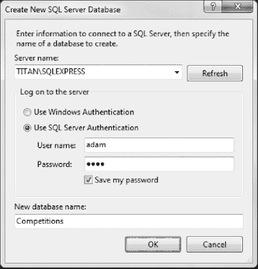
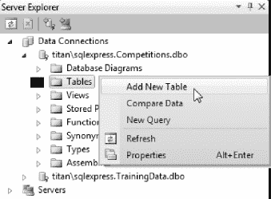
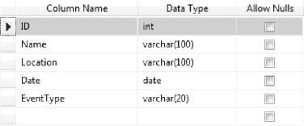
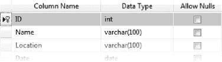
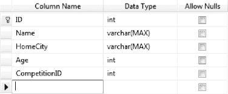
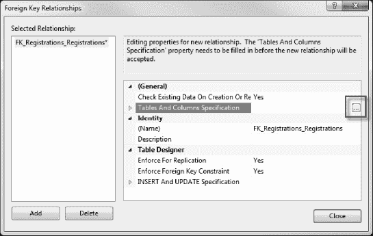
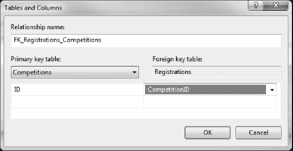
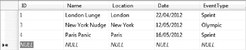

## 24

## 实现持久存储库

在这一章中，我们将解决我们的示例应用中最紧迫的问题——缺乏适当的模型持久性。为了做到这一点，我们将再次使用实体框架，但是使用的方式与我们之前使用的方法不同。

在前面的章节中，我们依靠实体框架来生成表示数据库表中行的类。我们真的不想放弃对 MVC 框架中模型类的控制，我们的目标是以这样一种方式创建一个存储库，使我们的模型类不具有持久性。这种方法有几个优点。第一，如果我们改变 ORM 技术，我们不必更新所有对模型类的引用；第二，其他程序员不能访问实体框架嵌入到它创建的类中的底层持久性特性。幸运的是，Entity Framework 的 4.1 版本让我们轻松做到了这一点。

 **注意**实体框架 4.1 版本包含在我在[第二章](02.html#ch2)让你安装的 MVC 3 工具更新中。如果您还没有安装此更新，那么您应该现在就安装。

实体框架使得我们可以很容易地使用自己的模型类来表示数据库中的行。我们将使用一个名为*代码优先*的特性，它让我们从模型类开始，并将它们与数据库相关联。代码优先特性的主要好处之一是它可以从我们的模型类中为我们创建数据库。这是一个伟大的想法，但我估计不到 5%的项目，我已经工作过的奢侈创建数据库从零开始。在绝大多数情况下，我们必须使用现有的数据库。当然，在一本书怪异的人工环境中，我们没有数据库遗产，所以我们将创建一个。我们将从头开始，不像前面的数据示例，我在源代码下载中提供了一个准备好的数据库。

 **警告** Visual Web Developer 不具备创建数据库所需的功能。这是微软区分 Visual Studio 免费版和商业版的另一种方式。你可以使用 SQL Server Management Studio 创建一个数据库(我在《T4》第二章中提到过)。该过程与本章中展示的 Visual Studio 的过程非常相似。或者，我也在源代码下载中包含了这个数据库。

### 创建数据库

首先打开“服务器资源管理器”窗口(可从 Visual Studio 的“视图”菜单中找到)。右键单击“数据连接”，然后从弹出菜单中选择“创建新的 SQL Server 数据库”；这将打开图 24-1 中[所示的对话框。](#fig_24_1)

***图 24-1。**创建新数据库*

输入数据库服务器的名称，并选择身份验证选项。在图中，我正在我的服务器上创建新的 SQL Server Express 数据库，名为`Titan`，并使用 SQL Server 内置的身份验证支持。我创建了一个名为*亚当*的账户，密码也是*亚当*。(显然，您不应该在实际项目中使用如此薄弱的凭证。)如果您已经在开发机器上安装了数据库服务器，那么服务器名称应该是`.\SQLEXPRESS`，并且您应该检查使用 Windows 身份验证选项。将数据库名称设置为`Competitions`，并点击确定按钮。将创建数据库，并且在服务器资源管理器窗口的“数据连接”部分将出现一个新项目。

#### 添加表格

如果在服务器资源管理器窗口中展开新连接，您将看到一个表项。点击右键，从弹出菜单中选择添加新表，如图[图 24-2](#fig_24_2) 所示。

***图 24-2。**向数据库添加新表*

Visual Studio 将打开表架构编辑器。我们将首先为竞争模型类型创建一个表。使用模式编辑器，输入图 24-3 中[所示列的详细信息。](#fig_24_3)

***图 24-3。**竞赛表格的模式*

右键单击 ID 列并选择设置主键。这将在 ID 栏旁边添加一个小金钥匙，如图[图 24-4](#fig_24_4) 所示。

***图 24-4。**设置表格的主键*

右键单击模式设计器中的任意位置，并从弹出菜单中选择属性。将标识列属性的值更改为 ID。这告诉 SQL Server 它将负责为该列生成唯一的值，这为我们节省了大量工作。

当系统提示时，按 Ctrl+S 保存该表并将其命名为 Competitions。我们现在可以对我们需要的其他表重复这个过程，我们称之为`Registrations`。[图 24-5](#fig_24_5) 显示了该表的模式。

***图 24-5。**注册模式*

再次右键单击设计器，选择 Properties，并将 Identity Column 属性更改为 ID。不要忘记使 ID 列成为表的主键，以便键如图所示。

注意，并不是所有我们添加到表中的列都对应于我们的域模型类中的属性。我们在两个表中都添加了一个 ID 列，在`Competitions`表中添加了一个 CompetitionID 列。通常需要额外的数据才能从数据库中获得最佳效果，为了获得持久性，我们必须接受这个小负担。

#### 定义外键关系

`Registration`域模型类中的`Competition`属性在我们的两个模型类型之间创建了一个关系。我们将使用外键在数据库中复制这种关系，以使以后的事情更简单(并展示一个很酷的实体框架技巧)。

在解决方案资源管理器窗口中双击`Registrations`表，打开模式设计器。右键单击并从弹出菜单中选择关系；这将打开外键关系对话框。单击 Add 按钮，屏幕左侧的 Selected Relationships 列表中将出现一个新项目。在属性区域，点击表和列规范项，并点击出现的省略号(…)按钮，如图[图 24-6](#fig_24_6) 所示。

***图 24-6。**定义外键规范*

表格和列对话框将打开，如图[图 24-7](#fig_24_7) 所示。将主键表更改为 Competitions，并从可用字段列表中选择 ID。选择 CompetitionID 作为`Registrations`表的字段；您可以在图中看到所需的设置。

***图 24-7。**设置外键关系的细节*

这种关系确保了`Registrations`表中的 CompetitionID 列将对应于`Competitions`表中定义的 ID 值之一。单击“确定”关闭“表和列”对话框，然后单击“关闭”关闭“外键关系”对话框。最后，按 Ctrl+S 保存对表的更改。

#### 插入种子数据

我们要做的最后一件事是向`Competitions`表添加一些数据。我们将添加上一章中放在`DummyRepository`类中的同一套竞赛；这将允许我们专注于`RegistrationController`类，而不必创建填充比赛所需的代码和视图。

在服务器资源管理器中右键单击`Competitions`表，从弹出菜单中选择显示表数据——空表如图 24-8 中的[所示。通过单击“名称”列开始添加数据。我们不需要为 ID 列添加值，因为我们要求 SQL Server 为我们生成唯一的值。当你输入数据时，你会看到这些值被产生。](#fig_24_8)

***图 24-8。**将数据输入表格*

输入各列的值，并在它们之间切换，直到您的表格中的数据如图 24-9 所示。

***图 24-9。**添加种子数据*

将为 ID 列生成一个唯一的值，并且每次切换到新行时都会保存该记录。从图中可以看出，我的表中的 ID 值不是连续的。这是因为我删除了一条记录，然后又添加了两条。这些值不必按顺序排列；但是，SQL Server 将确保它们是唯一的。

 **提示** Visual Studio 将按照您所在地区的格式显示日期值。我住在英国，在那里我们使用日/月/年的格式。如果您住在其他地方，日期值的显示可能会有所不同。

### 创建知识库

创建存储库的第一步是创建一个类，该类驱动实体框架连接到我们的数据库，并使用我们的模型类型来表示记录。有很多不同的方法可以做到这一点，但是我喜欢使用一个独立的类，我认为它是存储库类和实体框架之间的适配器。

#### 创建实体框架适配器

在`Models/Domain/Repository`文件夹中创建一个名为`EFAdapter`的新类，并设置其内容以匹配[清单 24-1](#list_24_1) 。

***清单 24-1。**e adapter 类*

`class EFAdapter : DbContext {

    public EFAdapter(string connectionName)
        : base(connectionName) {
        // do nothing
    }

    public DbSet<Competition> Competitions { get; set; }
    public DbSet<Registration> Registrations { get; set; }
}`

这是新实体框架特性的真正魔力。我们创建一个从`DbContext`派生的类，然后定义属性，告诉实体框架应该使用哪些域类型来表示特定表中的数据。例如，此属性:

`public DbSet<Registration> Registrations { get; set; }`

告诉实体框架，`Registrations`表中的行应该由`Registration`模型类表示。构造函数参数让我在`Web.config`文件中指定一个连接字符串，用于连接数据库。如果我没有将参数值传递给基类构造函数，那么它将寻找与派生类同名的连接字符串，在本例中是`EFAdapter`。

#### 创建存储库实现

下一步是定义存储库类。在`Models/Domain/Repository`文件夹中添加一个名为`EFRepository`的新类。[清单 24-2](#list_24_2) 显示了这个类的内容。

***清单 24-2。**EFRepository 类*

`using System.Data.Entity;
using System.Linq;

namespace EventRegistration.Models.Domain.Repository {` `    public class EFRepository : IRepository {
        private EFAdapter adapter = new EFAdapter("EFRepository");

        public IQueryable<Competition> Competitions {
            get {
                return adapter.Competitions;
            }
        }

        public IQueryable<Registration> Registrations {
            get {
                return adapter.Registrations;
            }
        }

        public void SaveRegistration(Registration reg) {
            if (reg.ID == 0) {
                adapter.Registrations.Add(reg);
                adapter.Entry(reg).Reference("Competition").Load();
            }
            adapter.SaveChanges();
        }

        public void SaveCompetition(Competition comp) {
            if (comp.ID == 0) {
                adapter.Competitions.Add(comp);
                adapter.Entry(comp).Collection("Registrations").Load();
            }
            adapter.SaveChanges();
        }
    }
}`

这个类非常简单。它通过使用我们之前创建的`EFAdapter`类的属性来实现存储库接口。这个类中的`SaveXXX`方法通过检查`ID`属性值是否为 0 来测试新创建的域模型对象。我们知道这表示数据库中还没有的数据，因为我们将两个表中的 ID 列都设置为 identity 列，这意味着从数据库中获得的任何值的 ID 值都将大于 0。为了让实体框架处理我们的数据，我们需要在调用`SaveChanges`方法之前在`DbSet`上使用`Add`方法。

#### 定义连接字符串

现在我们必须定义连接字符串。在`EFRepository`类中，我们这样定义`EFAdapter`字段:

`private EFAdapter adapter = new EFAdapter("EFRepository");`

这意味着实体框架将寻找一个名为`EFRepository`的连接字符串。[清单 24-3](#list_24_3) 显示了添加到`Web.config`文件中的连接字符串。

***清单 24-3。**比赛数据库的连接字符串*

`<configuration>
  <connectionStrings>
    **<add name="EFRepository" connectionString="Data Source=TITAN\SQLEXPRESS;Initial**
       **Catalog=Competitions;Persist Security Info=True;User ID=adam;Password=adam"**
      **providerName="System.Data.SqlClient"/>**
  </connectionStrings>
...`

若要查找数据库的连接字符串，请打开“服务器资源管理器”窗口，并在“数据连接”项中查找适当的连接。右键单击连接，并从弹出窗口中选择属性。其中一个属性是连接字符串，您可以将它用于您的`Web.config`文件。如果像我一样使用 SQL Server 身份验证，连接字符串将包含一串星号作为密码。您需要用真实的密码替换它，以允许实体框架建立连接。

 **提示**这与我们在[第 8 章](08.html#ch8)中创建实体框架数据模型时看到的连接字符串格式不同。在这种情况下，我们需要的连接字符串是清单中所示的简单类型。

#### 注册存储库类

最后一步是告诉 Ninject 它应该使用我们新的存储库实现来满足对存储库接口的需求。[清单 24-4](#list_24_4) 显示了对`CustomDependencyResolver`类的`AddDefaultBindings`方法所需的更改。

***清单 24-4。**向 Ninject 注册新的存储库实现*

`private void AddDefaultBindings() {
    Bind<IRepository>().To<**EFRepository**>()**.InRequestScope();**
}`

默认情况下，每次请求实现时，Ninject 都会创建一个新对象。这对于大多数类型的对象来说是没问题的，但是在使用实体框架时会导致一些问题。特别是，我们可能会遇到试图混合和匹配来自不同存储库实现实例的对象的情况。

Ninject 知道 ASP.NET 是如何工作的，可以配置它为每个 web 请求创建一个新的实例。这是通过调用`InRequestScope`方法来完成的，如清单所示。每个 web 请求只创建一个存储库实现类的实例，不管收到多少个实现请求。实例不会在请求之间共享，而是在处理完请求后销毁。

如果这暂时没有意义，也不要担心。当我们看模型绑定时，我会在第 29 章给你看一个这个问题的例子。

### 准备模型

如果我们能够在不改变任何类的情况下将持久性添加到我们的领域模型中，那将是完美的，但是这几乎是不可能的。在持久化关系数据库时，这有两个主要原因——主键和表之间的关系，这两者通常都需要我们对模型类进行一些添加。[清单 24-5](#list_24_5) 显示了对`Registration`类的必要修改。

***清单 24-5。**修改注册模型类以支持持久性*

`namespace EventRegistration.Models.Domain {

    public class Registration {

        **public int ID { get; set; }**
        public string Name { get; set; }
        public string HomeCity { get; set; }
        public int Age { get; set; }
        **public int CompetitionID { get; set; }**
        public **virtual** Competition Competition {get; set;}
    }
}`

`ID`属性允许实体框架轻松地确定给定的模型对象代表哪条记录，而`CompetitionID`属性允许我们以对数据库有意义的方式定义注册和竞争之间的关系。

请注意，我已经将`Competition`属性留在了类中。实体框架足够聪明，可以识别出`Registration`和`Competition`类之间隐含的外键关系。当我们从存储库中读取一个`Registration`对象时，实体框架将使用适当的数据创建一个`Competition`对象，并使用它来设置`Competition`属性的值。在实体框架术语中，`Competition`是一个导航属性，用于在模型中导航，而不必对数据库进行显式查询。

我已经用关键字`virtual`标记了`Competition`属性。这告诉实体框架我想用*懒加载*。使用延迟加载，没有值被分配给一个`Registration`对象的`Competition`属性，直到我读取它的值，此时实体框架进行数据库查询，创建适当的`Competition`对象，并将其分配给属性。所有这些都无缝地发生，这使它变得简单而方便。

**新模型对象和使用急切加载**

惰性加载特性意味着，如果我们不读取导航属性的值，我们就不会从数据库中加载数据，但是我们会在第一次*读取*时生成一个额外的数据库查询。另一种方法是使用*急切加载*，其中导航对象作为主查询的一部分被加载。我们在存储库实现中使用了`Include`方法，如下所示:

`public IQueryable<Registration> Registrations {
    get {
        return adapter.Registrations.Include("Competitions");
    }
}`

实体框架只能对它创建的对象应用惰性加载或急切加载，因此当模型绑定过程创建一个新的`Registration`对象时，`Competition`导航属性将在被读取时返回`null`。这就是当我们保存对象时，我在存储库实现中显式加载`Competition`对象的原因，如下所示:

`adapter.Entry(reg).Reference("Competition").Load();`

如果我们保存了对象，然后不再使用它，就不需要这一步，但是如果我们打算将新创建的模型对象传递给视图，这是一个很好的实践。

我们需要对`Competition`类进行类似的修改，如[清单 24-6](#list_24_6) 所示。

***清单 24-6。**修改竞争模型类以支持持久性*

`using System;
using System.Collections.Generic;

namespace EventRegistration.Models.Domain {
    public class Competition {

        **public int ID { get; set; }**
        public string Name {get; set;}
        public string Location {get; set;}
        public DateTime Date {get; set;}
        public string EventType { get; set; }
        **public virtual ICollection<Registration> Registrations { get; set; }**
    }
}`

`ID`属性的作用与`Registration`类中的属性相同。`Registrations`地产有些不同。这是一个很好的奖励，来自于实体框架的巧妙之处。

 **注意**基于外键关系惰性加载导航对象的能力是一个非常酷的特性，但有一种情况是它不能像预期的那样工作。在第 25 章中，我会告诉你那个问题是什么以及如何解决它。

此属性表示外键关系的另一端。每个`Competition`记录可以与多个`Registration`记录相关联，我们可以通过读取`Registrations`属性来访问这些注册。

 **注意**新的实体框架特性集是无限可配置的，允许完全控制数据库到模型对象的映射。详情请见 MSDN 的 ADO.NET 部分。

### 修改控制器和视图

我们对模型类所做的更改并不都是开销。我们可以使用这些新属性来整理我们的控制器和视图。先说控制器；清单 24-7 显示了修改后的代码。

***清单 24-7。**修改注册控制器类*

`using System.Web.Mvc;
using EventRegistration.Models.Domain;
using EventRegistration.Models.Domain.Repository;

namespace EventRegistration.Controllers {

    public class RegistrationController : Controller {
        private IRepository repository;

        public RegistrationController(IRepository repo) {
            repository = repo;
        }

        public ActionResult Index() {
            ViewBag.Competitions = repository.Competitions;
            return View();
        }

        [HttpPost]
        public ActionResult Index(Registration registration) {
            repository.SaveRegistration(registration);
            return View("RegistrationComplete", registration);
        }
    }
}`

我将一步一步带你经历这些变化。首先，我们改变了`Index()`方法，换句话说，就是没有指定参数的方法版本。这是这种方法的旧版本:

`public ActionResult Index() {
    ViewBag.Competitions = repository.Competitions.Select(e => e.Name);
    return View();
}`

旧版本使用`ViewBag`将比赛的名称传递给视图。在新版本中，我们传递整个`Competition`对象，如下所示:

`public ActionResult Index() {
    **ViewBag.Competitions = repository.Competitions;**
    return View();
}`

我们这样做是因为它允许我们在视图中呈现选择控件，这样我们从控件中获得的数据值被分配给在模型绑定过程中创建的`Registration`对象的`ControlID`属性。下面是之前`Index.cshtml`中的`select`控件是如何呈现的:

`@Html.DropDownList("Competition", new SelectList(ViewBag.Competitions))`

清单 24-8 显示了`Index.cshtml`的修改版本。

***清单 24-8。**修改 Index.cshtml 以不同方式呈现选择控件*

`@{
    ViewBag.Title = "Registration";
}

<h4>Registration</h4>

@using (Html.BeginForm()) {

    <table>
        <tr><td>Name:</td><td>@Html.Editor("Name")</td></tr>
        <tr><td>Age:</td><td>@Html.Editor("Age")</td></tr>
        <tr><td>City:</td><td>@Html.Editor("HomeCity")</td></tr>

        <tr>
            <td>Competition:</td>
            <td>
                **@Html.DropDownList("CompetitionID",**
                    **new SelectList(ViewBag.Competitions, "ID", "Name"))**
            </td>
        </tr>
        <tr><td colspan="2"><input type="submit" value="Register" /></td></tr>
    </table>
}`

我们使用了一个不同的`SelectList`构造函数的重载，它允许我们指定将显示给用户的属性(`Name`)和表单提交时将发送的值(`ID`)。我们还将第一个参数更改为`Html.DropDownList`助手，以便在呈现视图时分配给`select`元素的`ID`与`Registration`类中新属性的名称相匹配。

您可以在另一个版本的`Index`方法中看到这种变化的效果——这个方法接受参数并处理 POSTs。以下是之前的版本:

`[HttpPost]
public ActionResult Index(Registration registration, string competition) {

    registration.Competition = repository.Competitions
                .Where(e => e.Name == competition).FirstOrDefault();

    repository.SaveRegistration(registration);
    return View("RegistrationComplete", registration);
}`

您可以看到，我们必须使用竞争参数的值来执行 LINQ 查询，以便将竞争与注册相关联。这是该方法的新版本:

`[HttpPost]
public ActionResult Index(Registration registration) {
    repository.SaveRegistration(registration);
    return View("RegistrationComplete", registration);
}`

LINQ 查询和参数都不见了。注册和竞争之间的关联是通过`CompetitionID`属性来处理的，该属性在模型绑定期间自动从`select`控件中赋值。通过一些小的改动，我们可以利用为持久性添加的属性来创建一个更简单、更整洁的控制器。

### 总结

在这一章中，我已经向你展示了如何使用 4.1 版实体框架的特性来为我们的域模型类增加持久性。我们只需要对模型类本身做很小的修改就可以做到这一点，最重要的是，模型类不知道正在使用的持久性技术。我们可以轻而易举地转移到不同的技术，特别是如果底层数据存储仍然是关系数据库的话。