## 25

## 使用视图

这一章将涵盖 MVC 框架中的另一个大构件——视图，MVC 中的 *V* 。正如我前面解释的，一个*视图*是一个包含指令的模板，MVC 框架遵循这些指令来生成对请求的响应。MVC 框架使用视图引擎将视图呈现为 HTML。我们将使用的引擎叫做剃刀；在 MVC 3 中引入，它是传统 ASP.NET`<%`和`%>`标签的更优雅的替代。

### 创建行动方法

在开始之前，我们需要创建一个新的操作方法，我们将在研究视图时使用它。我们将基于我们在过去几章中使用的例子，清单 25-1 中的[用一个新的动作方法展示了`RegistrationController`类。](#list_25_1)

***清单 25-1。**向 RegistrationController 类添加一个新的动作方法*

`using System;
using System.Linq;
using System.Web.Mvc;
using EventRegistration.Models.Domain;
using EventRegistration.Models.Domain.Repository;

namespace EventRegistration.Controllers {

    public class RegistrationController : Controller {
        private IRepository repository;

        public RegistrationController(IRepository repo) {
            repository = repo;
        }

        public ActionResult Index() {
            ViewBag.Competitions = repository.Competitions;
            return View();
        }

        [HttpPost]` `        public ActionResult Index(Registration registration) {
            repository.SaveRegistration(registration);
            return View("RegistrationComplete", registration);
        }

        **public ActionResult List() {**
            **return View(repository.Registrations);**
        **}**
    }
}`

这是一个很简单的动作方法；它只是告诉 MVC 框架呈现默认视图，并从存储库中传递一系列的`Registration`对象作为视图模型。为了给我们提供一些数据，我在数据库中创建了如[表 25-1](#tab_25_1) 所示的注册。

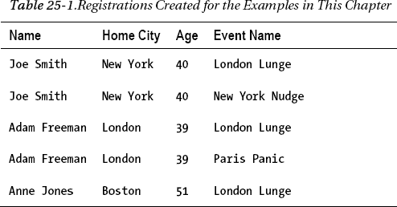

### 了解位置搜索

在我们继续之前，让我们针对新创建的动作方法。启动应用程序(在 Visual Studio 中选择 DebugStart Debug 或 DebugStart Without Debug)并导航到`/Registration/List`。你会看到类似于图 25-1 中[所示的错误信息。](#fig_25_1)

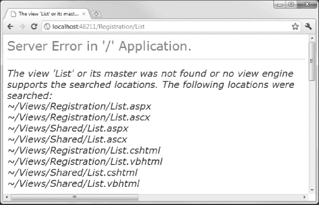

***图 25-1。**搜索视图*

MVC 框架报告了一个错误，因为它找不到与`List`动作方法相关联的默认视图。这并不奇怪，因为我们还没有创造它。重要的是*，在这里*MVC 框架在报告错误之前寻找视图。您可以在图中看到位置列表。

当我们在一个动作中返回`View`方法的结果时，我们告诉 MVC 框架我们想要呈现一个视图。如果我们没有指定视图名称，那么框架会假设我们想要使用与 action 方法同名的视图，在我们的例子中是`List`。

MVC 框架在两个位置寻找我们的视图——`Views/*<controllername>*`文件夹和`Views/Shared`文件夹。在用于查找视图的路径中包含控制器的名称允许我们使用有意义的视图名称，而不必担心与来自其他控制器的视图冲突。如果我们想在多个控制器中重用一个视图，那么我们可以把它放在`Views/Shared`文件夹中。

还要注意，MVC 框架在每个位置寻找四个不同的文件扩展名:`.aspx`、`.ascx`、`.cshtml`和`.vbhtml`。这些扩展指定应该使用哪个视图引擎来呈现视图。ASPX 引擎用于处理`.aspx`和`.ascx`文件。这些视图使用传统的`<%`和`%>`标签进行标记。我们对`.cshtml`扩展感兴趣，这是一个 Razor 视图，其中的标记是 C#(与`.vbhtml`相反，后者是 Razor 和 Visual Basic)。我们可以在一个项目中混合和匹配使用不同视图引擎的视图，尽管在本书中我将只使用`.cshtml`视图。

 **注意**使用 ASPX 视图引擎的视图是*而不是* Web 表单页面。它们是使用`<%`和`%>`标签的 MVC 视图。ASPX 视图和 Razor 视图的区别在于标记的格式。举个简单的例子，用传统标签(`<%: Html.DisplayFor(e => e.Name) %>`)调用 HTML 助手类似于用 Razor ( `@Html.DisplayFor(e => e.Name)`)执行同样的任务。

### 创建视图

现在我们已经准备好开始创建视图了。我们可以用几种方法创建视图。首先是展开`Views`文件夹，右键单击与我们的控制器相关的文件夹，并从弹出菜单中选择 Add 视图。第二种，通常也是更方便的方法是在控制器类中的 action 方法的任何地方右击，并从弹出菜单中选择 Add View 这更方便，因为 Visual Studio 会计算出视图应该在哪里，并为视图设置名称以匹配操作方法。

选择这些技术之一为`RegistrationController`类中的`List`方法创建一个新视图。在[图 25-2](#fig_25_2) 中可以看到添加视图对话框。

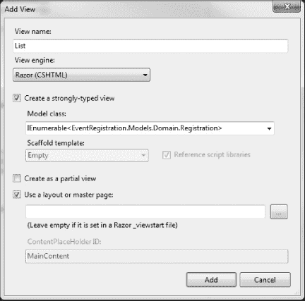

***图 25-2。**添加视图对话框*

确保视图名称为 List，选择的视图引擎为 Razor (CSHTML)。选择“创建强类型视图”选项，并将模型类设置为`IEnumerable<EventRegistration.Models.Domain.Registration>`。您必须手动输入，因为它不会出现在下拉列表中。

 **注意**模型类类型与动作方法传递给`View`方法的对象类型相匹配是很重要的。如果它们不匹配，您将会遇到问题。

选择“使用布局或母版页”选项(我将在后面解释)并单击“添加”按钮来创建视图。清单 25-2 展示了 Visual Studio 创建的`List.cshtml`视图的内容。

***清单 25-2。**list . cshtml 查看*

`@model IEnumerable<EventRegistration.Models.Domain.Registration>

@{
    ViewBag.Title = "List";
}

<h2>List</h2>`

这个视图没有太多内容，但即使如此，它还是包含了一些重要的特性。我将在接下来的部分解释它们是什么，然后演示一些附加的 Razor 和 view 特性。

### 了解剃须刀

在接下来的部分中，我将向您展示不同类型的 Razor 标记，同时，我们将向视图添加一些新功能。当您阅读这些部分时，请记住视图在 MVC 模型中的位置。MVC 框架已经向*控制器*中的*动作方法*传递了一个请求，控制器已经对*模型*做了它需要做的任何事情，并且已经调用了`View`方法来告诉 MVC 框架渲染一个视图。该视图将用于生成一个 HTML 页面，该页面将返回给用户的浏览器。

为了保持关注点的分离，我们希望专注于创建一个呈现我们需要的 HTML 的模板。我们不想做任何繁重的计算(那是控制器的工作)，也不想持有或表示任何域状态(那是模型的工作)。

#### 使用模型对象

我们在创建`List.cshtml`视图时选择了强类型视图选项，这意味着我们已经声明了控制器将传递给视图的视图模型对象的类型。这是我们示例中的`Registration`对象的枚举。我们使用 Razor `@model`标签(小写`m`)来定义这种类型，如下所示:

`@model IEnumerable<EventRegistration.Models.Domain.Registration>`

注意，我们必须指定`Registration`类的完全限定名，包括名称空间。这是因为 MVC 框架对我们的示例项目没有任何特殊的了解。以这种方式引用我们的模型类可能很乏味，但是我们可以通过编辑`~/Views/Web.config`文件告诉 Razor 在额外的名称空间中寻找类。这是*其他* `Web.config`文件，不是应用程序的主文件。这个`Web.config`文件配置 Razor，我们可以通过向`namespaces`元素添加项目来扩展它寻找类的位置集，如[清单 25-3](#list_25_3) 所示。

***清单 25-3。**向~/Views/Web.config 文件添加名称空间*

`<configuration>
  ...
  <system.web.webPages.razor>
    <host factoryType="System.Web.Mvc.MvcWebRazorHostFactory, System.Web.Mvc,
 Version=3.0.0.0, Culture=neutral, PublicKeyToken=31BF3856AD364E35" />
    <pages pageBaseType="System.Web.Mvc.WebViewPage">
      <namespaces>
        <add namespace="System.Web.Mvc" />
        <add namespace="System.Web.Mvc.Ajax" />
        <add namespace="System.Web.Mvc.Html" />
        <add namespace="System.Web.Routing" />
        **<add namespace="EventRegistration.Models.Domain"/>**
      </namespaces>
    </pages>
  </system.web.webPages.razor>
...
</configuration>`

这允许我们从`@model`指令中省略名称空间，如[清单 25-4](#list_25_4) 所示。

***清单 25-4。**从@model 指令中省略名称空间*

`@model IEnumerable<**Registration**>

@{
    ViewBag.Title = "List";
}

<h2>List</h2>`

我们可以使用`@Model`标签(大写字母`M`)引用模型对象，并像在 C#类中一样访问字段、属性和方法。[清单 25-5](#list_25_5) 包含一个简单的例子，它调用视图模型上的`Count`方法来报告集合中有多少项。

***清单 25-5。**使用@模型标签*

`@model IEnumerable<Registration>

@{
    ViewBag.Title = "List";
}

<h4>There are **@Model.Count()** registrations</h4>`

如果我们启动应用程序并导航到`/Registration/List`，我们可以看到这个标签的效果，如图[图 25-3](#fig_25_3) 所示。

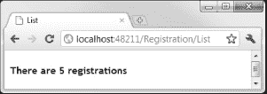

***图 25-3。**使用模型对象的效果*

这是一个非常简单的例子，但是您可以看到在视图中使用 Razor 标签类似于在 Web 表单中使用`<%`和`%>`标签。我们可以将标签与静态 HTML、CSS 和其他 web 元素混合在一起。当视图被呈现时，这些标签被检测和评估，输出被包含在发送给客户机的 HTML 中。我将向您展示使用模型对象的不同(和更复杂的)方法，同时我们将很快看到不同种类的 Razor 标记。

**改变视图模型类型**

MVC 框架中很少有幕后魔术。例如，选择创建强类型视图的选项的唯一效果是将`@model`指令添加到视图文件中。没有配置文件记录视图是如何创建的，或者视图模型是什么类型。这意味着我们可以通过更改`@model`指令来轻松地更改视图模型的类型——或者如果我们不小心忘记检查强类型选项，我们可以通过添加`@model`指令来创建一个强类型视图。

MVC 视图被编译成类，就像我在《T2》第四章中描述的 ASPX 页面一样，尽管这些文件更难阅读。`@model`指令的作用是改变基类的泛型类型参数，但真正的好处是 Visual Studio 可以在我们编辑视图时使用 IntelliSense 来帮助我们选择模型对象的成员。[图 25-4](#fig_25_4) 显示了当我在视图中输入`@Model`后点击句点键时发生的事情。

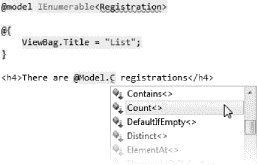

***图 25-4。**编辑强类型视图时的智能感知支持*

##### 使用动态类型视图

使用`@model`指令并不意味着我们*必须在每次渲染视图时*将视图模型从控制器传递给视图。这仅仅意味着当我们传递一个视图模型时，它将是我们指定的类型。

如果我们省略了`@model`指令，我们创建了一个*动态类型的*视图，也被称为*弱类型的*。这些视图被称为*动态*，因为省略`@model`指令相当于使用这样的指令:

`@model dynamic`

使用动态类型的视图并不意味着我们不能将视图模型对象从控制器传递到视图。这只是意味着我们还没有声明视图模型类型，所以 MVC 框架会把我们的视图模型当作一个动态对象。清单 25-6 显示了我们的`List.cshtml`视图的动态版本。

***清单 25-6。**一个动态视图*

`@{
    ViewBag.Title = "List";
}

<h4>There are @Model.Count() registrations</h4>`

如果我们试图呈现这个视图，我们会得到一个错误，告诉我们类型`System.Data.Entity.DbSet<EventRegistration.Models.Domain.Registration>`不包含`Count`的定义。这是因为当我们将`Count`方法应用于枚举时，我们正在调用一个在`System.Linq.Enumerable`类中定义的扩展方法，而 Razor 不能在扩展方法和视图模型之间建立关联。我们可以用几种方法解决这个问题，但最简单的是直接调用扩展方法，如[清单 25-7](#list_25_7) 所示。

***清单 25-7。**在动态类型视图中直接调用扩展方法*

`@{
    ViewBag.Title = "List";
}

<h4>There are **@Enumerable.Count(Model)** registrations</h4>`

另一种选择是利用动态支持从控制器发送一个视图数据对象，该对象已经包含了我们需要的所有值。[清单 25-8](#list_25_8) 展示了在`RegistrationController`类的`List`动作方法中这样做的一个例子。

***清单 25-8。**使用动态对象作为视图模型对象*

`public ActionResult List() {

    dynamic dobj = new ExpandoObject();
    dobj.Data = repository.Registrations;
    dobj.ItemCount = repository.Registrations.Count();
    return View(dobj);
}`

然后我们可以在视图中访问这些动态定义的属性，如清单 25-9 所示。

***清单 25-9。**从动态视图模型对象中访问属性*

`@{
    ViewBag.Title = "List";
}

<h4>There are **@Model.ItemCount** registrations</h4>`

在强类型和动态类型之间的选择是个人偏好的问题。我们失去了对动态类型视图的智能感知支持，但是我们创建了一个更符合其他动态 web 开发语言的环境，比如 Ruby 甚至 JavaScript。我们还可以使用单个动态视图来处理不同种类的视图模型类型——尽管这需要小心确保我们不会调用不存在的成员。我更喜欢强类型视图，可能是因为我通常喜欢强类型编程语言。

#### 插入其他值

我们可以用 Razor `@`标签向视图中插入任何值，而不是视图模型中的属性和字段。在模型对象之后，最常用的数据来自于`ViewBag`，我们在[第 23 章](23.html#ch23)中简单遇到过。在控制器和视图中，`ViewBag`属性返回一个动态对象，控制器可以用它向视图传递辅助数据。清单 25-10 给出了一个使用`ViewBag`将当前时间传递给视图的例子。

***清单 25-10。**通过 ViewBag 向视图传递数据*

`public ActionResult List() {

    **ViewBag.Time = DateTime.Now;**
    return View(repository.Registrations);
}`

然后我们可以在视图中访问这些数据，如清单 25-11 所示。

 **注意**还有一种从控制器向视图传递数据的方式，就是使用会话状态。我会在第 28 章中告诉你怎么做。

***清单 25-11。**从取景袋中读取数据*

`@model IEnumerable<Registration>

@{
    ViewBag.Title = "List";
}` `<h4>There are @Model.Count() registrations</h4>

<h6>This page was rendered at: **@ViewBag.Time** </h6>`

 **注意**我们的视图为`ViewBag.Title`属性设置了一个值，这似乎与我所说的信息如何从控制器流向视图相矛盾。事实上，这是用相当于母版页的剃刀做的一个巧妙的技巧，叫做*布局*。我将在本章后面解释布局是如何工作的。

我们也可以调用方法。当我们直接调用扩展方法时，您已经看到了这一点，但是我们可以使用`@`标签调用任何静态方法。作为一个例子，[清单 25-12](#list_25_12) 展示了使用复合格式特性来呈现从`DateTime`对象到使用`ViewBag`传递给视图的时间。

***清单 25-12。**调用视图中的静态方法*

`@model IEnumerable<Registration>

@{
    ViewBag.Title = "List";
}

<h4>There are @Model.Count() registrations</h4>

<h6>This page was rendered at: **@string.Format("{0:t}", ViewBag.Time)** </h6>`

Razor 中没有终结符标签。我们从`@`开始，Razor 计算出我们的指令何时结束。当使用类似本节中的标签时，Razor 假设字段或属性的值(或者方法的结果)应该插入到 HTML 响应中。这意味着我们不能调用返回`void`的方法，但是我将很快向您展示一种不同的技术。

#### 使用 Razor 条件标签

Razor 支持一组 C#关键字，我们可以在视图中包含这些关键字来创建简单的逻辑。清单 25-13 提供了一个演示。

***清单 25-13。**刮胡刀如果标记*

`@model IEnumerable<Registration>

@{
    ViewBag.Title = "List";
}` `**@if (Model.Count() == 0) {**
    **<h4>There are no registrations</h4>**
**} else if (Model.Count() == 1) {**
    **<h4> There is one registration</h4>**
**} else {**
    **<h4>There are @Model.Count() registrations</h4>**
**}**

<h6>This page was rendered at: @string.Format("{0:t}", ViewBag.Time) </h6>`

清单显示了一个`@if`语句，它大体上类似于常规的 C# `if`语句。有几点需要注意。首先，我们不需要使用`@`符号来访问条件中的数据值，因此我们编写以下代码:

`} else if (Model.Count() == 1) {`

而不是下面的:

`} else if (@Model.Count() == 1) {`

第二个关键点是理解 Razor 在匹配一个条件时如何处理块的内容。Razor 依次处理每一行。如果一行以`<`字符开始，Razor 将其解释为应该写入输出的 HTML 块。如果这一行包含 Razor `@`标签，那么就对它们进行评估，它们的结果像往常一样被插入 HTML。

如果这一行不是以 HTML 标签开始，那么 Razor 认为它正在处理一个 C#语句，并试图执行这个语句。这允许我们在单个块中混合和匹配代码和 HTML，如清单 25-14 所示。

***清单 25-14。**在 Razor @if 语句中混合 HTML 和 C#语句*

`@model IEnumerable<Registration>

@{
    ViewBag.Title = "List";
}

@if (Model.Count() == 0) {
    <h4>There are no registrations</h4>
} else if (Model.Count() == 1) {
    <h4> There is one registration</h4>
} else {
    **<h4>There are @Model.Count() registrations</h4>**
    **DateTime nextMonth = DateTime.Now.AddMonths(1);**
    **string nextMonthName = string.Format("{0:MMMM}", nextMonth);**
    **Next month will be: @nextMonthName**
}

<h6>This page was rendered at: @string.Format("{0:t}", ViewBag.Time) </h6>`

在这个清单中，我添加了几个 C#语句来创建和操作一个`DateTime`对象和一行包含 Razor `@`标签的 HTML 来显示结果。你可以在[图 25-5](#fig_25_5) 中看到这是如何渲染的。

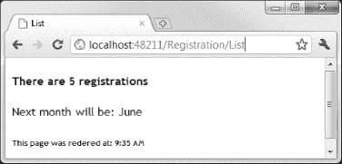

***图 25-5。**呈现 HTML、Razor 标签和 C#代码的混合*

当一行不是以 HTML 标签开始并且不是 C#语句时，我们需要给 Razor 一个提示，这样做的一个方法是给该行加上前缀`@:`标签，如[清单 25-15](#list_25_15) 所示。

***清单 25-15。**使用@:标签表示文本内容*

`@model IEnumerable<Registration>

@{
    ViewBag.Title = "List";
}

**<h4>**
**@switch (Model.Count()) {**
    **case 0:**
        **@:There are no registrations**
        **break;**
    **case 1:**
        **@:There is one registration**
        **break;**
    **default:**
        **@:There are @Model.Count() registrations**
        **break;**
**}**
</h4>

<h6>This page was rendered at: @string.Format("{0:t}", ViewBag.Time) </h6>`

我在这个清单中使用了一个`@switch`标签，这是 Razor 支持的另一个条件语句。我把`h4` HTML 标签放在了`@switch`语句的外面，我用它在开始和结束标签之间插入文本。因为每一行都不是以 HTML 标签开始，也不是 C#语句，所以我在它们前面加上了特殊的`@:`标签。当 Razor 遇到这个标签时，它会处理该行中的任何其他`@`标签，对它们进行评估，并将结果写入 HTML 响应。

如果我们有多行要处理，用`@:`作为行的前缀会很乏味。在这种情况下，我们可以将这些行包含在一个`text`元素中，如[清单 25-16](#list_25_16) 所示。

***清单 25-16。**使用文本元素作为剃刀的提示*

`@model IEnumerable<EventRegistration.Models.Domain.Registration>

@{
    ViewBag.Title = "List";
}

<h4>
@switch (Model.Count()) {
    case 0:
        @:There are no registrations
        break;
    case 1:
        @:There is one registration
        break;
    default:
        **<text>**
            **There are @Model.Count() registrations.**
            **The first of them is for @Model.First().Name at**
            **the @Model.First().Competition.Name event.**
        **</text>**
        break;
}
</h4>

<h6>This page was rendered at: @string.Format("{0:t}", ViewBag.Time) </h6>`

`text`元素不会向呈现的 HTML 添加任何东西；这只是 Razor 处理内容的一个指令，就好像每个元素都以`@:`标签为前缀一样。

##### 在剃刀视图中迭代

除了`@if`和`@switch`，Razor 还支持两个迭代标签，让我们重复执行一个活动。我们要看的第一个是`@foreach`，在[清单 25-17](#list_25_17) 中演示过。

***清单 25-17。**使用@foreach 标签*

`@model IEnumerable<EventRegistration.Models.Domain.Registration>

@{
    ViewBag.Title = "List";
}

<h4>
@switch (Model.Count()) {
    case 0:
        @:There are no registrations
        break;` `    case 1:
        @:There is one registration
        break;
    default:
        @:There are @Model.Count() registrations.
        break;
}
</h4>

**<table>**
    **<tr><th>Name</th><th>Age</th><th>Home City</th><th>Event</th></tr>**
    **@foreach (var item in Model) {**
        **<tr>**
            **<td>@item.Name</td>**
            **<td>@item.Age</td>**
            **<td>@item.HomeCity</td>**
            **<td>@item.Competition.Name</td>**
        **</tr>**
    **}**
**</table>**

<h6>This page was rendered at: @string.Format("{0:t}", ViewBag.Time) </h6>`

在这个清单中，我定义了一个`table`元素，并使用`@foreach`标签遍历视图模型中的`Registration`对象序列，并为每个对象生成一个`tr`元素。与`@if`和`@switch`标签一样，Razor 假设以 HTML 标签开头的行应该被添加到呈现的输出中，其他行是要执行的 C#语句。

###### 修复延迟加载迭代问题

如果您启动应用程序并导航到`/Registration/List` URL，您会发现清单中显示的视图不会呈现。相反，你会看到一条错误信息，如图 25-6 中的[所示。](#fig_25_6)

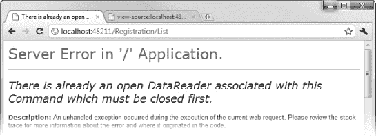

***图 25-6。**迭代模型项目时显示的错误信息*

该错误消息不是特别具有描述性，但这个问题是由实体框架在检索数据时进行的优化引起的，与惰性加载和 LINQ 的操作方式相冲突。需要一点解释来理解这些元素之间的相互作用。

我们需要知道的第一件事是，我们正在使用实体 LINQ 从存储库中检索数据。当我们将`Registrations`属性的值从存储库实现传递给视图时，我们没有传递数据项。我们正在传递一个查询，在我们开始访问结果之前，不会对数据库进行评估和执行(这被称为*延迟执行*，是一个关键的 LINQ 概念)。这意味着我们的数据库查询直到视图中的`@foreach`循环的第一次迭代才被执行。

我们需要知道的第二件事是，实体框架试图通过在每个连接上一次只允许一个查询来优化它与数据库的连接。在允许进行另一个查询之前，必须从数据库中完全读取一个查询的结果。

我们需要知道的第三件事是，在我们试图读取属性的值之前，不会执行对一个延迟加载的导航属性的数据库查询。

把这三件事放在一起，我们可以看到正在发生什么。`@foreach`标签从`IEnumerable`序列中取出第一个`Registration`对象。这将触发数据库查询，并准备好从连接中读取结果。我们开始将第一个对象的值插入到 HTML 中，一切都很顺利，直到我们访问了`Competition`属性，这导致了对数据库的*第二次*查询。但是，正如我们所知，实体框架的设置使得一次只能有一个查询是活动的。这是一个问题，因为我们只读取了原始查询的第一个结果，而所有其他数据仍然存在，阻塞了连接。结果，我们得到了图中所示的错误，并且我们的视图没有呈现。

我们可以用几种不同的方法来解决这个问题。第一个是强制评估 LINQ 查询。这将从数据库中读取所有结果，并为导航属性请求释放连接。我们可以通过调用模型对象上的`ToArray`方法来实现，如清单 25-18 中的[所示。](#list_25_18)

***清单 25-18。**强制执行 LINQ 查询*

`...
<table>
    <tr><th>Name</th><th>Age</th><th>Home City</th><th>Event</th></tr>
    @foreach (var item in Model**.ToArray()**) {
        <tr>
            <td>@item.Name</td>
            <td>@item.Age</td>
            <td>@item.HomeCity</td>
            <td>@item.Competition.Name</td>
        </tr>
    }
</table>
...`

或者，我们可以通过改变数据库连接字符串来禁用实体框架优化，如清单 25-19 所示。

***清单 25-19。**启用并发结果集*

`...
<add name="EFRepository" connectionString="Data Source=TITAN\SQLEXPRESS;Initial
Catalog=Competitions;Persist Security Info=True;User ID=adam;Password=adam;
**MultipleActiveResultSets=true"**
...`

在图 25-7 的[中，你可以看到`table`元素是如何被渲染的。我更喜欢修改连接字符串，但这只是因为这意味着我不必记得对每个受影响的 LINQ 查询进行强制评估。](#fig_25_7)

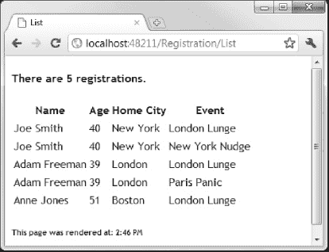

***图 25-7。**浏览器中显示的渲染表格元素*

**用难看的 LINQ 查询减少数据库负载**

我刚刚展示给你的两个修复都不是完美的。我们知道我们将访问数据库中每个`Registration`对象的`Competition`属性，这似乎是浪费。在第 24 章中，我向你展示了我们如何使用`Include`方法来急切地加载导航属性，但是这也是有问题的。`Include`方法是由一个实体框架类实现的，如果我们通过存储库接口公开该方法，我们就开始泄露存储库是如何实现的细节(如果我们不再将实体框架作为持久存储，这将使事情变得困难)。一个可行但丑陋的替代方法是在 action 方法中执行两阶段 LINQ 查询，这将导致实体框架一起加载所有的`Registration`和`Competition`对象，如下所示:

`public ActionResult List() {

    ViewBag.Time = DateTime.Now;

    **var results = repository.Registrations**
        **.Join(repository.Competitions, reg => reg.CompetitionID, comp => comp.ID,**
        **(reg, comp) => new { Reg = reg, Comp = comp })**
        .ToArray()
        .Select(e => {
            e.Reg.Competition = e.Comp;
            return e.Reg;
        });

    return View(results);
}`

查询的第一部分以粗体显示；它执行一个连接操作，使实体框架使用一个 SQL `JOIN`在一个查询中从`Registrations`和`Competitions`表中获取所有数据。实体的 LINQ 对于作为连接的结果可以创建什么类型的对象非常挑剔，所以我将结果投射到一个匿名类型的对象中，该对象具有`Registration`对象和关联的`Competition`的属性。

查询的第二部分如下:

`.ToArray()
.Select(e => {
    e.Reg.Competition = e.Comp;
    return e.Reg;
});`

对`ToArray`方法的调用强制对实体查询的 LINQ 求值，并确保对数据执行的任何进一步的查询操作都将使用对对象的 LINQ 来完成，这在创建对象时更加灵活。`Select`子句设置`Registration`对象的`Competition`属性。最终结果是一个`IEnumerable<Registration>`，其中每个`Registration`对象的`Competition`属性被正确填充。

如果这看起来像一个丑陋的混乱…嗯，它是。并且它隐含地将我们的存储库实现的知识泄漏到我们的控制器类中。毕竟，如果我们不知道实体框架如何处理连接请求，我们就不会使用这种查询(如果我们不知道 LINQ 对实体创建新对象的限制，我们就不需要两部分组成的 LINQ 查询)。如果我们改变了存储库的实现，我们可能必须以某种方式改变这个查询。

我已经向您展示了这种方法，因为它是有用的，即使它稍微侵蚀了关注点的分离。我经常看到程序员纠结于试图在保持 MVC 模式完整性的同时保持性能，但是有时候你必须做出妥协。在这种情况下，我们要么接受大量对数据库的请求，要么模糊关注点分离的边界。最合适的方法取决于每个项目的细节。

###### 使用@作为标签

另一个迭代标签是`@for`；它遵循与`@foreach`相同的模式，工作方式与 C#相似。[清单 25-20](#list_25_20) 显示了用于为`table`元素构建行的`@for`标签。

***清单 25-20。**使用@for 标签*

`...
<table>
    <tr>**<th>Index</th>**<th>Name</th><th>Age</th><th>Home City</th><th>Event</th></tr>

    **@for (int i = 0; i < Model.Count(); i++) {**
        **Registration item = Model.Skip(i).First();**
        **<tr>**
            **<td>@(i + 1)</td>**
            **<td>@item.Name</td>**
            **<td>@item.Age</td>**
            **<td>@item.HomeCity</td>**
            **<td>@item.Competition.Name</td>**
        **</tr>**
    **}**
</table>
...`

这是一个低效的例子，因为我使用 LINQ `Skip`扩展方法来扫描循环的每一次迭代的`Registration`对象的枚举，但是它显示了`@for`标签是如何工作的，而不需要对示例项目进行任何其他更改。你可以在图 25-8 的[中看到索引的效果。](#fig_25_8)

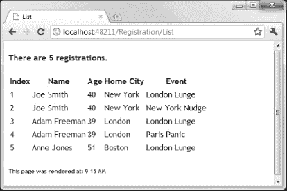

***图 25-8。**向表中添加一个索引列*

注意我是如何使用括号中的常规 C#语句显示当前项目的索引的，就像这样:

`<td>@(i + 1)</td>`

Razor 以 C#语句的形式计算参数中的所有内容，生成我们在图中看到的索引号。如果我这样做了:

`<td>@i + 1</td>`

然后 Razor 只会把表达式解释为`@i`，我们会看到图 25-9 中的结果。

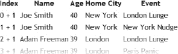

***图 25-9。**将 C#表达式的一部分留在括号外*

### 定义一个代码块

我们可以通过使用*代码块*来改进`@for`的例子。清单 25-21 提供了一个演示。

***清单 25-21。**使用剃刀码块*

`...
<table>
    <tr><th>Index</th><th>Name</th><th>Age</th><th>Home City</th><th>Event</th></tr>

    **@{**
        **Registration[] regArray = Model.ToArray();**
        **int itemCount = regArray.Length;**
    **}**

    @for (int i = 0; i < itemCount; i++) {
        <tr>
            <td>@(i + 1)</td>
            <td>@regArray[i].Name</td>
            <td>@regArray[i].Age</td>
            <td>@regArray[i].HomeCity</td>
            <td>@regArray[i].Competition.Name</td>
        </tr>
    }

</table>
...`

我们用`@{`开始一个代码块，用`}`结束它。Razor 将相同的规则应用于代码块和其他标签。如果该行以一个 HTML 元素或`@:`标签开始，或者包含在一个`text`元素中，则该行被添加到 HTML 响应中。否则，该行被假定为 C#语句。在这个例子中，我用两个 C#语句定义了一个代码块，这两个语句定义了变量，使得遍历模型对象更加容易。注意，一旦我定义了这些变量，它们就可以在后续的 Razor 标签中使用了。

我们可以通过合并代码块和`@for`标签来整理视图，如[清单 25-22](#list_25_22) 所示。

***清单 25-22。**合并代码块和@for 标签*

`...
<table>
    <tr><th>Index</th><th>Name</th><th>Age</th><th>Home City</th><th>Event</th></tr>

    **@{**
        **Registration[] regArray = Model.ToArray();**
        **int itemCount = regArray.Length;**

        **for (int i = 0; i < itemCount; i++) {**
            **<tr>**
                **<td>@(i + 1)</td>**
                **<td>@regArray[i].Name</td>**
                **<td>@regArray[i].Age</td>**
                **<td>@regArray[i].HomeCity</td>**
                **<td>@regArray[i].Competition.Name</td>**
            **</tr>**
        **}**
    **}**

</table>
...`

注意，我已经把`@for`简单地改成了`for`。如果我们希望代码行被解释为 C#语句，我们不需要在它们前面加上`@`符号。

### 创建内嵌 HTML 助手

Razor 支持*内联 HTML 助手*，它允许我们通过将标记和标签放入一个可重用的块中来避免视图中的重复。[清单 25-23](#list_25_23) 显示了一个简单的内联助手。

 **注意**Inline helper 和我们在[第 23 章](23.html#ch23)看到的 HTML helper 方法不一样，比如`@Html.Editor`。我将在第 26 章中更详细地展示 HTML 助手方法。

***清单 25-23。**一个简单的 Razor 内嵌 HTML 助手*

`@model IEnumerable<EventRegistration.Models.Domain.Registration>

@{
    ViewBag.Title = "List";
}

**@helper CreateOrdinal(int index) {**

    **switch (index.ToString().Last()) {**
        **case '1':**
            **@(index + "st");**
            **break;**
        **case '2':**
            **@(index + "nd");**
            **break;**
        **case '3':**
            **@(index + "rd");**
            **break;**
        **default:**
            **@(index + "th");**
            **break;**
    **}**
**}**

<h4>
@switch (Model.Count()) {
    case 0:
        @:There are no registrations
        break;
    case 1:
        @:There is one registration
        break;
    default:
        @:There are @Model.Count() registrations.
        break;
}
</h4>

<table>
    <tr><th>Index</th><th>Name</th><th>Age</th><th>Home City</th><th>Event</th></tr>

    @{
        Registration[] regArray = Model.ToArray();
        int itemCount = regArray.Length;

        for (int i = 0; i < itemCount; i++) {
            <tr>
                <td>@CreateOrdinal(i + 1)</td>
                <td>@regArray[i].Name</td>` `                <td>@regArray[i].Age</td>
                <td>@regArray[i].HomeCity</td>
                <td>@regArray[i].Competition.Name</td>
            </tr>
        }
    }

</table>

<h6>This page was rendered at: @string.Format("{0:t}", ViewBag.Time) </h6>`

我定义的 inline helper 从整数值创建序数字符串(`1`变成`1st` , `2`变成`2nd`，依此类推)。这对于我们的例子来说已经足够了，但是在实际项目中使用起来并不复杂。比如`11`变成了`11st`，不支持本地化格式。您可以看到，我们使用一个`@helper`标签定义了一个内联帮助器，并为该帮助器指定了一个名称和参数，就像我们对常规 C#方法所做的那样:

`@helper CreateOrdinal(int index) {`

请注意，这里没有返回类型。Razor 使用正常的方法评估助手中的每一行。我们只是表达我们想要的 HTML，而不是返回一个值给调用者。在示例助手中，我使用`@`标签让 Razor 评估一个 C#字符串连接语句，并将结果发送到 HTML 响应。我们使用标准的`@`标签调用内联助手，如下所示:

`<td>@CreateOrdinal(i + 1)</td>`

内联助手可以避免简单标记的重复，但是对于复杂的问题，我更喜欢创建一个定制的 HTML 助手方法。我会在第 26 章中告诉你怎么做。

### 使用布局

当我们创建`List.cshtml`视图时，我们检查了使用*布局*的选项。您可以在图 25-10 中的[添加视图对话框中看到该选项。布局相当于你在第 9 章](#fig_25_10)中看到的母版页。它们的用途与母版页相同，但工作方式略有不同。

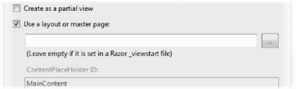

***图 25-10。**创建视图时设置布局选项*

我们检查了使用布局的选项，但是没有指定。如果我们在图中的文本框下面看，我们会看到它说“(如果在 Razor _viewstart 文件中设置了它，则留空)”，如果我们打开`~/Views/_ViewStart.cshtml`文件，我们可以看到我们的项目的默认布局是什么。[清单 25-24](#list_25_24) 显示了`_ViewStart.cshtml`文件的内容。

***清单 25-24。**_ viewstart . cs html 文件*

`@{
    Layout = "~/Views/Shared/_Layout.cshtml";
}`

这个文件包含一个 Razor 代码块，它为`Layout`属性设置一个值。该属性在基类中定义，用于所有 Razor 视图，`System.Web.Mvc.WebViewPage`。在清单中可以看到，`_ViewStart.cshtml`文件将`Layout`属性设置为`~/Views/Shared/_Layout.cshtml`，其内容如[清单 25-25](#list_25_25) 所示。

 **注意**您可能想知道这些文件名称中前导下划线(`_`)的意义。它们是从 WebMatrix 产品继承来的，WebMatrix 产品也使用 Razor，如果请求的文件以下划线开头，就不会向用户提供内容。对 MVC 框架应用程序没有影响。

***清单 25-25。**_ layout . cshtml 文件*

`<!DOCTYPE html>
<html>
<head>
    <title>@ViewBag.Title</title>
    <link href="@Url.Content("~/Content/Site.css")" rel="stylesheet" type="text/css" />
    
</head>

<body>
    @RenderBody()
</body>
</html>`

这是一个简短的文件，但有很多事情正在进行。在接下来的小节中，我将逐一介绍各个方面。

#### 定义标题

我们现在终于可以揭示 Visual Studio 将代码块添加到示例视图中的原因了:

`@{
    ViewBag.Title = "List";
}`

视图中的代码块为`ViewBag`中的`Title`属性设置一个值。请记住，`ViewBag`是动态的，直到那一刻，没有这样的属性。在布局中，`ViewBag.Title`属性用于设置将返回给用户的 HTML 文档的标题:

`<title>**@ViewBag.Title**</title>`

`ViewBag`提供了一个很好的机制，通过它我们可以将数据从视图传递到布局。默认情况下，它用于`title`元素，但是我们可以添加自己的`ViewBag`属性，并在视图中使用它们。

#### 添加内容引用

布局最常见的用途之一是在单个位置添加脚本和样式文件的引用，而不是在每个视图中重复引用。默认布局添加了对 jQuery 和`Content/Site.css`样式表的引用:

`<link href="@Url.Content("~/Content/Site.css")" rel="stylesheet" type="text/css" />
`

注意，为了定义引用，我们必须使用`Url.Content`辅助方法。我将在第 27 章中解释 URL 帮助器的作用。

#### 插入视图内容

布局的最后一部分是对`RenderBody`方法的调用:

`@RenderBody()`

这是基类中定义的另一个方法，它将所有视图插入到响应中，除了命名部分中的那些部分。我将在本章后面解释剃刀部分。

#### 定义不同的布局

如果我们想为一个视图指定一个布局而不是默认的，那么我们可以通过自己设置`Layout`属性来实现。[清单 25-26](#list_25_26) 显示了我在名为`CustomLayout.cshtml`的`~/Views/Shared`文件夹中创建的布局的内容。我通过右键单击项目中的`Views/Shared`文件夹并选择 Add View 来创建这个文件。

***清单 25-26。**一个自定义布局*

`<!DOCTYPE html>

<html>
<head>
    <title>@ViewBag.Title</title>
    
    ****
    ****
</head>
<body>
    

        @RenderBody()
    

</body>
</html>`

我定义了一些新的 CSS 样式，并在这个布局中添加了一个简单的 jQuery 脚本。然后我们可以通过在视图中添加代码块来使用这种布局，如清单 25-27 所示。

***清单 25-27。**在 List.cshtml 视图中使用非默认布局*

`@model IEnumerable<EventRegistration.Models.Domain.Registration>

@{
    ViewBag.Title = "List";
    **Layout = "~/Views/Shared/CustomLayout.cshtml";**
}

@helper CreateOrdinal(int index) {
...`

当我们启动应用程序并导航到`/Registration/List`时，我们可以看到自定义布局的效果，如图[图 25-11](#fig_25_11) 所示。

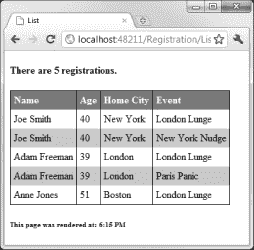

***图 25-11。**自定义布局的效果*

 **提示**我们不一定要使用布局，但是如果我们选择不使用，那么我们就要负责生成 HTML 文档所需的所有元素。如果不想使用布局，只需在视图中将`Layout`属性的值设置为`null`即可。

### 使用局部视图

*局部视图*是我们可以插入到视图中的标记片段。它们比截面更灵活，因为我们可以重复使用局部视图。局部视图通常保存在`Views/Shared`文件夹中。要创建局部视图，右键单击该文件夹并从弹出菜单中选择 Add  View。Visual Studio 将显示添加视图对话框，如图[图 25-12](#fig_25_12) 所示。

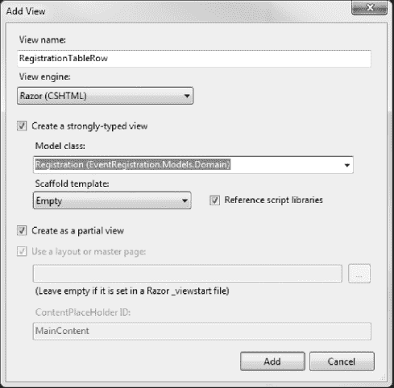

***图 25-12。**创建局部视图*

我将视图命名为 RegistrationTableRow，选中创建强类型视图的选项，并将模型类设置为 Registration。我还选择了“创建为局部视图”选项。单击 Add 按钮创建视图，该视图最初只包含`@model`标记，如下所示:

`@model EventRegistration.Models.Domain.Registration`

我已经添加到视图中，如清单 25-28 所示。

***清单 25-28。**registration tablerow 局部视图*

`@model EventRegistration.Models.Domain.Registration

<tr>
    <td>@Model.Name</td>
    <td>@Model.Age</td>
    <td>@Model.HomeCity</td>
    <td>@Model.Competition.Name</td>
</tr>`

我已经添加了为`Registration`对象生成表格行所需的标记。为了使用这个视图，我们调用`Html.Partial`助手，如[清单 25-29](#list_25_29) 所示。

***清单 25-29。**使用局部视图*

`@model IEnumerable<EventRegistration.Models.Domain.Registration>
@{
    ViewBag.Title = "List";
    Layout = "~/Views/Shared/CustomLayout.cshtml";
}

<h4>
@switch (Model.Count()) {
    case 0:
        @:There are no registrations
        break;
    case 1:
        @:There is one registration
        break;
    default:
        @:There are @Model.Count() registrations.
        break;
}
</h4>

<table>
    <tr><th>Name</th><th>Age</th><th>Home City</th><th>Event</th></tr>` `    @foreach (Registration reg in Model) {
        **@Html.Partial("RegistrationTableRow", reg)**
    }
</table>

<h6>This page was rendered at: @string.Format("{0:t}", ViewBag.Time) </h6>`

`Html.Partial`方法的参数是局部视图的名称，也可以是将成为视图模型的对象。`@foreach`循环的每次迭代都会导致局部方法被呈现并插入到设置到浏览器的整体结果中。分部方法可以在任何视图中使用，因为我们将分部方法放在了`Views/Shared`文件夹中。对于这个例子，这意味着我们可以用一个单一的、标准化的方法在应用程序的任何地方为一个`Registration`对象呈现一个表格行。

 **注意**一个相关的特性是子动作，我在[第 25 章](#ch25)中描述过。它们允许我们从一个视图中调用一个动作方法，与使用局部视图相比，这可以提供额外的灵活性。

### 其他视图特征

在本章的最后，我将向您展示 Razor 视图支持的一些其他特性。这些不遵循任何单一的主题；它们只是一些有用的东西，可以让开发变得更容易。

#### 剃刀片

当我描述`@RenderBody`标签时，我解释了它在布局中用于插入视图的内容，除了那些在命名部分中的部分。[清单 25-30](#list_25_30) 显示了修改后的`List.cshtml`视图，包括了一些部分。

***清单 25-30。**在 Razor 视图中定义部分*

`@model IEnumerable<EventRegistration.Models.Domain.Registration>

@{
    ViewBag.Title = "List";
    Layout = "~/Views/Shared/CustomLayout.cshtml";
}

**@section Header {**

    **<h4>**
    **@switch (Model.Count()) {**
        **case 0:**
            **@:There are no registrations**
            **break;**` `        **case 1:**
            **@:There is one registration**
            **break;**
        **default:**
            **@:There are @Model.Count() registrations.**
            **break;**
    **}**
    **</h4>**
**}**

<table>
    <tr><th>Name</th><th>Age</th><th>Home City</th><th>Event</th></tr>

    @foreach (Registration reg in Model) {
        @Html.Partial("RegistrationTableRow", reg)
    }
</table>

**@section Footer {**
    **<h6>This page was rendered at: @string.Format("{0:t}", ViewBag.Time) </h6>**
}`

我们通过使用`@section`标签并指定一个名称来定义一个部分。我创建了两个部分，一个叫做`Header`，另一个叫做`Footer`。从左括号(`{`)到右括号(`}`)的所有内容都是该节的一部分。然后我们可以渲染布局中的部分，如清单 25-31 所示。

***清单 25-31。**渲染布局中的部分*

`<!DOCTYPE html>

<html>
<head>
    <title>ViewBag.Title</title>
</head>
<body>
    **@RenderSection("Header")**
    

    

        @RenderBody()
    

    

    **@RenderSection("Footer")**
</body>
</html>`

我添加了`hr`元素，这样我们就可以看到添加了哪些部分，如图 25-13 所示。

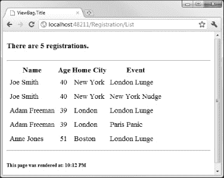

***图 25-13。**渲染布局中的部分*

对节的使用方式有一些限制；布局*必须*呈现视图中定义的每个部分，并且每个部分只能呈现一次。如果你不遵守这些规则，Razor 将抛出一个异常。

#### 剃刀评论

MVC 框架中的视图不需要太多的注释；我的经验是，如果视图的复杂性需要注释，那么我的关注点分离没有得到适当的维护，我将一些数据处理推回到控制器中。

Razor 确实支持注释，但我发现它们在追踪 bug 时对禁用标签最有用。Razor 不会评估注释块中的任何内容，也不会将注释块的内容传递给客户端。一个 Razor 注释块以`@*`开始，以`*@`结束。[清单 25-32](#list_25_32) 显示了应用于`List.cshtml`视图的注释。

***清单 25-32。**用剃须刀屏蔽评论*

`@model IEnumerable<EventRegistration.Models.Domain.Registration>

@{
    ViewBag.Title = "List";
    Layout = "~/Views/Shared/CustomLayout.cshtml";
}

@helper CreateOrdinal(int index) {

    **@* This helper is not production-ready *@**` `    switch (index.ToString().Last()) {
        case '1':
            @(index + "st");
            break;
        case '2':   
            @(index + "nd");
            break;
        case '3':
            @(index + "rd");
            break;
        default:
            @(index + "th");
            break;
    }
}
...`

#### 使用 jQuery 智能感知

Visual Studio 在 Razor 视图中提供了对 IntelliSense 的支持，我们可以将其扩展为包括对 jQuery 的支持。为此，我们需要添加一个对`Script/ jquery-1.5.1-vsdoc.js`文件的引用，如[清单 25-33](#list_25_33) 所示。

***清单 25-33。**在 Razor 视图中增加对 jQuery 智能感知的支持*

`@model IEnumerable<EventRegistration.Models.Domain.Registration>
****
@{
    ViewBag.Title = "List";
    Layout = "~/Views/Shared/CustomLayout.cshtml";
}`

您会注意到,`Scripts`文件夹中的脚本库包含 jQuery 1.51。这次升级是作为您为 MVC 框架应用的 MVC 工具更新的一部分执行的。

这不是一个真实的脚本引用；它只是支持智能感知。不幸的是，我们需要为每个想要使用 IntelliSense for jQuery 的视图添加这个引用。将其应用于布局不会在视图中启用智能感知。

#### 启用编译时检查

我们的 Razor 视图通常直到应用程序被使用时才被编译，但是我们可以改变这一点，使它们和我们常规的 C#类一起被编译。为此，我们必须编辑 Visual Studio 项目文件(文件扩展名为`.csproj`的文件)。用文本编辑器打开文件，您会看到这是一个 XML 文件。找到`MvcBuildViews`元素并将值设置为`true`，如下所示:

`...
<TargetFrameworkVersion>v4.0</TargetFrameworkVersion>
<MvcBuildViews>**true**</MvcBuildViews>
<UseIISExpress>false</UseIISExpress>
...`

现在，当您构建项目时，您的视图将被编译，任何错误都将在错误列表窗口中报告，就像常规类中的错误一样。

### 总结

在本章中，您已经看到了 Razor 是如何工作的，以及 Razor 标签是如何被添加到视图中来生成内容的。Razor 比旧的`<%`和`%>`标签更容易使用，它使 MVC 框架更容易使用——以至于我预计 ASP.NET 版本 5 将在整个平台上采用 Razor，包括 Web 表单。

在下一章中，我将向您展示如何通过使用不同种类的助手来进一步使用视图。