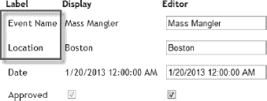

# 二十六、使用 HTML 助手和模板

前一章向您介绍了 Razor，并向您展示了如何在 MVC 框架应用中创建视图来呈现请求的结果。本章将展示如何使用助手将内容注入到视图中。第 23 章已经谈到了 HTML 助手方法，但本章将详细介绍它们，向你展示一些其他种类的助手，并解释模板是如何融入画面的。

 **注意**HTML 助手并不是 MVC 框架中唯一的助手。[第 27 章](27.html#ch27)将向您展示 URL 助手，它们用于在视图中生成 URL，而[第 30 章](30.html#ch30)将解释 Ajax 助手，它们用于执行 Ajax 请求。

### 创建外部助手方法

第 25 章向你展示了如何使用`@helper`标签来创建一个内部助手。这些是避免重复的有效方法，但是它们只能在定义它们的视图中使用，并且如果它们涉及大量代码，它们有接管视图的趋势。

另一种方法是创建一个外部助手，它采用 C# 扩展方法的形式。[清单 26-1](#list_26_1) 显示了一个外部助手的例子，我把它放在了`Infrastructure`项目文件夹中的一个名为`ExternalHelpers`的类中。MVC 框架包含一组内置的 helper 方法，涵盖了大多数常见的需求，但是理解如何构建自己的方法有助于将一切放在上下文中。

 **提示**帮助器方法旨在使 HTML 的生成更简单，但它们不是强制性的。您可以定义想要的 HTML 元素，并使用常规的 Razor `@`标签注入动态值。

***清单 26-1。**创建外部助手方法*

`using System.Web.Mvc;

namespace EventRegistration.Infrastructure {

    public static class ExternalHelpers {

        public static string RegistrationCount(this HtmlHelper html, int i) {
            string result;
            switch (i) {
                case 0:
                    result = "There are no registrations";
                    break;
                case 1:
                    result = "There is one registration";
                    break;
                default:
                    result = string.Format("There are {0} registrations", i);
                    break;
            }
            return result;
        }
    }
}`

助手扩展方法操作的类型是`System.Web.Mvc.HtmlHelper`。这就是为什么 helper 方法的第一个参数是这种类型的，以`this`关键字为前缀。除了这个要求，我们可以在方法中做任何我们想做的事情，以便产生一个可以插入 HTML 的值。在这个例子中，我从我们在前一章创建的`List.cshtml`视图中取出了`@switch`块，并用 C# 复制了它。[清单 26-2](#list_26_2) 展示了我们如何使用这个助手方法。

***清单 26-2。**使用外部辅助方法*

`@model IEnumerable<EventRegistration.Models.Domain.Registration>
**@using EventRegistration.Infrastructure**
@{
    ViewBag.Title = "List";
    Layout = "~/Views/Shared/CustomLayout.cshtml";
}

<h4>**@Html.RegistrationCount(@Model.Count())**</h4>

<table rules="cols">
    <tr><th>Name</th><th>Age</th><th>Home City</th><th>Event</th></tr>` `    @foreach (Registration reg in Model) {
        @Html.Partial("RegistrationTableRow", reg)
    }
</table>

<h6>This page was rendered at: @string.Format("{0:t}", ViewBag.Time) </h6>`

我们必须将包含助手类的名称空间放入视图的上下文中。我们通过使用`@using`标签或者添加到`~/Views/Web.config`文件中定义的名称空间集合来实现，如[第 25 章](25.html#ch25)中所述。一旦完成，我们就可以通过使用`@Html.MyMethodName`调用我们的外部助手方法，并传入与助手定义的参数相匹配的参数，就像这样:

`@Html.RegistrationCount(@Model.Count())`

方法生成的结果被编码并插入到视图呈现的 HTML 中。这里的关键词是*编码*。MVC 框架对它从帮助器方法获得的值进行编码，使它们可以安全显示。有关详细信息，请参见“编码不安全数据”侧栏。

**编码不安全数据**

在向用户呈现数据值时，我们必须非常小心，尤其是我们从*其他*用户那里收集的值。想象一下，一个邪恶的用户注册了一个竞赛，但是他们没有输入他们的名字，而是在输入框中输入了一个`script`元素。让我们把事情简单化，假设它们输入如下:

``

当另一个用户调用列表动作时，`script`元素及其内容将包含在 HTML 中，如下所示:

`<tr>
    <td>****</td>
    <td>39</td>
    <td>London</td>
    <td>London Lunge</td>
</tr>`

浏览器在显示 HTML 并执行脚本时会遇到`script`元素。在这个简单的例子中，弹出了一个对话框，但是这种类型的大多数攻击要复杂得多，并且通常包括对外部脚本库的引用，这些脚本库用于通过向远程服务器发出 Ajax 请求来访问应用的数据和功能。这些被称为*跨站点脚本* (XSS)攻击，因为它们允许来自一个站点的脚本在另一个站点的上下文中执行。

为了帮助避免 XSS 攻击，MVC 框架对从 HTML helper 方法插入的数据值进行编码，以便它们可以安全地显示在浏览器中。这意味着该字符串:

``

将被编码成这样:

`&lt;script&gt;alert(&#39;Hello&#39;);  &lt;/script&gt;`

在它被发送到浏览器之前。该浏览器将字符串显示为常规文本，而不将字符串视为脚本。呈现未编码的内容时要非常小心。即使它现在可能来自受信任的来源，将来对您的应用的更改也会产生 XSS 漏洞。

在前面的例子中，helper 方法返回的内容包含在视图中的一个`h4`元素中。如果我们改变`RegistrationCount`方法的结果:

`return string.Format("**<h4>{0}</h4>**", result);`

然后我们就可以看到编码的效果了，如图[图 26-1](#fig_26_1) 所示。

***图 26-1。**Razor 对包含 HTML 元素的值进行编码的效果*

为了避免这个问题，我们需要返回一个`MvcHtmlString`对象，这表明我们已经注意到确保内容可以安全显示。清单 26-3 展示了我们如何做到这一点。

***清单 26-3。**从外部 HTML 辅助方法返回 MvcHtmlString】*

`using System.Web.Mvc;

namespace EventRegistration.Infrastructure {

    public static class ExternalHelpers {

        public static MvcHtmlString RegistrationCount(this HtmlHelper html, int i) {
            string result;
            switch (i) {
                case 0:
                    result = "There are no registrations";
                    break;
                case 1:
                    result = "There is one registration";
                    break;` `                default:
                    result = string.Format("There are {0} registrations", i);
                    break;
            }
            return new MvcHtmlString(string.Format("<h4>{0}</h4>", html.Encode(result)));
        }
    }
}`

关于这个清单需要注意的要点以粗体显示。我调用`HtmlHelper`对象的`Encode`方法来确保数据值可以安全显示。这可能看起来有点过了，因为我在创建`MvcHtmlString`之前马上以编程方式生成了`result`字段的值，但是当涉及到使数据安全显示时，多疑是值得的。

 **提示**我不能过分强调当方法第一次被创建时，把编码放在适当的位置是多么重要。有一天，如果这是一个真实的项目，另一个程序员会过来修改这个方法，使`result`字段的值基于用户输入。程序员很匆忙，发布日期快到了，没有人花时间来确保更改不会产生脚本漏洞。没有人想向首席执行官解释为什么所有的用户数据都被窃取了，我见过的首席执行官也不会说，“这不是你的错。我给你的团队施加了很大的压力来制作发布窗口。”

### 使用内置助手方法

既然我们已经看到了助手方法是如何工作的，我们可以看看 MVC 框架提供的内置助手。我们在前面的例子中已经遇到了一些这样的助手，但是这是本书中我们可以深入研究它们的部分。

 **注意**内置的帮助器会自动对数据值进行编码，使它们能够安全地显示在浏览器中。

#### 创建表单

最常用的助手方法之一是`Html.BeginForm`，它让我们创建一个 HTML `form`元素。这个助手以一种特殊的方式使用，如[清单 26-4](#list_26_4) 所示。

***清单 26-4。**使用 Html。BeginForm 助手*

`@using (Html.BeginForm()) {
*    ...markup and tags for form go here...*
}`

我们在`@using`语句中使用这个助手。这依赖于一个涉及 C# `IDisposable`接口的巧妙技巧，因此当 Razor 到达`@using`块的末尾时，对`Dispose`方法的调用会生成表单的结束标记。我们将所需的输入和提交元素放在括号内。

`Html.BeginForm`助手有几个重载版本。我在清单中使用的方法将表单发送回导致表单被呈现的控制器和动作方法。因此，举例来说，如果我们生成一个表单来响应对`Registration`控制器的`Index`方法的请求，那么提交表单将会针对相同的方法。我在第 23 章中向你展示了如何创建一个动作方法来处理一个表单帖子。其他重载允许我们针对不同的控制器和动作方法，如清单 26-5 所示。

***清单 26-5。**使用 Html。BeginForm helper 以不同的动作方法为目标*

`@using (Html.BeginForm("**MyAction", "MyController**")) {
*    ...markup and tags for form go here...*
}`

我没有向您展示这个助手故意生成的 HTML。这是因为被呈现的`form`元素指向的 URL 依赖于应用的路由配置，我在第 27 章中描述了这一点。

#### 使用输入助手方法

`Html.BeginForm`助手不在表单内生成任何元素，但是有一些助手方法可以用来做这件事，叫做*输入助手*。这些助手生成不同的元素，我们可以用它们来捕捉用户的输入。再说一次，我们不需要使用这些助手。我们可以直接在视图中定义 HTML，但是它们可以是方便和简洁的。表 26-1 显示了一组输入助手，给出了它们的使用示例，并显示了它们生成的输出。

T4】

注意，复选框助手(`Html.CheckBox`)呈现了*两个* `input`元素。它呈现一个复选框，然后是一个同名的隐藏`input`。这是因为当复选框未被选中时，浏览器不会提交值。拥有隐藏控件可以确保当这种情况发生时，MVC 框架将从隐藏字段中获得一个值。

##### 定义 HTML 属性

这些助手方法的一个共同特征是它们有一个重载，该重载将一个`object`作为参数。我们可以用它来定义将被添加到 HTML 元素中的属性。清单 26-6 显示了一个简单的例子。

***清单 26-6。**为输入元素定义额外的 HTML 属性*

`@Html.TextBox("myTextbox", "val", new {
    @class = "myCSSclass",
    title = "MyTitle"
})`

我已经使用 C# 匿名类型特性创建了一个具有`class`和`title`属性的对象。当呈现`input`元素时，属性被转换成属性，如下所示:

`<input class="myCSSclass" id="myTextbox" name="myTextbox" title="MyTitle"
    type="text" value="val" />`

在这种情况下，C# 和 HTML 之间有点不幸的冲突。HTML 属性`class`与 C# 关键字`class`冲突。为了在匿名类型的对象中指定一个`class`属性，我们必须在属性名前面加上一个`@`字符，就像在`@class`中一样。这就是我们如何告诉 C# 编译器我们正在使用一个成员名的关键字。

##### 插入数据值

在将数据值插入它们所呈现的元素时，输入助手有一个技巧。当然，我们可以使用清单 26-7 中的模型对象。

***清单 26-7。**使用标准的 Razor 语法将数据值插入到输入中*

`@model EventRegistration.Models.Domain.Registration

@Html.TextBox("Name", Model.Name)`

在这个清单中，我定义了一个视图，它的模型对象是一个单独的`Registration`。我已经向`Html.TextBox`助手提供了两个参数。第一个是我希望用于`name`和`ID`属性的值，第二个是用于`value`属性的值，它是模型对象的`Name`属性。当这个视图被渲染时，我们看到 HTML 是这样的:

`<input id="Name" name="Name" type="text" value="Joe Smith" />`

当我们使用带有单个`string`参数的重载版本的助手时，这个技巧就出现了，如清单 26-8 中的[所示。](#list_26_8)

***清单 26-8。**使用单字符串参数帮助器重载*

`@model EventRegistration.Models.Domain.Registration

@Html.TextBox("Name")`

当我们呈现这个视图时，我们得到以下 HTML:

`<input id="Name" name="Name" type="text" value="Joe Smith" />`

我们给了帮助器一个提示，告诉它我们想要什么(`Name`)，它发现模型对象中有一个`name`属性，并以此为基础来呈现`input`元素。这听起来并不聪明，但是助手会在不同的地方寻找一些要显示的数据:

*   `ViewBag.Name`
*   `ViewData["Name"]`
*   `@Model.Name`

助手沿着列表向下工作，直到找到一些数据。在我们的例子中，第三个也是最后一个项目产生了一个匹配。列表中的第二个项目`ViewData`，是一种将数据从控制器传递到视图的机制，已经被`ViewBag`取代。我会在第 28 章中给你展示`ViewData`是如何工作的。

我们可以通过提供更复杂的提示让帮助者更努力地工作，就像这样:

`@Html.TextBox("Competition.Location")`

助手搜索的位置集变得更长:

*   `ViewBag.DataValue.` `Competition.Location`
*   `ViewBag.DataValue["Competition"].Location`
*   `ViewBag.DataValue["Competition.Location"]`
*   `ViewBag.DataValue["Competition"]["Location"]`
*   `ViewData["DataValue.Competition.Location "]`
*   `ViewData["DataValue"].Competition.Location`
*   `ViewData["DataValue.Competition"].Location`

等等。在我的例子中，助手在由`Registration`视图模型对象的`Competition`属性返回的对象的`Location`属性中找到一个匹配。我们得到下面的 HTML:

`<input id="Competition_Location" name="Competition.Location" type="text" value="London" />`

我倾向于不使用这个特性，但是它很有帮助，而且性能开销通常可以忽略不计，因为在`ViewBag`中通常只有几项。

#### 使用强类型输入助手方法

对于[表 26-1](#tab_26_1) 中描述的每个 HTML 帮助器，都有一个对应的*强类型帮助器*。这些帮助器只能在强类型视图中使用，并处理 lambda 表达式。传递给表达式的值是视图模型对象。[表 26-2](#tab_26_2) 描述了强类型助手。

[清单 26-9](#list_26_9) 显示了视图中使用的`Html.TextBoxFor`助手。我已经使用 lambda 表达式从模型对象中选择了`Name`属性。

***清单 26-9。**使用强类型助手*

`@model EventRegistration.Models.Domain.Registration

@Html.TextBoxFor(x => x.Name)`

在使用基本助手和强类型助手之间的选择很大程度上取决于个人偏好。我倾向于使用它们，因为这意味着我不必分别为`name`和`ID`属性提供一个值和一个数据值。强类型帮助器使用属性名来生成 HTML 元素。清单的输出如下所示:

`<input id="Name" name="Name" type="text" value="Joe Smith" />`

在呈现模型绑定过程将使用的值时，使用属性名是很重要的，使用强类型帮助器可以确保这一点。如果您启用了编译时视图检查，那么如果您试图将不适当类型的属性传递给助手，例如将不是`bool`或`bool?`(可为空的`bool`)的属性传递给`Html.CheckBoxFor`助手，编译器将会报告错误。

#### 创建选择元素

用于创建`select`元素的内置助手的工作方式与我们目前看到的不同。表 26-3 显示了一组可用的助手，有基本的和强类型的版本。

`select`助手接受`SelectList`或`MultiSelectList`参数。这些类之间的区别在于,`MultiSelect`列表有构造函数选项，让我们指定在最初呈现页面时应该选择多个项目。这两个类都操作对象的`IEnumerable`序列。在[表 26-3](#tab_26_3) 中，我使用了包含我们想要显示的列表项的数组。

`SelectList`和`MultiSelectList`的一个很好的特性是它们将从列表项的对象中提取值。[清单 26-10](#list_26_10) 提供了一个例子。

***清单 26-10。**使用选择列表选择数据和文本值*

`@model IEnumerable<EventRegistration.Models.Domain.Registration>

@Html.DropDownList("Name", new SelectList(Model, "Age", "Name"))`

这个视图中的模型是对`Registration`对象的枚举，我将它传递给了`SelectList`构造函数，以及我希望用于`value`属性的属性名和选项元素的内部文本(分别是`Age`和`Name`)。这产生的 HTML 如下:

`<select id="Name" name="Name"><option value="40">Joe Smith</option>
    <option value="40">Joe Smith</option>
    <option value="39">Adam Freeman</option>
    <option value="39">Adam Freeman</option>
    <option value="51">Anne Jones</option>
</select>`

### 使用模板化的助手方法

MVC 框架包括一组助手，它们采用不同的方法来呈现数据项的 HTML。我们不是选择我们想要的 HTML 元素，然后使用相应的助手，而是简单地将数据项传递给助手，让它决定应该使用哪个 HTML 元素。这些被称为*模板化的*助手，因为 HTML 元素的选择是由一个简单的模板系统驱动的。[表 26-4](#tab_26_4) 描述了模板化的助手方法。

为了演示模板化视图助手，我在`Models/View`文件夹中创建了一个名为`CompetitionSummary`的视图模型类。在[第 28 章](28.html#ch28)中，我还有更多关于视图模型的内容要说，但简而言之，视图模型是一个简单的类，我们用它将数据从控制器传递到视图。我创建了一个新类，因为我想演示如何使用比我们的模型类型更广泛的属性。清单 26-11 显示了`CompetitionSummary`类。

***清单 26-11。**竞赛总结班*

`using System;

namespace EventRegistration.Models.View {

    public class CompetitionSummary {
        public string Name { get; set; }
        public string City { get; set; }
        public DateTime Date { get; set; }
        public bool Approved { get; set; }
    }
}`

我还创建了一个新的控制器，名为`CompetitionController`，如清单 26-12 中的[所示。这是一个非常简单的控制器，它的`Summary`动作方法创建了一个`CompetitionSummary`对象，并将其用作默认视图的视图模型对象。](#list_26_12)

***清单 26-12。**竞赛总结*

`using System.Web.Mvc;
using EventRegistration.Models.View;

namespace EventRegistration.Controllers {
    public class CompetitionController : Controller {

        public ActionResult Summary() {

            CompetitionSummary summary = new CompetitionSummary {
                Name = "Mass Mangler",
                City = "Boston",
                Date = new System.DateTime(2013, 1, 20),
                Approved = true
            };

            return View(summary);
        }
    }
}`

为了演示助手，我在 Visual Studio 中右键单击 action 方法并选择 Add View 创建了一个视图。我已经调用了视图摘要，并将模型对象设置为 CompetitionSummary。按照我在《T2》第 25 章中描述的模式，Visual Studio 在`Views/Competition`文件夹中创建了视图。我已经创建了一个表格，显示了应用于`CompetitionSummary`类属性的模板化助手，如[清单 26-13](#list_26_13) 所示。

***清单 26-13。**summary . cshtml 视图*

`@model EventRegistration.Models.View.CompetitionSummary

<table >
    <tr><th>Label</th><th>Display</th><th>Editor</th></tr>
    <tr>
        <td>@Html.LabelFor(x => x.Name)</td>
        <td>@Html.DisplayFor(x => x.Name)</td>
        <td>@Html.EditorFor(x => x.Name)</td>
    </tr>
    <tr>
        <td>@Html.LabelFor(x => x.City)</td>
        <td>@Html.DisplayFor(x => x.City)</td>
        <td>@Html.EditorFor(x => x.City)</td>
    </tr>
    <tr>
        <td>@Html.LabelFor(x => x.Date)</td>
        <td>@Html.DisplayFor(x => x.Date)</td>
        <td>@Html.EditorFor(x => x.Date)</td>
    </tr>
    <tr>
        <td>@Html.LabelFor(x => x.Approved)</td>
        <td>@Html.DisplayFor(x => x.Approved)</td>
        <td>@Html.EditorFor(x => x.Approved)</td>
    </tr>
</table>`

我们可以通过启动应用并请求`/Competition/Summary`来呈现这个视图。图 26-2 显示了结果。

***图 26-2。**摘要视图呈现的 HTML】*

通过查看显示的 HTML，您可以看到不同的模板化帮助程序是如何呈现属性的。`LabelFor`助手刚刚使用属性名呈现了一个`label`元素，如下所示:

`<label for="Name">Name</label>`

`DisplayFor`助手刚刚发出了`Name`、`City`和`Date`属性的字符串表示，根本没有任何 HTML 元素。对`bool`属性`Approved`进行了不同的处理，使用了一个禁用复选框。以下是 HTML:

`<input checked="checked" class="check-box" disabled="disabled" type="checkbox" />`

`EditorFor`助手已经渲染了文本框，允许编辑`Name`、`City`和`Date`属性，并将这些文本框的内容设置为当前值。再次使用复选框处理了`bool`属性。正如我前面提到的，需要两个 checkbox 元素来确保向服务器回发一个值。以下是 HTML:

`<input checked="checked" class="check-box" id="Approved" name="Approved" type="checkbox"
    value="true" />
<input name="Approved" type="hidden" value="false" />`

#### 用元数据定制模板化助手

除了已经使用复选框呈现了`bool`属性这一事实之外，模板化的帮助器似乎并没有给人留下深刻的印象。并且，在他们默认的伪装下，他们不是。为了从这些助手方法中获得最佳效果，我们需要使用元数据来描述我们希望如何呈现模型对象。

##### 将元数据用于标签

我们可以做的第一件事是指定一个将由`LabelFor`助手使用的值，而不是属性名。我们通过应用`DisplayName`属性来做到这一点，如[清单 26-14](#list_26_14) 所示。

***清单 26-14。**使用显示名称属性*

`using System;
using System.ComponentModel;

namespace EventRegistration.Models.View {

    public class CompetitionSummary {

        **[DisplayName("Event Name")]**
        public string Name { get; set; }

        **[DisplayName("Location")]**
        public string City { get; set; }

        public DateTime Date { get; set; }
        public bool Approved { get; set; }
    }
}`

在这个清单中，我已经应用了`DisplayName`来定义我想要用于`Name`和`City`属性的值。我们可以在图 26-3 的[中看到它对 HTML 渲染的影响。](#fig_26_3)

***图 26-3。**指定 LabelForHelper 要使用的值*

##### 使用元数据进行格式化

没有元数据，帮助者就没有任何关于我们希望如何处理我们的属性的指导。您可以从`DateTime`属性`Date`的呈现方式中看到这一点。此属性表示一天，但它已被呈现为一天和一个时间。帮助器不能检测属性的隐含意义，所以我们必须使它显式。我们使用额外的`DataType`属性来做这件事，如清单 26-15 中的[所示。](#list_26_15)

***清单 26-15。**应用数据类型属性*

`using System;
using System.ComponentModel;
using System.ComponentModel.DataAnnotations;` `namespace EventRegistration.Models.View {

    public class CompetitionSummary {

        [DisplayName("Event Name")]
        public string Name { get; set; }
        [DisplayName("Location")]
        public string City { get; set; }

        **[DataType(DataType.Date)]**
        **public DateTime Date { get; set; }**

        public bool Approved { get; set; }
    }
}`

`DataType`属性从`DataType`枚举中取一个值作为参数。我选择了`Date`值，它只显示一个`DateTime`值的日期部分，如图[图 26-4](#fig_26_4) 所示。

***图 26-4。**用数据类型属性*格式化日期时间值

`DataType`枚举包含了广泛的格式选项，我已经在[表 26-5](#tab_26_5) 中描述了最有用的值。

注意，应用`DataType`属性只会格式化数据。不进行任何检查来确保该值是适当的类型。

##### 使用元数据选择模板

顾名思义，模板化帮助器使用一组模板来呈现值。到目前为止，我们看到的唯一证据是视图模型对象中的`bool`属性被呈现为复选框，而不仅仅是字符串值`true`或`false`。

模板化的帮助器有许多可用的内置模板，我们可以使用`UIHint`属性指定它们中的哪一个应该用来显示一个属性，如[清单 26-16](#list_26_16) 所示。

***清单 26-16。**使用 UIHint 属性指定模板*

`using System;
using System.ComponentModel;
using System.ComponentModel.DataAnnotations;

namespace EventRegistration.Models.View {

    public class CompetitionSummary {

        [DisplayName("Event Name")]
        public string Name { get; set; }

        [DisplayName("Location")]
        **[UIHint("MultilineText")]**
        public string City { get; set; }

        [DataType(DataType.Date)]
        public DateTime Date { get; set; }

        public bool Approved { get; set; }
    }
}`

我们通过将模板名称作为字符串传递给`UIHint`属性来指定要使用的模板。我已经为清单中的`City`属性选择了`MultilineText`模板。这使得`EditorFor`助手在多行文本框中显示属性，如图 26-5 中[所示。](#fig_26_5)

***图 26-5。**应用多文本模板*

[表 26-6](#tab_26_6) 描述了`UIHint`属性提供访问的内置模板。在使用`UIHint`属性的时候一定要小心，属性的数据类型要适合所选的模板。如果不是，那么当 MVC 框架试图将属性类型转换为模板类型时，就会抛出一个异常。

T4】

##### 使用元数据控制可见性和编辑

在第 24 章的[中，我们向领域模型类添加了`ID`属性，这样我们可以更容易地使用实体框架。为我们的模型获得持久性，这是一个很小的代价，但是那些属性对我们的应用没有任何影响，我们不希望我们的用户看到或者能够编辑`ID`属性值。他们是我们不想暴露的管道。我们可以使用`HiddenInput`属性隐藏属性，如清单 26-17](24.html#ch24) 所示。

***清单 26-17。**使用 HiddenInput 属性隐藏模型属性*

`using System;
using System.ComponentModel;
using System.ComponentModel.DataAnnotations;
using System.Web.Mvc;

namespace EventRegistration.Models.View {

    public class CompetitionSummary {

        [DisplayName("Event Name")]
        public string Name { get; set; }

        [DisplayName("Location")]
        public string City { get; set; }

        [DataType(DataType.Date)]
        public DateTime Date { get; set; }

        **[HiddenInput(DisplayValue=false)]**
        public bool Approved { get; set; }
    }
}`

对于以这种方式注释的属性，`DisplayFor`助手根本不会呈现任何输出。`EditorFor`助手呈现一个隐藏的`input`元素，这意味着我们不必担心在提交表单时为隐藏的属性提供值。下面是清单中的`EditorFor`助手为`Approved`属性呈现的 HTML:

`<input id="Approved" name="Approved" type="hidden" value="True" />`

如果我们想显示该值，但不允许用户编辑它，我们可以将`DisplayValue`属性的值更改为`true`，如下所示:

`...
[HiddenInput(DisplayValue=**true**)]
public bool Approved { get; set; }
...`

在这个配置中，`DisplayFor`助手呈现值，`EditorFor`助手呈现值和隐藏的`input`元素，如下所示:

`True<input id="Approved" name="Approved" type="hidden" value="True" />`

[图 26-6](#fig_26_6) 显示了浏览器显示内容的效果。

***图 26-6。**使用 HiddenInput 值控制编辑*

#### 创建定制模板

我们可以超越内置模板，创建自己的模板。这个过程相当简单，通过定义我们自己的模板，我们可以完全控制数据类型的显示方式。我们可以创建自定义编辑器和显示模板，但是 MVC 框架不支持自定义标签模板。

##### 创建自定义编辑器模板

我们分别创建自定义编辑器和显示模板，尽管过程基本相同。我们将从一个编辑器模板开始，我们使用局部视图创建它(我在前一章中介绍了局部视图)。

首先，我们需要在`Views/Shared`文件夹中创建一个名为`EditorTemplates`的文件夹。这是`EditorFor`助手寻找模板的地方。一旦你创建了新的文件夹，右击它并从弹出菜单中选择添加视图。我们将创建一个名为 City 的局部视图，它的视图模型是一个`string`。[图 26-7](#fig_26_7) 显示了添加视图对话框所需的设置。

***图 26-7。**添加将用作自定义模板的部分模板*

重要的是，局部视图的视图模型类型与我们将要呈现的属性类型相匹配。在这种情况下，这个局部视图将用于呈现`CompetitionSummary`类的`City`属性，它是一个`string`。(模板视图和属性的名称不需要匹配，尽管我通常这样命名模板。清单 26-18 展示了一个非常简单的定制模板。

***清单 26-18。**城市模板/视图*

`@model string

@Html.DropDownListFor(x => x, new SelectList(new[] {"Boston", "New York", "London"}, Model))`

我们像创建任何其他局部视图一样创建模板。在本例中，我使用`Html.DropDownListFor`助手创建了一个下拉菜单。我们可以访问所有的 Razor 标签和助手，如果愿意，我们可以定义静态 HTML。一旦我们创建了模板，我们可以使用`UIHint`属性将它与一个属性相关联，如[清单 26-19](#list_26_19) 所示。

***清单 26-19。**使用 UIHint 属性选择自定义模板*

`using System;
using System.ComponentModel;
using System.ComponentModel.DataAnnotations;
using System.Web.Mvc;

namespace EventRegistration.Models.View {

    public class CompetitionSummary {

        [DisplayName("Event Name")]
        public string Name { get; set; }

        [DisplayName("Location")]
        **[UIHint("City")]**
        public string City { get; set; }

        [DataType(DataType.Date)]
        public DateTime Date { get; set; }

        [HiddenInput(DisplayValue=true)]
        public bool Approved { get; set; }
    }
}`

我使用了强类型的`Html.DropDownListFor`助手，因为当视图被渲染时，它将为`select`元素的`ID`和`name`属性生成正确的值:

`<select id="**City**" name="**City**"><option selected="selected">Boston</option>
    <option>New York</option>
    <option>London</option>
</select>`

我们还可以通过将模板的名称传递给 HTML helper 方法来指定要使用的模板，如下所示:

`@Html.DisplayFor(x => x.City, "**City**")`

 **提示**在呈现的 HTML 元素中反映属性的名称很重要，这样 MVC 框架才能正确处理表单发布。强类型的 HTML 帮助器方法会自动处理这个问题。

我们可以在[图 26-8](#fig_26_8) 中看到模板的效果。

***图 26-8。**自定义编辑模板的效果*

 **提示**如果你不想使用 HTML 助手，你可以通过`ViewData.TemplateInfo`属性获得模板所应用的属性的详细信息。这个属性返回一个包含您需要的信息的`System.Web.Mvc.TemplateInfo`。例如，`GetFullHtmlFieldName`方法返回应该用于您生成的 HTML 元素的`name`属性的值。

##### 创建自定义显示模板

创建显示模板的过程类似于创建编辑器模板的过程。我们再次使用局部视图，但是它们被放在`Views/Shared/DisplayTemplates`文件夹中。[清单 26-20](#list_26_20) 显示了我创建的名为`City.cshtml`的自定义显示视图的内容。注意，为了利用清单 26-19 中显示的[属性，我可以为一个显示和一个编辑器模板使用相同的名称。](#list_26_19)

***清单 26-20。**自定义显示模板*

`@model string

@Model`

该模板以粗体显示模型值。你可以在[图 26-9](#fig_26_9) 中看到这个模板的效果。

***图 26-9。**自定义显示模板的效果*

##### 创建特定类型的模板

如果我们创建一个具有. NET 类型名称的自定义模板，那么模板化帮助程序将使用该模板来呈现它们遇到的任何该类型的属性。为了演示这一点，我扩展了我们的视图模型对象，这样它就有了一个新的属性，如清单 26-21 所示。

***清单 26-21。**扩展视图模型对象*

`using System;
using System.ComponentModel;
using System.ComponentModel.DataAnnotations;
using System.Web.Mvc;

namespace EventRegistration.Models.View {

    **public enum StartTime {**
        **Morning,**
        **Midday,**
        **Evening**
    **}**

    public class CompetitionSummary {

        [DisplayName("Event Name")]
        public string Name { get; set; }

        [DisplayName("Location")]
        [UIHint("City")]
        public string City { get; set; }

        [DataType(DataType.Date)]
        public DateTime Date { get; set; }

        [HiddenInput(DisplayValue=true)]
        public bool Approved { get; set; }

        **public StartTime Start { get; set; }**
    }
}`

`Start`属性具有来自`StartTime`枚举的值。我已经修改了`CompetitionController`类中的`Summary`动作方法，以便在创建样本对象时为该属性定义一个值，如[清单 26-22](#list_26_22) 所示。

***清单 26-22。**在动作方法中为视图模型对象的 Start 属性定义一个值*

`using System.Web.Mvc;
using EventRegistration.Models.View;` `namespace EventRegistration.Controllers {
    public class CompetitionController : Controller {

        public ActionResult Summary() {

            CompetitionSummary summary = new CompetitionSummary {
                Name = "Mass Mangler",
                City = "Boston",
                Date = new System.DateTime(2013, 1, 20),
                Approved = true,
                **Start = StartTime.Evening**
            };

            return View(summary);
        }
    }
}`

我还需要更新视图来呈现这个新属性的 HTML。[清单 26-23](#list_26_23) 显示了有这些变化的`Summary.cshtml`视图。

***清单 26-23。**更新概要视图以反映附加的视图模型属性*

`@model EventRegistration.Models.View.CompetitionSummary

<table >
    <tr><th>Label</th><th>Display</th><th>Editor</th></tr>
    <tr>
        <td>@Html.LabelFor(x => x.Name)</td>
        <td>@Html.DisplayFor(x => x.Name)</td>
        <td>@Html.EditorFor(x => x.Name)</td>
    </tr>
    <tr>
        <td>@Html.LabelFor(x => x.City)</td>
        <td>@Html.DisplayFor(x => x.City)</td>
        <td>@Html.EditorFor(x => x.City)</td>
    </tr>
    <tr>
        <td>@Html.LabelFor(x => x.Date)</td>
        <td>@Html.DisplayFor(x => x.Date)</td>
        <td>@Html.EditorFor(x => x.Date)</td>
    </tr>
    <tr>
        <td>@Html.LabelFor(x => x.Approved)</td>
        <td>@Html.DisplayFor(x => x.Approved)</td>
        <td>@Html.EditorFor(x => x.Approved)</td>
    </tr>` `    **<tr>**
        **<td>@Html.LabelFor(x => x.Start)</td>**
        **<td>@Html.DisplayFor(x => x.Start)</td>**
        **<td>@Html.EditorFor(x => x.Start)</td>**
    **</tr>**
</table>`

我们可以在图 26-10 中看到视图是如何呈现新属性的。

***图 26-10。**新添加的视图模型属性的默认渲染*

现在我们可以添加一个特定于类型的模板。右键单击`Views/Shared/EditorTemplates`文件夹并从弹出菜单中选择添加视图。

 **提示**我们可以通过创建一个同名的自定义模板来替换其中一个内置模板。这是一大步，不可掉以轻心。它将改变该类型的每个属性在应用中的呈现方式。你可以在[表 26-6](#tab_26_6) 中看到内置模板列表和你必须用来替换它们的名称。

创建一个名为`StartTime`的视图，勾选创建局部视图选项，将视图模型类型设置为`StartTime`，如图[图 26-11](#fig_26_11) 所示。

***图 26-11。**创建特定类型模板*

单击 OK 创建新视图，并添加清单 26-24 所示的内容，它作为`StartTime`类型的编辑器模板。

***清单 26-24。**一个特定类型的编辑器模板*

`@model EventRegistration.Models.View.StartTime

@Html.DropDownListFor(x => x, new SelectList(Enum.GetValues(Model.GetType()), Model))`

再次，你可以看到模板非常简单。这就是自定义模板的本质。在这个例子中，我使用`Html.DropDownListFor`助手来呈现一个包含所有`StartTime`枚举值的`select`控件。

要使用这个模板，我们不必用属性来注释我们的模型类。每当遇到一个`StartTime`类型的属性时，模板化的助手将自动使用它。你可以在图 26-12 中看到这个自定义模板的效果。

***图 26-12。**特定类型自定义编辑器模板的效果*

**了解模板搜索顺序**

模板化帮助程序遵循特定的顺序来为属性找到合适的模板:

1.  传递给助手的模板。例如，`Html.EditorFor(m => m.SomeProperty, "MyTemplate")`会导致`MyTemplate`被使用。
2.  由元数据属性指定的任何模板，例如`UIHint`。
3.  与元数据指定的任何数据类型相关联的模板，例如`DataType`属性。
4.  对应于正在处理的数据类型的 the.NET 类名的任何模板。
5.  如果被处理的数据类型是简单类型，那么内置的`String`模板。
6.  对应于该数据类型的基类的任何模板。
7.  如果数据类型实现了`IEnumerable`，那么内置`Collection`模板。
8.  如果所有其他的都失败了，那么`Object`模板。

在模板搜索过程的每个阶段，MVC 框架都会在使用内置模板之前寻找一个名为`EditorTemplates/*<name>*`或`DisplayTemplates/*<name>*`的模板。对于我们的`StartTime`模板，我们满足了搜索过程中的第 4 步。我们创建了一个名为`StartTime.cshtml`的模板，并把它放在`~/Views/Shared/EditorTemplates`文件夹中。

#### 使用全模型模板化的辅助方法

我们还没有遇到三种辅助方法。它们作为单个实体在整个视图模型上操作。表 26-7 描述了助手。

全模型模板化的助手只是一种便利。我们可以直接在整个模型上工作，而不必在每个单独的成员上调用助手。作为一个例子，[清单 26-25](#list_26_25) 显示了更新后的`Summary.cshtml`视图使用了一个整体模型辅助器。

***清单 26-25。**使用整体模型助手*

`@model EventRegistration.Models.View.CompetitionSummary

@Html.EditorForModel()`

只有当我们为视图模型类型定义定制模板时，这些助手才变得有用。内置模板在很大程度上是无用的，正如我们在图 26-13 中看到的。但是，您应该知道我们为单个属性定义的元数据和定制模板已经被正确地应用了。

***图 26-13。**从 Html 中默认输出。编辑器模型助手*

如果我们为`CompetitionSummary`创建一个特定类型的模型，我们可以看到这些助手的价值。[清单 26-26](#list_26_26) 显示了我在`Views/Shared/EditorTemplates`文件夹中创建的一个名为`CompetitionSummary.cshtml`的模板。

***清单 26-26。**一个特定类型的模板*

`@model EventRegistration.Models.View.CompetitionSummary

<table >
    <tr><th>Label</th><th>Editor</th></tr>
    <tr>
        <td>@Html.LabelFor(x => x.Name)</td>
        <td>@Html.EditorFor(x => x.Name)</td>
    </tr>
    <tr>
        <td>@Html.LabelFor(x => x.City)</td>
        <td>@Html.EditorFor(x => x.City)</td>
    </tr>
    <tr>
        <td>@Html.LabelFor(x => x.Date)</td>
        <td>@Html.EditorFor(x => x.Date)</td>
    </tr>
    <tr>
        <td>@Html.LabelFor(x => x.Approved)</td>
        <td>@Html.EditorFor(x => x.Approved)</td>
    </tr>
    <tr>
        <td>@Html.LabelFor(x => x.Start)</td>
        <td>@Html.EditorFor(x => x.Start)</td>
    </tr>
</table>`

我使用了属性级的模板化助手来确保元数据和定制模板被使用。[图 26-14](#fig_26_14) 显示了该模板的效果。

***图 26-14。**EditorForModel 助手使用的模板*

### 总结

本章讲述了我们可以在视图中灵活而简洁地生成 HTML 的助手方法。我们看到了基本助手与强类型助手的区别，如何创建自定义助手方法，以及如何使用和自定义模板化助手。有许多不同类型的助手，但它们很容易掌握，大多数程序员倾向于在大多数情况下选择一种类型。我喜欢使用强类型的助手，但是你可能会以不同的风格结束。