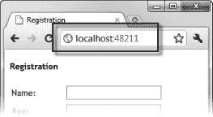
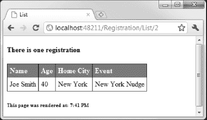
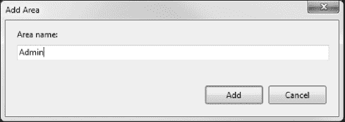
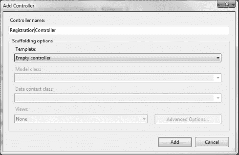
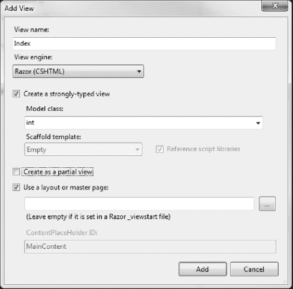
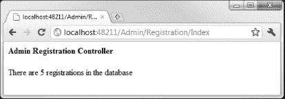
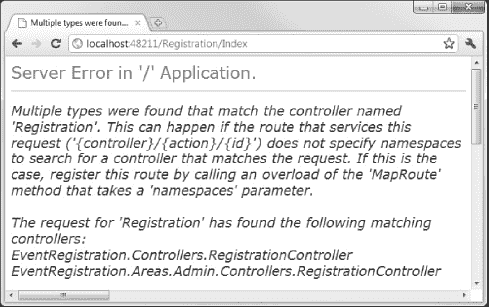

## 27

## 使用路由和区域

第 12 章向你展示了如何使用 ASP.NET 路由系统来创建独立于包含我们标记的页面的 URL。在这种情况下，路由是可选的。我们可以让用户从服务器请求单独的 ASPX 页面，我们的应用程序仍然可以运行。

在 MVC 框架应用程序中，路由不是可选的。它是我们将用户请求的 URL 映射到控制器类中的动作方法的方法。MVC 框架没有可以依靠的页面系统。我们处理用户请求的唯一方法是通过路由系统。在这一章中，我将向你展示 MVC 框架是如何使用路由的，并探索一个叫做 *areas* 的相关特性，它允许我们将一个大的应用程序分解成可管理的块。

 **注意**如果你跳过了前几章开始学习 MVC 框架，你至少需要回头阅读[第 12 章](12.html#ch12)来理解这一章。

### 了解 MVC 框架中的路由

在 MVC 框架应用程序中，路由提供了请求的 URL 和控制器中的动作方法之间的映射。到目前为止，在本书的这一部分中我给出的例子中，我已经告诉你导航到格式为`/<Controller>/<Action>`的 URL。为此，我依赖于 MVC 框架应用程序的默认路由配置。

MVC 框架路径在`Global.asax`文件中定义，但是它们使用的格式与第 12 章中的略有不同。我们将建立在前一章中使用的例子，清单 27-1 显示了来自`EventRegistration`项目的`Global.asax`文件。

***清单 27-1。**web . config 文件*

`using System;
using System.Collections.Generic;
using System.Linq;
using System.Web;
using System.Web.Mvc;`

`using System.Web.Routing;
using EventRegistration.Infrastructure;

namespace EventRegistration {

    public class MvcApplication : System.Web.HttpApplication {

        public static void RegisterGlobalFilters(GlobalFilterCollection filters) {
            filters.Add(new HandleErrorAttribute());
        }

        **public static void RegisterRoutes(RouteCollection routes) {**
            **routes.IgnoreRoute("{resource}.axd/{*pathInfo}");**

            **routes.MapRoute(**
                **"Default",**
                **"{controller}/{action}/{id}",**
                **new { controller = "Home", action = "Index", id = UrlParameter.Optional }**
            **);**
        **}**

        protected void Application_Start() {
            AreaRegistration.RegisterAllAreas();

            DependencyResolver.SetResolver(new CustomDependencyResolver());

            RegisterGlobalFilters(GlobalFilters.Filters);
            **RegisterRoutes(RouteTable.Routes);**
        }
    }
}`

`Application_Start`方法(在[第 5 章](05.html#ch5)中有描述)包含了对`RegisterRoutes`方法的调用，这是我们定义路线的地方。Visual Studio 在新项目中向`RegisterRoutes`方法添加了两条路线。第一个是对路由系统的指令，以忽略对带有`.axd`后缀的文件的请求。这些被称为 *web 资源文件*，包括[第 7 章](07.html#ch7)中描述的跟踪查看器；它们不是 MVC 框架的一部分。

#### 使用 MapRoute 方法

我们在任何 MVC 框架路由中的目标都是获取或提供两个特殊路由变量的值:`controller`和`action`。这些变量的值用于标识请求将被传递到的控制器类和动作方法。

我们使用`MapRoute`方法注册 MVC 框架路由，这与[第 12 章](12.html#ch12)中的`MapPageRoute`方法略有不同，反映了 MVC 框架的不同性质。我们至少提供两个参数:路由的名称和路由匹配的 URL。[清单 27-2](#list_27_2) 显示了一个简单的例子。

***清单 27-2。**创建基本的 MVC 路线*

`public static void RegisterRoutes(RouteCollection routes) {
    routes.IgnoreRoute("{resource}.axd/{*pathInfo}");

    **routes.MapRoute(null, "{controller}/{action}");**
}`

此路由将匹配任何由两部分组成的 URL。URL 的第一部分代表控制器，第二部分代表动作方法的名称。如果我们请求 URL `/Registration/Index`，那么我们将调用`RegistrationController`类中的`Index`方法。(我们不必添加`Controller`来将请求的控制器映射到类名。MVC 框架为我们做了这些。)

Visual Studio 添加到新项目的默认路径更进一步，定义了附加的 URL 段和一些默认值:

`public static void RegisterRoutes(RouteCollection routes) {
    routes.IgnoreRoute("{resource}.axd/{*pathInfo}");

    routes.MapRoute(
        "Default",
        "{controller}/{action}/{id}",
        new { controller = "Home", action = "Index", id = UrlParameter.Optional }
    );  
}`

在[第 12 章](12.html#ch12)中，我们使用`RouteValueDictionary`对象定义了路由变量的默认值，但是当使用`MapRoute`方法定义 MVC 框架路由时，我们使用了匿名类型的对象，其中属性对应于 URL 段的名称，属性值对应于默认值。

在`Default`路线中，`controller`变量的默认值为`Home`，`Index`为`action`。`id`变量是一个*可选变量*，我们通过给`id`参数赋值`UrlParameter.Optional`来表示。可选变量允许路由匹配更大范围的 URL。如果有第三个 URL 段，它将被赋给`id`变量。如果只有两段，那么路线仍然会匹配 URL，但是不会给`id`变量赋值变量。

我们没有一个`HomeController`类，所以让我们改变控制器的默认值以匹配我们*有*的控制器，如[清单 27-3](#list_27_3) 所示。

***清单 27-3。**将请求路由到默认控制器*

`public static void RegisterRoutes(RouteCollection routes) {
    routes.IgnoreRoute("{resource}.axd/{*pathInfo}");

    routes.MapRoute(
        "Default",
        "{controller}/{action}/{id}",
        new { controller = "**Registration**", action = "Index", id = UrlParameter.Optional }
    );  
}`

三个默认值的结果是我们的路由将匹配零、一、二和三部分的 URL，如[表 27-1](#tab_27_1) 所示。

T2】

通过为`controller`和`action`变量提供默认值，我们在应用程序的默认 URL(`/`)和动作方法之间创建了一个映射。这意味着我们的应用程序有了一个相当于登录页面的东西。请求默认 URL 的用户导致`RegistrationController`类的`Index`方法被调用，如图[图 27-1](#fig_27_1) 所示。

***图 27-1。**导航到 MVC 框架应用程序的默认 URL*

`controller`和`action`变量的重要性是 MVC 框架应用的惯例。路由系统本身并不知道我们赋予这些变量的特殊意义。这意味着可以创建没有定义所需变量的路由，而不会收到编译器警告。当这样的路由匹配一个 URL 时，无论 URL 的细节是什么，都会向用户报告一个 HTTP `404 – Not Found`错误。

同样，路由系统不会检查以确保我们提供的默认值对应于存在的控制器和操作方法，因此测试路由以确保默认值解析为有用的值是很重要的。

#### 处理动作方法中的路由参数

我们可以通过定义相同名称的参数，从动作方法中的可选路由参数接收值。[清单 27-4](#list_27_4) 显示了更新后的`RegistrationController`类的`List`方法，以处理默认路由中定义的可选的`id`参数。

 **注意**路由变量可以并入模型绑定过程。模型绑定详见[第 29 章](29.html#ch29)。

***清单 27-4。**在动作方法中处理路由参数*

`public ActionResult List(int? id) {
    ViewBag.Time = DateTime.Now;

    if (id.HasValue) {
        return View(repository.Registrations.OrderBy(x => x.ID)
            .Skip(id.Value - 1).Take(1));
    } else {
        return View(repository.Registrations);
    }
}`

从清单中可以看出，我定义了一个名为`id`的可空的`int`参数。这就是 MVC 框架将路由变量的值传递给动作方法的方式。我使用了可空的`int`,因为我们必须处理用户没有请求包含路由变量值的 URL 的可能性。在这个简单的例子中，如果有可用的值，我使用它作为索引来选择特定的`Registration`记录作为视图模型，如果没有，视图模型就是完整的记录集。

 **注意**我使用了记录的相对位置，而不是`ID`属性的值。这是因为数据库为 ID 列生成唯一的值，当我们删除记录时，这些值可能会变得不连续。

如果用户请求`/Registration/List/2`，则显示序列中的第二条记录，如图 27-2 中的[所示。](#fig_27_2)

***图 27-2。**在动作方法中使用路由变量*

请注意，我设置了 action 方法参数的类型，以适合我的目的。当处理请求时，MVC 框架会尝试将从 URL 中提取的值转换为 action 方法参数的类型。如果转换成功，则通过参数传递该值；如果没有，参数值将为`null`。

 **注意**我们可以在一个动作方法中选择忽略路由变量。如果没有与变量名匹配的参数，MVC 框架将悄悄地丢弃该值。

#### 约束 MVC 框架路线

我们可以通过提供*约束*来限制 MVC 框架应用程序中路由匹配的方式。这些类似于我们在第 12 章的[中使用的约束，但是它们是使用传递给`MapRoute`方法的匿名类型对象来表达的。清单 27-5](12.html#ch12) 显示了一个例子。

***清单 27-5。**为 MVC 框架约束一条路线*

`public static void RegisterRoutes(RouteCollection routes) {
    routes.IgnoreRoute("{resource}.axd/{*pathInfo}");

    routes.MapRoute(
        "Default",
        "{controller}/{action}/{id}",
        new { controller = "Registration", action = "Index", id = UrlParameter.Optional },
        **new { controller = "Registration|Administration" }**
    );
}`

这个额外的参数确保路由只匹配控制器变量值为`Registration`或`Administration`的 URL。在所有其他方面，MVC 框架路径的约束与我在第 12 章的[中展示的相同。](12.html#ch12)

### 生成传出 URL

在 MVC 框架应用程序中，路由比在 Web 表单应用程序中更重要，因为我们与应用程序生成的 HTML 密切相关。为此，我们可以在视图中使用一组 helper 方法来从路由系统生成 URL。在视图中生成外发 URL 的最简单方法是调用`Html.ActionLink`助手。[清单 27-6](#list_27_6) 展示了在`Registration`控制器的`List.cshtml`视图中使用的这个助手。

***清单 27-6。**调用 ActionLink 助手*

`@model IEnumerable<EventRegistration.Models.Domain.Registration>
@using EventRegistration.Infrastructure
@{
    ViewBag.Title = "List";
    Layout = "~/Views/Shared/CustomLayout.cshtml";
}

@Html.RegistrationCount(@Model.Count())

<table rules="cols">
    <tr><th>Name</th><th>Age</th><th>Home City</th><th>Event</th></tr>

    @foreach (Registration reg in Model) {
        @Html.Partial("RegistrationTableRow", reg)
    }
</table>

**@Html.ActionLink("Create New Registration", "Index")**

<h6>This page was rendered at: @string.Format("{0:t}", ViewBag.Time) </h6>`

`ActionLink`助手的参数是链接的文本和链接应该指向的动作方法的名称。`ActionLink`方法生成的 HTML 基于在`Global.asax`中定义的路线。如果我们用清单 27-5 中的[所示的路线呈现这个视图，我们会得到下面的 HTML:](#list_27_5)

`<a href="/">Create New Registration</a>`

助手生成的 URL 利用了我们在路由中定义的默认值。当我们只指定 action 方法时，助手假设我们想要将当前控制器作为目标，这意味着我们的控制器和 action route 变量的值必须分别是`Registration`和`Index`。因为这些是将要应用的默认值，所以我们可以使用默认的 URL ( `/`)。如果我们瞄准另一个行动方法，像这样:

`@Html.ActionLink("Create New Registration", "MyOtherAction")`

那么 helper 就不能依赖默认值，我们最终得到的是一个很长的 URL。下面是呈现的 HTML:

`<a href="/Registration/MyOtherAction">Create New Registration</a>`

 **注意**本章描述的帮助器并不验证它们创建的 URL 的目标是否存在。在`RegistrationController`类中没有`MyOtherAction`方法，但是`Html.ActionLink`助手还是愉快地生成了 URL。测试您在视图中创建的 URL 以确保它们针对有效的操作方法是很重要的。

#### 瞄准其他控制器

`ActionLink`方法的默认版本假设您想要将导致视图被呈现的同一个控制器中的一个动作方法作为目标。为了创建一个指向不同控制器的输出 URL，我们可以使用不同的重载来指定控制器名称，如清单 27-7 所示。

***清单 27-7。**使用 ActionLink 辅助对象瞄准不同的控制器*

`@Html.ActionLink("About this application", "About", "MyController")`

当呈现视图时，我们会看到以下 HTML:

`<a href="/MyController/About">About this application</a>`

#### 传递路由变量的值

我们可以使用匿名类型的对象为路由段变量提供值，其中属性名对应于路由变量。清单 27-8 显示了一个例子。

***清单 27-8。**将路由变量的值传递给 ActionLink 助手*

`@Html.ActionLink("Show First Registration", "List", new { id = "1" })`

在这个例子中，我为可选的`id`变量提供了一个值，当视图被呈现时，产生了下面的 HTML:

`<a href="/Registration/List/1">Show First Registration</a>`

##### 避免路由变量重用陷阱

MVC 框架生成 URL 的方式有一个致命的奇怪之处。它会在应用程序中引起许多混乱和意外的行为。我们在`RegistrationController`类中的`List`动作方法注意到了我们路径中的`id`变量。如果用户在请求的 URL 中为这个变量提供了一个值，那么我们只显示指定的记录。换句话说，请求`/Registration/List/2`只显示第二项。

为了帮助用户，我们可能想要添加一个链接，当显示一条记录时，它会显示所有记录，如[清单 27-9](#list_27_9) 所示。

***清单 27-9。**创建显示所有注册记录的链接*

`@model IEnumerable<EventRegistration.Models.Domain.Registration>
@using EventRegistration.Infrastructure
@{
    ViewBag.Title = "List";
    Layout = "~/Views/Shared/CustomLayout.cshtml";
}

@Html.RegistrationCount(@Model.Count())

<table rules="cols">
    <tr><th>Name</th><th>Age</th><th>Home City</th><th>Event</th></tr>

    @foreach (Registration reg in Model) {
        @Html.Partial("RegistrationTableRow", reg)
    }
</table>

**@if (Model.Count() == 1) {**
    **@Html.ActionLink("Show All Registrations", "List")**
}

<h6>This page was rendered at: @string.Format("{0:t}", ViewBag.Time) </h6>`

我们可能认为助手生成的 URL 应该是这样的:

`<a href="/Registration/List">Show All Registrations</a>`

单击链接将调用没有变量`id`值的`List`动作方法，我们将看到所有的记录。但是，这不是生成的 URL。我们得到的是这个:

`<a href="/**Registration/List/2**">Show All Registrations</a>`

这个 URL 只是把用户带入了一个循环。他们点击链接，但再次看到相同的记录。这里发生的事情被称为*路由变量重用*。

本质上，MVC 框架将从*传入* URL 获取路由变量的值，以便生成一个*传出* URL，即使路由变量是可选的，即使不重用变量也可以创建一个完全有效的 URL。

为了防止这种情况发生，我们必须注意为路由中的所有变量提供值，这些变量可能会用于生成我们的传出 URL，如下所示:

`@Html.ActionLink("Show All Registrations", "List", new { id = string.Empty })`

通过提供空字符串作为`id`变量的值，我们首先获得了我们想要的 URL:

`<a href="/Registration/List">Show All Registrations</a>`

如果您从帮助者那里收到意外的 URL，那么这很可能是原因。这是一种奇怪而令人沮丧的行为，我还没有遇到任何人觉得它有用。

#### 指定 HTML 属性

我们已经关注了`ActionLink`助手生成的 URL，但是记住该方法生成一个完整的 HTML 锚(`a`)元素。我们可以通过提供一个匿名类型来设置这个元素的属性，这个匿名类型的属性对应于我们需要的属性。[清单 27-10](#list_27_10) 演示了如何创建一个`id`属性，并为`ActionLink`助手创建的 HTML 元素分配一个 CSS 类。

***清单 27-10。**创建外发 URL 时指定 HTML 属性*

`@Html.ActionLink("Show All Registrations", "List",
    new { id = string.Empty },
    new { id = "MyIDValue", @class = "MyCSSClass" })`

这样生成的 HTML 如下所示:

`<a **class="MyCSSClass**" href="/Registration/List" **id="MyIDValue"**>Show All Registrations</a>`

 **注意**注意，我在`class`属性前面添加了一个`@`字符。这是 C#语言的一个特性，允许我们使用保留关键字作为类成员的名称。

#### 在链接中生成完全合格的 URL

到目前为止，我们生成的所有链接都包含了相对 URL，但是我们也可以使用`ActionLink` helper 方法来生成完全限定的 URL，如[清单 27-11](#list_27_11) 所示。

***清单 27-11。**生成完全合格的 URL*

`@Html.ActionLink("Show All Registrations", "List", "Registration", "https",
    "myserver.mydomain.com", "myFragmentName",
    new { id = string.Empty },
    new { id = "MyIDValue", @class = "MyCSSClass" })`

这是带有最多参数的`ActionLink`重载，它允许我们为协议、主机名和 URL 片段设置值，以及我们之前看到的其他值。下面是清单生成的 HTML:

`<a class="MyCSSClass" href="https://myserver.mydomain.com/Registration/List#myFragmentName"
    id="MyIDValue">Show All Registrations</a>`

 **注意**我建议尽可能坚持使用相对网址。完全限定的 URL 依赖于您的基础结构向用户呈现的方式，主机名或网络基础结构的更改可能会破坏绝对 URL。

#### 生成 URL(而不是链接)

`Html.ActionLink` helper 方法生成完整的 HTML `a`元素，这正是我们大多数时候想要的。然而，有时我们只需要一个 URL，这可能是因为我们想要显示 URL，手动构建链接的 HTML，显示 URL 的值，或者将 URL 作为数据元素包含在正在呈现的 HTML 页面中。在这种情况下，我们可以使用`Url.Action`助手来生成 URL 而不是周围的 HTML，如清单 27-12 所示。

***清单 27-12。**生成一个 URL(周围没有任何 HTML)*

`My URL is @Url.Action("List", new { id = string.Empty })`

`Url.Action`方法倾向于路由变量重用，所以我采取了预防措施，为`id`变量指定了一个值。该助手呈现的 HTML 如下:

`My URL is /Registration/List`

除了只生成 URL 之外，`Url.Action`助手的工作方式与`Html.ActionLink`相同。这两种方法的重载版本和它们接受的参数是相同的，你可以用`Url.Action`做我在前面几节用`Html.ActionLink`演示的所有事情。

 **注意**`Url.Content`助手生成一个指向静态文件的 URL，通常是脚本库、图像或 CSS 样式表。这个助手通常可以在布局中找到，以确保浏览器可以到达应用程序中的支持文件。

### 使用区域

MVC 框架支持将 web 应用程序组织成*个区域*，其中每个区域代表应用程序的一个功能部分，比如管理、计费、客户支持等等。这在大型项目中很有用，在大型项目中，为所有控制器、视图和模型创建一组文件夹会变得很难管理。

每个 MVC 区域都有自己的文件夹结构，允许你把所有东西分开。这使得哪些项目元素与应用程序的每个功能区域相关变得更加明显，并有助于多个开发人员在项目中工作而不会相互冲突。正如您将看到的，区域主要通过路由系统来支持。在这一节中，我将向您展示如何在您的 MVC 项目中设置和使用区域。

#### 创建一个区域

要向 MVC 应用程序添加区域，在解决方案资源管理器窗口中右键单击项目项，并选择 Add  Area。Visual Studio 会提示您输入区域的名称，如图[图 27-3](#fig_27_3) 所示。我们将创建一个名为 Admin 的区域。这是一个非常常见的创建领域，因为许多 web 应用程序需要将面向客户的功能和管理功能分开。输入要创建的区域的名称，然后单击“添加”按钮。

***图 27-3。**给 MVC 应用程序添加一个区域*

点按“添加”后，您将看到一些应用到项目的更改。首先，项目包含一个名为`Areas`的新顶级文件夹。这包含一个名为`Admin`的文件夹，它代表我们刚刚创建的区域。如果我们要创建额外的区域，其他文件夹将在这里创建。在`Areas/Admin`文件夹中，你会看到我们有一个迷你 MVC 项目。有称为`Controllers`、`Models`和`Views`的文件夹。前两个是空的，但是`Views`文件夹包含一个`Shared`文件夹和一个`Web.config`文件。

另一个变化是有一个名为`AdminAreaRegistration.cs`的文件，其中包含了`AdminAreaRegistration`类，如[清单 27-13](#list_27_13) 所示。

***清单 27-13。**adminarea registration 类*

`using System.Web.Mvc;

namespace EventRegistration.Areas.Admin {
    public class AdminAreaRegistration : AreaRegistration {
        public override string AreaName {
            get {
                return "Admin";
            }
        }`

`        public override void RegisterArea(AreaRegistrationContext context) {
            context.MapRoute(
                "Admin_default",
                "Admin/{controller}/{action}/{id}",
                new { action = "Index", id = UrlParameter.Optional }
            );
        }
    }
}`

这个类的关键部分是`RegisterArea`方法。从清单中可以看到，这个方法用 URL 模式`Admin/{controller}/{action}/{id}`注册了一个路由。我们可以用这种方法定义额外的路线，这将是这个地区所独有的。

 **注意**如果你给你的路线分配名称，你必须确保它们在整个应用程序中是唯一的，而不仅仅是在它们要去的区域。

我们不需要采取任何行动来确保这个注册方法被调用。它是由`Global.asax`的`Application_Start`方法自动为我们处理的，你可以在[清单 27-14](#list_27_14) 中看到。

***清单 27-14。**从 Global.asax 调用区域注册*

`protected void Application_Start() {
    **AreaRegistration.RegisterAllAreas();**

    DependencyResolver.SetResolver(new CustomDependencyResolver());

    RegisterGlobalFilters(GlobalFilters.Filters);
    RegisterRoutes(RouteTable.Routes);
}`

对静态`AreaRegistration.RegisterAllAreas`方法的调用使得 MVC 框架遍历我们应用程序中的所有类，找到那些从`AreaRegistration`类派生的类，并对每个类调用`RegisterArea`方法。传递给每个区域的`RegisterArea`方法的`AreaRegistrationContext`类公开了一组`MapRoute`方法，区域可以使用这些方法来注册路线，就像主应用程序在`Global.asax`的`RegisterRoutes`方法中所做的一样。

#### 填充一个区域

一旦我们创建了一个区域，我们就可以用控制器、视图和模型填充它，就像我们对应用程序的主要部分所做的那样。首先，我们将创建一个新的控制器。右键单击`Areas/Admin/Controllers`文件夹，并从弹出菜单中选择添加控制器。您将看到标准的添加控制器对话框。将控制器名称设置为 RegistrationController，如图[图 27-4](#fig_27_4) 所示。

***图 27-4。**在一个区域创建控制器*

为了强调每个区域的独立性，我们将创建一个与应用程序主要部分中的控制器同名的控制器。在对话框中设置控制器名称后，单击 Add 按钮创建控制器类。我们将创建一个非常简单的动作方法，如清单 27-15 所示。

***清单 27-15。**区域控制器中的简单动作方法*

`using System.Linq;
using System.Web.Mvc;
using EventRegistration.Models.Domain.Repository;

namespace EventRegistration.Areas.Admin.Controllers {

    public class RegistrationController : Controller {
        private IRepository repository;

        public RegistrationController(IRepository repo) {
            repository = repo;
        }

        public ActionResult Index() {
            return View(repository.Registrations.Count());
        }
    }
}`

注意，我们仍然可以利用在[第 23 章](23.html#ch23)中设置的依赖注入，并且我们可以访问应用程序主要部分的模型和存储库。在`Index`动作方法中，我调用`View`方法来呈现与动作方法相关联的默认视图，并传递作为视图模型对象可用的`Registration`对象的数量。

右键单击控制器中的`Index`方法，并从弹出菜单中选择 Add View。选中创建强类型视图的选项，并将模型类设置为 int，如图[图 27-5](#fig_27_5) 所示。

***图 27-5。**为区域控制器创建视图*

单击“添加”按钮创建视图。请注意，Visual Studio 保持了区域的分离，并在`Areas/Views/Registration`文件夹中创建了视图。设置视图的内容以匹配清单 27-16 中的内容。

***清单 27-16。**area index . cshtml 查看*

`@model int

@{
    ViewBag.Title = "Index";
}

<h4>Admin Registration Controller</h4>

There are @Model registrations in the database`

这是一个非常简单的视图，但是我们只是需要一些东西来显示我们已经在我们创建的区域内调用了控制器的动作方法。为此，启动应用程序并导航至`/Admin/Registration/Index`。您将看到图 27-6 中[所示的结果。](#fig_27_6)

***图 27-6。**区域视图的输出*

访问该区域的 URL 的格式是`/Admin/<controller>/<action>`，在`AdminAreaRegistration`类中定义。当然，我们可以通过改变路由定义来改变格式，就像我们对常规路由所做的那样。

#### 解决不明确的控制器错误

有一个问题需要处理。尽管对该区域中的`Registration`控制器的请求工作正常，但我们无法再访问应用程序主要部分中的原始`Registration`控制器。如果您导航到`/Registration/Index`，您将会看到[图 27-7](#fig_27_7) 所示的错误。

***图 27-7。**模糊控制器错误*

当一个 URL 匹配一个区域的路由时，MVC 框架将只考虑在那个区域中定义的控制器类。它通过限制它将在其中查找类的名称空间来做到这一点。

当 URL 匹配应用程序主要部分的路径时，情况就不一样了。MVC 框架认为*所有的*控制器类都是可能的候选者，并且不能区分我们在`Controllers`文件夹中创建的`RegistrationController`类和我们在`Areas/Admin/Controller`文件夹中创建的`RegistrationController`类。

为了解决这个问题，我们需要告诉 MVC 框架，当试图处理一个与主应用程序中的一个路由相匹配的 URL 时，应该首先查看哪个名称空间。我们在`Global.asax`文件的`RegisterRoutes`方法中这样做，如[清单 27-17](#list_27_17) 所示。

***清单 27-17。**指定名称空间优先级*

`public static void RegisterRoutes(RouteCollection routes) {
    routes.IgnoreRoute("{resource}.axd/{*pathInfo}");

    routes.MapRoute(
        "Default",
        "{controller}/{action}/{id}",
        new { controller = "Registration", action = "Index", id = UrlParameter.Optional },
        new { controller = "Registration|Administration" },
        **new string[] {"EventRegistration.Controllers"}**
    );  
}`

我们添加了一个新的字符串数组参数，它包含了我们希望优先处理的名称空间。在这种情况下，我已经指定了`EventRegistration.Controllers`名称空间具有优先权，为 MVC 框架提供了正确选择控制器所需的信息。

#### 生成区域中动作的链接

我们不需要采取任何特殊的步骤来创建链接，这些链接引用用户已经在的同一个 MVC 区域中的动作。MVC 框架检测到当前请求与一个区域相关，出站 URL 生成将只在为该区域定义的路由中找到匹配。例如，如果我们将以下内容添加到`/Areas/Admin/Views/Registration/Index.cshtml`视图中:

`@Html.ActionLink("Click me!", "Index")`

然后，当我们呈现视图时，我们得到以下 HTML:

`<a href="/Admin/Registration">Click me!</a>`

区域路由中的`action`变量的默认值是`Index`，这就是为什么我们在本例中使用了一个缩短的 URL，但是我们也使用了初始 URL 段`Admin`，它将指导 MVC 框架使用区域控制器来处理请求。

要创建一个到不同区域的动作的链接，或者根本没有区域，我们必须创建一个名为`area`的变量，并使用它来指定我们想要的区域的名称，如下所示:

`@Html.ActionLink("Click me to go to another area", "Index", new { area = "Support" })`

正是由于这个原因，`area`被保留用作路由变量名。这个调用生成的 HTML 如下所示(假设我们创建了一个名为`Support`的区域，它定义了标准路由):

`<a href="/Support/Home">Click me to go to another area</a>`

如果我们想链接到一个顶级控制器上的动作(在`/Controllers`文件夹中的一个控制器)，那么您应该将该区域指定为一个空字符串，如下所示:

`@Html.ActionLink("Click me to go to another area", "Index", new { area = string.Empty })`

### 总结

本章展示了路由系统对 MVC 框架的重要性。与基于页面的模型不同，MVC 框架依靠路由来将请求与控制器类和动作方法关联起来。我向您展示了如何在第 12 章的核心路由信息的基础上，为 MVC 应用程序创建和配置路由。我还向您展示了如何在您的视图中生成来自路由的 URL。最后，我们看了区域，它允许我们将一个大的应用程序分成更小的、独立的部分。