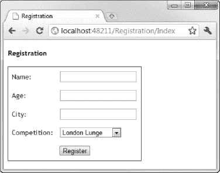

## 29

## 使用模型绑定和验证

在这一章，我们将看看模型绑定和验证。模型绑定是我认为最吸引人的 MVC 框架特性之一。它消除了从请求数据中构造模型对象的繁琐工作。验证使我们能够确保我们接收的数据可以用来创建有效的模型对象，这与模型绑定过程密切相关。

### 了解模型绑定

模型绑定是创建的过程。NET 对象使用浏览器在 HTP 请求中发送的数据。我在第 23 章的[中提到了模型绑定，但是让我们回顾一下那个例子，为本章奠定基础，回过头来为我们的`RegistrationController`类重置代码。清单 29-1](23.html#ch23) 显示了控制器的内容。

***清单 29-1。**基本注册控制器类*

`using System.Web.Mvc;
using EventRegistration.Models.Domain;
using EventRegistration.Models.Domain.Repository;

namespace EventRegistration.Controllers {

    public class RegistrationController : Controller {
        private IRepository repository;

        public RegistrationController(IRepository repo) {
            repository = repo;
        }` `        public ActionResult Index() {
            ViewBag.Competitions = repository.Competitions;
            return View();
        }
    }
}`

该控制器包含一个名为`Index`的单一动作方法。该操作呈现默认视图，并通过`ViewBag`从存储库中传递一组`Competition`对象。清单 29-2 显示了由`Index`动作方法呈现的`Views/Registration/Index.cshtml`视图。

***清单 29-2。**index . cshtml 视图*

`@{
    ViewBag.Title = "Registration";
}

<h4>Registration</h4>

@using (Html.BeginForm("HandleIndexPost", "Registration")) {
    <table>
        <tr><td>Name:</td><td>@Html.Editor("Name")</td></tr>
        <tr><td>Age:</td><td>@Html.Editor("Age")</td></tr>
        <tr><td>City:</td><td>@Html.Editor("HomeCity")</td></tr>
        <tr>
            <td>Competition:</td>
            <td>
                @Html.DropDownList("CompetitionID", new SelectList(ViewBag.Competitions,
                    "ID", "Name"))
            </td>
        </tr>
        <tr><td colspan="2"><input type="submit" value="Register" /></td></tr>
    </table>
}`

注意，我使用了一个`Html.BeginForm`助手的重载，它让我指定表单回发的动作和控制器。我很快会回到这个话题。当我们瞄准动作方法时(例如，通过请求`/Registration/Index`，我们看到了[图 29-1](#fig_29_1) 中的形式。

***图 29-1。**渲染一个简单的表单*

HTML 表单中的`input`元素收集与`Registration`对象中的属性相对应的值。通过使用`Html.Editor`助手，我确保输入元素的`ID`和`name`属性值与它们对应的属性相匹配。例如，下面是通过调用`@Html.Editor("Name")`呈现的输入元素:

`<input class="text-box single-line" id="**Name**" name="**Name**" type="text" value="" />`

#### 处理无模型绑定的表单帖子

当用户点击注册按钮并提交到表单时，我们需要处理`POST`请求，这是我们的模型绑定开始的地方。清单 29-3 展示了我们如何在没有任何模型绑定的情况下处理一个表单帖子。

***清单 29-3。**处理表单后*

`using System.Linq;
using System.Web.Mvc;
using EventRegistration.Models.Domain;
using EventRegistration.Models.Domain.Repository;

namespace EventRegistration.Controllers {

    public class RegistrationController : Controller {
        private IRepository repository;` `        public RegistrationController(IRepository repo) {
            repository = repo;
        }

        public ActionResult Index() {
            ViewBag.Competitions = repository.Competitions;
            return View();
        }

        **[HttpPost]**
        **public ActionResult HandleIndexPost() {**

            **Registration registration = new Registration();**
            **registration.Name = Request.Form["Name"];**
            **registration.Age = int.Parse(Request.Form["Age"]);**
            **registration.HomeCity = Request.Form["HomeCity"];**
            **registration.CompetitionID = int.Parse(Request.Form["CompetitionID"]);**

            **registration.Competition = repository.Competitions**
                **.Where(x => x.ID == registration.CompetitionID).FirstOrDefault();**

            **repository.SaveRegistration(registration);**
            **return View("RegistrationComplete", registration);**
        **}**
    }
}`

我已经添加了一个新的动作方法叫做`HandleIndexPost`，对应于我之前使用`Html.BeginForm`助手的方式。在这种情况下，有两个不同的操作方法名称是不常见的，但是我想演示一个没有参数的方法，因为我已经有了一个无参数的`Index`方法，所以我需要使用一个不同的名称。

如果没有模型绑定，我们必须负责通过`Request`参数从表单中获取值，将值解析为正确的类型，并将结果分配给我们创建的`Registration`对象的属性。这是一种基本但实用的方法，如果您曾经使用其他框架(或 web 表单)进行过 Web 开发，那么您会很熟悉这种方法。

#### 用基本装帧处理表格帖

使用模型绑定的最基本方式是用与 HTML 表单中的输入元素相同的名称来声明参数。清单 29-4 显示了我们如何做到这一点。

***清单 29-4。**使用模型绑定参数*

`using System.Linq;
using System.Web.Mvc;
using EventRegistration.Models.Domain;
using EventRegistration.Models.Domain.Repository;

namespace EventRegistration.Controllers {` `    public class RegistrationController : Controller {
        private IRepository repository;

        public RegistrationController(IRepository repo) {
            repository = repo;
        }

        public ActionResult Index() {
            ViewBag.Competitions = repository.Competitions;
            return View();
        }

        [HttpPost]
        **public ActionResult HandleIndexPost(string name, int age,**
            **string homecity, int competitionid) {**

            **Registration registration = new Registration();**
            **registration.Name = name;**
            **registration.Age = age;**
            **registration.HomeCity = homecity;**
            **registration.CompetitionID = competitionid;**

            registration.Competition = repository.Competitions
                .Where(x => x.ID == registration.CompetitionID).FirstOrDefault();

            repository.SaveRegistration(registration);
            return View("RegistrationComplete", registration);
        }
    }
}`

我们仍然负责创建`Registration`对象，但是 MVC 框架将接受表单值，将它们转换为参数值指定的类型，并将它们传递给我们的 action 方法。在这个过程中，MVC 框架在一系列地方寻找值。对于`name`参数，它将检查以下内容:

*   `Request.Form["name"]`
*   `RouteData.Values["name"]`
*   `Request.QueryString["name"]`
*   `Request.Files["name"]`

一找到值，搜索就停止。请注意，大小写无关紧要。动作方法参数`name`将与属性值为`Name`的输入元素匹配。

#### 处理复杂类型的表单帖子

前面的例子展示了我们如何对简单类型使用模型绑定。这很有用，但是我们仍然负责创建我们需要的`Registration`对象，并设置属性的值。幸运的是，MVC 框架也支持绑定到复杂类型，这意味着我们可以进一步整理我们的动作方法。[清单 29-5](#list_29_5) 展示了我们是如何做的。

***清单 29-5。**使用复杂类型模型绑定*

`using System.Linq;
using System.Web.Mvc;
using EventRegistration.Models.Domain;
using EventRegistration.Models.Domain.Repository;

namespace EventRegistration.Controllers {

    public class RegistrationController : Controller {
        private IRepository repository;

        public RegistrationController(IRepository repo) {
            repository = repo;
        }

        public ActionResult Index() {
            ViewBag.Competitions = repository.Competitions;
            return View();
        }

        [HttpPost]
        public ActionResult HandleIndexPost(**Registration registration**) {

            registration.Competition = repository.Competitions
                .Where(x => x.ID == registration.CompetitionID).FirstOrDefault();

            repository.SaveRegistration(registration);
            return View("RegistrationComplete", registration);
        }
    }
}`

当我们指定一个复杂类型作为一个动作方法的参数时，MVC 框架试图为该类型定义的所有属性和字段寻找值。然后，它创建复杂类型的新实例，用找到的值填充它，并将其传递给 action 方法，同时执行任何所需的类型转换。

这是一个非常简洁和方便的特性。我们开始关注我们对模型对象做了什么，而忽略了它们是如何从用户提交的表单中构造出来的。

#### 用定制的模型活页夹处理表单

前面的例子还有一个问题。我们必须自己设置`Registration`对象的`Competition`属性。这是因为当我们从存储库中请求对象时，`Competition`是由实体框架管理的导航属性，而清单中的`Registration`对象是在模型绑定过程中创建的。我们可以通过创建一个定制的模型绑定来解决这个问题，只要一个动作方法需要一个`Registration`参数，就可以使用这个绑定。

创建定制模型绑定器的最简单方法是从`DefaultModelBinder`派生一个类并覆盖`BindModel`方法。只要我们小心地调用`BindModel`的基类实现，我们就可以受益于默认绑定器的功能，只需添加我们需要的逻辑来完成绑定过程。

清单 29-6 显示了一个创建`Registration`对象的模型绑定器。我调用了这个类`RegistrationModelBinder`，并在`Infrastructure`项目文件夹中创建了它。

***清单 29-6。**一个定制的模型活页夹*

`using System.Linq;
using System.Web.Mvc;
using EventRegistration.Models.Domain;
using EventRegistration.Models.Domain.Repository;

namespace EventRegistration.Infrastructure {
    public class RegistrationModelBinder : DefaultModelBinder {

        public override object BindModel(ControllerContext controllerContext,
            ModelBindingContext bindingContext) {

            Registration reg = (Registration)base.BindModel(controllerContext,
                bindingContext);

            reg.ID = int.Parse(GetValue(bindingContext, "ID", "0"));

            IRepository repo = DependencyResolver.Current.GetService<IRepository>();

            reg.Competition = repo.Competitions
                .Where(x => x.ID == reg.CompetitionID).FirstOrDefault();

            return reg;
        }

        private string GetValue(ModelBindingContext context, string key,
            string defaultValue = null) {

            ValueProviderResult vpr = context.ValueProvider.GetValue(key);
            return vpr == null ? defaultValue : vpr.AttemptedValue;
        }
    }
}`

当 MVC 框架需要创建一个`Registration`对象作为模型绑定过程的一部分时，它会调用`BindModel`方法。在这个方法中，我调用了基类`BindModel`实现，它将返回一个`Registration`对象，其中填充了来自请求的值。为了完成绑定过程，我使用存储库找到合适的`Competition`对象，并将其分配给`Registration`对象的`Competition`属性。

我们不必依赖默认的模型绑定器来生成属性值。我们自己也能做到。我在一个名为`GetValue`的定制模型绑定器中定义了一个方便的方法，该方法从请求中检索值，并简化了对稍微有点笨拙的`ValueProvider`语法的处理。它还允许我提供一个可选参数来处理默认值。在清单中，我使用 `GetValue`方法为`ID`属性设置一个值，如果请求中没有该属性的值，默认值为 0。

注意，我没有在定制模型绑定类中使用依赖注入。这是因为新的实例是通过`System.Activator`类创建的，这需要一个无参数的构造函数。这可以通过 MVC 框架支持的一些高级定制选项来改变，但是使用依赖关系解析器工具也很容易，如下所示:

`IRepository repo = DependencyResolver.Current.GetService<IRepository>();`

静态的`DependencyResolver.Current`属性返回我们的 Ninject 依赖解析器实现，允许我请求一个`IRepository`接口的实现。我们通过将`ModelBinder`属性应用于模型类来告诉 MVC 框架使用我们的定制模型绑定器，如[清单 29-7](#list_29_7) 所示。

***清单 29-7。**使用 ModelBinder 属性将一个定制的模型绑定器与一个模型类型相关联*

`using System.Web.Mvc;
using EventRegistration.Infrastructure;
namespace EventRegistration.Models.Domain {

    **[ModelBinder(typeof(RegistrationModelBinder))]**
    public class Registration {

        public int ID { get; set; }

        public string Name { get; set; }
        public string HomeCity { get; set; }
        public int Age { get; set; }

        public int CompetitionID { get; set; }

        public virtual Competition Competition {get; set;}
    }
}`

`ModelBinder`类的唯一参数是定制绑定器的类型，它应该用于绑定来自请求的实例。如你所想，在这种情况下，类型是`RegistrationModelBinder`。

**用 NINJECT 解决两个上下文问题**

在[第 24 章](24.html#ch24)中，我告诉你将`InRequestScope`方法应用到`IRepository`接口的 Ninject 注册语句中。如果我们没有这样做，我们会看到应用程序抛出一个异常，告诉我们“EntityChangeTracker 的多个实例不能引用一个实体对象。”

如果我们让 Ninject 在每次请求实现`IRepository`时创建一个新的`EFRepository`实例，那么我们在模型绑定器中创建一个实例，在控制器中创建一个实例。模型绑定器通过一个存储库加载一个`Competition`对象，并将其分配给一个对象，该对象然后通过*其他*存储库保存到数据库中。实体框架无法处理跨多个存储库跟踪对象的问题(这很公平，因为它充满了困难)，因此抛出了一个异常。

有几种方法可以处理这个问题，但最简单的是让 Ninject 为每个请求只创建一个存储库实现。这确保了所有的对象都通过一个单一的存储库实例来加载和保存。

我们现在可以进一步简化我们的动作方法，如清单 29-8 所示。

***清单 29-8。**进一步简化动作方法*

`using System.Linq;
using System.Web.Mvc;
using EventRegistration.Models.Domain;
using EventRegistration.Models.Domain.Repository;

namespace EventRegistration.Controllers {

    public class RegistrationController : Controller {
        private IRepository repository;

        public RegistrationController(IRepository repo) {
            repository = repo;
        }

        public ActionResult Index() {
            ViewBag.Competitions = repository.Competitions;
            return View();
        }

        **[HttpPost]**
        **public ActionResult HandleIndexPost(Registration registration) {**
            **repository.SaveRegistration(registration);**
            **return View("RegistrationComplete", registration);**
        **}**
    }
}`

我们已经达到了这样的程度，我们的动作方法不必担心从表单数据中创建`Registration`对象的任何方面。在模型绑定过程中，一切都被考虑到了。我们所要做的就是保存对象，并告诉 MVC 框架呈现`RegistrationComplete`视图。

### 验证模型

MVC 框架在执行模型绑定时会自动执行一些基本的验证。在这一节中，我将向您展示我们内置了什么，以及我们如何添加到其中以执行更复杂的验证。

#### 设置基本模型验证

`Registration`类中的`Age`属性被定义为一个`int`，在模型绑定过程中，MVC 框架必须转换请求中提供的字符串值。如果请求值不能转换为`int`，则该型号被归类为*无效*。

为了检测和处理无效模型，我们需要对控制器和视图进行一些增强。清单 29-9 展示了对`RegistrationController`类的修改。

***清单 29-9。**增强控制器支持模型验证*

`using System.Linq;
using System.Web.Mvc;
using EventRegistration.Models.Domain;
using EventRegistration.Models.Domain.Repository;

namespace EventRegistration.Controllers {

    public class RegistrationController : Controller {
        private IRepository repository;

        public RegistrationController(IRepository repo) {
            repository = repo;
        }

        public ActionResult Index() {
            ViewBag.Competitions = repository.Competitions;
            return View(new **Registration()**);
        }

        [HttpPost]
        public ActionResult HandleIndexPost(Registration registration) {
            **if (ModelState.IsValid) {**
                repository.SaveRegistration(registration);
                return View("RegistrationComplete", registration);
            **} else {**
                **ViewBag.Competitions = repository.Competitions;**
                **return View("Index", registration);**
            **}**
        }
    }
}`

我们可以通过读取`ModelDate.IsValid`属性来检测模型绑定验证是否有问题。如果`IsValid`返回`true`，那么我们可以像平常一样继续并保存`Registration`对象。如果`IsValid`返回`false`，那么我们做一些不同的事情。我们再次呈现`Index`视图，传入模型绑定过程试图(但失败了)创建的`Registration`对象。

 **注意**注意，我还更改了`Index`方法，这样它创建了一个新的`Registration`对象，并将其用作视图模型对象。这是为了简化视图的强类型化。

这可能看起来违反直觉，但是 MVC 框架在处理无效的模型对象时有一个巧妙的技巧。为了利用这一点，我们需要做进一步的改变，使`Index.cshtml`视图具有强类型，如[清单 29-10](#list_29_10) 所示。

***清单 29-10。**使索引视图成为强类型*

`**@model EventRegistration.Models.Domain.Registration**
@{
    ViewBag.Title = "Registration";
}

<h4>Registration</h4>

@using (Html.BeginForm("HandleIndexPost", "Registration")) {
    **@Html.HiddenFor(x => x.ID)**
    <table>
        <tr><td>Name:</td><td>**@Html.EditorFor(x => x.Name)**</td></tr>
        <tr><td>Age:</td><td>**@Html.EditorFor(x => x.Age)**</td></tr>
        <tr><td>City:</td><td>**@Html.EditorFor(x => x.HomeCity)**</td></tr>
        <tr>
            <td>Competition:</td>
            <td>
                **@Html.DropDownListFor(x => x.CompetitionID,**
                    **new SelectList(ViewBag.Competitions, "ID", "Name"))**
            </td>
        </tr>
        <tr><td colspan="2"><input type="submit" value="Register" /></td></tr>
    </table>
}`

我已经添加了一个`@model`指令，并使用强类型的模板化助手为`Registration`类中的属性生成编辑器。如果我们启动应用程序并导航到`/Registration/Index`，我们会看到如图 29-1 所示的视图。我们所做的改变还看不出来。

 **注意**我还为`ID`属性添加了一个`hidden`元素。这是为了让我们以后应用模型范围的验证规则时更加容易。

下面是`Html.EditorFor`助手为`Age`属性生成的 HTML:

`<input class="text-box single-line" data-val="true"
    data-val-number="The field Age must be a number."
    data-val-required="The Age field is required." id="Age" name="Age"
    type="text" value="" />`

暂时忽略`data-val-number`和`data-val-required`属性。当我们学习本章中的例子时，这些的目的就变得很清楚了。

现在我们可以测试模型的有效性了。在年龄文本框中输入单词 twenty，然后单击注册按钮。尽管 20 岁可能是一个有效的年龄，但我们已经用 MVC 框架不能转换成`int`值的方式表达了它。这意味着模型是无效的。我们检测到 action 方法中的验证问题，将畸形的`Registration`对象作为视图模型对象传递，再次渲染`Index`视图，但这一次，MVC 框架突出显示有问题，如图[图 29-2](#fig_29_2) 。

***图 29-2。**内置模型验证*

在视图呈现过程中，模板化助手已经意识到`Age`属性有问题，并呈现了不同的 HTML。

`<input class="**input-validation-error** text-box single-line" data-val="true"
    data-val-number="The field Age must be a number."
    data-val-required="The Age field is required." id="Age" name="Age"
    type="text" value="twenty" />`

为了反映验证错误，助手向 input 元素添加了一个名为`input-validation-error`的新 CSS 类。该类在`Content/Site.css`(被默认视图`_Layout.cshtml`引用)中定义如下:

`.input-validation-error {
    border: 1px solid #ff0000;
    background-color: #ffeeee;
}`

每次用户单击 Register 按钮时都会执行模型验证，直到用户纠正了问题，模型才会有效。

#### 使用验证助手

我们现在能够向用户指出存在问题。为了让他们知道如何纠正问题，我们需要在`Index.cshtml`视图中使用一些特定于验证的帮助方法。清单 29-11 展示了我们是如何做到这一点的。

***清单 29-11。**向索引视图添加验证细节*

`@model EventRegistration.Models.Domain.Registration
@{
    ViewBag.Title = "Registration";
}

<h4>Registration</h4>

**@Html.ValidationSummary("Please fix the following errors:")**

@using (Html.BeginForm("HandleIndexPost", "Registration")) {
    @Html.HiddenFor(x => x.ID)
    <table>
        <tr>
            <td>Name:</td>
            <td>@Html.EditorFor(x => x.Name)</td>
            <td>**@Html.ValidationMessageFor(x => x.Name)**</td>
        </tr>
        <tr>
            <td>Age:</td>
            <td>@Html.EditorFor(x => x.Age)</td>
            <td>**@Html.ValidationMessageFor(x => x.Age)**</td>
        </tr>
        <tr>
            <td>City:</td>
            <td>@Html.EditorFor(x => x.HomeCity)</td>
            <td>**@Html.ValidationMessageFor(x => x.HomeCity)**</td>
        </tr>
        <tr>
            <td>Competition:</td>
            <td>
                @Html.DropDownListFor(x => x.CompetitionID,
                    new SelectList(ViewBag.Competitions, "ID", "Name"))
            </td>` `            <td>**@Html.ValidationMessageFor(x => x.CompetitionID)**</td>
        </tr>
        <tr><td colspan="2"><input type="submit" value="Register" /></td></tr>
    </table>
}`

有两种验证助手可用，我已经在视图中使用了它们。第一个是`Html.ValidationSummary`，它生成所有检测到的验证错误的摘要。第二种是`Html.ValidationMessageFor`，它报告单个属性的验证错误。

 **注意**`Html.ValidationMessage`助手是与`Html.ValidationMessageFor`助手等价的弱类型助手。我喜欢使用强类型的助手，但是两者都可以。

当我们现在提交表单时，我们得到了一些更有用的信息，如图[图 29-3](#fig_29_3) 所示。

***图 29-3。**显示验证信息*

在摘要和属性旁边重复相同的消息是多余的，但我们稍后会对此进行调整。现在用户知道他们输入的值是无效的，他们可以采取措施纠正它。

#### 使用元数据定义验证规则

既然我们已经设置了模型验证，我们可以使用应用于模型类的元数据来定义我们自己的验证规则。清单 29-12 展示了我们如何做到这一点。

***清单 29-12。**将验证属性应用于模型类*

`using System.Web.Mvc;
using EventRegistration.Infrastructure;
using System.ComponentModel.DataAnnotations;

namespace EventRegistration.Models.Domain {

    [ModelBinder(typeof(RegistrationModelBinder))]
    public class Registration {

        **[Required]**
        public int ID { get; set; }

        **[Required]**
        public string Name { get; set; }

        **[Required]**
        public string HomeCity { get; set; }

        **[Required(ErrorMessage="Please enter an age")]**
        **[Range(18, 100, ErrorMessage = "Please enter an age between 18 and 100")]**
        public int Age { get; set; }

        **[Required]**
        public int CompetitionID { get; set; }

        public virtual Competition Competition { get; set; }
    }
}`

我在清单中展示了几个不同的验证属性。`Required`属性声明用户必须为属性提供一个值，而`Range`属性指定所提供的值必须在给定的范围内(在本例中是 18 到 100，包括 18 和 100)。

 **注意**注意，我已经将`Required`属性添加到了`ID`和`CompetitionID`属性中。尽管我们在为新注册收集数据时不使用`ID`属性，并且`CompetitionID`值是从下拉菜单中设置的，但我还是这样做了。这是因为验证属性应用于模型，而不是控制器或操作方法。如果我们创建了允许我们通过输入名称来编辑现有记录或选择事件的操作，我们将希望确保也为这些属性提供值。

[表 29-1](#tab_29_1) 显示了模型绑定器识别的一组内置验证属性。

每个验证属性都将向用户显示一条默认的错误消息，但是我们可以通过为`ErrorMessage`属性设置一个值来指定一条自定义消息，如下所示:

` [Required(ErrorMessage="Please enter an age")]`

如果我们启动应用程序，我们可以看到验证属性的效果；导航至`/Registration/Index`并点击注册按钮，无需输入任何值。我应用于每个属性的属性将导致模型验证过程失败，导致如图 29-4 所示的错误信息。

***图 29-4。**验证元数据产生的错误消息*

每次我们单击 Register 按钮时，我们输入到字段中的数据都会使用我们应用到模型的属性进行验证。

属性的默认值为 0，因为我们在`Index`动作方法中传递了一个新创建的`Registration`对象作为视图模型。我们可以通过更改助手并检查零值来解决这个问题，如下所示:

`<td>@Html.TextBox("Age", Model.Age == 0 ? "" : Model.Age.ToString())</td>`

#### 执行额外的属性级验证

只要绑定了我们的模型类型，就会应用验证属性。有时，我们需要执行更专门的验证，这对于给定的操作方法可能是唯一的。假设我们需要确保`Name`属性的值只有在创建新注册时才是惟一的。清单 29-13 展示了我们如何在动作方法中对属性进行验证。

***清单 29-13。**执行确认一个行动方法*

`[HttpPost]
public ActionResult HandleIndexPost(Registration registration) {

    **if (ModelState.IsValidField("Name") &&**
        **repository.Registrations.Where(x => x.Name == registration.Name).Count() > 0) {**` `        **ModelState.AddModelError("Name",**
            **"A registration has already been made in this name");**
    **}**

    if (ModelState.IsValid) {
        repository.SaveRegistration(registration);
        return View("RegistrationComplete", registration);
    } else {
        ViewBag.Competitions = repository.Competitions;
        return View("Index", registration);
    }
}`

当动作方法被调用时，我们的模型已经通过了验证。这意味着我们可以使用验证的结果来查看是否值得执行额外的检查。我们通过调用`ModelState.IsValidField`方法来做到这一点，将我们想要检查的属性的名称作为参数传入。

如果`IsValidField`方法返回`false`，我们知道属性值没有通过验证，我们没有必要通过报告额外的错误来搅浑水。如果方法返回`true`，那么我们知道属性值已经通过验证，我们可以安全地应用额外的测试。

在清单中，我使用 LINQ 来查看是否有任何与模型对象具有相同的值的对象。如果有，那么我的验证检查就失败了，我调用`ModelState.AddModelError`方法来记录这个问题。`AddModelError`方法的参数是属性的名称和要显示的错误消息。

如果我们使用数据库中已知的`Name`值提交表单，我们会看到错误信息，如图 29-5 所示。

***图 29-5。**附加验证信息*

通过这种方式，我们可以向我们的模型添加特定情况的验证，并超越我们使用元数据定义的内容。

#### 执行模型级验证

到目前为止，我们所做的所有验证都是在单个属性的级别上进行的。然而，有时我们需要验证整个模型，确保属性值的组合是有效的。举个例子，让我们想象一下，巴黎恐慌事件只允许 40 岁以上的参赛者。验证该规则需要检查`Age`和`CompetitionID`属性的组合。[清单 29-14](#list_29_14) 展示了我们如何执行这种验证。

***清单 29-14。**执行模型级验证*

`[HttpPost]
public ActionResult HandleIndexPost(Registration registration) {

    if (ModelState.IsValidField("Name") &&
        repository.Registrations.Where(x => x.Name == registration.Name).Count() > 0) {

        ModelState.AddModelError("Name",
            "A registration has already been made in this name");
    }

    **if (ModelState.IsValidField("Age") && ModelState.IsValidField("CompetitionID")) {**
        **if (registration.Competition.Name == "Paris Panic" && registration.Age < 40) {**
            **ModelState.AddModelError(string.Empty,**
                **"You must be at least 40 to do the Paris Panic");**
        **}**
    **}**

    if (ModelState.IsValid) {
        repository.SaveRegistration(registration);
        return View("RegistrationComplete", registration);
    } else {
        ViewBag.Competitions = repository.Competitions;
        return View("Index", registration);
    }
}`

我再次使用`IsValidField`方法来检查我需要处理的字段是否已经通过了验证。然后，我执行我的验证检查。如果有问题，我使用`AddModelError`方法登记问题。不同之处在于，我使用空字符串作为属性名。这告诉 MVC 框架问题出在整体模型上，而不是单个属性上。[图 29-6](#fig_29_6) 显示了验证信息显示时会发生什么。

***图 29-6。**模型级验证错误消息*

该消息仅显示在摘要中。当然，这种错误没有特定的属性。我们可以做的最后一个调整是让摘要只显示*模型级错误*。这可以防止重复出现可归因于单个属性的错误消息，只显示模型级别的错误。[清单 29-15](#list_29_15) 显示了对`Index.cshtml`视图所需的更改。

***清单 29-15。**在验证总结中仅显示模型级错误*

`@model EventRegistration.Models.Domain.Registration
@{
    ViewBag.Title = "Registration";
}

<h4>Registration</h4>

@Html.ValidationSummary(**true,** "Please fix the following errors:")

@using (Html.BeginForm("HandleIndexPost", "Registration")) {

    @Html.HiddenFor(x => x.ID)` `    <table>
        <tr>
            <td>Name:</td>
            <td>@Html.EditorFor(x => x.Name)</td>
            <td>@Html.ValidationMessageFor(x => x.Name)</td>
        </tr>
...`

我添加的调用`Html.ValidationSummary`助手的附加参数指定只显示模型级的消息，如图 29-7 所示。

***图 29-7。**将验证摘要限制在模型级验证错误*

### 使用客户端验证

前面示例中的验证是在服务器上执行的，以响应提交的表单。MVC 框架支持*不引人注目的客户端验证*。术语*不引人注目的*意味着使用添加到我们生成的 HTML 元素中的属性来表达验证规则。这些由作为 MVC 框架一部分的 JavaScript 库解释，它使用属性值来配置 jQuery 验证库，后者执行实际的验证工作。(我们在[第 10 章](10.html#ch10)中看到了 jQuery 验证库，但在本章中我们将只间接使用它。)

 **注意** MVC 第 3 版引入了对 jQuery 验证的支持，而早期版本依赖于微软开发的 JavaScript 库。这些没有被高度重视，尽管它们仍然包含在 MVC 框架中，但是没有理由使用它们。

您将会遇到在 JavaScript 上下文中更广泛使用的单词*obscent*。这是一个松散的术语，有三个关键特征。首先，执行验证的 JavaScript 与 HTML 元素保持分离，这意味着我们不必在视图中包含客户端验证逻辑，并且我们生成的 HTML 更易于阅读。

第二个特征是使用*渐进增强*进行验证。这意味着如果用户的浏览器不支持客户端验证所需的所有 JavaScript 特性，验证将使用更简单的技术来执行。例如，如果用户禁用了 JavaScript，那么服务器端验证将无缝地执行，而不会对用户造成不利影响(没有令人不快的错误消息或需要采取的特殊步骤)。第三个特征是一组减轻浏览器不一致性和行为影响的最佳实践。这是 jQuery 库的主要目标之一。

MVC 框架对客户端验证的支持由`Web.config`文件中的两个设置控制，如[清单 29-16](#list_29_16) 所示。

***清单 29-16。**控制客户端验证*

`<configuration>
  <appSettings>
    **<add key="ClientValidationEnabled" value="true"/>**
    **<add key="UnobtrusiveJavaScriptEnabled" value="true"/>**
  </appSettings>
...`

这两个设置都必须是`true`，客户端验证才能工作。当 Visual Studio 创建您的 MVC 3 项目时，这些条目被默认设置为`true`。除了配置设置，我们必须确保有对三个特定 JavaScript 库的引用，如[清单 29-17](#list_29_17) 所示。

***清单 29-17。**引用客户端验证所需的 JavaScript 库*

`<!DOCTYPE html>
<html>
<head>
    <title>@ViewBag.Title</title>
    <link href="@Url.Content("~/Content/Site.css")" rel="stylesheet" type="text/css" />

    ****

    ****

    <**script src="@Url.Content("~/Scripts/jquery.validate.unobtrusive.min.js")"**
        **type="text/javascript"></script>**` `</head>
<body>
    @RenderBody()
</body>
</html>`

我们可以将这些文件添加到我们希望使用客户端验证的每个视图中，但是从布局文件中引用这些文件通常更简单，如清单所示。

 **注意**jQuery 文件的引用顺序非常重要。如果您更改顺序，您会发现客户端验证没有执行。

scripts 文件夹包含每个 JavaScript 库的两个版本。名称以`min.js`结尾的版本是*最小化的*版本，这意味着所有的空白、注释和其他不必要的内容都被删除，以减小库文件的大小。最小化的文件可以小得多，通常用于生产中，以减少客户端下载的数据量。在开发过程中，通常使用未最小化的版本，以便在出现问题时可以调试(或直接读取)JavaScript。

不引人注目的验证支持的好处是，它在应用我们的验证属性后发出的 HTML 上工作。这些是我们在本章前面看到的`data-`属性。我们不需要做任何额外的改变来获得客户端验证支持。

 **注意**还有一种客户端验证技术。它依赖于 Ajax，我在第 30 章中描述了它。

### 总结

在这一章中，我们已经看到了 MVC 框架是如何支持模型绑定来帮助我们简化动作方法的。模型绑定是一个优雅的特性，它允许我们集中精力处理模型对象，而不必关注它们是如何从请求数据中创建的。

我向您展示了如何定制模型绑定过程，以及如何验证作为请求的一部分接收的数据将导致有效的模型对象。最后，我向您展示了对非介入式客户端验证的支持，它允许您在提交表单进行处理之前对属性值执行简单的验证。