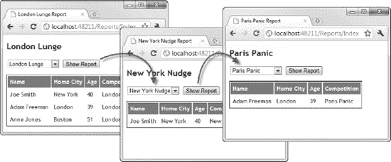
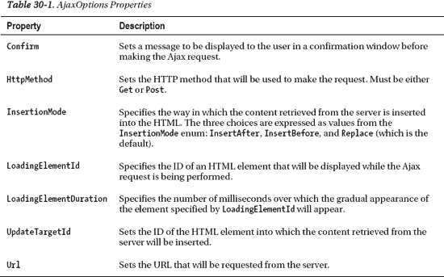
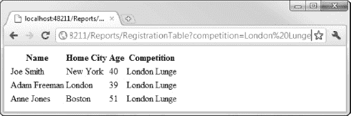
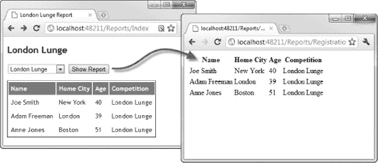
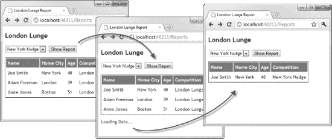
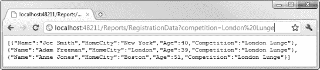
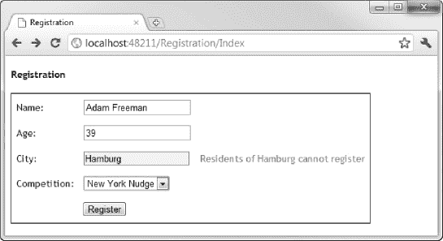

## 三十

## 使用不引人注目的 Ajax

MVC 框架包含对*不引人注目的 Ajax* 的支持。这类似于[第 18 章](18.html#ch18)中不引人注目的客户端验证，因为它不涉及在 HTML 文档的任意点插入额外的 JavaScript 代码块。像客户端验证支持一样，MVC 不引人注目的 Ajax 是基于 jQuery JavaScript 库的，这在[第 10 章](10.html#ch10)和[第 11 章](11.html#ch11)中有介绍。

### 准备项目

我们将建立在前一章中使用的例子。特别是，我们将重点关注`Report`控制器，我们上次在[第 28 章](28.html#ch28)中看到过，当时我们在看如何处理控制器中的异常。[清单 30-1](#list_30_1) 显示了`ReportController`类的内容，包括为本章做准备的一些附加内容。

***清单 30-1。**report controller 类*

`using System.Linq;
using System.Web.Mvc;
using EventRegistration.Models.Domain.Repository;

namespace EventRegistration.Controllers {

    public class ReportsController : Controller {
        private IRepository repository;

        public ReportsController(IRepository repo) {
            repository = repo;
        }

        public ActionResult Index(string competition) {
            ViewBag.CompetitionNames = repository.Competitions.Select(x => x.Name);
            if (string.IsNullOrEmpty(competition)) {
                return View((object)repository.Competitions.First().Name);
            } else {
                return View((object)competition);
            }
        }` `        [ChildActionOnly]
        public PartialViewResult RegistrationTable(string competition) {
            return PartialView(repository.Registrations
                .Where(x => x.Competition.Name == competition));
        }
    }
}`

为了简单起见，我只定义了一个动作方法，我们将把它用于`GET`和`POST`请求。`Index`方法的唯一参数是一个字符串，它指定了我们将要为其生成报告的竞赛的名称。如果没有提供参数`competition`的值，我将从存储库中选择第一个比赛(当用户执行最初的`GET`请求时就是这种情况)。

`Index`方法使用`ViewBag`将竞赛名称集合传递给视图，并使用要报告的竞赛名称作为视图模型对象。

控制器还定义了一个名为`RegistrationTable`的子动作，用于呈现局部视图。我们将很快返回这个方法。[清单 30-2](#list_30_2) 显示了这个控制器的主视图`Index.chstml`。

***清单 30-2。**视图/报告/索引. cshtml 视图*

`@model string
@{
    ViewBag.Title = Model + " Report";
}

<h2>@Model</h2>

@using (Html.BeginForm()) {

    @Html.DropDownList("competition", new SelectList(ViewBag.CompetitionNames, Model))
    <input type="submit" value="Show Report" />
}

@Html.Action("RegistrationTable", new { competition = Model })`

这个视图呈现一个包含竞赛名称的下拉列表，所选值取自视图模型对象。它还包含对子动作`RegistrationTable`的调用，使用匿名类型的对象传递所选比赛的名称。该值被绑定到 action 方法的参数，该方法生成与所选竞争相关联的`Registration`对象的列表，并使用它们作为视图模型对象来呈现默认的局部视图，如[清单 30-3](#list_30_3) 所示。

***清单 30-3。**报名表局部视图*

`@model IEnumerable<EventRegistration.Models.Domain.Registration>

<table id="datatable">
    <tr><th>Name</th><th>Home City</th><th>Age</th><th>Competition</th></tr>` `    @foreach (var reg in Model) {
        <tr>
            <td>@reg.Name</td>
            <td>@reg.HomeCity</td>
            <td>@reg.Age</td>
            <td>@reg.Competition.Name</td>
        </tr>
    }
</table>`

这个局部视图呈现一个 HTML 表格，并使用 Razor `@foreach`循环为视图模型中的每个`Registration`对象生成一个表格行。当我们运行应用程序并导航到`/Reports/Index`时，我们有一个简单的报告生成器，允许我们从可用的竞赛中进行选择，并查看每个竞赛的注册集，如图[图 30-1](#fig_30_1) 所示。

***图 30-1。**一个简单的报表 web 应用*

我们从下拉列表中选择一个事件，然后单击 Show Report 按钮，表单就被提交给服务器。响应显示了所选竞赛的注册集。

### 启用不引人注目的 Ajax

启用非介入式 Ajax 的过程类似于我在前一章中展示的非介入式客户端验证。为了启用这个特性，我们在`Web.config`中将`UnobtrusiveJavaScriptEnabled`的值设置为`true`，如清单 30-4 中的[所示。](#list_30_4)

***清单 30-4。**在 Web.config 中启用不引人注目的 JavaScript 支持*

`<configuration>
  <appSettings>
    <add key="ClientValidationEnabled" value="true"/>
    **<add key="UnobtrusiveJavaScriptEnabled" value="true"/>**
  </appSettings>
...`

除了设置配置选项，我们还必须确保所需的 JavaScript 库是从我们希望使用 Ajax 的视图中引用的。最简单的方法是在布局中放置`script`元素，如[清单 30-5](#list_30_5) 所示。

***清单 30-5。**添加脚本元素来引用所需的 JavaScript 库*

`<!DOCTYPE html>
<html>
<head>
    <title>@ViewBag.Title</title>
    <link href="@Url.Content("~/Content/Site.css")" rel="stylesheet" type="text/css" />
    ****
    ****
</head>

<body>
    @RenderBody()
</body>
</html>`

这两个 JavaScript 库文件是`jquery-1.5.1.min.js`(它是核心的 jQuery 库)和`jquery.unobtrusive-ajax.js`(它是特定于 MVC 的 jQuery 包装器，提供不引人注目的 Ajax 支持)。

### 使用不显眼的 Ajax 表单

让我们使用 MVC 对 Ajax 的支持来添加对发布表单更新的支持。[清单 30-6](#list_30_6) 显示了对`Index.cshtml`视图的修改，以启用该特性。

***清单 30-6。**使用 Ajax 表单*

`@model string
@{
    ViewBag.Title = Model + " Report";
    **AjaxOptions ajaxOpts = new AjaxOptions {**
        **UpdateTargetId = "datatable"**
    **};**
}` `<h2>@Model</h2>

@using (**Ajax.BeginForm("RegistrationTable", ajaxOpts)**) {

    @Html.DropDownList("competition", new SelectList(ViewBag.CompetitionNames, Model))
    <input type="submit" value="Show Report" />
}

@Html.Action("RegistrationTable", new { competition = Model })`

为了启用 Ajax 表单，我们必须做两处修改。首先是定义一个`AjaxOptions`对象，这是我们为 Ajax 请求指定设置的机制。[表 30-1](#tab_30_1) 显示了`AjaxOptions`类中可用的属性。

我在清单中设置了一个非常简单的配置，只为`UpdateTargetId`属性指定了一个值。MVC 框架 Ajax forms 特性期望从服务器检索 HTML，`UpdateTargetId`属性指定了这个 HTML 将要替换的元素的 ID。在这个例子中，我在`RegistrationTable`局部视图中的`table`元素上设置了 ID，如下所示:

`...
<table **id="datatable"**>
...`

我们必须对清单做的第二个更改是在视图呈现时使用`Ajax.BeginForm`助手创建适当的`form`元素，如下所示:

`...
@using (**Ajax.BeginForm("RegistrationTable", ajaxOpts)**) {.
...`

这个助手的参数是使用 Ajax 调用的动作方法的名称和我们前面创建的`AjaxOptions`对象。在这个例子中，我在同一个控制器中指定了子方法。我们还需要做一点改变。我们需要从控制器的`RegistrationTable`方法中移除`ChildActionOnly`属性，如清单 30-7 中的[所示。](#list_30_7)

***清单 30-7。**删除 ChildActionOnly 属性*

`using System.Linq;
using System.Web.Mvc;
using EventRegistration.Models.Domain.Repository;

namespace EventRegistration.Controllers {

    public class ReportsController : Controller {
        private IRepository repository;

        public ReportsController(IRepository repo) {
            repository = repo;
        }

        public ActionResult Index(string competition) {
            ViewBag.CompetitionNames = repository.Competitions.Select(x => x.Name);
            if (string.IsNullOrEmpty(competition)) {
                return View((object)repository.Competitions.First().Name);
            } else {
                return View((object)competition);
            }
        }

        **public PartialViewResult RegistrationTable(string competition) {**
            **return PartialView(repository.Registrations**
                **.Where(x => x.Competition.Name == competition));**
        **}**
    }
}`

这似乎是一个微不足道的变化，但根据您的应用程序，它可能会产生一些严重的后果。当`ChildActionOnly`属性存在时，MVC 框架会忽略以该动作方法为目标的 URL，包括 Ajax 请求。但是当我们移除属性时，这些请求将被服务，这允许用户直接访问内容。例如，请求这个 URL:

`/Reports/RegistrationTable?competition=London%20Lunge`

将返回包含伦敦 Lunge 事件所有注册的 HTML 片段，如图[图 30-2](#fig_30_2) 所示。

***图 30-2。**通过以前的儿童专用操作方法暴露数据碎片*

在我的例子中，以这种方式暴露 HTML 片段不是问题。这是用户无论如何都可以访问的数据。但是当从子动作升级到常规动作方法时，确保发布的数据不会比您想象的多是有好处的，并且您必须注意应用适当的身份验证和授权措施。你可以在第 34 章中了解更多关于如何应用认证和授权的信息。

#### 表演优雅的降级

`Ajax.BeginForm`助手不直接生成 JavaScript。它只是创建一个带有数据属性的表单元素，这些属性可以被不引人注目的 Ajax 脚本检测到，如下所示:

`<form action="/Reports/RegistrationTable" **data-ajax="true"**
    data-ajax-mode="replace" data-ajax-update="#datatable" id="form0" method="post">`

助手生成一个有效的`form`元素，这意味着如果浏览器禁用了 JavaScript，用户仍然可以同步发布表单。这听起来是个好主意，但是表单发送到的 URL 是返回 HTML 片段的 URL。你可以在[图 30-3](#fig_30_3) 中看到不使用 JavaScript 提交表单的效果。

***图 30-3。**在禁用 JavaScript 时发布一个不显眼的 Ajax 表单*

为了解决这个问题，我们必须在视图中稍微不同地配置 Ajax 请求和 HTML 表单元素。[清单 30-8](#list_30_8) 显示了`Index.cshtml`视图中需要的变更。

***清单 30-8。**增加对优雅降级 Ajax 表单的支持*

`@model string
@{
    ViewBag.Title = Model + " Report";
    AjaxOptions ajaxOpts = new AjaxOptions {
        UpdateTargetId = "datatable",
        **Url = Url.Action("RegistrationTable")**
    };   
}

<h2>@Model</h2>

@using (Ajax.BeginForm(**"Index"**, ajaxOpts)) {

    @Html.DropDownList("competition", new SelectList(ViewBag.CompetitionNames, Model))
    <input type="submit" value="Show Report" />
}

@Html.Action("RegistrationTable", new { competition = Model })`

我们为`AjaxOptions.Url`属性设置了一个值。这是 Ajax 请求的目标 URL。我使用`Url.Action`助手为这个属性设置了一个值，我在[第 29 章](29.html#ch29)中描述过。然后，当 JavaScript 不可用时，我们将传递给`Ajax.BeginForm`助手的动作名称更改为我们想要的目标名称，在本例中为`Index`动作方法，它将同步生成所选的报告。有了这些改变，JavaScript 用户将获得 Ajax 体验，而非 JavaScript 用户将受益于优雅的降级，并且仍然能够使用应用程序。

#### 在请求过程中向用户提供反馈

使用 Ajax 的一个缺点是用户看不到正在发生的事情。我们可以使用`AjaxOptions.LoadingElementId`属性来解决这个问题，如[清单 30-9](#list_30_9) 所示。

***清单 30-9。**用 LoadingElementId 属性给用户反馈*

`@model string
@{
    ViewBag.Title = Model + " Report";
    AjaxOptions ajaxOpts = new AjaxOptions {
        UpdateTargetId = "datatable",
        Url = Url.Action("RegistrationTable"),
        **LoadingElementId = "loading",**
        **LoadingElementDuration = 2000**
    };   
}` `<h2>@Model</h2>

@using (Ajax.BeginForm("Index", ajaxOpts)) {

    @Html.DropDownList("competition", new SelectList(ViewBag.CompetitionNames, Model))
    <input type="submit" value="Show Report" />
}

@Html.Action("RegistrationTable", new { competition = Model })

**
**
    **
Loading Data...
**

`

属性指定了一个隐藏的 HTML 元素的属性，当一个异步请求被执行时，这个元素将被显示给用户。我已经在视图中添加了一个`div`元素，它是使用`display:none` CSS 值隐藏的。[图 30-4](#fig_30_4) 显示了这种反馈的效果。

***图 30-4。**在 Ajax 请求期间向用户提供反馈*

相关的设置`AjaxOptions.LoadingElementDuration`允许我们使用一个简单的动画来指定隐藏面板显示的毫秒数。一旦 Ajax 请求完成，由`LoadingElementId`属性指定的元素将再次隐藏。

#### 使用 Ajax 回调

`AjaxOptions`类定义了一组属性，允许我们指定将在 Ajax 请求生命周期的不同点调用的 JavaScript 函数。这些属性在[表 30-2](#tab_30_2) 中描述。

T2】

每个`AjaxOptions`回调属性都与 jQuery 库支持的 Ajax 事件相关联。我已经在[表 30-2](#tab_30_2) 中列出了 jQuery 事件。你可以在第 11 章的[中看到它们与常规 jQuery Ajax 的关系，并在](11.html#ch11)`[http://api.jquery.com/jQuery.ajax](http://api.jquery.com/jQuery.ajax)`获得完整的文档。

清单 30-10 显示了我添加到`Index.cshtml`中的回调，它使用 jQuery 从 HTML 表中删除现有的行。

***清单 30-10。**向视图添加回调*

`@model string

@{
    ViewBag.Title = Model + " Report";
    AjaxOptions ajaxOpts = new AjaxOptions {
        UpdateTargetId = "datatable",
        Url = Url.Action("RegistrationTable"),
        LoadingElementId = "loading",
        LoadingElementDuration = 2000,
        **OnBegin = "ClearTableData"**
    };   
}

****

<h2>@Model</h2>

@using (Ajax.BeginForm("Index", ajaxOpts)) {

    @Html.DropDownList("competition", new SelectList(ViewBag.CompetitionNames, Model))
    <input type="submit" value="Show Report" />
}

` `@Html.Action("RegistrationTable", new { competition = Model })

    
Loading Data...

`

我通过将`AjaxOptions.OnBegin`属性设置为函数名来注册回调。现在，当请求新数据时，现有数据将从表中清除。

### 使用不显眼的 Ajax 链接

HTML 助手也将产生使用 Ajax 异步跟踪的链接。我已经在清单 30-11 中使用了这个特性来创建一组链接，为每个可用的事件加载数据。

***清单 30-11。**生成 Ajax 链接*

`@model string
@{
    ViewBag.Title = Model + " Report";
    AjaxOptions ajaxOpts = new AjaxOptions {
        UpdateTargetId = "datatable",
        Url = Url.Action("RegistrationTable"),
        LoadingElementId = "loading",
        LoadingElementDuration = 2000,
        OnBegin = "ClearTableData"
    };   
}

<h2>@Model</h2>

@using (Ajax.BeginForm("Index", ajaxOpts)) {

    @Html.DropDownList("competition", new SelectList(ViewBag.CompetitionNames, Model))
    <input type="submit" value="Show Report" />
}

**<table>**
    **<tr>**
        **@foreach (string comp in ViewBag.CompetitionNames) {**`  `**<td>**
                **@Ajax.ActionLink(comp, "RegistrationTable", new {competition = comp},**
                    **new AjaxOptions {UpdateTargetId = "datatable"})**
            **</td>**
        **}**
    **</tr>**
**</table>**

@Html.Action("RegistrationTable", new { competition = Model })

    
Loading Data...

`

我使用一个 Razor `@foreach`循环来调用动作方法已经通过`ViewBag`的每个竞赛名称上的`Ajax.ActionLink`助手。这个助手方法的四个参数是链接中显示的文本、单击链接时调用的动作方法的名称、传递给路由系统的附加值和一个`AjaxOptions`对象。我为循环的每次迭代创建了一个`AjaxOptions`对象，以证明它们可以内联创建，但通常我更喜欢在代码块中定义它们，就像我对 Ajax 表单示例所做的那样。

这些链接排列在一个表格中，您可以在[图 30-5](#fig_30_5) 中看到。

***图 30-5。**使用支持 Ajax 的链接*

当我们单击其中一个链接时，一个 Ajax 请求被发送到`RegistrationTable`动作方法，数据被用来替换页面中的`table`元素，就像本章前面的 Ajax 表单示例一样。

#### 表演优美的降级

为视图中的每个链接创建单独的`AjaxOptions`对象的好处之一是，我们可以更容易地支持 Ajax 链接的适度降级。[清单 30-12](#list_30_12) 展示了在没有 JavaScript 的情况下链接工作所需的改变。

***清单 30-12。【Ajax 链接的优雅退化***

`...
<table>
    <tr>
        @foreach (string comp in ViewBag.CompetitionNames) {
            <td>    
                @Ajax.ActionLink(comp, **"Index"**, new {competition = comp},
                    new AjaxOptions {
                        UpdateTargetId = "datatable",
                        **Url = Url.Action("RegistrationTable", new {competition = comp})**
                    })
            </td>
        }
    </tr>
</table>
...`

这是我们用来支持表单优雅降级的相同技术，但是为每个链接创建一个新的`AjaxOptions`对象允许我们为每个链接指定不同的 URL，同步和异步都可以。

### 使用 JSON

到目前为止，本章中的例子都是针对 HTML 片段的，但是 MVC 框架也使得处理 JSON 数据变得非常容易。清单 30-13 显示了我们如何创建一个产生 JSON 数据的动作方法。

***清单 30-13。**创建一个产生 JSON 的动作方法*

`using System.Linq;
using System.Web.Mvc;
using EventRegistration.Models.Domain.Repository;

namespace EventRegistration.Controllers {

    public class ReportsController : Controller {
        private IRepository repository;

        public ReportsController(IRepository repo) {
            repository = repo;
        }` `        public ActionResult Index(string competition) {
            ViewBag.CompetitionNames = repository.Competitions.Select(x => x.Name);
            if (string.IsNullOrEmpty(competition)) {
                return View((object)repository.Competitions.First().Name);
            } else {
                return View((object)competition);
            }
        }

        public PartialViewResult RegistrationTable(string competition) {
            return PartialView(repository.Registrations
                .Where(x => x.Competition.Name == competition));
        }

        **public JsonResult RegistrationData(string competition) {

            **var data = repository.Registrations**
                .Where(x => x.Competition.Name == competition)**
**                .Select(x => new {**
**                    x.Name,**
**                    x.HomeCity,**
**                    x.Age,**
**                    Competition = x.Competition.Name**
**                });**

**            return Json(data, JsonRequestBehavior.AllowGet);**
**        }**
    }
}`

要创建生成 JSON 的 action 方法，我们只需返回一个`JsonResult`。我们可以通过使用`Json`方法创建结果对象并产生数据。我传递给这个方法的参数是我希望格式化为 JSON 的数据和来自`JsonRequestBehavior`枚举的一个值。默认情况下，JSON 动作方法将只响应`POST`请求，但是我已经指定了`AllowGet`枚举值来允许该方法也响应`GET`请求。

注意，我使用 LINQ 来生成一系列匿名类型的对象，这些对象将被转换成 JSON 数据。我这样做是因为 MVC JSON 序列化过程没有关于域模型类中存在的实体框架导航属性的特殊知识。序列化过程从一个`Competition`对象开始，跟随`Registrations`属性以包含`Registration`对象，跟随`Registration.Competition`对象，依此类推。如果我们将域模型对象传递给`Json`方法，我们会得到一个异常，因为序列化程序检测到了导航属性引入的循环。

解决这个问题最简单的方法是使用匿名类型的对象来选择我们希望包含在 JSON 数据中的字段。通过在浏览器中请求调用动作的 URL，可以看到这些数据是如何被序列化为 JSON 的。[图 30-6](#fig_30_6) 显示了谷歌 Chrome 中的数据。其他浏览器将数据下载到一个文件中。

***图 30-6。**使用浏览器请求 JSON 数据*

#### 在客户端处理 JSON

我们可以通过用`AjaxOptions`对象的`OnSuccess`属性注册一个函数，使用不引人注目的 Ajax 特性处理 JSON 数据，如[清单 30-14](#list_30_14) 所示。

***清单 30-14。**使用不引人注目的 Ajax 特性处理 JSON 数据*

`@model string
@{
    ViewBag.Title = Model + " Report";
    AjaxOptions ajaxOpts = new AjaxOptions {
        Url = Url.Action("RegistrationData"),
        OnBegin = "ClearTableData",
        **OnSuccess = "ProcessData"**
    };   
}

<h2>@Model</h2>

@using (Ajax.BeginForm("Index", ajaxOpts)) {` `    @Html.DropDownList("competition", new SelectList(ViewBag.CompetitionNames, Model))
    <input type="submit" value="Show Report" />
}

@Html.Action("RegistrationTable", new { competition = Model })`

请注意，我已经删除了`AjaxOptions`对象中`UpdateTargetId`属性的值。如果这个属性有一个值，那么不引人注目的 Ajax 库将用 JSON 数据替换目标 HTML。这使页面变得一团糟。

我已经创建了一个名为`ProcessData`的函数，并将其指定为请求成功时调用的函数。该函数遍历 JSON 数据数组中的条目，并为每个条目生成一个表行，就像我们从服务器检索 HTML 时子动作中的局部视图一样。

### 执行远程验证

本章我们要看的最后一个 Ajax 特性是*远程验证*。这是我在第 29 章中展示的模型验证技术的混合。属性的有效性由客户端使用 Ajax 调用调用的操作方法来评估。设置远程验证的第一步是向控制器添加一个操作方法来执行评估。清单 30-15 显示了这样一个方法，我已经将它添加到了`RegistrationController`类中，因为这是一个控制器，它包含了来自[第 29 章](29.html#ch29)的验证逻辑。

***清单 30-15。**向控制器添加远程验证动作方法*

`using System;
using System.Linq;
using System.Web.Mvc;
using EventRegistration.Models.Domain;
using EventRegistration.Models.Domain.Repository;

namespace EventRegistration.Controllers {

    public class RegistrationController : Controller {
        private IRepository repository;

        public RegistrationController(IRepository repo) {
            repository = repo;
        }

        public ActionResult Index() {
            ViewBag.Competitions = repository.Competitions;
            return View(new Registration());
        }` `**        public JsonResult ValidateCity(string HomeCity) {**
**            string[] cities = { "London", "New York", "Boston", "San Francisco", "Paris" };**
**            if (Array.Exists(cities, x => x == HomeCity)) {**
**                return Json(true, JsonRequestBehavior.AllowGet);**
**            } else {**
**                return Json(string.Format("Residents of {0} cannot register", HomeCity),**
**                    JsonRequestBehavior.AllowGet);**
**            }**
**        }**

        [HttpPost]
        public ActionResult HandleIndexPost(Registration registration) {

            if (ModelState.IsValidField("Name") &&
                repository.Registrations
                .Where(x => x.Name == registration.Name).Count() > 0) {

                ModelState.AddModelError("Name",
                    "A registration has already been made in this name");
            }

            if (ModelState.IsValidField("Age")
                && ModelState.IsValidField("CompetitionID")) {

                if (registration.Competition.Name == "Paris Panic"
                    && registration.Age < 40) {

                    ModelState.AddModelError(string.Empty,
                        "You must be at least 40 to do the Paris Panic");
                }
            }

            if (ModelState.IsValid) {
                repository.SaveRegistration(registration);
                return View("RegistrationComplete", registration);
            } else {
                ViewBag.Competitions = repository.Competitions;
                return View("Index", registration);
            }
        }
    }
}`

支持远程验证的动作方法必须返回一个`JsonResult`并有一个参数，该参数与它负责验证的模型属性同名。在这种情况下，我的操作方法验证了`HomeCity`属性。

我们通过将`true`作为参数传递给`Json`方法来告诉客户端该值是可接受的。否则，向同一个方法传递一个字符串，并向用户显示错误信息。在清单中，我的验证方法检查用户输入的值是否在一组批准的城市中，但是这种技术通常用于验证数据库中的值，在这种情况下，将所有可能允许的值发送到浏览器是不切实际的。

一旦我们定义了方法，我们必须用`Remote`属性注释模型类，如[清单 30-16](#list_30_16) 所示。

***清单 30-16。**将远程验证属性应用到域模型类*

`using System.ComponentModel.DataAnnotations;
using System.Web.Mvc;
using EventRegistration.Infrastructure;

namespace EventRegistration.Models.Domain {

    [ModelBinder(typeof(RegistrationModelBinder))]
    public class Registration {

        [Required]
        public int ID { get; set; }

        [Required]
        public string Name { get; set; }

        [Required]
        **[Remote("ValidateCity", "Registration")]**
        public string HomeCity { get; set; }

        [Required(ErrorMessage="Please enter an age")]
        [Range(18, 100, ErrorMessage = "Please enter an age between 18 and 100")]
        public int Age { get; set; }

        [Required]
        public int CompetitionID { get; set; }

        public virtual Competition Competition { get; set; }
    }
}`

这个属性有多种重载，我选择了允许我指定动作方法和控制器的重载。请记住，只要在应用程序中执行验证，就会使用这个操作方法。我通常将我的验证方法放在一个单独的控制器中。你可以在[图 30-7](#fig_30_7) 中看到这个属性(以及相关的动作方法)的效果。

***图 30-7。**执行远程验证*

 **注意**与其他验证属性不同，`Remote`属性不在服务器上应用。它仅由不引人注目的客户端验证库使用。这意味着你应该使用我在[第 29 章](29.html#ch29)中展示的技术对值进行明确的检查。

### 总结

在这一章中，我向你展示了 MVC 框架的不引人注目的 Ajax 特性，它允许你以一种简洁优雅的方式执行 Ajax 请求。您可以直接使用 jQuery 来实现本章中展示的所有特性，但是 Ajax helper 方法和路由系统的集成使得大多数 MVC 框架项目变得更加容易。