## 第三十一条

## MVC 框架铁人三项应用程序

我们将通过重新创建我在本书开始时使用的 triathlon 应用程序来结束我们的 MVC 框架之旅。这样做演示了一个项目所面临的一些妥协和约束，并为您提供了一个应用您在前面章节中所学的 MVC 特性的更现实的演示，即使这个例子仍然相对简单。

### 创建项目

首先，我使用 Visual Studio ASP.NET MVC 3 Web 应用程序模板创建了一个新项目，并将其命名为 TriathlonApp。我选择了空模板，因为我更喜欢从空项目中创建应用程序。

### 创建模型

大多数项目从模型开始。对于这个应用程序，我正在使用一个预先存在的数据库，所以我的模型对象将简单地表示数据库表。我创建了一个名为`Models/Domain`的新文件夹，并创建了模型类。清单 31-1 显示了`Event`类，它将代表`Events`数据库表中的数据行。

***清单 31-1。**事件域模型类*

`using System;

namespace TriathlonApp.Models.Domain {
    public class Event {

        public int ID { get; set; }
        public DateTime Date { get; set; }
        public string Athlete { get; set; }
        public string Type { get; set; }
        public TimeSpan SwimTime { get; set; }` `        public TimeSpan CycleTime { get; set; }
        public TimeSpan RunTime { get; set; }
        public TimeSpan OverallTime { get; set; }
    }
}`

[清单 31-2](#list_31_2) 显示了`Athlete`类，它代表了`Athletes`数据库表中的行。

***清单 31-2。**运动员班*

`using System.ComponentModel.DataAnnotations;

namespace TriathlonApp.Models.Domain {
    public class Athlete {

        **[Key]**
        public string Name { get; set; }
    }
}`

实体框架非常擅长从数据库或我们的模型类中推断出它需要知道的信息，但有时它需要帮助。在这个类中，我将`Key`属性应用于`Name`属性，因为实体框架无法推断出这个类的主键。当我们查看这个类时，对您和我来说这似乎是显而易见的，因为只有一个属性，但是实体框架在试图找出哪个属性对应于表中的键列时会做出某些假设。当有一个`int`属性对应于一个同名的键列时，这些假设工作得很好，但在其他情况下就不那么好了。

**知道何时应用关键属性**

您可能想知道如何判断何时需要模型类上的`Key`属性。我总是忘记，实体框架只会推断某些类型的属性是键，直到我对存储库进行单元测试(或者在控制器中使用存储库)时才发现这一点。此时，我看到了如图 31-1 所示的错误信息。

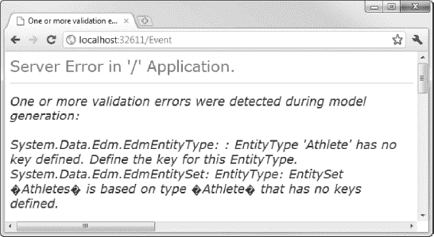

***图 31-1。**实体框架无法推断出密钥时显示的错误信息*

这是我拍脑门回去加`Key`属性的瞬间。

[清单 31-3](#list_31_3) 显示了`EventType`类，它代表了`EventTypes`数据库表中的行。

***清单 31-3。**事件类型类*

`using System.ComponentModel.DataAnnotations;

namespace TriathlonApp.Models.Domain {
    public class EventType {

        [Key]
        public string Name { get; set; }
        public float SwimMiles { get; set; }
        public float CycleMiles { get; set; }
        public float RunMiles { get; set; }
    }
}`

同样，实体框架将不能推断这个模型类型中的键属性，所以我已经应用了`Key`属性。[清单 31-4](#list_31_4) 显示了`ReferenceTime`类，它表示来自`ReferenceTimes`数据库表的行。

***清单 31-4。**reference time 类*

`using System;

namespace TriathlonApp.Models.Domain {
    public class ReferenceTime {` `        public int ID { get; set; }
        public int OverallPos { get; set; }
        public TimeSpan OverallTime { get; set; }
        public int SwimPos { get; set; }
        public TimeSpan SwimTime { get; set; }
        public int CyclePos { get; set; }
        public TimeSpan CycleTime { get; set; }
        public int RunPos { get; set; }
        public TimeSpan RunTime { get; set; }
        public string Type { get; set; }
    }
}`

我们将使用的`TrainingData`数据库有几个计算排名的存储过程。在[第 8 章](08.html#ch8)中，我向你展示了如何在使用实体框架创建数据模型时导入这些过程。我将在这个应用程序中使用的代码优先的方法(也是我在[第 24 章](24.html#ch24)中向你展示的方法)不支持存储过程。当我们在本章后面创建存储库时，我将回到这个问题。不过，目前我需要定义一个表示排名的类。清单 31-5 显示了`RankingSet`类。

***清单 31-5。**RankingSet 类*

`namespace TriathlonApp.Models.Domain {
    public class RankingSet {
        public int SwimRank { get; set; }
        public int CycleRank { get; set; }
        public int RunRank { get; set; }
        public int OverallRank { get; set; }
        public int RankCount { get; set; }
    }
}`

从这些类中可以看出，我们的模型非常简单。我没有定义任何导航属性，这意味着每个类都是独立的。唯一的新概念是`Key`属性的应用，这是使用实体框架时相对常见的问题。

### 创建和实现存储库

既然我们已经定义了域模型类，我们可以继续到存储库。我已经添加了文件夹`Models/Domain/Repository`，在其中我创建了一个新的接口`IRepository`，如[清单 31-6](#list_31_6) 所示。

***清单 31-6。**电子仓库界面*

`using System.Collections.Generic;

namespace TriathlonApp.Models.Domain.Repository {

    public interface IRepository {` `        IEnumerable<Event> Events { get; }
        void SaveEvent(Event ev);

        IEnumerable<EventType> EventTypes { get; }
        IEnumerable<ReferenceTime> ReferenceTimes { get; }
        IEnumerable<Athlete> Athletes { get; }

        **RankingSet GetPersonalRank(Event ev);**
        **RankingSet GetReferenceRank(Event ev);**
    }
}`

我已经定义了返回不同域模型类的枚举的属性。在这个应用程序中，我只需要在`Events`表中创建新记录，这就是为什么`SaveEvent`方法是这个接口中唯一的同类方法。我用粗体标记了`GetPersonalRank`和`GetReferenceRank`方法。这些方法对应于数据库中定义的存储过程。

#### 实施知识库

我将按照我在[第 24 章](24.html#ch24)中展示的模式来实现这个库。[清单 31-7](#list_31_7) 显示了`EFAdpater`类(从`DbContext`派生而来，是实体框架的入口点)和`EFRepository`(是`IRepository`接口的实现)。

***清单 31-7。**e adapter 和 EfRepository 类*

`using System.Collections.Generic;
using System.Data.Entity;
using System.Linq;

namespace TriathlonApp.Models.Domain.Repository {

    public class EFAdapter : DbContext {

        public EFAdapter(string connectionName)
            : base(connectionName) {
            // do nothing
        }

        public DbSet<Athlete> Athletes { get; set; }
        public DbSet<Event> Events { get; set; }
        public DbSet<EventType> EventTypes { get; set; }
        public DbSet<ReferenceTime> ReferenceTimes { get; set; }
    }

    public class EFRepository : IRepository {
        private EFAdapter adapter = new EFAdapter("EFRepository");` `public IEnumerable<Event> Events {
            get { return adapter.Events; }
        }

        public void SaveEvent(Event ev) {
            if (ev.ID == 0) {
                adapter.Events.Add(ev);
            }
            adapter.SaveChanges();
        }

        public IEnumerable<EventType> EventTypes {
            get { return adapter.EventTypes; }
        }

        public IEnumerable<ReferenceTime> ReferenceTimes {
            get { return adapter.ReferenceTimes; }
        }

        public IEnumerable<Athlete> Athletes {
            get { return adapter.Athletes; }
        }

        public RankingSet GetPersonalRank(Event ev) {

            IEnumerable<Event> interimResults = adapter.Events
                .Where(x => x.Athlete == ev.Athlete && x.Type == ev.Type);

            return new RankingSet {
                SwimRank = interimResults.Count(x => x.SwimTime <= ev.SwimTime),
                CycleRank = interimResults.Count(x => x.CycleTime <= ev.CycleTime),
                RunRank = interimResults.Count(x => x.RunTime <= ev.RunTime),
                OverallRank = interimResults.Count(x => x.OverallTime <= ev.OverallTime),
                RankCount = interimResults.Count()
            };
        }

        public RankingSet GetReferenceRank(Event ev) {

            IEnumerable<ReferenceTime> interimResults = adapter.ReferenceTimes
                .Where(x => x.Type == ev.Type);

            return new RankingSet {
                SwimRank = interimResults
                            .Where(x => x.SwimTime >= ev.SwimTime).Min(x => x.SwimPos),
                CycleRank = interimResults
                             .Where(x => x.CycleTime >= ev.CycleTime).Min(x => x.CyclePos),
                RunRank = interimResults
                            .Where(x => x.RunTime >= ev.RunTime).Min(x => x.RunPos),` `                OverallRank = interimResults
                            .Where(x => x.OverallTime >= ev.OverallTime)
                            .Min(x => x.OverallPos),
                RankCount = interimResults.Count()
            };
        }
    }
}`

这种使用实体框架的方法不能方便地访问数据库中的存储过程。有几种方法可以解决这个问题。首先，我们可以生成一个实体框架数据模型，并将存储过程导入到模型中，正如我们在第 8 章中所做的那样。这为我们提供了一种访问存储过程的好方法，但也意味着我们的域模型类是由实体框架生成的。这是一种折衷，因为从实体框架中切换出来会涉及到更改域模型类。

另一种方法是使用 SQL 执行存储过程。`DbContext`类有一个`Database`属性，通过它我们可以执行 SQL 查询。我不喜欢这种方式。我喜欢使用实体框架的原因之一是，我可以避免将 SQL 放到我的应用程序中，而是使用 LINQ。

第三种方法在实际项目中最没有吸引力，但最适合我的示例应用程序。我完全忽略了存储过程，将它们复制为一组 LINQ 查询。我选择这种方法是因为它是最简单的，而且我想把重点放在 MVC 框架上，但是它会为数据库产生大量额外的工作，这在实际项目中是不可取的。

#### 定义连接字符串

我们需要告诉实体框架如何连接到数据库。[清单 31-8](#list_31_8) 显示了对`Web.config`文件的添加，这与我在第 24 章中使用的[连接字符串相同。](24.html#ch24)

***清单 31-8。**数据库连接字符串*

`<configuration>
...
**<connectionStrings>**
**    <add name="EFRepository" connectionString="Data Source=TITAN\SQLEXPRESS;Initial**
**        Catalog=TrainingData;Persist Security Info=True;User ID=adam;Password=adam;**
**        MultipleActiveResultSets=true" providerName="System.Data.SqlClient"/>**
**  </connectionStrings>  **
...
</configuration>`

此连接字符串在我的数据库服务器`Titan`上的 SQL Server Express 安装上运行。参见[第 24 章](24.html#ch24)了解如何找出您的环境所需的连接字符串的细节。

### 设置依赖注入

我们希望能够使用`IRepository`接口，而不需要知道实现类的任何细节。我将通过使用依赖注入来做到这一点，就像我在第 23 章和第 24 章中所做的一样。

首先，我添加了对 Ninject 程序集的引用。这是我以前使用过的同一个程序集，我将它包含在本书的源代码下载中。接下来，我在名为`Infrastructure`的文件夹中创建了一个名为`CustomDependencyResolver`的类。[清单 31-9](#list_31_9) 展示了这个类。

***清单 31-9。**CustomDependencyResolver 类*

`using System;
using System.Collections.Generic;
using System.Web.Mvc;
using Ninject;
using Ninject.Syntax;
using TriathlonApp.Models.Domain.Repository;

namespace TriathlonApp.Infrastructure {
    public class CustomDependencyResolver : IDependencyResolver {
        private IKernel ninjectKernel;

        public CustomDependencyResolver() {
            ninjectKernel = new StandardKernel();
            AddDefaultBindings();
        }

        public object GetService(Type serviceType) {
            return ninjectKernel.TryGet(serviceType);
        }

        public IEnumerable<object> GetServices(Type serviceType) {
            return ninjectKernel.GetAll(serviceType);
        }

        public IBindingToSyntax<T> Bind<T>() {
            return ninjectKernel.Bind<T>();
        }

        private void AddDefaultBindings() {
            **Bind<IRepository>().To<EFRepository>();**
        }
    }
}`

这是我在[第 23 章](23.html#ch23)中使用的同一个依赖解析器，更新了这个项目的名称空间。我已经添加了一个绑定，以粗体显示，它使`EFRepository`类成为将用于服务对`IRepository`接口的请求的实现。

设置依赖注入的最后一步是在`Global.asax`中向 MVC 框架注册`CustomDependencyResolver`类，如[清单 31-10](#list_31_10) 所示。

***清单 31-10。**向 MVC 框架注册依赖解析器类*

`using System.Web.Mvc;
using System.Web.Routing;
using TriathlonApp.Infrastructure;

namespace TriathlonApp {

    public class MvcApplication : System.Web.HttpApplication {
        public static void RegisterGlobalFilters(GlobalFilterCollection filters) {
            filters.Add(new HandleErrorAttribute());
        }

        public static void RegisterRoutes(RouteCollection routes) {
            routes.IgnoreRoute("{resource}.axd/{*pathInfo}");

            routes.MapRoute(
                "Default",
                "{controller}/{action}/{id}",
                new { controller = "Home", action = "Index", id = UrlParameter.Optional }
            );
        }

        protected void Application_Start() {
            AreaRegistration.RegisterAllAreas();

            **DependencyResolver.SetResolver(new CustomDependencyResolver());**

            RegisterGlobalFilters(GlobalFilters.Filters);
            RegisterRoutes(RouteTable.Routes);
        }
    }
}`

### 配置路由

应用程序的入口点是一个名为`Event`的控制器。这将为用户生成初始页面，显示来自数据库的事件数据。在开始创建控制器之前，我希望设置好路由，以便预期的入口点映射到应用程序的默认 URL。这意味着改变在没有指定控制器名称时使用的值，如清单 31-11 所示。

***清单 31-11。**改变路线中的默认控制器*

`using System.Web.Mvc;
using System.Web.Routing;
using TriathlonApp.Infrastructure;

namespace TriathlonApp {` `    public class MvcApplication : System.Web.HttpApplication {
        public static void RegisterGlobalFilters(GlobalFilterCollection filters) {
            filters.Add(new HandleErrorAttribute());
        }

        public static void RegisterRoutes(RouteCollection routes) {
            routes.IgnoreRoute("{resource}.axd/{*pathInfo}");

            routes.MapRoute(
                "Default",
                "{controller}/{action}/{id}",
                new { controller = **"Event"**, action = "Index", id = UrlParameter.Optional }
            );
        }

        protected void Application_Start() {
            AreaRegistration.RegisterAllAreas();

            DependencyResolver.SetResolver(new CustomDependencyResolver());

            RegisterGlobalFilters(GlobalFilters.Filters);
            RegisterRoutes(RouteTable.Routes);
        }
    }
}`

### 创建事件控制器

正如我提到的，`Event`控制器将是应用程序的入口点，所以我在`Controllers`项目文件夹中创建了一个名为`EventController`的新控制器类(参见[清单 31-12](#list_31_12) )。

***清单 31-12。**事件控制器类的初始版本*

`using System.Linq;
using System.Web.Mvc;
using TriathlonApp.Models.Domain;
using TriathlonApp.Models.Domain.Repository;

namespace TriathlonApp.Controllers {
    public class EventController : Controller {
        private IRepository repository;

        public EventController(IRepository repo) {
            repository = repo;
        }` `        public ActionResult Index() {
            return View();
        }
    }
}`

在具有共同外观的应用程序中，我喜欢尽早获得尽可能完整的布局，所以我倾向于创建一个非常简单的动作方法和相应的简单视图。我将它们用作占位符，这样我就可以在返回和向控制器添加功能之前编辑和呈现布局。您可以在[清单 31-13](#list_31_13) 中看到`Index.cshtml`视图的内容，它是我在`Views/Event`文件夹中创建的。

***清单 31-13。**事件控制器的 Index.cshtml 视图的初始版本*

`<h4>Content will go here</h4>`

这是一个非常简单的视图，但是我们现在已经可以启动应用程序，请求默认的 URL ( `/`)，并看到结果，如图 31-2 所示。

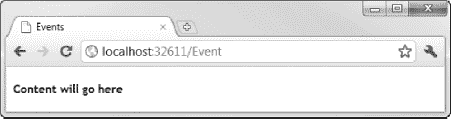

***图 31-2。**从骨骼控制器渲染骨骼视图*

目前，这个控制器和视图只是道具，所以我可以看到布局的效果，但我们很快就会回到它们，并添加一些有用的功能。

### 建筑布局

这个应用程序的布局非常简单；我们必须创建一个子动作来生成页脚，因为它依赖于从存储库中聚集的数据。但是，我们可以定义样式和静态内容。

#### 创建 CSS 样式

我在`Content`文件夹中创建了一个名为`Triathlon.css`的新样式表。这些是我在这个应用程序的以前版本中使用的相同样式。我不打算在这里列出它们，因为 CSS 很冗长，您可以从本书附带的源代码下载中获得这些样式。我已经在`_Layout.cshtml`文件中引用了新的样式表，如[清单 31-14](#list_31_14) 所示。这个文件在`Views/Shared`项目文件夹中，是我默认使用的视图。

***清单 31-14。**添加对样式表的引用*

`<!DOCTYPE html>
<html>
<head>
    <title>Triathlon Training Data</title>
    <link href="@Url.Content("~/Content/Site.css")" rel="stylesheet" type="text/css" />
    **<link href="@Url.Content("~/Content/Triathlon.css")" rel="stylesheet" type="text/css" />**
    <link href="@Url.Content("~/Content/jquery-ui-1.8.6.custom.css")" rel="stylesheet"
        type="text/css" />
    
    
    
    
    
</head>
<body>

    @RenderBody()

</body>
</html>`

我已经使用了`Url.Content`助手来生成将通过路由配置的 URL。我还利用这个机会添加了对我以后需要的脚本库的引用，这包括我在第 10 章中演示的自定义 jQuery 库。我还将自定义 jQuery 库、CSS 样式表和 jQuery 图像集添加到项目中。

我通常会更有选择性，例如，只在那些我知道需要的视图中添加验证库，但是为了简单起见，我在这里包含了所有的内容。最后，注意我已经为`title`元素定义了一个静态值。这意味着所有的视图将生成具有相同标题的页面，而不是通过`ViewBag`提供标题。

#### 添加页眉和页脚

清单 31-15 显示了我为定义页眉和页脚而对布局所做的添加，这为整个应用程序提供了一致的视觉主题。

***清单 31-15。**给布局添加页眉和页脚*

`<!DOCTYPE html>
<html>
<head>
    <title>Triathlon Training Data</title>
    <link href="@Url.Content("~/Content/Site.css")" rel="stylesheet" type="text/css" />` `    <link href="@Url.Content("~/Content/Triathlon.css")" rel="stylesheet" type="text/css" />
    <link href="@Url.Content("~/Content/jquery-ui-1.8.6.custom.css")" rel="stylesheet"
        type="text/css" />
    
    
    
    
    
</head>
<body>

**
**
**    
**
**        **
**        <h1>Triathlon Training Data</h1>**
**    
**

<div**>**

    @RenderBody()

**
**
**    <h2>@Html.Action("FooterMessage", "ChildActions")</h2>**
**
**

</body>
</html>`

这个应用程序的页脚包含数据库中数据的摘要，所以我使用了`Html.Action` helper 方法来调用一个子动作来生成摘要。我喜欢将应用程序中使用的子动作放在一个单独的控制器中。在这种情况下，我调用了控制器`ChildActions`，生成汇总数据的动作方法被称为`FooterMessage`。[清单 31-16](#list_31_16) 显示了`ChildActionsController`类。

***清单 31-16。**childactionscontroler 类*

`using System;
using System.Linq;
using System.Web.Mvc;
using TriathlonApp.Models.Domain;
using TriathlonApp.Models.Domain.Repository;` `namespace TriathlonApp.Controllers {
    public class ChildActionsController : Controller {
        private IRepository repository;

        public ChildActionsController(IRepository repo) {
            repository = repo;
        }

        [ChildActionOnly]
        public string FooterMessage() {

            float distance = repository.Events
                .GroupBy(x => x.Type)
                .Aggregate(0f, (sum, egroup) => {
                   EventType etype = repository.EventTypes.First(x => x.Name == egroup.Key);
                   return sum += egroup.Count() *
                       (etype.SwimMiles + etype.CycleMiles + etype.RunMiles);
                });

            TimeSpan time = repository.Events.Select(x => x.OverallTime)
                .Aggregate(TimeSpan.Zero, (total, newtime) => total.Add(newtime));

            return string.Format("{0} Events, {1:F1} Miles, {2} Hours and {3} Minutes",
                    repository.Events.Count(), distance, time.Hours, time.Minutes);
        }
    }
}`

`FooterMessage` action 方法用`ChildActionOnly`属性标记，以防止用户通过 URL 请求指向该方法。我只需要在这个子动作中生成一个简单的摘要，所以我选择了返回一个`string`，而不是一个局部视图。我用一对 LINQ 查询生成汇总数据，并使用复合字符串格式特性来创建结果。你可以在图 31-3 中看到这些增加的效果。

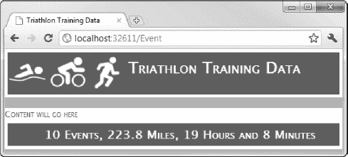

***图 31-3。**在布局中添加页眉和页脚*

#### 添加标签页

为了完成布局，我们需要添加选项卡，允许用户选择应用程序的不同区域。为此，我将使用 jQuery UI tabs 特性，但是我将添加一些额外的 JavaScript 来修改默认行为。我不认为我曾经使用过默认的 jQuery 标签行为。它从来没有完全符合我的要求，但是我喜欢 jQuery 的一点是它很容易进行调整。[清单 31-17](#list_31_17) 显示了带有标签的默认布局。

***清单 31-17。**给默认布局添加标签*

`<!DOCTYPE html>
<html>
<head>
    <title>Triathlon Training Data</title>
    <link href="@Url.Content("~/Content/Site.css")" rel="stylesheet" type="text/css" />
    <link href="@Url.Content("~/Content/Triathlon.css")" rel="stylesheet" type="text/css" />
    <link href="@Url.Content("~/Content/jquery-ui-1.8.6.custom.css")" rel="stylesheet"
        type="text/css" />
    
    
    
    
    

**    **
</head>
<body>` `

    

        
        <h1>Triathlon Training Data</h1>
    

**
**

**
**
**    <ul>**
**    <li><a id="Events" href="@Url.Action("Index", "Event")">Events</a> </li>**
**    <li><a id="Performance" href="@Url.Action("Index", "Performance")">Performance</a></li>**
**    <li><a id="Calculator" href="@Url.Action("Index", "Calculator")">Calculator</a></li>**
**    </ul>**
**    
**
**        @RenderBody()**
**    
**
**
**

    <h2>@Html.Action("FooterMessage", "ChildActions")</h2>

</body>
</html>`

有两个方面的变化；让我们以相反的顺序来看它们。带有`tabs`的`id`的`div`元素定义了布局将显示的一组选项卡。对于每个选项卡，我使用了`Url.Action`助手来生成一个 URL，该 URL 将指向控制器的`Index`方法。到目前为止，我们只创建了其中的一个控制器，但是我们将在本章的后面讨论其他的。注意，有一个嵌套的`div`元素，其`id`为`bodydiv`。这包含对`RenderBody`方法的调用，该方法将当前视图的内容插入到页面中。

我添加的`script`元素设置和配置选项卡。第一条语句找到当前选项卡的`a`元素(视图通过`ViewBag`提供)并设置`href`属性，这样选项卡将显示`bodydiv`元素，如下所示:

`$('#@ViewBag.TabName').attr('href', '#bodydiv');`

这意味着选项卡将显示页面中已经存在的内容。在配置选项卡时，我通过从视图中通过`ViewBag`传递的`id`值查找`a`元素的索引来设置选定的选项卡，如下所示:

`selected: $('#tabs ul li a').index($('#@ViewBag.TabName')),`

我覆盖了默认的选择行为，以便浏览器跟随指定的链接，而不是在当前页面中显示 URL 返回的内容。我想这样做，这样我就可以创建一个更常规的 MVC 框架应用程序。否则，其他控制器中的所有操作方法都将通过 Ajax 请求，并且必须生成局部视图。

Ajax 方法没有错，但是我不希望 jQuery UI 选项卡的设计驱动整个应用程序的形状。(我使用 JavaScript 进行操作，因此仍然支持非 JavaScript 浏览器。)在测试选项卡之前，我们必须对`Views/Event/Index.cshtml`视图进行调整，如[清单 31-18](#list_31_18) 所示。

***清单 31-18。**通过视图包将所需选项卡的名称传递给布局*

`@{
    ViewBag.TabName = "Events";
}

<h4>Content will go here</h4>`

当我创建允许用户创建、编辑或删除事件的页面时，这种方法会很有用。如果我们要忠实地重新创建这个应用程序的早期版本，这些应该出现在 Events 选项卡上。[图 31-4](#fig_31_4) 显示了选项卡的效果。但是，单击 Performance 和 Calculator 选项卡会显示一个错误，因为我们还没有创建这些选项卡所针对的控制器和动作方法。

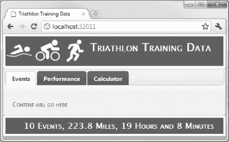

***图 31-4。**向布局添加标签*

### 构建事件选项卡

我们现在可以返回到`EventController`类，充实`Index`动作方法和相关的视图。我们的目标是显示一个带有链接的事件和排名信息表，以便用户可以编辑或删除现有记录或添加新记录。我们还需要允许用户过滤基于事件类型显示的事件集。

首先，我们需要一个视图模型对象。我想在单个对象中传递表中每一行所需的所有信息，这意味着我们需要一些东西来传达一个`Event`域模型对象和两个表示个人等级和参考等级的值。我创建了一个新文件夹`Models/View`，并添加了一个名为`EventAndRankSummary`的新类。清单 31-19 展示了这个类。

***清单 31-19。**EventAndRankSummary 视图模型类*

`using TriathlonApp.Models.Domain;

namespace TriathlonApp.Models.View {
    public class EventAndRankSummary {
        public Event Event { get; set; }
        public int PersonalRank {get; set;}
        public int ReferenceRank {get; set;}
    }
}`

我们可以开始在控制器中使用这个类。清单 31-20 展示了对`EventController`类的一些补充，以支持表格的呈现。

***清单 31-20。**增强 EventController 类*

`using System.Linq;
using System.Web.Mvc;
using TriathlonApp.Models.Domain.Repository;
using TriathlonApp.Models.View;

namespace TriathlonApp.Controllers {
    public class EventController : Controller {
        private IRepository repository;

        public EventController(IRepository repo) {
            repository = repo;
        }

        public ActionResult Index(string eventFilter = "All") {

            var selectedEvents = (eventFilter == "All" ? repository.Events
                : repository.Events.Where(x => x.Type == eventFilter))
                .Select(x =>
                    new EventAndRankSummary {
                        Event = x,
                        PersonalRank = repository.GetPersonalRank(x).OverallRank,
                        ReferenceRank = repository.GetReferenceRank(x).OverallRank
                });

            if (Request.IsAjaxRequest()) {
                return PartialView("EventsTable", selectedEvents);
            } else {
                ViewBag.EventTypes
                   = new string[] {"All"}.Concat(repository.EventTypes.Select(x => x.Name));
                return View(selectedEvents);
            }
        }
    }
}`

`Index`动作方法定义了一个可选参数，如果请求中没有提供值，该参数默认为`All`。我使用参数值过滤存储库中可用的`Event`对象，并将一系列`EventAndRankSummary`对象投射到`selectedEvents`变量中。(我通过调用 LINQ 查询的`select`子句中存储过程的替换来获取排名信息。我将再次掩饰这种方法的低效。)

当用户改变过滤器时，我将使用不引人注目的 Ajax 来更新表格的内容。我没有创建一个只返回局部视图的动作方法，而是使用了`Request.IsAjaxRequest`方法来确定动作方法的结果。对于常规请求，我返回`Index`视图，对于 Ajax 请求，我返回`EventsTable`局部视图。这两个视图都使用`EventAndRankSummary`对象的序列作为视图模型。除此之外，在呈现完整视图时，我通过`ViewBag`传递了用作过滤器的事件类型集。

#### 定义视图

我创建的第一个视图是`Views/Event/EventsTable.cshtml`，其内容如[清单 31-21](#list_31_21) 所示。这是局部视图，它呈现了包含来自`EventAndRankSummary`对象的数据值的`table`元素。

***清单 31-21。**多事之秋局部视图*

`@model IEnumerable<TriathlonApp.Models.View.EventAndRankSummary>

<table id="datatable" class="dataview" rules="cols">
    <tr>
        <th>Date</th>
        <th>Athlete</th>
        <th>Event Type</th>
        <th>Swim</th>
        <th>Cycle</th>
        <th>Run</th>
        <th>Overall</th>
        <th>Rank</th>
        <th>Ref Rank</th>
        <th>Edit</th>
        <th>Delete</th>
    </tr>

    @foreach (var item in Model) {
        <tr class="dataitem">
            <td>@item.Event.Date.ToString("MM/dd")</td>
            <td>@item.Event.Athlete</td>
            <td>@item.Event.Type</td>
            <td>@item.Event.SwimTime</td>
            <td>@item.Event.CycleTime</td>
            <td>@item.Event.RunTime</td>
            <td>@item.Event.OverallTime</td>
            <td>@item.PersonalRank</td>
            <td>@item.ReferenceRank</td>` `            <td>@Html.ActionLink("Edit", "Edit", new { id = item.Event.ID})</td>
            <td>@Html.ActionLink("Delete", "Delete", new { id = item.Event.ID})</td>
        </tr>
    }
</table>`

表格的最后两列包含允许用户编辑或删除行中显示的记录的链接。它们指向两个动作方法(`Edit`和`Delete`)，并使用可选的`id`路由变量(如[清单 31-11](#list_31_11) 所示)来传递所选事件的`ID`值，这样所请求的 URL 将具有如下形式，例如:

`/Event/Edit/9`

我们将稍后实现这些操作。`Views/Event/Index.cshtml`视图用于非 Ajax 请求，包括部分视图，如清单 31-22 中的[所示。](#list_31_22)

***清单 31-22。**索引视图*

`@model IEnumerable<TriathlonApp.Models.View.EventAndRankSummary>
@{
    ViewBag.TabName = "Events";
    AjaxOptions ajaxOpts = new AjaxOptions {
        UpdateTargetId = "datatable"  
    };
}

@Html.Partial("EventsTable", Model)

@using (Ajax.BeginForm(ajaxOpts)) {

    <table>
        <tr>
            <td>Event Type:</td>
            <td>@Html.DropDownList("EventFilter", new SelectList(ViewBag.EventTypes))</td>
            <td><input type="submit" value="Filter"/></td>
            <td>@Html.ActionLink("Add Event", "Add")</td>
        </tr>
    </table>
}`

这实际上是局部视图的超集。我呈现包含数据的`table`，并使用另一个`table`为事件类型过滤器创建一个简单的网格效果，一个提交按钮，以及一个到(尚未定义的)`Add`动作的链接，当用户想要添加一个新事件时，将单击该链接。我已经使用了`Ajax.BeginForm`助手来创建表单元素，但是我不需要在`AjaxOptions`对象中定义目标 URL，因为 Ajax 和常规请求使用了相同的操作方法。

通过启动应用程序并导航到默认的 URL，我们可以看到这些改变的效果，如图 31-5 所示。

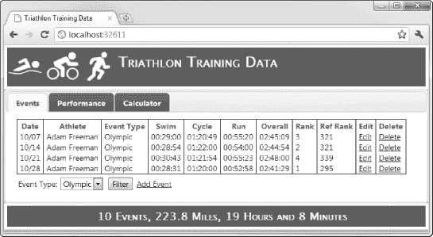

***图 31-5。**显示事件数据*

当用户从下拉列表中选择一个事件类型并单击 Filter 按钮时，Ajax 用于更新表格。对于非 JavaScript 浏览器来说，它的外观不太吸引人，如图 31-6 所示，但一切都还正常。但是，单击 Filter 按钮会导致浏览器加载一个新的 HTML 页面，而不仅仅是替换`table`元素。

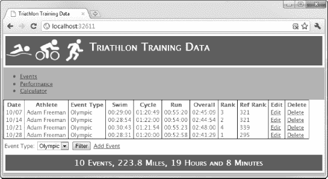

***图 31-6。**禁用 JavaScript 时显示事件数据*

#### 添加一些 jQuery 润色

我们可以使用我在第 10 章中展示的一些 jQuery 技术来改善支持 JavaScript 的浏览器的页面外观。[清单 31-23](#list_31_23) 显示了对`Views/Event/Index.cshtml`视图的添加。

***清单 31-23。**向视图添加 jQuery*

`@model IEnumerable<TriathlonApp.Models.View.EventAndRankSummary>
@{
    ViewBag.TabName = "Events";
    AjaxOptions ajaxOpts = new AjaxOptions {
        UpdateTargetId = "datatable",
        **OnSuccess = "PolishTable"**
    };
}
****

@Html.Partial("EventsTable", Model)

@using (Ajax.BeginForm(ajaxOpts)) {

    <table>
        <tr>
            <td>Event Type:</td>
            <td>@Html.DropDownList("EventFilter", new SelectList(ViewBag.EventTypes))</td>
            <td><input **id="filterSubmit"** type="submit" value="Filter"/></td>
            <td>@Html.ActionLink("Add Event", "Add", **null, new { id = "AddLink" }**)</td>
        </tr>
    </table>
}`

`PolishTable`函数使用 jQuery UI 按钮特性将编辑和删除事件的链接转换成按钮。这个函数由不引人注目的 Ajax `OnSuccess`回调函数调用，在我添加的另一个函数中，这个函数在文档加载时被调用。除了调用`PolishTable`，该函数还将添加事件链接改为按钮，隐藏`submit`元素，并注册一个事件回调，当从下拉菜单中选择一个新值时，该回调将表单发送到服务器。你可以在[图 31-7](#fig_31_7) 中看到这个脚本的效果。

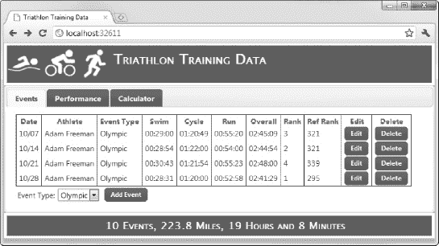

***图 31-7。**添加一些 jQuery 来润色页面的外观*

### 构建添加事件功能

用户可以通过单击 Add Event 按钮向数据库添加新事件。在我们实现这个按钮所针对的动作方法之前，我将为`Event`模型类添加一些验证和显示属性，如[清单 31-24](#list_31_24) 所示。

***清单 31-24。**向事件域模型类添加显示和验证属性*

`using System;
using System.ComponentModel.DataAnnotations;
using System.Web.Mvc;

namespace TriathlonApp.Models.Domain {
    public class Event {

        **[HiddenInput(DisplayValue=false)]**
        public int ID { get; set; }
        **[DataType(DataType.Date)]**
        public DateTime Date { get; set; }
        **[Required]**
        public string Athlete { get; set; }
        public string Type { get; set; }` `        **[Required]**
        public TimeSpan SwimTime { get; set; }
        **[Required]**
        public TimeSpan CycleTime { get; set; }
        **[Required]**
        public TimeSpan RunTime { get; set; }
        **[HiddenInput(DisplayValue=true)]**
        public TimeSpan OverallTime { get; set; }
    }
}`

我在第 26 章和第 29 章中解释了这些属性的含义。下一步是给控制器添加动作方法，你可以在[清单 31-25](#list_31_25) 中看到。

***清单 31-25。**执行添加动作*

`using System;
using System.Linq;
using System.Web.Mvc;
using TriathlonApp.Models.Domain;
using TriathlonApp.Models.Domain.Repository;
using TriathlonApp.Models.View;

namespace TriathlonApp.Controllers {
    public class EventController : Controller {
        private IRepository repository;

*        ...constructor and Index action omitted for brevity...*

**        public ActionResult Add() {**
**            ViewBag.EventTypes = repository.EventTypes.Select(x => x.Name);**
**            ViewBag.Athletes = repository.Athletes.Select(x => x.Name);**
**            return View(new Event { Date = DateTime.Now });**
**        }**

**        [HttpPost]**
**        public ActionResult Add(Event ev) {**

**            ValidateEvent(ev);**

**            if (ModelState.IsValid) {**
**                ev.OverallTime = ev.SwimTime + ev.CycleTime + ev.RunTime;**
**                repository.SaveEvent(ev);**
**                return RedirectToAction("Index");**
**            } else {**
**                ViewBag.EventTypes = repository.EventTypes.Select(x => x.Name);**
**                ViewBag.Athletes = repository.Athletes.Select(x => x.Name);**
**                return View(ev);**
**            }**
**        }**` `        private void ValidateEvent(Event ev) {
            if (ModelState.IsValidField("SwimTime") && ev.SwimTime == TimeSpan.Zero) {
                ModelState.AddModelError("SwimTime", "Enter a time");
            }
            if (ModelState.IsValidField("CycleTime") && ev.CycleTime == TimeSpan.Zero) {
                ModelState.AddModelError("CycleTime", "Enter a time");
            }
            if (ModelState.IsValidField("RunTime") && ev.RunTime == TimeSpan.Zero) {
                ModelState.AddModelError("RunTime", "Enter a time");
            }
        }
    }
}`

第一个`Add`方法不带参数，用于服务`GET`请求。使用`ViewBag`将注册运动员和事件类型的详细信息传递给视图，并创建一个新的`Event`对象作为视图模型对象。这允许我将当前日期传递给视图。

第二个`Add`方法用于处理`POST`请求，并依赖模型绑定来接收一个`Event`参数。如果任何单个活动时间为零，我使用模型验证向用户报告错误。如果没有模型错误，我将新的`Event`对象保存到存储库中，并将用户重定向到`Index`动作。如果有模型错误，那么我重新显示`Event`对象，以便向用户显示验证消息。[清单 31-26](#list_31_26) 显示了`Views/Event/Add.cshtml`视图，由 action 方法的两个重载使用。

***清单 31-26。**添加视图*

`@model TriathlonApp.Models.Domain.Event

@{
    ViewBag.TabName = "Events";
}

<h2>Add New Event</h2>

@using (Html.BeginForm()) {

    @Html.Partial("EventEditor", Model);
}`

这很简单。大多数艰难的工作都是在`EventEditor`局部视图中完成的。我在`Views/Shared`文件夹中创建了`EventEditor.cshtml`。我们将在稍后实现编辑特性时使用它。唯一值得注意的是这个视图中的小脚本将`submit`元素的值属性更改为`Add`。这将定制当前任务的局部视图中的通用提交按钮，但仍然允许我在非 JavaScript 浏览器中使用该视图。[清单 31-27](#list_31_27) 显示了`EventEditor`分部方法的内容。

***清单 31-27。**event editor 局部视图*

`@model TriathlonApp.Models.Domain.Event

@Html.HiddenFor(x => x.ID)

<table id="eventtable">
    <tr><th>Date:</th>
        <td>@Html.EditorFor(x => x.Date)</td>
        <td>@Html.ValidationMessageFor(x => x.Date)</td></tr>
    <tr><th>Athlete:</th>
        <td>@Html.DropDownList("Athlete", new SelectList(ViewBag.Athletes))</td>
        <td> @Html.ValidationMessageFor(x => x.Athlete)</td></tr>
    <tr><th>Event Type:</th>
        <td>@Html.DropDownList("Type", new SelectList(ViewBag.EventTypes))</td>
        <td> @Html.ValidationMessageFor(x => x.Type)</td></tr>
    <tr><th>Swim Time:</th>
        <td>@Html.EditorFor(x => x.SwimTime)</td>
        <td> @Html.ValidationMessageFor(x => x.SwimTime)</td></tr>
    <tr><th>CycleTime:</th>
        <td>@Html.EditorFor(x => x.CycleTime)</td>
        <td>@Html.ValidationMessageFor(x => x.CycleTime)</td></tr>
    <tr><th>Run Time:</th>
        <td>@Html.EditorFor(x => x.RunTime)</td>
        <td>@Html.ValidationMessageFor(x => x.RunTime)</td></tr>
    <tr style="text-align:center">
        <th colspan="2">
            <input type="submit" value="Submit" />
            @Html.ActionLink("Cancel", "Index", null, new {id = "cancellink"})
        </th>
    </tr>
</table>`

这个局部视图的主要部分创建了一个表格，为`Event`视图模型对象的属性提供一组标签、编辑器和验证消息周围的网格结构。`Athlete`和`Type`参数由下拉列表表示。我已经为这个视图添加了一个小脚本。下面是第一个声明:

`$(':submit, #cancellink').button();`

该语句选择了我在表格底部添加的`input`元素和 link 元素，并将它们转换成按钮。这些允许用户提交表单或返回到`Index`动作。第二个声明如下:

`$('#eventtable select, #eventtable td input').width("150");`

该语句将表格中的`select`和`input`元素设置为相似的大小。最后一条语句在`Date`属性编辑器上启用 jQuery UI 日期选择器:

`$('#Date').datepicker();`

我在第 10 章给你看了日期选择器。然而，我在这个视图中使用了所有的默认设置，因为我们使用的布局更简单。你可以在[图 31-8](#fig_31_8) 中看到渲染图。

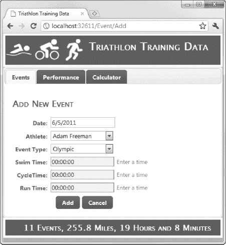

***图 31-8。**向数据库添加新事件*

在本章的前面，我在布局中添加了不引人注目的验证库，这意味着我使用属性定义的验证将在客户端和服务器端强制执行。在图中可以看到，对零时间的检查是在 action 方法中执行的，因此直到用户单击 Add 按钮并提交表单时才会应用。

### 构建编辑特征

既然我们已经有了应用程序的主要结构，那么添加编辑事件的功能就很简单了。[清单 31-28](#list_31_28) 显示了在`EventController`类中定义的`Edit`动作方法。

***清单 31-28。**执行编辑动作*

`using System;
using System.Linq;
using System.Web.Mvc;
using TriathlonApp.Models.Domain;
using TriathlonApp.Models.Domain.Repository;
using TriathlonApp.Models.View;

namespace TriathlonApp.Controllers {
    public class EventController : Controller {
        private IRepository repository;

        ...constructor, Index and Add actions omitted for brevity...

        **public ActionResult Edit(int id) {**
**            ViewBag.EventTypes = repository.EventTypes.Select(x => x.Name);**
**            ViewBag.Athletes = repository.Athletes.Select(x => x.Name);**
**            Event ev = repository.Events.Where(x => x.ID == id).FirstOrDefault();**
**            if (ev.ID > 0) {**
**                return View(ev);**
**            } else {**
**                return RedirectToAction("Index");**
**            }**
**        }**

**        [HttpPost]**
**        public ActionResult Edit(Event ev) {**
**            ValidateEvent(ev);**
**            if (ModelState.IsValid) {**
**                ev.OverallTime = ev.SwimTime + ev.CycleTime + ev.RunTime;**
**                repository.SaveEvent(ev);**
**                return RedirectToAction("Index");**
**            } else {**
**                return View(ev);**
**            }**
        **}**

        private void ValidateEvent(Event ev) {
            if (ModelState.IsValidField("SwimTime") && ev.SwimTime == TimeSpan.Zero) {
                ModelState.AddModelError("SwimTime", "Enter a time");
            }
            if (ModelState.IsValidField("CycleTime") && ev.CycleTime == TimeSpan.Zero) {
                ModelState.AddModelError("CycleTime", "Enter a time");
            }` `            if (ModelState.IsValidField("RunTime") && ev.RunTime == TimeSpan.Zero) {
                ModelState.AddModelError("RunTime", "Enter a time");
            }
        }
    }
}`

`Edit`方法的第一个重载接受一个与可选的`id`路由变量相对应的`int`参数。我用它来检索用户想要的`Event`对象，并将其作为视图模型对象传递给默认视图。如果没有具有指定 ID 的`Event`对象，我将用户重定向回`Index`动作。

`Edit`方法的第二个重载用于`POST`请求。它以与`Add`动作相同的方式执行验证，为`OverallTime`属性生成值，并在将用户重定向到`Index`动作之前使用存储库存储修改后的事件。[清单 31-29](#list_31_29) 显示了在`Views/Event`文件夹中创建的`Edit.cshtml`视图。

***清单 31-29。**编辑视图*

`@model TriathlonApp.Models.Domain.Event

@{
    ViewBag.TabName = "Events";
}

<h2>**Edt an Event**</h2>

@using (Html.BeginForm()) {

    @Html.Partial("EventEditor", Model);
}`

这是在`Add`视图上的一个小变化，有一些反映当前任务的小变化。这个视图生成的大部分 HTML 来自于`EventEditor`部分视图。

#### 修复知识库

在编辑功能工作之前，我们必须修复存储库中的一个小问题。这是我们在[第 29 章](29.html#ch29)中查看模型绑定时遇到的相同问题。MVC 框架创建一个`Event`对象，并使用模型绑定为对象的属性赋值。不幸的是，实体框架对 MVC 框架创建的对象一无所知，也检测不到用户所做的更改。为了解决这个问题，我对[清单 31-30](#list_31_30) 中所示的存储库实现中的`SaveEvent`方法进行了修改。

***清单 31-30。**在存储库实现中强制变更检测*

`...
public void SaveEvent(Event ev) {
    if (ev.ID == 0) {
        adapter.Events.Add(ev);
**    } else {**
**        Event rev = Events.Where(x => x.ID == ev.ID).FirstOrDefault();**
**        if (rev.ID > 0) {**
**            rev.Date = ev.Date;**
**            rev.Athlete = ev.Athlete;**
**            rev.Type = ev.Type;**
**            rev.SwimTime = ev.SwimTime;**
**            rev.CycleTime = ev.CycleTime;**
**            rev.RunTime = ev.RunTime;**
**            rev.OverallTime = ev.OverallTime;**
**        }**
    }
    adapter.SaveChanges();
}
...`

这些改变定位实体框架*知道的`Event`对象，并从 MVC 框架创建的二重身中复制属性值。这使得实体框架检测到用户所做的更改，这样对`SaveChanges`的后续调用将正确地更新数据库。*

### 构建删除功能

在实现删除操作之前，我们必须更新存储库，以便它支持删除事件对象。清单 31-31 显示了`IRepository`接口所需的修改。

***清单 31-31。**向 IRepository 接口添加删除方法*

`using System.Collections.Generic;

namespace TriathlonApp.Models.Domain.Repository {

    public interface IRepository {

        IEnumerable<Event> Events { get; }
        void SaveEvent(Event ev);
        **void DeleteEvent(Event ev);**

        IEnumerable<EventType> EventTypes { get; }
        IEnumerable<ReferenceTime> ReferenceTimes { get; }
        IEnumerable<Athlete> Athletes { get; }` `        RankingSet GetPersonalRank(Event ev);
        RankingSet GetReferenceRank(Event ev);
    }
}`

我添加了一个定义参数的`DeleteEvent`，就是要删除的`Event`。[清单 31-32](#list_31_32) 展示了实现中相应的方法。

***清单 31-32。**在存储库实现中实现删除方法*

`using System.Collections.Generic;
using System.Data.Entity;
using System.Linq;

namespace TriathlonApp.Models.Domain.Repository {

    public class EFRepository : IRepository {
        private EFAdapter adapter = new EFAdapter("EFRepository");

        public IEnumerable<Event> Events {
            get { return adapter.Events; }
        }

        public void SaveEvent(Event ev) {
            if (ev.ID == 0) {
                adapter.Events.Add(ev);
            } else {
                Event rev = Events.Where(x => x.ID == ev.ID).FirstOrDefault();
                if (rev.ID > 0) {
                    rev.Date = ev.Date;
                    rev.Athlete = ev.Athlete;
                    rev.Type = ev.Type;
                    rev.SwimTime = ev.SwimTime;
                    rev.CycleTime = ev.CycleTime;
                    rev.RunTime = ev.RunTime;
                    rev.OverallTime = ev.OverallTime;
                }
            }
            adapter.SaveChanges();
        }

**        public void DeleteEvent(Event ev) {**
**            Event rev = Events.Where(x => x.ID == ev.ID).FirstOrDefault();**
**            if (rev.ID > 0) {**
**                adapter.Events.Remove(rev);**
**                adapter.SaveChanges();**
**            }**
**        }**` `*        ...methods omitted for brevity...*

    }
}`

我们必须在`DeleteEvent`方法中采取与`SaveEvent`相同的预防措施。MVC 框架模型绑定过程创建的`Event`对象对于实体框架是未知的，因此我们必须从数据库中检索一个匹配的`Event`对象，然后将它传递给适配器的`Events`属性的`Remove`方法。现在我们已经添加了从存储库中删除事件的支持，我们可以实现`Delete`动作，如[清单 31-33](#list_31_33) 所示。

***清单 31-33。**实现删除动作方法*

`using System;
using System.Linq;
using System.Web.Mvc;
using TriathlonApp.Models.Domain;
using TriathlonApp.Models.Domain.Repository;
using TriathlonApp.Models.View;

namespace TriathlonApp.Controllers {
    public class EventController : Controller {
        private IRepository repository;

*        ...constructor and other methods omitted for brevity...*

        **public ActionResult Delete(int id) {**
**            Event ev = repository.Events.Where(x => x.ID == id).FirstOrDefault();**
**            if (ev.ID > 0) {**
**                return View(ev);**
**            } else {**
**                return RedirectToAction("Index");**
**            }**
**        }**

**        [HttpPost]**
**        public ActionResult Delete(Event ev) {**
**            repository.DeleteEvent(ev);**
**            return RedirectToAction("Index");**
        }
    }
}`

第一个`Delete`方法处理`GET`请求，并使用`id`参数从存储库中检索一个`Event`对象，该参数对应于`id`路由变量。该对象被传递到默认视图进行渲染。第二个`Delete`方法处理`POST`请求并调用存储库中的`DeleteEvent`方法，然后将用户重定向到`Index`动作。我在`Views/Event`文件夹中创建了`Delete.cshtml`视图，清单 31-34 显示了其中的内容。

***清单 31-34。**删除视图*

`@model TriathlonApp.Models.Domain.Event

@{
    ViewBag.TabName = "Events";
}

<h2>Delete Event</h2>

@using (Html.BeginForm()) {
    @Html.HiddenFor(x => x.ID)
    <table id="eventtable">
        <tr><th>Date:</th><td>@Html.DisplayFor(x => x.Date)</td></tr>
        <tr><th>Athlete:</th><td>@Html.DisplayFor(x => x.Athlete)</td></tr>
        <tr><th>Event Type:</th><td>@Html.DisplayFor(x => x.Type)</td></tr>
        <tr><th>Swim Time:</th><td>@Html.DisplayFor(x => x.SwimTime)</td></tr>
        <tr><th>CycleTime:</th><td>@Html.DisplayFor(x => x.CycleTime)</td></tr>
        <tr><th>Run Time:</th><td>@Html.DisplayFor(x => x.RunTime)</td></tr>
          <tr><th>Overall Time:</th><td>@Html.DisplayFor(x => x.OverallTime)</td></tr>
        <tr style="text-align:center">
            <th colspan="2">
                <input type="submit" value="Delete" />
                @Html.ActionLink("Cancel", "Index", null, new { id = "cancellink" })
            </th>
        </tr>
    </table>
}`

该视图为用户提供了`Event`的只读视图，以及删除或取消并返回事件列表的选项。这个视图与我们用来添加和编辑事件的视图非常相似。

### 构建性能选项卡

“成绩”选项卡显示所选运动员在每种赛事类型中的最佳成绩。为了更容易地将这些信息从控制器传递到视图，我定义了几个视图模型类，如清单 31-35 所示。我在`Models/View`文件夹中创建了这些类。

***清单 31-35。**查看性能选项卡中使用的模型类别*

`using System;
using TriathlonApp.Models.Domain;

namespace TriathlonApp.Models.View {` `    public class PerformanceSummary {
        public string Athlete { get; set; }
        public RankingSet SprintRanks { get; set; }
        public TimeSet SprintTimes { get; set; }
        public RankingSet OlympicRanks { get; set; }
        public TimeSet OlympicTimes { get; set; }
    }

    public class TimeSet {
        public TimeSpan SwimTime { get; set; }
        public TimeSpan CycleTime { get; set; }
        public TimeSpan RunTime { get; set; }
        public TimeSpan OverallTime { get; set; }
    }
}`

这些类是表示选项卡中所需数据的属性集合。注意，我使用了`RankingSet`域模型类来避免创建两个具有相同数据值的类。下一步是创建并实现`PerformanceController`类，如[清单 31-36](#list_31_36) 所示。

***清单 31-36。**性能控制器类*

`using System;
using System.Collections.Generic;
using System.Linq;
using System.Web.Mvc;
using TriathlonApp.Models.Domain;
using TriathlonApp.Models.Domain.Repository;
using TriathlonApp.Models.View;

namespace TriathlonApp.Controllers {
    public class PerformanceController : Controller {
        private IRepository repository;

        public PerformanceController(IRepository repo) {
            repository = repo;   
        }

        public ActionResult Index(string athlete) {

            if (string.IsNullOrEmpty(athlete)) {
                athlete = repository.Athletes.First().Name;
            }

            PerformanceSummary data = new PerformanceSummary {
                Athlete = athlete,
                SprintTimes = GetTimeData(athlete, "Sprint"),
                OlympicTimes = GetTimeData(athlete, "Olympic")
            };

            data.OlympicRanks = GetRankData("Olympic", data.OlympicTimes);
            data.SprintRanks = GetRankData("Sprint", data.SprintTimes);

            ViewBag.Athletes = repository.Athletes.Select(x => x.Name);

            if (Request.IsAjaxRequest()) {
                return PartialView("PerformanceTable", data);
            } else {
                return View(data);
            }
        }

        private TimeSet GetTimeData(string athlete, string eventType) {

            TimeSet result = new TimeSet();

            IEnumerable<Event> events = repository.Events
                .Where(x => x.Athlete == athlete && x.Type == eventType);

            if (events.Count() > 0) {
                result.SwimTime = events.Min(x => x.SwimTime);
                result.CycleTime = events.Min(x => x.CycleTime);
                result.RunTime = events.Min(x => x.RunTime);
                result.OverallTime = events.Min(x => x.OverallTime);
            }

            return result;
        }

        private RankingSet GetRankData(string eventType, TimeSet times) {

            if (times.SwimTime == TimeSpan.Zero || times.CycleTime == TimeSpan.Zero
                || times.RunTime == TimeSpan.Zero || times.OverallTime == TimeSpan.Zero) {
                return new RankingSet();
            } else {
                return repository.GetReferenceRank(new Event {
                    Type = eventType,
                    SwimTime = times.SwimTime,
                    CycleTime = times.CycleTime,
                    RunTime = times.RunTime,
                    OverallTime = times.OverallTime
                });
            }
        }
    }
}`

我在控制器中只定义了一个动作方法。它将处理`GET`和`POST`请求。当收到 Ajax 请求时，它将呈现一个名为`PerformanceTable`的局部视图，否则将呈现一个名为`Index`的视图。`GetTimeData`和`GetRankData`方法获取显示所需的时间和等级数据，并由`Index`方法用来填充`PerformanceSummary`对象，该对象在局部视图和完整视图中都用作视图模型对象。[清单 31-37](#list_31_37) 显示了`PerformanceTable`的局部视图。我在`Views/Performance`文件夹中创建了这个视图。

***清单 31-37。**性能表局部视图*

`@model TriathlonApp.Models.View.PerformanceSummary

@helper FormatTime(TimeSpan time) {
    if (time == TimeSpan.Zero) {
        @:---
    } else {
        @time
    }
}

@helper FormatRank(int rank) {
    if (rank == 0) {
        @:---
    } else {
        @rank
    }
}

<table class="centerTable">
    <colgroup><col /><col width="100px" /><col /><col width="40px" /></colgroup>
    <tr><th colspan="4">Sprint Results</th></tr>
    <tr>
        <td>Best Swim Time:</td><td>@FormatTime(Model.SprintTimes.SwimTime)</td>
        <td>Best Swim Rank:</td><td>@FormatRank(Model.SprintRanks.SwimRank)</td>
    </tr>
    <tr>
        <td>Best Cycle Time:</td><td>@FormatTime(Model.SprintTimes.CycleTime)</td>
        <td>Best Cycle Rank:</td><td>@FormatRank(Model.SprintRanks.CycleRank)</td>
    </tr>
    <tr>
        <td>Best Run Time:</td><td>@FormatTime(Model.SprintTimes.RunTime)</td>
        <td>Best Run Rank:</td><td>@FormatRank(Model.SprintRanks.RunRank)</td>
    </tr>
    <tr>
        <td>Best Overall Time:</td><td>@FormatTime(Model.SprintTimes.OverallTime)</td>
        <td>Best Overall Rank:</td><td>@FormatRank(Model.SprintRanks.OverallRank)</td>
    </tr>
</table>` `<table class="centerTable">
    <colgroup><col /><col width="100px" /><col /><col width="40px" /></colgroup>
    <tr><th colspan="4">Olympic Results</th></tr>
    <tr>
        <td>Best Swim Time:</td><td>@FormatTime(Model.OlympicTimes.SwimTime)</td>
        <td>Best Swim Rank:</td><td>@FormatRank(Model.OlympicRanks.SwimRank)</td>
    </tr>
    <tr>
        <td>Best Cycle Time:</td><td>@FormatTime(Model.OlympicTimes.CycleTime)</td>
        <td>Best Cycle Rank:</td><td>@FormatRank(Model.OlympicRanks.CycleRank)</td>
    </tr>
    <tr>
        <td>Best Run Time:</td><td>@FormatTime(Model.OlympicTimes.RunTime)</td>
        <td>Best Run Rank:</td><td>@FormatRank(Model.OlympicRanks.RunRank)</td>
    </tr>
    <tr>
        <td>Best Overall Time:</td><td>@FormatTime(Model.OlympicTimes.OverallTime)</td>
        <td>Best Overall Rank:</td><td>@FormatRank(Model.OlympicRanks.OverallRank)</td>
    </tr>
</table>`

这个视图创建了一对`table`元素，并用每种类型事件的时间和排名信息填充它们。我已经定义了几个内嵌助手(如[第 25 章](25.html#ch25)所述)，这样当选定的运动员没有记录任何特定事件类型的事件时，我可以创建一个有意义的显示。[清单 31-38](#list_31_38) 显示了`Views/Performance/Index.cshtml`视图。

***清单 31-38。**性能控制器的 Index.cshtml 视图*

`@model TriathlonApp.Models.View.PerformanceSummary

@{
    ViewBag.TabName = "Performance";
    AjaxOptions ajaxOpts = new AjaxOptions {
        UpdateTargetId = "dataElement"
    };
}

` `@using (Ajax.BeginForm(ajaxOpts)) {

    Athlete: @Html.DropDownList("athlete", new SelectList(ViewBag.Athletes, Model.Athlete))
    <input type="submit" value="Select" />

}

    @Html.Partial("PerformanceTable", Model)

`

这个视图首先指定它应该显示在 Performance 选项卡上，并定义一个我用来创建 Ajax 表单的`AjaxOptions`对象。我不必担心为非 JavaScript 客户机配置回退 URL，因为 action 方法将根据它接收的请求类型做出正确的响应。

用户可以使用下拉列表选择应该显示其表现数据的运动员，数据本身使用`PerformanceTable`局部视图呈现。我在这个视图中添加了一个小脚本，为支持 JavaScript 的浏览器添加了一些修饰。我只是隐藏了 submit 元素，并添加了一个处理程序，当用户使用下拉列表选择一个值时，该处理程序会发布表单。在图 31-9 中可以看到[的性能选项卡。](#fig_31_9)

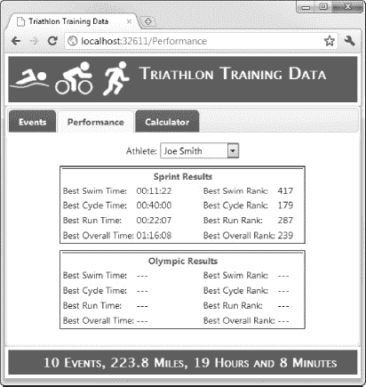

***图 31-9。**已完成绩效页签*

### 构建计算器选项卡

我们必须构建的最后一个功能区域是计算器选项卡。我首先在`Models/View`文件夹中创建了几个视图模型类。这些类叫做`CalcData`和`CalcResult`，如清单 31-39 中的[所示。](#list_31_39)

***清单 31-39。**查看模型类以支持计算器选项卡*

`using System.ComponentModel.DataAnnotations;
namespace TriathlonApp.Models.View {

    public class CalcData {

        public CalcData() {
            Laps = 80;
            PoolLength = 20;
            Minutes = 60;
            CalsPerHour = 1070;
        }

        [Required]
        [Range(1, 500)]
        public int Laps { get; set; }
        [Required]
        [Range(10, 500)]
        public int PoolLength { get; set; }
        [Required]
        [Range(1, 500)]
        public int Minutes { get; set; }
        [Required]
        [Range(1, 5000)]
        public int CalsPerHour {get; set;}

        public CalcResult Result { get; set; }
    }

    public class CalcResult {
        public float Distance { get; set; }
        public int CaloriesBurned { get; set; }
        public int Pace { get; set; }
    }
}`

`CalcData`类包含一个`CalcResult`类型的属性。我将利用这种关系对视图做一些不同的事情，只是为了一些变化。`CalcData`对象将在模型绑定过程中创建，所以我添加了一些验证属性，以确保我接收到可以使用的用户的数据值。[清单 31-40](#list_31_40) 显示了`CalculatorController`类。

***清单 31-40。**计算器控制器类*

`using System.Web.Mvc;
using TriathlonApp.Models.Domain.Repository;
using TriathlonApp.Models.View;

namespace TriathlonApp.Controllers {
    public class CalculatorController : Controller {
        private const float metersToMiles = 0.00062137119223733f;
        private const float minsPerHour = 60f;
        private IRepository repository;

        public CalculatorController(IRepository repo) {
            repository = repo;
        }

        public ActionResult Index() {
            return View(new CalcData());
        }

        [HttpPost]
        public ActionResult Index(CalcData calcData) {
            if (ModelState.IsValid) {
                calcData.Result = new CalcResult {
                    Distance = (calcData.Laps * calcData.PoolLength) * metersToMiles,
                    CaloriesBurned = (int)((calcData.Minutes / minsPerHour)
                        * calcData.CalsPerHour),
                    Pace = (int)((calcData.Minutes * minsPerHour) / calcData.Laps),
                };
            }
            return View(calcData);
        }
    }
}`

这个控制器非常简单。第一个`Index`方法处理`GET`请求并呈现默认视图，传递一个新的`CalcData`对象作为视图模型，以便用户看到在`CalcData`构造函数中定义的默认值。

第二个`Index`方法检查模型状态，如果没有错误，将模型绑定器创建的`CalcData`对象的`Result`属性设置为包含计算结果的新的`CalcResult`对象。这两种操作方法都使用默认视图，即`Views/Calculator/Index.cshtml`，如[清单 31-41](#list_31_41) 所示。

***清单 31-41。**计算器控制器的索引视图*

`@model TriathlonApp.Models.View.CalcData
@{
    ViewBag.TabName= "Calculator";
}` `

@using (Html.BeginForm()) {

<table id="calcDataTable">
    <colgroup><col /><col width="80px" /><col /><col width="20px"/><col/></colgroup>
    <tr>
        <th>Laps:</th>
        <td>@Html.EditorFor(x => x.Laps)</td>
        <td>@Html.ValidationMessageFor(x => x.Laps)</td>
        @if (Model.Result != null) {
            <th colspan="2" style="text-align:center">Results</th>
        }
    </tr>
    <tr>
        <th>Pool Length:</th>
        <td>@Html.EditorFor(x => x.PoolLength)</td>
        <td>@Html.ValidationMessageFor(x => x.PoolLength)</td>
        @if (Model.Result != null) {
            <th>Distance:</th>
            <td>@string.Format("{0:F2} miles", Model.Result.Distance)</td>
        }
    </tr>
    <tr>
        <th>Minutes:</th>
        <td>@Html.EditorFor(x => x.Minutes)</td>
        <td>@Html.ValidationMessageFor(x => x.Minutes)</td>
        @if (Model.Result != null) {
            <th>Calories:</th>
            <td>@string.Format("{0:F0} calories", Model.Result.CaloriesBurned)</td>
        }
    </tr>
    <tr>
        <th>Calories/Hour:</th>
        <td>@Html.EditorFor(x => x.CalsPerHour)</td>
        <td>@Html.ValidationMessageFor(x => x.CalsPerHour)</td>
        @if (Model.Result != null) {
            <th>Pace:</th>
            <td>@string.Format("{0:F0} seconds/lap", Model.Result.Pace)</td>
        }
    </tr>
    <tr>
        <td colspan="2" style="text-align:center">
            <input type="submit" value="Calculate" />
        </td>
    </tr>
</table>
}`

我在这里做的是在视图中加入一点逻辑，这样如果`Result`属性`CalcData`视图模型对象不是`null`，那么视图会在表格中显示额外的列来显示计算结果。你可以在[图 31-10](#fig_31_10) 中看到这是如何工作的。

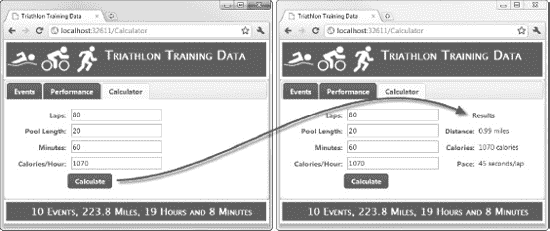

***图 31-10。**有条件地在视图中显示数据*

我还在视图中包含了验证消息，您可以在[图 31-11](#fig_31_11) 中看到。

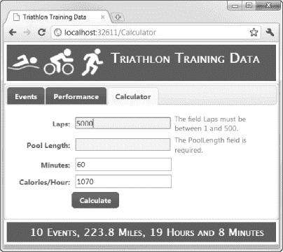

***图 31-11。**在计算器选项卡中显示验证信息*

我依赖于验证属性产生的默认验证消息，但是你已经明白了。老实说，像这样有条件地呈现视图内容是我在实际项目中很少做的事情，但是我想向您展示这是可能的(并且很容易做到)。我希望我的视图尽可能简单，这意味着我很可能会创建多个视图来处理提交表单的不同结果，为了减少重复，我会使用部分视图。

### 总结

在本章中，我向你展示了我们如何使用 MVC 框架的特性来构建 triathlon 应用程序。您已经看到了如何使用核心的 ASP.NET 特性、使用 Web 窗体控件以及现在使用 MVC 框架来创建这个应用程序。每一个都有非常不同的性质，给开发者带来不同的体验。我在使用 MVC 框架时的感觉是，必须忍受一个缓慢的开始(创建模型、存储库、布局，等等)，然后功能开始以越来越快和越来越容易的速度结合在一起。