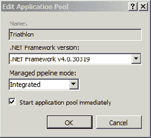

# 三十二、为部署准备服务器

开发 ASP.NET 应用只是故事的一部分。我们还必须部署它，以便我们的应用可以使用。本章将向您展示如何将 ASP.NET 应用部署到 Internet 信息服务(IIS)中，IIS 是微软的应用和 web 服务器产品。

 **提示**你不必部署到自己的服务器上。一种常见的替代方法是部署到第三方托管公司。有一个巨大的选择 ASP.NET 主机提供商不同水平的服务和价格点。当你注册一个托管服务，你会收到如何部署你的应用的说明。许多(但不是全部)主机服务会给你发送类似于第 34 章中例子的指令。

IIS 包含在大多数版本的 Windows 中，包括客户端版本，如 Windows Vista 和 Windows 7。我不建议将 MVC 应用部署到客户端操作系统。这些版本的 Windows 有一些基本的限制，使它们不适合除了最小和最简单的 web 应用之外的所有应用。相反，我建议您使用 Windows Server。在我写这篇文章的时候，当前的版本是 Windows Server 2008 R2，它附带了 IIS 7.5 版本，这是本章提供说明的组合。

 **注意**可以将 MVC 3 应用部署到 IIS 版本 6，这是 Windows Server 2003 和 2003 R2 中包含的版本。我不打算在这本书里讨论 IIS 6，但是在`[http://haacked.com/archive/2008/11/26/asp.net-mvc-on-iis-6-walkthrough.aspx](http://haacked.com/archive/2008/11/26/asp.net-mvc-on-iis-6-walkthrough.aspx)`有一个部署演练。

在接下来的小节中，我将只描述配置服务器所需的最基本的步骤，以便您可以部署和运行 ASP.NET 应用:启用 Web 服务器角色，安装。NET Framework 版本 4 和 web 部署工具，并设置 Web 部署。我将假设您正在使用一个新安装的 Windows Server 版本。有关在生产环境中部署 Windows Server 和 IIS 的最佳实践信息，请访问位于`[www.iis.net](http://www.iis.net)`的 IIS 学习中心，在那里您可以找到大量参考信息。

### 启用 Web 服务器角色

第一步是在 Windows Server 上启用 Web 服务器(IIS)角色。打开服务器管理器工具，在规则概要部分选择添加角色，如图[图 32-1](#fig_32_1) 所示。

***图 32-1。**向 Windows 服务器添加角色*

添加角色向导将启动。您将看到可用角色的列表(角色集取决于您使用的 Windows Server 2008 R2 版本)。选中 Web 服务器(IIS)角色的复选框，然后单击下一步按钮。继续完成向导，直到找到可用于 Web 服务器(IIS)角色的角色服务列表。确保检查了以下服务:

*   ASP.NET(在应用开发类别中)
*   管理服务(在管理工具类别中)

ASP.NET 角色服务是必不可少的。没有它，您无法运行安装和运行 ASP.NET 应用。管理服务角色服务是与 Web 部署工具一起使用所必需的，我们接下来将安装该工具。

继续完成向导，直到您看到将要启用的角色和角色服务的摘要。在该页面中，单击安装按钮。

安装过程完成后，您应该能够使用浏览器测试 IIS 的基本功能。从服务器本身(`[http://localhost](http://localhost)`)或从另一台机器(`[http://*mywindowsserver*](http://mywindowsserver)`)导航到服务器的默认 URL。如果一切安装正确，你会看到 IIS 7.5 欢迎页面，如图[图 32-2](#fig_32_2) 所示。

***图 32-2。**IIS 欢迎页面*

### 安装附加组件

下一步是在服务器上使用 WebPI 来获取和安装附加的软件组件。您只需要两个组件:

*   。NET 框架版本 4
*   Web 部署工具 2.0

使用 Web 部署工具只是部署 MVC 应用的一种方式，但是如果你想遵循第 33 章中的部署演示，你将需要这个组件。

 **注意**如果您尚未在服务器上安装数据库，您可以在此选择包含 SQL Server Express 2008 R2 的选项。如果安装 SQL Server Express，系统会提示您选择身份验证模式。选择混合模式身份验证，并为 sa 帐户创建密码。仔细记下这一点。

您也可以选择安装 MVC 框架。显然，对于运行使用核心 ASP.NET 平台或 WebForm控件构建的应用的服务器来说，MVC 框架是可选的，但是对于运行 MVC 框架应用的服务器来说，MVC 框架也是可选的。MVC 框架是可选的，这似乎有点奇怪，但是在部署应用时，您可以选择将框架库包含在应用中。这在将应用部署到不受您控制的服务器时尤其有用。我会在第 33 章中向你展示这个技巧。

如果没有专用的数据库服务器，可以在运行 IIS 的同一台服务器上安装 SQL Server。这一步是可选的，但是在第 33 章中，我将向您展示如何在应用部署过程中部署数据库，为此您将需要一个 SQL Server 实例。

#### 设置 Web 部署

在第 33 章中，我将向您展示如何使用 Web 部署特性将 MVC 框架应用部署到服务器上。但是，在这样做之前，您需要配置 IIS 来接受这样的请求。

 **注意**我们正在配置 web 部署，这样服务器上的任何管理员帐户都可以用来部署我们的 MVC 框架应用。将此过程委托给非管理帐户是一个漫长的过程。综合教程见`[http://learn.iis.net/page.aspx/984/configure-web-deploy](http://learn.iis.net/page.aspx/984/configure-web-deploy)`。

打开 Internet 信息服务(IIS)管理器工具，它可以在“开始”菜单中找到。在窗口左侧的“连接”面板中，选择服务器。它将通过名称来识别。我们的服务器叫 WIN-2008R2，你可以在[图 32-3](#fig_32_3) 中看到。

***图 32-3。**使用 IIS 管理器工具*

双击管理服务委托图标，向下滚动到窗口主要部分的管理部分即可找到该图标(参见[图 32-3](#fig_32_3) )。点击编辑功能设置链接，确保勾选“允许管理员绕过规则”选项，如图[图 32-4](#fig_32_4) 所示。单击“确定”关闭对话框。

***图 32-4。**编辑管理服务委托功能设置*

单击后退按钮返回到服务器的管理主页。双击管理服务图标，勾选“启用远程连接”选项，然后点击开始链接，如图[图 32-5](#fig_32_5) 所示。

***图 32-5。**启用管理服务*

 **注意**重启服务器时管理服务不会自动启动。要解决此问题，请转到服务控制面板，将 Web 管理服务的启动类型选项更改为自动或自动(延迟)。

若要测试 Web 部署功能是否正常工作，请打开浏览器并导航到以下 URL:

`https://*<server-name>*:8172/MsDeploy.axd`

Web 部署服务需要一个安全的连接(这就是为什么我们请求`https`而不是常规的`http`)并在端口 8172 上运行。如果一切正常，您将会看到一个证书警告，然后提示您输入用户名和密码。(如果您没有看到用户名和密码提示，那么最可能的原因是防火墙阻止了端口 8172。)

### 了解 IIS 基础知识

正如我提到的，IIS 是内置于 Windows 操作系统中的应用服务器。在这一节中，我将提供一些关于 IIS 如何运行的背景知识，以便您对部署有一些了解。

#### 了解网站

IIS 可以同时承载多个独立的网站。对于每个网站，您必须指定一个*根路径*(服务器文件系统或网络共享上的文件夹)，然后 IIS 将提供它在该文件夹中找到的任何静态或动态内容。

为了将特定的传入 HTTP 请求定向到特定的网站，IIS 允许您配置*绑定*。每个绑定将所有对 IP 地址、TCP 端口号和 HTTP 主机名的特定组合的请求映射到一个特定的网站(见[图 32-6](#fig_32_6) )。我将很快解释绑定。

***图 32-6。** IIS 7 管理器显示一组同时托管的网站及其绑定*

#### 了解虚拟目录

作为额外级别的配置，我们可以在网站文件夹层次结构中的任何位置添加虚拟目录。每个虚拟目录使 IIS 从其他文件或网络位置获取内容，并提供给它，就好像它实际上存在于网站根文件夹下的虚拟目录位置一样(见[图 32-7](#fig_32_7) )。

***图 32-7。**IIS 管理器内容视图中显示的虚拟目录*

每个虚拟目录都可以标记为独立的应用，在这种情况下，它会获得自己单独的应用配置和状态。它甚至可以运行与其母网站不同版本的 ASP.NET。

#### 了解应用池

IIS 支持*应用池*(通常称为*应用池*)作为一种机制，以增加运行在同一服务器上的不同 web 应用之间的隔离。每个应用池运行一个单独的工作进程，它可以在不同的身份下运行(影响其访问底层操作系统的权限级别)，并定义最大内存使用、最大 CPU 使用、进程回收计划等规则。每个网站(或标记为独立应用的虚拟目录)都被分配到这些应用池中的一个。如果一个应用崩溃，那么 web 服务器本身和其他应用池中的应用不会受到影响。

#### 将网站绑定到主机名、IP 地址和端口

因为同一个服务器可能托管多个网站，所以它需要一个系统来将传入的请求分派给正确的服务器。如前所述，我们可以将每个网站绑定到以下一个或多个组合:

*   端口号(当然，在生产中，大多数网站都在端口 80 上提供服务)
*   主机名
*   IP 地址(仅当服务器有多个 IP 地址时相关，例如，如果它有多个物理或虚拟网络适配器)

创建绑定时，我们可以选择不指定值。这就产生了通配符的效果——匹配其他网站没有明确匹配的任何内容。如果多个网站具有相同的绑定，那么在任何特定时间只有其中一个网站可以运行。虚拟目录继承与其父网站相同的绑定。

### 为应用准备服务器

在部署应用之前，我们必须配置 IIS 来创建一个新的 ASP.NET 网站。在接下来的章节中，我将展示如何部署我们在第 31 章中创建的 triathlon 应用的 MVC 框架版本。在这一节中，我将向您展示如何让服务器准备好接收这个应用。如果您使用的是 IIS 7，请按照下列步骤创建新的网站:

1.  打开 IIS 管理器(从开始管理工具)。
2.  在左列中，展开代表服务器的节点，然后展开其“站点”节点。对于列表中已经存在的任何不需要的站点(如默认网站)，右键单击并选择删除它们，或者选择它们并使用右侧的列来阻止它们。
3.  通过右键单击“站点”并选择“添加网站”来添加新网站。输入网站名称的描述性值；我已经参加了铁人三项。
4.  输入希望应用文件驻留的物理路径。我已经指定了`C:\Triathlon`。
5.  如果要绑定到特定的主机名、IP 地址或端口，请在窗口的绑定部分提供值。对于本章，我们将使用默认设置。

[图 32-8](#fig_32_8) 显示了为 triathlon 应用填充的添加网站对话框。

***图 32-8。**为 triathalon 应用创建新网站*

当您对新站点的配置满意时，点击 OK 按钮。

我应该把我的申请表放在哪里？

您可以将应用部署到服务器上的任何文件夹中。当 IIS 第一次安装时，它会自动在`c:\Inetpub\wwwroot\`为一个名为默认网站的网站创建一个文件夹，但是您不应该觉得有任何义务将您的应用文件放在那里。将应用托管在与操作系统不同的物理驱动器上是很常见的(例如，在`e:\websites\example.com\`中)。这完全取决于您，并且可能会受到诸如您计划如何备份服务器等问题的影响。

如果您选择的绑定配置与 IIS 托管的另一个网站冲突，那么您将会看到类似于图 32-9 中的警告。

***图 32-9。**出现绑定冲突时显示警告*

我们为 triathlon 应用指定的配置与安装 IIS 时创建的默认网站所使用的绑定冲突。这意味着在任何给定时刻，只有一个网站可以运行，除非我们修改其中一个绑定。在本章中，我们只关心单个应用，所以如果您看到此警告，请单击“是”按钮。

IIS 为我们的应用创建了一个新的应用池，但将其配置为使用。NET 版本 2。要纠正这一问题，请在 IIS 管理器工具中单击“应用池”节点，右键单击 Triathlon 条目，然后从弹出菜单中选择“基本设置”。改变。NET Framework 版本值更改为。NET 版本 4，如图[图 32-10](#fig_32_10) 所示。单击“确定”按钮将更改应用到应用池。

***图 32-10。**配置要使用的应用池。NET 版本 4*

最后一步是启动应用。单击 IIS 管理器工具中的“站点”节点，查看可用应用的列表。在列表中选择默认网站，然后在右侧的管理网站面板中单击停止。现在选择 Triathlon 并在管理网站面板中单击 Start。

我们已经启动了应用，但是还没有部署任何内容。这意味着，如果您转到服务器的默认 URL(在我的例子中是`[http://win-2008r2](http://win-2008r2)/`)，将会显示一个错误。我们将在下一章部署应用时解决这个问题。

### 总结

在本章中，您学习了如何准备 Windows Server 2008 R2 和 IIS 7.5，以便部署 ASP.NET 应用。在下一章中，我将向您展示如何准备和部署应用。