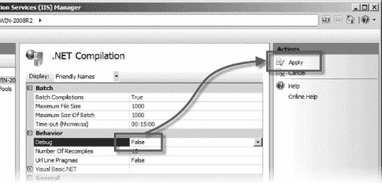
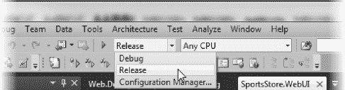

## 第 33 页

## 部署 ASP.NET络应用

在前一章中，我向您展示了如何为部署准备 Windows Server 和 IIS。本章将向您展示如何准备应用本身，当然，也包括部署本身。

我还介绍了一些关于使用 IIS 的基本信息，这些信息足以理解和执行 ASP.NET 应用部署。如果你想学习更多关于 IIS 的知识，那么我建议你看看`[www.iis.net](http://www.iis.net)`上的大量文档。

我建议您在尝试将实际应用部署到生产环境之前，使用测试应用和服务器来练习部署。像软件开发生命周期的每个其他方面一样，部署过程受益于测试。这并不是说 ASP.NET 部署特性特别危险——它们并不危险——而是说，任何涉及正在运行的应用与真实用户数据的交互都值得仔细考虑和规划。

### 准备部署

在这一章中，我将部署我们在第 31 章中创建的 triathlon 应用的 MVC 框架版本。除了几个例外，所有类型的 ASP.NET 应用的部署都是一样的。当我们谈到这些问题时，我会解释的。

#### 启用动态页面编译

部署应用时需要注意的最重要的`Web.config`设置之一是`compilation`，如[清单 33-1](#list_33_1) 所示。

***清单 33-1。**web . config 中的编译设置*

`<configuration>
        <!-- other settings removed for clarity -->
        <system.web>
**        <compilation debug="true" targetFramework="4.0">**
        <assemblies>
                <add assembly="System.Web.Abstractions, Version=4.0 ...
                ...`

正如我在本书前面解释的，ASPX 页面和 Razor 视图被编译成。NET 类。`Web.config`中的`compilation`设置决定编译是在`debug`还是`release`模式下进行。`debug`模式旨在开发过程中使用，它使编译器执行以下操作:

> *   Some code optimizations are omitted so that the compiler can compile the code line by line.
> *   Compile each view according to the request, instead of compiling all views in one batch.
> *   Disable request timeout so that we can spend a long time in the debugger.
> *   Limit how the browser caches content.

当我们开发应用时，这些都是有用的特性，但是它们会影响部署的性能。正如您所想象的，解决方案是将`debug`设置的值改为`false`，就像这样:

`<compilation debug="**false**" targetFramework="4.0">`

如果我们将应用部署到 IIS 7。 *x* ，我们可以使用 IIS 管理器的。NET 编译工具，它会自动覆盖`Web.config`设置。为此，请打开 IIS 管理器，导航到服务器的主页，然后双击。NET 编译项，它在 ASP.NET 部分。确保调试设置为假，点击应用，如图[图 33-1](#fig_33_1) 所示。

***图 33-1。**利用。NET 编译工具*

#### 准备用于转换的 Web.config 文件

在部署应用时，我们通常需要更改`Web.config`中的一些配置设置。至少，我们必须改变我们用于任何数据库的连接字符串，以便我们连接到我们的生产服务器，而不是那些用于开发和测试的服务器。Visual Studio 提供了一个有用的特性，让我们为开发生命周期的不同阶段生成不同版本的`Web.config`。

 **注意**`Web.config`转换仅在使用本章稍后描述的技术之一部署应用时应用。在 Visual Studio 中进行常规生成时，不会应用转换。

如果你在解决方案资源管理器窗口中查看`Web.config`文件，你会看到有两个额外的文件，`Web.Debug.config`和`Web.Release.config`，如图[图 33-2](#fig_33_2) 所示。

***图 33-2。**web . config 转换文件*

这些文件对应于我们可以在 Visual Studio 中选择的调试和发布构建配置，如图 33-3 所示。

***图 33-3。**选择构建配置*

当我们选择这些构建配置之一，然后部署我们的应用时，相应的`Web.xxx.config`文件中的指令被用来转换`Web.config`的内容。清单 33-2 展示了一个样本转换文件。

***清单 33-2。**一个 Web.config 转换文件*

`<?xml version="1.0"?>

<configuration xmlns:xdt="http://schemas.microsoft.com/XML-Document-Transform">

  <connectionStrings>
      <add name="EFRepository" connectionString="Data Source=.\SQLEXPRESS;Initial
              Catalog=TrainingData;Persist Security Info=True;User
              ID=adam;Password=adam;MultipleActiveResultSets=true"
              xdt:Transform="SetAttributes" xdt:Locator="Match(name)"/>
  </connectionStrings>
  <system.web>
      <compilation xdt:Transform="RemoveAttributes(debug)" />
  </system.web>
</configuration>`

我为这一章创建了一个简化的发布环境。在开发中，我有自己的工作站和一个名为`Titan`的数据库服务器。在生产中，应用和数据库将在同一台机器上运行，称为`Win-2008R2`。我在我们的`Web.config`文件中需要两个转换:第一个是我们想要改变实体框架使用的连接字符串，以便连接到本地机器，而不是`Titan`。

 **注意**请不要写信告诉我，我是多么愚蠢地使用一个用用户名和密码`adam`保护的数据库连接。我知道这不安全，但是 Apress 测试实验室是与公共互联网隔离的，我想尽可能保持例子的简单性。

第二个转换是我们想要从编译`configuration`元素中移除`debug`属性(我在上一节解释了为什么这很重要)。当清单中的转换文件应用于应用时，我们将得到一个新的数据库连接字符串，并启用动态页面编译。

在接下来的几节中，我将向您展示一些我们可以应用于`Web.config`文件的不同转换，在这个过程中，您将看到清单中的转换实际上是如何工作的。

##### 理解转换结构

转换文件的基本结构与`Web.config`相似。我们定义`configuration`元素，然后复制我们想要转换的每个节点的层次结构。因此，连接字符串包含在`connectionStrings`元素中，它是`configuration`的子元素，而`compilation`元素包含在`system.web`中，它也是`configuration`的子元素。这意味着对于我们的目标转换，我们从创建清单 33-3 中所示的框架结构开始。

***清单 33-3。**一个骨骼转换文件结构*

`<?xml version="1.0"?>
<configuration xmlns:xdt="http://schemas.microsoft.com/XML-Document-Transform">

    <connectionStrings>
        *...transformation for connection string goes here...*
    </connectionStrings>

    <system.web>
      *...tranformation for compilation goes here...*
    </system.web>

</configuration>`

对于我们想要执行的每个转换，我们定义目标元素，我们需要的转换类型，以及转换需要的任何附加值。例如，如果我们想转换编译器的属性，那么我们定义一个这样的转换:

`<compilation xdt:Transform="RemoveAttributes(debug)" />`

属性指定了我们想要将哪些可用的转换属性应用到`Web.config`文件中的`compilation`元素。在这个例子中，我选择了`RemoveAttributes`转换，并传入了一个`debug`参数。如您所料，这具有从`compilation`元素中移除`debug`属性的效果。如果我们从`Web.config`中这样的元素开始:

`<compilation debug="true" targetFramework="4.0">`

然后使用发布配置进行部署，最后我们会得到这样一个元素:

`<compilation targetFramework="4.0">`

表 33-1 显示了支持的一组转换。

T2】

以下部分提供了每种转换的演示。我已经将这些例子应用到清单 33-4 中的配置文件中。为了让示例更容易阅读，我省略了除了几个配置选项之外的所有选项，并简化了程序集引用和连接字符串。它们不能在真正的`Web.config`文件中使用，但是它们将有助于说明可用的转换。

***清单 33-4。**一个样本 Web.config 文件*

`<?xml version="1.0"?>

<configuration>

    <connectionStrings>
      <add name="EFRepository" connectionString="Data Source=TITAN\SQLEXPRESS;Initial
              Catalog=TrainingData;Persist Security Info=True;UserID=adam;
              Password=adam;MultipleActiveResultSets=true"
          providerName="System.Data.SqlClient"/>
    </connectionStrings>

    <system.web>
        <compilation debug="true" targetFramework="4.0">
            <assemblies>
                <add assembly="System.Web.Abstractions, Version=4.0.0.0, Culture=neutral" />
                <add assembly="System.Web.Helpers, Version=1.0.0.0, Culture=neutral" />
            </assemblies>
        </compilation>
  </system.web>
</configuration>`

##### 插入配置元素

我们可以使用`Insert`转换向`Web.config`中现有的元素集合添加新元素。[清单 33-5](#list_33_5) 包含了一个转换的例子。

***清单 33-5。**添加新元素*

`<?xml version="1.0"?>
<configuration xmlns:xdt="http://schemas.microsoft.com/XML-Document-Transform">

    <connectionStrings>
**        <add name="NewConnection" connectionString="MyConnectionString" xdt:Transform="Insert"/>**
    </connectionStrings>

</configuration>`

清单 33-6 显示了这个转换的结果。

***清单 33-6。**添加新配置元素的效果*

`<?xml version="1.0"?>

<configuration>

  <connectionStrings>
    <add name="EFRepository" connectionString="Data Source=TITAN\SQLEXPRESS;Initial
        Catalog=TrainingData;Persist Security Info=True;User ID=adam;
        Password=adam;MultipleActiveResultSets=true" providerName="System.Data.SqlClient" />
**    <add name="NewConnection" connectionString="MyConnectionString" />**
  </connectionStrings>
  <system.web>
    <compilation debug="true" targetFramework="4.0">
      <assemblies>
        <add assembly="System.Web.Abstractions, Version=4.0.0.0, Culture=neutral" />
        <add assembly="System.Web.Helpers, Version=1.0.0.0, Culture=neutral" />
      </assemblies>
    </compilation>
  </system.web>
</configuration>`

转换属性被附加到`Web.config`文件的相应区域，如清单所示。除了指定转换的属性之外，所有的属性都被保留。

为了更好地控制新属性的插入位置，我们可以使用`InsertBefore`和`InsertAfter`转换，如[清单 33-7](#list_33_7) 所示。

***清单 33-7。**使用插入前和插入后转换*

`<?xml version="1.0"?>
<configuration xmlns:xdt="http://schemas.microsoft.com/XML-Document-Transform">
  <connectionStrings>

**    <add name="NewConnection" connectionString="MyConnectionString"**
**       xdt:Transform**
**        ="InsertBefore(/configuration/connectionStrings/add[@name='EFRepository'])"/>**

**    <add name="OtherConnection" connectionString="MyOtherConnectionString"**
**       xdt:Transform**
**        ="InsertAfter(/configuration/connectionStrings/add[@name='NewConnection'])"/>**

  </connectionStrings>
</configuration>`

`InsertBefore`和`InsertAfter`转换需要一个参数来标识`Web.config`文件中的元素，该元素与我们的新元素将被插入的位置相关。参数用 XPath 符号表示，这样元素就可以通过它们在`Web.config`文档中的位置来识别，如下所示:

`/configuration/connectionStrings/add`

本例选择了包含在`connectionStrings`元素中的所有`add`元素，该元素又包含在顶级`configuration`元素中。我们可以通过指定属性的名称和值来选择单个元素，如下所示:

`/configuration/connectionStrings/add[@name='NewConnection']`

这将选择具有值为`NewConnection`的`name`属性的单个`add`元素。[清单 33-8](#list_33_8) 显示了将这些转换应用到样本`Web.config`的效果。

***清单 33-8。**应用 InsertBefore 和 InsertAfter 变换的结果*

`<?xml version="1.0"?>

<configuration>

  <connectionStrings>
**    <add name="NewConnection" connectionString="MyConnectionString" />**
**    <add name="OtherConnection" connectionString="MyOtherConnectionString" />**
    <add name="EFRepository" connectionString="Data Source=TITAN\SQLEXPRESS;Initial
        Catalog=TrainingData;Persist Security Info=True;User ID=adam;
        Password=adam;MultipleActiveResultSets=true" providerName="System.Data.SqlClient" />
  </connectionStrings>
  <system.web>
    <compilation debug="true" targetFramework="4.0">
      <assemblies>
        <add assembly="System.Web.Abstractions, Version=4.0.0.0, Culture=neutral" />
        <add assembly="System.Web.Helpers, Version=1.0.0.0, Culture=neutral" />
      </assemblies>
    </compilation>
  </system.web>
</configuration>`

##### 删除配置元素

我们可以使用`Remove`转换移除元素，如[清单 33-9](#list_33_9) 所示。

***清单 33-9。**使用移除转换*

`<?xml version="1.0"?>
<configuration xmlns:xdt="http://schemas.microsoft.com/XML-Document-Transform">
  <system.web>
    <compilation>
      <assemblies>
**        <add xdt:Transform="Remove"/>**
      </assemblies>
    </compilation>
  </system.web>  
</configuration>`

本例中的`Remove`转换匹配`assembly`区域中的所有`add`元素。当有多个元素匹配时，只删除第一个元素。清单 33-10 展示了这种转换的结果。

***清单 33-10。**移除变换的效果*

`<?xml version="1.0"?>

<configuration>

  <connectionStrings>
    <add name="EFRepository" connectionString="Data Source=TITAN\SQLEXPRESS;Initial
        Catalog=TrainingData;Persist Security Info=True;User ID=adam;
        Password=adam;MultipleActiveResultSets=true" providerName="System.Data.SqlClient" />
  </connectionStrings>

  <system.web>
    <compilation debug="true" targetFramework="4.0">
      <assemblies>
**        <add assembly="System.Web.Helpers, Version=1.0.0.0, Culture=neutral" />**
      </assemblies>
    </compilation>
  </system.web>
</configuration>`

要删除多个元素，我们可以使用`RemoveAll`转换，这将删除所有匹配的元素。

##### 设置和删除属性

我们可以使用`SetAttributes`和`RemoveAttributes`转换来操作`Web.config`文件中的属性，如清单 33-11 中的[所示。](#list_33_11)

***清单 33-11。**操作配置元素属性*

`<?xml version="1.0"?>
<configuration xmlns:xdt="http://schemas.microsoft.com/XML-Document-Transform">

  <connectionStrings>
**    <add name="EFRepository" xdt:Transform="SetAttributes(connectionString)"**
**       connectionString="MyNewConnection"/>**
  </connectionStrings>

  <system.web>
**    <compilation xdt:Transform="RemoveAttributes(targetFramework)"  />**
  </system.web>  
</configuration>`

本例中的第一个转换更改了连接字符串的值，第二个转换从编译元素中删除了`targetFramework`属性。清单 33-12 展示了这些转换的效果。

***清单 33-12。**对属性应用变换*

`<?xml version="1.0"?>

<configuration>

  <connectionStrings>
    <add name="EFRepository" connectionString=**"MyNewConnection"**
        providerName="System.Data.SqlClient" />
  </connectionStrings>

  <system.web>
**    <compilation debug="true">**
      <assemblies>
        <add assembly="System.Web.Abstractions, Version=4.0.0.0, Culture=neutral" />
        <add assembly="System.Web.Helpers, Version=1.0.0.0, Culture=neutral" />
      </assemblies>
    </compilation>
  </system.web>
</configuration>`

##### 替换元素

我们可以用`Replace`转换替换`Web.config`的整个部分，如[清单 33-13](#list_33_13) 所示。

***清单 33-13。**更换配置元件*

`<?xml version="1.0"?>
<configuration xmlns:xdt="http://schemas.microsoft.com/XML-Document-Transform">

**  <connectionStrings xdt:Transform="Replace">**
**    <add name="MyFirstConnection" connectionString="MyConnection1"/>**
**    <add name="MySecondConnection" connectionString="MyConnection2"/>**
**    <add name="MyThirdConnection" connectionString="MyConnection2"/>**
**  </connectionStrings>**

</configuration>`

在这个例子中，我们用转换文件中定义的一组新元素删除了包含在`connectionStrings`元素中的所有`Web.config`元素项。清单 33-14 展示了这个转换对样本`Web.config`文件的影响。

***清单 33-14。**替换配置元素的效果*

`<?xml version="1.0"?>

<configuration>
  <connectionStrings>
**    <add name="MyFirstConnection" connectionString="MyConnection1"/>**
**    <add name="MySecondConnection" connectionString="MyConnection2"/>**
**    <add name="MyThirdConnection" connectionString="MyConnection2"/>**
  </connectionStrings>

  <system.web>
    <compilation debug="true" targetFramework="4.0">
      <assemblies>
        <add assembly="System.Web.Abstractions, Version=4.0.0.0, Culture=neutral" />
        <add assembly="System.Web.Helpers, Version=1.0.0.0, Culture=neutral" />
      </assemblies>
    </compilation>
  </system.web>

</configuration>`

##### 使用定位器属性

`Locator`属性允许我们更具体地确定我们对哪个或哪些元素感兴趣。考虑一下[清单 33-15](#list_33_15) 中的例子，它没有使用`Locator`属性。

***清单 33-15。**具有特殊性问题的转型*

`<?xml version="1.0"?>
<configuration xmlns:xdt="http://schemas.microsoft.com/XML-Document-Transform">

  <system.web>
    <compilation debug="true" targetFramework="4.0">
      <assemblies>
        <add xdt:Transform="Remove"/>
      </assemblies>
    </compilation>
  </system.web>

</configuration>`

我已经创建了一个转换，它将从配置文件的`assemblies`部分删除一个`add`条目。正如我前面提到的，如果在`Web.config`中有多个匹配，那么`Remove`转换将删除它找到的第一个元素。或者，我们可以使用`RemoveAll`转换来移除*所有*元素。

如果有(或可能有)多个匹配，而我们只想转换其中一个，那么我们可以使用`Locator`属性。[清单 33-16](#list_33_16) 展示了我们如何将`Locator`应用到前面的例子中。

***清单 33-16。**使用定位器属性*

`<?xml version="1.0"?>
<configuration xmlns:xdt="http://schemas.microsoft.com/XML-Document-Transform">

<system.web>
   <compilation debug="true" targetFramework="4.0">
     <assemblies>
**      <add xdt:Transform="Remove" xdt:Locator="Condition(contains(@assembly,'Helpers'))" />**
     </assemblies>
   </compilation>
</system.web>

</configuration>`

我们分配给`Locator`属性的值将我们的转换限制在那些具有包含`Helpers`的`assembly`属性值的元素上。我们指定的表达式与转换元素的路径相结合。我们正在转换具有路径`/configuration/compilation/assemblies/add`和匹配`assembly`属性的元素。有三种不同的模式可用于`Locator`属性，如[表 33-2](#tab_33_2) 所述。

T2】

当使用`Condition`模式时，我们可以使用 XPath 操作符，比如`contains`和`starts-with`来创建复杂的搜索模式。我们也可以使用`or`和`and`操作符来创建复合表达式，如[清单 33-17](#list_33_17) 所示。

***清单 33-17。**使用定位器属性和条件模型创建复合 XPath 表达式*

`<?xml version="1.0"?>
<configuration xmlns:xdt="http://schemas.microsoft.com/XML-Document-Transform">

  <connectionStrings>

    <add xdt:Transform="SetAttributes(connectionString)" connectionString="MyConnection"
         xdt:Locator=
**          "Condition(starts-with(@name, 'EF') and contains(@providerName, SqlClient))"/>**

  </connectionStrings>
</configuration>`

 **提示**我不打算在这一章中详细介绍 XPath，但是您可以在`www.w3.org/TR/xpath`获得完整的细节，包括可用操作符的列表。

`XPath`模式允许我们指定一个绝对的 XPath 表达式，它是*而不是*与转换元素的隐式路径的组合。[清单 33-18](#list_33_18) 包含一个例子，其功能等同于[清单 33-17](#list_33_17) 。

***清单 33-18。**使用绝对 XPath 表达式*

`<?xml version="1.0"?>
<configuration xmlns:xdt="http://schemas.microsoft.com/XML-Document-Transform">

  <connectionStrings>

    <add xdt:Transform="SetAttributes(connectionString)" connectionString="MyConnection"
         xdt:Locator=
**          "XPath(/configuration/connectionStrings/add[starts-with(@name, 'EF') and**
**              contains(@providerName, 'SqlClient')])"/>**
  </connectionStrings>
</configuration>`

如果我们的目标是匹配特定的属性值，那么我们可以使用`Match`模式，如[清单 33-19](#list_33_19) 所示。

***清单 33-19。**使用匹配定位器模式*

`<?xml version="1.0"?>
<configuration xmlns:xdt="http://schemas.microsoft.com/XML-Document-Transform">

  <connectionStrings>

    <add xdt:Transform="SetAttributes(connectionString)" connectionString="MyConnection"
**         xdt:Locator="Match(name, providerName)"**
         name="EFRepository"
         providerName="System.Data.SqlClient"/>

  </connectionStrings>
</configuration>`

`Match`模式接受一个或多个属性名，并且将匹配与具有相同路径的转换元素*和*具有相同命名属性值的`Web.config`元素。

在这个例子中，我指定了`name`和`providerName`属性，这意味着我们的转换将应用于那些具有路径`/configuration/connectionStrings/add`、具有`EFRepository`的`name`属性值和具有`System.Data.EntityClient`的`providerName`属性值的元素。

#### 为数据库部署准备项目

我们可以使用的另一个优秀的部署特性是能够将数据库部署为我们项目的一部分。作为部署过程的一部分，我们可以选择将模式和/或数据从开发数据库复制到生产服务器。

 **注意**该功能非常有用，但应小心使用。特别是，我们必须确保我们不会用我们可能在开发中使用的任何测试数据覆盖真实的用户数据。

首先，使用图 33-3 中[所示的下拉菜单或使用配置管理器(可通过构建菜单访问),为要部署的项目设置构建配置以发布。](#fig_33_3)

接下来，右击将在解决方案资源管理器窗口中部署的项目，并从弹出菜单中选择 Properties。将显示项目的设置。切换到打包/发布 Web 页签，勾选“包含打包/发布 SQL 页签中配置的所有数据库”选项，如图[图 33-4](#fig_33_4) 所示。

***图 33-4。**启用数据库部署*

接下来，切换到“打包/发布 SQL 属性”选项卡。这是我们配置哪些数据库将与我们的应用一起部署的地方。点击从 Web.config 导入按钮，导入数据库连接字符串，如图[图 33-5](#fig_33_5) 所示。

***图 33-5。**从 Web.config 导入连接字符串*

该连接字符串用于从开发数据库中读取模式和数据。读取操作将从我们的开发工作站执行，这意味着`Web.config`连接字符串通常是我们想要的。如果我们需要使用不同的连接字符串，那么我们可以在单击 Add 按钮后手动输入它。

 **提示**部署过程可以部署多个数据库，但是我们在本章中将只部署 triathlon 应用使用的单个数据库。

下一步是输入目标数据库的连接字符串。对于本章中的例子，我们将在同一台名为`Win-2008r2`的机器上运行生产数据库和应用服务器。为了创建目标连接字符串，我复制了 Visual Studio 从`Web.config`导入的源字符串并编辑了服务器名，如图[图 33-6](#fig_33_6) 所示。

***图 33-6。**输入源和目的连接字符串*

我的源和目标连接字符串非常相似，这使得复制和编辑成为最方便的方法。如果连接字符串更加不同，那么我们可以单击省略号按钮(标有“...”的那个))，这将打开一个连接生成器对话框。

 **提示**目标连接字符串仅用于在部署过程中设置数据库。有关为应用创建生产环境连接字符串的详细信息，请参见“为转换准备 Web.config 文件”一节。

接下来，我们必须选择部署什么。我们可以选择部署模式、模式和任何数据，或者只部署数据，如图 33-7 所示。

***图 33-7。**选择部署类型*

在决定需要哪一个选项时，应该小心谨慎。为部署数据库而生成的 SQL 脚本不会删除现有的模式和数据。这意味着，如果我们试图部署一个已经存在的模式，或者试图部署与现有数据冲突的数据(例如，违反一个键约束)，我们的部署将会失败。此外，我们必须确保我们之前指定的目的地连接字符串将允许部署选项起作用。这意味着我们必须创建任何所需的帐户，并分配适当的权限，以允许创建新数据库、新表等。最后，通过按 Ctrl+S 或选择 File  Save Selected Items 来保存部署配置。

#### 准备 Bin 部署(仅限 MVC 框架)

正如我在书中讨论 MVC 框架的部分提到的，核心的 ASP.NET 平台与 main 绑定在一起。NET 框架发布周期，但 MVC 框架不是。这意味着我们面临着部署到拥有最新版本的服务器的前景。NET 框架和 ASP.NET，但不是 MVC 框架。(这在托管服务领域尤其普遍，在对新功能有足够需求之前，提供商不愿意投资升级其服务器的成本和中断。)

为了解决这个问题，我们可以选择将 MVC 库作为应用部署的一部分。我们通过执行所谓的 *bin 部署*来做到这一点，之所以这么叫是因为库包含在项目的`bin`目录中。

使用 Visual Studio 2010 SP1 版或更新版本，我们只需点击几下鼠标就可以为 bin 部署准备好我们的应用。在“解决方案资源管理器”窗口中右击项目名称，然后选择“添加可部署依赖项”。在弹出的菜单中选择 ASP.NET MVC，如图[图 33-8](#fig_33_8) 所示。最后，单击确定。

***图 33-8。**将 ASP.NET MVC 添加为可部署的依赖项*

然后，Visual Studio 会自动向项目添加一个新文件夹`_bin_deployableAssemblies`，其中包含 ASP.NET MVC 3 和 Razor 视图引擎所需的各种程序集。当我们编译我们的应用时，那些程序集将被复制到我们的项目文件夹结构的`bin`目录，并且当我们部署项目时，这些程序集将被复制到服务器。这意味着无论服务器管理员是否安装了 ASP.NET MVC 3 程序集，我们的应用都可以成功运行。

### 部署应用

在接下来的小节中，我将向您展示将 ASP.NET 应用部署到 IIS 的不同技术。所有这些技术都产生相同的结果，但是自动化的程度有很大的不同。

 **注意**在开始任何这些部署技术之前，确保您已经选择了想要的构建配置，或者使用图 33-3 所示的下拉菜单，或者使用配置管理器，它可以从构建菜单中打开。

#### 通过复制文件部署应用

部署应用最基本的方法是将所需的文件从我们的开发机器复制到我们服务器上的目标目录。我们需要从开发机器上的项目中复制以下文件:

> *   Compiled. NET assembly (in `/bin` folder)
> *   Configuration files (`Web.config` and `Global.asax`)
> *   Uncompleted views and web pages (`*.cshtml`, `*.aspx`, `*.ascx`, etc.)
> *   Static files (including pictures, CSS files and JavaScript files)

我们需要维持项目的结构。这意味着我们复制`bin`目录及其内容，而不仅仅是目录中的文件。出于安全原因，最好不要复制仅用于开发的文件。不要复制以下内容:

> *   C# code file (`*.cs`, including `Global.asax.cs` and other code-behind files)
> *   And project solution files (`*.sln`, `*.suo`, `*.csproj` or `*.csproj.user`)
> *   `\obj` folder
> *   Anything specific to your source control system (for example, `.svn` folder if you use Subversion; `.hg` or `.git` folder if you use Mercurial or Git)

我们必须将文件复制到配置 IIS 时指定的目录中。对于这个例子，这是`C:\Triathlon`。[图 33-9](#fig_33_9) 显示了应用的内容视图。要选择内容视图，请在 IIS 管理器工具中单击 triathlon 网站，然后单击窗口底部的内容按钮。

***图 33-9。**铁人三项网站的内容视图*

这不仅是最基本的部署技术，也是最需要手动操作的。这个部署过程不会转换`Web.config`文件或部署与我们的应用相关的数据库，这意味着我们必须负责部署数据库并为生产环境更改应用配置。

对于 triathlon 应用，这意味着我们必须在服务器上为数据库建立模式，并加载应用所需的数据。我们还必须编辑`Web.config`文件来更新连接字符串，以便应用连接到生产数据库，而不是我们的开发数据库服务器。我建议谨慎行事。很容易犯错误，最终导致生产系统使用开发或测试系统。同样重要的是在部署后将设置改回来。否则，未来的开发或测试将使用包含真实用户数据的数据库和其他服务器来完成。一旦我们将文件复制到服务器上的目标目录，我们就可以通过请求服务器的默认 URL 来测试应用，如图[图 33-10](#fig_33_10) 所示。

***图 33-10。**(手动)部署的应用*

对服务器的第一个请求可能需要一段时间才能完成。这是因为所有的视图都是作为一个批处理来编译的。后续请求会快得多。

#### 使用部署包

一个*部署包*是一个包含应用文件的 zip 文件。Visual Studio 为我们生成包，我们通过将包复制到服务器并使用 IIS 管理器工具来部署应用。部署包支持`Web.config`转换和数据库部署，这使得部署过程比手动复制文件更加简化和一致。

 **注意**部署包依赖于 Web 部署特性，必须安装在服务器上。详见第三十三章。

##### 创建部署包

要创建部署包，在解决方案资源管理器窗口中选择要部署的项目，然后选择项目构建部署包。Visual Studio 将构建项目并生成一个 zip 文件，该文件包含部署应用所需的文件以及我们在准备项目时指定的任何数据库架构和数据。默认情况下，zip 文件在项目文件夹中被创建为`obj\Release\Package\*<project name>*.zip`，这意味着对于我们的示例，Visual Studio 将包创建为`obj\Release\Package\TriathlonApp.WebUI.zip`。

 **提示**我们可以在项目属性的 Package/Publish Web 选项卡上更改部署包的创建位置。

##### 部署软件包

我们必须首先将 Visual Studio 创建的部署包复制到我们想要部署应用的服务器上。完成后，启动 IIS 管理器工具，并导航到我们之前创建的 triathlon 网站。点击窗口右侧的导入应用链接，如图[图 33-11](#fig_33_11) 所示。

***图 33-11。**加载部署包*

将启动导入应用包向导。选择部署包 zip 文件，然后单击 Next 按钮。读取包的内容，显示部署步骤，如图[图 33-12](#fig_33_12) 所示。

***图 33-12。**部署所需的步骤*

在这个阶段，我们可以取消选中包中的单个项目，以防止它们被部署。如果包中包含生产环境中已经存在的数据库，这将非常有用。对于这个例子，我们将部署包中的所有项目，包括数据和模式。(在部署这个包之前，我在应用服务器上设置了数据库。)单击下一步按钮。向导将显示一些附加的配置选项，如图[图 33-13](#fig_33_13) 所示。

***图 33-13。**配置应用路径和连接字符串*

应用路径决定了应用在网站中的部署位置。我们将只部署一个应用，所以我已经清除了 path 文本框，这样应用将被安装在根目录中。一个网站可以有多个应用，在这种情况下，我们可以使用不同的路径来区分它们。

我们还可以编辑数据库的连接字符串。第一个字符串将用于连接数据库以执行部署任务，第二个字符串将由应用在`Web.config`文件中使用(如果我们使用了`Web.config`转换，这将是转换后的值)。单击“下一步”按钮继续，然后单击“确定”按钮消除关于将应用安装到网站根目录的警告。

将部署应用，并安装数据库。当部署过程完成时，将显示一个类似于图 33-14 中[所示的摘要。](#fig_33_14)

***图 33-14。**部署总结*

单击“完成”按钮关闭向导。应用(和数据库)现在已经安装好，可以使用了。

#### 使用一键发布

如果我们的开发工作站能够连接到应用服务器，那么我们就可以直接部署我们的应用，而不必到处复制文件。我们使用 Visual Studio 内置的一键式发布支持来实现这一点。

 **注**Web 部署功能上的一键发布回复，必须安装在服务器上。详见第三十二章。

要使用一键发布，在解决方案资源管理器窗口中右键单击要部署的项目，并从弹出菜单中选择发布(或者从构建菜单中选择发布<项目名称>)。将显示发布 Web 对话框，如图[图 33-15](#fig_33_15) 所示。

***图 33-15。**发布网页对话框*

Visual Studio 支持一系列不同的发布方法，但我们想要的是 Web Deploy，可以从“发布方法”下拉菜单中选择。

服务 URL 非常具体，如下所示:

`https://*<server-name>*:8172/MsDeploy.axd`

我们编辑的 URL 的唯一部分是服务器的名称。特别要注意的是，连接使用 HTTPS，而不是常规的 HTTP。“站点/应用”选项决定了应用的部署位置。对于我们的例子来说，这只是简单的 Triathlon，因为我们想要将我们的应用部署到我们在前一章中创建的网站的根目录中。

确保选中“在目标上标记为 IIS 应用”和“允许不受信任的证书”选项。输入服务器上具有管理权限的帐户的帐户名和密码。正如我在前一章中提到的，我们已经配置了 Web Deploy 特性，允许管理用户部署应用，因为将此功能委托给其他帐户是一个复杂的过程。

配置完所有选项后，单击“发布”按钮。部署包被自动创建并推送到服务器，在服务器上进行处理并部署应用(以及任何相关的数据库)。

### 总结

在本章中，您学习了如何为部署准备应用，以及完成部署的一些不同方式。我建议在部署应用时要特别小心。这是一项容易出错的任务，很容易出现中断服务的错误。我建议您在安全的环境中练习部署，验证部署是否按计划进行，然后才部署到生产环境中。