## 认证和授权

在这最后一章，我将解释如何在 ASP.NET 应用程序中执行认证和授权。这些特性的功能内置于 ASP.NET 的核心，根据您正在构建的应用程序的类型，其使用方式会略有不同。支持多种认证模型，但我将全面展示的是*表单认证*。这是最灵活的，也最适合面向互联网的应用程序。

### 设置认证

在软件术语中，*认证*意味着确定某人是谁。这与*授权*是完全分开的，后者的意思是决定某个人是否被允许做某件事。授权通常发生在认证之后。恰如其分，ASP。NET 的身份验证功能只涉及安全地识别您站点的访问者，并设置一个安全上下文，您可以在其中决定允许特定访问者做什么。

#### 使用 Windows 认证

我们可以使用的第一种认证是 *Windows 认证*。这是操作系统存储和管理用户及其安全凭证的详细信息的地方。我们基本上继承了 Windows 服务器配置使用的任何身份验证系统，包括复杂的 Active Directory 部署。我们在应用程序的`Web.config`文件中启用 Windows 身份验证，如清单 34-1 中的[所示。](#list_34_1)

***清单 34-1。**启用 Windows 认证*

`<configuration>
    <system.web>
        <authentication mode="Windows" />
    </system.web>
</configuration>`

当我们使用 Windows 身份验证时，ASP.NET 依赖 IIS 来验证来自用户的请求。IIS 依次使用[表 34-1](#tab_34_1) 中描述的模式之一。

T2】

我们可以使用 IIS 管理器中的身份验证功能来选择启用哪些模式。选择要配置的网站，并双击出现在 IIS 功能组中的身份验证图标。可以启用和禁用认证模式，如图[图 34-1](#fig_34_1) 所示。

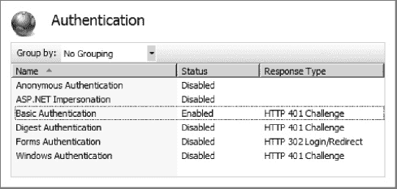

***图 34-1。**IIS 认证功能*

如果我们想要限制访问，使得对所有内容的请求都需要认证，那么我们必须禁用匿名认证功能。如果我们想限制对应用程序某些部分的访问，那么我们可以启用匿名认证选项，并使用我在本章后面描述的技术有选择地应用认证。根据所配置的 ASP.NET 应用程序的类型，具体的技术会有所不同。

如果某些身份验证选项未显示，则我们必须运行服务器管理器工具，并使用 Web 服务器(IIS)角色设置的添加角色服务选项。我们需要的角色可以在安全部分找到，如图[图 34-2](#fig_34_2) 所示。

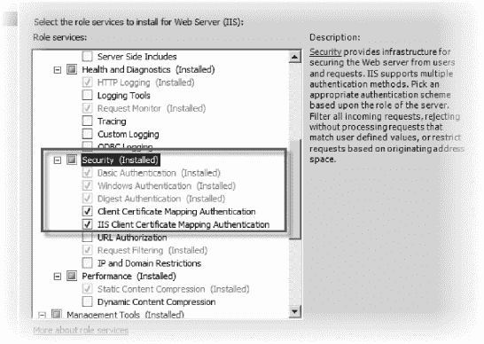

***图 34-2。**添加 Web 服务器角色功能*

如果您在企业内部网中部署应用程序，并且已经建立了域基础结构，Windows 身份验证(更广泛的功能，而不是特定的 IIS 模式)可能会非常有用。用户不必管理重复的凭据集，我们也不必管理帐户的创建和删除。

这种形式的身份验证对于面向互联网的应用程序来说并不那么有效。我们*可以*在 Windows 域中为互联网用户创建帐户，但是你不太可能想要给来自公共互联网的每个访问者 Windows 域帐户，所以大多数 ASP.NET 应用程序倾向于依赖表单认证。

#### 使用表单认证

表单身份验证非常适合在面向 Internet 的应用程序中使用。与 Windows 身份验证相比，设置它需要更多的努力，但是一旦一切就绪，它就灵活多了。

表单认证的安全性依赖于一个名为`.ASPXAUTH`的加密浏览器 cookie。如果您查看一个`.ASPXAUTH` cookie 的内容(通过使用类似 Fiddler 的工具或者通过查看您浏览器的 cookie 缓存)，您将会看到类似于[清单 34-2](#list_34_2) 的内容。

***清单 34-2。**安的一个例子。ASPXAUTH cookie*

`9CC50274C662470986ADD690704BF652F4DFFC3035FC19013726A22F794B3558778B12F799852B2E84
D34D79C0A09DA258000762779AF9FCA3AD4B78661800B4119DD72A8A7000935AAF7E309CD81F28`

如果我们将这个值传递给`FormsAuthentication.Decrypt`方法，我们可以得到一个`FormsAuthenticationTicket`对象，它具有在[表 34-2](#tab_34_2) 中显示的属性。

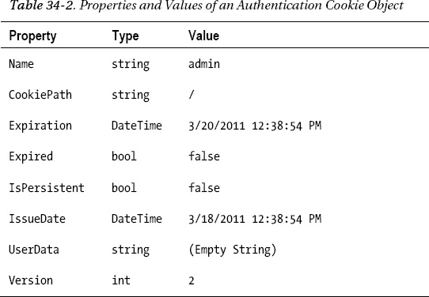

cookie 中编码的关键属性是`Name`。这是将与用户发出的请求相关联的身份。这个系统的安全性来自于这样一个事实:cookie 数据是用我们服务器的*机器密钥*加密和签名的。这些是由 IIS 自动生成的，如果没有这些密钥，cookie 中包含的身份验证信息将无法读取或修改。

 **注意**当将使用表单认证的应用程序部署到服务器群时，我们必须确保请求总是返回到生成 cookie 的服务器(称为*亲缘关系*)或者确保所有的服务器都有相同的机器密钥。可以使用 IIS 管理器中的“机器密钥”选项来生成和配置密钥(图标位于 ASP.NET 部分)。

##### 设置表单验证

我们在`Web.config`中启用表单认证，如[清单 34-3](#list_34_3) 所示。

***清单 34-3。**在 Web.config 中启用表单认证*

`<configuration>
  <system.web>
    <authentication mode="**Forms**">
**      <forms loginUrl="~/Account/LogOn" timeout="2880" />**
    </authentication>
  </system.web>
</configuration>`

 **注意**当我们使用互联网应用项目模板创建一个新的 MVC 框架应用时，Visual Studio 模板默认启用表单认证。

这个简单的配置适用于大多数应用程序，但是为了更好地控制，我们可以在`Web.config`文件中为`forms`节点定义附加属性。[表 34-3](#tab_34_3) 描述了其中最有用的。

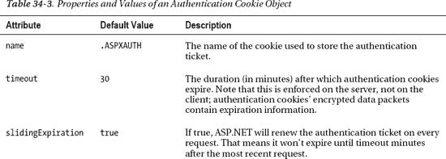

作为编辑`Web.config`文件的替代方法，我们可以使用 IIS 管理器工具中的身份验证选项来配置表单身份验证。这与我们之前用来配置 Windows 身份验证的工具相同。确保表单认证已启用，然后点击【编辑】进行设置，如图[图 34-3](#fig_34_3) 所示。

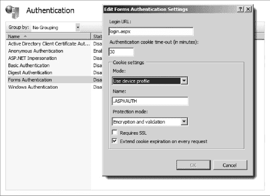

***图 34-3。**使用 IIS 管理器认证功能配置表单认证*

通过在`Web.config`文件中启用表单认证，当未经认证的访问者试图访问需要认证的应用程序的任何部分时，他们将被重定向到我们指定的登录 URL。

### 执行认证和授权

设置身份验证只是工作的一部分。我们还必须实现授权，以便 ASP.NET 知道用户通过身份验证后可以做什么。MVC 框架和其他 ASP.NET 应用程序之间需要的技术是不同的。我将在接下来的章节中描述这两者。

为了简化授权演示，我在 MVC 框架和 Web Forms triathlon 应用程序的`Web.config`文件中创建了一些凭证(两者都遵循相同的格式，因为两者都依赖于相同的核心 ASP.NET 认证特性)。清单 34-4 显示了我添加的内容。

***清单 34-4。**在 Web.config 中定义凭证*

`<authentication mode="Forms">
    <forms loginUrl="~/Account/LogOn" timeout="2880">
        <credentials passwordFormat="Clear">
          <user name="adam" password="adam" />
          <user name="joe" password="joe" />
       </credentials>
    </forms>
</authentication>`

这是 MVC 框架版本。当我们使用 WebForm应用程序时，`loginUrl`属性的值会略有不同。对于实际的应用程序，我不推荐像这样定义凭证，但是它对于简单的演示很有用。

#### 使用 MVC 框架应用程序

我们使用`Authorize`过滤器在 MVC 框架中应用授权。正如我之前解释的，过滤器是一种我们可以表达功能的方式，这种功能遍及应用程序，但并不完全符合我们定义的关注点之一。在《T2》第 28 章中，我们看到了另一个过滤器的例子。[清单 34-5](#list_34_5) 展示了我如何将这个过滤器应用到`EventController`类中。

***清单 34-5。**向事件控制器应用认证*

`using System;
using System.Linq;
using System.Web.Mvc;
using TriathlonApp.Models.Domain;
using TriathlonApp.Models.Domain.Repository;
using TriathlonApp.Models.View;

namespace TriathlonApp.Controllers {

**    [Authorize]**
    public class EventController : Controller {
        private IRepository repository;

        public EventController(IRepository repo) {
            repository = repo;
        }

*        ...action methods omitted for brevity...*

    }
}`

在没有参数的情况下应用时，`Authorize`过滤器将只允许针对控制器中的动作方法的请求，如果用户已经被认证的话。这意味着请求包含有效的身份验证 cookie。我们可以通过为`Authorize`属性的`Users`和`Roles`参数提供值来更加明确。这些属性在[表 34-4](#tab_34_4) 中进行了描述。

T2】

因此，例如，我们可以通过在`Users`属性中列出用户的名字来限制对一组特定用户的访问，如下所示:

`...
[Authorize(Users="adam, bob")]
public class EventController : Controller {
private IRepository repository;
...`

在本章的后面，我将回到角色，以及它们如何简化授权。如果我们启动应用程序，我们可以看到过滤器的效果，如图[图 34-4](#fig_34_4) 所示。

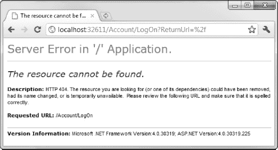

***图 34-4。**试图访问一个需要认证的动作*

当收到对需要身份验证的操作方法的未经身份验证的请求时，ASP.NET 会将用户的浏览器重定向到我们在设置表单身份验证时指定的 URL，如下所示:

`<forms loginUrl="~/Account/LogOn" timeout="2880">`

在默认路由配置下，这个 URL 将指向一个名为`Account`的控制器中的一个名为`LogOn`的动作方法。我们负责实现这个控制器和动作方法，以便用户可以提供身份验证的凭证。第一步是创建一个视图模型类，这样我们就可以依赖模型验证和模板化的助手特性。清单 34-6 展示了这个名为`LogOnViewModel`的类，它是我在`Models/View`文件夹中创建的。

***清单 34-6。**LogOnViewModel 类*

`using System.ComponentModel.DataAnnotations;

namespace TriathlonApp.Models.View {
    public class LogOnViewModel {

        [Required]
        public string UserName { get; set; }

        [Required]
        [DataType(DataType.Password)]
        public string Password { get; set; }
    }
}`

这个类为用户名和密码分别定义了一个属性。两者都用`Required`属性进行了注释，因此用户必须提供一个值。`Password`属性用`DataType`属性进行了注释，指定这是一个密码，内容应该被屏蔽。我们现在可以创建控制器了。我在`Controllers`项目文件夹中创建了一个名为`AccountController`的类，如清单 34-7 中的[所示。](#list_34_7)

***清单 34-7。**account controller 类*

`using System.Web.Mvc;
using System.Web.Security;
using TriathlonApp.Models.View;

namespace TriathlonApp.Controllers {
    public class AccountController : Controller {

        public ActionResult LogOn() {
            return View();
        }

        [HttpPost]
        public ActionResult LogOn(LogOnViewModel creds, string returnURL) {
            if (ModelState.IsValid) {
**                if (FormsAuthentication.Authenticate(creds.UserName, creds.Password)) {**
**                    FormsAuthentication.SetAuthCookie(creds.UserName, false);**
**                    return Redirect(returnURL ?? Url.Action("Index", "Event"));**
                } else {
                    ModelState.AddModelError("", "Incorrect username or password");
                }
            }
            return View(creds);
        }
    }
}`

处理 post 请求的操作方法执行身份验证。这些参数是`LogOnViewModel`对象(由模型绑定过程创建)和 URL，如果用户成功通过身份验证，就应该将他们重定向到这个 URL。

`FormsAuthentication`类包含我们执行工作所需的方法。`Authenticate`方法接受用户名和密码参数，如果用户提供了有效的凭证，则返回`true`(否则返回`false`)。`SetAuthCookie`方法在对浏览器的响应中设置一个 cookie。参数是已经被认证的用户名和 cookie 是否应该在会话之间持久化(我为这个选项选择了`false`)。

如果用户通过了身份验证，我会将浏览器重定向到指定的 URL。或者，如果没有提供 URL，我将它们重定向到`Event`控制器中的`Index`动作。如果用户直接进入登录页面，我们不会收到 URL。

如果用户没有通过身份验证，我将向模型状态添加一个错误，它将显示在视图中。你可以在[清单 34-8](#list_34_8) 中看到这个视图。它名为`Logon.cshtml`，驻留在`Views/Account`文件夹中。

***清单 34-8。**logon . cshtml 视图*

`@model TriathlonApp.Models.View.LogOnViewModel

@{
    ViewBag.TabName= "Events";
}

<h2>Please log in</h2>

@using (Html.BeginForm()) {
    @Html.ValidationSummary(true)
    @Html.EditorForModel()

    

        <input type="submit" value="Log In" />
    
                          
}`

这个视图使用我们在第 26 章中看到的模板助手来呈现模型对象中的元素。我还添加了一个验证摘要，配置为不显示属性级消息。如果用户没有提供有效的凭据，将在这里显示消息。如果我们启动应用程序并转到默认的 URL，我们会被重定向到登录页面，如图[图 34-5](#fig_34_5) 所示。

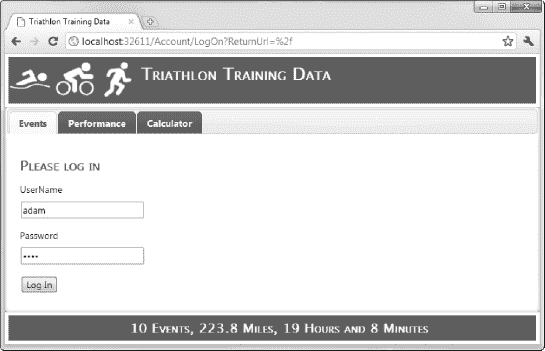

***图 34-5。**登录应用*

仅此而已。一旦我们输入一些有效的凭证，我们将被重定向到事件控制器，我们将看到正常的事件列表。

#### 使用网络表单应用程序

我们使用`Web.config`文件配置授权 WebForm(和核心 ASP.NET)应用程序。清单 34-9 提供了一个例子。

***清单 34-9。**在 Web.config 文件中配置授权*

`<configuration>

**  <location path="Events.aspx">**
**    <system.web>**
**      <authorization>**
**        <deny users="?"/>**
**            <allow users="adam" roles="SiteAdmin"/>**
**        <deny users="*"/>**
**      </authorization>**
**    </system.web>**
**  </location>**
  <system.web>
    <authentication mode="Forms">
      <forms loginUrl="**~/Login.aspx**" timeout="2880">
        <credentials passwordFormat="Clear">
          <user name="adam" password="adam" />
          <user name="joe" password="joe" />
        </credentials>    
    </authentication>
</configuration>`

`location`元素是 configuration 的子元素，包含自己的`system.web`元素。`location`元素的`path`属性定义了应用策略的 URL:

`<location path="Events.aspx">`

在本例中，授权策略将应用于`Events.apsx` `page`。下一行拒绝所有匿名用户对页面的访问:

`<deny users="?"/>`

然后，我们为用户`adam`和角色为`SiteAdmin`的任何用户启用访问权限:

`<allow users="adam" roles="SiteAdmin"/>`

最后，我们拒绝任何其他经过身份验证的用户的访问:

`<deny users="*"/>`

当用户没有访问权限时，URL 授权特性会生成一个 HTTP 401 响应(表示“未授权”)，这将触发表单身份验证系统，并将用户定向到我们应用程序的登录 URL。请注意，我已经将它设置为`~/Login.aspx`。

我们需要创建`Login.aspx`页面来处理认证请求。清单 34-10 显示了这个页面。

***清单 34-10。**log in . aspx 页面*

`<%@ Page Language="C#" AutoEventWireup="true" CodeBehind="Login.aspx.cs"
 Inherits="TriathlonApp.Login" %>

<!DOCTYPE html PUBLIC "-//W3C//DTD XHTML 1.0 Transitional//EN"
 "http://www.w3.org/TR/xhtml1/DTD/xhtml1-transitional.dtd">

<html >
<head runat="server">
    <title></title>
</head>
<body>
    <form id="form1" runat="server">
        <h2>Log In</h2>
    

        Please enter your username and password.
    

    <table>
        <tr>
            <td>Username:</td>
            <td><input type="text" id="username" runat="server" /></td>
        </tr>
        <tr>
            <td>Password:</td>
            <td><input type="password" id="password" runat="server" /></td>
        </tr>
        <tr>
            <td colspan="2" style="text-align:center">
                <input type="submit" value="Log In" />
            </td>
        </tr>
    </table>
    </form>
</body>
</html>`

我在这里采用了一种非常简单的方法——只需要 HTML `form`中的必要元素。WebForm包括一些帮助验证用户身份的控件，包括创建新帐户。查看这些控件最简单的方法是使用 Visual Studio ASP.NET Web 应用程序模板创建一个项目，并查看一下`Accounts/Login.aspx`页面。

我选择这种方法是因为它允许我在代码隐藏类中使用类似的代码，就像我在 MVC 框架应用程序的控制器中所做的那样。[清单 34-11](#list_34_11) 显示了`Login.aspx.cs`文件。

***清单 34-11。**登录代码隐藏类*

`using System;
using System.Web.Security;

namespace TriathlonApp {
    public partial class Login : System.Web.UI.Page {

        protected void Page_Load(object sender, EventArgs e) {

            if (IsPostBack) {
                string user = Request["username"];
                string pass = Request["password"];

                if (FormsAuthentication.Authenticate(user, pass)) {
                    FormsAuthentication.SetAuthCookie(user, false);
                    Response.Redirect(Request["ReturnUrl"] ?? "~/Events.aspx");
                }
            }
        }
    }
}`

我从请求中提取用户名和密码值，并使用它们尝试通过`FormsAuthentication`类进行身份验证。

### 使用成员资格、角色和档案

为了演示认证和授权，我将用户凭证存储在`Web.config`文件中。这对于用户列表不太可能随时间变化的小型简单应用程序来说是可以接受的，但是这种方法有两个明显的限制。第一个问题是，任何能够读取`Web.config`文件的人都有可能破解密码，即使它们是使用加密哈希而不是纯文本存储的(如果你不相信这一点，可以为典型的密码创建一些哈希代码，然后在 Google 上搜索每个哈希代码；至少要弄清楚其中一个密码是不需要太多努力的)。

第二个问题是管理。当用户数量很少时，将凭证放在`Web.config`文件中是可行的，但是当有成百上千的用户时就不可能管理了。除了正确编辑一个有无数条目的文件的困难之外，记住只要我们改变`Web.config`，IIS 就会重新启动应用程序。这将重置所有活动会话，用户将丢失他们在应用程序中的进度。

正如你所料，ASP.NET 有一个解决这些问题的方案——一个标准化的用户账户系统，支持所有常见的用户账户任务，包括注册、管理密码和设置个人偏好。有三个关键的功能领域:

> *   *Membership* , which is about registering user accounts and accessing the repository of account details and credentials.
> *   *Role* , which is about putting users into a group (possibly overlapping), is usually used for authorization.
> *   *Profile* , which allows you to store arbitrary data (for example, personal preferences) on a per-user basis.

ASP.NET 为这三个领域中的每一个都提供了一些标准实现，但是如果需要的话，我们可以通过一个由*提供者*组成的系统来混合和匹配我们自己的定制实现。有一些内置的提供程序可以用不同的方式存储数据，包括 SQL Server 和 Active Directory。使用成员资格、角色和概要文件的内置提供程序有一些实实在在的优势:

> *   Microsoft has gone through a long process of research and design, and has come up with a system that can work well in many cases. Even if you only use API (provide your own storage and UI), you are working for a reasonable design.
> *   For simple applications, the built-in storage provider eliminates the work of managing your own data access. Given the clear abstraction provided by API, you can upgrade to use a custom storage provider in the future without changing any UI code. All ASP.NET applications share this API, so you can reuse any custom provider or UI component across projects. It is well integrated with other parts of ASP.NET. For example, `User.IsInRole()` is the foundation of many authorization systems. It obtains the role data from the role provider you choose.

当然，也有缺点:

> *   Built-in SQL storage providers need to access your database directly. If you have a strong concept of domain model or use specific ORM technology elsewhere, it feels a bit dirty.
> *   The built-in SQL storage provider needs a specific data schema, which is not easy to share with other data schemas of the application. The Web form control included next to the authentication provider in ASP.NET doesn't work in MVC application, so we need to create our own UI.

我认为遵循 API 是值得的，因为它很好地分离了关注点，并且很好地集成到了 ASP.NET 框架的其余部分。

#### 设置和使用会员资格

该框架附带了 SQL Server ( `SqlMembershipProvider`)和 Active Directory ( `ActiveDirectoryMembershipProvider`)的成员资格提供程序。在本节中，我们将向您展示如何设置最常用的`SqlMembershipProvider`。也有来自第三方的提供者，包括基于 Oracle、NHibernate 和 XML 文件的提供者，尽管我们不会在这里演示它们。

 **提示**使用授权过滤器将角色应用于 MVC 框架应用程序。更多使用角色进行授权的细节和例子见[第十三章](13.html#ch13)。

##### 设置 SqlMembershipProvider

当我们使用 Internet 应用程序模板创建一个新的 MVC 项目时，Visual Studio 将应用程序配置为默认使用`SqlMembershipProvider`类。开始使用其他项目类型的最简单方法是复制这个配置。您可以在[清单 34-12](#list_34_12) 中看到这一点，它显示了为新项目创建的`Web.config`文件的相关部分。

***清单 34-12。**新项目中默认的会员提供商配置*

`<configuration>
  <connectionStrings>
    <add name="ApplicationServices"
         connectionString="data source=TITAN\SQLEXPRESS;Integrated Security=SSPI;
                          AttachDBFilename=|DataDirectory|aspnetdb.mdf;User Instance=true"
                          providerName="System.Data.SqlClient" />
  </connectionStrings>
  ...
   <system.web>
    <membership>
      <providers>
        <clear/>
        <add name="AspNetSqlMembershipProvider"
             type="System.Web.Security.SqlMembershipProvider"
             connectionStringName="ApplicationServices"
             enablePasswordRetrieval="false"
             enablePasswordReset="true"
             requiresQuestionAndAnswer="false"
             requiresUniqueEmail="false"
             maxInvalidPasswordAttempts="5"
             minRequiredPasswordLength="6"
             minRequiredNonalphanumericCharacters="0"
             passwordAttemptWindow="10"
             applicationName="/" />
      </providers>
    </membership>
</system.web>
</configuration>`

使用空模板创建的 WebForm和 MVC 应用程序不包含这些配置元素，所以我们必须手动添加它们。

##### 将 SqlMembershipProvider 与 SQL Server Express 一起使用

SQL Server Express 支持一个名为*用户实例*数据库的特性。这些数据库在使用前不必进行配置。我们只需打开一个到 SQL Server Express 的连接，我们指定的`.mdf`文件就会自动创建(或者如果它已经存在就加载)。这可能是使用数据库的一种便捷方式，因为我们不必担心在 SQL Server Management Studio 中创建用户帐户、分配数据库访问权限以及执行通常需要的所有其他数据库设置任务。

您可以在清单中看到用户实例数据库是如何配置的。Visual Studio 放入`Web.config`的连接字符串指定`User Instance`是`true`，并且 SQL Server Express 应该使用一个名为`aspnetdb.mdf`的文件。连接字符串的`|DataDirectory|`部分指定文件将在项目`App_Data`目录中创建。ASP.NET 将负责为数据库创建表和存储过程，以支持成员、角色和概要文件特性。

 **提示**Visual Studio 创建的默认设置假定您正在进行开发的同一台计算机上运行 SQL Server Express。如果您喜欢在单独的机器上运行您的数据库，就像我一样，那么您应该更改连接字符串的`data source`部分。比如我的数据库服务器叫`TITAN`，我就把数据源从`data source=.\SQLEXPRESS`改成了`data` `source=TITAN\SQLEXPRESS`。

##### 手动准备 SQL Server

SQL Server 的付费(非 Express)版本不支持用户实例数据库，这意味着我们必须提前准备好数据库，以便为应用程序准备好对成员、角色和配置文件的支持。

我们可以使用 ASP.NET SQL Server 安装向导来配置数据库。运行`aspnet_regsql.exe`，可以在。NET 框架目录(对于 32 位系统，这将是`\Users\*yourName*\Windows\Microsoft.NET\Framework\v4.0.30319`，对于 64 位系统，这将是`\Users\*yourName*\Windows\Microsoft.NET\Framework64\v4.0.30319`)。

单击下一步，跳过欢迎屏幕。在下一个屏幕上选择“为应用程序服务配置 SQL Server”。继续点击下一步，直到你看到如图[图 34-6](#fig_34_6) 所示的屏幕。

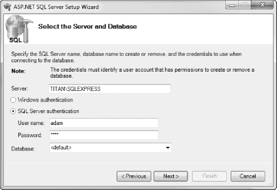

***图 34-6。**选择数据库*

输入 SQL Server 的名称(在本例中，我使用的是运行在开发服务器上的 SQL Express 实例)和连接到数据库所需的凭证。将数据库保留为<default>。这将创建一个名为`aspnetdb`的数据库。</default>

单击 Next 按钮继续完成向导，数据库将被创建和填充。记住更改`Web.config`中的连接字符串以反映新的数据库。[清单 34-13](#list_34_13) 显示了创建该图的数据库的连接字符串。

***清单 34-13。**认证数据库的连接字符串*

`<connectionStrings>
  <add name="ApplicationServices"
        connectionString="data Source=TITAN\SQLEXPRESS;
                          Initial Catalog=aspnetdb;
                          Persist Security Info=True;
                          User ID=adam;Password=adam"
        providerName="System.Data.SqlClient" />
</connectionStrings>`

如果您不确定连接字符串，找出它应该是什么的最简单方法是在 Visual Studio 中打开服务器资源管理器视图，右键单击“数据连接”,然后选择“添加连接”。您可以从新创建的连接的属性中获取连接字符串。还可以看到已经创建好的表格，如图[图 34-7](#fig_34_7) 所示。

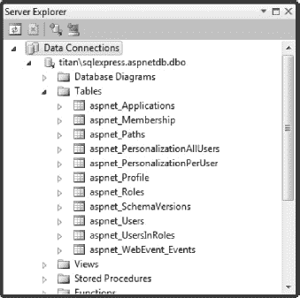

***图 34-7。**为认证数据库创建的表格*

##### 管理会员资格

成员资格 API 包含管理注册用户集的方法:添加和删除用户帐户、重置密码等方法。很可能您想要实现自己的基于 web 的管理 UI(它在内部调用这些方法)来让站点管理员管理用户帐户数据库。

然而，在一些简单的情况下，您可能不需要实现任何定制的用户管理 UI，而是使用平台的两个内置管理 UI 之一:*网站管理工具* (WAT)或 IIS *。NET 用户*工具。

###### 使用网站管理工具(WAT)

在开发过程中，我们可以使用 WAT 来管理成员资格，WAT 包含在 Visual Studio 中。WAT 是一个基于 web 的 UI，可以通过在 Visual Studio 中选择项目ASP.NET 配置来启动。主页上的一个选项是安全，它将带您进入可用于管理用户和角色的功能，如图[图 34-8](#fig_34_8) 所示。

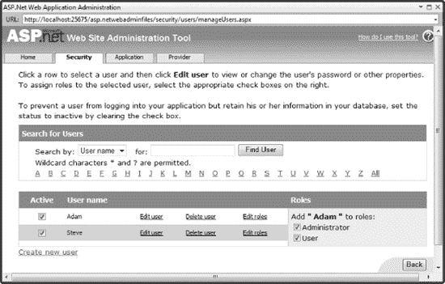

***图 34-8。**网站管理工具*

###### 使用 IIS。网络用户工具

一旦我们部署了应用程序，我们就可以通过 IIS 管理应用程序的用户。NET 用户选项，但是这样做需要我们解决 IIS 管理器工具的一个缺陷。

当我们使用。选项，IIS 管理器工具读取我们的`Web.config`文件，并试图确保我们正在使用的成员资格提供者是值得信任的。不幸的是，IIS 管理器是用。NET 2，并且还没有被更新以支持在 ASP.NET 4 中使用的提供者类。在当前的 IIS 版本中，微软选择简单地禁用。NET 用户选项，用于使用。NET 4，不是最有用的解决方案。

我们可以通过在 IIS 上创建一个非常简单的应用程序来解决这个问题。NET 2.0，并连接到我们的会员数据库。我们将使用与实际应用程序相同的连接字符串，以便我们通过变通方法所做的更改在两个应用程序中都生效。

第一步是在服务器上创建一个空目录，用于存放变通应用程序。在我们的服务器上，我们创建一个名为`C:\AuthManager`的目录。接下来，在目录中创建一个名为`Web.config`的文件，并设置内容以匹配[清单 34-14](#list_34_14) 。

***清单 34-14。**管理会员资格的 Web.config 文件*

`<?xml version="1.0" encoding="UTF-8"?>

<configuration>
  <connectionStrings>
    <add name="ApplicationServices" connectionString="data Source=TITAN\SQLEXPRESS;
       Initial Catalog=aspnetdb;
       Persist Security Info=True;
       User ID=adam;Password=adam"
         providerName="System.Data.SqlClient" />
  </connectionStrings>

  <system.web>

    <authentication mode="Forms">
      <forms loginUrl="~/Account/LogOn" timeout="2880" />
    </authentication>

    <membership>
      <providers>
        <remove name="AspNetSqlMembershipProvider"/>
        <add name="AspNetSqlMembershipProvider"
**             type="System.Web.Security.SqlMembershipProvider,**
**            System.Web, Version=2.0.0.0, Culture=neutral,**
**            PublicKeyToken=b03f5f7f11d50a3a"**
             connectionStringName="**ApplicationServices**"
             applicationName="/"
        />
      </providers>
    </membership>
  </system.web>
</configuration>`

这是一个精简的`Web.config`文件，有两个配置部分。第一个是成员资格数据库的连接字符串。您应该对此进行编辑，以匹配您的环境。第二个区域指定。成员资格提供程序类的. NET 2.0 版本。你必须注意完全按照我给你看的抄下来。以粗体显示的第二个属性是连接字符串的名称。这必须与文件前面给连接字符串的名称相匹配。

打开 IIS 管理器，右键单击某个网站，然后选择“添加应用程序”。将应用程序的名称设置成容易记忆的东西(我用的是 AuthManager)，将物理路径设置成你之前创建的目录，如图[图 34-9](#fig_34_9) 所示。

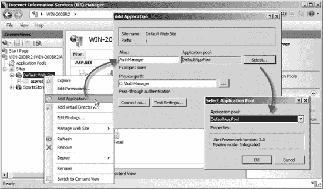

***图 34-9。**创建变通应用*

创建应用程序时，请确保将其分配给使用 2.0 版的应用程序池。NET 框架。如图所示，我已经将应用程序分配给了 DefaultAppPool。

创建应用程序后，在 IIS 管理器窗口的左侧面板中选择它。如果您按照说明进行了操作，您应该会看到一个名为。NET 用户，如图[图 34-10](#fig_34_10) 所示。

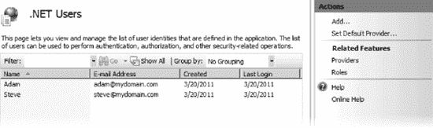

***图 34-10。**非法入境者。网络用户功能*

使用这个特性，我们可以管理应用程序的用户，就像我们在开发过程中使用 WAT 一样。

#### 设置和使用角色

到目前为止，我们已经看到了框架如何管理应用程序的一组凭证并验证登录尝试(通过成员资格提供者)，以及它如何跟踪访问者在多个请求中的登录状态(通过表单身份验证)。这两者都是身份验证的方面，这意味着安全地识别某个人是谁。

另一个常见的安全需求是*授权*，这是确定用户通过身份验证后可以做什么的过程。ASP.NET 使用一种基于角色的授权方法，这意味着动作被限制在一组角色中，如果用户被分配到这些角色中的一个，他们就被允许执行动作。

使用唯一的字符串值来表示角色。例如，我们可以选择定义三个角色，如下所示:

> *   `ApprovedMember`
> *   commentator
> *   `SiteAdministrator`

这些只是任意的字符串，但是当例如我们的应用程序只将管理员访问权授予`SiteAdministrator`角色的成员时，它们就有了意义。每个角色都完全独立于其他角色——没有等级之分——所以成为`SiteAdministrator`并不自动授予`CommentsModerator`角色甚至`ApprovedMember`角色。每一个都必须独立分配；给定成员可以担任任何角色组合。就像成员一样，ASP.NET 平台希望我们通过它的提供者模型与角色合作，提供一个通用的 API(`RoleProvider`基类)和一组内置的提供者供您选择。当然，我们可以实现自己的自定义提供程序。

##### 设置 SqlRoleProvider

`SqlRoleProvider`类是对`SqlMembershipProvider`的补充，使用相同的数据库模式为角色提供支持。当我们使用互联网应用程序模板创建一个 MVC 框架项目时，Visual Studio 会自动在`Web.config`文件中添加元素来设置`SqlRoleProvider`，如[清单 34-15](#list_34_15) 所示。

***清单 34-15。**Visual Studio 创建的 SqlRoleProvider 配置*

`<configuration>
  <system.web>
    <roleManager enabled="false">
      <providers>
        <clear/>
        <add name="AspNetSqlRoleProvider"
             type="System.Web.Security.SqlRoleProvider"
             connectionStringName="ApplicationServices"
             applicationName="/" />
        <add name="AspNetWindowsTokenRoleProvider"
             type="System.Web.Security.WindowsTokenRoleProvider"
             applicationName="/" />
      </providers>
    </roleManager>
</configuration>`

注册了两个角色提供者，但是默认情况下，都没有启用。要设置`SqlRoleProvider`，我们必须像这样更改`roleManager`元素:

`<roleManager enabled="true" defaultProvider="AspNetSqlRoleProvider">`

 **提示** `AspNetSqlRoleProvider`使用与`SqlMembershipProvider`相同的数据库模式，这意味着必须使用我在本章前面向您展示的技术之一来准备数据库。如果你已经为`SqlMembershipProvider`准备好了数据库，那么你就不必重复这个过程。

或者，如果我们使用 Windows 身份验证，并且希望用户的角色由其 Windows Active Directory 角色决定，我们可以选择`AspNetWindowsTokenRoleProvider`作为角色提供者。

##### 管理角色

我们可以使用与管理成员相同的技术来管理角色——要么实现我们自己的基于 web 的管理 UI，要么在开发期间使用 WAT 并使用 IIS 管理器。NET 用户特性。在后一种情况下，我们仍然需要实施变通办法来使用 IIS 管理器功能，如图 34-11 所示。

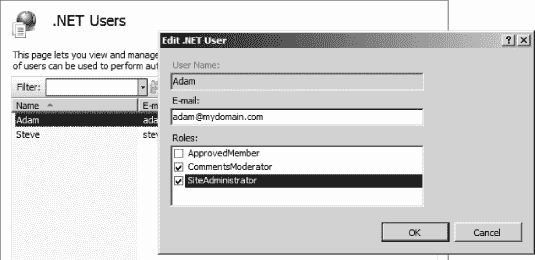

***图 34-11。**使用 IIS 管理器管理角色。网络用户工具*

我们必须向变通应用程序的`Web.config`文件中添加一些配置元素，以启用对角色提供者的支持，如下所示:

`<roleManager enabled="true" defaultProvider="AspNetSqlRoleProvider">
    <providers>
        <clear/>
        <add name="AspNetSqlRoleProvider"
           type="System.Web.Security.SqlRoleProvider,
            System.Web, Version=2.0.0.0, Culture=neutral,
            PublicKeyToken=b03f5f7f11d50a3a"
           connectionStringName="ApplicationServices"
           applicationName="/" />
    </providers>
</roleManager>`

#### 设置和使用配置文件

*成员身份*记录我们的用户，而*角色*记录他们被允许做什么。如果我们想要跟踪其他每个用户的数据，如“会员积分”、“网站偏好”或“最喜欢的食物”，那么我们可以使用*配置文件*——一个通用的、特定于用户的数据存储，它遵循与会员和角色相同的提供者模式。

对于使用`SqlMembershipProvider`和`SqlRoleProvider`的小型应用程序来说，这是一个很有吸引力的特性，因为概要文件是使用相同的数据库模式维护的。但是，在较大的应用程序中，有一个定制的数据库模式和一个更强的域模型概念，您可能会有一个不同的、更好的基础结构来存储特定于您的应用程序的每用户数据。

##### 设置 SqlProfileProvider

我们在`Web.config`文件中添加元素来配置`SqlProfileProvider`，如[清单 34-16](#list_34_16) 所示。从清单中可以看出，设置`SqlProfileProvider`的方法遵循与其他两个提供者相同的模式。

***清单 34-16。**设置 SqlProfileProvider*

`<configuration>
  <system.web>
**    <profile>**
**      <providers>**
**        <clear/>**
**        <add name="AspNetSqlProfileProvider"**
**             type="System.Web.Profile.SqlProfileProvider"**
**             connectionStringName="ApplicationServices"**
**             applicationName="/" />**
**      </providers>**
**    </profile>**
  </system.web>
</configuration>`

##### 配置、读取和写入配置文件数据

在使用配置文件特性之前，我们必须定义我们想要使用的配置文件数据的结构。我们通过在`Web.config` `profile`元素中添加`properties`元素来做到这一点，如[清单 34-17](#list_34_17) 所示。

***清单 34-17。**定义轮廓数据的结构*

`<profile>
  <providers>
    <clear/>
    <add name="AspNetSqlProfileProvider"
         type="System.Web.Profile.SqlProfileProvider"
         connectionStringName="ApplicationServices"
         applicationName="/" />
  </providers>
**  <properties>**
**    <add name="Name" type="String"/>**
**    <group name="Address">**
**      <add name="Street" type="String"/>**
**      <add name="City" type="String"/>**
**      <add name="ZipCode" type="String"/>**
**      <add name="State" type="String"/>**
**    </group>**
**  </properties>**
</profile>`

正如您在清单中看到的，我们可以一起定义单独的概要文件属性或与组相关的属性。我们在清单中定义的所有属性都是字符串，但是概要文件系统支持任何字符串。可以序列化的. NET 类型。然而，如果我们使用自定义类型，我们会付出性能代价，因为`SqlProfileProvider`类不能确定从自定义类型创建的对象是否已经被修改，并且会在每次修改概要文件时将对象写入数据库。

使用 ASP.NET WebForm时，配置文件数据是通过代理对象访问的，该代理对象的属性与配置文件属性相对应。这个特性对于 MVC 框架应用程序是不可用的，但是我们可以使用`HttpContent.Profile`属性来访问概要文件属性，这个属性可以通过`Controller`类获得，如[清单 34-18](#list_34_18) 所示。

***清单 34-18。**读写配置文件属性*

`public ActionResult Index() {

**    ViewBag.Name = HttpContext.Profile["Name"];**
**    ViewBag.City = HttpContext.Profile.GetProfileGroup("Address")["City"];**

    return View();
}

[HttpPost]
public ViewResult Index(string name, string city) {
**    HttpContext.Profile["Name"] = name;**
**    HttpContext.Profile.GetProfileGroup("Address")["City"] = city;**

    return View();
}`

ASP.NET 框架使用配置文件提供程序在我们第一次访问配置文件数据时为用户加载配置文件属性，并在请求结束时通过提供程序写回任何修改。我们不必显式地保存更改；它会自动发生。

###### 启用匿名档案

默认情况下，配置文件数据只对经过身份验证的用户可用，如果我们试图在当前用户尚未登录时写入配置文件属性，将会引发异常。我们可以通过启用对*匿名概要文件*的支持来改变这一点，如[清单 34-19](#list_34_19) 所示。

***清单 34-19。**启用匿名档案支持*

`<configuration>
  <system.web>
**    <anonymousIdentification enabled="true"/>**
    <profile>
      <providers>
        <clear/>
        <add name="AspNetSqlProfileProvider"
             type="System.Web.Profile.SqlProfileProvider"
             connectionStringName="ApplicationServices"
             applicationName="/" />
      </providers>
      <properties>
        <add name="Name" type="String" **allowAnonymous="true"/>**
        <group name="Address">
          <add name="Street" type="String"/>
          <add name="City" type="String" **allowAnonymous="true"/>**
          <add name="ZipCode" type="String"/>
          <add name="State" type="String"/>
        </group>
      </properties>
    </profile>
  </system.web>
</configuration>`

当启用匿名识别时，ASP.NET 框架将通过给匿名用户一个名为`.ASPXANONYMOUS`的 cookie 来跟踪匿名用户，该 cookie 将在 10，000 分钟后过期(大约 70 天)。我们可以通过将`allowAnonymous`属性设置为`true`来启用对配置文件属性的匿名支持；在清单中，我们启用了对`Name`和`City`属性的匿名支持。

启用匿名配置文件使得未经验证的用户可以读写配置文件数据，但是要注意，每个未经验证的访问者都会自动在配置文件数据库中创建一个用户帐户。

### 总结

在本章中，您学习了如何为 ASP.NET 应用程序配置和应用身份验证和授权。该功能内置于核心 ASP.NET 平台中，根据使用的应用程序类型，使用方式略有不同。建立底层数据库可能是一个令人沮丧的过程，但是一旦完成，执行身份验证和应用授权的任务就简单明了了。