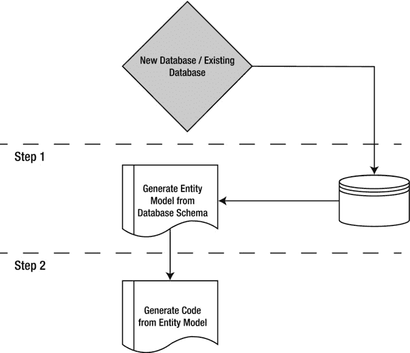

第一章


ASP.NET 4.5 数据来源

过去十年见证了计算设备影响我们生活方式的非凡演变。它们远比我们想象的更普遍，更受环境驱动。万维网已经从一个不起眼的链接页面集合转变为一个基于上下文和用户动作显示动态行为的集合。今天的网站能够显示响应式设计，根据目标设备的分辨率改变布局，根据用户的位置传送内容，展示媒体而无需用户下载和安装任何特定于媒体的插件，这样的例子不胜枚举。未来十年，客户沉浸式的流体体验将推动创新。

在使用 Visual Studio 作为快速应用开发的首选工具来快速构建动态网站的方式上，ASP.NET 是一个巨大的飞跃。我们确信您仍然喜欢在 web 应用设计图面上拖放现成的控件，然后只需几次点击就可以将它们绑定到数据源的方式。自成立以来，ASP.NET 的发展也是惊人的，为了与时俱进，ADO.NET 也经历了不少变化。今天，它支持多种数据访问范例，包括 *WCF (Windows 通信基础)*用于 *REST(代表性状态转移)**风格的*创建、读取、更新和删除 CRUD 操作的数据服务。

在本章中，您将对现代数据访问范例有一个粗略的了解，这将帮助您了解数据访问组件的设计方式，并进而使用它们来满足您的应用需求。这将是一个非常高的水平，没有进入任何最后一英里的实施细节。这里讨论的概念将在本书的其余部分中使用，以帮助您理解范式的不同组件是如何组合起来构建数据驱动的网站的。

 **注意**数据访问范例将在第 8 章的[中详细讨论。](08.html)

根据概述，我们将介绍以下内容:

*   什么是新的数据访问范例？
*   ASP.NET 4.5 网站可以使用哪些不同的数据源？
*   ADO.NET 有哪些增强功能？
*   如何在 ASP.NET 4.5 和 ASP.NET MVC 4 中创建你的第一个数据驱动页面？

如果你不确定数据驱动的网站是不是一个好主意，那么我们强烈建议你阅读 Damien Foggon 的《ASP.NET 2.0 数据库入门:从新手到专家》一书。它是本书所讨论内容的很好的先驱，你将很容易理解这里讨论的较新的概念。

新的数据访问范例

您如何决定在您的开发工作流程中构建数据访问层的方法？幸运的是，在设计过程中，决策在很高的层面上是相当简单的，它仅由几个可能的场景驱动:

*   **数据库已经存在:** 在这种情况下，您可以选择从现有的数据库生成一个实体模型，然后使用该实体模型创建数据访问层。

 **注** *实体模型* 是通常在概念模型生成器的帮助下从数据库模式生成的实体关系图。微软。NET Framework 4.5 在 ADO.NET 实体框架中提供了一个内置的模型生成器。

*   **数据库是新创建的:** 在这种情况下，又有几个选项。您可以首先创建实体模型，然后使用它来驱动创建数据库的步骤。您也可以先创建数据库，然后像前面描述的那样自动生成实体模型。

 **提示**从实体模型优先的方法开始是个好主意。这样，您就有机会处理概念模型，直到它被冻结，而不必每次都更改数据库模式，并避免惹恼团队中的 DBA。

前面的场景是由以设计为中心的应用开发方法驱动的。您还可以选择以代码为中心的方法，许多开发人员更喜欢这种方法，因为在代码中操作比在设计图面上修改模型更容易。支持以代码为中心的方法的另一个理由是易于部署；然而，你需要小心，因为你可能会写很多代码！

对于一个新的数据库，以代码为中心的方法比现有数据库更简单。有一些工具可以为现有的数据库生成代码；然而，它很容易出错，并且您可能会失去按照您想要的方式构建代码的灵活性。

 **注意**以代码为中心的方法在开发人员社区中越来越受欢迎，因为它提供了更大程度的灵活性和控制。开发人员感觉被赋予了权力，在数据库(或其子集)可能是除数据库服务器之外的手持设备中的独立存储的一部分的场景中，多目标部署通常更容易。

总之，现代应用开发中的三种数据访问范例如下所示:

*   **数据库先行:** 从数据库模式逆向工程实体模型。使用工具从实体模型中自动生成实体类。图 1-1 展示了这种数据访问范例。



[图 1-1。](#_Fig1)数据库优先数据访问模式的开发人员工作流程

*   **模型先行:** 在设计器中创建实体模型。从实体模型生成数据库模式和实体类。[图 1-2](#Fig2) 展示了这一范例。


[图 1-2。](#_Fig2)模型优先数据访问范例的开发人员工作流程

 **注意**对于现有的数据库，模型优先的方法比新数据库更复杂。为了简单起见，图 1-2 中的插图忽略了额外的细节。你将在第 8 章中进一步了解它。

*   **代码先行:** 在代码中定义模型和关系。对于新的数据库场景，在运行时自动创建它。图 1-3 展示了这种数据访问范例。


[图 1-3。](#_Fig3)代码优先数据访问范例的开发人员工作流程

ASP.NET 的数据来源 4.5

在 ASP.NET，从标准的关系数据库到服务和提要，对大量数据源的支持有了显著的发展。

在很长一段时间里，关系数据库与 ADO.NET 及其前身 ADO 一起统治了数据源世界。虽然 ADO.NET 仍然占主导地位，但像 NoSQL 数据库、feeds 和服务这样的新来源正在获得非常强大的立足点。让我们探索一些现代 web 应用开发场景中非常流行的数据源。

ADO.NET 数据来源

ADO.NET 继续统治着. NET 世界。它的流行通常归功于它能够将数据访问和操作干净地分离成可以独立使用的离散组件。

ADO.NET 课程是。NET Framework 4.5，它们执行三个不同的任务:

*   使用连接到数据库。NET Framework 4.5 数据提供程序
*   执行命令
*   检索结果

ADO.NET 的数据源列表相当详尽，它包括关系数据库，如 Microsoft SQL Server 和 Oracle，可以使用 ODBC 和 OLE DB 驱动程序访问的数据源，以及概念模型，如*实体数据模型(EDM)* 。EDM 是新的，在第 6 章的[中有详细讨论。](06.html)

从 ADO.NET 数据源检索到的结果既可以直接处理，也可以存储在`DataSet`中供进一步操作。ADO.NET`DataSet`是非常受欢迎的数据处理能力，如从多个来源获取数据，并在显示前汇总。

nosql〔t0〕

整个开发人员社区(微软或其他)一直在加班加点地构建解决方案，以弥合现成软件和企业内部实际需求之间的差距。“NoSQL 运动”，正如 Ted Neward 在他的文章“*工作的程序员——带着 MongoDB* 去 NoSQL”中所说，可以在`http://msdn.microsoft.com/en-us/magazine/ee310029.aspx`找到，是一场革命。它挑战了所有类型的数据都适用于关系数据库的理论，并促进了面向文档的数据库存储非结构化数据和需要频繁访问的数据的想法。博客是使用 NoSQL 数据库作为数据存储的一个很好的例子。完全不相关的帖子经常更新站点，尽管更新帖子和提交评论需要并发控制，但并不存在这样的原子事务需求。内容管理系统也是 NoSQL 数据库比传统的 T4 关系数据库管理系统更适合的好例子。

现在有很多 NoSQL 数据库，但是最流行的是 *MongoDB* 和 *CouchDB* 。虽然他们相似，但他们有不同的侧重点。 MongoDB 专注于高性能，而 CouchDB 则面向高并发。

 **注意**在中没有像 MongoDB 那样访问 NoSQL 数据库的本地方法。网；但是，有。社区提供的. NET Framework 驱动程序。

网络服务

Web 服务允许通过 HTTP 访问存储在远程服务器上的数据。在我们今天生活的世界中，术语“web 服务”已经成为通过 HTTP 使用 *SOAP(简单对象访问协议)* 规范进行数据交换的同义词。他们有自己的进化故事。经历了各种标准化周期后，web 服务现在是任何现代应用架构的一部分。事实上，一个完整的架构层刚刚以*面向服务的架构(SOA)* 的形式出现，这是从多年来实现服务的模式中形成的。英寸服务已经将利用 WS*规范的从 *web 服务增强(WSE)* 转变为 WCF 形式的成熟框架特性，该特性在。NET 框架 3.0。

ASP.NET 4.5 web 应用可以配置为使用代理来消费 web 服务，或者它们可以使用WCF*富互联网应用(RIA)* 服务域服务来访问数据。WCF RIA 服务域服务将自动为 CRUD 操作生成方法。

WCF 数据服务

WCF 数据服务支持使用 *开放数据协议(OData)* 对数据进行 CRUD 操作。微软已经将 OData 深深地嵌入到它的数据访问策略中。OData 支持现已在其所有新一代平台中提供，包括 SQL Server 2008 R2、SQL Server 2012、Windows Azure 存储、SharePoint 2013 和 PowerPivot。

数据服务将允许以 REST 风格访问数据模型，并具有灵活的查询和关联遍历功能。这将允许与 ASP.NET 等网络平台的自然整合。数据服务允许数据以众所周知的格式表示，比如 JSON 和 ATOM。

 **注意**在 RESTful 服务中，GET、POST、PUT 和 DELETE 等 HTTP 动词被用作 CRUD 操作的动作。由于 HTTP 协议在包括 web 浏览器在内的应用中的广泛应用，REST 风格的数据访问变得越来越流行。该协议的开放性也使其易于跨异构平台使用。

联合服务

使用服务作为数据源的一个自然扩展是允许访问像 RSS 和 ATOM 这样的联合提要。ASP.NET 能够阅读和解析联合供稿，并显示适当的结果。

Azure 存储

Windows Azure 以表、Blobs 和队列的形式免费提供存储功能。ASP.NET 应用可以利用 Azure 存储作为数据存储，并使用开放数据协议执行数据访问操作。

HTML 5 本地存储

这是一个相对较新的概念，它强调了构建利用客户机能力的应用的重点转移。本地存储用于以类似于 HTTP cookies 的方式在 web 客户端中存储结构化数据，但是具有对跨客户端的多个窗口存储会话数据的强大支持。

[图 1-4](#Fig4) 展示了使用 ASP.NET 4.5 构建数据驱动网站的不同数据源:


[图 1-4。](#_Fig4)ASP.NET 4.5 数据来源

 **注意**此外，XML、Text、PDF、CSV 和 Office 文档等文件也是 ASP.NET 网站的数据源。那个。NET Framework 在`System.Xml`命名空间中有对 XML 文档的标准支持，XML 文件可以直接转换成数据集。对于 CSV 和 Excel 等文件类型，标准 ODBC 和 OLE DB 驱动程序可通过 ADO.NET 直接访问。

ADO.NET 介绍。NET 框架 4.5

ADO.NET 已经存在一段时间了。它仍然是从各种来源获取数据并将其提供给数据驱动的 ASP.NET 网站的首选手段。当 ADO.NET 第一次到来时，它是从它的前身 ADO 的一个范式转变。尽管 ADO.NET 的核心特性(充当关系数据库的一致数据源和 OLE DB 和 ODBC 驱动程序支持的数据源)在过去几年中保持不变。NET 框架修订周期，很多工作已经进入了提高性能和增加新的功能，如实体框架。实体框架的引入是一个显著的变化，它允许应用根据概念模型工作，并提供更高程度的抽象。

ADO.NET 有什么新鲜事？

正如我们之前提到的，ADO.NET 最显著的变化是在中引入了实体框架。NET 框架 3.5 SP1。随后，实体框架特性在中得到了增强。NET Framework 4.0(就像模型优先方法的引入，允许开发人员先构建概念模型，然后创建支持数据库)然后在。NET Framework 4.5(比如 SQL Server 2012 中对 enum 和新数据类型的支持)。

 **注意**不是所有版本的实体框架都是核心的一部分。NET 框架。某些版本(如 Entity Framework 4.1、4.1 Update、4.2 和 5)是基于的相关版本构建的。NET Framework，它们通常作为实体框架 NuGet 包提供。

实体框架 5.0

实体框架 5.0 建立在。NET Framework 4.5，它有许多新的补充。值得一提的是，Microsoft SQL Server 2012 支持新的数据类型，如地理和几何空间；支持表值函数；查询性能的改进；以及对使用实体模型向导批量导入存储过程的强大支持。

此外，还引入了对一个模型的多个图的支持，以及在实体设计器界面中更改形状颜色的能力。另一个值得注意的增强是对 LocalDb 数据库服务器的支持。默认情况下，Visual Studio 2012 使用对 LocalDb 数据库服务器的引用，而不是 SQLEXPRESS。如果 SQLEXPRESS 在机器中不可用，则实体框架将 LocalDb 注册为默认数据库服务器。

SqlClient 数据提供程序

`SqlClient`数据提供程序允许打开到 SQL Server 数据库实例的连接。您可能已经无数次看到它出现在配置文件的连接字符串信息中。

中的`SqlClient`数据提供程序增加了几个新特性。NET 框架 4.5。该提供程序现在支持 SQL Server 下一版本中引入的新功能，如高可用性、流支持和更新的空间数据类型。它还支持 LocalDb、扩展保护，并允许对数据访问进行异步编程。我们将在接下来的章节中探讨其中的一些新特性。

ADO.NET 和 LINQ

不是每个应用程序员都喜欢编写 SQL 查询。引入 LINQ 的目的是允许开发人员在应用中针对可枚举数据编写基于集合的查询。合乎逻辑的延伸是在 ADO.NET 提供支持。有几种 LINQ 风味可供选择。网络:

*   LINQ 到数据集:优化查询 a `DataSet`
*   LINQ 到 SQL:对 SQL Server 数据库模式的直接查询
*   实体的 LINQ:查询概念模型

数据提供者

数据提供者是轻量级的本地接口，用于访问各种来源的数据，如关系数据库(SQL、Oracle)、ODBC 和 OLEDB 数据源(如 MS-Access、MS-Excel)和实体数据模型。用于实体数据模型的`EntityClient`提供者相对较新，它是在。NET 框架 3.5。

 **注意**与其他数据提供者不同， `EntityClient`提供者不直接与数据源交互。它使用实体 SQL 充当其他本地提供者如`SqlClient`和`OracleClient`之间的桥梁。

`EntityClient` API ( `System.Data.EntityClient`)类似于其余的数据提供者，并为连接(`EntityConnection`)和命令(`EntityCommand`)对象提供了等效物。下面的代码演示了如何使用实体 SQL 查询概念模型:

```cs
string connectionString =
    "Metadata=.\\<specify the entity here>.csdl|.\\< specify the entity here >.ssdl|.\\< specify the entity here >.msl;" +
    "Provider=System.Data.SqlClient;Provider Connection String=\"" +
    "Data Source=localhost;Initial Catalog=<specify the database name>;Integrated Security=True\"";
```

 **注意**`EntityClient`的连接字符串信息不同于常规连接字符串。您需要在元数据属性中指定`<entity>`概念模型信息，并且在提供者属性中设置实际的提供者信息。

```cs
try
{
    using (EntityConnection connection =
        new EntityConnection(connectionString))
    {
        connection.Open();
        EntityCommand command = new EntityCommand(
            "<Specify your SQL Select Statement here>",
            connection);
        // Entity command requires SequentialAccess
        DbDataReader reader = command.ExecuteReader(
            CommandBehavior.SequentialAccess);
        while (reader.Read())
        {
            Console.WriteLine("{0}\t{1}",
                reader[0], reader[1]);
        }
    }
}
catch(QueryException ex)
{
    Console.WriteLine(ex.ToString());
}
```

EntityClient 数据提供程序的引入使开发人员能够从业务服务中抽象出本机提供程序信息，从而促进了可按需替换的可插入数据访问层的开发。这对于构建与提供商无关的数据驱动的 ASP.NET 网站非常重要。

异步数据访问

之前。NET Framework 4.5，编排异步操作是笨拙的。许多开发人员发现很难针对。NET 框架。这不再是。NET 框架 4.5。它引入了一个过于简化的`async`编程模型，在这个模型中，您可以在不使用回调的情况下执行异步调用。中的`async`和`await`修饰符。NET Framework 4.5 用于此目的。

数据库操作通常很耗时，谨慎的做法是异步执行这些操作，以保持用户界面相对自由，让用户继续工作而不会死机。在的早期版本中。NET Framework 中，数据提供者公开了类似于`BeginExecuteNonQuery` 的`SqlCommand`方法，这些方法允许异步执行 T-SQL 语句或存储过程。该实现返回一个`IAsyncResult`类型的,可以用于轮询或等待结果。一种`IAsyncResult`类型的实现要求方法成对地在开始操作和结束操作中公开。`SqlCommand`还公开了一个`EndExecuteNonQuery` 对，用于完成异步操作。调用`EndExecuteNonQuery`方法时需要`IAsyncResult`，除非执行命令的过程完成，否则将会阻塞。

```cs
using (var connection = new SqlConnection("..."))
            {
                try
                {
                    var command = new SqlCommand(commandText, connection);
                    connection.Open();
                    var callBack = new AsyncCallback(CallBack);

                    var result = command.BeginExecuteNonQuery(callBack, command);
                    while (!result.IsCompleted)
                    {
                        //TODO: Continue to perform your other operations here
                    }

                }
                catch (SqlException)
                {
                    //Log Exception
                }
                catch (Exception)
                {
                    //Log Exception
                }

            }
```

您会注意到主线程没有被阻塞，并且您可以继续在检查`IAsyncResult IsCompleted`属性的`while`循环中看到结果。一个简单的回调处理程序如下所示:

```cs
private static void CallBack(IAsyncResult result)
        {
            try
            {
                var command = (SqlCommand)result.AsyncState;
                command.EndExecuteNonQuery(result);
            }
            catch (Exception)
            {
               //Log Exception
            }
        }
```

对于命令的简单异步执行，这需要大量代码。您将发现这是如何在中简化的。NET 框架 4.5。

 **注意**为了让异步操作工作，需要在配置文件的连接字符串元素上设置属性“`Asynchronous Processing=true`”。

异步编程模型。NET 框架 4.5

刚刚讨论的异步编程模型在。NET 框架 4.5。它将继续得到支持；然而，首选的方法是使用新的模型，利用基于任务的并行编程模式以及`async`和`await`修饰符。恰当地实现修饰符是非常重要的。除非通过一个或多个`await`修饰符进行异步调用，否则实现可以变成同步的。`async`修饰符表示异步操作，当程序执行遇到`await`修饰符时，退出当前方法。当分叉的任务完成时，执行在方法中继续。

 **注意**如果连接字符串中的属性“`Context Connection`”设置为“`true`”，则不支持异步操作。

ADO.NET`Async`编程模型在。NET Framework 4.5 为数据提供程序公开的每个同步方法公开了一个等效的异步方法。继续前面的例子，`SqlCommand ExecuteNonQuery` 命令有一个等价的异步方法，名为`ExecuteNonQueryAsync`。它接受一个 `CancellationToken`作为参数，允许在命令超时前中止操作。

现在，让我们来看看编程模型如何显著减少您必须为相同操作编写的代码行。

```cs
private static async Task<int> ExecuteCommandAsync(SqlConnection connection, SqlCommand command) {
      await conn.OpenAsync();
      await cmd.ExecuteNonQueryAsync();
      return 1;
   }
```

调用方方法可以传递连接和命令实例来调用此方法并执行 T-SQL 语句或过程。

```cs
using (var connection = new SqlConnection("..."))
            {
                try
                {
                    var command = new SqlCommand(commandText, connection);
                    int result = ExecuteCommandAsync(connection, command).Result;
                }
                catch (SqlException)
                {
                    //Log Exception
                }
                catch (Exception)
                {
                    //Log Exception
                }

            }
```

异步编程模型非常健壮，它允许您执行基于任务的命令链。您可以潜在地使用新的异步模式以及使用旧模型的现有异步实现。下面是一个使用先前使用的代码位的示例:

```cs
using (var connection = new SqlConnection("..."))
            {
                try
                {
                    AsyncCallback callBack = new AsyncCallback(CallBack);
                    connection.OpenAsync().ContinueWith((task) =>
                    {
                        SqlCommand cmd = new SqlCommand("...", connection);
                        IAsyncResult ia = cmd.BeginExecuteNonQuery(callBack, cmd);
                    }, TaskContinuationOptions.OnlyOnRanToCompletion);

                }
                catch (SqlException)
                {
                    //Log Exception
                }
                catch (Exception)
                {
                    //Log Exception
                }

            }
```

注意`ContinueWith`方法。它允许您匿名委托基于任务的操作。您可以使用`ContinueWith`选项来执行一系列命令。此外，异步编程模型还提供了对事务的支持:

```cs
transaction = await Task.Run<SqlTransaction>(
             () => connection.BeginTransaction("Transaction")
             );
......

await Task.Run(() => transaction.Commit());
```

开发您的第一个示例

现在让我们将理论付诸实践，探索使用 ASP.NET 4.5 创建数据驱动网站的步骤。

在本练习中，您将使用 Visual Studio 2012 Ultimate Edition 和。NET 框架 4.5。此外，您将在运行 Internet Explorer 10 的 Windows 8 系统中运行该示例。但是，您可以使用 Visual Studio 2012 速成版从运行 Windows 7 或更高版本的计算机上运行此示例。该应用应该可以在 IE 8 或更高版本上正常运行。

Visual Studio 2012 版本在 IIS Express 中包括一个轻量级 web 服务器，因此如果您无法访问完整版本的 IIS，可以使用 Express 版本来测试您的部署。

 **注意**本练习中讨论的一些特性是针对 Visual Studio 2012 的。如果您尝试使用运行此练习，它可能无法正常运行。Visual Studio 2010 中的. NET Framework 4.5。

各种版本的 Visual Studio 2012 和。NET Framework 4.5 可以从`http://www.microsoft.com/visualstudio/eng#downloads`下载。

此外，对于数据访问，您将使用 Visual Studio 2012 附带的 SQL Server Express LocalDB 数据库。然而，该示例应该可以很好地与 SQL Server 2008 R2、SQL Server 2012 和 SQL Azure 一起工作。

试试看:ASP.NET 4.5 中第一个数据驱动页面

在这个例子中，您将使用我到目前为止讨论的实体模型概念在 ASP.NET 4.5 中创建一个简单的数据驱动页面。对于此示例，您将使用 SQL Server Express LocalDB 小工具数据库，该数据库存储有关不同小工具和可用数量的信息。最后，结果将显示小工具的名称，后面是它的类型和数量。

让我们首先创建数据库。请遵循以下步骤:

1.  If you are using Windows 8 to create this example, then Visual Studio can be launched from the Start screen. Go to the Start screen and click the Visual Studio tile, as shown in [Figure 1-5](#Fig5). This will take you to Desktop and launch the *integrated development environment (IDE)*.

    

    [图 1-5。](#_Fig5)从 Windows 8 开始屏幕启动 Visual Studio 2012

2.  In the Visual Studio 2012 IDE, open SQL Server Object Explorer and click the Add SQL Server option, as shown in [Figure 1-6](#Fig6).

    

    [图 1-6。](#_Fig6)连接到 SQL Server 数据库

     **注意**选项，如模式比较和 Transact-SQL 编辑器，它们是 Visual Studio 2010 中数据库菜单的一部分，现在在 Visual Studio 2012 的 SQL 菜单下可用。

    系统将提示您连接到 SQL Server 实例。在服务器名称选项中，指定

    ```cs
    (LocalDb)\v11.0
    ```

    并使用选定的 Windows 身份验证选项进行连接。您将连接到 SQL Server Express LocalDB 的实例。

3.  从 SQL Server 对象资源管理器中，创建数据库小工具。
4.  在小工具数据库下，右键单击表文件夹，然后单击创建表。将表的名称指定为 GadgetStore。
5.  创建字段`Name (nvarchar(50))`、`Type (nvarchar(50))`和`Quantity (bigint)`。
6.  Once finished, click the Update button in the Create Table Design Surface. The script will run and create the table under the Gadgets database as shown in [Figure 1-7](#Fig7). The SQL Server Object Explorer should look like the one shown in [Figure 1-8](#Fig8).

    

    [图 1-7。](#_Fig7)创建小工具数据库和小工具商店表T3】

    

    [图 1-8。](#_Fig8) SQL Server 对象资源管理器

7.  Now that the database and the table are successfully created, let’s add some sample data to be displayed in the dynamic web site. Right-click the GadgetStore table and click the View Data option. Enter the data shown in [Figure 1-9](#Fig9).

    

    [图 1-9。](#_Fig9)gadget store 表的示例数据

8.  Now that the source of data is ready, you will create the ASP.NET 4.5 web site next to consume the data in a data-driven ASPX page. In the VS 2012 IDE, Create a New Visual C# ASP.NET Web Forms Application project and specify the name `FirstDataDrivenWebsite` as shown in [Figure 1-10](#Fig10).

    

    [图 1-10。](#_Fig10)创建新的 ASP.NET WebForm应用项目

9.  Open Solution Explorer. Compile the solution and run the `FirstDataDrivenWebsite` project. Notice that the site launched in your browser is running from IIS Express. The ASP.NET Web Forms Application template comes with a few default implementations. The Default page that is launched in your browser provides a few jump-start instructions as shown in [Figure 1-11](#Fig11). Also notice that it provides an implementation of the membership provider feature of .NET Framework, and you can customize it.

    

    [图 1-11。](#_Fig11)快速启动您的 ASP.NET 应用开发的说明

10.  Next right-click the project, and click Add || New Item. Select the Data tab in the New Item dialog, and choose the ADO.NET Entity Data Model template. Enter the name `GadgetStore.edmx`, and click Add, as shown in [Figure 1-12](#Fig12).

    

    [图 1-12。](#_Fig12)添加 ADO.NET 实体数据模型

11.  添加 ADO.NET 实体数据模型模板将启动实体数据模型向导。在第一步中，您决定是从模型开始(模型优先范式)还是从现有的数据库模式生成它(数据库优先范式)。在本例中，因为您已经创建了数据库，所以您将从数据库优先选项开始。我们将在接下来的章节中探讨模型优先的方法。
12.  In the Choose Model Contents step, select the Generate from database option, as shown in [Figure 1-13](#Fig13).

    

    [图 1-13。](#_Fig13)从现有数据库模式生成实体数据模型

13.  In the Choose Your Data Connection step, click the New Connection button to create a new connection to your instance of SQL Server Express LocalDB. Save the connection string information in the `Web.config` file under the name `Entities` as shown in [Figure 1-14](#Fig14).

    

    [图 1-14。](#_Fig14)实体连接字符串信息

14.  Next, as shown in [Figure 1-15](#Fig15), choose the Database Objects that you want to be part of your Entity Model, including tables, views, and procedures. You also have the option of selecting each individual artifact from the list of database objects. For the generated entities, you can choose singular or pluralized object names and specify if you want to include foreign key columns.

    

    [图 1-15。](#_Fig15)选择你的数据库对象和设置

15.  Click Finish to complete running the wizard and to create the Entity Model. Now you are ready to consume the conceptual model in your web site. There is a nice view-scoping feature in the Solution Explorer. Right-click the `GadgetStore.edmx` file and click “Scope to This,” as shown in [Figure 1-16](#Fig16). This will collapse all the other artifacts from the Solution Explorer and will show only elements related to the `GadgetStore.edmx` file.

    

    [图 1-16。](#_Fig16)确定解决方案结构的范围，仅显示 GadgetStore.edmx 实体和相关对象

Visual Studio 2012 为开发人员提供了许多增强功能。乍看起来，这些变化中的大部分似乎都很小，但是它们累积起来节省了时间和精力，并有助于提高开发人员的整体生产力。其中一个变化是能够从解决方案资源管理器中导航代码。一旦你在文件`GadgetStore.edmx`的范围内，展开`GadgetStore.edmx.designer.cs`文件，你会看到用于创建数据库上下文的方法和属性，如图[图 1-17](#Fig17) 所示。


[图 1-17。](#_Fig17) GadgetStore 对象浏览器和实体模型设计器

此外，还可以点击`GadgetStore.edmx`文件，在设计器中预览实体模型。

1.  在使用实体模型显示数据之前，您需要做几件事情。首先向`FirstDataDrivenWebsite`项目添加一个新的 WebForm，并将其命名为`GadgetStoreView.aspx`。
2.  接下来，修改`Site.Master`母版页以包含到`GadgetStoreView.aspx`页面的链接。双击`GadgetStoreView.aspx`页面，将其固定到 IDE 中。
3.  In the `GadgetStoreView.aspx` page source view, add an ASP.NET Repeater control and set the ItemType property to the namespace containing the conceptual model entities. Notice that once the ItemType property is set, IntelliSense will be available for you to explore and build the Repeater control template with the Entity Model properties. The final code to display the gadget store should look like the following:

    ```cs
    <asp:Repeater ID="gadgetStoreRepeater" ItemType="FirstDataDrivenWebApplication.GadgetStore" runat="server">
                <ItemTemplate>
                    <li>
                        <label>
                           Name: <%#: Item.Name %> || Type: <%#: Item.Type %> || Stock Count: <%#: Item.Quantity %>
                        </label>
                    </li>
                </ItemTemplate>
            </asp:Repeater>
    ```

    为了便于说明，内容以这种格式显示。实际上，这不是你想要的视图；然而，它服务于我们的例子的目的。

     **注意**如果你还在使用 Visual Studio 11 开发者预览版，请注意在 Visual Studio 2012 中`ModelType`属性现在被重命名为`ItemType`。

4.  打开`GadgetStoreView.aspx.cs`文件，在 Page_Load 方法中添加以下代码，将实体模型设置为 Repeater 控件的数据源。T1】

编译解决方案并运行`FirstDataDrivenWebsite`项目。单击 GadgetStore 链接，您将在页面中找到所需的结果。您现在已经创建了您的第一个数据驱动页面！

这种类型的数据绑定是 ASP.NET 4.5 WebForm应用的新功能。先不要担心它是如何工作的；我们将在接下来的章节中详细探讨 ASP.NET 4.5 的模型绑定特性。

 **注意**除了使用强类型模型，还可以使用 EntityDataSource 控件作为视图的数据源，如图[图 1-18](#Fig18) 所示。我们会让你自己去想办法。


[图 1-18。](#_Fig18)entity data source 控件

它是如何工作的

在本章的示例中，您看到了如何从现有的数据库创建一个概念性的实体模型，并使用它创建一个强类型的 Repeater 控件，该控件将实体模型作为数据源。您的实现在物理数据源上创建了一个抽象层，从而方便了在后台使用任何标准数据库。此外，您还看到了 Visual Studio 2012 中的一些新 IDE 功能。

摘要

在本章中，您在很高的层次上探索了新的数据访问范例。您在中了解了 about 的一些增强功能。NET Framework 4.5，特别是围绕可用于构建数据驱动网站的一组新数据源。您学到了以下内容:

*   ASP.NET 4.5 中有许多新的数据源，可以作为 ADO.NET 的一部分使用。
*   along 是随着。NET 框架，并且它最近引入了对概念实体模型的支持。
*   ADO.NET 支持异步操作的健壮编程模型。
*   最后，您使用 Visual Studio 2012 IDE 创建了第一个数据驱动的网站，利用了实体模型和数据库优先的设计概念。

在下一章中，您将了解更多关于 SQL Server 2012 关系数据库的未来。