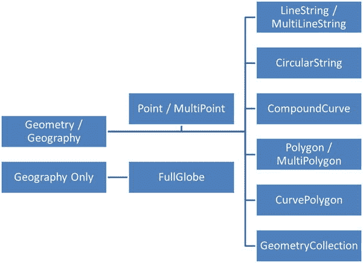

# 二、关系数据库的未来

在第 1 章中，您了解到使用 ASP.NET 4.5 构建的现代数据驱动网站能够使用各种来源的数据。也就是说，关系数据库在企业中的使用处于领先地位，并且是动态网站最广泛使用的数据源。关系数据库在 web 应用中最有意义，这些应用充当等待在企业内部或外部发生的事务的接口。事务可以在用户之间进行，也可以在用户和系统之间进行。对于更像内容驱动的博客、论坛和社交网站的网站来说，另一类数据库比关系数据库更加突出。它们通常被称为 *NoSQL 数据库*，在[第三章](03.html)中会详细讨论。

你可能会问，为什么我们要用一整章的篇幅来讲述关系数据库的未来。我们这样做是因为理解今天大多数数据驱动的网站完全依赖关系数据库来为他们的客户提供相关信息对你来说是很重要的。正确的数据库设计与应用本身的设计一样重要，甚至更重要。关系数据库可能变得非常复杂，虽然您可能已经编写了大量代码来弥补您现在使用的关系数据库中不存在的功能，但是了解任何流行的关系数据库的最新版本中的一些新功能将有助于您在应用和数据库之间适当分配职责方面做出正确的选择。此外，一些新的功能还将帮助您提供数据源，并从应用中执行 CRUD 操作，这比您之前想象的要快得多，也容易得多。

本章并不试图向您介绍关系数据库管理系统的概念，如规范化。在一定程度上，我们假设您对 RDBMS 概念有相当多的了解，并且在构建数据驱动的网站时，您曾经使用过任何一种关系数据库(Microsoft SQL Server、Oracle、MySQL 等等)。相反，我们将重点介绍 Microsoft SQL Server 2012 中引入的新功能，以及它们如何帮助加快您的数据库和应用开发活动。作为同一个生态系统的一部分，Microsoft SQL Server 2012 是这个练习的明显选择。

具体来说，我们将讨论以下内容:

*   关系数据库的未来概述。
*   Microsoft SQL Server 2012 中的新功能。
*   介绍一种非常特殊的数据类型，称为*空间数据。*
*   核心和 T-SQL 功能的增强。
*   数据可视化增强。
*   将您的企业数据库迁移到云中。

 **注**Damien Foggon 的书*ASP.NET 2.0 数据库入门:从新手到专业人士*(Apress，2006 年)从构建数据驱动网站的角度对关系数据库进行了很好的介绍。

关系数据库的发展

在过去的 30 年中，一些数据存储范例已经威胁到关系数据库的存在。在三十年的发展过程中，关系数据库不仅挫败了向它们提出的每一个挑战，而且在这个过程中变得更加强大。如今，它们在所有大型或小型企业中都占有重要的一席之地，并引领着所有其他数据存储和访问机制。话虽如此，他们也不是没有问题。让我们来看看应用开发人员和管理员一次又一次对关系数据库感到沮丧的一些主要原因。

关系数据库的缺点

尽管关系数据库在组织和分解数据方面很简单，但它有两个主要缺点:

1.  对于字典类型的数据结构，RDBMS 不是很直观。
2.  RDBMS 很难向外扩展。

在字典类型的数据结构中，记录存储在键/值对中。这对于关系数据库来说不是很自然，关系数据库用于在不同的规范化域中存储数据。字典类型的数据结构更容易用代码编程，并确保数据完整性成为使用数据的应用的责任。在关系数据库中使用字典类型的数据结构的另一个含义是，报告这样的数据成为一项复杂的任务。传统上，这种数据结构(通常被称为*非结构化数据*)通常被强制作为关系模型的一部分，只是为了利用关系数据库提供的事务优势，并且它们不能通过文件系统进行一般访问。NoSQL 运动产生了大量旨在存储和访问非结构化数据的数据存储。通常，这些是高度可用和分布式的键/值存储，允许以 Pb 或更大的容量存储，并且它们支持卓越的可伸缩性。

微软 SQL Server 如何克服限制

螺纹〔t0〕

我们将在第三章中进一步讨论 NoSQL 运动，但是你猜怎么着？Microsoft SQL Server 存储非结构化数据的能力并不落后。虽然它主要是一个关系数据存储，但它正在扩展其功能，以在 Microsoft SQL Server 2012 中以*文件表*的形式存储非结构化数据。考虑到您可以在 NoSQL 的商店中选择一个更便宜的替代品，或者仅仅使用文件系统，这有什么好处呢？

文件表是 SQL Server 的一个令人兴奋的新特性，主要是因为它们提供了两个世界的最佳特性。文件表扩展到文件系统，允许以文件和文件夹的形式访问数据。它们还负责最低级别的数据完整性，并提供关系数据库管理系统的事务性好处。文件表还使向外扩展以支持大量数据成为可能。我们将在接下来的章节中更多地探讨文件表。

 **注意**微软 SQL Server 2012 有多个版本，就本书而言，所有提及微软 SQL Server 2012 的地方都是指企业版。

蓝色 SQL〔t0〕

水平扩展的复杂性是 NoSQL 爱好者经常提到的问题之一，他们认为这是他们在存储大量非结构化数据方面比关系数据库更胜一筹的原因。SQL Azure 提供按需扩展(T2)，这意味着您只需为您使用的内容付费，如果需要，您可以通过分片向外扩展。SQL Azure 数据库高度可用，并内置了对故障转移和冗余的支持。他们通过*联盟*支持横向扩展。联合是数据库分区的集合，其中数据库中的表按行拆分。联盟由分布式方案支持，该方案确定联盟内的数据分布。在本章的后面你会学到更多关于 SQL Azure 的知识。

 **注** *分片*是一种数据库架构，通过单独保存数据行来实现水平分区。这不同于规范化或垂直拆分。每个分区可以存储在不同的物理机器上。

微软 SQL Server 2012 简介

关系数据库管理系统的概念自从首次引入以来几乎没有改变；然而，基于 RDBMS 概念的专有数据库，如 Microsoft SQL Server 和 Oracle，每隔几年就会发布新的版本，这些版本增加了令人印象深刻的功能并提高了性能。微软和甲骨文都声称自己是更好的 RDBMS，尽管这种选择是有争议的，但我们还是选择使用微软 SQL Server 2012 来展示在本书中构建数据驱动网站的方法。在本节中，我们将探索 Microsoft SQL Server 2012 中引入的一些新功能。

什么是新的？

虽然在 Microsoft SQL Server 的多个服务领域中引入了几个新功能，但就其总体影响而言，您将在本节中了解的新功能是最重要的。

**AlwaysOn:**SQL Server 2012*AlwaysOn*提供所需的 9 个 9 的 SLA。它是镜像的企业替代方案，可确保高可用性。AlwaysOn 功能提供对可用性组的支持，可用性组是一组一起进行故障切换的数据库的故障切换平台。它允许客户访问一组相应的辅助数据库，这些数据库可用于读/写或备份操作。SQL Server 2012 利用 *Windows Server 故障转移群集(WSFC)* 基础架构来支持 AlwaysOn 可用性组。您可以使用 SQL Server PowerShell 或 T-SQL 脚本，或者使用 Management Studio 中的创建可用性组向导来创建新的可用性组。您可以使用从 Management Studio 启动的 AlwaysOn Dashboard 来监控状态，如[图 2-1](#Fig1) 所示。


[图 2-1。](#_Fig1) AlwaysOn 高可用性仪表板

**卓越的性能:**SQL Server 2012 不仅具有提高性能的特性，而且在性能管理方面也有许多增强。SQL Server 2012 引入了一个名为*列存储索引*的特性。这些结合增强的查询处理功能提供了卓越的性能，并减少了对在早期版本中为提高性能而预构建的聚合的依赖。Columnstore 是一个用于提高仓库查询处理性能的新索引。它基于索引列的思想，而不是将它们存储在页面的一行中，而是存储在它们自己的页面集中。

 **注意**列存储索引并不适用于所有地方。事实上，它们会降低某些类型的查询(如外部连接)的性能。

此外，SQL Server 2012 还引入了对 *资源治理*功能的大量增强，这允许您在提供多租户支持的混合平台(如私有云)中执行更好的资源管理。Resource Governor 现在支持 64 个资源池，提供更好的 CPU 利用率，并以更可预测的方式支持资源分配。

 **注意**资源治理仅在微软 SQL Server 2012 企业版中可用。

您可以使用以下 T-SQL 命令创建具有默认资源治理设置的资源池来处理工作负载:

```cs
CREATE RESOURCE POOL TransactionLoadPool
GO
ALTER RESOURCE GOVERNOR RECONFIGURE;
GO
```

或者，您可以通过指定与池相关联的不同属性来覆盖默认设置，如`MIN_CPU_PERCENT`、`MAX_CPU_PERCENT`、`CAP_CPU_PERCENT`、`AFFINITY,`等。您也可以使用 Management Studio 来配置和管理资源池，如图[图 2-2](#Fig2) 所示。


[图 2-2。](#_Fig2)创建和管理资源池

**数据浏览和可视化:**SQL Server Reporting Services(SSRS)的一个名为 *Power View for* *的新功能进行了多项增强，极大地改善了最终用户与报表交互的方式。我们将在接下来的章节中进一步讨论这一点。*

**自含式数据库:** 通常，数据库管理员承担着将数据库从一个环境迁移到另一个环境的复杂任务。直到最近，SQL Server 数据库还与其服务器实例紧密耦合。将数据库从一个服务器实例移动到另一个服务器实例需要确保目标实例具有适当的登录。作为一名 DBA，您还会花相当多的时间来解决校对问题。

在微软 SQL Server 2012 中，引入了 *包含数据库*的概念。在包含的数据库中，大部分数据库元数据信息存储为数据库本身的一部分(而不是存储在 master 中)，这样您可以避免迁移过程中的一些麻烦。此外，所有元数据都是使用相同的排序规则定义的，不需要解决排序规则问题。

在 SQL Server 2012 中，所有数据库都是在包含设置为 NONE 的情况下创建的。通过在创建过程中将 containment 设置为 PARTIAL，可以创建部分包含的数据库，如下所示:

```cs
CREATE DATABASE [Asset] SET CONTAINMENT = PARTIAL
```

 **注意**在创建包含数据库之前，必须在数据库服务器实例上启用包含数据库选项。使用`sp_configure`程序启用包含的数据库选项。

对于现有的数据库，您可以运行 alter 脚本来启用部分包含，或者使用 Management Studio 来打开数据库属性，并在`Options`页面上将`Containment type`设置为`Partial`。

增强的开发人员生产力: 有几个新的增强功能旨在提供更好的数据库开发体验，您将在本书中了解到。一个重要的新增功能是名为 *LocalDB* 的新 SQL Express 数据库。LocalDB 拥有 Express 的所有编程能力，而且是轻量级的，可以在用户模式下运行，无需进行任何配置。

**一致的数据质量:** M 微软 SQL Server 2012 推出了类似*数据质量服务(DQS)* 的服务，以确保一致的数据质量。

在数据进入仓库之前，通常要花费大量的精力来清理数据。在任何企业规模的迁移项目中，这都是一项彻底的数据清理工作。自 SQL Server 2005 以来，微软已经整合了流行的 ETL 工具 *SQL Server 集成服务(SSIS)* 。尽管 SSIS 对于创建*【ETL】*包来说是一个非常健壮的工具，但是它的数据清理功能是有限的，你可能最终会为此使用额外的工具。

尽管在 Microsoft SQL Server 2008 中引入了 *数据分析任务*和 *数据分析查看器*，进一步努力确保数据质量，但通过 *DQS* 充分实现数据清理潜力的是 SQL Server 2012。它是 Microsoft SQL Server 2012 中 SSIS 不可或缺的一部分，以 DQS 清理组件的形式存在，也是 MDS Excel 外接程序中*【Master Data Services(MDS)*的一部分。对这些话题的进一步阐述超出了本书的范围，但是如果你对这些话题感兴趣，你可以从 MSDN 那里找到更多。

空间数据

如果你从事房地产行业，那么你应该知道基于位置的数据的重要性。想象一下，制作一份报告，展示各州理想房产的热图。这样的地理空间信息可以被房地产经纪人用来对他们的客户进行有针对性的营销。不仅在房地产等行业，而且在工程领域和生命科学领域，对处理空间数据的需求也在不断增长。事实上，每个行业都可能以这样或那样的方式使用这些信息。

传统的关系数据库不适合处理空间数据，例如查找空间中两点之间的距离、计算椭圆的面积，或者查找位于某个特定的邮政编码周围 25 英里半径范围内的汽车制造商的所有经销商。您可以通过存储纬度和经度信息来进行一些处理，但是没有现成的函数来执行这样的操作。

 **注**空间数据库针对地理空间数据的存储和检索进行了优化。它使用空间索引进行优化的空间查询。PostGIS 是地理空间数据库的一个例子。

空间数据和 SQL 服务器

微软首先在 SQL Server 2008 中以*几何*和*地理*数据类型的形式提供对空间数据的支持。但是，Microsoft SQL Server 2012 中有几个新的增强功能。

空间数据类型

您可以在地理空间环境中存储和处理两种类型的数据:

1.  欧几里得或平面数据，如 SQL Server 中几何数据类型支持的点和多边形。
2.  椭球体或圆形地球数据，如 SQL Server 中 geography 数据类型支持的经纬度坐标，

 **注**几何数据类型基于开放地理空间联盟标准，地理数据类型基于 WGS 84 坐标系。

SQL Server 2012 中的空间数据类型公开了几个简单和集合实例类型，如图 2-3 中的[所示。](#Fig3)



[图 2-3。](#_Fig3)空间实例类型

让我们在 Microsoft SQL Server 2012 中创建第一个空间表。遵循以下步骤:

1.  登录到您的 SQL Server 2012 Management Studio，为您将在练习中使用的现有数据库打开一个新的查询编辑器。
2.  First, create a table with columns to store spatial data.

    ```cs
    CREATE TABLE GeospatialStore (SpatialId INT IDENTITY (1,1), GeographicalData GEOGRAPHY, GeometricalData GEOMETRY)
    GO
    ```

    执行此语句来创建表。

3.  Then, insert some sample spatial data to test the output.

    ```cs
    INSERT INTO GeospatialStore (GeographicalData, GeometricalData)
    VALUES (geography::Point(33.6694, 117.8222, 4326),
    geometry::STGeomFromText('POLYGON((0 0, 150 0, 150 150, 0 150, 0 0))', 0));
    ```

     **注意**空间数据类型实例使用一个*空间参考标识符(SRID)* 。SRID 表示用于平面或椭球面制图的空间参考系统。

4.  To view the results, run a `SELECT` query on the table. Microsoft SQL Server 2012 introduces a new result window called s*patial results*. You can use the spatial results to see the output plotted in the spatial graph, as shown in [Figure 2-4](#Fig4).

    

    [图 2-4。](#_Fig4)空间结果

5.  此外，您还可以使用`ToString()`或`STAsText()`方法查看字符串输出或开放地理空间联盟熟知的文本表示。

    ```cs
    SELECT GeometricalData.ToString() FROM GeospatialStore
    SELECT GeometricalData.STAsText () FROM GeospatialStore
    ```

这两个语句将产生相似的结果。

全面全球支持

在 SQL Server 2008 中，`geography`类型的实例只能有一个逻辑半球那么大。SQL Server 2012 已经消除了这一限制，现在它支持*全球*，这意味着几乎整个地球现在都在范围内。

以下查询将结果显示为以平方米为单位的地球面积，以确认支持。

```cs
DECLARE @globe geography = 'FULLGLOBE'
SELECT @globe.STArea()
```

空间索引

从定义中可以清楚地看出，空间索引允许您对空间列进行索引。您可以在存储几何和地理类型的列上创建一个空间索引。

 **警告**对非地理空间列应用空间索引会产生异常。

创建索引时，可以指定几何/地理镶嵌方案。

```cs
CREATE SPATIAL INDEX SIndx_GeospatialStore_geometry_GeometricalData
ON GeospatialStore (GeometricalData)
USING GEOMETRY_GRID
```

您可以指定四种镶嵌方案— `GEOMETRY_GRID`、`GEOMETRY_AUTO_GRID`、`GEOGRAPHY_GRID`和`GEOGRAPHY_AUTO_GRID`。

自动镶嵌方案是 SQL Server 2012 的新增功能，使用自动方案，您无法指定类似于`GRID`的附加选项来指定方案中每个级别的网格密度。

 **注意**空间索引只能应用于带有聚集主键的表上。

也可以使用 SQL Server 2012 Management Studio 中的表设计器创建空间索引，如图[图 2-5](#Fig5) 所示。


[图 2-5。](#_Fig5)创建新的空间索引

空间总量

SQL Server 2012 中有四种可用的空间聚合操作:

1.  联盟
2.  信封
3.  募捐
4.  凸包

聚合操作适用于几何和地理类型。

 **注意**空间聚合操作不适用于客户端库。

包络聚合操作不同于其他聚合操作，因为它对几何和地理类型的应用方式不同。对于几何类型，它返回一个矩形多边形对象，而对于地理类型，它返回一个`CurvePolygon`。

你可以在 MSDN 的博客中阅读更多关于空间聚合的内容:`http://blogs.msdn.com/b/edkatibah/archive/2011/04/27/spatial-aggregates-in-sql-server-denali.aspx`。我们将把讨论限制在总量上，因为这超出了本书的范围。

圆弧段

*圆弧段*是 SQL Server 2012 的新增功能。圆弧段由二维平面中的三个点表示。有三种实例类型— `CircularString`、`CurvePolygon`、和 `CompoundCurve`。有一些有趣的练习，您可以使用循环和线性字符串实例来构建。我们将留给您进一步探索。

数据库引擎和 T-SQL 增强功能

如果 T-SQL 对您来说是一个陌生的领域，那么在进一步阅读本节之前，您应该先看一本关于 T-SQL 的书。本书的几个章节很大程度上依赖于你对 T-SQL 的经验，因为它是和 ADO.NET 一起使用来为数据驱动的网站构建查询的。SQL Server 2012 中有几项核心增强功能；然而，我们将只讨论那些最相关的。

支持分页

*分页*表示系统向请求数据的用户显示固定数量的记录，然后允许用户导航到记录集中的下一组记录的能力。在网站中，这是一种非常有用且广泛使用的技术，在这种网站中，最终用户可以使用大量的数据，而不是向下滚动转储到页面中的大量记录。传统上，对分页的支持是数据访问技术和数据库之间的共同责任，因为所使用的数据库中缺乏直接的分页支持。

在 SQL Server 2012 中，T-SQL `ORDER BY`子句得到了增强，以支持另外两个参数:`OFFSET`和`FETCH`。在 T-SQL 查询表达式中使用`ORDER BY`语句对数据进行排序。`OFFSET`参数指定在从表达式中获取下一个记录集之前要跳过的行数，而`FETCH`参数指定在`OFFSET`处理之后要返回的行数。下面的表达式说明了这个概念:

```cs
SELECT * FROM SYS.ALL_COLUMNS ORDER BY NAME
SELECT * FROM SYS.ALL_COLUMNS ORDER BY NAME OFFSET 5 ROWS FETCH NEXT 10 ROWS ONLY
```

图 2-6 中显示的输出比较了查询表达式的结果。


[图 2-6。](#_Fig6)演示分页的 T-SQL 查询表达式

检查第二个 T-SQL 查询表达式的结果显示，前五条记录被跳过，接下来的十条记录被显示。

序列

多年来，`IDENTITY`一直是一种生成连续数字的安全方式，它可能是 SQL Server 中唯一标识表中某一行的最广泛使用的机制。然而，以前没有简单的方法来维护可以在整个数据库中使用的全局序列。在 SQL Server 2012 中，通过`SEQUENCE`对象消除了这种约束。一个*序列对象* 能够基于定义的属性生成一个数字序列，并且它被绑定到一个用户定义的模式。

 **注意**与`IDENTITY`不同，后者仅在插入一行时生成下一个值，而`SEQUENCE`可用于预取下一个值，而无需插入任何数据。

让我们来看一个非常简单的`SEQUENCE`的例子:

```cs
CREATE SEQUENCE dbo.IncrementByFive
START WITH 1
INCREMENT BY 5;
```

该语句将创建一个序列，从 1 开始，增量为 5。若要提取接下来的十个序列，请执行以下查询表达式:

```cs
SELECT seq = NEXT VALUE FOR dbo.IncrementByFive
GO 10
```

结果显示数字 1、6、11、16、21。。。

 **注意**不能创建以任何特定数据库名为前缀的序列。它必须在模式上创建。您可以授予/撤销在特定模式上创建序列的权限。

除了`START`和`INCREMENT`之外，您还可以使用序列对象指定其他属性。执行以下查询表达式，查看属性以及与其相关联的默认值。

```cs
SELECT * FROM sys.sequences WHERE name = 'IncrementByFive'
```

[图 2-7](#Fig7) 显示输出。


[图 2-7。](#_Fig7)显示序列对象属性

 **注意**如果您使用`CACHE`选项，您可以期待更好的性能。但是，在数据库突然出现故障的情况下，缓存值可能会丢失，并且可能会导致序列中断。

特定数据类型的序列

您可以创建一个带有特定数字数据类型的序列，如`SMALLINT`和`DECIMAL`。以下表达式演示了创建十进制序列的过程:

```cs
CREATE SEQUENCE dbo.DecimalIncrement
AS decimal (3, 0)
START WITH 1
INCREMENT BY 5
NO CYCLE
```

 **注意**`NO CYCLE`选项将在达到最大值时阻止重启。

序列范围

使用全局序列的自然延伸是生成一系列序列值。为此，可以使用`sp_sequence_get_range`存储过程。

执行结果集

SQL Server 中的`EXEC`命令现在增加了一组属性。属性可以用来为返回的列提供一个别名，也可以用来改变返回结果集的数据类型。这为 SQL 开发人员从同一个存储过程或查询表达式返回不同的结果提供了很大的灵活性。

螺纹〔t0〕

我们在“Microsoft SQL Server 如何克服限制”一节中讨论了文件表既然您现在知道了文件表的用途，那么让我们讨论一下它们是如何创建和使用的。

在创建文件表之前，数据库必须启用`FILESTREAM`。`FILESTREAM`允许 SQL Server 应用在文件系统上存储文档等非结构化数据。要启用`FILESTREAM`，请在 Management Studio 的查询编辑器中执行以下命令:

```cs
CREATE DATABASE dbo.FileStreamEnabledDb
WITH FILESTREAM (NON_TRANSACTED_ACCESS = FULL, DIRECTORY_NAME=N'FileStreamEnabledDbFileStore')
```

非结构化数据将存储在您在 SQL Server 2012 实例上配置`FILESTREAM`时指定的`FILESTREAM`文件共享路径下的指定`DIRECTORY_NAME`中。

 **注意**`NON_TRANSACTED`选项对于允许对文件共享的非事务性访问非常重要。

对于现有的数据库，您可以运行`ALTER`命令来启用`FILESTREAM`。在这个阶段，您有几个选择。您可以直接在一个表列上使用`FILESTREAM`数据类型来获得两全其美，利用存储结构化数据的事务性能力，并通过非事务性访问将非结构化数据存储在物理磁盘上，或者您可以创建一个 FileTable。文件表有一个预定义的模式。您可以使用`CREATE TABLE`命令创建一个文件表。

```cs
CREATE TABLE UnstructuredDataStore AS FileTable
```

您可以指定存储非结构化数据的归类属性和目录名。

数据可视化

这是一个特殊的领域，所有领先的数据库都在相互竞争，以获得更大的市场份额。有些人甚至称之为“商业智能的未来”如今，企业中的每个主要数据库都通过工具和指南为数据可视化提供支持，但是市场上有数百种工具只专注于数据可视化。数据可视化因其释放锁定在企业数据仓库中的潜力的能力以及通过图形方式清晰有效地交流信息的便利而受到高度赞赏。

微软在这个领域是最新的。SQL Server 2012 包括一个名为 *Power View* 的内存数据可视化组件。之前代号为“新月”，微软的 Power View 是大数据可视化领域的一大进步。

动力视图和动力支点和

*Power View* 是一款交互式数据探索和可视化工具，作为微软 SharePoint Server 2010 企业版的 *SSRS* 插件提供。Power View 报告基于 SharePoint Server 2010 文档库中的数据模型构建。Power View 与 SharePoint 2010 紧密集成，为了利用其功能，除了在 SharePoint 中激活该功能外，您还必须安装 Excel 的 *Power Pivot* 插件。您可以从 SharePoint 2010 商业智能网站的`PowerPivotGallery`库中的 Power Pivot 数据源创建 Power View 可视化效果。[图 2-8](#Fig8) 显示了 Power View 设计器。


[图 2-8。](#_Fig8)电源视图设计器

您可以使用设计器通过将项从右侧拖动到设计图面上来构建数据可视化效果。您还可以从“文件”菜单中选择将报告保存为 PowerPoint 幻灯片。

 **注意**电源视图不是为了取代报表生成器而设计的。它与报表生成器共存，主要面向希望在没有 DBA 或开发人员干预的情况下按需构建报表的高级用户。

自助报警

SQL Server 2012 Reporting Services 具有数据驱动的警报功能，可以通过电子邮件发送。这非常有趣，因为它允许在正确的时间自动发送正确的信息。可以根据一系列规则定义数据警报。Microsoft SQL Server Reporting Services 具有一个数据警报设计器 ，可用于配置数据警报的规则。

 **注意**只有在 SharePoint 集成模式下安装 Reporting Services 时，数据警报设计器选项才可用。

在设置通知之前，请在您的 SharePoint 2010 商业智能网站文档库中创建或上传报告，如[图 2-9](#Fig9) 所示。可以使用 SQL Server 2012 报表生成器 3.0 设计报表。


[图 2-9。](#_Fig9)创建 SSRS 报告并将其托管在 SharePoint 文档库中

一旦报告托管在 SharePoint 中，您可以从*操作→新数据*警报菜单创建警报。告警设计器如图[图 2-10](#Fig10) 所示。


[图 2-10。](#_Fig10)自助预警设计器

SQL Server 2012 云

Microsoft SQL Server 2012 是一个云就绪平台。它通过公共云和私有云产品按需提供容量和规模。Microsoft SQL Server 还允许从实例中抽象出数据库设计，从而允许私有云和公共云之间的无缝迁移。迁移到 SQL Azure(一个公共云)现在是 Management Studio 的一个内置特性。如[图 2-11](#Fig11) 所示，你可以右键单击一个数据库，你会在*任务*菜单下找到迁移向导。


[图 2-11。](#_Fig11)将数据库部署到 SQL Azure

私有云

借助微软提供的基础架构虚拟化指导，您可以构建自己的私有云。然而，有一个“*微软惠普数据库整合设备*”已经为私有云预先配置了必要的设置。如果您对该设备不感兴趣，您仍然可以使用惠普数据库整合解决方案架构来构建自己的设备。

SQL Azure–公共云

如果您厌倦了对企业数据库进行物理管理，并希望获得基于云的数据库的可伸缩性和计量优势，那么 SQL Azure 是适合您的解决方案。

 **注意**在这一点上，并不是本地版本的所有操作在 SQL Azure 中都是可行的。在迁移到 SQL Azure 之前，请确保充分理解这些限制。

SQL Azure 加载了一些功能，允许您使用本地托管的应用实现混合解决方案，除了已经托管在 Windows Azure 上的应用之外，这些应用还能够从 SQL Azure 访问数据。Windows Azure 是微软提供的基于云的托管服务。

你可以从 *Windows Azure 管理门户*创建一个 SQL Azure 数据库集群。您可以从`www.windowsazure.com`开始购买套餐。还有一个 90 天的免费试用期，您可以使用它来了解更多的功能。

尝试一下:创建一个 SQL AZURE 数据库

在本例中，您将创建一个 SQL Azure 数据库，并使用管理门户在数据库中创建额外的工件。

请遵循以下步骤:

1.  登录`www.windowsazure.com`进入管理门户。
2.  Click the Database menu and select the server under your subscriptions. In the top navigation bar, you will see a host of options including the one to create a new database, as shown in [Figure 2-12](#Fig12).

    

    [图 2-12。](#_Fig12) SQL Azure 服务器实例

3.  单击创建创建新的数据库。
4.  Select the created database from the left navigation pane and click `Manage`. It will launch the management portal.

     **警告**为了登录到 SQL Azure 实例，请确保在 Azure 服务器防火墙规则下添加您的 IP 地址。

5.  After successfully signing into the portal, you can start creating the artifacts for the database. Also, use the query editor to run T-SQL queries. [Figure 2-13](#Fig13) illustrates managing the SQL Azure database through the management portal.

    

    [图 2-13。](#_Fig13)通过管理门户管理 SQL Azure 数据库

     **注意**除了管理门户，您还可以使用 SQL Server Management Studio 来访问 SQL Azure 数据库，就像访问任何其他本地数据库一样。

6.  登录数据库的连接字符串信息位于门户右侧属性窗格下的`Connection Strings`属性下。
7.  现在，您已经准备好将 SQL Azure 数据库用作网站的数据源。

SQL Azure 数据同步

虽然企业正准备将其 IT 迁移到云，但在行业能够完成优化这一命题的巨大任务之前，仍存在许多挑战。并非所有应用或数据库都准备好迁移到云。世界各地的企业架构师正在评估不同企业的云就绪性，他们正在为其中大多数企业提出*混合 IT* 解决方案。拥有混合 IT 解决方案的一个缺陷是需要在多个本地和基于云的数据库之间保持数据同步。这可能是你需要数据同步的众多原因之一，但它仍然是 SQL Azure 的一个重要特性。数据同步的一些好处包括:

1.  同步不需要复杂的逻辑。它是配置驱动的，可以快速设置。
2.  数据同步允许本地和云之间以及云中托管的数据库之间的同步。
3.  它提供了为同步指定细粒度规则的能力。

您可以首先在 Windows Azure 管理门户中启用数据同步，然后为内部云同步或云到云同步创建同步组。[图 2-14](#Fig14) 显示了本地云同步操作的数据同步配置。


[图 2-14。](#_Fig14)本地到云同步的同步组

摘要

在本章中，您了解了关系数据库的持续重要性，并快速了解了 Microsoft SQL Server 2012 中一些非常有趣的增强功能。以下是您所学内容的回顾:

*   关系数据库正在扩展其功能，以支持非结构化数据的存储和检索。
*   Microsoft SQL Server 2012 中有许多新功能。Microsoft SQL Server 2012 现在是一个高度可扩展和高度可用的数据库，具有增强性能的功能。引入了一种新的空间数据类型，专门用于存储和操作地理空间信息。
*   SQL Server 中的 T-SQL 功能已得到增强，包括对分页的支持、创建全局序列的能力以及对存储和检索类似非结构化数据的文档的支持。
*   SQL Server 现在支持使用 Power View 进行高级和按需数据可视化。它还支持面向私有云和公共云的版本。

在第 3 章中，您将了解更多关于 NoSQL 运动的信息，以及为什么它在全球大型企业中越来越受欢迎。您将特别关注一个流行的 NoSQL 数据库 MongoDB，以及如何将它用作内容驱动网站的数据存储。