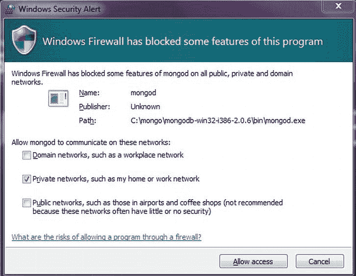

第三章


介绍非关系数据库

NoSQL 数据库迅速变得非常受欢迎，以至于它们的受欢迎程度让它们赢得了被标记为一场运动的殊荣！什么是 NoSQL 数据库，为什么它们变得如此流行？我们来看看。

在构建数据驱动的应用程序的几十年中，关系数据库已经成为大多数应用程序开发人员的一种生活方式。然而，有一种相对较新的个体想要打破在关系数据库中存储数据的规则。他们坚信不是所有的数据都适合关系数据库。当存储大量非结构化数据时，这种信念更加深刻。这个数据是怎么产生的？

如今，大多数网站都受其社会影响力的驱动，让数百万用户聚集在一起，生成大量内容。这样的海量内容无法放入一个模型中，因此我们有了“非结构化数据”这一类别你可以尝试通过创建一个模型来将这些内容存储在关系数据库中，但是根据 NoSQL 运动的信徒的观点，这是不自然的。您不必为了使用关系数据库而使用关系数据库！

NoSQL 运动已经产生了一组新的数据库范例。一个相当流行的是面向文档的数据库。面向文档的数据库的目的是存储“文档”而不是“关系”文档是紧密结合的集合，与其他数据元素没有联系。面向文档的数据库是为高性能和并发性而设计的。在前一章中，您了解了 Microsoft SQL Server 2012 如何扩展其功能，以支持在高性能环境中存储非结构化数据。在这一章中，我们将关注 NoSQL 并探索一个流行的面向文档的数据库，名为 *MongoDB* 。您将了解到以下更多信息:

*   NoSQL 旗下的不同技术
*   面向文档的数据库简介
*   设置和配置 MongoDB
*   使用 C#从 MongoDB 存储和检索数据

了解 NoSQL 数据库

如今，许多企业都是由它们在网络上的社交形象驱动的。例如，脸书是社交网络的先驱，有数百万访问者定期登录。这种网络存在需要存储Pb 的数据，并进行可理解的分析，以便从生成的数据量中获得一些意义。简单的关系数据库是不够的。我们需要一个能够做到以下几点的数据平台:

*   提供高可用性
*   通过分区向外扩展
*   以弹性方式扩展，快速增长和变化
*   提供灵活的模式，允许存储非结构化数据

NoSQL 技术已经发展到提供这样一个平台，使可用性比全球数据一致性更优先。

 **注** NoSQL 不代表任何一种技术。它涵盖了一系列架构和优先级。

概观

NoSQL 代表“不仅仅是 SQL”这是这场运动背后的人们已经确定的定义。在这一点上，它涵盖了广泛的技术和理论。然而，有可能在未来的某个时候，随着这一运动逐渐壮大，并获得整个行业的关注，它将被分割成单独的重点领域。

从企业的角度来看，有一个重要的问题需要回答。你应该选择 NoSQL 数据库而不是传统的关系数据库吗？答案不简单，。如今，企业架构师可以选择现代关系数据库，这些数据库可以扩展以支持 NoSQL 特性，并在存储结构化和非结构化数据方面为他们提供很大的灵活性。

NoSQL 技术有一个明显的优势，那就是大多数技术都是开源的。这直接转化为企业资本支出和 OPEX 成本的节约。让我们来探索一些关键优势。

主要优势

*   有社区支持的开源商店。例如，MongoDB 非常受欢迎，它被一些大型企业使用。
*   **高可用性、性能和可扩展性。**到现在为止，你一定听过好几遍了。NoSQL 数据库指定了允许针对故障转移场景进行可扩展复制的能力，并提供按需扩展。这是专有关系数据库扩展其能力以与开源 NoSQL 技术竞争的另一个领域。
*   **灵活的模式。** NoSQL 数据库支持在不停机的情况下修改模式的能力。
*   对开发者友好。 NoSQL 数据库有一个灵活的开放数据模型，允许开发人员根据需要在一段时间内构建模式，而不是强制模式。这种方法还有助于简化部署模型。

流行的 NoSQL 技术

根据数据模型范式的不同，目前市场上有相当多的 NoSQL 数据存储。大多数都是由社区驱动的开源。

键/值对存储

键/值对存储针对更快地存储和检索大量数据进行了优化，除了快速查找之外，只提供有限的功能。这种存储对于内容缓存非常有用；例如，将订单项存储在购物车中。分布式键/值存储的一些流行的例子是 Voldermort、Redis、Memcache、Oracle BDB(专有)和 Windows Azure 分布式缓存(专有)。

分布式表存储

这种数据存储通常基于分布式文件系统实现。例如，Big Table 是一个基于谷歌专有技术(如谷歌文件系统)的高性能数据存储。微软以 Windows Azure 表和 SQL Server 稀疏列的形式做出了自己的贡献。HBASE 和卡珊德拉是流行的开源分布式表格商店。

面向文档的数据库

这是 NoSQL 商店联盟中最受欢迎的类别。我们将在下一节详细讨论这些。

图形数据库

GraphDB、Neo4J 和 Intellidimension 是图形数据库的一些例子。这些数据存储使用不同的图形算法来查找数据，它们非常适合社交网络应用程序。然而，它们不容易聚集。

扩展关系数据库

大多数现有的专有关系数据库，如 Microsoft SQL Server、Oracle 和 IBM DB2，都在扩展它们的功能以支持 NoSQL 特性。在前一章中，您了解了 Microsoft SQL Server 如何使用 FileTables 来存储非结构化数据。

面向文档的数据库

与关系数据库不同，面向文档的数据库或文档数据库以一系列自包含文档的形式存储数据。没有表、列、行或关系。没有严格的模式。这种数据库有用的一个很好的例子是技术文章的网站。每篇文章都可以是一个包含所有必要属性的独立文档。任何所需的附加属性都可以添加到特定文档中，而不会影响其他文档。那么，在这种情况下，文档数据库如何优于 SQL 呢？以下是如何:

*   复杂对象可以按其当前状态存储。没有重复的 insert 语句，也没有到模式的转换。对象(例如，*JSON[JavaScript Object Notation]*data)可以序列化为文档。
*   更好的性能，减少并发的副作用。
*   不需要使用新属性进行数据重组，因为更改包含在文档中。
*   持久视图状态；也就是说，不需要从头开始重新创建视图状态。可以使整个视图状态持久化，而不是将值从模型中分离出来并存储在关系数据存储中。
*   使用最终用户可定制的实体和灵活的模式存储动态数据。

 **注**文档数据库允许对对象的并发更新；然而，他们放弃了 * ACID(原子性、一致性、隔离性、持久性)*属性，转而支持高可用性、软状态和最终一致性模型，这意味着可能会有一个时间窗口，在这个时间窗口中，事务特征会受到损害。

在这一章中，我们选择了探索一个非常流行的文档数据库 MongoDB。它是为高性能场景设计的，在需要经常快速访问数据的应用程序中非常有用。在接下来的小节中，您将了解设置 MongoDB 的步骤，并使用来自 10gen 的官方 MongoDB C#驱动程序对其进行编程。

 **注意**像 MongoDB 这样的文档数据库并不是为了用任务关键型数据取代企业关系型数据库而设计的。在这种情况下，它们最好将关系数据库扩充为一个高度可用的缓存存储。

用 MongoDB 编程

**MongoDB** 由 *10gen* ( `www.10gen.com`)创建，主要是为了弥合键/值对存储和关系数据库之间的鸿沟。它保留了关系数据库的一些优良特性，如索引；然而，它将数据模型从关系型改变为面向文档型，以促进可伸缩性和开发人员的灵活性。

如何设置 MongoDB

设置 MongoDB 非常容易。从`www.mongodb.org/downloads`下载相关的 zip 包，并将该包解压到物理驱动器上的一个文件夹中。转到解压缩后的包下的 bin 文件夹。您会发现几个二进制文件和可执行文件。最重要的一个是`mongod.exe`—MongoDB 数据库进程。

 **注意**如果您使用的是 32 位版本的 Windows，则有 2GB 的数据限制。

您可以简单地通过启动命令提示符并运行`mongod.exe`命令来启动 MongoDB 进程。根据您的操作系统，您可能会得到一个释放应用程序端口的提示(默认为`27017`)。[图 3-1](#Fig1) 显示了 Windows 7 操作系统的提示。



[图 3-1。](#_Fig1)在 Windows 防火墙中打开 MongoDB 端口

默认情况下，MongoDB 将使用`C:\Data\db`路径来存储数据。您必须手动创建文件夹，否则该过程将引发异常。一旦文件夹被创建并且端口被开放访问，mongod 将开始在列出的端口上监听请求，如图 3-2 所示。


[图 3-2。](#_Fig2) MongoDB 设置完毕，可以使用了

您现在已经成功地设置了 MongoDB。您可以使用客户端 shell ( `mongo.exe`)来测试与服务器的连接。

 **注**本书使用的 MongoDB 版本是 2.1.1。

如果您不想使用默认路径存储数据，那么您可以使用 dbpath 设置为`\data\db`指定一个替代路径:

```cs
mongod.exe --dbpath d:\alternatepath\data
```

命令 shells 非常适合针对 MongoDB 测试您的应用程序，或者只是玩玩它。然而，在生产环境中，您可能希望将 mongod 进程作为 Windows 服务运行。MongoDB 从 2.0 版开始增加了对作为 Windows 服务运行的支持。要将 MongoDB 服务器进程作为服务运行，请执行以下命令:

```cs
mongod.exe --logpath C:\Data\Log.txt --install
```

然后，您可以使用 net start 命令启动该服务:

```cs
net start mongodb
```

您已经成功地将 MongoDB 设置为服务！请注意，logpath 属性是允许服务在日志文件中记录状态所必需的。您可以通过使用带有`mongod.exe`命令的`--remove`属性来卸载该服务。

使用 MongoDB 客户端

MongoDB 还附带了一个默认的客户机 shell，您可以使用它来连接到服务器。您可以使用这个客户端连接到一个数据库( *test* 是 MongoDB 中的默认数据库)并开始存储 JSON 内容。您可以使用保存和查找功能来存储和检索内容，如图[图 3-3](#Fig3) 所示。


[图 3-3。](#_Fig3)在 MongoDB 中存储和检索 JSON 数据

 **注意**虽然 MongoDB 使用 JSON 作为数据表示法，但是它在内部将数据存储为二进制 JSON (BSON)。

熟悉 JSON 对操作 MongoDB 会非常有用。如果你对 JSON 不熟悉，可以在`www.json.org`了解更多。

使用 C#编程 MongoDB】

MongoDB 是用 C++编写的，所以用 C#在其中编程需要一个驱动程序。互联网上有很多社区驱动的驱动程序。Sam Corder 写了一个比较流行的，可以在`www.github.com/samus/mongodb-csharp`下载。但是，我们建议您使用 10gen 提供的官方驱动程序。您可以从位于`https://github.com/mongodb/mongo-csharp-driver`的 github 网站下载驱动程序。从下载选项卡，您可以选择下载 MSI，然后安装它。

 **注意**如果你下载了源代码而不是 dll，那么编译 CSharpDriver-2010 解决方案，从驱动程序项目中选择`MongoDB.Driver.dll`。

按照这些步骤，使用。NET 框架 4.0 和 Visual Studio 2010:

1.  创建新的 Visual Studio 2010 C#控制台应用程序项目。添加对`MongoDB.Driver.dll`组件的引用。
2.  Open the `Program.cs` file and write the following code to make a connection to the MongoDB database server instance.

    ```cs
    using System;
    using MongoDB.Driver;

    namespace FirstMongoDbProject
    {
        class Program
        {
            static void Main(string[] args)
            {
                MongoServer dbServer = MongoServer.Create();
                dbServer.Connect();

                Console.WriteLine("Connected");

                Console.ReadLine();
                dbServer.Disconnect();
            }
        }
    }
    ```

     **注意**如果你已经安装了 MongoDB 作为服务，你必须启动 MongoDB 服务器控制台或者启动服务。

3.  要获取您在控制台客户端练习中插入的记录，请更新 Main 方法中的代码，以便在默认的“test”数据库中搜索记录。下面的代码片段说明了这一点:

    ```cs
    using System;
    using MongoDB.Driver;
    using MongoDB.Bson;

    namespace FirstMongoDbProject
    {
        class Program
        {
            static void Main(string[] args)
            {
                MongoServer dbServer = MongoServer.Create();
                dbServer.Connect();

                MongoDatabase database = dbServer.GetDatabase("test");
                foreach (var doc in database["test"].FindAll())
                {
                    Console.WriteLine(doc);
                }

                Console.ReadLine();
                dbServer.Disconnect();
            }
        }
    }
    ```

在创建记录时，没有提到集合，所以记录被插入到默认的“test”集合中。变量`doc`表示在控制台中打印的 BSON 文档。在我们的示例中，您应该会看到之前插入的记录现在显示在控制台中。现在，您已经成功地在 MongoDB 数据库中查询了您插入的记录。接下来，我们将进行一次“亲自尝试”式的练习，帮助您更好地理解 MongoDB 的功能。

尝试一下:查询一个 MONGODB 数据库集合

MongoDB 中的数据按集合(一组 BSON 文档)分组。集合可以按名称空间进行组织以供引用，并且可以通过两种不同的方式以编程方式进行访问——点标记法(用点分隔)和命名标记法。

 **注意**收藏名称的最大长度为 128 个字符。

在本练习中，您将首先学习创建一个集合并将一个文档添加到该集合中，然后您将学习如何查询该集合以获取文档。遵循以下步骤:

1.  在新的 Visual Studio C#控制台应用程序项目中添加对驱动程序程序集的引用。在前面的练习中，使用代码连接到一个 MongoDB 服务器实例。
2.  使用 MongoDatabase 对象的`CreateCollection`方法创建名为“items”的集合。
3.  创建一个`BsonDocument`的实例，并用样本数据填充它。将文档插入集合。下面的代码片段展示了这个实现:

    ```cs
    using System;
    using MongoDB.Driver;
    using MongoDB.Bson;

    namespace QueryCollections
    {
        class Program
        {
            static void Main(string[] args)
            {
                MongoServer dbServer = MongoServer.Create();
                dbServer.Connect();

                MongoDatabase db = dbServer.GetDatabase("test");
                if (db.GetCollection("items") == null)
                {
                    db.CreateCollection("items");
                    BsonDocument document = new BsonDocument
                    {
                        {"SKU", "I001"},
                        {"Variant", "Tubes"},
                        {"Quantity", "10"},
                        {"Cost", "150.50"}
                    };

                    db["items"].Insert<BsonDocument>(document);
                }
                Console.WriteLine(db["items"].FindOne());
                dbServer.Disconnect();
                Console.ReadLine();
            }
        }
    }
    ```

在输出中，您将看到打印有对象 id 的记录，这是识别集合中文档的关键。您还可以插入一组文档，甚至创建嵌套文档。现在我们已经创建了记录，您可以通过多种方式查询它。

第一个也是首选的选项是使用查询构建器。`MongoDB.Drivers.Builders`名称空间公开了适当的类和方法来构建查询。以下代码说明了这一点:

```cs
var query = Query.EQ("Variant", "Tubes");
            var results = db["items"].Find(query);
```

这将返回一个与查询表达式匹配的集合`BsonDocument`。另一个选择是使用`QueryDocument`对象:

```cs
var query = new QueryDocument("Variant", "Tubes");
            var results = db["items"].Find(query);
```

Query 类公开了许多不同的方法来创建查询表达式，您必须研究这些方法。现在，您已经成功地在 MongoDB 数据库集合中创建和搜索了文档！

MongoDB 中的 LINQ 支持

LINQ 是在. NET 中查询对象的一个非常强大的特性。NET Framework 2.0，您可能不熟悉 LINQ。本书第 5 章只关注 LINQ，所以在继续本节之前请先阅读该章。

MongoDB C#驱动程序为查询 MongoDB 集合提供了 LINQ 支持。`MongoDB.Driver.Linq`名称空间包含了在 MongoDB 集合中使用 LINQ 所必需的构件。添加这个名称空间时，您会注意到 LINQ 支持的扩展方法可用于集合类。下面的代码使用`FindOne`方法返回与前面的例子相同的结果，但是这次使用 LINQ。

```cs
using System;
using System.Linq;
using MongoDB.Driver;
using MongoDB.Bson;
using MongoDB.Driver.Linq;

namespace QueryCollectionsWithLinq
{
    class Program
    {
        static void Main(string[] args)
        {
            MongoServer dbServer = MongoServer.Create();
            dbServer.Connect();

            MongoDatabase db = dbServer.GetDatabase("test");
            var collection = db.GetCollection("items").AsQueryable();

            var result = collection.FirstOrDefault();
            Console.WriteLine(result);
            dbServer.Disconnect();
            Console.ReadLine();
        }
    }
}
```

示例中最需要注意的是`AsQueryable`方法。驱动程序允许对集合进行可查询的扩展，剩下的就是简单的 LINQ 了。您可以使用 LINQ 查询以及 Lambda 表达式来查询结果。

MongoDB 是如何工作的？

MongoDB 中的主要数据库组件是`mongod.exe`进程。默认情况下，MongoDB 是为延迟写入配置的。这允许频繁和更快地更新数据，并最大限度地减少刷新到磁盘的操作。默认情况下，该进程每 60 秒刷新一次磁盘，每 100 秒提交一次日志。但是，这可以根据环境的需要进行配置。

 **注意**MongoDB 中没有支持回滚的复杂事务。它只在文档级别支持原子性。即使在分区数据库的情况下，这也可以提高性能。

此外，MongoDB 支持使用`mongos.exe`进程的自动分片。自动分片特性很有趣，因为它允许应用程序超越单个数据库实例，并自动转换成集群。分片架构允许跨多台机器水平划分数据，保持顺序。除了分片，MongoDB 还支持高可用性复制。[图 3-4](#Fig4) 展示了这种架构。


[图 3-4。](#_Fig4) MongoDB 流程架构

摘要

本章向您介绍了 NoSQL 数据库的世界。你知道了为什么它们对现代有社会影响力的网站很重要。您还了解了不同的 NoSQL 技术，这些技术在世界各地的开发人员中越来越受欢迎，尤其是面向文档的数据库。最后，您学习了如何使用官方 C#驱动程序对 MongoDB 数据库进行编程。考虑到 JavaScript 是客户端编程的首选语言，而且它在 web 应用程序开发的服务器端也越来越受关注，您可以进一步探索用 JavaScript 对 MongoDB 进行编程。