第五章


语言集成查询简介(LINQ)

从微软一个代号为 *Comega* (读作“see omega”)、**语言集成查询**，或者现在众所周知的 **LINQ** 的研究项目中脱颖而出，已经成为。NET Framework 版以后。没有什么比 LINQ 更能推动 ADO.NET 的进化了。

如果您正在构建数据驱动的应用程序，您应该知道从多个数据源获取数据的痛苦。在某种程度上，您需要走出舒适区，学习您试图操作的数据源的本地查询语言。考虑到编写应用程序的数据源数量巨大，这对开发人员来说是一项艰巨的任务。NET 可以获取数据。

如果你能把查询写在。NET 本身，不知何故，它们被神奇地转换成相关数据源的本地查询语言？有了 LINQ，你可以做到这一点。

在本章中，我们将介绍以下内容:

*   如何使用 LINQ 编写查询。
*   可以使用 LINQ 查询的不同数据源。
*   可枚举类型和可查询类型的区别。
*   查询运算符的工作原理。
*   如何使用 LINQ 查询 ADO.NET 数据源。
*   LINQ 如何利用超线程概念并行执行查询。
*   如何使用 LINQ 查询开放数据(OData)数据服务。

使用一种语言查询数据源的能力非常强大，它被用于构建数据驱动的网站。因此，本章讨论的概念很重要，在本书的剩余部分你将会用到它们。

使用 LINQ 编写查询

LINQ 表达式有三个基本部分。它类似于一个数据库查询表达式。Transact-SQL (T-SQL)就是一个很好的例子，它用于在 Microsoft SQL Server 中查询和操作数据。如果您熟悉 T-SQL 语法，您会知道检索信息的查询主要是使用`SELECT`形成的，后跟使用`FROM`的源，然后紧接着是使用`WHERE`的条件。当然，还有额外的关键字帮助排序或分组。数据源是您创建的表，然后您执行查询。同样，在 LINQ，你也有以下的东西:

1.  可枚举集合充当源。
2.  使用 LINQ 查询语法(可用于多种语言，包括 VB 和 C#)构建查询。
3.  通过将结果处理成变量来执行查询。

让我们详细检查一下这些部分。

LINQ 数据来源

使用 LINQ 可以查询各种数据源。然而，这些来源可以大致分为几类。第一个是内存中的源，它基本上假设数据已经加载到一个. NET 可枚举集合中，该集合可以以只进方式读取。

 **注**可枚举集合中。NET 通常实现 IEnumerable 接口或其通用等效接口`IEnumberable<T>`。他们还可以实现派生的 IQueryable 接口。总的来说，实现这些接口的类型在 LINQ 被称为*可查询类型*。

本质上，每个以某种形式(隐式或显式)实现了 IEnumerable 的对象都可以被查询。这就是通常被称为 *LINQ 地对象*。

现在让我们使用`List`来探索 LINQ 的语法。假设您有一个销售联系人列表，并且想要加利福尼亚州的联系人子集。为了进行比较，从数据库中获取这些信息的等效 SQL 查询如下所示:

```cs
SELECT [Name], [Email] FROM Contacts WHERE [State] = 'CA'
```

如果您已经将商店中的所有联系人预加载到一个`List` ( `List<Contact>`)中，那么 LINQ 查询将如下所示:

```cs
var result = from contact in contacts
                         where contact.State == "CA"
                         select contact;
```

要执行，您可以循环通过`result`并对输出执行必要的操作。

```cs
foreach (var item in result)
            {
                Console.WriteLine(item.Name);
            }
```

 **注意**查询直到结果被处理后才被执行。但是，您可以通过对查询结果调用聚合函数(如`Count`)或使用`ToList`或`ToArray`扩展方法缓存结果来强制立即执行。

正如您可能观察到的，LINQ 查询类似于实际的 SQL 查询，除了它为微小的语法差异提供了空间，例如出现在末尾的`SELECT`。前面的示例表示可以对集合执行的非常基本的查询。在下一节中，您将探索附加的查询功能，如执行连接、排序和分组。

除了支持查询内存集合之外，LINQ 还支持对各种不同数据源的查询能力，方法是为每个数据源公开 LINQ 提供程序。例如，查询 LINQ 到 XML 提供程序支持的 XML 类型、LINQ 到 SQL 提供程序支持的 SQL，等等。此处提供了完整的提供商列表:`http://blogs.msdn.com/b/charlie/archive/2008/02/28/link-to-everything-a-list-of-linq-providers.aspx`。事实上，你可以创建一个你自己的供应商。

通常，这些提供者使用强大的`IQueryable`接口及其通用等效接口`IQueryable<T>`来支持 LINQ 功能。`IQueryable`继承`IEnumerable`；因此，默认情况下，它拥有`IEnumerable`的所有特征。那么它有什么不同，最重要的是，有什么用处呢？让我们更详细地探讨这一点。

使用 IQueryable 延迟执行

前面例子中的变量`results`将是类型`IEnumerable<T>`，其中`T`是本例中的`Contact`类。您可以使用`AsQueryable`扩展方法将其转换为`IQueryable`，如下所示:

```cs
var resultAsQueryable = (from contact in contacts
                                    where contact.State == "CA"
                                    select contact).AsQueryable();

            foreach (var item in resultAsQueryable)
            {
                Console.WriteLine(item.Name);
            }
```

那么，当我们同时执行两个查询(前面显示的`IEnumerable`和前面示例中的`IQueryable`)时，真正的区别是什么呢？在我们的例子中，实际上没有。两者将打印相同的输出，除了如果数据在`IQueryable`的第二个`foreach`循环执行之前改变，那么您可能会看到`resultAsQueryable`的不同的结果。原因是`IEnumerable`和`IQueryable`都遵循延迟执行模式，这意味着查询直到结果被评估后才被执行。在我们的例子中，这是`foreach`循环。真正的区别在于查询是如何执行的。对于`IEnumerable`类型，数据总是加载到内存中，并对内存中的数据执行过滤。另一方面，`IQueryable`允许在数据源上执行查询以及所有的过滤器。例如，对于从*到 SQL* 的 LINQ，查询是在提供者上构建的，并在数据库中执行。如果选择查询的结果经过筛选，如下面的代码所示，这将变得更加清楚:

```cs
var resultAsQueryable = (from contact in contacts
                                    where contact.State == "CA"
                                    select contact).AsQueryable();

var filteredResults = resultAsQueryable.Where(contact => contact.Name != "");

            foreach (var item in filteredResults)
            {
                Console.WriteLine(item.Name);
            }
```

整个查询以及过滤后的条件将在源上执行。这可以在几种情况下提高性能，因为从源返回的结果集有限。对于`IQueryable`，后续过滤器也将返回到源，而对于`IEnumerable`，内存中的数据集仍然被访问。

图 5-1 说明了这种差异。

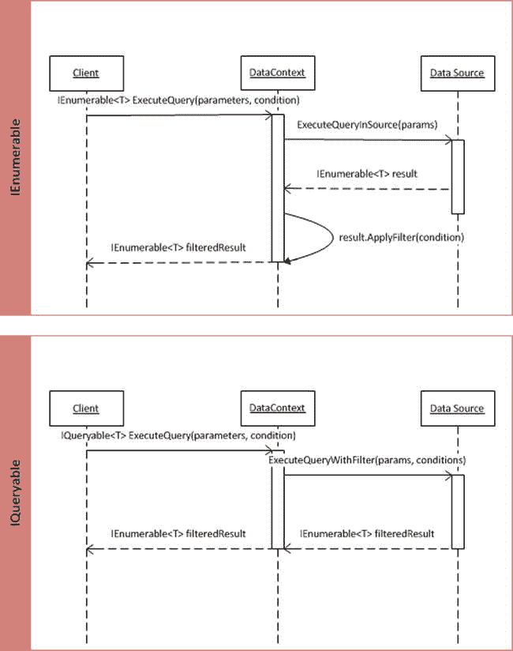

[图 5-1。](#_Fig1) IEnumerable 与 IQueryable 执行周期

[中的`DataContext`图 5-1](#Fig1) 表示保存数据源数据的内存集合。

 **注意**虽然`IEnumerable`和`IQueryable`都展示了延迟查询执行，`IQueryable`展示了真正意义上的延迟查询执行。`IQueryable`在像数据分页这样的场景中特别有用，在性能上比`IEnumerable`更适合除了 LINQ 以外的提供者。

IQueryable 与 IEnumerable

既然您已经理解了为什么`IQueryable`接口是有用的，那么何时使用它而不是`IEnumerable`的问题可能会困扰您。[图 5-2](#Fig2) 提供了指导，帮助你决定何时最好地使用它们。

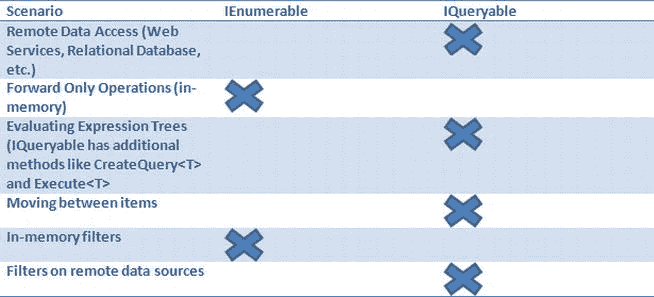

[图 5-2。](#_Fig2)何时使用 IQueryable vs. IEnumerable

使用 LINQ 构建查询

上一节中使用的示例演示了一个简单的 LINQ 表达式的执行。查询可能非常复杂，包含一系列连接、联合、过滤、排序和分组。LINQ 还支持转换，您可以使用查询功能将数据从一种形式转换为另一种形式。这允许您创建非常大和复杂的对象的轻量级视图。以下代码说明了一个 LINQ 连接操作:

```cs
var transformedResult = from contact in contacts
                                    join order in orders
                                    on contact.ID equals order.ContactID
                                    select new { contact.Name, order.Quantity };
```

请注意，`transformedResult`是一个转换的实体，其属性为`Name`和`Quantity`。

```cs
foreach (var item in transformedResult)
            {
                Console.WriteLine(string.Format("{0}:{1}",item.Name, item.Quantity));
            }
```

当您对结果执行`foreach`并打印输出时，这一点很明显。

 **注意**观察作为`join`操作结果的数据转换。结果产生了一个新的实体，合并了两个相关实体的请求属性。

如果您需要在一个元素中存储多个结果，那么您可以执行一个`GroupJoin`操作。

预测

`select`子句能够产生多种转换。当`select`子句返回结果而不是源时，它被称为*投影*。前面的代码示例是一个投影示例。

 **提示**您可能已经注意到，到目前为止展示的例子展示了允许编译器从查询中推断结果类型的能力。如果您正在执行复杂的投影，隐式类型的局部变量约定允许您处理结果，而不用担心转换结果的类型。

查询表达式标识符

在复杂的转换中，您可能需要一个表达式作为查询执行的一部分进行计算。LINQ 语法有一个`let`标识符，允许你对表达式求值。为了演示，我们调整了前面的代码示例，将价格因子引入到`Order`实体中，并根据价格条件为订单创建一个投影。下面的代码演示了这一点:

```cs
var transformedResult = from contact in contacts
                                    join order in orders
                                    on contact.ID equals order.ContactID
                                    let effectivePrice = order.Rate * order.Quantity
                                    where effectivePrice < 400
                                    select new { contact.Name, order.Quantity };
```

至此，我们结束了使用 LINQ 构建查询的讨论。

到目前为止，您已经对 LINQ 是如何操作的有了相当深入的了解，并且还了解了 LINQ 复杂的查询和数据转换功能。然而，你只是触及了表面。在下一节中，我们将更详细地探索 LINQ 强大的查询功能，并理解它是如何工作的。

查询运算符

那个。NET Framework 编译器将查询表达式翻译成有意义的可执行`CLR`方法调用。这些方法被称为*查询操作符*，由 LINQ 公开，允许您对序列执行查询。事实是，查询语法仅仅是一个语法胡萝卜，让您可以模拟 SQL 风格的查询，标准查询操作符最终自己执行操作。事实上，有些操作仍然没有等价的查询表达式，需要使用操作符方法直接执行。方法风格的一个例子在上一节“*用 IQueryable* 延迟执行”中展示了，它使用了`Where`操作符。

 **注意**内联传递给查询操作符的表达式称为*λ表达式*。`goes to (=>)`操作符是一个 lambda 操作符，允许您访问被评估实体的属性。在前面的`Where`示例(`contact => contact.Name != ""`)中，lambda 表达式用于检查联系人姓名是否为空。

查询操作员分类

有许多操作符可以作为可枚举和可查询对象的扩展方法。它们根据执行的操作类型进行分类。例如，`Max`、`Count`、`Sum`等被归类为*聚合操作*。此外，查询运算符还分为可枚举类型和可查询类型。

查询运算符执行

查询操作符的不同之处在于它们的执行方式。如果您还记得对“*延迟执行*的讨论，有一些查询操作符会强制立即执行，而另一些则遵循延迟执行机制。例如，所有聚合操作都强制立即执行，而过滤操作，如`Where`和`Select`，则遵循延迟执行。类似地，所有的 *量词操作*像`All`、`Any`和`Contains`也强制立即执行。

以下查询检索 contacts 和 orders 示例中所有订单的总和:

```cs
var totalOrder = orders.Sum(order => order.Rate * order.Quantity);
```

以下示例显示了使用`All`操作符获取数量大于 10 的所有订单的结果的立即执行:

```cs
var quantityGreaterThanTen = orders.All(order => order.Quantity > 10)
```

 **提示**可以在一个序列上使用多个运算符。例如，您可以首先使用`Where`运行一个过滤器，然后使用`Sum`对结果`<sequence>.Where(<lambda>).Sum(<lambda>)`运行一个聚合。

既然您已经很好地理解了 LINQ 在幕后是如何工作的，那么是时候学习如何使用一些流行的 LINQ 提供者在 about 访问数据了。

用于 ADO.NET 数据访问的 LINQ

没有比这更好的时机来重申 LINQ 大受欢迎背后的原因了；也就是说，开发人员需要一种范式，允许他们查询异构数据源，而不必学习每个数据源的原生查询语法。LINQ 提供了这种抽象。它在所支持的语言中引入了强大的查询功能。NET 框架，如 C#和 VB，它还提供了一个框架，用于构建将 LINQ 表达式转换为本地查询的本地数据提供程序。[图 5-3](#Fig3) 说明了架构堆栈。

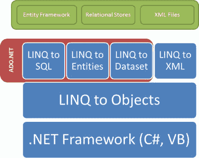

[图 5-3。](#_Fig3)使用 LINQ 访问 ADO.NET 数据

有几个 LINQ 提供商。在本节中，我们将讨论与 ADO.NET 相关的问题。

LINQ 到 SQL

LINQ 到 SQL 围绕关系数据库创建了一个完整的基础结构，将表、存储过程和用户定义的函数等 SQL 构件映射到。NET 对象，这些对象可以使用 LINQ 进行查询。此外，它还支持关系数据库(如 Microsoft SQL Server)的事务处理功能。这对你意味着什么？

您现在可以使用数据库表在您的数据访问层中创建一个实体关系 。然后，您可以使用 LINQ 查询实体，就像您在 LINQ 查询对象一样。LINQ 到 SQL 将负责执行 SQL 中的查询并返回期望的结果。太棒了，不是吗？您不必编写任何 SQL 语句。如果您团队中的数据库开发人员已经创建了存储过程，您也可以利用它们。让我们尝试在 Visual Studio 中创建一个项目，以了解 SQL 的 LINQ 功能。

试试看:使用 LINQ 操作微软 SQL SERVER 数据库中的数据

在本练习中，我们将创建一个 Visual Studio 2012 C# 控制台应用程序项目，以使用 LINQ 到 SQL 从 Microsoft SQL Server 2012 Express Edition 数据库中访问数据。以下是先决条件:

*   从 2008 版开始，可以在 Visual Studio 的任何版本上创建该练习。在我们的示例中，我们将使用 Visual Studio 2012 Professional。
*   Create a database named `Store` in your Microsoft SQL Server 2012 Express Edition instance, and add two tables, `Orders` and `Customers`, with the structure shown in [Figure 5-4](#Fig4). Run the following script to add some sample data into the tables.

    `INSERT INTO Contacts (Name, Email, [State]) VALUES ('John Doe', '', 'CA')`

    `INSERT INTO Contacts (Name, Email, [State]) VALUES ('Jane Doe', '', 'AZ')`

    `INSERT INTO Orders (ContactID, Quantity, Rate) VALUES (1, 10, 10)`

    `INSERT INTO Orders (ContactID, Quantity, Rate) VALUES (2, 20, 20)`

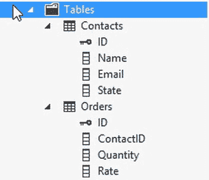

[图 5-4。](#_Fig4)存储数据库表结构

按照以下步骤完成练习:

1.  创建一个 Visual Studio 2012 C#控制台应用程序项目，命名为`LinqToSqlStore`，如图[图 5-5](#Fig5) 所示。

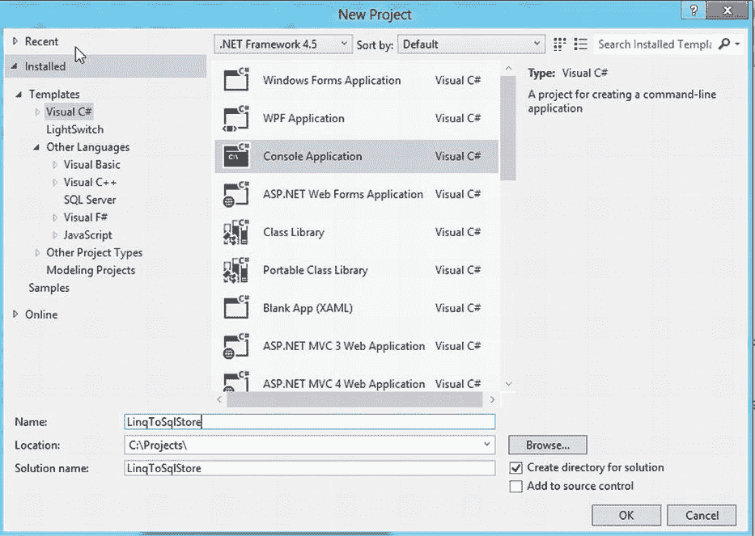

[图 5-5。](#_Fig5) Visual Studio 2012 C#控制台应用程序项目

在解决方案资源管理器中，右键单击项目并单击“`Add`  `New Item. . .`”以启动“添加新项”对话框。选择数据选项卡下的`LINQ to SQL Classes`选项。将文件命名为`Store.dbml`，如图[图 5-6](#Fig6) 所示。

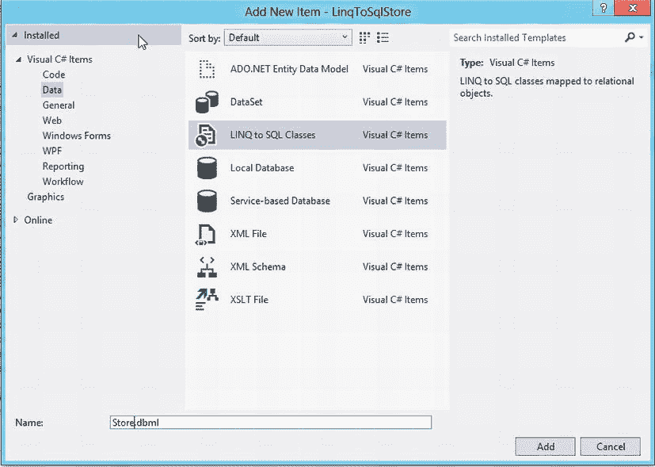

[图 5-6。](#_Fig6)添加一个 LINQ 到类文件到项目中

从 Visual Studio 的服务器资源管理器中，创建一个新的数据库连接来存储和展开表。从浏览器中拖动`Contacts`和`Orders`表，并将它们放到`Store.dbml`设计图面上。实体将被创建，关系将被显示(参见[图 5-7](#Fig7) )。

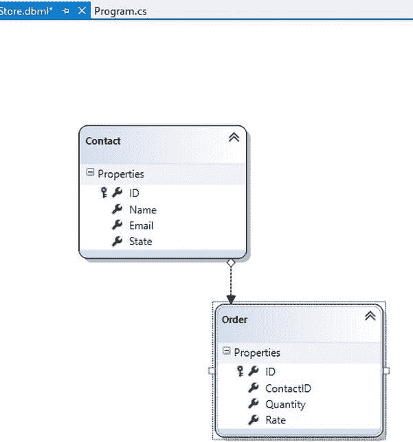

[图 5-7。](#_Fig7) LINQ 到 SQL 设计器显示实体和实体之间的关系

打开`Program.cs`文件，在`Main`方法中编写以下代码:

`using (StoreDataContext context = new StoreDataContext())`

`{`

`var transformedResult = from contact in context.Contacts`

`join order in context.Orders`

`on contact.ID equals order.ContactID`

`select new { contact.Name, order.Quantity };`

`foreach (var item in transformedResult)`

`{`

`Console.WriteLine(string.Format("{0}:{1}", item.Name, item.Quantity));`

`}`

`Console.ReadLine();`

`}`

编译并运行应用程序。输出的结果将与上一节“*使用 LINQ* 构建查询”中所示的示例相同(参见[图 5-8](#Fig8) )。

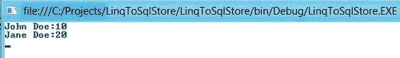

[图 5-8。](#_Fig8)执行连接查询的输出

如果您检查步骤 4 中的代码块，您会注意到它与前面几节中显示的示例没有太大的不同。需要注意的重要事情是`StoreDataContext`类。这是哪里来的？

当您将 LINQ 添加到 SQL 类文件并将表放置在设计图面中时，LINQ 到 SQL 会生成一个映射类，其中包含关系表的等效实体(表)表示，还包含可对其执行 CRUD 操作的方法。默认情况下，它会在创建 dbml 文件时使用的文件名后面附加一个“DataContext”。

dbml 文件有一个 *O/R(对象关系)设计器* 界面，可以从数据库中拖放表格，它会自动创建实体类和相关关系。然后，您可以使用 DataContext 类通过 LINQ 语法来访问实体。

 **注意** LINQ 到 SQL 是微软的一个 ORM ( *对象关系映射* ) 工具，与目前市场上的其他几个类似工具竞争。您可以使用它在您的应用程序中构建一个数据访问层，让它完成连接到数据库和运行 CRUD 操作的所有繁重工作。您可以通过在 O/R 设计器中建模数据库来使用设计优先的方法，或者通过从头开始编码 DataContext 类来遵循代码优先的方法。

在幕后，LINQ 到 SQL 使用一个名为`sqlmetal.exe`的命令行工具来执行所有的映射任务。在需要在 Visual Studio 外部生成 DataContext 的情况下，可以直接使用该工具。这是团队构建组件的一个很好的候选。你可以在这篇 MSDN 的文章中了解更多关于这个工具的信息:`http://msdn.microsoft.com/en-us/library/bb386987.aspx`。

惰性加载

如果您查看 O/R 设计器中的关联编辑器，您会注意到已经根据数据库中定义的外键关系在`Orders`和`Contacts`实体之间创建了一个关联。[图 5-9](#Fig9) 说明了这种关联。

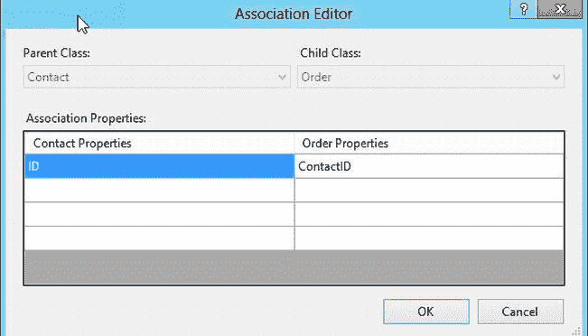

[图 5-9。](#_Fig9)实体协会

潜在地，关联可以让您定义实体之间的复杂关系。但是，默认情况下，当实体加载数据时，不会填充子实体。这是 LINQ 到 SQL 出于性能原因支持的延迟加载特性。例如，在`Store DataContext`中，每当检索到`Order`实体的可枚举集合时，默认情况下不会填充相关的`Contact`实体值。您可以选择使用`DataLoadOptions class`覆盖默认行为。您可以创建一个`DataLoadOption`实例来快速加载子实体。(您可以有选择地这样做，并使用此功能来优化性能。)下面的代码演示了这一点:

```cs
DataLoadOptions loadOptions = new DataLoadOptions();
                loadOptions.LoadWith<Order>(order => order.Contact);
                context.LoadOptions = loadOptions;
```

现在，当您尝试加载`Orders`时，关联的`Contact`信息将被自动加载。`DataLoadOptions`类的和公开了两个方法:`LoadWith`和`AssociateWith`(以及它们的通用等效方法)。`AssociateWith`可以用进一步过滤急切加载选项。

LINQ 到数据集

以 LINQ 扩展方法形式的语言支持适用于数据表。数据集(数据表的容器)本身充当独立于提供者的数据访问的缓存抽象。有了 LINQ 支持，您可以扩展对多个数据源的查询功能，数据将从这些数据源加载到数据集中。数据表支持`AsEnumerable`和`AsDataView`扩展方法，允许您查询数据源并将数据绑定到控件以便显示和操作。

```cs
EnumerableRowCollection<DataRow> enumerableOrdersDataRow = aggerateSet.Tables["OrdersTable"].AsEnumerable();
EnumerableRowCollection<DataRow> enumerableContactsDataRow = aggerateSet.Tables["ContactsTable"].AsEnumerable();

var transformedResultFromDataSet = from contact in enumerableContactsDataRow
                                   join order in enumerableOrdersDataRow
                                   on contact.Field<int>("ID") equals                                    order. Field<int>("ContactID")
let effectivePrice = order.Field<decimal>("Rate") * order.Field<int>("Quantity")
where effectivePrice < 400
select new { Name = contact.Field<string>("Name"), Quantity = order.Field<int>("Quantity") };
```

该查询类似于“*查询表达式标识符*部分中显示的查询。但是，它已被修改为从数据集中的数据表收集实体属性信息。注意实体属性值是如何使用`DataColumn`通用字段属性提取的。

LINQ 地实体

*实体的 LINQ*允许你针对实体框架(EF)概念模型编写语言集成查询。现在详细讨论这个还为时过早，因为你还没有探索过英孚。我们将在第七章的[中讨论这个话题。](07.html)

LINQ 和排比

真正的*并行*进入了。NET 当 *任务并行库*被引入。NET 框架 4.0。这样做是为了利用英特尔在多核处理器中引入的超线程特性。一个合乎逻辑的拓展是将平行的好处扩展到 LINQ。于是 *平行-LINQ* (PLINQ)诞生了。使用 PLINQ，您可以扩展查询以有效利用机器中可用的内核数量，从而提高性能。该框架还提供并发数据结构来存储并行查询执行的结果。

。NET Framework 4.5 在 PLINQ 中有几项增强功能，主要用于提高性能。[图 5-10](#Fig10) 说明了 PLINQ 的功能。

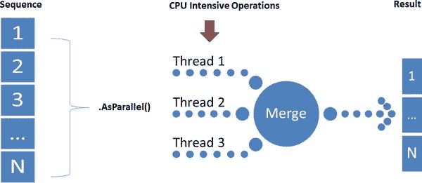

[图 5-10。](#_Fig10)并行执行 LINQ 查询

平行延伸

`ParallelEnumerable`类拥有与 PLINQ 相关的大部分功能。它提供了`AsParallel`扩展方法，允许并行执行查询。以下示例说明了利用多核支持并行执行 LINQ 查询。

```cs
var parallelResult = source.AsParallel().Select(x => IntensiveOperation(x));
```

 **注意**source 是一个可枚举/可查询的集合，其中的每一项都参与一个由`IntensiveOperation` 方法表示的 CPU 密集型操作。

默认情况下，并非所有 PLINQ 查询都并行运行。该框架能够评估并行运行查询的性能优势，如果没有，那么查询将按顺序运行。例如，`ElementAt`操作将总是退回到顺序执行。英寸 NET Framework 4.5 之后，并行查询的范围扩大了，现在较少的操作退回到顺序运行。以下 MSDN 的文章提供了这种操作的一些细节以及由于这种变化而带来的潜在风险:`http://blogs.msdn.com/b/pfxteam/archive/2011/11/11/10235999.aspx`。

 **注意**谨慎行使使用 PLINQ 查询的权利。在 CPU 密集度较低的情况下，由于所涉及的开销，它们实际上可能会损害性能，并且好处可能无法实现。此外，尽管 LINQ 查询可以并行执行，但是执行它的`foreach`语句是顺序运行的。如果您不关心保持项目的顺序，您可以选择对查询结果变量运行`ForAll`操作符。

**查询 WCF 数据服务**

*WCF 数据服务*允许你通过使用*开放数据* ( *OData* )协议将你的数据公开为 *RESTful* 服务。您可以使用 LINQ 对此类数据服务执行查询。在数据服务上执行的 LINQ 表达式被转换成 OData 格式的等价查询。WCF 数据服务客户端库有助于将 LINQ 转换为代表 OData 查询的 HTTP 请求。你将在第 9 章中了解更多关于 WCF 数据服务如何运作的信息。在本节中，我们将重点关注使用 LINQ 语法查询数据服务。让我们尝试使用 *网飞 OData 目录*查询数据服务的步骤，它允许您浏览超过 100，000 部电影和演员。

尝试一下:使用 LINQPAD 查询网飞 ODATA 目录

在本练习中，我们将使用一个流行的 LINQ 编辑器 LINQPad 来查询网飞数据服务:`http://odata.netflix.com`。可以从这里下载 LINQPad】。

请务必下载的 LINQPad 版本。下载完 zip 包后，将其解压到一个文件夹中，然后双击 LINQPad.exe 启动编辑器。按照以下步骤使用 LINQ 查询网飞目录:

1.  In the LINQPad editor, click the *Add connection* link to launch the *Choose Data Context* dialog, as shown in [Figure 5-11](#Fig11).

    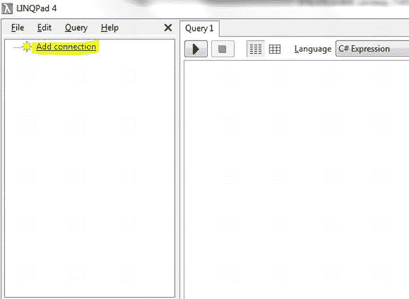

    [图 5-11。](#_Fig11)添加 WCF 数据服务连接

2.  In the *Choose Data Context* dialog, select the “*WCF Data Services (OData)*” option under the “*Build data context automatically*” list, as shown in [Figure 5-12](#Fig12). Click *Next*.

    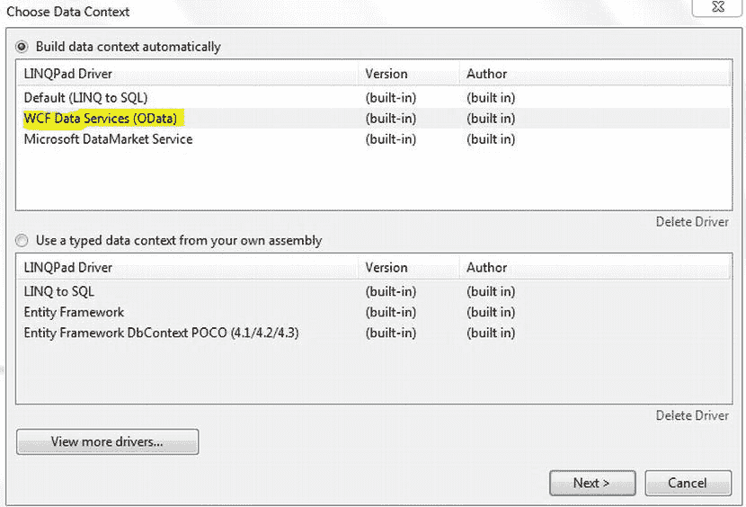

    [图 5-12。](#_Fig12)选择数据上下文

3.  In the WCF Data Services (OData) Connection dialog, enter the Netflix Catalog URL, `http://odata.netflix.com`, and click the Test button to check if the connection succeeds (see [Figure 5-13](#Fig13)). Click *OK* once the test is successful.

    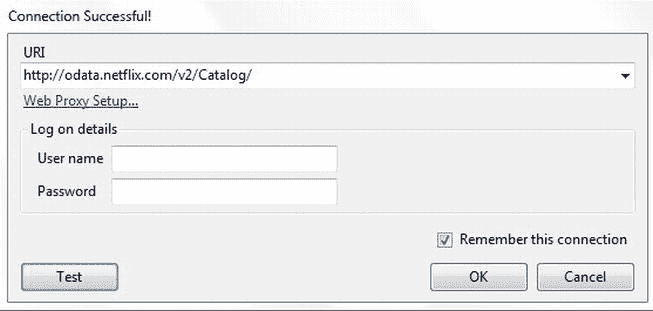

    [图 5-13。](#_Fig13)网飞目录连接测试成功

4.  Notice that all the available entities are displayed. Expand the entities, and you will notice that the relationships with other entities are also visible, as shown in [Figure 5-14](#Fig14).

    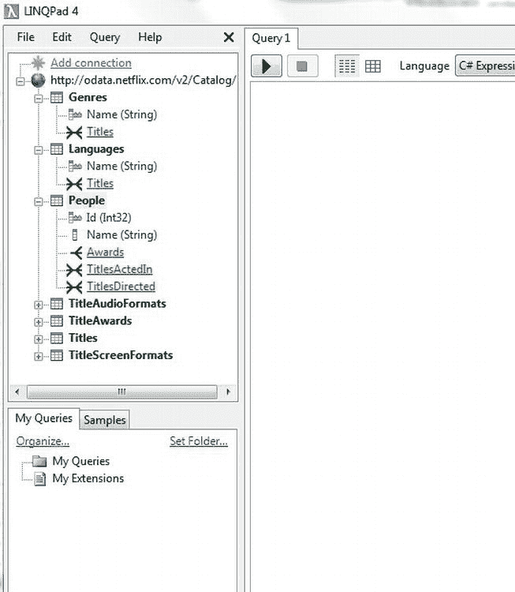

    [图 5-14。](#_Fig14)网飞 OData API 实体和关系

5.  Right-click the `Genres` entity, and you will see templates for a variety of LINQ queries that you can execute on this entity. Click “*from g in Genres where ... select g*” (see [Figure 5-15](#Fig15)).

    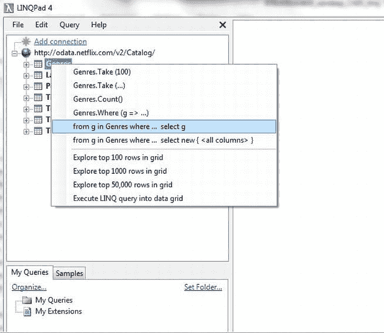

    [图 5-15。](#_Fig15)从实体生成 LINQ 查询

6.  In the generated query, delete the `where` condition and execute the query to see the results. The list of available genres is displayed in the results pane. You can switch the results view to see the lambda and OData equivalents of the executed query, as shown in [Figure 5-16](#Fig16).

    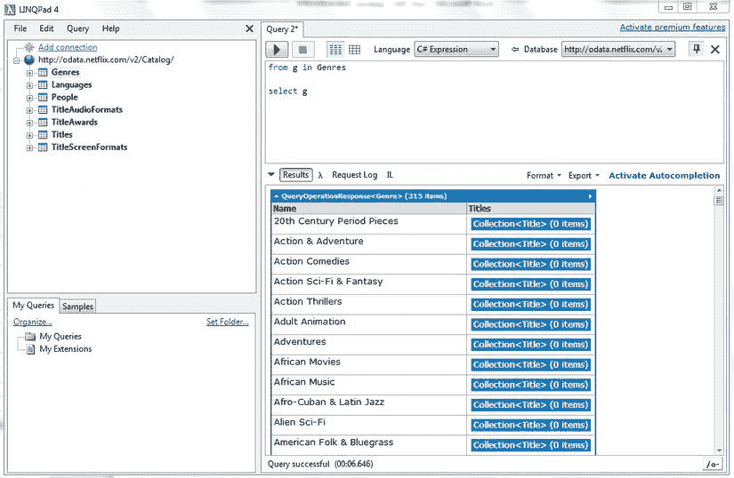

    [图 5-16。](#_Fig16)结果窗格中显示的查询输出

通过执行不同的查询，您可以使用 LINQPad 编辑器和网飞数据服务。输出将立即显示在结果窗格中。LINQPad 是一个有用的工具，可以使用包括 WCF 数据服务在内的不同数据源来尝试和磨练您的 LINQ 技能。您还可以在数据层和业务层中使用查询之前对其进行测试。

摘要

LINQ 是一个相当大的话题。本章的目的是让您探索 LINQ 在查询异构数据源方面的能力。本章中讨论的概念是根据它们在本书中的相关性而选择的。您学习了如何使用 LINQ 来查询内存和远程数据源(包括 WCF 数据服务)中的对象，并且探索了 LINQ 如何增强 ADO.NET。此外，您还了解了 LINQ 如何利用的并行编程特性。NET Framework 来提高查询的性能。在下一章中，我们将关注实体数据模型的概念，它被。NET 和实体框架。