# 七、使用实体框架设计数据访问应用

在第 1 章中，首先向您介绍了不同的数据访问范例。您还探索了使用实体框架 *实体数据模型(EDM)设计器*和*数据库优先*范例从现有数据库轻松创建数据访问层所需的步骤。此外，在上一章中，您了解了 EDM 和 ADO.NET 元数据系统如何共同构成实体框架的核心。

到目前为止，你仅仅触及了表面。在这一章中，你将充分认识到实体框架构建数据访问层的潜力，而无需编写大量代码。

在本章中，您将了解以下内容:

*   实体框架的架构是由什么构成的。
*   如何使用实体框架设计器创建和更新 EDM？
*   如何从可以用代码编程的实体自动生成 CLR 类。
*   如何使用 LINQ 向实体查询 EDM？
*   如何在使用复杂类型的实体框架中使用存储过程？
*   如何对 EDM 进行单元测试？

Entity Framework 是 Microsoft 首选的对象关系映射器数据访问平台，用于使用。NET 框架。实体框架由工具组成。NET 框架组件、语言支持和对象/关系映射(ORM)服务。在第 6 章中，你探索了一些核心。NET 框架组件构成了实体框架的基础。在这一章中，我们将着重于在构建数据驱动的 ASP.NET Web 应用中实现实体框架。在第 12 章中，你会学到这样做的最佳实践。

 **注**在撰写本文时，Entity Framework 6.0 Alpha 2 已经发布预览版。然而，我们选择使用稳定的实体框架版本 5 来完成本章的练习。

实体框架架构

实体框架建立在 ORM 的核心原则之上；也就是说，保持领域模型与数据库设计的分离。[图 7-1](#Fig1) 展示了组成实体框架的各种组件。

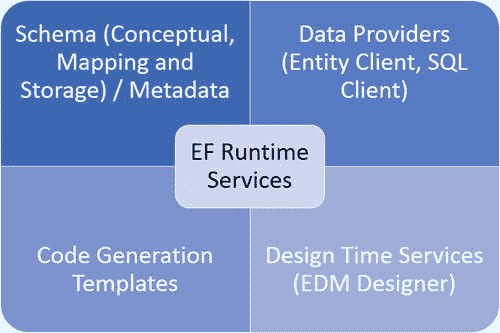

[图 7-1。](#_Fig1)实体框架组件

*实体模型设计器*大概是实体框架使用最广泛的特性了。它提供了一种视觉体验，类似于您过去可能使用过的任何 *实体关系图(ERD)* 工具。除了这种视觉体验之外，它还有许多功能，可以让您从现有的数据库表和关系中自动生成实体模型，它还可以帮助您创建普通的 CLR 对象(具有属性的公共类)，这些对象可以使用像 LINQ 和 C# 这样的语言，以一种与持久性无关的方式在代码中进行编程。在下一节中，您将使用 ADO.NET EDM 探索实体框架的一些高级功能。

生成实体模型

在第 1 章中，您已经熟悉了创建 ADO.NET EDM 所需的步骤，以及如何使用它来生成数据驱动的 ASP.NET 4.5 网站。ADO.NET EDM 充当*实体*和*关联*的容器。在 Entity Framework 5 中，实体还生成等效的 *普通旧 CLR* (POCO)类，可以在代码中使用这些类来创建查询和执行数据操作。NET 框架支持的语言，如 LINQ 和 C#。在本章接下来的章节中，你会学到更多。然而，在我们这样做之前，让我们再一次使用一个 ASP.NET MVC 4 Web 应用来探索来自[第 1 章](01.html)的练习步骤，并尝试理解 EDM Designer 是如何工作的。出于本例的目的，我们将使用您在第 5 章中首次使用的商店数据库。

 **注**如果你对 ASP.NET MVC 4 不熟悉，可以在这里了解更多:`www.asp.net/mvc/mvc4`。

尝试一下:为 ASP.NET MVC 4 WEB 应用创建可测试的数据访问层

练习可以使用带有实体框架 5 的 Visual Studio 2012 来执行。如果你没有 Entity Framework 5，你可以从 *NuGet* services 获得。启动 NuGet 包管理器或者使用包管理器控制台允许您管理解决方案的 NuGet 服务。通过右键单击并选择`Manage NuGet Packages...`命令，可以从解决方案中启动交互式 NuGet 包管理器。相关程序画面如图[图 7-2](#Fig2) 所示，可以搜索实体框架 5.0 包。

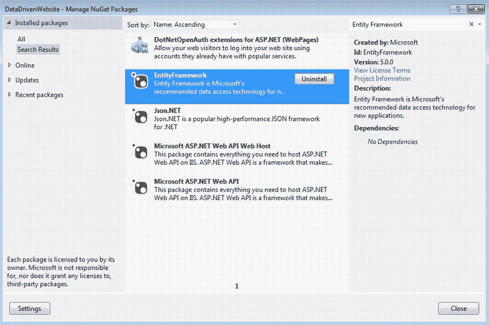

[图 7-2。](#_Fig2)实体框架 5 NuGet 包

按照以下步骤完成本练习:

1.  Create a Visual Studio 2012 C# ASP.NET MVC 4 Web Application named `DataDrivenWebsite` and, from the template selector dialog, select the *Internet Application* template. Make sure to select the *Create a unit test project* checkbox as shown in [Figure 7-3](#Fig3).

    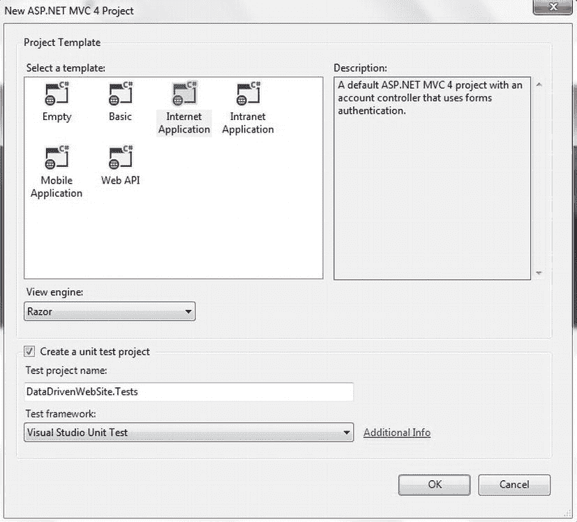

    [图 7-3。](#_Fig3)创建 ASP.NET MVC 4 互联网应用

2.  Follow the steps demonstrated in the [Chapter 1](01.html) exercise “Try It Out: First Data-Driven Page in ASP.NET 4.5” to add a new ADO.NET EDM to the project. However, now use the `Store` database as the source to generate the model. Once the EDM is generated, it should look like the one shown in [Figure 7-4](#Fig4). The entity container context is named `StoreEntities`.

    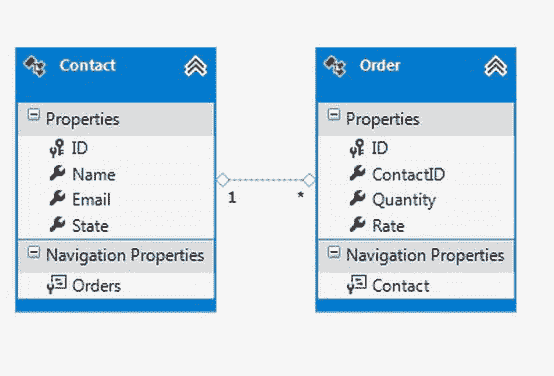

    [图 7-4。](#_Fig4)商店数据库生成的 EDM

3.  Open the *Solution Explorer* and right-click the `Controllers` folder. Click *Add  Controller...* from the context menu to launch the *Add Controller* dialog. Fill in the details in the *Add Controller* dialog, as shown in [Figure 7-5](#Fig5), to create an `OrderController` class using the `Orders` entity and `StoreEntities` entity context. In addition to generating the `OrderController`, select the *Views* option as *Razor* to generate the views automatically for the controller. You may need to build the solution before adding the controller in order for the model and context classes to be available for selection.

    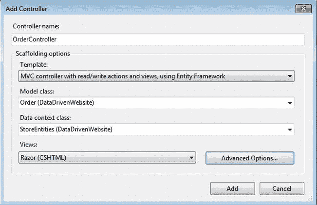

    [图 7-5。](#_Fig5)使用订单模型和 StoreEntities 数据上下文创建订单控制器

4.  Compile and Run the solution. Once the site is launched in the browser, key in `/Order` at the end of the URL in the address bar. The order items page will be displayed with a default-generated layout, as shown in [Figure 7-6](#Fig6). You can add new order items and edit existing ones.

    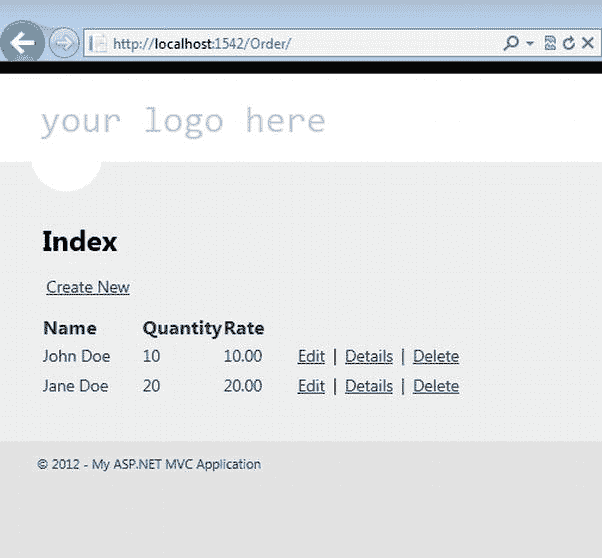

    [图 7-6。](#_Fig6)查看、添加和删除订单

这是如何工作的:

在前一章中，您了解到概念、存储和映射模式文件是在运行时从`.edmx`文件中动态生成的，它们存储在`obj\<Debug | Release>\edmxResourcesToEmbed`文件夹中。然后，实体框架运行时使用这些文件在映射持久性存储上执行查询，在我们的示例中是 Microsoft SQL Server 2012。EDM 设计器生成一个数据上下文——`DbContext`、 ( `System.Data.Entity`)类，作为查询模型的访问点。

当您使用`Order`模型和`StoreEntities DbContext`创建`OrderController`控制器类时，模板会自动创建动作方法，使用实体的 LINQ 来执行 CRUD 操作。如果您打开`OrderController.cs`文件并研究生成的代码，这是显而易见的。生成的控制器动作和使用实体框架数据上下文的底层数据访问逻辑可以很容易地进行单元测试，您将在本章后面的“单元测试您的数据访问层”一节中看到。在下一节中，您将探索如何使用 LINQ 到实体来查询 EDM。在开始之前，您将了解从现有数据库生成 EDM 时，关联是如何创建的。

实体关联

在数据库优先的范例中，实体框架为表之间存在的关系创建实体关联。关联允许您在实体之间导航，实体框架仅在查询关联数据时才加载它们。这就是所谓的*懒加载，这是实体框架的默认行为。*

 *打开 EDM 设计器后，右键单击连接 Order 和 Contact 实体的线条，然后单击 *Properties* 启动 Properties 窗格。你会在这个窗格中找到两个实体之间的关联，以及导航属性，如图[图 7-7](#Fig7) 所示。

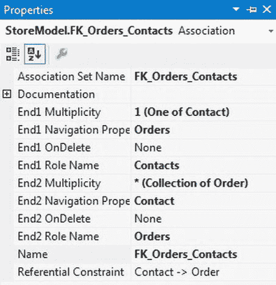

[图 7-7。](#_Fig7)订单和联系实体之间的关联从数据库中的外键关系生成

用 LINQ 向实体查询 EDM

Entity Framework 背后的核心思想之一是允许开发人员使用 CLR 支持的语言(如 C# 和 LINQ)以一种不考虑持久性的方式查询概念模型，然后以某种方式神奇地将它们转换成特定于数据库的查询。有几种方法可以查询 EDM。Entity Framework 运行时以 Entity SQL 为特色，这是一种类似 SQL 的语言，允许您针对 EDM 构造查询。在前一章中，您已经看到了实体 SQL 的运行。在本节中，您将了解实体的 LINQ，这是实体框架的一个特性，允许您使用 LINQ 查询 EDM。

打开`OrderController.cs`文件，记下生成的代码。返回默认视图的`Index`方法产生以下代码:

```cs
private StoreEntities db = new StoreEntities();

        //
        // GET: /Order/

        public ActionResult Index()
        {
            var orders = db.Orders.Include(o => o.Contact);
            return View(orders.ToList());
        }
```

添加控制器模板创建了一个`DbContext`容器类`StoreEntities`的实例。然后在`Index`方法中使用该实例，使用 Lambda 表达式语法返回订单列表。要记住的重要代码路径是在返回订单列表时添加`Include`方法。默认情况下，实体框架支持 lazing 加载，不返回关联的实体。前面的代码示例阐释了一种重写默认行为以返回关联实体的方法。

以类似的方式，创建`OrderController`类所需的步骤也生成了一个`Details`方法，该方法使用实体的 LINQ 来查找和显示个人`Order`的详细信息:

```cs
//
        // GET: /Order/Details/5

        public ActionResult Details(int id = 0)
        {
            Order order = db.Orders.Find(id);
            if (order == null)
            {
                return HttpNotFound();
            }
            return View(order);
        }
```

前面的查询也可以用 LINQ 语法表示，如下所示:

```cs
var orderDetails = from order in db.Orders
                               where order.ID == id
                               select order;
            if (orderDetails == null)
            {
                return HttpNotFound();
            }
            return View(orderDetails.FirstOrDefault());
```

 **注意**查询结果返回一个`IQueryable<Order>`类型。您必须使用`FirstOrDefault`方法向视图返回一个单独的`Order`。

使用文本模板 在实体框架中生成代码

当您在 Visual Studio 2012 中创建 EDM 时，实体容器上下文(`DbContext`类)和普通旧 CLR (POCO)类型形式的关联模型是使用名为 *T4* 的代码生成模板自动生成的。

 **注意**Visual Studio 2012 中的 T4 ( *文本模板转换工具包*)代码生成工具是现成的。

在我们的例子中，`StoreEntities`类代表了`DbContext`类型。`StoreEntities`类还包含一组`DbSet` ( `System.Data.Entity`)属性，表示数据上下文中的 POCO 类型集合。

`DbContext`和`DbSet`提供对象服务，允许您针对 EDM 创建查询。`DbContext`类提供运行时上下文，而`DbSet`类允许在实体模型上执行 CRUD 操作。

 **注意**如果使用的是 Visual Studio 2010，默认情况下不会生成`DbContext`和 POCO 类型。您需要添加实体框架 *DbContext 生成器* NuGet 包来使 DbContext 代码生成模板可用。然后，您需要向解决方案中添加一个代码生成项，以生成 DbContext 和 POCO 类型。

如果您在解决方案资源管理器中浏览组织在`Store.edmx`下的`Store.Context.cs`文件中的`StoreEntities`类，您将会看到下面的代码:

```cs
public partial class StoreEntities : DbContext
    {
        public StoreEntities()
            : base("name=StoreEntities")
        {
        }

        protected override void OnModelCreating(DbModelBuilder modelBuilder)
        {
            throw new UnintentionalCodeFirstException();
        }

        public DbSet<Contact> Contacts { get; set; }
        public DbSet<Order> Orders { get; set; }
    }
```

 **注**我们将在下一章讨论`OnModelCreating`方法。

构造函数提供了命名容器，在我们的例子中是`StoreEntities`，并且有两个`DbSet`属性代表了`Order`和`Contact`实体的实体集集合。LINQ 到实体的查询是针对`DbContext`类中的`DbSet`属性编写的，就像本章前面的“用 LINQ 到实体的查询 EDM”一节中显示的例子一样。`DbContext`提供了类似于`SaveChanges`的方法来在持久层中持久化数据。

探索`OrderController`类中的`Create`和`Delete`方法，您将会注意到在创建和删除操作中执行的`SaveChanges`方法，以保持数据库中`DbSet`集合的状态。下面的代码说明了`Create`方法:

```cs
[HttpPost]
        public ActionResult Create(Order order)
        {
            if (ModelState.IsValid)
            {
                db.Orders.Add(order);
                db.SaveChanges();
                return RedirectToAction("Index");
            }

            ViewBag.ContactID = new SelectList(db.Contacts, "ID", "Name", order.ContactID);
            return View(order);
        }
```

 **注意** `DbContext`和`DbSet`是`ObjectContext`和`ObjectSet`类的简化版本，方法有限。在实体框架 5 中，`DbContext`和`DbSet`类取代了`ObjectContext`和`ObjectSet`作为在 EDM 上执行 CRUD 操作的替代方法。尽管如此，您可以通过右键单击 EDM 设计器中的空白区域并将*代码生成策略*属性设置为*属性*菜单中的*默认*来恢复使用`ObjectContext`的旧风格，如图 7-8 所示。

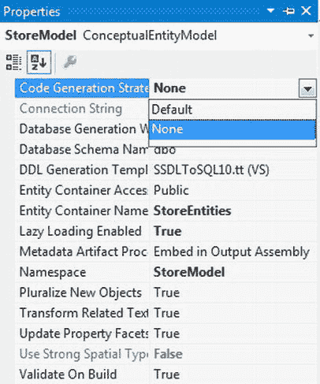

[图 7-8。](#_Fig8)使用 ObjectContext 恢复旧的代码生成风格

DbContext 生成器和 POCO 类

展开`Store.edmx`文件，您将看到在其层次结构下生成的一组文件。这显示在图 7-9 的[中。](#Fig9)

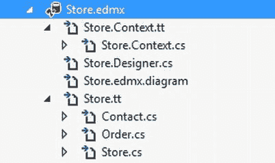

[图 7-9。](#_Fig9)T4 模板生成的文件

让我们探讨一下这些文件的用途，以及它们是如何协同工作的，从而允许以一种无视持久性的方式创建和操作 EDM。

1.  `Store.Context.tt` *文件*。这是一个用于生成`DbContext`类的文本模板文件。这个文件是一个容器，它允许以一种不考虑持久性的方式对 EDM POCO 类型进行数据访问和操作。
2.  `Store.Context.cs` *文件*。这是生成的`DbContext`类文件，支持对 POCO 类型的 CRUD 操作。
3.  `Store.edmx.diagram` *文件*。这是设计器关系图配置文件。
4.  `Store.tt` *文件*。这是一个文本模板文件，用于生成不支持持久性的 POCO 类型。
5.  `Order.cs` *和* `Contact.cs` *文件*。这些是为`Store` EDM 的 POCO 类型生成的文件。

创建`Store.edmx`文件会使用 T4 代码生成工具自动创建代码生成的项目。

该工具使用文本模板(`.tt`)文件来生成数据上下文类和 POCO 类型。如果您想要默认代码生成过程的变体，那么您可以通过创建额外的代码生成项来修改代码生成模板。为此，右键单击 EDM Designer 界面，然后单击*添加代码生成项...，*如图[图 7-10](#Fig10) 所示。

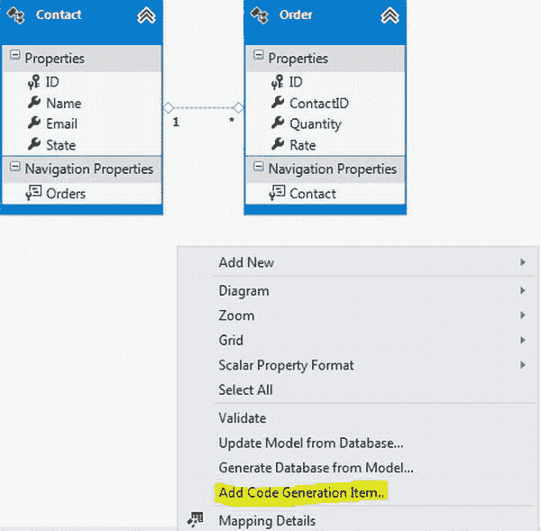

[图 7-10。](#_Fig10)新增代码生成项

在*添加新项目* 对话框中，选择*数据*页签下的*实体框架 5.x DbContext 生成器*，如图[图 7-11](#Fig11) 所示。

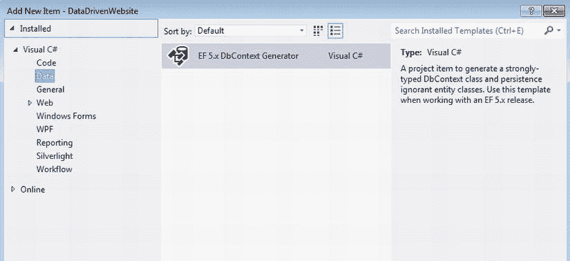

[图 7-11。](#_Fig11)实体框架 5 DbContext 生成器模板

添加代码生成项目将根据默认的 T4 模板创建 POCO 类型。T4 基础设施提供了一个*定制工具*，它使用文本模板并生成上下文类和 POCO 类型。每次在 EDM Designer 中进行更改时，系统都会提示您运行定制工具，以相应地更新上下文和 POCO 类。或者，你也可以通过右击`.edmx`文件并点击快捷菜单中的*运行定制工具*来手动运行定制工具，如图[图 7-12](#Fig12) 所示。

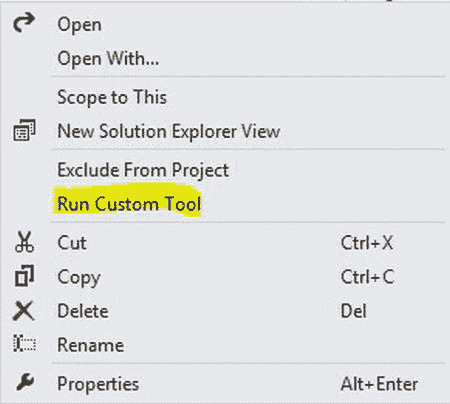

[图 7-12。](#_Fig12)运行代码生成器自定义工具

 **提示**如果数据库模式发生变化，可以使用 EDM 设计器中的*从数据库更新模型*选项更新模型，如图[图 7-13](#Fig13) 所示。更新模型还将运行定制工具来重新生成 POCO 类型。

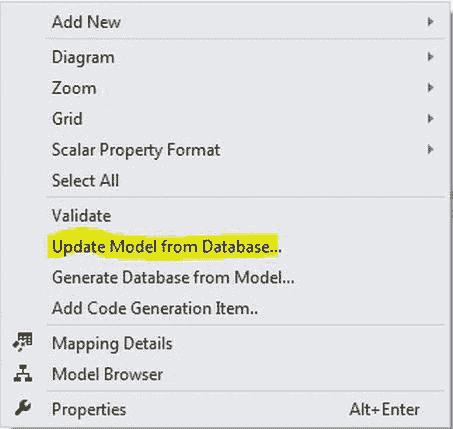

[图 7-13。](#_Fig13)刷新模型以反映更新的数据库模式更改

您将在第 12 章中了解定制模板所需的更多步骤，其中您将探索使用实体框架创建数据访问层的一些最佳实践。

非代理服务器

在幕后，Entity Framework 做了许多旨在提高数据访问操作性能的事情。其中一个动作是在实例化 POCO 类型时从它们创建派生实体。这些派生类型充当 POCO 类型的代理，以便支持相关类型的延迟加载等特性。但是，可以通过将当前`Configuration`实例的`ProxyCreationEnabled`属性设置为 false 来禁用该特性，如下面的代码片段所示。

```cs
public StoreEntities()
            : base("name=StoreEntities")
        {
            Configuration.ProxyCreationEnabled = false;
        }
```

 **注意**如果使用实体上下文的新实例，POCO 派生类型不会自动生成。但是，您可以使用上下文中的`DbSet`属性的`Create`方法来强制生成它们。

急切加载实体

默认情况下，实体框架促进了惰性加载；也就是说，只有在第一次访问导航属性时，才会加载关联的实体数据。实体框架通过覆盖标记为`virtual`的导航属性的行为来做到这一点。在我们的示例中，如果您在解决方案资源管理器下展开`Store.tt`文件并打开`Contact.cs`文件，您将看到`Orders`集合被标记为虚拟属性。

```cs
public partial class Contact
    {
        public Contact()
        {
            this.Orders = new HashSet<Order>();
        }

        public int ID { get; set; }
        public string Name { get; set; }
        public string Email { get; set; }
        public string State { get; set; }

        public
virtual
ICollection<Order> Orders { get; set; }
    }
```

 **提示**生成的 POCO 类型类都是分部类。如果需要添加不参与映射的其他属性，可以创建保存这些属性的附加分部类。不要修改生成的 POCO 类型文件，因为它会在每次自定义工具运行时被覆盖。

在某些情况下，您可能不希望发生延迟加载。如果您有一个优先选择急切加载的场景，您可以在查询主要属性时通过使用`Include`方法显式地这样做:

```cs
public ActionResult Index()
        {
            var orders = db.Orders.Include(o => o.Contact);
            return View(orders.ToList());
        }
```

 **注意**您可以通过将当前上下文配置的`LazyLoadingEnabled`属性设置为 false 来完全禁用延迟加载。

复杂类型

Entity Framework 5 允许您创建复杂类型，以便于将几个属性分组到一个属性下。您可以通过实体框架设计器将现有属性重构为一个复杂类型。选择一个实体下的多个属性，点击右键，选择*重构移动到新的复杂类型*选项，创建一个复杂类型，如图[图 7-14](#Fig14) 所示。

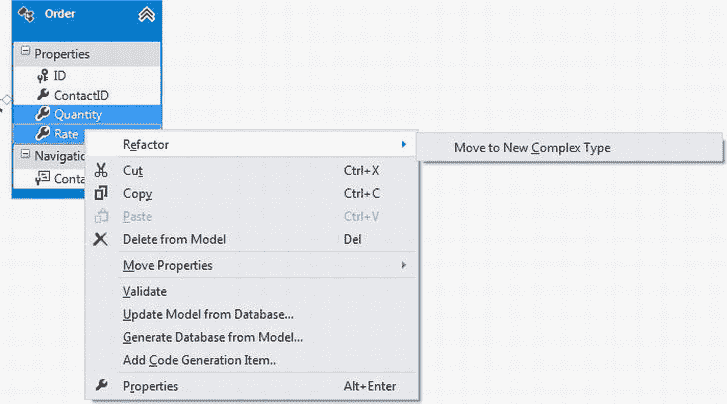

[图 7-14。](#_Fig14)重构到复杂类型

您也可以通过从设计器添加新的复杂类型，然后在其下添加属性来创建复杂类型。在我们的例子中，我们根据`Rate`和`Quantity`属性在`Order`实体下创建了`PriceOptions`复杂类型。映射被保留，如图[图 7-15](#Fig15) 所示。

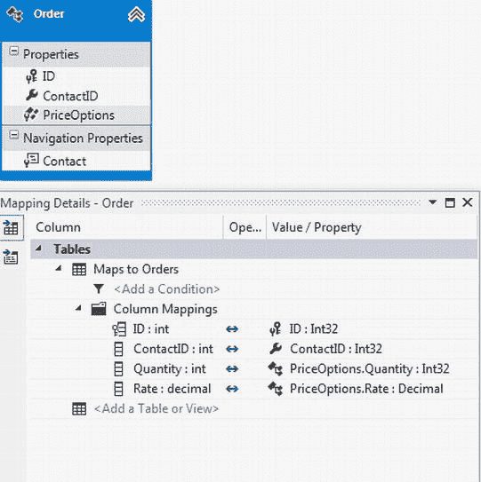

[图 7-15。](#_Fig15)从保留映射的价格和数量属性创建的 PriceOptions 复杂类型

 **注意**复杂类型不参与一个关联。

复杂类型和存储过程

实体框架提供了一个名为*的特性，函数导入*、允许你调用一个存储过程并将结果赋给一个复杂类型。您可以通过右键单击空白区域并选择 *Add New  Function Import，从实体框架设计器中创建一个函数导入...*。

让我们创建一个存储过程来获取订单的净价，然后在实体框架中将它用作函数导入。在 SQL Server 存储数据库中运行以下脚本来创建存储过程`Get_NetPrice`:

```cs
SET ANSI_NULLS ON
GO
SET QUOTED_IDENTIFIER ON
GO

CREATE PROCEDURE Get_NetPrice

@OrderID INT

AS
BEGIN

SELECT (Rate * Quantity) AS Price
FROM Orders
WHERE ID = @OrderID

END
GO
```

打开实体框架设计器，从数据库中更新模型，将存储过程包含在模型中，如图[图 7-16](#Fig16) 所示。

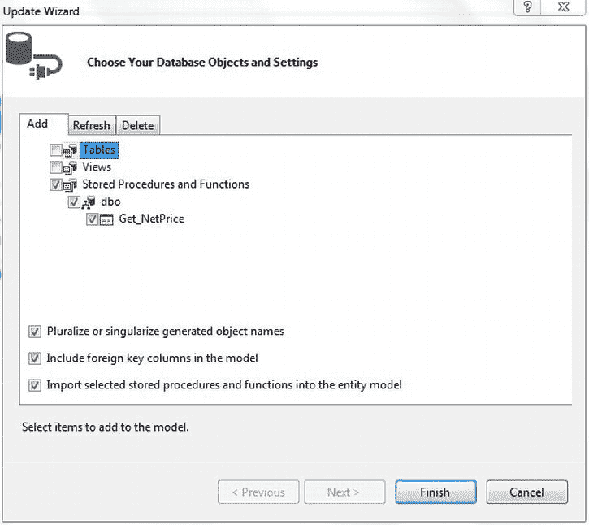

[图 7-16。](#_Fig16)更新模型以包含新创建的存储过程

按照以下步骤创建函数导入:

1.  从实体框架设计器添加一个函数导入，在*添加函数导入*对话框中，输入名称`Get_NetPrice`。
2.  从*存储过程/函数名*下拉菜单中选择`Get_NetPrice`存储过程。
3.  点击*获取列信息*按钮获取存储过程的信息，然后点击*创建新的复杂类型*按钮生成复杂类型。
4.  将类型重命名为`PriceOptions`。

一旦你完成了前面的程序，对话框应该看起来像图 7-17 中所示的那样。

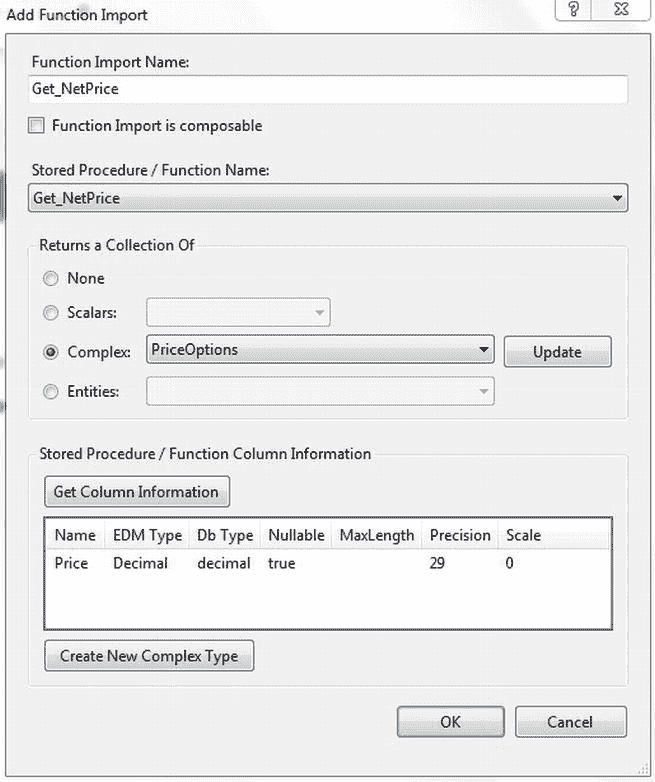

[图 7-17。](#_Fig17)使用存储过程创建函数导入

点击*确定*创建功能导入。`PriceOptions`复杂类型将作为 POCO 类型生成，您会注意到在`StoreEntities DbContext`类中创建了一个新方法来执行存储过程并将结果分配给复杂类型`PriceOptions`。

```cs
public virtual ObjectResult<PriceOptions> Get_NetPrice(Nullable<int> orderID)
        {
            var orderIDParameter = orderID.HasValue ?
                new ObjectParameter("OrderID", orderID) :
                new ObjectParameter("OrderID", typeof(int));

            return ((IObjectContextAdapter)this).ObjectContext.ExecuteFunction<PriceOptions>("Get_NetPrice", orderIDParameter);
        }
```

现在您可以在您的`OrderController`类中使用它来访问价格信息。

```cs
var price = db.Get_NetPrice(id).FirstOrDefault().Price;
```

枚举类型

这也是 Entity Framework 5 中的一个新特性。它允许您创建枚举作为实体属性。您可以在实体设计器中创建枚举类型，方法是右键单击空白区域，然后单击 *Add New → Enum Type* 。一旦创建了枚举类型，就可以基于该枚举创建实体属性。

实体客户数据提供者

实体框架使用`EntityClient` ( `System.Data`)数据提供者对概念模型执行实体 SQL 查询，这些查询或者从 LINQ 转换为实体，或者只是转换为原始实体 SQL。数据提供者与一个本地的 ADO.NET 数据提供者协同工作来执行支持持久性的查询。因此，在许多方面，它类似于任何标准的 ADO.NET 数据提供者，如提供对众所周知的数据访问接口`Connection` ( `EntityConnection`)、`Command` ( `EntityCommand`)、`Parameter` ( `EntityParameter`)和`DataReader` ( `EntityDataReader`)对象的支持。然而，`EntityConnection`对象中指定的连接字符串用概念模型信息包装了特定于提供者的连接字符串。从您的解决方案资源管理器中打开`DataDrivenWebSite`项目的`Web.config`文件，并浏览`StoreEntities`连接字符串。应该是这样的:

```cs
    <add name="StoreEntities" connectionString="metadata=res://*/Store.csdl|res://*/Store.ssdl|res://*/Store.msl;provider=System.Data.SqlClient;provider connection string=&quot;data source=.;initial catalog=Store;integrated security=True;MultipleActiveResultSets=True;App=EntityFramework&quot;" providerName="System.Data.EntityClient" />
```

当您需要直接控制查询执行时，可以直接针对`EntityClient`提供者进行编程，例如在高性能场景中。

单元测试你的数据访问层

Visual Studio 2012 提供了强大的单元测试功能，可用于测试代码的准确性。这些功能可以扩展到测试实体框架数据上下文和隔离的模型行为。如果您还记得，在创建 ASP.NET MVC 4 项目时，您在模板选择对话框中选择了*创建单元测试项目*选项。ASP.NET MVC 4 项目模板创建了一个 Visual Studio 单元测试项目，并为默认的`HomeController`类添加了一些基本的单元测试。在企业级项目中，您可能会有一个单独的数据访问层。然而，为了简单起见，让我们假设数据访问逻辑在控制器动作内部，针对这些方法编写的单元测试将使用实体框架测试数据访问。

1.  To add a new unit test, right-click the `DataDrivenWebSite.Tests` project and click *Add  New Item*. In the *New Item* dialog, select *Unit Test* from the *Test* tab and name it `OrderControllerTest`, as shown in [Figure 7-18](#Fig18).

    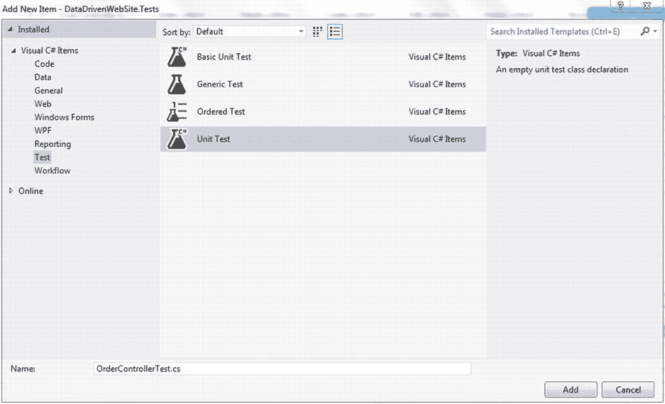

    [图 7-18。](#_Fig18)创建新的单元测试

2.  生成一个默认的单元测试模板。`TestClassAttribute`表示包含单元测试的类。请参考使用部分中的以下名称空间:

    ```cs
    using DataDrivenWebSite;
    using DataDrivenWebSite.Controllers;
    using System.Web.Mvc;
    ```

3.  如果你向下滚动，你会看到一个用`TestMethodAttribute`修饰的方法。`TestMethodAttribute`代表被测试的代码单元。将该方法重命名为`Index`，并在其中编写以下代码块:

    ```cs
    [TestMethod]
            public void Index()
            {
                OrderController controller = new OrderController();
                ViewResult result = controller.Index() as ViewResult;
                var model = result.Model;
                Assert.IsNotNull(model);
                Assert.IsInstanceOfType(model, typeof(List<Order>));
            }
    ```

4.  上一步中的代码块断言与`Order`视图相关联的模型属于类型`List<Order>`。右键单击`Index`方法，然后单击*运行测试*。测试通过，如[图 7-19](#Fig19) 所示。

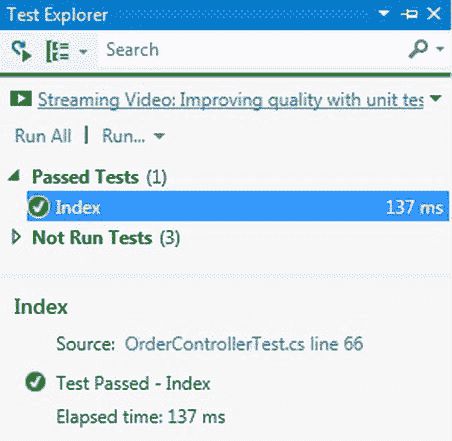

[图 7-19。](#_Fig19)测试浏览器中显示的单元测试结果

您可以在控制器测试类中编写额外的测试方法来断言控制器中的各种操作。如果断言创建、更新或删除操作并对这些操作进行补偿，以使更改不会永久保存在持久性存储中，则应该小心。或者，你可以使用一个模仿框架来模仿持久性存储库，比如 *MoQ* 或者*微软假货框架*。MSDN 的文章`http://msdn.microsoft.com/en-us/library/hh549175.aspx`很好地介绍了微软的 Fakes 框架。

摘要

本章旨在让您深入了解实体框架的功能。您了解了如何使用 EDM Designer 从现有数据库创建和更新实体模型，以及如何使用 T4 模板生成 POCO 类型。您还探索了 Entity Framework 5 中一些有趣的新增功能，包括复杂类型和对枚举的支持。最后，您学习了如何使用 ASP.NET MVC 4 控制器模板，通过实体框架对您的数据访问进行单元测试。

在撰写本文时，Entity Framework 6 Alpha 2 已经发布了预览版，Scott Guthrie 的博客文章`http://weblogs.asp.net/scottgu/archive/2012/12/11/entity-framework-6-alpha2-now-available.aspx`详细阐述了它即将推出的一些增强功能。

在下一章中，您将了解更多关于实体框架支持不同数据访问范例的高级功能，例如模型优先和代码优先。*