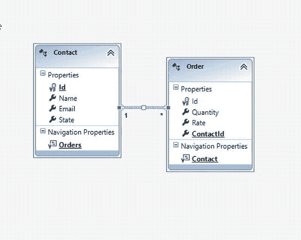

# 八、实体框架数据访问范例

在[第 1 章](01.html)中，向您介绍了现代数据访问范例。为了帮助您记住这些，在应用中设计数据访问层有三个主要策略。

**数据库第一:** 从设计数据库(或使用一个预先存在的数据库作为源)开始，然后使用概念模型生成器工具从数据库创建一个实体容器。实体容器模型将表示关系数据库的各种表和表示关系的关联。然后，您可以查询和操作模型，并让工具在幕后执行 CRUD 操作。如果您的应用有一个可以连接并从中获取信息的现有数据库，那么这种方法就越来越重要。

**Model First:** 您首先使用可用的 Designer 工具设计概念模型，然后您可以从概念模型生成数据库，或者将工具生成的数据上下文映射到预先存在的数据库。

**代码优先:** 这是一种开发人员友好的方法，您用代码创建概念模型，然后使用专有的 API 将模型映射到物理数据库。

ADO.NET 实体框架很好地支持了这些范例，这种强大的支持是实体框架在各种应用中创建健壮的数据访问层时越来越受欢迎的主要原因之一。

在前一章中，我们重点学习了实体框架的细微差别，在很大程度上，您使用了数据库优先的范例。这一章是你先前所学内容的延伸。除此之外，您将了解更多关于其他两个范例:模型优先和代码优先。

具体来说，我们将在本章中讲述以下内容:

*   如何使用模型优先方法进行数据访问编程？
*   如何使用代码优先方法进行数据访问编程？
*   如何使用数据注释执行验证。

尽管你在第 1 章中学习了这些范例，现在你将学习使用实体框架实际实现它们。

 **注**在撰写本文时，实体框架的最新版本是 EF 5.0。我们利用 EF 5.0 来完成本章的练习。

模型优先方法

在前一章中，您学习了如何利用实体框架在您的应用中快速有效地构建数据访问层。在那一章的例子中，您通过从现有的商店数据库生成*实体数据模型(EDM)* 来创建它。表*联系人*和*订单*作为实体出现在 EDM Designer(`edmx`文件)中。实体关联也是使用表之间的外键关系自动生成的。

如果您正在处理一个已经存在的数据库，并且您只需要围绕它构建一个应用，那么这是一个合理的方法。但是，如果您正在创建一个从应用到数据库的全新堆栈，那么您很可能想要创建一个可视化模型，然后基于该可视化模型创建数据库。

如果能从可视化模型中自动生成数据库岂不是很棒？模型优先的方法可以让你做到这一点。您可以在应用中对数据库进行建模，然后随着应用的增长对模型进行改进。在幕后，Entity Framework 将根据 EDM 约定将您的模型映射到物理数据库。不精通关系数据库的应用开发人员发现这种方法非常有用。对于从头开始构建的应用以及存储模式，他们通常会采用它。使用 Entity Framework 的好处是，它能够使用底层提供者将模型转换为数据库模式，并使用一个脚本生成数据库。让我们尝试使用实体框架模型优先的方法来执行旨在创建应用数据访问层的步骤。

尝试一下:用实体框架模型优先的范例创建数据驱动的 WEB 应用

你将使用最新版本的流行开发工具 Visual Studio 来做这个练习。您将学习使用 EDM Designer 对我们在本书中讨论过的商店数据库进行建模，然后使用它来创建数据库表和关系。请遵循以下步骤:

1.  Open Visual Studio 2012, and create a Visual C# ASP.NET MVC 4 Web Application project. The project template wizard is displayed. Choose the *Internet Application* template, as shown in [Figure 8-1](#Fig1).

    

    [图 8-1。](#_Fig1)创建 ASP.NET MVC 4 Web 应用

     **注意**在本练习中，您可以选择任何模板。

2.  Add an ADO.NET Entity Data Model as a new item to the project, as shown in [Figure 8-2](#Fig2). Select Empty Model in the Choose Model Contents step of the ADO.NET Entity Data Model Wizard.

    

    [图 8-2。](#_Fig2)从实体数据模型向导添加空模型

3.  Right-click the Designer surface, and click *Add New  Entity*, as shown in [Figure 8-3](#Fig3).

    

    [图 8-3。](#_Fig3)从模型设计器表面添加新实体

4.  In the *Add Entity* dialog, specify the Entity name as `Contact`. Under the *Key Property* section, select the check box *Create key property* and name the *Property* `Id`, as shown in [Figure 8-4](#Fig4). Click *OK* to close the dialog.

    

    [图 8-4。](#_Fig4)指定实体名称和关键属性

5.  The `Contact` Entity Model will be created in the Designer surface. Right-click the *Properties* section in the `Contact` Entity Model, and click *Add New  Scalar Property*, as shown in [Figure 8-5](#Fig5). Set the property name to `Name`. In a similar fashion, create the `Email` and `State` properties.

    

    [图 8-5。](#_Fig5)向联系人实体添加新的标量属性

6.  Select the `State` property, and press F4 to display the *Properties* pane. In the *Properties* pane, set the *Max Length* property to `2` and *Nullable* to `True`, as shown in [Figure 8-6](#Fig6). This would effectively disallow the `State` field in the database from storing more than two characters. In a similar fashion, set *Max Length* of the `Email` property to `100` and *Nullable* to `True`.

    

    [图 8-6。](#_Fig6)实体属性约束

7.  重复步骤 5 和 6，创建一个具有两个小数标量属性的订单实体，`Rate`和`Quantity`。
8.  Next, right-click the Designer surface, and click *Add New Association*. In the *Add Association* dialog, make sure there is a *One-to-Many* association established between `Contact` and `Order`, as shown in [Figure 8-7](#Fig7). Click *OK* to close the dialog.

    

    [图 8-7。](#_Fig7)创建联系人和订单之间的实体关联

9.  You have now successfully created the entity data context for the `Store` database, as shown in [Figure 8-8](#Fig8).

    

    [图 8-8。](#_Fig8)使用设计器通过模型优先方法创建的实体模型

10.  Right-click the Designer surface and click *Validate*. You will notice a couple of warnings saying *Entity type < type > is not mapped*, which is displayed under the *Error List* window, as illustrated in [Figure 8-9](#Fig9). This is due to the fact that you still haven’t mapped the model to a physical database.

    

    [图 8-9。](#_Fig9)验证错误缺少与实体店的映射

11.  Right-click the Designer surface again, and click *Generate Database from Model*. In the *Generate Database Wizard: Choose Your Data Connection* step, specify a connection to your database, as shown in [Figure 8-10](#Fig10). Click *Next*.

    

    [图 8-10。](#_Fig10)指定用于将模型映射到物理数据库的连接字符串

12.  Entity Framework will automatically generate the script to create the `Store` database. You can review the generated script under the *Summary and Settings* step, as shown in [Figure 8-11](#Fig11). Once you have finished reviewing the script, click *Finish*. A script for generating the database will be created and saved under your project. If you now run *Validate* again, it will run without any errors.

    

    [图 8-11。](#_Fig11)实体设计器生成的脚本

13.  Your entity data context is now ready to be built using the Model-First approach.

    要在控制器中使用`Store`数据上下文进行 CRUD 操作，创建一个`StoreContext`类的实例，该实例是在设计器中创建实体和关联时由实体框架生成的。

    Visual Studio 2012 提供了一个*模型浏览器*窗格，其中列出了与概念模型和相关物理数据库相关的所有不同工件。您可以创建任意多的概念模型，这也意味着您可以创建 EDM 的多个版本。

14.  Open the *Model Explorer* pane. You can right-click the *Diagrams* folder and click *Add New Diagram* to create different versions of the requisite conceptual model, as shown in [Figure 8-12](#Fig12).

    

    [图 8-12。](#_Fig12)创建新的实体模型

模型优先的方法带来了在您的开发工作室内协作处理数据模型的可视化体验，并且您不必使用 SQL 工具或任何第三方设计器来改进您的实体模型。这可能是所有现代数据访问范例中最流行的方法。

代码优先方法

想象一个场景，其中多个团队在一个项目上工作，并且他们还没有准备好基础实体模型来在范围迭代中协作和改进。每个团队可能对他们自己的实体有足够的了解，能够构建他们自己的模块。然后，考虑一个单独的团队被委托来设想将在计划中的所有项目中使用的概念数据模型。当然，涉众不希望团队仅仅因为数据模型还没有准备好就无所事事。相反，他们希望看到单个模块的进展。在这种情况下，如果开发人员可以使用代码中创建的实体类作为其模块的数据模型，这将是有益的——只要足以显示从物理存储中访问和操作数据的进度。如果这些类能够在数据团队制作时无缝集成到更大的概念模型中，那就更好了。

实体框架以代码优先的方式支持这种场景。这种方法允许每个开发团队继续利用实体框架，而不必事先投入时间创建概念模型。实体框架允许使用代码优先的方法，围绕代码中可用的所有域类(POCO)创建实体容器。这个实体容器的行为与使用实体框架的数据库优先或模型优先方法完全一样，它可以用于在关系数据库上执行 CRUD 操作。

 **注**。NET 框架领域类通常被称为 *POCO* 类。POCO 代表普通的旧 CLR 对象。

让我们看看使用代码优先方法创建实体数据上下文所需的步骤。

试试看:用实体框架代码优先的范例创建一个数据驱动的 ASP.NET MVC 4 应用

在本练习中，您将创建熟悉的`Order`和`Contact` POCO 类。然后，您将使用 POCO 类构建`Store`实体数据上下文，以利用实体框架特性将实体映射到物理数据库表，并对它们执行 CRUD 操作。遵循这些步骤:

1.  使用您之前学习的步骤创建一个 ASP.NET MVC 4 Web 应用项目。尽管您可以在本练习中使用任何模板，但为了简单起见，我们将在示例中继续使用 Internet 模板。
2.  Create a Contact class with the properties listed in the following code snippet:

    ```cs
    namespace CodeFirstEF.Models
    {
        public class Contact
        {
            public int ContactId { get; set; }
            public string Name { get; set; }
            public string Email { get; set; }
            public string State { get; set; }
            public List < Order > Orders { get; set; }
        }
    }
    ```

    注意，`Orders`是一个导航属性，在创建了`Order`实体之后，您必须将它添加到`Contact`实体中。

     **注意**对于存储库主键的自动映射，您必须为名为`ContactId`的`Contact`类拥有一个`Id`属性。或者，您也可以使用数据注释属性`KeyAttribute`。我们将在“用数据注释进行验证”一节中进一步讨论这一点。

3.  In a similar fashion, create the `Order` class.

    ```cs
    public class Order
        {
            public int OrderId { get; set; }
            public int ContactId { get; set; }
            public decimal Rate { get; set; }
            public decimal Quantity { get; set; }
            public Contact Contact { get; set; }
        }
    ```

     **注意**`Order`类中的`ContactId`属性将允许实体框架在数据库中形成外键关系。在下一节中，您将了解如何使用数据注释明确指定外键关系。

4.  创建一个继承`DbContext` ( `System.Data.Entity`)的`StoreContext`类，并将`Contact`和`Order`类指定为`DbSet`实例，如下:

    ```cs
    public class StoreContext : DbContext
        {
            public StoreContext() : base("name = StoreContext")
            {
            }

            public DbSet < Contact > Contacts { get; set; }
            public DbSet < Order > Orders { get; set; }
        }

    ```

5.  最后，更新`Web.config`为存储库指定一个连接字符串，您就可以使用实体框架对您的实体类执行 CRUD 操作了。

    ```cs
    <connectionStrings>
        <add name = "StoreContext" connectionString = "Data Source = (localdb)\v11.0; Initial Catalog = StoreContext-20120926224002; Integrated Security = True; MultipleActiveResultSets = True; AttachDbFilename = |DataDirectory|StoreContext-20120926224002.mdf"
          providerName = "System.Data.SqlClient" />
      </connectionStrings>
    ```

 **注意**连接字符串名称必须与数据上下文类的名称相同，除非你在数据上下文类构造函数中特别提到了实例名称。

您已经成功地将实体映射到 SQL Server LocaDB 数据库。在您的控制器类中创建一个`StoreContext`类的实例，并使用它来执行数据访问和操作。接下来，您将学习如何使用 Entity Framework 在您的应用中以编程方式配置物理数据库。

数据库初始化器

实体框架提供了`IDatabaseInitializer <TContext>`(其中`TContext`被约束为`DbContext`类型)接口，该接口可用于定制从应用代码初始化数据库的步骤。这对于代码优先的方法非常有用，因为它为您提供了一种随着模型的发展以编程方式更新数据库的方法。已经提供了一些默认的实现，比如`DropCreateDatabaseIfModelChanges` ( `System.Data.Entity`)，如果实体框架检测到模型变化(数据上下文文件被更新)，它将在存储中重新创建数据库。`System.Data.Entity.Database.SetInitializer`方法用于指定数据库初始化规则。

为了在应用启动时设置数据库，您可以执行以下代码来创建数据库，并添加一次性数据或样本数据以供参考:

```cs
protected void Application_Start()
        {
            AreaRegistration.RegisterAllAreas();

            FilterConfig.RegisterGlobalFilters(GlobalFilters.Filters);
            RouteConfig.RegisterRoutes(RouteTable.Routes);
            BundleConfig.RegisterBundles(BundleTable.Bundles);

            Database.SetInitializer(new DropCreateDatabaseIfModelChanges <StoreContext> ());
        }
```

在这种情况下，代码在`Global.asax`文件下的`Application_Start`方法中。每当应用启动时，实体框架将检查模型变化，并且它将基于新的模型重新创建数据库。

 **注意**使用数据库初始化器的时候一定要小心。`DropCreateDatabaseIfModelChanges`类将删除数据库和以前存储的任何现有数据。使用适合您的场景的`IDatabaseInitializer <TContext>`接口创建您自己的初始化器是最理想的。

接下来，我们将探索一种不同的方法来创建基于代码优先范例的实体容器，并使用原生的 ASP.NET MVC 4 特性。

尝试一下:使用添加控制器创建数据上下文类

在 ASP.NET MVC 4 中，还有一种使用 Visual Studio 模板从现有的域实体中快速生成实体容器的方法。

1.  打开您在上一节中创建的 ASP.NET MVC 4 项目。
2.  在*解决方案浏览器*中右键点击*控制器*文件夹，点击*添加控制器。。。*。
3.  在*新建控制器*对话框中，指定*控制器名称*为`Contact`，使用实体框架选择具有读/写动作和视图的模板 *MVC 控制器。*
4.  在*模型类别*下拉列表下，选择`Contact`类别。
5.  在*数据上下文类*下，选择第一个选项 *<新建数据上下文>* 。将显示*新数据上下文*对话框，数据上下文类名指定为`StoreContext`。
6.  Click *OK* to return to the *Add Controller* dialog. The *Add Controller* dialog should appear as illustrated in [Figure 8-13](#Fig13).

    

    [图 8-13。](#_Fig13)使用添加控制器向导创建数据上下文类

7.  点击*添加*来生成`ContactController`类、关联视图和`StoreContext`数据上下文类。
8.  以类似的方式创建`OrderController`控制器类，只是这次选择`StoreContext`类作为数据上下文选项，它现在在*数据上下文类*下拉列表中可用。

现在，您已经准备好执行数据访问操作，模板使用 ASP.NET MVC 4 和实体框架为您生成从视图到数据访问层的所有代码。

前面的方法使用实体框架中的默认约定。接下来，我们将讨论如何使用 Entity Framework 中的数据注释和 Fluent API 特性来覆盖代码优先的默认约定。

使用 Fluent API 定制映射

在使用 Entity Framework 的真实的、数据驱动的应用开发场景中，您很可能会处理复杂的实体和关系。默认约定几乎不可能将这种关系映射到物理数据库。

Entity Framework 允许你使用`ModelBuilder`类和它公开的一些方法覆盖代码中的默认映射，这些方法统称为 *Fluent API* 。因此，`ModelBuilder`类支持几个强大的功能，用于在映射到物理数据库时操作默认的实体框架数据上下文行为。然而，我们将在本节中讨论关系映射覆盖。

用于创建实体容器的`DbContext (System.Data.Entity)`类有一个`OnModelCreating`方法，可以在数据上下文类的实现中被覆盖(在我们的例子中是`StoreContext`)。`OnModelCreating`方法接收一个被称为`DbModelBuilder`的`ModelBuilder`类的派生版本，作为公开方法的参数，以指定与物理数据库的关系映射。

继续讨论`Store`数据上下文，假设您希望以不同的方式命名`Order`类中的`ContactId`属性，并且仍然用这个重命名的属性维护数据库中的外键关系。默认约定无法解决这个问题，您需要使用 Fluent API 语法在`Store`数据库中明确指定`Orders`和`Contacts`表之间的外键关系，如下所示。(假设您想将属性命名为`PersonId`。)

```cs
protected override void OnModelCreating(DbModelBuilder modelBuilder)
{
    modelBuilder.Entity <Order> ()
        .HasRequired <Contact> (order => order.Contact)
        .WithMany(order => order.Orders)
        .HasForeignKey(contact => contact.PersonId);
}
```

如代码所示，您需要结合使用三个 Fluent API 方法来覆盖数据库中的外键关系。`HasRequired` 方法指定一个导航引用，后跟代表关系类型的`WithMany`，然后`HasForeignKey`随后指定相关实体中要用作外键引用的属性。当您再次运行应用时，`DropCreateDatabaseIfModelChanges`将被触发，您会注意到外键约束现在被设置在了`PersonId`列上。这是一个过于简化的示例，旨在让您对 Fluent API 的功能有所了解。你可以在下面的 MSDN 文章中进一步探索:`http://msdn.microsoft.com/en-US/data/jj591620`。

 **注意**数据注释是 Fluent API 的替代，遵循属性驱动模型覆盖默认映射行为。如果您只是用`ForeignKey (System.ComponentModel.DataAnnotations.Schema)`数据注释属性修饰了`PersonId`属性，那么前面的例子会更容易实现。然而，这个例子展示了如何使用 Fluent API 为您带来好处。在某些复杂的映射场景中可能无法使用数据注释，您可能需要使用 Fluent API。这两种方法都为您提供了您喜欢的编程范例的选择。就数据注释而言，我们将在“用数据注释进行验证*一节中进一步探讨它们。*”

代码优先迁移

实体框架的代码优先方法有一个非常重要的特性，叫做*迁移*。随着模型的发展，迁移允许您维护变更的历史，并且允许将它们应用到您的数据库中。它还允许添加*种子数据*进行初始化。

要启用迁移，您可以在 Visual Studio 2012 实例中的*工具库包管理器*下的*包管理器控制台*上运行命令`Enable-Migrations` 。一旦启用了迁移，就会在您的项目中创建一个名为 migrations 的文件夹，其中包含两个文件:一个用于定义迁移设置的`Configurations`类文件和一个用于表示所做更改的`<timestamp> _InitialCreate`类文件。您可以使用`Add-Migration`命令，让实体框架代码优先迁移在模型发生变化时，根据默认约定最好地支持迁移。您可以修改生成的脚手架模板，以进行适当的更改。

这个主题需要进一步的研究，我们将在第 12 章中探讨构建数据驱动网站的策略和最佳实践时详细讨论。

首先从数据库逆向工程代码

如果您采用了代码优先的方法(考虑到其灵活性，这是很有可能的)，并且您想在现有的数据库上使用它，那么可以使用*实体框架工具*从物理数据库中自动生成 POCO 类和数据上下文。目前在其 Beta 2 版本中，实体框架 Power Tools 包括一个逆向工程特性，如图[图 8-14](#Fig14) 所示，它可以用来从物理数据库中生成你的代码优先类。


[图 8-14。](#_Fig14)先逆向工程代码

你可以从这个网站下载并安装电动工具:`http://visualstudiogallery.msdn.microsoft.com/72a60b14-1581-4b9b-89f2-846072eff19d`。

 **注意**Power Tools 还允许您使用 T4 定制逆向工程模板，这让您可以控制生成 POCO 类的方式，并遵循您的命名约定。

用数据注释进行验证

如果你喜欢属性驱动编程，你会喜欢 *数据注释*对实体框架 POCO 类所做的事情。数据注释是 Entity Framework 的一个特性，它允许您清晰地定义验证规则和其他几个规则，以覆盖默认的 Entity Framework 代码优先约定。

数据注释是使用流畅 API 约定的替代方法。Fluent API 在重写代码优先约定方面提供了更好的控制；然而，数据注释可读性更好，并且减少了重写约定的代码量。在上一节中，您看到了如何在使用 Fluent API 创建外键关系时覆盖默认的代码优先约定。在数据注释风格中，这可以简单地通过使用 ForeignKey 属性作为[ForeignKey("PersonID")]来实现。但是，数据注释不能用于需要在实体之间建立复杂关系的场景，您必须使用 Fluent API。

使用数据注释的一个自然扩展是用于验证。在这一节中，我们将重点关注数据验证规则。

实体框架数据注释属性在实体框架 5 的名称空间`System.ComponentModel.DataAnnotations`下可用。此名称空间下有许多可用的验证属性，可用于在模型 POCO 类属性中实现约束，以维护数据库中的数据完整性和一致性。例如，下面的代码使用`EmailAddress` 属性指定`Email`属性必须接收符合电子邮件地址格式规范的数据。

```cs
public class Contact
    {
        public int ContactId { get; set; }
        public string Name { get; set; }
        [EmailAddress]
        public string Email { get; set; }
        [MaxLength(2, ErrorMessage = "Max allowed length is 2 characters")]
        public string State { get; set; }
        public List < Order > Orders { get; set; }
    }
```

注意，在`State`属性上还设置了一个`MaxLength`数据注释属性，如果输入了两个以上的字符，就会显示指定的错误消息。如果您现在运行代码优先应用，并试图在不遵循电子邮件地址格式的*创建联系人*表单中输入一个电子邮件地址值，将显示一个验证错误，并阻止您提交表单，如图[图 8-15](#Fig15) 所示。


[图 8-15。](#_Fig15)数据标注电子邮件地址验证

 **注意**在`System.ComponentModel.DataAnnotations.Schema`名称空间下还有一组特殊属性。因此，如果您以前在 Entity Framework 4 中工作过，那么您应该在该名称空间下查找属性，例如`ForeignKey`、`Table`等等。

虽然验证错误是在执行`DbContext SaveChanges`方法时触发的，但是您可以通过显式调用由您的数据上下文类公开的`GetValidationErrors` 方法来获得验证错误。

摘要

本章主要是作为上一章的延伸，在上一章中，你学习了如何有效地使用实体框架。在这一章中，重点是探索实体框架流行的两个最重要的数据访问范例，即模型优先和代码优先。您了解了使用实体框架、模型优先和代码优先范例创建数据驱动的 ASP.NET MVC 4 Web 应用所需的步骤。您还了解了如何使用实体框架数据注释框架在模型中轻松实现验证。

在下一章中，您将学习如何使用开放数据协议(OData)规范来公开您的数据，以便使用 RESTful HTTP 服务进行访问和操作。