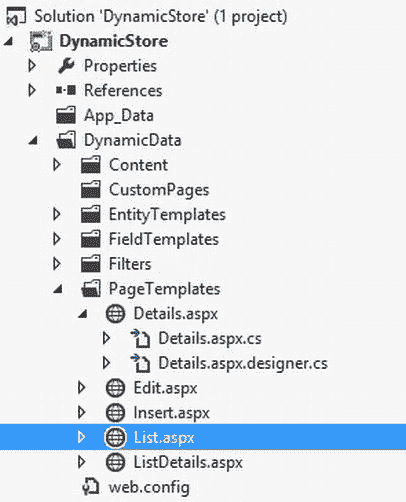

第十一章


使用动态数据构建可扩展的数据驱动 Web 应用程序

老实说，很多前端开发人员在。NET 讨厌针对数据库编写查询并判断数据是否与应用程序的状态一致。他们更满足于在 Visual Studio 的限制下工作，并且会排队购买一种工具，这种工具可以让他们不用编写 SQL 查询就能访问关系数据。他们也很乐意使用自己选择的语言对内存中的数据进行操作，不管是 C#、VB 还是 LINQ，但不是 SQL。这主要是因为每个原生关系数据库都有自己的 SQL 风格，尝试和学习每一个都是令人难以招架的。

ORM 工具变得如此流行的事实证明了这样一个事实，即全世界的开发人员都在寻找能够通过用概念模型映射关系数据库表来几乎自动地创建数据层的工具和框架。然后，对他们来说，针对模型类进行编程将变得相当容易，因为数据库上剩余的繁重工作将由工具来处理。

在 apart，除了支持实体框架和其他 ORM 工具，如 LINQ 到 SQL，还有一个迷人的功能，允许你通过从实体框架生成的数据上下文中导出*用户界面(UI)* 来自动创建数据驱动的网站。这个特性叫做*ASP.NET 动态数据*，从 3.5 版本开始就有了。NET 框架。使用动态数据，您可以轻松地为数据库表创建视图(用最少的代码)，并开始对它们执行 CRUD 操作。听起来很刺激？在本章中，您将了解利用 ASP.NET 动态数据的不同方式。

我们将在本章中讲述以下内容:

*   ASP.NET 动态数据如何工作。
*   如何在数据绑定控件中使用动态数据？
*   如何使用动态数据脚手架？

ASP.NET 动态数据是一个不经常讨论的概念，因为从。NET Framework 4 到 4.5。但是，如果您希望创建数据库表的快速视图，并提供一个管理员可以添加和更新数据的界面，那么它将非常有用。

动态数据层

ASP.NET 动态数据利用实体框架特性，它允许您为数据元素(如行、字段和表)创建动态视图。动态视图允许您显示和编辑存储在这些数据元素中的数据。现在让我们来看看动态数据实际上是如何与应用程序中的不同层一起工作的。

[图 11-1](#Fig1) 显示了 ASP.NET 动态数据实体网站中可用的不同模板，这些模板用于为您的数据元素创建视图，并让您使用 ADO.NET*EDM(实体数据模型)*和 ASP.NET 路由功能执行 CRUD 操作。


[图 11-1。](#_Fig1)动态数据层

如图所示，*字段模板*提供了一组控件，它们将实体模型类型与 ASP.NET 控件进行映射。字段模板是动态数据网站最基本的单元，由实体模板内部使用，用于创建行级 UI 元素。

*实体模板*为数据行元素提供了 UI，它们为操作默认的表格布局提供了更好的控制。

*页面模板*包含用于高级表格视图和外观的页面。您可以通过修改默认页面来定制所有表格的外观，或者使用*定制页面*来定制特定表格的外观。自定义页面将在本章稍后讨论。

Visual Studio 2012 为构建 ASP.NET 动态数据网站提供了脚手架模板。首先，我们将使用这个脚手架模板来查看动态数据的运行情况，然后我们将探索其内部机制，以了解动态数据是如何真正工作的。

 **注意**ASP.NET 动态数据功能可通过`System.Web.DynamicData`组件获得。

动态数据脚手架

*搭建*是展示相关功能的一种快速而肮脏的方式。微软通过为的各种功能提供基本框架，真正实现了这一点，对开发人员有利。NET Framework 4.5，这允许他们构建功能性原型，这些原型可以根据需要通过定制来完成 T2。

动态数据也不例外。有一个脚手架模板，让你用最少的代码创建动态数据驱动的网站。它是可扩展的，所以一旦你学会了它是如何工作的，你就可以通过根据你的需要定制工件来掌握它。

试试看:使用 ASP.NET 动态数据创建一个可扩展的数据驱动网站

让我们快速探索一下创建 ASP.NET 4.5 动态数据 Web 应用程序所需的步骤；之后，你会知道它是如何工作的。关于先决条件，本练习中列出的步骤将通过 Ultimate editions 与 Visual Studio 2012 Express Web 一起使用，因此您应该能够使用任何可用的步骤。

 **注意**我们将使用本书所有练习中使用的商店数据库。

1.  Launch your instance of Visual Studio 2012 and create a new project. In the *New Project* dialog, Select *ASP.NET Dynamic Data Web Application* on the *Web* tab under Visual C# root, as shown in [Figure 11-2](#Fig2).

    

    [图 11-2。](#_Fig2)新 ASP.NET 动态数据实体网络应用项目

2.  使用实体框架，使用`Store`数据库在项目中创建一个 EDM。这些步骤不需要说明。如有必要，您可以重温第 8 章中的练习。
3.  Open the `Global.asax.cs` file. You will see a bunch of generated code with commented instructions. The file hosts the most important instructions to connect to the data context and specify routing commands. Locate the `RegisterRoutes` method and place the following code inside it:

    `DefaultModel.RegisterContext(typeof(StoreEntities), new ContextConfiguration() { ScaffoldAllTables = true });`

    `routes.Add(new DynamicDataRoute("{table}/{action}.aspx")`

    `{`

    `Constraints = new RouteValueDictionary(new { action = "List|Details|Edit|Insert" }),`

    `Model = DefaultModel`

    `});`

     **注意** `StoreEntities`是您刚刚在`Store`数据库中使用实体框架生成的数据上下文类。还要注意的是，`ScaffoldAllTables`属性需要设置为*真*。

4.  Compile and run the solution. As you can see in [Figure 11-3](#Fig3), the `Store` database tables (`Contacts` and `Orders`) show up in a predefined format along with the elements to navigate and perform CRUD operations.

    

    [图 11-3。](#_Fig3)具有商店实体的动态数据网站

5.  Click the `Contacts` table link, and it will show the records that you have entered in the table (see [Figure 11-4](#Fig4)).

    

    [图 11-4。](#_Fig4)联系人表条目

6.  To create a new item, click the *Insert new item* link and it will take you to a dynamically generated form that shows all of the field values for creating a new `Contact`, as shown in [Figure 11-5](#Fig5).

    

    [图 11-5。](#_Fig5)创建新联系人

7.  Create a new `Contact` with the *Name* “Eric Doe” and *State* “AZ” and click *Insert*. You will be returned to the *Contacts* page, and you will see the new contact added and displayed in the *Contacts* grid. Click the *View Orders* link of the newly created Contact Eric Doe. It will display a message indicating that no associated orders are available for the contact, since it is newly created, as illustrated in [Figure 11-6](#Fig6).

    

    [图 11-6。](#_Fig6)联系订单

     **注意**URL 使用动作动词作为利用 ASP.NET 路由模块的命令。

8.  Click *Insert new item* in the Orders page. Enter values for *Quantity* and *Rate*. Notice that the *Contact* field is already selected as Eric (see [Figure 11-7](#Fig7)). Click *Insert*.

    

    [图 11-7。](#_Fig7)创建新订单

9.  You will now get redirected to the *Orders* page and see the Order created for the Contact Eric Doe. There is a *Contact* drop-down at the top of the page that you can use that to filter the results in the *Orders* grid. You can also perform *Edit* and *Delete* operations by clicking the respective links in the grid (See [Figure 11-8](#Fig8)).

    

    [图 11-8。](#_Fig8)按联系人过滤订单

 **注意**除了页面、字段和实体模板，动态数据脚手架模板还包含过滤模板，允许您根据特定标准过滤记录，如图[图 11-8](#Fig8) 所示。筛选器模板允许在布尔、枚举和外键字段关系中使用筛选器。

暂且不考虑页面和表格的默认命名约定，该模板对于从关系数据库中导航和操作数据结构非常有用。您已经成功地输入了数据并执行了修改，而没有为视图编写任何代码。

您的下一个问题可能是如何操作默认的 Scaffolding 模板来创建视图，使其具有您所选择的行为和外观。在下一节中，我们将探索如何做到这一点。

自定义脚手架模板

如果你展开你的解决方案结构，你会注意到有一个动态数据文件夹，如图[图 11-9](#Fig9) 所示。该文件夹再次包含多个子文件夹，代表 ASP.NET 动态数据的表示层和实体层元素。T3】


[图 11-9。](#_Fig9)动态数据实体 Web 应用项目文件夹结构

您可以在默认模板上执行几个级别的自定义。您可以通过修改页面模板来定制表格行为，或者通过修改字段模板来定制特定于字段的行为。您还可以选择自定义特定表或整个模板的行为，在这种情况下，更改将应用于数据库中的所有表。

在 ASP.NET 动态数据实体 Web 应用程序项目中的*页面模板*文件夹下提供了页面级模板。如果要自定义所有实体的外观，请编辑此文件夹下的文件以更改行为。例如，如果要改变标题在所有表格页面上的显示方式，可以修改文件夹中的`List.aspx`页面来改变标题，如图[图 11-10](#Fig10) 所示。



[图 11-10。](#_Fig10)修改 List.aspx 页面以自定义所有表格页面中标题的外观

同样，如果您想在编辑模式下改变文本框的行为，那么您可以在`FieldTemplates`文件夹下的`Text_Edit.ascx`文件中进行。然而，这些变化适用于全球。

还有一种可能是，您可能希望根据特定条件更改映射到数据库表的单个实体的行为和外观。请仔细阅读下面的注释，以理解自定义单个表格行为的规则。

 **注意**在`dmx`文件中为您要定制其行为的表格标识映射实体的实体集名称；然后，在动态数据项目的 Custom Pages 文件夹中创建一个具有实体集名称的文件夹。除非另有说明，这通常是实体的复数名称。

现在让我们探索定制特定于表的行为所需的步骤。

尝试一下:使用动态数据搭建定制来定制订单表的外观

按照以下步骤定制`Orders`表格的行为或外观:

1.  Create a folder called `Orders` under the `CustomPages` folder in your Dynamic Data Entities Web Application Project. You can now create your customized template pages inside this folder, as shown in [Figure 11-11](#Fig11).

    

    [图 11-11。](#_Fig11)动态数据自定义页面

2.  为了定制`Orders`列表页面的外观，在新创建的`Orders`文件夹下创建一个名为`List.aspx`的页面。确保将`Site.Master`设置为主页。
3.  从`PageTemplates/List.aspx`下复制`List.aspx`页面的内容。复制内容背后的标记和代码，而不更改新创建页面的命名空间。
4.  The `Orders` page has a `Contact` filter. To make it more descriptive, add the text *Filter By* in the `QueryFilterRepeater` control’s `Label ItemTemplate,` as shown in [Figure 11-12](#Fig12).

    

    [图 11-12。](#_Fig12)仅修改订单表的外观

5.  Compile and run the project. You will now notice that Filter By text appears before the `Contact` filter in the `Orders` page, as shown in [Figure 11-13](#Fig13).

    

    [图 11-13。](#_Fig13)按标签更新过滤器

现在，您已经使用动态数据脚手架定制功能成功地定制了特定于表的外观。如果您查看您的动态数据项目，您会注意到还有一个`EntityTemplates`文件夹。此文件夹包含用于在页面网格中显示行的文件。您可以通过修改该文件夹中的页面来自定义行级行为。

 **注意** `EntityTemplates`也可以用于你的自定义页面。

模板行为

模板提供了三种模式，您可以在其中运行您的定制:

1.  **显示:**动态网站显示内容时的外观。
2.  **编辑:**内容编辑时的外观和行为。
3.  **插入:**插入新记录时的外观和行为。

您可以使用页面和实体模板自定义表和行的特定显示、编辑和插入行为。字段模板为显示和编辑(也兼作插入)提供默认映射。

到目前为止，您已经了解了如何定制脚手架模板 来修改默认和特定于表格的行为。在下一节中，您将探索这是如何工作的，以及路由如何处理动态数据。

动态数据如何工作

现在您已经知道了如何使用动态数据，我们将看看 ASP.NET 动态数据基础设施的内部。

元模型

`System.Web.DynamicData`名称空间包含一个名为`MetaModel`的类，它负责关联 ASP.NET 动态数据应用程序使用的一个或多个数据库。它是使用实体框架或 LINQ 到 SQL 创建的实体模型和由 ASP.NET 动态数据生成的动态视图之间的管道。让我们回过头来研究一下由`Global.asax`文件中的脚手架模板生成的代码。该文件包含一个静态默认的`MetaModel`类实例，并且它还有一个属性代表默认的`MetaModel`实例。

```cs
private static MetaModel s_defaultModel = new MetaModel();
        public static MetaModel DefaultModel
        {
            get
            {
                return s_defaultModel;
            }
        }
```

您用这个代表数据库的`MetaModel`实例注册了一个或多个数据上下文类，您将使用动态数据基础设施对这些数据库进行操作。这是在`RegisterRoutes`方法中完成的，应用程序第一次加载时会调用这个方法。`MetaModel`类提供了一个`RegisterContext`方法，如下面的代码片段所示:

```cs
DefaultModel.RegisterContext(typeof(StoreEntities), new ContextConfiguration() { ScaffoldAllTables = true });
```

在我们的示例中，我们将使用实体设计器在数据库`Store`上生成的`StoreEntities`数据上下文类与动态数据`MetaModel`相关联。这里需要注意的一点是`ScaffoldAllTables`属性。您可以选择让模板为所有表或仅为特定表创建动态视图。

如果`ScaffoldAllTables`被设置为*真*，那么动态数据将考虑所有的实体。如果您只想搭建选定的几个表，那么将该属性设置为 *false* 。为您想要搭建的实体创建一个分部类，并在其上使用`ScaffoldTableAttribute`。它将被动态数据基础设施拾取，并且动态视图将只为设置了`ScaffoldTableAttribute`的表生成。在我们的例子中，您可以将`ScaffoldTables`属性放在`Store.Designer.cs`文件中生成的实体上。

 **注意**除了`ScaffoldTables`之外，还有一个`ScaffoldColumns`属性可以用来指定一个数据列是否参与搭建。

选择途径

ASP.NET 动态数据使用内置的路由基础设施来路由对表进行 CRUD 操作的命令。有两种方法可以使用路由基础设施:

1.  默认模式，不同的操作由脚手架模板的不同页面处理。下面的代码块说明了`RegisterRoutes`方法中的默认模式:

    ```cs
    routes.Add(new DynamicDataRoute("{table}/{action}.aspx")
                {
                    Constraints = new RouteValueDictionary(new { action = "List|Details|Edit|Insert" }),
                    Model = DefaultModel
                });
    ```

2.  组合页面模式，在这种模式下，所有操作都由一个页面处理。下面的代码说明了这种模式:

    ```cs
    routes.Add(new DynamicDataRoute("{table}/ListDetails.aspx")
                {
                    Action = PageAction.List,
                    ViewName = "ListDetails",
                    Model = DefaultModel
                });

    routes.Add(new DynamicDataRoute("{table}/ListDetails.aspx")
                {
                    Action = PageAction.Details,
                    ViewName = "ListDetails",
                    Model = DefaultModel
                });
    ```

组合页面模式可能需要您进行大量的定制。

现有控件中的动态数据

`System.Web.DynamicData`组件提供了几个工件，包括必要的控件(比如生成动态视图的`DynamicControl`),以及允许在现有 ASP.NET 控件中利用动态数据功能的扩展方法。

例如，如果您在项目中添加对`System.Web.DynamicData`程序集的引用，像`GridView`和`FormView`这样的控件将有一个扩展方法`SetMetaTable,`可供它们使用，允许动态表格数据自动显示在这些控件中。

`PageTemplates`文件夹中的`Details.aspx`页面中的以下代码说明了动态控件的使用:

```cs
protected void Page_Init(object sender, EventArgs e)
        {
            table = DynamicDataRouteHandler.GetRequestMetaTable(Context);
            FormView1.SetMetaTable(table);
            DetailsDataSource.EntityTypeFilter = table.EntityType.Name;
        }
```

`FormView1`是一个`FormView`控件，显示所选数据行的详细信息。

摘要

ASP.NET 动态数据是一个有趣的概念，它允许您编写最少的代码，以便相对快速地构建数据驱动的应用程序。在本章中，您了解了动态数据脚手架模板如何让您快速访问数据库表，并让您只需几行代码就能执行 CRUD 操作。您还了解了动态数据基础设施的内部结构，以及如何在 Scaffolding 模板中有选择地为表创建视图。然后，您学习了如何将动态数据功能扩展到现有的 ASP.NET 控件。

在下一章中，您将了解到在构建数据驱动网站时会遇到的一些现实问题，以及可以用来解决这些问题的最佳实践。