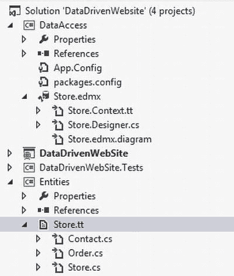
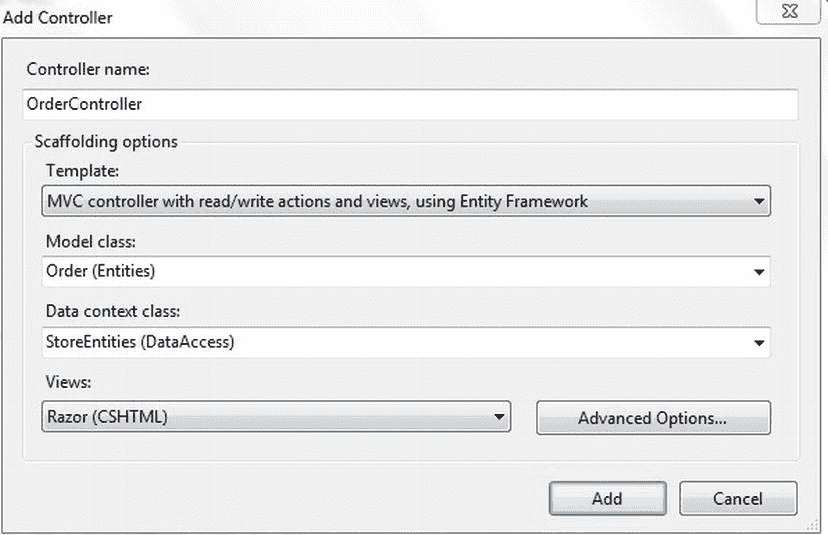
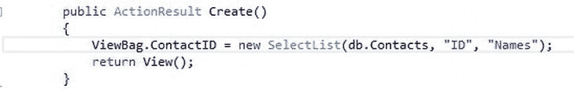
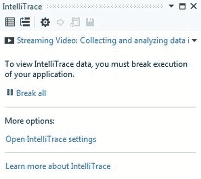
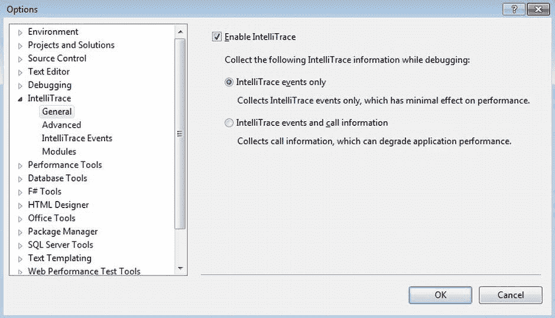
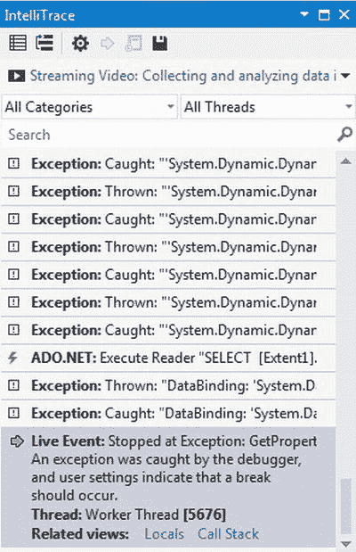
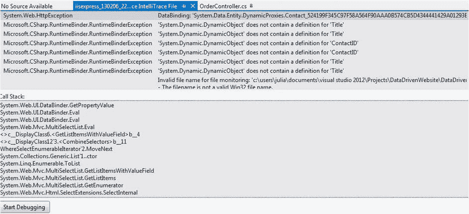
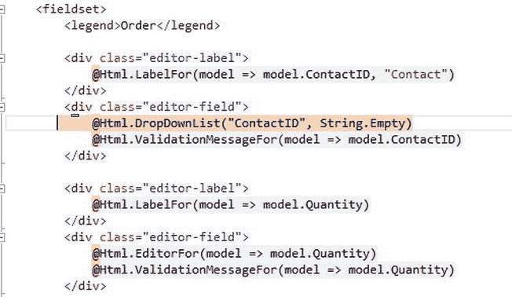

第十二章


构建数据驱动网站的最佳实践和技术

至此，您已经对使用。NET 框架。自从它的 2.0 版以来，在。NET Framework 是通过提取许多繁重的操作来驱动的，这些操作是通过 Web 应用程序获取和操作数据来执行的。这些增强背后的想法是帮助您专注于核心业务功能。与此同时，开发人员社区投入了大量时间，试图通过在现实场景中使用这些新特性，从他们所学到的东西中创建最佳实践。

在本章中，您将学习一些最佳实践和有用的技术来处理构建数据驱动的应用程序所涉及的问题。

具体来说，我们将涵盖以下内容:

*   使用实体框架作为数据访问层的最佳实践是什么？
*   如何使用工作单元模式来确保数据的一致性？
*   你如何处理并发问题？
*   如何使用 IntelliTrace 工具执行历史调试？

最佳实践在很大程度上是由开发人员社区在实现实体框架方面的经验驱动的。本系列的前一本书，由 Damien Foggon 所著的*ASP.NET 2.0 数据库入门，第二版*(2006 年出版)，涵盖了一些通常适用于构建数据驱动网站的有用技术。本章讨论的是实体框架的上下文。但是，它们也可以与其他用于构建数据层的对象关系映射(ORM)工具一起使用。

数据访问层模式

Entity Framework 抽象了将概念查询转换为特定于数据库的 CRUD 操作的大部分日常工作，为您节省了大量时间。但是，如果设计和实现不正确，它会导致严重的性能瓶颈。多年来，技术专家从企业级实体框架实现中学到了很多，他们的知识导致了模式的形成，以指导团队在将实体框架实现为数据访问层时遵循最佳实践。

在这一节中，您将了解到*存储库模式*，它允许您将 ORM 实现从其余的应用程序代码中抽象出来。然而，在您这样做之前，让我们回顾一下在一个单独的项目中隔离实体模型的必要步骤，以便您能够在应用程序的不同层之间共享它们。

隔离数据层和实体模型

在第 7 章中，您了解到从现有数据库创建新的 ADO.NET 实体数据模型会自动生成 POCO 类和`DbContext`类。然而，保持 POCO 类的隔离是一个很好的实践，这样它们就可以跨层共享并易于扩展。这可以通过定制负责生成 POCO 类的 T4 模板文件来实现。回想一下，在第 7 章的`DataDrivenWebSite`ASP.NET MVC 4 项目中，一旦添加了`Store`ADO.NET EDM 文件，就有两个 T4 模板文件被添加到项目中。它们是`Store.Context.tt`和`Store.tt`文件，分别代表生成`DbContext`和 POCO 类的模板。现在让我们以稍微不同的方式重新创建这个项目，以便数据访问层和模型被隔离在它们的自包含项目中，并且网站可以在`Controller`类中引用它们。遵循以下步骤:

1.  使用您的 Visual Studio 2012 实例创建一个 Visual C # ASP.NET MVC 4 Web 应用程序项目。这不需要举例说明，因为在本书中您一直在创建 MVC 项目。
2.  在解决方案中创建两个名为`DataAccess`和`Entities`的 Visual C#类库项目。
3.  在`DataAccess`项目中添加一个名为`Store.edmx`的新 ADO.NET 实体数据模型，并使用熟悉的步骤从`Store`数据库生成 EDM。
4.  现在到了棘手的部分:在文件浏览器中打开`EDMX`文件的位置，并将`Store.tt`和生成的 POCO 类文件(本例中是`Order.cs`和`Contact.cs`)移动到`Entities`项目文件夹中。
5.  在*解决方案浏览器*中右键单击`Entities`项目，并从上下文菜单中选择*添加现有项目*。添加`Model.tt`和 POCO 类文件。从`DataAccess`项目中删除对`Store.tt`文件的引用。保存您的解决方案。
6.  Open the `Store.tt` file in the `Entities` project and update the `inputFile` parameter to set the following path:

    ```cs
    const string inputFile = @"..\DataAccess\Store.edmx";
    ```

    这是位于`DataAccess`项目下的`EDMX`文件的路径。

7.  运行*定制工具*并构建`Entities`项目。*增加`DataAccess`中`Entities`总成的参考*。解析`Store DbContext`文件中 POCO 类的引用。
8.  Build the solution. Add the `DataAccess` and `Entities` assembly references to the `DataDrivenWebSite` project. The solution structure will look like the one shown in [Figure 12-1](#Fig1).

    

    [图 12-1。](#_Fig1)创建数据访问和实体项目后的解决方案结构

9.  Now you can create the `OrderController` by right-clicking the `Controller` folder in the `DataDrivenWebSite` project and clicking *Add Controller*. In the *Add Controller* dialog, you can get the `Order` model from `Entities` and the `DbContext` references from the `DataAccess` project, as shown in [Figure 12-2](#Fig2). This is the only change from what you did in [Chapter 7](07.html).

    

    [图 12-2。分别来自实体和数据访问项目的](#_Fig2)模型类和数据上下文类引用

    编译并运行 Web 应用程序。导航至`Order`，您将看到显示的所有订单的预期结果。

    上面执行的步骤对于隔离数据层和 POCO 类非常重要。这为实现您接下来将学习的存储库模式铺平了道路。现在，您已经成功地向创建一个真正解耦的数据访问层迈出了第一步！

    知识库模式

    一个真正健壮的数据访问层不仅是解耦的，而且是从应用程序的业务逻辑中抽象出来的。这种抽象使您能够专注于应用程序的核心功能，而不必太担心持久性机制。从数据访问层的可测试性角度来看，这也很重要。您可能希望针对数据访问层编写单元测试，但不希望测试触及实体框架`DbContext`和相关的持久性存储。如果实现了存储库模式，您的测试可能会指向一个模拟的持久性存储。

    基本的存储库模式不难实现。您需要在`DataAccess`项目中创建一些额外的工件。您需要构建的第一个项目是存储库契约。理想情况下，每个实体应该由一个存储库来表示，以允许 CRUD 操作在其上独立执行。例如，下面的界面定义了`OrderRepository:` 的操作

    ```cs
    public interface IOrderRepository : IDisposable
        {
            public IEnumerable<Order> GetAllOrders();
            public Order GetByOrderId(int orderId);
            public void Create(Order order);
            public void Update(Order order);
            public void Delete(int orderId);
        }
    ```

     **注意**您必须创建一个名为`Repository`的单独项目来托管所有的公共存储库接口，具体的实现可以在`DataAccess`项目中。

    在实现中，您在`DataAccess`项目中创建一个`Repository`文件夹，并在它下面添加一个`OrderRepository`类。务必参考`DataAccess`中的`Repository`项目。`OrderRepository`应该为`IOrderRepository`提供一个实现，此外，应该支持在使用结束后处理上下文:

    ```cs
    public class OrderRepository : IOrderRepository, IDisposable
    ```

    在类内部，首先创建一个构造函数，允许将一个`DbContext`实例传递给存储库:

    ```cs
    private StoreEntities context;
            private bool disposed = false;

            public OrderRepository(StoreEntities context)
            {
                this.context = context;
            }
    ```

    现在忽略`disposed`变量。它将用于实现 Dispose。CRUD 操作实现如下:

    ```cs
    public IEnumerable<Order> GetAllOrders()
            {
                return context.Orders.AsEnumerable();
            }

            public Order GetByOrderId(int orderId)
            {
                return context.Orders.Find(orderId);
            }

            public void Create(Order order)
            {
                context.Orders.Add(order);
            }

            public void Update(Order order)
            {
                context.Entry(order).State = System.Data.EntityState.Modified;
            }

            public void Delete(int orderId)
            {
                var order = context.Orders.Find(orderId);
                context.Orders.Remove(order);
            }
    ```

    此外，还有一个`Save`方法，允许在控制器的一个或多个创建/更新/删除操作之后，将更改保存到数据库中。

    ```cs
    public void Save()
            {
                context.SaveChanges();
            }
    ```

    接下来是标准的 Dispose 实现，用于在存储库使用结束后处置`DbContext`实例:

    ```cs
    protected virtual void Dispose(bool disposing)
            {
                if (!this.disposed)
                {
                    if (disposing)
                    {
                        context.Dispose();
                    }
                }
                this.disposed = true;
            }

            public void Dispose()
            {
                Dispose(true);
                GC.SuppressFinalize(this);
            }
    ```

     **注意**如果您不太熟悉 Dispose 模式，那么我们强烈建议您阅读 MSDN 的文章:`http://msdn.microsoft.com/en-us/library/fs2xkftw.aspx`。

    完成后，`Order`存储库实现就准备好了。以类似的方式，创建`Contact`存储库。因为`OrderController`同时使用了`Order`和`Contact`实体，所以这一点是必需的。

    现在您需要在`OrderController`类中实现创建的存储库，替换直接的`DbContext`实例引用。

10.  首先，在`DataDrivenWebSite`项目中添加对`Repository`程序集的引用。
11.  Open the `OrderController` class and create an instance of the `Order` and `Contact` repository as shown:

    ```cs
    private IOrderRepository orderRepository;
            private IContactRepository contactRepository;
            public OrderController()
            {
                orderRepository = new OrderRepository(new StoreEntities());
                contactRepository = new ContactRepository(new StoreEntities());
            }
    ```

     **注意**不要忘记删除`StoreEntities`实例。

12.  既然已经创建了存储库实例，您就可以开始在操作方法中用它替换`StoreEntities`上下文引用了。下面的代码说明了`Index`和`Details`的方法:和

    ```cs
    public ActionResult Index()
            {
                var orders = orderRepository.GetAllOrders();
                return View(orders.ToList());
            }

            //
            // GET: /Order/Details/5

            public ActionResult Details(int id = 0)
            {
                Order order = orderRepository.GetByOrderId(id);
                if (order == null)
                {
                    return HttpNotFound();
                }
                return View(order);
            }
    ```

13.  `Create`方法要求您拥有一个可以与`Order`关联的`Contacts`列表。使用`ContactRepository`实例获取`Contact`信息。

    ```cs
    public ActionResult Create()
            {
                ViewBag.ContactID = new SelectList(contactRepository.GetAllContacts(), "ID", "Name");
                return View();
            }

            //
            // POST: /Order/Create

            [HttpPost]
            public ActionResult Create(Order order)
            {
                if (ModelState.IsValid)
                {
                    orderRepository.Create(order);
                    orderRepository.Save();
                    return RedirectToAction("Index");
                }

                ViewBag.ContactID = new SelectList(contactRepository.GetAllContacts(), "ID", "Name", order.ContactID);
                return View(order);
            }
    ```

14.  以类似的方式替换`Update`和`Delete`方法的`StoreEntities DbContext`实例:

    ```cs
    [HttpPost]
            public ActionResult Edit(Order order)
            {
                if (ModelState.IsValid)
                {
                    orderRepository.Update(order);
                    orderRepository.Save();
                    return RedirectToAction("Index");
                }
                ViewBag.ContactID = new SelectList(contactRepository.GetAllContacts(), "ID", "Name", order.ContactID);
                return View(order);
            }

    [HttpPost, ActionName("Delete")]
            public ActionResult DeleteConfirmed(int id)
            {
                orderRepository.Delete(id);
                orderRepository.Save();
                return RedirectToAction("Index");
            }
    ```

15.  在 Dispose 中，用存储库的 Dispose 函数替换`DbContext` Dispose 调用。

    ```cs
    protected override void Dispose(bool disposing)
            {
                orderRepository.Dispose();
                contactRepository.Dispose();
                base.Dispose(disposing);
            }
    ```

这是一个相当简单的存储库表示。这个存储库实现不能管理跨多个存储库的变更，并且有可能不是所有的存储库在实现中都引用相同的数据上下文。*工作单元*模式更适合与存储库模式结合使用，以使存储库在定义的约束下运行。

工作单位

要实现工作单元模式，您需要做的第一件事是创建一个公共接口，用于将更改保存回存储区。通用或基本存储库将使用它来使持久层对所有存储库保持一致。以下代码阐释了该接口:

```cs
public interface IUnitOfWork
{
    void SaveChanges();
}
```

接下来，在表示存储库类型的扩展上下文类上提供`IUnitOfWork`的实现。在我们的例子中，这由`DataAccess`项目中的实体框架存储库精确地表示:

```cs
public class EfStoreDataContext : StoreEntities, IUnitOfWork
    {
        public new void SaveChanges()
        {
            base.SaveChanges();
        }
    }
```

这就是创建一个工作实现单元所需要的全部内容。现在，让我们探索创建一个利用工作单元模式的基本存储库所需的步骤。

在`DataAccess`项目中创建一个名为`BaseRepository`的类，并在中添加以下代码:

```cs
protected IUnitOfWork UnitOfWork { get; set; }

        protected StoreEntities Context
        {
            get { return (EfStoreDataContext)this.UnitOfWork; }
        }

        /// <summary>
        /// .ctor
        /// </summary>
        /// <param name="unitOfWork"></param>
        public BaseRepository(IUnitOfWork unitOfWork)
        {
            if (unitOfWork == null) throw new ArgumentNullException("unitOfWork");
            this.UnitOfWork = unitOfWork;
        }

 public void Save()
        {
            this.Context.SaveChanges();
        }

        protected virtual DbSet<TEntity> GetDbSet<TEntity>() where TEntity : class
        {
            return this.Context.Set<TEntity>();
        }

        protected virtual void SetEntityState(object entity, EntityState entityState)
        {
            this.Context.Entry(entity).State = entityState;
        }
```

注意，这个实现允许通过构造函数依赖注入一个`IUnitOfWork`类型。

 **提示** *Unity* 是一款流行的实现依赖注入的工具。总的来说，如果你不熟悉*反转控制*、*依赖注入、*和 *Unity* 等概念，那么这个项目就是一个很好的开始:`http://unity.codeplex.com/`。这些模式和工具在创建解耦系统时非常有用。

基本存储库为获取`DbSet`实例提供了一个通用实现，它使用工作单元接口来派生`DbContext`。

 **提示**您还可以将`Dispose`实现从每个单独的库实现移动到`BaseRepository`类中。

现在您已经准备好从`BaseRepository`创建单独的存储库了。这里有一个`OrderRepository`的例子:

```cs
public class OrderRepository : BaseRepository, IOrderRepository
    {

        public OrderRepository(IUnitOfWork unitOfWork)
            : base(unitOfWork)
        {

        }

        public IEnumerable<Order> GetAllOrders()
        {
            return this.GetDbSet<Order>();
        }

        public Order GetByOrderId(int orderId)
        {
            return this.GetDbSet<Order>().Find(orderId);
        }

        public void Create(Order order)
        {
            this.GetDbSet<Order>().Add(order);
        }

        public void Update(Order order)
        {
            this.SetEntityState(order, System.Data.EntityState.Modified);
        }

        public void Delete(int orderId)
        {
            var order = this.GetDbSet<Order>().Find(orderId);
            this.GetDbSet<Order>().Remove(order);
        }
```

完成这些之后，您的数据访问层就准备好了基本存储库和工作单元实现。您现在面临的最大挑战是在控制器中使用存储库，并确保数据上下文在创建/更新/删除操作中保持一致。这种约束可以通过依赖注入数据上下文和使用命令模式来实现。虽然不是绝对必要的，但是命令模式提供了一个更干净的实现。

 **注意**要启用 Unity 支持，可以在`DataDrivenWebSite`项目上安装的 *Unity NuGet* 包。此外，您需要将 Unity 配置添加到您的`Web.config`文件中来存储映射信息。

您将在`Controller`文件夹中创建的第一个工件是一个`BaseController`类，如下所示:

```cs
public class BaseController : Controller
    {
        private readonly IServiceLocator serviceLocator;

        public BaseController(IServiceLocator serviceLocator)
        {
            this.serviceLocator = serviceLocator;
        }

        protected T Using<T>() where T : class
        {
            var handler = serviceLocator.GetInstance<T>();
            if (handler == null)
            {
                throw new NullReferenceException("Unable to resolve type with service locator; type " + typeof(T).Name);
            }
            return handler;
        }
    }
```

`Using`方法将解析您试图执行的命令类型，并使用所需的存储库来执行操作。下面的代码展示了一个`CreateOrder`命令的例子:

```cs
public class CreateOrder
    {
        private readonly IOrderRepository orderRepository;

        public CreateOrder(IOrderRepository orderRepository)
        {
            this.orderRepository = orderRepository;
        }

        public virtual void Execute(Order order)
        {
            if (order == null) throw new ArgumentNullException("invalid order");

            try
            {
                orderRepository.Create(order);
                orderRepository.Save();
            }
            catch (Exception)
            {
                //LOG
                throw;
            }
        }
    }
```

以类似的方式，创建`OrderController`中操作所需的命令。

 **注意**虽然这是一个简单的命令实现，但是您有可能执行涉及多个存储库的复杂命令。

接下来，打开`OrderController`类并修改实现，使其继承`BaseController`，如下所示:

```cs
public class OrderController : BaseController
    {
        public OrderController(IServiceLocator serviceLocator)
            :base (serviceLocator)
        {

        }
    }
```

现在，您可以使用命令来实现控制器中的操作方法。下面是`Create`的一个例子:

```cs
[HttpPost]
        public ActionResult Create(Order order)
        {
            if (ModelState.IsValid)
            {
                Using<CreateOrder>().Execute(order);
                return RedirectToAction("Index");
            }

            ViewBag.ContactID = new SelectList(Using<GetAllContacts>().Execute(), "ID", "Name", order.ContactID);
            return View(order);
        }
```

映射配置必须在您的`Web.config`文件的`Unity`部分或单独的 Unity 配置文件中设置。

```cs
<unity>
             <typeAliases>
                          <typeAlias alias="string" type="System.String, mscorlib" />
                          <typeAlias alias="singleton" type="Microsoft.Practices.Unity.ContainerControlledLifetimeManager, Microsoft.Practices.Unity" />
             </typeAliases>
             <containers>
                          <container name="container">
                                                    <types>
<type type="Repository.IOrderRepository, Repository, Version=1.0.0.0, Culture= neutral, PublicKeyToken= null"
mapTo="DataAccess.Repositories.OrderRepository, DataAccess">
        </type>
        <type type="Repository.IContactRepository, Repository, Version=1.0.0.0, Culture= neutral, PublicKeyToken= null"
mapTo="DataAccess.Repositories.ContactRepository, DataAccess">
        </type>
        <type type="Repository.IUnitOfWork, Repository, Version=1.0.0.0, Culture= neutral, PublicKeyToken= null"
mapTo="DataAccess.EfStoreDataContext, DataAccess">
        </type>

        </type>
                                                    </types>
                          </container>
             </containers>
</unity>
```

 **注意**要启用依赖注入支持，必须在`Global.asax`文件的`Application_Start()`方法中添加 Unity 容器实例化逻辑。

这就完成了工作单元的实现。根据存储库的相似性，您可以对代码进行一些额外的重构。如果您的操作在实体间是一致的，您可以创建一个列出 CRUD 操作的通用存储库，并且完全取消单独的存储库。这可以是你自己尝试的一个练习。

接下来，您将探索一些用于处理在构建数据驱动网站时会遇到的最常见问题的技术。

处理问题的技巧

本系列的前一本书，Damien Foggon 的《ASP.NET 2.0 数据库入门，第二版》(2006 年出版)，探讨了你在构建数据驱动网站时会遇到的一些问题，并给出了解决这些问题的技巧。虽然今天的问题大致相同，但是技术已经在。NET 框架，最明显的是在 ADO.NET 增加了实体框架。

并发性

在数据驱动的网站中，当一个用户正在编辑记录时，其他人已经删除了它，这是一种常见的可能性。在更新期间，这将导致实体框架中的并发异常。默认情况下，实体框架支持 *乐观并发*，这意味着它将假设最好的情况(在这种情况下，指的是数据在更新时没有改变)。在这种情况下，`DbContext SaveChanges`方法调用将抛出一个`DbUpdateConcurrencyException` ( `System.Data.Entity.Infrastructure`)异常。根据您的实现需求，您可以选择几种合适的方法。首先，这些方法围绕着谁赢得州战的决定性因素。如果您选择执行 *Database-Win* ，那么您可以使用下面的代码处理异常，以通知客户端数据库中的更改:

```cs
try
        {
            this.Context.SaveChanges();
        }
        catch (DbUpdateConcurrencyException concurrencyException)
        {

            concurrencyException.Entries.Single().Reload();
        }
```

`Reload`方法刷新存储中的实体值。

另一个选择是让客户赢。在这种情况下，您可以将条目的原始值设置为从数据库中获取的值:

```cs
var concurrencyEntry = concurrencyException.Entries.Single();
concurrencyEntry. OriginalValues.SetValues(concurrencyEntry.GetDatabaseValues());
```

此外，您还可以为最终用户提供在有冲突的更新中选择合适选项的能力。

交易

虽然 Entity Framework 在内部处理事务，并且您可以通过实现工作单元来保护您的实现免受部分更新的影响，但是，可能会出现需要跨多个数据上下文实例运行更新的情况，并且您可能希望它们出现在一个事务中。在这种情况下，您可以将您的`SaveChanges`操作包装在一个`TransactionScope` ( `System.Transactions`)中。以下代码说明了此操作:

```cs
using(var scope = new TransactionScope(TransactionScopeOption.RequiresNew))
                {
                    //save changes to multiple db context operations
                }
```

调试问题

虽然新技术已经发展到可以处理构建数据驱动网站的问题，但是 Visual Studio 的调试功能也在这个最流行的开发工具的多个版本中得到了逐步增强。在 Visual Studio 2010 中首次引入的 *IntelliTrace* 在 Visual Studio 2012 中提供了一些有趣的新更新，例如使用*独立收集器*跟踪和调试生产中的问题。最重要的是，当您使用应用程序时，它在后台收集跟踪信息，并且在使用该工具收集的跟踪日志调试应用程序时，它可以查明代码中的异常。这通常会减少在调试使用构建的网站和应用程序中的问题所花费的时间和精力。NET 框架。让我们尝试一个练习，探索在调试您在第 7 章中构建的`DataDrivenWebSite` Web 应用程序的问题时应该遵循的步骤。

 **注** IntelliTrace 仅适用于 Visual Studio 2012 旗舰版。

试用:用 INTELLITRACE 跟踪执行历史和调试问题

出于本练习的目的，您将修改`DataDrivenWebSite` Web 应用程序项目，故意引入一个可以被 IntelliTrace 捕获的 bug。为此，在您的 Visual Studio 2012 Ultimate Edition 实例中打开`DataDrivenWebSite`应用程序，并修改`OrderController`类`Create`动作，将“*名称*”参数更改为“*名称、*，如图[图 12-3](#Fig3) 所示。



[图 12-3。](#_Fig3)引入代码中的 bug

这模拟了应用程序代码中的印刷错误。现在，您已经准备好使用 IntelliTrace 调试应用程序了。请遵循以下步骤:

1.  Compile and run the application in *Debug* mode. While the application is running, go back to your Visual Studio window. You will see the IntelliTrace pane, as shown in [Figure 12-4](#Fig4). You will also notice that there is a *Break All* option available to break the execution and to see the trace log as it is captured.

    

    [图 12-4。](#_Fig4) IntelliTrace 捕获日志

2.  You can go to the Settings option from the IntelliTrace pane to change trace log settings, such as deciding whether to capture call information along with IntelliTrace events. This is shown in [Figure 12-5](#Fig5).

    

    [图 12-5。](#_Fig5)智能跟踪设置

3.  Navigate to the *Order* view and click *Create New*. An exception will occur, and you will see IntelliTrace reporting a *Live Event,* which is an exception caught by the debugger, as shown in [Figure 12-6](#Fig6).

    

    [图 12-6。](#_Fig6) IntelliTrace 捕获异常

4.  此时，单击 IntelliTrace 窗格上的保存图标保存跟踪日志。返回到`OrderController`并修复问题，因为您已经从调试器中知道了问题是什么。生成并运行解决方案。`Order`创作作品精品。
5.  Open the trace log file (`.iTrace`) by double-clicking it. It opens in Visual Studio. You will find a bunch of Call Stack and Exception Data information, as shown in [Figure 12-7](#Fig7).

    

    [图 12-7。](#_Fig7)捕获的 IntelliTrace 日志

6.  From the exception data, find the `HttpWebException` and click the *Start Debugging* button. You will notice that it points to the location where the exception occurred, even though the source has since changed and the fix was made, as shown in [Figure 12-8](#Fig8).

    

    [图 12-8。](#_Fig8)使用 IntelliTrace 进行历史调试

您已经成功调试了一个过去发生的问题，该问题无法通过本地调试器重现。这个很厉害。你不能再声称一个 bug 不能被复制。如果代码在不同的环境中不同步，团队成员可以共享跟踪日志来找出代码的哪些部分导致了 bug，即使它们是历史的。

摘要

在这一章中，你学习了一些使用实体框架构建数据驱动网站的最佳实践。您还学习了存储库和工作单元形式的一些数据访问模式。然后，您学习了用于处理并发和事务等问题的技术。最后，您学习了如何使用 IntelliTrace 执行历史调试。这些技术和实践将大大有助于您构建可靠的应用程序，并且在定义的基础设施范围内运行良好。