第十三章


应用生命周期管理

每个企业级的软件程序都要经历一个迭代的规划、开发、测试和部署的生命周期，这使得客户可以看到在这个过程中正在开发什么，并提供反馈，从而有效地提高软件的质量，让他们满意。作为一名开发人员，你不仅仅是写代码——除了写符合软件开发业务需求的代码之外，你还要做很多事情。这统称为*应用生命周期管理(ALM)，它包括以下任务* :

1.  参与产品规划。
2.  分析需求以了解客户满意的条件，并将其分解为具有特定估计值的可交付任务。
3.  在不同的层和模块中设计软件，这些层和模块相互作用。
4.  为源代码控制、构建和部署设置环境。
5.  管理源代码以确保根据计划发布正确的版本。
6.  编写单元测试以确保您的工作部分表现出期望的行为。
7.  通过代码分析、性能计数器和代码评审来分析代码，以获得性能和维护方面的最佳实践。
8.  构建和部署用于测试和反馈的软件版本。
9.  检测代码以跟踪问题并调试代码。
10.  传达状态并展示进展。

前面的列表无论如何都不完整。然而，不太可能列出的所有方面都需要您的参与。这真的取决于团队的动力。较大的团队通常有专门的 *DevOps(开发运营)*团队成员来负责构建和部署。然而，作为开发人员，您仍然有责任确保您编写的代码能够正常工作，并且不会对其他成员编写的代码产生负面影响。实际的职责通常在*完成程度*列表中定义，该列表定义了团队的“该做什么”标准。这里有一篇关于这个主题的好文章:`www.scrumalliance.org/articles/106-definition-of-done-a-reference`。

在这一章中，我们将探讨 ALM 的一些方面，这些方面会影响到作为开发人员构建数据驱动的 ASP.NET web 应用。特别是，您将了解到以下内容:

*   如何使用 Visual Studio 进行架构？
*   Visual Studio 如何提高开发人员的工作效率。
*   如何对数据驱动的 ASP.NET 应用进行单元测试和调试？
*   构建和发布软件的最佳实践。

在接下来的章节中，您将了解 VS 2012 和*Team Foundation Server*(TFS)2012 如何帮助您成为一名高效的开发人员，并在非功能性需求的约束下简化设计、部署和监控 ASP.NET 应用的流程。该说明将仅限于与构建现代 ASP.NET 应用相关的 TFS 特性，而不是 TFS 的一般特性，因为这是一个需要更多讨论的主题，超出了本书的范围。

构建企业

设计企业架构是开发一个或多个独立运行或协同运行的应用的多方面方法。此外，这些应用可能需要与已经是企业一部分的应用进行交互。在开发之前，作为架构设计的一部分，您要做两个主要的活动:

1.  Requirements leading to the functional aspects of the application(s) require you to understand the various use cases as part of the problem domain, and then use them to model the different layers in the solution domain. You can use several tools for this purpose. The preferred option is to use the Visual Studio 2012 Ultimate edition, which features many capabilities that help you model the application layers. The architectural capabilities in Visual Studio 2012 support UML 2.0 specifications. UML stands for *Unified Modeling Language,* and it is the language of choice for application design. The Object Management Group’s website is the most authoritative source for learning UML (`www.uml.org/`).

     **注意**虽然功能需求建模在实际开发开始之前就已经发生了，但是它是一个连续的过程，并且随着应用的开发，需求会发生变化。

2.  导致非功能方面的需求驱动了应用必须运行的约束。为构建数据驱动的 ASP.NET 应用而选择的解决方案在很大程度上依赖于非功能方面，它决定了应用和数据是驻留在本地、云中还是混合环境中。

设计新应用

Visual Studio 2012 提供了多种功能，用于架构和设计应用，以及帮助监控和分析应用必须运行的约束条件。这些功能是对您在本书中学到的实体框架所支持的数据建模特性的补充。

 **注意**架构功能仅限于 Visual Studio 2012 的旗舰版，许多用于管理约束的诊断和调试功能仅在旗舰版或高级版中可用。您可以在`www.microsoft.com/visualstudio/eng/products/compare`了解更多关于 Visual Studio 2012 不同版本的功能。

架构能力列在 Visual Studio 2012 的架构选项卡下，如图[图 13-1](#Fig1) 所示。

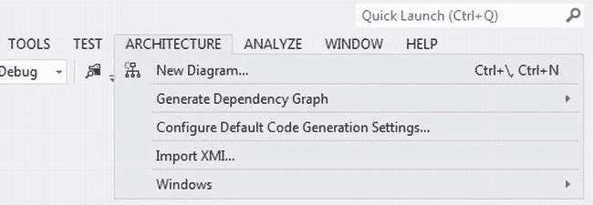

[图 13-1。](#_Fig1) Visual Studio 2012 架构功能

你可以使用*新建图表。。。*"选项来创建一个使用 UML 规范的新模型。你可以选择创建类、序列、用例、活动、组件和层图，如图[图 13-2](#Fig2) 所示。

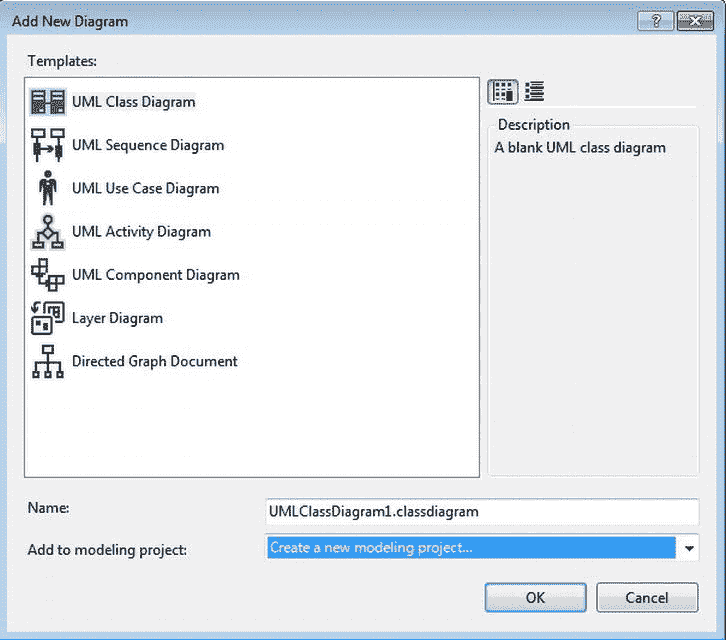

[图 13-2。](#_Fig2)创建 UML 或层图

 **注**您可以通过选择*创建新的建模项目，为您的设计工作创建一个建模项目...*添加到建模项目*下拉框中的*选项。

分析现有应用代码库

Visual Studio 2012 中的架构功能不仅允许您对应用进行建模，还允许您检查现有项目的架构和代码基础，如图 13-3 所示。

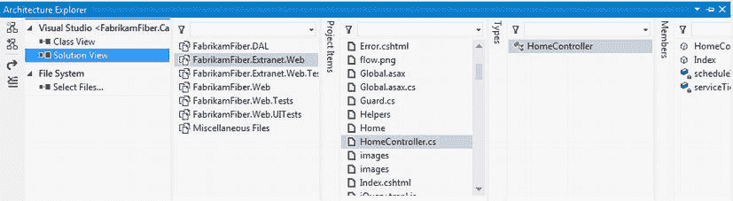

[图 13-3。](#_Fig3)使用架构浏览器探索解决方案的工件

你可以从菜单*架构窗口架构浏览器*中启动*架构浏览器*。

除了探索解决方案构件之外，它还允许您为不同层中的对象之间的依赖关系生成一个图表，以便更好地理解设计。您可以使用“架构”菜单下的“*生成依赖图*”选项来生成该图。Fabrikam 光纤项目的样本依赖图如图 13-4 所示。可在`http://vsarguidance.codeplex.com/downloads/get/379895`下载。

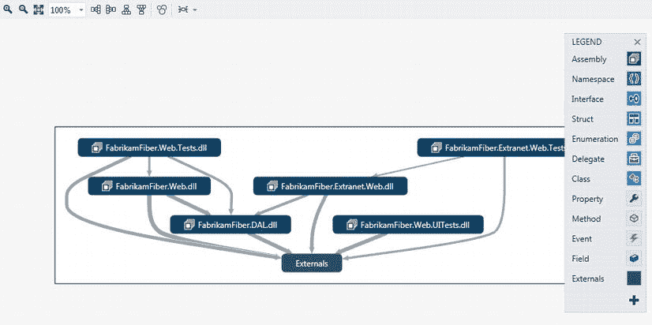

[图 13-4。](#_Fig4)Fabrikam 光纤项目不同层的依赖关系图

接下来，您将探索 Visual Studio 2012 的功能，这些功能可以帮助您提高作为 ASP.NET 应用开发人员的工作效率。

提高您的生产力

作为您日常工作的一部分，您使用您最喜欢的*集成开发环境* (IDE) Visual Studio 执行各种各样的任务，将其发挥到极致。通常，IDE 的问题会阻碍您的工作效率。在 VS 2012 中，IDE 中的每个操作都是异步的，因此您不再需要等待任何操作完成(如加载解决方案)才能处理下一个操作(如检查构建失败)。除了 IDE 中的增强功能之外，我们现在将介绍一些可以提高开发人员工作效率的新功能。

更好地访问文件和代码

搜索现在在 IDE 中随处可见，几乎所有的窗格都支持搜索。 *Solution Explorer* 是 IDE 中经常使用的窗格之一，它不仅支持对文件的模糊搜索，还支持对资源、类、方法和属性等工件的模糊搜索，如图[图 13-5](#Fig5) 所示。此外，解决方案资源管理器还允许您从资源管理器中预览资源文件，如图像和文档，以便您可以快速识别要使用的资源。

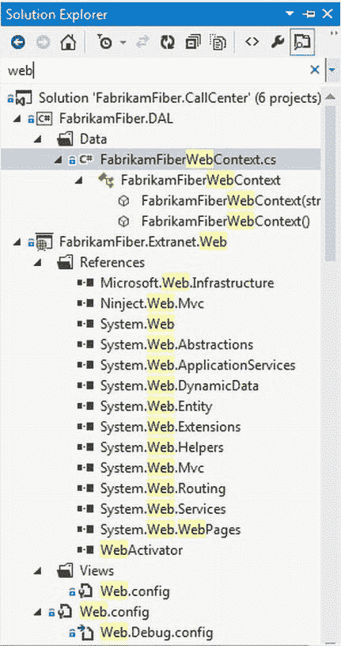

[图 13-5。](#_Fig5)在解决方案浏览器中搜索工件

 **注意**有趣的是，解决方案资源管理器也兼作对象资源管理器。

访问数据

Visual Studio 2012 提供了对数据访问的广泛支持。它与 SQL Server 对象资源管理器窗格一起充当数据库对象资源管理器，可以从“视图”菜单启动该窗格。它显示与项目关联的 LocalDB 数据库，您可以选择连接到任何 SQL Server 实例。一旦连接上，你可以做多件事。你可以直接从数据库中运行查询并创建一个数据库项目，如图[图 13-6](#Fig6) 所示。

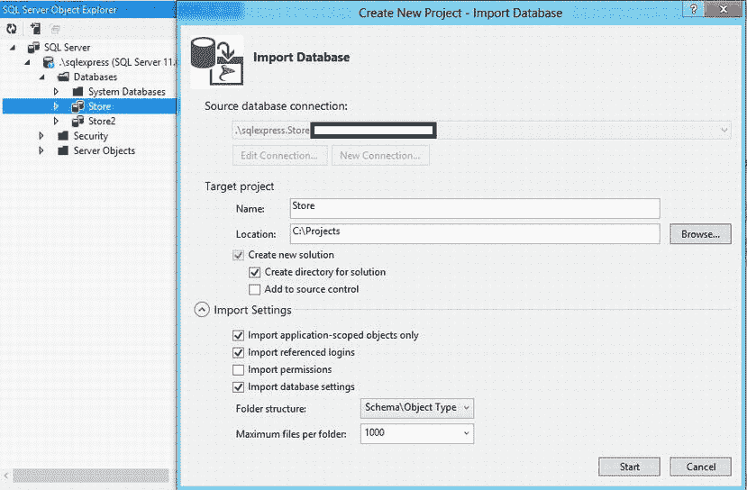

[图 13-6。](#_Fig6)从对象资源管理器创建 SQL Server 数据库项目

此外，还可以运行一个模式比较，为多个版本的数据库生成差异脚本，如图[图 13-7](#Fig7) 所示。这对于在不同环境中升级数据库版本非常有用。生成差异脚本后，您可以将其存储起来，以便在目标环境中手动运行，或者使用目标数据库的构建过程。或者，您可以使用[图 13-7](#Fig7) 所示的更新选项直接应用更改。

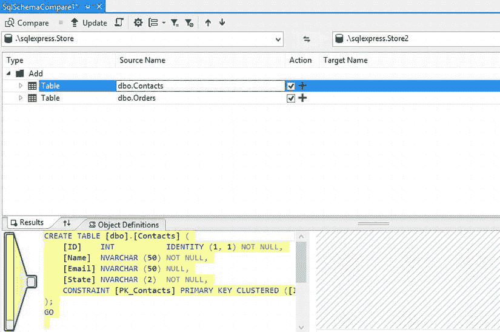

[图 13-7。](#_Fig7)比较不同版本的商店数据库

 **注意** Visual Studio 也有一个 SQL 菜单，可以快速访问 SQL Server Explorer 的一些特性。

暂停和恢复

比方说，你正在开发一个应用的新功能，突然你被分配了一个高优先级的 bug 来快速解决。你该怎么办？您处理所有检出文件和半完成变更的增强会发生什么？你肯定不想失去他们。Visual Studio 中的团队资源管理器提供了挂起功能，允许您挂起当前工作。您的所有更改都将被搁置，并且清理工作空间(关闭所有打开的文件)以便开始新的工作。然后您可以处理高优先级的 bug，一旦您完成了，您可以使用 Resume 选项来继续您的增强工作。Resume 选项将取消搁置更改，并将工作区恢复到您离开时的状态。很酷，不是吗？该特征如图 13-8 中的[所示。](#Fig8)

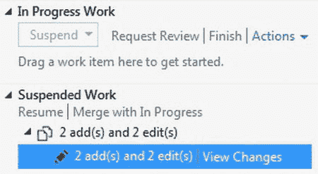

[图 13-8。](#_Fig8)暂停和恢复工作

 **注意**搁置是 TFS 的一个特性，它允许你的代码被临时保存，而不必签入主存储库。

代码审查

TFS 2012 有一个精心设计的内置工作流，支持使用团队资源管理器在 Visual Studio 2012 IDE 中进行代码审查。在您签入您的变更之前，您可以使用 My Work 部分下的 Request Code Review 链接来请求代码评审，如图 13-9 所示。


[图 13-9。](#_Fig9)请求代码审查

在新代码评审请求屏幕中，您可以指定您希望执行评审的人员、评审主题以及评审请求的描述，如图[图 13-10](#Fig10) 所示。

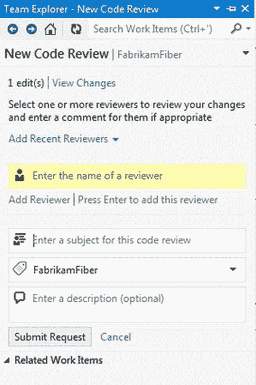

[图 13-10。](#_Fig10)添加关于审核的详细信息

指派的评审者可以在团队资源管理器中接受代码评审请求并发送反馈。反馈选项如[图 13-11](#Fig11) 所示。

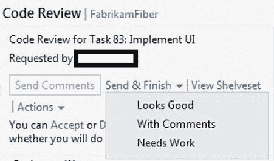

[图 13-11。](#_Fig11)代码评审反馈

 **注**作为审核人，可以看到请求审核的文件列表。您可以在团队资源管理器中单击该文件，使用 TFS 中增强的差异比较工具来比较更改，然后您可以提供有关每个已审阅文件的注释。

分析和描述您的应用

Visual Studio 2012 Premium 和 Ultimate editions 提供了一个分析菜单，其中包含几个分析和评测工具，如图[图 13-12](#Fig12) 所示。所有工具都具有增强的可视化和报告功能，可以识别代码问题并分析性能瓶颈。

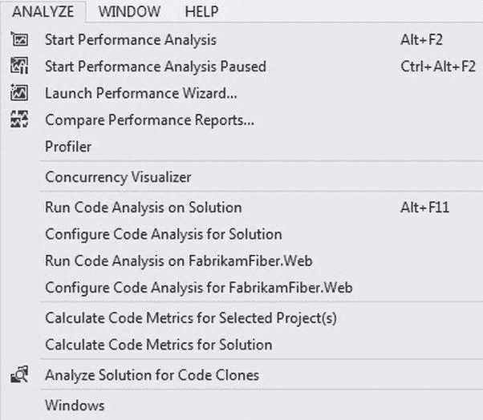

[图 13-12。](#_Fig12) Visual Studio 分析和剖析功能

您可以通过启动性能分析会话来分析您的应用的性能问题，或者您可以通过运行代码分析来检查您的应用代码是否违反了框架。一个有趣的附加功能是代码克隆分析特性，它肯定会为您节省几个小时的代码重构时间。分析代码克隆的解决方案会报告应用中相似的代码块，然后可以将其重构为一个方法或类。

测试和调试您的 ASP.NET 应用

*可测性*对于一个开发者来说是一个重要的完成标准。您必须确保(并向您的同事展示)您的模块中的代码能够正常工作，并且不会对其他模块产生负面影响。您还必须证明您的代码成功地实现了预期的业务目标。真正的问题是:你如何证明你的代码是有效的？答案是通过*单元测试*。

单元测试

您可以为您的代码块编写一个单元测试，向您的同事证明它是可行的。VS 2012 和 TFS 2012 都广泛支持单元测试。虽然 Visual Studio 提供了创建和执行单元测试的平台，但 TFS 提供了通过验证这些测试来确保构建的真实性得到验证的方法。

可测试性一直是 ASP.NET MVC 团队的主要工作之一，为了支持这一点，他们在 ASP.NET MVC 4 项目模板中提供了开箱即用的单元测试特性。在第 7 章中，你学习了如何使用实体框架创建一个数据驱动的 ASP.NET MVC 4 应用，以及如何对你的控制器进行单元测试。您还了解了如何使用 Microsoft Fakes 隔离测试中的代码。在下一节“构建和部署”中，您将学习如何将您的单元测试与 TFS 团队构建相关联，以断言构建的质量。

使用 IntelliTrace 进行历史调试

在第 12 章的练习“尝试一下:用 IntelliTrace 捕获和调试异常”中，你学习了如何使用 IntelliTrace 除了测试，Visual Studio 2012 中的调试也通过 IntelliTrace 等新工具得到了简化。虽然 IntelliTrace 最初是在 Visual Studio 2010 中引入的，但它在 Visual Studio 2012 中得到了进一步增强。IntelliTrace 允许您记录应用中发生的事件，然后允许您检查代码、本地数据和调用堆栈。您可以存储日志以供将来参考和历史调试。您可以使用独立的 IntelliTrace 收集器工具(`intellitracecollector.exe`)在 Visual Studio 之外捕获 IntelliTrace 数据，使其成为在无法安装 Visual Studio 的环境中跟踪问题的最强大的工具之一，如登台和生产。下面的 MSDN 文章提供了一个分步解释，说明如何设置独立的收集器，并使用该工具收集的跟踪日志来调试应用:`http://msdn.microsoft.com/en-us/library/vstudio/hh398365.aspx`。

构建和部署

当以可预测的方式发布软件时，企业表现出不同的成熟度。具有最高成熟度级别的组织能够实现一种称为*理想状态部署管道*的状态，其中发布是完全自动化的，并与构建相协调，以根据预定义的计划发布软件。Team Foundation 背后的愿景是为组织的所有 ALM 需求提供一站式服务，这包括持续集成代码和进行自动化部署的能力。TFS 在这一领域有了巨大的发展，它现在支持基于 Windows Workflow Foundation 的工作流和许多支持构建和部署的活动。工作流是可定制的模板，它们位于团队项目下的 BuildTemplates 文件夹中，如图[图 13-13](#Fig13) 所示。

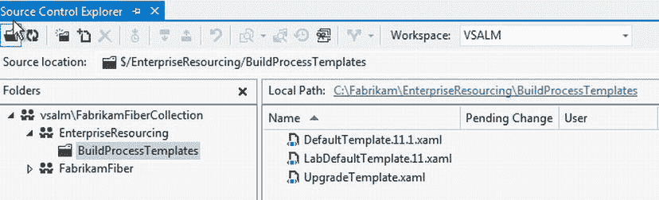

[图 13-13。](#_Fig13)默认团队构建工作流模板

 **注意** TFS 2012 引入了在 Windows Azure 中部署应用的额外工作流。

团队构建定义

您可以从团队资源管理器的“生成”部分创建新的团队生成。表 13-1 展示了你应该考虑在你的项目中提供的构建:

[表 13-1](#_Tab1) 。在您的 ASP.NET Web 应用项目中要考虑的团队构建定义

| 构建类型 | 定义 |
| --- | --- |
| CI(持续集成)构建 | CI 构建编译相关的解决方案，并在开发人员每次签入时执行。每个开发团队至少应该关联一个 CI 构建。单元测试项目必须与 CI 构建相关联，作为质量的衡量标准。 |
| 计划的每夜构建 | 可以配置一个与单元测试相关联的构建，该构建通常在团队不工作的时候，每天在预定的时间运行。作为最低要求，这应该针对开发和质量保证(QA)环境进行配置。夜间构建应该被配置为在适当的环境中部署输出。 |
| 发布版本 | 按需部署到暂存环境。 |
| 门控构建 | 防止重大变更和单元测试违规在 TFS 被检查。 |

团队构建定义触发器

您可以根据要创建的生成类型为生成定义设置触发器。例如，[图 13-14](#Fig14) 展示了为开发环境的持续集成构建设置 CI 触发器。

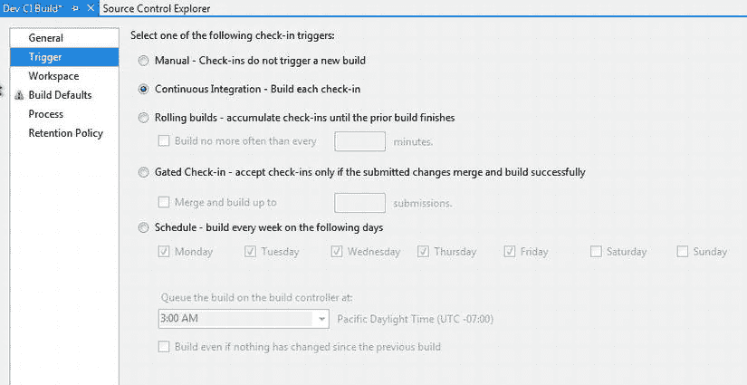

[图 13-14。](#_Fig14)建立竞争情报团队

同样，如果要为源代码管理分支启用封闭签入，请为生成触发器选择封闭签入选项。

团队建设流程

使用 TFS 团队构建，您可以做的不仅仅是编译配置好的解决方案来检查是否有任何突破性的更改。您还可以将单元测试与构建相关联，并将其配置为在运行期间测试未通过时失败。此外，通过将生成模板上的“代码分析”属性设置为 true，可以为生成设置规则以分析代码是否违反框架设计。这在[图 13-15](#Fig15) 中进行了说明。

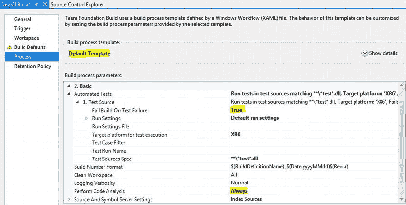

[图 13-15。](#_Fig15)为单元测试和代码分析设置团队构建属性

使用 Team Build 部署

使用 TFS 团队构建创建的 ASP.NET 4.5 Web 和 MVC 4 应用的 Web 包可以使用 Web 部署服务自动部署。Web 部署服务是微软 Web 平台安装程序的一部分，可以从`www.microsoft.com/web/downloads/platform.aspx`下载。它允许使用新团队构建的高级部分下指定的 MS Build 参数远程部署 web 包，如图[图 13-16](#Fig16) 所示。

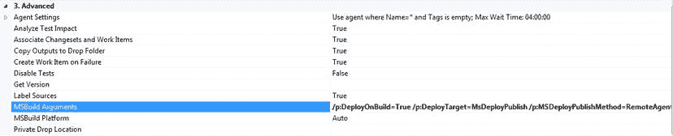

[图 13-16。](#_Fig16)使用 Team Build 自动部署 web 包

该命令将展开，如下面的代码示例所示。

```cs
/p:DeployOnBuild=True /p:DeployTarget=MsDeployPublish /p:MSDeployPublishMethod=RemoteAgent /p:CreatePackageOnPublish=True /p:DeployIisAppPath="Default Web Site/<Web Application Name>" /p:MsDeployServiceUrl=
http://<remote server address>/msdeployagentservice /p:username=<user name> /p:password=<password>
```

如果构建成功，则`/p:DeployOnBuild`开关触发远程部署。

 **注意**为了部署成功，远程部署服务必须在服务器上运行，并且在您的团队构建定义中，必须在构建默认值下为包指定放置路径，如图[图 13-17](#Fig17) 所示。

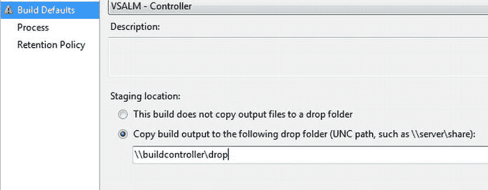

[图 13-17。](#_Fig17)指定构建放置文件夹

除了内部部署，TFS 2012 还具有内置模板，可在云中自动部署您的应用。本文详细阐述步骤:`www.windowsazure.com/en-us/develop/net/common-tasks/publishing-with-tfs/`。

部署 SQL Server 数据库

在“提高生产率”下的“访问数据”一节中，您了解了如何从 SQL Server 数据库创建数据库项目。数据库项目也可以使用 TFS 自动部署。您可以创建一个 TFS 团队版本，以使用 SQL Server 数据工具(SSDT) 支持的 SQL Server 数据层应用的 MS Build 命令来部署数据库。你可以在`http://msdn.microsoft.com/en-us/data/tools.aspx`了解更多关于 SSDT 的信息。

要创建数据库部署构建，首先您需要为您想要部署数据库的环境创建一个已发布的概要文件。您可以通过右键单击数据库项目，然后单击“发布”来创建它。执行此操作的对话框显示在图 13-18 的[中。确保选中发布对话框中的*添加概要文件到项目*复选框。](#Fig18)

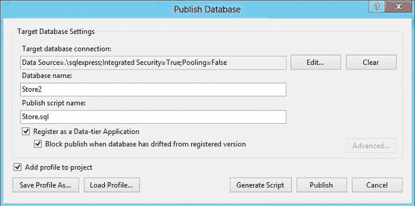

[图 13-18。](#_Fig18)发布数据库项目的配置文件

然后，您可以在 TFS 团队生成定义中使用以下 MS Build 命令来部署以下数据库:/t:Build/t:Publish/p:SqlPublishProfilePath = store . Publish . XML

摘要

本章概述了应用生命周期管理以及在构建数据驱动的 web 应用的过程中使用的相关工具。您学习了如何有效地使用 Team Foundation，还学习了 Visual Studio 2012 的一些功能，这些功能可以提高开发人员的工作效率。