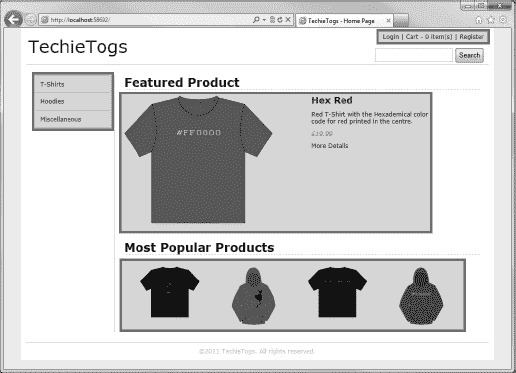
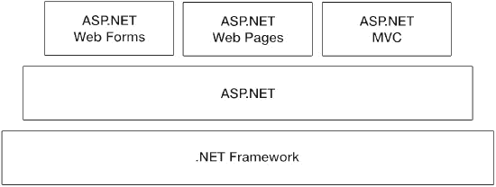

# 一、Microsoft WebMatrix 简介

WebMatrix 是微软的一个 web 开发平台，旨在提供一种快速、轻量级的方法来开发动态 web 内容。WebMatrix 平台由许多单独的组件组成，这些组件共同创建了一个完整的 web 开发环境。在本书的整个过程中，你将详细地了解每一个组成部分。

这一章并不关注平台的内部运作或其单个组件，而是重点解释 WebMatrix 所处的环境。它旨在解释 WebMatrix 设计背后的意图以及它要解决的问题。

### 什么是 WebMatrix？

WebMatrix 是一套免费的开发工具，旨在允许用户轻松创建动态的、数据驱动的网站，并将其发布在互联网上。

作为 WebMatrix 平台一部分的工具和技术包括数据库、web 服务器、部署工具、搜索引擎优化(SEO)工具和服务器端脚本语言等。尽管所有这些工具和技术都可以作为单独的实体下载和使用，但微软已经将它们合并到一个称为 WebMatrix 的单一堆栈中。通过这样做，web 开发人员可以在一个环境中控制 web 站点的所有方面的开发，从而大大降低复杂性。这种复杂性的降低实现了许多好处，尤其是缩短了开发时间和大大降低了准入门槛——开发人员必须学会只使用一个集成环境，而不是五六个独立的工具。

为了进一步缩短学习曲线，当作为 WebMatrix 的一部分呈现时，许多组件部分被简化。例如，微软作为 WebMatrix 的一部分提供的 web 服务器是其成熟的 Internet 信息服务 web 服务器应用的一个较小的、开发友好的版本，而数据库是其企业级关系数据库服务器 SQL Server 的精简版。这对新开发者来说是一个很大的优势。WebMatrix 只向您提供创建网站绝对需要的内容，去掉了那些很少使用的、通常只由高级用户使用的无数功能。

对于更高级的开发人员来说，这种开发环境的简化可能是一种令人耳目一新的变化，尤其是在当前巨大的整体式 web 开发框架和架构的趋势下。如果需要的话，您仍然可以通过组件的本地工具访问它们。

WebMatrix 提供的最重要的是简单性、易用性和快速开发。

#### 什么是动态的、数据驱动的网站？

到目前为止，我们已经知道微软的 WebMatrix 是一个创建“动态的、数据驱动的网站”的伟大工具，但是这到底意味着什么呢？让我们先来看看动态部分。

##### 动态网页

简单来说，网站内容可以通过两种方式提供。第一种更传统的方法是将内容存储在像文档这样的静态文件中，并将它们完整地提供给客户端浏览器。如果你把这本书的每一页都存储为一个 HTML 页面，当用户请求时，它会完整地显示给用户，你就提供了静态内容。不同用户在不同时间检索的静态网页总是以完全相同的方式显示。

动态页面是这样一种页面，当向 web 服务器发出请求时，它至少会以编程方式产生一些内容。换句话说，当用户从 web 服务器请求页面时，会运行一些代码来构造返回给用户的输出。这种内容的动态创建与传统的静态网站截然相反。WebMatrix 使用 ASP.NET 网页来执行 C# 或 Visual Basic。NET 代码来创建动态内容。

动态页面也可以用来接受用户的输入，然后用于某种计算。例如，一个页面可能请求一种货币的货币值，然后在服务器上将其转换为另一种货币，并将结果显示给用户。

##### 数据驱动页面

数据驱动页面是那些与某种数据存储交互的页面。例如，来自用户的输入可用于创建或更新数据库记录，或者数据可从 XML 文件中检索并由代码格式化以供输出。通过使用数据库表和记录中的数据存储，我们能够生成定制的页面内容，无论是基于一个用户还是其他用户。

网页进行的典型数据库操作是创建、读取、更新和删除，通常缩写为 CRUD。我们可以生成用户界面和服务器端代码，这将允许网站用户以非常可控的方式在数据库上执行这些操作。

##### 务实的解决方案

事实上，WebMatrix 或任何其他服务器端动态框架(如 PHP 或 Ruby on Rails)生成的大多数网页都是静态和动态内容的混合。这样做主要有两个原因:速度和简单。

对于开发人员来说，创建静态内容要简单得多，生产和服务也更快。因此，常见的做法是在一个页面中混合使用这两种技术，只在需要的地方返回动态的、数据驱动的内容，以及其余的静态标记。

[图 1-1](#fig_1_1) 通过识别示例电子商务网站典型页面上的静态和动态内容区域来演示这一概念，我们将在[第 9 章](09.html#ch9)、[第 10 章](10.html#ch10)和[第 11 章](11.html#ch11)中设计和构建这些内容。突出显示代码中动态创建的内容；页面的其余部分使用静态 HTML:

***图 1-1。**在单个网页中混合静态和动态(突出显示)制作的内容*

### 为什么要使用 WebMatrix？

有许多优秀的 web 框架可用于开发动态站点，为什么您应该选择使用 WebMatrix 呢？它有很多优点。让我们来看看这里的一些主要优势:

*   **简单–**简单是 WebMatrix 成功的关键。这在很大程度上是通过避开一些在过去几年中变得流行的大规模和非常复杂的架构来实现的。您可以直接在 web 页面中添加不复杂的动态服务器端代码，这种方式对于以前有过经典 ASP 或 PHP 经验的开发人员来说是很熟悉的。绝对没有什么可以阻止你创建一个高效有用的站点架构，但是在绝大多数中小型的 web 应用中，根本没有必要通过设计一些复杂的类似大教堂的代码结构来增加复杂性，这些代码结构不会带来任何实际的好处，并且会降低开发速度。
*   **很容易学习**–WebMatrix 的学习曲线远没有大多数现代网络平台那么陡峭。正如您在阅读本书的过程中所看到的，框架的简单性使其易于学习和掌握。只要你有 HTML 的工作知识，过去做过一些基本的编程，学习 WebMatrix 应该没什么问题。
*   **它是完整和集成的**——开发一个完整网站所需的一切都包含在 WebMatrix 中，这一点我们将在[第 9 章](09.html#ch9)、[第 10 章](10.html#ch10)和[第 11 章](11.html#ch11)中开发 TechieTogs 示例电子商务应用时证明。这包括一个数据库，脚本语言，网络服务器，部署工具和开发环境(你将用来创建网站的工具)；他们在一起玩得很好！这是最强的卖点之一，在其他平台中非常不寻常。
*   **安装**完全免费且简单——正如你将在[第二章](02.html#ch2)中看到的——开始使用，整个平台使用网络平台安装程序下载和安装非常简单，而且完全免费。
*   **它是 ASP.NET 平台**的一部分——ASP.NET 是微软成熟且久经考验的网络平台。它自 90 年代初就已经出现，并且已经发展成为一项非常强大的技术。ASP.NET 建在。这意味着你可以用任何。NET 语言(C# 是最流行的，也是我们在本书中专门使用的语言)并充分利用广阔的。NET 类库来简化您的许多编程任务。
*   **您可以完全控制呈现的输出**–过去有人批评 ASP.NET 网络表单模型缺乏对呈现给客户端浏览器的最终标记的控制。WebMatrix 没有这些问题。通过使用 ASP.NET 网页和开创性的 Razor 语法，开发人员可以完全控制发送给客户端的输出。这意味着呈现的页面可以符合 web 标准，并且希望在应用中使用客户端脚本的开发人员可以轻松访问页面元素。
*   **灵活开放**——WebMatrix 开发环境同样适用于 PHP 和 ASP.NET 网页的开发。使用 WebMatrix，您可以快速、轻松地找到、下载、安装、配置和定制各种免费开源 web 应用。其中包括许多网络上最流行的开源应用，包括 WordPress、Umbraco、Drupal、Joomla！、Moodle 和 DotNetNuke。
*   **它被设计成可扩展的—**WebMatrix 平台的两个主要部分是集成的 web 服务器和数据库。如果需要的话，这两个组件都可以很容易地升级到更高性能的生产系统，事实上这是被鼓励的。实现这一点的工具是作为开发环境的一部分提供的。
*   **它可以扩展—**正如我们将在本书后面看到的，WebMatrix 包括一个包管理器，允许您下载、安装和定制帮助器代码，以轻松地向您的站点添加特定功能，并简化与第三方提供商的集成，如 Twitter、FaceBook、Amazon、PayPal、Groupon、Windows Azure 和 Foursquare。

#### ASP.NET 平台

我们提到过，WebMatrix 通过在 Web 服务器上执行代码，使用 ASP.NET 网页来创建动态内容。ASP.NET 网页是 ASP.NET 平台的最新成员，该平台自 2002 年就已存在。因此，ASP.NET 网页平台的设计者已经能够利用近十年来积累的丰富经验来设计一个轻量级的全功能网络开发平台。在设计 WebMatrix 的过程中，微软真正听取了 ASP.NET 和更广泛的 web 开发社区的用户的意见，他们中的许多人一直在寻求。NET 及其相关的库和基础设施在一个平台上，允许简单的快速开发，易于使用，可扩展性和对发送给用户的输出的完全控制。

趋向简单的趋势

在过去的几年里，新的 web 开发框架和方法出现了爆炸式增长。然而，许多这些新框架需要大量的基础设施和代码，这对于大多数小型网站的开发来说完全是多余的。这种对简单 web 开发任务的不适应性，以及开始使用这些框架所需的编程和科学知识，已经驱动了一种不断增长的趋向简单的趋势。

像 ASP.NET 网页和 Sinatra 这样以 Ruby 开发者为目标的平台，正开始从“全栈”平台获得可观的市场份额，因为开发者意识到使用简单框架开发简单网站的好处，新来者发现进入门槛较低。

[图 1-2](#fig_1_2) 显示了 ASP.NET 网页如何融入 ASP.NET 的技术体系:

***图 1-2。【ASP.NET 栈】T2***

从这个图中可以清楚地看到，ASP.NET 网页是以与 ASP.NET 网页表单和 ASP.NET MVC(模型视图控制器)相同的方式构建在 ASP.NET 之上的。ASP.NET 也是建立在。NET 框架。这种架构意味着 ASP.NET 网页可以充分利用巨大的。NET 类库的存在，使开发人员能够执行各种各样的常见编程任务，否则这些任务将是繁琐、复杂和耗时的。

该架构的另一个明显优势是。NET 开发人员从一个平台到另一个平台是相对简单的。一个. NET 开发人员将拥有许多可以在各种 web、桌面和移动开发框架之间转移的技能，因为事实上它们都是建立在。他们已经熟悉的. NET 框架。

#### 谁应该使用 WebMatrix？

WebMatrix 对于任何希望创建一个中小型动态、数据驱动的站点以部署在 Microsoft Windows web 服务器上的人来说都是绝对理想的。可能发现 WebMatrix 有用的人包括:

*   具有其他平台经验的 Web 开发人员，如 ASP.NET Web Forms、PHP、Ruby on Rails 或 Classic ASP，他们希望使用简单、现代的框架在 ASP.NET 平台上开发 Web 应用。
*   Windows 桌面应用的开发人员，他们希望扩展他们现有的技能，使用他们已经熟悉的编程语言开发基于 web 的应用。
*   希望在静态网站中包含一些动态内容而又不大惊小怪的网站设计者。
*   对学习如何开发 web 应用感兴趣的爱好者、爱好者和学生。他们会发现 WebMatrix 简单易学，见效快，而且在一个地方就有他们需要的所有功能。

这绝不是一个详尽的列表，但确实在一定程度上展示了可以从该平台中受益的不同人群。本书面向所有这些群体，除了对 HTML 和层叠样式表(CSS)有基本的了解之外，没有任何其他知识，尽管以前的一些编程经验，不管多么少，肯定会有所帮助。

### 我会学到什么？

在这本书的过程中，你将学到创建全功能、动态、数据驱动的网站所需的一切；当我们使用在本书第一部分中学到的技能和技术来开发一个功能齐全的电子商务网站时，这一事实将在第 9 章、 [10 章](10.html#ch10)和 [11 章](11.html#ch11)中得到证明。

以下列表描述了文本中涉及的一些主要主题:

*   **安装-** 使用 WebMatrix 的第一步是下载并安装。我们将在第 2 章的[中看到如何让你开始运行。](02.html#ch2)
*   **工具—**我们将深入了解作为 WebMatrix 开发环境的一部分提供的所有工具。我们将在本书的整个过程中讨论这些，因为我们会用到它们。
*   **语言**–WebMatrix 网站可以使用任何。网络语言。在本书中，我们将关注其中最流行的 C#。[第 3 章](03.html#ch3)包含一个 C# 入门，旨在给你足够的语言知识，使你能够完成本书其余部分的例子。
*   **ASP.NET 网页**–在[第四章](04.html#ch4)中，我们将看到如何使用令人难以置信的 Razor 语法模型来开发 ASP.NET 网页。这些页面允许执行服务器端 C# 代码来生成用户可以与之完全交互的动态页面。
*   **表单和验证–**HTML 表单是网站收集用户信息最常用的方法。在[第 5 章](05.html#ch5)中，我们将学习如何利用这些信息，以及如何实现代码来检查用户输入是否有效。
*   **SQL Server Compact Edition—**WebMatrix 附带一个基于文件的集成数据库；SQL Server Compact Edition，我们将在第 6 章的[中详细介绍。我们将学习如何使用内置工具来创建和管理这些数据库，以及如何连接和使用其他现有的数据源。](06.html#ch6)
*   **与数据库交互—**同样在第六章的[中，我们将看到 ASP.NET 网页如何用于与数据库交互。我们将看到如何在网页中执行创建、读取、更新和删除操作。在这一章中，我们还将学习如何使用内置的助手在图表中显示数据。](06.html#ch6)
*   **安全性和网站成员资格–**在大多数相当复杂的网站中，希望某些区域仅对登录用户可见。在第 7 章的[中，我们将看到如何使用全面的 ASP.NET 网页安全和会员系统来实现这一目标。](07.html#ch7)
*   **社交网络集成–**WebMatrix 有一个内置的软件包管理器，使您能够查找、下载和安装帮助软件包到您的 web 应用中，从而促进与社交网络和其他第三方网站的集成。我们将花费整个[第 8 章](08.html#ch8)来看软件包管理器和一些更常用的 web 助手软件包。
*   **现实世界开发**—[第 9 章](09.html#ch9)、[第 10 章](10.html#ch10)和[第 11 章](11.html#ch11)我们将使用前几章学到的技能和技术开发一个功能全面的电子商务应用。
*   **调试–**尽管你总是试图将它们最小化，但在任何相当复杂的应用中，错误和缺陷都不可避免地会出现。在[第 13 章](13.html#ch13)中，我们会在网站上线之前看看如何识别和修复它们。
*   **搜索引擎优化(SEO)–**随着搜索引擎流量变得如此重要，尤其是对初创网站而言，优化网站在搜索引擎中的位置至关重要。WebMatrix 可以通过帮助您确保您的网站被 Google、Yahoo 和 Bing 等搜索引擎正确索引来帮助您实现这一目标。我们将在[第 13 章](13.html#ch13)中学习如何充分利用这个工具。
*   **部署**–一旦您的网站完成，您需要将它从您的开发 PC 部署到面向公众的 web 服务器上。在[第 13 章](13.html#ch13)中，我们将看到 WebMatrix 如何让这一切变得简单，甚至可以帮助你选择合适的虚拟主机提供商。

### 网络矩阵社区

WebMatrix 有一个活跃的在线社区，由各种各样的初学者、学生、爱好者和专业开发人员组成，新成员总是受到热烈欢迎。有几个优秀的在线论坛，这是一个很好的地方问任何问题，你可能有；其中包括:

*   ASP.NET 官方 WebMatrix 论坛-*http://forums.asp.net/1224.aspx*
*   非法入境者。NET WebMatrix 论坛-*http://forums.iis.net/t/1169334.aspx*
*   堆栈溢出-*http://stackoverflow.com/questions/tagged/webmatrix*

 **提示**请记住遵守正常的论坛礼节，在你发帖之前，总是使用论坛的搜索功能来查看你的问题是否已经被其他用户问过。

我还建议您定期访问以下网站，以了解 WebMatrix 的最新发展以及未来版本、更新和活动的详细信息:

*   ASP.NET 官方网页站点-
*   Microsoft.com 网站-
*   网络阵营-*【http://www.webcamps.ms/】T3】*

最后，我会向任何 WebMatrix 开发人员推荐一些专家的博客。这里我列举了几篇有趣的文章:

*   斯科特·格思里——介绍 WebMatrix
    *[http://weblogs . ASP . net/scottgu/archive/2010/07/06/Introducing-WebMatrix . aspx](http://weblogs.asp.net/scottgu/archive/2010/07/06/introducing-webmatrix.aspx)*
*   罗布·科内瑞——关于 WebMatrix 的想法
    *【http://blog.wekeroad.com/microsoft/someone-hit-their-head】T2*
*   Scott Hansel man–在 WebMatrix 上(与 Rob Conery)–Hansel minutes 播客 249
    *[http://www . Hansel man . com/blog/hanseminutespodcast 249 onwebmatrixwithrobconery . aspx](http://www.hanselman.com/blog/HanseminutesPodcast249OnWebMatrixWithRobConery.aspx)*
*   James Senior–WebMatrix 博文
    *【http://www.jamessenior.com/?cat=13】T2*
*   Joe Stagner-WebMatrix 博文
    *【http://www.misfitgeek.com/category/webmatrix/】*

### 先决条件

在阅读本书之前，您必须满足一些个人和硬件要求。

#### 以前的知识

只要你有 HTML 和 CSS 的基本工作知识，你就能完成并理解这本书的所有章节。然而，任何类型的编程经验和互联网技术的一般工作知识将是有益的。

在整个文本中提供了有用的网页和出版物的链接和参考，以帮助您阅读该主题，并真正获得所讨论概念的全面深入的知识。

#### 系统要求

要安装和使用 WebMatrix，您必须有一台运行以下受支持的 Microsoft 操作系统之一的 PC:

*   Windows XP Service Pack 3
*   Windows Vista Service Pack 2
*   Windows 7
*   Windows Server 2003 Service Pack 2，
*   Windows 服务器 2008
*   视窗服务器 2008 R2

### 总结

在这一章中，你已经对 WebMatrix 有了一个简单的概述，它能做什么，为什么它在初学者和专家中如此受欢迎。现在，我已经吊起了你的胃口，让我们进入下一章，直接安装 WebMatrix 并编写我们的第一个 web 应用。

祝你好运！