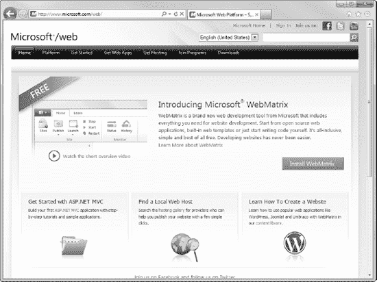
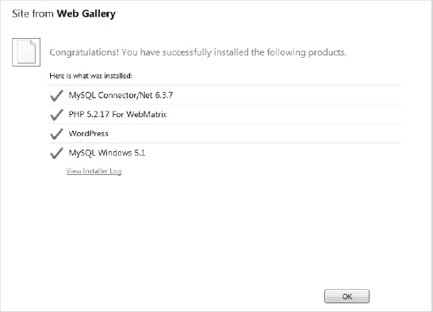
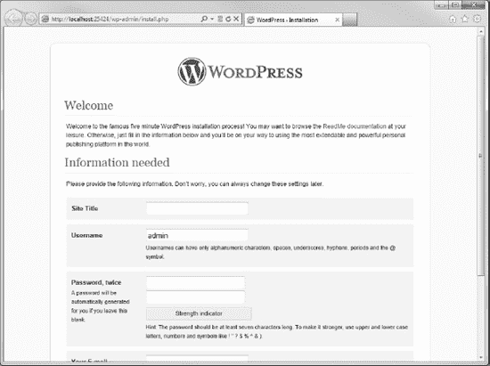
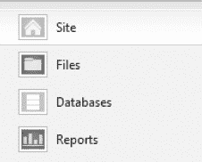
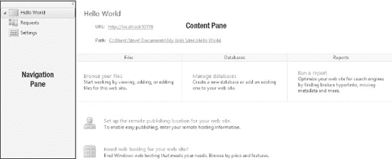
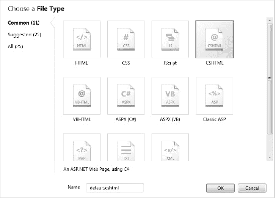
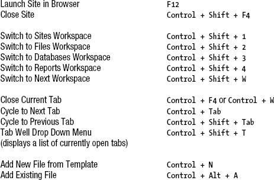
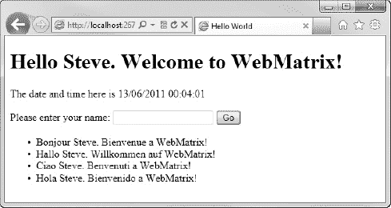

# 二、入门指南

在这一章中，我们将直接使用 Microsoft WebMatrix 创建我们的第一个站点。

首先，我们将使用 Microsoft Web Platform Installer(一种多合一的下载管理器和安装程序)将 WebMatrix toolbox 安装到您的 Windows PC 上。接下来，我们将了解 WebMatrix 集成开发环境(IDE)的主要部分，以及打开现有项目和创建新站点的选项。最后，我们将创建第一个站点，并添加一些带有简单服务器端功能的动态内容。

 **注意**本章的目的是介绍使用 Microsoft WebMatrix 开发网站所涉及的环境和概念，深入的技术讨论将在后面进行；因此，为了避免混淆，我们将忽略本章中的一些技术细节。在没有解释的情况下使用某个特性，我将提供本书后面部分的参考，在那里可以找到更详细的解释。

### 安装 WebMatrix

安装 WebMatrix 最简单、最好的方法是使用 Microsoft Web Platform 安装程序。

Microsoft Web Platform Installer 3.0 是一个免费工具，旨在大大简化下载和安装 Microsoft Web Platform 组件(包括 WebMatrix)的过程。尽管所有 web 平台组件的单独安装仍然可以从 Microsoft 网站单独下载，但使用 Web 平台安装程序是首选方法，它使整个过程更加简单可靠。

安装 WebMatrix 的实际过程会略有不同，具体取决于您的计算机上是否已经安装了 Web Platform Installer 我们将在这里研究这两种情况。

#### 如果您还没有 Web 平台安装程序，请获取 WebMatrix

如果您还没有 Web Platform Installer 3.0，您可以轻松下载并在一个过程中自动设置它和 WebMatrix。为此，请转到

`[http://www.microsoft.com/web/](http://www.microsoft.com/web/)`

这将把你带到微软网络平台主页，如[图 2-1](#fig_2_1) 所示。

***图 2-1。**微软网络平台主页*

 **提示**该网站还有一些关于微软 WebMatrix 的重要附加信息，以及到 ASP.NET 网站上更多教程、论坛和其他资源的链接。

点击本页绿色的`Install WebMatrix`按钮和下一页的`Install Now`按钮，您将被引导至 Web Platform Installer 3.0 安装页面。此时，根据您选择的浏览器和 Windows 设置，可能会提示您获得运行安装程序的权限；或者，如图[图 2-2](#fig_2_2) 所示，您可能会收到 Windows 用户帐户控制的通知，您应该接受。

***图 2-2。**如果出现用户帐户控制对话框，选择“是”。*

一旦 Web 平台安装程序启动，它将自动提示您安装 Microsoft WebMatrix。点击`Install`，阅读并接受许可条款。同样，安装程序可能需要 5-10 分钟才能完成，这取决于您的电脑硬件和互联网连接速度。

#### 通过网络平台安装程序获取网络矩阵

如果您之前已经安装了 Web Platform Installer，您可以使用图 2-3 所示的快捷方式通过 Windows 开始菜单从开始所有程序 Microsoft Web Platform Installer 打开它。

***图 2-3** 。Windows 开始菜单中的 Web 平台安装程序快捷方式*

Web 平台安装程序启动后，您可以通过使用内置搜索工具或选择屏幕顶部的产品菜单，选择左侧的工具子菜单，然后向下滚动到 Microsoft WebMatrix，找到安装 WebMatrix 的选项。然后只需点击`Add`按钮(见[图 2-4](#fig_2_4) )然后点击`Install`。

***图 2-4。**微软网络平台安装程序 3.0*

点击`Install`后，你将被引导至许可屏幕，在这里你需要阅读并接受将要安装的每个产品的许可条款(见[图 2-5](#fig_2_5) )。点击`I Accept`，您尚未安装或已安装但需要更新的所有 WebMatrix 组件将被下载到您的机器上并进行设置。

***图 2-5。**接受许可条款*

安装程序可能需要 5-10 分钟才能完成，这取决于您的电脑硬件和互联网连接速度。一旦安装成功完成，您将看到祝贺信息，如图 2-6 所示。

***图 2-6。**WebMatrix 的成功安装*

安装完成后，点击`Finish`直接进入 WebMatrix 快速启动页面，如图[图 2-7](#fig_2_7) 所示。

***图 2-7。**微软网络矩阵快速入门页面*

#### 盒子里是什么？

WebMatrix 可以被描述为一个 web 开发堆栈或工具集，因为它是一个独立组件的集合，这些组件组合在一起可以创建一个单一的集成开发体验。它不是一个独特的应用或编程框架，而是将 web 服务器与数据库和 ASP.NET 网页结合在一起，所有这些都通过一个集成开发环境(IDE)进行操作。[图 2-8](#fig_2_8) 显示了这种关系。

***图 2-8。**WebMatrix 工具集*

WebMatrix 的四个主要组件是 IDE、ASP.NET 网页、IIS 7.5 Express 和 Microsoft SQL Server Compact 4.0。然而，Web 平台安装程序实际上安装了 10 个不同的组件，作为 WebMatrix 包的一部分。让我们来看看这 10 个组件中的每一个，以帮助我们全面了解我们的工具箱。

##### ASP.NET 网页

ASP.NET 网页为您的 Web 应用提供了可编程用户界面(UI)。使用客户端和服务器端代码和标记的组合，在服务器上动态创建网页输出，以便在任何 Web 浏览器或移动设备中显示。

ASP.NET 的网页是建立在微软上的。NET Framework 是一个托管环境，它提供重要的服务，如内存管理、安全性、类型安全和对。NET 基础类库，所有人都可以使用的标准库。NET 语言，它封装了大量常见的编程函数。尽管这本书集中于用 C# 编写服务器端代码，但 ASP.NET 网页与。NET 公共语言运行时(CLR)，如 Visual Basic。

在本书的整个过程中，你将学会使用 ASP.NET 网页设计和创建自己的网站，向用户的 web 浏览器提供动态内容。

##### IIS 7.5 快速版

IIS 7.5 Express 是 Microsoft Internet Information Services 的一个轻量级桌面版本，在开发过程中针对在独立计算机上使用进行了优化。互联网信息服务是一个 web 服务器应用，用于向浏览器提供 ASP.NET 和 PHP 页面。IIS Express 是一个缩小的版本:它不需要管理员用户权限，设计为在 web 开发人员的机器上本地运行，用于测试和调试目的。由于 IIS Express 包含了完整版 IIS 的所有核心功能，因此您可以放心，除非存在配置差异，否则在 IIS Express 下本地运行的站点也可以在运行完整版的 web 主机上运行。

IIS 7.5 Express 是 WebMatrix 平台的无缝集成部分。当您使用 WebMatrix 开发网站时，您将使用 IIS 7.5 Express 进行测试和调试。当您第一次从 IDE 中运行站点时，它会自动启动，通常只需要很少的配置(如果有的话)。网站完成后，可以将其移动到安装了完整 IIS 的生产服务器上，或者使用 web 部署工具发布到 web 主机上。

##### SQL Server Compact 4.0

Microsoft SQL Server Compact 4.0 是 WebMatrix 的默认数据库。它已经针对 ASP.NET web 应用进行了优化和调整，可以扩展到 4 GB 的数据库大小。数据库是基于文件的(。sdf 文件)，并且不需要单独的数据库引擎—SQL Server Compact 会在应用运行时自动运行，并在应用关闭时自动关闭。SQL Server Compact 数据库直接在 WebMatrix IDE 中创建和管理。

基于文件的数据库是完全独立的，并且在内存中运行，因此 SQL Server Compact 数据库不需要在服务器上进行任何配置，并且可以作为站点的一部分上载。SQL Server Compact 适合在实时 web 应用中使用，如果需要，可以轻松地迁移到 SQL Server 系列产品的不同版本。

在学习使用 Microsoft WebMatrix 创建自定义动态数据驱动网站时，您将在本书中广泛使用 SQL Server Compact。

##### Microsoft WebMatrix

Microsoft WebMatrix 安装是指 WebMatrix 集成开发环境(IDE)。IDE 为创建 ASP.NET 网页提供了一个功能性的无缝界面；管理 IIS Express 和 SQL Server Compact 安装第三方开源 web 应用，比如 WordPress，Joomla！，和 Umbraco 部署到虚拟主机提供商；还有更多。

到本书结束时，您将非常熟悉 WebMatrix IDE 及其所有功能。

##### 其他组件

ASP.NET 网页、IIS Express、SQL Server Compact 和 WebMatrix IDE 是 WebMatrix 工具箱的四个主要组件。由 Web Platform 安装程序安装的以下其余组件是为了支持它们并使它们能够进行交互:

*   *Microsoft SQL Server Compact 4.0 工具*组件在 WebMatrix IDE 中提供了用于创建和管理 SQL Server Compact 4.0 数据库的工具。
*   *SQL Server 系统 CLR 类型*包包含用于在 SQL Server 中实现 geometry、geography 和 hierarchyid 类型的组件。
*   *SQL Server Native Client* 是包含数据库驱动的组件。
*   *SQL Server 管理对象*组件是自动化 SQL Server 管理的对象集合。WebMatrix 使用该组件对数据库执行管理任务。
*   *ASP.NET 网页语言包*包含除英语之外的其他语言的翻译文本，如错误消息。如果没有语言包，这些消息默认以英语显示。
*   *Web 部署工具*从 IDE 内部管理 WebMatrix 网站到 IIS 托管提供商的部署和同步。

### 【WebMatrix 网站入门

在这一节中，我们将动手构建我们的第一个 WebMatrix 应用。我们在这里创建的应用将使用 WebMatrix toolbox 的四个主要组件中的三个:ASP.NET 网页、IIS 7.5 Express 和 WebMatrix IDE ( [第 6 章](06.html#ch6):“使用数据”包含了有关使用 SQL Server Compact 组件的详细信息)。

#### 进入矩阵:创建你的第一个网站

当您运行 WebMatrix 应用时，您会看到 WebMatrix 快速启动页面(参见[图 2-7](#fig_2_7) )。[图 2-9](#fig_2_9) 显示了从快速入门页面使用 WebMatrix 项目的四个选项。

***图 2-9。**快速入门页面上的四个选项*

这些选项中的每一个都提供了打开现有网站或创建新网站的不同方式。通常，当创建一个定制的 WebMatrix 应用时，您可以创建一个`Site from Template`或者打开`My Sites`来查看之前创建的项目列表。然而，为了完整起见，我们将在这里查看所有四个可用选项，因为每个选项都提供了独特的功能和优势。

##### 我的网站

此选项会打开一个对话框，允许您浏览现有站点以选择您希望处理的站点。WebMatrix 默认将网站存储在用户文档库的`My Web Sites`文件夹中(Windows 7 上为`C:\Users\[username]\Documents\My Web Sites`)；然而，`My Sites` 对话框将列出您在 WebMatrix 中打开过的所有站点，而不考虑它们的实际位置。

当您学习 WebMatrix 时，您无疑会创建数十个(甚至数百个！)来测试代码和想法。你的列表会很快变得混乱，很难找到你想要打开的项目。要从`My Sites`对话框中删除一个站点，您可以右击相关站点并从上下文菜单中选择删除。然后你会看到`Delete Site`对话框，如图 2-10 中的[所示。](#fig_2_10)

***图 2-10。**删除站点对话框*

在`Delete Site`对话框中，您可以简单地从`My Sites`对话框的选项中删除该站点，或者完全删除该站点和内容，擦除`My Sites`对话框中的条目和磁盘上的物理文件。

 **提示**你为测试代码和想法而创建的网站很少会超过几百千字节，甚至更少。除非您特别缺少磁盘空间，或者确定您将永远不需要再次引用您的测试代码，否则选择只删除站点通常是值得的；这样，你将保持你的`My Sites`列表整洁，但是你将来总是能够使用快速启动页面上的`Site from Folder`选项打开你的站点。

##### 来自网络画廊的网站

WebMatrix 包含一个内置的 Web Gallery，允许您从许多免费的开源 Web 应用中选择一个，这些应用可以自动下载并安装在本地。Web Gallery 中提供的开源应用包括各种最流行的 PHP 和 ASP。基于. NET 的开源项目，如 WordPress，Umbraco，Moodle，Joomla！、点网 Nuke、ScrewTurn、Wiki、以及 Orchard。在撰写本文时，有 50 多个免费的开源 web 应用可供下载、安装和配置。网络画廊可以在图 2-11 中看到，它通过定制或扩展一个已经开发的应用提供了一个启动项目的好方法。

***图 2-11。**WebMatrix 网络画廊*

一旦下载并安装了选择的开源 web 应用，WebMatrix 将提供工具来根据您的要求配置站点。

例如，我们将使用流行的基于 PHP 的博客引擎 WordPress 安装和配置一个网站。从`Site from`屏幕选择 WordPress，输入一个网站名称，然后点击`Next`。以下屏幕，如图 2-12 中的[所示，用于选择数据库实例。](#fig_2_12)

***图 2-12。**为 WordPress 安装选择数据库*

选择在你的机器上安装 MySQL 并点击`Next`。在接下来的屏幕上为 root 用户指定一个密码，然后点击`Next`并接受许可协议。WebMatrix 现在将自动下载并安装 WordPress 安装所需的所有组件；这可能需要几分钟，取决于您的电脑和互联网连接速度。

[图 2-13](#fig_2_13) 显示了 WebMatrix 显示的配置屏幕，用于配置一个新的 WordPress 安装。输入必要的信息，点击`Next`完成安装。

***图 2-13。**从网络画廊配置网站*

一旦 WebMatrix 完成应用的安装和配置，它将显示确认屏幕，如[图 2-14](#fig_2_14) 所示。

***图 2-14。**确认成功安装 WordPress】*

最后，单击`OK`按钮在 WebMatrix 中打开站点，在浏览器中单击屏幕左上角功能区控件上的`Run`按钮即可运行该站点。[图 2-15](#fig_2_15) 显示了第一次在浏览器中运行的 WordPress 应用。

***图 2-15。** WordPress 第一次在浏览器中运行*

从 Web Gallery 下载的站点可以从 WebMatrix IDE 直接在本地计算机上运行，因为 IIS Express 从 Internet 信息服务(IIS)的完整版本继承了为 PHP 和 ASP.NET 站点提供服务的能力。这意味着 WebMatrix 可以用来构建 PHP 和 ASP.NET 网站——这是一个强大的特性！

这个过程非常简单，几乎不需要(如果有的话)进一步的解释，所以我们不会对它进行更详细的讨论。这本书的其余部分专门教你如何通过创建自己的 ASP.NET 网页来创建定制网站。

 **提示**在`[http://www.microsoft.com/web/gallery/](http://www.microsoft.com/web/gallery/)`可以浏览 Windows Web App 图库。在线图库允许您查看比通过 WebMatrix 内置的网络图库更多的应用信息。在线画廊中的材料包括评级、评论、截图和更多资源的链接，如论坛和教程。在你对你的项目将要使用的开源平台做出不可逆转的决定之前，在线画廊是非常值得一试的。

##### 文件夹中的网站

“从文件夹创建站点”选项允许您从磁盘上的任何指定文件夹创建 WebMatrix 站点。当 WebMatrix 站点已经实际存在，但尚未在当前计算机上使用 WebMatrix 打开时，此选项特别有用。例如，假设另一个开发人员创建了一个站点，并交给您进行进一步开发，或者您希望使用 WebMatrix 向现有的静态 HTML 站点添加一些动态内容。

该选项的另一个常见用途是强制 WebMatrix 在非默认位置(`C:\Users\[username]\Documents\My Web Sites`)创建一个新站点；例如，在网络驱动器上。如果您经常希望在`My Web Sites`文件夹以外的位置创建站点，可以在 WebMatrix IDE 的选项菜单中更改默认站点位置。

##### 模板中的网站

要在默认位置创建新的 WebMatrix 站点，请选择“从模板创建站点”选项。这将打开`Site from Template`对话框，如图 2-16 中的[所示。](#fig_2_16)

***图 2-16。**来自模板对话框的站点*

顾名思义，模板是开发新的 ASP.NET 网页应用的预建起点。正如我们将看到的，模板可以包含任意数量的文件、文件夹和特性。模板可以是任何东西，从一组基本的文件夹到功能性的 web 应用。需要记住的重要一点是，它们只是作为开发定制应用的起点，而不是作为现成的应用。我们现在将探讨 WebMatrix 的五个默认模板。

##### 空网站

空网站模板在默认网站位置设置一个文件夹，该文件夹的名称是您在“从模板创建网站”对话框中指定的。新文件夹只包含一个文件`robots.txt`。如果您不希望实现其他模板提供的任何功能，或者您只想测试一些代码，而不需要较大模板的开销或干扰，那么这个模板是理想的。我们将在本书的整个过程中使用这个模板，因为它将帮助您获得在 WebMatrix 中构建 web 应用的更完整的知识。

**Robots.txt**

`Robots.txt`是一个文本文件，限制通过搜索引擎机器人访问您的全部或部分网站。该文件包含特定格式的指令，机器人在从站点获取数据时可以遵循这些指令。例如，`robots.txt`文件可以指示网络爬行机器人不要访问网站中包含用于校对或测试的临时页面或个人图像的部分，因此不要在搜索引擎中建立索引。

值得注意的是，搜索引擎蜘蛛和其他网络机器人对机器人排除协议的遵守纯粹是建议性的，并不能保证隐私。您仍然必须确保所有机密信息都有密码保护。

有关 Robots.txt 和 Robots 排除协议的更多信息，请访问`[http://www.robotstxt.org](http://www.robotstxt.org)`。

##### 起始站点

返回站点模板窗口，单击起始站点图标，然后单击确定。这将创建一个基于 Starter Site 模板的小型示例网站，您可以将它用作自己的应用的起点。点击屏幕左上方功能区控件中的运行按钮(见[图 2-17](#fig_2_17) )将在默认的网络浏览器中打开网站，如图[图 2-18](#fig_2_18) 所示。该模板生成一个网站，该网站除了具有专业设计的布局和导航结构之外，还具有预先构建的成员资格和认证系统。

***图 2-17。**点击 WebMatrix 中的运行按钮，在默认浏览器中打开网站。*

***图 2-18。**首发网站模板*

对于以前使用过 ASP.NET Web Forms 或 ASP.NET MVC 的用户来说，起始站点模板可能看起来非常熟悉。该模板包含主页和关于页面，以及一个名为 Account 的文件夹中的九个页面，这些页面提供了与成员资格、注册和认证相关的示例代码。起始站点模板还包括一个 SQL Server Compact 数据库，用于存储成员资格、角色和配置文件信息(参见第 7 章:“安全性和成员资格”)。使用布局页面控制网站布局(参见[第 4 章](04.html#ch4):“使用 Razor 和 ASP.NET 网页”)，可以使用层叠样式表(CSS)轻松定制。

##### 面包店、照片库和日历模板

在`Site From Template`屏幕中找到的其余三个模板(参见[图 2-16](#fig_2_16))—面包店、照片库和日历—创建包含执行各种常见任务的代码的示例网站。它们是有价值的学习辅助工具，可以帮助希望实现类似思想和特性的开发人员。

与起始站点模板一样，WebMatrix 使得基于这些模板创建站点成为一个非常简单的过程。在每种情况下，您只需从`Site From` `Template`屏幕中选择所需的模板，命名网站，然后点击`Next`。一旦 WebMatrix 创建了站点，就可以通过点击位于屏幕左上方的功能区控件中的`Run`按钮在浏览器中运行。

面包店模板(如图 2-19 所示)创建了一个示例电子商务网站，其中包括一个用户可以通过订单处理系统“购买”的产品数据库。订单处理系统还具有一些基本形式的验证码和向客户发送电子邮件进行订单确认的代码。该网站还通过 Twitter 整合了一些社交网络。

照片库模板(见[图 2-20](#fig_2_20) )创建了一个允许用户上传和显示照片库图片的网站。该网站还广泛使用会员系统，并包括一个 SQL Server Compact 数据库来存储用户详细信息、评论和图库。包含一些更高级的代码来执行各种图像操作，如旋转和缩略图生成。

日历模板(见[图 2-21](#fig_2_21) )生成一个网站，允许注册用户在线创建和共享日历。站点用户可以创建日历和事件，选择其他用户来共享他们的日历，甚至可以下载 iCalendar 格式的整个日历或单个事件，以便导入其他日程安排应用，如 Microsoft Outlook、Google Calendar 或 Apple iCal。日历模板还演示了如何使用主题来设计应用的样式。

 **提示**根据面包店、照片库和日历模板创建网站，并仔细研究它们。这样，您将立即知道去哪里获取一些示例代码，以帮助您在自己的未来项目中实现类似的功能。

***图 2-19。**面包店模板——一个电子商务网站的例子*

***图 2-20。**图片库模板*

***图 2-21。**日历模板*

### 我们的首个 WebMatrix 应用

我们将使用空站点模板创建我们的第一个网站，以避免其他模板的干扰。选择空站点模板，在站点名称文本框中输入站点名称“Hello World ”,然后单击`OK`按钮。

 **注意**给项目命名时，使用一个描述网站内容和功能的名称是很重要的。六个月后，你将不会记得“空站点 27”是做什么的，但你会记得“你好世界”或“博客引擎”的用途同样的规则也适用于命名站点中的页面和页面中的元素。一个好的命名约定可以使一个站点在将来更容易维护。

#### WebMatrix IDE:快速浏览

一旦创建了“Hello World”站点，WebMatrix IDE 将会打开。在继续开发我们的第一个应用之前，让我们花几分钟时间熟悉一下 WebMatrix IDE。

顾名思义，WebMatrix 集成开发环境(IDE)是一个软件应用，允许开发人员从一个用户界面与 WebMatrix 的所有不同组件进行交互。自 20 世纪 70 年代以来，IDE 的概念就出现在许多不同的平台上，并且是一种成熟的、经过验证的提高开发人员生产力和效率的方法。与一些相比，WebMatrix IDE 相当基础(参见本章后面的“WebMatrix IDE 的替代方案”一节)；然而，这并不一定是一件坏事——它功能齐全，包含了开发和部署 WebMatrix 应用所需的一切。图 2-22 中的截图显示了 WebMatrix IDE，正如你在创建一个新的空站点时看到的:

***图 2-22。**WebMatrix IDE*T4】

 **提示**在有经验的开发者中有一句众所周知的话:“了解你的 IDE。”创建 web 应用所需的一切都可以通过 WebMatrix IDE 完成；你将会花很多时间使用它。因此，如果你知道如何高效有效地使用它，你就能真正提高你的生产力。花时间学习键盘快捷键、在哪里执行特定的常见任务以及如何根据您的喜好定制 IDE 将会有所收获。

IDE 包含五个不同的区域。让我们更详细地看看它们。

##### 工作区选择器

默认情况下，工作区选择器(参见[图 2-23](#fig_2_23) )位于 ide 的左下方。它允许您选择 IDE 中可用的四个工作区之一:站点、文件、数据库或报告。工作区用于将创建 WebMatrix 站点所涉及的任务分组到 IDE 中的通用功能区域。每个工作区都包含一组专门为每项任务设计的工具。几乎所有可以在 WebMatrix IDE 中执行的任务都可以在这些工作区中找到。

***图 2-23。**工作区选择器*

IDE 中其他元素的内容将根据您的工作区选择而变化。因此，了解执行特定任务所需的工作空间非常重要。

*   **站点**:当您在 WebMatrix 中打开一个新的或现有的站点时，IDE 将始终在站点工作区中启动。网站工作区允许您执行网站范围内的任务，如管理服务器设置和监视 HTTP 请求。
*   **文件:**文件工作区是您在 WebMatrix 中花费大部分时间的地方。“文件”工作区在导航窗格(默认情况下位于 ide 的左上角)中显示站点的文件和文件夹结构。双击导航窗格中的单个文件将打开该文件，以便在内容窗格(IDE 中央的主要区域)中进行编辑。
*   **数据库:**所有关于数据库管理的活动都在数据库工作区内进行；在这里，您可以连接到现有的数据库，创建和查看数据库和表，并直接编辑它们的内容。
*   **报告:**最后一个工作区是报告工作区。“报告”工作区使您能够创建和查看站点分析报告，为您提供有关站点性能和搜索引擎优化(SEO)的有用信息。

##### 功能区控件

在页面顶部横跨整个窗口宽度的是功能区控件(见[图 2-24](#fig_2_24) )，它提供了对常见任务的快速访问，对于其他微软产品的用户来说也是熟悉的，尤其是微软 Office。根据工作区选择器和导航窗格(见下文)中的当前选择，功能区控件的内容会根据上下文发生变化，但功能区控件最左侧的站点面板除外，它保持不变。

***图 2-24。**功能区控件的内容随上下文变化。*

在功能区控件的最右侧是一个标记为“联机帮助”的小按钮此按钮将打开 Microsoft 网站上的联机帮助文档。

##### 导航和内容窗格

功能区控件下方是导航和内容窗格(见[图 2-25](#fig_2_25) )。

***图 2-25。**导航窗格(左)和内容窗格(右)*

导航窗格的内容会根据工作区选择器中的当前选择自动更改。例如，在“文件”工作区中，导航窗格列出了当前站点中的所有文件，而在“数据库”工作区中，导航窗格允许您浏览数据库连接和表。

内容窗格占据了大部分屏幕空间。内容窗格的内容由工作区选择器、功能区控件和导航窗格中的选择决定。内容窗格是您实际执行开发网站所涉及的任务的地方；例如，内容窗格可以显示用于编辑代码和标记的代码编辑器、数据库表设计器或性能报告，具体取决于当前的活动。

##### 通知区域

IDE 的最后一个值得注意的区域是通知区域，它不时地以黄色条的形式出现在屏幕底部，显示任何系统消息，如图 2-26 所示。通知区域不是永久固定的，一旦显示消息，它会在短暂的延迟后消失。

***图 2-26。**通报区*

**WebMatrix IDE 的替代产品**

虽然它是一个优秀的工具，但您并不局限于仅使用 WebMatrix IDE 来编辑 ASP.NET 网页。如果安装了 Microsoft Visual Studio 或 Visual Web Developer，则在“文件”工作区中工作时，会注意到功能区控件上有一个 Visual Studio 按钮。单击此按钮将在 Visual Studio 或 Visual Web Developer 中启动该网站，在那里您将能够利用其更复杂的功能，包括调试和智能感知。有经验的 Visual Studio 用户可能会发现这种方法是有益的。值得注意的是，Visual Studio 将项目作为网站而不是 Web 应用打开。

您也可以在任何文本编辑器中编辑 ASP.NET 网页，如记事本或 Notepad++。但是，WebMatrix IDE 的优势在于提供了对所有 WebMatrix 组件的集成访问，并且可以免费下载(Visual Web Developer 也是如此)。在本书中，我们将使用 WebMatrix IDE。

#### 向你的网站添加页面

要在浏览器中查看您的网站，您可以单击功能区控件中的`Run`按钮。这将打开您的默认浏览器并显示网站。点击单词“Run”下面的向下箭头，将会下拉一个你已经安装在你的开发机器上的所有浏览器的列表(见[图 2-27](#fig_2_27) )。您还可以选择在所有安装的浏览器中打开网站。这是一个非常有用的特性，可以确保你的网站兼容所有主流的浏览器。

 **注**跨浏览器兼容性问题可能是一个真正令人头疼的问题，即使对于有经验的 web 开发人员来说也是如此。从历史上看，不同的浏览器以略微不同的方式实现了 HTML、JavaScript 和 CSS 中的 web“标准”,这导致了不同浏览器之间的单个页面可能会有显著不同，甚至根本无法工作。近年来，情况有了很大改善，制定了许多战略来尽量减少其影响，但仍然存在一些差异。因此，在部署之前，您必须在所有流行的浏览器中全面测试您的站点；否则，你会发现自己的网站根本无法满足大部分目标受众的需求。

***图 2-27。** WebMatrix 使得在任何浏览器中运行你的网站都很容易。*

如果你现在点击`Run`按钮，你会看到 IIS Express 生成一个 404 Not Found 错误(类似于[图 2-28](#fig_2_28) 中显示的错误)，它由浏览器显示。

***图 2-28。**浏览器显示 404 未找到错误，因为我们的网站目前没有默认页面。*

浏览器显示此错误是因为我们的网站上没有可显示的页面。默认情况下，如果 URL 没有请求特定的页面，IIS 将尝试查找并显示名为的页面，类似于`Default.cshtml`或`Index.htm`。让我们创建我们的默认页面。回到 WebMatrix IDE，在工作区选择器中选择`Files`工作区，并从功能区控件中选择`New`，或者单击内容窗格中间的`Create a new file`按钮。这将打开选择文件类型对话框(见图 2-29[)。](#fig_2_29)

***图 2-29。**向网站添加新文件时，会显示“选择文件类型”对话框。*

WebMatrix 可以向您的站点添加 25 种不同类型的文件；虽然，只有七个你通常会通过这个对话框添加到你的站点。

*   HTML:一个简单的静态超文本标记语言(HTML)页面
*   CSHTML:一个基于 C# 的 ASP.NET 网页页面(在第 4 章:“使用 Razor 和 ASP.NET 网页”中有更多相关内容)
*   VBHTML:一个基于 VB.NET 的 ASP.NET 网页
*   CSS:级联样式表(CSS)文件
*   Jscript:一个 JavaScript 文件
*   TXT:一个空白文本文件
*   XML:一种可扩展标记语言文件

选择添加一个 CSHTML 文件，命名为`Default.cshtml`，点击确定。该页面将被创建并显示在内容窗格的文本编辑器中。

 **注意**您可能已经注意到了创建 ASP.NET WebForm的选项(。aspx)和经典 ASP(。图 2-29 中[截图中的 asp)文件。这些是出于兼容性原因而包含在内的。所有动态 ASP.NET 网页的文件都有一个。vbhtml 文件扩展名。](#fig_2_29)

#### 使用 HTML

您会注意到，为您创建的页面只包含您希望在任何静态 HTML 页面中看到的常见 HTML 元素— `<html>`、`<head>`、`<title>`、`<body>`等。

`<!DOCTYPE html>

<html lang="en">
    <head>
        <meta charset="utf-8" />
        <title></title>
    </head>
    <body>

    </body>
</html>`

那……cshtml 文件扩展名？好吧。cshtml 文件扩展名告诉 web 服务器这个页面包含 Razor 代码。Razor 代码是简单的 C#(或 VB)代码，内嵌在标准 HTML 标记中。使用特殊的 Razor 语法插入代码(更多内容见第四章:“使用 Razor 和 ASP.NET 网页”)，只要我们希望服务器执行动态操作，比如显示数据库中的数据表或基于用户输入计算值。简而言之，您可以像往常一样布局 HTML 页面，只需在希望服务器产生动态内容的地方插入一些 Razor 代码。随着我们对这个例子的理解，这一点会变得更加清楚。同时，为了证明我们仍然使用普通的 HTML 来表示，让我们给`<head>`添加一个标题，并给页面添加一些标记。

`<!DOCTYPE html>

<html lang="en">
    <head>
        <meta charset="utf-8" />
        <title>**Hello World**</title>
    </head>
    <body>
       **<h1>Hello World!</h1>**
**        <ul>**
**            <li>**
**                Bonjour tout le monde**
**            </li>  **
**            <li>
                Hallo Welt
            </li>
            <li>
                Ciao mondo
            </li>
            <li>
                Hola mundo
            </li>
        </ul>**
    </body>
</html>`

你会注意到，当你输入一个 HTML 元素的开始标签时，一个小的弹出菜单，如图 2-30 所示，出现在光标旁边。

***图 2-30。**提示菜单旨在帮助开发者提高工作效率。*

这个菜单，也称为*提示*，显示当前光标位置可以显示的所有有效 HTML 标签的列表。例如，如果您在一对`<ul>…</ul>`标签中，当您键入左尖括号时，提示菜单中的唯一选项将是`<li>`，因为根据万维网联盟(W3C) HTML 规范，这是无序列表中唯一合法的标签。

随着您继续键入，此列表将变窄；或者，您可以使用滚动条或键盘上的向上/向下箭头滚动列表。找到想要使用的元素后，可以通过按`return`、`tab`、`spacebar`或双击鼠标将其插入页面。

如果在标签名称后直接输入一个空格，将显示第二个提示菜单，如图 2-31 中的[所示。该菜单显示您刚刚输入的标签的所有可能的属性，这些属性可以像前面的提示菜单一样进行选择。](#fig_2_31)

 **提示**如果将选择光标移动到提示菜单中的某一项上，或者用鼠标单击某一项，就会显示工具提示；它提供了关于该项的更多信息，包括元素的名称、简短描述和 HTML 名称空间的 URL。

***图 2-31。**HTML 属性提示菜单*

还要注意，当您关闭开始标记时，会自动创建结束标记，并且内容窗格的代码编辑器中的标记是彩色的。代码编辑器中标记的这种着色被称为*语法高亮显示*。语法突出显示是一个有用的辅助工具，可以帮助您快速浏览代码并发现标记中的错误，如格式错误或嵌套不正确的标记。WebMatrix IDE 的代码编辑器中的所有这些新增功能使得使用起来更加有趣，并且与纯文本编辑器相比，显著提高了开发人员的工作效率。

现在，让我们通过点击功能区控件上的`Run`按钮(或按下`F12`或`Alt + H`，然后按下`R`)再次运行页面；请参阅以下键盘快捷键)。您将看到显示的页面，如图[图 2-32](#fig_2_32) 所示。

***图 2-32。**你好，世界！*

这算不上什么突破性的东西，但它确实证明了基于 Razor 的页面中的表示标记只是 HTML。

**键盘快捷键**

许多开发人员喜欢在他们的 IDE 中使用键盘快捷键来执行常见的任务。这完全有意义——你的手可能已经放在上面了——所以你可以节省相当多的时间和精力:不用用鼠标搜索用户界面(UI ),你需要做的就是记住键盘快捷键。以下是 WebMatrix IDE 中可用的键盘快捷键列表。

或者，您可以按下`Alt`键在功能区控件上显示顶级键提示，然后使用指定的键激活它。这是 Microsoft Office 用户所熟悉的，在功能区控件中也存在相同的功能。

#### 添加一些 Razor 代码

现在我们有了一个可以正常工作和显示的静态页面，让我们通过插入一些内嵌的 C# Razor 代码来添加一些动态内容。在`</h1>`结束标签和`<ul>`开始标签之间的`Default.cshtml`中添加以下标记:

`
The date and time here is @DateTime.Now
` 

当您运行该站点时，您将看到类似于图 2-33 所示的输出，但是当前日期和时间设置为您在世界上的任何地方。

***图 2-33。**你的第一行Razor代码的输出*

 **注** Razor 代码可以使用 C# 或 Visual Basic .NET 编写，在本书中，所有的代码示例都将独家使用 C# 编写。

为了显示动态内容，Razor 代码被插入到 HTML 中，使用`@`字符表示代码块的开始。Razor 与其他内联代码模型(如经典的 ASP 或 PHP)的区别之一是缺少结束标记。Razor 拥有 C# 和 VB.NET 代码的语义知识，并且能够使用这些知识来识别代码结束和标记开始的位置。

在第四章中你会学到更多关于Razor的知识；现在，您只需要知道在`.cshtml`或`.vbhtml`文件中使用`@`符号告诉 Razor 解析器这是代码块的开始。

那么我们添加到`Default.cshtml`中的行实际上是做什么的呢？嗯，它的大部分只是一个简单的 HTML 段落；有趣的部分以粗体显示:

`
The date and time here is **@DateTime.Now**
`

我们知道，`@`符号告诉 Razor 解析器这是代码语句的开始。由于这是一个`.cshtml`文件，解析器知道任何跟在`@`字符后面的代码都将是 C#(尽管在这个简单的例子中，代码在 VB 中实际上是相同的。NET)，所以解析器读入下一组字符:`DateTime.Now`。当解析器查看下一个字符(在本例中是结束段落标记的尖括号)时，它识别出这不是有效的 C#，因此它向浏览器输出当前日期和时间，并切换回 HTML 模式。解析器将继续输出 HTML，直到解析出下一个`@`符号。

每次从服务器请求页面时，都会运行此代码。如果您在浏览器中通过按`F5`来刷新页面，您会注意到时间会更新，并且每次页面被提供时都会更新。

还值得注意的是，web 服务器的日期和时间被输出到响应流，因为这段代码是在服务器上运行的，而不是在客户机上。考虑这一点很重要，因为用户可能与 web 服务器处于不同的时区。

让我们在页面中添加更多的 C# Razor 代码，以提供更多的交互。首先，让我们添加一个简单的 HTML 表单来接受我们的用户名。

`<!DOCTYPE html>

<html lang="en">
    <head>
        <meta charset="utf-8" />
        <title>Hello World</title>
    </head>
    <body>
        <h1>Hello World!</h1>
        
The date and time here is @DateTime.Now

       **<form method="post" action="">
            

                <label for="Username">Please enter your name:</label>
                <input type="text" name="Username" />
                <input type="submit" value="Go" />
            

        </form>**
        <ul>
            <li>
                Bonjour tout le monde
            </li>  
            <li>
                Hallo Welt
            </li>
            <li>
                Ciao mondo
            </li>
            <li>
                Hola mundo
            </li>
        </ul>
    </body>
</html>`

该页面现在使用标准的 HTML 表单来收集用户名。`form`标签的`method`属性设置为`post`，其动作保留为空字符串，告诉 WebMatrix 在用户单击表单的提交按钮时将用户输入发送回同一个页面(`Default.cshtml`)进行处理。

现在我们将声明并初始化一些变量来保存我们的问候。在页面的最顶端，在`<!DOCTYPE html>`标签的上方插入以下代码:

`@{
    var english = "World";
    var french = "tout le monde";
    var german = "Welt";
    var italian = "mondo";
    var spanish = "mundo";
}`

这段代码简单地声明并初始化了五个变量，我们的问候列表中的每种语言都有一个变量，使用的是`var`关键字。我们将使用这些变量来保存每种语言的问候语的第二部分，以便输出到我们的页面中。

 **注意**如果你之前没有编程经验，最后一句话已经让你摸不着头脑，不要慌！下一章是 C# 入门，将会解释所有的内容——现在，你只需要相信我，跟着我做。别担心，我会保持简单。

您会注意到代码被一对大括号`{...}`括起来，紧接着符号`@`，这表示一些 Razor 代码的开始。这被称为*多语句块*，用于告诉 Razor 解析器括号内的所有内容都应该作为 C# 代码处理，而不是作为浏览器的输出。

在多语句块中声明的变量可以在该页面的每一行中使用，所以我们可以通过在无序列表中调用它们来显示这些变量中保存的值。

`@{
    var english = "World";
    var french = "tout le monde";
    var german = "Welt";
    var italian = "mondo";
    var spanish = "mundo";
}

<!DOCTYPE html>

<html lang="en">
    <head>
        <meta charset="utf-8" />
        <title>Hello World</title>
    </head>
    <body>
        <h1>Hello **@english**</h1>
        
The date and time here is @DateTime.Now

        <form method="post" action="">
            

                <label for="Username">Please enter your name:</label>
                <input type="text" name="Username" />
                <input type="submit" value="Go" />
            

        </form>
        <ul>
            <li>
                Bonjour **@french**
            </li>  
            <li>
                Hallo **@german**
            </li>
            <li>
                Ciao **@italian**
            </li>
            <li>
                Hola **@spanish**
            </li>
        </ul>
    </body>
</html>`

如果您现在刷新浏览器，您将看到输出没有改变(我们的变量正在输出)，但是它们保存的值与它们替换的静态文本相同。让我们添加最后一段 Razor 代码来接受用户输入并个性化问候语。

我们将使用`IsPost()`方法来确定页面是否已经回发到服务器；即用户是否按下了表单上的提交按钮。`IsPost()`方法内置在 ASP.NET Web 页面中，如果页面是回发(HTTP POST 请求),则返回`true`,对于任何其他类型的 HTTP 请求(通常是 HTTP GET ),则返回`false`。

在回发时，我们的页面将更改我们之前设置的 greetings 变量的值，方法是请求保存在`Username`文本框中的值，添加适当的问候语，并将结果分配给相关的变量。我们通过询问 ASP.NET`Request`对象并指定我们希望读取的表单字段的名称来获取`Username`文本框的值。

 **注意**我们将在[第 5 章](05.html#ch5):“表单和验证”中更详细地介绍`IsPost`方法和`Request`对象

编辑页面顶部多语句块中的代码，如下所示:

`{
    var english = "World";
    var french = "tout le monde";
    var german = "Welt";
    var italian = "mondo";
    var spanish = "mundo";

   **if (IsPost)
    {
        english = Request["Username"] + ". Welcome to WebMatrix!";
        french = Request["Username"] + ". Bienvenue a WebMatrix!";
        german = Request["Username"] + ". Willkommen auf WebMatrix!";
        italian = Request["Username"] + ". Benvenuti a WebMatrix!" ;
        spanish = Request["Username"] + ". Bienvenido a WebMatrix!";
    }**
}

<!DOCTYPE html>

<html lang="en">
    <head>
        <meta charset="utf-8" />
        <title>Hello World</title>
    </head>
    <body>
        <h1>Hello @english</h1>
        
The date and time here is @DateTime.Now

        <form method="post" action="">
            

                <label for="Username">Please enter your name:</label>
                <input type="text" name="Username" />
                <input type="submit" value="Go" />
            

        </form>
        <ul>
            <li>
                Bonjour @french
            </li>  
            <li>
                Hallo @german
            </li>
            <li>
                Ciao @italian
            </li>
            <li>
                Hola @spanish
            </li>
        </ul>
    </body>
</html>` 

现在，当您运行页面时，在文本框中输入您的姓名，然后单击 Go。你会看到类似于[图 2-34](#fig_2_34) 的东西。

***图 2-34。**我们个性化的国际问候！*

在初始加载时，我们的页面显示默认的问候，但是当一个名字被输入到`Username`文本框中并且表单被发送回服务器时，个性化的问候被构造并输出到浏览器。

### 总结

在这一章中，我们已经介绍了许多新的信息。我们已经看到，WebMatrix 不是单一的产品或应用；相反，它由许多不同的组件组成，其中最重要的四个组件是 WebMatrix IDE、ASP.NET 网页、SQL Server Compact 4.0 和 IIS 7.5 Express。

您还使用 Microsoft Web Platform 安装程序在您的计算机上安装了 WebMatrix，并简要介绍了 WebMatrix IDE。在本书的整个过程中，我们将会更加详细地介绍 IDE，因为我们将会看到它的各种特性。

最后，您已经使用 WebMatrix 创建了第一个站点，初步了解了使用 ASP.NET 网页构建的站点实际上是如何工作的。我们仅仅触及了 ASP.NET 网页的表面，在接下来的章节中，我们将花费大量的时间来更深入地研究它的特性和实现细节。

在接下来的两章中，我们将会更详细地讨论 C# 和 Razor。这些基础知识将极大地帮助您规划和构建定制的 WebMatrix 网站。