## C H A P T E R 3

## C#第一

在我们进一步研究 ASP.NET 网页和 WebMatrix 之前，您必须对 C#编程语言有一个基本的了解，并且理解一些基本的编程概念。在本章中，我们将讨论:

*   C#类型和变量
*   经营者
*   收集
*   条件和循环
*   面向对象编程导论
*   力学

我们将在本书中使用 Razor 代码来创建和显示 ASP.NET 网页中的动态数据，这些代码都是基于 C#构建的，所以在我们继续下一步之前，您必须有一个坚实的语言基础。

如果你已经有了本章中任何一个主题的经验，你可能想跳过这一章。对一些读者来说，这一章将是全新的内容；对于其他人来说，他们可能有一些用另一种语言编程的经验，这只是一个转换到 C#语法的问题。所有读者都应该记住，由于篇幅的限制，这一章只是作为 C#的入门，而不是详尽的参考。我提供的内容仅够让您继续阅读本书中的其余示例，并促进进一步的研究。我还会在文中适当的地方给你指出有用的参考文献。

 **注意**开发 ASP.NET 网页时使用的 Razor 语法是基于 C#的，这是我们将在本书中通篇使用的语言。绝大多数网上资料也是基于 C#的。然而，尽管 Razor 最初是为 C#编写的，但自从其最初发布以来，它已经获得了对 Visual Basic 语言的支持。Visual Basic 语言和由此产生的 Razor 语法比 C#冗长得多，但受到来自 Visual Basic 或 VBScript(经典 ASP)背景的开发人员的欢迎。这两种语言都工作得很好，使用其中一种语言对最终用户体验的影响很小或没有影响。

**c#简史**

C#是一种简单、现代、通用、面向对象的语言。它是一种 C 风格的语言，任何具有 C、C++或 Java 等语言经验的读者无疑会发现许多相似之处。C#是微软于 1999 年开发的，是。NET 项目由安德斯·海尔斯伯格领导的团队完成，他以前参与过 Turbo Pascal、Delphi 和 J++语言的设计。设计这种语言的最初目标是用它来编写。NET 类库和 ASP.NET 运行时，这是实现的。

C#是一种优秀的语言，使用起来很有趣。这也是如此多的 web 开发者选择在微软 ASP.NET 堆栈上开发他们的站点的一个重要原因。

因此，让我们通过查看变量和可供程序员在 C#中使用的各种类型，直接进入一些代码。

### 类型和变量

当我们想在计算机内存中保存一段数据以备后用时，我们将它存储在一个变量中。你可以把电脑的内存想象成一个巨大的书架，可以存放任何你喜欢的东西，只要是在一个盒子里。能够储存任何你喜欢的东西的唯一附带条件是，计算机需要事先知道你想要储存什么样的东西——这样它才能给你正确的盒子，并在架子上分配足够的空间。这本质上解释了变量和类型:变量是你想要存储的实际项目，类型描述了你要把它放入的盒子的类型(这反过来决定了所需的空间)。

当程序执行时，变量被定义并根据需要改变，以支持程序和任何可能被定义的算法的运行。变量只能在其声明的范围内使用。例如，如果变量是在类级别声明的，那么它可以在该类中的任何地方使用。然而，如果一个变量是在一个代码块中声明的，比如在一个方法或者一个`if`语句结构中，那么它只能在那个代码块中使用。这就是所谓的局部变量。

 **注意**类、方法和代码块将在本章后面详细解释。如果你没有完全理解最后一段，不要担心；随着我们的进步，它会变得更加清晰。

为了定义一个变量，我们使用下面的模式来告诉编译器我们想要使用什么类型的变量，以及我们要用什么名字来引用它:

`*Type Identifier*;`

例如，要声明一个整数(一个整数)来存储一家公司的雇员总数，我们可以说:

`int totalEmployees;`

这里`int`是变量的类型，`totalEmployees`是标识符。我们将在本章后面讨论 C#提供的内置变量类型。以这种方式声明，局部变量`totalEmployees`没有赋值。如果稍后在代码中访问未初始化的局部变量，将会抛出一个错误(见[图 3-1](#fig_3_1) )。

 **注**全部。NET 内置类型有一个默认值，该值自动赋予在类级别声明的未初始化变量。例如，在`int`的情况下，默认值为 0。然而，总是显式地初始化变量是一个好习惯，因为确切地知道存储的是什么很重要。

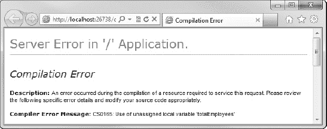

***图 3-1。**使用未赋值的局部变量会导致错误。*

我们可以通过下面的方法在声明时初始化一个变量:

`int totalEmployees = 100;`

这段代码用值 100 初始化我们的`totalEmployees`整数。我们可以通过赋值来改变这个变量的值。在本例中，我们将雇员人数增加一倍:

`totalEmployees = 200;`

 **注意**当你阅读这些代码示例时，请记住 C#是区分大小写的语言。因此，编译器会将名为`totalEmployees`和`TotalEmployees`的两个变量视为完全独立的实体。同样的区分大小写适用于所有 C#的关键字和标识符。

#### 命名标识符

关于标识符的命名，C#有一些严格的规则要遵循(变量名、方法名、类名等)。).命名标识符时，必须遵循以下规则:

*   标识符必须以字母或下划线开头
*   它必须只包含非格式化的 Unicode 字符(即字母、数字和符号)
*   标识符不得包含任何空格
*   它不能是 C#保留字(即，不能作为 C#语言的一部分使用的字)

一般来说，只要你只使用字母和下划线(以及第一个字符后的数字)来命名你的变量，并避免使用保留字(见[表 3-1](#tab_3_1) )，你就没问题。

T2】

为你的标识符选择一个好名字，比其他任何事情都更能提高代码的可读性。您应该始终努力使用一个以清晰简洁的方式描述标识符确切用途的名称。

总是努力以这样一种方式创建你的程序，即另一个开发人员可以拿起你的代码并容易地理解它——当你在你的站点上实现新的功能时，那个程序员很可能就是你。如果一个变量被命名为`totalPrice`或`shippingAddress1`比被命名为`t, x,`或`sa1`更容易记住(或算出)变量的用途。

 **提示**在 http://msdn.microsoft.com/en-us/library/ff926074.aspx.[的微软开发者网站上可以找到一组关于 C#编码约定(包括命名约定)的指南](http://msdn.microsoft.com/en-us/library/ff926074.aspx)定义一组编码约定有助于为您的代码创建一致的外观和感觉，这将极大地提高可读性，有助于未来的开发和调试。如果你是开发团队的一员，这一点尤为重要。

在接下来的几节中，我们将看看 C#中内置的一些不同类型，并看看它们的一些用法示例。

#### 布尔值

布尔值是所有 C#中最简单的。NET 类型，因为它们只能保存两个值中的一个:`true`或`false`。它们是使用关键字`bool`声明的:

`bool isAuthorized = true;
bool messageRead = false;

...

messageRead = true;`

 **注意**与 C 和 C++等语言不同，C# `bool`类型不允许使用 0、1 或–1 等整数表达式来设置 true 或 false 值。`true`和`false`关键字内置于 C#语言中，它们是编译器唯一接受的用于分配给布尔变量的值。

#### 数字

C#中的数值类型分为两种不同的类别——整型和浮点型。整数类型只能保存整数值(即没有小数部分的整数)，而浮点类型保存表示为指定有效位数的实数。

##### 整数类型

在处理和存储整数时，C#有八种单独的整数类型可供使用。之所以需要这么多不同的整数类型，主要是因为需要大量的内存来存储和操作每个变量。表 3-2 详细显示了这一点。

T2】

你可以从[表 3.2](#tab_3_2) 中看到，web 服务器需要八倍多的空间来保存一个`long`或`ulong`而不是一个`byte`或`sbyte`。因此，您应该始终确保尽可能使用大小合适的类型(即，选择具有保存任何可能值所需的最小大小的类型)，就像在设计数据库时选择最小的可用字段类型一样。

 **注意**这将变得越来越重要，因为你的网站聚集了用户，当成千上万(甚至上万)的浏览器向你的服务器请求页面时，性能就成了一个问题。与几年前相比，计算机内存和磁盘空间是便宜的，但是浪费它们是没有意义的！

关于优化网站性能的更多信息，请看第 12 章中的‘使用缓存提高性能’一节。

与任何其他 C#类型一样，整型变量是通过使用相关关键字和有效标识符的赋值来声明的。如前所述，所有类级别的数值类型都默认为`0`(零)，但是总是指定一个初始值(称为初始化)被认为是一个好的实践。所有局部变量在使用前都必须初始化。

`int variance = -1000;
byte studentCount = 20;
long numberOfBacteria = 0;`

##### 浮点类型

C#提供了三种专门设计用于处理浮点数的类型；`float`、`double`、`decimal`(见[表 3-3](#tab_3_3) )。

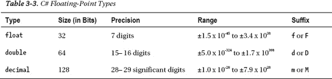

决定使用`decimal`还是`double`的主要因素是精度或范围的优先级。double 类型的范围最大，而 decimal 类型的范围更精确，这使它成为一个很好的选择，特别是对于舍入误差可能成为问题的金融计算。

每个浮点类型都有一个文字后缀，用于确保编译器在计算表达式时使用预期的类型。为了避免相关的——通常很难发现——错误和错误，您应该始终使用适当的后缀。这有一个额外的好处，那就是可以自我记录代码以供将来参考。浮点变量的声明和初始化如下:

`float totalVolume = 46524.23f;
double calculationsPerSecond = 6984725.389277d;
decimal jackpot = 145678289.42m;`

浮点值也可以使用指数符号来指定。这使得程序员可以比在数字中使用大量零更容易地描述极大或极小的数字，尽管需要在精度上进行权衡:

`float averagePopulation = 6.43e35f;
double mass = 3.42e-108d;
decimal annualSales = 93883992e11m;`

##### 数字转换

在任何可能发生数据丢失的情况下，C#编译器都会对数值类型的转换进行约束。所有整型都可以隐式转换为任何其他整型，其中要转换为的类型的范围大于要转换为的类型的范围。例如，从`byte`到`short`的转换是隐式的，因为`short`类型的变量可以包含`byte`类型变量的每个可能值:

`byte hoursWorked = 105;
short totalHours = hoursWorked;`

然而，在相反的方向上(即从一个短字节到一个字节)，需要进行显式转换。这是通过将类型名放在赋值前的括号中来实现的；一种称为铸造的动作:

`short hoursWorked = 105;
byte totalHours = (byte)hoursWorked;` 

这告诉编译器，即使在`totalHours`的情况下变量类型的范围较小，也可以将`hoursWorked`变量的值强制转换为`totalHours`。如果没有这种类型转换，编译器将显示图 3-2 中的错误:

***图 3-2。**不兼容类型之间的隐式转换会产生编译错误*

 **注意**在进行铸造操作时，你需要小心，以确保你要铸造的类型能够完全保持预定值。如果原始值有可能超出预期类型的允许范围，您应该在转换之前实现代码来检查该值，以避免超出范围的错误或意外值(这绝对是调试的噩梦)。

从`float`到`double`的隐式转换是允许的，因为不会丢失任何信息。然而，从`double`到`float`以及到/从`decimal`类型的转换必须使用显式强制转换来执行:

`//float to double - implicit conversion permitted
float deviation = 9378239.2872f;
double totalDeviation = deviation;` `//double to float requires explicit cast
double xPosition = 1.4e37d;
float totalXMovement = (float)xPosition;

//float or double to/from decimal requires explicit cast
decimal departmentalProfit = 2993899.28m;
double totalProfit = (double)departmentalProfit;`

**代码注释**

向代码中添加注释可以极大地提高您和其他开发人员的可读性。C#有两种标准的注释类型；单线和多线。

`     // This is a single-line comment

     /* This is
        a multi-line
        comment */`

如果需要对复杂的代码区域提供清晰的解释，或者代码被修改，就应该添加注释。然而，注释不应该被用来替代清晰、简洁的代码。不必要的复杂代码应该被重构以提高其可读性。

整数类型可以隐式转换为浮点类型，只要这两种类型的范围兼容。但是，从浮点类型到整数的转换必须总是显式强制转换。

 **提示**有关 C#中的造型的更多信息，请访问微软开发者网站上 C#编程指南的造型和类型转换部分:[http://msdn.microsoft.com/en-us/library/ms173105.aspx](http://msdn.microsoft.com/en-us/library/ms173105.aspx)

#### 字符串

C#中有两种内置类型，专门用于保存文本或字符串值；`char`和`string`。`string`类型保存一系列 Unicode 字符，而`char`类型只能保存一个字符。

要存储在`char`类型中的值必须用单引号括起来:

`char department = 'B';` 

分配给`string`类型变量的值必须用双引号括起来:

`string firstName = "Steve";`

字符串和字符也可以包含 Unicode 转义序列来表示其他有用的格式化指令；这些前面有一个反斜杠。在[表 3-4](#tab_3_4) 中可以看到更常见的转义序列列表:

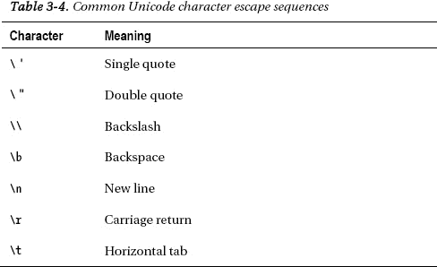

因此，将以下文件路径表示为字符串:

`C:\Users\Steve\Documents\My Web Sites\Hello World\default.cshtml`

您必须转义所有反斜杠字符，如下所示:

`string filePath = "C:\\Users\\Steve\\Documents\\My Web Sites\\Hello World\\default.cshtml";`

或者，您也可以使用`@`符号创建一个逐字的字符串文字。通过在字符串文字前放置`@`符号，您可以指示编译器忽略 Unicode 转义序列:

`string filePath = @"C:\Users\Steve\Documents\My Web Sites\Hello World\default.cshtml";`

##### ToString()

C#中的所有数据类型，包括 int 和 float 等 C#内置类型，都是从一个名为`Object`的基类派生的，这使得它们能够共享一些通用功能。ToString()方法就是这样一个函数，它返回调用该方法的值的字符串表示形式。例如:

`int numberOfUsers = 1253;
string userCount = numberOfUsers.ToString();` 

当创建一个字符串文字输出到一个包含一些计算出的数值或布尔值的屏幕时，这个方法特别有用。

##### 弦。()格式()

`String.Format()`方法用于将值插入到字符串中。使用花括号中包含的编号占位符，可以将任意数量的值插入到原始字符串中:

`int numberOfUsers = 1253;
string userCountMessage = String.Format("There are currently {0} users logged 
into the system", numberOfUsers);`

注意，`String.Format()`方法的使用不需要对要插入的值调用`ToString()`方法。

##### 字符串长度

在编写网站程序时，确定字符串的长度通常很有用。例如，您可能希望检查指定的用户名包含的字符是否超过了设定的数量。这可以通过访问字符串的`Length`属性来实现，该属性返回一个`int`:

`string username = "stevelydford";
int usernameLength = username.Length;  // usernameLength = 12`

##### 改变大小写

有两种方法可以改变字符串中字母的大小写；`ToUpper()`和`ToLower()`。下面的例子取名字“Steve”和姓氏“LYDFORD”，并创建一个名为`fullName`的新变量，其中包含格式化文本“Lydford，Steve”。

`string firstName = "Steve";
string lastName = "Lydford";
string fullName = String.Format("{0}, {1}", lastName.ToUpper(), firstName);`

##### 其他有用的字符串方法

字符串还有很多其他的方法。我们将在这里快速浏览一些最有用的。

 **注**如前所述，本章仅作为“入门指南”，而非详尽的手册。要了解更多关于 C#的信息，我推荐访问位于[http://msdn.microsoft.com/en-us/library/67ef8sbd.aspx](http://msdn.microsoft.com/en-us/library/67ef8sbd.aspx)的微软开发者网络(MSDN) C#编程指南

`Replace()`方法允许轻松替换全部或部分字符串:

`string welcome = "Welcome to my world!";
string newWelcome = welcome.Replace("my", "your");      // Becomes "Welcome to your world!"`

`Trim()`方法删除字符串开头和结尾的所有空格:

`string noPadding = "   My Web Site    ".Trim();         // noPadding contains "My Web Site"` 

还有一些方法可以单独删除字符串末尾的空格；`TrimStart()`和`TrimEnd()`。

要访问字符串的特定部分，可以使用`Substring()`方法。您需要告诉该方法从哪个字符开始(其中 0(零)是第一个字符)以及需要多少个字符。

`string title = "Microsoft WebMatrix";
string shortTitle = title.Substring(10, 9);             // shortTitle contains "WebMatrix"`

在这一节中，我们要考虑的最后一个字符串方法与字符串内的搜索相关- `StartsWith()`、`EndsWith()`、`Contains()`和`IndexOf()`。下面的代码示例演示如何使用这些方法以及这些方法的结果:

`string movieTitle = "Star Wars Episode V: The Empire Strikes Back";

bool startsWithStar = movieTitle.StartsWith("Star");    // Returns true
bool endsWithBack = movieTitle.EndsWith("back");        // Returns false (case-sensitive)
bool containsEmpire = movieTitle.Contains("Empire");    // Returns true
int indexOfEpisode = movieTitle.IndexOf("Episode");     // Returns 10`

`endsWithBack`变量包含 false，因为默认情况下，本例中描述的所有方法都是区分大小写的。`IndexOf()`方法报告一个或多个字符的字符串在指定变量中第一次出现的从零开始的索引。如果在指定的变量中找不到该字符串，则返回–1。

##### 串联和 StringBuilder

可以使用字符串连接运算符`+`连接或联结字符串，如下所示:

`string firstString = "abcdefg";
string secondString = "hijklmn";
string thirdString = firstString + secondString;      // thirdString contains "abcdefghijklmn"`

在下面的代码中，`+=`操作符用于将文本追加到原始字符串的末尾，这样可以节省创建变量来保存第二个和第三个值的开销(如果这适合程序的话)(`name`变量的原始值在此操作之后将不再可用):

`string name = "Steve";
name += " Lydford";         // name contains the value "Steve Lydford"`

C#字符串是不可变的，这意味着对象的内容一旦被创建和初始化就不能被改变。我们看到的对字符串执行操作的方法实际上是在内存中创建新的字符串对象。当我们执行一个动作时，比如一个`Replace()`或者单个连接，这通常不是问题。但是，假设您正在遍历 500，000 条记录，并将每条记录的值连接成一个字符串；由于在内存中创建了成千上万的冗余字符串对象，性能在这里很可能成为一个问题。在涉及不止一个或两个连接的情况下，应该使用 StringBuilder 类来确保网站不会出现性能下降。

StringBuilder 非常好用。您只需创建一个新的 StringBuilder 实例，它可以选择性地包含字符串的第一部分，然后根据需要调用`Append()`方法进行连接。下面的示例演示了 StringBuilder 类的正确用法:

`StringBuilder sb = new StringBuilder("The quick");
sb.Append(" brown");
sb.Append(" fox jumps");
sb.Append(" over the");
sb.Append(" lazy");
sb.Append(" dog");
sb.Append('.');`

StringBuilder 对象`sb`现在包含文本“敏捷的棕色狐狸跳过了懒惰的狗”并且没有创建冗余的字符串对象。

当我们添加完 StringBuilder 对象后，我们可以使用 ToString()方法将它转换回字符串:

`string message = sb.ToString();`

#### 日期和时间

日期和时间在 C#中由 DateTime 类型表示。日期和时间非常复杂，在日常开发中会出现许多问题，尤其是在时区和夏令时(DST)方面。那个。NET 框架提供了极好的工具来处理这些复杂性，尽管它们超出了本章的范围(见下面的注释)。

 **注意**MSDN 对这个话题的报道非常出色，可以在[http://msdn . Microsoft . com/en-us/library/system . datetime(v = vs . 100)找到。aspx](http://msdn.microsoft.com/en-us/library/system.datetime(v=VS.100).aspx)

在尝试任何复杂的日期时间代码之前，我强烈建议阅读这里提供的信息。

实例化一个`DateTime`的通常方法如下:

`DateTime appointment = new DateTime(2012, 9, 3, 10, 30, 00);`

这将创建一个`DateTime`对象，并将其初始值设置为 10:30:00(2012 年 9 月 3 日十点三十零秒)。给`DateTime`对象分配日期和时间的另一种方法是通过它的`Parse()`方法，使用标准格式的日期和时间:

`DateTime start = DateTime.Parse("31/08/2011 14:25:00");`

 **注**我的电脑设置为使用英国默认日期格式(dd/MM/yyyy HH:mm:ss)。根据您的 Windows 设置，您的电脑可能会给出不同的结果。

当从输入控件(文本框、下拉列表等)中存储的值填充`DateTime`对象时，该方法非常有用。)在网页上和来自外部数据源，我们将在本书后面看到。

让我们快速查看一些常见的`DateTime`方法和属性，从`Now`属性开始，我们在[第 2 章](02.html#ch2)中使用它来为我们的 Hello World 应用程序提供当前的日期和时间。

`DateTime currentDateTime = DateTime.Now;`

除了常用的`ToString()`方法之外，`DateTime`对象还有许多以各种格式输出字符串的方法:

`DateTime start = DateTime.Parse("31/08/2011 14:25:00");

string dateTime1 = start.ToString();                    // 31/08/2011 14:25:00
string dateTime2 = start.ToLongDateString();            // 31 August 2011
string dateTime3 = start.ToLongTimeString();            // 14:25:00
string dateTime4 = start.ToShortDateString();           // 31/08/2011
string dateTime5 = start.ToShortTimeString();           // 14:25`

我们还可以通过访问以下属性来检查`DateTime`的各个部分:

`DateTime dateJoined = DateTime.Parse("22/11/2009 18:02:24");

string dateElements = String.Format("Year: {0} Month: {1} Day: {2} " +
                                    "Hours: {3} Mins: {4} Secs: {5} " +
                                    "Milliseconds {6} Day of Week: {7} Day of Year: {8}",
                                    dateJoined.Year,
                                    dateJoined.Month,
                                    dateJoined.Day,
                                    dateJoined.Hour,
                                    dateJoined.Minute,
                                    dateJoined.Second,
                                    dateJoined.Millisecond,
                                    dateJoined.DayOfWeek,
                                    dateJoined.DayOfYear           // Days since 1st Jan
   );`

输出:

`Year: 2009 Month: 11 Day: 22 Hours: 18 Mins: 2 Secs: 24 Milliseconds 0 Day of Week: Sunday Day of Year: 326`

最后，我们可以使用各种`Add()`方法对`DateTime`对象执行基本的加法操作。减法可以通过传递一个负整数来实现:

`DateTime arrival = new DateTime(2011, 02, 24, 09, 30, 42);   // 24/02/2011 09:30:42

DateTime newArrivalYear = arrival.AddYears(1);               // 24/02/2012 09:30:42
DateTime newArrivalMonth = arrival.AddMonths(4);             // 24/06/2011 09:30:42
DateTime newArrivalDay = arrival.AddDays(-20);               // 04/02/2011 09:30:42
DateTime newArrivalHour = arrival.AddHours(2);               // 24/02/2011 11:30:42
DateTime newArrivalMinute = arrival.AddMinutes(-30);         // 24/02/2011 09:00:42
DateTime newArrivalSecond = arrival.AddSeconds(-2);          // 24/02/2011 09:30:40`

### 运算符

C#提供了一系列内置的操作符，允许我们对文字和变量执行许多操作。在本章中，我们将把常见的、更有用的操作符分成几个部分。

#### 算术运算符

顾名思义，算术运算符允许我们对数值变量和文字执行数学运算(见[表 3-5](#tab_3_5) )。

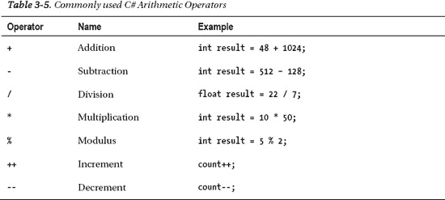

所有操作符都可以用来操作变量和文字。因此，以下示例中的两个结果变量包含相同的值 25。

`int result1 = 100 / 4;

int operand1 = 100;
int operand2 = 4;
int result2 = operand1 / operand2;`

加、减、除和乘操作符是不言自明的，除非说它们服从操作符的优先级。运算符优先级规定，在同一个表达式中，乘法运算符(`*`和`/`)将先于任何加法运算符(`+`和`-`)进行计算，如果不加以考虑，这可能会产生一些令人惊讶的结果。可以通过使用括号来强制计算顺序，括号内的表达式在其他表达式之前被计算。

`int result1 = 3 + 2 * 4;      // Result = 11
int result2 = (3 + 2) * 4;    // Result = 20`

模数运算符返回第一个操作数除以第二个操作数的余数。

`int result1 = 32 % 20;           // Result = 12
int result2 = 15 % 2;            // Result = 1`

递增和递减运算符只是将数值增加或减少 1。运算符的计时取决于它出现在操作数的哪一侧。如果它出现在操作数之后，称为后递增/递减运算符，则先计算值，然后递增/递减。如果运算符出现在操作数之前，称为预递增/递减运算符，则值在计算之前会递增或递减。下面的代码示例演示了这一点:

`// Post-increment operator
int operand1 = 10;
int result1 = operand1++;        // result1 = 10; operand1 = 11

// Pre-increment operator
int operand2 = 20;
int result2 = ++operand2;        // result2 = 21; operand2 = 21

// Post-decrement operator
int operand3 = 30;
int result3 = operand3--;        // result3 = 30; operand3 = 29

// Pre-increment operator
int operand4 = 40;
int result4 = --operand4;        // result4 = 39; operand4 = 39`

#### 赋值运算符

C#支持许多赋值操作符，用于给变量赋值。[表 3-6](#tab_3_6) 详细说明了其中最常用的:

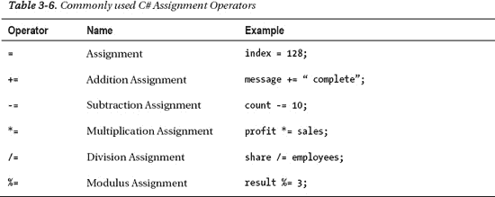

让我们快速看一下这些操作符的例子，以便更好地理解它们的行为。

赋值操作符只是给一个变量赋值，就像我们在本章前面的例子中看到的那样。要赋值的值可以是文字，也可以是另一个变量的值:

`int score1 = 10;
int score2 = score1;`

加法赋值运算符将指定的值与原始值相加:

`decimal totalProfit = 100.00m;
decimal sales = 40.50m;
totalProfit += sales;            // totalProfit is now 140.50`

此代码相当于:

`decimal totalProfit = 100.00m;
decimal sales = 40.50m;
**totalProfit = totalProfit + sales;**           // totalProfit is also 140.50 here`

正如我们之前看到的，加法赋值运算符也可以与字符串变量一起使用来连接它们:

`string user = "stevelydford";
user += "@example.com";             // user contains text stevelydford@example.com`

减法、乘法、除法和模数赋值运算符的工作方式与您预期的类似。

`int result = 100;

result -= 50;                          // result = 50
                                       // Equivalent to: result = result - 50;

result *= 10;                          // result = 500;
                                       // Equivalent to: result = result * 10;

result /= 20;                          // result = 25;
                                       // Equivalent to: result = result / 20;

result %= 3;                           // result = 1;
                                       // Equivalent to: result = result % 3;`

这些运算符不适用于字符串变量。

#### 相等运算符

两个 C#相等运算符简单地比较两个值是否相等，并根据结果返回布尔值`true`或`false`。正如你将在本章后面看到的，当测试变量的条件和循环时，这些操作符被广泛使用。[表 3-7](#tab_3_7) 描述了两个等式运算符:

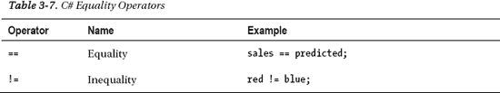

在下面的代码示例中，我们可以看到等式和不等式运算符的作用:

`int first = 10;
int second = 20;
int third = 30;

bool result1 = first == second;                // false
bool result2 = first + second == third;        // true

bool result3 = first != second;                // true
bool result4 = first + second != third;        // false`

#### 关系运算符

关系运算符允许我们将一个值与另一个值进行比较。[表 3-8](#tab_3_8) 显示了常用的关系运算符:

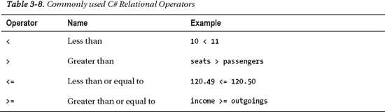

同样，关系运算符的结果总是布尔值:

`int first = 10;
int second = 20;
int third = 20;

bool result1 = first > second;                // false
bool result2 = first < second;                // true

bool result3 = second > third;                // false
bool result4 = second >= third;               // true

bool result5 = (first + second) > third;      // true`

#### 条件运算符

我们将在本章讨论的最后三个运算符被称为条件运算符(见[表 3-9](#tab_3_9) )。

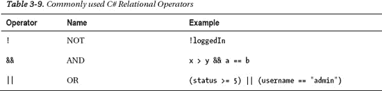

NOT 运算符用于对其操作数求反。换句话说，只有当它的操作数为假时，它才会返回布尔值`true`。

`bool isLoggedIn = false;
bool showLoginScreen = !isLoggedIn;             //true`

对于一个条件和评估为真，**双方的**论点必须为真。如果参数的**任一方**或双方的计算结果为布尔值`true`，条件 OR 将返回 true。

`int first = 10;
int second = 20;
int third = 20;

bool result1 = first < second && second == third;             // true
bool result2 = first > second && second == third;             // false

bool result3 = first < second || second == third;             // true
bool result4 = first > second || second == third;             // true
bool result5 = first > second || second != third;             // false`

注意，如果条件和的第一部分返回假值，则第二部分永远不会被计算。同样，如果条件 OR 的第一部分返回 true，则不会计算第二部分。

### 收藏

在 C#中，集合是一种以索引方式保存数据的数据结构，以便于存储和检索。它可以被认为是一组可以单独访问的相关变量；示例可能包括考试成绩的集合或班级注册的姓氏列表。集合不再需要单独的变量来存储每个值，并且大多数集合都提供了非常简化的方法来执行集合整体上的常见操作，如排序、迭代等。

C#程序员可以使用许多不同类型的集合。正如我之前提到的，这一章的设计是为了给你一个语言的工作知识，足够让你继续阅读这本书的其余部分，所以我们在这里只讨论最常用的集合类型。

#### 数组

数组是一个简单的集合，包含几个相同类型的值。集合被索引(从零开始的整数索引)，并且通过指定所需元素的索引，可以单独访问数组的每个元素。

包含五个元素的一维数组可以声明如下:

`string[] names = new string[5];`

为了给每个元素赋值，我们可以使用索引来引用它们(注意从零开始的索引):

`names[0] = "John";
names[1] = "Bob";
names[2] = "Tom";
names[3] = "Bill";
names[4] = "Jack";`

如果我们想在声明数组的同时初始化它，我们可以使用一种更短的替代语法。下面两行演示了两种类型的简明语法，它们是等效的:

`string[] names = new string[] {"John", "Bob", "Tom", "Bill", "Jack"};

string[] names = {"John", "Bob", "Tom", "Bill", "Jack"};`

可以用类似的方式检索每个元素的值，通过引用其索引来指定所需的元素，如下例所示:

`bool isBob = names[1] == "Bob";             // isBob is true`

数组也可以是多维的，因为它们可以保存几组元素。假设您想在一个数组中保存下面的度量表:

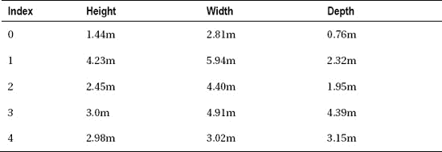

保存此数据的二维数组有 5 行 3 列，定义如下:

`float[,] measurements = new float[5,3];`

要引用表格中的每个单元格，可以使用行的索引，后跟列的索引。例如:

`measurements[0, 0] = 1.44f;
measurements[0, 1] = 2.81f;
measurements[0, 2] = 0.76f;
measurements[1, 0] = 4.23f;
measurements[1, 1] = 5.94f;
measurements[1, 2] = 2.32f;
measurements[2, 0] = 2.45f;
measurements[2, 1] = 4.4f;
measurements[2, 2] = 1.95f;
measurements[3, 0] = 3.0f;
measurements[3, 1] = 4.91f;
measurements[3, 2] = 4.39f;
measurements[4, 0] = 2.98f;
measurements[4, 1] = 3.02f;
measurements[4, 2] = 3.15f;`

或者，您可以使用以下快捷语法之一:

`float[,] measurements = { { 1.44f, 2.81f, 0.76f },
                          { 4.23f, 5.94f, 2.32f },
                          { 2.45f, 4.4f, 1.95f },
                          { 3.0f, 4.91f, 4.39f },
                          { 2.98f, 3.02f, 3.15f }
                        };

float[,] measurements = new float[5,3] { { 1.44f, 2.81f, 0.76f },
                                         { 4.23f, 5.94f, 2.32f },
                                         { 2.45f, 4.4f, 1.95f },
                                         { 3.0f, 4.91f, 4.39f },
                                         { 2.98f, 3.02f, 3.15f }
                                       };`

C#也支持交错数组。交错数组类似于多维数组，但每行可以包含不同数量的列；它们通常被称为数组的数组。有关阵列的更多信息，请访问位于 http://msdn.microsoft.com/en-us/library/9b9dty7d.aspx 的 MSDN 网站。

要获得数组维数的大小，可以访问数组的`Length`属性。此属性保存指定维度中的列数。例如，在我们之前声明的`measurements`数组中，我们有三列。

`int columnCount = measurements.Length;        // columnCount = 3`

可以使用 array 对象的`Sort()`方法对数组进行排序。为了对之前的 names 数组进行排序，我们将使用以下代码:

`Array.Sort(names);`

这将数组中的元素排列成字母数字序列，在本例中是:Bill，Bob，Jack，John，Tom。这里值得注意的是，与前面描述的字符串方法不同，数组方法实际上是改变原始数组，而不是进行复制。

我们可以通过调用`Array.Reverse()`方法来反转数组的元素:

`Array.Reverse(names);`

我们的排列顺序是相反的:汤姆，约翰，杰克，鲍勃，比尔。

有两种方法可用于查找数组中的元素；`IndexOf()`和`LastIndexOf()`。`IndexOf()`返回一个整数，该整数包含与指定搜索对象匹配的数组中第一个元素的索引；`LastIndexOf()`返回最后一个匹配元素的索引。

`int jacksIndex = Array.IndexOf(names, "Jack");        // jacksIndex = 2`

关于数组，我想说的最后一件事是 IndexOutOfRange 异常。如果试图访问数组边界之外的数组元素，将会生成此异常。例如，下面一行:

`float boxSize = measurements[1, 6];`

将导致 WebMatrix 显示以下错误页面([图 3-3](#fig_3_3) ):

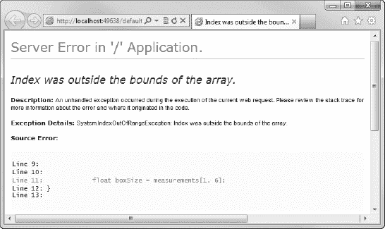

***图 3-3。**an index outofrange exception error page*

 **注**数组的搜索和排序功能已经在很大程度上被 LINQ(语言集成查询)取代。我们将在第 6 章的[中讨论 LINQ——处理数据。](06.html#ch6)

#### 通用系列-

泛型是在 2.0 版中引入到 C#中的，它是作为 Visual Studio 2005 的一部分于 2005 年出现的。它们是一种定义类型安全数据结构的方法，在运行时之前不需要提交数据类型。C#中的泛型是一个庞大的主题，可以很容易地占据它自己的一章，但是这里我们只对基础感兴趣。我们将看看两个常用的内置泛型集合——List 和 Dictionary——它们可以很好地处理大多数情况，以及 var 关键字。最后，我们将简要讨论 IEnumerable 接口，以及它如何帮助我们与泛型集合进行交互。

 **注意**我们还将在本章后面的面向对象编程部分讨论泛型。

##### 列表

泛型列表在功能上与数组非常相似(事实上，它是由一个数组在幕后支持的)，但是有许多有用的附加特性，使它对程序员更加友好。

查看泛型列表的最佳方式是查看一些代码，所以让我们声明我们的列表。当我们提到`List<T>,`时，`T`代表类型。我们只需要告诉`List<T>`我们希望创建什么类型的列表，因为它是一个通用列表记住，我们在尖括号内做:

`List<string> cars = new List<String>();`

我们也可以通过传递花括号中的值，在声明点用项初始化列表，就像我们对数组所做的那样。

`List<string> cars = new List<String>() { "Ferrari", "Aston Martin" };`

所以现在编译器知道我有一个名为`cars`的字符串列表。我可以通过调用`Add()`方法并向其传递我想要添加的字符串来将项目添加到列表的末尾。请记住，列表现在是强类型的字符串列表，所以如果我传入一个不能隐式转换为字符串的值，我将收到一个错误。

`cars.Add("Lamborghini");
cars.Add("Porsche");`

这段代码展示了`List<T>`相对于`Array`的主要优势之一。我们从来没有告诉编译器列表应该有多大——这根本不重要。与数组不同，数组的大小是在声明时设定的，`List<T>`可以随时调整大小——事实上这个过程对程序员来说几乎是不可见的；可以随意添加和删除项目。

要获得元素的当前数量，使用`Count()`方法。这是元素的数量，而不是最后一个元素的索引(应该是`Count() -1`):

`int carsCount = cars.Count();        // carsCount = 4`

要删除一个项目，调用`Remove()`方法:

`cars.Remove("Lamborghini");`

与数组一样，也可以使用索引来访问项:

`string myCar = cars[0];       // myCar = "Ferrari"`

或者，更常见的情况是，使用语言集成查询(LINQ)。我们将在第 6 章介绍 LINQ——处理数据。

##### 字典

通用字典存储键/值对。当我们声明它时，我们需要告诉编译器键的类型和值的类型:

`Dictionary<string, decimal> prices = new Dictionary<string, decimal>();`

同样，我们可以使用快捷语法在声明时初始化字典:

`Dictionary<string, decimal> prices = new Dictionary<string, decimal>()
                                                     {
                                                         { "Bread", 1.20m },
                                                         { "Soup", 1.50m },
                                                         { "Butter", 0.95m },
                                                         { "Milk", 1.90m }
                                                     };`

我们还可以使用`Add()`方法向字典中添加条目:

`prices.Add("Orange Juice", 2.60m );`

现在，为了检索项目，我们可以简单地通过它们的键来引用它们:

`decimal priceOfMilk = prices["Milk"];          // priceOfMilk = 1.90`

与`List<T>,`一样，我们可以使用`Count()`方法找出字典中的元素数量，并且我们可以使用`Remove()`方法从字典中删除条目:

`prices.Remove("Butter");
int numberOfPrices = prices.Count;          // numberOfPrices = 4`

##### var 关键字

声明 C#泛型的语法可能会非常冗长。拿一个现实的字典声明来说:

`Dictionary<string, List<float>> measurements = new Dictionary<string, List<float>>();`

我们在这里可以看到，声明的大部分仅仅是类型的重复。`var`关键字允许我们通过指示编译器推断类型来大大缩短这个过程:

`var measurements = new Dictionary<string, List<float>>();`

这使得代码更加简洁易读。只要编译器能够从等号的右边推断出类型，那么就可以使用`var`关键字。

虽然最初实现它是为了处理引入泛型所需要的非常长的声明，但是`var`关键字可以在任何类型声明中使用。以下内容同样有效:

`var surname = "Lydford";
var pricePerHour = 25.99m;
var count = 3;
var myArray = new string[12];`

注意，当使用`var,`时，变量必须在声明时初始化，因为它的类型没有在右边明确指定。编译器在编译时使用这个初始值的类型来推断变量的实际类型。

##### 不计其数〔t0〕

`IEnumerable<T>`不是泛型集合的类型；相反，它是一个接口，定义了许多用于与集合交互的动作，最重要的是迭代的能力。`IEnumerable<T>`接口要求任何实现它的通用集合提供一组核心功能。`List<T>`和`Dictionary<TKey, TValue>`都实现了`IEnumerable<T>`，这意味着，连同其他几个有用的函数，我们能够使用 C# `foreach`循环迭代集合(我们将在本章后面看到)。

这种被迭代的能力将在本书的后面变得非常重要，当我们继续在我们的网页上显示动态数据时(见[第 6 章](06.html#ch6) -处理数据)。

### 条件

条件有时被称为控制或选择语句。它们是程序的一部分，允许我们在运行时根据基于特定值的决策分支到单独的逻辑序列。

C#有三个主要的条件语句——`if…else`、`switch,`和`try…catch`——我们现在来看看每一个。

#### 如果…否则

`if`语句根据布尔表达式的计算选择一个分支来执行。虽然不是强制性的，但它通常与`else`语句一起使用，以便在`if`语句的计算结果为`false`时提供一个替代的程序流。

要执行的代码必须放在代码块中(即，在一对大括号内)。这告诉编译器要执行的代码从哪里开始和结束。

`var loggedIn = false;
var message = "";

if (loggedIn)
{
    message = "User logged in successfully.";
}
else
{
    message = "User login failed.";
}`

这里通常使用条件运算符来计算多个表达式:

`var loggedIn = true;
**var membershipValid = true;**
var message = "";

**if (loggedIn && membershipValid)**
{
    message = "User logged in successfully.";
}
else
{
    message = "User login failed.";
}`

多个`if`语句可以根据需要相互嵌套，尽管应该注意确保可读性不受影响。

`var count = 15;
var message = "";

if (count > 10)
{` `    if (count < 20)
    {
        message = "Count is more than 10 but less than 20";
    }
    else
    {
        message = "Count is 20 or more";
    }
}
else
{
    message = "Count is 10 or less";
}`

如果需要的话，`else if`可以用来处理多种情况，尽管在许多情况下，使用`switch`语句可以更好地处理这种情况，我们将在下一节中讨论这一点。

`int role =2;
string username = "Steve";
string securityLevel = "";

if ((role == 4) && (username == "Steve"))
{
    securityLevel = "Developer";
}
else if (role == 3)
{
    securityLevel = "Administrator";
}
else if (role == 2)
{
    securityLevel = "Moderator";
}
else if (role == 1)
{
    securityLevel = "Member";
}
else
{
    securityLevel = "Guest";
}`

**三元运算符**

C#语言提供了三元运算符，以提供一种清晰、简洁的方式来编写`if...else`语句，其中单个表达式的计算取决于条件的结果。三元运算符采用以下形式:

`condition ? first_expression : second_expression`

这里，如果条件评估为`true,`，则评估表达式`first_expression`；否则，程序将评估`second_expression`。下面是一个使用三元运算符的示例:

`int i = 18;
string message = (i > 10) ? "Greater than 10" : "10 or less";`

这段代码的结果是`message`变量被设置为“大于 10”的值。

#### 开关

switch 语句用于根据多个可能的值对表达式求值，并在需要时将程序控制传递给其中的一个 case 语句。以下代码评估`primaryColor`字符串变量的值，并相应地执行代码:

`var primaryColor = "red";
var hexValue = "";

switch (primaryColor)
{
    case "blue":
        hexValue = "#0000FF";
        break;
    case "red":
        hexValue = "#FF0000";
        break;
    case "green":
        hexValue = "#00FF00";
        break;
    case "yellow":
        hexValue = "#FFFF00";
        break;
    default:
        hexValue = "#FFFFFF";
        break;
}`

在本例中，`hexValue`变量将被设置为“#FF0000”。

`break`关键字停止执行`switch`语句，并将程序流程转移到下一条语句。任何不符合`case`语句的`primaryColor`值都由`default`代码块处理。

`switch`语句可以处理任意数量的情况，但是不能有两种情况具有相同的值。除此之外，每个`case`实例只能有一个值。然而，通过使用多个没有`break`的`case`语句，您可以获得相同的结果:

`var animal = "lizard";
var animalType = "";

switch (animal)
{
    case "dog":
    case "cat":
    case "cow":
        animalType = "Mammal";
        break;
    case "eagle":
    case "hawk":
    case "sparrow":
        animalType = "Bird";
        break;
    case "lizard":
    case "snake":
        animalType = "Reptile";
        break;
    default:
        animalType = "Unknown";
        break;
}`

执行结束时，变量`animalType`保存字符串“爬虫”。

 **注意**在每个非空 case 分支的末尾必须有一个 break 语句；否则，将会出现编译错误。

#### 试着…抓住

`try..catch`块基本上是对编译器说，“试着执行这段代码，如果它失败了，在这里捕捉异常并执行这段代码。”在 C#中是这样的:

`var sports = new List<string> {"Football", "Cricket", "Rugby", "Golf"};
var output = "";

try
{
    output = sports[7];` `}
catch(Exception e)
{
    output = "Try block failed - " + e.Message;
}`

执行此示例时，try 块失败，因此执行 catch 块。这将引发异常，并将异常消息连接到输出，在本例中显示为:`“Try block failed – Index was out of range. Must be non-negative and less than the size of the collection. Parameter name: index”`

值得注意的是，这是一个旨在解释 try 用法的表面例子...接住滑轮。实际上，我们会在试图访问数组中的元素之前编写代码来检查索引是否有效。

 **注意**我们将在[第 12 章](12.html#ch12)—高级 WebMatrix 中更深入地研究错误处理和`try..catch`。

`try..catch`块有另一个代码构造，叫做`finally`。`finally`程序块被放置在`catch`程序块之后，并且无论`try`程序块是否失败，都一直运行。这是放置用于释放资源(例如，数据库连接或文件流)的代码的有用位置。

`var output = "";

try
{
    output += "Executing try statement. ";
}
catch (Exception e)
{
    output += "Executing catch. ";
}
finally
{
    output += "Executing finally.";
}`

这个例子执行后的输出值是，`“Executing try statement. Executing finally.”`然而，如果由于某种原因`try`块失败了，而`catch`块正在运行，那么`finally`内的代码仍然会被执行。

### 循环

循环是一种代码构造，旨在允许一条语句或一系列语句多次执行。C#语言规定了四种不同类型的循环——`while`、`do`、`for,`和`foreach`——我们将在这里依次讨论。

#### while 循环

`while`循环是一个条件控制循环，它在循环开始时测试条件，并在条件为真时继续迭代。正如前面看到的`if`和`try…catch`语句一样，要执行的代码放在一对大括号中。

`int count = 1;
string message = "";

while (count <= 10)
{
    message += count + " ";
    count++;
}`

循环完成所有循环后，消息的字符串值将为“`1 2 3 4 5 6 7 8 9 10`”。

 **注意**在上面的例子中，注意每次执行循环体时，整数`count`都会递增，使用语句`count++;`

如果我们未能在每次迭代中增加整数`count`,循环的条件将总是被评估为真，并且循环将继续运行。换句话说，我们会有一个无限循环。

如果不满足初始条件，循环体内的代码将永远不会运行，如下例所示:

`int studentIndex = 0;

while (studentIndex > 10)
{
    // This will never be run
    studentIndex++;
}`

**退出循环**

您可以使用`break`关键字指示运行时在任何时候退出任何 C#循环。当遇到`break`关键字时，程序的控制权直接传递给循环外的下一条语句。

如果您只需要退出循环的一个特定迭代，您可以使用`continue`关键字。当运行时遇到一个`continue`语句时，只要循环上的任何条件仍然满足，程序就直接进入下一次迭代。

#### do 循环

`do`循环也是一个条件循环，其工作方式与`while`相似，只是条件是在循环结束时进行评估的。这意味着，与`while`循环不同，`do`循环体中的代码总是至少执行一次。

`var recordCount = 0;
var output = "";

do
{
    output += recordCount + " ";
    recordCount++;
} while ( recordCount < 10 );`

在这个例子中，在循环成功完成之后，`output`字符串的值被设置为“`0 1 2 3 4 5 6 7 8 9`”。

#### for 循环

`for`循环遍历一系列语句，直到指定的表达式的值为布尔值 false。`for`循环通常用于遍历数组(即访问数组维度中的每个元素)或执行顺序处理。

下面的示例迭代整数数组，每个值加 10:

`int[] values = {1, 2, 3, 4, 5, 6, 7, 8, 9, 10};

for (int i = 0; i < values.Length; i++)
{
    values[i] += 10;
}`

让我们更详细地看看这个。首先，`for`循环声明一个循环计数器变量 I，并将其初始化为 0:

`for (**int i = 0;** i <= values.GetUpperBound(0); i++)`

然后，当`i`的值小于或等于数组中最后一个索引号(在本例中为 9)时，花括号内的代码执行:

`for (int i = 0; **i <= values.GetUpperBound(0);** i++)`

每次循环迭代时,`i`的值都会按照指定进行更改。在这种情况下(在大多数常见的场景中)，我们只需使用 increment 运算符给它加一:

`for (int i = 0; i <= values.GetUpperBound(0); **i++**)`

当测试评估为假时，即索引`i`不再小于或等于数组的上限时，执行停止，程序控制转移到循环外的下一条语句。

因此，如果条件最初被评估为`true`，则 for 循环代码块中的语句可能根本不会执行。

例如，在下面的代码中，循环的内容永远不会被执行:

`int minimum = 5;
int maximum = 5;

for (int i = minimum; i < maximum; i++)
{
    // Code in here will never be executed...
}`

#### foreach 循环

`foreach`循环可用于轻松迭代任何实现了`IEnumerable`或`IEnumerable<T>`接口的集合。这意味着它可以用来迭代数组和我们之前看到的泛型集合；`List`和`Dictionary`。

事实上，迭代集合的能力是我们继续讨论 WebMatrix 时最常使用`foreach`循环的原因。它非常适合使用 Razor 迭代数据库查询的结果，以显示在 ASP.NET 的网页上。

下面的例子展示了如何使用一个`foreach`循环遍历一个通用列表:

`var cities = new List<string>() {"London", "Paris", "New York", "Seattle", "Sydney"};
var output = "";

foreach (var city in cities)
{
    output += city + " ";
}`

一旦`foreach`循环完成迭代，字符串变量`output`的值就是`"London Paris New York Seattle Sydney"`。

 **提示**不能在使用`foreach`循环迭代的集合中添加或删除项目。如果您需要执行该功能，必须使用一个`for`循环来实现。

### 面向对象编程

本节将只提供面向对象编程(OOP)的一个非常基本的介绍，因为对 OOP 的全面深入的研究已经超出了本书的范围(并且很容易完成)。我将非常简要地概述 OOP 背后的指导原则，以及如何使用 C#来实现它们，但由于篇幅所限，我只能做非常简要的概述。

如果你希望获得比我在这里所能传授的更多的关于 OOP 和 C#的知识，你应该考虑看看 Adam Freeman 的书，Apress.com 的《C#入门》。

#### 原则和术语

中 OOP 支持背后的三个核心原则。NET 框架是封装、抽象、继承和多态。

封装是将程序实体的所有相关属性、方法和数据包含到一个单元或类中。封装的类隐藏了其内部实现，而是向外界公开一系列方法和属性来提供其功能。这种公开外部方法和属性而隐藏对象内部工作的过程称为抽象。通过遵循抽象和封装的原则，类的内部实现可以改变，而不会影响其他对象使用它的方式。

继承的原则描述了基于现有类创建新类的能力。新创建的类将自动继承基类的所有成员(构造函数除外)，并且还可以定义额外的成员。在允许的情况下，继承的类可以重写基类的成员并指定其他成员。

多态性是指创建具有多种形式的类或方法的能力。基于这些类和它们的成员方法创建的对象可以互换使用，即使它们可能有非常不同的实现。C#中的多态性通常是通过使用接口来实现的。例如，许多实现单个接口的类都必须实现该接口指定的一组方法和属性，但是每个类都可以用自己的方式实现。这意味着我们可以安全地在我们的程序中互换使用任何实现接口的类。

。NET 语言，如 C#和 VB.NET，完全支持这三个面向对象的原则。

##### 类别和对象

类都是关于封装的——它们是描述一个对象的一堆相关数据和功能。一个类可以被描述为一种对象的蓝图或规范，而从该规范创建的对象被称为该类的一个实例。当我们在 C#中创建一个对象时，我们称之为实例化。

使用`class`关键字定义一个类，在 WebMatrix 中，在一个单独的类文件中定义，文件扩展名为. cs，可从“新建文件”对话框中选择。

`class Person
{
}`

然后可以使用关键字`new`实例化基于该类的对象:

`var employee = new Person();
var customer = new Person();`

这些对象是`Person`类的独立实例，对一个实例的更改不会影响同一类的任何其他实例。

##### 字段和属性

类的字段和属性描述了它持有和使用的数据。定义字段只需在类的顶层声明一个变量:

`class Person
{
    **public DateTime DateOfBirth;**
}`

注意，在字段声明之前有一个关键字`public`。这称为访问修饰符，用于确定谁和什么可以访问该字段。在这种情况下，访问修饰符`public`意味着任何其他代码都可以直接读取或设置`DateOfBirth`字段的值。表 3-10 列出了 C#中不同的访问修饰符:

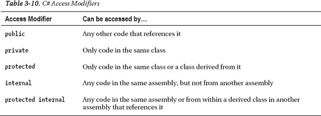

这些访问修饰符可以附加到类及其所有成员字段、属性和方法上。

属性有`get`和`set`方法，提供对底层数据字段的访问。这些方法允许您确定如何设置或返回值，并在必要时验证这些值。这是很好的编程实践，因为底层数据字段不能在类外部直接访问。因此，它们是在类外公开数据的首选方式。通常在内部使用的类中有一个私有字段，用一个属性控制从外部对它的访问:

`class Person
{
    public DateTime DateOfBirth;
**    private string _surname;**

    **public string Surname**
    **{**
        **get { return _surname; }**
        **set { _surname = value; }**
    **}**
}`

set 方法通过使用一个名为`value`的隐藏参数来访问要写入的数据。

通过省略`get`或`set`语句，可以将属性设置为只读或只写。由于属性的实现是如此普遍，一个更简洁的语法可用于创建属性，它处理私有字段的创建和幕后的基本逻辑。

`class Person
{
    public DateTime DateOfBirth;

**    public string Surname { get; set; }**
}`

现在，一旦 Person 类型的新对象被实例化，就可以在代码中访问 Surname 属性:

`var student = new Person();
student.Surname = "Smith";
string surnameInitial = student.Surname.Substring(0, 1);       //surnameInitial = "S"`

或者，可以在实例化期间使用对象初始值设定项来设置对象的字段和属性的值:

`var student = new Person { Surname = "Smith" };
var employee = new Person { DateOfBirth = new DateTime(1976, 5, 20), Surname = "Williams"};`

##### 方法

方法是可以由对象执行的动作。使用以下格式定义方法:

`*[access modifier] [return type] MethodName ([parameters]) { }*`

访问修饰符必须是[表 3-10](#tab_3_10) 中详述的值之一。返回类型描述作为方法结果返回的类型。如果方法不返回结果，返回类型应该指定为`void`。

可以在方法名后的括号中指定逗号分隔的参数列表。如果该方法不需要传递任何参数，括号应该留空。方法还可以访问类中的所有成员，如字段、属性和其他方法。

下面的代码示例声明了两个方法。名为`GetFullName()`的方法不带参数，返回一个字符串。`AgeAtDate()`方法接受单个`DateTime`参数并返回一个双精度值。

`class Person
{
    public DateTime DateOfBirth;

    public string Surname { get; set; }
    **public string Forenames { get; set; }**

    **public string GetFullName()**
    **{**
        **var fullName = String.Format("{0} {1}", Forenames, Surname);**
        **return fullName;**
    **}**

    **public double AgeAtDate(DateTime calculationDate)**
    **{**
        **double ageInDays = (calculationDate - DateOfBirth).TotalDays;**
        **return ageInDays / 365.25;**
    **}**
}`

这些方法可以从代码中调用，如下所示:

`var student = new Person();
student.Surname = "Smith";
student.Forenames = "Joe";
student.DateOfBirth = new DateTime(1990, 1, 1);

string fullName = student.GetFullName();        // Returns “Joe Smith”
double age = student.AgeAtDate(DateTime.Now);   // Returns age at current date`

只要具有不同的参数类型或参数数量，就可以声明两个同名的方法，这就是所谓的重载。

可选参数的定义也是可能的。可选参数必须在参数列表的末尾定义，它们需要设置一个默认值，该值必须是常数。如果参数没有专门传递给方法，则使用默认值。

`public void exampleMethod (int requiredInteger, string optionalString = “default”)`

##### 构造函数

构造函数是一种特殊类型的方法，每次实例化对象时都会调用它。构造函数通常用于初始化对象的成员字段和属性。构造函数中的代码保证在类中任何其他代码之前运行，并且与任何其他方法一样，它们可以选择性地接收参数并被重载。构造函数不能用返回类型声明，即使是 void 也不行。

要将方法定义为构造函数，只需将方法命名为包含它的类。构造函数定义也可以包含参数。下面的代码示例显示了无参数和参数化构造函数的示例:

`public class Vehicle
{
    public Vehicle()    // Parameterless Constructor
    {
        // Add initialization code here...
    }

    Public Vehicle(string color)    //Parameterized Constructor
    {
        // Add initialization code here...
    }
}`

##### 事件和代表

事件是一个类成员，用于通知其他类或对象特定事件的发生。虽然一个事件是一个有效的 C#类成员，但是 ASP.NET 网页并没有使用它们，所以在这里包含它们仅仅是为了完整性。关于处理和引发事件的更多信息可以在[http://msdn.microsoft.com/en-us/library/edzehd2t.aspx.](http://msdn.microsoft.com/en-us/library/edzehd2t.aspx)找到

委托是使用关键字`delegate`声明的，在事件驱动编程中最常用于事件，尽管它们本身也有一些用途。委托本质上是一种只定义方法签名的类型，该方法签名可以提供对任何其他具有兼容签名的方法的引用。这对于将方法作为参数传递给其他方法很有用。与活动一样，代表很少出现在 ASP.NET 的网页上，但更多信息可以通过 http://msdn.microsoft.com/en-us/library/ms173171.aspx.[的 MSDN](http://msdn.microsoft.com/en-us/library/ms173171.aspx.)找到

##### 静态类和成员

静态成员是一个类的所有实例共享的成员。例如，标记为 static 的属性表示应用于整个类的单个值，而不是每个对象的单独值。

下面的代码示例将字段`BookingCount`声明为静态，并使用构造函数方法在每次从该类实例化一个对象时递增其值:

`public class Booking
{
    public static int BookingCount { get; private set; }

    public Booking()
    {
        BookingCount++;
    }
}`

现在，每当创建一个新的类型为 Booking 的对象时，`BookingCount`字段就会增加。我们可以通过引用类名来检查`BookingCount`的值。

`var booking1 = new Booking();
var booking2 = new Booking();
var booking3 = new Booking();

int totalBookings = Booking.BookingCount;     // Returns 3`

整个类也可以被标记为静态的。静态类只能有静态成员，不能实例化。

`public static class Conversions
{
    public static double kilogramsToPounds(double kg)
    {
        return (kg * 2.2d);
    }

    public static double poundsToKilograms(double pounds)
    {
        return (pounds / 2.2d);
    }
}`

要从代码中调用静态方法，我们只需引用类名，后面跟着使用标准的方法名。网点符号:

`double weightInPounds = Conversions.kilogramsToPounds(100d);
double weightInKilos = Conversions.poundsToKilograms(100d);`

##### 遗产

在 OOP 中，继承描述了基于现有的类类型定义一个新的类类型的原则，并具有修改和扩展其行为的能力。新类型继承的类称为基类，从基类继承的类称为派生类。

在下面的示例中，Circle 类派生自 Shape 类，并通过添加 Circumference 属性扩展了其功能。我们使用冒号(`:`)后跟基类名称，让编译器知道我们是从哪个基类派生的:

`public class Shape
{
    public double Width { get; set; }
    public double Height { get; set; }
    public string FillColor { get; set; }
}

public class Circle : Shape
{
    public double Circumference { get; set; }
}`

根据基类成员的访问修饰符，从 Circle 类实例化的对象可以访问 Circle 和 Shape 类的所有成员。要指定一个类不能用作基类，必须在类定义中使用`sealed`关键字:

`public sealed class Shape { }`

要指定一个类只能用作基类而不能被实例化，可以使用`abstract`关键字:

`public abstract class Shape { }`

##### 命名空间

命名空间只是组织类的一种方式，它们在 C#中被广泛使用，部分原因是由于。NET 框架基础类库。命名空间的使用允许开发人员将他们的类组织到一个逻辑结构中，并有助于防止类名的重复。

在本例中:

`WebMatrix.Data.Database.Open("myDB");`

`WebMatrix.Data`是一个名称空间，`Database`是该名称空间中的一个类。`Database`类有一个接受字符串参数的静态`Open()`方法。

当在您自己的项目中创建类时，您可以使用`namespace`关键字在您自己的名称空间中组织它们:

`namespace Geometry
{  
    public class Shape
    {
        public double Width { get; set; }
        public double Height { get; set; }
        public string FillColor { get; set; }
    }
}`

shape 类的`Height`属性现在可以这样访问:

`Geometry.Shape.Height = 22.9d;`

如果我们想在整个代码中使用来自`Geometry`名称空间的类，而不是每次都指定它，我们可以使用`using`关键字。然后，我们将能够直接访问该名称空间中的类:

`@using Geometry;

var hexagon = new Shape();`

##### 接口

接口是其他类必须遵守的契约。接口是定义属性、方法和事件的独立实体，但不提供实现，也不能实例化。实现接口的类必须实现所有这些属性、方法和事件。接口的目的是确保实现它的所有类公开同一组公共成员，尽管它们的具体实现可能不同。

我们在本章早些时候讨论`IEnumerable<T>`时简要提到了接口。`IEnumerable<T>`是一个接口(按照惯例，所有接口名称都以大写字母 I 为前缀),它定义了其他代码构造能够枚举并迭代一组数据所需的成员集。例如，`foreach`循环将只接受实现这个接口的类型(或者它的非泛型等价类型`IEnumerable`)。

你用关键字`interface`定义一个接口。所有成员都是在没有实现的情况下声明的:

`interface IVehicle
{
    // Properties
    string manufacturer { get; set; }
    string model { get; set; }

    // Methods
    void Move(int x, int y);
}`

一个类可以通过使用我们用来表示继承的冒号来声明它实现了一个接口。实现类必须至少包含接口中指定的每个成员的实现，尽管可以添加其他成员:

`public class SportsCar : IVehicle
{
    private string _manufacturer;
    private string _model;
    private int _currentXPosition;
    private int _currentYPosition;

    public string manufacturer
    {
        get { return _manufacturer; }
        set {_manufacturer = value; }` `    }

    public string model
    {
        get { return _model; }
        set { _model = value; }
    }

    public void Move(int x, int y)
    {
        _currentXPosition += x;
        _currentYPosition += y;
    }
}`

##### 匿名类型

C#中的匿名类型提供了一种快速创建对象的方法，这些对象封装了一组只读属性，而无需编写显式的类定义。编译器自动生成一个类，它只包含你在初始化器中定义的属性。由于对象的类型不是预定义的，匿名类型必须使用`var`关键字声明:

`var motorcycle = new { Manufacturer = "Honda", Year = 2010, Mileage = 1569.3d };`

##### 无商标消费品

我们在本章前面已经看过泛型集合，这是它们最常见的用法，但是泛型也可以应用于方法和类型。当我们想要声明一个类，但是将类型的指定推迟到运行时类或方法被实例化时，这是很有用的。我们可以通过使用泛型类型参数`<T>`来实现这一点。考虑下面的类定义:

`public class GenericClass<T>
{
    public T GenericField;
}`

使用泛型类型参数`T`允许我们在运行时指定确切的类型。下面两行代码同样有效，它们基于相同的泛型类声明和实例化对象:

`var generic1 = new GenericClass<string>();
var generic2 = new GenericClass<int>();`

只要类型参数出现在类定义中，所选类型就会被替换:

`generic1.GenericField = "Indiana Jones";
generic2.GenericField = 1024;`

#### OOP 结论

好了，我们的 C#面向对象编程之旅到此结束。请记住，这只是一个非常简短的介绍，旨在帮助您理解本书其余部分中的代码示例。我强烈推荐进一步阅读面向对象的主题，因为它是 C#中一切的基础。

### 动力学

C#动态类型允许开发人员绕过编译时类型检查，而是将类型解析的责任交给动态语言运行时(DLR)。动态在 ASP.NET 网页中被广泛使用，并且是标准数据访问策略的核心。

动态变量本质上可以存储任何值，并且在构建过程中不会被编译器检查；DLR 将在运行时处理类型的解析。对于习惯于在强类型、类型安全环境(如 C#)中编程的人来说，下面的代码可能看起来有点奇怪，但它是有效的代码，可以成功编译和运行:

`dynamic myDynamic = "hello";
myDynamic = 2.94e-56d;
myDynamic = DateTime.Today.Year;`

这种存储任何类型的能力使得它们非常适合在集合中使用，在集合中，您不必在每个索引中存储相同的数据类型。下面的代码将进一步演示这一点:

`var myList = new List<dynamic>();

myList.Add(DateTime.Now);
myList.Add("This is a string");
myList.Add(29.45f);
myList.Add(new Dictionary<string, double>());`

这里我们有一个通用的动态列表，可以存储任何有效的。NET 数据类型。这个概念在 ASP.NET 的网页中被广泛使用，我们将在后面的章节中多次重温。

#### 扩展对象()

关于 C#中的动力学，我想谈的最后一件事是名字非常酷的`ExpandoObject()`类。`ExpandoObject()`位于`System.Dynamic`命名空间中，允许您创建一个对象，该对象可以在运行时动态添加和删除其成员。下面的代码创建一个名为 product 的 ExpandoObject，并在运行时添加四个成员:

`dynamic product = new System.Dynamic.ExpandoObject();

product.Name = "Widget";
product.Description = "The best widget money can buy!";
product.Price = 2.99m;
product.StockID = 92102;`

expand objects 甚至可以包含其他 expand objects 作为成员:

`using System.Dynamic;

dynamic product = new ExpandoObject();
product.Name = "Widget";
product.Description = "The best widget money can buy!";
product.Price = 2.99m;
product.StockID = 92102;

product.Dimensions = new ExpandoObject();
product.Dimensions.Height = 42;
product.Dimensions.Width = 96;`

在一个通用字典中使用一个通用字典可以达到同样的整体效果，但是代码很快就会变得非常难看，难以阅读。`ExpandoObject()`提供优雅高效的解决方案。

### 总结

在这一章中，我们已经对 C#编程语言有了一个非常快速的介绍。很好地理解本章概述的概念将使你具备足够的知识，能够理解本书其余部分的所有代码。

请记住，本章仅仅触及了 C#语言和。NET 框架。随着你在 ASP.NET 网页经验的增长，你对 C#的知识和理解也会增长。如果你认为自己是一个称职的 WebMatrix 开发人员，深入的 C#工作知识是必不可少的