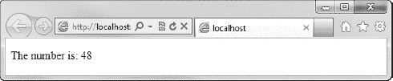
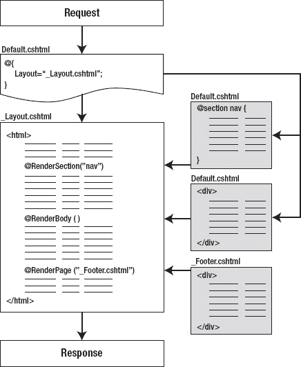

## T1】C H A P T E R 4

## 使用剃刀和 ASP.NET 网页

在第 2 章的“Hello World”应用中，Razor、C#和 ASP.NET 网页被用来轻松执行相对复杂的服务器端任务。现在你已经有了 C#的基础知识，无论是从经验还是从上一章，是时候更深入地了解一下 Razor 和 ASP.NET 的网页了。

C#、Razor 和 ASP.NET 网页完美地结合在一起，为创建复杂的动态网页创建了一个极其强大的框架。在这一章中，我们将探讨这个框架的一些特性，这些特性旨在提供一种轻量级的、快速的、可伸缩的方式来构建 web 应用。本章涵盖的主题包括:

*   Razor 语法
*   布局
*   助手
*   功能
*   保持状态
*   统一资源定位器(URL)和路由

### Razor 语法

Razor 是一种简单易用但功能极其强大的编程语法，用于将服务器端代码插入到网页中。当你创建一个新的 ASP.NET 网页。CSHTML 或者。VBHTML)在 WebMatrix 中，您正在创建一个具有两种完全独立的内容类型的文件:客户端和服务器端。ASP.NET 网页的客户端内容可以包含普通 HTML 页面中常见的任何代码和标记，包括 HTML、JavaScript 和 CSS。服务器端内容包含用 C#(或 VB)编写的对 web 服务器的指令。NET)，用于创建动态内容并与其他资源(如数据库和文件系统)进行交互。

服务器端代码被直接插入到客户端内容的页面中；使用 Razor 语法是告诉 web 服务器客户端内容在哪里结束，服务器端内容在哪里开始，反之亦然。

Razor 最常见的用途是动态创建 HTML 和其他客户端内容。当 IIS 收到对. CSHTML 或。VBHTML 页面它将其识别为 ASP.NET 网页，执行任何标有 Razor 语法的服务器端指令，然后将生成的页面返回给浏览器。

 **注意**Razor 语法实际上是为 WebMatrix 发明的。然而，事实证明，它在开发人员中非常受欢迎，并且比以前的语法有了很大的改进，因此它现在也成为了 ASP.NET MVC 的默认视图引擎。

#### 添加一行服务器端代码

使用`@`符号可以将一行服务器端代码添加到 ASP.NET 网页中。代码与客户端内容(如 HTML 等)一起添加。，并由 web 服务器自动识别和处理，在需要时用相关的动态内容替换 Razor 代码，例如

`
The current date and time is: @DateTime.Now
`

解析器对 C#语法有深入的了解，这使得它能够识别 C#语句的结束和 HTML 的开始。

当以这种方式使用单行表达式时，输出将直接呈现在页面上。如果这一行服务器端代码是用来执行一些其他功能的，而不是用来显示的，那么您可以通过用一对花括号将语句括起来来通知解析器，从而创建一个语句块。这可以在下面的代码中看到

`@{ var PageTitle = "My Home Page"; }

<!DOCTYPE html>

<html lang="en">
    <head>
        <meta charset="utf-8" />
        <title>@PageTitle</title>
    </head>
    <body>
        <h1>@PageTitle</h1>
        
The current date and time is: @DateTime.Now

    </body>
</html>`

代码和 HTML 标记的混合将输出结果，如图 4-1 所示。

***图 4-1。**Razor 代码和 HTML 结合的结果。*

就浏览器而言，服务器返回的是普通的旧 HTML，与普通的静态页面没有什么不同。以下代码是上一个示例中返回给浏览器的 HTML。

`<!DOCTYPE html>

<html lang="en">
    <head>
        <meta charset="utf-8" />
        <title>My Home Page</title>
    </head>
    <body>
        <h1>My Home Page</h1>
        
The current date and time is: 07/07/2011 01:18:41

    </body>
</html>`

Razor 中最后一种单行表达式称为多标记语句。这里，您希望输出是页面的结果，但是需要预先计算表达式中的多个项。多标记表达式的语法是将表达式括在括号中。在本例中，两个整数变量相乘，然后输出。

`
The number is: @( 12 * 4 )
`

该代码的结果见[图 4-2](#fig_4_2) 。

***图 4-2。**在多标记语句中执行的计算的结果。*

#### 添加更复杂的代码

可以使用多语句块添加多行 C#代码。与行内表达式不同，代码块中的每一行代码，无论是单语句还是多语句，都必须以分号结束。以下代码显示了一个多语句块的示例。

`@{
    var movies = new List<string>();
    movies.Add("The Shawshank Redemption");
    movies.Add("The Godfather");
    movies.Add("The Godfather: Part II");
    movies.Add("The Good, the Bad and the Ugly");
    movies.Add("Pulp Fiction");
}`

为了显示保存在`movies`列表中的数据，您可以使用一个`foreach`循环来遍历集合并将每一项输出到一个 HTML 列表中。这实际上是一个非常有用的模式，因为由 IIS 发出并发送到浏览器的页面将只包含一个简单的 HTML 无序列表，这意味着设计人员可以很容易地使用 CSS 样式来实现所需的外观。[图 4-3](#fig_4_3) 显示了返回给浏览器的未样式化的 HTML 页面。

***图 4-3。**页面中呈现的非风格化的 HTML 列表。*

实现这一点的 Razor 代码非常有趣；让我们来看看吧。

`@{ var PageTitle = "My Movies Page"; }

@{
    var movies = new List<string>();
    movies.Add("The Shawshank Redemption");
    movies.Add("The Godfather");
    movies.Add("The Godfather: Part II");
    movies.Add("The Good, the Bad and the Ugly");
    movies.Add("Pulp Fiction");
}` `<!DOCTYPE html>

<html lang="en">
    <head>
        <meta charset="utf-8" />
        <title>@PageTitle</title>
    </head>
    <body>

        <h1>@PageTitle</h1>

        <ul id="movies">

            @foreach (var movie in movies)
            {
                <li>@movie</li>
            }

        </ul>

    </body>
</html>`

您可以在这里看到，由于它对 C#语言的语义了解，Razor 能够识别出`foreach`循环中的`<li>`和`</li>`实际上是 HTML 标记，应该与局部变量`movie`的值一起输出到页面。

还要注意，Razor 将花括号`{  }`识别为`foreach`循环的开始和结束，不需要在标记中添加额外的`@`字符。这是对许多其他语法的巨大改进，有助于创建具有良好可读性的代码。例如，您刚刚使用 Razor 创建的、使用传统 ASP `<% ... %>` Web Forms 语法编写的同一个页面的主体将如下所示

`<body>

    <h1><%= PageTitle %></h1>

    <ul>

        <% foreach (var movie in movies)
        } %>
            <li><%= movie %></li>
        <% } %>

    </ul>

</body>`

即使在这个简单的九行代码的例子中，您也可以看到 Razor 语法在可读性和易于编码方面提供了多大的改进。

**评论**

正如在第 3 章中提到的，给你的代码添加注释会极大地提高你和其他开发者的可读性。Razor 只有一种类型的注释，可以以单行或多行的方式使用。

`        @* This is a Razor comment. *@

        @*
            This is a multi-line
            Razor comment.
        *@`

与直接在 HTML 中进行的评论不同，Razor 评论不会发送到浏览器，用户也无法查看。

#### 混合起来

有时候,`@`符号并不是用来标识紧跟其后的文本为服务器端代码的标记。以电子邮件地址为例。

`
Please contact support@example.com
`

Razor 解析器足够聪明，能够识别出这是一个电子邮件地址，因为它会评估符号`@`右侧的文本，以确定它是否是一个有效的 C#代码。它还能识别电子邮件地址的结束和代码的开始。下面的代码将电子邮件地址呈现为纯文本，将`telephoneNumber`变量呈现为代码。

`@{ var telephoneNumber = "01632 567890"; }

Please contact support@example.com or @telephoneNumber
`

在绝大多数情况下，Razor 的工作方式与您预期的完全一样。一旦你用了几次，你会发现它成了你的第二天性，你会不假思索地使用它。然而，在一些边缘情况下，Razor 解析器可能会以开发人员最初不希望的方式解释标记。为了解决这个问题，有几种方法可以向解析器阐明您的意图。

如果一个`@`符号打算在页面上显示，但也是有效的代码，你可以用`@@`对`@`符号进行转义。

`@{ var stevelydford = "me"; }

Follow me on twitter: @@stevelydford
`

如果您在服务器端代码块中嵌套了一个客户端内容块，那么有必要将内容封装在一个 HTML 元素中，比如`
`、``或`
`，以便向 Razor 解析器阐明代码的意图。下面的例子演示了在一个`if ... else`语句中使用`
`标签的技术。

`@{ var loggedIn = false; }

<!DOCTYPE html>

<html lang="en">
    <head>
        <meta charset="utf-8" />
        <title>Example Page</title>
    </head>
    <body>
        @if (loggedIn)
        {
            

                <h1>Welcome</h1>
                The time now is:
                @DateTime.Now.ToShortTimeString() 
                Have a nice day!
            

        }
        else
        {
            

                <h1>Please Log In</h1>
                You are not currently logged in 
                to this site. Please log in or register.
            

        }
    </body>
</html>`

注意，在第一个`
`中也有一个单行表达式，使用符号`@`声明。

如果您希望将`if`语句中相关代码块的内容发送到浏览器，而不是将其包装在 HTML 元素中，您可以使用特殊的标签`<text>`。

`<text>
    <h1>Welcome</h1>
    The time now is:
    @DateTime.Now.ToShortTimeString() 
    Have a nice day!
</text>`

`<text>`标签不会被发送到浏览器，它的存在纯粹是为了在这些情况下帮助 Razor 解析器。在这个例子中，下面的 HTML 被发送到浏览器。

`<h1>Welcome</h1>
The time now is:
17:45 
Have a nice day!`

如果您只需要在一个代码块中输出一行内容，您可以使用`@:`操作符，而不是将它包装在`<text>`标签中。

`@if (loggedIn)
{` `    @:Welcome, user!
}
else
{
    @:Please log in or register.
}`

如果前面的代码示例中省略了@:操作符，网络服务器将显示以下错误页面(参见[图 4-4](#fig_4_4) )。

***图 4-4。**省略@:运算符时显示的错误消息。它们需要向 Razor 解析器提供澄清。*

 **提示**所有输出到浏览器的内容，使用 Razor，都是出于安全目的的 HTML 编码。这有助于防止跨站点脚本(XSS)攻击。这意味着保留的 HTML 字符被转换成它们在页面上显示的等价代码(例如，<符号被转换成& lt)。例如，如果您的页面包含以下代码

`@{
    var message = "You must be <a href='login.cshtml'>logged in</a> to use this site.";
}

@message
`

服务器将向浏览器发送以下编码的 HTML

`
You must be &lt;a href=&#39;login.cshtml&#39;&gt;logged in&lt;/a&gt; to use this site.
`

若要防止这种编码，请使用 Html。Raw()方法。

`@{
    var message = "You must be <a href='login.cshtml'>logged in</a> to use this site.";
}

@Html.Raw(message)
`

有关 XSS 攻击和 HTML 编码的更多信息，请参见第 5 章。

### 布局

当你的目标是提供良好的用户体验时，网站的外观和感觉是非常重要的；WebMatrix 有很多很棒的特性可以帮助你实现这一点。也许，其中最重要的一点是，服务器端 Razor 代码生成了干净的符合标准的 HTML，有能力的 web 设计人员可以使用 CSS 和他们已经熟悉的其他技术轻松地对其进行样式化。这一点的重要性怎么强调都不为过。多年来，许多 web 开发框架因产生非标准的客户端内容而饱受批评，这些内容很难甚至不可能在所有浏览器上保持一致。使用 Razor，您可以完全控制发送到用户浏览器的内容——没有“服务器控件”或“视图状态”,它们会在运行时将笨拙的 HTML、脚本和数据插入到页面中。

除了以一种非常可控的方式呈现干净的符合标准的内容之外，Razor 还能够创建布局模板，使指定的标记部分可以在整个站点中重用。

保持干燥

“不要重复自己”，通常被称为 DRY，是一个软件工程原则，旨在最小化，甚至完全消除重复工作。该原则指出，每一项知识都必须在系统中有一个单一的、明确的、权威的表示。这种方法有很多好处，包括减少初始开发时间、易于维护、测试和调试，以及提高在其他项目中重用代码和资产的能力。

如果一个系统已经完全实现了 DRY 方法，那么系统的任何组件的修改都不应该对任何不相关的部分产生影响。同样，任何更改都只需要进行一次——在单一的、明确的、权威的表示中。

每当你坐下来进行一个新系统的初始设计时，你应该始终把 DRY 原则放在你头脑的最前面。本节其余部分介绍的布局技术是一个很好的起点，因为它们有助于创建可以在整个站点中重用的标记部分。

大多数网站至少有一些内容显示在每个页面上。这有助于设计和用户体验的一致性。它可能包括页眉、页脚和导航等常见项目，以及特定于用户或应用的其他内容区域。当您使用 WebMatrix 时，可以将这些项目定义为模板，并在所有或选定的页面中重用它们。

#### 渲染()

第一种技术是使用`RenderPage()`方法，它可以帮助你在站点的多个地方重用内容。这个方法基本上获取站点中另一个文件的内容，通常称为部分页面，并在调用代码中放置`RenderPage()`方法的确切位置呈现它。一旦所有对`RenderPage()`的调用(以及你将在本章后面看到的其他布局方法)完成，完成的页面由 WebMatrix 组装并发送到客户端的浏览器。对客户来说，这个过程将是无缝的。

要完全理解使用 RenderPage()方法所涉及的步骤，最简单的方法是创建一个工作示例，所以继续启动 WebMatrix。IDE 加载后，创建一个新的“基于模板的站点”，选择“空站点”模板，并将其命名为“布局”。

首先，您需要一个页面来调用 RenderPage()方法。在工作区选择器中选择`Files`选项卡，并从功能区控件中选择新建新建文件。在“选择文件类型”对话框中选择 CSHTML，将页面命名为`Default.cshtml`，然后单击确定。

让我们给你的默认页面添加一些内容。

`@{ var PageTitle = "Layout Example"; }
<!DOCTYPE html>

<html lang="en">
    <head>
        <meta charset="utf-8" />
        <title>@PageTitle</title>
    </head>
    <body>
        <h2>@PageTitle</h2>
        
This is the main page content.

    </body>
</html>`

接下来，添加您的部分页面。web 开发人员之间的一个常见约定是，要在站点的多个页面之间共享的文件存储在一个名为 shared 的文件夹中。在导航窗格中，右键单击根文件夹(即布局)，并从上下文菜单中选择“新建文件夹”(参见[图 4-5](#fig_4_5) )。默认情况下，WebMatrix 会将文件夹命名为“新文件夹”，因此通过改写名称或右键单击并选择“重命名”，将其重命名为“共享”。

***图 4-5。**向您的站点添加新文件夹。*

在这个文件夹中添加两个新的 CSHTML 文件，分别命名为`_Header.cshtml`和`_Footer.cshtml`。

 **注意**默认情况下，WebMatrix 不会向客户端浏览器提供以前导下划线命名的页面。您可以利用这一点，因为您不希望用户无意中或以其他方式请求您的部分页面。

从`_Header.cshtml`中删除所有默认的 HTML 并替换为以下内容

`

    <h1>.: Company Logo :.</h1>
    

`

同样，删除`_Footer.cshtml`中 WebMatrix 自动创建的 HTML，用下面的内容替换。

`

    

    

        For all support enquiries, please contact
        <a href="mailto:support@example.com">support@example.com</a>
    

`

最后，您需要添加对`Default.cshtml`中的`RenderPage()`方法的调用，以便在您希望页眉和页脚出现的位置插入它们。您需要向`RenderPage()`方法传递您希望呈现的共享文件的确切位置和文件名。

`@{ var PageTitle = "Layout Example"; }
<!DOCTYPE html>

<html lang="en">` `    <head>
        <meta charset="utf-8" />
        <title>@PageTitle</title>
    </head>
    <body>

**        @RenderPage("/Shared/_Header.cshtml")**

        <h2>@PageTitle</h2>
        
This is the main page content.

**        @RenderPage("/Shared/_Footer.cshtml")**

    </body>
</html>`

当你运行页面时，你会看到页眉和页脚已经被插入(见[图 4-6](#fig_4_6) )。

***图 4-6。**使用 RenderPage()方法插入了共享页眉和页脚的默认页面。*

就浏览器而言，它刚刚被 WebMatrix 提供了一个单独的页面，如[图 4-7](#fig_4_7) 所述。

***图 4-7。**render page()进程。*

如果右键单击浏览器并选择“查看源代码”,您将看到以下代码。

`<!DOCTYPE html>

<html lang="en">
    <head>
        <meta charset="utf-8" />
        <title>Layout Example</title>
    </head>
    <body>
        

            <h1>.: Company Logo :.</h1>
            

        

        <h2>Layout Example</h2>
        
This is the main page content.

        

            

            
` `                For all support enquiries, please contact
                <a href="mailto:support@example.com">support@example.com</a>
            

        

    </body>
</html>`

 **提示**当从 WebMatrix IDE 运行站点时，它将总是尝试运行当前(或最近)在导航窗格中选择的页面。不幸的是，没有办法设置您希望默认运行的页面，因此您需要记住在单击 run 之前选择您希望查看的页面，特别是如果您已经编辑了一个不会呈现的文件，例如带有下划线前缀的部分页面或 CSS 文件。

或者，您可以在第一次运行后保持浏览器打开，而不是每次都从 WebMatrix IDE 中运行站点，只需保存 WebMatrix 中的所有页面(Ctrl + Shift + S)并刷新浏览器(在大多数浏览器中按 F5)以查看任何更改。

#### 布局页面

对于在多个页面中插入一个通用的用户界面(UI)来说，`RenderPage()`方法是很棒的，但是如果你想创建一个通用的全页面设计来用于你的站点呢？在这种情况下，一个好的解决方案是使用布局页面。

布局页面包含网页的模板。一旦定义了布局页面，您就可以创建内容页面，指定其布局继承自您的布局页面。每个布局页面都有一个对`RenderBody()`方法的调用，该方法获取内容并将其与布局页面合并。如果您以前使用过 ASP.NET WebForm，您会发现这与母版页中的内容占位符是一个类似的概念。

布局页面仍然可以包含 Razor 代码，以及对`RenderPage()`方法的调用，就像您在上一节中所做的那样。事实上，让我们修改现有的`Default.cshtml`来使用布局页面。

在名为`_Layout.cshtml`的共享文件夹中创建一个新文件，并修改生成的 HTML，如下所示

`<!DOCTYPE html>

<html lang="en">
    <head>
        <meta charset="utf-8" />
        <title>Layout Page Example</title>
    </head>
    <body>` `        @RenderPage("/Shared/_Header.cshtml")

        

            @RenderBody()
        

        @RenderPage("/Shared/_Footer.cshtml")
    </body>
</html>`

现在，打开`Default.cshtml`并修改它，如下所示

`@{
    Layout = "/Shared/_Layout.cshtml";
    var PageTitle = "Layout Example";
}

<h2>@PageTitle</h2>

This is the main page content.
`

请注意，在`Default.cshtml`中，您已经删除了所有页面级 html(head 标签、body 标签等)。)，因为它现在由布局页面提供。您所需要做的就是在定义任何标记之前，通过设置页面顶部的`Layout`属性来指定您希望使用的布局页面。在这种情况下，您已经将布局属性设置为等于布局页面的位置`"/Shared/_Layout.cshtml"`。布局页面然后生成对`RenderPage()`方法的进一步调用，以拉入页眉和页脚，完成的页面被发送到浏览器。[图 4-8](#fig_4_8) 显示了这个过程是如何工作的。

***图 4-8。**布局页面流程。*

这种情况下的最终结果将与之前在[图 4-5](#fig_4_5) 中看到的结果相同。但是，现在您可以继续创建任意数量的内容页面，所有这些都可以通过使用您的布局页面来为您的站点创建一致的外观。此外，如果您想在任何时候改变设计，您可以在布局页面中做一次，并立即反映在整个网站上。

#### RenderSection()

您可以在一个布局页面中标识多个内容部分，这在您想要设计具有多个可替换内容区域的布局时非常有用。这种技术包括使用`RenderSection()`方法命名布局页面中的部分，并在内容页面中为内容部分提供匹配的名称，如图[图 4-9](#fig_4_9) 所示。内容页面中的每个命名部分都包含在一个`@section`块中。

***图 4-9。**render section()过程。*

让我们用一个例子来演示这个过程。首先，修改您的布局页面以包含一些对`RenderSection()`的调用。这些是您将对`/Shared/_Layout.cshtml`进行的更改

`<!DOCTYPE html>

<html lang="en">
    <head>
        <meta charset="utf-8" />
        <title>**@RenderSection("title")**</title>
    </head>
    <body>
        @RenderPage("/Shared/_Header.cshtml")

        **
**` `            **@RenderSection("links")
        
**

        

            @RenderBody()
        

        @RenderPage("/Shared/_Footer.cshtml")
    </body>
</html>`

定义了称为`title`和`links`的两个新部分。现在你需要在你的内容页面(`Default.cshtml`)中定义这些部分，因为在当前状态下运行网站会产生如图[图 4-10](#fig_4_10) 所示的错误页面。

***图 4-10。**默认情况下，如果在布局页面中使用 RenderSection()方法定义，内容部分是必需的。*

 **注意**如果布局页面包含与内容页面不匹配的部分，WebMatrix 将产生错误，反之亦然。如果布局页面包含试图多次呈现同一部分的方法调用，它也会引发异常。

如何防止这种错误将在本节稍后讨论。现在，让我们将所需的部分添加到您的`Default.cshtml`页面中。

`@{
    Layout = "/Shared/_Layout.cshtml";
    var PageTitle = "**RenderSection Example**";
}

**@section title {
    @PageTitle
}

@section links {
    <ul>
        <li><a href="#">Home</a></li>
        <li><a href="#">Products</a></li>
        <li><a href="#">Clients</a></li>
        <li><a href="#">Contact Us</a></li>
    </ul>
}**

<h2>@PageTitle</h2>

This is the main page content.
`

现在当你运行页面时，内容被正确地呈现出来(参见[图 4-11](#fig_4_11) )。命名节块中的内容被呈现在相关的`RenderSection()`方法调用的位置，而`RenderBody()`调用获取未保存在命名节中的剩余内容。

***图 4-11。**内容正确呈现在命名部分中。*

#### 使截面可选

在 Layout.cshtml 中，注意`<title>`标签如何调用`RenderSection()`。这是一种特别有用的技术，因为如果没有它，页面的标题将在布局页面中设置，并且基本上是不可变的。类似地，在文档< `head>`标签中呈现一个部分也是有用的，这样内容页面就可以访问它们，或许可以注册一些特定于该页面的 CSS 或 JavaScript。但是，您不希望像这样的部分是强制性的，因为您可能不希望在每个场合都使用它们。要使该部分可选，您可以使用 C#命名的参数将`RenderSection()`方法的`required`参数设置为等于`false`，如下所示

`@RenderSection("head", required: false)`

#### 将数据传递到布局和部分页面

通常，您会要求布局或部分页面的实际呈现内容基于来自调用页面的一些上下文数据。这方面的例子包括根据在线商店中选择的类别显示产品列表，或者根据用户当前是否登录到站点显示不同的 UI。

为了实现这一点，您需要某种方式将数据从内容页面(即用户请求的页面)传递到相关的布局或部分页面。ASP.NET 网页通过提供内容页面的`PageData`属性来提供这一功能。`PageData`属性是在页面、布局页面和部分页面之间共享的 dictionary 对象，可用于根据需要传递数据。要从内容页面传递数据，只需向内容页面中的`PageData`属性添加一个键/值对，然后就可以从任何布局或被调用的部分页面访问它。这个过程如图 4-12 中的[所示。](#fig_4_12)

***图 4-12。**将数据传递给局部页面。*

创建一个名为 Default2.cshtml 的新页面。在这个页面的顶部，向`PageData`字典添加一个值。下面的代码实际展示了这种技术。

`@{
    PageData["user"] = false;
    var PageTitle = "PageData Example";
}

<!DOCTYPE html>

<html lang="en">
    <head>
        <meta charset="utf-8" />
        <title>@PageTitle</title>
    </head>
    <body>
        <h1>@PageTitle</h1>
        @RenderPage("/Shared/_User.cshtml")
    </body>
</html>`

接下来，在共享文件夹中创建一个名为`_User.cshtml`的部分页面。在这个部分页面中，检查`PageData["user"]`的值以决定是显示欢迎消息还是登录表单。

`@if (PageData["user"]) {
    

        <h2>Welcome!</h2>]
        <!-- More info about user here -->
    

}
else {
    

        <form method="post" action="login.cshtml">
            <h2>Login:</h2>
            

                <label for="username">Username: </label>
                <input type="text" name="username" />
            

            

                <label for="password">Password: </label>
                <input type="password" name="password" />
            

            

                <input type="submit" value="Login" />
            

        </form>
    

}`

存储在`PageData`字典中的键/值对不仅限于。NET 基元类型。`PageData`字典实际上被声明为

`IDictionary<object, dynamic>`

因此，常见的是自定义对象、通用集合等。在`PageData`字典中被传递。要了解这一点，请创建一个名为 Catalog.cshtml 的新页面，并修改默认标记以匹配下面的代码示例，该示例将类别的概念列表添加到`PageData`字典中。

`@{    
    var categories = new List<string>() { "Books", "Films", "Music", "Games", "Toys" };
    PageData["categories"] = categories;
}

<!DOCTYPE html>

<html lang="en">
    <head>
        <meta charset="utf-8" />
        <title>PageData Example</title>
    </head>
    <body>
        <h1>PageData Example</h1>
        @RenderPage("/Shared/_Categories.cshtml")
    </body>
</html>`

下列范例程式码显示名为 Categories.cshtml 的部分网页如何存取从呼叫网页传入的类别网页资料。

`

    <h2>Categories</h2>
    <ul>
        @{
            foreach (var category in PageData["categories"])
            {
                <li>@category</li>
            }
        }
    </ul>

`

这将输出呈现给浏览器，如图 4-13 中的[所示。](#fig_4_13)

***图 4-13。**使用 PageData 将通用列表传递给部分页面。*

### 帮手

助手是帮助你在网站设计中达到干燥的另一种方式。助手是一个定制组件，它可以以类似于方法调用的方式接收参数列表，并返回要在页面上呈现的 HTML(或任何类型的客户端内容)。

助手有大量的潜在用途。在本节的示例中，您将使用一个助手来显示一个通用的 UI，它提供了关于产品的信息。这是一个非常简单的例子，但实际上，帮助器可以包含您需要的任何标记和客户端或服务器端代码。在本书的例子中，你将广泛使用不同复杂度的助手。

助手(以及将在下一节介绍的功能)必须创建在网站根目录下的一个名为`App_Code`的文件夹中。这个文件夹名称是一个 ASP.NET 约定，它自动使其中的所有代码可用于应用的其余部分。`App_Code`文件夹可以包含子文件夹，子文件夹中的内容也可以被站点中的代码访问。

 **提示**有许多预先编写好的助手可供下载，你可以用它们来为你的网站添加功能。其中一些，包括推特、脸书和其他助手，将在第八章中详细讨论。

为了查看运行中的助手示例，您将使用空站点模板创建一个名为 HelperExample 的新站点。您需要将一个`App_Code`文件夹添加到您的网站的根目录，这可以通过右键单击导航窗格中的根文件夹并选择 New Folder 选项来完成。创建并命名文件夹后，右键单击它并选择“新建文件”。添加一个名为`ProductHelpers.cshtml`的 CSHTML 文件。你的导航窗格中的站点结构应该如图[图 4-14](#fig_4_14) 所示。

***图 4-14。**App _ Code 文件夹。*

 **注意**默认情况下，WebMatrix 不会将 App_Code 文件夹中的任何页面直接提供给用户的浏览器，因此您无需在文件名前添加下划线。

用以下内容替换 WebMatrix 在新文件中自动生成的默认内容

`@helper ProductInfo(string title, string description, decimal price)
{
    

        <strong>@title</strong> 
        @description 
        <em>£@price</em>
    
  
}`

可以在任何页面中调用这个助手方法，方法是使用一个`@`符号，后跟文件名和助手名，用点分隔。将名为 Product.cshtml 的文件添加到应用的根文件夹中。在页面正文中，添加以下代码。

`@ProductHelpers.ProductInfo("Widget", "This is the product description", 2.99m)`

如果您已经在`App_Code`中创建了文件夹，那么您将能够使用下面的语法调用助手。

`@FolderName.FileName.HelperName`

当被调用时，你的示例产品助手会进行渲染，如[图 4-15](#fig_4_15) 所示。

***图 4-15。**一个 ProductInfo 助手的例子。*

### 功能

WebMatrix 函数是静态方法，可以从 WebMatrix 应用中的任何地方调用。与只能返回 HTML 块以便在浏览器中呈现的帮助器不同，函数可以返回任何有效的 C#类型。

让我们创建一个函数，它接受出生日期作为参数，并以整数形式返回此人的当前年龄。

如果你的站点还没有一个`App_Code`文件夹，创建一个，并在里面创建一个名为`DateFunctions.cshtml`的文件。将下面的代码添加到`DateFunctions.cshtml`中。

`@functions {

    public static int CurrentAge (DateTime dateOfBirth)
    {
        DateTime today = DateTime.Today;
        int years = today.Year - dateOfBirth.Year;
        // Subtract a year if this year's birthday hasn't happened yet
        if (today.Month < dateOfBirth.Month || (today.Month == dateOfBirth.Month && 
            today.Day < dateOfBirth.Day))
        {
            years--;
        }
        return years;
    }
}`

正如您在这段代码中看到的，函数只是封装在`@functions {...}`代码块中的标准 C#静态方法。在这个例子中，您已经声明了一个名为`CurrentAge`的函数，它接受一个`DateTime`并返回一个`int`。该函数只是从当前年份中减去传递给该函数的出生日期所在的年份，然后再减去一年，如果今年的生日还没有到来的话。

您可以向您的`DateFunctions.cshtml`文件添加任意数量的函数，只要它们都出现在`@functions {...}`代码块中。

`@functions {

    public static int CurrentAge (DateTime dateOfBirth)
    {
        DateTime today = DateTime.Today;
        int years = today.Year - dateOfBirth.Year;
        // Subtract a year if this year's birthday hasn't happened yet
        if (today.Month < dateOfBirth.Month || (today.Month == dateOfBirth.Month && 
            today.Day < dateOfBirth.Day))
        {
            years--;
        }
        return years;
    }

    **public static int DaysToNextBirthday (DateTime dateOfBirth)
    {**` `        **DateTime today = DateTime.Today;
        DateTime next = new DateTime(today.Year, dateOfBirth.Month, dateOfBirth.Day);

        // Add a year if this years birthday has already happened
        if (next < today)
        {
            next = next.AddYears(1);
        }

        int days = (next - today).Days;

        return days;
    }**
}`

要从项目中的任何 Razor 页面调用您的函数，只需给出文件名，后跟标准的函数名。NET 点分隔格式。

`@{
    DateTime birthday = new DateTime(1981, 12, 8);
    int age = **@DateFunctions.CurrentAge(birthday)**;
    int daysToBirthday = **@DateFunctions.DaysToNextBirthday(birthday)**;
}

Your current age is @age

@daysToBirthday days until you are @(age + 1)
`

 **提示**随着您构建越来越多的 WebMatrix web 应用，您将收集到一个完整的通用函数和助手库，这些函数和助手有助于大大减少未来项目的开发时间。

### 维持状态

超文本传输协议(HTTP)是用作万维网上数据通信基础的网络协议，是一种无状态协议。使用 HTTP 时，客户端向 web 服务器发出请求，然后构造并返回响应。返回响应后，web 服务器不再链接到客户端浏览器。换句话说，每个 HTTP 请求都不知道以前的请求，将来的请求也不知道今天的请求。

这个概念适用于万维网的断开连接和分布式特性，但是当 web 开发人员试图执行需要跨请求维护数据的任务时，它确实会给 Web 开发人员带来一些问题。即使是相对简单和常见的任务，如跟踪用户身份验证的状态或跟踪购物车中的商品，也需要维护某种状态。

HTTP 和 ASP.NET 网页为我们在 Web 应用中维护状态提供了几种方法。在本章中，您将了解会话和 cookies。

#### 会话状态

ASP.NET 会话状态使您能够在用户浏览您的应用时存储和检索每个用户的数据。当用户第一次登录您的网站中的某个页面时，会话就开始了，当用户关闭浏览器时，或者当会话在预定的时间段(在 IIS 中默认设置为 20 分钟)后由于不活动而“超时”时，会话就结束了。

##### 会话变量

维护状态的会话最常见的用途是在会话变量中存储用户特定的数据。会话变量存储在服务器上的字典中，对于每个会话的每个访问者都是唯一的。

会话变量集合由字符串或整数索引进行索引。会话变量不必显式添加到集合中，只需通过引用它们的名称或索引来添加或检索它们。

`@{
    Session["username"] = "Bond007";
    Session["membershipLevel"] = 3;
}

<h1>Welcome @Session["username"]!</h1>`

默认情况下，会话变量可以保存任何有效的。NET 数据类型，包括泛型集合和自定义对象。

##### 会话标识符

服务器创建和维护的所有会话都有一个惟一的标识符，它存储在页面的`SessionID`属性中。检查每个新的页面请求，看它是否已经有一个有效的`SessionID`——如果没有；服务器开始一个新的会话并分配一个新的`SessionID`。

如果用户在会话“超时”期间请求了页面，则会话被认为是活动的。如果请求之间的时间超过了超时期限，会话将被丢弃，新的`SessionID`将被分配，并且默认情况下存储在 cookie 中。可以在代码中直接访问`SessionID`，它返回一个随机生成的数字和字母序列，这里显示了一个例子

`@Session.SessionID        // wxjzybjnnkur0qrgf5wjs2ko`

`SessionID`是在服务器上的内存中生成的，不会持久存储到磁盘上。因此，虽然`SessionID`在创建时是唯一的，但不能保证它在很长一段时间内是唯一的。例如，服务器重置可能会导致重复的`SessionID`产生。

如果您的应用设计要求您确定会话是否是在当前请求期间创建的，您可以询问`Session.IsNewSession`属性，该属性返回一个布尔值`true`或`false`。

#### 饼干

cookie 是保存在用户机器上的小文本文件，可用于存储特定于该用户的数据。使用 cookies 的优点是，当会话关闭时，它们不一定会被删除，因此它们可以保留在用户机器上，并在用户下次访问站点时被检索或修改。缺点是它们的大小非常有限，是纯文本的，是特定于浏览器的，并且可能在用户的浏览器设置中被禁用。

Cookies 是使用页面的 Response 属性编写的，并且只能包含字符串。在编写 cookie 时，您还可以设置一些其他属性，最常见的是截止日期。

`@{
    Response.Cookies["username"].Value = "Bond007";
    Response.Cookies["username"].Expires = DateTime.Now.AddDays(7);
}`

如果不设置过期日期，cookie 将在当前会话结束时过期。Cookies 还可以包含子项，这有助于开发人员组织站点的 cookies，并在方便时将它们作为一个单独的对象进行处理。例如

`@{
    Response.Cookies["user"]["username"] = "Bond007";
    Response.Cookies["user"]["membershipLevel"] = "3";
    Response.Cookies["user"].Expires = DateTime.Now.AddDays(7);
}`

要检索 cookie 的值，可以使用页面的 Request 属性。在检索其值之前，您需要检查 cookie 是否存在，因为如果不存在，ASP.NET 将抛出一个 NullReferenceException。

`@{
    string username = "";

    if(Request.Cookies["username"] != null)
    {
        username = Request.Cookies["username"].Value;
    }
}`

包含子项的 Cookies 也使用 Request 属性进行查询，并且在访问之前必须检查是否存在。

`@{
    string username = "";
    int userLevel = 0;

    if(Request.Cookies["user"] != null)
    {
        username = Request.Cookies["user"]["username"];
        userLevel = int.Parse(Request.Cookies["user"]["membershipLevel"]);
    }
}`

##### 饼干的局限性

在设计使用 cookie 的 web 应用时，重要的是要记住，个人用户可以删除或完全拒绝他们机器上的 cookie——事实上，当用户再次访问网站时，无论他们是否接受 cookie，他们甚至可能不在同一台机器上。因此，尽管 cookies 非常有用，但您永远不应该依赖它们，应该只在非必要的情况下使用它们。同样的规则也适用于会话变量，因为默认情况下它们也依赖于 cookies。

如果您试图向不接受 cookie 的浏览器写入 cookie，将不会抛出异常。检查浏览器是否可以接受 cookies 实际上是一项相当简单的任务。你只需要试着写一个 cookie，然后在另一个页面上读回来。如果您无法读取刚刚设置的 cookie 的值，您可以假设 cookie 对您不可用。

 **注意**为了确保应用的安全性，验证从用户那里收到的任何数据都是非常重要的。这包括 cookies，它们存储在用户的机器上，可能会被篡改，从而将恶意数据注入您的站点。

### 启动代码

ASP.NET 网页提供了在页面加载前运行代码的方法。这种模式在很多情况下都是有利的——错误处理和全局站点变量的设置仅举两个例子。

您可以在首次访问网站时以及加载特定文件夹中的任何页面之前和之后运行代码。本节将描述这样做的方法。

#### 应用级代码

首次访问网站时，WebMatrix 会检查是否运行了`_AppStart.cshtml`页面。如果该检查返回 false，则在处理实际请求的页面之前执行`_AppStart.cshtml`页面。

必须在网站的根目录下创建`_AppStart.cshtml`文件，这是设置全局变量的绝佳位置——事实上，ASP.NET 网页专门为此任务提供了`AppState`字典。

在这个例子中，您将向`AppState`字典添加一个条目来存储应用的名称。创建一个新站点，向站点根目录添加一个`_AppStart.cshtml`文件，并用以下内容替换该文件的内容

`@{
    AppState["appName"] = "My Custom Web Site";
}`

现在，您可以从站点内的任何地方访问`AppState`字典。要查看实际效果，请创建一个名为 Default.cshtml 的新文件，并输入以下代码

`<!DOCTYPE html>
<html>
    <head>` `        <title>@AppState["appName"]</title>
    </head>
    <body>
        <h1>@AppState["appName"]</h1>
    </body>
</html>`

这段代码查询`AppState`字典，以便在`<title>`和`<h1>`标签中显示应用的名称。

`_AppStart.cshtml`文件的一个常见用途是初始化您在站点中使用的助手的值——许多可用的第三方助手需要用 API 键、用户名等进行初始化。

 **警告**你应该格外小心，确保你的 _AppStart 文件中的代码没有错误，因为如果它无法运行，网站就无法启动。

#### 文件夹级别代码

ASP.NET 网页检查包含所请求文件的文件夹或它上面的任何文件夹中是否存在一个`_PageStart.cshtml`，如果找到，在执行所请求的页面之前，从根文件夹开始运行它们。如果请求页面时`_AppStart.cshtml`文件尚未运行，则首先运行该文件；如果存在相关的`_PageStart.cshtml`文件，那么接下来就是执行这些文件。最后，执行所请求的页面。

如果存在文件夹层次结构，每个文件夹可以包含一个`_PageStart.cshtml`文件。WebMatrix 将从根文件夹级别开始，当它沿着文件夹层次向下导航到所请求的页面时，运行它遇到的每个`_PageStart.cshtml`文件。

在`_PageStart.cshtml`文件中，您调用`RunPage()`方法，该方法告诉服务器您希望请求的页面在`_PageStart.cshtml`文件中的什么位置运行，如图 4-16 中的[所示。](#fig_4_16)

***图 4-16。**流程的 _AppStart 和 _PageStart。*

正如您在这个图中看到的，`_PageStart.cshtml`可以包含在文件夹中每个页面之前和之后运行的代码。该图还显示，如果需要运行`_AppStart.cshtml`文件，这将总是首先发生。

`_PageStart.cshtml`文件最常见的用途是为特定文件夹中的每个文件设置布局页面。通过在`_PageStart.cshtml`文件中声明布局页面的位置，它将被该文件夹中的所有其他页面和下面的页面继承。其他常见用途包括错误处理和文件夹级访问限制；在本书的过程中，您将会看到所有这些技术。

### URL 和路由

您网站中页面的 URL 会对您网站的可用性以及如何被主要搜索引擎索引产生巨大影响。

WebMatrix 提供了几个处理 URL 的工具，既能使它们易于阅读和搜索引擎友好，又能在 URL 本身的页面之间传递数据。这一节将确定这些方法中最常见的，以及它们如何能使你的网站受益。

#### 路由

ASP.NET 网页内置了对友好 URL 的支持。考虑以下两个 URL。

`http://www.example.com/store/showProducts.cshtml?catID=12
http://www.example.com/store/categories/books`

很明显，第二个对人类用户来说更容易阅读，使其更容易被黑客攻击(即，它将网站结构可视化，并允许用户通过攻击 URL 的末尾来移动到信息架构的更高层次)，但它对搜索引擎蜘蛛也更友好，并有助于提高您的网站在搜索引擎(如 Google)上的排名。那么，如何通过 WebMatrix 实现这一点呢？

如果你在过去使用过 ASP.NET MVC(或者 ASP.NET Web Forms)，你会使用 System。Web.Routing 提供一个详细的路由表，将 URL 元素匹配到控制器或文件。在 ASP.NET 网页中，内置的路由要求 URL 最终映射到服务器上的一个物理文件。这听起来很复杂，但实际上这是一个简单的概念。以上例中的第二个 URL 为例，WebMatrix 将获取该 URL，并尝试从左至右将该 URL 的各个元素与磁盘上的物理文件和文件夹进行匹配。如果找到匹配项，剩余的元素将作为 URLData 传递给页面(这将在本节末尾进行更详细的讨论)。

在这种情况下，对匹配文件的搜索将遵循以下步骤:

1.  在`/store/categories/books.cshtml`或者`/store/categories/books.vbhtml`有文件吗？如果是，请运行此页面。
2.  在`/store/categories.cshtml`或者`/store/categories.vbhtml`有文件吗？如果是这样，运行这个页面，并在 URLData 中传递“books”。
3.  在`/store.cshtml`或者`/store.vbhtml`有文件吗？如果是，运行这个页面，在 URLData 中传递“categories”和“books”。
4.  在`/store/categories/books/default.cshtml`或者`/store/categories/books/default.vbhtml`有文件吗？如果是，请运行此页面。
5.  在`/store/categories/books/index.cshtml`或者`/store/categories/books/index.cshtml`有文件吗？如果是，请运行此页面。

如果在搜索过程中没有找到匹配项，将返回 HTTP 404–未找到文件错误页面。

#### 在 URL 中传递数据

URL 中可以传递两种类型的数据。如果 WebMatrix 执行上一节中描述的路由搜索，并且有数据要传递给页面，它将在 URLData 集合中传递它。

可以使用从零开始的整数索引从 URLData 集合中检索数据。例如，假设您有一个位于/store/categories.cshtml 的文件，用户浏览到

`[http://www.example.com/store/categories/music](http://www.example.com/store/categories/music)`

Web 页面将执行/store/categories.cshtml 并在 URLData 中传递值“music ”,您可以使用下面的代码在 categories.cshtml 页面中检索该值

`<!DOCTYPE html>
<html>
    <head>
        <title>URLData Example</title>
    </head>
    <body>
        <h1>Category: @UrlData[0].ToString()</h1>
    </body>
</html>`

数据也可以以 QueryString 的形式在 URL 中传递。QueryString 是一种标准的 web 格式，其中名称/值对在 URL 末尾的问号(？)的性格。可以传递多个名称/值对，用&符号(`&`)分隔。例如

`[http://www.example.com/store/showProduct.cshtml?catID=B12&productID=CD20199](http://www.example.com/store/showProduct.cshtml?catID=B12&productID=CD20199)`

然后可以使用页面的请求属性检索这些数据，如下所示

`@{
    string categoryID = "";
    string productID = "";

    if (Request.QueryString["catID"] != null)
    {
        categoryID = Request.QueryString["catID"].ToString();
    }

    if (Request.QueryString["productID"] != null)
    {  
        productID = Request.QueryString["productID"].ToString();
    }
}`

请注意，在尝试访问 QueryString 参数的值之前，您正在执行检查以查看该参数是否存在，以避免潜在的 NullReferenceException。

 **警告**千万不要相信作为网址一部分发送给你的数据，这一点很重要。用户很容易更改它，这可能会导致严重的安全问题。这种类型的漏洞被称为“不安全的直接对象引用”，在 2011 年被黑客利用来非法访问一个主要银行网站上的帐户，黑客修改了 URL 中传递的帐号，之前曾登录过一个有效的帐户。

### 总结

在本章中，您已经通过学习 ASP.NET 网页和 Razor 语法扩展了您的 WebMatrix 知识。您已经学习了如何使用 Razor 语法将 C#服务器端代码插入到 ASP.NET 网页中，以及如何使用助手和函数来最大化项目中的代码重用。您还看到了使用布局页面和部分页面在整个站点中获得一致的外观和感觉是多么容易。最后，您了解了在应用中维护状态、在页面执行前运行代码以及利用 ASP.NET 网页内置路由系统的不同方法。

在下一章中，你将会看到通过使用 HTML 表单在你的站点中构建一些用户交互的方法，并学习如何验证这种交互。