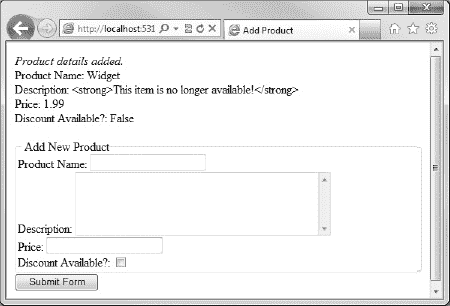
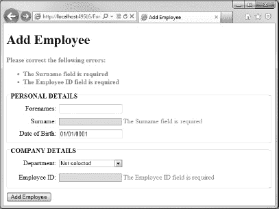

# 五、表单和验证

到目前为止，我们的服务器端代码已经提供了动态内容，但它也是单向操作——我们只关心向用户呈现内容。在这一章中，我们将学习如何通过接受用户输入并基于用户输入执行操作来使我们的网站更具交互性。

用户输入通常通过使用 HTML 表单来收集；一旦表单被提交，我们就可以使用 Razor 代码询问表单内容。当我们学会了如何从提交的表单中检索数据时，我们将研究验证用户提交的数据的方法，以确保他们已经提交了所需的数据，并且他们提供的任何数据都是我们期望的格式。

本章的第一节讲述了 HTML 表单的机制和语义。如果您以前很少或没有创建动态交互式网页的经验，因此没有花太多时间使用 HTML 表单，这一节是为您准备的。如果您已经是一名经验丰富的 web 开发人员，可能目前正在使用不同的服务器端技术，如 Rails 或 PHP，您可能希望简单地浏览一下这一部分。

 **注**对 HTML 表单的良好理解是本书其余部分内容的基础。尽管我们假设你事先了解 HTML，但我在本章的开始部分包含了 HTML 表单的简要修订部分，因为即使是经验丰富的 web 设计人员，如果没有服务器端编码经验，也很有可能对表单的实际工作知之甚少。

### HTML 表单

HTML 表单使用一个`<form>`标签作为各种输入控件的容器，从用户那里收集数据。`<form>`标签的属性决定了表单中控件捕获的数据将被发送到哪里进行处理(`action`属性)以及如何发送这些数据(`method`属性)。

action 属性包含将处理提交的表单数据的页面的 URL 在大多数情况下，这将是包含表单的同一页面。默认情况下，如果 action 属性包含空字符串，WebMatrix 会将数据传回发送页面。尽管如此，明确有助于保持代码的可读性。

method 属性指定用于将表单发送到处理页面的 HTTP 方法。该属性可以包含两个值之一:`get`或`post`。get 方法将表单数据作为一个`QueryString`附加到 URI，而 post 方法将表单数据包含在 HTTP 请求中，对用户不可见。get 方法的优点是用户可以将生成的 URI(包括`QueryString`中的表单数据)加入书签——例如，这对于给搜索结果加书签很有用。但是，如果服务器端代码使用提交的表单数据对持久数据进行更改(例如在数据库中)，那么应该使用 post 方法来确保安全性，因为用户可以在浏览器的地址栏中轻松地更改`QueryString`。

`<form action="page.cshtml" method="post">
    ...
</form>`

#### 表单控件

除了定义另一个表单之外，任何 HTML 标签都可以嵌套在一个`<form>`开始标签和一个`</form>`结束标签中。这里我们感兴趣的标签是一组 HTML 元素，称为控件——输入、按钮、选择、文本区、标签和字段集。

##### 输入标签

标签可以显示许多不同的 UI 元素，这些元素被设计成以不同的方式从用户那里收集数据；这是目前最常用的元素。由 input 元素呈现的控件的确切特征由其各种属性的值决定。在 WebMatrix 中使用`<input>`标签时最重要的属性在[表 5-1](#tab_5_1) 中列出:

正如您所看到的，type 属性的值实际上决定了将哪个控件呈现给页面。文本和密码输入控件向页面呈现单行 textbox，用于捕获键盘输入。这两个控件本质上是相同的，除了密码控件屏蔽了用户的输入(见[图 5-1](#fig_5_1) )。

`<form action="page.cshtml" method="post">
    Username: <input type="text" name="username" maxlength="20" /> 
    Password: <input type="password" name="password"  />
</form>` 

***图 5-1。**显示用户输入的文本和密码输入控件*

如您所料，Razor 代码可用于设置控件的初始值。这里，我们将名为`startdate`的文本控件的初始值设置为当前日期:

`<form action="page.cshtml" method="post">
    Start Date:
    <input type="text" name="startdate" value="@DateTime.Now.ToShortDateString()" />
</form>`

 **注意**如果您以前使用过 ASP.NET WebForm，您会知道，由于 ASP.NET WebForm 模型的架构，它被限制为每页一个表单。ASP.NET 的网页却不是这样。有了 ASP.NET 网页，在同一个 CSHTML 页面中可以完全接受多个非嵌套的表单。

复选框控件旨在收集布尔数据。在`value`属性中指定的字符串是文本，如果在提交表单时选中了复选框，它将作为表单数据的一部分发送。如果`checked`属性被设置为“checked”值，复选框将在表单的初始呈现时被选中(参见[图 5-2](#fig_5_2) )。

`<form action="page.cshtml" method="post">
    Correct? <input type="checkbox" name="correct" value="true" checked="checked" /> 
    Opt in? <input type="checkbox" name="opt_in" value="true" />
</form>` 

***图 5-2。**复选框控制*

与相互独立工作的 checkbox 控件不同，单选按钮旨在用于用户理想情况下只选择多个选项之一的情况。所有选项都被赋予相同的名称，所选选项的 value 属性中的字符串在提交时被传递给表单处理程序。因为单选按钮组可能在没有选择值的情况下被提交，所以通过确保其中一个选项在初始标记中设置了 checked 属性来防止这种行为(参见[图 5-3](#fig_5_3) )。

`<form action="page.cshtml" method="post">
    Color:  
    <input type="radio" name="color" value="red" checked="checked" /> Red 
    <input type="radio" name="color" value="green" /> Green 
    <input type="radio" name="color" value="blue" /> Blue 
    <input type="radio" name="color" value="yellow" /> Yellow
</form>` 

***图 5-3。**一组单选按钮控件*

下一个代码样本和截图(见图 5-4 )显示了各种类型的按钮控件，如下所示:

*   `file`控件显示一个文件选择对话框，允许用户选择他们机器上的一个文件；该控件通常用作文件上传过程的一部分。
*   `button`控件只是在页面上呈现一个按钮。按钮没有默认行为，它被设计为与客户端脚本结合使用，以对事件(当点击、释放等)做出反应。).
*   `reset`按钮控件只是将表单中的所有控件重置为初始值。
*   `submit`和`image`按钮的作用相同；它们都将表单数据发送到服务器。每个表单必须至少有一个 submit 或 image 按钮，单击该按钮时，将使用表单标记属性中指定的方法和操作将表单数据发送到服务器。提交控件使用在`value`属性中指定的文本作为按钮的标签来呈现一个标准按钮。图像按钮使用一个图像来装饰按钮，该图像的 URI 在`src`属性中指定。出于可访问性的原因，使用 alt 属性提供替代文本对于图像按钮非常重要。

`<form action="page.cshtml" method="post">
    File control: <input type="file" name="userfile" /> 
    Button control: <input type="button" value="Click Here" /> 
    Reset control: <input type="reset" value="Reset Form" /> 
    Submit control: <input type="submit" value="Submit Form" /> 
    Image control: <input type="image" src="img/button.png" alt="click me" />
</form>` 

***图 5-4。** HTML 按钮控件*

输入控件的最后一种类型是隐藏控件。隐藏控件不呈现，但其值随窗体一起提交。这通常用于存储对用户没有意义但对表单处理程序的服务器端功能来说是必要的数据，例如单个记录的唯一标识符。请注意，隐藏控件并不安全，查看页面源代码的用户可以很容易地读取该值。

`<form action="page.cshtml" method="post">
    <input type="hidden" name="id" value="abcd1234" />
</form>`

##### 选择标签

元素用于呈现一个下拉列表。下拉列表中的每个选项都由一个`<option>`元素表示，其内容呈现在下拉列表的下拉部分。`<option>`元素还包含一个名为 value 的属性，它是作为表单的一部分发送回 web 服务器的实际数据。下面的代码示例和屏幕截图(参见[图 5-5](#fig_5_5) )演示了`<select>`标签的使用，其中每个机场的名称都显示给用户，但是唯一的三个字母的国际代码被发送到服务器进行处理:

`<form action="page.cshtml" method="post">
    Choose an airport:
    <select name="airport">
        <option value="LHR">London Heathrow</option>
        <option value="LAX">Los Angeles International</option>
        <option value="SIN">Changi International</option>
        <option value="JFK">John F. Kennedy International</option>
        <option value="HND">Tokyo International</option>
        <option value="MIA">Miami International</option>
        <option value="FRA">Frankfurt International</option>
        <option value="CDG">Charles De Gaulle International</option>
        <option value="HKG">Hong Kong International</option>
        <option value="PEK">Beijing Capital International</option>
    </select>
</form>` 

***图 5-5。**选择元素*

设置一个初始值，被选中的属性可以应用到任何一个被选中的选项(即`selected="selected"`)。还可以使用`<optgroup>`标签将选项组放入逻辑集群中。下面的代码示例和截图，[图 5-6](#fig_5_6) ，显示了我们按洲分组的机场下拉列表:

`<form action="page.cshtml" method="post">
    Choose an airport:
    <select name="airport">
        <optgroup label="Europe">
            <option value="LHR" selected="selected">London Heathrow</option>
            <option value="FRA">Frankfurt International</option>
            <option value="CDG">Charles De Gaulle International</option>
        </optgroup>
        <optgroup label="North America">
            <option value="LAX">Los Angeles International</option>
            <option value="JFK">John F. Kennedy International</option>
            <option value="MIA">Miami International</option>
        </optgroup>
        <optgroup label="Asia">
            <option value="SIN">Changi International</option>
            <option value="HND">Tokyo International</option>
            <option value="HKG">Hong Kong International</option>
            <option value="PEK">Beijing Capital International</option>
        </optgroup>
    </select>
</form>` 

***图 5-6。**使用 optgroup 标签的聚类菜单选项*

如您所见，`<optgroup>`标签的使用使得列表更易于用户导航；只能选择选项，不能选择选项组。

一个常见的编程需求是希望用集合中保存的值的列表来填充`<select>`标签的内容，无论该集合本身是作为数据库查询的结果还是通过其他方式填充的。假设您正在迭代的集合实现了 IEnumerable 或 IEnumerable < T >，向下拉列表添加集合内容的最简单方法是使用一个`foreach`循环。在下面的示例中，我们声明并初始化一个月的通用列表，并将它们作为选项添加到一个选择控件中:

`**@using System.Globalization;**
**@{**
**    Dictionary<int, string> months = new Dictionary<int, string>();**

**    // Populate the months dictionary with the month number and name**
**    for (int i = 1; i <= 12; i++)**
**    {**
**        months.Add(i, DateTimeFormatInfo.CurrentInfo.GetMonthName(i));**
**    }**
**}**

<!DOCTYPE html>
<html lang="en">
<head>
    <meta charset="utf-8" />
    <title></title>
</head>
<body>
    <form action="page.cshtml" method="post">
    Month:
    **<select name="month">**
        **@foreach (var month in months)**
**        {**
**            <option value="@month.Key">@month.Value</option>**
**        }**
**    </select>**
    </form>
</body>
</html>`

虽然不经常使用，`<select>`标签有一个 size 属性，它指示要在列表中显示的项目数量。设置后，浏览器将呈现固定列表或列表框，而不是下拉菜单。列表框的工作方式与下拉列表完全相同。

##### 按钮标签

`<button>`元素创建一个按钮，其操作方式与< `input>`元素按钮控件类型完全相同；这两种控件类型之间唯一的区别是`<button>`元素包含 HTML 内容的能力——最常见的是，但不限于，样式化的文本或图像。按钮的类型属性决定了它是`submit`、`reset,`还是按压`button`类型。

以下标记呈现了图 5-7 中[所示的按钮:](#fig_5_7)

`<form action="page.cshtml" method="post">
    <button name="submit" type="submit">
        Submit
        
    </button>
</form>` 

***图 5-7。**按钮控件比输入按钮类型具有更丰富的呈现可能性。*

##### textarea 标签

元素呈现一个多行文本输入控件。通过使用 rows 和 cols 属性指定文本的行数和列数来调整控件的大小。与`<input>`文本控件不同，`<textarea>`元素的初始值包含在`<textarea>`开始标签和`</textarea>`结束标签之间，而不是包含在一个值属性中。

下面的代码示例和截图(见[图 5-8](#fig_5_8) )呈现了一个`textarea` 40 列乘 10 行的大小，还有一些初始的样本内容。为了清楚起见，在代码示例中已经缩短了`textarea`的实际文本内容:

`<form action="page.cshtml" method="post">
    Notes: 
    <textarea name="notes" cols="40" rows="10">Lorem ipsum... </textarea></form>` 

***图 5-8。**`textarea`元素呈现一个多行文本框。*

与`<input>`控件类型一样，`<textarea>`有布尔标志、`readonly`和`disabled`，可以用来阻止用户对`textarea`的内容进行更改，或者完全禁用它。

##### 标签和字段集标签

我们在这里要看的最后两种 HTML 表单控件是`<label>`和`<fieldset>`。这些控件是纯只读控件，旨在向用户传达信息和组织用户界面。

`<fieldset>`标签用于可视化地将页面上的控件分组，以帮助用户理解和导航表单。可以添加一个`<legend>`标签作为`<fieldset>`标签的第一个子元素，为字段集分配标题。

`<label>`标签通过其`for`属性与单个表单控件(如文本框)明确相关，该属性必须与关联控件的`id`属性中包含的值完全匹配。它用于将信息附加到控件上，以呈现视觉上改进的用户体验，并帮助导航和可访问性。

下面的代码样本和截图(见[图 5-9](#fig_5_9) )展示了如何正确使用`<fieldset>`、`<legend>,`和`<label>`元素向表单用户提供视觉提示:

`<form action="page.cshtml" method="post">
    <fieldset>
        <legend>Personal Details</legend>
        

            <label for="surname">Surname: </label>
            <input type="text" name="surname" id="surname" />
        

        

            <label for="forenames">Forenames: </label>
            <input type="text" name="forenames" id="forenames" />
        

        

            <label for="license">Current Driving License: </label>
            <input type="checkbox" name="license" id="license" />
        

    </fieldset>
    <fieldset>
        <legend>Vehicle Details</legend>
        

            <label for="make">Make: </label>
            <input type="text" name="make" id="make" />
        

        

            <label for="model">Model: </label>
            <input type="text" name="model" id="model" />
        

    </fieldset>
    

        <input type="reset" value="Reset Form" />
        <input type="submit" value="Save Details" />
    

</form>` 

***图 5-9。**使用`fieldset, legend,`和`label`元素*改进用户界面

你会注意到所有的`<input>`标签都有`id`和`name`属性。`id`属性用于为样式和脚本目的标识所有 HTML 元素，而`name`属性用于访问表单控件的值(参见本章后面的“访问提交的表单数据”一节)。

 **提示**万维网联盟(W3C)是负责开发 Web 标准的组织，他们的网站上有关于 HTML 各个方面的优秀信息。包含特定于 HTML 表单的信息的部分可以在:`[www.w3.org/TR/html5/forms.html](http://www.w3.org/TR/html5/forms.html)`找到

### HTML 表单助手

可以想象，用 HTML 创建表单很快就会变成一个单调乏味的重复过程。幸运的是，ASP.NET 网页为我们提供了一些有用的显示表单域的 HTML 帮助方法。这些方法都是 HtmlHelper 类的一部分，可以在创建表单时节省大量的开发时间，因为它们提供了更简洁、更整洁的语法。

例如，创建一个输入文本控件，而不是编写以下 HTML:

`<input id="description" name="description" type="text" value="" />`

您可以简单地调用`Html.Textbox` () helper 方法并传入名称，就像这样:

`@Html.TextBox("description")`

在这一节中，我们将快速浏览一下表单助手，并查看一些使用示例。它们都有一些共同的参数，有些很明显，比如`name`和`value`，有些不太明显，比如`htmlAttributes`，它定义了我们希望分配给正在创建的控件的任何其他自定义 HTML 属性的名称和值。在浏览下面的例子的过程中，我将解释任何可能不太明显的方法参数。

#### Html。TextBox()，Html。密码()和 Html。隐藏()

`Textbox()`助手用指定的名称、值和 HTML 属性呈现文本输入元素。它有以下四个签名:

`public IHtmlString TextBox(string name)

public IHtmlString TextBox(string name,
                           Object value)

public IHtmlString TextBox(string name,
                           Object value,
                           Object htmlAttributes)

public IHtmlString TextBox(string name,
                           Object value,
                           IDictionary<string, Object> htmlAttributes)`

下面的代码示例演示了`Textbox()` helper 方法的使用，并显示了由 helper 生成并发送到页面的实际 HTML:

`@Html.TextBox("description")
@Html.TextBox("description", "Description goes here")
@Html.TextBox("description", "Description goes here", new { maxlength = "50",
                                                            @class = "valid-style" } )

@* Actual HTML sent to client... *@

<input id="description" name="description" type="text" value="" />
<input id="description" name="description" type="text" value="Description goes here" />
<input class="valid-style" id="description" maxlength="50" name="description"
       type="text" value="Description goes here" />`

注意，在最后一个例子中，当创建`htmlAttributes`对象时，我们使用了`@`操作符来表示一个逐字的字符串，因为`class`是 C# 中的保留字。

`Html.Password`和`Html.Hidden`帮助器具有相同的重载集，并且以完全相同的方式工作，但是它们分别呈现密码输入控件或隐藏输入控件。

#### Html。复选框()

`CheckBox()`助手向页面呈现一个 HTML checkbox 输入控件，并具有以下六个签名:

`public IHtmlString CheckBox(string name)

public IHtmlString CheckBox(string name, bool isChecked)

public IHtmlString CheckBox(string name, IDictionary<string, Object> htmlAttrributes)

public IHtmlString CheckBox(string name, Object htmlAttributes)

public IHtmlString CheckBox(string name, bool isChecked, Object htmlAttributes)

public IHtmlString CheckBox(string name, bool isChecked,
                            IDictionary<string, Object> htmlAttrributes)`

下面的代码示例显示了助手的典型用法，后面是实际呈现的 HTML:

`@Html.CheckBox("approved")
@Html.CheckBox("approved", true)

@* Actual HTML sent to client... *@
<input id="approved" name="approved" type="checkbox" />
<input checked="checked" id="approved" name="approved" type="checkbox" />`

不幸的是，`CheckBox`助手呈现的 HTML 不包含 value 属性，这意味着当复选框被选中并且表单被提交时，`CheckBox`返回默认值“on”。为了使用`AsBool()`扩展方法，我们将在本章后面讨论，我们需要将`CheckBox`的 value 属性设置为“true”。我们可以使用`htmlAttributes`参数来实现这一点:

`@Html.CheckBox("approved", true, new { value = "true" })`

这将呈现我们需要的 HTML:

`<input checked="checked" id="approved" name="approved" type="checkbox" value="true" />`

#### Html。单选按钮()

RadioButton helper 返回一个具有指定名称、值和其他属性的 HTML 单选输入控件。它有六种重载:

`public IHtmlString RadioButton(string name, Object value)

public IHtmlString RadioButton(string name, Object value, bool isChecked)

public IHtmlString RadioButton(string name, Object value,
                               IDictionary<string, Object> htmlAttributes)

public IHtmlString RadioButton(string name, Object value, Object htmlAttributes)

public IHtmlString RadioButton(string name, Object value, bool isChecked,
                               IDictionary<string, Object> htmlAttributes)

public IHtmlString RadioButton(string name, Object value, bool isChecked,
                               Object htmlAttributes)`

下面的代码示例演示了帮助器的使用以及产生的 HTML 输出:

`@Html.RadioButton("vehicleType", "car", true)
@Html.RadioButton("vehicleType", "truck")
@Html.RadioButton("vehicleType", "motorcycle")

@* Actual HTML sent to client... *@
<input id="vehicleType" name="vehicleType" type="radio" value="car" checked="checked" />
<input id="vehicleType" name="vehicleType" type="radio" value="truck" />
<input id="vehicleType" name="vehicleType" type="radio" value="motorcycle" />`

#### Html。TextArea()

`TextArea()`助手与`TextBox()`助手非常相似，但是它包含了额外的重载，允许开发人员指定`row`和`col`属性:

`public IHtmlString TextArea(string name)

public IHtmlString TextArea(string name,`
`                            Object htmlAttributes)

public IHtmlString TextArea(string name,
                            IDictionary<string, Object> htmlAttributes)
public IHtmlString TextArea(string name,
                            string value)

public IHtmlString TextArea(string name,
                            string value,
                            Object htmlAttributes)

public IHtmlString TextArea(string name,
                            string value,
                            IDictionary<string, Object> htmlAttributes)

public IHtmlString TextArea(string name,
                            string value,
                            int rows,
                            int columns,
                            Object htmlAttributes)

public IHtmlString TextArea(string name,
                            string value,
                            int rows,
                            int columns,
                            IDictionary<string, Object> htmlAttributes)`

下面的代码显示了正在使用的`TextArea()` helper 方法以及发送到客户端的结果 HTML:

`@Html.TextArea("description", "", 10, 40, null)
@Html.TextArea("comment", "Please enter your comments")

@* Actual HTML sent to client... *@
<textarea cols="40" id="description" name="description" rows="10"></textarea>
<textarea cols="20" id="comment" name="comment" rows="2">Please enter your comments</textarea>`

#### Html .下拉式清单()

`DropDownList()` helper 方法向页面呈现一个 HTML 选择控件。它有以下签名:

`public IHtmlString DropDownList(string name,
                                IEnumerable<SelectListItem> selectList)

public IHtmlString DropDownList(string name,
                                IEnumerable<SelectListItem> selectList,
                                IDictionary<string, Object> htmlAttributes)

public IHtmlString DropDownList(string name,`
`                                IEnumerable<SelectListItem> selectList,
                                Object htmlAttributes)

public IHtmlString DropDownList(string name,
                                string defaultOption,
                                IEnumerable<SelectListItem> selectList)

public IHtmlString DropDownList(string name,
                                string defaultOption,
                                IEnumerable<SelectListItem> selectList,
                                IDictionary<string, Object> htmlAttributes)

public IHtmlString DropDownList(string name,
                                string defaultOption,
                                IEnumerable<SelectListItem> selectList,
                                Object htmlAttributes)

public IHtmlString DropDownList(string name,
                                string defaultOption,
                                IEnumerable<SelectListItem> selectList,
                                Object selectedValue,
                                IDictionary<string, Object> htmlAttributes)

public IHtmlString DropDownList(string name,
                                string defaultOption,
                                IEnumerable<SelectListItem> selectList,
                                Object selectedValue,
                                Object htmlAttributes)`

`selectList`参数接受一个`SelectListItem`对象的 IEnumerable 集合。`SelectListItem`对象用于创建一个 HTML `option`元素，因此，它代表 HTML 选择列表(下拉列表或列表框)中的一个项目。`SelectListItem`类有三个属性；`Selected`—表示当前是否选择了`SelectListItem`；`Text`—向用户显示的文本；和`Value`—即要呈现的 HTML option 元素的 HTML value 属性的内容。

`DropDownList()`助手的`selectedValue`参数指定列表中默认选中的项目。助手将选择列表中具有匹配值的第一项，或者如果该项没有值，则选择匹配文本。

`defaultOption`参数插入一个没有值的选项标签作为列表中的第一项，用于通知没有选择任何选项，无论是对于可选字段还是为了促进必需字段验证的开发。

下面的代码示例显示了`DropDownList()` helper 方法的典型用法和生成的 HTML:

`@{
    var optionList = new List<SelectListItem>()
    {
        new SelectListItem { Value = "C", Text = "Cyan" },
        new SelectListItem { Value = "M", Text = "Magenta" },
        new SelectListItem { Value = "Y", Text = "Yellow" },
        new SelectListItem { Value = "K", Text = "Black" }`
`    };
}
@Html.DropDownList("color", "Not selected", optionList, "M", null)

@* Actual HTML sent to client... *@
<select id="color" name="color">
    <option value="">Not selected</option>
    <option value="C">Cyan</option>
    <option selected="selected" value="M">Magenta</option>
    <option value="Y">Yellow</option>
    <option value="K">Black</option>
</select>`

在这个阶段用静态值填充列表可能有点冗长，但是在后面的章节中，您将看到如何使用这个助手从数据库中轻松地填充下拉列表。

#### html.listBox（）

`ListBox()`帮助器的工作方式与`DropDownList()`帮助器基本相同，但是包含了额外的重载方法来访问呈现的 HTML 选择控件的`size`和`multiple`属性:

`@Html.ListBox("color", "Not selected", optionList, "M", 5, true)`

当然，也可以使用`htmlAttributes`参数设置这些属性:

`@Html.DropDownList("color", "Not selected", optionList, "M",
                   new { size = 5, multiple = "multiple" })`

#### Html。Label()

我们在这一节要看的最后一个 HTML helper 方法是`Html.Label(),`，它只是将一个 HTML 标签控件呈现给页面输出。它有五个签名:

`public IHtmlString Label(string labelText)

public IHtmlString Label(string labelText,
                         Object attributes)

public IHtmlString Label(string labelText,
                         string labelFor)

public IHtmlString Label(string labelText,
                         string labelFor
                         IDictionary<string, Object> attributes)
public IHtmlString Label(string labelText,
                         string labelFor
                         Object attributes)`

此处显示了`Label()` helper 方法的使用和产生的 HTML 输出:

`@Html.Label("Username: ", "username")
@Html.TextBox("username")

@* Actual HTML sent to client... *@
<label for="username">Username: </label>
<input id="username" name="username" type="text" value="" />`

 **注意**我们在本节看到的 HtmlHelper 方法都是 HTML helper 类的扩展方法。扩展方法是一种特殊的静态方法，用于向现有类型“添加”方法，而无需修改现有类型或派生新类型。有关推广方法的更多信息，请访问 MSDN 网站:`[http://msdn.microsoft.com/en-us/library/bb383977.aspx](http://msdn.microsoft.com/en-us/library/bb383977.aspx)`

MSDN 网站上还有关于 HtmlHelper 类的更多信息:
`[http://msdn.microsoft.com/en-us/library/system.web.webpages.html.htmlhelper.aspx](http://msdn.microsoft.com/en-us/library/system.web.webpages.html.htmlhelper.aspx)`

### 使用 WebMatrix 处理表单

现在我们对 HTML 表单有了很好的理解，我们可以看看使用 WebMatrix 处理提交给 web 服务器的表单数据的方法。这个过程的第一部分是识别表单何时被提交，并相应地显示动态 UI。这是通过使用`IsPost`属性在 ASP.NET 网页中完成的。

为了充分理解这个过程，理解整个表单生命周期是很重要的；从最初的请求，通过用户提交到表单数据处理:

*   最初，浏览器请求一个. cshtml 网页
*   服务器执行请求的。cshtml 网页。这将生成一个带有空输入控件的表单，该表单将返回给浏览器并显示给用户。
*   在浏览器中，用户填写表单，然后单击按钮将表单数据提交给服务器。
*   在服务器上，网页被再次执行。在这里，我们可以使用`IsPost`属性来检测页面已经被回发，因此可以处理用户提交的表单数据。

[图 5-10](#fig_5_10) 中的图表演示了这一过程:

***图 5-10。**表单生命周期*

#### 识别表单提交

WebMatrix 页面的 Boolean `IsPost`属性为我们提供了一种简单有效的方法来确定用户是否提交了表单。到目前为止，单击表单上的 submit 按钮除了将页面发送回自身和恢复任何表单控件的默认值之外，没有做任何事情。通过查询`IsPost`属性，我们现在可以确定页面是否作为表单动作的一部分被请求，并在必要时执行服务器端处理。通常，这个服务器端代码将执行一些计算或数据访问功能，但是在下面的代码中，我们将简单地向用户显示一条消息，通知他们表单已经被处理。

 **注意**我们将在下一章探讨实现数据访问代码的方法:[第 6 章](06.html#ch6)——处理数据。

`@{
    if (IsPost){
        

            <em>Product details added.</em>
        

    }
}

<!DOCTYPE html>`
`<html lang="en">
<head>
    <meta charset="utf-8" />
    <title>Add Product</title>
</head>
<body>
    <form action="" method="post">
        <fieldset>
            <legend>Add New Product</legend>
            

                @Html.Label("Name: ", "name")
                @Html.TextBox("name")
            

            

                @Html.Label("Description: ", "description")
                @Html.TextArea("description", "", 5, 40, null)
            

            

                @Html.Label("Price: ", "price")
                @Html.TextBox("price")
            

            

                @Html.Label("Discount Available? ", "discount")
                @Html.CheckBox("discount", new { value = "true" })
            

        </fieldset>
        

            <input type="submit" value="Submit Form" />
        

    </form>
</body>
</html>`

如果您看一下这个例子最上面的代码块，您可以看到当页面第一次运行时，`if(IsPost)`条件返回`false`(因为页面没有作为 HTTP POST 请求的结果被执行)。因此，`if`块中的代码，在本例中是显示成功消息的代码，不会被执行。

然而，当点击提交按钮并且表单被回发到同一个服务器时，页面将再次运行(由于表单的 action 属性中的值)，`IsPost`属性将评估为 true，并且将显示消息，如图 5-11 中的[所示:](#fig_5_11)

***图 5-11。**当 IsPost 属性为 true 时返回给用户的消息。*

我们现在可以确定表单何时被提交，并相应地执行特定的代码。我们的下一个任务是读取表单作为 HTTP POST 请求的一部分发送给服务器的数据。

#### 访问提交的表单数据

可以通过请求对象访问提交的表单字段的值。请求对象中的每一项都由一个键标识，该键对应于表单中每个字段的`name`属性值。例如，在回发后访问以下输入文本控件的值:

`<input type="text" name="username" />`

您将使用关键字`username`访问存储在请求对象中的值:

`Request["username"]`

让我们对页面顶部的代码进行一些修改，通过从请求对象中提取数据，在用户单击提交表单按钮时向用户提供一些确认。为此，我们将请求对象的相关值分配给四个字符串变量，然后显示这些变量的内容:

`@{
    if (IsPost){
        string name = Request["name"];
        string description = Request["description"];
        string price = Request["price"];
        string discount = Request["discount"];

        

            <em>Product details added.</em> 
            Product Name: @name 
            Description: @description 
            Price: @price 
            Discount Available? @discount 
        

    }
}`

现在，当用户填写表单并点击提交按钮时，他们会在表单上方看到确认文本，如图[图 5-12](#fig_5_12) 所示:

***图 5-12。**回发时用户看到的确认。*

表单值作为字符串存储在请求对象中。因此，如果我们需要将字段的值作为日期时间、布尔或其他类型来处理，我们需要首先转换它。Web Pages 提供了五种类型转换扩展方法(在 StringExtensions 类中定义)，详见[表 5-2](#tab_5_2) :

例如，我们可以使用这些方法来确定我们的产品是否有折扣，并向用户显示折扣后的价格，在我们的例子中是 50%的折扣。

我们将通过使用`AsBool()`和`AsDecimal()`方法来转换从折扣复选框(如果选中，它将返回字符串`"true"`)和价格文本框返回的字符串值来完成这个任务。一旦我们转换了这些值，我们就可以用它们来测试是否有折扣，如果有，就显示折扣价(见[图 5-13](#fig_5_13) ):

`@{
    if (IsPost){
        string name = Request["name"];
        string description = Request["description"];
        **decimal price = Request["price"].AsDecimal();**
**        bool discount = Request["discount"].AsBool();**

        

            <em>Product details added.</em> 
            Product Name: @name 
            Description: @description 
            Price: @price 
            Discount Available? @discount 
           **@if(discount)**
**            {**
**                <text>**
**                    Discounted Price: @(price / 2)**
**                </text>**
**            }**
        

    }
}` 

***图 5-13。**显示折扣价*

 **注意**通过以我们现有的方式询问请求对象(例如请求["key"])，我们实际上是在询问已发布表单的值以及 URL 的`QueryString`值。因此，重要的是不要让表单字段和`QueryString`值具有相同的名称而引入任何歧义。如果这是不可避免的，或者您希望在代码中更加明确，您可以分别调用`Request.Form`或`Request.QueryString`方法。例如:

`Request.Form["productName"]
Request.QueryString["productName"]`

### 验证用户输入

在一个理想的世界里，我们会给用户一个表单，他们会在按下提交按钮之前完整地正确填写。然而，在现实中，这往往不会发生。人们会犯错误，误解所要求的内容，绕过字段，或者在最坏的情况下，通过提交可能有害的值来故意破坏您的站点或其数据(请参阅本章中关于表单安全性的部分)。为了解决这个问题，我们可以在应用中使用提交的表单字段值之前检查它们，并提示用户输入正确的值并重新提交表单。这个过程称为表单验证。

请注意正确数据和有效数据之间的重要区别。仅仅因为数据通过了我们的检查，因此被视为有效，数据不一定是正确的。在大多数情况下，我们只能合理地期望检查数据是否在允许的范围内，并且格式是否正确。例如，如果用户输入出生日期，我们可以检查该日期是否在合理的日期范围内，比如在`DateTime.Today`和`DateTime.Today.AddYears(-120),`之间，但是我们不知道他们输入的日期是否正确。在编写验证逻辑时，您的工作是确保数据有效、合理，并可用于成功完成任何后续操作。在大多数情况下，几乎不可能检查绝对的准确性。毕竟，如果我们知道值应该是多少，为什么我们需要要求用户提供它呢？

#### 何时验证？

表单验证代码可以在客户端浏览器或 web 服务器上编写。这两种技术各有优缺点，在讨论理想的解决方案之前，我们将在这里讨论一下。

##### 服务器端验证

在 ASP.NET 网页中，服务器端验证是通过编写 Razor 代码来完成的，这些代码在用户提交页面后执行。如果验证通过，则根据需要处理数据，程序流程继续。然而，如果验证失败，则不处理数据；取而代之的是，响应被发送回客户端，包含表单的页面被刷新，信息被显示给用户，要求他们更正相关数据并重新提交表单。

作为程序员，服务器端验证对我们有两大好处。首先，我们可以用 C# 编写验证逻辑，这是我们所熟悉和喜爱的，因此我们可以充分利用。NET 框架作为 ASP.NET 的一部分。其次，也是更重要的，服务器端验证是安全的——它总是被执行，不像客户端验证那样可以被用户绕过。

服务器端方法唯一真正的缺点在于，数据必须在任何验证发生之前提交给服务器。这意味着用户必须填写并提交整个表单才能得到响应，这在某些情况下会提供不太理想的用户体验，尤其是在慢速连接的情况下。

图 5-14 中的图表描述了服务器端验证的流程。在图中，每当流程越过客户端和服务器端之间的虚线时，都会发送一个 HTTP 请求，并发生页面刷新。

***图 5-14。**服务器端验证过程*

##### 客户端验证

在将数据提交给客户端之前，在浏览器中执行客户端验证。这是通过使用客户端脚本语言(如 JavaScript)或客户端技术的组合(通常称为 AJAX(异步 JavaScript 和 XML))来实现的。采用这种方法允许在用户输入时验证用户的输入，而不需要刷新页面，这意味着更丰富、更灵敏的用户体验。

客户端脚本的最大缺点是它很容易被用户绕过，用户通过在浏览器设置中禁用 JavaScript，也禁用了我们的客户端验证。出于这个原因，大多数开发人员选择只使用客户端脚本，通过输入屏蔽、动态帮助和工具提示等功能向用户提供指导和反馈，而不是依赖它来进行完整的输入验证。

[图 5-15](#fig_5_15) 概述了客户端验证的流程。我们可以看到，将验证构建到页面中只需要访问一次服务器，就能为用户提供即时反馈。

***图 5-15。**客户端验证流程*

##### 两全其美

最好的方法显然是使用两者的“皮带和支架”组合。理想情况下，您应该使用 JavaScript 来提供丰富的、响应性强的验证和反馈，并在进行任何数据处理之前用服务器端代码进行最后的全面检查。使用这种设计模式意味着，在大多数情况下，当启用 JavaScript 时，用户可以获得最佳的用户体验。同时，当客户端禁用 JavaScript 时，验证和安全性不会受到影响。

由于这本书是关于 ASP.NET 网页，一种服务器端技术，我们将集中在服务器端验证。在任何情况下，服务器端验证都不能“关闭”，所以如果必须进行验证，这是唯一的选择。客户端是为了虚荣；服务器端的健全。

[图 5-16](#fig_5_16) 显示了这种理想方法所涉及的过程。使用 JavaScript 验证该页面，当认为有效时，在进行任何数据处理之前，将该页面传递给 ASP.NET 网页进行最终验证。正如我所说，这是理想的方法，但它需要大量的工作。在添加 JavaScript 客户端功能之前，您应该始终确保您的服务器端验证例程是“无懈可击”的，因为服务器端代码是您最终的安全检查点。

**客户端验证框架**

虽然这是一本关于 ASP.NET 网页和 WebMatrix(一种服务器端技术)的书，但至少值得一提的是，Web 开发人员可以利用众多客户端验证框架的存在。验证可能是一项非常耗时的任务，因此，在服务器上执行所有表单验证往往很有诱惑力。然而，客户端验证的存在极大地改善了您的网站的用户体验，并真正使一个网站在竞争对手中脱颖而出。考虑到这一点，有必要研究一下众多可用的开源客户端验证框架中的一个，因为使用它们可以不费吹灰之力完成很多事情。

这些框架中最流行的一个是 jQuery 验证插件，它可以在:`[http://bassistance.de/jquery-plugins/jquery-plugin-validation/](http://bassistance.de/jquery-plugins/jquery-plugin-validation/)`找到

***图 5-16。**理想的解决方案——客户端和服务器端验证的结合*

#### 表单安全

恶意用户可能会尝试以多种方式攻击您的网站，通常是为了获取信息或提交伪造的数据。针对 HTML 表单的两种常见攻击类型是跨站脚本(XSS)和跨站请求伪造(XSRF)。在这一节，我们将看看 ASP.NET 网页可以帮助您保护您的网站免受这些类型的攻击。

##### 跨站点脚本(XSS))

跨站点脚本(XSS)攻击通过将客户端代码注入其他用户查看的网页上的表单域，利用网页验证中的漏洞。

无论何时你接受用户的输入并重新显示它(就像我们在本章的‘添加新产品’表单中所做的那样)，你都在向潜在的 XSS 攻击开放你的网站。默认情况下，ASP.NET 阻止人们通过`get`或`post`请求发布具有潜在危险的值。假设用户要在我们的表单产品名称字段中输入以下文本:

``

当他们点击提交按钮时，默认情况下，会出现一个类似于图 5-17 所示的错误:

***图 5-17。**提交潜在不安全数据时看到的错误页面*

对于我们刚刚看到的例子来说，这似乎有点过分，如果允许通过，将只是在客户机上显示一个浏览器消息框。然而，客户端脚本可以以更加恶意的方式使用；例如，访问存储用户重要敏感信息的 cookies、窃取经过认证的会话、操纵客户端计算机上的文件，甚至记录用户在使用网站时的击键行为。

在某些情况下，您可能希望允许用户在表单域中输入 HTML 例如，这是内容管理系统中的常见需求。我们可以使用`Request.Unvalidated()`方法来关闭单个表单字段的 ASP.NET 验证。例如，如果我们希望允许用户在描述字段中输入 HTML，我们可以执行以下操作:

`@{
    if (IsPost){
        string name = Request["name"];
        **string description = Request.Unvalidated("description");**
        decimal price = Request["price"].AsDecimal();
        bool discount = Request["discount"].AsBool();`

`        

            <em>Product details added.</em> 
            Product Name: @name 
            Description: @description 
            Price: @price 
            Discount Available?: @discount 
            @if(discount)
            {
                <text>
                    Discounted Price: @(price / 2)
                </text>
            }
        

    }
}`

例如，如果我们只想验证 HTML 中潜在的有害值，然后将它存储在数据库中，这是没问题的，但是如果我们将它显示给用户，如上面的代码示例所示，他们会看到返回的编码 HTML，如图 5-18 所示:

***图 5-18。**调用`Request.Unvalidated()`方法的结果*

如果我们对提交的 HTML 感到满意，我们可以使用`Html.Raw()` helper 方法在浏览器中显示它:

`Description: @Html.Raw(description) `

该方法防止 ASP.NET 编码 HTML 并直接输出到浏览器，如图[图 5-19](#fig_5_19) 所示:

***图 5-19。**使用 HTML 阻止 HTML 编码。原始助手方法。*

##### 跨站点请求伪造(XSRF)

当用户通常通过电子邮件或即时消息访问恶意网站时，就会发生跨站点请求伪造(XSRF)攻击。该网站在用户已经通过认证的网站上秘密提交有害请求。恶意站点通过向页面的表单处理代码发送伪造的请求来实施攻击，该请求看起来来自经过合法认证的用户。现实世界中通过这种方法进行攻击的例子从获取帐户信息到提交虚假订单和窃取金钱。

防止 XSRF 攻击的最有效方法是检查 HTTP POST 请求是否来自站点内的预期表单，而不是来自未知来源。ASP.NET 网页提供了反伪造类来帮助实现这一点。

防伪助手类有两个公共方法；`GetHtml()`和`Validate()`。`GetHtml()`方法创建一个加密令牌，将其存储在 cookie 中，并将其添加到表单的隐藏字段中。在表单处理程序中调用`Validate()`方法，检查隐藏字段中的值是否与 cookie 中存储的值相匹配。如果它们与表单不匹配，处理将停止并生成一个异常。这个简单的措施确保请求来自正确、合法的形式，因此不是伪造的。

下面的代码示例演示了反伪造类的用法:

`@{  
    var username = "";

    if(IsPost) {
        **AntiForgery.Validate();**
        username = Request["username"];
    }
}
<!DOCTYPE html>
<html lang="en">
<head>
    <meta charset="utf-8" />
    <title>AntiForgery Example</title>
</head>
<body>`
`    @if (IsPost)
    {
        <text>
            <h1>Welcome, @username</h1>
        </text>
    }
    <form method="post" action="">
        @Html.Label("Username: ", "username")
        @Html.TextBox("username")
        **@AntiForgery.GetHtml()**
        <input type="submit" value="Submit" />
    </form>
</body>
</html>`

#### 执行表单验证

在本节中，我们将了解如何使用 ASP.NET 网页来执行服务器端表单验证。首先，让我们创建一个表单进行验证。我们的表单将收集员工的信息:

`<!DOCTYPE html>
<html lang="en">
<head>
    <meta charset="utf-8" />
    <title>Add Employee</title>
</head>
<body>
    <h1>Add Employee</h1>
    <form action="" method="post">
        <fieldset>
            <legend>Personal Details</legend>
            

                @Html.Label("Forenames: ", "forenames")
                @Html.TextBox("forenames")
            

            

                @Html.Label("Surname: ", "surname")
                @Html.TextBox("surname")
            

            

                @Html.Label("Date of Birth: ", "dateOfBirth")
                @Html.TextBox("dateOfBirth")
            

        </fieldset>
        <fieldset>
            <legend>Company Details</legend>
                

                    @Html.Label("Department: ", "department")
                    @{
                        var departmentList = new List<SelectListItem>()`
`                        {
                            new SelectListItem { Value = "admin", Text = "Administration" },
                            new SelectListItem { Value = "hr", Text = "Human Resources" },
                            new SelectListItem { Value = "catering", Text = "Catering" },
                            new SelectListItem { Value = "dev",
                                                 Text = "Product Development" },
                            new SelectListItem { Value = "sales",
                                                 Text = "Sales and Marketing" },
                        };  
                    }
                    @Html.DropDownList("department", "Not selected", departmentList)
                

                

                    

                        @Html.Label("Employee ID: ", "employeeID")
                        @Html.TextBox("employeeID", "", new { maxlength = 4 })
                    

                

        </fieldset>
        

            <input type="submit" value="Add Employee" />
        

    </form>
</body>
</html>`

接下来，我们将在页面顶部添加一个代码块来测试`IsPost`属性，如果为真，则执行我们的数据处理。出于演示的目的，我们将使用`Response.Redirect()`方法将用户发送到一个“成功”页面:

`@{
    if (IsPost)
    {
        Response.Redirect("Success.cshtml");
    }     
}`

如果我们在浏览器中运行该页面，我们可以看到显示一个空表单，如果我们单击“添加员工”按钮，我们将被重定向到 Success.cshtml。但是，我们不希望提交一个空表单进行处理，这在目前是完全可能的。在本例中，我们将假设我们需要的关于新雇员的最少信息是他们的姓氏和雇员 ID，因此我们的第一段验证代码将使这些字段成为必填字段。

在页面的最顶端，我们将添加一些变量来存储表单字段的值。正如我们在前面的例子中看到的，当按下 submit 按钮时，页面被刷新，表单字段被清除。很明显，我们需要在表单中向用户显示提交的数据，以便允许他们进行修改，所以我们将把这些变量传递给我们使用的各种 HTML 表单助手的`value`参数。

`**@{**
    **var forenames = "";**
**    var surname = "";**
**    var dateOfBirth = DateTime.MinValue;**`
`**    var department = "";**
**    var employeeId = "";**

    if (IsPost)
    {
        **forenames = Request["forenames"];**
**        surname = Request["surname"];**
**        dateOfBirth = Request["dateOfBirth"].AsDateTime();**
**        department = Request["department"];**
**        employeeId = Request["employeeId"];**

        @*Response.Redirect("Success.cshtml");*@
    }     
}
<!DOCTYPE html>
<html lang="en">
<head>
    <meta charset="utf-8" />
    <title>Add Employee</title>
</head>
<body>
    <h1>Add Employee</h1>
    <form action="" method="post">
        <fieldset>
            <legend>Personal Details</legend>
            

                @Html.Label("Forenames: ", "forenames")
                @Html.TextBox("forenames"**, forenames**)
            

            

                @Html.Label("Surname: ", "surname")
                @Html.TextBox("surname"**, surname**)
            

            

                @Html.Label("Date of Birth: ", "dateOfBirth")
                @Html.TextBox("dateOfBirth"**, dateOfBirth.ToShortDateString()**)
            

        </fieldset>
        <fieldset>
            <legend>Company Details</legend>
                

                    @Html.Label("Department: ", "department")
                    @{
                        var departmentList = new List<SelectListItem>()
                        {
                            new SelectListItem { Value = "admin", Text = "Administration" },
                            new SelectListItem { Value = "hr", Text = "Human Resources" },
                            new SelectListItem { Value = "catering", Text = "Catering" },
                            new SelectListItem { Value = "dev",
                                                 Text = "Product Development" },`
`                            new SelectListItem { Value = "sales",
                                                 Text = "Sales and Marketing" },
                        };  
                    }
                    @Html.DropDownList("department", "Not selected", departmentList,
                                        **department, null**)
                

                

                    

                        @Html.Label("Employee ID: ", "employeeID")
                        @Html.TextBox("employeeID", **employeeId,** new { maxlength = 4 })
                    

                

        </fieldset>
        

            <input type="submit" value="Add Employee" />
        

    </form>
</body>
</html>`

注意，我们已经将出生日期字段的初始值设置为`DateTime.MinValue`。通过这样做，我们有助于向用户指出我们在该字段中期望的输入格式。还要注意，我们暂时注释掉了对`Response.Redirect()`方法的调用，以允许我们测试到目前为止的功能。

##### 模型状态

现在我们可以执行第一项验证了，它将检查姓氏和雇员 ID 字段是否为空。如果一个字段是空的，我们只是想记录下这个事实，然后继续下一部分的验证过程；如果我们一次只告诉用户一个验证错误，并期望每个错误都有一个新的表单提交，这将是一个糟糕的用户体验。一旦所有的验证检查都被处理，我们将向用户报告我们所有的发现。

为了实现这一点，我们将使用页面的 ModelState 对象来存储一个错误字典(在 ModelStateDictionary 中)。在 ASP.NET，模型指的是表单中的实体，在我们的例子中是雇员；ModelState 对象存储模型中存储的数据的状态(即有效性)。一旦所有的验证都完成了，我们就可以询问`ModelState.IsValid`属性来确定表单是否包含完全有效的数据——如果有任何错误被添加到`ModelStateDictionary`中，那么`ModelState.IsValid`将被设置为 false。我们使用`ModelState.AddError`方法向 ModelStateDictionary 添加验证错误，传入一个键(通常对应于控件的名称)和相关的错误消息。

`if (IsPost)
{
    forenames = Request["forenames"];
    surname = Request["surname"];
    dateOfBirth = Request["dateOfBirth"].AsDateTime();
    department = Request["department"];
    employeeId = Request["employeeId"];`

`    **if (surname.IsEmpty())**
**    {**
**        ModelState.AddError("surname", "The Surname field is required");**
**    }**
**    if (employeeId.IsEmpty())**
**    {**
**        ModelState.AddError("employeeID", "The Employee ID field is required");**
**    }**

**    if (ModelState.IsValid)**
**    {**
**        Response.Redirect("Success.cshtml");**
**    }**
}`

##### 显示验证结果

ASP.NET 网页为我们提供了两个助手方法，用于向用户显示验证反馈。这些方法中的第一个`Html.ValidationSummary()`，显示了 ModelStateDictionary 中保存的所有验证错误消息的 HTML 无序列表。第二种方法`ValidationMessage(),`显示在 ModelStateDictionary 中找到的与指定键对应的第一条错误消息。

我们将在页面顶部插入一个 ValidationSummary，并在相关表单字段旁边插入一个 ValidationMessage。

验证帮助器还为它们呈现的 HTML 区域分配一个 CSS 类。该代码示例的`<head>`中定义的 CSS 样式将通过突出显示相关字段和验证错误消息来帮助用户识别反馈。除了 ValidationSummary 和 ValidationMessage 帮助器之外，任何在 ModelStateDictionary 中被标识为键的表单字段也会被分配一个 CSS 类，该类可用于改变相关 HTML 标记的外观。

 **提示**validation summary 被呈现为一个 HTML `
`元素，其类属性为“validation-summary-errors”。ValidationMessage helper 呈现一个具有 class 属性“field-validation-error”的``元素，如果控件的名称与 ModelStateDictionary 中的键匹配，则该元素也被分配给相应的表单控件。

当我们为验证助手添加一些 CSS 样式时，我们将借此机会添加一些非常基本的样式，使我们的表单更加整洁:

`@{
   ... validation code, as before ...
}
<!DOCTYPE html>`
`<html lang="en">
<head>
    <meta charset="utf-8" />
    <title>Add Employee</title>
    ****
</head>
<body>
    <h1>Add Employee</h1>
    **@Html.ValidationSummary("Please correct the following errors:")**
    <form action="" method="post">
        <fieldset>
            <legend>Personal Details</legend>
            

                @Html.Label("Forenames: ", "forenames")
                @Html.TextBox("forenames", forenames)
            

            

                @Html.Label("Surname: ", "surname")
                @Html.TextBox("surname", surname)
                **@Html.ValidationMessage("surname")**
            

            

                @Html.Label("Date of Birth: ", "dateOfBirth")
                @Html.TextBox("dateOfBirth", dateOfBirth.ToShortDateString())
            

        </fieldset>
        <fieldset>
            <legend>Company Details</legend>
                

                    @Html.Label("Department: ", "department")
                    @{
                        var departmentList = new List<SelectListItem>()
                        {
                            new SelectListItem { Value = "admin", Text = "Administration" },
                            new SelectListItem { Value = "hr", Text = "Human Resources" },
                            new SelectListItem { Value = "catering", Text = "Catering" },
                            new SelectListItem { Value = "dev",
                                                 Text = "Product Development" },
                            new SelectListItem { Value = "sales",`
`                                                 Text = "Sales and Marketing" },
                        };  
                    }
                    @Html.DropDownList("department", "Not selected", departmentList,
                                        department, null)
                

                

                    

                        @Html.Label("Employee ID: ", "employeeID")
                        @Html.TextBox("employeeID", employeeId, new { maxlength = 4 })
                        **@Html.ValidationMessage("employeeID")**
                    

                

        </fieldset>
        

            <input type="submit" value="Add Employee" />
        

    </form>
</body>
</html>`

表单和验证反馈现在看起来是这样的(见[图 5-20](#fig_5_20) ):

***图 5-20。**验证摘要和验证消息助手*

#### 构建验证库

大多数验证例程属于以下四类之一:必填字段、与值的比较、范围检查和模式匹配。由于其可重用的能力，表单验证非常适合使用函数的实现。通过使用函数，而不是在我们站点的每个页面中重新编写相同或相似的验证代码，我们可以编写一组通用方法，并在需要时调用它们，传递参数以适应情况。

第一类验证例程——必填字段——是通过 ASP.NET 网页`IsEmpty()`方法实现的，如前所述。所以让我们直接进入第二类:比较。

在验证术语中，比较涉及将表单域的值与另一个指定值相关联。我们的函数必须允许我们将等式和关系运算符(见第 3 章)应用于提交的表单字段值。为此，我们将创建一系列公共的静态方法，这些方法接受两个参数—字段值和比较器—并将比较结果作为布尔值返回。

我们将在项目的 App_Code 文件夹中添加一个名为 Validation.cshtml 的文件，并创建一系列具有通用参数的方法，这些方法允许我们比较实现 IComparable 接口的任何数据类型:

 **注意**任何实现 IComparable 接口的类型都可以与任何其他实例进行比较。该接口要求任何实现类型都定义一个方法:CompareTo(Object)。在下面的代码示例中使用`where`关键字只是确保传递到该方法中的任何类型都实现 IComparable 接口。

这是一个比较先进的概念。如果你是 C# 的新手，不要过分关心下面的语法；你只需要理解所有的本地数字类型，`Strings, Chars`和`DateTimes`都实现了 IComparable，这意味着我们可以使用`CompareTo()`方法来比较它们。

关于 IComparable 接口的更多详细信息可以在 MSDN 网站上找到:
`[http://msdn.microsoft.com/en-us/library/ey2t2ys5.aspx](http://msdn.microsoft.com/en-us/library/ey2t2ys5.aspx)`

`@* Validation Functions *@
@functions {

    @* Comparisons *@
    public static bool IsEqualTo<T>(T value, T comparator) where T : IComparable`
`    {
        return value.Equals(comparator);
    }

    public static bool IsGreaterThan<T>(T value, T comparator) where T : IComparable
    {
        return value.CompareTo(comparator) > 0;
    }

    public static bool IsLessThan<T>(T value, T comparator) where T : IComparable
    {
        return value.CompareTo(comparator) < 0;
    }

    public static bool IsGreaterThanOrEqualTo<T>(T value, T comparator) where T : IComparable
    {
        return value.CompareTo(comparator) >= 0;
    }

    public static bool IsLessThanOrEqualTo<T>(T value, T comparator) where T : IComparable
    {
        return value.CompareTo(comparator) <= 0;
    }

}`

接下来，我们将添加一些范围验证。该方法将需要三个通用参数；表单域值、最小可接受值(即范围的下限)和最大可接受值(即范围的上限)。该方法将返回一个布尔值，指示该值是否大于或等于(`>=`)最小值和(`&&`)小于或等于(`<=`)最大值。

`@* Range Validation *@
public static bool IsBetween<T>(T value, T minValue, T maxValue) where T : IComparable
{
    return (value.CompareTo(minValue) >= 0 && value.CompareTo(maxValue) <= 0);
}`

目前，我们验证库的最后一项内容将涉及模式匹配。我们的模式匹配函数将使用正则表达式将字符串匹配到常见的模式，如电子邮件地址和 URL。这些方法只接受一个字符串参数，并返回一个布尔值，表明匹配成功。这里我们将实现四个模式匹配函数；`IsNumbersOnly(), IsLettersOnly(), IsAlphaNumeric()`和`IsValidEmail()`。将来您可能希望通过用自己的表达式替换正则表达式来添加额外的函数。

 **提示**正则表达式非常有用，但是设计和测试起来可能会非常耗时费力。一个表达式可以有数百个字符长(例如，检查 URL 的常用表达式超过 500 个字符)。幸运的是，一个简单的 web 搜索将为您提供几乎任何常见场景的示例正则表达式，然后您可以在验证库中测试和使用它。

关于正则表达式的更多信息可以在 MSDN 网站上找到:
`[http://msdn.microsoft.com/en-us/library/hs600312.aspx](http://msdn.microsoft.com/en-us/library/hs600312.aspx)`

以下是我们的模式匹配方法:

`@* Pattern Matching *@`
`public static bool IsNumbersOnly(string value)
{
    string expression = @"^[0-9]+$";

    return System.Text.RegularExpressions.Regex.IsMatch(value, expression);
}

public static bool IsLettersOnly(string value)
{
    string expression = @"^[A-Za-z]+$";

    return System.Text.RegularExpressions.Regex.IsMatch(value, expression);
}

public static bool IsAlphaNumeric(string value)
{
    string expression = @"^[A-Za-z0-9]+$";

    return System.Text.RegularExpressions.Regex.IsMatch(value, expression);
}

public static bool IsValidEmail(string value)
{
    string expression = @"^([a-zA-Z0-9_\-\.]+)@((\[[0-9]{1,3}" +
            @"\.[0-9]{1,3}\.[0-9]{1,3}\.)|(([a-zA-Z0-9\-]+\" +
            @".)+))([a-zA-Z]{2,4}|[0-9]{1,3})(\]?)$";

    return System.Text.RegularExpressions.Regex.IsMatch(value, expression);
}`

##### 使用我们的验证功能

您的验证库将随着时间的推移而增长，但是第一次迭代将处理绝大多数的验证需求。要使用该库，我们可以直接从任何页面调用函数，因为 Validation.cshtml 驻留在 App_Code 文件夹中。以下示例检查在我们的表单中提交的雇员 ID 是否在 100 到 9999 的范围内，如果不在，则在 ModelStateDictionary 中添加一个错误:

`if (!Validation.IsBetween(employeeId.AsInt(), 100, 9999))
{
    ModelState.AddError("employeeID",
        "The Employee ID must be between 100 and 9999 inclusive");
}`

因为我们的比较方法具有通用参数，所以我们可以调用相同的函数来检查出生日期是否在今天和 100 年前之间:

`if (!Validation.IsBetween(dateOfBirth, DateTime.Now.AddYears(-100), DateTime.Now))
{
    ModelState.AddError("dateOfBirth", "Invalid Date of Birth");
}`

如果我们在调用验证之前使用`AsDateTime()`方法将文本框中的字符串输入转换为`DateTime`，任何非日期格式的输入，包括空白字段，都将被转换为`DateTime.MinValue`。因此，通过以这种方式使用我们的验证函数，我们可以处理一个空字段，并检查日期是否有效以及是否在范围之内；一次进行三次验证，没有多余的检查。

仔细计划您的验证是值得的，以确保涵盖所有基础，不仅是预期值，还有预期的数据类型。总会有人在日期字段中键入“昨天”，或者在数字字段中键入“三”；你必须确保你能从容应对所有这些情况。

### 总结

本章演示了如何使用标准 HTML 和 ASP.NET 网页提供的帮助函数创建表单。我们还学习了如何检测表单提交和询问 HTTP POST 请求，以访问提交的表单字段值。最后，我们研究了验证用户输入的方法，并使用 Razor 函数创建了一个通用的验证库，我们可以在未来的项目中使用它。

下一章讨论持久性——利用作为 WebMatrix 的一部分提供的 SQL Server Compact 数据库。这将与本章中所学的内容相结合，从而能够构建交互式的、数据驱动的 web 应用，用户可以在其中创建、编辑和存储数据以备后用。