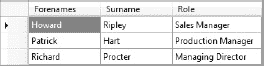
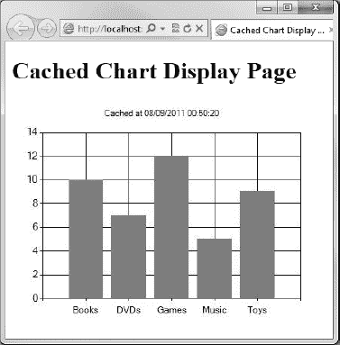

## C H A P T E R 6

## 使用数据

通过将 ASP.NET 网页与 SQL Server Compact Edition 相结合，Microsoft WebMatrix 为构建数据驱动的动态 Web 应用程序提供了一个强大的框架。

在前面的章节中，我们已经使用了会话、cookies、表单和 HTTP 请求，所有这些都允许我们在一段时间内维护状态，但是对于永久的数据存储来说是没有用的。在数据驱动的网站中，数据库(在我们的例子中是 SQL Server Compact)提供了一个永久存储，允许开发需要稳定数据持久性的 web 应用程序，作为设计的一个组成部分。

在 web 应用程序中，数据库的使用范围很广；当内容频繁更改或来自多个来源时，或者当必须管理和呈现大量信息时，数据库特别有用。

本章介绍了 SQL Server Compact Edition 数据库的创建和管理，并介绍了用户如何通过 ASP.NET 网页与数据库进行交互。我们将首先为一个虚构的公司创建一个员工数据库，然后使用 WebMatrix 内置的功能来开发网页，以方便常见的创建、读取、更新和删除(CRUD)操作。

### SQL Server Compact Edition

WebMatrix 附带了 SQL Server Compact Edition 数据库的 4.0 版，该版本由 Web Platform 安装程序作为平台的一个组成部分进行安装。这是一个基于文件的数据库，所有的数据都存储在一个文件中。sdf 文件扩展名，这使得部署变得容易，因为不需要在 web 服务器上进行额外的安装。由于数据库文件存储在我们的站点内，当我们使用 WebMatrix 提供的工具将站点部署到生产服务器时，它可以自动部署(有关部署的更多信息，请参见[第 13 章](13.html#ch13))。

SQL Server Compact 数据库的最大大小限制为 4 GB，但是如果可伸缩性成为问题，可以通过升级途径轻松迁移到 SQL Server 系列的其他产品。我们将在本章的后面讨论升级数据库的方法。

#### 创建数据库

尽管使用文本命令创建和管理 SQL Compact 数据库是完全可能的，但是 WebMatrix IDE 提供了一个图形设计工具来简化我们的工作。要访问 IDE 的数据库功能，首先在工作区选择器中选择`Databases`选项卡。一个 WebMatrix 项目可以包含多个数据库，尽管在这个简单的例子中我们只需要一个。要创建新的数据库，单击功能区控件中的`New Database`按钮或内容窗格中间的`Add a database to our site`按钮。将创建一个空数据库，并显示在导航窗格中，如果需要，可以在导航窗格中对其进行重命名。默认情况下，数据库将被赋予与我们的项目相同的名称，以. sdf 文件扩展名作为后缀。

 **注意**数据库文件本身存储在我们项目的 App_Data 文件夹中。如果 App_Data 文件夹尚不存在，WebMatrix 将为我们创建一个。

##### 创建表格

现在我们有了一个空数据库，我们需要添加一些表来存储我们的数据。要创建一个表，要么单击功能区控件中的`New Table`按钮，要么右键单击导航窗格中数据库下的 Tables 节点并选择`New Table`。

随着新表在设计器中打开，可以通过单击功能区控件中的`New Column`按钮来添加列。设计器分为两部分:上半部分包含整个表格的概览，而下半部分显示所选列的属性(参见[图 6-1](#fig_6_1) )。

***图 6-1。**WebMatrix IDE 中的表格设计工具*

下面的[表 6-1](#tab_6_1) 描述了六个默认属性，可在 WebMatrix 设计工具中对每列进行编辑。

如[表 6-1](#tab_6_1) 所示，数据类型属性可以设置为 SQL Server Compact 定义的十八种不同数据类型之一。下面的[表 6-2](#tab_6_2) 详细介绍了这些类型及其用途。

要添加第一列的细节，我们只需在空的属性面板中输入细节，如图 6-1 所示。请注意，我们只能在设计器下半部分的属性面板中输入值；上半部分完全是只读的(对于以前使用过其他 SQL Server 设计工具的读者来说，这可能会令人惊讶)。一旦我们输入了详细信息，请按功能区控件上的“新建列”按钮，然后输入下一列的详细信息；重复此操作，直到添加完所有列。

[表 6-3](#tab_6_3) 显示了要添加到我们的第一个表中的列的详细信息。

一旦我们添加了所有的列，点击屏幕左上方的保存按钮，或点击 Ctrl+S 并在提供的框中输入表名“雇员”(见[图 6-2](#fig_6_2) )。

***图 6-2。**保存雇员表*

保存表格后，功能区控件上的数据按钮将变为可用。点击按钮，输入一些测试数据，如[图 6-3](#fig_6_3) 所示。

 **注意**不要试图在 EmployeeID 列中输入数据，因为它是一个标识字段，SQL Server Compact 将为我们填充唯一值，在我们的例子中是整数。如果我们尝试在列中输入数据，无论是通过设计器还是稍后通过 ASP.NET 网页中的代码，我们都会遇到错误。

如果我们在设计器中错误地在这个列中输入了一个值，有时会很难继续，因为每次我们试图移动到一个新列时，都会收到一个“无效格式”或类似的错误。对于任何错误消息，单击“确定”,然后按 Esc 键取消我们的更改。这将使值返回 null。

***图 6-3。**输入员工表的样本测试数据*

 **注意**出生日期列的日期格式将取决于我们开发机器的本地日期格式设置。在[图 6-3](#fig_6_3) 中的截图中，它们被设置为我的机器的日期格式，这是 dd/mm/yyyy 的标准英国格式。

现在我们知道了如何创建数据库和表，我们可以看看通过代码与数据交互的方法。首先，我们需要确保对结构化查询语言(SQL)有一个基本的了解，SQL Server 使用这种语言与数据进行交互。

 **注意**经验丰富的 SQL Server 用户无疑会注意到，这里没有创建其他类型的数据库对象的工具，比如存储过程、触发器、视图等。SQL Server Compact Edition 是 SQL Server 的一个大幅缩减的基于文件的版本，因此只提供了部分功能。如果我们确实需要此功能，我们可以将 WebMatrix 与不同版本的 SQL Server 一起使用(请参见本章末尾的使用其他数据库部分)。

### 与数据互动

结构化查询语言(SQL)是一种久经考验的通过代码与数据和数据库交互的方式。它是在 20 世纪 70 年代早期由 IBM 开发的，现在被大多数关系数据库系统用于数据检索和操作。SQL 有几个版本，它们的功能稍有不同，尽管这种语言的核心特性(包括本章中的特性)在所有版本中都是通用的。这意味着相同的 SQL 可以在不同的数据库中使用，通常只需要很小的语法变化。SQL Server 数据库使用名为 Transact-SQL 的 SQL 版本，通常称为 t-SQL。

可以在 WebMatrix IDE 中对我们的数据库运行 SQL，方法是关闭任何打开的表，切换到功能区控件中的“主页”选项卡，然后单击“新建查询”按钮。若要运行查询，请使用功能区控件中的“执行”按钮，该按钮位于“新建查询”按钮的右侧。

 **注意**这一节只是为新手准备的，作为 SQL 的一个非常基本的介绍，这将有助于很好地理解本书其余部分的代码。如果我们已经很好地掌握了 SQL 的工作知识，我们可能想跳到下一节。

关于使用 T-SQL 的更详细的信息来源，请看一下 http://msdn.microsoft.com/en-us/library/bb510741.aspx 的 MSDN Transact-SQL 参考资料。

#### 获取数据

为了从数据库(CRUD 中的 R)读取数据，我们使用 SQL `select`命令。根据我们作为命令的一部分指定的一组标准，`select`命令搜索特定的记录。执行该命令时，数据库将返回零个、一个或多个匹配行。

`select`语句的最简单形式如下:

`SELECT <column names> FROM <table name>`

列名以逗号分隔列出，或者如果我们希望返回所有列，可以用星号(`*`)替换。以下 SQL 语句返回图 6-4 中[所示的数据。](#fig_6_4)

`SELECT Forenames, Surname, Role FROM Employees` 

***图 6-4。**一个简单的 SQL select 语句的结果*

 **注意** T-SQL 不区分大小写，但是我们会注意到，在前面的 SQL 语句中，我已经用大写字母输入了 SQL 关键字(SELECT 和 FROM)。这只是一个约定，有助于将 SQL 与表、列等的名称区分开来。T-SQL 也不关注空白，除非是在文字值中。

通过使用`where`子句，可以进一步提取由`select`语句返回的行集合。`where`子句用于指定我们希望用来过滤一列的值或值的范围。例如，下面两条语句分别只返回工程师和除总经理以外的所有人。

`SELECT Forenames, Surname, Role FROM Employees WHERE Role = 'Engineer'

SELECT * FROM Employees WHERE Role != 'Managing Director'`

请注意，在 T-SQL 字符串中，文字被单引号包围，而不是像我们在 C#中习惯的双引号。

使用标准布尔运算符，可以将几个过滤器作为`where`子句的一部分。例如，该 SQL 返回图 6-5 中[所示的记录。](#fig_6_5)

`SELECT Forenames, Surname, Role
FROM Employees
WHERE Role = 'Engineer' OR Role = 'Production Manager'` 

***图 6-5。**挑选工程师和生产经理*

如果我们只想查找字符串文字的部分匹配，我们可以将`like`语句与[表 6-4](#tab_6_4) 中描述的四个通配符结合使用。

下面的 SQL 示例使用`like`语句返回所有经理，如图[图 6-6](#fig_6_6) 所示。

`SELECT Forenames, Surname, Role FROM Employees WHERE Role LIKE '%Manager'` 

***图 6-6。**使用%通配符返回所有经理*

在同一个语句中使用多个通配符是完全可以接受的。例如，如果我们想在结果集中包括总经理，我们可以在字符串文字的两边使用多字符通配符，这将返回如图 6-7 所示的结果。

`SELECT Forenames, Surname, Role FROM Employees WHERE Role LIKE '%Manag%'` 

***图 6-7。**使用多个通配符将总经理包含在结果集中*

最后，我们可以通过使用`order by`语句指定列名和方向来选择结果集的排序方式。该语句后面是逗号分隔的列名列表，可以按升序(`asc`)或降序(`desc`)排序。如果没有给出分类方向，默认设置为`asc`。

以下语句返回在[图 6-8](#fig_6_8) 中看到的结果集。

`SELECT Surname, Forenames FROM Employees WHERE Surname LIKE 'H%' ORDER BY Surname DESC` 

***图 6-8。**按反字母顺序排列结果*

结果可以按多列排序。例如，下面的代码首先按角色排序，然后按姓氏排序，并返回在图 6-9 中看到的结果。

`SELECT Surname, Forenames, Role FROM Employees ORDER BY Role, Surname` 

***图 6-9。**按多列对结果进行排序——在本例中，角色后跟姓氏*

这里我们可以看到这两位工程师是按姓氏的字母顺序排列的。

#### 插入数据

为了在表中创建一个新行(CRUD 中的 C ),我们将 SQL `insert`语句与`into`和`values`关键字结合使用。最简单的形式是，可以使用下面的语法编写`insert`语句。

`INSERT INTO <table name> VALUES (<column values>)`

然而，更常见的是指定列名和列值；这极大地提高了可读性，避免了需要参考数据库模式来理解代码。这种语法还可以用于将数据插入特定的字段，如果表中有一些不可为空的列，这将非常有用。

`INSERT INTO <table name> (<column names>) VALUES (<column values>)`

在这种情况下，指定列名是绝对必要的，因为我们的第一列 EmployeeId 是一个自动生成的标识列，如果我们试图为它指定一个值，将会在 SQL Server 中导致错误。要将一行数据添加到我们的 Employees 表中，我们可以使用下面的 SQL 来添加图 6-10 中的记录。

`INSERT INTO Employees (Forenames, Surname, DateOfBirth, EmailAddress, Role)
VALUES ('Roger', 'Smith', '02/03/1975', 'r.smith@example.com', 'IT Technician')` 

***图 6-10。**我们的新员工被添加到员工表中*

请注意，我们添加的记录的`EmployeeId`可能与这里显示的不同。每次向表中添加新行时，SQL Server 都会自动生成`EmployeeId`字段的值，因此分配的值将取决于表中已经有多少行。

#### 更新数据

SQL `update`命令用于更改表中的现有数据。`update`命令与`set`关键字一起使用，指定要影响的列及其新值。

`UPDATE <table name> SET <column name> = <value>`

以这种方式使用，该命令将更新表中的每一行。因此，通常使用 SQL `where`子句为要更新的行指定标准。

`UPDATE <table name> SET <column name> = <value> WHERE <criteria>`

例如，假设我们知道`EmployeeId`，我们可以使用下面的 SQL 更改我们在前面的例子中添加的记录的电子邮件地址和角色。

`UPDATE Employees
SET EmailAddress = 'roger@example.com', Role = 'Systems Engineer'
WHERE EmployeeId = 24`

#### 删除数据

SQL `delete`命令用于从数据库表中删除现有的行。要使用`delete`命令，我们只需指定表名和要删除的行。

`DELETE FROM <table name> WHERE <criteria>`

要从 Employees 表中删除一行，我们可以使用下面的语句。

`DELETE FROM Employees WHERE Forenames = 'Roger' AND Surname = 'Smith'`

 **注意**在使用 SQL 编写代码从数据库表中删除记录时要小心。WHERE 子句实际上是可选的，但是通过省略它，我们将删除表中的每条记录。我们应该格外小心，不要无意中这样做——它已经抓住了许多有经验的开发人员！

另外，要特别注意 WHERE 子句中使用的标准。如果我们打算只删除一行，请确保我们的标准绝对具体，并且不能应用于多条记录，这通常意味着指定相关行的唯一主键值。如果命令的标准是在代码中动态生成的，这就特别容易发生冲突。

现在我们已经掌握了对 SQL Server 数据库执行 CRUD 操作所需的基本 SQL，我们可以学习如何将 ASP.NET 网页连接到数据库，并开始创建真正有用的、动态的、数据驱动的网页，这些网页与数据库中的对象进行交互。

### 用 WebMatrix 进行数据访问

WebMatrix 中的数据访问从一开始就被设计为提供一种简单、快速和有效的方法来执行基于 SQL 的数据库操作。遵循 WebMatrix 的精神，ASP.NET 网页提供了以极其简单的方式促进数据库交互的类，避开了对象关系映射(ORM)解决方案和在许多其他框架中广泛存在的其他庞大的代码构造和抽象。WebMatrix 是关于敏捷和快速开发的，这正是`WebMatrix.Data`名称空间中的类给我们的。

在本节中，我们将基于本章前面创建的雇员数据库创建一个小型网站，使用户能够执行最常用的操作—创建新记录、读取和显示数据、更新现有记录以及删除它们。这个例子将为我们创建自己的功能丰富、数据驱动的动态页面提供基础。

#### 连接

在从 ASP.NET 网页执行任何数据库操作之前，我们需要为该网页提供一个数据库连接。数据库连接让 ASP.NET 知道我们打算在哪个数据库上操作，它是使用`Database`对象的`Open`方法建立的。

`Database.Open(*filename*)`

 **注**经验丰富。NET 开发人员应该注意，这不同于创建 ADO.NET 连接。

该方法打开到数据库文件的连接，该数据库文件的文件名被指定为参数。WebMatrix 假设。包含数据库的 sdf 文件保存在我们站点的 App_Data 文件夹中，我们不应该指定。文件名参数中的 sdf 文件扩展名，只是文件的名称。例如，要打开到存储在我们网站的 App_Data 文件夹中的名为 EmployeeData.sdf 的 SQL Server Compact 数据库的连接，我们调用`Database.Open`方法如下:

`Database.Open("EmployeeData")`

 **注**按照惯例，数据库。Open 方法将查找 SQL Server Compact 数据库，该数据库以. sdf 文件扩展名存储在默认的 App_Data 文件夹中。但是，连接到不同类型的数据库或存储在 App_Data 文件夹之外的位置的数据库是完全可能的，而且经常是必要的。我将在本章后面的使用其他数据库部分介绍实现这一点的方法。

现在我们已经在页面和数据库之间建立了连接，我们可以开始检索数据并将其显示给用户。

#### 检索和显示数据

ASP.NET 网页提供了包含简化数据库交互的类的`WebMatrix.Data`名称空间。在`WebMatrix.Data`命名空间中的`Database`类公开了三个为执行 SQL `select`命令而设计的方法:`Query`、`QuerySingle,`和`QueryValue`。`Query`方法返回记录的集合，`QuerySingle`返回单个记录，`QueryValue`返回单个标量值作为 SQL 聚合或标量函数的结果(如 count、avg、min、max、len 等。).

为了从数据库中获取所有的雇员记录，我们将使用`Database`类的`Query`方法。`Query`方法对指定的数据库执行一个 SQL 查询，并返回一个包含结果数据行的通用动态集合(特别是`IEnumerable<dynamic>`)。

因此，让我们创建一个名为 default.cshtml 的新页面，并在一个 html 表中列出数据库的内容。为此，我们将首先打开一个到数据库的连接(在本例中，我的数据库名为 DataExample.sdf 我们应该把它改成我们称之为数据库的东西)并在页面顶部的代码块中定义必要的 SQL `select`语句。

`@{
    var db = Database.Open("DataExample");
    var sqlCommand = "SELECT * FROM Employees ORDER BY Surname";
}`

现在我们将利用`Query()`方法的返回类型是`IEnumerable<dynamic>`这一事实，通过使用`foreach`循环遍历结果，并在运行时动态构建一个包含雇员数据的表。

`@{
    var db = Database.Open("DataExample");
    var sqlCommand = "SELECT * FROM Employees ORDER BY Surname";
}
<!DOCTYPE html>

<html lang="en">
    <head>
        <meta charset="utf-8" />
        <title>Employees</title>
    
    </head>
    <body>
        <h1>Employees</h1>
        **<table>
            <thead>
                <tr>
                    <th>Employee Id</th>
                    <th>Forenames</th>
                    <th>Surname</th>
                    <th>Date Of Birth</th>
                    <th>Email Address</th>
                    <th>Role</th>
                </tr>
            </thead>
            <tbody>
                @foreach (var row in db.Query(sqlCommand))
                {
                    <tr>
                        <td>@row.EmployeeId</td>
                        <td>@row.Forenames</td>
                        <td>@row.Surname</td>
                        <td>@row.DateOfBirth</td>
                        <td>@row.EmailAddress</td>
                        <td>@row.Role</td>
                    </tr>  
                }
            </tbody>
        </table>**
    </body>
</html>`

`foreach`语句只是对页面顶部打开的数据库执行命令，并遍历结果的每一行。在每次迭代中，即对于每个返回的新记录，我们将发出一组 HTML `<tr>`标签和六组`<td>`标签，每个标签对应于返回的数据集中的每一列。

记住`Query()`方法返回`IEnumerable<dynamic>`是很重要的。这样做的好处是，我们可以对返回的任何动态属性执行任何法律操作。例如，ASP.NET 不知道，坦率地说，也不关心每一列包含什么数据类型。然而，我们知道`DateOfBirth`是一个`DateTime,`，所以我们可以在编译器没有任何抱怨的情况下执行以下操作，因为该语句将在运行时被 DLR 解析。

`<td>@row.DateOfBirth**.ToLongDateString()**</td>`

当我们运行这段代码时，我们会看到，当页面在浏览器中呈现时，DateOfBirth 字段按预期进行了格式化(参见[图 6-11](#fig_6_11) )。

***图 6-11。**Employees 表的内容，用格式化的出生日期列呈现。*

现在我们可以获取并显示现有的数据库记录，让我们看看如何添加一些新的记录。

#### 添加记录

在我们考虑如何使用`WebMatrix.Data`来执行 SQL insert 语句之前，我们需要一个包含 HTML 表单的页面，供用户填写和提交。因此，我们将创建一个名为 add.cshtml 的新页面，并添加一个用于数据捕获的表单。

 **注意**当我们在执行数据持久化功能时，我们必须确保在表单中使用 HTTP post 方法，以帮助防止有人将恶意表单字段值或 SQL 注入 URL 而造成跨站点攻击的可能性。

`<!DOCTYPE html>

<html lang="en">
    <head>
        <meta charset="utf-8" />
        <title>Add an Employee</title>
        
    </head>
    <body>
        <h1>Add an Employee</h1>
        <form action="add.cshtml" method="post">
            <fieldset>
                <legend>Employee Details</legend>
                 

                    @Html.Label("Forenames: ", "forenames")
                    @Html.TextBox("forenames")
                

                

                    @Html.Label("Surname: ", "surname")
                    @Html.TextBox("surname")
                

                

                    @Html.Label("Date of Birth: ", "dateOfBirth")
                    @Html.TextBox("dateOfBirth")
                

                

                    @Html.Label("Email Address: ", "emailAddress")
                    @Html.TextBox("emailAddress")
                

                

                    @Html.Label("Role: ", "role")
                    @Html.TextBox("role")
                

            </fieldset>
            

                <input type="submit" value="Add Employee" />
            

        </form>
    </body>
</html>`

这将向用户呈现图 6-12 中所示的表格。

***图 6-12。**“添加员工”页面。*

请注意，这里没有用于`EmployeeId,`的字段，因为它是一个身份字段，当我们插入新记录时，SQL Server 会生成该字段。

接下来，我们将在页面的最顶端添加一些代码，以检测表单的回发，并将提交的表单数据插入数据库。

 **注意**为了保持本章示例的清晰和重点，给出的代码示例不包含输入验证。在提交到数据库之前，对所有用户输入进行彻底的验证是绝对必要的。在最好的情况下，未能正确执行这种验证会导致错误和错误，但也可能暴露重大的安全缺陷，如果被利用，可能会造成损害和代价高昂。

有关使用 ASP.NET 网页进行表单验证的更多信息，请参见第 5 章。

`@{
    if (IsPost) {

        var forenames = Request["forenames"];
        var surname = Request["surname"];
        var dateOfBirth = Request["dateOfBirth"];
        var emailAddress = Request["emailAddress"];
        var role = Request["role"];

        var db = Database.Open("DataExample");
        var sqlCommand = "INSERT INTO Employees " +
                "(Forenames, Surname, DateOfBirth, EmailAddress, Role) " +
                "VALUES (@0, @1, @2, @3, @4)";
        db.Execute(sqlCommand, forenames, surname, dateOfBirth, emailAddress, role);

        Response.Redirect("~/default");
    }
}`

让我们仔细看看这段代码到底是如何工作的。如果代码作为页面回发的结果被执行，我们声明一些变量并用提交的表单的值填充它们。接下来，我们打开一个到数据库的连接，并使用参数占位符(`@0, @1, @2, @3, @4`)代替要插入的值来构建您的 SQL `insert`查询。

`var sqlCommand = "INSERT INTO Employees " +
                 "(Forenames, Surname, DateOfBirth, EmailAddress, Role) " +
                 "VALUES (@0, @1, @2, @3, @4)";`

 **提示**我们应该始终使用参数向 SQL 命令传递值，如本例所示。这有助于确保数据以正确的格式传递到查询中，并利用 ASP。NET 的内置安全措施，有助于防止 SQL 注入攻击。

关于 SQL 注入攻击以及如何防范的更多信息可以在 http://msdn.microsoft.com/en-us/library/ms161953.aspx 的 MSDN 网站上找到

一旦我们使用参数占位符构造了 SQL `insert`语句，我们就调用`Execute()`方法，传入包含替换占位符的值的变量。

`db.Execute(sqlCommand, forenames, surname, dateOfBirth, emailAddress, role);`

 **注意**虽然我在这里选择忽略它，但是`Execute()`方法实际上返回了一个包含受命令影响的行数的整数，方式类似于 ADO.NET`ExecuteNonQuery()`方法。

最后，我们使用 Response 对象的 redirect 方法将用户重定向到 default.cshtml。

`Response.Redirect("~/default");`

请注意，我们不需要声明。cshtml 文件扩展名，因为内置的路由系统会为我们处理这个问题。有关 ASP.NET 网页路由系统的更多信息，请参见第 4 章中的 URL 和路由部分。

您的最后一项工作是在默认页面上提供一个链接，将我们带到添加新员工页面。将以下内容直接添加到 default.cshtml 的标题下。

`

    <a href="add">Add an Employee</a>

`

#### 编辑现有数据

我们需要为我们的用户提供一种能够编辑现有员工记录的方法。我们将通过添加一个包含从数据库填充的表单的新页面(edit.cshtml)来实现这一点。我们还需要在默认页面上的雇员列表中的每一行添加一个链接，将用户重定向到我们的编辑表单，在 URL 中传递 EmployeeId。

我们将首先通过向 default.cshtml 中的现有表添加一个额外的列来构建到编辑页面的链接。

`<table>
    <thead>
        <tr>
            <th>Employee Id</th>
            <th>Forenames</th>
            <th>Surname</th>
            <th>Date Of Birth</th>
            <th>Email Address</th>
            <th>Role</th>
            **<th>&nbsp;</th>**
        </tr>
    </thead>
    <tbody>
        @foreach (var row in db.Query(sqlCommand))
        {
            <tr>
                <td>@row.EmployeeId</td>
                <td>@row.Forenames</td>
                <td>@row.Surname</td>
                <td>@row.DateOfBirth.ToLongDateString()</td>
                <td>@row.EmailAddress</td>
                <td>@row.Role</td>
                **<td><a href="edit/@row.EmployeeId">Edit</a></td>**
            </tr>  
        }
    </tbody>
</table>`

这段代码为每个雇员呈现了一个链接，该链接指向作为 URL 一部分的 EmployeeId(见[图 6-13](#fig_6_13) )。ASP.NET 网页发送到浏览器的实际 HTML 看起来会像这样。

`<a href="edit/5">Edit</a>`

当用户点击此链接时，ASP.NET 网页路由系统会将浏览器重定向到 edit.cshtml，因为在名为`edit`的文件夹中没有像 5.cshtml 这样的页面(参见[第 4 章](04.html#ch4)以获得进一步的解释)。然后，我们可以在编辑页面中使用 Razor 代码来查询 URL 并提取我们感兴趣的特定 EmployeeId。

***图 6-13。**添加到员工列表的编辑链接*

接下来，我们将添加一个名为 edit.cshtml 的新页面，并创建一个用于编辑的表单。我们将在 UrlData 中获取与传递到页面的 EmployeeId 相关的记录，并填充表单控件。

`@{
    var employeeId  = UrlData[0];
    if (employeeId.IsEmpty()) {
         Response.Redirect(@Href("~/default"));
    }

    var forenames = "";
    var surname = "";
    var dateOfBirth = "";
    var emailAddress = "";
    var role = "";

    var db = Database.Open("DataExample");

    var sqlSelect = "SELECT * FROM Employees WHERE EmployeeId=@0";

    var row = db.QuerySingle(sqlSelect, employeeId);

    forenames = row.Forenames;
    surname = row.Surname;
    dateOfBirth = row.DateOfBirth.ToShortDateString();
    emailAddress = row.EmailAddress;
    role = row.Role;
}

<!DOCTYPE html>

<html lang="en">
    <head>
        <meta charset="utf-8" />
        <title>Edit Employee Record</title>
        
    </head>
    <body>
        <h1>Edit Employee Record</h1>
        <form action="" method="post">
            <fieldset>
                <legend>Employee Details</legend>
                 

                    @Html.Label("Forenames: ", "forenames")
                    @Html.TextBox("forenames", forenames)
                

                

                    @Html.Label("Surname: ", "surname")
                    @Html.TextBox("surname", surname)
                

                

                    @Html.Label("Date of Birth: ", "dateOfBirth")
                    @Html.TextBox("dateOfBirth", dateOfBirth)
                

                

                    @Html.Label("Email Address: ", "emailAddress")
                    @Html.TextBox("emailAddress", emailAddress)
                

                

                    @Html.Label("Role: ", "role")
                    @Html.TextBox("role", role)
                

            </fieldset>
            

                <input type="submit" value="Update Employee Record" />
            

        </form>
    </body>
</html>`

这段代码的第一部分从 UrlData 获取 EmployeeId，它是从我们添加到默认页面的链接传入的。然后，我们检查 EmployeeId 的值，如果它是空白的，就将浏览器返回到默认页面。这处理了用户可能直接浏览到编辑页面而没有在 URL 中指定 EmployeeId 的情况。

`var employeeId  = UrlData[0];
if (employeeId.IsEmpty()) {
     Response.Redirect(@Href("~/default"));
}`

在对 Response 对象的 Redirect 方法的调用中，我们会注意到我们使用了 Href helper。Href 帮助器从本地文件路径构建一个 URL，这意味着我们可以使用 ASP.NET 波浪符号(~)从应用程序的根目录引用默认页面。这样做的好处是，无论我们将来将这个页面或站点移动到哪里，只要目标页面的位置保持不变，URL 仍然会被正确地构建；这解决了网站中的一个常见问题，即页面或站点移动，对相对或绝对 URL 的引用被破坏。

代码的下一部分声明了一些变量来保存从数据库中检索到的数据。然后，我们只需打开数据库，执行 SQL，将 EmployeeId 作为参数传入，并将返回值赋给变量。注意这里我们使用的是`QuerySingle()`方法，因为我们只检索一行。

最后一项工作是将包含雇员数据的变量值传递给用于显示表单控件的 Html helper 方法。

 **注意**关于使用 HTML 辅助控件来呈现 HTML 表单控件的更多信息，请参见第 5 章中的 Html 表单辅助部分。

正如我们在[图 6-14](#fig_6_14) 中看到的，如果我们现在运行默认页面，并点击其中一行的编辑链接，编辑页面将显示表单控件，这些控件根据 URL 中传递的 EmployeeId 填充了数据库中的数据。

***图 6-14。**填充的编辑表单:注意地址栏中包含 EmployeeId 的 URL。*

现在我们需要写一些代码来处理表单提交。我们希望更新数据库中的记录，并在单击 Update Employee Record 按钮时将用户重定向回默认页面。修改页面顶部的代码块，以包含清单中以粗体突出显示的代码。

`@{
    var employeeId  = UrlData[0];
    if (employeeId.IsEmpty()) {
         Response.Redirect(@Href("~/default"));
    }

    var forenames = "";
    var surname = "";
    var dateOfBirth = "";
    var emailAddress = "";
    var role = "";

    var db = Database.Open("DataExample");

**    if (IsPost) {

        forenames = Request["forenames"];
        surname = Request["surname"];
        dateOfBirth = Request["dateOfBirth"];
        emailAddress = Request["emailAddress"];
        role = Request["role"];

        var sqlCommand = "UPDATE Employees SET Forenames = @0, Surname = @1, " +
                "DateOfBirth = @2, EmailAddress = @3, Role = @4 " +
                "WHERE EmployeeId = @5";
        db.Execute(sqlCommand, forenames, surname, dateOfBirth, emailAddress, 
role, employeeId);

        Response.Redirect(@Href("~/default"));
    }**

    var sqlSelect = "SELECT * FROM Employees WHERE EmployeeId=@0";

    var row = db.QuerySingle(sqlSelect, employeeId);

    forenames = row.Forenames;
    surname = row.Surname;
    dateOfBirth = row.DateOfBirth.ToShortDateString();
    emailAddress = row.EmailAddress;
    role = row.Role;
}`

这里，在`If(IsPost)`代码块中，我们将提交的表单字段的值赋给变量，并对数据库执行 SQL update 命令，将变量作为参数传入。这是使用数据库对象的`Execute()`方法完成的，就像我们之前插入记录时使用的方法一样。一旦记录被更新，我们将用户重定向回默认页面。

既然我们已经实现了 CRUD 的创建、读取和更新部分，我们只剩下删除部分，我们将在下一节中处理它。

#### 删除记录

为了实现我们的删除功能，我们将在默认页面上为每个员工添加一个到员工列表的删除链接。单击此链接会将用户带到一个页面，要求在实际删除操作发生之前进行确认。由于 HTML 超链接总是发出 HTTP GET 请求，这是一个重要的步骤，因为通过 HTTP GET 请求执行删除操作(或任何影响持久数据的操作)是违反 W3C 准则的。

首先，让我们为雇员列表中的每个雇员添加一个指向默认页面的删除链接。修改表中的最后一列，以包含一个指向 delete.cshtml 的链接，并在 UrlData 中传递 EmployeeId。

`<tbody>
    @foreach (var row in db.Query(sqlCommand))
    {
        <tr>
            <td>@row.EmployeeId</td>
            <td>@row.Forenames</td>
            <td>@row.Surname</td>
            <td>@row.DateOfBirth.ToLongDateString()</td>
            <td>@row.EmailAddress</td>
            <td>@row.Role</td>
            <td>
                <a href="edit/@row.EmployeeId">Edit</a**> |
                <a href="delete/@row.EmployeeId">Delete</a>**
            </td>
        </tr>  
    }
</tbody>`

接下来，我们将创建 delete.cshtml 并编写代码从数据库中获取相关记录，并向用户显示一些确认文本。

`@{
    var employeeId  = UrlData[0];
    if (employeeId.IsEmpty()) {
         Response.Redirect(@Href("~/default"));
    }

    var db = Database.Open("DataExample");

    var sqlSelect = "SELECT Forenames, Surname FROM Employees WHERE EmployeeId=@0";
    var row = db.QuerySingle(sqlSelect, employeeId);
}
<!DOCTYPE html>

<html lang="en">
    <head>
        <meta charset="utf-8" />
        <title>Delete Employee Record</title>
    </head>
    <body>
        <h1>Delete Employee Record</h1>
        

            Are we sure we want to delete employee @employeeId, @row.Forenames @row.Surname?
        

        

            <form action="" method="post">
                <input type="button"
                onclick="document.location.href='default.cshtml';"
                value="Cancel" />
                <input type="submit" value="Delete" />
            </form>
        

    </body>
</html>`

这段代码的第一部分从 UrlData 获取 EmployeeId，并将其存储在一个变量中以备后用。如果 UrlData 为空，用户将返回到默认页面。接下来，我们使用 Database 对象的`QuerySingle()`方法从数据库中选择一行，并将 EmployeeId 作为参数传入。

 **注意**由于基于 web 的应用程序的性质，在创建员工列表和显示删除页面之间，或者在显示和提交删除确认表单之间，总是存在员工记录被其他用户删除的可能性(尽管可能性很小)。为了清楚起见，这个代码示例不执行任何检查来确保要删除的雇员确实存在。然而，在生产环境中，我们的代码必须考虑所有这些可能性，以避免潜在的错误。

然后向用户显示确认文本，显示要删除的雇员的姓名和 EmployeeId。这有助于确保删除正确的记录(参见[图 6-15](#fig_6_15) )。我们提供了一个标准的提交按钮来确认删除，以及第二个 HTML 按钮来取消操作。cancel 按钮在`onclick`事件中使用 JavaScript，它将用户重定向回默认页面，而不提交表单。

`<input type="button"
 onclick="document.location.href='default.cshtml';"
 value="Cancel" />
<input type="submit" value="Delete" />` 

***图 6-15。**删除确认页面*

最后，我们将添加一些代码来检测 HTTP POST 请求，并对 Employees 表执行 SQL `delete`操作，这符合前面提到的 W3C 准则。如果站点被设置为直接从默认页面的链接中删除，而不需要来自确认页面的 HTTP POST 请求，任何人都可以通过浏览正确格式的 URL 从数据库中删除记录，比如`[http://<servername>/delete/4](http://<servername>/delete/4)`。

修改页面顶部的代码块，以包括下面清单中以粗体显示的 POST 请求处理程序，该处理程序在回发时删除行，并将用户返回到默认页面。

`@{
    var employeeId  = UrlData[0];
    if (employeeId.IsEmpty()) {
         Response.Redirect(@Href("~/default"));
    }

    var db = Database.Open("DataExample");

**    if (IsPost)
    {
        var sqlDelete = "DELETE FROM Employees WHERE EmployeeId=@0";
        db.Execute(sqlDelete, employeeId);
        Response.Redirect("~/default");
    }**

    var sqlSelect = "SELECT Forenames, Surname FROM Employees WHERE EmployeeId=@0";
    var row = db.QuerySingle(sqlSelect, employeeId);
}`

既然我们可以创建、读取、更新和删除数据库记录，那么让我们看看几个方便的特性，它们可以帮助我们向用户显示有用的数据；WebGrid 和图表助手。

### 使用 WebMatrix 助手显示数据

WebMatrix 自带了两个助手，旨在简化两种常见数据显示场景的开发:网格(或表格数据)和图形。在本节中，我们将研究这两种方法，并讨论它们的常见用法。

#### web grid 助手

WebGrid 助手用于呈现表格数据。在本章的前面，在检索和显示数据部分，我们使用了一个`foreach`循环来遍历一组数据库记录并构造一个表。这是 web 页面开发中非常常见的需求，WebGrid 旨在简化和加速这一需求。该助手还提供了对格式化、分页和排序的支持，所有这些我们将在本节中看到示例。这些例子都将使用我们在本章前面构建的雇员数据库。

##### 显示数据

首先在我们网站的根目录下创建一个名为 EmployeeGrid.cshtml 的新文件。

`@{
    var db = Database.Open("DataExample");
    var sqlCommand = "SELECT * FROM Employees ORDER BY Surname";
    var result = db.Query(sqlCommand);
    var employeeGrid = new WebGrid(result);
}
<!DOCTYPE html>

<html lang="en">
    <head>
        <meta charset="utf-8" />
        <title>Employee Grid</title>
    </head>
    <body>
        <h1>Employee Grid</h1>
        

            @employeeGrid.GetHtml()
        

    </body>
</html>`

现在，页面顶部代码块的前三行可能看起来很熟悉。他们只需打开一个到数据库的连接，定义一个 SQL 查询以按姓氏的字母顺序返回数据库中的所有记录，最后对数据库执行该查询并将返回的记录存储在`result`变量中。

初始代码块的最后第四行是我们开始实际使用 WebGrid 助手的地方。

`var employeeGrid = new WebGrid(result);`

这里，我们创建一个新的 WebGrid 对象，并将其赋给一个名为`employeeGrid`的变量。然后我们只需要在页面中调用 WebGrid 的`GetHtml()`方法来呈现它。我们在 HTML `div`元素中渲染网格，将其`id`属性设置为“grid”，稍后我们将使用它进行样式化。

`

    @employeeGrid.GetHtml()

`

运行页面，我们会看到渲染后的网格，如图 6-16 中的[所示。我们会注意到 WebGrid 的列标题是超链接。单击这些超链接将根据这些列中的数据对表格进行排序。](#fig_6_16)

***图 6-16。**由 WebGrid 助手呈现的雇员网格*

显然，WebMatrix WebGrid helper 以绝对最少的代码提供了一个开箱即用的非常有用的 UI；它使用标题和可排序的列进行合理的格式化，并发出符合 HTML5 标准的标记。但是，有几种方法可以进一步改进格式和功能，我们将在接下来的三个部分中研究这些方法。

##### 格式化列

正如我们所看到的，默认情况下，WebGrid helper 显示 SQL 查询返回的所有数据列，使用数据库中定义的列名作为网格中的列标题。我们可以通过只显示查询返回的数据列的子集，并指定 WebGrid 中列的数据应该如何显示来定制这种行为。

实际上，WebGrid 实际上是由一个或多个`WebGridColumn`构成的。为了指定要显示的列以及它们的格式，我们需要将一个`WebGridColumn`的集合传递给 WebGrid 的`GetHtml()`方法。每个`WebGridColumn`有五个属性可以设置(见[表 6-5](#tab_6_5) )。

T2】

用下面的代码替换 EmployeeGrid.cshtml 中现有的代码和标记，我将在后面详细解释。

`@{
    var db = Database.Open("DataExample");
**    var sqlCommand = "SELECT Forenames, Surname, EmailAddress, Role FROM Employees
ORDER BY Surname";**
    var result = db.Query(sqlCommand);
    var employeeGrid = new WebGrid(result);
}
<!DOCTYPE html>

<html lang="en">
    <head>
        <meta charset="utf-8" />
        <title>Employee Grid</title>
        ****
    </head>
    <body>
        <h1>Employee Grid</h1>
        

**            @employeeGrid.GetHtml(
                columns: employeeGrid.Columns(
                    employeeGrid.Column("Surname",
                                        style: "name",
                                        format: @<text>
                                                    @item.Surname.ToUpper()
                                                </text>),
                    employeeGrid.Column("Forenames",
                                        style: "name"),
                    employeeGrid.Column("EmailAddress",
                                        "Email Address",
                                        format: @<text>
                                                    <a href="mailto:@item.EmailAddress">
                                                        @item.EmailAddress
                                                    </a>
                                                </text>),
                    employeeGrid.Column("Role",
                                        "Job Title",
                                        style: "role")
                )
            )**
        

    </body>
</html>`

首先，我们会注意到 SQL 查询已经发生了变化。因为我们只想显示列的子集，所以没有必要返回所有的列，因为这会浪费 web 服务器上的系统资源。当我们处理此示例中的少量数据时，这可能不是一个大问题，但是当处理较大的生产数据集时，这可能会导致严重的性能问题。

我们还在页面的 head 部分添加了一些 CSS 样式，我们将使用它们来设置表格单元格的样式。

`GetHtml()`方法调用发生了显著的变化，包括指定列和格式化列。如果我们运行该页面，我们将看到以下内容(参见[图 6-17](#fig_6_17) ):

***图 6-17。**格式化网格*

`GetHtml()`方法调用实际上并没有看起来那么复杂！在调用中，我们只是指定了参数`columns`的值。`columns`参数实际上是一组`WebGridColumn`对象，这就是我们在这段代码中创建的。

`WebGridColumn`类定义了表示`WebGrid`实例中的列的对象。该类有五个属性，可以在调用`WebGridColumn`构造函数时设置为命名参数。 [表 6-6](#tab_6_6) 描述了这些属性，它们的名称，类型，以及各自的`WebGridColumn`构造函数参数的名称。

这些都相当简单，除了`format`属性。该属性用于将值重新格式化为易读的形式，并添加 HTML 标记来为`WebGrid`列的数据提供自定义格式。当前行中任何一项的值都可以通过一个名为`item`的动态对象来检索。例如，`@item.Role`将检索当前行中`Role`列的值。如果我们想以粗体显示`Role`，我们可以简单地在`Role`列的`format`属性中包含一些 HTML:例如，`<strong>@item.Role</strong>`。

第一列由姓氏字段填充。它将其 CSS 样式设置为“name”，该样式在 head 部分中声明，并通过使用命名参数设置属性，将列宽设置为 150 像素。使用`String`类型的`ToUpper()`方法，格式参数被设置为以大写形式返回姓氏，我们能够这样做，因为`Database.Query()`方法返回`IEnumerable<dynamic>`。

`employeeGrid.Column("Surname",
                    style: "name",
                    format: @<text>
                                @item.Surname.ToUpper()
                            </text>),`

第二列显示 Forenames 字段，同样使用文档头中指定的“name”样式。

`employeeGrid.Column("Forenames",
                    style: "name"),`

第三列包含 EmailAddress 字段。这里，我们指定标题应该显示文本“Email Address”而不是字段名称，并且我们通过设置 format 参数来指定字段的格式。format 参数被传递了一个 HTML `mailto`超链接的模板，该模板将用`item.EmailAddress`填充。如前所述，可以使用`item`集合访问每一行中的数据。

`employeeGrid.Column("EmailAddress",
                    "Email Address",
                    format: @<text>
                                <a href="mailto:@item.EmailAddress">
                                    @item.EmailAddress
                                </a>
                            </text>),`

最后一列显示角色数据库字段的内容，列标题设置为“职务”通过使用 style 参数指定该列，该列被赋予“role”CSS 样式。

`employeeGrid.Column("Role",
                    "Job Title",
                    style: "role")`

##### 应用网格范围的样式

除了为单个表格单元格指定样式之外，WebGrid 的`GetHtml()`方法还允许我们设置大量应用于整个网格的 CSS 样式。这些在[表 6-7](#tab_6_7) 中列出如下。

我们现在将使用`GetHtml()`方法在整个网格中应用一些 CSS 样式来改善表示。将页眉中的样式标记修改为以下内容:

``

接下来，我们将使用命名参数将这些样式应用于表的相关元素。在页面主体中修改对`GetHtml()`方法的调用，如下所示:

`@employeeGrid.GetHtml(
**    tableStyle: "grid",
    headerStyle: "header",
    alternatingRowStyle: "alt",**
    columns: employeeGrid.Columns(
        employeeGrid.Column("Surname",
                            style: "name",
                            format: @<text>
                                        @item.Surname.ToUpper()
                                    </text>),
        employeeGrid.Column("Forenames",
                            style: "name"),
        employeeGrid.Column("EmailAddress",
                            "Email Address",
                            format: @<text>
                                        <a href="mailto:@item.EmailAddress">
                                            @item.EmailAddress
                                        </a>
                                    </text>),
        employeeGrid.Column("Role",
                            "Job Title",
                            style: "role")
    )
)`

现在，当我们运行 EmployeeGrid.cshtml 页面或在浏览器中刷新页面时，网格将看起来像图 6-18 中所示的例子。

***图 6-18。**应用了网格范围样式的员工网格*

##### 网络网格分页

当处理大型数据集时，数据库查询通常会返回比页面上有效显示的多得多的行。为了解决这个问题，web 开发人员通常为用户提供浏览数据的能力。这可以通过在创建过程中设置参数，使用 WebGrid helper 轻松实现。

将用于在我们的页面中创建 WebGrid 的代码修改如下:

`var employeeGrid = new WebGrid(source: result,
                               defaultSort: "Surname",
                               rowsPerPage: 3);`

这里，我们使用命名参数来指定默认排序的列(`defaultSort`)和我们希望每页显示的行数(`rowsPerPage`)，在本例中是三行。

运行或刷新页面将显示显示前三行的网格，分页控件呈现在表格数据下(参见[图 6-19](#fig_6_19) )。

***图 6-19。**雇员网格设置为每页显示三条记录*

通过指定`GetHtml()`方法的`firstText`、`previousText`、`nextText`、`lastText`和`mode`参数的值，可以定制网格下方显示的用于控制分页的链接。`firstText`、`previousText`、`nextText`和`lastText`属性设置页面控件中 HTML 链接元素的文本。`mode`参数可以设置为[表 6-8](#tab_6_8) 中所示的任何`WebGridPagerModes`成员。

 **注意**注意`mode`参数必须设置为合适的值，以匹配`firstText`、`previousText`、`nextText`和`lastText`属性中设置的值；否则，将出现错误，如“若要使用此参数，必须启用页导航模式“FirstLast”。

将`employeeGrid`的调用改为`GetHtml()`，如此处所示，寻呼机控制链接将导致寻呼机呈现如图[图 6-20](#fig_6_20) 所示。

`@employeeGrid.GetHtml(
                tableStyle: "grid",
                headerStyle: "header",
                alternatingRowStyle: "alt",
**                mode: WebGridPagerModes.All,
                firstText: "First",
                previousText: "Prev",
                nextText: "Next",
                lastText: "Last",**
                columns: employeeGrid.Columns( ....` 

***图 6-20。**定制寻呼机控制链接*

 **提示**关于 WebGrid 类及其成员的更多信息，请访问位于[http://msdn.microsoft.com/en-us/library/gg548335.aspx](http://msdn.microsoft.com/en-us/library/gg548335.aspx)的 MDSN 网站

#### 图表助手

图表助手用于以图形形式呈现数据。该助手可以生成 30 多种不同的图表类型，具有各种格式和标签选项，并且默认情况下会向浏览器呈现一个 JPEG 图像。

要在图表中显示的最常见的数据源有。NET 集合和数据库查询，我们将在接下来的两个部分中分别研究它们。一旦我们了解了如何从这两个数据源创建图表，我们将研究定制它们并将其插入 ASP.NET 网页的方法。

##### 使用. NET 集合创建图表

可以使用任何方法创建图表。实现 IEnumerable 接口的. NET 集合，包括自定义集合。

在我们的项目中创建一个名为 CollectionChart.cshtml 的新页面，并用以下内容覆盖默认标记:

`@{
    var sales = new Dictionary<string, int>()
        {
            { "Books", 10 },
            { "DVDs", 7 },
            { "Games", 12 },
            { "Music", 5 },
            { "Toys", 9 }
        };

    var myChart = new Chart(width: 600, height: 400)
        .AddTitle("Sales")
        .AddSeries(
            name: "ProductSales",
            xValue: sales.Keys,
            yValues: sales.Values)
        .Write();
}`

在这段代码中，我们做的第一件事是定义一个新的通用字典集合，称为 sales，我们用一些数据填充它，在本例中，这些数据与五个产品类别中的每一个的销售数字相关。

接下来，我们创建一个新图表，并通过向构造函数传递命名参数来设置宽度和高度。为了给图表添加标题，我们调用`AddTitle()`方法并传递标题“销售”然后，我们使用`AddSeries()`方法向图表传递一个数据序列。一个图表上可以显示多个数据系列，每个系列都必须有自己唯一的名称，在我们的例子中就是“ProductSales”使用`xValue`和`yValues`参数，我们还告诉图表我们希望绘制哪组值；显然，我们将使用刚刚创建的字典键和值。

最后，我们调用`Write()`方法将图像呈现给浏览器，因为我们没有明确指定图表类型，所以浏览器显示默认的柱形图，如图 6-21 所示。

 **注意**我们将在本章的后面看到不同类型的图表以及如何指定它们。

***图 6-21。**使用通用词典收集的数据创建的图表*

##### 使用数据库查询创建图表

创建图表最常见的数据源是数据库查询的结果。幸运的是，WebMatrix `Chart`助手使这个任务变得相对简单。

首先，我们需要创建一些适合图形化表示的数据。在我们的数据库中创建一个名为 Products 的新表，并添加在[表 6-9](#tab_6_9) 中描述的三列。

然后在[图 6-22](#fig_6_22) 中添加一些样本数据，类似于此处所示。

***图 6-22。**我们的样品产品数据*

现在我们有了一些合适的数据，我们可以看看如何使用`Chart`助手来显示它。在我们的项目中创建一个名为 DatabaseChart.cshtml 的新页面，并用以下代码替换默认标记。

`@{
    var db = Database.Open("DataExample");
    var sqlCommand = "SELECT Description, TotalSales FROM Products";
    var chartData = db.Query(sqlCommand);
    var myChart = new Chart(width: 600, height: 400)
        .AddTitle("Product Sales")
        .DataBindTable(chartData, "Description")
        .Write();
}`

这就是我们渲染图 6-23 中[柱状图所需的所有代码。前三行建立一个数据库连接，定义一个 SQL 查询，并使用`Database`对象的`Query()`方法执行查询，就像我们以前多次看到的那样。](#fig_6_23)

第四行创建一个新的图表对象，并使用命名参数将图表所需的`width`和`height`传递给构造函数。然后我们使用`AddTitle()`方法设置图表的标题。使用`the DataBindTable()`方法将数据绑定到图表，该方法需要两个参数:`dataSource`，它可以是任何`IEnumerable`对象，以及`xField`，它是用于 x 系列轴的表格列的名称。我们将`chartData`传递给`dataSource`参数，将“描述”传递给`xField`参数。

最后，我们调用`Write()`方法将图表输出到浏览器。

 **提示**使用 DataBindTable()方法，我们只能选择指定用于 x 轴的列。用于 y 轴的数据列是从 dataSource 中推断出来的，这在我们的例子中很简单，因为我们在查询中只返回两列。

但是，如果我们的查询包含两个以上的列，并且我们需要指定 x 轴和 y 轴，我们可以使用我们在。上一节中的净收集图表。数据库。Query()方法返回与 AddSeries()方法兼容的 IEnumerable <dynamic>集合。</dynamic>

例如，我们可以使用此处显示的 AddSeries()方法，而不是像以前一样使用 DataBindTable()将数据库查询的结果绑定到图表。

`.AddSeries("ProductSales",
    xValue: chartData, xField: "Description",
    yValues: chartData, yFields: "TotalSales")`

在这种情况下，两种方法返回相同的结果。

***图 6-23。**根据数据库查询结果构建的柱形图*

##### 在网页中显示图表

在这两个。NET 集合和数据库示例中，`Chart`助手已经将图表作为图形直接呈现给浏览器。但是，我们通常希望在包含附加标记的页面中呈现图表图形。将我们到目前为止看到的代码放在现有页面中，将导致图表在浏览器中呈现，而任何其他标记都将丢失。我们可以通过在前面的`Chart`助手示例中添加一些静态 HTML 并运行页面来证明这一点。我们添加的 HTML 都不会被呈现；浏览器实际上是指向在 web 服务器上创建的图像文件，而根本不是指向网页。

为了解决这个问题，我们需要分两个阶段来呈现图表。首先，我们像现在这样生成图表，然后使用 HTML `img`元素在另一个页面中显示结果图像。

在我们的项目中创建一个名为 ChartPage.cshtml 的新文件，并用以下内容替换默认标记:

`<!DOCTYPE html>

<html lang="en">
    <head>
        <meta charset="utf-8" />
        <title>Chart Display Page</title>
    </head>
    <body>
        <h1>Chart Display Page</h1>
        
The chart shown on this page is rendered through the use of an  
           HTML <code>img</code> tag with its <code>src</code> attribute  
           set to the file which generates the chart: DatabaseChart.cshtml

        

**            **
        

    </body>
</html>`

本例中重要的一行是用粗体突出显示的一行，它使用了`img`元素来显示我们在前面使用数据库查询创建图表一节中创建的图表。

当我们运行 ChartPage.cshtml 时，我们会看到图表被嵌入到页面的其余标记中(见[图 6-24](#fig_6_24) )。

***图 6-24。**使用 HTML img 元素在现有标记中嵌入图表*

##### 显示不同的图表类型

WebMatrix Chart helper 可以呈现 35 种不同类型的图表:面积图、条形图、箱线图、气泡图、烛台图、柱形图、圆环图、误差线、快速线、快速点、漏斗图、卡基图、折线图、饼图、点、点和图形、极坐标图、金字塔图、雷达图、RangeBar、RangeColumn、Renko、SplineArea、SplineRange、StackedArea、StackedArea100、StackedBar、StackedColumn、StackedColumn100、StepLine、Stock 和 ThreeLineBreak。

为了指定要呈现的图表类型，我们设置了`AddSeries()`方法的`chartType`参数。在`chartType`参数中传递的字符串可以并且必须是前面列出的任何一种图表类型。

下面的代码示例呈现了图 6-25 中的饼图。

`@{
    var sales = new Dictionary<string, int>()
        {
            { "Books", 10 },
            { "DVDs", 7 },
            { "Games", 12 },
            { "Music", 5 },
            { "Toys", 9 }
        };

    var myChart = new Chart(width: 600, height: 400)
        .AddTitle("Sales")
        .AddSeries(
**            chartType: "Pie",**
            name: "ProductSales",
            xValue: sales.Keys,
            yValues: sales.Values)
        .Write();
}` 

***图 6-25。**由 WebMatrix 图表助手呈现的饼状图*

##### WebMatrix 图表的样式和格式

由 WebMatrix 图表助手呈现的图表可以通过多种方式进行样式化。更改整个图表外观的最简单方法是指定一个内置主题。这是通过将一个`ChartTheme`名称传递给图表构造函数的`theme`参数来实现的。

内置主题在[表 6-10](#tab_6_10) 中列出。
T3
T5

也可以显示图例来解释图表中每个系列的含义。要显示图例，调用`Chart`类的`AddLegend()`方法，传入要显示为图例标题的文本和图例的唯一名称。图例显示每个系列的`name`属性中保存的文本值。

下面的代码生成了图 6-26 中的主题图表。

`@{
    var sales = new Dictionary<string, int>()
        {
            { "Books", 10 },
            { "DVDs", 7 },
            { "Games", 12 },
            { "Music", 5 },
            { "Toys", 9 }
        };

    var myChart = new Chart(width: 600, height: 400, theme: ChartTheme.Green)
        .AddTitle("Sales")
        .AddLegend("Legend:", "SalesLegend")
        .AddSeries(
            name: "Sales Per Product",
            xValue: sales.Keys,
            yValues: sales.Values)
        .Write();
}` 

***图 6-26。**指定主题并显示图表图例*

##### 保存图表

每次我们在网页中使用图表助手时，它都会被完整地重新创建。这意味着，例如，如果任何图表系列所需的数据来自数据库查询的结果，则每次请求图表时都必须重新执行该查询。即使对于一个小的查询，这也是对服务器资源的浪费，并且会对网站的性能产生影响。

为了在这种情况下帮助提高性能，我们可以使用许多技术。在本节中，我们将研究两种这样的技术:将图表缓存并保存为图像文件以备后用。

###### 缓存图表

缓存图表会将其存储在内存中一段预定的时间。这样，如果在此期间再次请求图表，它将直接从服务器缓存中呈现，而不是重新创建。只有在缓存过期后再次请求时，才会重新创建图表。缓存是逐系列确定的，并通过图表的`AddSeries()`方法进行控制。

为了演示缓存，在示例网站的根目录下创建一个名为 CachedChartPage.cshtml 的新文件，并用以下内容替换默认标记:

`<!DOCTYPE html>
<html>
    <head>
        <title>Cached Chart Display Page</title>
    </head>
<body>
    <h1>Cached Chart Display Page</h1>
    
</body>
</html>`

接下来，在我们网站的根目录下创建另一个新文件，这次名为 CachedChart.cshtml，它将包含创建图表的代码。用以下内容替换 CachedChart.cshtml 中默认生成的标记:

`@{
    var cacheKey = Request["key"];
    if (cacheKey != null) {
        var cachedChart = Chart.GetFromCache(key: cacheKey);
        if (cachedChart == null) {

            var sales = new Dictionary<string, int>()
            {
                { "Books", 10 },
                { "DVDs", 7 },
                { "Games", 12 },
                { "Music", 5 },
                { "Toys", 9 }
            };

            cachedChart = new Chart(600, 400);
            cachedChart.AddTitle("Cached at " + DateTime.Now);
            cachedChart.AddSeries(
                name: "Sales",
                xValue: sales.Keys,
                yValues: sales.Values);
            cachedChart.SaveToCache(key: cacheKey,
                minutesToCache: 2,
                slidingExpiration: false);
        }
        Chart.WriteFromCache(cacheKey);
    }
}`

让我们看看这段代码及其工作原理。首先，代码试图从 QueryString 中获取键值。如果传入了一个值，则从缓存中检索图表。

`var cacheKey = Request["key"];
    if (cacheKey != null) {
        var cachedChart = Chart.GetFromCache(key: cacheKey);`

如果没有通过 QueryString 传递键值，则会创建一个新的通用 Dictionary 对象，其中包含图表要显示的数据(这可以由从任何来源收集数据的代码来代替)。然后创建一个新的`Chart`对象，添加系列，并将图表标题设置为当前日期和时间(稍后我们将使用它来证明缓存)。然后我们调用`SaveToCache()`方法并传入`key`，它是缓存中图表的 ID，传入`minutesToCache`，它是我们希望缓存图表的分钟数，并将`slidingExpiration`设置为`false`。`slidingExpiration` 参数是一个布尔值，如果设置为`true`，则表示每次访问缓存项时都会重置图表的缓存到期时间。通过将其设置为`false,`,我们可以确保过期时间基于自项目添加到缓存以来的绝对间隔时间。

`cachedChart = new Chart(400, 300);
cachedChart.AddTitle("Cached at " + DateTime.Now);
cachedChart.AddSeries(
   name: "Sales",
   xValue: sales.Keys,
yValues: sales.Values);
cachedChart.SaveToCache(key: cacheKey,
   minutesToCache: 2,
   slidingExpiration: false);`

最后，我们不调用图表的`Write()`方法，而是调用`WriteFromCache()`方法，传入键。我们会注意到这个方法调用在`if`块之外，我们想这样称呼它，不管这个图表一开始是在缓存中可用，还是必须生成并保存在缓存中。

`Chart.WriteFromCache(cacheKey);`

现在，当我们运行 CachedChartPage.cshtml 时，我们会看到图表标题中显示了当前的日期和时间(参见[图 6-27](#fig_6_27) )。

***图 6-27。**缓存的图表:注意图表标题中显示的日期时间。*

如果我们关闭浏览器并再次运行页面或刷新浏览器，我们会注意到图表标题中显示的日期和时间没有改变。这证明图表已经被缓存了。

要在缓存中生成新图表，单击 WebMatrix IDE 功能区控件中的重启按钮(参见[图 6-28](#fig_6_28) )并重新运行页面(因为重启应用程序也会重置缓存)，或者等待两分钟并在浏览器中刷新页面。这一次，日期和时间将会改变，因为缓存中当前没有图表；使用我们在`if`块中提供的代码重新生成了图表，重新收集了创建图表所需的任何数据。

***图 6-28。**WebMatrix IDE 功能区控件中的重启按钮*

###### 将图表保存为图像文件

另一种保存图表以备后用的方法是在 web 服务器上将它保存为标准图像文件。一旦保存了图像，就可以使用 HTML `img`标签来访问它，就像我们对任何其他图形所做的那样。

 **注意**为了使用这种技术，我们的 web 应用程序必须对 web 服务器上的文件夹具有读/写权限。

在我们网站的根目录下，创建一个名为`_Charts`的文件夹。接下来，向名为 SaveChart.cshtml 的网站根添加一个新页面。用以下内容替换 SaveChart.cshtml 中的默认标记:

`@{
    var chartFileName = "_Charts/SalesChart01.jpg";
    if (!File.Exists(Server.MapPath(chartFileName))) {

        var sales = new Dictionary<string, int>()
        {
            { "Books", 10 },
            { "DVDs", 7 },
            { "Games", 12 },
            { "Music", 5 },
            { "Toys", 9 }
        };

        var chartImage = new Chart(400, 300);
        chartImage.AddTitle("Saved Chart");
        chartImage.AddSeries(
                name: "Sales",
                xValue: sales.Keys,
                yValues: sales.Values);
        chartImage.Save(path: chartFileName);
    }
}

<!DOCTYPE html>

<html lang="en">
    <head>
        <meta charset="utf-8" />
        <title>Saved Chart Example</title>
    </head>
    <body>
        
    </body>
</html>`

在页面顶部的代码块中，我们检查图表是否已经存在于 web 服务器上的指定位置。如果该文件不存在，我们将在通用字典集合中生成一些数据以显示在图表上，然后创建一个新的图表，并将该集合添加为图表系列。最后，我们调用图表上的`Save()`方法，并将第一行声明的路径和文件名传递给 methods `path`参数。

在页面主体中，我们简单地使用一个 HTML `img`元素，指向代码块中声明的路径，来显示图表。

这种技术的优点是文件存储在 web 服务器上的文件系统中，而不是存储在临时缓存中，因此即使网站重新启动也不会丢失。

### 使用其他数据库

有时，我们可能需要连接到 SQL Server Compact 以外的数据库并与之交互。在本节中，我们将了解如何将现有的 SQL Server Compact 数据库迁移到不同版本的 SQL Server，以及如何使用 ASP.NET 网页连接到 SQL Server 或 MySQL 数据库。

#### 迁移 SQL Server 数据库

虽然 Microsoft WebMatrix 提供的 SQL Server Compact 数据库完全适用于中小型网站，但可能有必要使用 SQL Server 系列中功能更强大的版本来满足性能或空间要求。

WebMatrix 使得从 WebMatrix IDE 中迁移现有的 SQL Server Compact 数据库变得很容易。

在工作区选择器中选择数据库工作区，并在导航窗格中突出显示要迁移的数据库。如果数据库符合迁移条件，功能区控件的主页选项卡上的迁移按钮将可用(参见[图 6-29](#fig_6_29) )。

***图 6-29。**WebMatrix 功能区控件中的迁移按钮*

当我们点击迁移按钮时，我们将看到迁移数据库对话框(见[图 6-30](#fig_6_30) )。接下来只需输入我们希望迁移到的数据库服务器的详细信息，然后单击 OK 按钮。

***图 6-30。**迁移数据库对话框*

迁移成功完成后，我们将在 IDE 底部的通知区域收到一条成功消息。

#### 连接到 SQL 服务器或 MySQL 数据库

与 WebMatrix 的数据库交互不仅限于集成的 SQL Server Compact 数据库。有时，可能需要使用容量和性能更大的现有数据库，例如 MySQL 或不同版本的 SQL Server。在本节中，我们将了解 WebMatrix 如何连接到这些数据库。

##### 创建新连接

要创建到现有数据库的新连接，请在 WebMatrix IDE 的工作区选择器中选择“数据库”工作区。选择数据库工作空间后，页面顶部的功能区控件将包含一个新的连接图标(参见[图 6-31](#fig_6_31) )。

***图 6-31。**功能区控件中的新连接按钮*

点击该图标打开“连接数据库”对话框，如图 6-32 所示。

***图 6-32。**连接到数据库对话框*

在此对话框顶部的“名称”文本框中输入连接的名称。该名称可以是任何字符串值，但是出于可读性和维护性的目的，请确保给它一个有意义的名称，以便清楚地标识我们希望连接的数据库。

接下来，使用数据库类型下拉列表选择我们希望连接的数据库类型。这是一个 SQL Server 或 MySQL 的选择，假设我们的机器上都安装了。

最后，填写其余的必需信息，选中“添加到 web.config”复选框，然后单击 OK。

如果连接成功，我们将在 IDE 底部的通知区域看到一条成功消息，数据库将出现在数据库工作区的导航窗格中。在导航窗格中，我们将能够浏览数据库中的各种对象(参见[图 6-33](#fig_6_33) )。

***图 6-33。**导航窗格中显示的新数据库连接*

现在可以用代码访问数据库，就像我们以前做的一样。为了连接到外部数据库，我们需要做的就是将我们新创建的数据库连接的名称传递给`Database.Open()`方法。

`var db = Database.Open("EmployeesConnection");`

##### web.config 文件

因为我们选中了“连接到数据库”对话框中的“添加到 web.config”复选框，所以连接详细信息已被添加到我们站点根目录下的一个名为`web.config`的文件中。web.config 文件是一个 XML 文件，可以包含有关我们站点的各种配置信息，如果还不存在，WebMatrix 将为我们创建该文件。

如果我们还没有 web.config 文件，并且已经连接到 SQL Server Express 数据库，则由 WebMatrix 创建的 web.config 将类似于以下内容:

`<?xml version="1.0" encoding="UTF-8"?>
<configuration>
    <connectionStrings>
        <add connectionString="Trusted_Connection=True;Server=.\SQLEXPRESS;Database=Employees"
    name="SqlServerConnection" providerName="System.Data.SqlClient" />
    </connectionStrings>
</configuration>`

我们创建的每个数据库连接都将作为一个`add`元素插入到`connectionStrings`部分中。将连接保存在 web.config 文件中很有用，因为将来部署到生产服务器时，如果需要，可以很容易地编辑它们。

在本书后面的章节中，我们将使用 web.config 来存储其他站点配置信息。

### 总结

在本章中，我们学习了如何使用 Microsoft WebMatrix 与数据库进行交互。我们已经了解了如何使用 WebMatrix IDE 创建 Microsoft SQL Server Compact 数据库，以及如何使用结构化查询语言和 C# Razor 代码来执行创建、读取、更新和删除(CRUD)操作。

接下来，我们看到了如何使用内置的 WebGrid 和图表助手来轻松地向用户呈现表格和图形信息，最后我们学习了如何连接到其他类型的外部数据库。

使用本章介绍的信息和技术，我们现在可以创建交互式的、动态的网站，将它们的数据永久保存在数据库中。

在下一章中，我们将学习如何使用 ASP.NET 网页的会员功能来保护我们网站的某些区域，以供注册用户和认证用户访问。