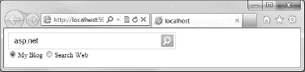
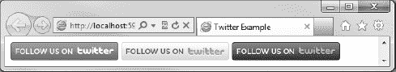
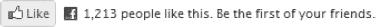

# 八、使用 Web 助手包

正如我们在[第 4 章](04.html#ch4)中看到的，WebMatrix helpers 是自包含的代码和标记包，旨在支持和鼓励重用和快速开发。到目前为止，我们已经使用了三种 WebMatrix 助手中的两种。我们使用了内置的本地助手，如 WebMail 和 WebSecurity，并创建了自己的定制助手。在这一章中，我们将看看第三种类型:网络助手。

Web 助手是第三方助手，从互联网下载并“插入”到您的站点，通常是为了促进与第三方服务的某种交互。这些助手有很多例子，其中一些我们将在本章中讨论，包括亚马逊、Twitter、脸书、Gravatar、谷歌、Bing、PayPal 和 Windows Azure。

WebMatrix IDE 包括一个集成的包管理器，它简化了查找和安装 web helper 包的过程，我们将在本章的第一部分对此进行介绍。本章的后半部分将重点介绍一个更流行的包的实现:ASP.NET Web 助手库。

### 访问软件包管理器

通过站点工作区内容窗格中的 ASP.NET 网页管理按钮可以访问包管理器(见[图 8-1](#fig_8_1) )。为了使此按钮可用，项目中必须至少有一个 Razor 文件。为此，基于空网站模板创建一个新的 WebMatrix 项目，并向名为`Default.cshtml`的网站根目录添加一个新文件。使用工作区选择器导航到网站工作区，然后单击 ASP.NET 网页管理按钮。

***图 8-1。**ASP.NET 网页管理按钮*

ASP.NET 网页管理网站在默认浏览器中打开，如图[图 8-2](#fig_8_2) 所示。首次访问本网站时，您必须创建一个密码。输入适当安全的密码—我建议密码不少于八个字符，包括字母、数字和符号的组合—然后单击创建密码按钮。

***图 8-2。**首次访问 ASP.NET 网页管理网站时，必须创建密码。*

一旦创建了密码，将显示以下消息(参见[图 8-3](#fig_8_3) )。

***图 8-3。**创建新密码后会显示安全检查信息。*

为了防止不受欢迎的人访问您站点的管理页面，每当创建新密码时，就会在包含密码散列的`/App_Data/Admin`文件夹中创建一个新的`_Password.config`文件。在通过浏览器访问管理页面之前，您必须通过删除前导下划线将该文件重命名为`Password.config`(参见[图 8-4](#fig_8_4) )。这一步确保密码不能被对您的 web 服务器没有完全访问权限的人设置或更改，因为只有对服务器的文件系统有管理权限的用户才能重命名`_Password.config`文件。

 **注意**您可能需要刷新“文件”工作区中的导航窗格，才能看到/App_Data/Admin 文件夹。您可以通过右键单击根文件夹并从上下文菜单中选择刷新来完成此操作。

***图 8-4。必须将 _Password.config 文件重命名为 Password.config，以证明您在能够访问 ASP.NET 网页管理站点之前拥有 web 服务器的管理权限。***

成功重命名文件后，单击浏览器中安全检查页面底部的“单击此处”链接(参见[图 8-3](#fig_8_3) )，并将刚刚创建的密码输入到密码文本框中。当你点击登录按钮时，你将被直接带到软件包管理器(见[图 8-5](#fig_8_5) )。

在这个屏幕上，您可以滚动和搜索可用软件包的目录。当您浏览列表时，您会看到大量可用的 web 助手包。所有软件包都列出了一些描述性文本，概述了每个软件包的内容及其功能。

***图 8-5。**网络矩阵包管理器*

### 安装软件包

在本章的后面，我们将会看到 ASP.NET 网络助手库包。这个包包含了一些有用的助手，可以帮助你在 Twitter、脸书、Bing 和 Gravatar 等平台上实现一些简单的社交网络特性。

搜索或浏览列表找到【ASP.NET T2】Web 助手库 1.15 包。找到它后，单击`Install`按钮，阅读显示的信息，并再次单击`Install`接受软件包的许可条款。

软件包管理器现在将自动下载相关的软件包，并在您的站点中安装必要的文件和文件夹。在这个包中，一个名为`Microsoft.Web.Helpers.dll`的文件将被安装在站点根目录下的一个`bin`文件夹中。

一旦成功下载并安装了软件包，软件包管理器将显示一个类似于图 8-6 中的通知。

***图 8-6。**软件包安装成功的通知*

软件包管理器也可以从你的站点上删除以前安装的软件包。如果您再次搜索我们刚刚安装的软件包，您会注意到卸载按钮现在是可用的。

关闭包含软件包管理器的浏览器实例，并返回 IDE。同样，您可能需要刷新文件工作区内的导航窗格，以查看对站点文件结构所做的更改(参见[图 8-7](#fig_8_7) )。

***图 8-7。【ASP.NET Web 助手库 1.15 包安装后的站点文件结构】T2***

既然我们已经在我们的站点上安装了 spend 网络助手库，我们将在本章的剩余部分探索如何用它来实现一些有用的社交网络和其他功能。

### ASP.NET 网络助手图书馆

ASP.NET 网络助手库是一个网络助手包，它可以让你很容易地将许多提供商提供的常用社交网络功能添加到你的网站中，比如脸书、Twitter、Bing 和 Gravatar。该软件包由微软维护。在这一节中，我们将看看包中包含的一些最有用的助手。

#### 用 Bing 添加搜索

Bing helper 使得在你的网站上添加基本的网络搜索功能变得很容易。助手显示一个简单的界面，允许用户在你的站点内和整个互联网上搜索关键词，显示来自微软 Bing 搜索引擎的结果。

要显示阿炳搜索框，我们只需调用`Bing.Searchbox()`方法。助手方法有两个参数，`SiteTitle`和`SiteUrl`，我们需要为它们提供值。设置`SiteTitle`属性将设置搜索选项卡的标题。`SiteUrl`属性包含要搜索的站点的 URL。

我们将在页面顶部的代码块中设置这两个属性的值，并在页面主体的相关位置调用`Bing.Searchbox()` helper 方法。修改我们之前添加的`Default.cshtml`文件的内容，如下所示:

`@{
    Bing.SiteTitle = "My Blog";
    Bing.SiteUrl = "http://blog.stevelydford.com";
}

<!DOCTYPE html>

<html lang="en">
    <head>
        <meta charset="utf-8" />
        <title></title>
    </head>
    <body>
        @Bing.SearchBox()
    </body>
</html>`

从 WebMatrix IDE 运行此页面。阿炳搜索框呈现在页面中，就像这里看到的[图 8-8](#fig_8_8) 中的那个。

***图 8-8。**浏览器中呈现的必应搜索框*

当用户输入一个或多个关键字并点击搜索按钮时，他们将被带到 Bing 网站上的结果列表，该列表将在新的浏览器选项卡中打开(参见[图 8-9](#fig_8_9) )。

***图 8-9。**从必应网站返回的搜索结果*

帮助程序只能返回已被 Bing 搜索引擎编入索引的页面的结果；这些结果以不允许定制的方式显示在 Bing 网站上。显然，这种实现并不适用于每个应用；然而，当它用在合适的上下文中时，它确实提供了一些有用的功能，特别是在具有合理静态内容的站点上。

 **注意**我们将在[第 10 章](10.html#ch10)中创建我们自己的内部搜索助手，在创建我们完整的电子商务应用期间，它将从数据库中产生搜索结果。

#### 推特

非常受欢迎的在线社交网络服务 Twitter 允许用户发送和接收多达 140 个字符的文本消息，即所谓的 Tweets。默认情况下，推文是公开可见的，但可以仅限于单个关注者或一组关注者。用户可以使用特定的关键字搜索个人推文，或者“关注”其他 Twitter 用户，以接收他们所有的公共推文。当用户登录 Twitter.com 网站时，他们会看到他们所关注的用户发布的所有公开推文以倒序显示；这种显示被称为时间线。

ASP.NET Web 助手库包含一个 Twitter 助手，它解释了许多可用于促进与 Twitter.com 应用编程接口(API)的交互和集成的方法。

##### 显示推文

有四种方法可以用来在页面中显示格式化的 Twitter 数据:`Twitter.Search()`、`Twitter.Profile()`、`Twitter.List(),`和`Twitter.Faves()`。所有四种方法都有一组可选参数，如[表 8-1](#tab_8_1) 所述。

要使用助手，只需调用方法并根据需要设置任意可选参数。

Twitter 助手还提供了一个`Search()`方法，使您能够基于关键字搜索显示关于特定主题的推文。为了使用`Search()`方法，我们将搜索词作为`string`传递。在本例中，我们也将`tweetsBackgroundColor`参数设置为浅灰色:

`@Twitter.Search("Football", tweetsBackgroundColor: "#eeeeee")`

这个方法调用将显示一个类似于图 8-10 中的 Twitter 搜索小部件。

***图 8-10。**从推特上输出。搜索()助手*

`Twitter.Profile()`和`Twitter.Faves()`方法要求将 Twitter 用户名作为参数传递，如下所示:

`@Twitter.Profile("stevelydford")
@Twitter.Faves("stevelydford")`

`Twitter.List()`方法要求您传入一个 Twitter 用户名和与该用户相关联的公共列表的名称。

`@Twitter.List("stevelydford", "web-development")`

##### Twitter 按钮

Twitter 按钮可以添加到您的网站，让用户通过 Twitter 分享内容，而不必离开页面。Twitter helper 中有两种显示 Twitter 按钮的方法。第一个是`FollowButton()`，显示一个按钮，当点击这个按钮时，设置用户的 Twitter 账户来跟随指定的 Twitter 配置文件。

该方法有一个必需的参数`username`，它是要关注的账户的 Twitter 用户名。

`@Twitter.FollowButton("stevelydford")`

这将显示默认的“跟我来”按钮，如图 8-11 中的[所示。](#fig_8_11)

***图 8-11。**默认跟我来按钮*

六种按钮设计可用，可使用可选的`followStyle`参数指定。`followStyle`参数可接受的值有:`follow_me`、`follow_us`、`twitter`、`t_logo`、`t_small`和`t_mini`。以下代码示例显示了每种设计，输出如图 8-12 所示:

`**@Twitter.FollowButton("stevelydford", followStyle: "follow_me")**
**@Twitter.FollowButton("stevelydford", followStyle: "follow_us")**
**@Twitter.FollowButton("stevelydford", followStyle: "twitter")**
**@Twitter.FollowButton("stevelydford", followStyle: "t_logo")**
**@Twitter.FollowButton("stevelydford", followStyle: "t_small")**
**@Twitter.FollowButton("stevelydford", followStyle: "t_mini")**` 

***图 8-12。**六种 Twitter 跟随按钮风格*

每个按钮也可以显示三种颜色方案中的一种:默认的蓝色方案“`a`”、“浅灰色方案”`b`、“深色方案”`c`[图 8-13](#fig_8_13) 显示了以下代码示例的输出，它以以下三种配色方案中的每一种显示了一个`follow_us`样式的按钮:

`**@Twitter.FollowButton("stevelydford", followStyle: "follow_us", followColor: "a")**
**@Twitter.FollowButton("stevelydford", followStyle: "follow_us", followColor: "b")**
**@Twitter.FollowButton("stevelydford", followStyle: "follow_us", followColor: "c")**` 

***图 8-13。**三个跟随按钮配色*

当用户点击 Follow 按钮时，他们被带到 Twitter 网站，在那里显示指定的个人资料信息。

第二个可用的 Twitter 按钮助手方法是`TweetButton()`。当用户点击 Tweet 按钮时，会创建一个预定义的 Tweet，它可以包含指向指定页面的超链接；然后，用户可以从他们的个人 Twitter 账户发送这条推文。这使他们能够轻松地共享到您网站的链接，而不必离开当前页面。

`TweetButton()`方法有许多参数，在[表 8-2](#tab_8_2) 中列出，所有参数都是可选的。

下面的代码产生了如图 8-14 所示的 Tweet 按钮。

`@Twitter.TweetButton(tweetText: "Check this out!",
                     userName: "stevelydford",
                     relatedUsername: "Apress",
                     relatedUserDescription: "Great selection of tech books")` 

***图 8-14。**浏览器中呈现的 Tweet 按钮*

单击该按钮时，会打开一个新的浏览器窗口，如果用户尚未通过认证，可以通过该窗口登录到 Twitter.com 网站。一旦他们登录，他们将能够修改消息并发布推文(参见[图 8-15](#fig_8_15) )。

***图 8-15。**推特网站新浏览器窗口显示的推文*

#### 脸书

脸书助手包含与流行的社交网站交互的方法。这些方法分为两类:要求您在 Facebook.com 网站上注册应用的方法和不要求您注册的方法。在这一节中，我们将查看这两类方法，并研究注册和初始化应用所需的步骤。

##### 使用未经注册或初始化的脸书

###### 添加“喜欢按钮”

当用户登录 Facebook.com 网站时，会显示一个新闻提要，其中显示了用户朋友发布的状态更新和其他新闻故事。

最常用的脸书助手方法之一是`LikeButton()`。这将显示一个类似脸书的按钮，当用户单击该按钮时，会将一个故事插入到用户朋友的新闻提要中，并带有一个返回到您的网站的链接。

`LikeButton()`方法有一个强制参数`href`，它是您希望脸书新闻提要链接回的页面的 URL。以下方法调用显示一个链接回 ASP.NET 网站的类似脸书的按钮(见[图 8-16](#fig_8_16) )。

`@Facebook.LikeButton("www.asp.net")` 

***图 8-16。**脸书喜欢的按钮*

`LikeButton()`方法也有一些可选参数，在[表 8-3](#tab_8_3) 中列出。

在 www.facebook.com/insights.注册，你可以看到你的域名每天收到的赞数，以及一些人口统计数据

###### 添加活动订阅源

`Facebook.ActivityFeed()`助手显示一个面板，详细描述您站点上最近的活动。当用户“喜欢”您站点上的内容、使用脸书评论框对您站点中的页面发表评论(请参阅本章后面的“启用脸书评论”部分)或在脸书上共享您站点的内容时，活动订阅源会显示故事。如果用户当前登录到脸书，他们将在活动提要中收到个性化内容，优先显示来自他们朋友的内容。

要在页面中显示活动提要，调用`Facebook.ActivityFeed()`方法，传入站点的域名。下面的例子显示了 BBC 网站的一个活动提要，如图 8-17 所示。

`@Facebook.ActivityFeed("www.bbc.co.uk")` 

***图 8-17。**脸书的输出。ActivityFeed() helper 方法*

`ActivityFeed()`方法可用的可选参数在[表 8-4](#tab_8_4) 中列出。

T2】

###### 添加推荐源

`Recommendations()` helper 方法显示一个面板，类似于 Activity Feed，根据与您站点的 URL 的所有社交互动，向用户显示个性化的推荐。

要显示推荐面板，调用`Facebook.Recommendations()`助手，在您的站点域中传递。下面的代码显示了 panel 网站的推荐面板(见图 8-18 )。

`@Facebook.Recommendations("www.asp.net")` 

***图 8-18。**脸书建议专家组*

`Recommendations()`方法有许多可选参数，在[表 8-5](#tab_8_5) 中列出。

 **注意**当给相关的脸书帮助器方法指定所需的域名时，该域名是完全匹配的。例如，如果您将`news.example.com`指定为域，来自`catalog.example.com`的结果将不会显示。

##### 需要初始化的助手

如前所述，一些脸书助手需要初始化才能使用。为了进行初始化，您必须首先向脸书注册您的应用，以便获得应用 ID 和应用密码。

###### 注册您的脸书应用

要注册您的脸书应用，您需要访问位于`[http://www.facebook.com/developers/createapp.php.](http://www.facebook.com/developers/createapp.php.)`的脸书开发者网站的创建应用页面

点击创建新应用按钮，给应用命名并点击继续(见[图 8-19](#fig_8_19) )。

***图 8-19。**创建新的脸书应用*

一旦您创建了应用，您将被带到应用摘要页面；在这里，您需要记下页面顶部显示的`App ID`和`App Secret`。最后，选择允许您的应用通过网站与脸书集成的选项，并进入`Site URL`(参见[图 8-20](#fig_8_20) )。

***图 8-20。**脸书申请汇总页面*

如果您在 WebMatrix 中使用 IIS Express 进行本地工作，您需要将`Site URL`设置为显示在 WebMatrix IDE 的站点工作区的内容窗格顶部的 URL(参见[图 8-21](#fig_8_21) )。

***图 8-21。**在 WebMatrix IDE 中从网站工作区获取网站 URL*

单击保存更改按钮并关闭浏览器。

 **注意**当电脑重启或打开另一个项目时，WebMatrix 使用的端口号可能会改变。为了使脸书帮助程序正确初始化，端口号必须与“脸书应用概要”页面中指定的端口号相匹配。WebMatrix 要使用的端口可以在网站工作区的设置区域中更改。

###### 初始化脸书助手

要初始化脸书助手，在你的站点根目录下创建一个 _AppStart.cshtml 页面(如果还没有的话)并调用`Facebook.Initialize()`方法，传入你的应用 ID 和应用密码。

`@{
    Facebook.Initialize("181488045259998", "8d80a152710b9df08fec0aced424df2a");
}`

在调用任何需要初始化的脸书方法之前，必须调用`GetInitializationScripts()`方法。这个方法初始化脸书 JavaScript SDK(软件开发工具包)，助手依赖于它来使用扩展的 Facebook 标记语言(XFBML)。您只需要在每个页面上调用一次`GetInitializationScripts()`，但是它必须在对相关的脸书助手方法进行任何调用之前被调用。

 **注意**更多关于脸书 JavaScript SDK 和 XFBML 的信息可以在[http://developers.facebook.com/docs/reference/javascript/](http://developers.facebook.com/docs/reference/javascript/)找到

###### 启用脸书评论

在你的页面上添加一个脸书评论框可以让脸书用户评论你的网站。如果用户勾选了“张贴到脸书”复选框，评论将会被张贴到他们朋友的新闻订阅上，其中还会包含一个返回到你的网站的链接。脸书评论框也包含一个 Like 按钮，并提供管理评论的工具。

要显示脸书注释框，调用`Facebook.Comments()`方法，指定[表 8-6](#tab_8_6) 中列出的您可能需要的任何可选参数。

以下代码显示图 8-22 中[所示的注释框:](#fig_8_22)

`@Facebook.GetInitializationScripts()
@Facebook.Comments()` 

***图 8-22。**脸书渲染的脸书评论框。注释()帮助器方法*

###### 面桩

Facepile 助手显示注册脸书用户的朋友的个人资料图片，这些用户要么正在使用你的网站，要么在过去“喜欢”过你的网站。如果用户的脸书朋友中没有人“喜欢”该网站，并且没有人正在使用该网站，则不会显示任何内容。

下面的代码显示了图 8-23 中[所示的用户界面:](#fig_8_23)

`@Facebook.GetInitializationScripts()
@Facebook.Facepile()`

 **注**脸书。每页只应调用一次 GetInitializationScripts()方法。必须在使用任何需要初始化的脸书帮助器方法之前调用它。

***图 8-23。**face pile 助手方法呈现的 UI*

`Facepile()`方法公开了两个可选参数——`maxRows`，它确定要显示的个人资料图片的最大数量，以及`width`，它以像素为单位设置 Facepile 面板的宽度。

###### 现场直播

脸书直播服务让你网站的用户实时分享活动和评论。实时流旨在用于运行实时活动，如网络广播的实时视频流、实时网络聊天、网络研讨会或在线多人游戏。

[表 8-7](#tab_8_7) 详细说明了`Facebook.LiveStream()`方法暴露的可选参数。

要在页面中显示实时流面板，请调用`Facebook.LiveStream()`方法。以下代码显示了在[图 8-24](#fig_8_24) 中看到的输出。

`@Facebook.GetInitializationScripts()
@Facebook.LiveStream(height: 300)` 

***图 8-24。**由脸书输出的脸书直播流面板。LiveStream() helper 方法*

 **注意**使用脸书助手类，也可以将脸书登录与你的网站会员系统集成。此功能允许用户使用他们的脸书帐户登录到您的网站。我们将在第 10 章的[示例电子商务站点中实现这一功能。](10.html#ch10)

#### 墓场

Gravatar(代表全球公认的头像)使用户能够上传小型个人图像，并将其与电子邮件地址相关联。使用 Gravatar.com 服务的网站可以请求在网页中显示与电子邮件地址相关联的图像。这通常用于根据帐户信息、博客帖子或评论显示用户图像。

在 WebMatrix 中，您可以通过调用`Gravatar.GetHtml()`方法来显示与电子邮件地址相关联的 Gravatar 图像。该方法唯一需要的参数是电子邮件地址，尽管有许多可选参数可用。默认情况下，如果传递给该方法的电子邮件地址没有关联的 Gravatar 帐户，将显示默认的 Gravatar 图像。[表 8-8](#tab_8_8) 解释了每个附加可选参数。

T2】

以下代码显示了图 8-25 中的输出:

`@* Email address has associated Gravatar account. *@
@Gravatar.GetHtml("stevelydford@gmail.com")

@* Email address does not have an associated Gravatar
   account. Default image will be displayed instead. *@
@Gravatar.GetHtml("noSuchUser@example.com")` 

***图 8-25。**左边返回一个有效的 Gravatar，右边返回默认图像*

Gravatar 图像由相关账户的所有者进行自我评级。`rating`属性可以设置为五个值之一；`G`、`PG`、`R`、`X`或`Default`。这是您希望显示的最大允许图像等级。默认情况下，仅返回`G`评级的图像。要设置最大允许额定值，请将相关的`GravatarRating`枚举分配给`rating`属性。

`@Gravatar.GetHtml("stevelydford@gmail.com", rating: GravatarRating.G)`

#### Xbox Live 玩家卡

Xbox Live 玩家卡是一个信息面板，总结了用户在微软 Xbox Live 在线多人游戏服务上的个人资料。ASP.NET 网络助手库包含一个`GamerCard`助手，它将一张 Xbox Live 玩家卡呈现给浏览器(参见[图 8-26](#fig_8_26) )。助手有一个方法`GetHtml()`，它需要一个字符串参数`gamerTag`。

`@GamerCard.GetHtml("stinky53")` 

***图 8-26。**玩家卡输出*

#### 左洋气

LinkShare helper 呈现一组 flair 按钮，这些按钮链接到各种社交书签站点，如 Twitter、脸书、Digg 和 Reddit。为了显示 LinkShare 助手，您调用`LinkShare.GetHtml()`方法，传入页面标题。

`@LinkShare.GetHtml("LinkShare Example")`

`GetHtml()`方法有四个可选参数，详见[表 8.9。](#tab_8_9)

link site 的参数接受一组`LinkShareSite`枚举。例如，只显示 Digg、脸书、Reddit 和 StumbleUpon flair 按钮，你可以使用下面的代码，其输出如图 8-27 所示[。](#fig_8_27)

`<!DOCTYPE html>

<html lang="en">
    <head>
        <meta charset="utf-8" />
        <title>LinkShare Example</title>
        
    </head>
    <body>
        <h1>LinkShare Example</h1>
        

            @LinkShare.GetHtml("LinkShare Example",
                            pageLinkBack: "http://www.asp.net",
                            linkSites: new LinkShareSite[] { LinkShareSite.Digg,
                                                             LinkShareSite.Facebook,
                                                             LinkShareSite.Reddit,
                                                             LinkShareSite.StumbleUpon }
                            )
        

    </body>
</html>`

您会注意到这个标记包含一些 CSS 样式来整理输出，防止按钮之间出现不需要的下划线字符。

***图 8-27。**LinkShare 助手呈现的输出示例*

#### ReCaptcha

ReCaptcha 帮助器用于帮助防止自动程序(通常称为机器人)向您站点中的表单提交数据。助手显示一个 CAPTCHA(区分计算机和人类的全自动公共图灵测试)测试，该测试由 reCAPTCHA 服务([http://www.recaptcha.net](http://www.recaptcha.net))验证。该测试显示两个变形单词的图像，用户必须正确输入才能成功提交表单。

为了使用 reCAPTCHA 服务，您的网站必须在[http://www.recaptcha.net](http://www.recaptcha.net)注册。一旦您成功注册，您将被分配一个公钥和私钥。提交表单时，用户输入的 reCAPTCHA 值和公钥一起被发送到 reCAPTCHA 服务。如果测试验证正确，服务将返回私钥，您可以在 post 请求处理程序中根据该私钥进行验证。

 **提示**在 recaptcha.net 网站上注册时，申请一个全局密钥将确保您可以在本地测试您的代码。部署站点时，您应该获得特定于所需域的新密钥。

下面的代码示例显示了图 8-28 中的表单，显示了使用`GetHtml()`方法的 ReCaptcha 助手。提交表单时，POST 请求处理程序使用`ReCaptcha.Validate()`方法根据私钥验证 ReCaptcha 助手，并在必要时向页面`ModelStateDictionary`添加一个错误。

`@{
    var PUBLIC_KEY = "6PqBf8gSAA1AAKjVivoiBcEWHFM94a9l-V1bVKOQ";
    var PRIVATE_KEY = "6PqBf8gSAA1AAC19mhZXPGF69t6cGfr6YG3s6lsL";

    if (IsPost)
    {
        // Validate the reCAPTCHA test
        if (!ReCaptcha.Validate(PRIVATE_KEY)) {
            ModelState.AddError("ReCatcha", "The reCAPTCHA test was answered incorrectly");
        }

        if (ModelState.IsValid)
        {
            // Process form data here...
        }
    }
}
<!DOCTYPE html>

<html lang="en">
    <head>
        <meta charset="utf-8" />
        <title>ReCaptcha Example</title>
        
    </head>
    <body>
        <h1>ReCaptcha Example</h1>
        @Html.ValidationSummary("Please correct the following errors:")` `        <form action="" method="post">
            

                @Html.Label("Email Address:", "emailAddress") 
                @Html.TextBox("emailAddress")
            

            

                @ReCaptcha.GetHtml(PUBLIC_KEY, theme: "white")
            

            

                <input type="submit" />
            

        </form>
    </body>
</html>` 

***图 8-28。**使用 ReCaptcha 助手保护 HTML 表单免受僵尸攻击*

 **注**有关 reCAPTCHA 服务的更多详情，请访问[http://www.recaptcha.net](http://www.recaptcha.net)。有关 WebMatrix ReCaptcha helper 的更多信息，请访问[http://msdn . Microsoft . com/en-us/library/Microsoft . web . helpers . ReCaptcha . aspx](http://msdn.microsoft.com/en-us/library/microsoft.web.helpers.recaptcha.aspx)。

#### 分析学

Analytics 类包含生成脚本的方法，这些脚本是使用三种最流行的基于 web 的免费流量分析服务来跟踪您的页面所必需的。

*   谷歌分析-http://www.google.com/analytics/
*   雅虎营销解决方案-https://marketingsolutions.login.yahoo.com/
*   http://www.statcounter.com/ StatCounter

这些方法使用起来都非常简单，只需在页面中注入一些 JavaScript 代码，就可以让相关服务进行跟踪。首先，您必须向您选择的分析服务注册，然后调用相关的方法(参见下面的代码示例)，传递注册时提供给您的帐户详细信息。

`// Google Analytics
@Analytics.GetGoogleHtml(*your-analytics-webPropertyId-here*)

// Yahoo Marketing Solutions
@Analytics.GetYahooHtml(*your-yahoo-accountId-here*)

// StatCounter.com
@Analytics.GetStatCounterHtml(*your-statCounter-project-id-here*, *your-security-key-here*)`

 **注意**ASP.NET 网络助手库包也包括视频和图像助手。我们将在[第 12 章](12.html#ch12) -高级网络矩阵中深入讨论这些。

### 总结

本章介绍了用于 WebMatrix 应用的外部 web 助手。我们已经看到了如何访问 WebMatrix IDE 包管理器，并使用它来安装第三方 web 助手包。

在本章的第二部分，我们详细介绍了 ASP.NET Web 助手库包中提供的一些更有用的助手。这些助手为 Twitter、脸书、Bing、reCAPTCHA 和 Gravatar 等几个流行网站提供了易于使用的集成特性。

通过软件包管理器可以获得许多其他的帮助软件包，其中一些我们将在接下来的三章中使用，在这三章中我们将使用 WebMatrix 和 ASP.NET 网页构建一个完整的电子商务应用。