# 十、TechieTogs：添加电子商务功能

在第 9 章中，我们开始实施我们的电子商务应用 TechieTogs。到目前为止，我们已经构建了一个由 SQL Server Compact Edition 数据库支持的产品目录，用户可以浏览或搜索产品。

在这一章中，我们将继续下一阶段的开发，包括添加购物车、会员系统和结帐设备。在我们设计和开发这些功能时，我们将了解如何:

*   创建定制对象来封装自定义数据和逻辑；
*   利用浏览器会话来维护状态；
*   使用 ASP.NET 网页会员系统及其相关助手来提供用户帐户功能；和
*   使用 WebMail 助手向用户发送电子邮件。

我们的第一个任务是构建购物车，这将允许用户存储产品列表，以构成一个用于结账的订单。

### 购物流程

TechieTogs 购物车和收银台将以传统方式工作。用户将在目录中浏览产品，然后从产品详细信息页面向购物车添加商品。用户的个人购物车的内容将在他们访问该网站的整个过程中得到维护，并且将有一个页面允许他们查看购物车的内容并在必要时删除项目。购物车页面还将显示购物车中所有商品的订单总价。

一旦用户对购物车的内容感到满意，他们将点击“继续结账”按钮，然后提供送货细节并确认订单。结帐页面将要求用户进行认证。如果用户还没有登录，他们将被重定向到登录页面，然后在登录或注册后返回到结帐页面。

[图 10-1](#fig_10_1) 详细描述了 TechieTogs 购物流程。

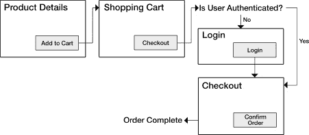

***图 10-1。**我们网站的购物流程*

### 购物车

在我们的产品详细信息页面上，我们添加了一个订单表单，将它的值发送到`Cart.cshtml`。在本节中，我们将实现这个页面。

我们需要在用户访问网站期间存储购物车的内容。浏览器会话是存储这些信息的理想场所，因为它在访问期间由 web 服务器维护，并且可以存储任何类型的。NET 对象。

我们将通过创建一个定制的`Cart`类来实现这一点，该类将封装站点上购物车操作所需的数据和方法。

#### 定义购物车类别

我们的`cart`类将需要存储一个购物车商品列表(产品、大小和价格),并且需要一些方法来允许我们执行添加商品、删除单个商品、删除所有商品以及获取购物车中所有商品的总价值的操作。

为了确保`Cart`类对应用中的所有页面都可用，我们将在`App_Code`文件夹中创建它。用站点的`App_Code`文件夹创建的任何代码都可以在站点内的所有页面上使用，但不会直接由 IIS 提供服务。因此，在`App_Code`文件夹中，添加一个名为`Cart.cs`的类文件，并输入以下代码。

`using System;
using System.Collections.Generic;

using System.Web;

/// 

/// TechieTogs shopping cart
/// 

public class Cart
{
    private List<CartItem> _Items = new List<CartItem>();` `    public List<CartItem> Items { get { return _Items; } }

    public decimal TotalValue { get { return _Items.Sum(p => p.Price); } }

    public void AddItem(int productID, string size, decimal price)
    {
        _Items.Add( new CartItem { ProductID = productID, Size = size, Price = price } );
    }

    public void Clear()
    {
        _Items.Clear();
    }

    public void RemoveItem(int index)
    {
        _Items.RemoveAt(index);
    }

}`

这段代码完整地定义了`Cart`类。在该类中，我们有一个名为`Items,`的只读公共属性，它由私有字段`_Items`支持。`Items`和`_Items`被声明为`List<CartItem>`。

 **注意**`CartItem`类是另一个单独的定制类，我们将在本节稍后定义它。它将用于存储购物车中各个行项目的产品 ID、大小和价格。

`private List<CartItem> _Items = new List<CartItem>();

public List<CartItem> Items { get { return _Items; } }`

我们还有一个名为`TotalValue,`的公共属性，它使用`List<T>.Sum()`方法获得`_Items`列表中所有`CartItem`的总价。

`public decimal TotalValue { get { return _Items.Sum(p => p.Price); } }`

 **注意**`TotalValue`属性将一个 lambda 表达式传递给`_Items.Sum()`方法。如果你过去没有遇到过 lambda 表达式，不要担心。它们是相当先进的 C# 技术，我们将只在书中的这个实例中使用。现在您需要理解的是，对`_Items.Sum(p => p.Price)`的调用只是返回存储在购物车中商品的价格属性中的所有值的总和。在 MSDN 网站`[http://msdn.microsoft.com/en-us/library/bb397675.aspx](http://msdn.microsoft.com/en-us/library/bb397675.aspx)`上可以找到一个使用λ表达式和`Sum()`方法的好例子

接下来，我们定义了`Cart`类、`AddItem()`、`Clear()`和`RemoveItem()`的三个方法。

*   `AddItem()`方法用于向购物车中的商品列表添加新的`CartItem`。它接受`productID`、`size`和`price`作为参数，用来创建一个新的`CartItem`。然后将其添加到`_Items`列表中。
*   `Clear()`方法只是从`_Items`列表中删除所有项目。一旦订单完成，我们将调用这个方法来清空用户的购物车。
*   `RemoveItem()`方法删除了`_Items`列表中指定索引处的`CartItem`。

##### 定义 CartItem 类

如上所述，`CartItem`是一个自定义类，我们将使用它来存储购物车中的每个单项商品。该类定义了三个公共属性，`ProductID`、`Size`和`Price`。

C# 允许我们在同一个物理文件中定义多个类，所以我们现在将下面的代码添加到`Cart.cs`文件的底部。

`/// 

/// TechieTogs shopping cart line item
/// 

public class CartItem
{
    public int ProductID { get; set; }
    public string Size { get; set; }
    public decimal Price { get; set; }
}`

这就完成了购物车的自定义类定义。通过以这种方式定义购物车，我们可以在浏览器变量`Session`中存储一个`Cart`对象，这意味着购物车对于每个用户都是唯一的，并且每个购物车的状态在用户访问的整个生命周期中都得到了维护。

随着我们继续开发购物车和结帐功能，`Cart`类的确切实现和使用将变得更加清晰。

#### 购物车页面

现在是添加页面的时候了，该页面将存储和检索来自`Cart`对象的值，并向用户呈现购物车内容的概述。该页面还允许用户从购物车中移除商品，并提供一个按钮将商品带到收银台。

购物车页面包含一些复杂的特性，需要做一些工作来实现。在本节中，我们将一步一步地完成实施的每个阶段。

[图 10-2](#fig_10_2) 显示了显示给用户的完整的购物车页面。

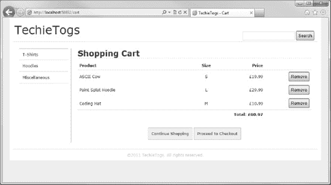

***图 10-2。**技术人员购物车页面*

在站点的根目录下创建一个新文件，并将其命名为`cart.cshtml`。该页面将基于我们的默认布局页面`Shared/Layouts/_Layout.cshtml`。

在这个页面上，我们需要做的第一件事是从用户的浏览器会话中检索当前的`Cart`对象。如果会话中没有购物车，我们将创建一个新的空的`Cart`对象，并将其添加到会话中。

删除`Cart.cshtml`中的任何标记，并插入以下代码块。

`@{

    Layout = "~/Shared/Layouts/_Layout.cshtml";
    Page.Title = "Cart";

    // Create a blank cart in Session if not present
    if (Session["cart"] == null)
    {
        Session["cart"] = new Cart();
    }

    // Get current cart from Session
    Cart cart = (Cart)Session["cart"];
}`

现在我们有了一个`Cart`对象，我们将添加一些标记和 Razor 代码来迭代`Cart.Items`集合并输出 HTML `<table>`中的内容。在代码块下添加以下内容。

`<table id="cartTable">
    <tr>
        <th class="product">Product</th>
        <th class="size">Size</th>
        <th class="price">Price</th>
    </tr>

    @foreach (var item in cart.Items)
    {
        <tr>
            <td class="product">@item.ProductID</td>
            <td class="size">@item.Size</td>
            <td class="price">£@item.Price</td>
        </tr>
    }

    <tr class="cartTotal">
        <td colspan="2">&nbsp;</td>
        <td>Total: £@cart.TotalValue</td>
    </tr>
</table>`

在`<table>`的最后一行，我们使用`Cart`对象的`TotalValue`属性向用户显示总价。

在我们运行项目和查看购物车之前，让我们给它一点风格。将下面的 CSS 添加到`Css/Style.css`。

`/* Cart
---------------------------------*/

#cartTable {
    width: 100%;
    border: none;
    border-spacing:0px;
}

#cartTable th {
    border-bottom: 1px solid #cdcdcd;
}

#cartTable td, th {
    padding:5px;
}

#cartTable .product {
    text-align:left;
    width: 50%;
}

#cartTable .size {
    text-align:center;` `    width: 10%;
}

#cartTable .price {
    text-align:right;
    width: 20%;
}

#cartTable .cartTotal td {
    margin-top: 10px;
    border-top: 1px solid #cdcdcd;
    text-align:right;
    font-weight:bold;
}`

标记和 CSS 就绪后，运行项目，浏览到目录中的产品，然后单击“添加到购物车”按钮。您会注意到这个页面的两个直接问题:

1.  所选产品尚未添加到购物车。
2.  购物车页面不会告诉用户他们的购物车是空的。

我们将首先处理第二个问题，因为这是最容易解决的。

##### 显示空购物车

如果用户的购物车是空的，我们希望向用户显示一条有用的消息，而不仅仅是显示一个空表。为此，我们将在`Cart.cshtml`的页面主体顶部添加一个`if`语句，我们称之为 carts `Items`集合的`Count()`方法。我们首先检查集合中是否有行。如果`Cart`没有`Items`，我们会显示一条合适的信息；否则，我们将像以前一样显示`<table>`。

 **注意**我们还没有在`Cart`类中明确定义一个`Count()`方法。该方法来自于`List<T>`，它是我们用来存储`Items`集合的通用集合类型。因此，我们在下面的代码示例中调用了`cart.Items.Count()`。

首先，我们将下面的`if`语句添加到`Cart.cshtml`页面的顶部，在`<h1>`标题的正下方。然后我们将把`<table>`封装在`else`块中。

`**<h1>Shopping Cart</h1>**

**@if(cart.Items.Count() == 0)**
**{**
    **
There are no items in your shopping cart.
**
**}**` `**else**
**{**
    **<text>**
        <table id="cartTable">

            @* ... table as before ... *@

        </table>
**    </text>**
**}**`

现在，当我们运行页面时，我们将看到图 10-3 所示的消息，而不是一个空表。

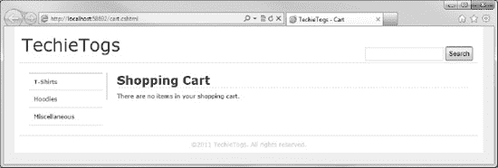

***图 10-3。**空购物车信息*

这解决了空购物车显示问题。现在，我们可以看看如何从产品详细信息页面向购物车添加商品。

##### 将商品添加到购物车

产品详细信息页面(`ProductDetails.cshtml`)将订单的值发送到三个字段中的`Cart.cshtml`，`productID`，`size`和`price`。为了将选择的产品添加到购物车中，我们将在购物车页面顶部的代码块中添加一个 post 请求处理程序。

post 请求处理程序中的代码将简单地检索已发布的表单字段的值，并将它们传递给`Cart.AddItem()`方法。一旦商品被添加到购物车，我们将把它保存回用户的会话。

将下面代码示例中突出显示的 post 请求处理程序添加到`Cart.cshtml`页面顶部的代码块中。

`@{

    Layout = "~/Shared/Layouts/_Layout.cshtml";
    Page.Title = "Cart";

    // Create a blank cart in Session if not present` `    if (Session["cart"] == null)
    {
        Session["cart"] = new Cart();
    }

    // Get current cart from Session
    Cart cart = (Cart)Session["cart"];

**    if (IsPost)**
**    {**
**        var productID = Request["productID"];**
**        var size = Request["size"];**
**        var price = Request["price"];**

**        cart.AddItem(productID.AsInt(), size, price.AsDecimal());**
**    }**

}`

现在再次运行项目，从目录中选择一个项目，然后单击“添加到购物车”。当您被带到购物车页面时，您将看到您选择的商品已被添加。如果您随后向购物车添加更多产品，它们将全部显示出来。

然而，你会注意到我们的下一个问题。购物车显示的是`ProductID`而不是产品标题。我们接下来会解决这个问题。

##### 在购物车中显示产品标题

我们没有将产品标题存储在`Cart`对象中，所以我们将实现一个简单的助手函数来从数据库中获取标题。

在`App_Code`文件夹中创建一个名为`Products.cshtml`的新页面，删除默认内容，并替换为以下内容。

`@* Product Functions *@
@functions {

    public static string GetProductNameFromId(int productID)
    {
        var db = Database.Open("TechieTogsData");
        var sqlQuery = "SELECT title FROM Products WHERE productID = @0";
        return db.QuerySingle(sqlQuery, productID).title;
    }

}`

在这段代码中，我们定义了一个名为`GetProductNameFromId()`的函数。该函数接受产品 ID 作为参数，并查询数据库，返回相应的产品标题。

 **提示**我们可以很容易地将`GetProductNameFromId()`方法的功能直接添加到`Cart.cshtml`页面中。然而，由于这可能是一个常见的任务，将这个逻辑移到一个助手函数中是有意义的，因为我们可以使它在其他页面中可用。

为了显示产品标题，我们将在`Cart.cshtml`的`foreach`循环中调用这个函数，而不是输出项目`ProductID`。对`Cart.cshtml`中的`foreach`循环进行高亮显示的修改。

`@foreach (var item in cart.Items)
{
    <tr>
        <td class="product">**@Products.GetProductNameFromId(item.ProductID)**</td>
        <td class="size">@item.Size</td>
        <td class="price">£@item.Price</td>
    </tr>
}`

再次运行项目或刷新浏览器中的购物车页面，以查看正确显示的产品标题。

##### 从购物车中移除商品

如果用户错误地将商品添加到购物车中，或者改变了订单，他们需要能够轻松地从购物车中删除商品。

为了实现这一点，我们将在购物车中的每个商品上放置一个“移除”按钮(参见[图 10-2](#fig_10_2) )。当用户点击按钮时，商品将直接从购物车中移除。这里不需要确认页面，因为重新添加一个错误删除的项目是一件很简单的事情。

正如在第 5 章中提到的，W3C HTML 规范声明我们不应该在 HTTP GET 请求中对持久化数据进行修改。虽然我们的购物车没有存储在数据库中，但是它的数据是在浏览器会话中维护的，所以我们必须使用 POST 请求。

正如在第五章中提到的，一个页面有多个 HTML 表单是完全可以接受的，只要它们没有嵌套或者重叠。对于 ASP.NET WebForm 的开发人员来说，这可能是一个奇怪的概念，因为它被限制为每页一个表单，但是在这种情况下，这是一个非常有用的功能。我们将在 cart contents 表的每一行上呈现一个单独的表单，该表单会将其数据发送回 cart.cshtml 页面。该表单将包含一个存储该行的从零开始的索引的隐藏字段和一个提交按钮。当提交表单时，我们将把隐藏字段的内容传递给`Cart.RemoveItem()`方法。这个方法需要项目索引作为唯一的参数。包括按钮在内的表单将显示在添加到现有表格右侧的第四列中。

目前，`Cart.cshtml`使用一个`foreach`循环来遍历购物车商品并构建购物车内容表。我们需要将一个从零开始的行索引传递给`Cart.RemoveItem()`方法，所以在我们进入循环并在每次迭代中增加索引之前，我们需要声明一个变量来存储索引。

修改`Cart.cshtml`中`cartTable` `<table>`的内容，以包括以下粗体字突出显示的修订内容。

`<table id="cartTable">
    <tr>` `        <th class="product">Product</th>
        <th class="size">Size</th>
        <th class="price">Price</th>
        **<th>&nbsp;</th>**
    </tr>

**    @{**
**        // Declare and initialise index variable, i**
**        int i = 0;**
**    }**

    @foreach (var item in cart.Items)
    {
        <tr>
            <td class="product">@Products.GetProductNameFromId(item.ProductID)</td>
            <td class="size">@item.Size</td>
            <td class="price">£@item.Price</td>
            **<td class="remove">**
**                <form action="Cart" method="post">**
**                    @Html.Hidden("removeIndex", i)**
**                    <input type="submit" value="Remove" />**
**                </form>**
**            </td>**
        </tr>

        **// increment index**
**        i++;**
    }

    <tr class="cartTotal">
        <td colspan="2">&nbsp;</td>
        <td>Total: £@cart.TotalValue</td>
        **<td>&nbsp;</td>**
    </tr>
</table>`

我们还需要对页面的 POST 请求处理程序进行一些更改，因为页面现在可以从两个位置向其提交表单数据，`ProductDetails.cshtml`通过“添加到购物车”按钮，`Cart.cshtml`通过“删除”按钮。

如果页面在表单数据中传递了一个`productID`,我们就知道 POST 请求是通过“添加到购物车”按钮来自`ProductDetails.cshtml`,我们可以调用`AddItem()`方法，就像我们现在做的那样。

但是，如果 POST 请求包含一个`removeIndex`值，我们知道这个请求是通过`Cart.cshtml`中的 remove 表单发出的。`removeIndex`表单值包含行索引，存储在每个表单的隐藏字段值中。我们可以将这个值作为一个整数传递给`Cart.RemoveItem()`方法，从购物车的商品集合中删除该行。

将下面突出显示的修改应用于`Cart.cshtml`中的 POST 请求处理程序。

`if (IsPost)
{
    **if (Request["productID"] != null)**` `    **{**
        **// Form posted from Product Details Page**
        var productID = Request["productID"];
        var size = Request["size"];
        var price = Request["price"];

        cart.AddItem(productID.AsInt(), size, price.AsDecimal());
    **}**
**    else if (Request["removeIndex"] != null)**
**    {**
**        // Form posted by Cart Remove Item button**
**        var removeIndex = Request["removeIndex"].AsInt();**
**        cart.RemoveItem(removeIndex);**
**    }**
}`

最后，将下面的 CSS 添加到`Css/Style.css`中，以格式化`<table>`中的 Remove 按钮列。

`table .remove {
    text-align:right;
    width: 20%;
}`

##### 添加“继续购物”和“继续结账”按钮

既然用户可以成功地从他们的购物车中添加和删除商品，我们需要给他们一个选择，要么继续购物，要么如果他们的购物车包含他们需要的所有商品，就继续结帐以完成他们的订单。

由于购物车存储在用户的浏览器会话中，我们不需要向结账页面传递任何数据，所以这两个“按钮”实际上都可以是超链接。

因为购物车页面现在已经完成，为了清楚起见，下面的代码示例显示了`Cart.cshtml`的完整列表。我们需要插入的超链接以粗体突出显示。

`@{

    Layout = "~/Shared/Layouts/_Layout.cshtml";
    Page.Title = "Cart";

    // Create a blank cart in Session if not present
    if (Session["cart"] == null)
    {
        Session["cart"] = new Cart();
    }

    // Get current cart from Session
    Cart cart = (Cart)Session["cart"];

    if (IsPost)
    {
        if (Request["productID"] != null)` `{
            // Form posted from Product Details Page
            var productID = Request["productID"];
            var size = Request["size"];
            var price = Request["price"];

            cart.AddItem(productID.AsInt(), size, price.AsDecimal());
        }
        else if (Request["removeIndex"] != null)
        {
            // Form posted by Cart Remove Item button
            var removeIndex = Request["removeIndex"].AsInt();
            cart.RemoveItem(removeIndex);
        }
    }

}

<h1>Shopping Cart</h1>

@if(cart.Items.Count() == 0)
{
    
There are no items in your shopping cart.

}
else
{
    <text>
        <table id="cartTable">
            <tr>
                <th class="product">Product</th>
                <th class="size">Size</th>
                <th class="price">Price</th>
                <th>&nbsp;</th>
            </tr>

            @{
                // Declare and initialise index variable, i
                int i = 0;
            }

            @foreach (var item in cart.Items)
            {
                <tr>
                    <td class="product">@Products.GetProductNameFromId(item.ProductID)</td>
                    <td class="size">@item.Size</td>
                    <td class="price">£@item.Price</td>
                    <td class="remove">
                        <form action="Cart" method="post">
                            @Html.Hidden("removeIndex", i)
                            <input type="submit" value="Remove" />
                        </form>` `                    </td>
                </tr>

                // increment index
                i++;
            }

            <tr class="cartTotal">
                <td colspan="2">&nbsp;</td>
                <td>Total: £@cart.TotalValue</td>
                <td>&nbsp;</td>
            </tr>
        </table>
        **
**
**            <a href="/Default" class="linkButton">Continue Shopping</a>**
**            <a href="/Checkout" class="linkButton">Proceed to Checkout</a>**
**        
**
    </text>
}`

我们将使用 CSS 将超链接设计成按钮的样式。在`Css/Style.css`的底部添加以下内容。

`div #cartButtons {
    text-align: center;
    margin: 40px 0px 20px 0px;
}

.linkButton  {
    border: 1px solid #cdcdcd;to yet)
    background-color: #efefef;
    margin: 0px;
    padding: 10px;
}

.linkButton:hover {
    background-color: #ddd;
}`

现在，当你运行网站并使用购物车页面时，它拥有我们需要的所有功能(尽管“继续结账”按钮实际上还没有一个结账页面)，它看起来就像图 10-2 中的那个。

目前，除了在浏览器地址栏中键入 URL 之外，用户只能在从产品详细信息页面添加商品时才能进入购物车。别担心，我没有忽略这一点。在下一节“用户帐户”的课程中，我们将在布局页面中提供购物车的链接。

### 用户账户

当我们在本章开始时为 TechieTogs 站点定义“购物过程”时，我们决定用户必须经过认证才能进入结账页面。因此，我们显然必须在网站上实施会员制度。本节将介绍这一实现。

#### 何苦呢？

我们可以很容易地允许用户不需要登录或注册账户就可以直接结账，那么我们为什么要把它作为一个要求呢？这个过程有几个好处，包括以下几点。

*   注册用户的电子邮件地址可以在以后用于营销目的。
*   用户对网站安全性的感知提高了，从而增加了信任级别。
*   站点管理员能够查看每个唯一用户的订单。
*   account 系统在未来的版本中有扩展的余地，可以为用户提供额外的功能，例如存储默认的交货地址、查看过去的订单以及查看当前订单的交货状态。

#### 初始化会员系统

正如我们在第 7 章中看到的，ASP.NET 网页会员系统必须首先通过调用`WebSecurity.InitializeDatabaseConnection()`方法进行初始化。

这个方法告诉成员资格系统我们希望使用哪个数据库来存储配置文件和成员资格信息，哪个表应该存储用户配置文件数据，以及用于标识唯一用户 ID 和密码字段的列名。因为用户名在表中必须是惟一的，并且我们希望收集用户的电子邮件地址以备后用，所以在整个应用中使用电子邮件地址作为用户名是有意义的。

向 TechieTogs 站点的根目录添加一个新文件`_AppStart.cshtml`，并用下面的方法调用替换默认标记。

`@{
    WebSecurity.InitializeDatabaseConnection("TechieTogsData",
        "UserProfile", "UserId", "Email", true);
}`

在第一次运行站点时，`_AppStart.cshtml`文件中声明的任何代码都将被运行，这使得它成为调用`WebSecurity.InitializeDatabaseConnection()`的理想位置，在与 ASP.NET 网页会员系统进行任何交互之前，必须调用它。

 **注**对 ASP.NET 网页会员制的深入解释可以在本书的[第 7 章](07.html#ch7)中找到。

#### 注册新账户

现在我们已经初始化了会员系统，它已经在我们的数据库中创建了必要的表，我们需要提供一个页面，允许新用户在网站上注册。

在站点的根目录下创建一个名为`Account`的新文件夹。我们将使用此文件夹来帮助我们组织网站中的页面，方法是将所有包含成员功能的页面放入其中。在这个新文件夹中，创建一个名为`Register.cshtml`的文件。下面的代码清单包含该页面所需的完整代码和标记。

`@{

    Layout = "~/Shared/Layouts/_Layout.cshtml";
    Page.Title = "Register";

    var email = "";
    var password1 = "";
    var password2 = "";

    if(IsPost)
    {
        WebSecurity.Logout();

        email = Request["email"];
        password1 = Request["password1"];
        password2 = Request["password2"];

        // Validation
            if (email.IsEmpty()) {
            ModelState.AddError("email", "Email Address is required.");
        }

        if (!Validation.IsValidEmail(email))
        {
            ModelState.AddError("email", "Invalid Email Address.");
        }

        if (password1.IsEmpty()) {
            ModelState.AddError("password1", "Password is required.");
        }

        if(WebSecurity.UserExists(email))
        {
            ModelState.AddError("email", "An account with this name already exists.");
        }

        if(password1 != password2)
        {
            ModelState.AddError("password1", "The passwords do not match.");
        }

        // Create Account` `        if(ModelState.IsValid)
        {
            WebSecurity.CreateUserAndAccount(email, password1, null, false);
            WebSecurity.Login(email, password1);
            if (Request.QueryString["sender"] != null)
            {
                // Return user to the URL sent in the “sender” key of the QueryString
                Response.Redirect(Request.QueryString["sender"]);
            }
            else
            {
                // Return the user to the home page
                Response.Redirect("~/Default");
            }
        }
    }

}

<h1>Register New Account</h1>
<form action="Register?@Request.QueryString" method="post" class="accountForm">
    

        @Html.Label("Email Address: ", "email") 
        @Html.TextBox("email", email)
        @Html.ValidationMessage("email")
    

    

        @Html.Label("Password: ", "password1") 
        @Html.Password("password1", password1)
        @Html.ValidationMessage("password1")
    

    

        @Html.Label("Confirm Password: ", "password2") 
        @Html.Password("password2", password2)
    

    

         <input type="submit" value="Register" />
    

</form>`

当这个页面第一次加载时(即作为 HTTP GET 请求的结果)，向用户显示一个空的注册表单。注册表单由一个电子邮件地址文本框和两个密码字段组成。将显示两个密码字段，以最大限度地减少向数据库提交密码输入错误的可能性。

当用户提交表单时，我们注销任何当前用户，并对提交的表单值执行验证。该验证包括检查以确保没有一个字段是空的，两个密码字段具有匹配的值，并且具有所请求的名称的用户在成员资格数据库中不存在。

因为我们使用电子邮件地址作为必需的唯一用户名，所以我们还需要执行验证来检查电子邮件地址的格式是否有效。为此，我们将利用我们在第五章的[中构建的验证](05.html#ch5)库。为了方便起见，这段代码完整地重复了一遍，如下所示，并且应该存储在`App_Code`文件夹中一个名为`Validation.cshtml`的文件中。

`@* Validation Functions *@
@functions {

    @* Comparisons *@
    public static bool IsEqualTo<T>(T value, T comparator) where T : IComparable
    {
        return value.Equals(comparator);
    }

    public static bool IsGreaterThan<T>(T value, T comparator) where T : IComparable
    {
        return value.CompareTo(comparator) > 0;
    }

    public static bool IsLessThan<T>(T value, T comparator) where T : IComparable
    {
        return value.CompareTo(comparator) < 0;
    }

    public static bool IsGreaterThanOrEqualTo<T>(T value, T comparator) where T : IComparable
    {
        return value.CompareTo(comparator) >= 0;
    }

    public static bool IsLessThanOrEqualTo<T>(T value, T comparator) where T : IComparable
    {
        return value.CompareTo(comparator) <= 0;
    }

    @* Range Validation *@
    public static bool IsBetween<T>(T value, T minValue, T maxValue) where T : IComparable
    {
        return (value.CompareTo(minValue) >= 0 && value.CompareTo(maxValue) <= 0);
    }

    @* Pattern Matching *@
    public static bool IsNumbersOnly(string value)
    {
        string expression = @"^[0-9]+$";

        return System.Text.RegularExpressions.Regex.IsMatch(value, expression);` `    }

    public static bool IsLettersOnly(string value)
    {
        string expression = @"^[A-Za-z]+$";

        return System.Text.RegularExpressions.Regex.IsMatch(value, expression);
    }

    public static bool IsAlphaNumeric(string value)
    {
        string expression = @"^[A-Za-z0-9]+$";

        return System.Text.RegularExpressions.Regex.IsMatch(value, expression);
    }

    public static bool IsValidEmail(string value)
    {
        string expression = @"^([a-zA-Z0-9_\-\.]+)@((\[[0-9]{1,3}" +
                @"\.[0-9]{1,3}\.[0-9]{1,3}\.)|(([a-zA-Z0-9\-]+\" +
                @".)+))([a-zA-Z]{2,4}|[0-9]{1,3})(\]?)$";

        return System.Text.RegularExpressions.Regex.IsMatch(value, expression);
    }

}`

随着我们继续开发 TechieTogs 网站，我们将进一步利用这个验证库。

 **提示**这段代码的完整解释可以在[第五章](05.html#ch5)的末尾找到。

如果任何验证失败，相关的错误信息将通过`Html.ValidationMessage()`助手显示给用户。

一旦成功提交了一个有效的表单，就通过将用户名和密码传递给`WebSecurity.CreateUserAndAccount()`方法来创建帐户，然后用户就可以登录了。然后，浏览器要么被重定向回默认页面，要么被重定向到通过 QueryString 的`sender`键传入的 URL。当直接从结帐页面注册以将用户返回到该页面时，我们将在 QueryString 中使用这个键。

与 TechieTogs 站点中的所有页面一样，注册页面的格式完全是通过 CSS 实现的。在您的`Css/Style.css`文件的底部添加下面的代码，它设计了表单和验证助手的输出。

`/* Account Forms
---------------------------------*/
.accountForm label {
    font-weight: bold;
    padding-right: 5px;
}

.accountForm p {
    padding: 5px 0px 5px 0px;
}

input[type="password"]` `{
    border: 1px solid #cdcdcd;
}

/* Validation
---------------------------------*/
.validation-summary-errors,
span.field-validation-error {
    color: #FF0000;
}

input.field-validation-error  {
    border: 1px solid #FF0000;
    background-color: #FFCCCC;
}`

运行网站并浏览到`Account/Register.cshtml`页面，将显示[图 10-4](#fig_10_4) 中的注册表。

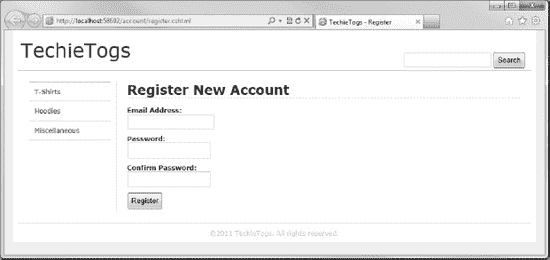

***图 10-4。**账户注册页面*

 **提示**为了最大限度地减少账户被自动机器人或跨站脚本注册的机会，你可能希望在你的注册表格上使用 ReCaptcha 助手。该助手的完整使用说明可在第 8 章的[中找到。](08.html#ch8)

或者，您可以实现一个电子邮件确认过程，例如在第 7 章的[通过电子邮件确认注册一节中描述的过程。](07.html#ch7)

#### 账户汇总帮助器

在本节中，我们将向布局页面添加一个帐户摘要面板。根据用户当前的认证状态，即他们是否登录到站点，帐户摘要将向用户显示不同的内容。

如果用户当前没有登录(也就是说，他们是匿名用户)，帐户摘要将显示他们的购物车链接以及登录和注册页面的链接。但是，如果用户登录，他们将看到显示他们的用户名，这将是一个到更改密码页面的链接，一个到他们的购物车的链接，以及一个允许他们从站点注销的链接。

我们将在一个助手中实现这一功能，所以在名为`MembershipHelpers.cshtml`的`App_Code`文件夹中添加一个新文件，并删除默认标记。

在`MembershipHelpers.cshtml`文件中，添加以下代码。

`@helper AccountSummary()
{
    if(WebSecurity.IsAuthenticated) {
        <text>
            Welcome <a href="@Href("~/Account/ChangePassword")">
                        @WebSecurity.CurrentUserName
                    </a> |
            <a href="@Href("~/Cart")">Cart</a> |
            <a href="@Href("~/Account/Logout")">Logout</a>
        </text>
    } else {
        <text>
            <a href="@Href("~/Account/Login")">Login</a> |
            <a href="@Href("~/Cart")">Cart</a> |
            <a href="@Href("~/Account/Register")">Register</a>
        </text>
    }
}`

这段代码相当简单，只需检查`WebSecurity.IsAuthenticated`属性，查看用户当前是否登录到站点，并显示适当的内容集。助手目前呈现了一些我们尚未实现的页面的超链接，`Login`、`Logout`和`ChangePassword`。我们将在本章的剩余部分创建所有这些页面。

为了在每个页面中向用户显示 account summary helper，我们将从布局页面中调用它。打开`Shared/Layouts/_Layout.cshtml`并在“header”`
.`中添加对助手的调用，在下面的代码示例中突出显示

`

    
<a href="@Href("~/")">TechieTogs</a>

    

        **
@MembershipHelpers.AccountSummary()
**
        
@RenderPage("~/Shared/Partials/_Search.cshtml")

    

`

我们将通过在`Css/Style.css`的样式表的“布局”部分添加以下 CSS 来将`"accountSummary"` `
`放置在页面的右上角。

`#accountSummary {
    float:right;
    margin-top: 10px;
    text-align: right;
}`

现在，当我们运行该站点时，我们将会在页面标题的右上角看到助手。[图 10-5](#fig_10_5) 和[图 10-6](#fig_10_6) 分别显示了显示给非认证用户和认证用户的账户摘要助手。

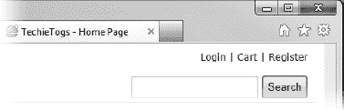

***图 10-5。**向匿名用户显示的账户摘要*

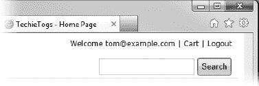

***图 10-6。**显示给认证用户的账户摘要*

##### 显示购物车中的商品数量

这很好，但是如果我们能显示一些更有用的特定于用户的信息不是很好吗？让我们利用我们创建的`Cart`对象，显示用户购物车中当前的商品数量。

对`MembershipHelpers.cshtml`中的`AccountSummary()`助手进行修改，如下图所示。

`@helper AccountSummary()
{
**    var cartItemCount = 0;**

**    if (Session["cart"] != null)**
**    {**
**        cartItemCount = ((Cart)Session["cart"]).Items.Count;**
**    }**

    if(WebSecurity.IsAuthenticated) {` `        <text>
            Welcome <a href="@Href("~/Account/ChangePassword")">
                        @WebSecurity.CurrentUserName
                    </a> |
            **<a href="@Href("~/Cart")">Cart - @cartItemCount item(s)</a> |**
            <a href="@Href("~/Account/Logout")">Logout</a>
        </text>
    } else {
        <text>
            <a href="@Href("~/Account/Login")">Login</a> |
            **<a href="@Href("~/Cart")">Cart - @cartItemCount item(s)</a> |**
            <a href="@Href("~/Account/Register")">Register</a>
        </text>
    }
}`

通过这些更改，我们通过调用 **`Cart.Items.Count()`** 方法获得用户购物车中的当前商品数量，并将该数量作为购物车超链接的一部分显示给用户。[图 10-7](#fig_10_7) 显示了结果。

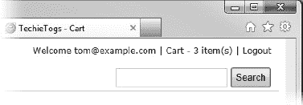

***图 10-7。**账户汇总助手，显示用户购物车中的商品数量*

##### 显示缩略图

我们的帐户摘要助手的最后一个亮点是显示用户的 Gravatar 图像，如果他们已经将图像与他们在 Gravatar.com 的电子邮件地址相关联的话。Gravatar，或全球公认的头像，是一个可以与你在[ww.gravatar.com](http://www.gravatar.com)的电子邮件地址相关联的图像。当你在博客上发表评论或帖子时，使用 Gravatar 服务的网站将能够显示与你的名字相对应的相关图片。在我们的例子中，我们将在 AccountSummary 中的用户名旁边显示 Gravatar 图像。

我们将使用 ASP.NET Web 助手库包中的`Gravatar()` web 助手，并传递用户的电子邮件地址。将下面的方法调用添加到`MembershipHelpers.cshtml`中的`AccountSummary()`助手，就在单词“Welcome”之前，用户名将显示给经过认证的用户。

`@Gravatar.GetHtml(WebSecurity.CurrentUserName,
                    imageSize:24,
                    defaultImage:"mm")`

这里，我们将用户的电子邮件地址传递给方法，并将图像大小设置为 24x 24 像素。

除了从指定的 URL 加载默认图像的选项之外，Gravatar 服务还提供了许多默认图像选项，如果没有图像与所请求的电子邮件地址相关联，则可以返回这些选项。[表 10-1](#tab_10_1) 显示了 Gravatar 默认图像的内置选项。

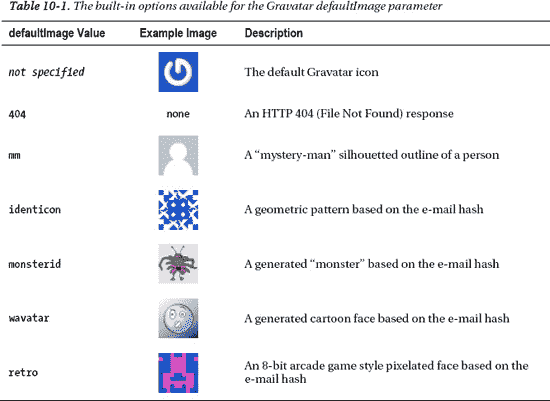

通过将`"mm"`传递给`defaultImage`参数，我们指示助手加载“神秘人”图像，如果没有图像与传递的电子邮件地址相关联的话。

为了在帐户摘要的垂直中间对齐图像，我们将在样式表的“Layout”部分添加下面的 CSS 样式。

`#accountSummary img {
    vertical-align: middle;
}`

[图 10-8](#fig_10_8) 显示页面上显示的已完成的账户汇总帮助器。

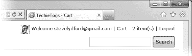

***图 10-8。**account summary helper 的最终版本，显示与用户的电子邮件地址相关联的 Gravatar 图像。*

#### 登录页面

登录页面用于对用户进行认证，如果当前用户是匿名的，则可以从帐户摘要帮助程序或通过从结帐页面重定向来访问该页面。

在`Account`文件夹中创建一个名为`Login.cshtml`的新页面，并用下面列出的代码替换任何现有的默认标记。

`@{

    Layout = "~/Shared/Layouts/_Layout.cshtml";
    Page.Title = "Login";

    var email = "";
    var password = "";

    if(IsPost)
    {
        email = Request["email"];
        password = Request["password"];
        var rememberMe = Request["rememberMe"].AsBool();

        // Validation
        if (email.IsEmpty()) {
            ModelState.AddError("email", "Username cannot be blank.");
        }

        if (password.IsEmpty()) {
            ModelState.AddError("password", "Password cannot be blank.");
        }

        // Attempt login
        if(ModelState.IsValid)
        {
            if(WebSecurity.Login(email, password, rememberMe))
            {
                if (Request.QueryString["sender"] != null)
                {
                    Response.Redirect(Request.QueryString["sender"]);
                }` `                else
                {
                    Response.Redirect("~/Default");
                }
            }
            else
            {
                ModelState.AddFormError("Unable to log in.");
            }
        }
    }
}

<h1>Login</h1>
@Html.ValidationSummary(true)
<form action="Login?@Request.QueryString" method="post" class="accountForm">
    
Please log in. If you do not have an exisiting account please <a href="../Account/Register?@Request.QueryString">register</a>.

    

        @Html.Label("Email Address: ", "email") 
        @Html.TextBox("email", email)
        @Html.ValidationMessage("email")
    

    

        @Html.Label("Password: ", "password") 
        @Html.Password("password")
        @Html.ValidationMessage("password")
    

    

        @Html.CheckBox("rememberMe", new { value = "true" })
        @Html.Label("Remember me on this computer?", "rememberMe")
    

    

         <input type="submit" value="Login" />
    

    

        <a href="ForgottenPassword">Forgotten Password?</a>
    

</form>`

第一次加载页面时，用户会看到一个空白的登录表单，包括电子邮件地址(用户名)和密码文本框，以及“还记得我吗？”复选框和提交按钮。该页面还提供了指向“帐户注册”和“忘记密码”页面的超链接。

[图 10-9](#fig_10_9) 显示了显示给用户的页面。注意我们不需要声明任何额外的 CSS 样式，因为我们正在重用开发注册页面时创建的格式样式。

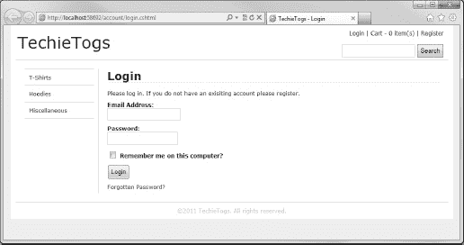

***图 10-9。**用户登录页面*

提交表单时，会验证表单值，并向用户显示相关的错误消息。如果提交的数据有效，我们通过将`email`、`password`和`rememberMe`表单控件的值传递给`WebSecurity.Login()`方法来尝试登录。

正如在[第 7 章](07.html#ch7)中提到的，我们将`rememberMe`复选框的布尔值传递给参数`persistCookie`，该参数指定用户是否希望在当前会话之后保存认证 cookie。

如果登录尝试失败，也就是说，`Login()`方法返回`false`，我们向`ModelState`添加一个表单错误并重新显示表单。如果登录成功，我们将用户重定向到通过`QueryString`的`sender`键传递的 URL(如果有的话);否则，我们将它们返回到主页。

#### 注销页面

注销页面非常简单，几乎不需要解释。当用户登陆页面时，调用`WebSecurity.Logout()`方法，删除认证 cookie。然后向用户显示一条消息，通知他们已经发生了这种情况，并给他们一个返回主页的超链接。

在`Account`文件夹中创建`Logout.cshtml`，并用以下内容替换任何现有内容。

`@{

    Layout = "~/Shared/Layouts/_Layout.cshtml";
    Page.Title = "Log Out";

    WebSecurity.Logout();

}

<h1>Log Out</h1>

You have been logged out from the site.

<a href="@Href("~/Default")">Return to home page</a>
`

#### 修改密码页面

通过单击帐户摘要帮助程序中的用户名，可以访问“更改密码”页面。出于安全目的，我们向用户提供此功能是非常重要的。

名为`ChangePassword.cshtml`的页面应该在`Account`文件夹中创建，并且应该包含以下代码和标记。

`@{

    Layout = "~/Shared/Layouts/_Layout.cshtml";
    Page.Title = "Change Password";

    if (!WebSecurity.IsAuthenticated)
    {
        Response.Redirect("~/Default");
    }

    var currentPassword = "";
    var newPassword1 = "";
    var newPassword2 = "";

    if(IsPost)
    {
        currentPassword = Request["currentPassword"];
        newPassword1 = Request["newPassword1"];
        newPassword2 = Request["newPassword2"];

        // Validation
        if (currentPassword.IsEmpty()) {
            ModelState.AddError("currentPassword", "Current Password required.");
        }

        if (newPassword1.IsEmpty()) {
            ModelState.AddError("newPassword1", "Required.");
        }

        if (newPassword2.IsEmpty()) {
            ModelState.AddError("newPassword2", "Required.");
        }

        if(newPassword1 != newPassword2)
        {
            ModelState.AddError("newPassword1", "The passwords do not match.");
        }

        // Attempt password change
        if(ModelState.IsValid)
        {
            var currentUser = WebSecurity.CurrentUserName;

            if(WebSecurity.ChangePassword(currentUser, currentPassword, newPassword1))` `            {
                Response.Redirect("~/Default");
            }
            else
            {
                ModelState.AddFormError("Unable to change password.");
            }
        }
    }
}

<h1>Change Password</h1>
    @Html.ValidationSummary(true)
    <form action="ChangePassword" method="post" class="accountForm">
        

            @Html.Label("Current Password: ", "currentPassword") 
            @Html.Password("currentPassword", currentPassword)
            @Html.ValidationMessage("currentPassword")
        

        

            @Html.Label("New Password: ", "newPassword1") 
            @Html.Password("newPassword1”, newPassword1)
            @Html.ValidationMessage("newPassword1")
        

        

            @Html.Label("Confirm New Password: ", "newPassword2") 
            @Html.Password("newPassword2", newPassword2)
            @Html.ValidationMessage("newPassword2")
        

        

             <input type="submit" value="Change Password" />
        

    </form>
</body>`

用户第一次作为 HTTP GET 请求的结果进入页面时，会看到一个包含三个文本框和一个提交按钮的表单。第一个文本框要求他们输入当前密码；这是为了防止恶意更改已登录帐户的密码。另外两个文本框要求用户输入两次新密码；这样做有助于防止他们提交的密码出现打字错误。如果用户在不知情的情况下提交了拼写错误的密码，他们将有效地锁定帐户，直到执行密码重置(参见下一节，处理忘记的密码)。

提交表单时，表单值被验证，适当的验证信息显示给用户，必要时使用页面`ModelState`和`Html.ValidationMessage()`助手(见[图 10-10](#fig_10_10) )。一旦提交了完全有效的表单，我们就调用`WebSecurity.ChangePassword()`方法，传递当前用户名和密码以及要存储的新密码。如果尝试的密码更改成功，用户将被发送到主页；否则，页面`ModelState`会添加一条错误消息，并重新显示该表单。

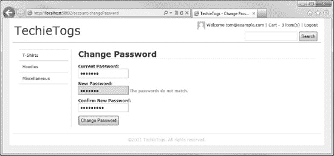

***图 10-10。**显示验证错误消息的更改密码页面*

#### 忘记密码

为我们的站点实现的最后一个成员资格过程是处理忘记密码的过程。如果用户忘记了密码，他们可以单击登录页面上的忘记密码链接来请求密码重置电子邮件，该邮件将发送到他们注册的电子邮件地址(在我们的示例中，这与用户名相同)。

在密码重置电子邮件中，他们将收到一个指向我们网站上的密码重置页面(`Account/PasswordReset.cshtml`)的超链接。该超链接将包含一个唯一的密码重置令牌，存储在 URL 查询字符串中，密钥为“password reset”。当他们访问密码重置页面时，系统会提示他们输入新密码。如果输入的新密码和密码重置令牌都有效，数据库中的密码条目将为该用户更改。

##### 发送电子邮件

为了向用户发送密码重置电子邮件，我们首先需要配置站点来发送电子邮件。打开您的`_AppStart.cshtml`文件，添加下面以粗体突出显示的 WebMail 初始化代码。您需要输入特定电子邮件服务器/帐户的详细信息。

 **提示**[第 7 章](07.html#ch7)中的“网络邮件助手”一节更详细地介绍了这个主题，包括一些从谷歌 Gmail 帐户发送电子邮件的默认设置。

`@{` `    WebSecurity.InitializeDatabaseConnection("TechieTogsData",
        "UserProfile", "UserId", "Email", true);

    **WebMail.SmtpServer = "<smtp server address>";**
**    WebMail.SmtpPort = <port number>;**
**    WebMail.EnableSsl = <true or false>;**
**    WebMail.UserName = "<email account user name>";**
**    WebMail.From = "<email account to send mail from>";**
**    WebMail.Password = "<email account password>";**

}`

现在我们已经初始化了 WebMail 助手，我们可以构建忘记密码的页面了。

##### 忘记密码页面

将名为`ForgottenPassword.cshtml`的新页面添加到`Account`文件夹中。在该文件中，删除任何现有的标记，并替换为以下内容。

`@{

    Layout = "~/Shared/Layouts/_Layout.cshtml";
    Page.Title = "Forgotten Password";

    var email = "";
    var message = "";

    if(IsPost)
    {
        email = Request["email"];

        // Validation
        if (email.IsEmpty()) {
            ModelState.AddError("email", "Email Address is required.");
        }

        // Generate and send password reset email
        if(ModelState.IsValid)
        {
            if(WebSecurity.UserExists(email))
            {
                // Generate confirmation link URL
                var resetToken = WebSecurity.GeneratePasswordResetToken(email);
                var hostUrl = Request.Url.GetComponents(UriComponents.SchemeAndServer,
                                                        UriFormat.Unescaped);
                var passwordResetUrl = hostUrl +
                                    "/Account/PasswordReset?resetToken=" +
                                    HttpUtility.UrlEncode(resetToken);

                // Send email` `                WebMail.Send(to: email,
                    subject: "TechieTogs Password Reset for " + email,
                    body: "Please visit <a href='" + passwordResetUrl + "'>" +
                        passwordResetUrl +
                        "</a> to reset your TechieTogs account password."
                );

                message = "An email has been sent to your registered email address " +
                    "with a password reset link and further instructions.";
            }
            else
            {
                message = "Unable to find matching account.";
            }
        }
    }
}

<h1>Forgotten Password</h1>
@if (!message.IsEmpty()) {
    
@message

}
else
{
    <form action="ForgottenPassword" method="post" class="accountForm">
        
Please enter your registered email address to be sent a password reset link:

        

            @Html.Label("Email Address: ", "email") 
            @Html.TextBox("email", email)
            @Html.ValidationMessage("email")
        

        

            <input type="submit" value="Reset Password" />
        

    </form>
}`

要求用户输入电子邮件地址(见[图 10-11](#fig_10_11) )。一旦提交，我们检查它是否已经存在于我们的数据库中。如果电子邮件地址存在，我们使用`WebSecurity.GeneratePasswordResetToken()`方法生成一个唯一的密码重置令牌。该令牌由方法根据数据库中的用户记录自动存储。我们还使用生成的令牌来构造通过电子邮件发送给用户的密码重置链接的 URL。最后，使用 WebMail 助手组装并发送电子邮件，并向用户显示一条消息，指示他们检查他们的电子邮件收件箱。

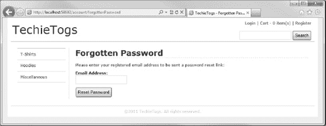

***图 10-11。**忘记密码页面*

“忘记密码”页面到此结束。现在，我们将创建用户在单击密码重置电子邮件中的链接时将登录的页面。

##### 重置密码页面

“忘记密码”页面会向用户发送一封电子邮件，其中包含类似如下的链接。

`http://localhost:58692/Account/PasswordReset?resetToken=0dogNPAJewCD%2b1MQIe%2fX0Q%3d%3d`

该链接将用户发送到`Account/PasswordReset.cshtml`，您现在应该在您的站点中创建它。该页面将包含一个带有两个密码文本框和一个提交按钮的表单(见[图 10-12](#fig_10_12) )。

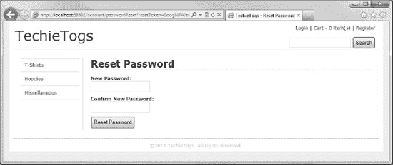

***图 10-12。**重置密码页面，用户通过忘记密码电子邮件中的超链接被发送到该页面。*

当用户提交一个有效的表单时，通过将从`QueryString`的`resetToken`键检索的令牌和新密码传递给`WebSecurity.ResetPassword()`方法来尝试重置密码。如果令牌与存储在数据库中的令牌匹配，则重置密码，并向用户显示“成功”消息；否则，将显示一条失败消息。

下面的代码是`Account/PasswordReset.cshtml`页面的完整清单。

`@{

    Layout = "~/Shared/Layouts/_Layout.cshtml";
    Page.Title = "Reset Password";

    var resetToken = Request["resetToken"] ?? "";
    var message = "";
    var newPassword1 = "";
    var newPassword2 = "";

    if(IsPost) {
        newPassword1 = Request["newPassword1"];
        newPassword2 = Request["newPassword2"];

        // Validation
        if (newPassword1.IsEmpty()) {
            ModelState.AddError("newPassword1", "Required.");
        }

        if (newPassword2.IsEmpty()) {
            ModelState.AddError("newPassword2", "Required.");
        }

        if(newPassword1 != newPassword2)
        {
            ModelState.AddError("newPassword1", "The passwords do not match.");
        }

        // Attempt password reset
        if(ModelState.IsValid)
        {
            if (WebSecurity.ResetPassword(resetToken, newPassword1))
            {
                message = "Password changed successfully.";
            }
            else
            {
                message = "Unable to change password.";
            }
        }
  }
}

<h1>Reset Password</h1>
@if (!message.IsEmpty()) {` `    
@message

}
else
{
    <form action="PasswordReset" method="post" class="accountForm">
        @Html.Hidden("resetToken", resetToken)
        

            @Html.Label("New Password: ", "newPassword1") 
            @Html.Password("newPassword1", newPassword1)
            @Html.ValidationMessage("newPassword1")
        

        

            @Html.Label("Confirm New Password: ", "newPassword2") 
            @Html.Password("newPassword2", newPassword2)
            @Html.ValidationMessage("newPassword2")
        

        

            <input type="submit" value="Reset Password" />
        

    </form>
}`

这就结束了 TechieTogs 会员制度的实施。既然我们已经在应用中创建了一个全功能的会员系统，那么是时候完成本章的最后一个任务了，结账流程。

### 结账流程

我们网站的结帐过程将要求用户输入他们的运输细节，并确认订单。一旦他们完成这些事情，订单将被存储在数据库中，一封确认电子邮件将被发送，他们将被重定向到一个“订单完成”页面。

我们的第一个任务是创建必要的数据库表来存储完成的订单。

#### 准备数据库

我们将向站点数据库添加两个新表来存储我们的订单。第一个表叫做`Orders`，将存储订单的标题细节，包括送货地址和用户 ID。第二个表`OrderItems`将用于存储构成每个订单的各个行项目。

在数据库工作区中，右键单击导航窗格中`TechieTogsData.sdf`数据库内的表节点，并从上下文菜单中选择“新建表”。在[表 10-2](#tab_10_2) 中添加下列各列，并将该表另存为`Orders.`

T2】

接下来，将[表 10-3](#tab_10_3) 中列出的列添加到名为`OrderItems`的新表中。

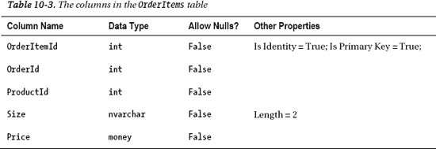

现在我们已经有了所需的数据库表，让我们构建我们的结帐页面。

#### 结账页面

在结帐页面上，我们将显示用户购物车的内容，并要求他们提供订单的送货细节(见[图 10-13](#fig_10_13) )。当用户点击“下订单”按钮时，将发生以下过程。

1.  订单详情将被插入到数据库中。
2.  将向用户发送一封确认电子邮件。
3.  所有当前商品都将从购物车中删除。
4.  用户将被重定向到“订单完成”页面。

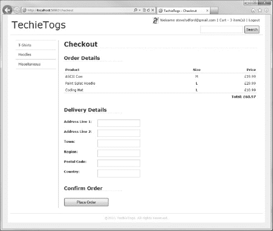

***图 10-13。**技术人员结账页面*

在 TechieTogs 站点的根目录下创建一个名为`Checkout.cshtml`的新页面，并删除任何自动生成的内容。

将以下代码和标记添加到页面中，以便向用户显示结帐页面。

`@{
    if (!WebSecurity.IsAuthenticated)
    {
        string currentUrl = Request.Url.ToString();
        Response.Redirect("~/Account/Login?sender=" + currentUrl);
    }

    Layout = "~/Shared/Layouts/_Layout.cshtml";
    Page.Title = "Checkout";

    var address1 = "";
    var address2 = "";
    var town = "";
    var region = "";
    var postalCode = "";
    var country = "";

    // Redirect to Cart.cshtml if no cart exists in Session
    if (Session["cart"] == null)
    {
        Response.Redirect("Cart");
    }

    // Get current cart from Session
    Cart cart = (Cart)Session["cart"];

    // Redirect to cart.cshtml if cart has no items
    if(cart.Items.Count() == 0)
    {
        Response.Redirect("Cart");
    }

    // POST REQUEST HANDLER GOES HERE

}

<h1>Checkout</h1>

    <h2>Order Details</h2>
    <table id="cartTable">
        <tr>
            <th class="product">Product</th>
            <th class="size">Size</th>
            <th class="price">Price</th>
        </tr>

        @foreach (var item in cart.Items)
        {
            <tr>` `                <td class="product">@Products.GetProductNameFromId(item.ProductID)</td>
                <td class="size">@item.Size</td>
                <td class="price">£@item.Price</td>
            </tr>
        }

        <tr class="cartTotal">
            <td colspan="2">&nbsp;</td>
            <td>Total: £@cart.TotalValue</td>
        </tr>
    </table>

    <h2>Delivery Details</h2>
    <form action="Checkout" method="post">
        

            @Html.Label("Address Line 1: ", "address1")
            @Html.TextBox("address1", address1, new { maxlength = "100" } )
            @Html.ValidationMessage("address1")
        

        

            @Html.Label("Address Line 2:", address2)
            @Html.TextBox("address2", address2, new { maxlength = "100" } )
        

        

            @Html.Label("Town: ", "town")
            @Html.TextBox("town", town, new { maxlength = "50" } )
            @Html.ValidationMessage("town")
        

        

            @Html.Label("Region: ", "region")
            @Html.TextBox("region", region, new { maxlength = "50" } )
            @Html.ValidationMessage("region")
        

        

            @Html.Label("Postal Code: ", "postalCode")
            @Html.TextBox("postalCode", postalCode, new { maxlength = "20" } )
        

        

            @Html.Label("Country: ", "country")
            @Html.TextBox("country", country, new { maxlength = "50" } )
        

        <h2>Confirm Order</h2>
        

            <input type="submit" value="Place Order"/>
        

    </form>

`

页面执行的第一个操作是检查当前用户是否登录到站点。我们通过检查布尔属性`WebSecurity.IsAuthenticated`来做到这一点。如果用户没有通过认证，他们会立即被重定向到登录页面。通过在 URL QueryString 的`sender`键中传递当前 URL，我们指示登录页面在用户成功登录后将用户送回收银台。

接下来，我们设置布局页面和标题，并声明一组变量来存储来自 shipping details 表单的数据。如果此时用户的浏览器会话中没有购物车，我们会将他们重定向到`Cart.cshtml`。如果购物车出现在会话中，我们检索它并获得商品数量，如果购物车是空的，再次将用户重定向到`Cart.cshtml`。

然后，在页面上，我们定义一个 HTML `<table>`并迭代购物车的`Items`集合，显示每个商品的摘要，将一个商品作为一行添加到表中。在最后一行，我们显示来自`Cart.TotalValue`属性的购物车中所有商品的订单总值。

在购物车汇总表下面，我们显示了一个收集运输细节的表单。这是一个简单的 HTML 表单，包含六个文本框和一个提交按钮。每个文本框的`maxlength`属性被设置为匹配`Orders`表中相应数据库列的长度。

为了给页面提供一些格式，我们需要给我们的`Css/Style.css`样式表添加一些额外的 CSS 样式。在“验证”部分的正上方添加以下部分。

`/* Checkout
---------------------------------*/
#checkout h2 {
    width: 30%;
    border-bottom: 1px dashed #cdcdcd;
    margin: 25px 0px 20px 0px;
}

#checkout label {
    font-weight: bold;
    padding-right: 5px;
    width: 10em;
    float:left;
}

#checkout p {
    padding: 5px 0px 5px 0px;
}

#checkout input[type="submit"] {
    padding: 5px 45px 5px 45px;
}`

结帐页面正确显示后，我们将添加一个 POST 请求处理程序，在用户单击“Place Order”按钮时执行前面描述的操作。将以下代码插入到页面中，代替`// POST REQUEST HANDLER GOES HERE`注释。

`if (IsPost)
{
    address1 = Request["address1"];
    address2 = Request["address2"];
    town = Request["town"];
    region = Request["region"];
    postalCode = Request["postalCode"];
    country = Request["country"];` `// Validate Delivery Details
    if (address1.IsEmpty()) {
        ModelState.AddError("address1", "Address Line 1 is required.");
    }

    if (town.IsEmpty()) {
        ModelState.AddError("town", "Town is required.");
    }

    if (region.IsEmpty()) {
        ModelState.AddError("region", "Region is required.");
    }

    if(ModelState.IsValid)
    {
        // Save Order
        var UserID = WebSecurity.GetUserId(WebSecurity.CurrentUserName);

        var db = Database.Open("TechieTogsData");
        var orderSql = "INSERT INTO Orders (UserId, OrderShipped, OrderTotal, " +
                        "OrderDateTime, Address1, Address2, Town, " +
                        "Region, PostalCode, Country) " +
                        "VALUES ( @0, @1, @2, @3, @4, @5, @6, @7, @8, @9 )";
        db.Execute(orderSql,
                    UserID,
                    false,
                    cart.TotalValue,
                    DateTime.Now,
                    address1,
                    address2,
                    town,
                    region,
                    postalCode,
                    country);       
        var orderId = db.GetLastInsertId();

        foreach(var item in cart.Items)
        {
            orderSql = "INSERT INTO OrderItems (OrderID, ProductID, Size, Price) VALUES (" +
                        "@0, @1, @2, @3)";
            db.Execute(orderSql, orderId, item.ProductID, item.Size, item.Price);
        }

        // Send confirmation email
        WebMail.Send(to: WebSecurity.CurrentUserName,
            subject: "TechieTogs Order Confirmation",
            body: "Many thanks for your order. Your items will be " +
            "dispatched shortly and should arrive within 3-5 working days."
        );` `        // Clear shopping cart
        cart.Clear();

        Response.Redirect("OrderComplete");
    }
}`

在 POST 请求处理程序中，我们检索 shipping details 表单字段的值，将它们分配给前面声明的变量，并验证必要的字段。如果任何表单域包含无效数据，我们将向`ModelState`添加一个错误，并在表单中显示相关的错误消息。

如果所有的表单数据都有效，我们将订单头细节插入到`Orders`表中，通过调用`WebSecurity.GetUserId()`方法，将`UserId`字段设置为认证用户的`UserId`。我们将`OrderShipped`字段设置为`false`，将`OrderTotal`字段设置为`Cart.TotalValue`属性。最后，用`DateTime.Now`填充`OrderDateTime`字段，其余字段填充用户提交的值。

一旦我们执行了对`Orders`表的插入，我们就通过调用`GetLastInsertId()`方法获得了创建的`OrderId`。然后我们迭代购物车的内容，使用我们刚刚检索的`OrderId`将每个商品的详细信息插入到`OrderItems`表中。

 **提示**这个 POST 请求处理程序是插入代码进行在线支付的最佳位置。虽然任何在线支付系统都可以与 WebMatrix 集成，但 WebMatrix 包管理器中提供了通过 PayPal 和 Amazon 进行支付的 Web helper 包。

接下来，我们向用户发送一封电子邮件，感谢他们的订单，并告知他们预期的交货时间。最后，我们清除购物车的内容，并将用户重定向到订单完成页面。

#### 订单完成页面

订单完成页面只是向用户显示一条消息，感谢他们的订单，并通知他们已经发送了一封确认电子邮件。

将以下代码插入到名为`OrderComplete.cshtml`的站点根目录下的新页面中。

`@{
    Layout = "~/Shared/Layouts/_Layout.cshtml";
    Page.Title = "Order Complete";
}

<h1>Order Complete</h1>

Many thanks for your order. An email confirmation has been sent.

 

Your order will be dispatched shortly and should arrive in 3-5 working days.
`

就这样！我们的结帐过程已经完成。

### 总结

在本章中，我们已经在 TechieTogs 网站上添加了电子商务功能。这些功能包括功能齐全的购物车、结账流程和会员系统。

在下一章中，我们将为站点添加一些最终功能，包括上传、存储和显示产品图像，为主页生成一些动态内容以显示特色产品和受欢迎的产品，以及创建管理页面以方便站点的管理。