# 十一、TechieTogs：网站管理和收尾工作

现在我们已经完成了网站面向公众的部分，是时候将注意力转向管理功能了，这对于维护网站和处理客户订单是必不可少的。

我们将在本章中讨论的管理流程包括:

*   为管理员创建一个安全区域来管理用户、订单和产品目录
*   添加和删除管理用户
*   查看客户订单
*   添加和编辑类别和产品

除了这些流程，我们还会在网站的公共端添加一些最后的收尾工作，以改善用户体验；包括:

*   上传和展示产品图片
*   为主页创建动态内容

在这一章中，我们有大量的内容要讲。在大多数情况下，代码现在对您来说已经很熟悉了，几乎不需要解释。对于我们添加的每个页面，我将描述页面的功能和工作流程。我将只在我提出一个新的或特别复杂的概念时提供代码的详细解释。

### 创建管理区

我们需要创建一个只有网站管理员才能访问的区域。我们将在那里管理网站。我们将通过创建一个“管理”文件夹来实现这一点，该文件夹将包含我们所有的管理页面。通过只允许具有“管理员”角色的成员访问，此文件夹将受到保护。让我们从创建该角色开始。

#### 创建管理员角色

在 WebMatrix IDE 中打开数据库工作区。在导航窗格中，打开`TechieTogsData.sdf`数据库中的`webpages_Roles`表。添加一条新记录，在`RoleName`字段中插入值‘Admin’(参见[图 11-1](#fig_11_1) )。`RoleId`字段是由数据库自动填充的身份字段，因此不要在该列中输入值。

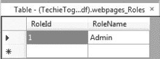

***图 11-1。**在`webpages_Roles`表格*中插入一个管理角色

接下来，如果您目前在数据库中没有注册用户，运行站点并使用`Account/Register.cshtml`页面创建一个帐户。一旦有了注册用户，返回 WebMatrix IDE，打开`UserProfile`表，记下他们的`UserId`。

打开`webpages_UsersInRoles`表并创建一条新记录，插入相关的`UserId`和`RoleId`(参见[图 11-2](#fig_11_2) )。在该表中，两列都是外键，因此它们不是由数据库生成的(即，您应该在两列中都输入一个值)。

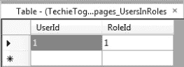

***图 11-2。**在`webpages_UsersInRoles`表格*中为用户分配管理员角色

由于这是第一个管理功能之一，将在网站上为它建立一个用户界面，这是我们必须执行此操作的唯一时间。将来，网站管理员将能够通过网站中的用户界面来做到这一点。

 **注意**有关 ASP.NET 网页会员系统中角色使用的更多信息，请参见第 7 章——安全性和会员资格[中的“角色”部分。](07.html#ch7)

#### 创建并保护管理文件夹

网站内的所有管理页面都将存储在一个“Admin”文件夹中。我们将只允许刚刚创建的管理员角色的成员访问此文件夹。

在 WebMatrix IDE 中，在站点根目录下创建一个名为“Admin”的新文件夹，并向其中添加一个名为`_PageStart.cshtml`的新页面。在`_PageStart.cshtml`文件中添加以下代码，删除任何默认标记:

`@{
    if (!Roles.IsUserInRole(WebSecurity.CurrentUserName, "Admin"))
    {
        string currentUrl = Request.Url.ToString();
        Response.Redirect("~/Account/Login?sender=" + currentUrl);
    }
}`

这段代码检查当前用户是否是 Admin 角色的成员，如果不是，则返回到登录页面。按照惯例，`_PageStart.cshtml`文件将在包含它的文件夹(在我们的例子中是“Admin”文件夹)或其子文件夹中的任何其他页面之前执行，从而保护我们所有的管理页面。

### 网站管理主页

管理区内的页面都将使用相同的布局页面。在开始开发任何可能依赖于它的页面之前，让我们先创建这个页面。

#### 管理布局页面

在`Shared/Layouts`文件夹中创建一个名为`_AdminLayout.cshtml`的新页面。该页面将非常类似于该网站面向公众的布局页面，但将在左侧呈现一个菜单，方便导航到各种管理页面，而不是类别菜单。

`_AdminLayout.cshtml`页面的全部内容如下:

`<!DOCTYPE html>

<html lang="en">
    <head>
        <meta charset="utf-8" />
        <title>TechieTogs - @Page.Title</title>
        <link href="@Href("~/Css/Style.css")" rel="stylesheet" />
        <link href="@Href("~/Css/AdminStyle.css")" rel="stylesheet" />

        @RenderSection("head", required: false)

    </head>
    <body>
        

            

                
<a href="@Href("~/")">TechieTogs</a>

                

                    
@MembershipHelpers.AccountSummary()

                

            

            

                

                    @RenderPage("~/Shared/Partials/_AdminMenu.cshtml")
                

                

                    @RenderBody()
                

            

            

                &copy;@DateTime.Now.Year TechieTogs. All rights reserved.
            

        

    </body>
</html>`

您会注意到管理布局页面需要两个尚不存在的文件:`_AdminMenu.cshtml`和`AdminStyle.css`。接下来我们将创建这些文件。

#### 管理菜单

管理菜单只是一个局部页面，它提供了到站点管理部分中各个页面的导航。在`Layouts/Partials`文件夹中创建文件`_AdminMenu.cshtml`，并输入以下标记:

`

    <a href="@Href("~/Admin/")">Site Administration</a>

<ul>
    <li><a href="@Href("~/Admin/Orders/")">Orders</a></li>
    <li><a href="@Href("~/Admin/Categories/")">Categories</a></li>
    <li><a href="@Href("~/Admin/Products/")">Products</a></li>
    <li><a href="@Href("~/Admin/Products/Featured")">Featured Product</a></li>
    <li><a href="@Href("~/Admin/Users/")">Admin Users</a></li>
</ul>`

您可以看到管理页面将存储在与其功能相关的子文件夹中。我们将在本章中创建这些子文件夹和页面，并实现站点管理界面的各个部分。

#### 管理样式表

任何只在网站管理区域使用的 CSS 样式都将在一个单独的样式表中定义。通过这样做，我们可以确保非管理员用户不必下载网站管理区域所需的样式。这为我们节省了一些页面加载时间和带宽。

在`Css`文件夹中创建一个名为`AdminStyle.css`的文件。为方便起见，我们将在这里一次性添加管理页面所需的所有 CSS。我们将在整章中使用这些页面。

将以下 CSS 添加到`/Css/AdminStyle.css`:

`/* General Styles
---------------------------------*/
h2 {
    width: 30%;
    border-bottom: 1px dashed #cdcdcd;
    margin: 25px 0px 20px 0px;
}

textarea {
    font-family: Verdana, Helvetica, Sans-Serif;
}

/* Menu
---------------------------------*/
#adminMenu {
    float:left;
    width:150px;
}

#adminMenu ul {
    border-bottom: 1px solid #cdcdcd;
    margin-bottom: 20px;
}

#adminMenu ul li {
    list-style: none;
    border-top: 1px solid #cdcdcd;
    margin: 0;
    padding: 10px;
}

#adminMenu ul li:hover {
    background-color: #ddd;
}

#adminMenu .title {
    margin-bottom: 20px;
    text-align:center;
    font-size: 12px;
    font-weight: bold;
}

/* Grid
---------------------------------*/
.grid {
    margin-top: 20px;
    border-collapse: collapse;
    width: 100%;
}

.grid td {
    padding: 5px;
}

.gridHeader {
    background-color: #fff;
    font-weight: bold;
    text-align: left;
    border-bottom: 1px solid #cdcdcd;
}

.gridAlt {
    background-color: #f7f7f7;
}

.gridFooter {
    border-top: 1px solid #cdcdcd;
}

.grid tr #mainColumn {
    width: 100%;
}

/* Forms
---------------------------------*/
#shippedForm, #deleteForm {
    margin-top: 15px;
}

#productForm
{
    float: left;
    width: 350px;
}
#productFormImage
{
    float: left;
    width: 330px;
}

#productForm label {
    font-weight: bold;
}

#productForm p {
    padding: 5px 0px 5px 0px;
}`

#### 网站管理主页

管理主页将基于`_AdminLayout.cshtml`布局页面。该页面本身将包含很少的内容，尽管您可能希望稍后添加一些内容来提供重要站点数据的摘要，如注册用户数、未发货订单、总订单值等。这是留给读者的一个练习。

在`Admin`文件夹中创建一个名为`Default.cshtml`的文件，并用以下内容替换默认标记:

`@{
    Layout = "~/Shared/Layouts/_AdminLayout.cshtml";
    Page.Title = "Administration";
}

<h1>Site Administration</h1>

Select an administration task from the menu.
`

现在运行站点，以您分配给“管理员”角色的用户身份登录，并浏览到`/Admin/Default.cshtml`页面。您将看到基于管理布局页面的网站管理主页，包括管理菜单，如图 11-3 所示:

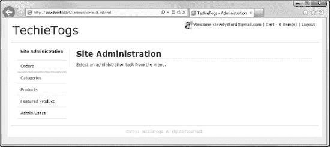

***图 11-3。**网站管理主页*

### 修改账户汇总帮助器

尽管站点管理员可以通过直接浏览 URL 来访问站点管理主页，但最好在登录后为他们提供一个链接。为此，我们将在 Account Summary Helper 中添加一个新部分，显示在每页的右上角。

打开`App_Code/MembershipHelpers.cshtml`文件，添加下面清单中用粗体突出显示的代码:

`@helper AccountSummary()
{
    var cartItemCount = 0;

    if (Session["cart"] != null)
    {
        cartItemCount = ((Cart)Session["cart"]).Items.Count;
    }

    if(WebSecurity.IsAuthenticated) {
        <text>
            @Gravatar.GetHtml(WebSecurity.CurrentUserName,
                                imageSize:24,
                                defaultImage:"mm")

            Welcome <a href="@Href("~/Account/ChangePassword")">
                        @WebSecurity.CurrentUserName
                    </a> |
            <a href="@Href("~/Cart")">Cart - @cartItemCount item(s)</a> |
            <a href="@Href("~/Account/Logout")">Logout</a>
            **@if (Roles.IsUserInRole(WebSecurity.CurrentUserName, "Admin"))**
            **{**
                **<text>**
                    **| <a href="@Href("~/Admin/Default")">Admin</a>**
                **</text>**   
            **}**
        </text>
    } else {
        <text>
            <a href="@Href("~/Account/Login")">Login</a> |
            <a href="@Href("~/Cart")">Cart - @cartItemCount item(s)</a> |
            <a href="@Href("~/Account/Register")">Register</a>
        </text>
    }
}`

这段新代码在帐户摘要中显示了一个额外的超链接，为作为管理员角色成员的已验证用户提供了一个到站点管理主页的链接(参见[图 11-4](#fig_11_4) )。

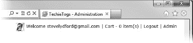

***图 11-4。**显示“管理”超链接的账户摘要帮助器*

### 用户管理

现在，我们已经为站点的安全管理区域准备好了基础设施，我们需要一种向管理角色添加用户和从管理角色中删除现有用户的方法。

在 admin 文件夹中创建一个名为“Users”的新子文件夹，并在其中创建一个名为`Default.cshtml`的页面。

该页面将列出所有当前的管理员角色成员，并带有一个将他们从角色中删除的按钮，还提供了一个允许添加新成员的表单。[图 11-5](#fig_11_5) 显示了完成的页面:

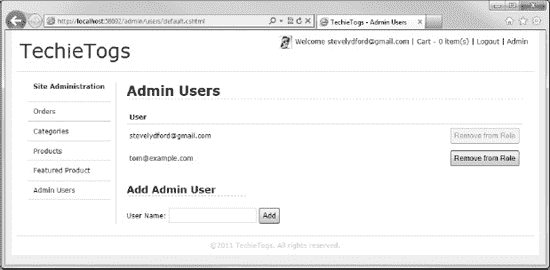

***图 11-5。**管理员用户页面*

用以下内容替换`Admin/Users/Default.cshtml`页面中的任何现有标记:

`@{
    Layout = "~/Shared/Layouts/_AdminLayout.cshtml";
    Page.Title = "Admin Users";

    var userToAdd = "";
    var role = "Admin";

    if(IsPost)
    {
        userToAdd = Request["userToAdd"];

        if(userToAdd != null)
        {
            // Add User to Role
            if (WebSecurity.UserExists(userToAdd) &&
                !Roles.IsUserInRole(userToAdd, role))
            {
                Roles.AddUsersToRoles(
                    new [] { userToAdd }.ToArray(),
                    new [] { role }.ToArray()
                );
            }
            else
            {
                ModelState.AddError("userToAdd", "Unable to add user");
            }
        }
        else if (Request["userToRemove"] != null)
        {
            // Remove User from Role

            var userToRemove = Request["userToRemove"];
            if (Roles.IsUserInRole(userToRemove, role))
            {
                Roles.RemoveUsersFromRoles(
                    new [] { userToRemove }.ToArray(),
                    new [] { role }.ToArray()
                );
            }
        }
    }

    var users = Roles.GetUsersInRole(role);
}

<h1>Admin Users</h1>

<table class="grid">
    <tr>
        <th colspan="3" class="gridHeader">User</th>
    </tr>
    @foreach (var user in users)
    {
        <tr>
            <td id="mainColumn">
                @user
            </td>
            <td>
                @{
                    var buttonState = "";
                    if(user == WebSecurity.CurrentUserName)
                    {
                        buttonState = "disabled=disabled";
                    }
                }
                    <form action="" method="post">
                        @Html.Hidden("userToRemove", user)
                        <input type="submit" value="Remove from Role" @buttonState />
                    </form>

            </td>
        </tr>
    }
</table>

<h2>Add Admin User</h2>
<form action="" method="post">
    

        User Name:
        @Html.TextBox("userToAdd", userToAdd)
        <input type="submit" value="Add" />
        @Html.ValidationMessage("userToAdd")
    

</form>`

POST 请求处理程序检查是否有一个`userToAdd`字段在已发布的表单值中被传回。如果有，我们知道用户已经提交了“添加管理员用户”表单，所以我们尝试将用户添加到角色中。否则，如果已经提交了一个`userToRemove`字段，我们知道用户点击了一个‘Remove from Role’按钮，所以我们尝试删除相关用户。我们以前在购物车页面上使用过类似的机制。

 **注**关于添加和删除角色成员的方法的解释，请参见第 7 章-安全性和成员资格[中的“角色”一节。](07.html#ch7)

在这个页面上还有两个有趣的地方。首先，我们禁用包含当前已验证用户的行中的 remove 按钮。虽然不是绝对安全的，但这至少有助于确保至少有一个用户始终可以访问站点的管理部分。

其次，我们要求用户实际输入他们希望添加到管理员角色的帐户的用户名，尽管我们可以很容易地提供一个注册用户的下拉列表。当网站只有少量用户时，这种方法很好，但当网站上线并开始主导全球电子商务市场时，正如我们预期的那样，当我们试图将成千上万的用户名加载到下拉列表中时，我们很快就会遇到页面加载问题。尽管超出了本书的范围，但解决这个问题的一个好办法是使用 AJAX 实现自动完成文本框。

### 订单管理

我们需要在我们的网站上有一个区域，我们可以查看客户的订单，并将它们标记为已发货。订单管理流程将由两个页面组成。第一页将列出一个 WebGrid 中所有订单的摘要。WebGrid 中的每一行都将显示一个超链接，将用户带到第二个页面，该页面显示订单的完整详细信息。

我们将从创建订单汇总页面开始。

#### 订单汇总页面

我们将使用`WebGrid`助手来显示订单摘要，因为它使我们能够轻松地向网格添加分页和排序功能。我们还将在网格上方包含一个小表单，允许用户选择查看已发货或未发货的订单。[图 11-6](#fig_11_6) 显示完成的订单汇总页面:

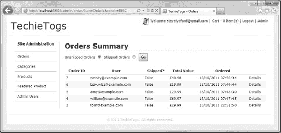

***图 11-6。**订单汇总页面*

要在您的站点中创建页面，请在“管理”文件夹中添加一个名为“订单”的新子文件夹，并在其中添加一个名为`Default.cshtml`的页面。下面的清单包含了`Admin/Orders/Default.cshtml`的完整代码和标记:

`@{
    Layout = "~/Shared/Layouts/_AdminLayout.cshtml";
    Page.Title = "Orders";

    var showShippedOrders = false;

    if(IsPost)
    {
        showShippedOrders = Request["showShippedOrders"].AsBool();
    }

    var db = Database.Open("TechieTogsData");
    var sqlCommand = "SELECT Orders.OrderId, Orders.OrderShipped, Orders.OrderTotal, " +
                     "Orders.OrderDateTime, UserProfile.Email FROM Orders " +
                     "INNER JOIN UserProfile ON Orders.UserId = UserProfile.UserId " +
                     "WHERE OrderShipped = @0 " +
                     "ORDER BY OrderDateTime DESC";

    var result = db.Query(sqlCommand, showShippedOrders);

    var ordersGrid = new WebGrid(source: result,
                                 rowsPerPage: 20);

}

<h1>Orders Summary</h1>
<form action="Default" method="post">
    

        Unshipped Orders @Html.RadioButton("showShippedOrders", "false", !showShippedOrders)
        Shipped Orders @Html.RadioButton("showShippedOrders", "true", showShippedOrders)
        <input type="submit" value="Go"/>
    

</form>

    @ordersGrid.GetHtml(
        tableStyle: "grid",
        headerStyle: "gridHeader",
        alternatingRowStyle: "gridAlt",
        footerStyle: "gridFooter",
        columns: ordersGrid.Columns(
            ordersGrid.Column("OrderId",
                              "Order ID"),
            ordersGrid.Column("Email",
                              "User",
                              format: @<text>
                                          <a href="mailto:@item.Email">
                                              @item.Email
                                          </a>
                                      </text>),
            ordersGrid.Column("OrderShipped",
                              "Shipped?"),
            ordersGrid.Column("OrderTotal",
                              "Total Value",
                              format: @<text>
                                          £@item.OrderTotal
                                      </text>),
            ordersGrid.Column("OrderDateTime",
                              "Ordered"),
            ordersGrid.Column(null,
                              null,
                              format: @<text>
                                          <a href="OrderDetails/@item.OrderId">
                                              Details
                                          </a>
                                      </text>)
        )
    )

`

浏览代码，您可以看到获取 WebGrid 数据的 SQL 语句在`Orders`和`UserProfile`表之间包含了一个`INNER JOIN`。这允许我们根据针对每个订单存储的`UserId`，检索用户的用户名(`Email`)。

SQL 语句的`WHERE`子句根据`OrderShipped`列过滤结果。默认情况下，这被设置为`False`，但在回发时被更改为单选按钮组的值。

表单下的页面主体包含我们的 WebGrid，它是由前面提到的 SQL 查询的结果填充的。这个网格相当标准，除了最后一列没有绑定到数据列，而是显示了一个到 Order Details 页面的超链接，传递 URL 中的`OrderId`。

 **注意**关于 WebGrid 助手及其用法的完整解释可以在[第 6 章](06.html#ch6)——使用数据，在‘使用 WebMatrix 助手显示数据’一节中找到。

#### 订单详情页面

“订单详细信息”页面显示任何特定订单的综合详细信息，包括订单的日期和时间、发货详细信息、订单中所有项目的详细信息以及发货状态。

该页面包括“订单已发货？”复选框，管理员可以选中该复选框来表明订单已经发送。这将把`OrderShipped`字段设置为`true`，这将把它放在订单摘要页面上的“已发货订单”列表中。

在`Admin/Orders`文件夹中创建一个名为`OrderDetails.cshtml`的新页面，并输入以下代码，以替换创建页面时由 WebMatrix 生成的默认标记:

`@{

    Layout = "~/Shared/Layouts/_AdminLayout.cshtml";
    Page.Title = "Order Details";

    // Get orderID from URL, or set to 0 if not present
    var orderID = !UrlData[0].IsEmpty() ? UrlData[0] : "0";

    var db = Database.Open("TechieTogsData");  

    if (IsPost)
    {
        orderID = Request["orderID"];
        var shipped = Request["shipped"].AsBool();

        var sqlUpdate = "UPDATE Orders SET OrderShipped = @0 WHERE OrderId = @1";
        db.Execute(sqlUpdate, shipped, orderID);

        Response.Redirect("~/Admin/Orders/");
    }

    // Get Order header details
    var sqlCommand = "SELECT Orders.*, UserProfile.Email FROM Orders " +
                     "INNER JOIN UserProfile ON Orders.UserId = UserProfile.UserId " +
                     "WHERE OrderId = @0 ";

    var order = db.QuerySingle(sqlCommand, orderID);

    // Get Order items
    var itemsSql = "SELECT * FROM OrderItems WHERE OrderID = @0";
    var orderItems = db.Query(itemsSql, orderID);

}

@if (order == null)
{
    

        Unable to fetch order details.
    

}
else
{
    <text>
        <h1>Order Details</h1>
        
<strong>Order ID:</strong> @order.OrderId

        
<strong>User:</strong> <a href="mailto:@order.Email">@order.Email</a>

        
<strong>Ordered: </strong>@order.OrderDateTime

        <h2>Shipping Details</h2>
        
<strong>Address 1:</strong> @order.Address1

        
<strong>Address 2:</strong> @order.Address2

        
<strong>Town: </strong>@order.Town

        
<strong>Region:</strong> @order.Region

        
<strong>Postal Code:</strong> @order.PostalCode

        
<strong>Country: </strong>@order.Country

        

            <form action="OrderDetails" method="post" id="shippedForm">
                @Html.Hidden("orderId", order.OrderId)
                    Order Shipped?
                    @Html.CheckBox("shipped", order.OrderShipped, new { value = "true" })
                    <input type="submit" value="Update" />
            </form>
        

        <h2>Order Items</h2>
        <table id="cartTable">
            <tr>
                <th class="product">Product</th>
                <th class="size">Size</th>
                <th class="price">Price</th>
            </tr>

            @foreach (var item in orderItems)
            {
                <tr>
                    <td class="product">@Products.GetProductNameFromId(item.ProductID)</td>
                    <td class="size">@item.Size</td>
                    <td class="price">£@item.Price</td>
                </tr>
            }

            <tr class="cartTotal">
                <td colspan="2">&nbsp;</td>
                <td>Total: £@order.OrderTotal</td>
            </tr>
        </table>
    </text>
}`

当页面最初加载时，从 URL 中检索到`OrderId`,并运行两个数据库查询。第一个查询填充页面的上半部分，包括 Shipping Details 部分。第二个查询检索构成订单一部分的所有单个商品，并迭代生成页面底部的 Order Items 部分。

如果用户勾选“订单已发货？”复选框并单击“更新”按钮，数据库中的`Orders.OrderShipped`字段的值将更新以反映复选框的值，用户将返回到订单摘要页面。执行此操作时，您会注意到订单现在仅列在订单摘要页面上的“已发货订单”列表下。

[图 11-7](#fig_11_7) 显示完成的订单详情页面:

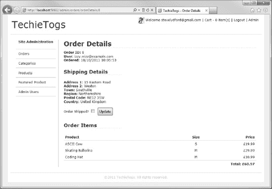

***图 11-7。**订单详情页面*

### 产品类别

TechieTogs 目录中的产品分为不同的类别。所有产品必须被分配到一个类别。

产品类别存储在我们数据库的`Categories`表中，用于动态构建菜单(`Shared/Partials/_Categories.cshtml`)，该菜单显示在网站面向公众的每一页的左侧。

显然，我们需要一种方法来添加、编辑和删除`Categories`表中的项目，这样我们就可以很好地组织产品目录。因此，在主管理文件夹中添加一个名为`Categories`的子文件夹，并在其中创建一个名为`Default.cshtml`的新页面。该页面将用于列出表格中的所有类别，并允许管理员添加新的类别记录(参见[图 11-8](#fig_11_8) )。

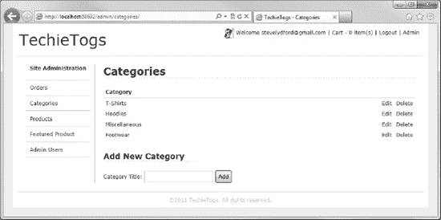

***图 11-8。**类别管理默认页面*

`Admin/Categories/Default.cshtml`页面的完整列表如下:

`@{
    Layout = "~/Shared/Layouts/_AdminLayout.cshtml";
    Page.Title = "Categories";

    var categoryTitle = "";

    var db = Database.Open("TechieTogsData");

    if(IsPost && !Request["categoryTitle"].IsEmpty())
    {
        categoryTitle = Request["categoryTitle"];
        if(!Admin.CategoryExists(categoryTitle))
        {
            var sqlInsert = "INSERT INTO Categories (CategoryTitle) VALUES (@0)";
            db.Execute(sqlInsert, categoryTitle);
        }
        else
        {
            ModelState.AddError("categoryTitle", "Category already exists");
        }
    }

    var sqlCommand = "SELECT * FROM Categories";
    var categories = db.Query(sqlCommand);

}

<h1>Categories</h1>

<table class="grid">
    <tr>
        <th colspan="3" class="gridHeader">Category</th>
    </tr>
    @foreach (var category in categories)
    {
        <tr>
            <td id="mainColumn">
                @category.categoryTitle
            </td>
            <td>
                <a href="EditCategory/@category.categoryId">Edit</a>
            </td>
            <td>
                <a href="DeleteCategory/@category.categoryId">Delete</a>
            </td>
        </tr>
    }
</table>

<h2>Add New Category</h2>
<form action="" method="post">
    

        Category Title:
        @Html.TextBox("categoryTitle", categoryTitle)
        <input type="submit" value="Add" />
        @Html.ValidationMessage("categoryTitle")
    

</form>`

在初始加载时，该页面从数据库中检索所有类别，并将它们显示在一个表中，每个类别旁边有两个链接，将用户发送到编辑和删除页面。

在类别列表下面，显示一个 HTML 表单，允许用户向 categories 表中添加一个新项目。

当表单回发到服务器时，调用`Admin.CategoryExists()`方法来确保不会创建重复的类别。如果该方法返回`false`，记录将被插入到`Categories`表中，页面将再次显示。如果类别已经存在，一个错误被添加到`ModelStateDictionary`，通过调用添加新类别表单中的`Html.ValidationMessage()`助手方法显示给用户。

`Admin.CategoryExists()`方法是我们将创建的自定义 Razor 函数。我们将它创建为一个函数，而不仅仅是将代码直接添加到页面中，因为我们稍后将希望从编辑类别页面再次调用相同的代码。再说一次，我们正在尽最大努力保持干燥！

在站点的`App_Code`文件夹中添加一个名为`Admin.cshtml`的新文件。用以下 Razor 函数替换文件中的任何现有内容:

`@* Admin Functions *@
@functions {

    public static bool CategoryExists(string categoryTitle)
    {
        var db = Database.Open("TechieTogsData");
        var sqlQuery = "SELECT categoryID FROM Categories WHERE categoryTitle = @0";
        return db.Query(sqlQuery, categoryTitle).Count() > 0;
    }

}`

这里可以看到，`CategoryExists()`方法只接受一个字符串参数`categoryTitle`，并返回一个布尔值。在数据库中搜索`categoryTitle`参数的值；如果没有返回行，该方法返回`false`。

#### 编辑类别

编辑类别页面只显示一个文本框，允许管理员更改类别的标题。post 请求处理程序中的代码与默认类别页面中的代码非常相似。当表单被回发时，我们调用`Admin.CategoryExists()` Razor 函数来确保在向数据库提交更新查询之前不会创建重复的类别。注意对`Admin.CategoryExists()`函数的调用不区分大小写。

在`Admin/Categories/EditCategory.cshtml`处添加一个新文件，并用以下代码和标记替换自动生成的内容:

`@{
    Layout = "~/Shared/Layouts/_AdminLayout.cshtml";
    Page.Title = "Edit Category";

    // Get categoryId from URL, or set to 0 if not present
    var categoryId = !UrlData[0].IsEmpty() ? UrlData[0] : "0";
    var categoryTitle = "";

    var db = Database.Open("TechieTogsData");

    if(IsPost)
    {
        categoryId = Request["categoryId"];
        categoryTitle = Request["categoryTitle"];

        // Validation
        if (categoryTitle.IsEmpty())
        {
            ModelState.AddError("categoryTitle", "Category Title cannot be blank");
        }

        if(Admin.CategoryExists(categoryTitle))
        {
            ModelState.AddError("categoryTitle", "Category already exists");
        }

        if(ModelState.IsValid)
        {
            var sqlUpdate = "UPDATE Categories SET CategoryTitle = @0 WHERE CategoryId = @1";
            db.Execute(sqlUpdate, categoryTitle, categoryId);

            Response.Redirect("~/Admin/Categories/");
        }
    }
    else
    {
            var sqlCommand = "SELECT * FROM Categories WHERE CategoryID = @0";
            categoryTitle = db.QuerySingle(sqlCommand, categoryId).CategoryTitle;
    }

}

<h1>Edit Category</h1>

<form action="" method="post">
    

        Category Title:
        @Html.Hidden("categoryId", categoryId)
        @Html.TextBox("categoryTitle", categoryTitle)
        <input type="submit" value="Update" />
        @Html.ValidationMessage("categoryTitle")
    

</form>`

#### 删除类别

删除类别时，我们需要注意不要删除任何当前有相关产品的类别。这个页面的代码相当简单，在我们执行删除之前，调用一个助手函数来确保类别为空。使用从 Categories 页面的 URL 中传递的`CategoryId`在数据库上执行删除。

当用户第一次登录删除类别页面时，如果类别为空，他们会看到一条确认消息和两个按钮。其中一个按钮提交表单(即继续删除)，然后由页面顶部代码块中的 post 请求处理程序进行处理。第二个按钮是“取消”按钮，它在`onclick`属性中使用 JavaScript 将用户直接送回类别页面，而无需提交表单。删除类别页面如图[图 11-9](#fig_11_9) 所示:

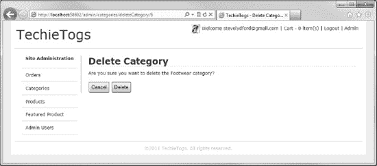

***图 11-9。**删除类别页面*

如果用户进入页面，并且该类别不为空，则向用户显示一条消息，说明该类别不能删除，因为它有关联的产品。

将名为`DeleteCategory.cshtml`的新文件添加到`Admin/Categories`文件夹中，并用以下代码替换任何现有标记:

`@{
    Layout = "~/Shared/Layouts/_AdminLayout.cshtml";
    Page.Title = "Delete Category";

    var categoryId  = UrlData[0];
    if (categoryId.IsEmpty()) {
         Response.Redirect("~/Admin/Categories/");
    }

    var db = Database.Open("TechieTogsData");

    if (IsPost)
    {
        var sqlDelete = "DELETE FROM Categories WHERE CategoryId = @0";
        db.Execute(sqlDelete, categoryId);
        Response.Redirect("~/Admin/Categories/");
    }

    var sqlSelect = "SELECT * FROM Categories WHERE categoryId = @0";
    var category = db.QuerySingle(sqlSelect, categoryId);
}

<h1>Delete Category</h1>

@if (!Admin.CategoryIsEmpty(categoryId))
{
    

        Unable to delete the @category.CategoryTitle category as it has associated products.
    

}
else
{
    

        Are you sure you want to delete the @category.CategoryTitle category?
    

    

        <form action="" method="post" id="deleteForm">
            <input type="button"
                onclick="window.location = '@Href("~/Admin/Categories/")';"
                value="Cancel" />
            <input type="submit" value="Delete" />
        </form>
    

}`

如前所述，该页面调用一个定制的 Razor 函数，在删除之前检查该类别是否为空。这个函数现在必须添加到`App_Code/Admin.cshtml`页面中，这个页面是我们之前创建的，用来包含我们的`CategoryExists()`方法。打开`App_Code/Admin.cshtml`文件，在下面的代码示例中插入用粗体突出显示的函数:

`@* Admin Functions *@
@functions {

    public static bool CategoryExists(string categoryTitle)
    {
        var db = Database.Open("TechieTogsData");
        var sqlQuery = "SELECT categoryID FROM Categories WHERE categoryTitle = @0";
        return db.Query(sqlQuery, categoryTitle).Count() > 0;
    }

**    public static bool CategoryIsEmpty(string categoryId)**
    **{**
        **var db = Database.Open("TechieTogsData");**
        **var sqlQuery = "SELECT ProductID FROM Products WHERE category = @0";**
        **return db.Query(sqlQuery, categoryId).Count() == 0;**
    **}**

}`

这个方法只是在数据库中查询指定类别的产品，如果没有找到匹配的记录，就返回`true`。

### 产品管理

由于产品目录完全是从 TechieTogsData 数据库动态生成的，我们需要提供管理它的工具。

我们网站的产品管理部分将由两个页面组成。第一页将列出目录中所有产品的摘要，显示产品 ID、标题和类别。每个产品旁边都有一个到第二页的链接，第二页将显示完整的产品细节，使用户能够更新它们。产品摘要页面还将显示一个链接，允许用户向目录中添加新产品。

#### 产品汇总页面

“产品摘要”页面显示了数据库中所有产品的列表。对于这个任务，我们将使用 WebGrid 助手，它为我们提供了内置的排序和分页功能。

[图 11-10](#fig_11_10) 显示了在浏览器中运行的产品摘要页面:

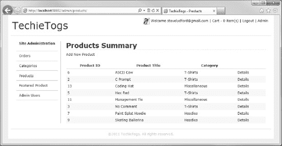

***图 11-10。**产品汇总页面*

这个页面很简单，几乎不需要解释，所以继续在主`Admin`文件夹中创建一个新的`Products`子文件夹，并添加一个名为`Default.cshtml`的新文件。下面的清单显示了`Admin/Products/Default.cshtml`页面的完整代码:

`@{
    Layout = "~/Shared/Layouts/_AdminLayout.cshtml";
    Page.Title = "Products";

    var db = Database.Open("TechieTogsData");
    var sqlCommand = "SELECT Products.ProductId, Products.Title, Categories.CategoryTitle " +
                     "FROM Products " +
                     "INNER JOIN Categories ON Products.Category = Categories.CategoryId " +
                     "ORDER BY title";

    var result = db.Query(sqlCommand);

    var productsGrid = new WebGrid(source: result,
                                    rowsPerPage: 20);

}

<h1>Products Summary</h1>
<a href="productDetails">Add New Product</a>

    @productsGrid.GetHtml(
        tableStyle: "grid",
        headerStyle: "gridHeader",
        alternatingRowStyle: "gridAlt",
        footerStyle: "gridFooter",
        columns: productsGrid.Columns(
            productsGrid.Column("ProductId",
                              "Product ID"),
            productsGrid.Column("Title",
                              "Product Title"),
            productsGrid.Column("CategoryTitle",
                              "Category"),
            productsGrid.Column(null,
                              null,
                              format: @<text>
                                          <a href="ProductDetails/@item.ProductId">
                                              Details
                                          </a>
                                      </text>)
        )
    )

`

毫无疑问，您会注意到“添加新产品”链接与单个产品详细信息链接指向同一个页面。这样做是有意的，这样我们就可以在两个任务中使用相同的页面，因为 UI 是相同的。接下来我们将处理产品详细信息页面。

#### 产品详情页面

产品详细信息页面将用于创建新产品和编辑现有产品。如果在 UrlData 中传递了产品 ID，则从数据库中检索产品详细信息并填充表单。如果 URL 中没有产品 ID，将显示一个空表单，允许创建新产品。

如果我们要创建一个新产品，我们将值`"new`存储在`productID`隐藏字段中。这使我们能够在 post 请求处理程序中将它识别为新产品，并执行 SQL `INSERT`命令，而不是`UPDATE`。

在`Admin/Products`文件夹中创建一个名为`ProductDetails.cshtml`的新文件，并用以下代码替换任何现有内容:

`@{
    Layout = "~/Shared/Layouts/_AdminLayout.cshtml";
    Page.Title = "Edit Category";

    var productId = "new";
    var title = "";
    var price = "";
    var description = "";
    var keywords = "";
    var category = "";

    var db = Database.Open("TechieTogsData");

    // Retrieve product details associated to the Product ID passed in the URL
    if (!UrlData[0].IsEmpty())
    {
        productId = UrlData[0];

        var sqlCommand = "SELECT * FROM Products WHERE productID = @0";
        var product = db.QuerySingle(sqlCommand, productId);

        title = product.title;
        price = product.price.ToString();
        description = product.description;
        keywords = product.keywords;
        category = product.category.ToString();
    }

    if(IsPost)
    {
        productId = Request["productId"];
        title = Request["title"];
        price = Request["price"];
        description = Request["description"];
        keywords = Request["keywords"];
        category = Request["category"];

        // Validation
        if (title.IsEmpty())
        {
            ModelState.AddError("title", "Product Title cannot be blank");
        }

        if (price.IsEmpty())
        {
            ModelState.AddError("price", "Price is required");
        }

        if (description.IsEmpty())
        {
            ModelState.AddError("description", "Description cannot be blank");
        }

        if(ModelState.IsValid)
        {
            var sql = "";
            if (productId == "new")
            {
                // Insert new product record
                sql = "INSERT INTO Products (title, price, description, " +
                      "keywords, category) VALUES (@0, @1, @2, @3, @4)";
            }
            else
            {
                // Update existing product record
                sql = "UPDATE Products SET title = @0, price = @1, " +
                      "description = @2, keywords = @3, category = @4 " +
                      "WHERE productId = @5";
            }

            db.Execute(sql, title, price, description,
                        keywords, category, productId);

            Response.Redirect("~/Admin/Products/");
        }
    }

}

<h1>Product Details</h1>

    <form action="" method="post">
        

            @Html.Hidden("productId", productId)
            @Html.Label("Title:", title) 
            @Html.TextBox("title", title)
            @Html.ValidationMessage("title")
        

        

            @Html.Label("Price:", price) 
            @Html.TextBox("price", price, new { @class="short" })
            @Html.ValidationMessage("price")
        

        

            @Html.Label("Description:", description) 
            @Html.TextArea("description", description, 10, 40, null)
            @Html.ValidationMessage("description")
        

        

            @Html.Label("Keywords:", keywords) 
            @Html.TextBox("keywords", keywords)
        

        

            @Html.Label("Category:", category) 
            @Products.CategoriesDropDownList("category", category)
        
  
        

            <input type="submit" value="Update" />
        

    </form>

`

这个页面使用一个助手`Products.CategoriesDropDownList(),`来显示类别的下拉列表。将下面的助手代码添加到我们之前创建的`App_Code/Products.cshtml`文件中:

`@helper CategoriesDropDownList(string name, string selectedValue)
{
    var optionList = new List<SelectListItem>();
    var db = Database.Open("TechieTogsData");

    var sqlCommand = "SELECT categoryId, categoryTitle FROM Categories " +
                     "ORDER BY categoryTitle";
    var result = db.Query(sqlCommand);

    foreach(var item in result)
    {
        optionList.Add(new SelectListItem { Value = item.categoryId.ToString(),
                                            Text = item.categoryTitle });
    }

    @Html.DropDownList(name, null , optionList, selectedValue, null)
}`

这个助手从数据库中检索一个类别列表，并使用它来输出一个 HTML `<select>`控件。`<select>`控件的名称和在其中选择的项目由参数值设置。

完成后的产品详情页面如图[图 11-11](#fig_11_11) 所示:

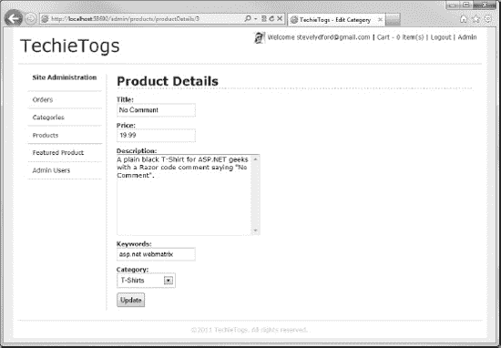

***图 11-11。**产品详情页面*

### 添加产品图片

我们的产品目录是完整的，并且运行良好，但是如果客户在购买前能看到产品的图片，我们更有可能出售产品。在本节中，我们将修改产品详细信息管理页面，以允许站点管理员上传产品图片。然后，我们将在目录中显示产品图像的缩略图，在产品详细信息页面上显示全尺寸图像。

让我们首先对产品详细信息管理页面进行更改，以便为站点管理员提供上传产品图片的选项。

打开我们之前创建的`Admin/Products/ProductDetails.cshtml`页面，对页面主体进行修改，如下面清单中的粗体所示:

`<h1>Product Details</h1>

    <form action="" method="post" **enctype="multipart/form-data"**>
        

            @Html.Hidden("productId", productId)
            @Html.Label("Title:", title) 
            @Html.TextBox("title", title)
            @Html.ValidationMessage("title")
        

        

            @Html.Label("Price:", price) 
            @Html.TextBox("price", price, new { @class="short" })
            @Html.ValidationMessage("price")
        

        

            @Html.Label("Description:", description) 
            @Html.TextArea("description", description, 10, 40, null)
            @Html.ValidationMessage("description")
        

        

            @Html.Label("Keywords:", keywords) 
            @Html.TextBox("keywords", keywords)
        

        

            @Html.Label("Category:", category) 
            @Products.CategoriesDropDownList("category", category)
        
  
       **
**
            **@Html.Label("Product Image:", "productImage") **
            **<input type="file" name="productImage" />**
        **
**
        

            <input type="submit" value="Update" />
        

    </form>

`

第一个变化是将`enctype="multipart/form-data"`属性插入到`<form>`标签中。添加这个属性对于收集在`file`控件中提交的文件信息是必要的。

页面的另一个变化是添加了一个文件输入控件。这将为用户提供从他们的本地文件系统中选择要上传的文件所必需的 UI。

我们会将上传的文件存储在站点根目录下的一个名为`ProductImages`的文件夹中，您现在应该创建这个文件夹了。接下来，我们将在 post 请求处理代码中添加一些代码，以便从用户的机器上获取文件，并将其上传到这个文件夹中。进行以下以粗体显示的更改:

 **注意**将该站点部署到面向公众的服务器时，您可能需要更改`ProductImages`文件夹的默认权限，以允许写访问。您的系统管理员或虚拟主机提供商可以帮助您解决这个问题。

`if(IsPost)
{
    productId = Request["productId"];
    title = Request["title"];
    price = Request["price"];
    description = Request["description"];
    keywords = Request["keywords"];
    category = Request["category"];

    // Validation
    if (title.IsEmpty())
    {
        ModelState.AddError("title", "Product Title cannot be blank");
    }

    if (price.IsEmpty())
    {
        ModelState.AddError("price", "Price is required");
    }

    if (description.IsEmpty())
    {
        ModelState.AddError("description", "Description cannot be blank");
    }

    if(ModelState.IsValid)
    {
        var sql = "";
        if (productId == "new")
        {
            // Insert new product record
            sql = "INSERT INTO Products (title, price, description, " +
                "keywords, category) VALUES (@0, @1, @2, @3, @4)";

**            db.Execute(sql, title, price, description,**
                    **keywords, category, productId);**

            **productId = db.GetLastInsertId().ToString();**
        }
        else
        {
            // Update existing product record
            sql = "UPDATE Products SET title = @0, price = @1, " +
                "description = @2, keywords = @3, category = @4 " +
                "WHERE productId = @5";

**            db.Execute(sql, title, price, description,**
                    **keywords, category, productId);**
        }

        **// Product image**
        **var productImage = WebImage.GetImageFromRequest();**
        **if(productImage != null)**
        **{**
            **// Save main product image**
            **var savePath = @"~\ProductImages\" + productId;**
            **productImage.Save(filePath: savePath + ".png",**
                                **imageFormat: "png",**
                                **forceCorrectExtension: true );**

            **// Resize and save thumbnail**
            **productImage.Resize(height: 120, width: 120,**
                                **preserveAspectRatio: true);**
            **productImage.Save(filePath: savePath + "_thumb.png",**
                                **imageFormat: "png",**
                                **forceCorrectExtension: true );**
        **}**
        Response.Redirect("~/Admin/Products/");
    }
}`

在这段代码中，我们利用 WebImage 助手来处理和上传图像文件。

 **注意**关于 WebImage 助手及其使用的完整解释可以在[第 12 章](12.html#ch12)-附加技术和特性中找到。

首先，如果这是一个新产品，我们需要使用`Database.GetLastInsertId()`方法获得插入产品的 ID。这是必要的，因为我们将使用产品 ID 来创建文件名，我们将使用该文件名在 productImages 文件夹中存储图像。

然后，我们使用`WebImage.GetImageFromRequest()`方法从用户的本地文件系统中检索图像，图像的路径通过`file`控件传递。然后我们构造路径和文件名，我们希望用它在我们的 web 服务器上存储文件。在我们的例子中，我们将所有的图像存储在`ProductImages`文件夹中，使用产品 ID 作为文件名，这将确保每个文件名是唯一的。对`Save()`方法的调用将文件存储在指定的路径中，其中`imageFormat`参数告诉`WebImage`助手将图像文件保存为可移植网络图形(PNG)格式，而不管原始图像的格式如何。

我们希望在产品目录中显示缩略图。我们没有要求用户提供额外的缩略图，而是使用`WebImage.Resize()`方法从上传的产品图像中生成一个缩略图。当调用`Resize()`方法时，我们指定最大值`width`和`height`，并将`preserveAspectRatio`参数设置为`true`，以确保原始图像的纵横比保持不变。最后，我们保存缩略图，将`"_thumb"`附加到产品 ID 以生成文件名。

#### 显示产品图片

当需要在页面上显示图像时，我们可以简单地将一个 HTML ``标签指向`ProductImages`文件夹中上传的图像。但是，如果由于任何原因产品图像没有上传，浏览器将显示一个难看的“丢失图像”图形，如 Internet Explorer 显示的[图 11-12](#fig_11_12) 所示:

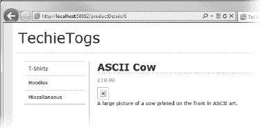

***图 11-12。**一个丢失的图像，如在 Internet Explorer 9 中看到的*

显然，这种行为是不可取的，所以我们将编写一些代码，在特定产品图像不可用的地方显示默认图像。为了代码重用，我们将在一个 helper 方法中实现这段代码，这样我们就可以在应用中任何需要显示产品图片的地方使用它。

在`App_Code/Products.cshtml`处打开文件，并在文件底部插入以下名为`ShowProductImage()`的帮助器方法:

`@helper ShowProductImage(string productId)
{
    var imagePath = @"~/Productimg/" + productId + ".png";
    if (!File.Exists(Server.MapPath(imagePath)))
    {
        imagePath = "~/Productimg/noImage.png";
    }
    
}`

本产品使用。NET `File.Exists()`方法来确定是否存在与产品 ID 匹配的产品图像。`Server.MapPath()`方法用于将指定的 URL 映射到服务器上相应的物理目录。

 **注意**文件上的更多信息。存在()和服务器。MapPath()方法可以在 MSDN 网站的以下两个页面中找到:

`http://msdn.microsoft.com/en-us/library/system.io.file.exists.aspx
http://msdn.microsoft.com/en-us/library/system.web.httpserverutility.mappath.aspx`

如果可以找到请求的图像文件，就会使用 HTML ``标签显示出来。如果相关的图像文件不存在，将显示一个默认图像`noImage.png`，我们需要您创建并存储在`ProductImages`文件夹中。

我们将更改显示产品图片的第一个页面是`/Admin/Products/ProductDetails.cshtml`。将下面的`
`和方法调用添加到页面底部:

`

    @Products.ShowProductImage(productId)

`

现在，当我们访问还没有相关图像的产品的产品详细信息管理页面时，我们将看到以下内容(参见[图 11-13](#fig_11_13) ):

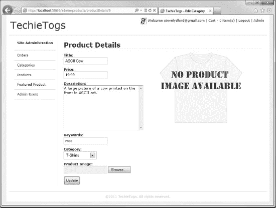

***图 11-13。**显示没有相关图像的产品的产品详情管理页面*

现在，我们将上传一张图片，并继续修改目录中的产品详情页面，以便向用户显示图片。

在站点的根目录中打开`ProductDetails.cshtml`页面，并在`productDetails 
`中添加下面突出显示的段落和方法调用:

`

    

        £@product.price
    

    **
@Products.ShowProductImage(productID)
**
    
@product.description

`

现在，当我们运行该页面并浏览到带有上传图像的产品的产品详情页面时，我们将在浏览器中看到渲染的图像(参见[图 11-14](#fig_11_14) ):

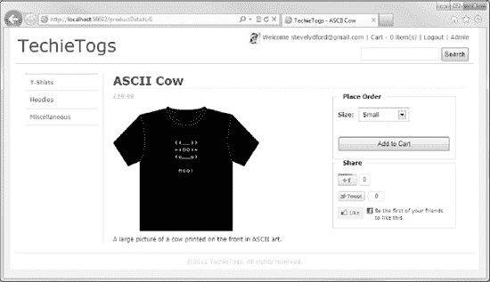

***图 11-14。**显示产品图片的目录的产品详情页面*

最后，我们希望显示我们在目录的产品摘要页面上创建的缩略图。为此，我们需要将下面的`ShowProductThumbnail()`助手方法添加到`App_Code/Products.cshtml`文件的底部:

`@helper ShowProductThumbnail(string productId)
{
    var imagePath = @"~/Productimg/" + productId + "_thumb.png";
    if (!File.Exists(Server.MapPath(imagePath)))
    {
        imagePath = "~/Productimg/noThumb.png";
    }
    
}`

该方法的工作方式与我们之前创建的`ShowProductImage()`助手完全相同，只是它显示产品缩略图。

修改站点根文件夹中的`Products.cshtml`文件中的无序列表，用一个`foreach`循环填充，以包含对`ShowProductThumbnail()`的方法调用，如下面的清单所示:

`<ul id="productsList">
    @foreach (var item in products) {
        <li>
            <h3>
                <a href="/ProductDetails/@item.productID">@item.title</a>
            </h3>
            **
**
                **@Products.ShowProductThumbnail(item.productID.ToString())**
            **
**
            

                £@item.price
            

            

                <a href="/ProductDetails/@item.productID" class="detailsButton">
                    More Details
                </a>
            

        </li>
    }
</ul>`

现在，当我们运行网站并浏览到一个类别时，产品缩略图将显示在目录中(参见[图 11-15](#fig_11_15) ):

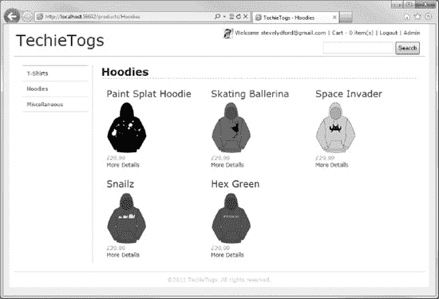

***图 11-15。**目录中显示的产品缩略图*

### 在主页上显示动态内容

TechieTogs 网站的最后一项工作是为主页生成一些动态内容。我们将在本节中创建此内容。

#### 展示“特色产品”

您可能已经注意到，我们在管理菜单中为“特色产品”添加了一个菜单项。我们将创建一个页面，网站管理员可以选择一个项目在主页上“展示”。

首先，我们需要创建一个数据库表来存储特色商品的产品 ID。在 TechieTogsData 数据库中创建一个名为`Settings`的新表。目前，`Settings`表只有一列，`featuredProduct`，不过随着网站的进一步发展，您可能希望在以后添加更多的“设置”。[图 11-16](#fig_11_16) 显示了`Settings`表的细节，您需要将它添加到您站点的数据库中:

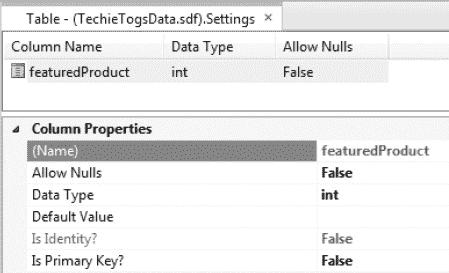

***图 11-16。**设置表的详细信息*

既然必要的数据库表已经就绪，那么在`Admin/Products/Featured.cshtml`向`Admin`文件夹添加一个新页面。用以下代码和标记替换任何现有的页面内容:

`@{
    Layout = "~/Shared/Layouts/_AdminLayout.cshtml";
    Page.Title = "Featured Product";

    var featuredProduct = "";

    var db = Database.Open("TechieTogsData");

    if(IsPost)
    {
        featuredProduct = Request["featuredProduct"];
        var sqlUpdate = "UPDATE Settings SET featuredProduct = @0";
        db.Execute(sqlUpdate, featuredProduct);

        Response.Redirect("~/Admin");
    }

    var sqlCommand = "SELECT featuredProduct FROM Settings";
    featuredProduct = db.QuerySingle(sqlCommand).featuredProduct.ToString();
}

<h1>Featured Product</h1>

<form action="Featured" method="post">
    

        Featured product:
        @Products.ProductsDropDownList("featuredProduct", featuredProduct)
        <input type="submit" value="Save" />
    

</form>`

这段代码几乎不需要解释。它只是使用我们之前创建的`Products.ProductsDropDownList()`助手显示数据库中所有产品的下拉列表，并将该下拉列表的值存储到回发的`Settings`表的`featuredProduct`列中。

现在，我们将对主页进行一些更改，以显示特色产品。打开站点根文件夹中的`Default.cshtml`,用以下内容替换整个当前内容:

`@{
    Layout = "~/Shared/Layouts/_Layout.cshtml";
    Page.Title = "Home Page";

    var db = Database.Open("TechieTogsData");   
    var sqlSelect = "SELECT * FROM Products " +
                    "INNER JOIN Settings ON Products.ProductID = Settings.featuredProduct";

    var product = db.QuerySingle(sqlSelect);
}

@if (product != null)
{   
    <h1 class="homePageHeading">Featured Product</h1>
    
      
        
@Products.ShowProductImage(product.productID.ToString())

    

    

        <a href="/ProductDetails/@product.productID">
            <h2>@product.title</h2>
        </a>
        

            @product.description
        

        

            £@product.price
        

        

            <a href="/ProductDetails/@product.productID" class="detailsButton">
                More Details
            </a>
        

    

}`

该页面使用 SQL `INNER JOIN`从`Products`表中获取特色产品的详细信息，并使用结果在页面上显示产品详细信息。显示的信息包括一个到产品详细信息页面的链接，客户可以从该页面下订单。

将以下 CSS 添加到`Css/Style.css`，以格式化主页上的特色产品:

`/* Home Page
---------------------------------*/
#featuredProductImage {
    float: left;
    width: 380px;
}

#featuredProductDetails
{
    float:left;
    width: 250px;
}

#featuredProductDetails h3
{
    margin-bottom: 20px;
}

#featuredProductDetails .price {
    font-size: 1em;
    font-style: italic;
    color: #999;
    margin: 10px 0px 10px 0px;
}`

#### 流行产品

除了特色产品，我们还将在网站主页上展示四种最受欢迎的产品。我们可以通过查找表中最常出现的四个`productID`来从`OrderItems`表中获得这些信息。将以下代码添加到站点根文件夹中的`Default.cshtml`页面的底部:

`@{
    sqlSelect = "SELECT TOP 4 COUNT(productID) AS productCount, productId " +
                "FROM OrderItems GROUP BY productID ORDER BY productCount DESC";
    var mostPopular = db.Query(sqlSelect);
}
@if (mostPopular.Count() > 0)
{
    

        <h1 class="homePageHeading">Most Popular Products</h1>
        <ul id="popularProductsList">
            @foreach (var item in mostPopular) {
                <li>
                    <a href="/ProductDetails/@item.productID" class="detailsButton">
                        @Products.ShowProductThumbnail(item.productID.ToString())
                    </a>
                </li>
            }
        </ul>
    

}`

这段代码使用 SQL `COUNT`函数来计算每个`productID`在`OrderItems`表中出现的次数。在同一个查询中，我们还使用 SQL `TOP`函数返回前四条记录。然后，只需使用一个`foreach`循环迭代查询结果，并将四种最受欢迎产品的缩略图输出到页面。

将以下 CSS 添加到`Css/Style.css`中，以设计最受欢迎产品部分的样式:

`#popularProducts {
    clear:both;
    padding-top:25px;
}

#popularProductsList {
    list-style: none;
    margin: 0px;
    padding: 0px;
}

#popularProductsList li {
    float: left;
    margin: 12px 32px 12px 32px;
    text-align: center;
}

#popularProductsList li a img {
    border: none;
}` 

这是我们的主页，也是我们的网站。现在，当用户登陆 TechieTogs 主页时，他们将看到类似于[图 11-17](#fig_11_17) 所示的内容:

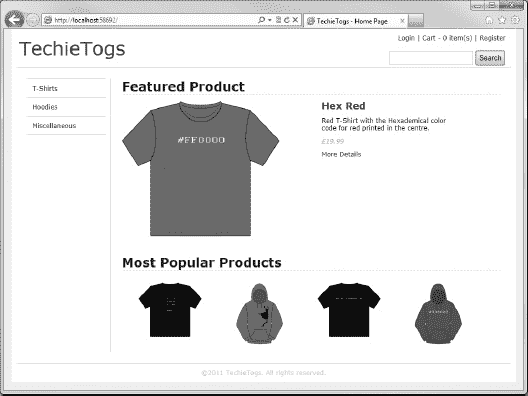

***图 11-17。**已完成的 TechieTogs 主页，显示动态内容*

 **提示**我们在这里为主页生成的动态内容是使用缓存增强性能的主要候选内容。有关使用 WebMatrix 进行缓存的更多信息，请参见[第 12 章](12.html#ch12)附加技术和特性。

### 总结

在过去的三章中，我们已经看到了如何使用 WebMatrix 来生成一个功能齐全的电子商务应用。TechieTogs 站点的创建展示了我们在本书前面章节中介绍的许多特性和技术在现实世界中的应用，并且引入了一些新的特性和技术。