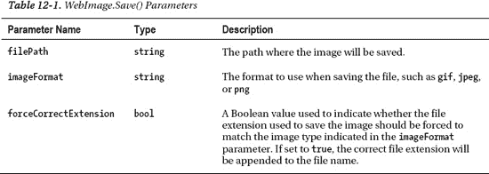

## 12

## 处理图像和视频

随着过去几年互联网连接速度的提高，图像和视频已经成为现代网站越来越重要的一部分。在这一章中，我们将看看如何使用 WebMatrix helpers 来大大提高我们处理图像和视频的便利性。

让我们从讨论在 ASP.NET 网页中上传和操作图片开始这一章。

### 处理图像

WebMatrix 附带了一个 WebImage 帮助器，用于帮助处理网站上的图像。在上一章中，我们已经看到了它的作用，当时我们使用它将产品图片上传到 TechieTogs 示例网站。在本节中，我们将更详细地了解帮助器，并了解如何使用它来:

*   让用户上传图像
*   调整图像大小和裁剪图像
*   翻转和旋转图像
*   给图像添加文本水印
*   将另一幅图像作为水印覆盖

创建一个新的 WebMatrix 站点，以完成本节中的示例。在网站的根目录下，您应该创建一个名为“images”的新文件夹。使用正确的名称在正确的位置创建此文件夹非常重要，因为在完成本章后面的示例时，如果您试图操作不在正确路径中的图像，或者试图将图像保存到不存在的文件夹中，您可能会收到错误消息。

#### 上传图片

为了允许用户上传图片，我们需要为他们提供一个包含 HTML `**file <input>**`控件和提交按钮的表单。当他们提交表单时，我们将使用`**WebImage.GetImageFromRequest()**`方法从他们的本地文件系统中检索文件。接下来，我们将使用全局唯一标识符(GUID)构建一个唯一的文件名，并使用`**WebImage.Save()**`方法将图像保存到 images 文件夹中。

`**WebImage.Save()**`方法有三个参数，详见[表 12-1](#tab_12_1) :

在下面的例子中，我们将上传的图像输出到表单下面的页面，以验证它已经工作。在名为`**UploadingImages.cshtml**`的新页面中输入以下代码:

`**@{**
**    WebImage image = null;**
**    var imageFileName = "";**

**    if(IsPost)**
**    {**
**        image = WebImage.GetImageFromRequest();**
**        if(image != null)**
**        {**
**            imageFileName = Guid.NewGuid().ToString() + "_" +**
**                Path.GetFileName(image.FileName);**

**            image.Save(@"~\images\" + imageFileName);**
**        }**
**    }**
**}**

**<!DOCTYPE html>**

**<html lang="en">**
**<head>**
**    <meta charset="utf-8" />**
**    <title>Uploading Images</title>**
**</head>**
**    <body>**
**        <form action="" method="post" enctype="multipart/form-data">**
**            @Html.Label("Image to upload:", "imageUpload")**` `**            <input type="file" name="imageUpload" /> **
**            <input type="submit" value="Upload Image" />**
**        </form>**

**        <h1>Uploaded Image</h1>**
**        @if(imageFileName != "")**
**        {**
**            
**
**                **
**            
**
**        }**
**    </body>**
**</html>**`

您将看到`**enctype="multipart/form-data"**`参数已经包含在`**<form>**`标签中。为了能够检索`**file <input>**`控件的值，这个附加属性是必需的。属性允许上传不会与表单数据一起提交的文件内容。

我们使用一个 GUID 来创建一个唯一的文件名，用于在我们的 images 文件夹中存储图像。通过构造一个唯一的文件名，我们可以确保图像不会在图像文件夹中被覆盖。如果没有这一点，如果两个图像以相同的文件名保存在同一个文件夹中，一个会覆盖另一个。

向导

GUID 是一个 128 位的全局唯一标识符，如下所示:

`**90a565be-f8a5-4dd9-8076-24abb40a8e08**`

可以随时使用创建新的 GUID。NET `**Guid.NewGuid()**`方法。GUID 创建算法实际上保证了每次都有一个唯一的数字(重复的可能性非常小，因此这样的数字通常被视为唯一的)。这种唯一性使 GUIDs 成为应用的理想选择，例如我们的文件上传示例，其中我们需要确保两个对象永远不会收到相同的名称。显然，GUID 不是最用户友好的标识符，所以我们倾向于只在代码中使用它们。

[图 12-1](#fig_12_1) 显示了运行中的图像上传示例:

***图 12-1。**使用网络图像助手上传图像*

 **注意**正如您在[第 11 章](11.html#ch11)中开发 TechieTogs 示例网站的图像上传功能时所提到的，当将该网站部署到面向公众的服务器时，您可能需要更改 images 文件夹的默认权限以允许读写访问。您的系统管理员或虚拟主机提供商可以帮助您解决这个问题。

#### 调整图像大小

WebImage 助手还公开了一个`**Resize()**`方法，它允许我们改变图像的大小。`**Resize()**`方法有四个参数，列于[表 12-2](#tab_12_2) :

下面的代码示例允许用户上传一个图像，然后保存并以原始大小和缩略图的形式显示给用户。缩略图像以文件名前缀“thumb_”存储，保留纵横比，最大宽度和高度为 120 像素。

将以下代码添加到名为`**ResizingImages.cshtml**`的新页面中:

`**@{**
**    WebImage originalImage = null;**
**    WebImage thumbnailImage = null;**
**    var imageFileName = "";**

**    if(IsPost)**
**    {**
**        originalImage = WebImage.GetImageFromRequest();**
**        if(originalImage != null)**
**        {**
**            imageFileName = Guid.NewGuid().ToString() + "_" +**
**                Path.GetFileName(originalImage.FileName);**

**originalImage.Save(@"~\images\" + imageFileName);** 
**            thumbnailImage = originalImage.Resize(width: 120,**
**                                                 height:120,**
**                                                 preserveAspectRatio: true);**

**            thumbnailImage.Save(@"~\images\thumb_" + imageFileName);**
**        }**
**    }**
**}**

**<!DOCTYPE html>**

**<html lang="en">**
**<head>**
**    <meta charset="utf-8" />**
**    <title>Resizing Images</title>**
**</head>**
**    <body>**
**        <form action="" method="post" enctype="multipart/form-data">**
**            @Html.Label("Image to upload:", "imageUpload")**
**            <input type="file" name="imageUpload" /> **
**            <input type="submit" value="Upload Image" />**
**        </form>**

**        <h1>Uploaded Images</h1>**
**        @if(imageFileName != "")**
**        {**
**            
**
**                Original Image:  **
**                **
**            
**` `**            
**
**                Thumbnail Image:  **
**                **
**            
**
**        }**
**    </body>**
**</html>**`

[图 12-2](#fig_12_2) 显示了`**ResizingImages.cshtml**`页面产生的输出示例:

***图 12-2。**使用 WebImage 调整图像大小。Resize()方法*

#### 裁剪图像

`**WebImage.Crop()**`方法允许我们从图像的每一边移除指定数量的像素。该方法本身使用起来非常简单，最好用示例代码来演示。

添加一个名为`**CroppingImages.cshtml**`的新文件，并插入以下代码，该代码从图像的每一侧移除 50 个像素:

`**@{**
**    WebImage originalImage = null;**
**    WebImage croppedImage = null;**
**    var imageFileName = "";**

**    if(IsPost)**
**    {**
**        originalImage = WebImage.GetImageFromRequest();**
**        if(originalImage != null)**` `**        {**
**            imageFileName = Guid.NewGuid().ToString() + "_" +**
**                Path.GetFileName(originalImage.FileName);**

**            originalImage.Save(@"~\images\" + imageFileName);**

**            croppedImage = originalImage.Crop(top: 50, left: 50,**
**                                              bottom: 50, right: 50);**

**            croppedImage.Save(@"~\images\cropped_" + imageFileName);**
**        }**
**    }**
**}**

**<!DOCTYPE html>**

**<html lang="en">**
**<head>**
**    <meta charset="utf-8" />**
**    <title>Cropping Images</title>**
**</head>**
**    <body>**
**        <form action="" method="post" enctype="multipart/form-data">**
**            @Html.Label("Image to upload:", "imageUpload")**
**            <input type="file" name="imageUpload" /> **
**            <input type="submit" value="Upload Image" />**
**        </form>**

**        <h1>Uploaded Images</h1>**
**        @if(imageFileName != "")**
**        {**
**            
**
**                Original Image:  **
**                **
**            
**
**            
**
**                Cropped Image:  **
**                **
**            
**
**        }**
**    </body>**
**</html>**`

[图 12-3](#fig_12_3) 显示了这段代码的作用:

***图 12-3。**使用网络图像。Crop()方法*

#### 翻转和旋转图像

WebImage helper 公开了四种翻转和旋转图像的方法，列于[表 12-3](#tab_12_3) :

以下示例类似于调整图像大小示例，只是这次图像向右旋转 90 度并水平翻转。

创建一个名为`**FlipAndRotate.cshtml**`的新页面，并用以下内容替换任何现有标记:

`**@{**
**    WebImage originalImage = null;**
**    WebImage flippedAndRotatedImage = null;**` `**    var imageFileName = "";**

**    if(IsPost)**
**    {**
**        originalImage = WebImage.GetImageFromRequest();**
**        if(originalImage != null)**
**        {**
**            imageFileName = Guid.NewGuid().ToString() + "_" +**
**                Path.GetFileName(originalImage.FileName);**

**            originalImage.Save(@"~\images\" + imageFileName);**

**            flippedAndRotatedImage = originalImage.RotateRight().FlipHorizontal();**

**            flippedAndRotatedImage.Save(@"~\images\flippedAndRotated_" + imageFileName);**
**        }**
**    }**
**}**

**<!DOCTYPE html>**

**<html lang="en">**
**<head>**
**    <meta charset="utf-8" />**
**    <title>Resizing Images</title>**
**</head>**
**    <body>**
**        <form action="" method="post" enctype="multipart/form-data">**
**            @Html.Label("Image to upload:", "imageUpload")**
**            <input type="file" name="imageUpload" /> **
**            <input type="submit" value="Upload Image" />**
**        </form>**

**        <h1>Uploaded Images</h1>**
**        @if(imageFileName != "")**
**        {**
**            
**
**                Original Image:  **
**                **
**            
**
**            
**
**                Flipped and Rotated Image:  **
**                **
**            
**
**        }**
**    </body>**
**</html>**`

[图 12-4](#fig_12_4) 显示了这个例子在浏览器中的输出:

***图 12-4。**使用 WebImage 助手旋转和翻转图像*

#### 给图像添加水印

`**WebImage**`助手提供了两种给图像添加水印的方法。第一种方法是将文本作为水印覆盖在图像上，而第二种方法是将另一幅图像作为水印覆盖在原始图像上。我们将依次查看每一项。

##### 将文本添加为水印

通过使用`**WebImage.AddTextWatermark()**`方法，可以将文本作为水印添加到图像中。该方法有几个用于设计水印样式的参数。[表 12-4](#tab_12_4) 详细列出了这些参数:

向您的示例站点添加一个新文件，并将其命名为`**TextWatermark.cshtml**`。我们的示例页面将允许用户上传图像，我们将对其应用文本水印，并将其呈现回浏览器。将以下代码添加到页面中，替换任何现有内容:

`**@{**
**    WebImage originalImage = null;**
**    WebImage watermarkedImage = null;**
**    var imageFileName = "";**

**    if(IsPost)**` `**    {**
**        originalImage = WebImage.GetImageFromRequest();**
**        if(originalImage != null)**
**        {**
**            imageFileName = Guid.NewGuid().ToString() + "_" +**
**                Path.GetFileName(originalImage.FileName);**

**            originalImage.Save(@"~\images\" + imageFileName);**

**            watermarkedImage = originalImage.AddTextWatermark("Sample Watermark",**
**                                                              fontColor:"#00FFFF",**
**                                                              fontSize: 20,**
**                                                              fontFamily: "Tahoma",**
**                                                              horizontalAlign: "Center",**
**                                                              verticalAlign: "Top",**
**                                                              padding: 15);**
**            watermarkedImage.Save(@"~\images\watermarked_" + imageFileName);**
**        }**
**    }**
**}**

**<!DOCTYPE html>**

**<html lang="en">**
**<head>**
**    <meta charset="utf-8" />**
**    <title>Text Watermark</title>**
**</head>**
**    <body>**
**        <form action="" method="post" enctype="multipart/form-data">**
**            @Html.Label("Image to upload:", "imageUpload")**
**            <input type="file" name="imageUpload" /> **
**            <input type="submit" value="Upload Image" />**
**        </form>**

**        <h1>Uploaded Images</h1>**
**        @if(imageFileName != "")**
**        {**
**            
**
**                Original Image:  **
**                **
**            
**
**            
**
**                Watermarked Image:  **
**                **
**            
**
**        }**
**    </body>**
**</html>**`

[图 12-5](#fig_12_5) 显示了该代码应用的水印:

***图 12-5。**使用 AddTextWatermark()方法应用的水印*

##### 使用另一幅图像作为水印

向图像添加水印的另一种方法是在原始图像上叠加另一个图像。为此，我们调用`**AddImageWatermark()**`方法。

`**AddImageWatermark()**`方法可以将存储在文件中的图像或指定的`**WebImage**`对象覆盖到另一个图像上。在我们这里的例子中，我们将创建一个页面，它接受两个上传的图像，存储这两个图像，并将一个图像作为水印显示在另一个图像之上。

创建一个名为`**ImageWatermark.cshtml**`的新页面，并用以下代码示例替换默认标记:

`**@{**
**    WebImage originalImage = null;**
**    WebImage watermarkImage = null;**
**    WebImage watermarkedImage = null;**
**    var originalFileName = "";**
**    var watermarkFileName = "";**

**    if(IsPost)**
**    {**
**        originalImage = WebImage.GetImageFromRequest("originalImage");**
**        watermarkImage = WebImage.GetImageFromRequest("watermarkImage");**
**        if((originalImage != null) && (watermarkImage != null))**
**        {**
**            originalFileName = Guid.NewGuid().ToString() + "_" +**
**                Path.GetFileName(originalImage.FileName);**` `**            originalImage.Save(@"~\images\" + originalFileName);**

**            watermarkFileName = Guid.NewGuid().ToString() + "_" +**
**                Path.GetFileName(watermarkImage.FileName);**
**            watermarkImage.Save(@"~\images\" + watermarkFileName);**

**            watermarkedImage = originalImage.AddImageWatermark(watermarkImage,**
**                                                               width: 150, height: 50,**
**                                                               horizontalAlign:"Right",**
**                                                               verticalAlign:"Top",**
**                                                               opacity:100,  padding:10);**

**            watermarkedImage.Save(@"~\images\watermarked_" + originalFileName);**
**        }**
**    }**
**}**

**<!DOCTYPE html>**

**<html lang="en">**
**<head>**
**    <meta charset="utf-8" />**
**    <title>Image Watermark</title>**
**</head>**
**    <body>**
**        <form action="" method="post" enctype="multipart/form-data">**
**            @Html.Label("Original image:", "originalImage")**
**            <input type="file" name="originalImage" /> **
**            @Html.Label("Watermark image:", "watermarkImage")**
**            <input type="file" name="watermarkImage" /> **
**            <input type="submit" value="Upload Images" />**
**        </form>**

**        <h1>Uploaded Images</h1>**
**        @if(originalFileName != "")**
**        {**
**            
**
**                Original Image:  **
**                **
**            
**
**            
**
**                Watermark Image:  **
**                **
**            
**
**            
**
**                Watermarked Image: **
**                **
**            
**
**        }**
**    </body>**
**</html>**`

运行页面时，会要求您输入原始图像和水印图像。当您点击上传图像按钮时，水印图像将被应用到原始图像上并显示在浏览器中，如图 12-6 中的[所示:](#fig_12_6)

***图 12-6。**使用图像作为水印*

`**AddImageWatermark()**`方法有许多用于定制输出的参数。它们在[表 12-5](#tab_12_5) 中列出:

### 使用视频

ASP.NET 网络助手库包包括一个`**Video**`助手，让你嵌入 Adobe Flash(.swf)、Windows MediaPlayer(。wmv)，以及微软 Silverlight(。xap)视频到您的网页。助手通过自动生成通常用于嵌入视频的`**<object>**`和`**<embed>**` HTML 标签和相关属性，简化了在网页中嵌入视频的过程。

要使用助手，您首先需要使用 WebMatrix 包管理器安装 ASP.NET Web 助手库包。

导航到网站工作区，并使用内容窗格中的链接打开 ASP.NET 网站管理网站。输入密码，并在提示时删除`**/App_Data/Admin/_Password.config**`文件文件名中的前导下划线。接下来，在包管理器中搜索 ASP.NET Web 助手库 1.15 包，并单击 Install 按钮将其添加到您的站点中。

 **注**关于使用 WebMatrix 包管理器安装 ASP.NET Web 助手库包的完整说明，请参见“[第 8 章](08.html#ch8)-使用 Web 助手包。”

一旦 ASP.NET Web 助手库成功安装到您的项目中，您就可以使用由`**Video**`对象公开的三种方法之一将视频嵌入到页面中:`**Video.Flash()**`、`**Video.MediaPlayer**`和`**Video.Silverlight()**`。

接下来的三个部分将依次讨论这些问题。

#### 嵌入 Flash 视频

可以使用`**Video.Flash()**`辅助方法将 Adobe Flash 视频嵌入到页面中。该方法有几个参数，在[表 12-6](#tab_12_6) 中列出:

T2】

在网站的根目录下创建一个名为 Media 的新文件夹，并在其中放置一个 Flash video ( `**.swf**`)文件。

以下代码示例将位于`**Media/wildlife.swf**`的 Flash 视频嵌入到网页中:

`**<!DOCTYPE html>**

**<html lang="en">**
**    <head>**
**        <meta charset="utf-8" />**
**        <title>Flash Video</title>**
**    </head>**
**    <body>**
**        <h1>Flash Video</h1>**
**        @Video.Flash(path: "Media/wildlife.swf",**
**                 width: "640",**
**                 height: "360",**
**                 play: true,**
**                 loop: true,**
**                 menu:  true,**
**                 quality: "best",**
**                 scale: "exactfit",**
**                 windowMode: "transparent")**
**    </body>**
**</html>**`

[图 12-7](#fig_12_7) 显示了浏览器中的结果页面:

***图 12-7。**用视频助手嵌入 Flash 视频*

 **注意**有关 Flash 视频属性的更多信息，请访问 Adobe 网站`[http://kb2.adobe.com/cps/127/tn_12701.html](http://kb2.adobe.com/cps/127/tn_12701.html)`

#### 嵌入 Windows MediaPlayer 视频

可以使用`**Video.MediaPlayer()**`助手方法将 Windows MediaPlayer 视频嵌入到页面中。使用视频助手嵌入的视频将在完全下载后播放；助手中没有用于流式视频的工具。方法参数详见[表 12-7](#tab_12_7) :

以下代码示例在网页中嵌入了一个 MediaPlayer 视频`**Media/wildlife.wmf**`。

 **注意**视频助手能够播放的所有三种视频类型都需要在用户的浏览器中安装相关插件。没有安装相关插件的用户将在浏览器中收到一条提示消息。实际显示的消息取决于用户浏览器和所需插件的组合。

`**<!DOCTYPE html>**

**<html lang="en">**
**    <head>**
**        <meta charset="utf-8" />**
**        <title>MediaPlayer Video</title>**
**    </head>**
**    <body>**
**        <h1>MediaPlayer Video</h1>**
**        @Video.MediaPlayer(**
**            path: "Media/wildlife.wmv",**
**            width: "640",**
**            height: "480",**
**            autoStart: true,**
**            playCount: 1,**
**            uiMode:  "full",**
**            stretchToFit: false,**
**            enableContextMenu: true,**
**            mute: false,**
**            volume: 75)**
**    </body>**
**</html>**`

[图 12-8](#fig_12_8) 显示了在浏览器中显示视频的 MediaPlayer 插件。

***图 12-8。**用`**MediaPlayer()**`辅助方法*在网页中嵌入一个. wmv 电影

 **注意**有关 MediaPlayer 参数的更多信息，请访问 Windows Media 网站`**[http://msdn.microsoft.com/en-us/library/aa392321(VS.85).aspx](http://msdn.microsoft.com/en-us/library/aa392321(VS.85).aspx)**`

#### 嵌入微软 Silverlight 视频

`**Video**` helper 类的最后一个方法允许您嵌入 Microsoft Silverlight(。xap)视频到网页中。`**Video.Silverlight()**`方法的参数在[表 12-8](#tab_12_8) 中列出:

T2】

下面的代码示例将 Silverlight 视频嵌入到网页中。[图 12-9](#fig_12_9) 显示了呈现给浏览器的页面:

`**<!DOCTYPE html>**

**<html lang="en">**
**    <head>**
**        <meta charset="utf-8" />**
**        <title>Silverlight Video</title>**
**    </head>**
**    <body>**
**        <h1>Silverlight Video</h1>**
**        @Video.Silverlight(**
**            path: "media/wildlife.xap",**
**            width: "640",**
**            height: "360")**
**    </body>**
**</html>**` 

***图 12-9。**使用`**Video.Silverlight()**`助手*嵌入的 Silverlight 电影

 **注意**关于 Silverlight 插件参数的更多信息可以在 MSDN 网站上找到:`**[http://msdn.microsoft.com/en-us/library/cc838259(v=VS.95).aspx](http://msdn.microsoft.com/en-us/library/cc838259(v=VS.95).aspx)**`

### 总结

这一章完全是关于通过使用微软 WebMatrix 提供的助手类:`**WebImage**`和`**Video**`将图像和视频嵌入到网页中。

除了简单地嵌入图像，我们还看到了如何使用 WebImage 助手来上传图像并在 web 服务器上操作它们。

在最后一章，我们将讨论如何使用 WebMatrix 来调试您的网页，并将完成的网站部署到面向公众的 web 服务器上。我们还将了解如何使用缓存来提高站点的性能，并且我们将了解作为 WebMatrix IDE 的一部分提供的用于提高站点在搜索引擎中的位置的工具。