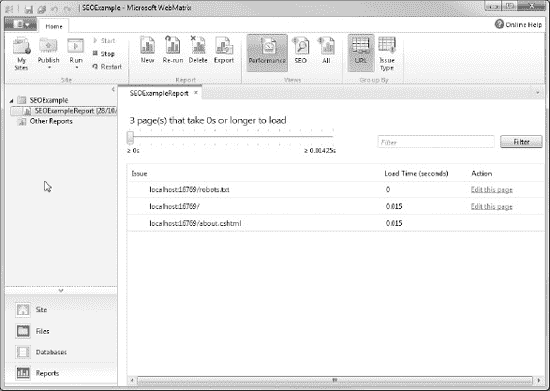

## 13

## 调试、缓存和部署

在这最后一章中，我们将了解一系列主题，包括:

*   调试 ASP.NET 网页

*   通过缓存提高性能

*   搜索引擎优化(SEO)
*   将您的 WebMatrix 站点发布到万维网。

在本章结束时，也就是本书结束时，你将掌握使用 Microsoft WebMatrix 构建和部署动态的、数据驱动的网站所需的所有知识。

让我们以关于调试的讨论开始这一章:发现和消除错误的艺术。

### 调试 ASP.NET 网页

调试实际上是一门艺术。它是许多不同技术的结合，帮助开发人员找到并修复他或她的代码中的错误。

 **注意**在别人的代码中发现和修复错误甚至更难，这就是为什么保持你的代码可读性和良好的文档记录对你来说如此重要:将来你可能不是唯一维护你的代码的人。

整本书都是关于调试的。调试的艺术是一种技能，随着时间的推移，当你获得跟踪和修复 bug 的经验时，你将会磨练这种技能。您将学习哪些技术在某些情况下最有效，以及哪些工具可用于识别问题。

最好的调试技术是在执行任何代码之前进行的。通过经验和逻辑思维的结合，您可以在大多数错误成为问题之前将其消除。

例如，通过使用代码来处理用户输入的意外或异常值，您可以防止许多错误。具体来说，如果您正在开发基于用户输入的有效客户 id 来检索有关客户的数据库记录的代码，您应该预料到如果找不到匹配的记录会发生什么。我们应该让 web 服务器显示一个错误消息，比如一个`NullReferenceException`，还是应该编写代码以更好的方式处理它，比如让程序向用户显示一个有用的消息并提供有用页面的链接？

随着您获得越来越多的用任何语言编写代码的经验，您将能够更好地识别和消除潜在的 bug 和错误，并编写代码来处理或防止它们。然而，不管你有多好，你永远不可能第一次就写出无 bug 的工作代码，每次都是如此。

在这一节中，我们将了解 WebMatrix 可以在这一过程中提供帮助的一些方式。

#### 显示服务器信息

有时，为了跟踪 bug，能够查看有关网站运行环境的信息是很有用的。WebMatrix 提供了`ServerInfo` helper 类，而不是询问单个的服务器属性，它给出了通常被认为是最有用的信息的广泛概述，包括关于服务器硬件、操作系统、当前用户、服务器变量和 HTTP 运行时的数据。

ServerInfo 类提供的信息显示在浏览器中，并被分成四个表。下面的列表描述了您可以在每个表中看到的信息类型:

*   **服务器配置**:服务器当地时间、文化、服务器机器名、操作系统、当前用户名、ASP.NET 版本、操作系统版本等。
    T3】
*   **ASP.NET 服务器变量**:web 应用的物理路径、当前页面的路径、任何当前已认证用户的信息、HTTP 请求方法(即 GET 或 POST)、服务器名称等。
    T3】
*   **HTTP 运行时信息**:重要目录的路径，如。NET Framework CLR 目录和 ASP.NET 安装目录，以及有关缓存的信息。
    T3】
*   **环境变量**:服务器硬件信息，如处理器信息；重要系统文件夹的路径，如程序文件和 Windows 安装；服务器上的`path`环境变量的值。

 **注意**以前使用过 PHP 的读者无疑会注意到 WebMatrix `ServerInfo`助手和`phpinfo()`函数的输出之间的相似之处。

要显示`ServerInfo`助手的输出，必须调用它的`GetHtml()`方法。以下代码产生如图 13-1 中[所示的输出:](#fig_13_1)

`<!DOCTYPE html>

<html lang="en">
    <head>
        <meta charset="utf-8" />
        <title>ServerInfo Example</title>
    </head>
    <body>
        @ServerInfo.GetHtml()
    </body>
</html>` 

***图 13-1。**server info 产生的输出。GetHtml() helper 方法*

 **注意**server info helper 类显示关于 web 服务器的重要和详细信息，其中一些信息可能对怀有恶意的人有用。因此，在将页面部署到面向公众的站点之前，必须确保从页面中删除对 ServerInfo helper 的任何调用。这条规则同样适用于本章中讨论的任何诊断调试代码。

#### 显示对象信息

WebMatrix 包括一个`ObjectInfo`助手类，它显示传递给它的每个对象的类型和值。它可用于查看代码中的变量和对象，并显示有关对象的数据类型信息。如果一个对象包含多个值，比如一个数组，或者一个对象作为数据库查询的结果返回，则帮助器显示每个属性及其值。

证明这一点的最好方法是用一个例子。下面的代码示例设置了各种对象，并通过调用每个对象的`ObjectInfo.Print()`方法，使用`ObjectInfo`助手类来显示它们的信息。[图 13-2](#fig_13_2) 显示了输出。

`@{
    var message = "This example shows the ObjectInfo helper at work.";
    var activityDate = DateTime.Now;
    var cars = new List<String>() { "Ferrari",
                                    "Aston Martin",
                                    "Porsche",
                                    "Lamborghini",
                                    "McLaren" };
}
<!DOCTYPE html>

<html lang="en">
    <head>
        <meta charset="utf-8" />
        <title>ObjectInfo Example</title>
    </head>
    <body>
        

            @message
        

        @ObjectInfo.Print(message)
        @ObjectInfo.Print(activityDate)
        @ObjectInfo.Print(cars)
    </body>
</html>` 

***图 13-2。**object info 产生的输出。Print() helper 方法*

注意，尽管我们使用了`var`关键字来声明对象，而不是首先将它们声明为显式类型，但是所创建的对象的实际类型是由`ObjectInfo`助手显示的。这个特性本身就是一个非常有用的调试工具。

#### 输出表达式

调试代码时，使用代码向浏览器输出表达式非常有用。这使您能够在评估时实时看到重要变量的值或计算结果。

如您所料，可以使用 Razor 标记从页面正文中输出值。当您需要在页面执行的某一点检查一个值时，这种技术通常特别有用。

 **注意**在 Visual Studio 开发环境中有更复杂的调试工具。请参阅本章后面的“使用 Microsoft Visual Studio 调试”一节，了解如何在 Visual Studio 中启动 WebMatrix 项目。

例如，我们可以输出一个`for`循环索引的值，以检查我们是否循环了预期的次数。这可以用来诊断一个常见的错误，称为“一个接一个”错误。当迭代循环迭代一次太多或太少时，会出现一个接一个的错误；当代码中集合中元素的实际数量与元素的从零开始的索引之间存在混淆时，通常会发生这种情况。例如，下面的代码和图 13-3 中的截图显示了一个输出表达式的例子，它被用来诊断一个“差一位”的错误，其中数组的最后一个元素`"McLaren"`从未被输出到页面。

`@{
    var cars = new string[] { "Ferrari",
                              "Aston Martin",
                              "Porsche",` `                              "Lamborghini",
                              "McLaren" };
}
<!DOCTYPE html>

<html lang="en">
    <head>
        <meta charset="utf-8" />
        <title>Output Expression Example</title>
    </head>
    <body>
        <ul>
            @for (int i = 0; i < cars.GetUpperBound(0); i++)
            {
                <li>
                    @cars[i]

                    @* Output "for loop" indexer for debugging *@
                    @i

                </li>
            }
        </ul>
    </body>
</html>`

 **注意**这是*而不是*一个如何迭代数组的好例子。事实上，这是一个很好的例子，说明了如何*而不是*去做这件事。我将它包含在内是为了展示向页面输出表达式如何帮助识别 bug，在本例中是“一个接一个”的错误。

***图 13-3。**在对集合进行迭代时，用于诊断“一个接一个”错误的输出表达式*

我们可以看到，通过在数组内容旁边输出循环的索引，识别问题要容易得多。

如果你想从代码块中输出变量值，你可以使用`Response.Write()`方法。例如，以下代码输出根据会话变量的 username 键存储的值:

`@{
    Session["username"] = "wendy";
    Response.Write(Session["username"]);
}
<!DOCTYPE html>

<html lang="en">
    <head>
        <meta charset="utf-8" />
        <title>Output Expression Example</title>
    </head>
    <body>
        <h1>Home Page</h1>
        
Welcome to the Home Page.

    </body>
</html>`

[图 13-4](#fig_13_4) 显示了发送到浏览器的输出:

***图 13-4。**使用响应将输出发送到浏览器。Write()方法*

 **注意**同样，出于安全原因，在公开发布之前，删除页面中的所有调试输出非常重要。

#### 浏览器调试工具

大多数现代网络浏览器都提供了调试网页的工具，有些是本地的，有些是通过插件。这些工具允许您查看关于发送到浏览器的数据的深入信息。在这一节中，我们将了解如何访问三种最流行的浏览器中可用的工具:Microsoft Internet Explorer、Google Chrome 和 Mozilla Firefox。

##### Internet Explorer 开发工具

微软的 Internet Explorer 8 和 Internet Explorer 9 浏览器中的开发者工具可以简单地通过按 F12 或从工具菜单中选择开发者工具项来访问(参见[图 13-5](#fig_13_5) )。

***图 13-5。** Internet Explorer 开发者工具*

开发人员工具面板允许您浏览页面元素，如 HTML、JavaScript 和 CSS。

打开 Internet Explorer 8 或 Internet Explorer 9，在`[http://www.asp.net](http://www.asp.net)`浏览 ASP.NET 官方网站。现在按 F12 键打开开发者工具面板并浏览页面内容。

Developer Tools 面板的左侧显示了页面源代码，嵌套标签集以分层方式显示。在源代码中移动时，单击加号展开包含嵌套元素的节点，可以突出显示任何 HTML 标记，以显示应用于它们的实际 CSS 规则。应用于任何突出显示的元素的 CSS 显示在右侧。每个项目旁边的复选框允许您暂时取消应用样式。

 **注意**关于 Internet Explorer 开发者工具的信息和教程可以在`[http://msdn.microsoft.com/en-us/ie/aa740478](http://msdn.microsoft.com/en-us/ie/aa740478)`找到

##### 谷歌 Chrome 开发者工具

谷歌的 Chrome 浏览器还带有一套优秀的内置开发工具，也可以通过按 F12 来访问。这些工具(见图 13-6 )提供了类似于 Internet Explorer 开发者工具的功能。

***图 13-6。**谷歌 Chrome 开发者工具*

 **注**关于谷歌 Chrome 开发者工具的更多信息，请访问`[http://code.google.com/chrome/devtools](http://code.google.com/chrome/devtools)/`

##### Mozilla Firefox Firebug

通过 Firebug 插件为 Firefox 浏览器提供了优秀的浏览器内调试工具。Firebug 不是标准 Firefox 安装的一部分，但是可以从`[www.getfirebug.com](http://www.getfirebug.com)`或者通过 Firefox 附加组件管理器免费下载。可以通过在浏览器中按 Ctrl+Shift+A 或通过浏览器窗口左上角的“Firefox”菜单来访问附加组件管理器。一旦安装了附加组件，重启浏览器并按 F12 打开 Firebug(见[图 13-7](#fig_13_7) )。

***图 13-7。【Mozilla Firefox 的 Firebug 插件***

#### 分析 HTTP 请求

WebMatrix IDE 有一个内置的工具，可以让您实时查看请求的状态，从而分析对网站的请求。该工具显示关于每个请求的有用信息，包括 HTTP 动词(GET 或 POST)、请求的 URL、经过的时间和状态。此信息可用于帮助诊断可能由 HTTP 错误导致的错误，如 404-找不到文件。

要在 WebMatrix 中访问此工具，请在工作区中单击站点，然后在导航窗格中单击请求。

通过使用功能区控件中的切换按钮，可以将该工具设置为捕获所有请求或仅捕获错误，并忽略或列出对图像文件的请求。

点击列表中的一个项目，显示关于请求的更多信息。[图 13-8](#fig_13_8) 显示了内置的 WebMatrix 请求工具。

***图 13-8。**网络矩阵请求工具*

 **提示**如果您发现查看每个请求的更多信息比 WebMatrix 请求工具显示的信息更有用，我强烈推荐 Fiddler 工具。Fiddler 可以从`[www.fiddler2.com](http://www.fiddler2.com)`开始完全免费下载。

#### 使用 Microsoft Visual Studio 进行调试

Visual Studio 有一套优秀的调试(和一般开发)工具，比 WebMatrix IDE 中的工具更加全面。

如果您的系统上安装了 Microsoft Visual Studio 2010 版本，包括免费的 Web Developer Express 2010，您可以从 WebMatrix 环境中启动它。为此，单击工作区中的文件，然后在功能区中查看——启动部分现在有一个按钮来启动 Visual Studio(参见[图 13-9](#fig_13_9) )。这样做可以让您充分利用 Visual Studio 产品套件提供的更成熟、更强大的开发环境。

***图 13-9。**在文件工作区的功能区控件中找到的启动 Visual Studio 按钮*

 **提示**如果您想了解更多关于如何使用 Visual Studio 提供的优秀调试工具的信息，请访问 MSDN 网站的“Visual Studio 中的调试”部分，网址为`[http://msdn.microsoft.com/en-us/library/sc65sadd.aspx](http://msdn.microsoft.com/en-us/library/sc65sadd.aspx)`

### 使用缓存提高性能

从网站请求的每个动态页面都要求服务器执行各种任务，以便构造最终输出，然后发送到请求客户端的浏览器。如果构建最终输出需要完成相对较慢的任务，如从数据库或外部 web 服务中检索数据，则网站的性能会受到不利影响。虽然在开发周期中，任务可能看起来并不需要特别长的时间来完成，但是如果实时站点经历了大量的流量，完成这些缓慢任务所花费的时间就会增加。诸如此类的大流量最终会影响服务器处理页面请求的整体速度。

ASP.NET 网页提供了一种输出缓存机制来处理这种情况。如果页面上的数据不一定需要在每次访问时都被重新请求，并且对时间不敏感，我们可以将页面存储在 web 服务器内存的缓存中，而不是每次请求页面时都获取或重新计算数据。这意味着当另一个用户请求数据时，可以直接从缓存中检索页面，而不是从头开始生成。添加到缓存中的数据可以是任何类型的对象，包括复杂类型和集合。

通常，服务器应该缓存经常访问但不经常改变的信息。受益于缓存的页面的一个好例子是我们在第 11 章中创建的 TechieTogs 示例网站的主页。该页面从数据库中检索并显示了一个特色产品和四个最受欢迎的产品。因为这个页面经常被访问，这个页面上的数据不是时间关键的，并且所涉及的数据库查询是相对较慢的任务，所以我们可以将数据存储在缓存中一段时间，而绝对不会对用户产生不利影响。

存储在缓存中的项目的默认过期时间是 20 分钟。但是，您可以在代码中为每个缓存的项调整这个时间长度，时间范围从几分钟到几天。

当您从缓存中检索一个项时，您必须检查它是否仍然存在，即使您确定您是在缓存过期期限内请求它。web 服务器缓存中的条目可能会由于您无法控制的原因而被删除，即使在过期期间也是如此。例如，如果 web 服务器由于某种原因内存不足，它可能会从缓存中清空项目，以便回收一些内存。服务器重新启动也会清除缓存。

ASP.NET 网页包含一个`WebCache`助手类来简化使用服务器缓存的过程。助手类公开了三个方法，在[表 13-1](#tab_13_1) 中有详细描述:

当我们使用`Set()`方法向缓存添加一个条目时，我们需要提供许多参数。表 13-2 详细解释了这些:

`Get()`和`Remove()`方法只接受一个字符串参数，该参数指定要检索或删除的缓存项的键。

为了演示运行中的`WebCache` helper 类，我们将创建一个缓存当前日期和时间一分钟的页面。

 **注意**日期和时间在现实世界中并不适合缓存。它不仅计算速度快，而且对时间非常敏感！然而，它确实很好地展示了高速缓存的作用。

创建一个名为 CachingExample.cshtml 的页面，并插入以下代码来代替 WebMatrix 自动创建的代码:

`@{
    var dateTime = WebCache.Get("dateTime");
    if (dateTime == null)
    {
        dateTime = DateTime.Now;
        WebCache.Set("dateTime", dateTime, 1, false);
    }
}

<!DOCTYPE html>

<html lang="en">
    <head>
        <meta charset="utf-8" />
        <title>Caching Example</title>
    </head>
    <body>
        <h1>Caching Example</h1>
        

           Current Date and Time: @DateTime.Now
        

        

            Cached Date and Time: @dateTime
        

    </body>
</html>`

当请求页面时，检索缓存中的`"dateTime"`项的值。如果项目是`null`，当前日期和时间被设置到缓存中，过期时间为一分钟。

在页面主体中，我们显示当前日期和时间以及存储在缓存中的日期和时间。初始加载时，两个值将相同。但是，当页面在一分钟的过期限制内刷新时，当前日期和时间将会更改，而缓存的值保持不变。如果一分钟后刷新页面，缓存的值将被更新。

[图 13-10](#fig_13_10) 显示了代码示例的输出，其中缓存的时间与实际的当前时间不同:

***图 13-10。**展示 WebCache 助手类使用的缓存示例*

### 用 WebMatrix 进行搜索引擎优化(SEO)

在将您的网站部署到万维网之前，您会希望确保您的网站针对搜索引擎位置进行了优化。对于一个新推出的网站，来自搜索引擎的流量可能意味着成功与失败的区别。因此，非常重要的一点是，你的网站内容的格式要能被自动搜索引擎“蜘蛛”容易地索引，自动搜索引擎“爬行”万维网，自动索引网站和网页。定制网站内容和结构以吸引这些蜘蛛的过程被称为搜索引擎优化(SEO)。

WebMatrix 附带了一个内置工具，它模仿搜索引擎蜘蛛(如 Google、Yahoo 或 Bing 部署的蜘蛛),通过爬行您的网站并记录它遇到的任何 SEO 问题。该工具会准备一份报告，详细说明您的网站存在的任何问题，以及建议潜在补救措施的有用提示。

要查看 SEO 报告工具的运行情况，请基于名为 SEOExample 的空网站模板创建一个新网站。在站点内部，创建一个名为`default.cshtml`的新页面，并插入以下代码:

`<!DOCTYPE html>

<html lang="en">
    <head>
        <meta charset="utf-8" />
        <title></title>
    </head>
    <body>
        
<em>This is the home page.
</em>
        

           <a href="about.cshtml">About Us</a>
        

    </body>
</html>`

创建并保存页面后，在工作区选择器中单击底部标记为 Reports 的图标，导航到 Reports 工作区。进入报告工作区后，您将看到一个类似于[图 13-11](#fig_13_11) 所示的屏幕:

***图 13-11。**报告工作区*

单击功能区控件的“报告”部分中的“新建”按钮，打开“新建报告”对话框。为报告输入一个合适的名称，并输入报告工具 spider 应该开始搜索的页面的完整 URL。在我们的例子中，我们将接受默认 URL，这是网站的默认文档，因为它由 IIS Express 本地托管。

点击箭头显示高级设置面板将允许您设置许多首选项，包括最大抓取页数和最大下载大小(参见[图 13-12](#fig_13_12) )。在我们的例子中，我们只有一个页面要抓取，所以这些设置基本上是不相关的。但是，将来如果您需要在大型站点上运行该工具，这些设置将有助于保持报告的大小易于管理。

***图 13-12。**显示高级设置面板的新报告对话框*

[表 13-3](#tab_13_3) 解释了新报告对话框的高级设置面板中的可用选项:

点击 OK 运行报告，将产生如图[图 13-13](#fig_13_13) 所示的输出:

***图 13-13。**为我们的试验场制作的报告*

报告工具识别的每个问题都被分类为错误、警告或信息。我们可以看到，对于我们的测试页面，已经确定了六个警告和错误。可以移动报告顶部的滑块控件来显示所有问题、仅显示错误和警告或仅显示错误。

通过单击报告中的一个项目，我们可以看到该问题发生在站点中的确切位置的详细信息；事实上，这个问题可能不止出现在一个地方。单击特定违规会显示更多信息，包括建议的补救措施。点击“页面包含无效标记”警告，查看[图 13-14](#fig_13_14) 所示信息:

***图 13-14。**通过选择单个违规，可以查看更具体的信息。*

这个特定的警告告诉我们，我们的`<em>`标签有问题，所以点击右下角的“编辑此页面”链接并修复标记，如下所示:

`<!DOCTYPE html>

<html lang="en">
    <head>
        <meta charset="utf-8" />
        <title></title>
    </head>
    <body>
        **
<em>This is the home page.</em>
**
        

           <a href="about.cshtml">About Us</a>
        

    </body>
</html>`

现在，我们可以保存 default.cshtml 文件，返回到“报告”工作区，并单击功能区控件中的“重新运行”图标，以确定警告是否已经消失。

在导航窗格中，您将看到当您单击重新运行时，WebMatrix 生成了一份完全独立的报告。能够返回并查看代码更改对站点的影响是有用的，特别是对性能的影响，但是过一会儿你会想要删除一些旧的报告。为此，只需在导航窗格中右键单击要删除的报告，然后从上下文菜单中选择删除。将显示一个对话框，要求您确认删除。

在解决你的搜索引擎优化问题时，逐页修复违规可能更容易。为了简化这一过程，可以按 URL 而不是按问题类型对报告进行分组。这可以通过单击功能区控件的“分组依据”部分中的 URL 按钮来完成。点击一个特定的 URL 将列出所有相关的违规(见[图 13-15](#fig_13_15) ):

***图 13-15。**按网址分组搜索引擎优化违规*

#### 业绩报告

当蜘蛛抓取你的网站产生 SEO 报告时，它还会记录每个页面被服务所花费的时间。点击功能区控件的视图部分中的性能按钮可以看到该信息(见[图 13-16](#fig_13_16) ):

***图 13-16。**访问性能报告*

假设我们已经在本地 IIS Express web 服务器上运行了此报告，实际的时间只是一个指示；真实的页面加载时间将取决于各种其他因素，包括带宽、服务器性能、数据库性能、流量等。但是，计时将有助于我们在页面上线之前发现潜在的性能问题。

[图 13-17](#fig_13_17) 显示了您的测试场地的性能报告:

***图 13-17。**WebMatrix 绩效报告*

报告顶部的滑块允许我们过滤报告，仅显示加载时间超过指定时间段的页面。例如，在分析一个大型网站时，如果您只想查看加载时间超过五秒的页面，这将非常有用。

#### 分析其他网站

如果您希望在当前未打开的站点上运行 SEO 报告，请从功能区控件的“报告”部分选择“新建”,然后输入您希望抓取的站点的 URL。请记住，如果您计划分析一个大型商业网站，您应该在高级设置面板中为“要爬网的最大 URL 数”设置指定一个合理的值。

一旦报告完成，您将能够查看 SEO 问题，但显然您将无法编辑违规页面。

 **提示**微软提供了一个名为“IIS 搜索引擎优化(SEO)工具包”的免费下载工具。此工具在功能上类似于 WebMatrix 报告工作区，但功能大大增强。它使用起来更复杂，但是如果你需要的话，它可以提供更高层次的细节和复杂性。要下载该工具，请访问`[http://www.iis.net/download/SEOToolkit](http://www.iis.net/download/SEOToolkit)`

### 部署您的网站

一旦您对您的站点为万维网做好准备感到满意，WebMatrix 可以帮助您将您的站点部署到生产 Web 服务器。

#### 寻找托管服务提供商

WebMatrix 有一个内置的工具来帮助您为您的站点找到合适的 web 主机。如果您已经有一个虚拟主机提供商的帐户，您可能需要跳到下一部分“发布设置”

要开始为您的项目寻找合适的虚拟主机，请单击“您的网站需要虚拟主机吗？”在站点工作区的内容窗格中找到的按钮(参见[图 13-18](#fig_13_18) )。

***图 13-18。** WebMatrix 可以帮助您找到合适的网站托管提供商。*

点击该按钮将带您到“寻找虚拟主机…”微软网站的页面，如图[图 13-19](#fig_13_19) 所示:

***图 13-19。**“寻找虚拟主机……”微软网站的页面*

WebMatrix 将关于您站点的一些基本信息传递到此页面，以帮助缩小托管包的列表，从而只显示那些适合托管您的应用的包。您可以使用页面上的工具进一步过滤该列表(参见[图 13-20](#fig_13_20) )。

更改这些设置时要小心，尤其是脚本语言设置，以确保您不会最终购买不合适的托管包。可以使用滑块设置存储(GB)、SQL 数据库数量、电子邮件帐户数量和每月带宽。在设置这些标准时，有许多因素需要考虑:

*   **存储**:您的网站的初始大小可以通过在您的开发机器上的 Windows 资源管理器中查看您的站点的文件夹属性来找到。然而，这只是一个起点。如果你的网站有潜力随着时间的推移而增长——例如，如果它有用户上传文档的功能——你应该记住这一点。如果您使用的是 SQL Server Compact Edition 数据库，则在计算存储容量时，还将包括保存此数据库所需的磁盘空间(高达 4GB)。
    T3】
*   **SQL 数据库数量**:如果您计划为您的站点使用 SQL Server Compact Edition 数据库，则无需选择具有额外数据库功能的主机，因为 SQL Server Compact Edition 是基于文件的，不需要在服务器上安装额外的软件。但是，如果您计划使用不同版本的 SQL Server，您将需要一个可以提供这些功能的主机。WebMatrix 可以自动生成 SQL 脚本来创建表，并可以插入数据以在您的开发计算机上复制该模式。你需要在你的主机提供商提供的数据库上运行这些脚本，通常是通过主机的控制面板。

*   **每月带宽**:要粗略计算你的站点需要多少带宽，你可以使用下面的公式:

*月带宽=*

*平均页面大小 x(每月平均访客数 x 每次访问的平均页面浏览量)*

请记住，添加一个相当大的应急金额(约 50 %)为突然的交通高峰，由于流行的链接到您的网站或成功的营销活动。如果你的网站为用户提供可下载的内容，你的带宽计算也应该考虑到这一点。通过基于网络的分析工具，如 Google Analytics 或 StatCounter，可以轻松获得每月平均使用统计数据。

***图 3-20。**选择虚拟主机提供商*

要查找特定托管包的更多信息，请单击绿色的了解更多按钮。一旦您找到了符合您标准的产品包，请单击相关公司网站上的注册链接。

#### 发布设置

一旦您选择并购买了合适的托管计划，您选择的提供商通常会向您发送一封电子邮件，其中包含您的帐户和连接信息的详细信息。该连接信息将以设置列表或扩展名为`.PublishSettings`的文件的形式提供。

WebMatrix 可以使用以下任何一种方法发布您的网站；一旦初始设置完成，它们的工作方式完全相同。在接下来的两节中，我们将研究每一种方法。

打开网站工作区，点击内容窗格中的“为您的网站设置远程发布位置”按钮(参见[图 13-21](#fig_13_21) )。

***图 13-21。**点击网站工作区的按钮，打开发布设置对话框*

点击此按钮打开发布设置对话框，如图[图 13-22](#fig_13_22) 所示:

***图 13-22。**发布设置对话框*

##### 使用. PublishSettings 文件

一个`.PublishSettings`文件是一个基于 XML 的文件，包含特定于您的虚拟主机帐户的连接和发布信息。如果您的 web 主机为您提供了一个`.PublishSettings`文件，它可用于使用 WebMatrix 配置站点部署。

单击“导入发布设置”链接，该链接位于“发布设置”对话框右侧的“常见任务”下。这将允许您浏览您的`.PublishSettings`文件。找到文件后，单击“打开”允许 WebMatrix 从文件中检索必要的设置。将使用存储在`.PublishSettings`文件中的信息为您填充发布设置对话框，包括您可能使用的任何非 SQL Server Compact Edition 数据库的连接字符串。

对设置满意后，点击验证连接按钮，让 WebMatrix 测试设置(见[图 13-23](#fig_13_23) )，如果成功，点击保存。

***图 13-23。**单击“验证连接”按钮，让 WebMatrix 测试指定的设置。*

##### 手动配置

如果您没有从您的虚拟主机提供商那里收到`.PublishSettings`文件，您可以使用主机设置手动配置发布设置对话框，通常作为您的帐户确认电子邮件的一部分发送，或者通过主机的控制面板提供。

如果您通过 webMatrix IDE 选择了您的 Web 托管包，您可以直接在发布设置对话框中输入主机设置，如[图 13-22](#fig_13_22) 所示，将协议下拉列表设置为“Web Deploy”如果您没有通过 webMatrix 选择托管包，并且您的 Web 主机不支持 Web Deploy，您应该按照“使用 FTP 配置发布设置”一节中的说明进行操作

下面的列表解释了 Web Deploy 项目的“发布设置”对话框所需的设置:

*   **服务器:**这通常被 web 主机称为“服务器名”或“服务 URL”。
    T3】
*   **用户名和密码**:这些通常是你在注册托管账户时选择的，尽管托管公司可能会出于发布目的提供替代方案。
    T3】
*   **站点名称**:这通常是指托管公司提供的设置列表中的“站点”或“站点/应用”。
    T3】
*   **目的地 URL** :这是将用于浏览您的站点的 URL(即站点的网址)。

一旦您输入了所有必要的设置，单击验证连接按钮(参见[图 13-23](#fig_13_23) )以验证 WebMatrix 可以成功连接到您的托管帐户，然后单击保存。

###### 使用 FTP 配置发布设置

如果您的 web 主机不支持 Web Deploy，可以将 WebMatrix 配置为使用文件传输协议(FTP)发布。从“发布设置”对话框中的“协议”下拉菜单中选择“FTP”将为您呈现一组略有不同的选项，如下所述:

*   服务器:网站托管公司通常称之为“服务器名”或“服务 URL”
    T3】
*   **站点名称**:这通常在主机公司提供的设置列表中被称为“站点根目录”或“默认目录”该设置是可选的。
    T3】
*   **用户名和密码**:通常，这些是您在注册托管账户时选择的。然而，发布的替代方案可以由主机提供商设置。
    T3】
*   **目的地 URL** :这是将用于浏览您的站点的 URL(即站点的网址)。

同样，输入所有必要信息后，点击[图 13-23](#fig_13_23) 中的验证连接按钮，让 WebMatrix 测试设置，然后点击保存。

#### 配置外部数据库连接

如果您的网站使用的数据库不是内置的 SQL Server Compact Edition，那么您的网站将有一个或多个数据库连接字符串存储在`web.config`文件中，该文件指定了每个数据库连接的详细信息。

在开发过程中，这些设置将不同于将站点指向面向公众的站点上的实时数据库所需的设置。通过点击发布设置对话框底部列出的每个数据库旁边的连接字符串文本框，可以指定实时数据库连接设置(见[图 13-24](#fig_13_24) )。

***图 13-24。**在发布设置对话框中配置数据库连接*

这些设置告诉 WebMatrix 构建一个连接字符串，以便它知道如何连接到实时数据。这只会覆盖实时服务器上的`web.config`设置。

#### 发布你的网站

正确配置发布设置后，您现在可以将您的网站上载到万维网了。您可以随时通过单击功能区控件左侧的“发布”按钮来完成此操作。

第一次点击发布按钮时，会出现一个发布兼容性对话框，如图[图 13-25](#fig_13_25) 所示。此对话框让您有机会让 WebMatrix 测试您的发布设置并对进行调整。NET 设置，如有必要。单击“是”继续测试。

***图 13-25。**发布兼容性对话框*

测试完成后，将显示发布预览对话框。[图 13-26](#fig_13_26) 显示了我们在[第 9 章](09.html#ch9)、[第 10 章](10.html#ch10)和[第 11 章](11.html#ch11)中开发的 TechieTogs 站点首次上传的发布预览对话框。

***图 13-26。**发布预览对话框*

发布预览对话框显示了自上次上传到网站以来所有已更改的文件。该对话框使您有机会检查要发布的已更改文件的列表，并在必要时从列表中删除它们；这可以通过取消勾选文件名旁边的复选框来完成。

如果这是你第一次上传这个网站，那么所有的文件都会显示出来。在后续上传中，只有更改过的文件才会出现在此对话框中。

默认情况下，数据库永远不会被选中，因此如果您希望 WebMatrix 上传您的 SQL Server Compact Edition 数据库，您应该确保选中数据库文件旁边的复选框。

一旦您选择了所有需要上传的文件，点击继续发布您的网站。WebMatrix IDE 底部的通知栏会通知您进度(参见[图 13-27](#fig_13_27) )。

***图 13-27。**WebMatrix IDE 通知栏中显示的站点发布进度*

网站的初始发布可能需要几分钟时间，尤其是要上传数据库时。一旦该过程完成，通知栏中将显示一条成功消息，如图[图 13-28](#fig_13_28) 所示:

***图 13-28。**发布完成后在通知栏看到的消息*

现在，初始上传已经完成，您可以在您选择的 URL 上的 web 浏览器中查看该站点。您可以在本地 PC 上继续安全地开发网站，只需要根据需要将更改后的文件上传到 web 服务器。这使得整个发布过程更快，并使您能够将开发站点与实时生产站点完全分开。

### 总结

在这一章中，我们已经介绍了 WebMatrix 的许多功能，这些功能超出了 ASP.NET 网页开发的范围。我们已经看到了如何使用 WebMatrix 来帮助调试页面和修复错误，以及如何在现代 web 浏览器中和通过 Visual Studio 访问更多的调试工具。

我们还看到了如何通过在 web 服务器的内存中缓存数据来提高 web 站点的性能，从而加快检索速度。还讨论了搜索引擎优化(SEO ),我们了解了 WebMatrix 如何通过模仿搜索引擎蜘蛛来“抓取”您的网站，识别可能影响您的页面被搜索引擎索引和放置的问题。

最后，我们看到了 WebMatrix 如何帮助我们选择一个主机提供商，并将我们完成的站点发布到万维网上。

这就把我们带到了书的结尾！所以，感谢阅读；我真的希望你喜欢学习，并祝你在未来的 WebMatrix 项目中一切顺利。