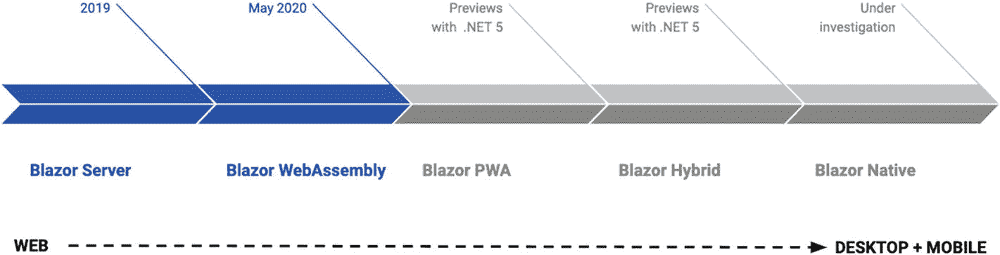
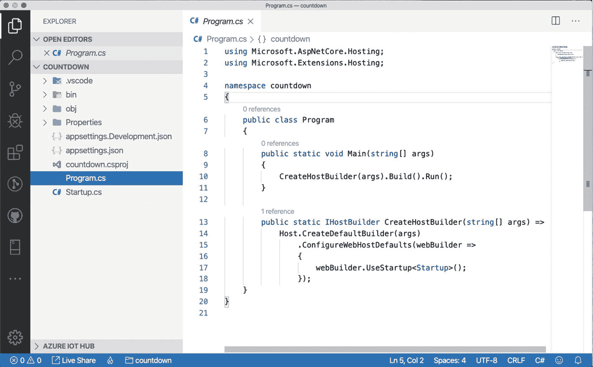
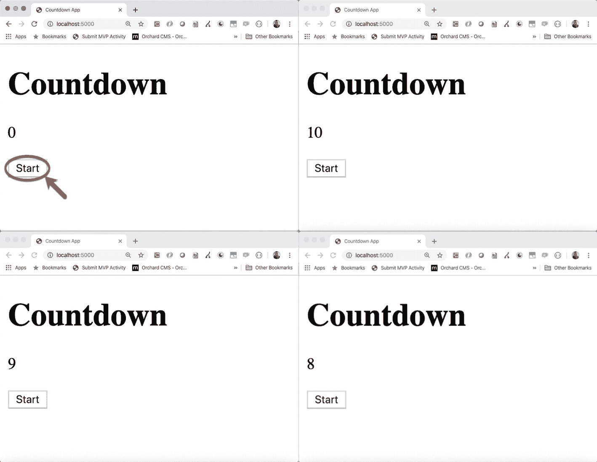

# 一、Blazor 的案例

在 Web 2.0 革命期间，我们第一次有机会将桌面应用移植到 Web 上。多亏了 Ajax 技术，它第一次允许我们对服务器进行异步调用，我们不再需要在每次用户更新界面时重新加载页面。我们最终可以抓住桌面应用开发的核心并解决其主要问题。

有了完整的服务器端应用，我们不再需要安装任何东西，因为我们通过浏览器使用应用，简化了更新的发布并控制了我们的客户端使用的当前版本。

可惜，闪光的不都是金子！如果用户界面完全建立在服务器端，那么将应用转移到服务器端有两个明显的缺点。首先，我们必须始终在线才能联系服务器，其次，表示层的所有计算工作都从客户的计算机传递到服务器。

为了解决这些问题，我们需要将用户界面的构建转移到客户端。但是如果应用在浏览器中运行，我们需要用 JavaScript 编写大量的代码，如果你是. NET 开发人员，这个任务可能会让你做噩梦。如果没有，在这一章中，我们将通过一个简单的例子来探究为什么会这样，这个例子会吓到任何来自强类型语言的人。

微软通过一种叫做 Silverlight 的前端技术，以及一种叫做 Rich Internet Application(RIA)services 的简化的 Windows Communication Foundation(WCF)后端，为开发人员提供了解决这些问题的方案。NET 框架在浏览器中安装一个插件。许多公司投资了这项技术，但几年后，微软决定放弃该项目，这使得今天想接近 Blazor 的人有些胆怯。

但是 Blazor 不一样。Blazor 基于标准技术，而不是微软技术。您不需要在客户端安装任何东西，因为框架为您提供了您需要使用的一切。NET 核心，利用已经存在的东西。如果你是微软的 web 开发人员，并且不想花时间学习 JavaScript 框架，Blazor 就是你的解决方案。我已经帮助许多公司成功采用了它，它的学习曲线很低，并且允许您重用您的。网核心知识。在这一章中，我们将努力克服你对 JavaScript 的恐惧，让你开始创建你的第一个 Blazor 应用。

## 你为什么害怕 JavaScript

作为微软开发人员，我为什么要尽量避免使用 JavaScript？嗯，有几个很好的理由，但是驱动的一个是语言的动态特性，它的运行时类型检查和其他一些特性，我们很快就会看到。另一个重要原因是微软的 web 开发方法，这种方法一直不鼓励开发人员使用 JavaScript。

使用 ASP.NET WebForm，方法是在窗体上拖放控件，设置它们的属性，并在事件处理程序中编写代码。WebForm 引擎为您生成了 HTML 和 JavaScript。只有使用 ASP.NET MVC，开发人员才能最终控制他们的 HTML 和 JavaScript，使用 jQuery 及其插件进行主要的应用开发活动，如验证。还可以通过 ASP.NET MVC 使用 HTML 助手和数据注释来为 jQuery 插件生成正确的配置(jQuery 非介入式验证)。

jQuery 库可以帮助您完成一些简单的任务，比如 DOM 操作和对后端的异步调用，但是将用户界面结构转移到客户端意味着用 JavaScript 编写整个前端，这带来了该语言可能带来的所有维护和生产率问题。我们来看看为什么。

## 代码噩梦

在我所有的 JavaScript 课程中。NET 开发人员，我喜欢通过创建一个`example.js`文件并编写清单 [1-1](#PC1) 中所示的代码来开始课程。这展示了一些 JavaScript 特性，这些特性肯定会给 C# 或 Visual Basic 开发人员留下深刻印象，并立即阐明了语言的困难。NET 开发人员习惯于使用。

```cs
function computes1() {
    a = 10;
}
function computes2() {
    a = 'hello'
}
computes1();
computes2();
console.log(a);

Listing 1-1Some of the JavaScript Problems Summarized in a Single Script

```

不执行代码，结果是什么？你害怕吗？如果你不是，你应该是，因为这段代码是有效的，结果是`hello`。这意味着变量`a`不能在任何地方声明，它的作用域是全局的，并且它的类型可以毫无问题地从`number`变为`string`。在`computes2`函数中，我省略了分号，因为 JavaScript 中不需要它。

语言是区分大小写的，所以`fullname`和`fullName`是不同的变量。如果您不能声明一个变量，并且没有写出变量名，引擎会为您创建另一个全局变量，这会极大地浪费您的调试会话时间。

Note

在 JavaScript 中你可以强制引擎检查变量是用`"use strict";`指令声明的(我看到了 Visual Basic 程序员的微笑)，但它只出现在 ECMAScript 5 中，所以一些老浏览器会忽略它。

如果你是一个有能力的程序员，你总是声明你的变量。在 JavaScript 中，您可以使用`var`关键字来实现这一点，但是让我们看看清单 [1-2](#PC2) 的代码。怎么了?

```cs
function computes() {
    var a = 10;
    if(a == '10') {
        var b = 'ok';
    }
    console.log(b);
}
computes();

Listing 1-2Some JavaScript Peculiarity for a .NET Developer

```

代码的执行结果是`ok`。你糊涂了吗？`if`语句为真，因为在 JavaScript 中,`==`运算符执行操作数之间的类型强制，将一个操作数的值转换为另一个操作数的类型。如果您将变量`a`的值从数字 10 转换为字符串‘10’，则条件的结果为真。如果你不想允许这种转换，你可以使用`===`操作符。

最有趣的是，`b`变量是在`if`块中声明的，所以你可以想象如果条件为真或者为假，`console.log(b)`都会返回一个错误。不幸的是，在 JavaScript 中，声明变量的范围总是在函数级，而不是在块级，所以`b`变量存在于`if`块之外。

`if`条件是否为假，也就是`b`的值？将不会执行`ok`字符串的赋值，所以它的值将是`undefined`。那不是`null`，而是`undefined`，这是一个 JavaScript 变量的可能值，表示已声明但未初始化的状态。我希望我现在能看到你的脸！

Note

在 ECMAScript 6 中，您可以使用关键字`let`而不是`var`来声明一个具有块范围的变量，但是如果您的浏览器不支持它，将会产生一个错误。

## 使用 TypeScript 缓解问题

JavaScript 的另一个问题是浏览器对最新标准的采用。例如，在 ECMAScript 6 (ES6)中，我们有了`class`支持、`let`关键字、箭头函数和其他一些改进，可以帮助编写更易维护的代码，但是一些旧的浏览器不支持 ES6。同样的问题在下一个版本中还会继续，所以我们需要一个解决方案，让我们不至于发疯。

TypeScript 是微软对这个问题的回应:它引入了 transpiler，可以把用新语言(TypeScript)编写的代码翻译成目标 JavaScript 标准。

Note

我有时使用 JavaScript 标准而不是术语 ECMAScript，因为许多开发人员不知道 JavaScript 的历史。如果您对探索历史感兴趣，请花点时间从传奇人物道格拉斯·克洛克福特的“JavaScript 上的克罗克福德”系列中了解一下。(如果不知道他是谁，休息一下了解更多: [`https://www.youtube.com/watch?v=RO1Wnu-xKoY`](https://www.youtube.com/watch?v%253DRO1Wnu-xKoY) )。)

TypeScript 是 JavaScript 的超集，它为该语言添加了一些特性，如类型支持和在任何版本的 JavaScript 中使用所有结构的能力，从而提高了应用的可维护性和生产率。

简而言之，你可以用类似 C# 的语法编写 TypeScript 代码，支持当前和下一个版本的 JavaScript，并用 JavaScript 代码编译它(*trans file*是正确的术语)。最后，它总是 JavaScript，具有我们已经讨论过的所有限制，但是有了 TypeScript，您就有了一个工具，它可以检查变量的类型，并将代码转换为已配置的 JavaScript 标准，同时应用所有推荐的最佳实践。(这个转换过程技术上叫做 *transpiling* ，TypeScript 编译器叫做 *transpiler* 。)

## 为什么需要 JavaScript 框架

TypeScript 是很大的帮助，Angular 等框架和 React 等库都采用了它来缩短代码重构过程。然而，考虑一下用它来编写整个客户机:这就像用 C# 编写应用而没有。NET 框架。好吧，可能比较强了点，但是概念接近现实。

正因如此，类似 Angular 这样的框架诞生了。他们为您提供了使用 JavaScript 构建客户端所需的一切。Angular 为您提供了管理表单的库、调用 REST API 后端的库、将应用组织成可管理的结构的库，以及提供依赖注入工具来提高可测试性和关注点分离的库。

为了改善用户体验，通常有必要创建一个单页应用，以允许在应用内导航，而无需在物理上独立的页面之间导航。为此，这些框架提供了一个路由引擎，它动态地控制不同页面之间的导航；路由引擎动态地操纵单个页面的 DOM，同时还更新浏览器历史。

这些解决方案的不利方面是它们的复杂性，以及在某些情况下所提供的性能。此外，如果您有一些由 API 提供的视图模型或数据传输对象(d to ),您需要在 TypeScript 中复制它们并保持它们对齐。如果您的后端发生变化，没有编译器警告您发生了变化，因为您有两个使用两种不同技术的独立项目。幸运的是，如果你的后端被写入。NET Core，现在你有了 Blazor，一个很有吸引力的替代品！

## 你可以拥有你的蛋糕，也可以和 Blazor 一起吃

微软发布了 Blazor 的生产发布(RTM)版本。NET Core 3，一个新的前端框架，解决了前面提到的所有问题。多亏了它，你可以使用 C# 和。NET Core framework 来编写应用的前端，如果你是微软的 web 开发人员，就要使用你已经知道的所有技术。

您可以使用 Razor、HTML 和 C# 来定义用户界面，并在应用的其余部分使用您想要的任何东西。Blazor 让你直接在浏览器中运行前端，提供了创建单页面应用所需的所有工具。

Blazor 创建于 2017 年，是史蒂夫·桑德森(Steve Sanderson)的个人项目，他在 NDC 奥斯陆( [`https://www.youtube.com/watch?v=MiLAE6HMr10&feature=youtu.be&t=31m45s`](https://www.youtube.com/watch?v%253DMiLAE6HMr10%2526feature%253Dyoutu.be%2526t%253D31m45s) )展示了基于. NET 中间语言(IL)解释器 DotNetAnywhere 的 Blazor 预览。在这次演示之后，Blazor 作为一个实验项目被添加到 ASP.NET GitHub 仓库，但是社区的热情说服了微软将该项目转移到 ASP.NET 团队，用 Mono 替换 DotNetAnywhere，Mono 是基于。NET 框架( [`https://www.mono-project.com/`](https://www.mono-project.com/) )。

与。NET Core 3 的发布，Blazor 已经成为框架的一部分，有了一个雄心勃勃的路线图。正如您在图 [1-1](#Fig1) 中所看到的，目前您可以使用 Blazor 创建 web 应用的前端，但其想法是最终能够使用它构建桌面和移动应用，通过渐进式 web 应用(PWA)方法作为中间步骤。



图 1-1

Blazor 路线图

Blazor Server 是附带的版本。NET Core 3，它允许您预渲染应用的 HTML，在服务器端执行 C# 代码，并通过 SignalR 将用户界面更改推送到页面。Blazor WebAssembly 从 2020 年 5 月开始提供，它直接在浏览器中执行 C# 代码。您可以将 Blazor WebAssembly 与。网芯 3.1.300 或更高版本。

Blazor 混血儿将会是土著。NET 渲染器到电子和 WebView，它将是一个在线和离线工作的原生应用。Electron ( [`electronjs.org`](http://electronjs.org) )是一个流行的开源项目，使用 web 技术创建跨平台的桌面应用。例如，Visual Studio 代码是基于电子的。另一方面，Blazor Native 将拥有相同的编程模型，但没有 HTML 呈现。在本书中，我们谈论 Blazor Server 和 Blazor WebAssembly，因为它们是唯一确定发布日期的项目，但微软对这项技术有长期计划，所以没有时间像现在这样学习它。

## 您的第一个 Blazor 应用

"谈到新的框架，我相信实用的方法！"

阿拉斯托·穆迪在《哈利·波特与火焰杯》中谈到了黑魔法，对我来说，也是一样。我们将从一个简单的应用开始进入框架流程，我们将使用我们需要的最少代码。我们的第一步将是安装所有必要的工具。

### 您需要什么来开始

布拉索是基于。NET Core 3，但是你可以使用你最喜欢的操作系统，按照本书中的例子(以及在其 GitHub repo 上)进行操作。如果你使用 Visual Studio，你就和微软视窗系统绑在了一起。开发环境在真实的开发过程中很重要，但出于教学目的，我通常选择可用于所有支持的操作系统的工具。NET 核心。

第一步是下载安装。网芯 3.1，来自 [`https://dotnet.microsoft.com/download`](https://dotnet.microsoft.com/download) 。此版本包含 Blazor Server(已经可用于生产环境)和 Blazor WebAssembly(已经在预览版中发布)。

对于开发环境，您可以从微软下载免费的跨平台代码编辑器 Visual Studio Code。可以得到它 [`https://code.visualstudio.com/`](https://code.visualstudio.com/) 。

### 入门指南

既然我们已经设置了正确的工具，我们就可以开始使用我们的第一个 Blazor 应用了。我们将使用。NET CLI，随提供的命令行界面。NET 核心，它允许我们创建、构建和执行. NET 核心应用。微软提供了一些模板来开始使用 Blazor，但我发现从零开始是有教育意义的，既可以了解它与古典的不同之处。NET 核心应用并了解 Blazor 的工作原理。在我们的例子中，我们需要创建一个空的 web 应用。为此，打开终端窗口并执行命令`dotnet new web -o countdown`。

那个。NET Core CLI 创建`countdown`文件夹，其中包含新应用的所有启动代码。在 Visual Studio 代码中打开文件夹以查看项目结构。如果你已经熟悉了。NET Core，你会注意到这是一个 web 应用的基础结构(图 [1-2](#Fig2) )。



图 1-2

. NET Core 3.1 web 项目的结构

在 Blazor Server 中，用户界面的服务器端构造基于 Razor Pages，这是微软为 MVC 模式提供的一种替代方法。它基于页面的概念，而不是控制器和视图，它的目标是提高效率并提供即时结果。在`Startup.cs`文件中，我们需要加载 Razor 页面和 Blazor 服务器的配置，如清单 [1-3](#PC3) 所示。

```cs
public void ConfigureServices(IServiceCollection services)
{
    services.AddRazorPages();
    services.AddServerSideBlazor();
}

Listing 1-3Startup Configuration of a Blazor Server Application

```

在`Configure()`方法中，我们需要添加对静态文件的支持、Blazor 服务器中心的端点以及页面的回退。看看清单 [1-4](#PC4) 。

```cs
public void Configure(IApplicationBuilder app, IWebHostEnvironment env)
{
    app.UseStaticFiles();
    app.UseRouting();
    app.UseEndpoints(endpoints =>
    {
        endpoints.MapBlazorHub();
        endpoints.MapFallbackToPage("/_Host");
    });
}

Listing 1-4Blazor Server Endpoints Configuration

```

如果你已经知道 SignalR 是如何工作的，那么`endpoint.MapBlazorHub()`中的单词`Hub`应该很熟悉，但是我们将在第 [2](2.html) 章中进行更详细的讨论。行`endpoints.MapFallbackToPage("/_Host")`设置了如果没有找到指定的资源要导航到的页面，也设置了应用的默认页面。我们需要在名为`Pages`的文件夹中创建一个名为`_Host.cshtml`的文件。默认情况下，文件夹`Pages`是必需的，因为 Razor Pages 引擎会在这个位置搜索页面。`_Host.cshtml`文件包含应用的基本 HTML 和呈现我们第一个 Blazor 组件的代码(清单 [1-5](#PC5) )。

```cs
@page "/"
@namespace countdown.Pages
<!DOCTYPE html>
<html lang="en">
<head>
    <title>Countdown App</title>
</head>
<body>
    @(await Html.RenderComponentAsync<Countdown>(
        RenderMode.ServerPrerendered))
    <script src="_framework/blazor.server.js">
    </script>
</body>
</html>

Listing 1-5Blazor Server Host Page

```

Blazor 使用与所有现代 UI 框架相同的组件概念，其中一组称为 Blazor *components* 的组件组成了像拼图一样的用户界面。因此，Blazor 组件是用户界面的一个可重用部分，可以包含 HTML(及其 C# 代码)和其他 Blazor 组件。

我将在接下来的章节中讨论组件；现在，把它们看作是用户界面中可重用的部分。`RenderComponentAsync()`方法使用服务器预先呈现的形式呈现其通用参数(在我们的例子中是`Countdown`)中指示的组件。这种呈现组件的方法是 Blazor Server 的一个特点，例如，在 Blazor WebAssembly 中没有使用；我们将在第 [2](2.html) 章中深入讨论这些差异。

脚本`_framework/blazor.server.js`加载 Blazor 的 JavaScript 代码，允许与服务器通信。注意，为了允许加载脚本，我们需要调用`Startup`类中的`app.UseStaticFiles()`方法(参见清单 [1-4](#PC4) )。

是时候创建我们的第一个 Blazor 组件了！让我们在根文件夹中创建一个名为`Countdown.razor`的文件。我们的目标是创建一个组件，当用户单击开始按钮时，它实现从 10 到 0 的简单倒计时。让我们从一个中间步骤开始，在这个步骤中，我们定义用户界面，并在有人单击开始按钮时初始化倒计时。参见清单 [1-6](#PC6) 。

```cs
@using Microsoft.AspNetCore.Components.Web

<h1>Countdown</h1>
<p>@count</p>
<button @onclick="startCountdown">Start</button>

@code {
    private int count = 0;
    private void startCountdown()
    {
        count = 10;
    }
}

Listing 1-6Countdown

Razor Component Start Code

```

`@page`指令表示这个组件响应的路径，`using`语句加载 Blazor 框架的元素。标记定义了你的界面:标题、段落和按钮。这是一个简单的 HTML，带有一些 Razor 指令。`@count`指令写入变量`count`的值。当值发生变化时，框架会为您更新段落中的值。当用户点击开始按钮时，`startCountdown()`方法由于`@onclick="startCountdown"`语句而被调用。

`@code`块允许你定义组件的 C# 代码。Razor 文件是一个幕后的 C# 类，因此您可以创建属性和方法来管理组件的状态。在清单 [1-6](#PC6) 中，当`startCountdown()`方法被调用时，我们将属性`count`设置为值 10。为了实现倒计时，我们需要添加一个计时器，将计数减少到 0。让我们改变清单 [1-7](#PC7) 中的`@code`块。

```cs
@code {
    private int count = 0;

    private void startCountdown()
    {
        count = 10;
        Timer timer = new Timer(1000);
        timer.Elapsed += (source, e) => {
            count--;
            if(count == 0) timer.Stop();
        };
        timer.Start();
    }
}

Listing 1-7Countdown Razor Component Code

```

我们创建了一个简单的`Timer`对象，该对象每秒执行订阅了`Elapsed`事件的回调(您需要在页面顶部添加指令`@using System.Timers`来使用`Timer`类)。这很简单，但它不起作用，因为回调中的代码是在一个单独的线程中执行的，当变量`count`减少时，Blazor 框架不会检测到这种变化。

我们可以通过手动警告框架组件状态已经被修改，调用`StateHasChanged()`方法来解决这个问题。但是这个方法必须从用户界面的同一个线程中调用，然后我们需要使用经典的`InvokeAsync()`方法。参见清单 [1-8](#PC8) 。

```cs
private void startCountdown()
{
    count = 10;
    Timer timer = new Timer(1000);
    timer.Elapsed += (source, e) => {
        count--;
        InvokeAsync(() => StateHasChanged());
        if(count == 0) timer.Stop();
    };
    timer.Start();
}

Listing 1-8Countdown Razor Component Code Fixed

```

你可以在图 [1-3](#Fig3) 中看到结果。



图 1-3

我们的第一款 Blazor 服务器应用

## 摘要

在第一章中，我谈到了为什么 Blazor 是一个可行的解决方案。NET 开发人员，他们需要创建一个具有丰富用户界面的现代 web 应用，而不需要花时间学习 JavaScript 语言和框架。

您还了解到 Blazor 的第一个版本是通过。NET Core 3，一个图书馆生态系统和复杂的用例还不可用，但即将到来。此外，您了解到微软对这项技术的愿景是长期的，该公司非常重视 web 标准而不是专有技术的使用。

在下一章，我将介绍 Blazor 的内部工作方式，以及 Blazor 服务器和 Blazor WebAssembly 之间的主要区别，这样你就知道该选择哪一个来满足你的需求。